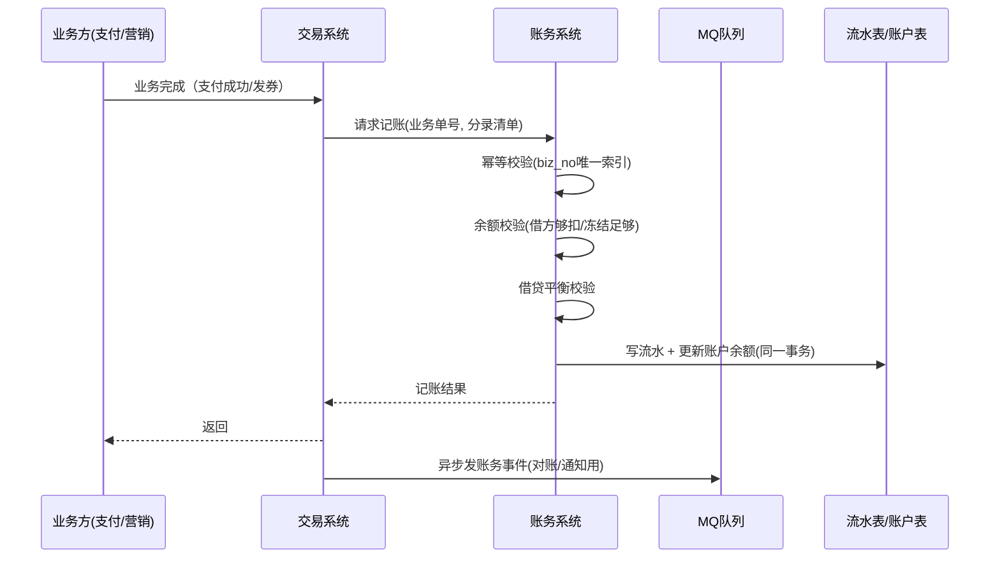

# 钱包与账务系统设计：账户、流水与日终对账

## 〇、本体介绍

**账务系统**：所有资金变动的**唯一权威记账本**。它把"谁的钱因为什么原因变少了多少"记录成**不可抵赖、可复核**的账目（复式记账），是支付、钱包、营销发放、退款等一切资金动作的底座。

**核心矛盾**：
1. 账必须**恒等**：任何时候"总资产 = 总负债 + 总权益"，借贷必平衡；
2. 记录**不可篡改**：不能改历史账，只能"冲正/补记"；
3. 写热点：大促/发券瞬间，**一个账户被海量并发写**（热点账户）；
4. 时点边界：日切时刻在途流水怎么归属，账不能乱。

**核心主线**：科目与账户 → 流水与复式记账 → 入账（记账）流程 → 并发与热点 → 日切 → 日终对账。

---

## 一、科目与账户体系

### 1.1 会计科目（账务系统的骨架）

| 科目大类 | 含义 | 例子 |
|----------|------|------|
| **资产类** | 钱在哪（平台控制的外部资产） | 支付宝备付金、银行账户、应收款 |
| **负债类** | 欠用户的钱 | 用户余额（充值未消费）、代收暂存 |
| **共同类/权益类** | 平台自有/收益 | 手续费收入、营销补贴 |

- **叶子科目才开账户**：只有最细粒度的科目能开资金账户，父科目只做汇总统计。
- 账户与**用户/业务主体**解耦：账户属于"科目 + 业务键"（如 `用户余额 - 用户1`、`营销补贴 - 活动A`）。

> 口诀：**"科目定分类，叶子开账户；账户管余额，流水记轨迹。"**

### 1.2 账户表设计

```sql
CREATE TABLE account (
    id          BIGINT PRIMARY KEY,
    account_no  VARCHAR(32) UNIQUE NOT NULL,  -- 账户号
    subject_id  INT NOT NULL,                  -- 所属叶子科目
    biz_id      VARCHAR(64),                   -- 业务键（用户id/活动id…）
    balance     BIGINT NOT NULL DEFAULT 0,     -- 当前余额（分）
    frozen      BIGINT NOT NULL DEFAULT 0,     -- 冻结金额（分）
    status      TINYINT,                       -- 正常/冻结/销户
    version     INT DEFAULT 0,                 -- 乐观锁版本
    created_at  DATETIME
) COMMENT '账户';
```

- **冻结金额**：下单锁资金（预授权）→ 支付后解冻，防止"下单后余额被花掉"。
- **账户系统是会计系统的前置**：先有账户，才有账可记；两者通常是**两套子系统**，本系统（业务钱包）只做"账户 + 流水"，复式记账/科目校验在账务系统完成。

---

## 二、流水与复式记账（账务的核心）

### 2.1 交易与账务分离

- **交易流水**（支付单/订单）记录"发生了什么"；**账务流水**记录"资金怎么变"。
- 一笔业务交易 → 生成**一组记账凭证**（至少两条分录：一借一贷），**借贷总额必然相等**。

### 2.2 复式记账示例

用户用余额支付 10 元订单：

```
借：应收账款(平台代收)  +1000分
贷：用户余额(用户1)     -1000分
```

| 分录 | 方向 | 金额（分） | 说明 |
|------|------|-----------|------|
| 借 平台应收 | + | 1000 | 平台对渠道应收增加 |
| 贷 用户余额 | - | 1000 | 用户余额减少 |

- **借贷平衡是系统正确性的第一道验证**：每笔凭证记账时校验 `Σ借方 == Σ贷方`，不满足直接拒绝。
- 流水表带**业务单号唯一索引**（幂等键）：同一业务单重复入账，唯一键冲突直接拒绝——从根上防重复记账。

```sql
CREATE TABLE ledger_entry (
    id           BIGINT PRIMARY KEY,
    voucher_no   VARCHAR(32) NOT NULL,   -- 凭证号（一组分录共享）
    biz_no       VARCHAR(32) UNIQUE NOT NULL, -- 业务单号（幂等键）
    account_no   VARCHAR(32) NOT NULL,   -- 账户号
    direction    TINYINT,                -- 1借 2贷
    amount       BIGINT NOT NULL,        -- 金额（分）
    balance_after BIGINT NOT NULL,       -- 记账后余额（快照）
    entry_date   CHAR(8),                -- 记账日（日切归属）
    created_at   DATETIME
) COMMENT '账务流水';
```

### 2.3 更正方式：红冲蓝补（禁止改/删）

- 记错了？**不允许 UPDATE/DELETE 原流水**。
- 冲正：补一笔**红字分录**（金额取负）抵消原分录；纠正：再补一笔正确分录。
- 意义：**历史账永远可审计**，"改了账"本身就是不可接受的。

> 口诀：**"一笔交易两张账，借贷必相等；错账红冲不覆盖，流水只增不删改。"**

---

## 三、入账（记账）流程



1. **幂等**：biz_no 唯一索引，重复请求直接返回已记账结果。
2. **校验**：余额充足性（含冻结）、借贷平衡、科目正确性。
3. **原子**：流水 + 余额更新在同一 DB 事务；**先写流水、后更余额**（或同事务），保证可追溯。
4. **失败**：记账失败不影响业务主流程（业务已完成），走**重试队列 + 对账兜底**，业务侧按结果通知用户。

---

## 四、并发写入与热点账户

### 4.1 余额更新方式对比

| 方式 | 做法 | 适用 |
|------|------|------|
| **乐观锁（version）** | `UPDATE account SET balance=?, version=version+1 WHERE id=? AND version=?` | 通用方案，冲突重试 |
| **条件更新** | `UPDATE account SET balance=balance+? WHERE id=? AND balance+?>=0` | 扣款场景原子防透支 |
| **行锁/悲观锁** | SELECT FOR UPDATE | 低频高价值操作 |
| **缓冲记账** | 热点账户先记"缓冲流水"，批量合并入账 | 超热点账户 |

- **日常首选条件更新/乐观锁**：一条 SQL 原子完成"检查余额 + 扣减"，天然防并发透支（同「[全球多活库存系统设计](全球多活库存系统设计：中东、东南亚双中心方案.md)」的扣库存思想）。
- 热点账户（如平台备付金、爆款活动账户）：**单账户串行写入 + 缓冲记账**——先落缓冲流水，定时/定量合并成批入账，避免行锁排队击垮 DB。

### 4.2 事务边界

- 账务系统内部：单库事务即可（一笔记账只有一条凭证组）。
- **跨系统**（交易→账务）：不搞分布式事务，**本地事务 + 消息最终一致 + 对账兜底**（参考「[幂等设计](幂等设计.md)」与 MQ 方案）。

---

## 五、日切（日终时点归属）

| 方案 | 做法 | 问题 |
|------|------|------|
| **动态余额** | 余额实时变动，日终瞬间结算 | 日切时点有在途流水，归属混乱 |
| **静态日终余额** | 日切前锁账（停止入账一段时间） | 停机窗口 |
| **双余额法（推荐）** | 账户同时维护**动态余额**与**日终余额**：日切时点把动态余额快照为日终余额，后续流水记账日在次日 | 无停机、归属清晰 |

- 具体：流水带 `entry_date`（记账日）；日切后新流水记次日账；日终余额 = 时点快照 + 次日流水增量。
- 对账按 `entry_date` 归集，天然避免跨日流水扯皮。

---

## 六、日终对账（账务正确性的最后防线）

### 6.1 三层核对

| 层级 | 核对内容 | 手段 |
|------|----------|------|
| **内部试算平衡** | 每笔凭证借贷平衡；当日 Σ借 == Σ贷 | SQL 汇总 + 告警 |
| **账户余额核对** | `账户期初 + Σ变动 = 账户期末`；全量余额 = 流水快照 | 定时任务全表核对 |
| **外部对账** | 账务系统 vs 渠道账单/业务系统台账 | 见「[支付系统设计](支付系统设计：回调、幂等与对账.md)」对账章节 |

### 6.2 核对 SQL 思路

```sql
-- 试算平衡：当日借方总额 == 贷方总额
SELECT SUM(CASE WHEN direction=1 THEN amount END) AS debit,
       SUM(CASE WHEN direction=2 THEN amount END) AS credit
FROM ledger_entry WHERE entry_date = '20260806';

-- 账户一致性：期初 + 当日变动 == 期末（差异>0 即告警）
SELECT a.account_no, a.balance,
       COALESCE(e.begin_bal,0) + COALESCE(e.change_amt,0) - a.balance AS diff
FROM account a
LEFT JOIN (SELECT account_no, MIN(balance_after - amount) AS begin_bal,
                  SUM(amount) AS change_amt
           FROM ledger_entry WHERE entry_date='20260806' GROUP BY account_no) e
  ON a.account_no = e.account_no
HAVING ABS(diff) > 0;
```

- 差异处理：**先冻结相关账户、定位流水、红冲蓝补，确认后再恢复**，与「支付对账」同样的"先冻结后处理"原则。
- 告警规则参见「[SRE与稳定性工程/06-日志与告警规则库](../SRE与稳定性工程/06-日志与告警规则库.md)」。

---

## 七、与其他板块的关系

- **支付系统设计**：支付成功入账的落点，支付对账是外部对账的上游。
- **幂等设计**：biz_no 唯一索引是账务幂等的实现（防重复入账）。
- **抢红包系统设计 / 优惠券系统设计 / 签到系统设计**：发放/领取后的资金（券）落地同样走账户+流水。
- **分库分表**：账户与流水量大后按账户号分库分表，热点账户拆子账户。
- **延迟任务**：入账失败重试队列、日终对账的调度。

---

## 八、速查表

| 主题 | 一句话 |
|------|--------|
| 科目 | 资产/负债/共同类；叶子科目才开账户 |
| 账户 | 账户=科目+业务键；余额+冻结两套 |
| 记账 | 复式记账，借贷必相等 |
| 幂等 | 业务单号唯一索引，重复入账拒绝 |
| 更正 | 红冲蓝补，禁改禁删 |
| 并发 | 条件更新/乐观锁；热点账户缓冲记账 |
| 日切 | 双余额法：动态余额 + 日终快照 |
| 对账 | 试算平衡 + 余额核对 + 外部对账三层 |
| 差错 | 冻结→定位→冲正→恢复 |

---

## 面试高频问题（15+ 条）

1. **账务系统是干嘛的？** 资金变动的权威记账本：账户、流水、复式记账、对账，保证资金不错不乱。
2. **什么是复式记账？** 一笔业务记两条分录（一借一贷），借贷总额恒等，可从任何账户追溯整条资金链路。
3. **科目和账户什么关系？** 科目定分类（资产/负债/权益），叶子科目才开账户；账户=科目+业务键。
4. **为什么交易和账务要分离？** 交易表达"发生了什么"，账务表达"钱怎么变"，职责不同、独立演进、可各自对账。
5. **怎么防止重复入账？** 流水表 biz_no（业务单号）唯一索引，冲突即拒绝，天然幂等。
6. **记错账了怎么办？** 红冲蓝补：补负数分录冲正 + 补正确分录，绝不 UPDATE/DELETE 原流水。
7. **扣款怎么防并发透支？** `UPDATE account SET balance=balance-? WHERE id=? AND balance-?>=0` 单条 SQL 原子完成。
8. **热点账户怎么扛？** 缓冲记账（先落缓冲流水，批量合并入账）+ 子账户拆分 + 串行写入。
9. **什么是日切？** 日终时点的账务归属；双余额法（动态+日终快照）无停机解决在途流水。
10. **日终对账对什么？** ① 借贷试算平衡；② 期初+变动=期末；③ 与外部渠道账单逐笔配对。
11. **对账发现差异怎么处理？** 冻结相关账户 → 定位流水 → 红冲/补记 → 复核后恢复，全程留痕。
12. **余额和流水的一致性靠什么保证？** 同事务写入 + 日终全量核对（期初+变动=期末）。
13. **为什么要冻结金额？** 预授权/下单锁资金，防止余额被其它交易花掉（下单≠支付）。
14. **账务系统要不要分布式事务？** 不要；本地事务 + MQ 最终一致 + 对账兜底，资金链路用对账而非强一致。
15. **账务系统性能怎么扩展？** 按账户号分库分表、热点账户拆子账户、缓冲记账削峰。
16. **和钱包的关系？** 钱包是业务视角（展示/充值/消费），账务是资金视角；钱包余额是账户余额的缓存，以账务为准。

---

> 配套：入账来源 →「[支付系统设计](支付系统设计：回调、幂等与对账.md)」；发放场景 →「[优惠券系统设计](优惠券系统设计.md)」「[抢红包系统设计](抢红包系统设计.md)」。
