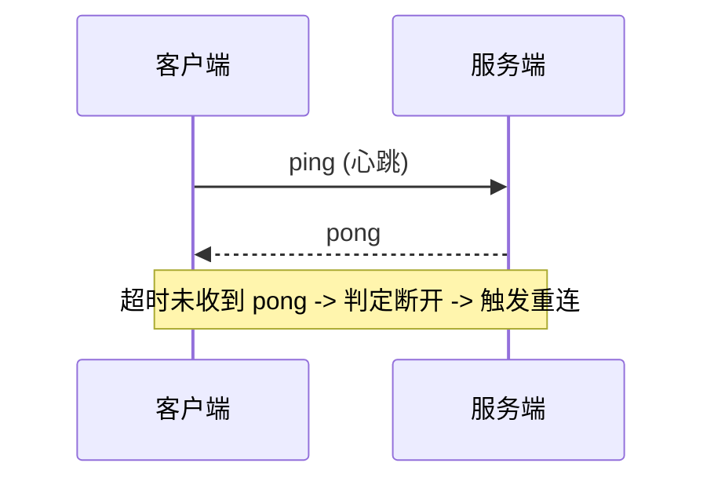

# 长连接

> ⚠️ 当前内容（SpringMVC 异步响应）与标题"长连接"主题不符，待整理归类。

SpringMVC 实现了 DeferredResult 和 Servlet3.0 提供的 AsyncContext 其实没有多大区别，我并没有深入研究过两个实现背后的源码，但从使用层面上来看，AsyncContext 更加的灵活，例如其可以自定义响应码，而 DeferredResult 在上层做了封装，可以快速的帮助开发者实现一个异步响应，但没法细粒度地控制响应。所以下文的示例中，我选择了 AsyncContext。

> 注：上方原片段讨论的是 SpringMVC 的**异步响应（AsyncContext / DeferredResult）**，属于释放容器线程、提升吞吐的"HTTP 异步"范畴，与标题"长连接"主题有偏差。下面补充真正的长连接设计内容，归类时建议将原片段移至"异步 Servlet"主题。

## 二、长连接是什么

长连接（Long Connection）指**一次 TCP 连接建立后保持打开，复用于多次请求/消息收发**，与 HTTP 短连接（每次请求新建连接）相对。典型场景：**IM 即时通讯、消息推送、直播弹幕、物联网设备上报**。

- 传输层：TCP 长连接 + 心跳保活。
- 应用层：WebSocket / MQTT / 私有协议（如 TCP + 自定义编解码）。

## 三、连接保活（Keepalive）

- **TCP Keepalive**：内核级探测（tcp_keepalive_time/idle/probes），但默认间隔长、不可靠，仅用于清理半打开连接。
- **应用层心跳**：客户端定时发 ping，服务端回 pong，超时（如 2×心跳周期）判定断线。

## 四、断线重连

- **指数退避**：重连间隔 1s→2s→4s… 上限（如 60s），避免雪崩。
- **随机抖动（jitter）**：加随机量防止大量客户端同时重连。
- **连接迁移**：移动端切网络（WiFi↔4G）需重连并恢复会话（token 续期）。

## 五、消息可靠投递

| 级别 | 语义 | 实现 |
|------|------|------|
| At most once | 至多一次 | 发完即弃，可能丢 |
| At least once | 至少一次 | 消息ID+ACK+重试，可能重 |
| Exactly once | 精确一次 | 去重表/幂等消费（业务侧去重） |

- **离线消息**：服务端按 `userId` 落离线库，重连后拉取。
- **序号与去重**：每条消息带 seq，客户端按序组装，服务端用 `(userId, msgId)` 去重。

## 六、网关选型

| 组件 | 特点 | 适用 |
|------|------|------|
| Netty 自研 | 高性能、可定制协议 | 大规模 IM |
| Nginx + Lua | 七层代理、限流 | 轻量推送 |
| Envoy/gRPC-GW | 云原生、可观测 | 服务网格内 |
| EMQX（MQTT） | 物联网标准协议 | IoT 设备 |

## 七、踩坑与权衡
- **连接数瓶颈**：单机端口/内存限制，需调整 `ulimit`、`net.ipv4.ip_local_port_range`，用连接多路复用。
- **雪崩重连**：断网恢复瞬间海量重连，需退避+抖动+接入层限流。
- **与原片段的关系**：`AsyncContext` 常用于**服务端推送（SSE/长轮询）**的底层实现，与长连接中"服务端主动下行"有交集，但长连接更强调连接复用与全双工，二者不可混为一谈。
