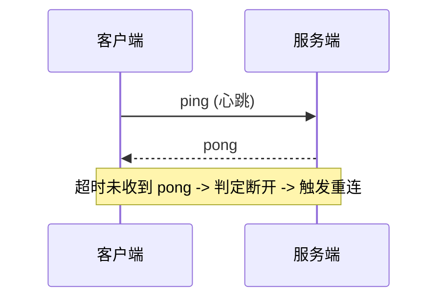
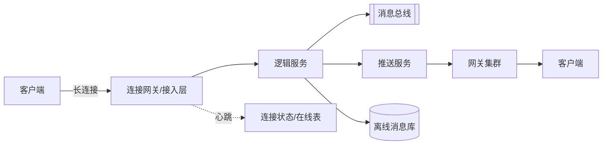
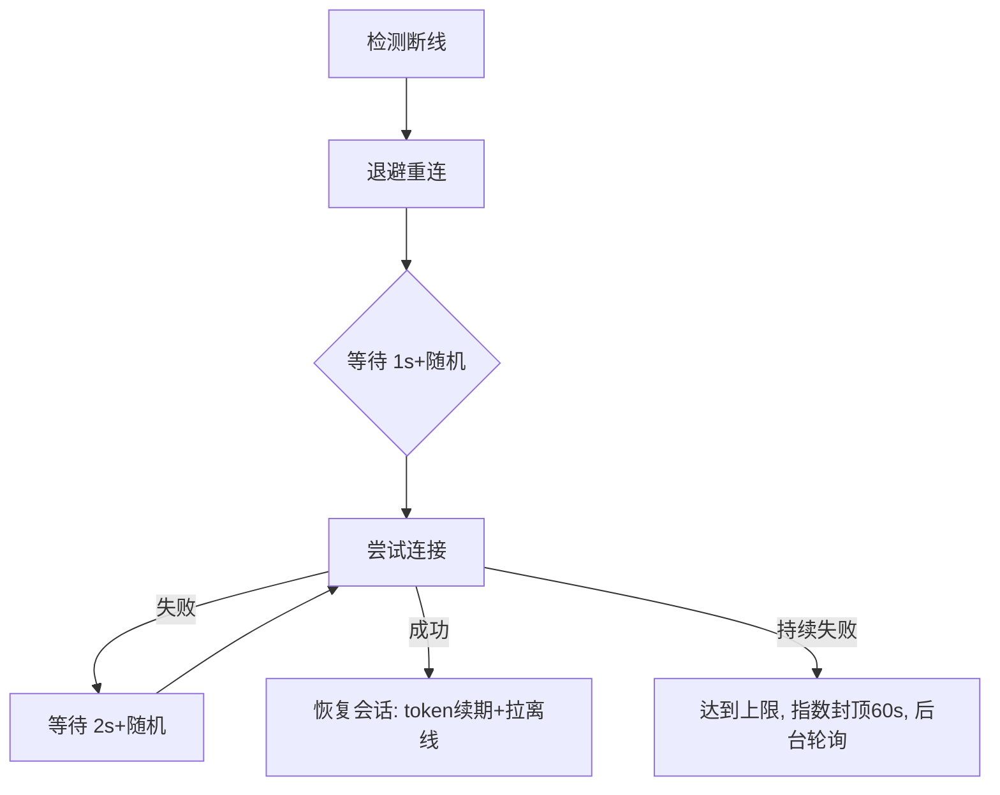

# 长连接

> ⚠️ 当前内容（SpringMVC 异步响应）与标题"长连接"主题不符，待整理归类。

SpringMVC 实现了 DeferredResult 和 Servlet3.0 提供的 AsyncContext 其实没有多大区别，我并没有深入研究过两个实现背后的源码，但从使用层面上来看，AsyncContext 更加的灵活，例如其可以自定义响应码，而 DeferredResult 在上层做了封装，可以快速的帮助开发者实现一个异步响应，但没法细粒度地控制响应。所以下文的示例中，我选择了 AsyncContext。

> 注：上方原片段讨论的是 SpringMVC 的**异步响应（AsyncContext / DeferredResult）**，属于释放容器线程、提升吞吐的"HTTP 异步"范畴，与标题"长连接"主题有偏差。下面补充真正的长连接设计内容，归类时建议将原片段移至"异步 Servlet"主题。

## 二、长连接是什么

长连接（Long Connection）指**一次 TCP 连接建立后保持打开，复用于多次请求/消息收发**，与 HTTP 短连接（每次请求新建连接）相对。典型场景：**IM 即时通讯、消息推送、直播弹幕、物联网设备上报**。

- 传输层：TCP 长连接 + 心跳保活。
- 应用层：WebSocket / MQTT / 私有协议（如 TCP + 自定义编解码）。

## 三、连接保活（Keepalive）

- **TCP Keepalive**：内核级探测（tcp_keepalive_time/idle/probes），但默认间隔长、不可靠，仅用于清理半打开连接。
- **应用层心跳**：客户端定时发 ping，服务端回 pong，超时（如 2×心跳周期）判定断线。



## 四、断线重连

- **指数退避**：重连间隔 1s→2s→4s… 上限（如 60s），避免雪崩。
- **随机抖动（jitter）**：加随机量防止大量客户端同时重连。
- **连接迁移**：移动端切网络（WiFi↔4G）需重连并恢复会话（token 续期）。

## 五、消息可靠投递

| 级别 | 语义 | 实现 |
|------|------|------|
| At most once | 至多一次 | 发完即弃，可能丢 |
| At least once | 至少一次 | 消息ID+ACK+重试，可能重 |
| Exactly once | 精确一次 | 去重表/幂等消费（业务侧去重） |

- **离线消息**：服务端按 `userId` 落离线库，重连后拉取。
- **序号与去重**：每条消息带 seq，客户端按序组装，服务端用 `(userId, msgId)` 去重。

## 六、网关选型

| 组件 | 特点 | 适用 |
|------|------|------|
| Netty 自研 | 高性能、可定制协议 | 大规模 IM |
| Nginx + Lua | 七层代理、限流 | 轻量推送 |
| Envoy/gRPC-GW | 云原生、可观测 | 服务网格内 |
| EMQX（MQTT） | 物联网标准协议 | IoT 设备 |

## 七、踩坑与权衡
- **连接数瓶颈**：单机端口/内存限制，需调整 `ulimit`、`net.ipv4.ip_local_port_range`，用连接多路复用。
- **雪崩重连**：断网恢复瞬间海量重连，需退避+抖动+接入层限流。
- **与原片段的关系**：`AsyncContext` 常用于**服务端推送（SSE/长轮询）**的底层实现，与长连接中"服务端主动下行"有交集，但长连接更强调连接复用与全双工，二者不可混为一谈。

## 八、IM / 推送完整架构



- **接入层（Gateway）**：Netty 集群维护 TCP 连接，负责编解码、心跳、鉴权；无业务状态。
- **逻辑层**：处理消息路由、群聊、好友关系；可水平扩展。
- **连接管理**：在线状态存 Redis/`userId → gatewayNode`，用于寻址下发。
- **推送**：消息经 MQ 分发到目标用户所在网关节点，按 `userId` 路由。

## 九、连接保活（深入）

- **TCP Keepalive 调优**：
```bash
sysctl -w net.ipv4.tcp_keepalive_time=600
sysctl -w net.ipv4.tcp_keepalive_intvl=60
sysctl -w net.ipv4.tcp_keepalive_probes=3
```
- **应用心跳**：客户端每 30s 发 ping，服务端 90s 无 pong 则断连回收；移动端可根据前后台调整（后台 5min）。
- **协议层 keepalive**：WebSocket `ping/pong`、MQTT `keepalive` 字段、HTTP/2 `PING frame`。

## 十、弱网重连与退避



- **指数退避 + 抖动**：`delay = min(cap, base * 2^n) + rand(0, base)`。
- **连接迁移**：切 WiFi/4G 时网络句柄失效，需重建连接并 `resume session`（用长连接 token 续期，免重新登录）。
- **消息补发**：重连后先拉取离线消息 + 服务端重推未 ACK 消息。

## 十一、消息可靠投递（QoS / ACK / 重推）

| QoS | 语义 | 实现 |
|-----|------|------|
| 0 | 至多一次 | 发完即弃 |
| 1 | 至少一次 | msgId + ACK + 超时重推（可能重复） |
| 2 | 精确一次 | 收发双向 ACK + 去重表（成本高，少用到） |

- **ACK 机制**：客户端收到消息回 ACK；服务端维护"已发未确认"队列，超时（如 30s）重推。
- **去重**：客户端用 `(conversationId, msgSeq)` 去重，保证最多展示一次。
- **顺序**：单会话内按 `seq` 排序，乱序先缓存。
- **离线**：服务端按 `userId` 落离线库，重连后拉取；群聊用"已读游标"增量同步。

```java
// 简化：服务端下发与重推
void send(long userId, Msg m) {
    m.seq = seqGen.next();
    store(m);                 // 持久化
    if (!push(userId, m)) retryQueue.add(m);
}
void onAck(long userId, long seq) {
    retryQueue.remove(userId, seq); // 确认，停止重推
}
```

## 十二、连接网关（LB / 多活）

- **接入层 LB**：LVS/DPVS 四层 + 一致性哈希，将同用户稳定落到同一网关（减少迁移）。
- **多活**：多机房部署网关，GSLB 按地域就近接入；连接状态不跨机房同步（断线即重连到新机房），靠"在线表 + 重连"恢复。
- **鉴权**：连接建立时下发长连接 token，后续心跳/消息携带；token 过期前续期。
- **限流**：单网关连接数上限保护，超出拒绝新连接并引导重连其他节点。

## 十三、亿级连接容量规划

假设 1 亿长连接：
- **单机连接数**：Netty 单机能扛 ~10-30 万连接（受内存/文件描述符限制）。1 亿 / 20 万 ≈ 500 台网关。
- **内存**：每连接约 4-10KB（缓冲区+对象），20 万连接 ≈ 1-2GB，需调大堆外内存与 `ulimit -n`。
- **文件描述符**：`ulimit -n 1000000`；`net.ipv4.ip_local_port_range` 仅影响出站，入站靠 `listen` 端口复用。
- **带宽**：心跳 30s 一次，1 亿连接 × 几十字节 ≈ 百 MB/s 级，可控。
- **水平扩展**：网关无状态，加机器即可；在线表用 Redis 分片。

```bash
# 单机调优要点
ulimit -n 1000000
sysctl -w fs.file-max=2000000
sysctl -w net.core.somaxconn=65535
```

## 十四、踩坑与权衡（深入）

- **C10M 挑战**：单机百万连接需优化 NIO 线程模型（多 Reactor）、减少每连接对象分配（对象池）。
- **半打开连接**：客户端异常掉线，服务端靠心跳而非 TCP 断连及时发现，否则连接泄漏。
- **推送风暴**：群聊/广播瞬间海量下行，需网关限流 + 分桶推送，避免打垮单节点。
- **协议选择**：IM 用私有 TCP 协议最省；IoT 用 MQTT；浏览器用 WebSocket，按场景选型。

## 十五、Netty 关键参数与连接状态存储

### Netty 调优
```java
new ServerBootstrap()
    .option(ChannelOption.SO_BACKLOG, 1024)        // 全连接队列
    .childOption(ChannelOption.SO_KEEPALIVE, true)
    .childOption(ChannelOption.TCP_NODELAY, true)  // 禁用 Nagle
    .childOption(ChannelOption.WRITE_BUFFER_WATER_MARK,
        new WriteBufferWaterMark(32*1024, 64*1024)) // 高水位防 OOM
    .group(boss, worker)
    .childHandler(...);
```
- **boss/worker 线程比**：boss = CPU 核数，worker = CPU×2，业务耗时操作丢到独立线程池，避免阻塞 IO 线程。
- **空闲检测**：`IdleStateHandler(0, 0, 90)` 90s 无读触发 `userEventTriggered` 断连。

### 在线状态存储（Redis）
```text
# 用户 → 网关节点 + 连接时间
HSET online:{userId} gateway node-03  connectedAt 1710000000
# 网关 → 连接数（用于负载与容灾）
INCR gateway:node-03:conn
# 寻址下发：逻辑层查 userId 落在哪个网关
```
- 重连后先 `HGET` 找到原网关，若原网关已故障则重新分配并通知客户端。
- 心跳超时 `HDEL` + `DECR`，保证在线表准确，否则会推错节点。
