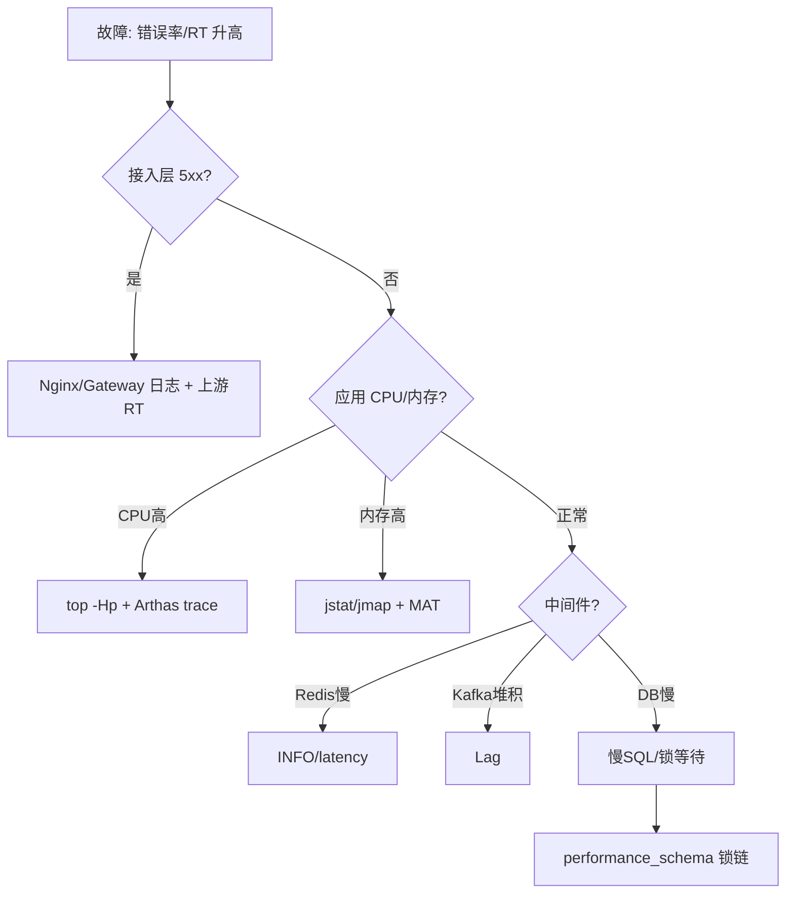

# 问题定位

本文通过 MySQL 的 `information_schema` 与 `performance_schema` 系统库，逐层定位 InnoDB 锁等待的根因，最终找到持有锁并阻塞其他事务的加锁 SQL。排查链路为：**锁等待 → 锁 → 事务 → 线程 → 加锁 SQL**。

## 定位锁等待

```text
mysql> select * from information_schema.innodb_lock_waits;
+-------------------+-------------------+-----------------+------------------+
| requesting_trx_id | requested_lock_id | blocking_trx_id | blocking_lock_id |
+-------------------+-------------------+-----------------+------------------+
| 2207              | 2207:28:3:7       | 2206            | 2206:28:3:7      |
+-------------------+-------------------+-----------------+------------------+
1 row in set, 1 warning (0.00 sec)

```

结果显示有一个锁等待。

## 定位锁

```text
mysql> select * from information_schema.innodb_locks;
+-------------+-------------+-----------+-----------+-------------+-----------------+------------+-----------+----------+----------------+
| lock_id     | lock_trx_id | lock_mode | lock_type | lock_table  | lock_index      | lock_space | lock_page | lock_rec | lock_data      |
+-------------+-------------+-----------+-----------+-------------+-----------------+------------+-----------+----------+----------------+
| 2207:28:3:7 | 2207        | X         | RECORD    | `test`.`t1` | GEN_CLUST_INDEX |         28 |         3 |        7 | 0x000000000211 |
| 2206:28:3:7 | 2206        | X         | RECORD    | `test`.`t1` | GEN_CLUST_INDEX |         28 |         3 |        7 | 0x000000000211 |
+-------------+-------------+-----------+-----------+-------------+-----------------+------------+-----------+----------+----------------+
2 rows in set, 1 warning (0.00 sec)

```

结果显示有两个锁相关内容。

## 定位事务

```text
mysql> select trx_id,trx_started,trx_requested_lock_id,trx_query,trx_mysql_thread_id from information_schema.innodb_trx;
+--------+---------------------+-----------------------+---------------------------+---------------------+
| trx_id | trx_started         | trx_requested_lock_id | trx_query                 | trx_mysql_thread_id |
+--------+---------------------+-----------------------+---------------------------+---------------------+
| 2207   | 2021-01-18 15:18:11 | 2207:28:3:7           | delete from t1 where id=1 |                  41 |
| 2206   | 2021-01-18 15:18:08 | NULL                  | NULL                      |                  38 |
+--------+---------------------+-----------------------+---------------------------+---------------------+
2 rows in set (0.01 sec)

```

结果有两个事务，MySQL 事务线程 id 为 38 和 41，很直观的看到 41 是我们的 delete 事务，被 38 锁定。

## 定位线程

```text
mysql> select * from performance_schema.threads where processlist_id=38;
+-----------+---------------------------+------------+----------------+------------------+------------------+----------------+---------------------+------------------+-------------------+------------------+------------------+------+--------------+---------+-----------------+--------------+
| THREAD_ID | NAME                      | TYPE       | PROCESSLIST_ID | PROCESSLIST_USER | PROCESSLIST_HOST | PROCESSLIST_DB | PROCESSLIST_COMMAND | PROCESSLIST_TIME | PROCESSLIST_STATE | PROCESSLIST_INFO | PARENT_THREAD_ID | ROLE | INSTRUMENTED | HISTORY | CONNECTION_TYPE | THREAD_OS_ID |
+-----------+---------------------------+------------+----------------+------------------+------------------+----------------+---------------------+------------------+-------------------+------------------+------------------+------+--------------+---------+-----------------+--------------+
|        63 | thread/sql/one_connection | FOREGROUND |             38 | root             | localhost        | test           | Sleep               |               35 | NULL              | NULL             |             NULL | NULL | YES          | YES     | Socket          |        15070 |
+-----------+---------------------------+------------+----------------+------------------+------------------+----------------+---------------------+------------------+-------------------+------------------+------------------+------+--------------+---------+-----------------+--------------+
1 row in set (0.00 sec)

```

结果找到 MySQL 事务线程 38 对应的服务器线程 63。

## 定位加锁 SQL

```text
mysql> select * from performance_schema.events_statements_current where thread_id=63;
+-----------+----------+--------------+----------------------+--------------------------+---------------------+---------------------+------------+-----------+--------------------------------------+----------------------------------+----------------------------------------------+----------------+-------------+---------------+-------------+-----------------------+-------------+-------------------+------------------------------------------+--------+----------+---------------+-----------+---------------+-------------------------+--------------------+------------------+------------------------+--------------+--------------------+-------------+-------------------+------------+-----------+-----------+---------------+--------------------+------------------+--------------------+---------------------+
| THREAD_ID | EVENT_ID | END_EVENT_ID | EVENT_NAME           | SOURCE                   | TIMER_START         | TIMER_END           | TIMER_WAIT | LOCK_TIME | SQL_TEXT                             | DIGEST                           | DIGEST_TEXT                                  | CURRENT_SCHEMA | OBJECT_TYPE | OBJECT_SCHEMA | OBJECT_NAME | OBJECT_INSTANCE_BEGIN | MYSQL_ERRNO | RETURNED_SQLSTATE | MESSAGE_TEXT                             | ERRORS | WARNINGS | ROWS_AFFECTED | ROWS_SENT | ROWS_EXAMINED | CREATED_TMP_DISK_TABLES | CREATED_TMP_TABLES | SELECT_FULL_JOIN | SELECT_FULL_RANGE_JOIN | SELECT_RANGE | SELECT_RANGE_CHECK | SELECT_SCAN | SORT_MERGE_PASSES | SORT_RANGE | SORT_ROWS | SORT_SCAN | NO_INDEX_USED | NO_GOOD_INDEX_USED | NESTING_EVENT_ID | NESTING_EVENT_TYPE | NESTING_EVENT_LEVEL |
+-----------+----------+--------------+----------------------+--------------------------+---------------------+---------------------+------------+-----------+--------------------------------------+----------------------------------+----------------------------------------------+----------------+-------------+---------------+-------------+-----------------------+-------------+-------------------+------------------------------------------+--------+----------+---------------+-----------+---------------+-------------------------+--------------------+------------------+------------------------+--------------+--------------------+-------------+-------------------+------------+-----------+-----------+---------------+--------------------+------------------+--------------------+---------------------+
|        63 |       32 |           32 | statement/sql/update | socket_connection.cc:101 | 2757904906303653000 | 2757904906543381000 |  239728000 | 145000000 | update t1 set v_name='aa' where id=1 | 356a053ffb5eae2a35981b05090faa01 | UPDATE `t1` SET `v_name` = ? WHERE `id` = ?  | test           | NULL        | NULL          | NULL        |                  NULL |           0 | 00000             | Rows matched: 1  Changed: 0  Warnings: 0 |      0 |        0 |             0 |         0 |             3 |                       0 |                  0 |                0 |                      0 |            0 |                  0 |           0 |                 0 |          0 |         0 |         0 |             0 |                  0 |             NULL | NULL               |                   0 |
+-----------+----------+--------------+----------------------+--------------------------+---------------------+---------------------+------------+-----------+--------------------------------------+----------------------------------+----------------------------------------------+----------------+-------------+---------------+-------------+-----------------------+-------------+-------------------+------------------------------------------+--------+----------+---------------+-----------+---------------+-------------------------+--------------------+------------------+------------------------+--------------+--------------------+-------------+-------------------+------------+-----------+-----------+---------------+--------------------+------------------+--------------------+---------------------+
1 row in set (0.00 sec)

```

结果中我们找到了加锁的 update 的 SQL 语句。

## 六、通用问题定位方法论

> 上文以 MySQL 锁等待为例演示了"锁等待 → 锁 → 事务 → 线程 → SQL"的逐层下钻法。本节归纳可复用的通用排查框架。

### 一、分层排查清单

| 层 | 现象 | 工具 | 关键指标 |
|----|------|------|----------|
| 接入层 | 5xx/RT 高 | Nginx 日志、Gateway | 错误率、P99 |
| 应用层 | CPU 高/卡顿 | Arthas、jstack、async-profiler | 热点方法、线程栈 |
| JVM | GC 频繁/OOM | jstat、jmap、MAT | GC 次数/耗时、堆占用 |
| 容器/OS | 负载高/打满 | top、vmstat、iostat、df | CPU、IO、磁盘、内存 |
| 中间件 | 慢查/堆积 | Redis INFO、Kafka Lag、Prometheus | 命中率、Lag |
| DB | 锁/慢 SQL | slow log、`performance_schema` | 锁等待、扫描行数 |

### 二、CPU 飙高定位

```bash
# 1. 找高 CPU 进程与线程
top -Hp <pid>
# 2. 线程 id 转 16 进制
printf '%x\n' <tid>
# 3. 抓线程栈
jstack <pid> | grep -A 20 <nid>
```

或用 Arthas 一键定位热点：

```bash
# 实时方法热点 / 火焰图
trace com.example.OrderService createOrder
profiler start && sleep 30 && profiler stop --format html
```

### 三、内存与 OOM 定位

```bash
jstat -gcutil <pid> 1000          # 观察 GC 是否频繁 Full GC
jmap -histo:live <pid> | head     # 对象占用 Top
jmap -dump:live,format=b,file=heap.hprof <pid>  # 导出用 MAT 分析
```

### 四、慢 SQL 与锁（补充）

- `slow_query_log=1` + `long_query_time` 收集慢 SQL。
- `EXPLAIN` / `EXPLAIN ANALYZE` 看执行计划（是否走索引、扫描行数）。
- 死锁：`SHOW ENGINE INNODB STATUS` 看 `LATEST DETECTED DEADLOCK`。

### 五、工具链推荐

- **Arthas**：线上诊断（watch/trace/monitor）、热修复 class。
- **async-profiler**：低开销 CPU/内存/锁火焰图。
- **Prometheus + Grafana**：指标可视化与告警。
- **SkyWalking / Jaeger**：分布式链路追踪，定位跨服务慢调用。
- **tcpdump / Wireshark**：网络层抓包定位超时。

### 六、踩坑与权衡
- **先止血后排查**：先限流/重启/摘流量恢复，再保留现场（heap dump、线程栈）深入分析。
- **避免盲猜**：用数据（指标、火焰图）定位，而非"我觉得是 xxx"。
- **生产慎用 jmap**：`jmap -F` 会 STW 卡死应用，优先用 `jmap -live` 或 Arthas。

## 七、全链路排查清单（网络 / CPU / 内存 / 锁 / GC / 慢 SQL）



| 层 | 先看 | 再看 | 典型根因 |
|----|------|------|----------|
| 网络 | `ping`/`tcpdump`/RT | 丢包、重传 | 跨机房延迟、连接池耗尽 |
| CPU | `top -Hp`/`perf` | 火焰图 | 死循环、正则、序列化 |
| 内存 | `jstat -gc`/`free` | `jmap`/MAT | 缓存无上限、内存泄漏 |
| 锁 | `jstack`/arthas `thread` | 阻塞栈 | 大对象锁、慢 IO 持锁 |
| GC | `jstat -gcutil` | GC 日志 | 频繁 Full GC、晋升失败 |
| DB | 慢日志/`EXPLAIN` | `performance_schema` | 缺索引、锁等待 |

## 八、火焰图 / Arthas / trace 实战

**火焰图（async-profiler）**：
```bash
# CPU 火焰图
profiler.sh -e cpu -d 30 -f cpu.svg <pid>
# 内存分配火焰图
profiler.sh -e alloc -d 30 -f alloc.svg <pid>
# 锁竞争
profiler.sh -e lock -d 30 -f lock.svg <pid>
```
读图：横向宽度=采样占比，找到最宽栈帧即热点。

**Arthas 实战**：
```bash
# 方法执行耗时链路
trace com.example.OrderService createOrder
# 观察方法入参与返回
watch com.example.StockService deduct '{params,returnObj}' -x 3
# 监控调用次数/RT
monitor com.example.StockService deduct -c 5
# 火焰图（arthas 内置）
profiler start && sleep 30 && profiler stop --format svg
# 线程阻塞
thread -b   # 找出阻塞其他线程的罪魁
```

**定位"偶发慢"**：`trace` 多次采样，结合 `watch` 看是否特定入参触发慢路径（如大列表、特定用户）。

## 九、典型故障复盘模板

```markdown
## 故障复盘：<标题>
- 时间线：发现(10:02) → 止血(10:08) → 定位(10:25) → 恢复(10:40)
- 影响面：错误率峰值 12%，影响订单 ~3 万，资损 ~?
- 根因：<一句话> + 证据（火焰图/锁链/慢SQL）
- 临时止血：限流/重启/摘流量/回滚
- 长期改进：
  1. <架构/代码>
  2. <监控/告警补充>
  3. <预案/演练>
- 经验教训：<可复用的方法论>
```

**复盘原则**：对事不对人；先复原时间线与证据；区分"触发条件"与"根因"；每条改进可验证、有 owner 与 deadline。

## 十、踩坑与权衡（深入）

- **先止血再留现场**：重启前务必 `jstack`/`jmap`/保留日志，否则现场丢失无法定位。
- **不要过度依赖 APM**：APM 采样可能漏掉长尾慢请求，关键路径用 `trace` 主动抓。
- **锁问题别只看应用**：DB 行锁/间隙锁常表现为应用线程"等待获取连接/响应"，需结合 `performance_schema` 下钻（如正文 MySQL 示例）。
- **GC 日志要常开**：`-Xlog:gc*:file=gc.log` 持续输出，故障时才能算清 Full GC 次数与停顿。

## 十一、网络层排查（tcpdump / 连接池）

**抓包定位超时**：
```bash
# 抓某端口建链与重传
tcpdump -i any -nn 'tcp port 3306 and (tcp-syn or tcp-retrans)' -w db.pcap
# 看重传/乱序
tshark -r db.pcap -q -z io,stat,1
```
- **连接池耗尽**：`netstat -an | grep :3306 | wc -l` 接近 max，表现为获取连接超时；根因多为慢 SQL 持连接不放。
- **TIME_WAIT 堆积**：高并发短连接导致，调 `net.ipv4.tcp_tw_reuse=1` 或改长连接/连接池。
- **DNS 解析慢**：`nslookup`/dig 看耗时，热点域名加本地缓存或 HTTPDNS。
- **跨机房延迟**：`mtr` 看逐跳 RTT，定位是哪一跳劣化。

> 网络问题常伪装成"应用慢"，先用 `ping`/`mtr`/`tcpdump` 排除，再下钻到应用层。
