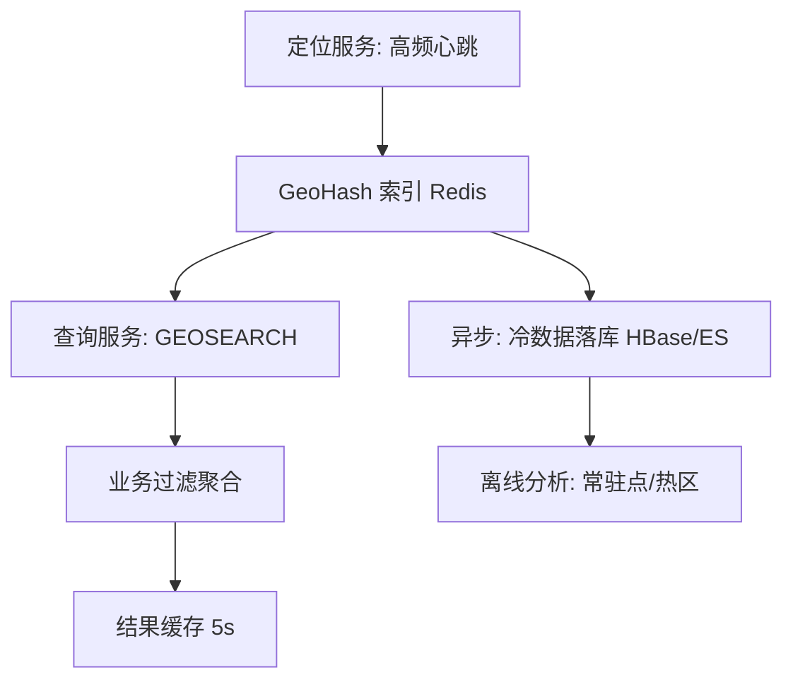

# 附近的人与地理围栏

## 〇、本体介绍

**附近的人**：基于用户实时定位，查询"周围 N 公里内的人/店/车"；**地理围栏**：判断"是否进入/离开某区域"（到店提醒、骑行入区）。两类需求共享同一核心技术：**空间索引**。

**核心矛盾**：
1. 经纬度是**二维连续**坐标，数据库的普通 B+ 树按一维排序，无法直接高效"范围查询"；
2. 用户位置**高频更新**（秒级心跳），索引要能扛写放大；
3. 距离精度 vs 查询性能要权衡（精确球面距离 vs 网格近似）。

**核心主线**：GeoHash 原理 → Redis GEO → 数据库方案 → 围栏判定 → 生产架构。

---

## 一、GeoHash：把二维降到一维

### 1.1 原理

1. 纬度范围 [-90,90]、经度 [-180,180] 各自**二分**，每次落在区间给 0/1（编码一位）；
2. 经度偶数位、纬度奇数位**交错**拼接成二进制串；
3. 二进制按 **base32** 编码成字符串（如 `wtw3sj`）。
4. **前缀 = 邻近区域**：相同前缀越长，两个点越近（附近查询 = 前缀匹配）。

```text
纬度 39.9: 39.9∈[0,90)→1, ∈[45,90)→0, ∈[45,67.5)→0, ... → 二进制
经度 116.4: ... → 二进制
交错(经度在偶数位): 1 0 1 1 0 1 ... → base32 → "wx4g"
```

### 1.2 关键性质与误差表

| 位数 | 1 | 2 | 3 | 4 | 5 | 6 | 7 | 8 | 9 |
|------|---|---|---|---|---|---|---|---|---|
| 网格边长(km) | ~5000 | ~1250 | ~156 | ~39 | ~4.9 | ~1.2 | ~0.15 | ~0.03 | ~0.004 |

- **边界问题（核心坑）**：两个点在相邻网格但实际很近 → 前缀不同 → 查询要取**周围 8 个相邻网格**再过滤（9 宫格查询）。
- **直径问题**：同一前缀网格内距离可能是 0~边长，不能直接按前缀精度当距离。

---

## 二、Redis GEO（生产最常用）

### 2.1 命令

| 命令 | 用途 |
|------|------|
| `GEOADD key lon lat member` | 写入位置（底层 ZSet，score=GeoHash 52 位整数） |
| `GEODIST key a b` | 两点距离 |
| `GEOSEARCH key FROMLONLAT lon lat BYRADIUS r m` | 半径内查询（Redis 6.2+，替代 GEORADIUS） |
| `GEOSEARCH ... ASC COUNT 20` | 按距离排序取前 20 |

```bash
GEOADD people 116.404 39.915 user_1
GEOADD people 116.410 39.920 user_2
# 查询 500m 内的人，按距离排序，最多 20 个
GEOSEARCH people FROMLONLAT 116.405 39.916 BYRADIUS 500 m ASC COUNT 20
```

### 2.2 原理与容量

- **底层就是 ZSet**：score = 52 位 GeoHash 编码整数 → `GEOSEARCH` 实现为 ZSet 区间扫描 + 9 宫格 + 距离过滤。
- **容量**：百万级用户可接受（每成员 ~30B）；亿级需要分片（按区域分 key：`people:city:beijing`）。
- **更新**：`GEOADD` 即 upsert，心跳直接写，天然支持高频更新。
- **精度**：52 位编码亚米级精度，足够"附近的人"。

### 2.3 附近的人完整流程

```mermaid
flowchart LR
    U[用户上报定位] -->|GEOADD 心跳| R[(Redis GEO)]
    Q[查询附近] -->|GEOSEARCH 半径+排序| R
    R -->|Top20 用户id| F[过滤: 在线/屏蔽/性别]
    F --> D[返回卡片数据(详情缓存)]
```

1. 心跳写入：`GEOADD people 116.404 39.915 user_1`（带上 TTL 过期离线用户：`EXPIRE`）。
2. 查询：`GEOSEARCH BYRADIUS` + `COUNT` 限制；默认找范围，`ASC COUNT 20` 拿最近的。
3. 业务过滤：在线状态（Redis 在线 Set）、黑名单、性别等（从用户服务聚合）。
4. **降级**：GEO 不可用时按城市名/网格粗查兜底（结果略旧）。

---

## 三、数据库方案（MySQL 空间索引）

| 方案 | 做法 | 适用 |
|------|------|------|
| MySQL 8 `POINT` + SPATIAL INDEX（R-tree） | `ST_Distance_Sphere` + `MBRContains` | 千万级内、精确 |
| 经纬度列 + `WHERE lat BETWEEN AND lon BETWEEN` | 矩形扫描（需双列索引） | 简单但面积大、慢 |
| **GeoHash 列 + 前缀索引 + 应用过滤** | 存 geohash 字符串列，`LIKE 'wx4g%'` | 简单、可扩展，商用常用 |

**MySQL 地理（R-tree）优缺点**：
- 优点：精确球面距离、事务内一致。
- 缺点：写放大与范围查询成本高、不适合高频心跳更新（Redis GEO 更适合热数据，DB 做冷数据/兜底）。

---

## 四、地理围栏（Geofencing）

### 4.1 判定方案对比

| 方案 | 做法 | 优缺点 |
|------|------|--------|
| **GeoHash 网格** | 区域离散成网格集合，用户 GeoHash ∈ 网格集合即命中 | 简单；边缘锯齿 |
| **多边形点含** | 射线法/点在多边形内算法（Redis GEO 无原生，用自研/DB 空间函数） | 精确；计算贵 |
| **空间索引(DB)** | 围栏存 DB（POINT/POLYGON），用户位置定时查询 `ST_Within` | 精确；量大有压力 |
| **事件驱动** | 每次定位更新都判定，状态变化才发"进入/离开" | 需去抖+状态机 |

### 4.2 生产要点

- **去抖**：定位抖动会反复触发进入/离开 → 状态机 + 时间窗口确认（如连续 3 次在区内才发进入）。
- **定位来源**：GPS（准）→ WiFi/基站（粗）；围栏大小决定用哪档精度。
- **推送与风控**：进入围栏触发到店提醒（推送链路见「[长连接](长连接.md)」）。

---

## 五、附近的人：完整架构与踩坑



| 坑 | 对策 |
|----|------|
| 9 宫格边界 | GEOSEARCH 底层已处理相邻网格，自研 geohash 必须查 9 格 |
| 高频心跳写放大 | 定位服务按 TTL 过期 + 只存热用户；冷用户查询时回源 |
| 距离失真 | 同一前缀网格内距离不等，显示距离用 GEODIST 精确算 |
| 海量分片 | 按城市/区域分 key，避免单 ZSet 过大 |
| 结果时效 | 缓存 5s + 降级粗查，别过度追求实时 |

---

## 六、与其他板块的关系

- **基础知识/Redis**：ZSet 底层结构、过期策略。
- **场景设计/长连接**：位置上报与推送的传输通道。
- **业务模型/出行打车**：LBS 实时调度（司机定位/围栏派单）依赖本文机制。
- **业务模型/本地生活**：到店提醒（地理围栏）是履约核心。
- **中间件/MongoDB**：地理索引（2dsphere）是 Redis 之外的备选存储。

---

## 七、速查表

| 主题 | 一句话 |
|------|--------|
| GeoHash | 经纬度二分交错编码，前缀=邻近 |
| 边界坑 | 相邻网格很近但前缀不同，查 9 宫格 |
| Redis GEO | ZSet 实现，GEOSEARCH BYRADIUS |
| 精度 | 52 位亚米级；网格边长看编码位数 |
| MySQL | POINT + SPATIAL INDEX 精确但写放大 |
| 围栏 | 网格/多边形含/事件驱动 + 去抖 |
| 分片 | 按城市分 key；冷数据落库 |
| 降级 | 缓存 5s、城市粗查兜底 |

---

## 面试高频问题（15+ 条）

1. **附近的人怎么实现？** Redis GEO（GEOSEARCH）或 MySQL 空间索引 + GeoHash 前缀。
2. **GeoHash 原理？** 经纬度二分编码交错，base32；前缀相同=区域相邻。
3. **GeoHash 边界问题？** 相邻网格点很近但前缀不同；查 9 宫格再过滤。
4. **Redis GEO 底层是什么？** ZSet，score=52 位 geohash 整数。
5. **怎么查询 500m 内的人？** GEOSEARCH key FROMLONLAT ... BYRADIUS 500 m ASC COUNT 20。
6. **用户位置怎么更新？** 心跳 GEOADD（upsert）+ EXPIRE 离线过期。
7. **亿级用户怎么办？** 按城市/区域分 key 分片；热数据 Redis、冷数据落库。
8. **怎么计算两点距离？** GEODIST / Haversine 公式。
9. **MySQL 怎么存地理数据？** POINT + SPATIAL INDEX（R-tree），ST_Distance_Sphere。
10. **MySQL 空间索引缺点？** 高频写入放大、范围查询贵，适合低频精确场景。
11. **地理围栏怎么判断进出？** 网格归属/多边形点含 + 状态机去抖。
12. **定位抖动怎么办？** 去抖窗口（连续 N 次确认）+ 状态机。
13. **精度怎么选？** GPS 百级米、WiFi 百~千米、基站公里级；按业务半径选档位。
14. **附近的人结果要实时吗？** 不必，5s 缓存 + 降级粗查足够。
15. **和打车业务怎么结合？** 司机 GEOADD 定位，乘客 GEOSEARCH 找周边司机；围栏触发派单/提醒。
