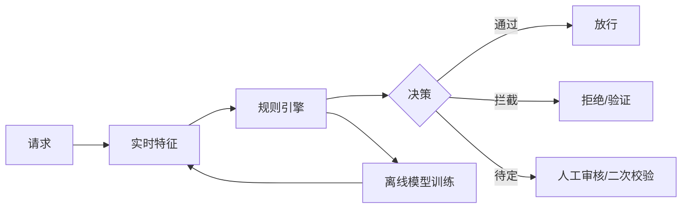

# 风控规则引擎设计实战

> 风控是业务的"护栏"：在注册、登录、交易、营销、内容等链路实时识别欺诈与滥用。它要求低延迟（毫秒级决策）、高可配置（运营自助改规则）、可解释（拦截要有理由）。

## 1. 风控分层



## 2. 规则引擎设计

- **规则即数据**：`IF 条件 THEN 动作`，条件由特征表达式组成。
- **DSL / 配置化**：运营在后台配置规则，无需发版。
- **优先级与分组**：命中多条规则时按权重/严重度决策。

```python
class Rule:
    def __init__(self, expr, action, score):
        self.expr, self.action, self.score = expr, action, score

def decide(features, rules):
    total = 0
    hits = []
    for r in rules:
        if eval_expr(r.expr, features):   # 安全沙箱求值
            total += r.score
            hits.append(r.name)
    if total >= BLOCK: return "block", hits
    if total >= REVIEW: return "review", hits
    return "pass", hits
```

## 3. 特征与名单

- **实时特征**：设备指纹、IP 风险分、行为序列、登录地偏移。
- **名单库**：黑/白/灰名单，命中直接决策。
- **图特征**：同设备多账号、资金环，用图计算识别团伙。

## 4. 决策与处置

| 处置 | 场景 | 说明 |
| --- | --- | --- |
| 直接放行 | 白名单/低风险 | 不打扰用户 |
| 二次验证 | 中风险 | 验证码/人脸 |
| 拦截 | 高风险 | 拒绝交易 |
| 人工审核 | 待定 | 风控运营介入 |

## 5. 性能与稳定性

- **本地缓存名单**，特征走本地计算 + 异步补算。
- **降级**：模型/特征服务不可用时，回退到基础规则，宁可误拦不漏拦。
- **旁路**：新规则先"只观察不拦截"，验证准确率再上线。

## 6. 常见坑

| 坑 | 现象 | 对策 |
| --- | --- | --- |
| 规则雪崩 | 一条误伤全量 | 灰度 + 监控 |
| 特征延迟 | 决策用旧值 | 实时特征 SLA |
| 误拦正常用户 | 客诉 | 白名单 + 申诉 |
| 规则冲突 | 决策矛盾 | 优先级归一 |
| 模型漂移 | 漏拦上升 | 离线回流重训 |

## 7. 面试题

1. 实时风控为什么要求毫秒级？如何做到？
2. 规则引擎如何做到运营可配置？
3. 名单与模型如何配合？
4. 风控服务挂了如何降级？
5. 如何评估一条新规则的误伤率？

## 8. 小结

风控 = 实时特征 + 可配置规则 + 名单/模型 + 分级处置。核心是"低延迟、可解释、可灰度、能降级"，在拦得住与不打扰之间找平衡。
