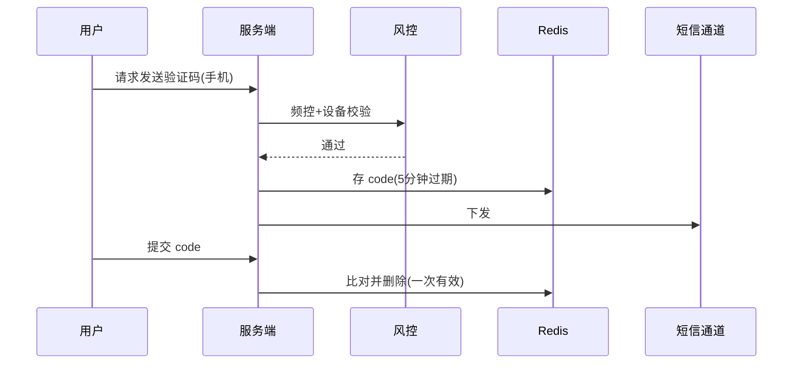

# 验证码与人机校验系统设计

> 板块：场景设计 　|　 返回：[README](README.md)
> 适用：登录注册、敏感操作、防刷防爬、防脚本。

验证码的本质是**区分人与机器**，在体验与安全间权衡。现代方案趋向"无感风控"——能不弹验证码就不弹，风险高才挑战。

## 一、验证码类型

| 类型 | 原理 | 体验 | 安全性 |
|------|------|------|--------|
| 图形验证码 | 扭曲字符 | 差 | 弱（被 ML 破解） |
| 短信/邮箱验证码 | 下发随机码 | 中 | 中（依赖通道安全） |
| 滑块/拼图 | 行为轨迹 | 好 | 中（模拟轨迹可破） |
| 行为式（无感） | 采集鼠标/环境指纹 | 优 | 高（设备/行为模型） |
| 第三方 | 极验/腾讯防水墙 | 好 | 高 |

## 二、设计原则

- **风险驱动**：低风险操作不弹，高风险（异地登录、频繁失败）才挑战。
- **一次有效**：验证码用完即废，防重放。
- **限频**：同一手机号/设备下发频控，防轰炸。
- **加密校验**：服务端校验，前端只展示，密钥不下发。

## 三、短信验证码实现



```java
// 发送：频控 + 存储
String key = "sms:code:" + phone;
if (redis.incr("sms:limit:"+phone) > 5) throw new RuntimeException("频繁");
String code = RandomUtil.randomNumbers(6);
redis.set(key, code, Duration.ofMinutes(5));
smsSender.send(phone, code);
// 校验
if (!code.equals(redis.get(key))) throw ...;
redis.delete(key);  // 一次有效
```

## 四、与风控联动

- 设备指纹、IP、行为轨迹作为风控输入，评分决定挑战强度。
- 低风险直接过，高风险弹滑块/短信。
- 验证码失败计入风控，连续失败封禁/强挑战。

## 五、防刷要点

- 发送频控（同号/同设备/同 IP）。
- 图形验证码服务端校验，不匹配不发送。
- 验证码接口限流，防脚本批量探测。
- 通道额度监控，异常消耗告警。

## 六、常见坑

1. **验证码存前端** → 被绕过；必须服务端校验。
2. **不过期/可复用** → 重放攻击；一次有效 + TTL。
3. **无频控** → 短信轰炸/成本；限流。
4. **图形验证码过简单** → ML 秒破；用行为式。
5. **仅前端校验** → 接口直接被调；后端强校验。
6. **验证码绕过登录** → 其他接口未校验；统一拦截点。

## 七、延伸阅读

- [场景设计/秒杀系统设计与高并发扣减](秒杀系统设计与高并发扣减.md)
- [场景设计/实时风控系统设计](实时风控系统设计.md)
- [安全工程/03-常见Web安全漏洞与防护](../安全工程/03-常见Web安全漏洞与防护.md)
