# CI/CD · 01 概述与核心概念

> **口诀：流水线只做一件事——把代码可靠地变成可运行的制品。** CI/CD 的全部努力，都是为了缩短"想法变成价值"的距离，同时不让系统更脆弱。

本篇讲清三件事：**CI/CD 到底是什么（概念与边界）**、**它在 DevOps 与研发协作中的位置**、以及**衡量它好不好用的客观标尺（DORA 指标与成熟度模型）**。后续的构建、分支、部署、GitOps 等分篇都是本篇的展开。

## 一、CI/CD 是什么：三个缩写，三种能力

CI/CD 是 **Continuous Integration（持续集成）**、**Continuous Delivery（持续交付）**、**Continuous Deployment（持续部署）** 的统称。三者经常被连写，但边界和责任完全不同。

### 1.1 CI（持续集成）——让"合代码"这件事不再可怕

持续集成的核心主张：**每个开发者频繁地（至少每天一次）把本地改动合并到主干**，并且每次合并都触发一次自动化构建 + 自动化测试。它的敌人是"集成地狱"——所有人各自开发几周，最后合并时冲突满天飞。

CI 回答的问题是："我刚写的代码，和别人的代码、和主干、和环境，还配不配？"

### 1.2 CD（持续交付）——让"能发布"成为常态

持续交付指的是：代码通过 CI 后，会自动进入一个**始终可发布（deployable）**的状态。也就是说，任何一次主干上的提交，理论上都可以在几分钟内安全地推到生产环境。是否真的发布，由业务决定（通常保留一个手动审批闸门）。

CD（Delivery）回答的问题是："我们是不是随时有能力发布？"

### 1.3 CD（持续部署）——让"发布"自动化发生

持续部署比持续交付更激进：**一旦代码通过所有自动化门禁，就自动部署到生产，无需人工批准**。它把"能否发布"的决策权完全交给了流水线。这要求极高的测试覆盖和强大的可观测/回滚能力作为兜底。

CD（Deployment）回答的问题是："我们能不能让发布这件事彻底无人值守？"

### 1.4 三者边界与区别

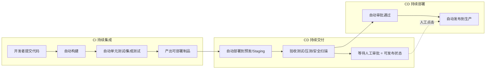

| 维度 | CI（持续集成） | CD 持续交付（Delivery） | CD 持续部署（Deployment） |
|------|----------------|------------------------|---------------------------|
| 触发方式 | 每次提交 | CI 通过后自动 | 门禁通过后自动 |
| 终点 | 产出通过测试的制品 | 到达"可发布"状态（含手动闸门） | 自动到达生产环境 |
| 人工干预 | 无（除修复红构建） | 有（发布按钮/审批） | 无 |
| 风险敞口 | 低 | 中（取决于闸门质量） | 高（需强回滚兜底） |
| 适用场景 | 几乎所有团队 | 多数互联网/企业团队 | 高成熟度的 SaaS/平台团队 |

> **口诀：CI 管"合得对不对"，持续交付管"随时发不发得"，持续部署管"自动发"。** 三者层层递进，前一步是后一步的前提。

## 二、DevOps 与 CI/CD 的位置

### 2.1 DevOps 是一种文化，不是一款工具

DevOps（Development + Operations）的核心是**打破研发与运维之间的组织墙**，通过文化、自动化、度量、共享（CAMS 模型）让软件从想法到生产的速度更快、更稳。它强调"谁构建，谁运行（You build it, you run it）"的责任共担。

CI/CD 是 DevOps 文化在**工程实践层面最具体、最可落地的抓手**——没有自动化的交付流水线，DevOps 就只是口号。

### 2.2 CI/CD 在 DevOps 闭环中的位置

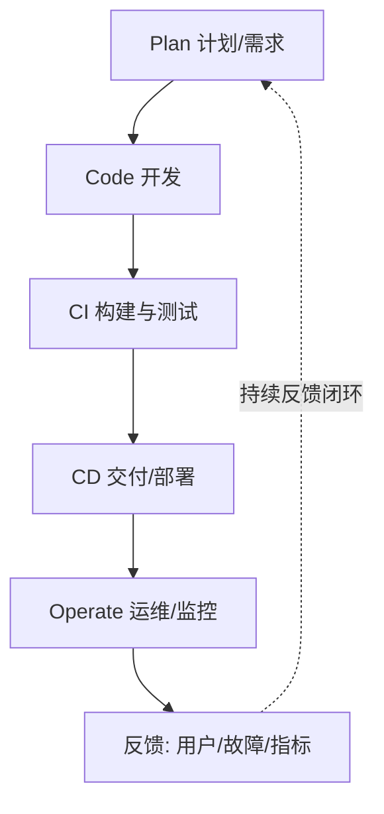

> **口诀：DevOps 是世界观，CI/CD 是方法论，流水线是实现手段。** 工具解决不了协作问题，但协作没有工具也落不了地。

## 三、流水线（Pipeline）是什么

### 3.1 定义

流水线是把"代码 → 制品 → 生产"的全过程拆成一连串**自动化、可编排、可观测**的阶段。每个阶段只做一件事，失败就立刻亮红灯并通知负责人，成功就自动流向下一阶段。

### 3.2 典型阶段


| 阶段 | 目标 | 关键产物 | 常见工具 |
|------|------|---------|---------|
| 代码检出 | 拉取最新源码与依赖 | 工作区 | Git、CI Runner |
| 构建 | 编译/转译，产出可执行物 | 二进制/包 | Maven、Gradle、Go、npm |
| 测试 | 用自动化守住质量底线 | 测试报告、覆盖率 | JUnit、pytest、Playwright |
| 制品 | 生成不可变、可溯源的产物 | jar/wheel/镜像 | Nexus、Harbor |
| 部署 | 把制品放到目标环境 | 运行实例 | ArgoCD、Helm、kubectl |
| 反馈 | 把结果回传给人 | 通知、仪表盘 | 钉钉/Slack、Grafana |

### 3.3 流水线的工程属性

- **幂等**：同一份输入，跑多少次结果一致。
- **快速失败（Fail Fast）**：越靠前的阶段（编译、单测）越便宜，应优先拦住错误。
- **可观测**：每个阶段耗时、成功率、日志都可查。
- **可重试**：网络抖动导致的失败应能一键重跑，而非从头来过。

## 四、左移（Shift-Left）与持续反馈

### 4.1 左移：把问题消灭在最早、最便宜的地方

"左移"指把质量保障、安全、性能等验证动作，从传统的"上线前最后一道关"，**前移到开发、编码、提交阶段**。因为越早发现缺陷，修复成本越低（IBM 经典数据：需求阶段发现缺陷修复成本是上线后的 1/100）。

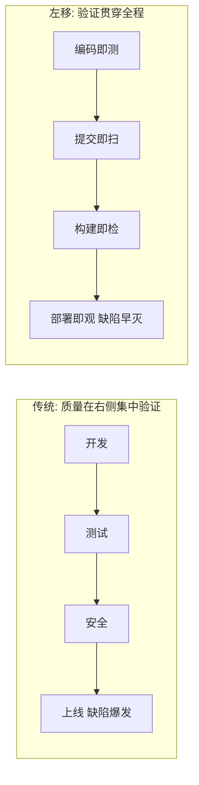

### 4.2 持续反馈闭环

CI/CD 的本质是一个高速反馈环：**提交 → 自动验证 → 结果回传 → 开发者修正**。循环越快，团队学习能力越强。DORA 的"变更前置时间"衡量的是这个环的完整长度。

### 4.3 小批量、快速失败

- **小批量（Small Batch）**：一次只交付小的、独立的改动，降低每次发布的爆炸半径（blast radius），也更容易定位问题。
- **快速失败**：红灯第一时间亮，绝不带病合入。

> **口诀：左移是为了"早死早超生"，小批量是为了"死也只死一小块"。**

⚠️ **反模式**：把 CI 跑得巨慢（一小时以上）却不优化，开发者会绕过它、本地跳过、或攒一大波再合，CI 形同虚设。红构建无人修复、长期挂着，是团队协作崩溃的前兆。

## 五、GitOps 理念（概念版，详述见第 8 篇）

### 5.1 三句话讲清 GitOps

GitOps = **Git + Operations**：用 Git 仓库里声明式的配置文件，作为系统期望状态的**唯一事实源**；由运行在集群内的**代理（agent）以"拉（pull）"的方式**持续比对并调和（reconcile）实际状态与期望状态。

### 5.2 四个 OpenGitOps 原则（CNCF，v1.0）

1. **声明式（Declarative）**：系统状态用"它应该长什么样"来描述，而非"一步步怎么做的脚本"。
2. **版本化且不可变（Versioned & Immutable）**：期望状态存于 Git，每次变更都是一次提交，回滚即 `git revert`。
3. **自动拉取（Pulled Automatically）**：集群内 agent 主动从 Git 拉取，而不是外部 CI 用 `kubectl apply` 推送。
4. **持续调和（Continuously Reconciled）**：agent 持续比对实际与期望，发现漂移（drift）就自动纠正，实现自愈。

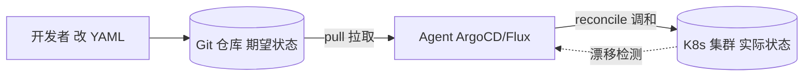

> **口诀：GitOps 不是"把 YAML 放 Git 里"，而是"集群自己认账、自己对齐"。** 真正的 GitOps 是拉式调和，不是推送式 CI/CD。

⚠️ **生产踩坑**：把"CI 流水线里 `kubectl apply`"当成 GitOps 是常见误解。那只是"Git 触发的 CI/CD"，没有持续调和与自愈，集群内被人手改后 Git 一无所知。详见 [08-GitOps 与声明式交付](08-云原生CI-CD与GitOps工具.md)。

## 六、DORA 四项关键指标（2025 更新）

DORA（DevOps Research and Assessment，现属 Google）用一套**与结果强相关**的指标衡量交付效能。经典四项：

| 指标 | 英文 | 含义 | Elite 基准 |
|------|------|------|-----------|
| 部署频率 | Deployment Frequency (DF) | 多频繁向生产发布 | 按需（每天多次） |
| 变更前置时间 | Lead Time for Changes (LT) | 从提交到生产运行的耗时 | 小于 1 小时 |
| 变更失败率 | Change Failure Rate (CFR) | 导致生产故障的发布占比 | 0–15%（部分口径 0–5%） |
| 服务恢复时间 | Mean Time to Recovery (MTTR) | 故障后恢复服务的平均时长 | 小于 1 小时 |

> 数据来源：DORA / Google《Accelerate》研究（Nicole Forsgren、Jez Humble、Gene Kim）及历年 State of DevOps 报告。Elite 团队达成上述基准的概率是普通团队的 2 倍以上。

### 6.1 2025 年新进展（联网核实）

- **2025 报告更名为《State of AI-Assisted Software Development》**，调研近 5000 名技术从业者，明确指出 **90% 开发者已在工作流中使用 AI 工具**（较上一年 +14%），日均约 2 小时。
- **新增第五项指标：返工率（Rework Rate）**——统计为修复线上缺陷而被迫推送的非计划修复占比。它补上了原四项指标对"隐性不稳定"的盲区。
- 指标被重构为：**3 个吞吐指标**（部署频率、变更前置时间、返工率）+ **2 个不稳定指标**（变更失败率、部署失败恢复时间）。
- **用七类"团队画像（archetypes）"取代原有的 Elite/High/Medium/Low 四档分级**（如 Foundational Challenges、Legacy Bottleneck、Harmonious High-Achievers 等），强调不同团队需差异化干预。
- **"镜像与放大器"效应**：AI 会放大团队既有的好坏实践——流程好则更快，流程烂则更乱。不能只看 DF/ LT 上升就以为变好，须结合 CFR 与返工率一起看。

### 6.2 SPACE 与 DevEx（工程效能补充视角）

DORA 只看"产出结果"，SPACE（2021，微软/ GitHub）与 DevEx（2023，DX/ GitHub）补充了"人"的维度：

| 框架 | 关注点 | 维度 |
|------|--------|------|
| DORA | 交付结果 | 速度 + 稳定性 |
| SPACE | 工程效能多维 | 满意度(S)、性能(P)、活动(A)、沟通协作(C)、效率流程(E) |
| DevEx | 开发者体验 | 反馈循环、认知负荷、流畅度 |

> **口诀：DORA 看"车跑多快多稳"，DevEx 看"司机累不累"。** 2025 年主流做法是 DORA + DevEx 组合，既看结果也不透支人。

## 七、CI/CD 成熟度模型

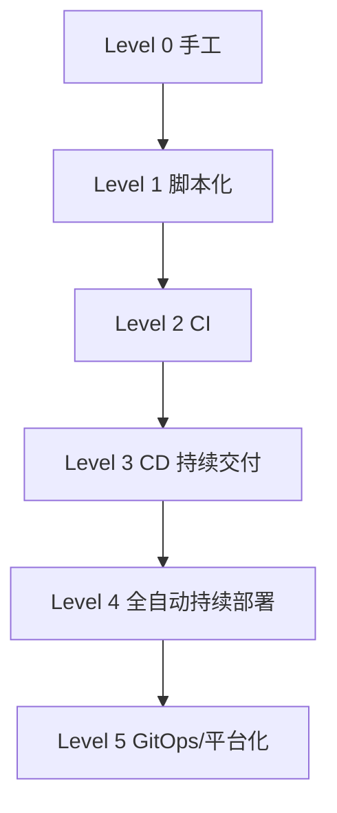

| 级别 | 名称 | 特征 | 典型痛点 |
|------|------|------|---------|
| 0 | 手工 | 本地构建、手动拷贝上线、靠文档 | 极易出错、不可复现 |
| 1 | 脚本化 | 用 Shell/Python 串起构建部署 | 脚本散落、难维护、无门禁 |
| 2 | CI | 提交即自动构建+测试 | 仍靠人手动发布 |
| 3 | 持续交付 | 自动到预发、保留发布闸门 | 生产发布仍慢 |
| 4 | 全自动部署 | 通过门禁自动上生产 | 需强回滚与可观测兜底 |
| 5 | GitOps/平台化 | 声明式、拉式调和、自助平台 | 组织与治理复杂度高 |

> **口诀：成熟度不是"工具多高级"，而是"从提交到价值，人少插手多少"。**

⚠️ **反模式**：还没治好"构建慢、测试弱、回滚难"，就跳到 Level 4 全自动部署，只会让故障以更高频率、更大范围发生。成熟度要逐级爬，不要跳级。

## 八、CI/CD 与微服务、容器、云原生、大数据的关系

- **微服务**：服务多、变更频繁，天然需要独立流水线 + 独立制品 + 独立部署，是 CI/CD 普及的核心驱动力。
- **容器化 / 云原生**：Docker 把"环境"一起打包，Kubernetes 提供声明式编排，使部署可重复、可回滚，是现代化 CI/CD 的底座。
- **大数据**：离线/实时数据流水线（如 Airflow、DolphinScheduler 编排的 ETL）本质上也是"流水线"，可类比 CI/CD 的"代码 → 制品 → 服务"思想——只是这里的"制品"是数据表/特征/报表，"部署"是调度执行。

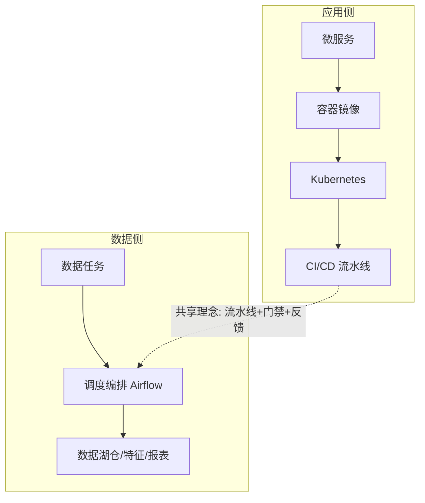

## 九、本篇小结 Checklist

- [ ] 分清 CI、持续交付、持续部署的边界与自动化程度差异。
- [ ] 理解 DevOps 文化是根，CI/CD 是其工程抓手。
- [ ] 流水线按"检出→构建→测试→制品→部署→反馈"分段，快速失败。
- [ ] 践行左移、小批量、持续反馈。
- [ ] GitOps 核心是声明式 + Git 唯一事实源 + 拉式调和（详述见第 8 篇）。
- [ ] 用 DORA 四项（2025 加返工率为五项）客观衡量，结合 DevEx 看人。
- [ ] 成熟度逐级提升，不要跳级。

## 十三、DORA 指标深度分析

### 13.1 各指标详解

```
部署频率（Deployment Frequency）：
  - Elite：按需（每天多次）
  - High：每周一次
  - Medium：每月一次
  - Low：每半年一次
  
  提升策略：
  - 自动化构建+测试
  - 小批量提交
  - 功能开关（Feature Flags）分离部署与发布

变更前置时间（Lead Time）：
  - Elite：< 1 小时
  - High：1 天 ~ 1 周
  - Medium：1 周 ~ 1 月
  - Low：> 6 个月
  
  提升策略：
  - CI 流水线并行化
  - 自动化测试分层（快测试优先）
  - 消除等待时间（审批/环境准备）

变更失败率（CFR）：
  - Elite：0 ~ 15%
  - High：16 ~ 30%
  - Medium：16 ~ 30%
  - Low：> 30%
  
  降低策略：
  - 提高测试覆盖率
  - 金丝雀发布
  - 自动化回滚

服务恢复时间（MTTR）：
  - Elite：< 1 小时
  - High：< 1 天
  - Medium：1 天 ~ 1 周
  - Low：> 6 个月
  
  缩短策略：
  - 可观测性（日志/指标/链路）
  - 自动化故障检测
  - 回滚自动化
```

### 13.2 DORA 指标与业务价值

| 指标 | 业务价值 | 关联指标 |
|------|----------|----------|
| 高部署频率 | 快速响应市场 | Lead Time |
| 低 Lead Time | 快速交付价值 | 部署频率 |
| 低 CFR | 服务质量稳定 | MTTR |
| 低 MTTR | 业务连续性 | CFR |

---

## 十四、Trunk-Based Development vs GitFlow

### 14.1 Trunk-Based Development（主干开发）

```text
原则：
  - 所有开发者向主干（main/master）提交
  - 分支生命周期 < 1 天
  - 用 Feature Flags 控制功能开关
  - CI 必须快速（< 5 分钟）

优势：
  - 集成频繁，冲突少
  - 持续集成自然落地
  - 发布简单（主干就是可发布状态）

挑战：
  - 需要 Feature Flags 支持
  - 需要强 CI 门禁
  - 需要团队纪律
```

### 14.2 GitFlow

```text
分支模型：
  - main：生产代码
  - develop：开发分支
  - feature/*：功能分支
  - release/*：发布分支
  - hotfix/*：热修复分支

优势：
  - 流程清晰，适合发布周期长的项目
  - 代码隔离好

劣势：
  - 合并复杂，冲突多
  - 集成频率低
  - 不适合持续部署
```

### 14.3 对比

| 维度 | Trunk-Based | GitFlow |
|------|------------|---------|
| 分支模型 | 主干+短命分支 | 多长期分支 |
| 集成频率 | 高（每天） | 低（每周/月） |
| 适用场景 | 持续部署/SaaS | 版本发布/传统软件 |
| CI 要求 | 高 | 中 |
| 发布频率 | 高 | 低 |
| 功能隔离 | Feature Flags | 长命分支 |

---

## 十五、Feature Flags（功能开关）

### 15.1 核心思想

```text
Feature Flags = 把"部署"与"发布"分离

部署：代码上线（对用户不可见）
发布：功能对用户可见（通过 Flag 控制）

好处：
  - 降低发布风险（新功能默认关闭）
  - 灰度发布（按比例/用户群开启）
  - A/B 测试
  - 紧急回滚（关闭 Flag 即可）
```

### 15.2 Flag 类型

| 类型 | 生命周期 | 示例 |
|------|----------|------|
| Release Flag | 短（天~周） | 新功能灰度 |
| Experiment Flag | 短（天~周） | A/B 测试 |
| Ops Flag | 长 | 降级开关 |
| Permission Flag | 长 | 用户权限 |

### 15.3 实现方案

```yaml
# LaunchDarkly / Unleash / 自建
flags:
  new-checkout-flow:
    enabled: true
    rules:
      - user-group: beta
        percentage: 10
      - user-group: all
        percentage: 0
```

```java
// Java 使用
if (featureFlag.isEnabled("new-checkout-flow", user)) {
    // 新流程
} else {
    // 旧流程
}
```

---

## 十六、金丝雀发布自动化

### 16.1 金丝雀发布流程

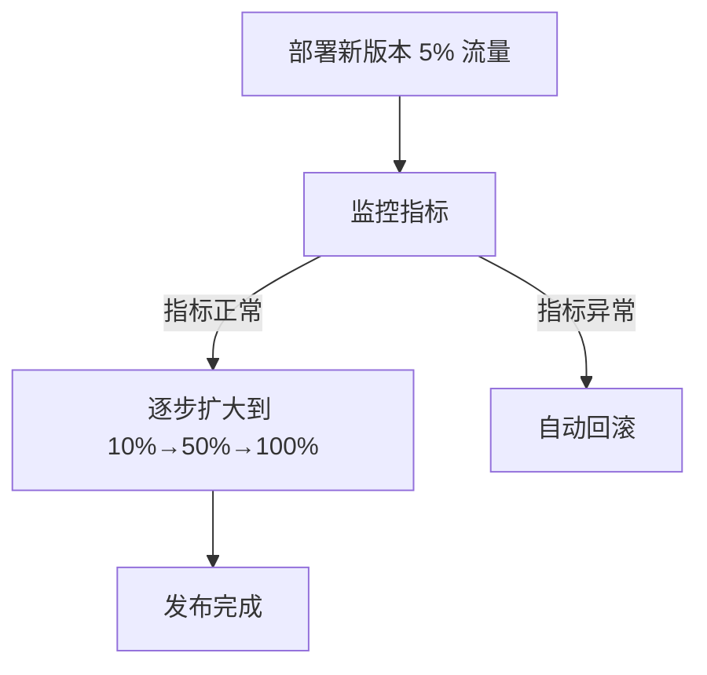

### 16.2 金丝雀策略

```
流量百分比：
  - 5% → 20% → 50% → 100%
  - 每个阶段观察 5~10 分钟

用户群：
  - 内部用户 → Beta 用户 → 全量用户
  - 按地区/租户逐步放开

指标监控：
  - 错误率 < 阈值
  - 延迟 P99 < 阈值
  - 业务指标（转化率/点击率）无下降
```

### 16.3 工具支持

| 工具 | 类型 | 特点 |
|------|------|------|
| Argo Rollouts | K8s Operator | 声明式金丝雀 |
| Flagger | K8s Operator | 渐进式交付 |
| Istio | Service Mesh | 流量权重控制 |
| Linkerd | Service Mesh | 金丝雀+自动回滚 |

---

## 十七、GitOps 原则详解

### 17.1 四大原则

```
1. 声明式（Declarative）
   - 系统状态用"期望状态"描述
   - 不是"怎么做"的脚本
   - 如：Kubernetes YAML / Helm Values

2. 版本化且不可变（Versioned & Immutable）
   - 期望状态存于 Git
   - 每次变更 = Git Commit
   - 回滚 = git revert

3. 自动拉取（Pulled Automatically）
   - 集群内 Agent 主动拉取
   - 不是外部 CI 推送
   - Agent 持续比对实际状态与期望状态

4. 持续调和（Continuously Reconciled）
   - 发现漂移（drift）自动纠正
   - 实现自愈
   - 无需人工干预
```

### 17.2 GitOps 工具

| 工具 | 特点 |
|------|------|
| ArgoCD | K8s 原生，Web UI，多集群 |
| Flux | 轻量，GitOps Toolkit |
| Fleet | Rancher 出品，大规模管理 |

---

## 十八、左移安全（Shift-Left Security）

### 18.1 DevSecOps 理念

```text
传统安全：上线前安全团队审核（右移）
左移安全：安全验证贯穿开发全流程

流水线中的安全门禁：
  1. 编码阶段：IDE 安全插件（SonarLint）
  2. 提交阶段：SCA（依赖漏洞扫描）
  3. 构建阶段：SAST（静态代码分析）
  4. 制品阶段：容器镜像扫描
  5. 部署阶段：DAST（动态应用测试）
  6. 运行阶段：RASP（运行时保护）
```

### 18.2 安全工具链

| 阶段 | 工具 | 功能 |
|------|------|------|
| SCA | Snyk/Dependabot | 依赖漏洞 |
| SAST | SonarQube/Semgrep | 代码漏洞 |
| DAST | OWASP ZAP | 运行时漏洞 |
| 容器扫描 | Trivy/Grype | 镜像漏洞 |
| 密钥扫描 | GitGuardian | 硬编码密钥 |

---

## 十九、部署频率优化策略

### 19.1 提升部署频率

```
策略：
  1. 小批量提交
     - 每次变更 < 400 行代码
     - 减少爆炸半径

  2. 并行化 CI
     - 测试并行执行
     - 构建缓存（Docker Layer Cache）
     - 增量构建

  3. 自动化门禁
     - 自动化测试（单元/集成/E2E）
     - 静态分析
     - 安全扫描

  4. Feature Flags
     - 部署与发布分离
     - 降低每次发布的风险

  5. 数据库变更管理
     - 迁移脚本化
     - 向后兼容的 Schema 变更
```

### 19.2 变更前置时间优化

| 阶段 | 优化策略 |
|------|----------|
| 代码编写 | IDE 自动化、代码生成 |
| 代码审查 | 自动分配、SLA 时间限制 |
| CI 构建 | 并行测试、缓存、增量构建 |
| 部署准备 | 环境即代码、自动化配置 |
| 生产部署 | 金丝雀发布、自动化回滚 |

---

## 二十一、CI 与 CD 与 CD 三者边界辨析深度图

### 21.1 三者核心区别

```
CI（Continuous Integration）= 持续集成
  输入：开发者提交代码
  过程：自动构建 → 自动测试 → 产出制品
  输出：通过测试的可部署制品
  关键词：频率、自动化构建、质量门禁

CD（Continuous Delivery）= 持续交付
  输入：CI 通过的制品
  过程：自动部署到 Staging → 验收/安全扫描 → 到达"可发布"状态
  输出：随时可发布（需人工触发）
  关键词：可发布状态、人工审批闸门

CD（Continuous Deployment）= 持续部署
  输入：CD(Delivery) 通过的制品
  过程：自动通过所有门禁 → 自动发布到生产
  输出：自动到达生产环境
  关键词：全自动、无人工干预
```

### 21.2 自动化程度对比

| 维度 | CI | CD 持续交付 | CD 持续部署 |
|------|----|-----------|-----------|
| 构建 | 自动 | 自动 | 自动 |
| 测试 | 自动 | 自动 | 自动 |
| 部署到 Staging | 不一定 | 自动 | 自动 |
| 部署到生产 | 不 | 人工触发 | 自动 |
| 人工干预点 | 修复红构建 | 发布按钮 | 无 |
| 回滚能力 | 手动 | 手动/自动 | 必须自动 |
| 适用成熟度 | 所有团队 | 中高成熟度 | 高成熟度 |

> **口诀：CI 管"合得对不对"，CD(Delivery) 管"随时发不发得"，CD(Deployment) 管"自动发"。三者层层递进，前一步是后一步的前提。**

---

## 二十二、流水线分层设计

### 22.1 三级流水线体系

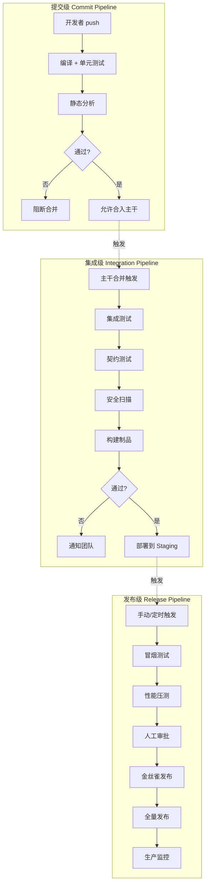

### 22.2 各级流水线配置

| 级别 | 触发条件 | 阶段 | 耗时目标 | 产物 |
|------|---------|------|---------|------|
| 提交级 | 每次 push/PR | 编译+单测+静态分析 | < 5 分钟 | 通过/失败信号 |
| 集成级 | 合入主干 | 集成测试+安全扫描+构建 | < 15 分钟 | 可部署制品 |
| 发布级 | 手动/定时触发 | 压测+审批+金丝雀+全量 | < 30 分钟 | 生产环境运行实例 |

```yaml
# GitLab CI 三级流水线示例
# 提交级
commit:
  stage: test
  script: ./mvnw test
  only: [merge_requests]

# 集成级
integration:
  stage: build
  script: ./mvnw package && docker build .
  only: [main]

# 发布级
release:
  stage: deploy
  script: ./deploy.sh production
  only: [tags]
  when: manual
```

> **口诀：提交级要快（5 分钟内），集成级要全（覆盖关键路径），发布级要稳（金丝雀+回滚）——三级流水线是规模化交付的基础。**

---

## 二十三、构建时长优化实战

### 23.1 并行化策略

```
并行化手段：
  ① 测试并行：JUnit5 @Execution(ExecutionMode.CONCURRENT)
  ② 模块并行：Gradle --parallel / Maven -T 1C
  ③ 阶段并行：流水线中无依赖的 stage 同时跑
  ④ 矩阵构建：多版本/多平台同时测试（GitHub Actions matrix）

示例配置：
  Gradle: org.gradle.parallel=true（settings.gradle）
  Maven: mvn -T 1C package（每核一个线程）
  GitHub Actions:
    strategy:
      matrix:
        java: [11, 17, 21]
```

### 23.2 缓存优化

| 缓存层 | 命中率目标 | 优化手段 |
|--------|-----------|---------|
| 依赖缓存 | > 90% | lock 文件 hash 作 key，挂载 ~/.m2 |
| 构建缓存 | > 80% | Gradle Build Cache + 远程缓存 |
| Docker 层缓存 | > 70% | 依赖层前置，BuildKit cache mount |
| 测试缓存 | > 60% | 跳过未变更模块的测试 |

### 23.3 增量构建

```
增量构建策略：
  ① 变更检测：git diff 找变更文件 → 仅构建受影响模块
  ② 缓存跳过：Gradle input/output 指纹匹配 → 跳过任务
  ③ Docker BuildKit：COPY 源码放最后 → 依赖层缓存命中
  ④ Bazel Remote Cache：跨 CI agent 共享编译结果

效果：
  全量构建 30 分钟 → 增量构建 3~5 分钟
  首次全量 30 分钟 → 缓存命中后 2~3 分钟
```

```yaml
# GitHub Actions 变更检测示例
- uses: dorny/paths-filter@v2
  id: changes
  with:
    filters: |
      backend:
        - 'src/**'
        - 'pom.xml'
      frontend:
        - 'web/**'
        - 'package.json'

- run: ./mvnw test
  if: steps.changes.outputs.backend == 'true'
```

> **口诀：构建时长优化三板斧——并行（测并行/模块并行/阶段并行）、缓存（依赖/构建/Docker 层）、增量（变更检测+跳过未变更模块）。**

---

## 二十四、环境晋升模型

### 24.1 一致性原则

```
环境晋升模型：
  dev → staging → prod 三层环境

  关键原则：
  ① 配置一致性：三层环境用相同配置模板（环境变量差异化）
  ② 数据相似性：staging 用脱敏的生产数据子集
  ③ 基础设施对等：相同 OS/容器版本/K8s 版本
  ④ 部署方式一致：同一部署脚本/同一制品

反模式：
  ❌ dev 手动部署，staging 用脚本，prod 用 ArgoCD
  ❌ dev 用 H2，staging 用 MySQL 5.7，prod 用 MySQL 8.0
  ❌ dev 无负载均衡，staging 单节点，prod 集群
```

### 24.2 环境配置管理

| 维度 | dev | staging | prod |
|------|-----|---------|------|
| 数据库 | 本地/脱敏子集 | 脱敏子集 | 生产数据 |
| 配置 | 开发默认值 | 模拟生产 | 生产值 |
| 负载均衡 | 单节点 | 模拟集群 | 多 AZ |
| 监控 | 开发级 | 生产级 | 生产级 |
| 审批 | 无 | 自动 | 人工审批 |

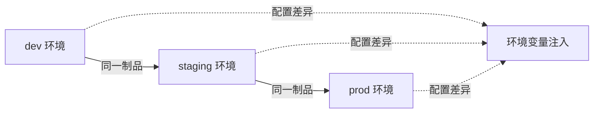

> **口诀：三套环境，一套制品——"在我机器上是好的"是最大的谎言，环境一致性消除这种差异。**

---

## 二十五、流水线反模式清单

| 反模式 | 危害 | 正确做法 |
|--------|------|---------|
| CI 构建 > 15 分钟 | 开发者绕过、积压合并 | 并行+缓存+增量，目标 < 5 分钟 |
| 红构建无人修 | 质量门禁形同虚设 | 红构建为 P0，全组停修 |
| 测试 Flaky | 信任崩塌、跳过测试 | 隔离+重试+根治 |
| 手动审批瓶颈 | 发布流程阻塞 | 自动化门禁替代人工审批 |
| 无回滚能力 | 故障时无法快速恢复 | 自动回滚 + 一键回退 |
| latest 标签 | 不可溯源、不可回滚 | 用 git SHA / 语义版本标签 |
| 构建结果不通知 | 开发者不知红绿 | 即时通知（Slack/钉钉） |
| 环境不一致 | "我本地是好的" | 配置模板 + 制品一致性 |
| 大爆炸发布 | 回滚代价巨大 | 金丝雀 + 渐进式发布 |
| 无制品晋级 | 直接从 dev 到 prod | snapshot → rc → prod 分级 |

> **口诀：反模式是"看起来在做 CI/CD 但实际没在做"——检查你的流水线是否踩了这些坑。**

---

## 二十六、DORA 四指标采集埋点位置

### 26.1 埋点架构

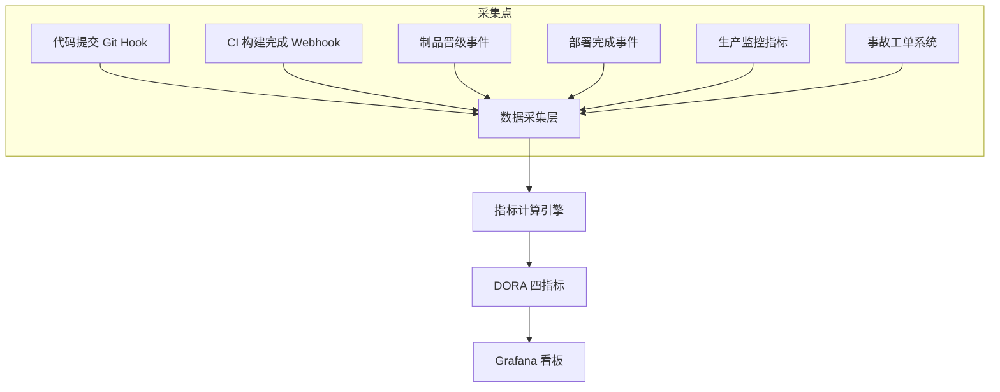

### 26.2 各指标埋点位置

| 指标 | 埋点位置 | 采集方式 | 计算公式 |
|------|---------|---------|---------|
| 部署频率 | 部署系统（ArgoCD/K8s） | Webhook/API | 成功部署次数/天 |
| 变更前置时间 | Git commit → 生产部署 | 时间戳差值 | 部署时间 - 首次提交时间 |
| 变更失败率 | 监控系统 + 事故工单 | 关联变更与故障 | 因变更导致故障的部署占比 |
| 服务恢复时间 | 事故工单 + 监控 | 工单时间戳差值 | 故障确认到恢复的时间差 |

### 26.3 实现示例

```python
# 变更前置时间计算（伪代码）
def lead_time(commit_sha, deploy_time):
    # 首次提交时间
    first_commit = git_log(commit_sha).first_commit_time
    return deploy_time - first_commit

# 部署频率统计
def deployment_frequency(start_date, end_date):
    deploys = argocd_api.get_deploys(start_date, end_date)
    successful = [d for d in deploys if d.status == 'success']
    return len(successful) / (end_date - start_date).days

# 变更失败率
def change_failure_rate(total_deploys, failed_deploys):
    return failed_deploys / total_deploys  # 目标 < 15%

# 服务恢复时间
def mttr(incident_start, incident_end):
    return incident_end - incident_start  # 目标 < 1 小时
```

### 26.4 数据源对接

| 数据源 | 提供指标 | 对接方式 |
|--------|---------|---------|
| Git | 提交时间、变更范围 | Webhook/API |
| CI/CD 引擎 | 构建结果、部署事件 | API/Webhook |
| 监控系统 | 错误率、延迟 | Prometheus/Alertmanager |
| 事故管理 | 故障时间线 | Jira/PagerDuty API |
| 制品仓库 | 制品晋级事件 | Webhook |

> **口诀：DORA 指标不是"问出来的"，是"从流水线和监控中自动采集出来的"——埋点位置决定数据准确性。**

## 二十、与其他模块的关联

- 分支策略是流水线的输入前提，见 [02-版本控制与分支策略](02-版本控制与分支策略.md)。
- 构建与制品是流水线中段核心，见 [03-构建与制品管理](03-构建与制品管理.md)。
- GitOps 声明式交付详述见 [08-GitOps 与声明式交付](08-云原生CI-CD与GitOps工具.md)。
- 容器与编排底座见 [../../云原生/K8S.md](../../云原生/K8S.md)。
- 大数据调度流水线类比如 [../大数据/02-技术体系与架构演进.md](../大数据/02-技术体系与架构演进.md)、[../大数据/08-流处理计算：Flink.md](../大数据/08-流处理计算：Flink.md)。
- 安全门禁与供应链（SBOM/签名/扫描）深入见 [13-安全与供应链安全](13-可观测性DORA度量与DevSecOps.md)。

> 参考：
> - DORA / Google《Accelerate》与 State of DevOps 报告：https://dora.dev/
> - DORA 2025 报告（State of AI-Assisted Software Development）解读：https://plandek.com/blog/dora-metrics-in-the-age-of-ai-how-engineering-leaders-should-measure-delivery-in-2025/
> - DORA 指标基准与七类画像：https://dwaynehelena.com/docs/dora-metrics
> - OpenGitOps 四项原则（CNCF）：https://www.cncf.io/blog/2025/06/09/gitops-in-2025-from-old-school-updates-to-the-modern-way/ 、 https://deepwiki.com/cncf/tag-app-delivery/3.1-gitops-principles
> - Trunk-Based Development 与精英效能关联：https://www.minware.com/guide/best-practices/trunk-based-development
> - SPACE 框架（Microsoft/GitHub）：https://queue.acm.org/detail.cfm?id=3454124
> - DevEx 框架（DX/GitHub）：https://queue.acm.org/detail.cfm?id=3595878

## 十、平台工程（Internal Developer Platform, IDP）趋势

平台工程以"内部开发者平台"把 CI/CD、环境、密钥、可观测性、模板化流水线**产品化**给研发自助，目标是降低认知负荷、统一最佳实践。CI/CD 从"各写各的脚本"演进为"平台提供的 Golden Pipeline + 自助环境"。

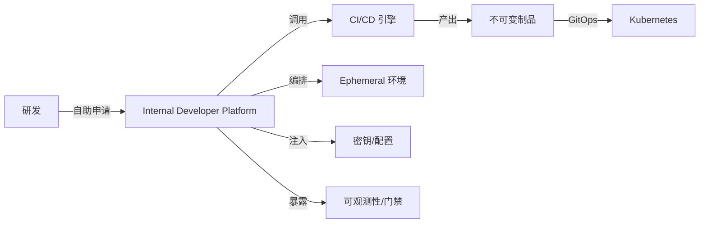

- **Golden Path**：平台固化标准路径（构建/测试/部署/晋级），研发只声明意图。
- **Backstage**（CNCF）是典型 IDP 门户，打通 CI 状态、服务目录、脚手架模板。
- 与 CI/CD 关系：CI/CD 是 IDP 的"交付引擎"，IDP 是 CI/CD 的"产品外壳"。

## 十一、CI/CD 与 GitOps 的边界

二者易混淆，但职责不同：

| 维度 | CI/CD（传统 push） | GitOps（pull） |
|------|--------------------|----------------|
| 触发 | 事件推送到集群 | 控制器拉取 Git 期望状态 |
| 事实源 | 流水线定义 + 手动操作 | Git 仓库唯一事实源 |
| 部署权 | CI 持有 kubeconfig/admin | 集群内 Controller 调和 |
| 适用 | 构建/测试/通用任务 | K8s 声明式交付/晋级 |

> 结论：**CI 负责"造出可信制品"，GitOps 负责"把制品按 Git 声明拉到集群"**。现代架构常为 CI(push) 产出镜像 → GitOps(pull) 负责部署，二者互补而非互斥。

## 十二、CI/CD 与 FinOps 的关系

流水线直接驱动云成本，平台团队需以 FinOps 视角治理：

- **构建资源**：macOS / GPU runner、大规格 agent 成本高，按需起停、用 Spot / 抢占式节点。
- **常驻环境**：每个 MR 起一套 Review App 若不复用，费用暴涨 → ephemeral + 自动回收。
- **镜像与存储**：制品库 / 缓存保留策略（`expire_in`）控制存储成本。
- **FinOps 闭环**：把流水线资源消耗接入成本看板，按团队/仓库分摊，设预算阈值门禁。
- 在 L3/L4 成熟度，用"单位部署成本（Cost per Deploy）"衡量平台效率，避免为"快"无脑堆资源。

## 本篇补充 Checklist

- [ ] 理解 IDP 把流水线"产品化"，Golden Pipeline 是标准路径。
- [ ] 分清 CI（造制品，push）与 GitOps（拉部署，pull）边界，现代架构二者并存。
- [ ] 把 FinOps 纳入流水线治理：构建资源 / 常驻环境 / 存储成本可观测、可分摊。
