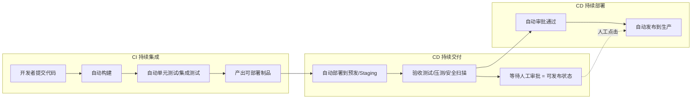
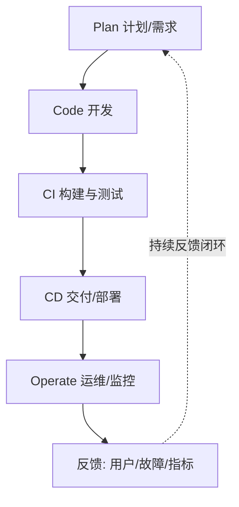
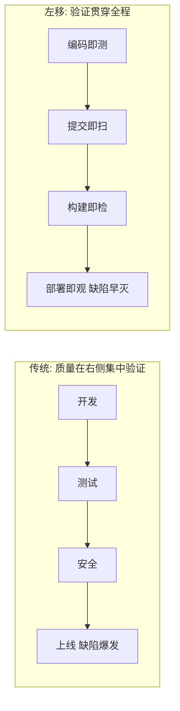
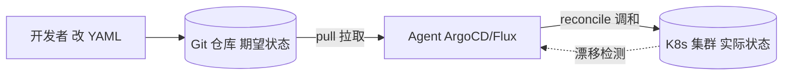
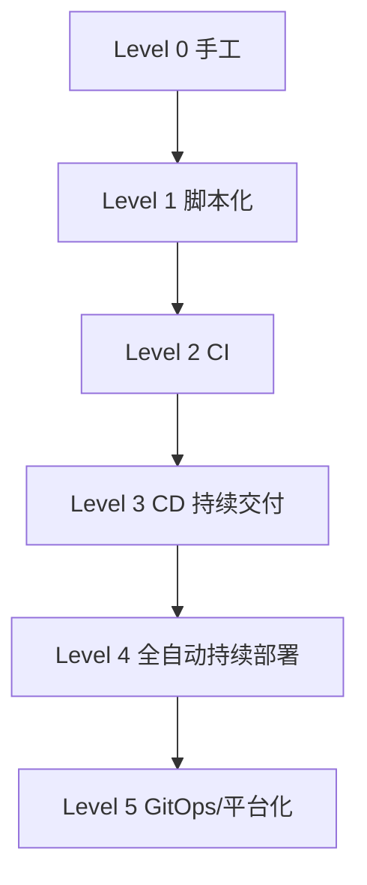
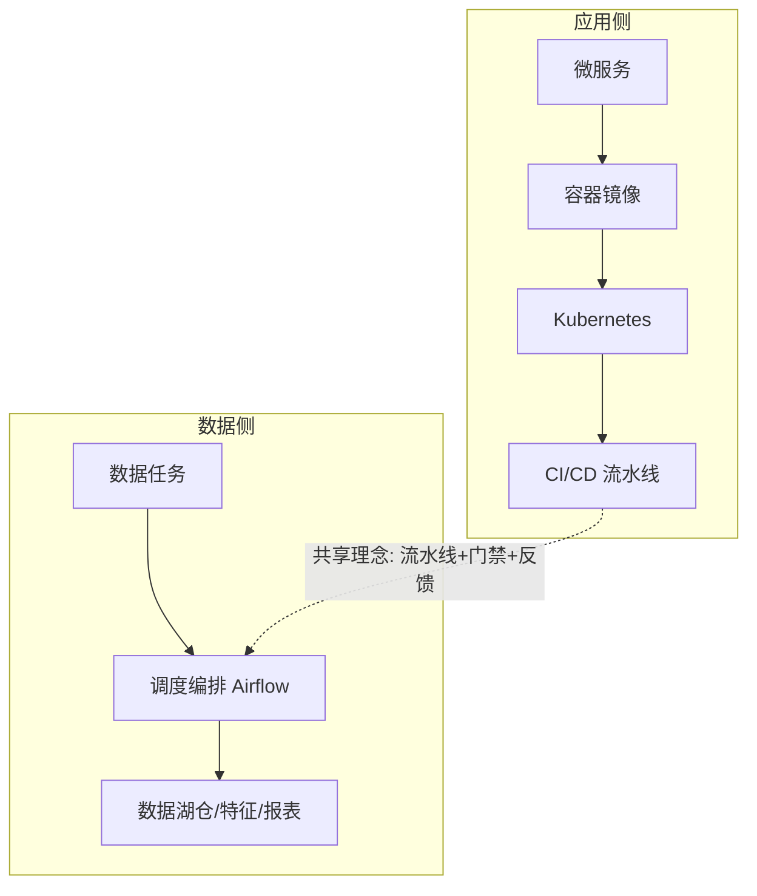
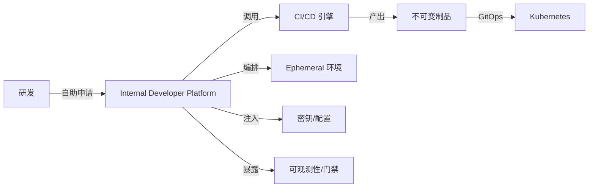

# CI/CD · 01 概述与核心概念

> **口诀：流水线只做一件事——把代码可靠地变成可运行的制品。** CI/CD 的全部努力，都是为了缩短"想法变成价值"的距离，同时不让系统更脆弱。

本篇讲清三件事：**CI/CD 到底是什么（概念与边界）**、**它在 DevOps 与研发协作中的位置**、以及**衡量它好不好用的客观标尺（DORA 指标与成熟度模型）**。后续的构建、分支、部署、GitOps 等分篇都是本篇的展开。

## 一、CI/CD 是什么：三个缩写，三种能力

CI/CD 是 **Continuous Integration（持续集成）**、**Continuous Delivery（持续交付）**、**Continuous Deployment（持续部署）** 的统称。三者经常被连写，但边界和责任完全不同。

### 1.1 CI（持续集成）——让"合代码"这件事不再可怕

持续集成的核心主张：**每个开发者频繁地（至少每天一次）把本地改动合并到主干**，并且每次合并都触发一次自动化构建 + 自动化测试。它的敌人是"集成地狱"——所有人各自开发几周，最后合并时冲突满天飞。

CI 回答的问题是："我刚写的代码，和别人的代码、和主干、和环境，还配不配？"

### 1.2 CD（持续交付）——让"能发布"成为常态

持续交付指的是：代码通过 CI 后，会自动进入一个**始终可发布（deployable）**的状态。也就是说，任何一次主干上的提交，理论上都可以在几分钟内安全地推到生产环境。是否真的发布，由业务决定（通常保留一个手动审批闸门）。

CD（Delivery）回答的问题是："我们是不是随时有能力发布？"

### 1.3 CD（持续部署）——让"发布"自动化发生

持续部署比持续交付更激进：**一旦代码通过所有自动化门禁，就自动部署到生产，无需人工批准**。它把"能否发布"的决策权完全交给了流水线。这要求极高的测试覆盖和强大的可观测/回滚能力作为兜底。

CD（Deployment）回答的问题是："我们能不能让发布这件事彻底无人值守？"

### 1.4 三者边界与区别

| 维度 | CI（持续集成） | CD 持续交付（Delivery） | CD 持续部署（Deployment） |
|------|----------------|------------------------|---------------------------|
| 触发方式 | 每次提交 | CI 通过后自动 | 门禁通过后自动 |
| 终点 | 产出通过测试的制品 | 到达"可发布"状态（含手动闸门） | 自动到达生产环境 |
| 人工干预 | 无（除修复红构建） | 有（发布按钮/审批） | 无 |
| 风险敞口 | 低 | 中（取决于闸门质量） | 高（需强回滚兜底） |
| 适用场景 | 几乎所有团队 | 多数互联网/企业团队 | 高成熟度的 SaaS/平台团队 |

> **口诀：CI 管"合得对不对"，持续交付管"随时发不发得"，持续部署管"自动发"。** 三者层层递进，前一步是后一步的前提。

## 二、DevOps 与 CI/CD 的位置

### 2.1 DevOps 是一种文化，不是一款工具

DevOps（Development + Operations）的核心是**打破研发与运维之间的组织墙**，通过文化、自动化、度量、共享（CAMS 模型）让软件从想法到生产的速度更快、更稳。它强调"谁构建，谁运行（You build it, you run it）"的责任共担。

CI/CD 是 DevOps 文化在**工程实践层面最具体、最可落地的抓手**——没有自动化的交付流水线，DevOps 就只是口号。

### 2.2 CI/CD 在 DevOps 闭环中的位置

> **口诀：DevOps 是世界观，CI/CD 是方法论，流水线是实现手段。** 工具解决不了协作问题，但协作没有工具也落不了地。

## 三、流水线（Pipeline）是什么

### 3.1 定义

流水线是把"代码 → 制品 → 生产"的全过程拆成一连串**自动化、可编排、可观测**的阶段。每个阶段只做一件事，失败就立刻亮红灯并通知负责人，成功就自动流向下一阶段。

### 3.2 典型阶段

| 阶段 | 目标 | 关键产物 | 常见工具 |
|------|------|---------|---------|
| 代码检出 | 拉取最新源码与依赖 | 工作区 | Git、CI Runner |
| 构建 | 编译/转译，产出可执行物 | 二进制/包 | Maven、Gradle、Go、npm |
| 测试 | 用自动化守住质量底线 | 测试报告、覆盖率 | JUnit、pytest、Playwright |
| 制品 | 生成不可变、可溯源的产物 | jar/wheel/镜像 | Nexus、Harbor |
| 部署 | 把制品放到目标环境 | 运行实例 | ArgoCD、Helm、kubectl |
| 反馈 | 把结果回传给人 | 通知、仪表盘 | 钉钉/Slack、Grafana |

### 3.3 流水线的工程属性

- **幂等**：同一份输入，跑多少次结果一致。
- **快速失败（Fail Fast）**：越靠前的阶段（编译、单测）越便宜，应优先拦住错误。
- **可观测**：每个阶段耗时、成功率、日志都可查。
- **可重试**：网络抖动导致的失败应能一键重跑，而非从头来过。

## 四、左移（Shift-Left）与持续反馈

### 4.1 左移：把问题消灭在最早、最便宜的地方

"左移"指把质量保障、安全、性能等验证动作，从传统的"上线前最后一道关"，**前移到开发、编码、提交阶段**。因为越早发现缺陷，修复成本越低（IBM 经典数据：需求阶段发现缺陷修复成本是上线后的 1/100）。

### 4.2 持续反馈闭环

CI/CD 的本质是一个高速反馈环：**提交 → 自动验证 → 结果回传 → 开发者修正**。循环越快，团队学习能力越强。DORA 的"变更前置时间"衡量的是这个环的完整长度。

### 4.3 小批量、快速失败

- **小批量（Small Batch）**：一次只交付小的、独立的改动，降低每次发布的爆炸半径（blast radius），也更容易定位问题。
- **快速失败**：红灯第一时间亮，绝不带病合入。

> **口诀：左移是为了"早死早超生"，小批量是为了"死也只死一小块"。**

⚠️ **反模式**：把 CI 跑得巨慢（一小时以上）却不优化，开发者会绕过它、本地跳过、或攒一大波再合，CI 形同虚设。红构建无人修复、长期挂着，是团队协作崩溃的前兆。

## 五、GitOps 理念（概念版，详述见第 8 篇）

### 5.1 三句话讲清 GitOps

GitOps = **Git + Operations**：用 Git 仓库里声明式的配置文件，作为系统期望状态的**唯一事实源**；由运行在集群内的**代理（agent）以"拉（pull）"的方式**持续比对并调和（reconcile）实际状态与期望状态。

### 5.2 四个 OpenGitOps 原则（CNCF，v1.0）

1. **声明式（Declarative）**：系统状态用"它应该长什么样"来描述，而非"一步步怎么做的脚本"。
2. **版本化且不可变（Versioned & Immutable）**：期望状态存于 Git，每次变更都是一次提交，回滚即 `git revert`。
3. **自动拉取（Pulled Automatically）**：集群内 agent 主动从 Git 拉取，而不是外部 CI 用 `kubectl apply` 推送。
4. **持续调和（Continuously Reconciled）**：agent 持续比对实际与期望，发现漂移（drift）就自动纠正，实现自愈。

> **口诀：GitOps 不是"把 YAML 放 Git 里"，而是"集群自己认账、自己对齐"。** 真正的 GitOps 是拉式调和，不是推送式 CI/CD。

⚠️ **生产踩坑**：把"CI 流水线里 `kubectl apply`"当成 GitOps 是常见误解。那只是"Git 触发的 CI/CD"，没有持续调和与自愈，集群内被人手改后 Git 一无所知。详见 [08-GitOps 与声明式交付](08-云原生CI-CD与GitOps工具.md)。

## 六、DORA 四项关键指标（2025 更新）

DORA（DevOps Research and Assessment，现属 Google）用一套**与结果强相关**的指标衡量交付效能。经典四项：

| 指标 | 英文 | 含义 | Elite 基准 |
|------|------|------|-----------|
| 部署频率 | Deployment Frequency (DF) | 多频繁向生产发布 | 按需（每天多次） |
| 变更前置时间 | Lead Time for Changes (LT) | 从提交到生产运行的耗时 | 小于 1 小时 |
| 变更失败率 | Change Failure Rate (CFR) | 导致生产故障的发布占比 | 0–15%（部分口径 0–5%） |
| 服务恢复时间 | Mean Time to Recovery (MTTR) | 故障后恢复服务的平均时长 | 小于 1 小时 |

> 数据来源：DORA / Google《Accelerate》研究（Nicole Forsgren、Jez Humble、Gene Kim）及历年 State of DevOps 报告。Elite 团队达成上述基准的概率是普通团队的 2 倍以上。

### 6.1 2025 年新进展（联网核实）

- **2025 报告更名为《State of AI-Assisted Software Development》**，调研近 5000 名技术从业者，明确指出 **90% 开发者已在工作流中使用 AI 工具**（较上一年 +14%），日均约 2 小时。
- **新增第五项指标：返工率（Rework Rate）**——统计为修复线上缺陷而被迫推送的非计划修复占比。它补上了原四项指标对"隐性不稳定"的盲区。
- 指标被重构为：**3 个吞吐指标**（部署频率、变更前置时间、返工率）+ **2 个不稳定指标**（变更失败率、部署失败恢复时间）。
- **用七类"团队画像（archetypes）"取代原有的 Elite/High/Medium/Low 四档分级**（如 Foundational Challenges、Legacy Bottleneck、Harmonious High-Achievers 等），强调不同团队需差异化干预。
- **"镜像与放大器"效应**：AI 会放大团队既有的好坏实践——流程好则更快，流程烂则更乱。不能只看 DF/ LT 上升就以为变好，须结合 CFR 与返工率一起看。

### 6.2 SPACE 与 DevEx（工程效能补充视角）

DORA 只看"产出结果"，SPACE（2021，微软/ GitHub）与 DevEx（2023，DX/ GitHub）补充了"人"的维度：

| 框架 | 关注点 | 维度 |
|------|--------|------|
| DORA | 交付结果 | 速度 + 稳定性 |
| SPACE | 工程效能多维 | 满意度(S)、性能(P)、活动(A)、沟通协作(C)、效率流程(E) |
| DevEx | 开发者体验 | 反馈循环、认知负荷、流畅度 |

> **口诀：DORA 看"车跑多快多稳"，DevEx 看"司机累不累"。** 2025 年主流做法是 DORA + DevEx 组合，既看结果也不透支人。

## 七、CI/CD 成熟度模型

| 级别 | 名称 | 特征 | 典型痛点 |
|------|------|------|---------|
| 0 | 手工 | 本地构建、手动拷贝上线、靠文档 | 极易出错、不可复现 |
| 1 | 脚本化 | 用 Shell/Python 串起构建部署 | 脚本散落、难维护、无门禁 |
| 2 | CI | 提交即自动构建+测试 | 仍靠人手动发布 |
| 3 | 持续交付 | 自动到预发、保留发布闸门 | 生产发布仍慢 |
| 4 | 全自动部署 | 通过门禁自动上生产 | 需强回滚与可观测兜底 |
| 5 | GitOps/平台化 | 声明式、拉式调和、自助平台 | 组织与治理复杂度高 |

> **口诀：成熟度不是"工具多高级"，而是"从提交到价值，人少插手多少"。**

⚠️ **反模式**：还没治好"构建慢、测试弱、回滚难"，就跳到 Level 4 全自动部署，只会让故障以更高频率、更大范围发生。成熟度要逐级爬，不要跳级。

## 八、CI/CD 与微服务、容器、云原生、大数据的关系

- **微服务**：服务多、变更频繁，天然需要独立流水线 + 独立制品 + 独立部署，是 CI/CD 普及的核心驱动力。
- **容器化 / 云原生**：Docker 把"环境"一起打包，Kubernetes 提供声明式编排，使部署可重复、可回滚，是现代化 CI/CD 的底座。
- **大数据**：离线/实时数据流水线（如 Airflow、DolphinScheduler 编排的 ETL）本质上也是"流水线"，可类比 CI/CD 的"代码 → 制品 → 服务"思想——只是这里的"制品"是数据表/特征/报表，"部署"是调度执行。

## 九、本篇小结 Checklist

- [ ] 分清 CI、持续交付、持续部署的边界与自动化程度差异。
- [ ] 理解 DevOps 文化是根，CI/CD 是其工程抓手。
- [ ] 流水线按"检出→构建→测试→制品→部署→反馈"分段，快速失败。
- [ ] 践行左移、小批量、持续反馈。
- [ ] GitOps 核心是声明式 + Git 唯一事实源 + 拉式调和（详述见第 8 篇）。
- [ ] 用 DORA 四项（2025 加返工率为五项）客观衡量，结合 DevEx 看人。
- [ ] 成熟度逐级提升，不要跳级。

## 与其他模块的关联

- 分支策略是流水线的输入前提，见 [02-版本控制与分支策略](02-版本控制与分支策略.md)。
- 构建与制品是流水线中段核心，见 [03-构建与制品管理](03-构建与制品管理.md)。
- GitOps 声明式交付详述见 [08-GitOps 与声明式交付](08-云原生CI-CD与GitOps工具.md)。
- 容器与编排底座见 [../../云原生/K8S.md](../../云原生/K8S.md)。
- 大数据调度流水线类比如 [../大数据/02-技术体系与架构演进.md](../大数据/02-技术体系与架构演进.md)、[../大数据/08-流处理计算：Flink.md](../大数据/08-流处理计算：Flink.md)。
- 安全门禁与供应链（SBOM/签名/扫描）深入见 [13-安全与供应链安全](13-可观测性DORA度量与DevSecOps.md)。

> 参考：
> - DORA / Google《Accelerate》与 State of DevOps 报告：https://dora.dev/
> - DORA 2025 报告（State of AI-Assisted Software Development）解读：https://plandek.com/blog/dora-metrics-in-the-age-of-ai-how-engineering-leaders-should-measure-delivery-in-2025/
> - DORA 指标基准与七类画像：https://dwaynehelena.com/docs/dora-metrics
> - OpenGitOps 四项原则（CNCF）：https://www.cncf.io/blog/2025/06/09/gitops-in-2025-from-old-school-updates-to-the-modern-way/ 、 https://deepwiki.com/cncf/tag-app-delivery/3.1-gitops-principles
> - Trunk-Based Development 与精英效能关联：https://www.minware.com/guide/best-practices/trunk-based-development
> - SPACE 框架（Microsoft/GitHub）：https://queue.acm.org/detail.cfm?id=3454124
> - DevEx 框架（DX/GitHub）：https://queue.acm.org/detail.cfm?id=3595878

## 十、平台工程（Internal Developer Platform, IDP）趋势

平台工程以"内部开发者平台"把 CI/CD、环境、密钥、可观测性、模板化流水线**产品化**给研发自助，目标是降低认知负荷、统一最佳实践。CI/CD 从"各写各的脚本"演进为"平台提供的 Golden Pipeline + 自助环境"。

- **Golden Path**：平台固化标准路径（构建/测试/部署/晋级），研发只声明意图。
- **Backstage**（CNCF）是典型 IDP 门户，打通 CI 状态、服务目录、脚手架模板。
- 与 CI/CD 关系：CI/CD 是 IDP 的"交付引擎"，IDP 是 CI/CD 的"产品外壳"。

## 十一、CI/CD 与 GitOps 的边界

二者易混淆，但职责不同：

| 维度 | CI/CD（传统 push） | GitOps（pull） |
|------|--------------------|----------------|
| 触发 | 事件推送到集群 | 控制器拉取 Git 期望状态 |
| 事实源 | 流水线定义 + 手动操作 | Git 仓库唯一事实源 |
| 部署权 | CI 持有 kubeconfig/admin | 集群内 Controller 调和 |
| 适用 | 构建/测试/通用任务 | K8s 声明式交付/晋级 |

> 结论：**CI 负责"造出可信制品"，GitOps 负责"把制品按 Git 声明拉到集群"**。现代架构常为 CI(push) 产出镜像 → GitOps(pull) 负责部署，二者互补而非互斥。

## 十二、CI/CD 与 FinOps 的关系

流水线直接驱动云成本，平台团队需以 FinOps 视角治理：

- **构建资源**：macOS / GPU runner、大规格 agent 成本高，按需起停、用 Spot / 抢占式节点。
- **常驻环境**：每个 MR 起一套 Review App 若不复用，费用暴涨 → ephemeral + 自动回收。
- **镜像与存储**：制品库 / 缓存保留策略（`expire_in`）控制存储成本。
- **FinOps 闭环**：把流水线资源消耗接入成本看板，按团队/仓库分摊，设预算阈值门禁。
- 在 L3/L4 成熟度，用"单位部署成本（Cost per Deploy）"衡量平台效率，避免为"快"无脑堆资源。

## 本篇补充 Checklist

- [ ] 理解 IDP 把流水线"产品化"，Golden Pipeline 是标准路径。
- [ ] 分清 CI（造制品，push）与 GitOps（拉部署，pull）边界，现代架构二者并存。
- [ ] 把 FinOps 纳入流水线治理：构建资源 / 常驻环境 / 存储成本可观测、可分摊。
