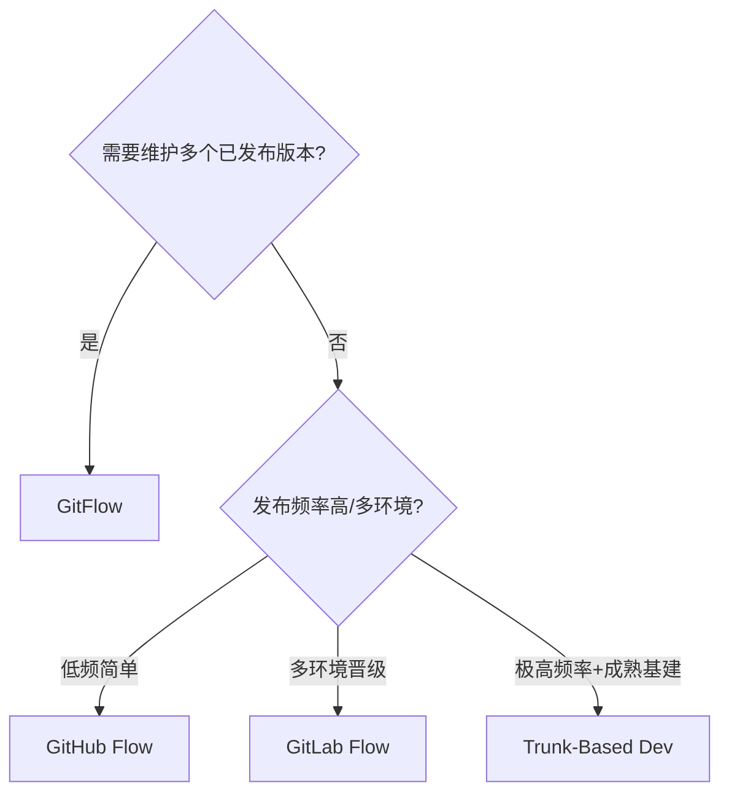
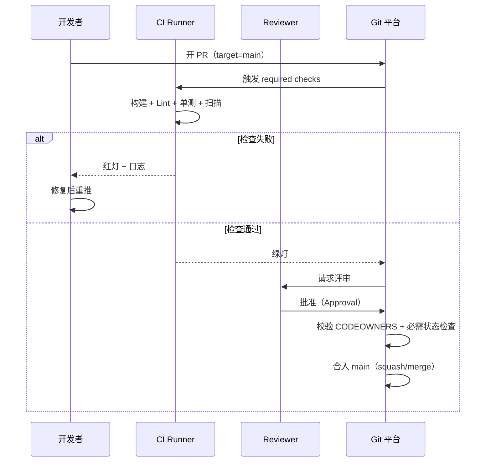
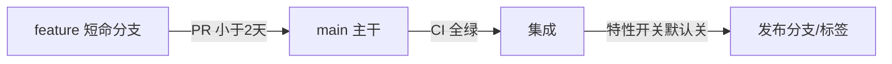

# CI/CD · 02 版本控制与分支策略

> **口诀：分支不是为了"隔离风险"，而是为了"尽快合回来"。** 长分支越长越危险，短分支越短越安全。

本篇是流水线的"上游"：代码怎么管、怎么合、怎么分叉与发布，直接决定了 CI 能跑多顺、发布能多稳。先对比集中式与分布式，再逐一拆解 GitFlow、GitHub Flow、GitLab Flow、Trunk-Based Development 四种主流模型，并给出选型决策、约定式提交、语义化版本与 PR 门禁实践。

## 一、集中式 vs 分布式：版本控制的两条路

| 维度 | 集中式（SVN） | 分布式（Git） |
|------|--------------|--------------|
| 仓库模型 | 单一中央仓库，工作区是"某个版本" | 每人一份完整仓库（含历史） |
| 离线工作 | 几乎不能（提交需联网） | 完全可离线提交/分支/合并 |
| 分支成本 | 重（服务端对象） | 极轻（本地指针） |
| 协作依赖 | 强依赖中央服务器 | 去中心，可多远程互相同步 |
| 典型工具 | SVN、Perforce（大厂仍用） | Git、Mercurial |

> **口诀：SVN 把历史放在服务器，Git 把服务器装进每个人口袋。** 现代 CI/CD 几乎都建立在 Git 之上，因为轻量分支 + 离线提交是高频集成的物理基础。

⚠️ **生产踩坑**：从 SVN 迁 Git 时，别只搬代码不搬历史与分支策略心智。SVN 的"目录级权限"在 Git 里不存在，需用 `CODEOWNERS` + protected branches 重新设计权限模型。

## 二、GitFlow：最经典但最重

GitFlow（Vincent Driessen，2010）用**两条长期分支 + 三类辅助分支**：

- `master`：永远对应生产环境的可发布状态（每个 commit 都可认为是发布点）。
- `develop`：集成分支，日常开发在此汇聚。
- `feature/*`：从 develop 拉出，开发完后合回 develop（短生命周期）。
- `release/*`：从 develop 拉出，只修 bug/微调，就绪后合回 master 与 develop。
- `hotfix/*`：从 master 拉出，紧急修生产问题，合回 master 与 develop。

```mermaid
gitgraph TB
    commit id:"init"
    branch develop
    checkout develop
    commit id:"d1"
    branch feature/login
    checkout feature/login
    commit id:"f1"
    commit id:"f2"
    checkout develop
    merge feature/login
    commit id:"d2"
    branch release/1.0
    checkout release/1.0
    commit id:"r1"
    checkout master
    merge release/1.0 id:"v1.0"
    checkout develop
    merge release/1.0
    branch hotfix/1.0.1
    checkout hotfix/1.0.1
    commit id:"h1"
    checkout master
    merge hotfix/1.0.1 id:"v1.0.1"
    checkout develop
    merge hotfix/1.0.1
```

| 优点 | 缺点 |
|------|------|
| 概念清晰，发布/热修路径明确 | 分支多、长期分支重，合并复杂 |
| 适合有固定版本号的客户端/嵌入式 | 与"持续交付"理念冲突（develop 长期不发布） |
| 并行多版本维护方便 | CI 难以聚焦，红线难定义 |

> **口诀：GitFlow 适合"按版本卖软件"，不适合"按分钟交付服务"。**

适用场景：需要维护多个已发布版本（如 App、SDK、车载固件）的团队；不适用于一天多次部署的 SaaS。

## 三、GitHub Flow：极简主干模型

GitHub Flow 只有一条**长期 `main` 分支** + 短生命周期功能分支 + PR：

1. 从 `main` 拉 `feature` 分支。
2. 频繁推送，开 Pull Request。
3. 讨论 + 评审 + 必须通过 CI 检查。
4. 合回 `main`，随即可部署。

```mermaid
gitgraph TB
    commit id:"m1"
    branch feat/a
    checkout feat/a
    commit id:"a1"
    commit id:"a2"
    checkout main
    merge feat/a id:"m2"
    branch feat/b
    checkout feat/b
    commit id:"b1"
    checkout main
    merge feat/b id:"m3"
```

| 优点 | 缺点 |
|------|------|
| 简单、上手快，CI 聚焦 main | 多环境/多版本发布不够灵活 |
| 与持续交付天然契合 | 缺乏"发布分支"概念，回滚靠 revert |

> 适用：小型团队、Web 服务、持续部署团队。

## 四、GitLab Flow：折中，带环境/发布分支

GitLab Flow 在 GitHub Flow 之上引入**环境分支（production/staging）**或**发布分支（stable）**，解决"main 合了但不一定马上发"和"多环境对齐"的问题。它强调：**上游优先（upstream first）**——改动先合到最上游分支（main），再向下游（staging → production）合并，避免修复只在生产分支。

```mermaid
gitgraph TB
    commit id:"m1"
    branch staging
    checkout staging
    merge main id:"s1"
    branch production
    checkout production
    merge staging id:"p1"
    checkout main
    commit id:"m2"
    checkout staging
    merge main id:"s2"
    checkout production
    merge staging id:"p2"
```

| 优点 | 缺点 |
|------|------|
| 兼顾简单与环境/发布复杂度 | 需要约定合并流向，易违规 |
| 适合多环境逐级晋级 | 比 GitHub Flow 略重 |

## 五、Trunk-Based Development（TBD）：2025 主流趋势

### 5.1 核心原则

TBD 主张：**所有人向单一 `trunk`/ `main` 高频集成（每天至少一次）**，尽量不用长生命周期分支。未完成的功能用**特性开关（Feature Flag）**隐藏，而不是用分支隔离。

- 分支存活时间：**小时级，最好 < 24 小时**。
- 每次提交触发 CI，main 必须始终绿（releasable）。
- 代码评审在数小时内完成，而非数天。
- 用特性开关解耦"部署"与"发布"。

```mermaid
gitgraph TB
    commit id:"t1"
    commit id:"t2"
    branch f1
    checkout f1
    commit id:"x1"
    checkout main
    merge f1 id:"t3"
    branch f2
    checkout f2
    commit id:"y1"
    checkout main
    merge f2 id:"t4"
    commit id:"t5"
    branch f3
    checkout f3
    commit id:"z1"
    checkout main
    merge f3 id:"t6"
```

### 5.2 为什么大厂都用 TBD（联网核实）

- **Google**：2.5 万+ 开发者共用一个巨型单体仓库（monorepo），数十年坚持 TBD，靠 Bazel 极速构建 + Gerrit 严格评审 + 提交前自动跑数十万相关测试兜底。
- **Meta（Facebook）**：每天向 main 提交数千次，生产环境一天两次发布，靠特性开关控制功能灰度。
- **Microsoft**：Windows、Azure 等团队大规模转向 TBD，集成痛苦显著下降。
- DORA 研究多年数据显示：精英效能团队普遍"每日合入、小批量、主干开发"。

### 5.3 TBD 的必备前提（缺一不可）

| 前提 | 说明 |
|------|------|
| 快 CI | 每次提交跑测试，反馈在分钟级；慢 CI 会杀死合入频率 |
| 强测试 | 单测/集成测试必须扎实，main 不允许红 |
| 小批量纪律 | 工作要能切片成每日可合的小块 |
| 特性开关 | 先合后发，开关要有人清理（避免永久堆积） |
| 团队文化 | 共享 main 所有权、轻量快速评审、高信任 |

> **口诀：TBD 不是 Git 技巧，是组织能力——它用"纪律"换"无合并地狱"。**

⚠️ **生产踩坑**：
- 没有快 CI 与强测试就强行 TBD，等于撤掉安全网，一合就崩。
- 特性开关只开不关，遗留开关变成"技术债地雷"，导致代码路径爆炸、测试组合失控。须建开关清单 + 定期清理机制。
- 大团队若协调差，TBD 会放大混乱。可按"业务域"切边界、用模块化 + 强 owner 制缓解。

## 六、四种模型对比与选型决策

| 模型 | 长期分支数 | 集成频率 | 发布灵活性 | 与 CD 契合度 | 适用 |
|------|-----------|---------|-----------|------------|------|
| GitFlow | 多（master+develop 长期） | 低 | 高（多版本） | 低 | 客户端/嵌入式/多版本维护 |
| GitHub Flow | 1（main） | 高 | 中 | 高 | 小团队/Web 服务 |
| GitLab Flow | 1+N（环境/发布） | 高 | 高 | 高 | 多环境企业 |
| Trunk-Based | 1（trunk） | 极高 | 中（靠开关） | 极高 | 高成熟度 SaaS/平台 |



选型口诀：**"卖版本用 GitFlow，卖服务用主干；中等复杂度 GitLab Flow 兜底。"**

## 七、约定式提交与语义化版本

### 7.1 Conventional Commits

提交信息遵循 `type(scope): subject` 规范，机器可读、可自动生成 CHANGELOG、可驱动版本号。

```text
feat(auth): 支持短信验证码登录
fix(api): 修复分页越界导致 500
docs(readme): 补充本地启动说明
refactor(core): 抽离配置加载逻辑
test(order): 补充下单幂等单测
chore(deps): 升级 spring-boot 到 3.2
```

### 7.2 SemVer 语义化版本

版本号 `MAJOR.MINOR.PATCH`：

- **MAJOR**：不兼容的 API 变更。
- **MINOR**：向下兼容的功能新增。
- **PATCH**：向下兼容的缺陷修复。

结合 Conventional Commits，`feat` 升 MINOR，`fix` 升 PATCH，`BREAKING CHANGE` 升 MAJOR。可用 `standard-version` / `semantic-release` 自动发版。

```bash
# 自动根据 commit 生成 CHANGELOG 并打 tag
npx standard-version

# 或全自动 release（含 npm publish / git tag）
npx semantic-release
```

> **口诀：提交写得规范，版本自己会长出来。**

## 八、PR/MR 评审流程与门禁

### 8.1 一次标准 PR 评审门禁流程



### 8.2 关键机制

| 机制 | 作用 |
|------|------|
| Protected Branches | 禁止直接 push 到 main，强制走 PR |
| Required Status Checks | 指定 CI 检查必须通过才允许合入 |
| CODEOWNERS | 按目录指定评审责任人，自动指派 reviewer |
| Required Reviews | 至少 N 人批准（含 owner） |
| 分支保护规则 | 禁止 force push、要求线性历史/签名 |

`CODEOWNERS` 示例：

```text
# /CODEOWNERS
*                       @platform/team
/ci-cd/                 @ci-cd/owners
/src/payment/           @payment/owners @security/team
```

⚠️ **生产踩坑**：
- "认领 PR 但三天不审"会堵塞交付。应设 SLA（如 4 小时内首评）并配轮值。
- 必需检查若包含不稳定（flaky）测试，开发者会习惯性重试绕过，门禁名存实亡。flaky 测试必须单独标记并限期修复。
- squash merge 会改写历史，需团队统一约定，避免 `git blame` 失真。

## 九、Release 分支维护与 cherry-pick 热修

即便采用 TBD，生产仍可能需对**已发布版本**单独修紧急 bug（不等问题随主干节奏发）。做法：从对应发布 tag 拉 `release/x.y` 分支，用 `cherry-pick` 把主干上的修复提交摘过去。

```bash
# 从发布 tag 拉出维护分支
git checkout -b release/2.3 v2.3.0
# 把主干上的修复提交摘到维护分支
git cherry-pick <commit-hash-of-fix>
# 打补丁版本并触发该分支专属流水线
git tag v2.3.1
git push origin release/2.3 --tags
```

```mermaid
gitgraph TB
    commit id:"v2.3.0" tag:"v2.3.0"
    branch main
    checkout main
    commit id:"fix on main"
    branch release/2.3
    checkout release/2.3
    commit id:"v2.3.0 base"
    cherry-pick id:"cp fix"
    commit id:"v2.3.1" tag:"v2.3.1"
```

> **口诀：热修靠 cherry-pick 摘果子，不是从老分支重新长一棵树。**

⚠️ **反模式**：长期维护一堆 release 分支且各自偏离主干，修复要在 N 个分支重复合入，最终无人能说清生产到底跑的哪个版本。应限定"同时维护的版本窗口"（如仅最近两个 minor）。

## 十、本篇小结 Checklist

- [ ] 理解集中式与分布式的本质差异，现代 CI/CD 建立在 Git 之上。
- [ ] 四种分支模型按需选型，别盲目抄大厂。
- [ ] 高成熟度团队优先 TBD，但先补齐快 CI + 强测试 + 特性开关。
- [ ] 提交用 Conventional Commits，版本用 SemVer，发版自动化。
- [ ] PR 门禁=protected branch + required checks + CODEOWNERS + 审批。
- [ ] 紧急热修用 release 分支 + cherry-pick，限定维护窗口。

## 与其他模块的关联

- 分支策略的产出就是流水线的输入，见 [01-概述与核心概念](01-概述与核心概念.md)。
- 主干合入后进入构建与制品环节，见 [03-构建与制品管理](03-构建与制品管理.md)。
- 多环境晋级（staging→production）与声明式交付衔接 [08-GitOps 与声明式交付](08-云原生CI-CD与GitOps工具.md)。
- 制品晋级与不可变见 [03-构建与制品管理](03-构建与制品管理.md) 与 [13-安全与供应链安全](13-可观测性DORA度量与DevSecOps.md)。
- 容器镜像 tag 策略与 Git tag 对齐见 [../../云原生/K8S.md](../../云原生/K8S.md)。
- 大数据任务分支/发布节奏类比 [../大数据/02-技术体系与架构演进.md](../大数据/02-技术体系与架构演进.md)。

> 参考：
> - GitFlow（Vincent Driessen）：https://nvie.com/posts/a-successful-git-branching-model/
> - GitHub Flow：https://docs.github.com/en/get-started/quickstart/github-flow
> - GitLab Flow：https://docs.gitlab.com/ee/topics/gitlab_flow.html
> - Trunk-Based Development 官方：https://trunkbaseddevelopment.com/
> - TBD 2025 实践与 Google/Meta 案例：https://www.minware.com/guide/best-practices/trunk-based-development 、 https://asyncbits.dev/writing/trunk-based-development
> - Conventional Commits：https://www.conventionalcommits.org/
> - SemVer：https://semver.org/
> - CODEOWNERS（GitHub）：https://docs.github.com/en/repositories/managing-your-repositorys-settings-and-features/customizing-your-repository/about-code-owners

## 十一、Trunk-Based Development 落地细节

TBD 不是"所有人直接推 main"，而是**短命分支（<2 天）+ 高频合入 + 特性开关护体**：



实操要点：
- **分支存活 ≤ 2 天**，否则 rebase 冲突爆炸；大需求拆小 PR。
- **main 永不准红**：红则全员停手先修，broken main 是最高优先级。
- **特性开关（Feature Flag）** 隔离未完成功能，保证 main 始终可发布。
- **保护分支 + required checks**：PR 必须过 CI + 至少 1 审批才合入。

```bash
# 每日开工：从主干拉短命分支
git switch -c feat/login main
# 频繁 rebase 保持贴近主干
git fetch origin && git rebase origin/main
# 合入后删除短命分支
git switch main && git merge --no-ff feat/login && git branch -d feat/login
```

## 十二、Release Train（发布火车）

固定节奏发版，赶不上的需求自动滑到下一班，避免"等某个功能"阻塞发布：

| 要素 | 做法 |
|------|------|
| 发车频率 | 双周 / 月度固定窗口 |
| 登车截止 | Code Freeze 前合入主干 |
| 滑车规则 | 未过门禁的需求自动推迟 |
| 发布分支 | freeze 时从 main 切 `release/x.y` |

```bash
git tag -a v2.3.0 -m "Release Train 2026-08"   # 发车打标签
git branch release/2.3 origin/main             # 维护分支
```

## 十三、Cherry-pick 与 Hotfix 流

生产紧急修复**不回 main 改**，而从发布标签拉 `hotfix` 分支修，再双向 cherry-pick：

```bash
git switch -c hotfix/login-bug v2.3.0          # 从发布标签拉
# 修复后提交
git cherry-pick <hotfix_commit> main           # 修复同步回主干
git tag -a v2.3.1 -m "Hotfix login"            # 补丁版本
```

> 原则：hotfix 必须同时进 `main` 与 `release/x.y`，否则下次发版旧 bug 复活。

## 十四、Git 大仓库与 Monorepo 策略

| 问题 | 解法 |
|------|------|
| 仓库过大克隆慢 | Git Partial Clone（`--filter=blob:none`）、浅克隆 `--depth 1` |
| Monorepo 构建慢 | 按变更影响域构建（Bazel / Nx / Turborepo 远程缓存） |
| 单仓库多服务 | 用 `paths:` / `changes:` 触发只变更子项目流水线 |
| 历史膨胀 | `git gc`、Git LFS 存大文件、定期归档 |

```bash
git clone --filter=blob:none --no-checkout https://git/corp/mono.git   # 部分克隆
# CI 中只拉本次变更
git diff --name-only $BASE_SHA $HEAD | grep '^services/order/' && run_order_ci
```

## 本篇补充 Checklist

- [ ] TBD：短命分支 + 高频合入 + 特性开关，main 永不准红。
- [ ] Release Train：固定窗口、Code Freeze、滑车规则。
- [ ] Hotfix 从发布标签拉，修复双向 cherry-pick 回 main。
- [ ] Monorepo 用部分克隆 + 影响域构建 + 路径触发，避免全量跑。
