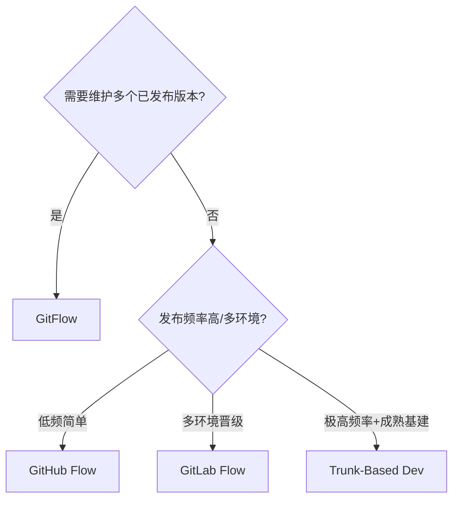
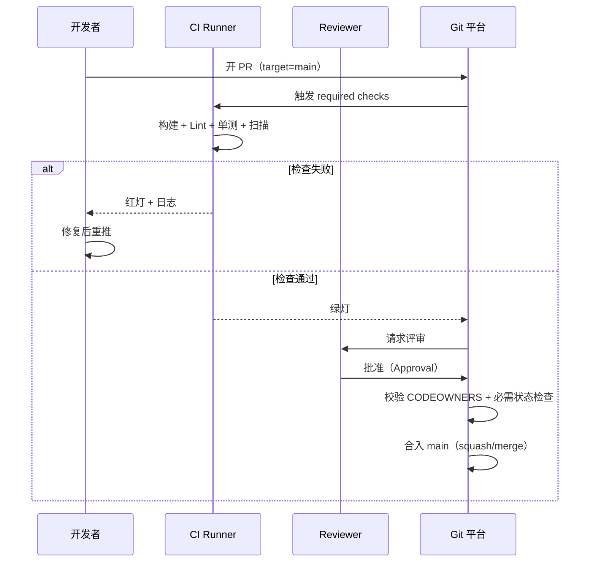
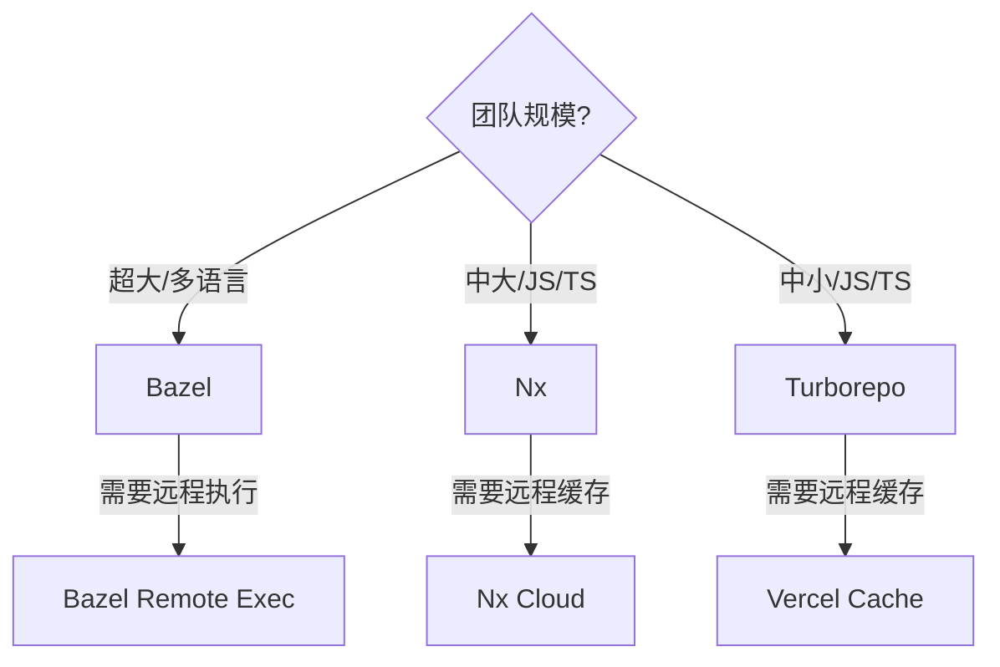
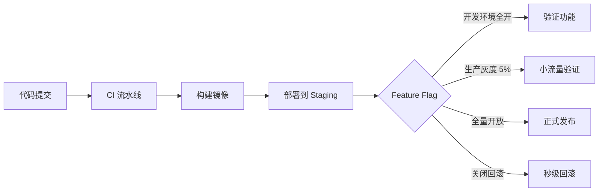
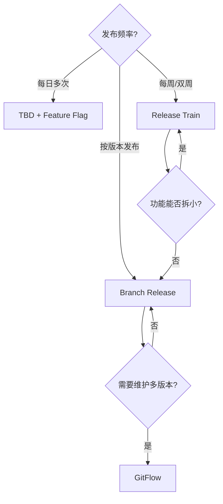
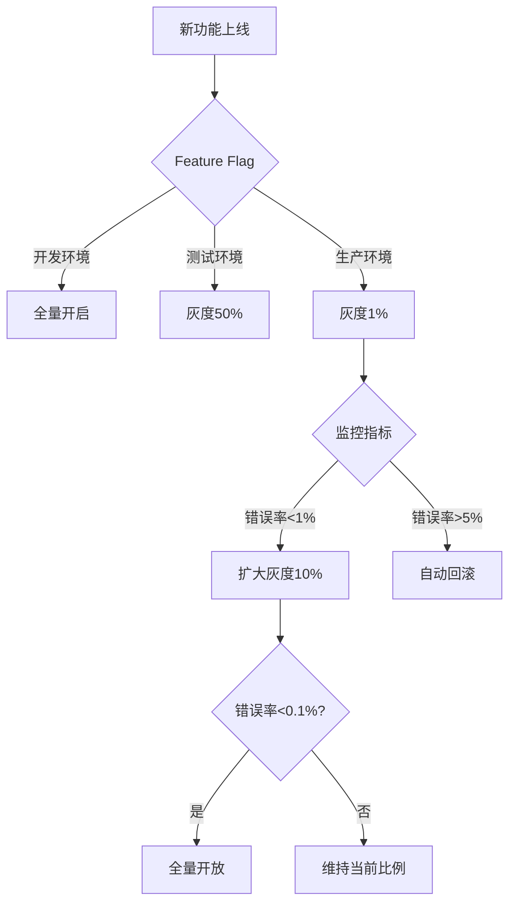
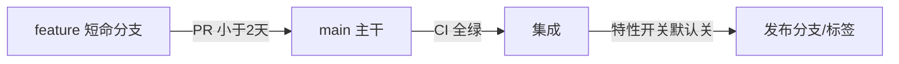
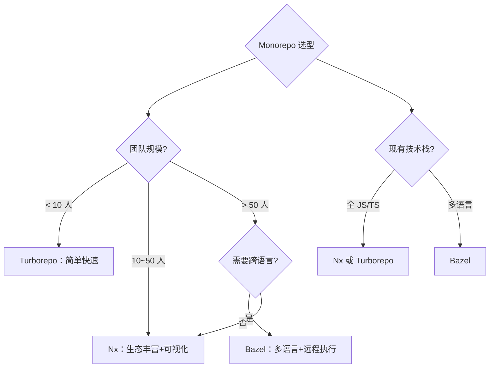
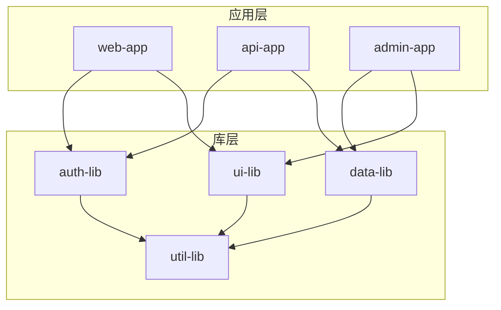

# CI/CD · 02 版本控制与分支策略

> **口诀：分支不是为了"隔离风险"，而是为了"尽快合回来"。** 长分支越长越危险，短分支越短越安全。

本篇是流水线的"上游"：代码怎么管、怎么合、怎么分叉与发布，直接决定了 CI 能跑多顺、发布能多稳。先对比集中式与分布式，再逐一拆解 GitFlow、GitHub Flow、GitLab Flow、Trunk-Based Development 四种主流模型，并给出选型决策、约定式提交、语义化版本与 PR 门禁实践。

## 一、集中式 vs 分布式：版本控制的两条路

| 维度 | 集中式（SVN） | 分布式（Git） |
|------|--------------|--------------|
| 仓库模型 | 单一中央仓库，工作区是"某个版本" | 每人一份完整仓库（含历史） |
| 离线工作 | 几乎不能（提交需联网） | 完全可离线提交/分支/合并 |
| 分支成本 | 重（服务端对象） | 极轻（本地指针） |
| 协作依赖 | 强依赖中央服务器 | 去中心，可多远程互相同步 |
| 典型工具 | SVN、Perforce（大厂仍用） | Git、Mercurial |

> **口诀：SVN 把历史放在服务器，Git 把服务器装进每个人口袋。** 现代 CI/CD 几乎都建立在 Git 之上，因为轻量分支 + 离线提交是高频集成的物理基础。

⚠️ **生产踩坑**：从 SVN 迁 Git 时，别只搬代码不搬历史与分支策略心智。SVN 的"目录级权限"在 Git 里不存在，需用 `CODEOWNERS` + protected branches 重新设计权限模型。

## 二、GitFlow：最经典但最重

GitFlow（Vincent Driessen，2010）用**两条长期分支 + 三类辅助分支**：

- `master`：永远对应生产环境的可发布状态（每个 commit 都可认为是发布点）。
- `develop`：集成分支，日常开发在此汇聚。
- `feature/*`：从 develop 拉出，开发完后合回 develop（短生命周期）。
- `release/*`：从 develop 拉出，只修 bug/微调，就绪后合回 master 与 develop。
- `hotfix/*`：从 master 拉出，紧急修生产问题，合回 master 与 develop。

```mermaid
gitgraph TB
    commit id:"init"
    branch develop
    checkout develop
    commit id:"d1"
    branch feature/login
    checkout feature/login
    commit id:"f1"
    commit id:"f2"
    checkout develop
    merge feature/login
    commit id:"d2"
    branch release/1.0
    checkout release/1.0
    commit id:"r1"
    checkout master
    merge release/1.0 id:"v1.0"
    checkout develop
    merge release/1.0
    branch hotfix/1.0.1
    checkout hotfix/1.0.1
    commit id:"h1"
    checkout master
    merge hotfix/1.0.1 id:"v1.0.1"
    checkout develop
    merge hotfix/1.0.1
```

| 优点 | 缺点 |
|------|------|
| 概念清晰，发布/热修路径明确 | 分支多、长期分支重，合并复杂 |
| 适合有固定版本号的客户端/嵌入式 | 与"持续交付"理念冲突（develop 长期不发布） |
| 并行多版本维护方便 | CI 难以聚焦，红线难定义 |

> **口诀：GitFlow 适合"按版本卖软件"，不适合"按分钟交付服务"。**

适用场景：需要维护多个已发布版本（如 App、SDK、车载固件）的团队；不适用于一天多次部署的 SaaS。

## 三、GitHub Flow：极简主干模型

GitHub Flow 只有一条**长期 `main` 分支** + 短生命周期功能分支 + PR：

1. 从 `main` 拉 `feature` 分支。
2. 频繁推送，开 Pull Request。
3. 讨论 + 评审 + 必须通过 CI 检查。
4. 合回 `main`，随即可部署。

```mermaid
gitgraph TB
    commit id:"m1"
    branch feat/a
    checkout feat/a
    commit id:"a1"
    commit id:"a2"
    checkout main
    merge feat/a id:"m2"
    branch feat/b
    checkout feat/b
    commit id:"b1"
    checkout main
    merge feat/b id:"m3"
```

| 优点 | 缺点 |
|------|------|
| 简单、上手快，CI 聚焦 main | 多环境/多版本发布不够灵活 |
| 与持续交付天然契合 | 缺乏"发布分支"概念，回滚靠 revert |

> 适用：小型团队、Web 服务、持续部署团队。

## 四、GitLab Flow：折中，带环境/发布分支

GitLab Flow 在 GitHub Flow 之上引入**环境分支（production/staging）**或**发布分支（stable）**，解决"main 合了但不一定马上发"和"多环境对齐"的问题。它强调：**上游优先（upstream first）**——改动先合到最上游分支（main），再向下游（staging → production）合并，避免修复只在生产分支。

```mermaid
gitgraph TB
    commit id:"m1"
    branch staging
    checkout staging
    merge main id:"s1"
    branch production
    checkout production
    merge staging id:"p1"
    checkout main
    commit id:"m2"
    checkout staging
    merge main id:"s2"
    checkout production
    merge staging id:"p2"
```

| 优点 | 缺点 |
|------|------|
| 兼顾简单与环境/发布复杂度 | 需要约定合并流向，易违规 |
| 适合多环境逐级晋级 | 比 GitHub Flow 略重 |

## 五、Trunk-Based Development（TBD）：2025 主流趋势

### 5.1 核心原则

TBD 主张：**所有人向单一 `trunk`/ `main` 高频集成（每天至少一次）**，尽量不用长生命周期分支。未完成的功能用**特性开关（Feature Flag）**隐藏，而不是用分支隔离。

- 分支存活时间：**小时级，最好 < 24 小时**。
- 每次提交触发 CI，main 必须始终绿（releasable）。
- 代码评审在数小时内完成，而非数天。
- 用特性开关解耦"部署"与"发布"。

```mermaid
gitgraph TB
    commit id:"t1"
    commit id:"t2"
    branch f1
    checkout f1
    commit id:"x1"
    checkout main
    merge f1 id:"t3"
    branch f2
    checkout f2
    commit id:"y1"
    checkout main
    merge f2 id:"t4"
    commit id:"t5"
    branch f3
    checkout f3
    commit id:"z1"
    checkout main
    merge f3 id:"t6"
```

### 5.2 为什么大厂都用 TBD（联网核实）

- **Google**：2.5 万+ 开发者共用一个巨型单体仓库（monorepo），数十年坚持 TBD，靠 Bazel 极速构建 + Gerrit 严格评审 + 提交前自动跑数十万相关测试兜底。
- **Meta（Facebook）**：每天向 main 提交数千次，生产环境一天两次发布，靠特性开关控制功能灰度。
- **Microsoft**：Windows、Azure 等团队大规模转向 TBD，集成痛苦显著下降。
- DORA 研究多年数据显示：精英效能团队普遍"每日合入、小批量、主干开发"。

### 5.3 TBD 的必备前提（缺一不可）

| 前提 | 说明 |
|------|------|
| 快 CI | 每次提交跑测试，反馈在分钟级；慢 CI 会杀死合入频率 |
| 强测试 | 单测/集成测试必须扎实，main 不允许红 |
| 小批量纪律 | 工作要能切片成每日可合的小块 |
| 特性开关 | 先合后发，开关要有人清理（避免永久堆积） |
| 团队文化 | 共享 main 所有权、轻量快速评审、高信任 |

> **口诀：TBD 不是 Git 技巧，是组织能力——它用"纪律"换"无合并地狱"。**

⚠️ **生产踩坑**：
- 没有快 CI 与强测试就强行 TBD，等于撤掉安全网，一合就崩。
- 特性开关只开不关，遗留开关变成"技术债地雷"，导致代码路径爆炸、测试组合失控。须建开关清单 + 定期清理机制。
- 大团队若协调差，TBD 会放大混乱。可按"业务域"切边界、用模块化 + 强 owner 制缓解。

## 六、四种模型对比与选型决策

| 模型 | 长期分支数 | 集成频率 | 发布灵活性 | 与 CD 契合度 | 适用 |
|------|-----------|---------|-----------|------------|------|
| GitFlow | 多（master+develop 长期） | 低 | 高（多版本） | 低 | 客户端/嵌入式/多版本维护 |
| GitHub Flow | 1（main） | 高 | 中 | 高 | 小团队/Web 服务 |
| GitLab Flow | 1+N（环境/发布） | 高 | 高 | 高 | 多环境企业 |
| Trunk-Based | 1（trunk） | 极高 | 中（靠开关） | 极高 | 高成熟度 SaaS/平台 |



选型口诀：**"卖版本用 GitFlow，卖服务用主干；中等复杂度 GitLab Flow 兜底。"**

## 七、约定式提交与语义化版本

### 7.1 Conventional Commits

提交信息遵循 `type(scope): subject` 规范，机器可读、可自动生成 CHANGELOG、可驱动版本号。

```text
feat(auth): 支持短信验证码登录
fix(api): 修复分页越界导致 500
docs(readme): 补充本地启动说明
refactor(core): 抽离配置加载逻辑
test(order): 补充下单幂等单测
chore(deps): 升级 spring-boot 到 3.2
```

### 7.2 SemVer 语义化版本

版本号 `MAJOR.MINOR.PATCH`：

- **MAJOR**：不兼容的 API 变更。
- **MINOR**：向下兼容的功能新增。
- **PATCH**：向下兼容的缺陷修复。

结合 Conventional Commits，`feat` 升 MINOR，`fix` 升 PATCH，`BREAKING CHANGE` 升 MAJOR。可用 `standard-version` / `semantic-release` 自动发版。

```bash
# 自动根据 commit 生成 CHANGELOG 并打 tag
npx standard-version

# 或全自动 release（含 npm publish / git tag）
npx semantic-release
```

> **口诀：提交写得规范，版本自己会长出来。**

## 八、PR/MR 评审流程与门禁

### 8.1 一次标准 PR 评审门禁流程



### 8.2 关键机制

| 机制 | 作用 |
|------|------|
| Protected Branches | 禁止直接 push 到 main，强制走 PR |
| Required Status Checks | 指定 CI 检查必须通过才允许合入 |
| CODEOWNERS | 按目录指定评审责任人，自动指派 reviewer |
| Required Reviews | 至少 N 人批准（含 owner） |
| 分支保护规则 | 禁止 force push、要求线性历史/签名 |

`CODEOWNERS` 示例：

```text
# /CODEOWNERS
*                       @platform/team
/ci-cd/                 @ci-cd/owners
/src/payment/           @payment/owners @security/team
```

⚠️ **生产踩坑**：
- "认领 PR 但三天不审"会堵塞交付。应设 SLA（如 4 小时内首评）并配轮值。
- 必需检查若包含不稳定（flaky）测试，开发者会习惯性重试绕过，门禁名存实亡。flaky 测试必须单独标记并限期修复。
- squash merge 会改写历史，需团队统一约定，避免 `git blame` 失真。

## 九、Release 分支维护与 cherry-pick 热修

即便采用 TBD，生产仍可能需对**已发布版本**单独修紧急 bug（不等问题随主干节奏发）。做法：从对应发布 tag 拉 `release/x.y` 分支，用 `cherry-pick` 把主干上的修复提交摘过去。

```bash
# 从发布 tag 拉出维护分支
git checkout -b release/2.3 v2.3.0
# 把主干上的修复提交摘到维护分支
git cherry-pick <commit-hash-of-fix>
# 打补丁版本并触发该分支专属流水线
git tag v2.3.1
git push origin release/2.3 --tags
```

```mermaid
gitgraph TB
    commit id:"v2.3.0" tag:"v2.3.0"
    branch main
    checkout main
    commit id:"fix on main"
    branch release/2.3
    checkout release/2.3
    commit id:"v2.3.0 base"
    cherry-pick id:"cp fix"
    commit id:"v2.3.1" tag:"v2.3.1"
```

> **口诀：热修靠 cherry-pick 摘果子，不是从老分支重新长一棵树。**

⚠️ **反模式**：长期维护一堆 release 分支且各自偏离主干，修复要在 N 个分支重复合入，最终无人能说清生产到底跑的哪个版本。应限定"同时维护的版本窗口"（如仅最近两个 minor）。

## 十、本篇小结 Checklist

- [ ] 理解集中式与分布式的本质差异，现代 CI/CD 建立在 Git 之上。
- [ ] 四种分支模型按需选型，别盲目抄大厂。
- [ ] 高成熟度团队优先 TBD，但先补齐快 CI + 强测试 + 特性开关。
- [ ] 提交用 Conventional Commits，版本用 SemVer，发版自动化。
- [ ] PR 门禁=protected branch + required checks + CODEOWNERS + 审批。
- [ ] 紧急热修用 release 分支 + cherry-pick，限定维护窗口。

## 二十一、Monorepo 工具选型对比

### 11.1 Nx vs Turborepo vs Bazel

| 维度 | Nx | Turborepo | Bazel |
|------|-----|-----------|-------|
| 厂商 | Nrwl | Vercel | Google |
| 语言支持 | JS/TS（Polyglot 扩展） | JS/TS 为主 | 任意（Starlark） |
| 增量构建 | 基于任务图（Task Graph） | 基于文件哈希 | 基于依赖声明（BUILD 文件） |
| 远程缓存 | Nx Cloud（SaaS） | Vercel Remote Cache | Bazel Remote Cache（自建/S3） |
| 分布式执行 | Nx Cloud 分布式 | 无原生（需 nx affected） | Bazel Remote Execution |
| 学习曲线 | 中（nx.json + project.json） | 低（turbo.json 简洁） | 高（BUILD 文件 + Starlark） |
| 可视化 | `nx graph` 依赖图可视化 | 无内置 | 无内置 |
| 适用规模 | 中大型（10+ 项目） | 中小型（5~20 项目） | 超大型（Google 级） |
| 插件生态 | 丰富（Angular/React/Node） | 有限 | 丰富（多语言规则） |



### 11.2 Monorepo 缓存策略

```text
本地缓存：
  Nx：.nx/cache 目录，按任务哈希缓存
  Turborepo：.turbo/cache 目录，按文件哈希缓存
  Bazel：~/.cache/bazel，按操作哈希缓存

远程缓存：
  Nx Cloud：SaaS 托管，团队共享缓存
  Vercel Remote Cache：SaaS 托管
  Bazel：gRPC 远程缓存（S3/Redis/自建）

缓存命中率优化：
  1. 锁文件稳定（package-lock.json 不频繁变更）
  2. 测试环境隔离（避免污染共享缓存）
  3. 缓存键包含环境变量（OS/Node 版本等）
```

## 二十二、Feature Flag 集成策略

### 12.1 Feature Flag 平台选型

| 平台 | 类型 | 关键特性 | 适用 |
|------|------|----------|------|
| LaunchDarkly | SaaS | 实时 flag 评估、用户分群、A/B 测试 | 企业级多环境 |
| Unleash | 开源自建 | 自托管、灵活策略、Gradual Rollout | 隐私敏感/合规要求 |
| Flagsmith | 开源自建 | 简洁 UI、API 友好 | 中小团队 |
| ConfigCat | SaaS | 轻量、SDK 多语言 | 小团队快速上手 |

### 12.2 Feature Flag 与 CI/CD 集成



```yaml
# LaunchDarkly SDK 集成示例
import ldclient
ldclient = ldclient.init("sdk-key")

# 按用户分群灰度
user = {"key": "user-123", "country": "CN", "plan": "premium"}
flag = ldclient.variation("new-checkout-flow", user, False)

if flag:
    new_checkout_logic()
else:
    old_checkout_logic()
```

### 12.3 Flag 生命周期管理

```text
Flag 状态流转：
  创建 → 开发中 → 灰度 → 全量 → 废弃 → 清理

清理策略：
  - Flag 存活超过 2 个迭代 → 强制清理
  - 建立 Flag 清单，定期审计（季度 Review）
  - CI 中检测遗留 Flag（自定义 Lint 规则）
  - 清理流程：关闭 Flag → 删除代码分支 → 更新文档
```

## 二十三、Release Train vs Branch Release 决策模型

### 13.1 两种发布模型对比

| 维度 | Release Train（发布火车） | Branch Release（分支发布） |
|------|--------------------------|---------------------------|
| 发布节奏 | 固定（双周/月度） | 按功能就绪 |
| 功能赶不上 | 自动滑到下一班 | 延迟发布 |
| 版本管理 | 单一版本线 | 多版本并行 |
| 适用场景 | SaaS/Web 服务 | 客户端/SDK/嵌入式 |
| 回滚机制 | Revert + 下一班车 | Hotfix 分支 |
| 团队协作 | 全员同步节奏 | 各功能独立节奏 |

### 13.2 决策树



### 13.3 Release Train 配置示例

```yaml
# Release Train 配置（GitHub Actions）
name: Release Train
on:
  schedule:
    - cron: '0 0 1,15 * *'  # 每月 1 号和 15 号
  workflow_dispatch:

jobs:
  train:
    runs-on: ubuntu-latest
    steps:
      - uses: actions/checkout@v4
      - name: Code Freeze
        run: |
          echo "=== Code Freeze Start ==="
          # 标记当前 main 为 release candidate
          git tag release-candidate-$(date +%Y%m%d)
          git push origin release-candidate-$(date +%Y%m%d)
      - name: Create Release Branch
        run: |
          git checkout -b release/$(date +%Y.%m)
          git push origin release/$(date +%Y.%m)
      - name: Deploy to Staging
        run: echo "Deploying to staging..."
      - name: Production Approval
        uses: trstringer/manual-approval@v1
        with:
          secret: ${{ secrets.GITHUB_TOKEN }}
          approvers: release-team
```

## 二十四、Changelog 自动生成与 Conventional Commits

### 14.1 Conventional Commits 类型

```text
feat:     新功能（触发 MINOR 版本号）
fix:      修复 Bug（触发 PATCH 版本号）
docs:     文档变更
style:    代码格式（不影响逻辑）
refactor: 重构（不新增功能/修复）
perf:     性能优化
test:     测试补充
chore:    构建/工具变更
ci:       CI 配置变更
BREAKING CHANGE: 不兼容变更（触发 MAJOR 版本号）

示例：
  feat(auth): 支持短信验证码登录
  fix(api): 修复分页越界导致 500
  feat(order)!: 移除旧版下单接口
  BREAKING CHANGE: 删除 /api/v1/orders 端点
```

### 14.2 semantic-release 自动发版

```yaml
# .github/workflows/release.yml
name: Release
on:
  push:
    branches: [main]
jobs:
  release:
    runs-on: ubuntu-latest
    steps:
      - uses: actions/checkout@v4
        with:
          fetch-depth: 0  # 需要完整历史
      - uses: actions/setup-node@v4
        with:
          node-version: 20
      - run: npx semantic-release
        env:
          GITHUB_TOKEN: ${{ secrets.GITHUB_TOKEN }}
          NPM_TOKEN: ${{ secrets.NPM_TOKEN }}
```

```json
// .releaserc.json
{
  "branches": ["main"],
  "plugins": [
    "@semantic-release/commit-analyzer",
    "@semantic-release/release-notes-generator",
    "@semantic-release/changelog",
    "@semantic-release/npm",
    "@semantic-release/github",
    "@semantic-release/git"
  ]
}
```

### 14.3 Changelog 自动生成效果

```markdown
# Changelog

## [1.2.0](https://github.com/org/repo/compare/v1.1.0...v1.2.0) (2026-08-25)

### Features
* **auth:** 支持短信验证码登录 ([a1b2c3d](https://github.com/org/repo/commit/a1b2c3d))
* **order:** 新增批量导出功能 ([e4f5g6h](https://github.com/org/repo/commit/e4f5g6h))

### Bug Fixes
* **api:** 修复分页越界导致 500 ([i7j8k9l](https://github.com/org/repo/commit/i7j8k9l))

## [1.1.0](https://github.com/org/repo/compare/v1.0.0...v1.1.0) (2026-08-10)
...
```

## 二十五、代码审查效率度量

### 15.1 Review Turnaround Time 度量

| 指标 | 定义 | 目标 |
|------|------|------|
| 首次响应时间 | PR 创建到首次 Review 的时间 | < 4 小时 |
| 合并时间 | PR 创建到合入 main 的时间 | < 24 小时 |
| Review 轮次 | PR 经历的 Review 次数 | 平均 1~2 次 |
| Rejection Rate | PR 被拒绝的比例 | < 10% |

### 15.2 度量工具与实践

```yaml
# GitHub Actions 自动度量 Review 效率
name: PR Metrics
on:
  pull_request:
    types: [opened, review_submitted, closed]

jobs:
  metrics:
    runs-on: ubuntu-latest
    steps:
      - name: Calculate Review Time
        run: |
          PR_CREATED=${{ github.event.pull_request.created_at }}
          PR_MERGED=${{ github.event.pull_request.merged_at }}
          if [ -n "$PR_MERGED" ]; then
            DURATION=$(( ($(date -d "$PR_MERGED" +%s) - $(date -d "$PR_CREATED" +%s)) / 3600 ))
            echo "PR #${{ github.event.pull_request.number }} merge time: ${DURATION}h"
          fi
```

```text
Review 效率优化策略：
  1. 轮值制：每日指定 Reviewer，避免"认领但不审"
  2. SLA 告警：首次响应 > 4h 自动升级通知
  3. PR 粒度控制：单 PR < 400 行（超过拆分）
  4. 模板化：PR 描述模板强制填写（背景/方案/测试）
  5. 自动化前置：Lint/测试/安全扫描自动通过后再人工 Review
  6. Review Checklist：标准化审查要点（设计/安全/性能/测试）
```

## 三十一、高级版本控制实践与故障排查

### 31.1 Monorepo 高级配置与调优

```yaml
# Nx 高级配置（nx.json）
{
  "tasksRunnerOptions": {
    "default": {
      "runner": "nx-cloud",
      "options": {
        "cacheDirectory": ".nx/cache",
        "accessToken": "xxx",
        "distributed": true,
        "maxParallel": 8
      }
    }
  },
  "targetDefaults": {
    "build": {
      "dependsOn": ["^build"],
      "inputs": ["production", "^production"],
      "outputs": ["dist/{projectRoot}"]
    },
    "test": {
      "dependsOn": ["build"],
      "inputs": ["default"],
      "outputs": []
    }
  }
}
```

| 调优项 | 默认值 | 优化值 | 效果 |
|--------|--------|--------|------|
| maxParallel | 3 | 8~16 | 提升并行度 |
| cacheDirectory | .nx/cache | SSD路径 | 加速缓存读写 |
| distributed | false | true | 分布式执行 |
| inputs | default | production | 精确输入匹配 |

### 31.2 Feature Flag 高级运维

```java
// Feature Flag 高级模式：灰度发布 + 自动回滚
@Component
public class FeatureFlagManager {
    @Autowired private FeatureFlagClient flagClient;
    @Autowired private MetricsCollector metrics;
    
    public boolean isEnabled(String flagName, User user) {
        boolean enabled = flagClient.variation(flagName, user, false);
        
        // 监控指标
        metrics.incrementCounter("feature.flag." + flagName + ".evaluate");
        if (enabled) {
            metrics.incrementCounter("feature.flag." + flagName + ".enabled");
        }
        
        // 自动回滚：错误率超过阈值时关闭flag
        if (enabled && metrics.getErrorRate(flagName) > 0.05) {
            flagClient.update(flagName, false);
            alertService.send("Feature Flag自动回滚: " + flagName);
        }
        
        return enabled;
    }
}
```



| 灰度阶段 | 用户比例 | 监控指标 | 回滚条件 |
|----------|----------|----------|----------|
| 内测 | 1% | 错误率、性能 | 错误率>5% |
| 小规模 | 5% | 错误率、性能、业务 | 错误率>2% |
| 中规模 | 20% | 全指标 | 任一指标恶化 |
| 大规模 | 50% | 全指标+成本 | 任一指标恶化 |
| 全量 | 100% | 全指标+成本 | 任一指标恶化 |

### 31.3 Release Train 高级调度

```yaml
# Release Train 自动调度（GitHub Actions）
name: Release Train Scheduler
on:
  schedule:
    - cron: '0 0 1,15 * *'  # 每月1号和15号
    - cron: '0 0 * * 1'     # 每周一

jobs:
  train:
    runs-on: ubuntu-latest
    steps:
      - uses: actions/checkout@v4
      - name: Code Freeze
        run: |
          # 标记Code Freeze开始
          echo "FREEZE_START=$(date -u +%Y-%m-%dT%H:%M:%SZ)" >> $GITHUB_ENV
          git tag freeze-$(date +%Y%m%d)
          git push origin freeze-$(date +%Y%m%d)
      
      - name: Validate Release Candidates
        run: |
          # 检查main分支是否可发布
          npm run test
          npm run build
          npm audit --audit-level=high
      
      - name: Create Release Branch
        run: |
          git checkout -b release/$(date +%Y.%m)
          git push origin release/$(date +%Y.%m)
      
      - name: Deploy to Staging
        run: echo "Deploying to staging..."
      
      - name: Production Approval
        uses: trstringer/manual-approval@v1
        with:
          secret: ${{ secrets.GITHUB_TOKEN }}
          approvers: release-team
```

### 31.4 semantic-release 高级配置

```json
// .releaserc.json（完整配置）
{
  "branches": ["main", { "name": "beta", "prerelease": true }],
  "plugins": [
    ["@semantic-release/commit-analyzer", {
      "preset": "angular",
      "releaseRules": [
        { "type": "feat", "release": "minor" },
        { "type": "fix", "release": "patch" },
        { "type": "perf", "release": "patch" },
        { "type": "refactor", "release": "patch" },
        { "type": "docs", "release": false },
        { "type": "style", "release": false },
        { "type": "test", "release": false },
        { "type": "chore", "release": false }
      ]
    }],
    ["@semantic-release/release-notes-generator", {
      "preset": "angular",
      "writerOpts": {
        "commitsFilter": (commit) => !commit.type || commit.type !== 'docs'
      }
    }],
    ["@semantic-release/changelog", {
      "changelogFile": "CHANGELOG.md"
    }],
    ["@semantic-release/npm", {
      "npmPublish": false
    }],
    ["@semantic-release/github", {
      "releasedLabels": false,
      "successComment": false
    }],
    ["@semantic-release/git", {
      "assets": ["CHANGELOG.md", "package.json"],
      "message": "chore(release): ${nextRelease.version} [skip ci]"
    }],
    ["@semantic-release/exec", {
      "prepareCmd": "docker build -t myapp:${nextRelease.version} .",
      "publishCmd": "docker push myapp:${nextRelease.version}"
    }]
  ]
}
```

### 31.5 代码审查效率深度分析

```yaml
# 代码审查效率度量（GitHub Actions）
name: Review Metrics Analysis
on:
  schedule:
    - cron: '0 0 * * 1'  # 每周一分析
  workflow_dispatch:

jobs:
  analyze:
    runs-on: ubuntu-latest
    steps:
      - uses: actions/checkout@v4
      - name: Calculate Review Metrics
        run: |
          # 获取最近30天的PR数据
          PR_DATA=$(gh api graphql -f query='
            query {
              repository(owner:"org", name:"repo") {
                pullRequests(last:100, states:MERGED) {
                  nodes {
                    number
                    createdAt
                    mergedAt
                    reviews(first:10) {
                      nodes {
                        createdAt
                        author { login }
                      }
                    }
                    additions
                    deletions
                  }
                }
              }
            }')
          
          # 分析指标
          echo "$PR_DATA" | jq -r '.data.repository.pullRequests.nodes[] | {
            number: .number,
            reviewTime: ((.mergedAt | fromdateiso8601) - (.createdAt | fromdateiso8601)) / 3600,
            reviewCount: (.reviews.nodes | length),
            size: (.additions + .deletions)
          }' > metrics.json
```

| 审查瓶颈 | 信号 | 解决方案 |
|----------|------|----------|
| 审查者不足 | 首次响应>8h | 扩大审查者池+轮值 |
| PR过大 | 行数>500 | 强制拆分+模板提醒 |
| 审查质量差 | 返工率>30% | 审查培训+Checklist |
| 工具不熟 | 审查时间>2h | 工具培训+自动化 |
| 流程缺失 | 覆盖率<80% | 强制审查+CODEOWNERS |

### 31.6 Git Hooks 高级实践

```bash
# Git Hooks 高级配置（pre-rebase）
#!/bin/bash
# .git/hooks/pre-rebase

# 检查是否有未合并的提交
if [ $(git log --oneline --no-merges $1..HEAD | wc -l) -gt 10 ]; then
  echo "警告：rebase包含超过10个提交，建议拆分"
  exit 1
fi

# 检查是否有敏感信息
if git diff $1..HEAD --name-only | xargs grep -l "password\|secret\|key" 2>/dev/null; then
  echo "错误：检测到潜在敏感信息"
  exit 1
fi
```

```json
// lint-staged 高级配置
{
  "lint-staged": {
    "*.{js,ts}": [
      "eslint --fix",
      "prettier --write",
      "git add"
    ],
    "*.{json,md}": [
      "prettier --write",
      "git add"
    ],
    "*.{java}": [
      "google-java-format --replace",
      "git add"
    ],
    "*.{py}": [
      "black",
      "isort",
      "git add"
    ],
    "Dockerfile": [
      "hadolint",
      "git add"
    ]
  }
}
```

### 31.7 版本控制故障排查手册

| 故障现象 | 可能原因 | 排查步骤 | 解决方案 |
|----------|----------|----------|----------|
| 合并冲突频繁 | 分支存活时间长 | 检查分支生命周期 | 缩短分支寿命+rebase |
| CI构建失败 | 主干不稳定 | 检查CI通过率 | 加强测试+保护分支 |
| 版本号混乱 | 提交信息不规范 | 检查Conventional Commits | 培训+commitlint |
| 回滚困难 | 缺少版本标记 | 检查tag策略 | 语义化版本+自动tag |
| 代码丢失 | 误删分支 | 检查reflog | 备份+权限控制 |
| 性能下降 | 大文件提交 | 检查LFS配置 | Git LFS+历史清理 |

### 31.8 企业级版本控制治理

```yaml
# 版本控制治理配置
version_control_governance:
  branch_protection:
    main:
      required_reviews: 2
      required_status_checks: ["ci/build", "ci/test", "security/scan"]
      enforce_admins: true
      restrict_pushes: true
    
  pull_request:
    template: |
      ## 变更类型
      - [ ] 新功能
      - [ ] Bug修复
      - [ ] 重构
      - [ ] 文档
      - [ ] 其他
      
      ## 变更描述
      （请描述变更内容）
      
      ## 测试
      - [ ] 单元测试通过
      - [ ] 集成测试通过
      - [ ] 手动测试完成
      
      ## 影响范围
      - [ ] 无数据库变更
      - [ ] 无API变更
      - [ ] 无配置变更
      
  code_owners:
    - path: "src/core/"
      owners: ["@core-team"]
    - path: "src/api/"
      owners: ["@api-team"]
    - path: "docs/"
      owners: ["@docs-team"]
```

> 核心原则：**工具自动化 + 流程规范化 + 监控度量化 = 可持续的版本控制实践**。

## 与其他模块的关联

- 分支策略的产出就是流水线的输入，见 [01-概述与核心概念](01-概述与核心概念.md)。
- 主干合入后进入构建与制品环节，见 [03-构建与制品管理](03-构建与制品管理.md)。
- 多环境晋级（staging→production）与声明式交付衔接 [08-GitOps 与声明式交付](08-云原生CI-CD与GitOps工具.md)。
- 制品晋级与不可变见 [03-构建与制品管理](03-构建与制品管理.md) 与 [13-安全与供应链安全](13-可观测性DORA度量与DevSecOps.md)。
- 容器镜像 tag 策略与 Git tag 对齐见 [../../云原生/K8S.md](../../云原生/K8S.md)。
- 大数据任务分支/发布节奏类比 [../大数据/02-技术体系与架构演进.md](../大数据/02-技术体系与架构演进.md)。

> 参考：
> - GitFlow（Vincent Driessen）：https://nvie.com/posts/a-successful-git-branching-model/
> - GitHub Flow：https://docs.github.com/en/get-started/quickstart/github-flow
> - GitLab Flow：https://docs.gitlab.com/ee/topics/gitlab_flow.html
> - Trunk-Based Development 官方：https://trunkbaseddevelopment.com/
> - TBD 2025 实践与 Google/Meta 案例：https://www.minware.com/guide/best-practices/trunk-based-development 、 https://asyncbits.dev/writing/trunk-based-development
> - Conventional Commits：https://www.conventionalcommits.org/
> - SemVer：https://semver.org/
> - CODEOWNERS（GitHub）：https://docs.github.com/en/repositories/managing-your-repositorys-settings-and-features/customizing-your-repository/about-code-owners

## 十一、Trunk-Based Development 落地细节

TBD 不是"所有人直接推 main"，而是**短命分支（<2 天）+ 高频合入 + 特性开关护体**：



实操要点：
- **分支存活 ≤ 2 天**，否则 rebase 冲突爆炸；大需求拆小 PR。
- **main 永不准红**：红则全员停手先修，broken main 是最高优先级。
- **特性开关（Feature Flag）** 隔离未完成功能，保证 main 始终可发布。
- **保护分支 + required checks**：PR 必须过 CI + 至少 1 审批才合入。

```bash
# 每日开工：从主干拉短命分支
git switch -c feat/login main
# 频繁 rebase 保持贴近主干
git fetch origin && git rebase origin/main
# 合入后删除短命分支
git switch main && git merge --no-ff feat/login && git branch -d feat/login
```

## 十二、Release Train（发布火车）

固定节奏发版，赶不上的需求自动滑到下一班，避免"等某个功能"阻塞发布：

| 要素 | 做法 |
|------|------|
| 发车频率 | 双周 / 月度固定窗口 |
| 登车截止 | Code Freeze 前合入主干 |
| 滑车规则 | 未过门禁的需求自动推迟 |
| 发布分支 | freeze 时从 main 切 `release/x.y` |

```bash
git tag -a v2.3.0 -m "Release Train 2026-08"   # 发车打标签
git branch release/2.3 origin/main             # 维护分支
```

## 十三、Cherry-pick 与 Hotfix 流

生产紧急修复**不回 main 改**，而从发布标签拉 `hotfix` 分支修，再双向 cherry-pick：

```bash
git switch -c hotfix/login-bug v2.3.0          # 从发布标签拉
# 修复后提交
git cherry-pick <hotfix_commit> main           # 修复同步回主干
git tag -a v2.3.1 -m "Hotfix login"            # 补丁版本
```

> 原则：hotfix 必须同时进 `main` 与 `release/x.y`，否则下次发版旧 bug 复活。

## 十四、Git 大仓库与 Monorepo 策略

| 问题 | 解法 |
|------|------|
| 仓库过大克隆慢 | Git Partial Clone（`--filter=blob:none`）、浅克隆 `--depth 1` |
| Monorepo 构建慢 | 按变更影响域构建（Bazel / Nx / Turborepo 远程缓存） |
| 单仓库多服务 | 用 `paths:` / `changes:` 触发只变更子项目流水线 |
| 历史膨胀 | `git gc`、Git LFS 存大文件、定期归档 |

```bash
git clone --filter=blob:none --no-checkout https://git/corp/mono.git   # 部分克隆
# CI 中只拉本次变更
git diff --name-only $BASE_SHA $HEAD | grep '^services/order/' && run_order_ci
```

## 本篇补充 Checklist

- [ ] TBD：短命分支 + 高频合入 + 特性开关，main 永不准红。
- [ ] Release Train：固定窗口、Code Freeze、滑车规则。
- [ ] Hotfix 从发布标签拉，修复双向 cherry-pick 回 main。
- [ ] Monorepo 用部分克隆 + 影响域构建 + 路径触发，避免全量跑。

## 十五、Monorepo vs Polyrepo 策略对比

### 15.1 策略对比

| 维度 | Monorepo（单仓库） | Polyrepo（多仓库） |
|------|-------------------|-------------------|
| 代码共享 | 天然共享，API 变更立即可见 | 需发布版本，依赖更新滞后 |
| 原子提交 | 跨服务修改一次提交 | 需协调多个仓库同时发布 |
| CI 复杂度 | 需增量构建（Bazel/Nx） | 每仓库独立流水线，简单 |
| 权限管理 | 粗粒度，全仓库可见 | 细粒度，按仓库授权 |
| 工具链 | 需专用工具（Bazel/Pnpm workspaces） | 标准 Git 工具即可 |
| 代码复用 | 天然复用，无版本管理 | 需管理依赖版本 |

### 15.2 Monorepo 工具链

```text
Monorepo 构建工具：
- Bazel：Google 开源，增量构建+远程缓存，学习曲线陡
- Nx：Nrwl 出品，JS/TS 生态，可视化依赖图
- Turborepo：Vercel 出品，轻量级，专注 JS/TS
- Lerna：JS/TS 多包管理，已被 Nx 收购
- Pants：Python 生态，类似 Bazel
```

```bash
# Turborepo 增量构建示例
turbo run build --filter=@myapp/api...  # 只构建 api 及其依赖

# Nx 依赖图可视化
nx graph
```

## 十六、Trunk-Based Development 与 Feature Flags

### 16.1 Feature Flag 实现模式

```java
// 简单 Feature Flag
@Service
public class FeatureFlags {
    @Value("${feature.new-checkout.enabled:false}")
    private boolean newCheckoutEnabled;
    
    public boolean isNewCheckoutEnabled() {
        return newCheckoutEnabled;
    }
}

// 使用 Feature Flag
@Service
public class CheckoutService {
    @Autowired FeatureFlags flags;
    
    public CheckoutResult checkout(Order order) {
        if (flags.isNewCheckoutEnabled()) {
            return newCheckoutLogic(order);
        } else {
            return legacyCheckoutLogic(order);
        }
    }
}
```

### 16.2 Feature Flag 生命周期管理

```text
Feature Flag 生命周期：
1. 创建：定义 flag 名称、描述、owner
2. 开发：代码中使用 flag 控制功能
3. 灰度：逐步开放给用户（1% → 10% → 100%）
4. 全量：功能稳定后全量开放
5. 清理：移除 flag 相关代码，保持代码整洁

清理原则：
- flag 存在超过 2 个迭代 → 强制清理
- 建立 flag 清单，定期审计
- CI 中检测遗留 flag
```

## 十七、GitFlow 高级模式

### 17.1 Release 分支策略

```mermaid
gitgraph TB
    commit id:"v1.0" tag:"v1.0"
    branch release/1.0
    checkout release/1.0
    commit id:"fix1"
    commit id:"fix2"
    checkout main
    merge release/1.0 id:"v1.0.1" tag:"v1.0.1"
    checkout release/1.0
    merge main id:"sync back"
```

### 17.2 Hotfix 流程规范

```text
Hotfix 规范：
1. 从发布 tag 拉 hotfix 分支
2. 修复后提交，附详细 commit message
3. 双向 cherry-pick：进 main + release/x.y
4. 打补丁版本 tag（v1.0.1）
5. 部署后删除 hotfix 分支

禁忌：
- hotfix 只进 release 分支不进 main → 下次发版旧 bug 复活
- hotfix 分支长期不删 → 分支混乱
- hotfix 改动过大 → 考虑是否应该走正常发版流程
```

## 十八、发布管理自动化

### 18.1 Semantic Versioning（语义化版本）

```text
版本号格式：MAJOR.MINOR.PATCH（如 2.3.1）

MAJOR（主版本）：不兼容的 API 变更
MINOR（次版本）：向下兼容的功能新增
PATCH（补丁版本）：向下兼容的缺陷修复

预发布版本：
- alpha：内部测试版（如 2.0.0-alpha.1）
- beta：公开测试版（如 2.0.0-beta.2）
- rc：发布候选版（如 2.0.0-rc.1）

自动版本号：
- Conventional Commits + semantic-release 自动判断版本号
- feat → MINOR，fix → PATCH，BREAKING CHANGE → MAJOR
```

### 18.2 Changelog 自动生成

```bash
# conventional-changelog 自动生成 CHANGELOG
npx conventional-changelog -p angular -i CHANGELOG.md -s

# 集成到 CI/CD
npx semantic-release --dry-run  # 预览版本号和 CHANGELOG
npx semantic-release            # 正式发布
```

```yaml
# GitHub Actions 自动发布
name: Release
on:
  push:
    branches: [main]
jobs:
  release:
    runs-on: ubuntu-latest
    steps:
      - uses: actions/checkout@v4
      - uses: actions/setup-node@v4
        with:
          node-version: 20
      - run: npx semantic-release
        env:
          GITHUB_TOKEN: ${{ secrets.GITHUB_TOKEN }}
          NPM_TOKEN: ${{ secrets.NPM_TOKEN }}
```

## 十九、Git Hooks 与代码质量

### 19.1 Git Hooks 配置

```bash
# 使用 Husky 管理 Git Hooks
npm install husky --save-dev
npx husky init

# pre-commit hook：代码检查
npx husky add .husky/pre-commit "npx lint-staged"
```

```json
// package.json 配置 lint-staged
{
  "lint-staged": {
    "*.{js,ts}": ["eslint --fix", "prettier --write"],
    "*.{css,scss}": ["stylelint --fix", "prettier --write"],
    "*.{md,json}": ["prettier --write"]
  }
}
```

### 19.2 Commit Message 规范

```bash
# 使用 commitlint 校验提交信息
npx husky add .husky/commit-msg "npx --no -- commitlint --edit $1"
```

```javascript
// commitlint.config.js
module.exports = {
  extends: ['@commitlint/config-conventional'],
  rules: {
    'type-enum': [2, 'always', [
      'feat', 'fix', 'docs', 'style', 'refactor', 
      'test', 'chore', 'revert', 'ci', 'perf'
    ]],
    'subject-max-length': [2, 'always', 72]
  }
};
```

## 二十、GitHub Actions 分支保护

### 20.1 Branch Protection Rules

```yaml
# .github/workflows/branch-protection.yml
name: Branch Protection Check
on:
  pull_request:
    branches: [main]

jobs:
  checks:
    runs-on: ubuntu-latest
    steps:
      - uses: actions/checkout@v4
      - name: Run Lint
        run: npm run lint
      - name: Run Tests
        run: npm test
      - name: Security Scan
        run: npm audit
```

### 20.2 分支保护配置

```text
GitHub Branch Protection 配置清单：

Required Status Checks：
  - Lint 必须通过
  - Tests 必须通过
  - Build 必须成功
  - Security Scan 必须通过

Required Pull Request Reviews：
  - 至少 1 人批准（含 CODEOWNERS）
  -Dismiss stale reviews（新提交后旧审批失效）
  - Require review from Code Owners

Branch Protection Rules：
  - 禁止 force push
  - 禁止删除分支
  - 要求线性历史（rebase/ squash merge）
  - 要求签名提交
  - 要求状态检查通过
```

---

## 二十一、Monorepo 工具选型（Nx / Turorepo / Bazel）

### 21.1 三大工具对比

| 维度 | Nx | Turborepo | Bazel |
|------|-----|-----------|-------|
| 语言 | TypeScript/JS | Go | 多语言 |
| 学习曲线 | 中 | 低 | 高 |
| 增量构建 | 任务图+缓存 | 任务图+缓存 | 沙箱+远程缓存 |
| 远程缓存 | Nx Cloud（SaaS） | 自建/SaaS | 远程执行 |
| 测试并行 | 支持 | 支持 | 支持 |
| 适用规模 | 中大型 | 中小型 | 大型 |
| 企业采用 | Samsung/Airbnb | Vercel 社区 | Google/Microsoft |

### 21.2 选型决策树



### 21.3 Nx 配置示例

```json
// nx.json
{
  "tasksRunnerOptions": {
    "default": {
      "runner": "nx-cloud",
      "options": {
        "cacheDirectory": ".nx/cache",
        "accessToken": "xxx"
      }
    }
  },
  "targetDefaults": {
    "build": {
      "dependsOn": ["^build"],
      "inputs": ["production", "^production"]
    }
  }
}
```

## 二十二、Feature Flag 集成策略（LaunchDarkly / Unleash / 自研）

### 22.1 Feature Flag 工具对比

| 工具 | 性质 | 关键能力 | 适用 |
|------|------|---------|------|
| LaunchDarkly | 商业 SaaS | 30+ SDK、实验、Targeting | 企业级 |
| Unleash | 开源+托管 | 25+ SDK、渐进发布、审计 | 自托管 |
| Flagsmith | 开源+SaaS | 远程配置、A-B、OpenFeature | 开源/混合 |
| Flipt | 开源（Git 存 flag） | 百分比/分群、无数据库 | 轻量 |
| 自研 | 自建 | 完全可控 | 特殊需求 |

### 22.2 Feature Flag 与 CI/CD 集成

```yaml
# LaunchDarkly SDK 集成
- name: Deploy with Feature Flag
  run: |
    # 部署时默认关闭新功能
    helm upgrade --install myapp ./chart \
      --set featureFlags.newCheckout=false \
      --set image.tag=$SHA
    
    # 验证通过后逐步开启
    # 阶段 1: 5% 用户
    ldcli update feature-flag new-checkout \
      --env=production \
      --value='{"enabled":true,"percentage":5}'
```

### 22.3 Feature Flag 生命周期管理

| Flag 类型 | 生命周期 | 管理策略 |
|-----------|---------|---------|
| Release Flag | 短（天~周） | 上线即排期删除 |
| Experiment Flag | 短（天~周） | 实验结束即删 |
| Ops Flag | 长期 | 文档化+定期审查 |
| Permission Flag | 长期 | 权限矩阵管理 |

> 口诀：Feature Flag 是「发布控制的逃生舱」，但开关用完不删就是技术债——必须有「开关生命周期」管理。

## 二十三、Release Train vs Branch Release 决策模型

### 23.1 两种发布模式对比

| 维度 | Release Train | Branch Release |
|------|--------------|----------------|
| 发布节奏 | 固定周期（如每 2 周） | 按需发布 |
| 内容包含 | 所有就绪的功能 | 仅特定功能 |
| 风险控制 | 窗口期集中验证 | 功能级独立验证 |
| 回滚 | 整体回滚 | 功能级回滚 |
| 适用场景 | 大型团队/产品线 | 微服务/SaaS |

### 23.2 决策矩阵

| 因素 | 选 Release Train | 选 Branch Release |
|------|-----------------|-------------------|
| 团队规模 | > 20 人 | < 20 人 |
| 发布频率 | 每周~每月 | 每天~每周 |
| 功能耦合 | 高（需协调） | 低（独立发布） |
| 回滚需求 | 整体回滚 | 功能级回滚 |
| Feature Flag | 不必须 | 必须 |

## 二十四、Changelog 自动生成（Conventional Commits + semantic-release）

### 24.1 Conventional Commits 规范

```text
格式：<type>(<scope>): <description>

type 类型：
  feat:     新功能（触发 minor 版本号）
  fix:      Bug 修复（触发 patch 版本号）
  docs:     文档变更
  style:    代码格式（不影响功能）
  refactor: 重构
  perf:     性能优化（触发 patch 版本号）
  test:     测试
  chore:    构建/工具变更
  ci:       CI/CD 变更
  breaking: 破坏性变更（触发 major 版本号）

示例：
  feat(auth): 添加 OAuth2 登录支持
  fix(api): 修复用户列表分页问题
  feat!: 重构用户认证 API（BREAKING CHANGE）
```

### 24.2 semantic-release 配置

```json
// .releaserc.json
{
  "branches": ["main"],
  "plugins": [
    "@semantic-release/commit-analyzer",
    "@semantic-release/release-notes-generator",
    "@semantic-release/changelog",
    "@semantic-release/npm",
    "@semantic-release/github",
    ["@semantic-release/exec", {
      "prepareCmd": "docker build -t myapp:${nextRelease.version} .",
      "publishCmd": "docker push myapp:${nextRelease.version}"
    }]
  ]
}
```

## 二十五、代码审查效率度量（Review Turnaround Time / 批注密度）

### 25.1 审查效率指标

| 指标 | 计算方式 | 目标值 | 瓶颈信号 |
|------|---------|--------|---------|
| Review Turnaround Time | PR 创建到首次审查 | < 4 小时 | 审查者不足 |
| 批注密度 | 评论数/代码行数 | 0.1~0.5 | 过多/过少 |
| 一次通过率 | 无需返工的 PR 比例 | > 80% | 代码质量差 |
| 审查覆盖率 | 被审查的 PR 比例 | 100% | 流程缺失 |

### 25.2 审查效率优化

```yaml
# GitHub CODEOWNERS 自动分配 reviewer
# .github/CODEOWNERS
*.java    @team-backend
*.tsx     @team-frontend
*.sql     @team-data
Dockerfile @team-platform
```

```yaml
# GitLab 审查规则
merge_requests:
  approvals_required: 1
  approvals_before_merge: 1
  disable_author_approval: true
  remove_approvals_on_push: true
```

## 二十六、Git Hooks 质量门禁（husky / pre-commit）

### 26.1 husky 配置

```json
// package.json
{
  "husky": {
    "hooks": {
      "pre-commit": "lint-staged",
      "commit-msg": "commitlint -E HUSKY_GIT_PARAMS",
      "pre-push": "npm test"
    }
  },
  "lint-staged": {
    "*.{js,ts}": ["eslint --fix", "prettier --write"],
    "*.{json,md}": ["prettier --write"]
  }
}
```

### 26.2 pre-commit 框架

```yaml
# .pre-commit-config.yaml
repos:
  - repo: https://github.com/pre-commit/pre-commit-hooks
    rev: v4.5.0
    hooks:
      - id: trailing-whitespace
      - id: end-of-file-fixer
      - id: check-yaml
      - id: check-added-large-files
  - repo: https://github.com/semgrep/semgrep
    rev: v1.56.0
    hooks:
      - id: semgrep
        args: ['--config', 'auto']
  - repo: https://github.com/gitleaks/gitleaks
    rev: v8.18.1
    hooks:
      - id: gitleaks
```

### 26.3 Git Hooks 质量门禁矩阵

| Hook | 检查内容 | 阻断条件 | 工具 |
|------|---------|---------|------|
| pre-commit | 代码格式/密钥扫描 | 格式错误/密钥泄露 | lint-staged/gitleaks |
| commit-msg | 提交信息格式 | 不符合 Conventional Commits | commitlint |
| pre-push | 测试/构建 | 测试失败 | npm test/mvn test |
| pre-rebase | 冲突检测 | 冲突未解决 | 自定义脚本 |

## 二十五、Monorepo 工具选型（Nx/Turborepo/Bazel 对比）

### 25.1 工具对比

| 维度 | Nx | Turborepo | Bazel |
|------|-----|-----------|-------|
| 语言 | TypeScript | Go | 多语言 |
| 配置 | workspace.json | turbo.json | BUILD 文件 |
| 缓存 | 本地+远程 | 本地+远程 | 本地+远程 |
| 增量构建 | 依赖图分析 | 任务拓扑 | 依赖图分析 |
| 学习曲线 | 中 | 低 | 高 |
| 适用场景 | 前端/全栈 | 前端/Node.js | 大型企业级 |

### 25.2 Nx 配置示例

```json
// nx.json
{
  "targetDefaults": {
    "build": {
      "dependsOn": ["^build"],
      "inputs": ["production"]
    },
    "test": {
      "dependsOn": ["build"],
      "inputs": ["default"]
    }
  }
}
```

## 二十六、Feature Flag 集成策略（LaunchDarkly/Unleash/自研）

### 26.1 Feature Flag 类型

| 类型 | 说明 | 示例 |
|------|------|------|
| Release Flag | 控制功能发布 | 新功能灰度 |
| Experiment Flag | A/B 测试 | 算法对比 |
| Ops Flag | 运维开关 | 限流、降级 |
| Permission Flag | 权限控制 | 功能权限 |

## 二十七、Release Train vs Branch Release 决策模型

| 模式 | 说明 | 优点 | 缺点 |
|------|------|------|------|
| Release Train | 固定时间发布 | 可预测、强制优先级 | 功能可能延迟 |
| Branch Release | 功能就绪即发布 | 灵活、快速 | 不可预测 |

## 二十八、Changelog 自动生成（conventional commits+semantic-release）

```
格式：
  <type>(<scope>): <subject>
  <空行>
  <body>

类型：
  feat:     新功能
  fix:      修复 bug
  docs:     文档变更
  style:    代码格式
  refactor: 重构
  test:     测试
  chore:    构建/工具变更
```

## 二十九、代码审查效率度量

| 指标 | 计算方式 | 目标值 |
|------|---------|--------|
| Review Turnaround Time | PR 创建到首次审查 | < 4 小时 |
| 批注密度 | 评论数/代码行数 | 0.1~0.5 |
| 一次通过率 | 无需返工的 PR 比例 | > 80% |

## 三十、Monorepo 管理策略（Nx/Turborepo/pnpm workspace）

### 30.1 Monorepo 工具对比

| 工具 | 语言 | 增量构建 | 缓存 | 依赖图 |
|------|------|---------|------|--------|
| Nx | TS/JS | 支持 | 本地+远程 | 可视化 |
| Turborepo | 任意 | 支持 | 本地+远程 | 自动推断 |
| pnpm workspace | TS/JS | 手动 | 无 | 手动 |
| Bazel | 任意 | 支持 | 远程 | 精确 |
| Lerna | TS/JS | 手动 | 无 | 手动 |

### 30.2 Turborepo 配置示例

```json
// turbo.json
{
  "pipeline": {
    "build": {
      "dependsOn": ["^build"],
      "outputs": ["dist/**"]
    },
    "test": {
      "dependsOn": ["build"],
      "outputs": ["coverage/**"]
    },
    "lint": {},
    "dev": {
      "cache": false,
      "persistent": true
    }
  }
}
```

### 30.3 路径过滤与构建优化

```yaml
# GitHub Actions Monorepo 路径过滤
name: CI
on:
  push:
    paths:
      - 'packages/api/**'
      - 'packages/web/**'

jobs:
  build:
    steps:
      - uses: actions/checkout@v4
      - uses: nrwl/nx-set-shas@v4
      - run: npx nx affected --target=build
```

---

## 三十一、Feature Flag 集成策略（LaunchDarkly/Unleash/自研）

### 31.1 Feature Flag 类型

| 类型 | 说明 | 示例 |
|------|------|------|
| Release Flag | 新功能发布控制 | 新首页上线 |
| Experiment Flag | A/B 测试 | UI 变体测试 |
| Ops Flag | 运维开关 | 限流降级 |
| Permission Flag | 权限控制 | 付费功能 |

### 31.2 Unleash 自托管配置

```yaml
# docker-compose.yml
version: '3.8'
services:
  unleash:
    image: unleashorg/unleash-server:latest
    ports:
      - "4242:4242"
    environment:
      DATABASE_URL: postgres://user:pass@db:5432/unleash
      DATABASE_SSL: "false"
      INIT_ADMIN_API_TOKENS: '["*:*:*.misc-secret"]'
    depends_on:
      - db
  db:
    image: postgres:15
    environment:
      POSTGRES_DB: unleash
      POSTGRES_USER: user
      POSTGRES_PASSWORD: pass
```

### 31.3 Feature Flag 集成模式

```java
// Unleash SDK 集成
Unleash unleash = UnleashConfig.builder()
    .appName("my-app")
    .unleashAPI("http://localhost:4242/api")
    .customHttpHeader("Authorization", "token")
    .build();

if (unleash.isEnabled("new-checkout-flow")) {
    return newCheckout(order);
} else {
    return legacyCheckout(order);
}

// 渐进式发布
if (unleash.isEnabled("feature-x", 
    new UnleashContext.Builder().userId(userId).build())) {
    return newFeature();
}
```

---

## 三十二、Release Train vs Branch Release 决策模型

### 32.1 两种发布模型对比

| 维度 | Release Train | Branch Release |
|------|---------------|----------------|
| 发布节奏 | 固定周期 | 按需发布 |
| 功能延迟 | 下一班车 | 即时发布 |
| 风险控制 | 批量测试 | 单独测试 |
| 回滚难度 | 回滚整列车 | 回滚单个分支 |
| 适用场景 | 大型平台 | 快速迭代 |

### 32.2 决策矩阵

```text
选择 Release Train：
  ✅ 多团队协作，需要协调发布
  ✅ 功能间有依赖关系
  ✅ 需要稳定的发布节奏
  ✅ 可接受功能延迟

选择 Branch Release：
  ✅ 小团队，快速迭代
  ✅ 功能独立，无强依赖
  ✅ 需要即时发布修复
  ✅ 功能开关可独立控制
```

---

## 三十三、Changelog 自动生成（conventional commits+semantic-release）

### 33.1 Conventional Commits 规范

```text
格式：<type>(<scope>): <description>

类型：
  feat:     新功能
  fix:      修复
  docs:     文档
  style:    格式（不影响代码运行）
  refactor: 重构
  perf:     性能优化
  test:     测试
  build:    构建
  ci:       CI 配置
  chore:    其他
  revert:   回滚

示例：
  feat(auth): 添加 OAuth2 登录支持
  fix(api): 修复分页参数校验错误
  perf(db): 优化查询性能
```

### 33.2 semantic-release 配置

```javascript
// .releaserc.js
module.exports = {
  branches: ['main', { name: 'next', prerelease: 'rc' }],
  plugins: [
    '@semantic-release/commit-analyzer',
    '@semantic-release/release-notes-generator',
    '@semantic-release/changelog',
    '@semantic-release/npm',
    '@semantic-release/github',
    '@semantic-release/git',
  ],
};
```

### 33.3 自动生成的 Changelog

```markdown
# [2.0.0](https://github.com/org/repo/compare/v1.0.0...v2.0.0) (2025-01-15)

### ⚠ BREAKING CHANGES

* **api:** 移除 v1 接口，统一使用 v2

### 🚀 Features

* **auth:** 添加 OAuth2 登录支持 ([a1b2c3](https://github.com/org/repo/commit/a1b2c3))
* **dashboard:** 新增实时监控面板 ([d4e5f6](https://github.com/org/repo/commit/d4e5f6))

### 🐛 Bug Fixes

* **api:** 修复分页参数校验错误 ([g7h8i9](https://github.com/org/repo/commit/g7h8i9))
* **db:** 修复连接池泄漏 ([j0k1l2](https://github.com/org/repo/commit/j0k1l2))
```

---

## 三十四、代码审查效率度量

| 指标 | 计算方式 | 目标值 |
|------|---------|--------|
| Review Turnaround Time | PR 创建到首次审查 | < 4 小时 |
| 批注密度 | 评论数/代码行数 | 0.1~0.5 |
| 一次通过率 | 无需返工的 PR 比例 | > 80% |
| PR 大小 | 修改行数 | < 400 行 |
| 审查覆盖率 | 被审查 PR 比例 | > 95% |

### 代码审查最佳实践

| 实践 | 说明 |
|------|------|
| 小 PR | 每次 PR < 400 行 |
| 清晰描述 | 写清楚做了什么和为什么 |
| 自动化 | lint/test 通过后再人工审查 |
| 时限 | 24 小时内完成首次审查 |
| 专注 | 只审查逻辑，不纠结格式 |

---

## 三十四、Monorepo 版本控制策略

### 34.1 Monorepo 工具对比

| 工具 | 语言 | 缓存 | 增量构建 | 适用场景 |
|------|------|------|----------|----------|
| Nx | TypeScript | 本地+远程 | 依赖图分析 | 前端/全栈 |
| Turborepo | Go | 本地+远程 | 任务并行 | 前端项目 |
| Bazel | 多语言 | 远程缓存 | 沙箱化构建 | 大型单仓 |
| Pants | Python | 本地+远程 | 目标级别 | Python生态 |
| Lerna | JavaScript | 无 | 包级别 | npm包管理 |

### 34.2 Nx 依赖图可视化



### 34.3 变更影响分析

```bash
# Nx：分析变更影响
npx nx affected --target=build --base=main

# Turborepo：增量构建
npx turbo run build --filter=...[origin/main]

# Bazel：构建受影响目标
bazelisk build $(bazelisk query 'rdeps(//..., set(@bazel_tools//tools/build_defs/pkg:deb))')
```

### 34.4 Monorepo 分支策略

```text
策略选择：
  1. 主干开发（推荐）：所有变更直接合入main
     优点：集成快、冲突少
     适用：持续部署团队
     
  2. 短生命周期分支：feature分支<3天
     优点：可回溯、可审查
     适用：需要代码审查团队
     
  3. 发布分支：main + release分支
     优点：版本隔离
     适用：多版本并行维护

合并方式：
  squash merge：提交历史清晰
  merge commit：保留完整历史
  rebase：线性历史，但丢失分支信息
```

### 34.5 代码所有权管理

```text
# CODEOWNERS 文件（GitHub/GitLab）
# 格式：文件模式 @所有者团队

# 默认所有者
* @backend-team

# 前端代码
*.tsx @frontend-team
*.css @design-team

# 基础设施
infra/ @platform-team
.github/ @devops-team

# 安全相关
*.env* @security-team
SECURITY.md @security-team

# 合并规则
# 在仓库设置中配置：
# - Require review from Code Owners
# - 保护main分支
# - 禁止强制推送
```

---

## 三十五、Git Hooks 质量门禁（husky/pre-commit）

```json
// package.json
{
  "husky": {
    "hooks": {
      "pre-commit": "lint-staged",
      "commit-msg": "commitlint -E HUSKY_GIT_PARAMS",
      "pre-push": "npm test"
    }
  }
}
```

### Git工作流对比

| 工作流 | 特点 | 适用场景 |
|--------|------|----------|
| GitFlow | 多分支，发布流程规范 | 传统发布 |
| GitHub Flow | 简单，主分支+特性分支 | 持续部署 |
| Trunk Based | 单主干，特性分支短命 | 现代开发 |

### 代码审查

```markdown
# PR模板
## 变更内容
- 

## 变更原因
- 

## 测试方式
- [ ] 单元测试通过
- [ ] 集成测试通过
- [ ] 手动测试完成

## Review Checklist
- [ ] 代码符合规范
- [ ] 无安全漏洞
- [ ] 文档已更新
```

### 冲突解决

```bash
# 三方合并策略
git merge -X theirs feature-branch  # 采用他们的
git merge -X ours feature-branch    # 采用我们的

# 解决冲突工具
git mergetool --tool=vimdiff
```

### 分支保护

| 规则 | 说明 |
|------|------|
| Require PR | 禁止直接推送 |
| Status Check | CI通过才能合并 |
| Required Reviewers | 至少1人审查 |
| Lock Branch | 禁止强制推送 |

### Monorepo管理

| 工具 | 说明 |
|------|------|
| Turborepo | 增量构建 |
| Nx | 依赖图分析 |
| Lerna | 包管理 |
| Bazel | 构建缓存 |

### Git高级操作

```bash
# rebase
git rebase -i HEAD~5  # 交互式rebase

# cherry-pick
git cherry-pick <commit-hash>

# bisect
git bisect start
git bisect bad
git bisect good v1.0
# 自动定位问题提交

# stash
git stash push -m "work in progress"
git stash pop
```

### Git Hooks

```json
// .pre-commit-config.yaml
repos:
  - repo: https://github.com/pre-commit/pre-commit-hooks
    hooks:
      - id: trailing-whitespace
      - id: end-of-file-fixer
      - id: check-yaml
      - id: check-added-large-files
```

### 版本控制最佳实践

| 实践 | 说明 |
|------|------|
| 分支命名 | feature/fix/chore/类型-描述 |
| 提交规范 | Conventional Commits |
| 标签策略 | 语义化版本 v1.2.3 |
| 提交原子化 | 每次提交单一变更 |

### 版本控制安全

| 措施 | 说明 |
|------|------|
| 密钥扫描 | GitHub Secret Scanning |
| GPG签名 | git commit -S |
| 权限控制 | CODEOWNERS |
| 分支保护 | 防止强制推送 |

### 版本控制监控

| 指标 | 计算方式 | 目标值 |
|------|---------|--------|
| 提交频率 | commits/天/人 | >2 |
| PR周期 | 创建到合并时间 | <1天 |
| 代码审查时间 | 首次Review时间 | <4小时 |

## Git分支策略选型决策

### GitFlow/GitHub Flow/Trunk Based对比

| 维度 | GitFlow | GitHub Flow | Trunk Based |
|------|---------|-------------|-------------|
| 分支模型 | 5种分支 | 2种分支 | 主干+短命分支 |
| 发布节奏 | 固定周期 | 随时发布 | 持续部署 |
| 代码审查 | PR合并 | PR合并 | 直接提交/小PR |
| 风险控制 | 隔离开发 | 功能开关 | 小步快跑 |
| 适用场景 | 大型项目 | Web应用 | DevOps成熟团队 |
| 学习曲线 | 复杂 | 简单 | 中等 |

```text
选型决策：
  团队规模 < 10人 → GitHub Flow
  需要多版本并行维护 → GitFlow
  DevOps成熟度高 → Trunk Based
  快速迭代 → GitHub Flow / Trunk Based
```

### 代码审查最佳实践

| 审查维度 | 检查点 | 工具 |
|----------|--------|------|
| 代码质量 | 命名规范/逻辑清晰 | SonarQube |
| 安全性 | SQL注入/XSS | CodeQL |
| 性能 | N+1查询/内存泄漏 | 人工审查 |
| 测试覆盖 | 单元测试/集成测试 | JaCoCo |
| 文档 | 注释/README | 人工审查 |

### 冲突解决策略

```bash
# 查看冲突文件
git status

# 使用合并工具解决
git mergetool

# 保留当前分支版本
git checkout --ours <file>

# 保留合并分支版本
git checkout --theirs <file>

# 标记冲突已解决
git add <file>
```

### 分支保护规则

| 规则 | 说明 | 推荐设置 |
|------|------|----------|
| 要求PR审查 | 至少1人审查 | 必须 |
| 要求状态检查 | CI通过才能合并 | 必须 |
| 要求签名提交 | GPG签名 | 推荐 |
| 限制强制推送 | 防止历史被重写 | 必须 |
| 限制删除 | 防止误删分支 | 推荐 |
| 限制代码所有者 | CODEOWNERS审查 | 推荐 |

### Monorepo策略

```yaml
# Nx monorepo 配置
# nx.json
{
  "projects": {
    "web-app": "apps/web-app",
    "api-service": "apps/api-service",
    "shared-lib": "libs/shared"
  },
  "targetDefaults": {
    "build": {
      "dependsOn": ["^build"],
      "inputs": ["production", "^production"]
    },
    "test": {
      "inputs": ["default", "{workspaceRoot}/jest.preset.js"]
    }
  }
}
```

### Git高级操作

| 操作 | 命令 | 用途 |
|------|------|------|
| 变基 | `git rebase -i HEAD~5` | 整理提交历史 |
| 挑拣 | `git cherry-pick <commit>` | 跨分支合并提交 |
| 二分查找 | `git bisect start` | 定位问题提交 |
| 暂存 | `git stash` | 临时保存工作 |
| 交互式暂存 | `git add -p` | 部分文件暂存 |

```bash
# 交互式变基：整理最近5个提交
git rebase -i HEAD~5
# pick 保留
# squash 合并到上一个
# reword 修改提交信息
# drop 删除提交

# 挑拣特定提交到当前分支
git cherry-pick abc123

# 二分查找bug引入点
git bisect start
git bisect bad          # 当前版本有bug
git bisect good v1.0    # v1.0版本正常
# Git会自动二分，测试后标记good/bad
```

### Git Hooks自动化

```bash
# pre-commit: 提交前检查
#!/bin/sh
# 运行lint检查
npm run lint
if [ $? -ne 0 ]; then
  echo "Lint检查失败，请修复后重新提交"
  exit 1
fi

# commit-msg: 验证提交信息
#!/bin/sh
commit_msg=$(cat "$1")
pattern="^(feat|fix|docs|style|refactor|test|chore): .{1,50}"
if ! echo "$commit_msg" | grep -qE "$pattern"; then
  echo "提交信息格式错误，应为: type: message"
  exit 1
fi
```

### 版本控制安全

| 措施 | 说明 |
|------|------|
| 密钥扫描 | GitHub Secret Scanning |
| GPG签名 | git commit -S |
| 权限控制 | CODEOWNERS |
| 分支保护 | 防止强制推送 |

### 版本控制监控

| 指标 | 计算方式 | 目标值 |
|------|---------|--------|
| 提交频率 | commits/天/人 | >2 |
| PR周期 | 创建到合并时间 | <1天 |
| 代码审查时间 | 首次Review时间 | <4小时 |

### Git生产问题排查

| 问题 | 排查步骤 | 解决方案 |
|------|----------|----------|
| 大仓库 | 检查仓库大小 | git-filter-repo清理 |
| 合并冲突 | 检查冲突文件 | 手动解决/工具辅助 |
| 历史清理 | 检查敏感信息 | BFG清理 |
| 性能优化 | 检查.gitignore | 排除大文件 |
