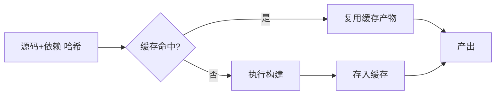
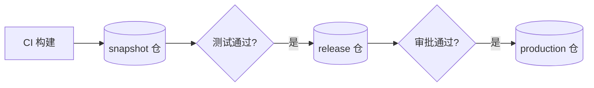
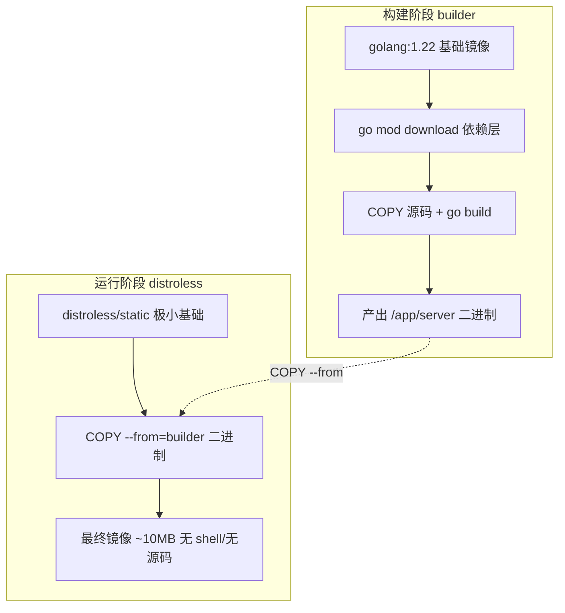
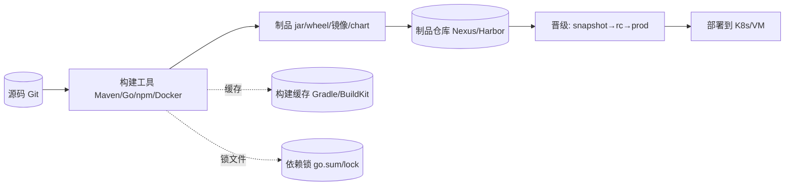
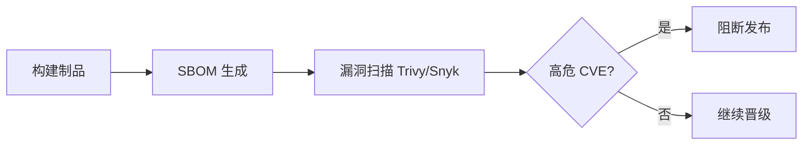

# CI/CD · 03 构建与制品管理

> **口诀：构建要可重现，制品要不可变——同一次提交，任何时间、任何机器，跑出同一个包。**

本篇覆盖流水线中段：代码怎么变成可运行的产物。先讲构建工具与"增量/可重现"两大原则，再讲制品的定义、分类、仓库与晋级，最后深入 Docker 镜像构建（多阶段、缓存、瘦身）与镜像仓库、依赖供应链（SBOM 先给概念）。

## 一、构建（Build）：从源码到可运行物

构建是把人类可读的源码 + 依赖，转换成机器可执行的产物（字节码/二进制/包/镜像）的过程。它在 CI 中每次提交触发，是"质量门禁"的第一道关。

### 1.1 主流构建工具一览

| 语言/生态 | 构建工具 | 依赖管理 | 增量/缓存机制 |
|-----------|---------|---------|--------------|
| Java | Maven、Gradle | pom.xml / build.gradle | Gradle 增量编译、构建缓存 |
| JavaScript | npm、yarn、pnpm | package.json + lock | pnpm 硬链接 + 内容寻址存储 |
| Go | Go module（`go build`） | go.mod / go.sum | 编译缓存 `$GOCACHE` |
| Python | setuptools、poetry、uv | pyproject.toml / poetry.lock | uv 极速解析与缓存 |
| Rust | Cargo | Cargo.toml / Cargo.lock | 增量编译 + sccache |

### 1.2 Maven 生命周期与增量

Maven 把构建固化为标准生命周期：`validate → compile → test → package → verify → install → deploy`。Gradle 在此基础上提供**增量编译（只重编受影响的源文件）**与**构建缓存（本地/远程缓存任务输出）**，大型项目提速显著。

```bash
# Maven：跳过测试快速打包（仅示例，CI 不应跳过测试）
mvn -DskipTests package

# Gradle：启用构建缓存与并行
gradle build --build-cache --parallel
```

### 1.3 npm / pnpm 依赖一致性

`package-lock.json` 锁定依赖树，保证可重现。pnpm 用**内容寻址存储 + 硬链接**，节省磁盘且严格隔离，避免"幽灵依赖"。

```bash
npm ci            # 严格按 lock 安装（CI 推荐，比 npm install 干净）
pnpm install --frozen-lockfile
```

### 1.4 Go module 可重现构建

```bash
go mod tidy       # 整理依赖
go build -trimpath -ldflags="-buildid= -mod=readonly" -o app .   # 去路径/去 buildid 以可重现
```

> `-trimpath` 去掉绝对路径，`-buildid=` 置空，是保证 Go 二进制可重现的关键。

### 1.5 Python：wheel 与 uv

现代 Python 分发用 **wheel（`.whl`）** 预编译格式取代源码包，安装无需现场编译。依赖用 `uv`（2024 起流行的极速解析器）或 `poetry` 锁版本。

```bash
uv sync --frozen          # 按 uv.lock 精确安装
python -m build           # 产出 sdist + wheel
```

## 二、两大原则：增量构建与可重现性

### 2.1 增量构建与缓存（避免全量重建）

每次都全量重建既慢又费资源。关键手段：

- **输入指纹缓存**：以源文件/依赖哈希为 key，命中的任务直接取缓存产物。
- **分层缓存**：Docker 层、Maven `~/.m2`、npm `node_modules`、Go `GOCACHE` 挂载到 CI 缓存卷。
- **远程缓存**：Gradle Build Cache、Bazel Remote Cache、sccache（Rust），让团队共享编译结果。



> **口诀：缓存的本质是"用哈希换时间"——输入没变，就别重算。**

⚠️ **生产踩坑**：
- 缓存键（cache key）设计不当会导致"缓存永不命中"或"命中了旧错结果"。务必把依赖清单（lock 文件）纳入 key。
- `mvn install` 把快照装进本地仓库会污染其他构建，CI 应用 `package`/`verify` 而非 `install`。

### 2.2 可重现构建（Reproducible Builds）

指**同一次源码，在任何时间、任何机器、任何环境下，产出字节级一致的产物**。价值：供应链可信、可验证、可审计（与第 13 篇 SBOM/签名呼应）。

实现要点：

| 干扰源 | 对策 |
|--------|------|
| 绝对路径/时间戳 | 去除（Go `-trimpath`、Jar `reproducible`、zip 忽略 mtime） |
| 非确定性排序 | 固定文件遍历/映射顺序 |
| 嵌入 git 版本 | 改为外部注入而非编译期写入 |
| 依赖漂移 | 锁文件 + 私有仓库固定源 |

## 三、制品（Artifact）：构建的产物

### 3.1 定义与分类

制品是构建产出的、可部署/可消费的**不可变单元**。一旦发布，不应被修改，只能发新版本。

| 类型 | 例子 | 典型仓库 |
|------|------|---------|
| JVM 包 | `.jar` / `.war` | Nexus、Artifactory |
| Python 包 | `.whl` / `.tar.gz` | PyPI、Artifactory |
| Node 包 | `.tgz`（npm pack） | npm、GitLab Package |
| 容器镜像 | `.tar` / OCI 镜像 | Harbor、ECR、GCR |
|  chart | Helm `.tgz` | Harbor（OCI）、ChartMuseum |
| 二进制 | Go 编译可执行、静态库 | Nexus |

### 3.2 制品仓库：集中管理 + 晋级

制品仓库把"构建产出"与"部署消费"解耦，并提供版本、权限、漏洞库、晋级（promotion）。

| 仓库 | 特点 |
|------|------|
| Sonatype Nexus | 多格式（maven/npm/docker/...）、轻量易部署 |
| JFrog Artifactory | 企业级、统一元数据、晋级流水线、Xray 扫描 |
| GitHub Packages | 与 GitHub 一体，按仓库管理 |
| GitLab Package Registry | 与 GitLab CI 一体 |

制品**晋级（promotion）**示例：snapshot → release candidate → production。



> **口诀：制品只升不降、只加不改——发布的版本永不可变，回滚靠旧版本而非改旧包。**

⚠️ **生产踩坑**：把同一版本号重新上传覆盖（mutable artifact）是严重反模式，会导致"明明没改代码，生产行为却变了"，且无法审计。仓库应开启 immutable 策略。

## 四、Docker 镜像构建

### 4.1 docker build 基础与缓存层

Docker 镜像由**只读层**叠加而成。每条 `RUN`/`COPY`/`ADD` 产生一层；构建时若上层未变则复用缓存。因此**把易变的步骤（COPY 源码）放后面、稳定的（装依赖）放前面**，能最大化缓存命中。

```dockerfile
# 不佳：源码一改，依赖重装
COPY . .
RUN npm install

# 较佳：先拷依赖清单装依赖（命中缓存），再拷源码
COPY package*.json ./
RUN npm ci
COPY . .
RUN npm run build
```

### 4.2 多阶段构建（Multi-stage）

用一个"构建阶段"编译，再把产物拷进极小的"运行阶段"镜像，最终镜像不含编译器与源码，体积小、攻击面低。

```dockerfile
# ---- 构建阶段 ----
FROM golang:1.22 AS builder
WORKDIR /src
COPY go.mod go.sum ./
RUN go mod download
COPY . .
RUN CGO_ENABLED=0 go build -trimpath -o /app/server .

# ---- 运行阶段 ----
FROM gcr.io/distroless/static-debian12
COPY --from=builder /app/server /server
EXPOSE 8080
ENTRYPOINT ["/server"]
```



### 4.3 BuildKit 与构建加速

BuildKit（现代 Docker 默认构建引擎）支持：**并行阶段构建**、**远程/内联缓存导出**、**secret 挂载（不进镜像）**、**--mount=type=cache 依赖缓存**。

```bash
# 导出缓存供下一次复用（CI 关键）
docker buildx build --cache-to=type=registry,ref=myrepo/cache:build-cache \
                    --cache-from=type=registry,ref=myrepo/cache:build-cache \
                    -t myrepo/app:1.0 --push .
```

### 4.4 镜像瘦身与 .dockerignore

- 用 **distroless / alpine** 基础镜像；alpine 约 5MB，distroless 仅含运行时与 CA 证书，无 shell（更安全但调试难）。
- **`.dockerignore`** 排除 `.git`、`node_modules`、本地缓存等，避免无谓上下文传输与误拷。

```text
# .dockerignore
.git
node_modules
*.log
Dockerfile
.dockerignore
```

### 4.5 镜像分层策略小结

| 策略 | 效果 |
|------|------|
| 依赖层前置 | 提高缓存命中 |
| 多阶段构建 | 大幅缩小最终镜像 |
| distroless/alpine | 减体积、降攻击面 |
| BuildKit cache mount | 加速依赖安装 |
| `.dockerignore` | 减小构建上下文 |

> **口诀：镜像不是"能跑就行"，而是"越小越纯越安全"。**

⚠️ **生产踩坑**：
- `latest` 标签是反模式——不可溯源、不可回滚。必须用不可变标签（git sha / 语义版本）。
- 把密钥 `COPY` 进镜像或用 `ENV` 写死，会随镜像泄露。用 BuildKit `--secret` 或运行时注入。
- 基础镜像不锁定 digest，今天构建和明天构建可能拉到不同基础层，破坏可重现性。建议钉 digest（`@sha256:...`）。

## 五、镜像仓库与签名/扫描（深入见第 13 篇）

| 仓库 | 特点 |
|------|------|
| Harbor | 开源、自带漏洞扫描（Trivy）、镜像签名、复制策略 |
| AWS ECR | 与 IAM/CI 深度集成 |
| GCR / Artifact Registry | GCP 原生 |
| Azure ACR | Azure 原生、任务编排 |
| GitHub/GitLab Registry | 与代码托管一体 |

签名与扫描（cosign + SBOM + 准入控制）在 [13-安全与供应链安全](13-可观测性DORA度量与DevSecOps.md) 深入。

## 六、依赖与供应链：SBOM 先给概念

### 6.1 依赖锁文件是底线

所有生态都应提交 lock 文件（`go.sum`/`package-lock.json`/`poetry.lock`/`Cargo.lock`），保证 CI 与本地、今天与明天拉到**完全一致**的依赖树。

### 6.2 SBOM（软件物料清单）概念

SBOM（Software Bill of Materials）是"软件由哪些组件构成"的清单（如 CycloneDX / SPDX 格式），用于：

- 漏洞爆发后**秒级定位**受影响版本（如 Log4Shell）。
- 合规与审计。
- 与镜像签名共同构成供应链信任链。

```bash
# 用 Syft 生成 SBOM（示例）
syft packages myrepo/app:1.0 -o cyclonedx-json > sbom.json
```

> **口诀：没有 SBOM，你根本不知道自己部署了什么——出了事只能全网盲猜。**

⚠️ 深入（SBOM 生成、签名、准入控制、依赖投毒防护）留待 [13-安全与供应链安全](13-可观测性DORA度量与DevSecOps.md)。

## 七、源码 → 构建 → 制品 → 仓库 全流转



## 八、本篇小结 Checklist

- [ ] 选对构建工具，开启增量/缓存（Gradle、BuildKit、sccache）。
- [ ] 追求可重现构建：去路径、去时间戳、锁依赖。
- [ ] 制品不可变、可溯源，按 snapshot→rc→prod 晋级。
- [ ] Docker 用多阶段 + distroless + 缓存层 + `.dockerignore`，钉 digest。
- [ ] 镜像标签用 git sha/语义版本，禁用 `latest`。
- [ ] 依赖锁文件必提交；SBOM 作为供应链信任第一步。

## 与其他模块的关联

- 构建的输入来自分支策略，见 [02-版本控制与分支策略](02-版本控制与分支策略.md)。
- 制品晋级后由流水线部署，总览见 [01-概述与核心概念](01-概述与核心概念.md)。
- 镜像经 GitOps 拉式部署，见 [08-GitOps 与声明式交付](08-云原生CI-CD与GitOps工具.md)。
- 镜像签名/扫描/SBOM 深入见 [13-安全与供应链安全](13-可观测性DORA度量与DevSecOps.md)。
- 容器与编排底座见 [../../云原生/K8S.md](../../云原生/K8S.md)、[../../云原生/K8S.md](../../云原生/K8S.md)。
- 大数据任务同样有"构建/打包/调度"类比 [../大数据/02-技术体系与架构演进.md](../大数据/02-技术体系与架构演进.md)。

> 参考：
> - Maven / Gradle 官方文档：https://maven.apache.org/ 、 https://gradle.org/
> - pnpm：https://pnpm.io/ 、 uv：https://docs.astral.sh/uv/
> - Go Reproducible Builds：https://go.dev/doc/build-cache 、 https://reproducible-builds.org/
> - Docker 多阶段构建 / BuildKit：https://docs.docker.com/build/building/multi-stage/ 、 https://docs.docker.com/build/buildkit/
> - distroless：https://github.com/GoogleContainerTools/distroless
> - Nexus / Artifactory：https://help.sonatype.com/nexus-repository 、 https://jfrog.com/artifactory/
> - Harbor：https://goharbor.io/
> - SBOM（NTIA / CycloneDX / SPDX）：https://www.ntia.gov/SBOM 、 https://cyclonedx.org/ 、 https://spdx.dev/
> - Syft（SBOM 生成）：https://github.com/anchore/syft

## 十一、构建缓存：本地缓存与远程缓存

缓存是加速 CI 的第一杠杆。**本地缓存**随 agent 复用；**远程缓存**（Build Cache）跨 agent / 跨流水线共享，命中即跳过编译。

| 工具 | 远程缓存 | 适用 |
|------|----------|------|
| Gradle Build Cache | `--build-cache` + 远程缓存节点 | JVM |
| Bazel Remote Cache | `remote_cache` | 多语言 |
| Docker BuildKit | `cache-to/from=type=registry` | 镜像 |
| GitHub Actions | `actions/cache` / `type=gha` | 通用 |

```bash
# Gradle 开启远程构建缓存
./gradlew build --build-cache \
  -Dgradle.cache.remote.url=https://cache.corp.com \
  -Dgradle.cache.remote.username=$USER -Dgradle.cache.remote.password=$TOKEN
```

```dockerfile
# BuildKit 远程缓存（推到镜像仓库，跨 runner 共享层）
# 构建命令：docker buildx build \
#   --cache-to=type=registry,ref=registry/app:cache \
#   --cache-from=type=registry,ref=registry/app:cache .
```

> 注意：缓存失效策略要稳——依赖变更必须使缓存失效，否则"缓存命中但构建错误"比慢更可怕。用锁文件 hash 作为缓存 key。

## 十二、Reproducible Build（可重现构建）

同输入必产同字节输出，杜绝"我机器上是好的"：

- **去时间戳**：不把构建时间写入产物（`SOURCE_DATE_EPOCH`）。
- **去绝对路径**：用相对路径，避免 `/home/ci/...` 泄漏。
- **锁依赖**：`package-lock.json` / `go.sum` / `pom.xml` 锁版本。
- **排序**：资源打包顺序固定（zip/tar 确定性排序）。
- **工具**：Go 原生 reproducible；Java 用 `reproducible-builds` 插件；Docker 用 `buildkit` + 固定 base。

```bash
export SOURCE_DATE_EPOCH=0
go build -trimpath -ldflags="-buildid=" -o app .   # -trimpath 去除路径
```

## 十三、依赖溯源 SBOM

SBOM 是供应链信任第一步，列出所有直接与传递依赖：

```bash
syft . -o cyclonedx-json > sbom.cdx.json     # 生成 CycloneDX
syft . -o spdx-json > sbom.spdx.json         # 或 SPDX
# 把 SBOM 作为制品一并归档、签名、随镜像发布
```

## 十四、制品签名与验签

用 cosign（sigstore）对镜像/制品签名，部署前验签，阻断未签名产物上线：

```bash
# 签名（Keyless 模式，由 Fulcio 签发短期证书）
cosign sign --yes registry.corp.com/app@sha256:abc123
# 生成 SBOM 证明并签名
cosign attest --yes --predicate sbom.cdx.json registry.corp.com/app@sha256:abc123
# 部署前验签
cosign verify registry.corp.com/app@sha256:abc123 \
  --certificate-identity-regexp '.*@corp.com' \
  --certificate-oidc-issuer 'https://oauth.corp.com'
```

> 流水线里把"签名 + SBOM + 扫描"作为发布门禁，未签名/有高危 CVE 的制品禁止晋级（详见第 13 篇）。

## 十五、Maven 与 Gradle 深度对比

| 维度 | Maven | Gradle |
|------|-------|--------|
| 配置语言 | XML（pom.xml） | Groovy/Kotlin DSL（build.gradle） |
| 构建模型 | 生命周期绑定（阶段→插件目标） | 任务图（Task DAG，依赖关系自动排序） |
| 增量构建 | 有限（仅编译级） | 丰富（输入/输出指纹，任务级增量） |
| 构建缓存 | 无原生远程缓存 | 本地 + 远程 Build Cache（任务级） |
| 依赖解析 | 依赖调解（nearest first，易冲突） | 丰富策略（冲突检测、自定义解析） |
| 并行构建 | `-T` 参数（有限） | `--parallel` + 配置缓存（Configuration Cache） |
| IDE 支持 | IntelliJ/Eclipse 原生 | IntelliJ 深度集成（构建扫描） |
| 学习曲线 | 低（约定优于配置） | 中高（DSL 灵活但概念多） |
| 企业采用 | 传统企业、Maven Central 生态 | 现代项目、Android（官方构建工具） |

```bash
# Gradle 构建扫描（定位瓶颈）
./gradlew build --scan          # 生成在线构建报告
./gradlew build --profile       # 本地 profile HTML 报告

# Maven 构建分析
mvn clean install -DskipTests   # 结合 Maven Build Scanner
```

> **选型口诀**：Maven 稳定约定适合标准化团队，Gradle 灵活强大适合需要增量/缓存/定制化的场景。Android 项目必用 Gradle，Java 项目看团队习惯。

## 十六、Docker 多阶段构建进阶

### 16.1 跨阶段文件复制

多阶段构建的核心是 `COPY --from=<stage>`，可以在阶段间传递任意文件：

```dockerfile
# 多阶段：编译 → 测试 → 运行
FROM golang:1.22 AS builder
WORKDIR /src
COPY go.mod go.sum ./
RUN go mod download
COPY . .
RUN CGO_ENABLED=0 go build -o /app/server .

FROM builder AS tester
RUN go test ./... -v            # 测试阶段复用构建产物

FROM gcr.io/distroless/static-debian12 AS runtime
COPY --from=builder /app/server /server
ENTRYPOINT ["/server"]
```

### 16.2 BuildKit 缓存挂载实战

`--mount=type=cache` 让依赖安装目录跨构建持久化，即使依赖文件变化也不会全量重装：

```dockerfile
RUN --mount=type=cache,target=/root/.m2/repository \
    mvn -B clean package -DskipTests

RUN --mount=type=cache,target=/go/pkg/mod \
    go mod download

RUN --mount=type=cache,target=/root/.cache/pip \
    pip install -r requirements.txt
```

### 16.3 Secrets 安全注入

```dockerfile
# 不进镜像、不进日志的 secret 挂载
RUN --mount=type=secret,id=npmrc,target=/root/.npmrc \
    npm ci

# 构建命令
docker build --secret id=npmrc,src=.npmrc .
```

## 十七、制品版本策略

### 17.1 语义化版本（SemVer）

```
格式：MAJOR.MINOR.PATCH（如 2.3.1）
  MAJOR：不兼容的 API 变更
  MINOR：向后兼容的功能新增
  PATCH：向后兼容的缺陷修复

预发布标签：2.3.1-rc.1、2.3.1-beta.2
构建元数据：2.3.1+build.456（不影响版本优先级）
```

### 17.2 基于 Git 的版本策略

| 策略 | 做法 | 适用 |
|------|------|------|
| SemVer 标签 | `git tag v1.2.3` + CI 自动提取 | 正式发布 |
| Git SHA | `v1.2.3-abc1234` | 每次提交可追溯 |
| CalVer | `2026.08.24` | 频繁发布、按日期区分 |
| SNAPSHOT | `1.2.4-SNAPSHOT` | Maven 开发版（可变） |

```bash
# 自动化版本号生成脚本
VERSION=$(git describe --tags --always --dirty)
echo "构建版本: $VERSION"
```

## 十八、JFrog Artifactory vs Nexus 深度对比

| 维度 | JFrog Artifactory | Sonatype Nexus |
|------|-------------------|----------------|
| 格式支持 | 30+（Maven/npm/Docker/Helm/PyPI/Go/...） | 20+（Maven/npm/Docker/PyPI/...） |
| 高级缓存 | 远程仓库代理 + 智能缓存 | 远程仓库代理 |
| 安全扫描 | Xray（深度依赖分析、CVE、license） | IQ Server（需额外付费） |
| 晋级流水线 | 原生 Promotion API + 发布流程 | 无原生，需自建 |
| HA 支持 | 多节点主从 | 多节点 |
| 云部署 | JFrog Cloud / 自托管 | 自托管为主 |
| 价格 | 高（企业级） | 开源免费 / Nexus Pro 付费 |

```
选型决策：
  大型企业、需要 Xray 安全扫描 + 晋级流水线 → Artifactory
  中小团队、预算有限、格式要求简单 → Nexus OSS
  已有 JFrog 全家桶（Xray + Pipelines + Distribution）→ Artifactory
```

## 十九、BuildKit 构建缓存深入

### 19.1 缓存导出类型

| 类型 | 说明 | 适用 |
|------|------|------|
| `inline` | 将缓存嵌入镜像层（简单但镜像大） | 本地/测试 |
| `registry` | 推到镜像仓库（跨 runner 共享） | CI 生产推荐 |
| `local` | 本地目录缓存 | 开发机 |
| `gha` | GitHub Actions Cache 后端 | GH Actions 专用 |

```bash
# CI 生产环境：registry 缓存
docker buildx build \
  --cache-to type=registry,ref=registry/cache:buildcache,mode=max \
  --cache-from type=registry,ref=registry/cache:buildcache \
  -t myapp:latest --push .
```

### 19.2 缓存模式对比

| 模式 | 说明 | 效果 |
|------|------|------|
| `min` | 仅缓存最终镜像层 | 缓存小，中间层不缓存 |
| `max` | 缓存所有阶段的层 | 缓存大，多阶段构建加速显著 |

## 二十、SBOM 生成与漏洞扫描

### 20.1 SBOM 生成工具对比

| 工具 | 格式 | 特点 |
|------|------|------|
| Syft | CycloneDX / SPDX | 多语言，速度快，Trivy 生态 |
| Trivy | CycloneDX | 同时扫描漏洞 + 生成 SBOM |
| CDXGen | CycloneDX | OWASP 项目，支持深度扫描 |
| Licensee | 自定义 | Ruby 生态，license 优先 |

### 20.2 依赖漏洞扫描流程

```bash
# 完整扫描流程（SBOM + CVE + 策略阻断）
syft myapp:latest -o cyclonedx-json > sbom.json
trivy sbom sbom.json --severity HIGH,CRITICAL --exit-code 1

# Maven 依赖漏洞扫描
mvn org.owasp:dependency-check-maven:check

# Go 依赖漏洞扫描
govulncheck ./...
```



## 二十一、构建可重现性最佳实践

| 污染源 | 对策 | 工具/配置 |
|--------|------|-----------|
| 系统时间 | `SOURCE_DATE_EPOCH=0` 置零 | 所有语言 |
| 绝对路径 | Go `-trimpath`，Java 用相对路径 | 构建参数 |
| 非确定性排序 | 固定文件遍历顺序（Go `GOFLAGS=-mod=readonly`） | 构建脚本 |
| 依赖版本漂移 | 锁文件（lockfile）+ 私有仓库固定源 | package-lock.json / go.sum |
| 工具版本差异 | 固定工具链版本（`.tool-versions`、`mise`） | asdf/mise |
| 环境变量 | 仅注入已知变量，过滤 `LD_PRELOAD` 等 | CI 环境隔离 |

```bash
# 完整可重现构建示例
export SOURCE_DATE_EPOCH=0
export TZ=UTC
go build -trimpath -ldflags="-buildid=" -o app .
```

## 二十二、依赖供应链安全

### 22.1 依赖投毒防护

```
常见攻击向量：
  ① typosquatting（仿冒包名，如 lodash-es vs lodashe）
  ② dependency confusion（私有包名泄露，公共仓库同名包投毒）
  ③ 维护者账号被盗，上传恶意版本

防护措施：
  ① 锁文件 + 哈希校验（npm ci --prefer-offline）
  ② 私有仓库优先（scope 拦截）
  ③ 依赖来源审计（`npm audit`、`go vet`、`pip audit`）
  ④ 签名验证（npm provenance、Go checksum database）
```

### 22.2 供应链安全成熟度

| 级别 | 能力 | 对应实践 |
|------|------|----------|
| L1 | 基础 | 锁文件提交、CI 扫描 |
| L2 | 可审计 | SBOM 生成 + 制品签名 |
| L3 | 可验证 | 签名验签 + 准入控制 |
| L4 | 零信任 | SLSA 框架 + 可重现构建 + 供应链溯源 |

> 口诀：**供应链安全 = 锁文件 + SBOM + 签名 + 扫描 + 准入——缺一环都可能被投毒**。

## 本篇补充 Checklist

- [ ] 用远程构建缓存跨 agent 共享，以锁文件 hash 作缓存 key 防失效错乱。
- [ ] 可重现构建：去时间戳/路径、锁依赖、`-trimpath`。
- [ ] 每次发布产出 SBOM（CycloneDX / SPDX）并归档。
- [ ] 制品/镜像用 cosign 签名，部署前验签作为晋级门禁。
- [ ] Maven/Gradle 选型看团队习惯，Gradle 优先开启增量+缓存。
- [ ] BuildKit 缓存用 registry 模式跨 runner 共享，mode=max 加速多阶段。
- [ ] 制品版本遵循 SemVer 或 Git SHA，禁 latest 可变标签。
- [ ] 依赖漏洞扫描（Trivy/Snyk/OWASP）作为 CI 门禁。
