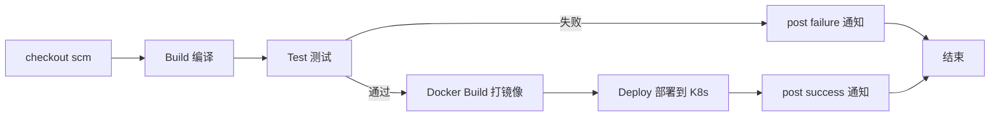
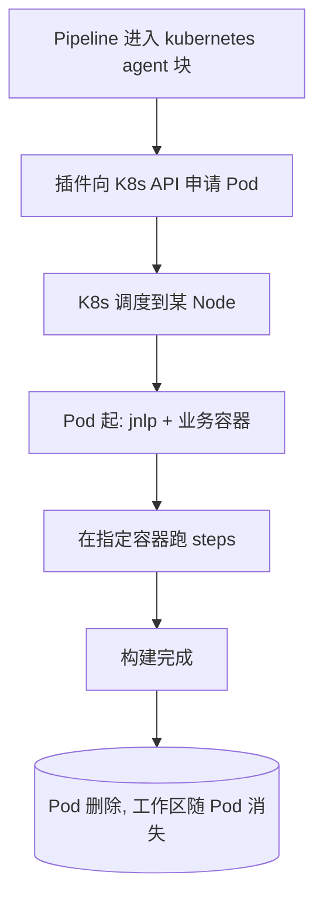

# CI/CD · 05 Jenkins Pipeline as Code

> 口诀：Pipeline 即代码——把"怎么构建"写进 `Jenkinsfile` 存进 Git，让 CI 流程和源码一起版本化、评审、回滚，告别在 UI 上点出来的"雪花服务器"。

本篇讲 Pipeline 两种语法、Declarative 结构、常用指令、共享库（Shared Library）、Blue Ocean 与可视化、以及与 Kubernetes 动态 Agent 的集成，并给出 3 个可直接运行的 `Jenkinsfile`。底层架构见 [04-Jenkins架构与核心机制](04-Jenkins架构与核心机制.md)；CI/CD 总览见 [01-概述与核心概念](01-概述与核心概念.md)；制品归档见 [03-构建与制品管理](03-构建与制品管理.md)。

## 一、两种语法：Declarative vs Scripted

| 维度 | Declarative（声明式） | Scripted（脚本式） |
|------|----------------------|--------------------|
| 形态 | 固定 schema：`pipeline { agent/stages/post }` | 裸 Groovy：`node { ... }` |
| 上手 | 低，结构化、有代码补全 | 高，需懂 Groovy |
| 灵活性 | 受限但够用，复杂逻辑用 `script{}` 块 | 无限，可写任意 Groovy/循环/类 |
| 安全 | 默认进沙箱，需审批才出沙箱 | 同样受 Script Security 约束，但更易写出危险代码 |
| 可读性 | 高，stage 一眼看清 | 低，逻辑散落 |
| 官方推荐 | ✅ 新项目首选 | ⚠️ 遗留/特殊场景 |

> 口诀：**新手用 Declarative，老手写 Scripted，团队统一 Declarative——可读性与安全性的收益远大于"Groovy 自由"**。

## 二、Jenkinsfile 结构

Declarative 的"骨架"：

```groovy
pipeline {
    agent { label 'docker' }      // ① 在哪跑
    environment { FOO = 'bar' }   // ② 全局环境变量
    options { timestamps() }      // ③ 流水线选项
    parameters { string(name:'BRANCH', defaultValue:'main') } // ④ 参数
    triggers { cron('H 2 * * *') }// ⑤ 触发器
    stages {                      // ⑥ 核心：阶段
        stage('Build') {
            steps { sh 'make' }
        }
    }
    post {                        // ⑦ 收尾：无论成败
        always { cleanWs() }
    }
}
```

### 2.1 顶层指令一览

| 指令 | 作用 | 常用取值 |
|------|------|----------|
| `agent` | 指定执行节点 | `any` / `none` / `label 'x'` / `docker` / `kubernetes` |
| `environment` | 注入环境变量/凭据 | `CRED = credentials('id')` |
| `options` | 流水线级选项 | `timestamps()` `timeout()` `disableConcurrentBuilds()` `buildDiscarder()` |
| `parameters` | 手动/触发参数 | `string` `choice` `booleanParam` `text` |
| `triggers` | 自动触发 | `cron` `pollSCM` `upstream` |
| `stages` | 阶段容器 | 含若干 `stage` |
| `post` | 收尾动作 | `always` / `success` / `failure` / `aborted` / `changed` |

### 2.2 一个典型 Pipeline 的 stage 流程



## 三、常用指令详解

### 3.1 agent：决定在哪跑

```groovy
// 任意可用 Agent
agent any

// 指定标签
agent { label 'maven&&linux' }

// 用 Docker 容器当构建环境（容器随构建起停）
agent {
    docker {
        image 'maven:3.9-eclipse-temurin-17'
        args '-v $HOME/.m2:/root/.m2'
    }
}

// 用 Kubernetes 动态 Pod（云原生，见第六节）
agent {
    kubernetes {
        yaml '''
apiVersion: v1
kind: Pod
spec:
  containers:
  - name: maven
    image: maven:3.9-eclipse-temurin-17
    command: ['cat']
    tty: true
'''
    }
}
```

### 3.2 steps：核心步骤

| 步骤 | 说明 |
|------|------|
| `sh '...'` / `bat '...'` | Linux / Windows shell |
| `checkout scm` | 检出当前流水线绑定的 SCM（多分支自动按分支） |
| `stash` / `unstash` | 在 stage 间暂存/恢复文件（跨节点传递产物） |
| `timeout(time: 10, unit:'MINUTES')` | 超时打断，防挂死 |
| `retry(3)` | 失败重试（如网络抖动） |
| `withCredentials` | 安全注入凭据（不落日志） |

```groovy
stage('Test') {
    steps {
        timeout(time: 10, unit: 'MINUTES') {
            retry(2) {
                sh './mvnw test'
            }
        }
    }
}
```

### 3.3 when：条件执行

```groovy
stage('Deploy-Prod') {
    when {
        branch 'main'          // 仅 main 分支
        environment name: 'DEPLOY', value: 'true'
        // 也可：expression { return params.FORCE }
    }
    steps { sh './deploy.sh prod' }
}
```

### 3.4 post：收尾通知

```groovy
post {
    always    { cleanWs() }                       // 总是清理工作区
    success   { slackSend channel:'#ci', message:'✅ 构建成功'} }
    failure   { emailext to:'team@corp.com', subject:'❌ 构建失败', body:'${BUILD_URL}' }
    aborted   { echo '被中止' }
    changed   { echo '状态相较上次变化' }
}
```

### 3.5 parallel：并行 stage

```groovy
stage('并行测试') {
    parallel {
        stage('单测')  { steps { sh './mvnw test -Dscope=unit' } }
        stage('集成')  { steps { sh './mvnw test -Dscope=it' } }
        stage('质检')  { steps { sh 'sonar-scanner' } }
    }
}
```

### 3.6 input：交互卡点

```groovy
stage('人工放行生产') {
    steps {
        input message: '确认发布到生产？', ok: '放行',
              parameters: [choice(name:'env', choices:['canary','full'], description:'发布策略')]
        sh './deploy.sh $env'
    }
}
```

> ⚠️ **input 陷阱**：`input` 会**暂停流水线并占用 Agent executor**（除非放在 `agent none` 的 stage）。大量卡点会耗尽 executor。最佳实践：把 `input` 放在不带 `agent` 的 stage，确认后再进带 Agent 的部署 stage。

### 3.7 environment 注入凭据 & tools

```groovy
pipeline {
    agent any
    environment {
        // 凭据以环境变量注入，日志自动脱敏
        DOCKER_CREDS = credentials('docker-hub')
        NEXUS_TOKEN  = credentials('nexus-token')
    }
    tools {
        maven 'M3'   // 需 Controller 预先配置名为 M3 的 Maven 安装
        jdk   'J17'
    }
    stages {
        stage('Build') {
            steps { sh 'mvn -B clean package' }
        }
    }
}
```

### 3.8 多仓检出

```groovy
stage('Checkout') {
    steps {
        checkout scm                                  // 主仓（流水线绑定）
        dir('lib') {
            git url: 'git@github.com:corp/common-lib.git', branch: 'main'
        }
    }
}
```

## 四、共享库（Shared Library）

### 4.1 目录约定

```
(my-lib)/
├── vars/                 # 全局变量/步骤，文件名即步骤名
│   ├── buildAndTest.groovy
│   └── deployK8s.groovy
├── src/                  # 普通 Groovy 类（src/org/corp/Util.groovy）
└── resources/            # 静态资源（模板、脚本），用 libraryResource 读
```

- `vars/foo.groovy` 暴露一个 `foo(...)` 步骤；`foo.call(...)` 是其实现。
- `@Library('my-lib@main') _` 或 Jenkins 全局配置默认库后直接用 `foo()`。

### 4.2 调用示例

```groovy
@Library('corp-shared-lib@v2.3.0') _

pipeline {
    agent any
    stages {
        stage('Build') {
            steps { buildAndTest() }   // 来自 vars/buildAndTest.groovy
        }
        stage('Deploy') {
            steps { deployK8s(env.TARGET) }
        }
    }
}
```

```groovy
// vars/buildAndTest.groovy
def call() {
    sh './mvnw -B clean verify'
    junit 'target/surefire-reports/*.xml'
}
```

### 4.3 共享库加载机制

```mermaid
flowchart TB
    JF[Jenkinsfile] -->|@Library 注解 / 全局默认库| LD[Library Resolver]
    LD -->|拉取指定 branch/tag| REPO[Git 仓库: vars/ src/ resources/]
    REPO -->|动态加载| CP[Controller 类加载器]
    CP --> VARS[vars/*.groovy 转为全局步骤]
    CP --> SRC[src/ 普通类供调用]
    VARS --> RUN[Pipeline 中可直接用 buildAndTest() 等]
```

### 4.4 最佳实践与陷阱

| 建议 | 说明 |
|------|------|
| 锁版本 | `@Library('lib@v1.2.3')`，勿用 `@master` 漂移 |
| 纯逻辑放 src/ | 复杂工具类放 `src/`，`vars/` 只做薄封装 |
| 沙箱友好 | 避免 `new FileInputStream` 等沙箱外调用，减少 script approval |
| 单元测 | 用 `JenkinsPipelineUnit` 框架测共享库 |

> ⚠️ **陷阱**：共享库代码在 **Controller JVM** 执行（除非用 `libraryResource` 或放到 Agent 步骤里），且默认**不受 Pipeline 沙箱逐行限制**、需 Script Security 审批。一个坏共享库 = 全公司流水线都能被它拖垮或 RCE（呼应 [04-Jenkins架构与核心机制](04-Jenkins架构与核心机制.md) 的供应链风险）。

## 五、Blue Ocean 与可视化

- **Blue Ocean**：Jenkins 的现代 UI，图形化编辑/可视化 Pipeline、分支与 PR 视图。⚠️ **官方已宣布 2026 年 7 月正式弃用（deprecated），之后不再提供安全修复**；社区推荐替代品 **Pipeline: Stage View** 与 **Pipeline Graph View** 插件（后者活跃维护，最接近 Blue Ocean 体验）。
- **Pipeline Stage View**：内置于 Blue Ocean 时代前的经典视图，按 stage 展示时长与状态，仍可用。
- **Pipeline 语法片段生成器（Snippet Generator）**：在 `localhost:8080/pipeline-syntax` 勾选步骤自动生成 `steps` 代码，**官方首选的 Pipeline 编写辅助工具**。

> 口诀：**新项目别再押注 Blue Ocean，用 Declarative + Stage View/Graph View + Snippet Generator 三件套**。

## 六、与 Kubernetes 动态 Agent 集成

### 6.1 原理：用完即焚的 Pod

Kubernetes 插件在 Pipeline 需要 `agent { kubernetes { ... } }` 时，向集群**动态申请一个 Pod** 作为 Agent；Pod 内含一个 `jnlp` 容器（跑 Jenkins agent 进程）和若干业务容器（maven/node/docker…），构建完 **Pod 自动删除**（默认 `podRetention: never`）。



### 6.2 多容器 + 凭据 + 资源示例

```groovy
pipeline {
    agent {
        kubernetes {
            yaml '''
apiVersion: v1
kind: Pod
spec:
  serviceAccountName: jenkins-agent
  containers:
  - name: maven
    image: maven:3.9-eclipse-temurin-17
    command: ['cat']
    tty: true
    env:
    - name: MAVEN_OPTS
      value: "-Xmx1024m"
  - name: kubectl
    image: bitnami/kubectl:latest
    command: ['cat']
    tty: true
'''
        }
    }
    environment {
        KUBE_CREDS = credentials('kubeconfig-prod')
    }
    stages {
        stage('Build') {
            steps {
                container('maven') {
                    sh 'mvn -B clean package'
                }
            }
        }
        stage('Deploy') {
            steps {
                container('kubectl') {
                    sh 'kubectl --kubeconfig=$KUBE_CREDS apply -f k8s/'
                }
            }
        }
    }
}
```

> ⚠️ **agent 镜像过大**：基础镜像动辄 1GB+，Pod 频繁起停会拖慢首构建（镜像拉取时长）。应对：用精简镜像（如 `-alpine`、`eclipse-temurin` 瘦身版）、配节点镜像缓存、或用 `dynamicPVC` 缓存依赖。
>
> ⚠️ **uid 不一致**：Pod 内多容器若 uid 不同，切换容器执行命令会权限报错。建议统一 `securityContext.runAsUser` 与 `fsGroup`。

## 七、完整 Jenkinsfile 示例

### 7.1 示例①：简单 Maven 构建 + 测试 + 制品归档

```groovy
// Jenkinsfile (Declarative)
pipeline {
    agent { label 'maven' }
    tools {
        maven 'M3'
        jdk   'J17'
    }
    options {
        timestamps()
        timeout(time: 30, unit: 'MINUTES')
        buildDiscarder(logRotator(numToKeepStr: '20'))
    }
    stages {
        stage('Checkout') {
            steps { checkout scm }
        }
        stage('Build & Test') {
            steps {
                sh './mvnw -B clean verify'
            }
            post {
                always {
                    junit 'target/surefire-reports/*.xml'
                }
            }
        }
        stage('Archive') {
            steps {
                archiveArtifacts artifacts: 'target/*.jar', fingerprint: true
            }
        }
    }
    post {
        failure { slackSend channel:'#ci', message:"❌ ${env.JOB_NAME} #${env.BUILD_NUMBER}" }
        success { slackSend channel:'#ci', message:"✅ ${env.JOB_NAME} #${env.BUILD_NUMBER}" }
    }
}
```

### 7.2 示例②：多阶段（build→test→docker→deploy）+ parallel

```groovy
pipeline {
    agent { label 'docker' }
    environment {
        REGISTRY = 'registry.corp.com/app'
        DOCKER_CREDS = credentials('docker-hub')
    }
    stages {
        stage('Build') {
            steps {
                sh 'npm ci'
                sh 'npm run build'
            }
        }
        stage('Parallel Quality') {
            parallel {
                stage('Unit Test') {
                    steps { sh 'npm test -- --coverage' }
                }
                stage('Lint') {
                    steps { sh 'npm run lint' }
                }
                stage('Snyk Scan') {
                    steps { sh 'npx snyk test || true' }
                }
            }
        }
        stage('Docker Build & Push') {
            steps {
                sh 'echo $DOCKER_CREDS_PSW | docker login -u $DOCKER_CREDS_USR --password-stdin $REGISTRY'
                sh "docker build -t $REGISTRY:${env.BUILD_NUMBER} ."
                sh "docker push $REGISTRY:${env.BUILD_NUMBER}"
            }
        }
        stage('Deploy to K8s') {
            when { branch 'main' }
            steps {
                withCredentials([file(credentialsId: 'kubeconfig-prod', variable: 'KubeConfig')]) {
                    sh "kubectl --kubeconfig=$KubeConfig set image deploy/app app=$REGISTRY:${env.BUILD_NUMBER}"
                }
            }
        }
    }
    post {
        always  { cleanWs() }
        changed { slackSend channel:'#ci', message:"状态变化: ${currentBuild.currentResult}" }
    }
}
```

### 7.3 示例③：共享库 + Kubernetes 动态 Agent 云原生示例

```groovy
// 依赖全局配置共享库 corp-lib @ v2.3.0
@Library('corp-lib@v2.3.0') _

pipeline {
    agent {
        kubernetes {
            yamlFile 'ci/pod.yaml'   // 外部 Pod 模板文件，便于复用
        }
    }
    environment {
        GIT_CREDS = credentials('github-app')
    }
    options {
        timestamps()
        retry(2)   // 基础设施抖动自动换 Pod 重试
    }
    stages {
        stage('Build') {
            steps {
                container('maven') { buildAndTest() }   // 来自共享库
            }
        }
        stage('Image') {
            steps {
                container('kaniko') {
                    sh "kaniko --destination=$REGISTRY:${env.BUILD_NUMBER} --cache=true"
                }
            }
        }
        stage('Promote') {
            when { branch 'main' }
            steps {
                container('kubectl') { deployK8s('prod') }  // 来自共享库
            }
        }
    }
    post {
        always  { cleanWs() }
        failure { notifyFeishu('❌ 流水线失败') }  // 共享库封装的通知
    }
}
```

```yaml
# ci/pod.yaml —— 多容器、用完即焚
apiVersion: v1
kind: Pod
spec:
  serviceAccountName: jenkins-agent
  containers:
  - name: jnlp
    image: jenkins/inbound-agent:latest
  - name: maven
    image: maven:3.9-eclipse-temurin-17
    command: ['cat']; tty: true
  - name: kaniko
    image: gcr.io/kaniko-project/executor:latest
    command: ['sleep']; args: ['99d']
  - name: kubectl
    image: bitnami/kubectl:latest
    command: ['cat']; tty: true
```

## 八、常见反模式与踩坑

> ⚠️ **Groovy 脚本安全**：`script{}` 块或共享库里写任意 Groovy，首次需管理员 **Script Approval**。别为图省事关掉 Script Security——那是 RCE 后门。

> ⚠️ **凭证泄露**：`sh "echo $TOKEN"` 会进日志；务必 `withCredentials` 或 `environment { X = credentials(...) }`，Jenkins 会自动 masking。

> ⚠️ **硬编码**：把镜像仓库、集群地址、token 写死在 Jenkinsfile。应通过参数/凭据/共享库配置注入，保证多环境可移植。

> ⚠️ **长 Pipeline 难维护**：几百行的 Jenkinsfile 塞满逻辑。拆到共享库 `vars/`，Jenkinsfile 只保留"编排骨架"。

> ⚠️ **agent 默认 any**：不指定 label 会让任务乱跑，可能在没有 Docker 的节点上执行 `docker build` 而失败。明确 label / 用 kubernetes agent。

## 九、设计 Checklist

- [ ] 新项目一律 Declarative，复杂逻辑用 `script{}` 局部兜底。
- [ ] `agent` 明确（label / docker / kubernetes），避免 `any` 漂移。
- [ ] 凭据只走 `withCredentials` / `environment credentials()`，绝不硬编码。
- [ ] 耗时/易抖动的步骤包 `timeout` + `retry`；跨节点产物用 `stash/unstash`。
- [ ] 重逻辑抽到 **共享库** 并锁版本（`@vX.Y.Z`），用 PipelineUnit 测试。
- [ ] 多容器/云原生构建用 **Kubernetes 动态 Agent**，镜像精简、`podRetention` 合理。
- [ ] 可视化用 Stage View / Graph View，勿再依赖即将弃用的 Blue Ocean。
- [ ] `post` 统一清理 `cleanWs()` + 通知，保障 Agent 不残留。

## 与其他模块的关联

- [04-Jenkins架构与核心机制](04-Jenkins架构与核心机制.md)：本文 `agent{}`、label、K8s Pod 的底层就是 Controller/Agent 架构与 Remoting 通信。
- [01-概述与核心概念](01-概述与核心概念.md)：流水线的 stage/触发器概念总览，本文是其具体落地。
- [03-构建与制品管理](03-构建与制品管理.md)：示例中 `archiveArtifacts` 的制品应进一步推到制品库统一管理。
- [../大数据/10-资源调度：YARN与Kubernetes](../大数据/10-资源调度：YARN与Kubernetes.md)：K8s 动态 Agent 依赖 K8s 调度与 RBAC，原理互通。
- [../../云原生/K8S.md](../../云原生/K8S.md)：Pod 模板、ServiceAccount、RBAC、镜像拉取密钥均来自 K8s 知识。

> 参考：
> - Jenkins Pipeline 官方文档（Declarative / Scripted）：https://www.jenkins.io/doc/book/pipeline/
> - Pipeline 语法参考：https://www.jenkins.io/doc/book/pipeline/syntax/
> - Shared Libraries 文档：https://www.jenkins.io/doc/book/pipeline/shared-libraries/
> - Kubernetes 插件与 podTemplate：https://plugins.jenkins.io/kubernetes
> - Jenkins Configuration as Code：https://plugins.jenkins.io/configuration-as-code/
> - Blue Ocean 弃用公告（2026-07）：https://www.jenkins.io/projects/blueocean/about/
> - Pipeline Graph View 插件（Blue Ocean 替代）：https://plugins.jenkins.io/pipeline-graph-view/
> - Jenkins 安全公告 2025：https://www.jenkins.io/security/advisories/
> - 实战：Dynamic Jenkins Agents with Kubernetes（2026）：https://oneuptime.com/blog/post/2026-01-27-jenkins-kubernetes-agents/view
