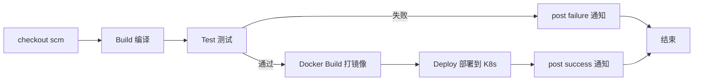
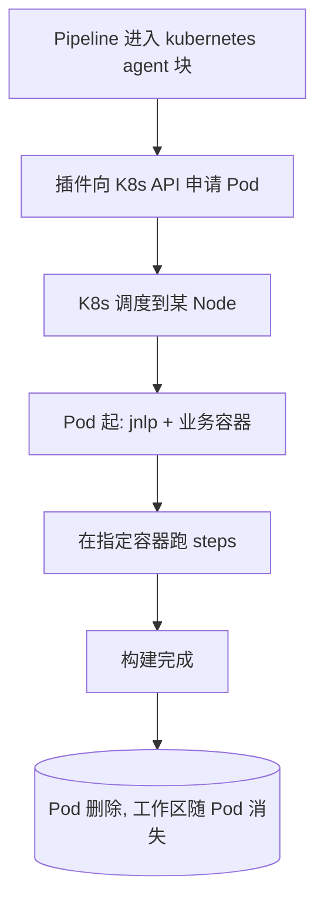

# CI/CD · 05 Jenkins Pipeline as Code

> 口诀：Pipeline 即代码——把"怎么构建"写进 `Jenkinsfile` 存进 Git，让 CI 流程和源码一起版本化、评审、回滚，告别在 UI 上点出来的"雪花服务器"。

本篇讲 Pipeline 两种语法、Declarative 结构、常用指令、共享库（Shared Library）、Blue Ocean 与可视化、以及与 Kubernetes 动态 Agent 的集成，并给出 3 个可直接运行的 `Jenkinsfile`。底层架构见 [04-Jenkins架构与核心机制](04-Jenkins架构与核心机制.md)；CI/CD 总览见 [01-概述与核心概念](01-概述与核心概念.md)；制品归档见 [03-构建与制品管理](03-构建与制品管理.md)。

## 一、两种语法：Declarative vs Scripted

| 维度 | Declarative（声明式） | Scripted（脚本式） |
|------|----------------------|--------------------|
| 形态 | 固定 schema：`pipeline { agent/stages/post }` | 裸 Groovy：`node { ... }` |
| 上手 | 低，结构化、有代码补全 | 高，需懂 Groovy |
| 灵活性 | 受限但够用，复杂逻辑用 `script{}` 块 | 无限，可写任意 Groovy/循环/类 |
| 安全 | 默认进沙箱，需审批才出沙箱 | 同样受 Script Security 约束，但更易写出危险代码 |
| 可读性 | 高，stage 一眼看清 | 低，逻辑散落 |
| 官方推荐 | ✅ 新项目首选 | ⚠️ 遗留/特殊场景 |

> 口诀：**新手用 Declarative，老手写 Scripted，团队统一 Declarative——可读性与安全性的收益远大于"Groovy 自由"**。

## 二、Jenkinsfile 结构

Declarative 的"骨架"：

```groovy
pipeline {
    agent { label 'docker' }      // ① 在哪跑
    environment { FOO = 'bar' }   // ② 全局环境变量
    options { timestamps() }      // ③ 流水线选项
    parameters { string(name:'BRANCH', defaultValue:'main') } // ④ 参数
    triggers { cron('H 2 * * *') }// ⑤ 触发器
    stages {                      // ⑥ 核心：阶段
        stage('Build') {
            steps { sh 'make' }
        }
    }
    post {                        // ⑦ 收尾：无论成败
        always { cleanWs() }
    }
}
```

### 2.1 顶层指令一览

| 指令 | 作用 | 常用取值 |
|------|------|----------|
| `agent` | 指定执行节点 | `any` / `none` / `label 'x'` / `docker` / `kubernetes` |
| `environment` | 注入环境变量/凭据 | `CRED = credentials('id')` |
| `options` | 流水线级选项 | `timestamps()` `timeout()` `disableConcurrentBuilds()` `buildDiscarder()` |
| `parameters` | 手动/触发参数 | `string` `choice` `booleanParam` `text` |
| `triggers` | 自动触发 | `cron` `pollSCM` `upstream` |
| `stages` | 阶段容器 | 含若干 `stage` |
| `post` | 收尾动作 | `always` / `success` / `failure` / `aborted` / `changed` |

### 2.2 一个典型 Pipeline 的 stage 流程



## 三、常用指令详解

### 3.1 agent：决定在哪跑

```groovy
// 任意可用 Agent
agent any

// 指定标签
agent { label 'maven&&linux' }

// 用 Docker 容器当构建环境（容器随构建起停）
agent {
    docker {
        image 'maven:3.9-eclipse-temurin-17'
        args '-v $HOME/.m2:/root/.m2'
    }
}

// 用 Kubernetes 动态 Pod（云原生，见第六节）
agent {
    kubernetes {
        yaml '''
apiVersion: v1
kind: Pod
spec:
  containers:
  - name: maven
    image: maven:3.9-eclipse-temurin-17
    command: ['cat']
    tty: true
'''
    }
}
```

### 3.2 steps：核心步骤

| 步骤 | 说明 |
|------|------|
| `sh '...'` / `bat '...'` | Linux / Windows shell |
| `checkout scm` | 检出当前流水线绑定的 SCM（多分支自动按分支） |
| `stash` / `unstash` | 在 stage 间暂存/恢复文件（跨节点传递产物） |
| `timeout(time: 10, unit:'MINUTES')` | 超时打断，防挂死 |
| `retry(3)` | 失败重试（如网络抖动） |
| `withCredentials` | 安全注入凭据（不落日志） |

```groovy
stage('Test') {
    steps {
        timeout(time: 10, unit: 'MINUTES') {
            retry(2) {
                sh './mvnw test'
            }
        }
    }
}
```

### 3.3 when：条件执行

```groovy
stage('Deploy-Prod') {
    when {
        branch 'main'          // 仅 main 分支
        environment name: 'DEPLOY', value: 'true'
        // 也可：expression { return params.FORCE }
    }
    steps { sh './deploy.sh prod' }
}
```

### 3.4 post：收尾通知

```groovy
post {
    always    { cleanWs() }                       // 总是清理工作区
    success   { slackSend channel:'#ci', message:'✅ 构建成功'} }
    failure   { emailext to:'team@corp.com', subject:'❌ 构建失败', body:'${BUILD_URL}' }
    aborted   { echo '被中止' }
    changed   { echo '状态相较上次变化' }
}
```

### 3.5 parallel：并行 stage

```groovy
stage('并行测试') {
    parallel {
        stage('单测')  { steps { sh './mvnw test -Dscope=unit' } }
        stage('集成')  { steps { sh './mvnw test -Dscope=it' } }
        stage('质检')  { steps { sh 'sonar-scanner' } }
    }
}
```

### 3.6 input：交互卡点

```groovy
stage('人工放行生产') {
    steps {
        input message: '确认发布到生产？', ok: '放行',
              parameters: [choice(name:'env', choices:['canary','full'], description:'发布策略')]
        sh './deploy.sh $env'
    }
}
```

> ⚠️ **input 陷阱**：`input` 会**暂停流水线并占用 Agent executor**（除非放在 `agent none` 的 stage）。大量卡点会耗尽 executor。最佳实践：把 `input` 放在不带 `agent` 的 stage，确认后再进带 Agent 的部署 stage。

### 3.7 environment 注入凭据 & tools

```groovy
pipeline {
    agent any
    environment {
        // 凭据以环境变量注入，日志自动脱敏
        DOCKER_CREDS = credentials('docker-hub')
        NEXUS_TOKEN  = credentials('nexus-token')
    }
    tools {
        maven 'M3'   // 需 Controller 预先配置名为 M3 的 Maven 安装
        jdk   'J17'
    }
    stages {
        stage('Build') {
            steps { sh 'mvn -B clean package' }
        }
    }
}
```

### 3.8 多仓检出

```groovy
stage('Checkout') {
    steps {
        checkout scm                                  // 主仓（流水线绑定）
        dir('lib') {
            git url: 'git@github.com:corp/common-lib.git', branch: 'main'
        }
    }
}
```

## 四、共享库（Shared Library）

### 4.1 目录约定

```
(my-lib)/
├── vars/                 # 全局变量/步骤，文件名即步骤名
│   ├── buildAndTest.groovy
│   └── deployK8s.groovy
├── src/                  # 普通 Groovy 类（src/org/corp/Util.groovy）
└── resources/            # 静态资源（模板、脚本），用 libraryResource 读
```

- `vars/foo.groovy` 暴露一个 `foo(...)` 步骤；`foo.call(...)` 是其实现。
- `@Library('my-lib@main') _` 或 Jenkins 全局配置默认库后直接用 `foo()`。

### 4.2 调用示例

```groovy
@Library('corp-shared-lib@v2.3.0') _

pipeline {
    agent any
    stages {
        stage('Build') {
            steps { buildAndTest() }   // 来自 vars/buildAndTest.groovy
        }
        stage('Deploy') {
            steps { deployK8s(env.TARGET) }
        }
    }
}
```

```groovy
// vars/buildAndTest.groovy
def call() {
    sh './mvnw -B clean verify'
    junit 'target/surefire-reports/*.xml'
}
```

### 4.3 共享库加载机制

```mermaid
flowchart TB
    JF[Jenkinsfile] -->|@Library 注解 / 全局默认库| LD[Library Resolver]
    LD -->|拉取指定 branch/tag| REPO[Git 仓库: vars/ src/ resources/]
    REPO -->|动态加载| CP[Controller 类加载器]
    CP --> VARS[vars/*.groovy 转为全局步骤]
    CP --> SRC[src/ 普通类供调用]
    VARS --> RUN[Pipeline 中可直接用 buildAndTest() 等]
```

### 4.4 最佳实践与陷阱

| 建议 | 说明 |
|------|------|
| 锁版本 | `@Library('lib@v1.2.3')`，勿用 `@master` 漂移 |
| 纯逻辑放 src/ | 复杂工具类放 `src/`，`vars/` 只做薄封装 |
| 沙箱友好 | 避免 `new FileInputStream` 等沙箱外调用，减少 script approval |
| 单元测 | 用 `JenkinsPipelineUnit` 框架测共享库 |

> ⚠️ **陷阱**：共享库代码在 **Controller JVM** 执行（除非用 `libraryResource` 或放到 Agent 步骤里），且默认**不受 Pipeline 沙箱逐行限制**、需 Script Security 审批。一个坏共享库 = 全公司流水线都能被它拖垮或 RCE（呼应 [04-Jenkins架构与核心机制](04-Jenkins架构与核心机制.md) 的供应链风险）。

## 五、Blue Ocean 与可视化

- **Blue Ocean**：Jenkins 的现代 UI，图形化编辑/可视化 Pipeline、分支与 PR 视图。⚠️ **官方已宣布 2026 年 7 月正式弃用（deprecated），之后不再提供安全修复**；社区推荐替代品 **Pipeline: Stage View** 与 **Pipeline Graph View** 插件（后者活跃维护，最接近 Blue Ocean 体验）。
- **Pipeline Stage View**：内置于 Blue Ocean 时代前的经典视图，按 stage 展示时长与状态，仍可用。
- **Pipeline 语法片段生成器（Snippet Generator）**：在 `localhost:8080/pipeline-syntax` 勾选步骤自动生成 `steps` 代码，**官方首选的 Pipeline 编写辅助工具**。

> 口诀：**新项目别再押注 Blue Ocean，用 Declarative + Stage View/Graph View + Snippet Generator 三件套**。

## 六、与 Kubernetes 动态 Agent 集成

### 6.1 原理：用完即焚的 Pod

Kubernetes 插件在 Pipeline 需要 `agent { kubernetes { ... } }` 时，向集群**动态申请一个 Pod** 作为 Agent；Pod 内含一个 `jnlp` 容器（跑 Jenkins agent 进程）和若干业务容器（maven/node/docker…），构建完 **Pod 自动删除**（默认 `podRetention: never`）。



### 6.2 多容器 + 凭据 + 资源示例

```groovy
pipeline {
    agent {
        kubernetes {
            yaml '''
apiVersion: v1
kind: Pod
spec:
  serviceAccountName: jenkins-agent
  containers:
  - name: maven
    image: maven:3.9-eclipse-temurin-17
    command: ['cat']
    tty: true
    env:
    - name: MAVEN_OPTS
      value: "-Xmx1024m"
  - name: kubectl
    image: bitnami/kubectl:latest
    command: ['cat']
    tty: true
'''
        }
    }
    environment {
        KUBE_CREDS = credentials('kubeconfig-prod')
    }
    stages {
        stage('Build') {
            steps {
                container('maven') {
                    sh 'mvn -B clean package'
                }
            }
        }
        stage('Deploy') {
            steps {
                container('kubectl') {
                    sh 'kubectl --kubeconfig=$KUBE_CREDS apply -f k8s/'
                }
            }
        }
    }
}
```

> ⚠️ **agent 镜像过大**：基础镜像动辄 1GB+，Pod 频繁起停会拖慢首构建（镜像拉取时长）。应对：用精简镜像（如 `-alpine`、`eclipse-temurin` 瘦身版）、配节点镜像缓存、或用 `dynamicPVC` 缓存依赖。
>
> ⚠️ **uid 不一致**：Pod 内多容器若 uid 不同，切换容器执行命令会权限报错。建议统一 `securityContext.runAsUser` 与 `fsGroup`。

## 七、完整 Jenkinsfile 示例

### 7.1 示例①：简单 Maven 构建 + 测试 + 制品归档

```groovy
// Jenkinsfile (Declarative)
pipeline {
    agent { label 'maven' }
    tools {
        maven 'M3'
        jdk   'J17'
    }
    options {
        timestamps()
        timeout(time: 30, unit: 'MINUTES')
        buildDiscarder(logRotator(numToKeepStr: '20'))
    }
    stages {
        stage('Checkout') {
            steps { checkout scm }
        }
        stage('Build & Test') {
            steps {
                sh './mvnw -B clean verify'
            }
            post {
                always {
                    junit 'target/surefire-reports/*.xml'
                }
            }
        }
        stage('Archive') {
            steps {
                archiveArtifacts artifacts: 'target/*.jar', fingerprint: true
            }
        }
    }
    post {
        failure { slackSend channel:'#ci', message:"❌ ${env.JOB_NAME} #${env.BUILD_NUMBER}" }
        success { slackSend channel:'#ci', message:"✅ ${env.JOB_NAME} #${env.BUILD_NUMBER}" }
    }
}
```

### 7.2 示例②：多阶段（build→test→docker→deploy）+ parallel

```groovy
pipeline {
    agent { label 'docker' }
    environment {
        REGISTRY = 'registry.corp.com/app'
        DOCKER_CREDS = credentials('docker-hub')
    }
    stages {
        stage('Build') {
            steps {
                sh 'npm ci'
                sh 'npm run build'
            }
        }
        stage('Parallel Quality') {
            parallel {
                stage('Unit Test') {
                    steps { sh 'npm test -- --coverage' }
                }
                stage('Lint') {
                    steps { sh 'npm run lint' }
                }
                stage('Snyk Scan') {
                    steps { sh 'npx snyk test || true' }
                }
            }
        }
        stage('Docker Build & Push') {
            steps {
                sh 'echo $DOCKER_CREDS_PSW | docker login -u $DOCKER_CREDS_USR --password-stdin $REGISTRY'
                sh "docker build -t $REGISTRY:${env.BUILD_NUMBER} ."
                sh "docker push $REGISTRY:${env.BUILD_NUMBER}"
            }
        }
        stage('Deploy to K8s') {
            when { branch 'main' }
            steps {
                withCredentials([file(credentialsId: 'kubeconfig-prod', variable: 'KubeConfig')]) {
                    sh "kubectl --kubeconfig=$KubeConfig set image deploy/app app=$REGISTRY:${env.BUILD_NUMBER}"
                }
            }
        }
    }
    post {
        always  { cleanWs() }
        changed { slackSend channel:'#ci', message:"状态变化: ${currentBuild.currentResult}" }
    }
}
```

### 7.3 示例③：共享库 + Kubernetes 动态 Agent 云原生示例

```groovy
// 依赖全局配置共享库 corp-lib @ v2.3.0
@Library('corp-lib@v2.3.0') _

pipeline {
    agent {
        kubernetes {
            yamlFile 'ci/pod.yaml'   // 外部 Pod 模板文件，便于复用
        }
    }
    environment {
        GIT_CREDS = credentials('github-app')
    }
    options {
        timestamps()
        retry(2)   // 基础设施抖动自动换 Pod 重试
    }
    stages {
        stage('Build') {
            steps {
                container('maven') { buildAndTest() }   // 来自共享库
            }
        }
        stage('Image') {
            steps {
                container('kaniko') {
                    sh "kaniko --destination=$REGISTRY:${env.BUILD_NUMBER} --cache=true"
                }
            }
        }
        stage('Promote') {
            when { branch 'main' }
            steps {
                container('kubectl') { deployK8s('prod') }  // 来自共享库
            }
        }
    }
    post {
        always  { cleanWs() }
        failure { notifyFeishu('❌ 流水线失败') }  // 共享库封装的通知
    }
}
```

```yaml
# ci/pod.yaml —— 多容器、用完即焚
apiVersion: v1
kind: Pod
spec:
  serviceAccountName: jenkins-agent
  containers:
  - name: jnlp
    image: jenkins/inbound-agent:latest
  - name: maven
    image: maven:3.9-eclipse-temurin-17
    command: ['cat']; tty: true
  - name: kaniko
    image: gcr.io/kaniko-project/executor:latest
    command: ['sleep']; args: ['99d']
  - name: kubectl
    image: bitnami/kubectl:latest
    command: ['cat']; tty: true
```

## 八、常见反模式与踩坑

> ⚠️ **Groovy 脚本安全**：`script{}` 块或共享库里写任意 Groovy，首次需管理员 **Script Approval**。别为图省事关掉 Script Security——那是 RCE 后门。

> ⚠️ **凭证泄露**：`sh "echo $TOKEN"` 会进日志；务必 `withCredentials` 或 `environment { X = credentials(...) }`，Jenkins 会自动 masking。

> ⚠️ **硬编码**：把镜像仓库、集群地址、token 写死在 Jenkinsfile。应通过参数/凭据/共享库配置注入，保证多环境可移植。

> ⚠️ **长 Pipeline 难维护**：几百行的 Jenkinsfile 塞满逻辑。拆到共享库 `vars/`，Jenkinsfile 只保留"编排骨架"。

> ⚠️ **agent 默认 any**：不指定 label 会让任务乱跑，可能在没有 Docker 的节点上执行 `docker build` 而失败。明确 label / 用 kubernetes agent。

## 九、设计 Checklist

- [ ] 新项目一律 Declarative，复杂逻辑用 `script{}` 局部兜底。
- [ ] `agent` 明确（label / docker / kubernetes），避免 `any` 漂移。
- [ ] 凭据只走 `withCredentials` / `environment credentials()`，绝不硬编码。
- [ ] 耗时/易抖动的步骤包 `timeout` + `retry`；跨节点产物用 `stash/unstash`。
- [ ] 重逻辑抽到 **共享库** 并锁版本（`@vX.Y.Z`），用 PipelineUnit 测试。
- [ ] 多容器/云原生构建用 **Kubernetes 动态 Agent**，镜像精简、`podRetention` 合理。
- [ ] 可视化用 Stage View / Graph View，勿再依赖即将弃用的 Blue Ocean。
- [ ] `post` 统一清理 `cleanWs()` + 通知，保障 Agent 不残留。

## 二十七、Jenkins Pipeline 高级实践与故障排查

### 27.1 共享库高级开发

```groovy
// vars/parallelBuild.groovy - 高级并行构建
def call(Map config = [:]) {
    def modules = config.modules ?: ['backend', 'frontend']
    def parallelStages = [:]
    
    modules.each { module ->
        parallelStages["Build ${module}"] = {
            stage("Build ${module}") {
                sh "mvn clean package -pl ${module}"
            }
        }
    }
    
    parallel parallelStages
}

// vars/dockerPipeline.groovy - 完整Docker流水线
def call(Map config = [:]) {
    def image = config.image ?: error("image required")
    def registry = config.registry ?: "registry.example.com"
    
    pipeline {
        agent any
        stages {
            stage('Build') {
                steps {
                    sh "docker build -t ${registry}/${image}:${env.BUILD_NUMBER} ."
                }
            }
            stage('Push') {
                steps {
                    withCredentials([usernamePassword(credentialsId: 'docker-creds', 
                        usernameVariable: 'USER', passwordVariable: 'PASS')]) {
                        sh "echo $PASS | docker login ${registry} -u $USER --password-stdin"
                        sh "docker push ${registry}/${image}:${env.BUILD_NUMBER}"
                    }
                }
            }
        }
    }
}
```

| 共享库最佳实践 | 说明 | 收益 |
|----------------|------|------|
| 版本锁定 | `@Library('lib@v1.2.3')` | 避免漂移 |
| 单元测试 | JenkinsPipelineUnit框架 | 质量保障 |
| 沙箱友好 | 避免危险Groovy调用 | 安全性 |
| 文档化 | vars/目录函数文档 | 可维护性 |

### 27.2 错误处理高级模式

```groovy
// 高级错误处理模式
pipeline {
    agent any
    stages {
        stage('Deploy') {
            steps {
                script {
                    // 1. 条件重试
                    retry(3) {
                        sh './deploy.sh'
                    }
                    
                    // 2. 超时控制
                    timeout(time: 30, unit: 'MINUTES') {
                        sh './health-check.sh'
                    }
                    
                    // 3. 异常捕获与恢复
                    try {
                        sh './risky-operation.sh'
                    } catch (Exception e) {
                        echo "Operation failed: ${e.message}"
                        currentBuild.result = 'UNSTABLE'
                        // 发送告警但不中断流水线
                        notifySlack channel: '#ci-alerts', 
                                   message: "⚠️ 非关键操作失败: ${e.message}"
                    }
                    
                    // 4. 成本感知的重试
                    def maxRetries = 3
                    def attempt = 0
                    while (attempt < maxRetries) {
                        try {
                            sh './flaky-command.sh'
                            break
                        } catch (Exception e) {
                            attempt++
                            if (attempt >= maxRetries) {
                                throw e
                            }
                            sleep(time: attempt * 10, unit: 'SECONDS')
                        }
                    }
                }
            }
        }
        
        // 5. 并行阶段错误隔离
        stage('Parallel Tests') {
            parallel {
                stage('Unit Tests') {
                    steps {
                        catchError(buildResult: 'UNSTABLE', stageResult: 'FAILURE') {
                            sh 'mvn test -pl unit'
                        }
                    }
                }
                stage('Integration Tests') {
                    steps {
                        catchError(buildResult: 'UNSTABLE', stageResult: 'FAILURE') {
                            sh 'mvn test -pl integration'
                        }
                    }
                }
            }
        }
    }
}
```

| 错误处理策略 | 适用场景 | 实现方式 |
|--------------|----------|----------|
| 条件重试 | 网络抖动 | `retry(N) { ... }` |
| 超时控制 | 长时间任务 | `timeout(time: N) { ... }` |
| 异常捕获 | 非关键操作 | `try-catch` + `currentBuild.result` |
| 成本感知重试 | 资源敏感操作 | `while` + `sleep` |
| 错误隔离 | 并行测试 | `catchError(buildResult: 'UNSTABLE')` |

### 27.3 凭证管理高级实践

```groovy
// 凭据管理高级模式
pipeline {
    agent any
    environment {
        // 1. 动态凭据选择
        CREDS = credentials("${params.ENV}-docker-creds")
        
        // 2. 凭据作用域控制
        GLOBAL_CREDS = credentials('global-api-key')
    }
    stages {
        stage('Deploy') {
            steps {
                script {
                    // 3. 凭据安全使用
                    withCredentials([
                        usernamePassword(
                            credentialsId: "${params.ENV}-db-creds",
                            usernameVariable: 'DB_USER',
                            passwordVariable: 'DB_PASS'
                        ),
                        file(
                            credentialsId: "${params.ENV}-kubeconfig",
                            variable: 'KUBECONFIG'
                        )
                    ]) {
                        // 4. 凭据验证
                        sh '''
                            echo "Validating credentials..."
                            mysql -u$DB_USER -p$DB_PASS -e "SELECT 1" || exit 1
                            kubectl --kubeconfig=$KUBECONFIG get pods || exit 1
                        '''
                        
                        // 5. 业务操作
                        sh './deploy.sh'
                    }
                    // 离开withCredentials块后，凭据变量失效
                }
            }
        }
        
        stage('Rotate Credentials') {
            when {
                branch 'main'
                expression { return params.ROTATE_CREDS }
            }
            steps {
                // 6. 凭据轮换
                withCredentials([string(credentialsId: 'admin-token', variable: 'TOKEN')]) {
                    sh '''
                        # 轮换数据库密码
                        NEW_PASS=$(openssl rand -base64 32)
                        curl -H "Authorization: Bearer $TOKEN" \
                             -X POST https://vault.example.com/v1/secret/data/db \
                             -d '{"data": {"password": "'$NEW_PASS'"}}'
                    '''
                }
            }
        }
    }
}
```

| 凭据安全措施 | 说明 | 最佳实践 |
|--------------|------|----------|
| 最小权限 | 只授予必要权限 | 按环境/项目隔离 |
| 定期轮换 | 自动更换凭证 | 集成Vault/Secrets Manager |
| 审计日志 | 记录使用情况 | 集成SIEM系统 |
| 加密存储 | Jenkins内置加密 | 避免明文存储 |
| 作用域控制 | 限制可见范围 | `withCredentials` 块内使用 |

### 27.4 Pipeline 测试高级策略

```groovy
// Pipeline 单元测试
import com.lesfurets.jenkins.unit.BasePipelineTest
import org.junit.Before
import org.junit.Test
import static org.junit.Assert.*

class AdvancedPipelineTest extends BasePipelineTest {
    @Override
    @Before
    void setUp() throws Exception {
        super.setUp()
        
        // Mock 外部依赖
        helper.registerAllowedMethod("sh", [String.class], { cmd ->
            echo "Mock: ${cmd}"
            return "mock output"
        })
        
        helper.registerAllowedMethod("withCredentials", [List.class, Closure.class], { creds, body ->
            // Mock 凭据注入
            env[creds[0].variable] = "mock-value"
            body()
        })
    }
    
    @Test
    void testDeployPipeline() {
        // 1. 加载流水线
        def pipeline = loadScript("Jenkinsfile")
        
        // 2. 设置环境变量
        env.BRANCH_NAME = 'main'
        env.BUILD_NUMBER = '123'
        
        // 3. 执行流水线
        pipeline.call()
        
        // 4. 验证结果
        assertJobStatusSuccess()
        
        // 5. 验证stage执行
        assertCallStackContains("sh", "mvn clean package")
        assertCallStackContains("sh", "docker build")
    }
    
    @Test
    void testErrorHandling() {
        // 测试错误处理逻辑
        helper.registerAllowedMethod("sh", [String.class], { cmd ->
            if (cmd.contains("fail")) {
                throw new RuntimeException("Simulated failure")
            }
            return "success"
        })
        
        def pipeline = loadScript("Jenkinsfile")
        pipeline.call()
        
        // 验证错误处理
        assertCallStackContains("echo", "Operation failed")
    }
}
```

| 测试类型 | 工具 | 覆盖范围 |
|----------|------|----------|
| 单元测试 | JenkinsPipelineUnit | Groovy逻辑、共享库函数 |
| 集成测试 | Jenkins Test Framework | 完整流水线执行 |
| 端到端测试 | Selenium + Jenkins | Web UI、用户交互 |
| 性能测试 | JMeter + Jenkins | 构建性能、资源使用 |
| 安全测试 | OWASP ZAP + Jenkins | 安全漏洞、凭据泄露 |

### 27.5 Pipeline 优化高级策略

```groovy
// 高级优化策略
pipeline {
    agent any
    stages {
        // 1. 智能缓存
        stage('Build') {
            steps {
                script {
                    // 基于依赖变化决定是否缓存
                    def depsChanged = sh(script: 'git diff --name-only HEAD~1 | grep -E "pom.xml|package.json"', 
                                        returnStdout: true).trim()
                    
                    if (!depsChanged) {
                        echo "No dependency changes, using cache"
                        sh 'mvn clean package -DskipTests -o'  // 离线模式
                    } else {
                        sh 'mvn clean package -DskipTests'
                    }
                }
            }
        }
        
        // 2. 增量构建
        stage('Incremental Build') {
            steps {
                script {
                    def changed = sh(script: 'git diff --name-only HEAD~1', 
                                    returnStdout: true).trim().split('\n')
                    
                    def modules = changed.collect { it.split('/')[0] }.unique()
                    
                    modules.each { module ->
                        if (fileExists("${module}/pom.xml")) {
                            sh "mvn clean package -pl ${module}"
                        }
                    }
                }
            }
        }
        
        // 3. 并行优化
        stage('Parallel Optimization') {
            parallel {
                stage('Build Backend') {
                    steps {
                        sh 'mvn clean package -pl backend -T 4'  // 4线程并行
                    }
                }
                stage('Build Frontend') {
                    steps {
                        sh 'npm ci && npm run build'
                    }
                }
            }
        }
        
        // 4. 资源感知调度
        stage('Resource Aware') {
            agent { label 'high-memory' }
            steps {
                sh './memory-intensive-task.sh'
            }
        }
    }
}
```

| 优化策略 | 实现方式 | 预期效果 |
|----------|----------|----------|
| 智能缓存 | 基于依赖变化决策 | 构建时间减少30-50% |
| 增量构建 | 只构建变更模块 | 构建时间减少50-70% |
| 并行优化 | 多线程/多模块并行 | 构建时间减少40-60% |
| 资源感知 | 按需求选择Agent | 资源利用率提升 |
| 浅克隆 | `git clone --depth 1` | 拉取时间减少50-80% |

### 27.6 Docker Pipeline 高级实践

```groovy
// Docker 高级实践
pipeline {
    agent any
    environment {
        REGISTRY = 'registry.example.com'
        IMAGE = "${REGISTRY}/myapp"
    }
    stages {
        // 1. 多阶段构建
        stage('Multi-Stage Build') {
            steps {
                script {
                    // 构建阶段
                    docker.build("${IMAGE}:build", '--target builder -f Dockerfile .')
                    
                    // 运行阶段
                    docker.build("${IMAGE}:${env.BUILD_NUMBER}", '--target runtime -f Dockerfile .')
                }
            }
        }
        
        // 2. 安全扫描
        stage('Security Scan') {
            steps {
                script {
                    def image = docker.image("${IMAGE}:${env.BUILD_NUMBER}")
                    image.withRun {
                        sh "trivy image --severity HIGH,CRITICAL ${IMAGE}:${env.BUILD_NUMBER}"
                    }
                }
            }
        }
        
        // 3. 推送多标签
        stage('Push Tags') {
            steps {
                script {
                    def image = docker.image("${IMAGE}:${env.BUILD_NUMBER}")
                    image.push()
                    image.push('latest')
                    image.push('v${env.BUILD_NUMBER}')
                }
            }
        }
        
        // 4. 清理本地镜像
        stage('Cleanup') {
            steps {
                sh "docker rmi ${IMAGE}:${env.BUILD_NUMBER} || true"
            }
        }
    }
}
```

| Docker实践 | 说明 | 收益 |
|------------|------|------|
| 多阶段构建 | 分离构建和运行环境 | 镜像体积减小60-80% |
| 安全扫描 | 漏洞检测 | 安全风险降低 |
| 多标签推送 | 版本管理 | 部署灵活性 |
| 镜像清理 | 释放磁盘空间 | 资源优化 |
| 缓存优化 | `--cache-from` | 构建时间减少30-50% |

### 27.7 Pipeline 故障排查手册

| 故障现象 | 可能原因 | 排查步骤 | 解决方案 |
|----------|----------|----------|----------|
| 构建失败 | 依赖缺失 | 检查依赖版本 | 锁定依赖版本 |
| 凭据错误 | 权限不足 | 检查凭据配置 | 最小权限原则 |
| 超时 | 任务过长 | 分析任务耗时 | 优化或拆分任务 |
| Agent不可用 | 资源不足 | 检查Agent状态 | 扩容或优化调度 |
| 共享库加载失败 | 版本不兼容 | 检查库版本 | 锁定版本号 |
| Docker构建失败 | 镜像拉取慢 | 检查网络/缓存 | 配置镜像缓存 |
| 并行阶段冲突 | 资源竞争 | 分析资源使用 | 资源隔离/调度优化 |

### 27.8 Pipeline 监控与度量

```yaml
# Pipeline 监控配置
monitoring:
  # 1. 构建指标
  metrics:
    - build_duration
    - build_success_rate
    - stage_duration
    - queue_time
  
  # 2. 告警规则
  alerts:
    - name: build_failure_rate_high
      condition: build_success_rate < 0.9
      duration: 1h
      severity: warning
    
    - name: build_duration_long
      condition: build_duration > 30m
      duration: 30m
      severity: info
  
  # 3. 仪表盘
  dashboards:
    - name: Jenkins Pipeline Overview
      panels:
        - title: Build Success Rate
          type: graph
          targets:
            - expr: jenkins_builds_success_total / jenkins_builds_total
        
        - title: Average Build Duration
          type: graph
          targets:
            - expr: rate(jenkins_build_duration_seconds_sum[5m]) / rate(jenkins_build_duration_seconds_count[5m])
```

| 监控维度 | 指标 | 告警阈值 |
|----------|------|----------|
| 构建成功率 | 成功/总构建数 | <90% |
| 构建耗时 | 平均构建时间 | >30分钟 |
| 队列等待 | 平均等待时间 | >10分钟 |
| Agent使用率 | Agent忙碌比例 | >80% |
| 失败率趋势 | 失败率变化 | 环比增长>10% |

> 核心原则：**测试先行，错误可控，凭据安全，性能优化，监控到位**。

## 与其他模块的关联

- [04-Jenkins架构与核心机制](04-Jenkins架构与核心机制.md)：本文 `agent{}`、label、K8s Pod 的底层就是 Controller/Agent 架构与 Remoting 通信。
- [01-概述与核心概念](01-概述与核心概念.md)：流水线的 stage/触发器概念总览，本文是其具体落地。
- [03-构建与制品管理](03-构建与制品管理.md)：示例中 `archiveArtifacts` 的制品应进一步推到制品库统一管理。
- [../大数据/10-资源调度：YARN与Kubernetes](../大数据/10-资源调度：YARN与Kubernetes.md)：K8s 动态 Agent 依赖 K8s 调度与 RBAC，原理互通。
- [../../云原生/K8S.md](../../云原生/K8S.md)：Pod 模板、ServiceAccount、RBAC、镜像拉取密钥均来自 K8s 知识。

> 参考：
> - Jenkins Pipeline 官方文档（Declarative / Scripted）：https://www.jenkins.io/doc/book/pipeline/
> - Pipeline 语法参考：https://www.jenkins.io/doc/book/pipeline/syntax/
> - Shared Libraries 文档：https://www.jenkins.io/doc/book/pipeline/shared-libraries/
> - Kubernetes 插件与 podTemplate：https://plugins.jenkins.io/kubernetes
> - Jenkins Configuration as Code：https://plugins.jenkins.io/configuration-as-code/
> - Blue Ocean 弃用公告（2026-07）：https://www.jenkins.io/projects/blueocean/about/
> - Pipeline Graph View 插件（Blue Ocean 替代）：https://plugins.jenkins.io/pipeline-graph-view/
> - Jenkins 安全公告 2025：https://www.jenkins.io/security/advisories/
> - 实战：Dynamic Jenkins Agents with Kubernetes（2026）：https://oneuptime.com/blog/post/2026-01-27-jenkins-kubernetes-agents/view

## 十、声明式 vs 脚本式：如何取舍

| 维度 | 声明式 Declarative | 脚本式 Scripted |
|------|--------------------|-----------------|
| 语法 | 结构化、受限、易校验 | 纯 Groovy、灵活 |
| 学习成本 | 低，Snippet Generator 可生成 | 高，需懂 Groovy |
| 错误拦截 | 编译期校验、结构错直接 fail | 运行期才暴露 |
| 适用 | 绝大多数新项目 | 极复杂动态逻辑兜底 |

> 取舍原则：**新项目一律 Declarative**；只有"按需动态生成 stage 数量 / 反射式调用"等声明式表达不了的，才用 `script{}` 局部兜底，禁止整篇脚本式。

```groovy
// 声明式内嵌脚本式兜底（局部，不污染整体结构）
stage('Dynamic') {
    steps {
        script {
            def services = readYaml(file: 'svc.yaml').list
            services.each { s -> build job: "deploy-${s}" }
        }
    }
}
```

## 十一、stage 并行与"失败时继续"

`parallel` 块内多 stage 并发；`failFast: false` 让其中一个失败也不立即杀掉其他分支（便于收集全部测试结果）。

```groovy
stage('Test Matrix') {
    parallel(
        unit:   { stage('Unit')   { sh 'npm test:unit' } },
        e2e:    { stage('E2E')    { sh 'npm test:e2e'  } },
        lint:   { stage('Lint')   { sh 'npm run lint'  } }
    )
}
// 失败时继续收集所有报告
stage('Report') {
    steps {
        catchError(buildResult: 'SUCCESS', stageResult: 'FAILURE') {
            sh 'npm run report'
        }
    }
}
```

## 十二、post 块：统一清理与通知

`post` 按结果（`always`/`success`/`failure`/`changed`/`unstable`）执行，是"清理+通知"的单一落点：

```groovy
post {
    always   { cleanWs() }                                  // 必清工作区
    success  { slackSend channel:'#ci', message:'✅' }
    failure  { slackSend channel:'#ci', message:'❌' ; archiveArtifacts 'target/**' }
    unstable { junit 'target/surefire-reports/*.xml' }
    changed  { emailext to:'team@corp.com', subject:'状态变化' }
}
```

## 十三、withCredentials：凭据安全注入

凭据**绝不硬编码**，用 `withCredentials` 临时注入为环境变量（Jenkins 自动 masking 日志）：

```groovy
stage('Deploy') {
    steps {
        withCredentials([usernamePassword(
            credentialsId: 'docker-hub',
            usernameVariable: 'U', passwordVariable: 'P')]) {
            sh 'echo $P | docker login -u $U --password-stdin'
        }
        // 离开块后 $P/$U 失效，不会残留
    }
}
// ❌ 反模式：sh "echo $TOKEN" 会明文进日志
```

## 十四、Jenkinsfile 反模式（含 Groovy 踩坑）

```groovy
// ❌ 反模式1：groovy 里做耗时 IO（在 Controller 上执行，拖垮主节点）
node { def files = new File('/big').listFiles() }   // 应在 agent 内、用 steps

// ❌ 反模式2：硬编码凭证
environment { TOKEN = 'ak-123' }                     // 应走 credentials()

// ❌ 反模式3：不清理工作区，磁盘爆炸
// 解决：post { always { cleanWs() } }

// ❌ 反模式4：agent any 乱跑，docker 构建失败
agent any                                            // 应 label 'docker'

// ❌ 反模式5：超长 Jenkinsfile，逻辑全堆一起
// 解决：抽到 @Library('corp-lib@vX') 的 vars/

// ❌ 反模式6：script{} 里关掉 Script Security
// 解决：保留 Script Approval，别为省事放开
```

## 十五、Jenkins Shared Library 开发

### 15.1 Shared Library 结构

```
Shared Library 目录结构：
  vars/
    ├── buildAndPush.groovy      # 全局函数
    ├── notifySlack.groovy        # 通知函数
    ├── dockerBuild.groovy        # Docker 构建
    └── deployK8s.groovy          # K8s 部署
  src/
    └── com/
        └── company/
            └── utils/
                ├── GitUtils.groovy    # Git 工具类
                └── DockerUtils.groovy # Docker 工具类
  resources/
    └── templates/
        └── Dockerfile.template   # 模板文件
```

### 15.2 Shared Library 实现

```groovy
// vars/buildAndPush.groovy
def call(Map config = [:]) {
    def image = config.image ?: error("image is required")
    def tag = config.tag ?: env.BUILD_NUMBER
    def registry = config.registry ?: "registry.example.com"

    pipeline {
        agent any
        stages {
            stage('Build') {
                steps {
                    script {
                        sh "docker build -t ${registry}/${image}:${tag} ."
                    }
                }
            }
            stage('Push') {
                steps {
                    withCredentials([usernamePassword(credentialsId: 'docker-creds', usernameVariable: 'USER', passwordVariable: 'PASS')]) {
                        sh "echo $PASS | docker login $registry -u $USER --password-stdin"
                        sh "docker push ${registry}/${image}:${tag}"
                    }
                }
            }
        }
    }
}

// 使用 Shared Library
@Library('corp-lib@v2') _
buildAndPush(image: 'my-app', tag: '1.0.0')
```

---

## 十六、Jenkins 流水线测试

### 16.1 流水线测试框架

```groovy
// JenkinsfileUnit 测试
pipeline {
    agent any
    stages {
        stage('Test') {
            steps {
                script {
                    // 使用 Jenkins Pipeline Unit 框架
                    def pipeline = load 'Jenkinsfile'
                    pipeline.call()
                    // 验证 stage 是否正确执行
                }
            }
        }
    }
}

// 测试用例
// JenkinsfileTest.groovy
def testPipeline() {
    def pipeline = load 'Jenkinsfile'
    // Mock 环境变量
    env.BRANCH_NAME = 'main'
    env.BUILD_NUMBER = '123'
    
    // 执行流水线
    pipeline.call()
    
    // 验证结果
    assert binding.variables['STAGE_NAME'] == 'Build'
}
```

### 16.2 测试策略

| 测试类型 | 工具 | 说明 |
|----------|------|------|
| 单元测试 | Jenkins Pipeline Unit | 测试 Groovy 逻辑 |
| 集成测试 | Jenkins Test Framework | 测试完整流水线 |
| 端到端测试 | Selenium + Jenkins | 测试 Web UI |
| 性能测试 | JMeter + Jenkins | 测试构建性能 |

---

## 十七、Jenkins 流水线优化

### 17.1 构建加速

```groovy
// 1. 并行构建
stage('Build') {
    parallel {
        stage('Backend') {
            steps { sh 'mvn clean package -pl backend' }
        }
        stage('Frontend') {
            steps { sh 'npm run build' }
        }
    }
}

// 2. 缓存优化
stage('Build') {
    steps {
        script {
            // Docker 层缓存
            sh 'docker build --cache-from=registry/app:latest -t app:latest .'
            // Maven 缓存
            sh 'mvn clean package -Dmaven.repo.local=$HOME/.m2/repository'
        }
    }
}

// 3. 增量构建
stage('Build') {
    steps {
        script {
            // 只构建变更的模块
            def changed = sh(script: 'git diff --name-only HEAD~1', returnStdout: true)
            if (changed.contains('backend/')) {
                sh 'mvn clean package -pl backend'
            }
        }
    }
}
```

### 17.2 优化效果

| 优化措施 | 效果 | 适用场景 |
|----------|------|----------|
| 并行构建 | 构建时间减少 40-60% | 多模块项目 |
| Docker 缓存 | 构建时间减少 30-50% | Docker 构建 |
| Maven 缓存 | 构建时间减少 20-40% | Java 项目 |
| 增量构建 | 构建时间减少 50-70% | 大型项目 |
| 浅克隆 | 拉取时间减少 50-80% | 大型仓库 |

---

## 十八、Jenkins Docker Pipeline

### 18.1 Docker Pipeline 配置

```groovy
// Docker Pipeline 插件
pipeline {
    agent {
        docker {
            image 'maven:3.9-eclipse-temurin-17'
            args '-v $HOME/.m2:/root/.m2'
            label 'docker'
        }
    }
    stages {
        stage('Build') {
            steps {
                sh 'mvn clean package'
            }
        }
        stage('Test') {
            steps {
                sh 'mvn test'
            }
        }
        stage('Docker Build') {
            steps {
                script {
                    docker.build('my-app:latest', '-f Dockerfile .')
                }
            }
        }
        stage('Docker Push') {
            steps {
                script {
                    withCredentials([usernamePassword(credentialsId: 'docker-creds', usernameVariable: 'USER', passwordVariable: 'PASS')]) {
                        sh "echo $PASS | docker login -u $USER --password-stdin"
                        docker.image('my-app:latest').push()
                    }
                }
            }
        }
    }
}
```

### 18.2 Docker 多阶段构建

```groovy
// 多阶段 Docker 构建
stage('Multi-Stage Build') {
    steps {
        script {
            // 构建阶段
            docker.build('my-app:build', '--target builder -f Dockerfile .')
            // 运行阶段
            docker.build('my-app:latest', '--target runtime -f Dockerfile .')
        }
    }
}
```

---

## 十九、Jenkins Blue Ocean 高级功能

### 19.1 Blue Ocean 特性

```
Blue Ocean 高级功能：
  1. 可视化编辑器：拖拽式创建流水线
  2. 实时日志：流式查看构建日志
  3. Git 集成：PR/分支可视化
  4. 回放功能：回放历史构建
  5. 并行阶段可视化：并行 stage 可视化

  启用 Blue Ocean：
    安装 Blue Ocean 插件
    访问 http://jenkins:8080/blue
```

### 19.2 Blue Ocean vs Classic UI

| 功能 | Blue Ocean | Classic UI |
|------|------------|------------|
| 界面 | 现代化 | 传统 |
| 流程可视化 | 强 | 弱 |
| Git 集成 | 深度集成 | 基础 |
| 移动端 | 支持 | 不支持 |
| 插件 | 部分插件 | 全部插件 |

---

## 二十、Jenkins 凭证管理

### 20.1 凭证管理最佳实践

```groovy
// 1. 使用 Jenkins 凭据存储
withCredentials([usernamePassword(credentialsId: 'db-creds', usernameVariable: 'USER', passwordVariable: 'PASS')]) {
    sh 'mysql -u$USER -p$PASS -e "SELECT 1"'
}

// 2. 使用 SSH 凭据
withCredentials([sshUserPrivateKey(credentialsId: 'ssh-key', keyFileVariable: 'KEY', usernameVariable: 'USER')]) {
    sh 'ssh -i $KEY $USER@server "ls"'
}

// 3. 使用 Secret 文件
withCredentials([file(credentialsId: 'kubeconfig', variable: 'KUBECONFIG')]) {
    sh 'kubectl --kubeconfig=$KUBECONFIG get pods'
}

// 4. 使用 Secret 文本
withCredentials([string(credentialsId: 'api-key', variable: 'API_KEY')]) {
    sh 'curl -H "Authorization: Bearer $API_KEY" https://api.example.com'
}
```

### 20.2 凭证安全

| 安全措施 | 说明 |
|----------|------|
| 最小权限 | 只授予必要权限 |
| 定期轮换 | 定期更换凭证 |
| 审计日志 | 记录凭证使用 |
| 加密存储 | Jenkins 内置加密 |
| 访问控制 | 控制凭证访问权限 |

---

## 本篇补充 Checklist

- [ ] 新项目 Declarative，`script{}` 只做局部动态兜底。
- [ ] 重 stage 用 `parallel` + `failFast:false`；报告收集用 `catchError`。
- [ ] `post` 统一 `cleanWs()` + 通知；凭据只走 `withCredentials`。
- [ ] 警惕 6 类反模式：Controller 上 IO、硬编码、不清理、agent any、巨石文件、关 Script Security。

---

## 二十一、Jenkins 共享库开发最佳实践

### 21.1 共享库目录结构

```text
jenkins-shared-library/
├── vars/                    # 全局变量/函数（Groovy 脚本）
│   ├── buildDocker.groovy   # vars.buildDocker()
│   ├── runTests.groovy      # vars.runTests()
│   └── notifySlack.groovy   # vars.notifySlack()
├── src/                     # OOP 封装（Groovy 类）
│   └── com/
│       └── company/
│           └── ci/
│               ├── Pipeline.groovy
│               └── DockerBuilder.groovy
├── resources/               # 非 Groovy 资源（模板/配置）
│   └── templates/
│       └── Jenkinsfile.tpl
└── test/                    # 单元测试
    └── groovy/
        └── BuildDockerTest.groovy
```

### 21.2 vars 目录 API 设计

```groovy
// vars/buildDocker.groovy
def call(Map config = [:]) {
    def image = config.image ?: error("image is required")
    def tag = config.tag ?: env.BUILD_NUMBER
    def dockerfile = config.dockerfile ?: 'Dockerfile'
    
    sh """
        docker build -t ${image}:${tag} -f ${dockerfile} .
        docker push ${image}:${tag}
    """
    return "${image}:${tag}"
}

// 调用方式
def imageTag = buildDocker image: 'myapp', tag: env.BUILD_NUMBER
```

### 21.3 src 目录 OOP 封装

```groovy
// src/com/company/ci/DockerBuilder.groovy
package com.company.ci

class DockerBuilder implements Serializable {
    private String image
    private String tag
    private String dockerfile
    
    DockerBuilder(String image) {
        this.image = image
        this.tag = 'latest'
        this.dockerfile = 'Dockerfile'
    }
    
    DockerBuilder withTag(String tag) {
        this.tag = tag
        return this
    }
    
    String build(steps) {
        steps.sh "docker build -t ${image}:${tag} -f ${dockerfile} ."
        return "${image}:${tag}"
    }
}
```

## 二十二、Pipeline 错误处理（try/catch/retry/timeout/when）

### 22.1 错误处理模式

```groovy
pipeline {
    agent any
    stages {
        stage('Deploy') {
            steps {
                // try-catch 错误处理
                script {
                    try {
                        sh './deploy.sh'
                    } catch (Exception e) {
                        echo "部署失败: ${e.message}"
                        currentBuild.result = 'FAILURE'
                        throw e
                    }
                }
                
                // retry 重试
                retry(3) {
                    sh './flaky-command.sh'
                }
                
                // timeout 超时
                timeout(time: 10, unit: 'MINUTES') {
                    sh './long-running-task.sh'
                }
            }
        }
        
        stage('Canary') {
            when {
                branch 'main'
                expression { return params.DEPLOY_CANARY }
            }
            steps {
                sh './canary-deploy.sh'
            }
        }
    }
    post {
        failure {
            script {
                notifySlack channel: '#ci-alerts', 
                           message: "❌ ${env.JOB_NAME} 失败"
            }
        }
        always {
            cleanWs()
        }
    }
}
```

### 22.2 when 条件组合

| 条件 | 用途 | 示例 |
|------|------|------|
| `branch` | 分支过滤 | `when { branch 'main' }` |
| `expression` | 自定义表达式 | `when { expression { return params.DEPLOY } }` |
| `environment` | 环境变量 | `when { environment name: 'ENV', value: 'prod' }` |
| `not` | 取反 | `when { not { branch 'develop' } }` |
| `allOf` | 全部满足 | `when { allOf { branch 'main'; expression {...} } }` |
| `anyOf` | 任一满足 | `when { anyOf { branch 'main'; branch 'release/*' } }` |

## 二十三、Credential 管理（withCredentials 绑定范围）

### 23.1 凭证绑定方式

```groovy
// Secret 文本
withCredentials([string(credentialsId: 'api-key', variable: 'API_KEY')]) {
    sh 'curl -H "Authorization: $API_KEY" https://api.example.com'
}

// Secret 文件
withCredentials([file(credentialsId: 'kubeconfig', variable: 'KUBECONFIG')]) {
    sh 'kubectl --kubeconfig=$KUBECONFIG get pods'
}

// SSH 密钥
withCredentials([sshUserPrivateKey(credentialsId: 'ssh-key', 
                                   keyFileVariable: 'SSH_KEY',
                                   usernameVariable: 'SSH_USER')]) {
    sh 'ssh -i $SSH_KEY $SSH_USER@server "ls"'
}

// 用户名密码
withCredentials([usernamePassword(credentialsId: 'docker-cred',
                                   usernameVariable: 'USER',
                                   passwordVariable: 'PASS')]) {
    sh 'echo $PASS | docker login -u $USER --password-stdin registry.example.com'
}
```

### 23.2 凭据作用域最小化

| 作用域 | 说明 | 安全性 |
|--------|------|--------|
| 全局 | Jenkins 全局凭证 | 最低 |
| 文件夹 | 文件夹级别凭证 | 中 |
| Pipeline 级 | `withCredentials` 绑定 | 最高（仅当前 stage 可见） |

> 口诀：凭证绑定范围越小越安全——`withCredentials` 仅在需要的 stage 内使用，不要放在全局 environment。

## 二十四、Pipeline 测试（Jenkins Pipeline Unit / declarative-linter）

### 24.1 Jenkins Pipeline Unit

```groovy
// test/groovy/BuildDockerTest.groovy
import com.lesfurets.jenkins.unit.BasePipelineTest
import org.junit.Before
import org.junit.Test

class BuildDockerTest extends BasePipelineTest {
    @Override
    @Before
    void setUp() throws Exception {
        super.setUp()
        // Mock 外部命令
        helper.registerAllowedMethod("sh", [String.class], { cmd ->
            echo "Mock: ${cmd}"
        })
    }
    
    @Test
    void testBuildDocker() {
        def result = loadScript("vars/buildDocker.groovy")
        result.call(image: "myapp", tag: "1.0")
        
        // 验证调用
        assertJobStatusSuccess()
    }
}
```

### 24.2 declarative-linter

```bash
# 检查 Jenkinsfile 语法
java -jar declarative-linter-cli.jar Jenkinsfile

# CI 集成
lint-check:
  stage: lint
  script:
    - java -jar declarative-linter-cli.jar Jenkinsfile
  allow_failure: false
```

## 二十五、Pipeline 优化（parallel stage / WS 清理 / stash 传递）

### 25.1 parallel stage 优化

```groovy
stage('Parallel Tests') {
    parallel {
        stage('Unit Tests') {
            steps {
                sh 'mvn test -pl module-core'
            }
        }
        stage('Integration Tests') {
            steps {
                sh 'mvn test -pl module-integration'
            }
        }
        stage('Security Scan') {
            steps {
                sh 'trivy fs --severity HIGH,CRITICAL .'
            }
        }
    }
}
```

### 25.2 stash 跨 agent 传递

```groovy
// 构建 agent 上 stash
stash name: 'build-output', includes: 'target/*.jar'

// 部署 agent 上 unstash
unstash 'build-output'
sh 'java -jar target/app.jar'
```

### 25.3 工作区清理

```groovy
post {
    always {
        cleanWs()                    // 清理工作区
        cleanWs patterns: [          // 自定义清理
            [pattern: 'target/', type: 'INCLUDE'],
            [pattern: '.git/', type: 'INCLUDE']
        ]
    }
}
```

## 二十六、Docker Pipeline（docker.build / docker.image / Kaniko）

### 26.1 Docker Pipeline DSL

```groovy
pipeline {
    agent any
    stages {
        stage('Build') {
            steps {
                script {
                    def image = docker.build("myapp:${env.BUILD_NUMBER}")
                    image.push()
                    image.push('latest')
                }
            }
        }
        stage('Test') {
            steps {
                docker.image("myapp:${env.BUILD_NUMBER}").inside {
                    sh 'mvn test'
                }
            }
        }
    }
}
```

### 26.2 Kaniko 在 K8s Agent 构建

```yaml
# Jenkinsfile 中使用 Kaniko
pipeline {
    agent {
        kubernetes {
            yaml '''
apiVersion: v1
kind: Pod
spec:
  containers:
    - name: kaniko
      image: gcr.io/kaniko-project/executor:latest
      command: ['sleep']
      args: ['infinity']
      volumeMounts:
        - name: docker-config
          mountPath: /kaniko/.docker
'''
        }
    }
    stages {
        stage('Build with Kaniko') {
            steps {
                container('kaniko') {
                    sh '''
                        /kaniko/executor \
                            --context=${WORKSPACE} \
                            --destination=registry/myapp:${BUILD_NUMBER} \
                            --cache=true \
                            --cache-repo=registry/cache
                    '''
                }
            }
        }
    }
}
```
