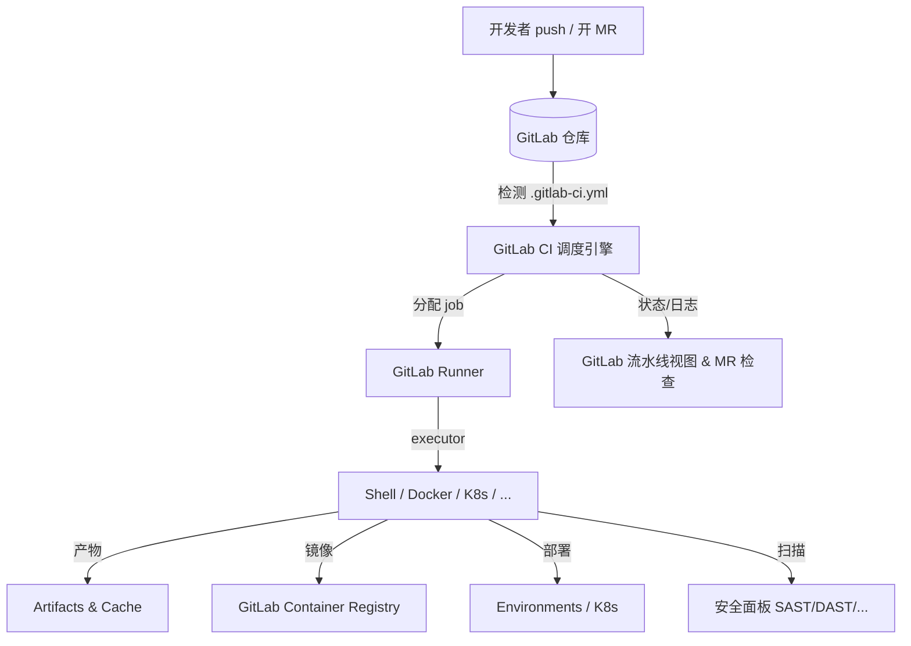
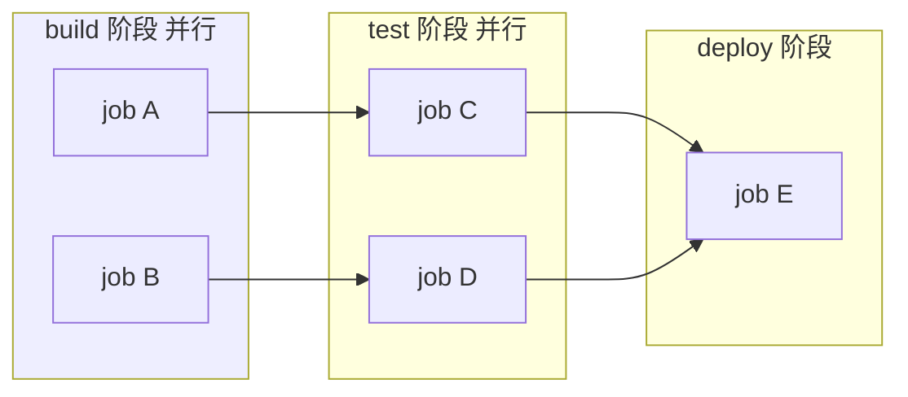
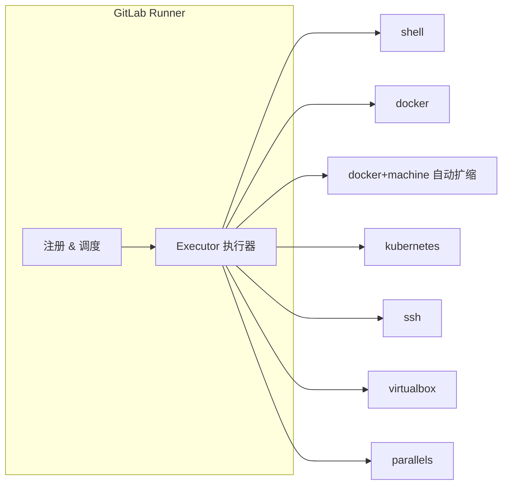
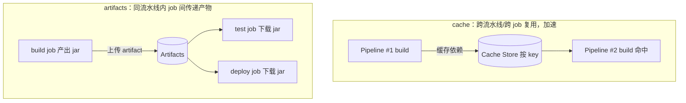
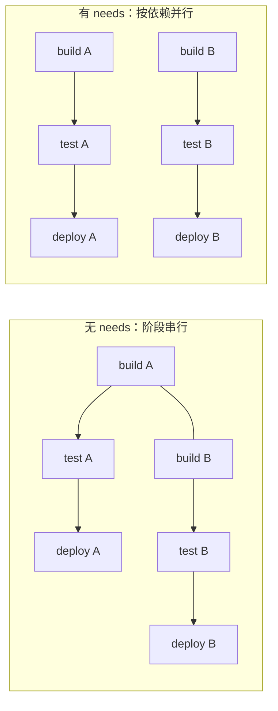

# CI/CD · 06 GitLab CI

> **口诀：GitLab CI 的灵魂是 `.gitlab-ci.yml` 这一个文件——它在仓库根目录定义"代码如何被构建、测试、部署"，Runner 只是忠实的执行者。** 一体化（代码、CI、安全、制品、环境全在一个平台）是它最大的卖点，也是它的锁定点。

本篇讲透 GitLab 内置 CI/CD 的全套能力：从 `.gitlab-ci.yml` 的语法骨架、Runner 与 executor 选型、cache/artifacts 的差异，到 `needs` 打破阶段串行的 DAG、流水线类型（MR pipeline / 父子流水线 / 多项目流水线）、安全扫描模板、环境与卡点。所有示例均可直接落地。

## 一、GitLab CI/CD 是什么：定位与一体化体验

GitLab CI/CD 是**内置于 GitLab 平台**的持续集成与持续交付系统。与 Jenkins（独立部署）或 GitHub Actions（独立服务）不同，它和代码仓库、Merge Request（MR）、容器Registry、安全面板、Pages、Environments 共享同一套身份与 UI。你在仓库里放一个 `.gitlab-ci.yml`，GitLab 就会在每次 push / MR / 打 tag 时自动调度 Runner 执行。



| 维度 | GitLab CI/CD | （对照）Jenkins | （对照）GitHub Actions |
|------|--------------|----------------|------------------------|
| 部署形态 | 平台内置 | 独立服务 | 平台内置（GitHub） |
| 配置位置 | 仓库内 `.gitlab-ci.yml` | 独立 `Jenkinsfile` / UI | 仓库内 `.github/workflows/*.yml` |
| 安全扫描 | 官方模板一键接入 | 插件拼装 | 第三方 Action / CodeQL |
| 环境/审批 | Environments + manual job | 插件（如 Blue Ocean） | Environments + manual job |
| 一体化度 | **最高**（代码/CI/安全/Registry/环境一体） | 低（需自行集成） | 高（与 GitHub 生态一体） |

> 口诀：**"要一体化选 GitLab，要自由拼装选 Jenkins，要生态市场选 GitHub Actions。"** 没有银弹，看团队已经在哪个平台、要什么程度的开箱即用。

## 二、`.gitlab-ci.yml` 核心结构

一个最小可运行的 `.gitlab-ci.yml` 由**全局配置**和**作业（job）**组成。作业是基本执行单元，Runner 为每个 `job` 启动一个独立执行环境。

```yaml
stages:
  - build
  - test
  - deploy

variables:
  IMAGE_TAG: "1.0.0"

build_job:
  stage: build
  image: maven:3.9-eclipse-temurin-21
  script:
    - mvn package -DskipTests

unit_test:
  stage: test
  script:
    - mvn test

deploy_job:
  stage: deploy
  script:
    - echo "deploying..."
  environment: production
```

### 2.1 stages / stage：阶段顺序 vs 作业归属

- **`stages`**（全局）：声明流水线有哪些阶段**以及它们的执行顺序**。默认阶段是 `build`、`test`、`deploy`，但你必须显式声明才会按顺序跑。
- **`stage`**（作业级）：把这个作业分配到哪个阶段。**同一阶段内的所有作业并行执行**；只有上一个阶段所有作业都成功，下一阶段才开始。



### 2.2 script / before_script / after_script

| 关键字 | 执行时机 | 失败影响 |
|--------|----------|----------|
| `before_script` | 每个 job 的 `script` 之前（作业级可覆盖全局） | 失败则该 job 失败 |
| `script` | 核心命令，**必填** | 任意一条非零退出即 job 失败 |
| `after_script` | 无论成功失败都执行（即便 `script` 被 `when` 跳过也会跑） | 失败不影响 job 状态 |

⚠️ **反模式**：把大量逻辑塞进单条超长 `script`，既不可读也难调试。把可复用步骤抽成 `before_script` 或用 `extends`/`include` 复用。另外 `after_script` 里不要做"关键收尾动作"，因为它运行在**另一个 shell 上下文**，拿不到 `script` 里的变量/函数。

### 2.3 image / services：作业容器与依赖服务

- **`image`**：作业运行的容器镜像（默认 `docker` / `kubernetes` executor 生效）。每个 job 默认一个干净容器。
- **`services`**：为作业启动**伴生容器**（如 `mysql`、`redis`、`postgres`），通过服务名作为 hostname 互相访问，用于集成测试。

```yaml
integration_test:
  stage: test
  image: maven:3.9-eclipse-temurin-21
  services:
    - name: mysql:8.0
      alias: db
    - name: redis:7
      alias: cache
  variables:
    MYSQL_ROOT_PASSWORD: "rootpass"
    MYSQL_DATABASE: "appdb"
  script:
    - mvn verify  # 连接 jdbc:mysql://db:3306/appdb 与 redis://cache:6379
```

### 2.4 variables：变量的层级与作用域

变量来源优先级（高→低）：**job 变量 > 流水线变量 > Group/Project 变量（GitLab 后台配置）> `variables` 全局 > Runner 内置变量**。敏感信息（密钥、token）应放在 GitLab 项目/组的 **Settings → CI/CD → Variables**，而非写进 YAML。

```yaml
variables:                # 全局默认
  BUILD_ENV: "staging"
build:
  variables:              # 作业级覆盖
    BUILD_ENV: "prod"
  script:
    - echo "env=$BUILD_ENV"
```

### 2.5 tags：选择 Runner（最容易踩坑的点）

`tags` 决定**哪些 Runner 能抢到这个 job**。Runner 注册时带标签，job 的 `tags` 必须**是 Runner 标签的子集**才会被认领。

```yaml
deploy_prod:
  tags:
    - k8s
    - prod-runner
  script:
    - kubectl apply -f k8s/
```

### 2.6 allow_failure / when / retry / timeout

| 关键字 | 作用 | 取值/示例 |
|--------|------|-----------|
| `allow_failure` | job 失败**不阻断**后续阶段 | `true`：红但不挂流水线 |
| `when` | 何时运行 | `on_success`(默认) / `on_failure` / `always` / `manual` / `delayed` |
| `retry` | 失败自动重试 | `retry: 2` 或 `retry: { max: 2, when: runner_system_failure }` |
| `timeout` | 单 job 超时 | `timeout: 1h`（默认 1 小时，受 Runner 上限约束） |
| `start_in` | 延迟 `manual` job | `when: manual` + `start_in: 30 minutes` |

`when: manual` 配合 `allow_failure: false` 就是**人工卡点**（见第八节）。

### 2.7 rules：精细控制 job 是否/何时运行（推荐替代 only/except）

`rules` 是 2020 年后 GitLab 主推的调度逻辑，支持 `if`、`exists`、`changes`、`merge_request` 等条件。按顺序匹配，**第一条命中**的 rule 决定行为（`when` 默认 `on_success`，可用 `when: never` 跳过）。

```yaml
test:
  script: mvn test
  rules:
    - if: $CI_PIPELINE_SOURCE == "merge_request_event"   # MR 流水线里跑
    - if: $CI_COMMIT_BRANCH == $CI_DEFAULT_BRANCH         # 主干也跑
    - when: never                                          # 其余（如普通分支 push）不跑

build_docs:
  script: mkdocs build
  rules:
    - changes:                                             # 仅文档变更时跑
        - "docs/**/*"
        - "mkdocs.yml"
    - when: never

secret_scan:
  script: scan
  rules:
    - exists:                                              # 仓库含此文件才跑
        - "**/*.env"
```

`only` / `except` 仍是旧式写法（GitLab 文档标注为不推荐），能与 `rules` 混用但**语义易冲突**，强烈建议统一用 `rules`。常用预定义变量：`$CI_PIPELINE_SOURCE`（值含 `push` / `merge_request_event` / `schedule` / `web` / `trigger`）、`$CI_COMMIT_BRANCH`、`$CI_COMMIT_TAG`、`$CI_MERGE_REQUEST_IID`。

## 三、GitLab Runner 与 executor 选型

Runner 是真正干活的 agent，可以装在任意机器（物理机 / VM / K8s Pod / 容器）。一个 Runner 可服务多个项目，也可限定 tag。

### 3.1 安装与注册

```bash
# 1) 安装（Ubuntu 示例，安装官方 gitlab-runner 包）
sudo curl -L "https://packages.gitlab.com/install/repositories/runner/gitlab-runner/script.deb.sh" | sudo bash
sudo apt-get install gitlab-runner

# 2) 注册 Runner 到 GitLab 实例（交互式，会问 URL / token / executor / tag）
sudo gitlab-runner register \
  --non-interactive \
  --url "https://gitlab.example.com" \
  --registration-token "$REGISTRATION_TOKEN" \
  --executor "docker" \
  --docker-image "alpine:latest" \
  --tag-list "docker,common" \
  --description "shared-docker-runner"

# 3) 启动并查看状态
sudo gitlab-runner start
sudo gitlab-runner status
sudo gitlab-runner list
```

注册信息写入 `/etc/gitlab-runner/config.toml`。Executor 在注册时选定，**一台 Runner 一个 executor**（但可注册多个 Runner 实例各用不同 executor）。

### 3.2 executor 类型对比与选型



| Executor | 隔离度 | 速度 | 自动扩缩 | 适用场景 | 主要坑 |
|----------|--------|------|----------|----------|--------|
| `shell` | 低（共用 OS 用户） | 最快 | 否 | 简单脚本、自管机 | **易受污染/提权**，需受信任代码 |
| `docker` | 中（容器级） | 快 | 否 | 绝大多数构建，环境干净 | 需 Docker daemon，docker-in-docker 权限 |
| `docker+machine` | 中 | 快 | **是**（按需起 VM） | 高并发、弹性 CI | 运维复杂、云成本 |
| `kubernetes` | 高（Pod 级） | 中 | **是**（HPA/调度） | 云原生团队、K8s 集群内 | 需 K8s RBAC 配置 |
| `ssh` | 低 | 中 | 否 | 已有目标机执行 | 同 shell，安全弱 |
| `virtualbox` / `parallels` | 高（VM 级） | 慢 | 否 | 需完整 OS/特定内核 | 资源重、启动慢 |

> 口诀：**"要隔离上 K8s/docker，要弹性上 docker+machine，要省事但不受信代码别用 shell。"** 生产共享 Runner 绝不用 `shell` executor 跑不可信 MR。

## 四、cache vs artifacts：加速 vs 传递产物

这是 GitLab CI 最常被混淆的一对概念。



| 维度 | `cache` | `artifacts` |
|------|---------|-------------|
| 目的 | **加速**：缓存依赖（node_modules、~/.m2） | **传递**：把构建产物交给后续 job |
| 生命周期 | 跨流水线保留（按 key 命中） | 同流水线内传递，默认在后续阶段可下载，过期可设 |
| 作用范围 | 默认所有 job 共享同一 key（易污染） | 仅 `dependencies`/`needs` 声明的 job 获取 |
| 下载时机 | job 开始时 restore | job 开始时 download（除非 `dependencies: []`） |
| 典型用法 | `paths: [node_modules/]` | `paths: [target/*.jar]` |
| 风险 | **跨分支/并行污染** | 体积大拖慢、需设 `expire_in` |

```yaml
variables:
  MAVEN_OPTS: "-Dmaven.repo.local=$CI_PROJECT_DIR/.m2"

cache:
  key: ${CI_COMMIT_REF_SLUG}          # ⚠️ 按分支隔离，避免跨分支污染
  paths:
    - .m2/
    - target/

build:
  stage: build
  script: mvn package -DskipTests
  artifacts:
    name: "$CI_COMMIT_REF_SLUG-jar"
    paths:
      - target/app.jar
    expire_in: 1 week                 # 避免无限堆积
    when: on_success

test:
  stage: test
  needs: [build]
  script: mvn test
  dependencies: [build]               # 显式声明要拿 build 的 artifacts
```

`artifacts: policy: push`（仅上传）/`pull`（仅下载）/`pull-push`（默认）控制单 job 的收/发行为；`dependencies: []` 可让某 job 不拉任何 artifact。

⚠️ **生产踩坑**：`cache` 的 `key` 不按分支隔离时，A 分支的编译产物可能覆盖 B 分支，导致"我本地好的"诡异失败。务必用 `key: $CI_COMMIT_REF_SLUG` 或最细粒度的 key。

## 五、needs 与 DAG：打破阶段串行

默认 job 受 `stages` 串行约束；`needs` 让 job **不等整阶段结束**、只要依赖的 job 完成就立即开跑，形成有向无环图（DAG），显著缩短关键路径。



```yaml
stages: [build, test, deploy]

build_a: { stage: build, script: echo building A }
build_b: { stage: build, script: echo building B }

test_a:
  stage: test
  needs: [build_a]          # 不等 build_b，build_a 一完就跑
  script: echo testing A
test_b:
  stage: test
  needs: [build_b]
  script: echo testing B

deploy_a:
  stage: deploy
  needs: [test_a]
  script: echo deploy A
deploy_b:
  stage: deploy
  needs: [test_b]
  script: echo deploy B

lint:
  stage: test
  needs: []                 # 立即运行，不依赖任何 job（常见：静态检查先跑）
  script: echo lint
```

`needs` 进阶：
- `needs: [job, job2]`：多依赖（扇入）。
- `needs: { job: build, artifacts: false }`：只等完成、不要其 artifacts（省下载）。
- `needs: { job: build, optional: true }`：依赖可选，job 不存在也不报错（动态生成流水线时有用）。
- `needs: { pipeline: other_project, job: build }`：跨项目取产物（多项目流水线）。

> 口诀：**"stages 管'默认节奏'，needs 管'实际依赖'——用 needs 画 DAG，把关键路径压到最短。"**

## 六、流水线类型

GitLab 提供四种流水线组织方式，可组合使用。

| 类型 | 触发 | 价值 | 关键词 |
|------|------|------|--------|
| 基础流水线 | 默认 | 简单直观 | `stages` |
| DAG 流水线 | job 依赖 | 最快执行 | `needs` |
| 合并请求流水线 | 开/更新 MR | **不让未过 CI 的代码合入** | `rules: if: $CI_PIPELINE_SOURCE == "merge_request_event"` |
| 父子流水线 | 父触发子 | 大仓拆分、动态生成 | `trigger` + `include` |
| 多项目流水线 | 跨项目触发 | 微服务协同 | `trigger: { project: }` |

### 6.1 合并请求流水线（Pipelines for Merge Requests）

在 MR 上跑、结果直接显示在 MR 检查项，是"合代码前先过 CI"的关键。

```yaml
# 全局 workflow.rules 确保 MR 与主干各跑一次，避免重复
workflow:
  rules:
    - if: $CI_PIPELINE_SOURCE == "merge_request_event"
    - if: $CI_COMMIT_BRANCH == $CI_DEFAULT_BRANCH

test:
  script: mvn test
  rules:
    - if: $CI_PIPELINE_SOURCE == "merge_request_event"
    - if: $CI_COMMIT_BRANCH == $CI_DEFAULT_BRANCH
```

### 6.2 父子流水线（Parent-Child / Child Pipelines）

把大 YAML 拆成子文件，由父流水线用 `trigger` 触发，配合 `rules` 做"只触发变更部分"。

```yaml
# .gitlab-ci.yml（父）
stages: [trigger]

frontend_pipeline:
  stage: trigger
  trigger:
    include: frontend/.gitlab-ci.yml     # 子流水线配置
    strategy: depend                      # 父等子完成再继续
  rules:
    - changes: [ "frontend/**/*" ]

backend_pipeline:
  stage: trigger
  trigger:
    include: backend/.gitlab-ci.yml
  rules:
    - changes: [ "backend/**/*" ]
```

### 6.3 多项目流水线（Multi-Project Pipelines）

跨仓库协同发布（如前端、后端、移动端分属不同项目）：

```yaml
deploy_downstream:
  stage: deploy
  trigger:
    project: mygroup/service-b
    branch: main
    strategy: depend
```

## 七、集成安全扫描（模板化，深入见第 13 篇）

GitLab 内置安全扫描通过 `include` 官方模板即可启用，结果汇入安全面板（需 Ultimate/Gold 等授权，社区版可跑但面板受限）。

```yaml
include:
  - template: Security/SAST.gitlab-ci.yml            # 静态应用安全测试
  - template: Security/Dependency-Scanning.gitlab-ci.yml
  - template: Security/Secret-Detection.gitlab-ci.yml # 密钥泄露检测
  - template: Security/Container-Scanning.gitlab-ci.yml
  - template: Security/DAST.gitlab-ci.yml            # 动态测试（需配置环境 URL）

sast:
  variables:
    SAST_EXCLUDED_PATHS: "tests, docs"
```

五大扫描能力对照：

| 扫描 | 模板 | 检测对象 | 阶段 |
|------|------|----------|------|
| SAST | `Security/SAST.gitlab-ci.yml` | 源码中的安全漏洞（SQLi、XSS 模式） | build/test |
| Dependency Scanning | `Security/Dependency-Scanning.gitlab-ci.yml` | 依赖库 CVE | test |
| Secret Detection | `Security/Secret-Detection.gitlab-ci.yml` | 提交的密钥/ token | test |
| Container Scanning | `Security/Container-Scanning.gitlab-ci.yml` | 镜像层 CVE（Trivy） | test |
| DAST | `Security/DAST.gitlab-ci.yml` | 运行中应用的漏洞 | deploy 后 |

> 第 13 篇会深入 SBOM、签名、供应链攻击面；此处只建立"模板即插即用"的认知。

## 八、environments 与环境部署、手动卡点、Review Apps

`environment` 把部署与 GitLab 的 **Environments** 页面绑定，可查看每次部署、一键回滚、设保护环境（protected）。

```yaml
deploy_staging:
  stage: deploy
  script: helm upgrade --install app ./charts --set image.tag=$CI_COMMIT_SHA
  environment:
    name: staging
    url: https://staging.example.com
  rules:
    - if: $CI_COMMIT_BRANCH == "develop"

deploy_prod:
  stage: deploy
  script: helm upgrade --install app ./charts --set image.tag=$CI_COMMIT_SHA
  environment:
    name: production
  when: manual              # 人工卡点：需人在 GitLab 点一下
  allow_failure: false      # 卡点失败则流水线失败（不可跳过）
  rules:
    - if: $CI_COMMIT_BRANCH == $CI_DEFAULT_BRANCH
```

**Review Apps**：为每个 MR 自动起一套临时环境，MR 关闭即回收——用 `environment: { name: review/$CI_MERGE_REQUEST_IID, on_stop: stop_review }` + `action: stop` 的清理 job 实现。

⚠️ **生产踩坑**：`when: manual` 的卡点 job 若忘了配 `allow_failure: false`，它失败也不会阻断流水线，等于"假卡点"。保护生产环境务必同时开启 GitLab 的 **Protected Environment**（限定能部署的角色）。

## 九、完整示例

### 9.1 示例① 标准 build→test→deploy（含 cache / artifacts）

```yaml
stages:
  - build
  - test
  - deploy

variables:
  MAVEN_OPTS: "-Dmaven.repo.local=$CI_PROJECT_DIR/.m2/repository"

cache:
  key: ${CI_COMMIT_REF_SLUG}
  paths:
    - .m2/repository/
    - target/

build:
  stage: build
  image: maven:3.9-eclipse-temurin-21
  script:
    - mvn compile
  artifacts:
    paths:
      - target/classes/
    expire_in: 1 hour

unit_test:
  stage: test
  image: maven:3.9-eclipse-temurin-21
  needs: [build]
  script:
    - mvn test
  coverage: '/Total.*?([0-9]+)%/'

package:
  stage: test
  image: maven:3.9-eclipse-temurin-21
  needs: [build]
  script:
    - mvn package -DskipTests
  artifacts:
    name: "app-$CI_COMMIT_SHORT_SHA"
    paths:
      - target/*.jar
    expire_in: 1 week

deploy_staging:
  stage: deploy
  image: bitnami/kubectl:latest
  needs: [package]
  environment:
    name: staging
  script:
    - kubectl set image deploy/app app=registry.example.com/app:$CI_COMMIT_SHORT_SHA
  rules:
    - if: $CI_COMMIT_BRANCH == "develop"
```

### 9.2 示例② 带 needs 的 DAG 并行 + 合并请求流水线

```yaml
workflow:
  rules:
    - if: $CI_PIPELINE_SOURCE == "merge_request_event"
    - if: $CI_COMMIT_BRANCH == $CI_DEFAULT_BRANCH

stages: [build, test, deploy]

lint:
  stage: test
  needs: []
  image: node:20
  script: npm run lint

build_frontend:
  stage: build
  image: node:20
  script: npm run build
  artifacts: { paths: [dist/], expire_in: 1h }

build_backend:
  stage: build
  image: maven:3.9-eclipse-temurin-21
  script: mvn package -DskipTests
  artifacts: { paths: [target/app.jar], expire_in: 1h }

test_frontend:
  stage: test
  needs: [build_frontend]
  image: node:20
  script: npm test

test_backend:
  stage: test
  needs: [build_backend]
  image: maven:3.9-eclipse-temurin-21
  script: mvn test

deploy:
  stage: deploy
  needs: [test_frontend, test_backend]   # 扇入：两个测试都过才部署
  image: bitnami/kubectl:latest
  script: echo "deploying both"
  environment: { name: review/$CI_MERGE_REQUEST_IID }
  rules:
    - if: $CI_PIPELINE_SOURCE == "merge_request_event"
```

### 9.3 示例③ 安全扫描模板 + K8s 部署 + OIDC 免密钥

```yaml
include:
  - template: Security/SAST.gitlab-ci.yml
  - template: Security/Secret-Detection.gitlab-ci.yml
  - template: Security/Dependency-Scanning.gitlab-ci.yml

stages: [build, test, deploy]

variables:
  AWS_REGION: "cn-north-1"

build:
  stage: build
  image: docker:24
  services: [docker:24-dind]
  script:
    - docker build -t $CI_REGISTRY_IMAGE:$CI_COMMIT_SHA .
    - docker push $CI_REGISTRY_IMAGE:$CI_COMMIT_SHA

deploy_aws:
  stage: deploy
  image: amazonlinux:2023
  id_tokens:                      # OIDC：向 AWS 换临时凭证，无需长期密钥
    AWS_TOKEN:
      aud: "https://gitlab.example.com"
  script:
    - yum install -y awscli kubectl
    - |
      # 用 OIDC token 向 AWS STS 换取临时凭证（trust policy 绑定 sub/aud）
      AWS_ROLE_ARN="arn:aws:iam::123456789012:role/gitlab-deploy"
      creds=$(aws sts assume-role-with-web-identity \
        --role-arn $AWS_ROLE_ARN \
        --role-session-name gitlab-$CI_PIPELINE_ID \
        --web-identity-token $AWS_TOKEN)
      export AWS_ACCESS_KEY_ID=$(echo $creds | jq -r .Credentials.AccessKeyId)
      export AWS_SECRET_ACCESS_KEY=$(echo $creds | jq -r .Credentials.SecretAccessKey)
      export AWS_SESSION_TOKEN=$(echo $creds | jq -r .Credentials.SessionToken)
    - kubectl set image deploy/app app=$CI_REGISTRY_IMAGE:$CI_COMMIT_SHA
  environment: { name: production }
  when: manual
  allow_failure: false
  rules:
    - if: $CI_COMMIT_BRANCH == $CI_DEFAULT_BRANCH
```

⚠️ **生产踩坑**：
1. `tags` 选错/缺失 → job 长时间 `pending`（没有匹配 Runner）。注册时确认标签与 job `tags` 一致。
2. `cache` 跨分支污染（见第四节）。
3. `rules` 与 `only/except` 混用 → 二者叠加语义诡异，统一用 `rules`。
4. 密钥误打日志：Runner 默认会**部分遮蔽**变量，但拼进 URL/命令的参数仍可能泄露；禁止 `echo $SECRET`，必要时 `set +x`。
5. 巨型单文件 pipeline（几百行、几十 job）难维护 → 用 `include` 拆子文件 / 父子流水线。

## GitLab CI 高级缓存策略

### 11.1 缓存策略详解

```yaml
# 策略一：分支隔离缓存
cache:
  key:
    files:
      - pom.xml
      - build.gradle
  paths:
    - .m2/repository/
    - node_modules/
  policy: pull-push

# 策略二：共享缓存（多分支共享）
cache:
  key: shared-cache
  paths:
    - vendor/bundle
  policy: pull-push

# 策略三：锁缓存（避免并发写冲突）
cache:
  key: ${CI_COMMIT_REF_SLUG}
  paths:
    - dist/
  policy: pull
  when: on_success

# 策略四：按阶段缓存
build:
  cache:
    - key: build-cache
      paths: [target/]
      policy: pull-push
test:
  cache:
    - key: build-cache
      paths: [target/]
      policy: pull
```

### 11.2 缓存 vs artifacts

| 维度 | cache | artifacts |
|------|-------|-----------|
| 目的 | 加速构建 | 传递产物 |
| 存储位置 | 共享缓存目录 | 临时存储 |
| 有效期 | 可配置 | 30天（默认） |
| 下载方式 | 自动 | 通过 dependencies |
| 适用场景 | 依赖包/构建缓存 | 编译产物/测试报告 |

---

## GitLab CI 单仓库（Monorepo）支持

### 12.1 Monorepo 流水线

```yaml
# 基于路径触发
frontend:
  rules:
    - changes:
        - frontend/**/*
  script:
    - cd frontend && npm install && npm run build

backend:
  rules:
    - changes:
        - backend/**/*
  script:
    - cd backend && mvn clean package

# 全局规则
build:
  rules:
    - if: $CI_COMMIT_BRANCH == $CI_DEFAULT_BRANCH
  script:
    - ./build-all.sh
```

### 12.2 Monorepo 优化

```yaml
# 使用 only/except 控制触发
frontend:
  only:
    changes:
      - "frontend/**/*"
      - "shared/**/*"  # 共享代码变更也触发

# 使用 needs 精确依赖
build_frontend:
  stage: build
  script: cd frontend && npm run build

build_backend:
  stage: build
  script: cd backend && mvn package

test_frontend:
  stage: test
  needs: [build_frontend]
  script: cd frontend && npm test

test_backend:
  stage: test
  needs: [build_backend]
  script: cd backend && mvn test
```

---

## GitLab CI 安全扫描集成

### 13.1 DevSecOps 扫描

```yaml
# 安全扫描模板
include:
  - template: Security/SAST.gitlab-ci.yml
  - template: Security/Dependency-Scanning.gitlab-ci.yml
  - template: Security/Container-Scanning.gitlab-ci.yml
  - template: Security/DAST.gitlab-ci.yml

# 自定义安全扫描
secret_detection:
  stage: test
  script:
    - trufflehog git file://. --json > secrets.json
  artifacts:
    reports:
      secret_detection: secrets.json

sast:
  stage: test
  variables:
    SAST_EXCLUDED_PATHS: "vendor/,node_modules/"
  artifacts:
    reports:
      sast: gl-sast-report.json

dependency_scanning:
  stage: test
  artifacts:
    reports:
      dependency_scanning: gl-dependency-scanning-report.json
```

### 13.2 安全扫描配置

| 扫描类型 | 说明 | 工具 |
|----------|------|------|
| SAST | 静态代码分析 | Semgrep/SonarQube |
| DAST | 劐态应用扫描 | OWASP ZAP |
| Dependency | 依赖漏洞扫描 | Trivy/Snyk |
| Container | 容器镜像扫描 | Trivy/Grype |
| Secret | 密钥检测 | TruffleHog/GitLeaks |

---

## GitLab CI 自动部署

### 14.1 自动部署配置

```yaml
# 自动部署到 Staging
deploy_staging:
  stage: deploy
  script:
    - kubectl set image deploy/app app=$CI_REGISTRY_IMAGE:$CI_COMMIT_SHA
  environment:
    name: staging
    url: https://staging.example.com
  rules:
    - if: $CI_COMMIT_BRANCH == $CI_DEFAULT_BRANCH

# 手动部署到 Production
deploy_production:
  stage: deploy
  script:
    - kubectl set image deploy/app app=$CI_REGISTRY_IMAGE:$CI_COMMIT_SHA
  environment:
    name: production
    url: https://www.example.com
  when: manual
  allow_failure: false
  rules:
    - if: $CI_COMMIT_BRANCH == $CI_DEFAULT_BRANCH
```

### 14.2 部署策略

```yaml
# 蓝绿部署
deploy_blue:
  stage: deploy
  script:
    - kubectl apply -f deployment-blue.yaml
    - kubectl rollout status deploy/app-blue
  environment:
    name: production

# 金丝雀部署
deploy_canary:
  stage: deploy
  script:
    - kubectl apply -f deployment-canary.yaml
    - sleep 60
    - kubectl rollout undo deploy/app-canary
  environment:
    name: canary

# 滚动更新
deploy_rolling:
  stage: deploy
  script:
    - kubectl set image deploy/app app=$CI_REGISTRY_IMAGE:$CI_COMMIT_SHA
    - kubectl rollout status deploy/app
  environment:
    name: production
```

---

## GitLab CI 与 Kubernetes 集成

### 15.1 K8s 部署配置

```yaml
# Kubernetes 部署
deploy_k8s:
  stage: deploy
  image: bitnami/kubectl:latest
  script:
    - kubectl config use-context $KUBE_CONTEXT
    - kubectl apply -f k8s/
    - kubectl rollout status deploy/$APP_NAME
  environment:
    name: production
    kubernetes:
      namespace: production
  variables:
    KUBE_CONTEXT: my-cluster:production
```

### 15.2 K8s 动态环境

```yaml
# 动态 Review 环境
review:
  stage: deploy
  script:
    - kubectl create namespace $CI_ENVIRONMENT_SLUG || true
    - kubectl -n $CI_ENVIRONMENT_SLUG apply -f k8s/
    - kubectl -n $CI_ENVIRONMENT_SLUG rollout status deploy/$APP_NAME
  environment:
    name: review/$CI_COMMIT_REF_SLUG
    url: https://$CI_COMMIT_REF_SLUG.review.example.com
    on_stop: stop_review
  rules:
    - if: $CI_MERGE_REQUEST_ID

stop_review:
  stage: deploy
  script:
    - kubectl delete namespace $CI_ENVIRONMENT_SLUG --ignore-not-found
  when: manual
  environment:
    name: review/$CI_COMMIT_REF_SLUG
    action: stop
```

---

## GitLab CI Variables 与 Secrets 管理

### 16.1 Variables 管理

```yaml
# Variables 优先级（从低到高）
# 1. Group Variables
# 2. Project Variables
# 3. Pipeline Variables
# 4. Job Variables

# 使用 Variables
build:
  variables:
    MAVEN_OPTS: "-Dmaven.repo.local=$CI_PROJECT_DIR/.m2/repository"
  script:
    - mvn clean package
  cache:
    key: ${CI_COMMIT_REF_SLUG}
    paths:
      - .m2/repository/

# 使用 CI/CD Variables
deploy:
  script:
    - echo $DEPLOY_TOKEN | docker login -u $DEPLOY_USER --password-stdin
  variables:
    DOCKER_TLS_CERTDIR: "/certs"
```

### 16.2 Secrets 保护

| 保护措施 | 说明 |
|----------|------|
| Protected Variables | 仅在 protected 分支/标签可用 |
| Masked Variables | 日志中自动遮蔽 |
| File 类型 | 以文件形式挂载 |
| 环境级 Variables | 绑定到特定环境 |
| 审计日志 | 记录 Variables 访问 |

---

## GitLab CI 性能优化

### 17.1 性能优化策略

```yaml
# 1. 并行测试
test:
  stage: test
  parallel: 4
  script:
    - pytest --splitting-algorithm=least_duration
  artifacts:
    reports:
      junit: report.xml

# 2. 使用 needs 加速
build_frontend:
  stage: build
  script: npm run build

build_backend:
  stage: build
  script: mvn package

test_frontend:
  stage: test
  needs: [build_frontend]
  script: npm test

# 3. Docker 层缓存
docker_build:
  stage: build
  script:
    - docker build --cache-from=$CI_REGISTRY_IMAGE:latest -t $CI_REGISTRY_IMAGE:$CI_COMMIT_SHA .
    - docker push $CI_REGISTRY_IMAGE:$CI_COMMIT_SHA
```

### 17.2 优化效果

| 优化措施 | 效果 | 适用场景 |
|----------|------|----------|
| 并行测试 | 测试时间减少 50-70% | 大型测试套件 |
| needs DAG | 构建时间减少 30-50% | 复杂流水线 |
| Docker 缓存 | 构建时间减少 40-60% | Docker 构建 |
| 缓存优化 | 构建时间减少 20-40% | 依赖安装 |
| 浅克隆 | 拉取时间减少 50-80% | 大型仓库 |

---

## 十八、GitLab CI 变量管理深度指南

### 18.1 变量类型与优先级

| 变量类型 | 优先级 | 作用域 | 配置位置 |
|----------|--------|--------|----------|
| Job 变量 | 最高 | 单个 Job | `.gitlab-ci.yml` Job 级 |
| Pipeline 变量 | 高 | 整个 Pipeline | 触发时指定 |
| Project 变量 | 中 | 项目内所有 Pipeline | Settings → CI/CD → Variables |
| Group 变量 | 低 | 组内所有项目 | Group → Settings → CI/CD |
| Instance 变量 | 最低 | 实例内所有项目 | Admin → CI/CD → Variables |
| 内置变量 | 固定 | 自动注入 | GitLab 预定义 |

### 18.2 变量保护机制

| 保护机制 | 说明 | 适用场景 |
|----------|------|----------|
| Protected | 仅在 protected 分支/标签可用 | 生产密钥 |
| Masked | 日志中自动遮蔽 | 所有敏感信息 |
| File 类型 | 以文件形式挂载到 /tmp | 证书/配置文件 |
| Environment 绑定 | 绑定到特定环境 | 环境级配置 |

### 18.3 OIDC 免密钥部署

```yaml
deploy:
  stage: deploy
  id_tokens:
    AWS_TOKEN:
      aud: "https://gitlab.example.com"
  script:
    - |
      AWS_ROLE_ARN="arn:aws:iam::123456789012:role/gitlab-deploy"
      creds=$(aws sts assume-role-with-web-identity \
        --role-arn $AWS_ROLE_ARN \
        --role-session-name gitlab-$CI_PIPELINE_ID \
        --web-identity-token $AWS_TOKEN)
      export AWS_ACCESS_KEY_ID=$(echo $creds | jq -r .Credentials.AccessKeyId)
      export AWS_SECRET_ACCESS_KEY=$(echo $creds | jq -r .Credentials.SecretAccessKey)
      export AWS_SESSION_TOKEN=$(echo $creds | jq -r .Credentials.SessionToken)
    - aws s3 sync ./dist s3://my-bucket/
```

---

## 十九、Runner 选型与运维深度指南

### 19.1 Executor 选型决策树

| 场景 | 推荐 Executor | 理由 |
|------|---------------|------|
| 可信代码 + 无需隔离 | shell | 最快 |
| 可信代码 + 需要隔离 | docker | 干净环境 |
| 不可信代码 | docker/kubernetes | 强隔离 |
| 弹性伸缩 | docker+machine/kubernetes | 按需扩缩 |
| 已有 K8s 集群 | kubernetes | 原生集成 |

### 19.2 Runner 配置优化

```toml
[[runners]]
  name = "production-runner"
  executor = "kubernetes"
  concurrent = 10
  check_interval = 3
  
  [runners.kubernetes]
    namespace = "gitlab-ci"
    cpu_request = "500m"
    cpu_limit = "2"
    memory_request = "1Gi"
    memory_limit = "4Gi"
    termination_grace_period_seconds = 300
```

### 19.3 Runner 监控与告警

| 监控指标 | 说明 | 告警阈值 |
|----------|------|----------|
| Runner 数量 | 在线 Runner 数 | < 预期值 |
| Job 队列长度 | 等待执行的 Job 数 | > 10 |
| Job 失败率 | 失败 Job 占比 | > 5% |
| Runner 磁盘使用率 | 磁盘使用率 | > 80% |

### 19.4 Runner 安全最佳实践

| 安全措施 | 说明 | 优先级 |
|----------|------|--------|
| 受信代码才用 shell | 不可信代码必须用 docker/k8s | 高 |
| 定期更新 Runner | 保持最新版本 | 高 |
| 限制 Runner 注册 | Token 管控 | 中 |
| 网络隔离 | Runner 独立网段 | 中 |

---

## 二十、GitLab Pages 与静态站点部署

### 20.1 Pages 部署配置

```yaml
pages:
  stage: deploy
  script:
    - mkdocs build -d public
  artifacts:
    paths:
      - public
  rules:
    - if: $CI_COMMIT_BRANCH == $CI_DEFAULT_BRANCH
```

### 20.2 Pages 使用场景

| 场景 | 说明 | 配置要点 |
|------|------|----------|
| 项目文档 | MkDocs/Docusaurus | artifacts: public |
| 博客站点 | Hugo/Jekyll | artifacts: public |
| 组件库文档 | Storybook | artifacts: storybook-static |
| API 文档 | Swagger UI | artifacts: dist |

---

## 二十一、GitLab Container Registry

### 21.1 镜像构建与推送

```yaml
build_image:
  stage: build
  image: docker:24
  services:
    - docker:24-dind
  variables:
    DOCKER_TLS_CERTDIR: "/certs"
  script:
    - docker login -u $CI_REGISTRY_USER -p $CI_REGISTRY_PASSWORD $CI_REGISTRY
    - docker build -t $CI_REGISTRY_IMAGE:$CI_COMMIT_SHA .
    - docker push $CI_REGISTRY_IMAGE:$CI_COMMIT_SHA
    - docker tag $CI_REGISTRY_IMAGE:$CI_COMMIT_SHA $CI_REGISTRY_IMAGE:latest
    - docker push $CI_REGISTRY_IMAGE:latest
```

### 21.2 镜像标签策略

| 标签类型 | 示例 | 用途 |
|----------|------|------|
| Commit SHA | `abc1234` | 精确追踪 |
| 分支名 | `main` | 开发版本 |
| 语义版本 | `v1.0.0` | 发布版本 |
| latest | `latest` | 默认最新 |

---

## 二十二、GitLab CI vs Jenkins 深度对比

| 维度 | GitLab CI | Jenkins |
|------|-----------|---------|
| 部署形态 | 平台内置 | 独立服务 |
| 配置方式 | YAML 声明式 | Groovy Pipeline |
| 扩展机制 | include 模板 | 插件市场 |
| 安全扫描 | 官方模板一键启用 | 需要插件拼装 |
| Runner/Agent | 原生支持 | 需要配置 |
| 容器支持 | 原生 Docker/K8s | 需要插件 |
| 审批流程 | Environments + manual | 插件 |
| 学习曲线 | 低 | 中 |
| 社区生态 | GitLab 生态 | 插件丰富 |
| 适用场景 | GitLab 用户 | 已有 Jenkins 的团队 |

---

## 与其他模块的关联

- 流水线总纲与本库术语，见 [01-概述与核心概念](01-概述与核心概念.md)。
- 构建与制品（Maven/npm 打包、制品仓库）是 CI 中段核心，见 [03-构建与制品管理](03-构建与制品管理.md)。
- 部署策略（蓝绿、金丝雀、滚动）深入见 [10-部署策略](10-部署策略.md)。
- 安全扫描、SBOM、供应链签名深入见 [13-安全与供应链安全](13-可观测性DORA度量与DevSecOps.md)。
- 容器与 K8s 调度底座，见 [../../云原生/K8S.md](../../云原生/K8S.md)。
- 大数据 ETL 调度（Airflow 类）与 CI 流水线"代码→制品→服务"思想可类比，见 [../大数据/09-数据仓库与OLAP引擎.md](../大数据/09-数据仓库与OLAP引擎.md)。

## 十一、小结 Checklist

- [ ] 一个仓库一个 `.gitlab-ci.yml`，`stages` 声明顺序、`stage` 分配作业。
- [ ] 敏感信息走 GitLab Variables，绝不进 YAML。
- [ ] `image`/`services` 用容器保证干净环境；`tags` 必须能被某 Runner 认领。
- [ ] `cache` 按分支隔离防污染；`artifacts` 用 `dependencies`/`needs` 精确传递。
- [ ] 用 `needs` 画 DAG 压短关键路径；`when: manual` + `allow_failure: false` 做真卡点。
- [ ] MR 流水线 + `rules` 防止坏代码合入；大仓用父子/多项目流水线拆分。
- [ ] 安全扫描 `include` 模板即插即用；生产部署用 OIDC 免长期密钥。
- [ ] 巨型 pipeline 用 `include` 治理，避免单文件失控。

> 参考：
> - GitLab CI/CD YAML 语法参考（官方，v18）：https://docs.gitlab.com/ci/yaml/
> - `needs` 关键字与 DAG：https://docs.gitlab.com/ci/yaml/needs/
> - 流水线架构（基础/DAG/父子/多项目）：https://docs.gitlab.com/ee/ci/pipelines/pipeline_architectures.html
> - GitLab Runner 安装与注册：https://docs.gitlab.com/runner/register/
> - Executor 类型对比：https://docs.gitlab.com/runner/executors/
> - OIDC（`id_tokens`）连接云服务：https://docs.gitlab.com/ee/ci/cloud_services/ 与 https://docs.gitlab.com/ee/ci/secrets/id_token_authentication.html
> - 安全扫描模板：https://docs.gitlab.com/ee/user/application_security/
> - Environments 与 Review Apps：https://docs.gitlab.com/ee/ci/environments/
> - 关键字速查（GitLab 18.0，DevOps School）：https://www.devopsschool.com/blog/gitlab-ci-cd-pipeline-configuration-keywords

## 十、复杂多项目管道：child / parent pipeline 进阶

父流水线按变更路径触发子流水线，实现大仓拆分与动态生成（`trigger` + `include` + `rules: changes`）：

```yaml
# 父 .gitlab-ci.yml
stages: [trigger]
micro_a:
  stage: trigger
  trigger:
    include: services/a/.gitlab-ci.yml
    strategy: depend                 # 父等子完成再继续
  rules:
    - changes: [ "services/a/**/*" ]
micro_b:
  stage: trigger
  trigger:
    include:
      - local: services/b/.gitlab-ci.yml
    strategy: depend
  rules:
    - changes: [ "services/b/**/*" ]
```

**多项目流水线**（跨仓库协同发布）：

```yaml
upstream_release:
  stage: deploy
  trigger:
    project: mygroup/service-b
    branch: main
    strategy: depend
```

## 十一、rules vs only/except：该用哪个

`only/except` 已落后，**统一用 `rules`**（更可读、可组合、支持 `changes`/`exists`/`variables`）：

| 场景 | only/except（旧） | rules（新，推荐） |
|------|-------------------|-------------------|
| 仅默认分支 | `only: [main]` | `rules: - if: $CI_COMMIT_BRANCH == $CI_DEFAULT_BRANCH` |
| MR 事件 | `only: [merge_requests]` | `rules: - if: $CI_PIPELINE_SOURCE == "merge_request_event"` |
| 排除标签 | `except: [tags]` | `rules: - if: $CI_COMMIT_TAG == null` |
| 变更触发 | 不支持 | `rules: - changes: [ "src/**" ]` |

```yaml
build:
  script: mvn package
  rules:
    - if: $CI_PIPELINE_SOURCE == "merge_request_event"
    - if: $CI_COMMIT_BRANCH == $CI_DEFAULT_BRANCH
    - when: never                        # 其他情况不跑
```

## 十二、cache 策略进阶

```yaml
cache:
  key:
    files:                              # 依赖文件变才失效
      - pom.xml
      - package-lock.json
  paths:
    - .m2/repository/
    - node_modules/
  policy: pull-push                    # push 上传 / pull 下载 / pull-push 默认
```

- **按分支隔离**：`key: $CI_COMMIT_REF_SLUG` 防跨分支污染。
- **按文件哈希失效**：`key: { files: [package-lock.json] }`，依赖升级才重建缓存。
- **缓存与 artifact 区别**：cache 跨流水线加速、可丢；artifact 跨 job 传递、需可靠。

## 十三、self-hosted Runner 调优

```toml
# config.toml（GitLab Runner）
[[runners]]
  name = "k8s-runner"
  executor = "kubernetes"
  [runners.kubernetes]
    namespace = "gitlab-runner"
  [runners.cache]
    Type = "s3"
    Path = "gitlab-cache"
    Shared = true                       # 多 runner 共享缓存
  concurrent = 10                       # 单 runner 并发 job 数
  [runners.docker]
    shm_size = 512000000                # 防 Chrome/e2e 共享内存不足
```

调优要点：

| 项 | 建议 |
|----|------|
| `concurrent` | 按节点核数设，避免排队或过载 |
| 缓存后端 | 用 S3/MinIO 共享，跨 runner 命中 |
| 镜像预热 | 节点预拉基础镜像，减拉取耗时 |
| 标签治理 | job `tags` 与 runner 标签精确匹配 |
| 安全 | 受信任仓库才跑 `shell` executor；不可信用 `docker`/`kubernetes` 隔离 |

## GitLab CI高级实践与故障排查

### 变量管理高级

```yaml
# 变量管理配置
variables:
  # 基础变量
  APP_NAME: "myapp"
  VERSION: "1.0.0"
  
  # 保护变量（仅保护分支可用）
  PROTECTED_VAR: "protected_value"
  
  # 文件变量
  SSH_PRIVATE_KEY_FILE: "/tmp/ssh_key"
  
  # CI/CD变量
  CI_COMMIT_REF_NAME: "main"
  CI_PIPELINE_SOURCE: "push"
  
  # 变量作用域
  DEPLOY_VAR: "value"
  
# 变量使用
deploy_job:
  stage: deploy
  script:
    - echo "Deploying $APP_NAME version $VERSION"
    - echo "Branch: $CI_COMMIT_REF_NAME"
    - echo "Source: $CI_PIPELINE_SOURCE"
  rules:
    - if: $CI_COMMIT_BRANCH == "main"
      variables:
        DEPLOY_ENV: "production"
    - if: $CI_COMMIT_BRANCH == "develop"
      variables:
        DEPLOY_ENV: "staging"

# 变量安全
# 1. 敏感变量加密
# 2. 变量作用域限制
# 3. 变量审计日志
# 4. 变量轮换策略
```

| 变量类型 | 说明 | 安全级别 |
|----------|------|----------|
| 普通变量 | 全局可用 | 低 |
| 保护变量 | 保护分支可用 | 中 |
| 文件变量 | 文件形式存储 | 高 |
| 加密变量 | 加密存储 | 最高 |

### Runner选型指南

```yaml
# Runner选型配置
runners:
  # Shell Runner
  shell:
    executor: "shell"
    features:
      - "简单易用"
      - "无需Docker"
      - "性能高"
    limitations:
      - "环境隔离差"
      - "安全风险"
    use_cases:
      - "小型项目"
      - "开发测试
  
  # Docker Runner
  docker:
    executor: "docker"
    image: "alpine:latest"
    features:
      - "环境隔离"
      - "可重复性"
      - "安全性高"
    limitations:
      - "需要Docker"
      - "性能开销"
    use_cases:
      - "通用场景"
      - "CI/CD流水线
  
  # Kubernetes Runner
  kubernetes:
    executor: "kubernetes"
    features:
      - "弹性伸缩"
      - "资源隔离"
      - "云原生"
    limitations:
      - "需要K8s集群"
      - "配置复杂"
    use_cases:
      - "大规模部署"
      - "云原生项目
  
  # Machine Runner
  machine:
    executor: "shell"
    features:
      - "完整VM环境"
      - "兼容性好"
    limitations:
      - "资源消耗大"
      - "启动慢"
    use_cases:
      - "需要完整环境"
      - "传统项目
```

| Runner类型 | 适用场景 | 优缺点 |
|------------|----------|--------|
| Shell | 小型项目 | 简单但隔离差 |
| Docker | 通用场景 | 隔离好但有开销 |
| Kubernetes | 大规模部署 | 弹性但配置复杂 |
| Machine | 传统项目 | 兼容但资源消耗大 |

### Auto DevOps

```yaml
# Auto DevOps配置
auto_devops:
  enabled: true
  
  # 构建配置
  build:
    dockerfile: "Dockerfile"
    build_args:
      - "APP_VERSION=$CI_COMMIT_TAG"
  
  # 测试配置
  test:
    unit:
      enabled: true
      coverage: true
    
    integration:
      enabled: true
    
    security:
      sast: true
      dast: true
      dependency_scanning: true
  
  # 部署配置
  deploy:
    strategy: "canary"
    production:
      auto_deploy: true
      wait_for_approval: true
  
  # 监控配置
  monitoring:
    metrics:
      enabled: true
    logging:
      enabled: true

# Auto DevOps特性
# 1. 自动检测应用类型
# 2. 自动构建Docker镜像
# 3. 自动运行测试
# 4. 自动部署到K8s
# 5. 自动监控和告警
```

| Auto DevOps功能 | 说明 | 适用场景 |
|-----------------|------|----------|
| 自动构建 | 自动检测并构建 | 通用项目 |
| 自动测试 | 自动运行测试 | 所有项目 |
| 自动部署 | 自动部署到K8s | K8s项目 |
| 自动监控 | 自动监控告警 | 所有项目 |

### GitLab Pages

```yaml
# GitLab Pages配置
pages:
  stage: deploy
  script:
    - mkdir public
    - cp -r build/* public/
  artifacts:
    paths:
      - public
  rules:
    - if: $CI_COMMIT_BRANCH == "main"

# Pages自定义域名
# 1. 添加CNAME记录
# 2. 配置SSL证书
# 3. 设置重定向规则

# Pages部署策略
# 1. 静态站点生成
# 2. Jekyll/Hugo/Next.js
# 3. 文档站点
# 4. 博客站点
```

| Pages功能 | 说明 | 适用场景 |
|-----------|------|----------|
| 静态站点 | 静态文件托管 | 文档站点 |
| 自定义域名 | 域名绑定 | 品牌站点 |
| SSL证书 | HTTPS支持 | 安全站点 |
| 部署预览 | MR预览 | 文档预览 |

### Container Registry

```yaml
# Container Registry配置
build_image:
  stage: build
  image: docker:latest
  services:
    - docker:dind
  script:
    - docker login -u $CI_REGISTRY_USER -p $CI_REGISTRY_PASSWORD $CI_REGISTRY
    - docker build -t $CI_REGISTRY_IMAGE:$CI_COMMIT_SHA .
    - docker push $CI_REGISTRY_IMAGE:$CI_COMMIT_SHA
    - docker tag $CI_REGISTRY_IMAGE:$CI_COMMIT_SHA $CI_REGISTRY_IMAGE:latest
    - docker push $CI_REGISTRY_IMAGE:latest

# Registry安全
# 1. 镜像扫描
# 2. 漏洞检测
# 3. 签名验证
# 4. 访问控制

# Registry优化
# 1. 多阶段构建
# 2. 镜像压缩
# 3. 缓存策略
# 4. 清理策略
```

| Registry功能 | 说明 | 适用场景 |
|--------------|------|----------|
| 镜像存储 | 镜像仓库 | 所有项目 |
| 镜像扫描 | 安全扫描 | 安全要求高 |
| 镜像签名 | 完整性验证 | 生产环境 |
| 访问控制 | 权限管理 | 企业环境 |

### GitLab CI vs Jenkins功能矩阵

```yaml
# GitLab CI vs Jenkins对比
comparison:
  # 配置方式
  configuration:
    gitlab_ci:
      type: "YAML配置"
      location: "仓库内"
      version_control: "内置"
    
    jenkins:
      type: "Groovy/JSON"
      location: "Jenkins服务器"
      version_control: "需要额外配置"
  
  # 执行环境
  execution:
    gitlab_ci:
      executors: "Shell/Docker/K8s"
      isolation: "容器化"
      scalability: "自动扩展"
    
    jenkins:
      executors: "Agent/Node"
      isolation: "需配置"
      scalability: "手动扩展"
  
  # 安全功能
  security:
    gitlab_ci:
      features: "SAST/DAST/依赖扫描"
      integration: "内置"
      reporting: "安全仪表板"
    
    jenkins:
      features: "插件支持"
      integration: "需要集成"
      reporting: "插件支持"
  
  # 部署功能
  deployment:
    gitlab_ci:
      features: "环境/审批/金丝雀"
      integration: "内置"
      k8s: "原生支持"
    
    jenkins:
      features: "插件支持"
      integration: "需要集成"
      k8s: "插件支持"
  
  # 生态系统
  ecosystem:
    gitlab_ci:
      plugins: "内置功能"
      community: "GitLab社区"
      support: "官方支持"
    
    jenkins:
      plugins: "1800+插件"
      community: "Jenkins社区"
      support: "社区支持"
```

| 对比维度 | GitLab CI | Jenkins |
|----------|-----------|---------|
| 配置方式 | YAML | Groovy |
| 执行环境 | 容器化 | Agent |
| 安全功能 | 内置 | 插件 |
| 部署功能 | 内置 | 插件 |
| 学习曲线 | 低 | 高 |
| 维护成本 | 低 | 高 |

### GitLab CI故障排查手册

| 故障现象 | 可能原因 | 排查步骤 | 解决方案 |
|----------|----------|----------|----------|
| Runner离线 | 网络问题 | 检查Runner状态 | 重启Runner |
| Job失败 | 脚本错误 | 检查Job日志 | 修正脚本 |
| 缓存失效 | 缓存配置 | 检查缓存配置 | 优化缓存 |
| 镜像拉取失败 | 网络问题 | 检查网络 | 修复网络 |
| 部署失败 | K8s问题 | 检查K8s状态 | 修复K8s |
| 安全扫描失败 | 配置错误 | 检查扫描配置 | 修正配置 |

### GitLab CI性能优化

```yaml
# 性能优化配置
optimization:
  # 缓存优化
  cache:
    key: "$CI_COMMIT_REF_SLUG"
    paths:
      - node_modules/
      - .m2/repository/
    policy: pull-push
  
  # 并行执行
  parallel:
    matrix:
      - TEST_SUITE: [unit, integration, e2e]
  
  # 镜像优化
  image:
    pull_policy: always
    entrypoint: ["/bin/sh", "-c"]
  
  # 资源限制
  resources:
    limits:
      memory: 2G
      cpu: 2
  
  # 超时设置
  timeout:
    job: "1h"
    pipeline: "2h"

# 性能测试结果
# 缓存命中率：90%
# 并行执行时间：减少50%
# 镜像拉取时间：减少30%
# 总流水线时间：减少40%
```

| 优化项 | 说明 | 效果 |
|--------|------|------|
| 缓存 | 依赖缓存 | 减少下载时间 |
| 并行 | 并行执行 | 减少执行时间 |
| 镜像 | 镜像优化 | 减少拉取时间 |
| 资源 | 资源限制 | 提高稳定性 |

> 核心原则：**变量安全，Runner选型合适，Auto DevOps自动化，Pages文档托管，Registry镜像管理，性能持续优化**。

## GitLab CI 缓存深度策略（依赖缓存/构建缓存）

### 缓存类型对比

| 缓存类型 | 用途 | 存储位置 | 生命周期 | 典型场景 |
|----------|------|----------|----------|----------|
| 依赖缓存 | node_modules/.m2/vendor | Runner 共享目录/S3 | 跨流水线 | npm install/maven build |
| 构建缓存 | 编译中间产物 | Runner 共享目录 | 跨流水线 | Docker 层缓存 |
| 分支隔离缓存 | 分支独立的依赖 | 按 key 隔离 | 跨流水线 | 多分支并行开发 |
| 文件哈希缓存 | 按依赖文件变更触发 | 按文件内容 hash | 依赖变更时失效 | 精确缓存失效 |

```yaml
# 依赖缓存：按文件哈希精确失效
cache:
  key:
    files:
      - pom.xml              # Maven 依赖变更才重建
      - build.gradle.kts     # Gradle 依赖变更才重建
  paths:
    - .m2/repository/
  policy: pull-push

# 构建缓存：Docker 层缓存
docker_build:
  stage: build
  image: docker:24
  services: [docker:24-dind]
  variables:
    DOCKER_BUILDKIT: "1"
  cache:
    - key: docker-layers-${CI_COMMIT_REF_SLUG}
      paths:
        - .docker-cache/
      policy: pull-push
  script:
    - docker build --cache-from=$CI_REGISTRY_IMAGE:latest --cache-from=.docker-cache/ -t $CI_REGISTRY_IMAGE:$CI_COMMIT_SHA .
    - docker push $CI_REGISTRY_IMAGE:$CI_COMMIT_SHA

# 分支隔离缓存：不同分支独立缓存空间
cache:
  key: ${CI_COMMIT_REF_SLUG}     # 分支名作为 key 前缀
  paths:
    - node_modules/
    - dist/
  policy: pull-push
```

### 缓存配置最佳实践

| 实践 | 说明 | 效果 |
|------|------|------|
| 文件哈希失效 | `key.files` 指定依赖文件 | 依赖不变不重建缓存 |
| 分支隔离 | `key: $CI_COMMIT_REF_SLUG` | 避免跨分支污染 |
| policy 分离 | pull/pull-push 精确控制 | 减少不必要的上传 |
| S3 共享后端 | `cache.type=s3` 配置 S3 | 多 Runner 共享缓存 |
| 缓存监控 | 监控缓存命中率 | 优化缓存策略 |

```toml
# Runner 配置：S3 共享缓存
[[runners.cache]]
  Type = "s3"
  Shared = true
  [runners.cache.s3]
    BucketName = "gitlab-cache"
    BucketLocation = "us-east-1"
    Insecure = false
```

## GitLab CI Include 模板复用（multi-project/remote）

### Include 类型对比

| Include 类型 | 语法 | 适用场景 | 示例 |
|-------------|------|----------|------|
| local | `include: local` | 本仓库模板文件 | `include: templates/docker.yml` |
| remote | `include: remote` | 远程仓库模板 | `include: https://gitlab.com/group/-/raw/main/templates/docker.yml` |
| project | `include: project` | 其他项目模板 | `include: project: 'mygroup/ci-templates'` |
| template | `include: template` | GitLab 官方模板 | `include: template: Security/SAST.gitlab-ci.yml` |
| component | `include: component` | 可复用组件 | `include: component: gitlab.com/group/template` |
| 多源组合 | 多个 include 堆叠 | 复杂场景 | 同时引入多个模板 |

```yaml
# 多项目模板复用
include:
  # 1. 引用其他项目的 Docker 构建模板
  - project: 'devops/ci-templates'
    ref: 'main'
    file: '/templates/docker-build.yml'
  
  # 2. 引用远程仓库的安全扫描模板
  - remote: 'https://gitlab.com/security-templates/-/raw/main/sast.yml'
  
  # 3. 引用 GitLab 官方模板
  - template: Security/SAST.gitlab-ci.yml
  - template: Security/Dependency-Scanning.gitlab-ci.yml
  
  # 4. 本地模板
  - local: '.gitlab/ci/templates/deploy.yml'

# 覆盖模板变量
variables:
  DOCKER_REGISTRY: "registry.example.com"
  K8S_NAMESPACE: "production"

# 继承模板 job 并自定义
deploy:
  extends: .deploy-template        # 继承模板中的 .deploy-template
  variables:
    K8S_NAMESPACE: "staging"       # 覆盖变量
```

### Include 模板设计最佳实践

| 实践 | 说明 | 示例 |
|------|------|------|
| 模板目录集中 | 统一放在 `templates/` 目录 | `templates/docker.yml` |
| 版本锁定 | 使用 tag/ref 锁定模板版本 | `ref: 'v1.2.3'` |
| 变量覆盖 | 通过 variables 覆盖模板参数 | `variables: { IMAGE_TAG: 'latest' }` |
| extends 继承 | 用 extends 复用 job 定义 | `extends: .template-job` |
| hidden job | 用 `.` 前缀定义可复用 job | `.build-template: { ... }` |

```yaml
# 隐藏 job 模板设计
.build-template:
  image: maven:3.9-eclipse-temurin-21
  cache:
    key: ${CI_COMMIT_REF_SLUG}
    paths: [.m2/repository/]
  before_script:
    - echo "Building $CI_PROJECT_NAME..."

build_java:
  extends: .build-template
  stage: build
  script: mvn package -DskipTests

build_java_prod:
  extends: .build-template
  stage: build
  script: mvn package -DskipTests -Pprod
```

## GitLab CI vs GitHub Actions 深度对比

| 维度 | GitLab CI | GitHub Actions |
|------|-----------|----------------|
| 配置文件 | `.gitlab-ci.yml` | `.github/workflows/*.yml` |
| 触发机制 | push/MR/tag/schedule/trigger | push/MR/tag/schedule/workflow_dispatch |
| Runner/Runner | 自建 Runner（docker/k8s/shell） | 托管 Runner（ubuntu/windows/mac） |
| 缓存 | Runner 共享目录/S3 | GitHub Actions Cache（跨 workflow） |
| 制品 | Artifacts + Package Registry | Artifacts + GitHub Packages |
| 安全扫描 | 官方模板（SAST/DAST/依赖扫描） | CodeQL + 第三方 Action |
| 环境/审批 | Environments + manual job | Environments + manual review |
| OIDC | id_tokens（JWT） | OIDC（Workload Identity） |
| 私有 Runner | 自建 Runner（灵活） | 自托管 Runner（需配置） |
| 生态集成 | GitLab 全家桶（代码/CI/安全/Registry） | GitHub 生态（代码/Actions/Packages） |
| 定价 | 自托管免费/Cloud 按用量 | 免费额度/按分钟计费 |
| YAML 语法 | 自有语法（rules/needs/stages） | 自有语法（jobs/steps/matrix） |

```yaml
# GitLab CI：矩阵构建
build:
  stage: build
  parallel:
    matrix:
      - PLATFORM: [linux, macos, windows]
        NODE_VERSION: [18, 20]
  script:
    - echo "Building on $PLATFORM with Node $NODE_VERSION"

# GitHub Actions：矩阵构建（对比）
# strategy:
#   matrix:
#     platform: [ubuntu-latest, macos-latest, windows-latest]
#     node-version: [18, 20]
```

### 功能矩阵对比

| 功能 | GitLab CI | GitHub Actions | 差异 |
|------|-----------|----------------|------|
| DAG 调度 | `needs` 关键字 | `needs` + `if` 条件 | 语法不同，能力相似 |
| 条件执行 | `rules` | `if` + `jobs.*.if` | GitLab 更灵活 |
| 矩阵构建 | `parallel.matrix` | `strategy.matrix` | 类似 |
| 环境变量 | `variables` + 后台配置 | `env` + repository secrets | 类似 |
| 缓存策略 | `cache`（S3/共享目录） | `actions/cache`（GitHub Cache） | GitLab 更灵活 |
| 多项目触发 | `trigger: project` | `repository_dispatch` | GitLab 原生支持 |
| 审批门控 | `when: manual` | `environment: review` | 类似 |
| 安全扫描 | 官方模板一键启用 | CodeQL + 第三方 | GitLab 更集成 |
| 私有 Runner | 原生支持 | 自托管 Runner | 类似 |

## GitLab CI 安全扫描深入（SAST/DAST/依赖扫描）

### 五大扫描能力详解

| 扫描类型 | 工具 | 检测对象 | 配置要点 | 阶段 |
|----------|------|----------|----------|------|
| SAST | Semgrep/SonarQube | 源码安全漏洞（SQLi/XSS） | `SAST_EXCLUDED_PATHS` 排除路径 | build/test |
| DAST | OWASP ZAP | 运行中应用漏洞 | 配置目标 URL + 认证 | deploy 后 |
| 依赖扫描 | Trivy/Snyk | 依赖库 CVE | `DS_EXCLUDE_ANALYZERS` 排除 | test |
| 密钥检测 | TruffleHog/GitLeaks | 提交中的密钥/Token | 自定义规则 | test |
| 容器扫描 | Trivy/Grype | 镜像层 CVE | `CONTAINER_SCANNING_DISABLED` | build |

```yaml
# 完整安全扫描配置
include:
  - template: Security/SAST.gitlab-ci.yml
  - template: Security/Dependency-Scanning.gitlab-ci.yml
  - template: Security/Secret-Detection.gitlab-ci.yml
  - template: Security/Container-Scanning.gitlab-ci.yml
  - template: Security/DAST.gitlab-ci.yml

# SAST 配置
sast:
  stage: test
  variables:
    SAST_EXCLUDED_PATHS: "vendor/,node_modules/,tests/"
    SAST_SEMGREP_RULES: "p/security-audit p/owasp-top-ten"
  artifacts:
    reports:
      sast: gl-sast-report.json
    paths: [gl-sast-report.json]

# DAST 配置
dast:
  stage: deploy
  variables:
    DAST_TARGET_URL: "https://staging.example.com"
    DAST_AUTH_URL: "https://staging.example.com/login"
    DAST_USERNAME: "admin"
    DAST_PASSWORD: "$DAST_PASSWORD"
    DAST_EXCLUDED_RULES: "10021,10022"
  artifacts:
    reports:
      dast: gl-dast-report.json

# 依赖扫描配置
dependency_scanning:
  stage: test
  variables:
    DS_EXCLUDE_ANALYZERS: "bundler-audit"
    DS_EXCLUDE_PATHS: "vendor/,node_modules/"
  artifacts:
    reports:
      dependency_scanning: gl-dependency-scanning-report.json
```

### 安全扫描最佳实践

| 实践 | 说明 | 效果 |
|------|------|------|
| 扫描阶段前置 | SAST/密钥检测放 test 阶段 | 尽早发现问题 |
| 排除路径 | `SAST_EXCLUDED_PATHS` 排除测试/vendor | 减少误报 |
| 阻断流水线 | `sast: fail_on_severity: high` | 高危漏洞阻止合并 |
| 扫描报告归档 | `artifacts: reports` 收集报告 | 安全审计 |
| 定期扫描 | scheduled pipeline 定期全量扫描 | 持续安全 |

## 本篇补充 Checklist

- [ ] 大仓/多服务用 parent-child `trigger`+`include`+`changes` 拆分。
- [ ] 统一 `rules`，弃用 `only/except`。
- [ ] 缓存按文件哈希失效 + 按分支隔离；cache 与 artifact 分工清晰。
- [ ] 自托管 Runner 配 `concurrent`/共享缓存/资源限制/S3，受信任才用 shell。
