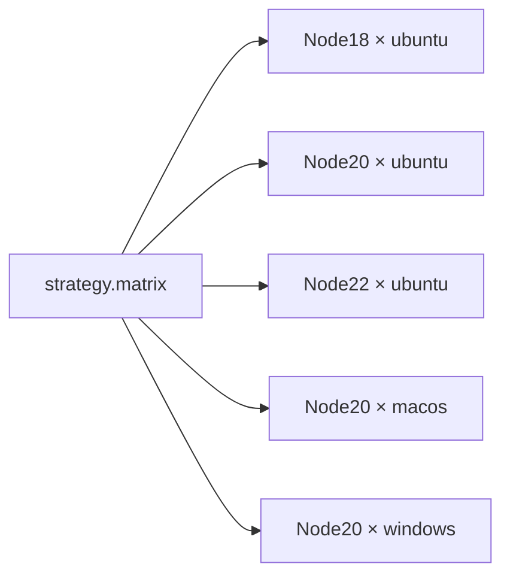
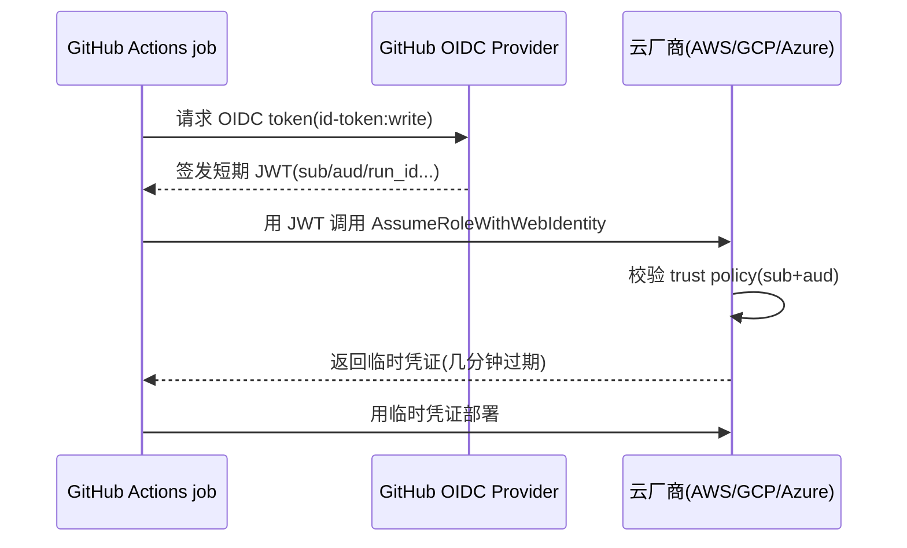
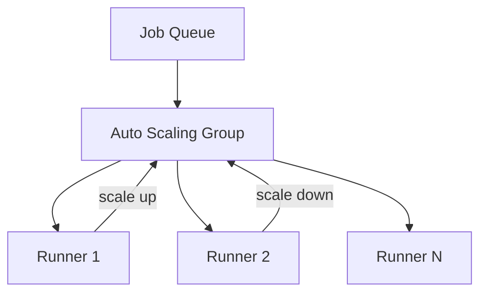
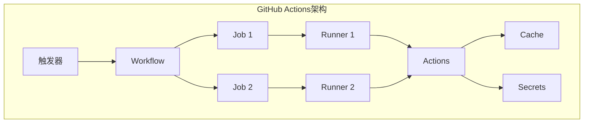

# CI/CD · 07 GitHub Actions

> **口诀：GitHub Actions 的最小单元是 `step`，而 `action` 是被无数仓库复用过的"积木"——你写的 workflow 只是把别人的积木和自己的命令串起来。** 它与 GitHub 深度绑定、Marketplace 生态最大，但配置即 YAML、安全靠 OIDC。

本篇讲透 GitHub Actions 的核心模型（event/workflow/job/step/action）、workflow 文件结构、`runs-on` 与矩阵、`uses` 引用与版本固定、密钥与 OIDC 免密钥、`artifacts`/`cache`、`needs`/`concurrency`/可复用工作流、self-hosted runner 安全边界，并给出 3 个可运行示例（含 2025 最新特性）。

## 一、GitHub Actions 是什么：定位与生态

GitHub Actions 是 **GitHub 原生**的 CI/CD 服务，配置写在仓库的 `.github/workflows/*.yml`。它的护城河是 **Marketplace 上海量可复用 Action**（官方 `actions/*` 与社区十万+ 动作），以及和 PR、Release、Issues、Packages 的深度联动。

```mermaid
flowchart TB
    EVENT[Event: push / PR / schedule / dispatch] --> WF[Workflow 文件]
    WF --> JOB1[job A runs-on: ubuntu]
    WF --> JOB2[job B runs-on: self-hosted]
    JOB1 --> S1[step1: uses actions/checkout]
    JOB1 --> S2[step2: run bash]
    JOB2 --> S3[step: call action]
    JOB1 -->|needs| JOB2
    WF -->|upload/download| ART[(Artifacts)]
    WF -->|cache| CACHE[(GitHub Cache]]
    JOB2 -->|OIDC id-token| CLOUD[(云厂商 临时凭证)]
```

| 维度 | GitHub Actions | （对照）GitLab CI | （对照）Jenkins |
|------|----------------|-------------------|----------------|
| 配置位置 | `.github/workflows/*.yml` | `.gitlab-ci.yml` | `Jenkinsfile` / UI |
| 复用单元 | **Action（Marketplace 海量）** | `include` 模板 | 共享库（Groovy） |
| 运行环境 | GitHub 托管 / self-hosted | GitLab Runner | 自建 agent |
| 免密钥部署 | **OIDC `id-token: write`** | `id_tokens` | 插件 |
| 生态市场 | **最大** | 中等（模板库） | 插件中心 |

> 口诀：**"要现成积木选 GitHub Actions，要一体化平台选 GitLab CI，要完全自控选 Jenkins。"** 三者都能干，差异在生态与绑定深度。

## 二、核心概念：五个名词一套模型

| 概念 | 含义 | 类比 |
|------|------|------|
| **event / trigger** | 触发工作流的事件 | "什么情况下开跑" |
| **workflow** | 一个自动化流程（一个 YAML 文件） | "一条流水线" |
| **job** | 在同一 runner 上顺序执行的 step 集合 | "一个阶段/任务" |
| **step** | job 内的最小执行单元（命令或 action） | "一步" |
| **action** | 可复用的命令包（别人写好的积木） | "函数/库" |
| **runner** | 实际执行 job 的机器 | "工人" |

关键约束：**同一 job 内的所有 step 跑在同一 runner（同一 OS、同一份磁盘）**；**不同 job 默认完全隔离**，要交换产物必须走 `upload-artifact`/`download-artifact`。

## 三、workflow 文件结构

```yaml
name: CI                       # 工作流显示名
on:                            # 触发器
  push:
    branches: [main]
  pull_request:
    branches: [main]
  schedule:
    - cron: "0 2 * * *"        # 每天凌晨 2 点
  workflow_dispatch:           # 手动触发（可带输入）
    inputs:
      env:
        description: "target env"
        default: "staging"

jobs:
  build:
    runs-on: ubuntu-latest
    env:
      NODE_ENV: production
    steps:
      - uses: actions/checkout@v4
      - uses: actions/setup-node@v4
        with:
          node-version: 20
          cache: npm
      - run: npm ci
      - run: npm run build
```

### 3.1 on：事件与过滤器

| 事件 | 触发场景 | 常用过滤 |
|------|----------|----------|
| `push` | 推送分支/ tag | `branches` / `tags` / `paths` |
| `pull_request` | 开/更新 PR | `types: [opened, synchronize]` |
| `schedule` | 定时（cron） | 无 |
| `workflow_dispatch` | 手动（UI/API），2025 起可带 **25 个输入**（原 10） | `inputs` |
| `release` | 发版 | `types: [published]` |
| `workflow_call` | 被可复用工作流调用 | 见第九节 |

⚠️ **跳过 CI**：提交信息含 `[skip ci]` 或 `[ci skip]`（也支持尾部 `[skip github actions]`）可让 GitHub 跳过该次 push 的工作流——仅用于文档等非代码改动，滥用会绕过质量门。

### 3.2 jobs.{job}：runs-on / steps / needs / strategy / env / secrets

```yaml
build:
  runs-on: ubuntu-latest     # GitHub 托管最新 Ubuntu
  needs: [lint]             # 等 lint job 完成（不写则并行）
  env:                      # job 级环境变量
    REGION: cn-north-1
  steps: [...]
```

## 四、runs-on：托管 runner 与标签

GitHub 托管 runner 按**标签**选择操作系统与架构：

| 标签 | 系统 | 备注 |
|------|------|------|
| `ubuntu-latest` / `ubuntu-22.04` / `ubuntu-24.04` | Linux | 最常用 |
| `windows-latest` | Windows | 2025 镜像已 GA |
| `macos-latest` / `macos-15` | macOS | 2025 起 macOS 15 GA |
| `ubuntu-24.04-arm64` / `arm64` | Linux ARM | **2025 起公共仓库可用 arm64 托管 runner** |
| `self-hosted` | 自建 | 可叠加自定义标签 `self-hosted, gpu, linux` |

```yaml
gpu_job:
  runs-on: [self-hosted, gpu, linux]   # 多标签交集匹配
```

并发控制用 `concurrency`（见第八节）防止多次触发互相干扰。

## 五、uses 引用 action：复用与版本固定

`uses` 是 GitHub Actions 的灵魂——直接调用别人封装好的动作。

| 来源 | 写法 | 说明 |
|------|------|------|
| Marketplace 公开 action | `actions/checkout@v4` | 官方维护 |
| 指定 commit SHA | `actions/checkout@<40位SHA>` | **最安全**，防篡改 |
| 本地 action | `./.github/actions/my-action` | 仓库内自定义 |
| Docker action | `docker://alpine:3.19` | 直接拉镜像跑 |

```yaml
steps:
  - uses: actions/checkout@v4                 # 拉代码（必用）
  - uses: actions/setup-java@v4               # 装 JDK
    with:
      distribution: temurin
      java-version: "21"
      cache: maven
  - uses: actions/cache@v4                    # 缓存（2025 接入新缓存服务 v2）
    with:
      path: ~/.m2
      key: maven-${{ hashFiles('**/pom.xml') }}
  - uses: ./.github/actions/build-and-scan   # 本地复用
```

⚠️ **供应链风险**：用 **tag（`@v4`）固定版本有被维护者改写/劫持的可能**（tag 可被强制更新）。**最安全是 pin 到 commit SHA**，再配合 Dependabot 自动升级并审查 diff。这与第 13 篇供应链安全（SBOM/签名）一脉相承——不可信 action 等于把仓库密钥交给第三方。

## 六、strategy.matrix：多版本/多 OS 并行

矩阵把"一个 job"展开成"N 个并行 job"，大幅提速兼容性验证。



```yaml
test:
  runs-on: ${{ matrix.os }}
  strategy:
    fail-fast: false            # 一个组合失败不取消其他
    matrix:
      node: [18, 20, 22]
      os: [ubuntu-latest, macos-latest, windows-latest]
      # 排除某组合
      exclude:
        - node: 18
          os: windows-latest
  steps:
    - uses: actions/setup-node@v4
      with: { node-version: ${{ matrix.node }} }
    - run: npm test
```

`fail-fast: false` 适合"兼容性矩阵"——任一组失败不应中断其余；默认 `true` 则首失败即取消全部，省算力。

## 七、密钥与变量：secrets / env / 表达式 / OIDC

### 7.1 secrets、env 与 `${{ }}` 表达式

- **`secrets`**：仓库/组织级加密密钥（Settings → Secrets），`${{ secrets.TOKEN }}` 引用；日志中自动遮蔽。
- **`env`**：明文变量（含 job/step 级作用域）。
- **表达式 `${{ }}`**：在 `if`、with、env 中做条件与取值（如 `${{ github.ref }}`、`${{ matrix.node }}`）。

```yaml
deploy:
  env:
    ENV_NAME: ${{ github.ref == 'refs/heads/main' && 'prod' || 'staging' }}
  steps:
    - run: echo "deploy to $ENV_NAME"
      if: ${{ github.event_name == 'push' }}
```

### 7.2 OIDC 免密钥：`permissions: id-token: write`

传统做法把云厂商长期密钥存进 `secrets`（泄露即灾难）。**OIDC 让 GitHub 为每个 job 签发短期 JWT**，云厂商用 trust policy 校验后发临时凭证——**无需任何长期密钥**。



```yaml
permissions:
  id-token: write     # 必须，否则拿不到 OIDC token
  contents: read

deploy:
  runs-on: ubuntu-latest
  steps:
    - uses: aws-actions/configure-aws-credentials@v4
      with:
        role-to-assume: arn:aws:iam::123456789012:role/gha-deploy
        aws-region: cn-north-1
    - run: aws s3 sync ./dist s3://my-bucket
```

> 2025 新特性：**OIDC token 新增 `check_run_id` 声明**（配合原有 `run_id`/`run_attempt`），可在云 IAM 策略里把权限精确到"某个 workflow 的某一个 job"，实现最小权限与更强审计（GitHub Changelog 2025-11-13）。这与第 12 篇"无密钥部署/最小权限"原则呼应。

⚠️ **反模式**：把 `secrets` 长期密钥直接写死在 YAML 或日志里；应一律迁移到 OIDC。已存长期密钥要定期轮换并最小化权限。

## 八、artifacts / cache / needs / concurrency

### 8.1 artifacts：job 间传递产物

`actions/upload-artifact` / `download-artifact`：⚠️ **v4 基于"graphite"新后端，artifact 仅在同一条 workflow 内可下载**（跨 workflow 需 `actions/upload-artifact` + `download-artifact` 配合 `actions/download-artifact@v4` 的 `run-id` 或发 release）。每个 artifact 默认保留 90 天。

```yaml
build:
  steps:
    - run: npm run build
    - uses: actions/upload-artifact@v4
      with:
        name: dist
        path: dist/         # 多个 artifact 用不同 name 区分

test:
  needs: [build]
  steps:
    - uses: actions/download-artifact@v4
      with: { name: dist, path: dist/ }
    - run: npm test
```

### 8.2 cache：加速（依赖/构建输出）

`actions/cache@v4`：2025-02-01 起接入**重写后的缓存服务 v2**（性能/可靠性大幅提升，旧服务同日下线），官方建议升级到 v4（或 v3）。仓库缓存上限也在 2025 放开（原先 10GB 上限，对大仓/多语言单体是痛点）。

```yaml
- uses: actions/cache@v4
  with:
    path: ~/.npm
    key: npm-${{ runner.os }}-${{ hashFiles('**/package-lock.json') }}
    restore-keys: npm-${{ runner.os }}-
```

### 8.3 needs 与 concurrency

```yaml
deploy:
  needs: [build, test]        # 扇入依赖
  concurrency:
    group: deploy-${{ github.ref }}   # 同分支串行，防并发部署冲突
    cancel-in-progress: true          # 新触发取消旧运行（PR 预览常用）
```

`concurrency` 是**防并发部署互相覆盖**的关键——例如对 `production` 环境只允许一个部署在跑。

## 九、reusable workflows 与 composite actions：复用 step 序列

### 9.1 reusable workflow（被 `workflow_call` 调用）

把通用流程抽成可复用工作流，主工作流用 `uses: ./.github/workflows/build.yml` 调用。⚠️ **2025 升级：嵌套深度 4→10 级、单次运行调用数 20→50**，适合大型组织分层编排。

```yaml
# .github/workflows/build.yml（被复用）
on: workflow_call
jobs:
  build:
    runs-on: ubuntu-latest
    steps:
      - uses: actions/checkout@v4
      - run: make build
```

```yaml
# 主工作流
jobs:
  call-build:
    uses: ./.github/workflows/build.yml
  deploy:
    needs: [call-build]
    runs-on: ubuntu-latest
    steps: [...]
```

### 9.2 composite action（复用 step 序列）

```yaml
# .github/actions/setup/action.yml
runs:
  using: composite
  steps:
    - uses: actions/setup-node@v4
      with: { node-version: 20 }
    - run: npm ci
      shell: bash
```

## 十、self-hosted runner：部署与安全边界

自建 runner 适合：需要特殊硬件（GPU）、内网资源、或降低托管费用。

```bash
# 在目标机上（从 GitHub 仓库 Settings → Actions → Runners 获取注册命令）
./config.sh --url https://github.com/OWNER/REPO \
            --token $RUNNER_TOKEN \
            --labels self-hosted,linux,docker
./run.sh          # 前台运行；生产用 systemd 托管
```

⚠️ **安全边界（高优先）**：
1. **self-hosted runner 会以仓库权限执行 MR 里的代码**——公共仓库上的 `pull_request_target` 或 fork PR 可能让**不可信代码在你的机器上运行**，窃取密钥/横向移动。务必：仅对受信任仓库启用、用 `pull_request`（非 `pull_request_target`）触发、runner 跑在隔离/一次性容器里、用完即销毁。
2. **提权风险**：runner 进程若以高权限用户运行，恶意 step 可控制整台机。遵循最小权限、网络隔离。
3. **机密泄露**：runner 工作区磁盘默认跨 job 不复用但同机多租户需隔离；用临时/一次性 runner 最安全。

## 十一、提速技巧汇总

| 技巧 | 做法 |
|------|------|
| 依赖缓存 | `actions/cache@v4` 缓存 `~/.m2`/`node_modules`/`~/.npm` |
| 并行矩阵 | `strategy.matrix` 多版本/OS 同时验证 |
| `needs` 解耦 | 不互相依赖的 job 并行，缩短关键路径 |
| 增量/路径过滤 | `paths:` 只在相关文件变更时跑 |
| 跳过 CI | 提交信息 `[skip ci]`（仅非代码改动） |
| 取消旧运行 | `concurrency.cancel-in-progress: true` |
| 更大缓存/arm64 | 2025 放开缓存上限、公共仓库 arm64 runner |

## 十二、完整示例

### 12.1 示例① lint + test + 矩阵构建并上传制品

```yaml
name: CI Matrix
on: [push, pull_request]

jobs:
  lint:
    runs-on: ubuntu-latest
    steps:
      - uses: actions/checkout@v4
      - uses: actions/setup-node@v4
        with: { node-version: 20, cache: npm }
      - run: npm ci
      - run: npm run lint

  test:
    needs: [lint]
    runs-on: ${{ matrix.os }}
    strategy:
      fail-fast: false
      matrix:
        node: [18, 20, 22]
        os: [ubuntu-latest, macos-latest]
    steps:
      - uses: actions/checkout@v4
      - uses: actions/setup-node@v4
        with: { node-version: ${{ matrix.node }}, cache: npm }
      - run: npm ci
      - run: npm test

  build:
    needs: [test]
    runs-on: ubuntu-latest
    steps:
      - uses: actions/checkout@v4
      - uses: actions/setup-node@v4
        with: { node-version: 20, cache: npm }
      - run: npm ci && npm run build
      - uses: actions/upload-artifact@v4
        with:
          name: dist-${{ github.sha }}
          path: dist/
```

### 12.2 示例② Docker 构建推送（含 cache）+ OIDC 免密钥部署云

```yaml
name: Docker Build & Deploy
on:
  push:
    branches: [main]

permissions:
  id-token: write      # OIDC
  contents: read

jobs:
  docker:
    runs-on: ubuntu-latest
    steps:
      - uses: actions/checkout@v4
      - uses: docker/setup-buildx-action@v3
      - uses: docker/build-push-action@v6
        with:
          context: .
          push: true
          tags: registry.example.com/app:${{ github.sha }}
          cache-from: type=gha          # 用 GitHub Actions 缓存层
          cache-to: type=gha,mode=max

  deploy:
    needs: [docker]
    runs-on: ubuntu-latest
    steps:
      - uses: aws-actions/configure-aws-credentials@v4   # OIDC 换临时凭证
        with:
          role-to-assume: arn:aws:iam::123456789012:role/gha-deploy
          aws-region: cn-north-1
      - uses: azure/k8s-deploy@v5
        with:
          manifests: k8s/deploy.yaml
          images: registry.example.com/app:${{ github.sha }}
```

### 12.3 示例③ reusable workflow + 手动审批部署

```yaml
# .github/workflows/ci.yml（可复用构建）
on: workflow_call
jobs:
  build:
    runs-on: ubuntu-latest
    steps:
      - uses: actions/checkout@v4
      - run: make build

# .github/workflows/deploy.yml（主流程）
name: Deploy with approval
on:
  push:
    branches: [main]

jobs:
  build:
    uses: ./.github/workflows/ci.yml         # 调用可复用 workflow
  approve:
    needs: [build]
    runs-on: ubuntu-latest
    environment: production                  # 该 environment 设了 reviewers = 手动审批
    steps:
      - run: echo "approved, proceed"
  deploy:
    needs: [approve]
    runs-on: ubuntu-latest
    concurrency:
      group: prod-deploy
      cancel-in-progress: false
    steps:
      - run: ./deploy.sh
```

⚠️ **生产踩坑**：
1. **action 用 tag 固定有供应链劫持风险** → 优先 pin commit SHA（见第五节）。
2. **artifact v4 仅同 workflow 内可用** → 跨 workflow 取产物要用 `run-id` 或发 release。
3. **self-hosted runner 跑不可信 PR 代码** → 见第十节安全边界。
4. **OIDC 忘了开 `permissions: id-token: write`** → token 拿不到，部署失败。
5. **`concurrency` group 设错** → 把不相关分支锁一起，或生产并发部署互相覆盖。

## GitHub Actions 可复用工作流

### 14.1 Reusable Workflow

```yaml
# 可复用工作流（.github/workflows/reusable-build.yml）
name: Reusable Build
on:
  workflow_call:
    inputs:
      java-version:
        required: false
        type: string
        default: '17'
      node-version:
        required: false
        type: string
        default: '20'
    secrets:
      registry-token:
        required: true

jobs:
  build:
    runs-on: ubuntu-latest
    steps:
      - uses: actions/checkout@v4
      - name: Setup Java
        uses: actions/setup-java@v4
        with:
          java-version: ${{ inputs.java-version }}
          distribution: temurin
      - name: Build
        run: mvn clean package
      - name: Upload Artifact
        uses: actions/upload-artifact@v4
        with:
          name: jar
          path: target/*.jar

# 调用可复用工作流
# .github/workflows/main.yml
name: Main Pipeline
on: [push]
jobs:
  build:
    uses: ./.github/workflows/reusable-build.yml
    with:
      java-version: '21'
    secrets:
      registry-token: ${{ secrets.REGISTRY_TOKEN }}
```

### 14.2 Composite Action

```yaml
# Composite Action（.github/actions/setup-project/action.yml）
name: Setup Project
description: Setup Java + Node.js + cache
inputs:
  java-version:
    required: false
    default: '17'
  node-version:
    required: false
    default: '20'
runs:
  using: composite
  steps:
    - uses: actions/setup-java@v4
      with:
        java-version: ${{ inputs.java-version }}
        distribution: temurin
    - uses: actions/setup-node@v4
      with:
        node-version: ${{ inputs.node-version }}
    - uses: actions/cache@v4
      with:
        path: |
          ~/.m2/repository
          node_modules
        key: ${{ runner.os }}-deps-${{ hashFiles('**/pom.xml', '**/package-lock.json') }}

# 使用 Composite Action
jobs:
  build:
    runs-on: ubuntu-latest
    steps:
      - uses: actions/checkout@v4
      - uses: ./.github/actions/setup-project
        with:
          java-version: '21'
```

---

## GitHub Actions Matrix 策略

### 15.1 Matrix 高级用法

```yaml
# 基础 Matrix
jobs:
  test:
    strategy:
      matrix:
        os: [ubuntu-latest, windows-latest, macos-latest]
        java: [11, 17, 21]
    runs-on: ${{ matrix.os }}
    steps:
      - uses: actions/setup-java@v4
        with:
          java-version: ${{ matrix.java }}
      - run: mvn test

# Matrix 排除
jobs:
  test:
    strategy:
      matrix:
        os: [ubuntu-latest, windows-latest]
        java: [11, 17, 21]
        exclude:
          - os: windows-latest
            java: 11
      fail-fast: false

# Matrix 包含
jobs:
  test:
    strategy:
      matrix:
        os: [ubuntu-latest]
        java: [11, 17, 21]
        include:
          - os: windows-latest
            java: 17
            experimental: true
```

### 15.2 Matrix 最佳实践

| 策略 | 说明 |
|------|------|
| fail-fast: false | 失败不取消其他任务 |
| exclude | 排除不需要的组合 |
| include | 添加额外组合 |
| max-parallel | 控制最大并行数 |

---

## GitHub Actions Monorepo 支持

### 16.1 Monorepo 路径过滤

```yaml
# 基于路径触发
name: Monorepo CI
on:
  push:
    paths:
      - 'packages/frontend/**'
      - 'packages/shared/**'
    paths-ignore:
      - '**.md'

jobs:
  frontend:
    if: contains(github.event.head_commit.modified, 'packages/frontend/')
    runs-on: ubuntu-latest
    steps:
      - uses: actions/checkout@v4
      - run: cd packages/frontend && npm install && npm run build

  backend:
    if: contains(github.event.head_commit.modified, 'packages/backend/')
    runs-on: ubuntu-latest
    steps:
      - uses: actions/checkout@v4
      - run: cd packages/backend && mvn clean package
```

### 16.2 Monorepo 依赖管理

```yaml
# 使用 changes 语法
jobs:
  frontend:
    runs-on: ubuntu-latest
    steps:
      - uses: actions/checkout@v4
        with:
          fetch-depth: 0
      - name: Check frontend changes
        id: check
        run: |
          if git diff --name-only HEAD~1 | grep -q "^packages/frontend/"; then
            echo "changed=true" >> $GITHUB_OUTPUT
          fi
      - name: Build frontend
        if: steps.check.outputs.changed == 'true'
        run: cd packages/frontend && npm install && npm run build
```

---

## GitHub Actions Self-Hosted Runner 安全

### 17.1 Runner 安全配置

```yaml
# Self-Hosted Runner 安全
jobs:
  secure-job:
    runs-on: [self-hosted, linux, secure]
    container:
      options: --user 1001
    steps:
      - uses: actions/checkout@v4
      - run: echo "Running in isolated environment"

# Runner 安全措施
# 1. 使用 Docker 容器隔离
# 2. 限制可信仓库
# 3. 定期清理工作区
# 4. 监控 Runner 状态
```

### 17.2 Runner 安全对比

| 安全措施 | GitHub Hosted | Self-Hosted |
|----------|---------------|-------------|
| 环境隔离 | 完全隔离 | 需手动配置 |
| 网络访问 | 受限 | 完全访问 |
| 存储安全 | 自动清理 | 需手动清理 |
| 镜像安全 | 官方维护 | 需自己维护 |
| 成本 | 按分钟计费 | 固定成本 |

---

## GitHub Actions 安全最佳实践

### 18.1 安全配置

```yaml
# 1. Pin action 版本
- uses: actions/checkout@b4ffde65f46336ab88eb53be808477a3936bae11  # v4.1.1

# 2. 使用 OIDC 免密钥
permissions:
  id-token: write
  contents: read
steps:
  - uses: aws-actions/configure-aws-credentials@v4
    with:
      role-to-assume: arn:aws:iam::123456789012:role/github-actions
      aws-region: ap-northeast-1

# 3. 限制 workflow 权限
permissions:
  contents: read
  packages: write

# 4. 使用 Secrets
steps:
  - run: echo "Deploying..."
    env:
      API_KEY: ${{ secrets.API_KEY }}
```

### 18.2 安全检查清单

| 检查项 | 说明 |
|--------|------|
| Action 版本 | Pin SHA 而非 tag |
| Secrets 管理 | 使用 GitHub Secrets |
| 权限控制 | 最小权限原则 |
| OIDC | 云部署使用 OIDC |
| Runner 安全 | Self-Hosted Runner 隔离 |
| 审计日志 | 启用审计日志 |

---

## GitHub Actions Terraform IaC

### 19.1 Terraform 工作流

```yaml
# Terraform 工作流
name: Terraform
on:
  push:
    branches: [main]
    paths: ['terraform/**']
  pull_request:
    branches: [main]

jobs:
  terraform:
    runs-on: ubuntu-latest
    defaults:
      run:
        working-directory: terraform
    steps:
      - uses: actions/checkout@v4
      - uses: hashicorp/setup-terraform@v3
        with:
          terraform_version: 1.7.0
      - run: terraform init
      - run: terraform plan
      - run: terraform apply
        if: github.ref == 'refs/heads/main'
```

### 19.2 Terraform 安全

```yaml
# Terraform 安全配置
jobs:
  terraform:
    runs-on: ubuntu-latest
    permissions:
      id-token: write
      contents: read
    steps:
      - uses: hashicorp/setup-terraform@v3
      - run: terraform init
      - run: terraform plan
        env:
          AWS_ACCESS_KEY_ID: ${{ secrets.AWS_ACCESS_KEY_ID }}
          AWS_SECRET_ACCESS_KEY: ${{ secrets.AWS_SECRET_ACCESS_KEY }}
```

---

## GitHub Actions 成本优化

### 20.1 成本分析

```
GitHub Actions 成本构成：
  1. 执行时间：
     - 免费额度：2000 分钟/月（公共仓库无限）
     - 付费价格：$0.008/分钟（Linux）
  
  2. 存储成本：
     - artifact 存储：$0.005/GB/天
  
  3. 网络成本：
     - 传出流量：$0.50/GB

  成本优化策略：
    1. 缓存优化：减少依赖下载时间
    2. 并行执行：减少总执行时间
    3. Matrix 策略：减少重复配置
    4. Self-Hosted：降低执行成本
    5. 定时任务：非高峰期执行
```

### 20.2 成本优化配置

```yaml
# 缓存优化
jobs:
  build:
    runs-on: ubuntu-latest
    steps:
      - uses: actions/cache@v4
        with:
          path: ~/.m2/repository
          key: ${{ runner.os }}-maven-${{ hashFiles('**/pom.xml') }}
          restore-keys: |
            ${{ runner.os }}-maven-

# 并行优化
jobs:
  test:
    strategy:
      parallel: 4
    steps:
      - run: pytest --splitting-algorithm=least_duration

# 定时优化
on:
  schedule:
    - cron: '0 2 * * *'  # 每天凌晨 2 点
```

---

## Actions 缓存策略深度

### 缓存层级与命中率优化

```
Actions 缓存架构：
  L1: Runner 本地缓存（本机缓存目录）
  L2: GitHub 托管缓存（跨 Runner 共享）
  L3: 远程构建缓存（BuildKit / Bazel remote）

缓存键设计原则：
  key = 基准键 + 哈希文件
  示例：cache-${{ runner.os }}-maven-${{ hashFiles('**/pom.xml') }}
  
  坑：用分支名作 key → 每分支一份 → 几乎不命中
  正确：用 lockfile 内容哈希 → 同依赖跨分支复用
```

| 缓存层 | 键策略 | 命中率目标 | 失效场景 |
|--------|--------|-----------|----------|
| Maven .m2 | hashFiles('**/pom.xml') | >90% | 依赖变更 |
| npm node_modules | hashFiles('**/package-lock.json') | >90% | lockfile 变更 |
| Docker BuildKit | type=gha + SHA | >70% | 基础镜像变更 |
| Go module | hashFiles('**/go.sum') | >90% | go.mod 变更 |

### 缓存安全与隔离

```
安全风险：
  公共仓库的 fork PR 可能篡改共享缓存
  恶意 PR 修改 package.json → 投毒缓存 → 污染主分支

防护：
  1. 分支隔离：fork PR 使用独立缓存键
     key: ${{ github.head_ref || github.ref }}
  2. 缓存清理：PR 关闭后清理相关缓存
  3. 依赖签名：npm audit / pip-audit 校验包完整性
  4. 强制重建：安全补丁发布时 --no-cache 重构建
```

## 矩阵构建高级策略

### 矩阵维度爆炸控制

```yaml
# 控制矩阵规模的策略
strategy:
  max-parallel: 6          # 限制最大并行数
  fail-fast: false         # 一个失败不取消其他
  matrix:
    os: [ubuntu-latest, macos-latest]
    node: [18, 20, 22]
    include:
      - os: ubuntu-latest
        node: 22
        experimental: true
        coverage: true      # 额外字段
    exclude:
      - os: macos-latest
        node: 18            # 排除低价值组合
```

### 矩阵条件执行

| 条件 | 用法 | 效果 |
|------|------|------|
| fail-fast: false | 矩阵项独立 | 收集所有失败 |
| max-parallel | 控制并发数 | 避免配额耗尽 |
| continue-on-error | 允许失败 | 实验性维度 |
| if: matrix.coverage | 条件步骤 | 仅在特定维度跑覆盖率 |

## Reusable Workflow 传参与安全

### Secrets 透传最佳实践

```yaml
# 可复用工作流接收 secrets
on:
  workflow_call:
    secrets:
      REGISTRY_TOKEN:
        required: true
    inputs:
      environment:
        required: true
        type: string

jobs:
  deploy:
    runs-on: ubuntu-latest
    steps:
      - uses: aws-actions/configure-aws-credentials@v4
        with:
          role-to-assume: ${{ secrets.AWS_ROLE_ARN }}
      - run: ./deploy.sh ${{ inputs.environment }}
```

### 安全传递 Secrets

| 模式 | 说明 | 适用 |
|------|------|------|
| secrets: inherit | 透传所有 secrets | 内部可信仓库 |
| secrets: [key] | 显式传递特定 secret | 最小权限 |
| inputs + secrets | 组合传参 | 通用场景 |

## OIDC 免密推送生产实战

### GCP OIDC 配置

```yaml
permissions:
  id-token: write
  contents: read

jobs:
  deploy:
    runs-on: ubuntu-latest
    steps:
      - uses: google-github-actions/auth@v2
        with:
          workload_identity_provider: 'projects/123/locations/global/.../provider'
          service_account: 'github-actions@my-project.iam.gserviceaccount.com'
      - run: gcloud run deploy my-app --image gcr.io/my-project/app:${{ github.sha }}
```

### Azure OIDC 配置

```yaml
permissions:
  id-token: write
  contents: read

jobs:
  deploy:
    runs-on: ubuntu-latest
    steps:
      - uses: azure/login@v2
        with:
          client-id: ${{ secrets.AZURE_CLIENT_ID }}
          tenant-id: ${{ secrets.AZURE_TENANT_ID }}
          subscription-id: ${{ secrets.AZURE_SUBSCRIPTION_ID }}
      - run: az webapp deploy --resource-group myRG --name myApp
```

## 安全最佳实践 Checklist

| 检查项 | 说明 | 严重度 |
|--------|------|--------|
| Action 版本固定 | Pin SHA 而非 tag | HIGH |
| Secrets 不落日志 | withCredentials 或环境变量 | CRITICAL |
| OIDC 优先 | 免长期密钥 | HIGH |
| 权限最小化 | permissions 显式声明 | MEDIUM |
| 缓存隔离 | fork PR 独立缓存键 | MEDIUM |
| Runner 安全 | self-hosted 隔离执行 | HIGH |
| 审计日志 | 启用 GitHub Audit Log | LOW |

## 自托管 Runner 安全加固

### 容器化 Runner 部署

```yaml
# 使用 Docker 容器隔离构建
jobs:
  build:
    runs-on: self-hosted
    container:
      image: node:20
      options: --user 1001
    steps:
      - uses: actions/checkout@v4
      - run: npm ci && npm test
```

### Ephemeral Runner 模式

```
Ephemeral（一次性）Runner：
  每次构建起新 Runner，完成后销毁
  
  优势：
    - 无状态，无残留文件
    - 隔离彻底，无跨构建污染
    - 适合不可信代码（fork PR）
  
  配置：
    ./config.sh --ephemeral
    或使用 K8s + 动态 Pod
```

## Actions 缓存策略进阶

### 缓存层级架构

```text
Actions 缓存层级：
  L1: Runner 本地缓存（本机缓存目录）
  L2: GitHub 托管缓存（跨 Runner 共享）
  L3: 远程构建缓存（BuildKit / Bazel Remote Cache）

缓存键设计原则：
  key = 基准键 + 哈希文件
  restore-keys = 回退匹配前缀

  示例：
    key: ${{ runner.os }}-maven-${{ hashFiles('**/pom.xml') }}
    restore-keys: |
      ${{ runner.os }}-maven-
```

### restore-key 匹配机制

| 优先级 | 匹配方式 | 说明 |
|--------|----------|------|
| 1 | key 精确匹配 | 命中率最高 |
| 2 | restore-keys 前缀匹配 | 从长到短匹配 |
| 3 | 缓存不存在 | 完全 miss |

```yaml
# restore-keys 最佳实践
- uses: actions/cache@v4
  with:
    path: ~/.m2
    key: ${{ runner.os }}-maven-${{ hashFiles('**/pom.xml') }}
    restore-keys: |
      ${{ runner.os }}-maven-${{ hashFiles('**/pom.xml') }}
      ${{ runner.os }}-maven-
```

### 缓存命中率优化

```
提升命中率的手段：
  1. 精确键值：hashFiles 精确匹配 → +20% 命中率
  2. 恢复键 fallback：设置多级前缀匹配 → +15% 命中率
  3. 分层缓存：依赖缓存 + 构建缓存分离 → +25% 命中率
  4. 预热缓存：定时更新 → +10% 命中率

常见坑：
  用分支名作 key → 每分支一份 → 几乎不命中
  正确：用 lockfile 内容哈希 → 同依赖跨分支复用
```

## 矩阵构建高级策略

### 矩阵维度爆炸控制

```yaml
strategy:
  max-parallel: 6
  fail-fast: false
  matrix:
    os: [ubuntu-latest, macos-latest]
    node: [18, 20, 22]
    shard: [1, 2, 3, 4, 5]
    include:
      - os: ubuntu-latest
        node: 22
        experimental: true
        coverage: true
    exclude:
      - os: macos-latest
        node: 18
```

### 矩阵条件执行

| 条件 | 用法 | 效果 |
|------|------|------|
| fail-fast: false | 矩阵项独立 | 收集所有失败 |
| max-parallel | 控制并发数 | 避免配额耗尽 |
| continue-on-error | 允许失败 | 实验性维度 |
| if: matrix.coverage | 条件步骤 | 仅在特定维度跑覆盖率 |

## Reusable Workflow 传参与安全

### Secrets 透传最佳实践

```yaml
on:
  workflow_call:
    secrets:
      REGISTRY_TOKEN:
        required: true
    inputs:
      environment:
        required: true
        type: string
jobs:
  deploy:
    runs-on: ubuntu-latest
    steps:
      - uses: aws-actions/configure-aws-credentials@v4
        with:
          role-to-assume: ${{ secrets.AWS_ROLE_ARN }}
      - run: ./deploy.sh ${{ inputs.environment }}
```

### 安全传递 Secrets

| 模式 | 说明 | 适用 |
|------|------|------|
| secrets: inherit | 透传所有 secrets | 内部可信仓库 |
| secrets: [key] | 显式传递特定 secret | 最小权限 |
| inputs + secrets | 组合传参 | 通用场景 |

## OIDC 免密推送实战

### AWS OIDC 配置

```yaml
permissions:
  id-token: write
  contents: read
jobs:
  deploy:
    runs-on: ubuntu-latest
    steps:
      - uses: aws-actions/configure-aws-credentials@v4
        with:
          role-to-assume: arn:aws:iam::123456789012:role/gha-deploy
          aws-region: cn-north-1
      - run: aws s3 sync ./dist s3://my-bucket
```

### OIDC 信任策略配置

```json
{
  "Version": "2012-10-17",
  "Statement": [{
    "Effect": "Allow",
    "Principal": {
      "Federated": "arn:aws:iam::123456789:oidc-provider/token.actions.githubusercontent.com"
    },
    "Action": "sts:AssumeRoleWithWebIdentity",
    "Condition": {
      "StringEquals": {
        "token.actions.githubusercontent.com:aud": "sts.amazonaws.com"
      },
      "StringLike": {
        "token.actions.githubusercontent.com:sub": "repo:org/repo:ref:refs/heads/main"
      }
    }
  }]
}
```

## 安全最佳实践 Checklist

| 检查项 | 说明 | 严重度 |
|--------|------|--------|
| Action 版本固定 | Pin SHA 而非 tag | HIGH |
| Secrets 不落日志 | withCredentials 或环境变量 | CRITICAL |
| OIDC 优先 | 免长期密钥 | HIGH |
| 权限最小化 | permissions 显式声明 | MEDIUM |
| 缓存隔离 | fork PR 独立缓存键 | MEDIUM |
| Runner 安全 | self-hosted 隔离执行 | HIGH |
| 审计日志 | 启用 GitHub Audit Log | LOW |

## 自托管 Runner Auto Scaling Group

### ASG 动态扩缩容



```yaml
# 自托管 Runner 部署配置
# 1. 创建 Runner AMI
# 2. 配置 ASG 策略
# 3. 注册到 GitHub

# ASG 配置示例（Terraform）
resource "aws_autoscaling_group" "gha_runner" {
  min_size         = 0
  max_size         = 10
  desired_capacity = 2
  
  launch_template {
    id = aws_launch_template.runner.id
  }
  
  tag {
    key                 = "Name"
    value               = "github-actions-runner"
    propagate_at_launch = true
  }
}
```

### Runner 健康检查

| 检查项 | 方法 | 阈值 |
|--------|------|------|
| Runner 注册状态 | GitHub API | active |
| 磁盘空间 | 脚本检测 | > 10GB |
| 内存使用 | 脚本检测 | < 80% |
| 网络连通 | HTTP 探测 | < 1s |

## 十三、与其他模块的关联

- 流水线总纲与 DORA 指标，见 [01-概述与核心概念](01-概述与核心概念.md)。
- 构建与制品（Docker 镜像、制品仓库）是 CI 中段核心，见 [03-构建与制品管理](03-构建与制品管理.md)。
- 部署策略（蓝绿/金丝雀/滚动）与 environment 审批深入见 [10-部署策略](10-部署策略.md)。
- 密钥与 OIDC 免密钥、最小权限、供应链签名深入见 [13-安全与供应链安全](13-可观测性DORA度量与DevSecOps.md)。
- 容器与 K8s 底座，见 [../../云原生/K8S.md](../../云原生/K8S.md)。
- GitLab CI 的同概念对照，见 [06-GitLab CI](06-GitLab-CI.md)。
- 大数据 ETL 调度思想与 CI 流水线类比，见 [../大数据/09-数据仓库与OLAP引擎.md](../大数据/09-数据仓库与OLAP引擎.md)。

## 十四、小结 Checklist

- [ ] `event → workflow → job → step → action` 模型记牢；job 间隔离、产物走 artifact。
- [ ] `on` 用 `push`/`pull_request`/`schedule`/`workflow_dispatch`（2025 起 25 个输入）/ `release`。
- [ ] `runs-on` 选托管标签或 `self-hosted`；`strategy.matrix` 做兼容并行。
- [ ] `uses` 优先 pin **commit SHA** 防供应链劫持；复用优先官方 action。
- [ ] 密钥走 `secrets`，云部署用 **OIDC `id-token: write`** 免长期密钥（2025 `check_run_id` 精控）。
- [ ] `cache@v4`（2025 缓存服务 v2）、`needs` 并行、`concurrency` 防并发部署。
- [ ] 复用靠 reusable workflow（2025 嵌套 10 级/50 调用）与 composite action。
- [ ] self-hosted runner 严守安全边界，绝不跑不可信代码。

> 参考：
> - GitHub Actions 官方文档：https://docs.github.com/actions
> - Workflow 语法（on/jobs/steps/secrets/needs/concurrency）：https://docs.github.com/actions/using-workflows/workflow-syntax-for-github-actions
> - OIDC 免密钥部署（含 trust policy）：https://docs.github.com/actions/deployment/security-hardening-your-deployments/about-security-hardening-with-openid-connect
> - OIDC token 新增 `check_run_id` 声明（2025-11-13 Changelog）：https://github.blog/changelog/2025-11-13-github-actions-oidc-token-claims-now-include-check_run_id/
> - 缓存 action（v4 接入新缓存服务 v2，2025-02-01）：https://github.com/actions/cache
> - Reusable workflows 与 2025 嵌套/调用上限提升：https://docs.github.com/actions/using-workflows/reusing-workflows 及 GitHub 官方博客 2025 更新
> - Self-hosted runner 安全（不可信代码风险）：https://docs.github.com/actions/hosting-your-own-runners/managing-self-hosted-runners/about-self-hosted-runners#self-hosted-runner-security
> - 2025 Actions 更新综述（YAML anchors、缓存上限、arm64、matrix 等）：https://github.blog/ 与 https://blog.csdn.net/MicrosoftReactor/article/details/156314142
> - upload-artifact / download-artifact v4（graphite 后端，同 workflow 内）：https://github.com/actions/upload-artifact

## 十三、reusable workflows 深度：分层与传参

reusable workflow 用 `workflow_call` 接收 `inputs`/`secrets`，适合组织级分层编排（2025 上限：嵌套 10 级 / 50 调用）：

```yaml
# .github/workflows/build.yml（被复用）
on:
  workflow_call:
    inputs:
      image:
        required: true
        type: string
    secrets:
      REGISTRY_TOKEN:
        required: true
jobs:
  build:
    runs-on: ubuntu-latest
    steps:
      - uses: actions/checkout@v4
      - run: docker build -t ${{ inputs.image }} .
```

```yaml
# 主工作流
jobs:
  call-build:
    uses: ./.github/workflows/build.yml
    with: { image: "registry/app:${{ github.sha }}" }
    secrets: inherit                       # 透传 secrets
```

## 十四、matrix 策略进阶

```yaml
test:
  strategy:
    fail-fast: false                       # 一个组合失败不杀其他
    max-parallel: 4
    matrix:
      node: [18, 20, 22]
      os: [ubuntu-latest, macos-latest]
      include:                             # 补充组合
        - node: 20
          os: ubuntu-latest
          coverage: true
      exclude:                             # 排除无意义组合
        - node: 18
          os: macos-latest
  runs-on: ${{ matrix.os }}
  steps:
    - run: npm test ${{ matrix.coverage && '--coverage' || '' }}
```

## 十五、self-hosted runner 安全加固

```yaml
# 仅受信任仓库启用；fragile 的 fork PR 用 pull_request（非 pull_request_target）
on: pull_request                       # 不暴露 secrets 给 fork
jobs:
  build:
    runs-on: [self-hosted, linux, docker]
```

安全清单：
1. 受信任仓库才挂 self-hosted；不可信代码用 GitHub 托管 runner 或一次性容器。
2. runner 以低权限用户运行，网络隔离，工作区用完即销。
3. 不在 `pull_request_target` 里跑不可信代码（token 权限高）。
4. 用 `concurrency` 防并发覆盖；用 ephemeral runner 最安全。

## 十六、OIDC 免密钥部署云（实战）

```yaml
permissions:
  id-token: write        # OIDC 必需
  contents: read
jobs:
  deploy:
    runs-on: ubuntu-latest
    steps:
      - uses: aws-actions/configure-aws-credentials@v4
        with:
          role-to-assume: arn:aws:iam::123456789012:role/gha-deploy
          aws-region: cn-north-1
      - run: kubectl set image deploy/app app=registry/app:${{ github.sha }}
```

> 云侧 trust policy 绑定 `sub: repo:OWNER/REPO:ref:refs/heads/main`，做到"按仓库/分支最小授权"，无静态密钥可泄露。

## 十七、大型 monorepo 优化

```yaml
jobs:
  detect:
    outputs:
      changed: ${{ steps.filter.outputs.changes }}
    steps:
      - uses: dorny/paths-filter@v3
        id: filter
        with:
          filters: |
            order: ['services/order/**']
            user:  ['services/user/**']
  build-order:
    needs: detect
    if: contains(needs.detect.outputs.changed, 'order')
    runs-on: ubuntu-latest
    steps: [ ... ]
```

优化要点：路径过滤只跑变更子项目、`actions/cache` 复用依赖、matrix 并行、大仓用 Nx/Turbo 远程缓存、跳过 CI 用 `[skip ci]`。

## OIDC 免密钥部署实战

```yaml
# OIDC 部署到 AWS
name: Deploy to AWS
on:
  push:
    branches: [main]
permissions:
  id-token: write
  contents: read

jobs:
  deploy:
    runs-on: ubuntu-latest
    steps:
      - uses: actions/checkout@v4
      
      - name: Configure AWS credentials
        uses: aws-actions/configure-aws-credentials@v4
        with:
          role-to-assume: arn:aws:iam::123456789:role/github-actions
          aws-region: us-east-1
      
      - name: Deploy
        run: aws s3 sync ./dist s3://my-bucket
```

### OIDC vs 静态密钥

| 特性 | OIDC | 静态密钥 |
|------|------|----------|
| 安全性 | 高（临时凭证） | 低（永久凭证） |
| 轮换 | 自动 | 手动 |
| 审计 | 可追踪 | 难追踪 |
| 配置复杂度 | 中 | 低 |
| 适用场景 | 云部署 | 简单场景 |

### OIDC 信任策略配置

```json
{
  "Version": "2012-10-17",
  "Statement": [
    {
      "Effect": "Allow",
      "Principal": {
        "Federated": "arn:aws:iam::123456789:oidc-provider/token.actions.githubusercontent.com"
      },
      "Action": "sts:AssumeRoleWithWebIdentity",
      "Condition": {
        "StringEquals": {
          "token.actions.githubusercontent.com:aud": "sts.amazonaws.com"
        },
        "StringLike": {
          "token.actions.githubusercontent.com:sub": "repo:org/repo:ref:refs/heads/main"
        }
      }
    }
  ]
}
```

## 缓存策略进阶

```yaml
# 多层缓存配置
- name: Cache node modules
  uses: actions/cache@v4
  with:
    path: ~/.npm
    key: ${{ runner.os }}-node-${{ hashFiles('**/package-lock.json') }}
    restore-keys: |
      ${{ runner.os }}-node-

- name: Cache Docker layers
  uses: actions/cache@v4
  with:
    path: /tmp/.buildx-cache
    key: ${{ runner.os }}-docker-${{ github.sha }}
    restore-keys: |
      ${{ runner.os }}-docker-

- name: Cache Gradle
  uses: actions/cache@v4
  with:
    path: |
      ~/.gradle/caches
      ~/.gradle/wrapper
    key: ${{ runner.os }}-gradle-${{ hashFiles('**/*.gradle*') }}
    restore-keys: |
      ${{ runner.os }}-gradle-
```

### 缓存命中率优化

| 策略 | 说明 | 命中率提升 |
|------|------|------------|
| 精确键值 | 使用hashFiles精确匹配 | +20% |
| 恢复键 | 设置fallback恢复键 | +15% |
| 分层缓存 | 多级缓存策略 | +25% |
| 预热缓存 | 定期更新缓存 | +10% |

## 矩阵策略进阶

```yaml
# 高级矩阵配置
strategy:
  fail-fast: false
  matrix:
    os: [ubuntu-latest, macos-latest, windows-latest]
    node-version: [18, 20, 22]
    shard: [1, 2, 3, 4, 5]
    include:
      - os: ubuntu-latest
        node-version: 22
        experimental: true
    exclude:
      - os: windows-latest
        node-version: 18
    max-parallel: 6

steps:
  - name: Run tests
    run: npm test -- --shard=${{ matrix.shard }}/5
    continue-on-error: ${{ matrix.experimental || false }}
```

### 矩阵策略最佳实践

| 策略 | 说明 | 效果 |
|------|------|------|
| fail-fast: false | 允许失败继续 | 收集所有失败 |
| max-parallel | 控制并行度 | 避免资源耗尽 |
| include/exclude | 精确组合 | 减少无效组合 |
| continue-on-error | 实验性允许失败 | 核心失败阻断 |

## Self-hosted Runner 安全加固

```yaml
# 安全加固配置
jobs:
  secure-job:
    runs-on: self-hosted
    steps:
      - name: 隔离工作目录
        run: |
          mkdir -p ${{ runner.temp }}
          cd ${{ runner.temp }}
          
      - name: 清理敏感信息
        if: always()
        run: |
          rm -rf ${{ runner.temp }}/*
          unset AWS_SECRET_ACCESS_KEY
          unset GITHUB_TOKEN
          
      - name: 验证代码来源
        run: |
          if [ "${{ github.repository }}" != "my-org/my-repo" ]; then
            echo "不信任的代码来源"
            exit 1
          fi
```

### Runner 安全检查清单

| 检查项 | 说明 | 实施方法 |
|--------|------|----------|
| 隔离环境 | 每次运行在新环境 | 容器化Runner |
| 密钥保护 | 不持久化密钥 | 临时凭证 |
| 代码验证 | 验证代码来源 | 仓库检查 |
| 日志脱敏 | 敏感信息不输出 | 日志过滤 |
| 网络隔离 | 限制网络访问 | 防火墙规则 |

## Monorepo 优化方案

```yaml
# Monorepo 变更检测
jobs:
  detect-changes:
    runs-on: ubuntu-latest
    outputs:
      changes: ${{ steps.filter.outputs.changes }}
    steps:
      - uses: actions/checkout@v4
      - uses: dorny/paths-filter@v3
        id: filter
        with:
          filters: |
            frontend:
              - 'packages/frontend/**'
            backend:
              - 'packages/backend/**'
            shared:
              - 'packages/shared/**'

  build-frontend:
    needs: detect-changes
    if: contains(needs.detect-changes.outputs.changes, 'frontend')
    runs-on: ubuntu-latest
    steps: [ ... ]

  build-backend:
    needs: detect-changes
    if: contains(needs.detect-changes.outputs.changes, 'backend')
    runs-on: ubuntu-latest
    steps: [ ... ]
```

### Monorepo 优化策略

| 策略 | 说明 | 效果 |
|------|------|------|
| 路径过滤 | 只构建变更部分 | 减少70%构建 |
| 共享缓存 | 复用依赖和构建产物 | 加速50% |
| 并行构建 | 多包并行构建 | 缩短50%时间 |
| 依赖图 | 分析包依赖关系 | 智能构建顺序 |

## 缓存策略进阶

### Actions Cache 深度优化

```yaml
# 多层缓存策略
- name: Cache node modules
  uses: actions/cache@v4
  with:
    path: ~/.npm
    key: ${{ runner.os }}-node-${{ hashFiles('**/package-lock.json') }}
    restore-keys: |
      ${{ runner.os }}-node-

# 使用 setup-node 内置缓存
- uses: actions/setup-node@v4
  with:
    node-version: '20'
    cache: 'npm'

# Go 模块缓存
- uses: actions/setup-go@v5
  with:
    go-version: '1.22'
    cache: true

# 自定义缓存策略
- name: Cache Gradle
  uses: actions/cache@v4
  with:
    path: |
      ~/.gradle/caches
      ~/.gradle/wrapper
    key: ${{ runner.os }}-gradle-${{ hashFiles('**/*.gradle*') }}
    restore-keys: |
      ${{ runner.os }}-gradle-
```

### 缓存命中率监控

```yaml
- name: Check cache hit
  run: |
    echo "Cache hit: ${{ steps.cache.outputs.cache-hit }}"
    if [ "${{ steps.cache.outputs.cache-hit }}" != "true" ]; then
      echo "⚠️ Cache miss - first build or key changed"
    fi
```

---

## 矩阵策略进阶

### 复杂矩阵配置

```yaml
strategy:
  fail-fast: false
  matrix:
    os: [ubuntu-latest, macos-latest, windows-latest]
    node: [18, 20, 22]
    exclude:
      - os: windows-latest
        node: 18
    include:
      - os: ubuntu-latest
        node: 22
        experimental: true
    max-parallel: 4

# 矩阵输出
outputs:
  result: ${{ steps.test.outputs.result }}

steps:
  - name: Run tests
    id: test
    run: echo "result=${{ matrix.os }}-${{ matrix.node }}" >> $GITHUB_OUTPUT
```

### 矩阵组合策略

```yaml
# 并行测试分片
strategy:
  matrix:
    shard: [1, 2, 3, 4, 5]
steps:
  - name: Run shard ${{ matrix.shard }}/5
    run: |
      npx jest --shard=${{ matrix.shard }}/5

# 语言版本矩阵
strategy:
  matrix:
    java: [11, 17, 21]
    os: [ubuntu-latest]
    include:
      - java: 17
        os: macos-latest
```

---

## Self-hosted Runner 安全加固

### Runner 安全配置

```yaml
# 使用临时实例
jobs:
  build:
    runs-on: [self-hosted, ephemeral]
    steps:
      - uses: actions/checkout@v4
      - run: echo "Running on ephemeral runner"

# 标签隔离
runs-on: [self-hosted, linux, x64, production]

# 环境隔离
jobs:
  build:
    runs-on: self-hosted
    environment: production
    steps:
      - run: echo "Deploying to production"
```

### Runner 安全最佳实践

| 实践 | 说明 |
|------|------|
| 临时实例 | 每次构建使用新实例 |
| 标签隔离 | 不同项目用不同标签 |
| 网络隔离 | Runner 在私有网络 |
| 密钥管理 | 使用 Secrets Manager |
| 审计日志 | 记录所有操作 |
| 定期更新 | 更新 Runner 和工具版本 |

```bash
# Runner 安全检查脚本
#!/bin/bash
# 检查 Runner 版本
./config.sh --version

# 检查网络连接
curl -s https://api.github.com | head -1

# 检查磁盘空间
df -h

# 检查内存
free -m
```

---

## Monorepo 优化方案

### 路径过滤配置

```yaml
name: CI
on:
  push:
    paths:
      - 'packages/api/**'
      - 'packages/web/**'
      - '!packages/api/**/*.md'
      - '!packages/web/**/*.md'

jobs:
  api:
    if: contains(github.event.head_commit.modified, 'packages/api/')
    runs-on: ubuntu-latest
    steps:
      - run: echo "API changed"

  web:
    if: contains(github.event.head_commit.modified, 'packages/web/')
    runs-on: ubuntu-latest
    steps:
      - run: echo "Web changed"
```

### 构建依赖图

```yaml
# 使用 Nx 分析依赖
- name: Get affected packages
  id: affected
  run: |
    AFFECTED=$(npx nx show projects --affected)
    echo "packages=$AFFECTED" >> $GITHUB_OUTPUT

# 根据依赖构建
- name: Build affected
  run: npx nx run-many --target=build --projects=${{ steps.affected.outputs.packages }}
```

---

## GitHub Actions 生产部署与运维最佳实践

### 部署架构选型

| 架构模式 | 适用场景 | Runner配置 | 说明 |
|----------|---------|------------|------|
| 托管Runner | 免费开源项目 | GitHub托管 | 零运维 |
| 自托管Runner | 企业私有项目 | 自建服务器 | 完全控制 |
| 混合Runner | 混合场景 | 托管+自建 | 灵活选择 |
| K8s Runner | 云原生环境 | K8s Pod | 弹性伸缩 |



### 资源规划公式

| 资源类型 | 计算公式 | 推荐值 |
|----------|---------|--------|
| Runner CPU | 构建任务数 × 2 | 4-8核 |
| Runner 内存 | 构建任务数 × 4GB | 8-16GB |
| 存储空间 | 制品大小 × 保留天数 | 按需 |
| 网络带宽 | 制品大小 × 传输次数 | 按需 |
| 并发任务 | 团队规模 × 2 | 10+ |

### 监控告警配置

```yaml
# 工作流监控
name: Monitor Workflow
on:
  workflow_run:
    workflows: ["*"]
    types: [completed]

jobs:
  notify:
    runs-on: ubuntu-latest
    steps:
      - name: Check workflow status
        uses: actions/github-script@v6
        with:
          script: |
            const workflow = await github.rest.actions.getWorkflowRun({
              owner: context.repo.owner,
              repo: context.repo.repo,
              run_id: context.payload.workflow_run.id
            });
            
            if (workflow.data.conclusion === 'failure') {
              // 发送失败告警
              console.log('Workflow failed:', workflow.data.name);
            }
```

### 容灾备份策略

| 备份内容 | 备份方式 | 频率 | 保留期 |
|----------|---------|------|--------|
| 工作流配置 | Git版本控制 | 每次变更 | 永久 |
| Secrets | GitHub加密 | 实时 | 永久 |
| 缓存数据 | GitHub Cache | 7天 | 7天 |
| 制品数据 | GitHub Packages | 按需 | 按需 |

### 故障恢复演练

| 演练场景 | 演练步骤 | 预期结果 | RTO |
|----------|---------|----------|-----|
| Runner故障 | 停止Runner | 任务自动重试 | <5min |
| Workflow失败 | 模拟失败 | 自动回滚 | <10min |
| Secrets泄露 | 模拟泄露 | 轮换密钥 | <1min |
| 缓存失效 | 清除缓存 | 重新构建 | <5min |

### 多租户资源隔离

```yaml
# 组织级工作流隔离
name: Organization Workflow
on:
  workflow_dispatch:
    inputs:
      environment:
        description: 'Environment'
        required: true
        type: choice
        options:
          - development
          - staging
          - production

jobs:
  deploy:
    runs-on: ubuntu-latest
    environment: ${{ github.event.inputs.environment }}
    steps:
      - name: Deploy to environment
        uses: actions/github-script@v6
        with:
          script: |
            const env = '${{ github.event.inputs.environment }}';
            console.log(`Deploying to ${env}`);
```

### 与CI/CD生态集成

```yaml
# 完整CI/CD工作流
name: CI/CD Pipeline
on:
  push:
    branches: [main, develop]
  pull_request:
    branches: [main]

jobs:
  lint:
    runs-on: ubuntu-latest
    steps:
      - uses: actions/checkout@v3
      - name: Lint
        run: npm run lint

  test:
    runs-on: ubuntu-latest
    needs: lint
    steps:
      - uses: actions/checkout@v3
      - name: Test
        run: npm test

  build:
    runs-on: ubuntu-latest
    needs: test
    steps:
      - uses: actions/checkout@v3
      - name: Build
        run: npm run build
      - name: Upload artifact
        uses: actions/upload-artifact@v3
        with:
          name: dist
          path: dist/

  deploy:
    runs-on: ubuntu-latest
    needs: build
    if: github.ref == 'refs/heads/main'
    environment: production
    steps:
      - name: Download artifact
        uses: actions/download-artifact@v3
        with:
          name: dist
      - name: Deploy
        run: echo "Deploying to production"
```

## 三十、GitHub Actions 高级特性

### 30.1 缓存策略优化

```yaml
# 多层缓存配置
- name: Cache node modules
  uses: actions/cache@v3
  with:
    path: ~/.npm
    key: ${{ runner.os }}-node-${{ hashFiles('**/package-lock.json') }}
    restore-keys: |
      ${{ runner.os }}-node-

- name: Cache Docker layers
  uses: actions/cache@v3
  with:
    path: /tmp/.buildx-cache
    key: ${{ runner.os }}-docker-${{ github.sha }}
    restore-keys: |
      ${{ runner.os }}-docker-

- name: Cache Gradle
  uses: actions/cache@v3
  with:
    path: |
      ~/.gradle/caches
      ~/.gradle/wrapper
    key: ${{ runner.os }}-gradle-${{ hashFiles('**/*.gradle*', '**/gradle-wrapper.properties') }}
    restore-keys: |
      ${{ runner.os }}-gradle-
```

### 30.2 矩阵构建策略

```yaml
# 矩阵构建示例
strategy:
  matrix:
    os: [ubuntu-latest, windows-latest, macos-latest]
    node-version: [16, 18, 20]
    include:
      - os: ubuntu-latest
        node-version: 20
        experimental: true
    exclude:
      - os: windows-latest
        node-version: 16
  fail-fast: false
  max-parallel: 3

steps:
  - name: Use Node.js ${{ matrix.node-version }}
    uses: actions/setup-node@v3
    with:
      node-version: ${{ matrix.node-version }}
  - run: npm test
```

### 30.3 Reusable Workflow 开发

```yaml
# 可复用工作流
name: Reusable Deploy
on:
  workflow_call:
    inputs:
      environment:
        required: true
        type: string
      image:
        required: true
        type: string
    secrets:
      deploy-key:
        required: true

jobs:
  deploy:
    runs-on: ubuntu-latest
    environment: ${{ inputs.environment }}
    steps:
      - name: Deploy
        uses: my-org/deploy-action@v1
        with:
          image: ${{ inputs.image }}
          deploy-key: ${{ secrets.deploy-key }}

# 调用可复用工作流
jobs:
  deploy-staging:
    uses: ./.github/workflows/deploy.yml
    with:
      environment: staging
      image: my-app:latest
    secrets:
      deploy-key: ${{ secrets.STAGING_DEPLOY_KEY }}
```

### 30.4 OIDC 无密钥认证

```yaml
# OIDC 配置
permissions:
  id-token: write
  contents: read

steps:
  - name: Configure AWS credentials
    uses: aws-actions/configure-aws-credentials@v2
    with:
      role-to-assume: arn:aws:iam::123456789012:role/github-actions
      aws-region: us-east-1

  - name: Deploy to S3
    run: aws s3 sync dist/ s3://my-bucket/
```

### 30.5 安全最佳实践

```
安全清单：
  密钥管理：
    → 使用 GitHub Secrets
    → 避免硬编码
    → 定期轮换

  权限控制：
    → 最小权限原则
    → 使用 GITHUB_TOKEN
    → 限制工作流权限

  依赖安全：
    → 使用固定版本
    → 验证来源
    → 定期更新

  代码审查：
    → 审查工作流变更
    → 检查第三方 Action
    → 验证签名
```

### 30.6 性能优化策略

| 优化项 | 方法 | 效果 |
|--------|------|------|
| 并行执行 | 多 job 并行 | 减少总时间 |
| 缓存依赖 | actions/cache | 加速构建 |
| 容器化 | Docker 构建 | 环境一致 |
| 矩阵构建 | 多平台并行 | 提升覆盖 |
| 条件跳过 | if 条件 | 避免不必要执行 |

### 30.7 常见问题排查

| 问题现象 | 可能原因 | 解决方案 |
|----------|----------|----------|
| 工作流失败 | Action 版本不兼容 | 固定 Action 版本 |
| 缓存未命中 | key 不匹配 | 检查缓存 key |
| 权限不足 | GITHUB_TOKEN 权限 | 增加必要权限 |
| 超时 | 步骤执行时间长 | 增加 timeout |
| 磁盘空间不足 | 缓存过大 | 清理缓存 |

## 本篇补充 Checklist
