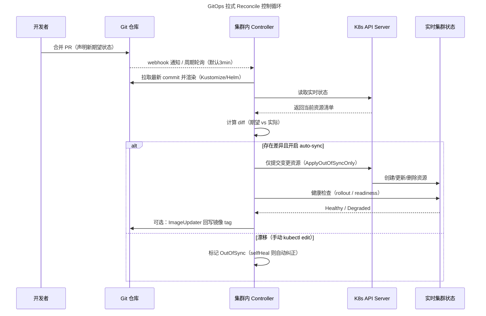

# CI-CD · 08 云原生 CI/CD 与 GitOps 工具对比

> Git 是唯一事实源，集群里的 agent 负责"拉"——你写的不是部署脚本，而是期望状态；谁偏离了 Git，谁就该被纠正。

本篇站在 Kubernetes 原生视角，系统对比云原生时代的 CI/CD 与 GitOps 工具链：先讲清 GitOps 的核心原理（声明式期望状态、拉式 reconcile 循环、OpenGitOps 四原则），再逐一拆解 Tekton（CI 构建）、Argo CD / Flux v2（GitOps CD）、Spinnaker（多云发布），最后横向对比一众 CI 工具（Drone / CircleCI / Travis / Azure DevOps / TeamCity / Buildkite / Woodpecker），并给出生产踩坑与密钥管理红线。渐进式交付（Argo Rollouts）详见 [10-部署策略](10-部署策略.md)。

## 一、云原生 CI/CD 与 Kubernetes 原生趋势

传统 CI/CD 工具（Jenkins、GitLab CI）本质是"跑在虚拟机/容器里的命令执行器"，与 Kubernetes 是松耦合关系。云原生 CI/CD 的核心转变是：**流水线本身也成为 K8s 的一等公民**——用 CRD 声明流水线、用 Pod 跑每个步骤、用 controller 协调执行。这带来三个收益：弹性伸缩（按需起 Pod）、环境一致性（容器隔离）、声明式与 GitOps 天然契合。

CNCF 在"持续交付"（Continuous Delivery）领域已形成清晰的分层：GitOps 控制面（Argo CD / Flux）、K8s 原生流水线（Tekton / Argo Workflows）、制品与渐进式交付（Argo Rollouts / Flagger）、供应链安全（Sigstore / in-toto）。下图给出 2025 年 CNCF 持续交付工具定位全景。

```mermaid
flowchart TB
    title CNCF 持续交付工具定位全景（2025）
    DEV[开发者 / Git 提交] --> CI
    subgraph CI[CI 构建层 - K8s 原生]
    TKN[Tekton Pipeline]
    AW[Argo Workflows]
    end
    CI --> ART[(制品仓库: OCI / Helm Chart)]
    ART --> CD
    subgraph CD[CD / GitOps 控制面]
    ARGO[Argo CD - 单体 + Web UI]
    FLUX[Flux v2 - Toolkit 模块化]
    SPIN[Spinnaker - 多云可视化]
    end
    CD --> K8S[(Kubernetes 集群)]
    subgraph PD[渐进式交付]
    ROLL[Argo Rollouts]
    FLAG[Flagger]
    end
    CD --> PD
    PD --> K8S
    subgraph SEC[供应链安全]
    SIG[Sigstore / Cosign]
    ESO[External Secrets Operator]
    end
    SEC -.保护.-> ART
    SEC -.注入.-> K8S
```

> CNCF 2025 终端用户调查：约 60% 运行应用交付的 Kubernetes 集群部署了 Argo CD，GitOps 已成为事实标准。Flux v2 于 2025 年 9 月发布 v2.7 GA，保持 CNCF 毕业项目地位（其原赞助方 Weaveworks 于 2024 年初停止运营，项目由 CNCF 社区接续维护）。

## 二、GitOps 原理深入

### 2.1 四个核心思想

GitOps 不是某个工具，而是一种**以 Git 仓库为唯一事实源、以声明式配置描述系统期望状态、由集群内 agent 持续对齐实际状态**的运维范式。其支柱有四：

1. **声明式期望状态（Declarative）**：用 YAML/Kustomize/Helm 描述"系统应该长什么样"，而非"如何到达那里"的命令序列。
2. **Git 是唯一事实源（Single Source of Truth）**：所有环境（dev/test/staging/prod）的配置都在 Git 中版本化；不在 Git 里的变更不被视为合法状态。
3. **拉式（Pull）自动对齐**：集群内的 controller 主动拉取 Git 状态并与实时状态对比，而非由外部 CI 推送执行。
4. **持续 reconcile + 自动纠正（Reconciliation）**：agent 周期性（或经 webhook 触发）比对，发现漂移（drift）后自动修复（self-healing）或报警。

### 2.2 拉式（Pull）vs 推式（Push）

传统 push 式 CI 让 CI runner 持有集群 admin 凭据，部署时 `kubectl apply` / `helm upgrade`。GitOps 把"执行权"内化到集群里：agent 由集群内部向外连接 Git（只读），**没有任何外部系统需要集群写权限**。

```mermaid
flowchart LR
    title 传统 Push 模型 vs GitOps Pull 模型
    subgraph PUSH[Push 模型 - 传统 CI]
    G1[(Git 代码)] --> CI1[CI Runner 持有 K8s admin 凭据]
    CI1 -->|kubectl apply / helm upgrade| K1[(Kubernetes)]
    end
    subgraph PULL[Pull 模型 - GitOps]
    G2[(Git 期望状态)] -.agent 周期性拉取.-> A2[集群内 Controller]
    A2 -->|对比+对齐| K2[(Kubernetes)]
    end
```

| 维度 | Push（Jenkins / GitLab CI） | Pull（Argo CD / Flux） |
|------|------------------------------|------------------------|
| 安全边界 | CI runner 需集群 admin 权限，凭据暴露面大 | agent 在集群内，对外只需 Git 只读权限 |
| 漂移检测 | 仅部署时检查，事后手动变更无人知 | 持续检测，手动变更被标记 OutOfSync 或自动回滚 |
| 自愈 | 无 | 开启 selfHeal 后自动纠正 |
| 多集群扩展 | 需为每个集群开防火墙/凭据 | 随集群数天然横向扩展 |
| 审计 | 依赖 CI 日志 | Git 提交历史即审计轨迹 |

> 黄金法则：**Push 模型把"部署动作"外包给一个需要高权限的外部系统；Pull 模型把"部署权利"交给住在集群里的、只认 Git 的 agent。** 二者时延差异其实很小——Argo CD 在 webhook 触发下从"镜像推送"到"Pod 替换"通常 < 2 分钟，与 push 相当（push 同样要等 RBAC 校验与 API round-trip）。

### 2.3 reconciliation 控制循环（拉式协调循环）

这就是 GitOps 的"心脏"。以 Argo CD 为例，默认每 **3 分钟**对每个 Application 做一次 reconcile：拉取 Git（或渲染后的 Helm/Kustomize）期望状态 → 通过 K8s API 读取实时状态 → 计算 diff → 若开启 auto-sync 则提交变更 → 健康检查（Pod ready / 自定义 health 表达式）→ 上报 sync 状态。Flux 各 controller 同理，但职责拆分为多个独立 controller。



- **健康检查（Health）**：不仅看 Pod Running，还可看 Deployment 是否完成 rollout、自定义 CRD 是否就绪。失败的 rollout 在 GitOps 里表现为 Degraded 的 Application，而非静默 crash loop。
- **漂移检测（Drift Detection）**：有人 `kubectl edit` 改了线上，controller 下次 reconcile 会发现并标记 OutOfSync；开启 selfHeal 会直接把它改回 Git 定义的值。
- **回滚即回退 commit**：出问题不用 `kubectl rollout undo`，而是 `git revert` 那次配置提交，controller 会自动把集群拉回上一健康状态——**回滚是一次普通的 Git 操作**，天然带审计与可追溯。

### 2.4 OpenGitOps 四项原则

CNCF OpenGitOps 工作组给出的四项原则，是判断"是不是真 GitOps"的标尺：

1. **声明式（Declarative）**：系统状态以声明式配置表达。
2. **版本化且不可变（Versioned and Immutable）**：期望状态存于版本控制，不可变且带完整历史。
3. **自动拉取（Pulled Automatically）**：软件 agent 自动从源拉取期望状态并与之对齐。
4. **持续协调（Reconciled Continuously）**：agent 持续观察差异并纠正，直到实际状态匹配期望。

> OpenGitOps 是"原则"不是"实现"，Argo CD / Flux / Spinnaker（部分）都可归入其框架，但只有严格满足四项、且以 Git 唯一事实源的才算正统 GitOps。

## 三、Tekton：Kubernetes 原生 Pipeline

Tekton 是 CNCF 毕业项目，把 CI 流水线做成 K8s 的 CRD。它的设计哲学：**每个 Task 跑成一个 Pod，每个 Step 跑成 Pod 里的一个容器**，步骤间通过共享 Workspace 卷（emptyDir/PVC）传递产物。

### 3.1 核心 CRD

| CRD | 角色 | 说明 |
|-----|------|------|
| `Task` | 最小构建单元 | 定义一组顺序执行的 `steps`（每步一个容器），可声明 `params` / `workspaces` / `results` |
| `TaskRun` | Task 的运行实例 | 给 Task 传入具体参数/workspace，触发一次执行，创建 Pod 收集结果 |
| `Pipeline` | 多 Task 编排 | 用 `runAfter` / `when` 表达依赖与条件，定义 Task 间参数与 Workspace 传递 |
| `PipelineRun` | Pipeline 的运行实例 | 触发整条流水线，为每个 Task 自动创建 TaskRun |
| `PipelineResource` | 外部资源（旧） | Git 仓库、镜像仓库等；新版本推荐用 `git-clone` Task + Workspace 替代 |

**Step 容器模型**：Tekton 为每个 step 起一个 init container 做准备工作（如把 step 脚本写入共享卷），主容器顺序执行。因为同 Pod，step 之间共享 Workspace 卷，可缓存依赖、传递产物。

**Workspace**：跨 Task 共享存储的抽象，底层可挂 PVC / ConfigMap / Secret / CSI（如 Vault secrets-store）。并行 Task 抢同一 ReadWriteOnce PVC 时，Tekton 的 Affinity Assistant 会把它们调度到同一节点以避免 AZ 冲突。

**Catalog 复用**：Tekton Catalog 提供社区维护的现成 Task（git-clone、buildah、kaniko、单元测试等），通过 `taskRef` 或远程解析（OCI bundle / Git / HTTP）引用，避免重复造轮子。

```mermaid
flowchart TB
    title Tekton CRD 执行模型
    PR[PipelineRun] -->|为每个 Task 创建| TR1[TaskRun A]
    PR -->|为每个 Task 创建| TR2[TaskRun B]
    PR -->|为每个 Task 创建| TR3[TaskRun C]
    TR1 --> POD1[Pod A: step1容器 -> step2容器]
    TR2 --> POD2[Pod B: step1容器]
    TR3 --> POD3[Pod C: step1容器 -> step2容器]
    POD1 -.共享.-> WS[(Workspace PVC)]
    POD2 -.共享.-> WS
    POD3 -.共享.-> WS
    TR1 -->|results 传递给| TR2
    TR2 -->|runAfter 约束顺序| TR3
```

### 3.2 Tekton 与 Argo CD 的分工

一句话：**Tekton 做 CI（构建出可信制品），Argo CD 做 CD（把制品部署到集群）**，二者接力而非重叠。典型协作流：Tekton 编译代码 → 构建镜像并签名（Cosign）→ 推到 OCI 仓库 → 由 CI 更新 Git 清单里的镜像 tag（或 Argo Image Updater 自动发现）→ Argo CD 检测变更并 sync 到集群。这种"CI 止步于 push 镜像、CD 从 Git 拉状态"的切分，正是 GitOps 推荐形态。

### 3.3 Tekton Task 示例

下面一个 Task 演示：检出代码 → 用 Kaniko 构建并推送镜像（需 `image-registry` Workspace 与 `docker-config` Secret）。

```yaml
apiVersion: tekton.dev/v1
kind: Task
metadata:
  name: build-and-push
  namespace: ci
spec:
  params:
    - name: image
      type: string
      description: 目标镜像全名，如 registry.example.com/app:{{revision}}
    - name: revision
      type: string
      default: main
  workspaces:
    - name: source          # 代码检出目录
    - name: dockerconfig    # 镜像仓库凭据（kubeconfig 形式 Secret 挂载）
  steps:
    - name: clone
      image: alpine/git:v2.40
      workingDir: $(workspaces.source.path)
      script: |
        #!/bin/sh
        git clone --branch $(params.revision) \
          "$(params.repo-url)" .
    - name: build-push
      image: gcr.io/kaniko-project/executor:v1.20
      workingDir: $(workspaces.source.path)
      env:
        - name: DOCKER_CONFIG
          value: $(workspaces.dockerconfig.path)
      args:
        - --destination=$(params.image)
        - --context=.
        - --dockerfile=Dockerfile
        - --cache=true
```

> ⚠️ Tekton 默认 reconcile 不在"3 分钟"这种粗粒度——它是由 PipelineRun 创建即触发的事件驱动执行，属于 CI 而非 CD。不要把 Tekton 当 CD 用：它的运行是"一次性"的，不具备持续 reconcile 与自愈能力，那是 Argo CD / Flux 的活。

## 四、Argo CD：GitOps CD 控制面

Argo CD 是 CNCF 毕业项目，以 `Application` 为核心资源，把一个"Git 路径 + 目标集群/命名空间"绑定起来，提供 Web UI diff 可视化、多集群、强 RBAC。

### 4.1 核心概念

- **Application / AppProject**：`Application` 绑定 `source`（repoURL + path + targetRevision）与 `destination`（server + namespace）；`AppProject` 做多租户隔离，限制 sourceRepos、destinations、集群资源白名单。
- **Sync（同步）**：`automated.prune`（删 Git 中已不存在的资源）、`selfHeal`（自动纠正漂移）、`syncOptions`（如 `CreateNamespace=true`、`ApplyOutOfSyncOnly=true`）。
- **Health（健康）**：内置资源健康评估；可自定义 health 表达式。
- **Sync Waves**：用注解 `argocd.argoproj.io/sync-wave: "-1"` 控制资源应用顺序（如先跑数据库迁移 Job 再部署应用），比 push 模型里的 sleep 计时器明确且可版本化。
- **ApplicationSet**：用生成器（cluster / git / list / matrix）批量生成 Application，实现多集群、多环境 fleet 管理（如 app-of-apps 模式的自动化版）。
- **Argo Rollouts**：渐进式交付控制器（蓝绿/金丝雀/分析），深入见 [10-部署策略](10-部署策略.md)。

```mermaid
flowchart LR
    title Argo CD Application 绑定与 Sync 流程
    GIT[(Git: k8s/overlays/prod)] --> APP[Application]
    APP -->|spec.source 指向| PATH[path + targetRevision]
    APP -->|spec.destination| NS[(namespace: payments)]
    APP --> SYNC{syncPolicy}
    SYNC -->|automated| REC[Reconcile + Apply]
    SYNC -->|manual| WAIT[等待人工审批]
    REC --> WAVE[sync-wave 排序应用]
    WAVE --> HEALTH[Health Check]
    HEALTH -->|Degraded| ALERT[报警/回滚]
```

### 4.2 Argo CD Application 示例

```yaml
apiVersion: argoproj.io/v1alpha1
kind: Application
metadata:
  name: payment-gateway
  namespace: argocd
  annotations:
    argocd.argoproj.io/sync-wave: "0"
spec:
  project: production-core          # 关联的 AppProject（多租户隔离）
  source:
    repoURL: https://github.com/example/infra-live.git
    targetRevision: HEAD
    path: k8s/overlays/prod
  destination:
    server: https://kubernetes.default.svc
    namespace: payments
  syncPolicy:
    automated:
      prune: true                   # Git 删了，集群也删
      selfHeal: true                # 手动改动自动纠正
    syncOptions:
      - CreateNamespace=true
      - ApplyOutOfSyncOnly=true     # 只提交变更资源，减少 churn
    retry:
      limit: 5
      backoff:
        duration: 5s
        factor: 2
        maxDuration: 3m
```

> ⚠️ Argo CD 默认 3 分钟 reconcile 间隔在数百个 Application 时会造成 API Server 与 Git 的显著压力（etcd 写延迟敏感）。最佳实践：**配 Git webhook 触发即时 sync，同时把稳定应用的 reconcile 间隔调大**，避免控制面被打爆。

## 五、Flux v2：模块化的 GitOps Toolkit

Flux v2 把能力拆成多个职责单一的 controller（"GitOps Toolkit"），API 设计更贴近原生 K8s，扩展性与组合性更强；Argo CD 则是单体 + 强 Web UI。2025 年 9 月发布的 v2.7 GA 增加了 OpenTelemetry tracing、ArtifactGenerator（多源合成）等能力。

### 5.1 核心组件

| Controller | 关注资源 | 职责 |
|------------|----------|------|
| `source-controller` | GitRepository / HelmRepository / OCIRepository / Bucket | 拉取源、渲染成 tar 制品、管理私有源鉴权 |
| `kustomize-controller` | Kustomization | 把 Kustomize/原生 YAML 应用到集群，支持 SOPS 解密、health check、prune |
| `helm-controller` | HelmRelease | 从源取 chart + values，执行 Helm release，支持 CEL 就绪评估 |
| `notification-controller` | Provider / Alert / Receiver | 接收各 controller 事件，推送至 Slack / Webhook / Datadog / OTel |
| `image-reflector` / `image-automation` | ImageRepository / ImagePolicy / ImageUpdateAutomation | 扫描镜像仓库、按策略自动回写 tag 到 Git |

### 5.2 Kustomize / Helm 与 OCI 制品

Flux 原生支持 Kustomize 与 Helm 两种渲染方式。**OCI artifact 仓库**：Flux 可把 Kustomize/Helm 配置打包成 OCI 镜像（`flux push artifact`）像拉容器一样拉配置——复用仓库权限与缓存，是 2025 年的推荐进阶用法。下面是一段最小 Flux v2 配置：

```yaml
# 源：监听 Git 仓库
apiVersion: source.toolkit.fluxcd.io/v1
kind: GitRepository
metadata:
  name: backend-config
  namespace: flux-system
spec:
  interval: 1m
  url: https://github.com/example/k8s-manifests
  ref:
    branch: main
---
# 应用：Kustomize 渲染并落库
apiVersion: kustomize.toolkit.fluxcd.io/v1
kind: Kustomization
metadata:
  name: backend
  namespace: flux-system
spec:
  interval: 5m
  path: ./services/backend
  prune: true                    # 删 Git 中已移除的资源（也会删手动加的！）
  sourceRef:
    kind: GitRepository
    name: backend-config
  healthChecks:
    - apiVersion: apps/v1
      kind: Deployment
      name: backend
      namespace: backend
```

> ⚠️ `prune: true` 是你要的漂移纠正，但**它会删掉你手动 apply 却忘了提交的资源**。同理 Argo CD 的 `prune`。务必对所有手动操作先提交 Git 再执行，否则会被 reconcile 默默清掉。

## 六、Spinnaker：Netflix 出品的多云发布平台

Spinnaker 由 Netflix 开源、现由持续交付基金会（CDF）托管，强项是**多云（AWS/GCP/Azure/K8s）统一发布**与**可视化 Pipeline**（ stage 拖拽编排），并内置灰度/金丝雀分析 **Kayenta**（自动对比新旧版本指标决定推进或回滚）。它偏"重"——有自己的 UI 与数据库，适合大型组织复杂发布编排；与 GitOps 的"声明式+拉式"哲学不同，Spinnaker 更接近传统的、由事件触发的发布编排器。

| 维度 | Spinnaker | Argo CD / Flux |
|------|-----------|----------------|
| 适用面 | 多云、跨账号、复杂发布编排 | K8s 原生、GitOps 声明式 |
| 配置方式 | UI + JSON Pipeline 定义 | Git 中 YAML |
| 渐进式交付 | Kayenta 自动金丝雀分析 | 配 Flagger / Argo Rollouts |
| 学习成本 | 高（组件多、需 DB） | 中（贴合 K8s 概念） |

## 七、其他 CI 工具横向对比

以下工具主要解决**构建/测试/集成（CI）**环节，与上文 GitOps CD 工具互补。除 Tekton 外，它们多为"push 式"，适合在 CI 阶段产出制品，再由 GitOps 工具部署。

### 7.1 大表对比

| 工具 | 定位 | 开源/许可 | 云原生 | 配置方式 | 触发 | 部署能力 | 适用场景 |
|------|------|-----------|--------|----------|------|----------|----------|
| **Tekton** | K8s 原生流水线 | Apache 2.0 | 是（CRD） | YAML CRD | 事件/Triggers | 需配 Argo CD | 已 K8s 化、要弹性 CI |
| **Drone** | 容器化轻量 CI | Polyform SBL（源码可见，Harness 收购后承诺开源） | 是 | `.drone.yml` | Webhook | 弱（需插件） | 隐私优先、自托管小团队 |
| **CircleCI** | SaaS/自托管 CI | 商业（有免费额度） | 强（Docker/K8s 优化） | `config.yml` + orbs | Webhook | 中等（orbs 部署） | 快速构建、强缓存、Docker 重 |
| **Travis CI** | 老牌 SaaS CI | 非开源（OSS 免费缩减） | 一般 | `.travis.yml` | Push | 弱 | 遗留/简单开源项目 |
| **Azure DevOps** | 微软全家桶 | 商业（有免费额度） | 中（Pipelines） | `azure-pipelines.yml` | Push/PR | 强（多目标） | .NET/微软生态企业 |
| **TeamCity** | JetBrains 强构建链 | 商业（有免费额度） | 一般 | Kotlin DSL/UI | VCS | 中 | 复杂构建依赖链、Java 系 |
| **Buildkite** | Agent 弹性模型 | 商业（SaaS 控制面+自管 Agent） | 强 | `pipeline.yml` | Webhook | 中 | 大规模、弹性自管 Agent |
| **Woodpecker** | Drone 社区分支 | AGPL（真正开源） | 是 | `.woodpecker/` 多文件 | Webhook | 弱 | 隐私/自托管、轻量现代 |

### 7.2 要点速记

- **Drone**：完全容器化、~150 插件，自托管无云版；2019 被 Harness 收购，2022 年改用 Polyform SBL 许可证，社区流向 Woodpecker。
- **CircleCI**：`orbs` 复用生态、缓存强（依赖/字典缓存）、Insights 分析 flaky test；2025 仍是多数团队首选 SaaS CI。
- **Travis CI**：曾是最流行的 GitHub CI，免费额度大幅缩减后渐衰，仅适合既有工作流或极低量项目。
- **Azure DevOps Pipelines**：与 Azure Repos/Boards/Artifacts 无缝，YAML 多阶段，适合微软技术栈企业。
- **TeamCity**：Kotlin DSL 写 pipeline、构建链（build chain）依赖可视化强，Java/Kotlin 团队友好。
- **Buildkite**：控制面 SaaS、Agent 跑在你自己机器上，"弹性 + 数据不出域"；大型 Monorepo 友好。
- **Woodpecker**：Drone 的 Apache→AGPL 分支（因 Drone 改 BSL），语法近 Drone、支持 `.woodpecker/` 多文件、Gitea 集成好、活跃度高——**新起自托管项目优先 Woodpecker**。

```mermaid
flowchart LR
    title CI 工具选型坐标轴（按"自托管 vs SaaS / 轻量 vs 企业级"）
    subgraph SaaS[SaaS 控制面]
    CIRC[CircleCI]
    TRAV[Travis CI]
    BK[Buildkite 控制面]
    ADO[Azure DevOps]
    TC[TeamCity 服务端]
    end
    subgraph SELF[自托管 Agent/Server]
    DRN[Drone]
    WP[Woodpecker]
    TKN[Tekton - K8s]
    end
    SELF -->|隐私/轻量| CHOICE[选型]
    SaaS -->|快起/分析强| CHOICE
```

## 八、生产踩坑与反模式（⚠️）

> ⚠️ **GitOps 密钥管理红线**：**绝不要把 Secret 明文放进 Git**（合规/泄露双重风险）。正确做法是用 **Sealed Secrets**（加密进 Git、集群内解密）或 **External Secrets Operator（ESO）**（运行时从 Vault / AWS SSM / 云密钥管理拉取，Git 里根本不存值）。详见 [12-密钥与配置管理](12-环境配置与密钥管理.md)（计划篇）。

> ⚠️ **reconcile 误删手动变更**：`prune`（Argo/Flux）与 `selfHeal` 会自动清除 Git 中不存在的、或被手动改动过的资源。后果是"我刚才 kubectl 改的怎么没了"。纪律：**任何变更先提 PR 合入 Git，再让 controller 应用**；紧急热修也要事后补 commit，否则自愈会覆盖。

> ⚠️ **多集群复杂度**：ApplicationSet / Flux 多路径能管 fleet，但"单仓库多环境"还是"infra repo + app repo 分层"需在第一天想清。结构错了，每次晋级（promotion）都会变成痛苦的手动操作或脆弱脚本。推荐：环境用 `overlays/`（Kustomize）或 `Helm values-per-env` 表达，晋级即改 targetRevision / 路径。

> ⚠️ **CI 持有集群高权限**：push 模型把 admin kubeconfig 塞进 CI 变量是巨大攻击面——CI 提供方一旦被入侵，生产集群随之失守。GitOps pull 模型从根上消除该风险。

> ⚠️ **etcd / API Server 压力**：reconcile 间隔过小 + Application 过多，会让 etcd 写延迟飙升、leader 选举失败、sync 超时。给稳定应用调大间隔、配 webhook 即时触发，是生产硬要求。

## 九、与其他模块的关联

- [01-概述与核心概念](01-概述与核心概念.md)：CI/CD 总览、持续集成/交付/部署定义，本篇是其"云原生+GitOps"深化。
- [03-构建与制品管理](03-构建与制品管理.md)：Tekton 构建出的 OCI 镜像/Helm chart 在此归档，不可变制品是 GitOps 的前置条件。
- [10-部署策略](10-部署策略.md)：Argo Rollouts / Flagger 的蓝绿、金丝雀、渐进式交付深入篇（本篇仅作引用）。
- [12-密钥与配置管理](12-环境配置与密钥管理.md)（计划篇）：Sealed Secrets / External Secrets 的落地细节，呼应本篇密钥红线。
- [../../云原生/K8S.md](../../云原生/K8S.md)：Argo CD / Flux 都是 K8s Operator，理解 Controller 协调循环见此篇。
- [../大数据/02-技术体系与架构演进.md](../大数据/02-技术体系与架构演进.md)：大数据"采集→存储→计算"也是 DAG 流水线，与设计模式篇（[09](09-流水线设计模式与最佳实践.md)）的 DAG、质量门禁思想同源。

## 十、参考

- GitOps 拉式实践与 Argo CD/Flux 对比（2025）：https://climstech.com/blog/gitops-in-practice
- Argo CD Reconciliation 原理与最佳实践（Rafay）：https://rafay.co/ai-and-cloud-native-blog/understanding-argocd-reconciliation-how-it-works-why-it-matters-and-best-practices
- GitOps 最佳实践 2025（Pull vs Push、External Secrets）：https://coolvds.com/blog/gitops-best-practices-2025-from-kubectl-apply-to-zero-drift-k8s-in-oslo
- GitOps 与 app-of-apps 模式（adesso）：https://www.adesso.de/en/news/blog/gitops-in-practice-continuous-deployment-with-argocd-and-the-app-of-apps-pattern.jsp
- Tekton 官方文档（Workspaces / Pipeline 入门 / 架构）：https://tekton.dev/docs/pipelines/workspaces/ 、https://tekton.dev/docs/getting-started/pipelines
- Tekton 架构（CRD 执行模型）：https://docs.alauda.cn/alauda-devops-pipelines/4.1/en/pipelines/architecture
- Flux v2 官方公告（v2.7 GA，OCI / OTel / ArtifactGenerator）：https://fluxcd.netlify.app/blog/2025/09/flux-v2.7.0
- Flux v2 组件与 Bootstrap：https://cn.x-cmd.com/install/flux2 、https://docs.microsoft.com/zh-tw/azure/azure-arc/kubernetes/conceptual-gitops-flux2
- Flux v2.1.0 发布说明（Kustomize/Helm/OCI 能力）：https://github.com/fluxcd/flux2/releases/v2.1.0
- Argo Rollouts 渐进式交付（Red Hat / 51CTO / k8scockpit）：https://www.redhat.com/ja/blog/blue-green-canary-argo-rollouts 、https://k8scockpit.tech/posts/progressive-delivery-kubernetes
- Drone vs Travis（Harness，2025-12 更新）、CircleCI vs Travis 2025、Woodpecker vs Drone：https://www.harness.io/comparison-guide/travisci-vs-drone 、https://softtech-reviews.com/compare/circleci-vs-travis-ci 、https://sumguy.com/woodpecker-ci-vs-drone-ci
- CNCF OpenGitOps 四项原则：https://opengitops.dev/
- Kubernetes 部署策略 2025（Blue-Green / Canary / Rolling）：https://devopsenginer.com/blog/kubernetes-deployment-strategies-2025-complete-guide
