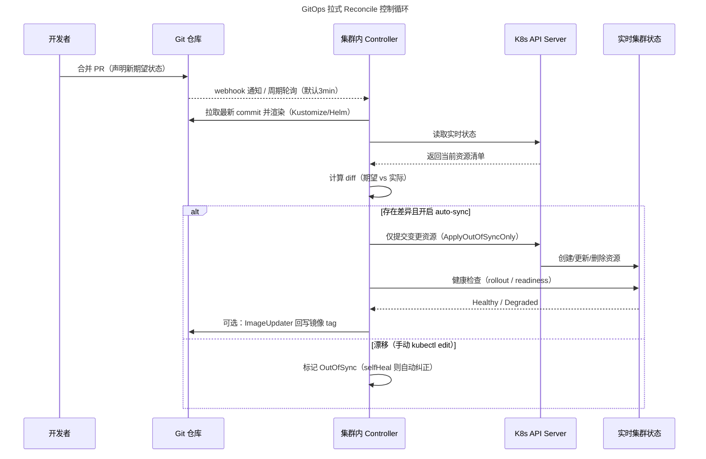
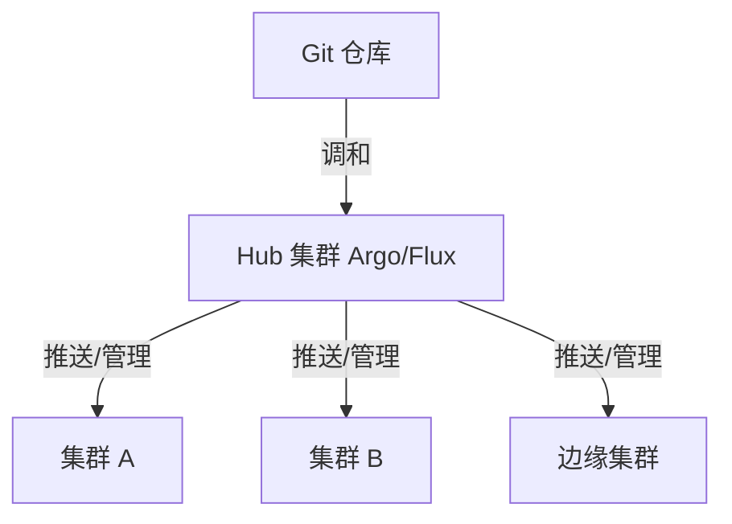
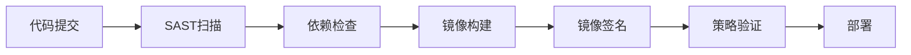
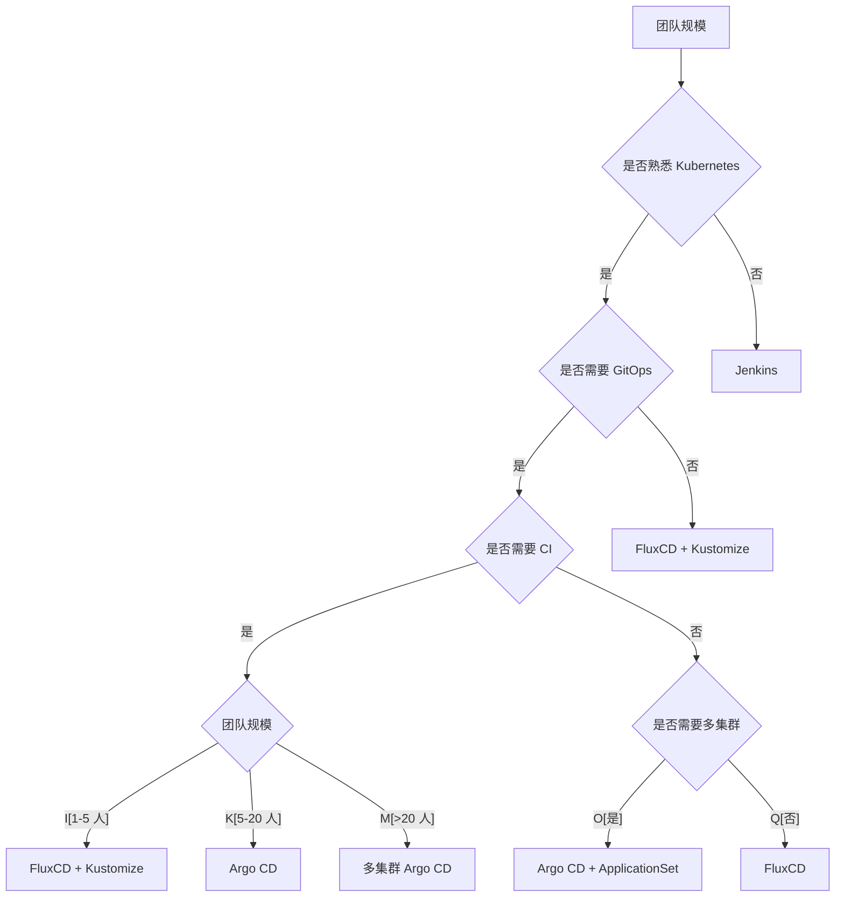

# CI-CD · 08 云原生 CI/CD 与 GitOps 工具对比

> Git 是唯一事实源，集群里的 agent 负责"拉"——你写的不是部署脚本，而是期望状态；谁偏离了 Git，谁就该被纠正。

本篇站在 Kubernetes 原生视角，系统对比云原生时代的 CI/CD 与 GitOps 工具链：先讲清 GitOps 的核心原理（声明式期望状态、拉式 reconcile 循环、OpenGitOps 四原则），再逐一拆解 Tekton（CI 构建）、Argo CD / Flux v2（GitOps CD）、Spinnaker（多云发布），最后横向对比一众 CI 工具（Drone / CircleCI / Travis / Azure DevOps / TeamCity / Buildkite / Woodpecker），并给出生产踩坑与密钥管理红线。渐进式交付（Argo Rollouts）详见 [10-部署策略](10-部署策略.md)。

## 一、云原生 CI/CD 与 Kubernetes 原生趋势

传统 CI/CD 工具（Jenkins、GitLab CI）本质是"跑在虚拟机/容器里的命令执行器"，与 Kubernetes 是松耦合关系。云原生 CI/CD 的核心转变是：**流水线本身也成为 K8s 的一等公民**——用 CRD 声明流水线、用 Pod 跑每个步骤、用 controller 协调执行。这带来三个收益：弹性伸缩（按需起 Pod）、环境一致性（容器隔离）、声明式与 GitOps 天然契合。

CNCF 在"持续交付"（Continuous Delivery）领域已形成清晰的分层：GitOps 控制面（Argo CD / Flux）、K8s 原生流水线（Tekton / Argo Workflows）、制品与渐进式交付（Argo Rollouts / Flagger）、供应链安全（Sigstore / in-toto）。下图给出 2025 年 CNCF 持续交付工具定位全景。

```mermaid
flowchart TB
    title CNCF 持续交付工具定位全景（2025）
    DEV[开发者 / Git 提交] --> CI
    subgraph CI[CI 构建层 - K8s 原生]
    TKN[Tekton Pipeline]
    AW[Argo Workflows]
    end
    CI --> ART[(制品仓库: OCI / Helm Chart)]
    ART --> CD
    subgraph CD[CD / GitOps 控制面]
    ARGO[Argo CD - 单体 + Web UI]
    FLUX[Flux v2 - Toolkit 模块化]
    SPIN[Spinnaker - 多云可视化]
    end
    CD --> K8S[(Kubernetes 集群)]
    subgraph PD[渐进式交付]
    ROLL[Argo Rollouts]
    FLAG[Flagger]
    end
    CD --> PD
    PD --> K8S
    subgraph SEC[供应链安全]
    SIG[Sigstore / Cosign]
    ESO[External Secrets Operator]
    end
    SEC -.保护.-> ART
    SEC -.注入.-> K8S
```

> CNCF 2025 终端用户调查：约 60% 运行应用交付的 Kubernetes 集群部署了 Argo CD，GitOps 已成为事实标准。Flux v2 于 2025 年 9 月发布 v2.7 GA，保持 CNCF 毕业项目地位（其原赞助方 Weaveworks 于 2024 年初停止运营，项目由 CNCF 社区接续维护）。

## 二、GitOps 原理深入

### 2.1 四个核心思想

GitOps 不是某个工具，而是一种**以 Git 仓库为唯一事实源、以声明式配置描述系统期望状态、由集群内 agent 持续对齐实际状态**的运维范式。其支柱有四：

1. **声明式期望状态（Declarative）**：用 YAML/Kustomize/Helm 描述"系统应该长什么样"，而非"如何到达那里"的命令序列。
2. **Git 是唯一事实源（Single Source of Truth）**：所有环境（dev/test/staging/prod）的配置都在 Git 中版本化；不在 Git 里的变更不被视为合法状态。
3. **拉式（Pull）自动对齐**：集群内的 controller 主动拉取 Git 状态并与实时状态对比，而非由外部 CI 推送执行。
4. **持续 reconcile + 自动纠正（Reconciliation）**：agent 周期性（或经 webhook 触发）比对，发现漂移（drift）后自动修复（self-healing）或报警。

### 2.2 拉式（Pull）vs 推式（Push）

传统 push 式 CI 让 CI runner 持有集群 admin 凭据，部署时 `kubectl apply` / `helm upgrade`。GitOps 把"执行权"内化到集群里：agent 由集群内部向外连接 Git（只读），**没有任何外部系统需要集群写权限**。

```mermaid
flowchart LR
    title 传统 Push 模型 vs GitOps Pull 模型
    subgraph PUSH[Push 模型 - 传统 CI]
    G1[(Git 代码)] --> CI1[CI Runner 持有 K8s admin 凭据]
    CI1 -->|kubectl apply / helm upgrade| K1[(Kubernetes)]
    end
    subgraph PULL[Pull 模型 - GitOps]
    G2[(Git 期望状态)] -.agent 周期性拉取.-> A2[集群内 Controller]
    A2 -->|对比+对齐| K2[(Kubernetes)]
    end
```

| 维度 | Push（Jenkins / GitLab CI） | Pull（Argo CD / Flux） |
|------|------------------------------|------------------------|
| 安全边界 | CI runner 需集群 admin 权限，凭据暴露面大 | agent 在集群内，对外只需 Git 只读权限 |
| 漂移检测 | 仅部署时检查，事后手动变更无人知 | 持续检测，手动变更被标记 OutOfSync 或自动回滚 |
| 自愈 | 无 | 开启 selfHeal 后自动纠正 |
| 多集群扩展 | 需为每个集群开防火墙/凭据 | 随集群数天然横向扩展 |
| 审计 | 依赖 CI 日志 | Git 提交历史即审计轨迹 |

> 黄金法则：**Push 模型把"部署动作"外包给一个需要高权限的外部系统；Pull 模型把"部署权利"交给住在集群里的、只认 Git 的 agent。** 二者时延差异其实很小——Argo CD 在 webhook 触发下从"镜像推送"到"Pod 替换"通常 < 2 分钟，与 push 相当（push 同样要等 RBAC 校验与 API round-trip）。

### 2.3 reconciliation 控制循环（拉式协调循环）

这就是 GitOps 的"心脏"。以 Argo CD 为例，默认每 **3 分钟**对每个 Application 做一次 reconcile：拉取 Git（或渲染后的 Helm/Kustomize）期望状态 → 通过 K8s API 读取实时状态 → 计算 diff → 若开启 auto-sync 则提交变更 → 健康检查（Pod ready / 自定义 health 表达式）→ 上报 sync 状态。Flux 各 controller 同理，但职责拆分为多个独立 controller。



- **健康检查（Health）**：不仅看 Pod Running，还可看 Deployment 是否完成 rollout、自定义 CRD 是否就绪。失败的 rollout 在 GitOps 里表现为 Degraded 的 Application，而非静默 crash loop。
- **漂移检测（Drift Detection）**：有人 `kubectl edit` 改了线上，controller 下次 reconcile 会发现并标记 OutOfSync；开启 selfHeal 会直接把它改回 Git 定义的值。
- **回滚即回退 commit**：出问题不用 `kubectl rollout undo`，而是 `git revert` 那次配置提交，controller 会自动把集群拉回上一健康状态——**回滚是一次普通的 Git 操作**，天然带审计与可追溯。

### 2.4 OpenGitOps 四项原则

CNCF OpenGitOps 工作组给出的四项原则，是判断"是不是真 GitOps"的标尺：

1. **声明式（Declarative）**：系统状态以声明式配置表达。
2. **版本化且不可变（Versioned and Immutable）**：期望状态存于版本控制，不可变且带完整历史。
3. **自动拉取（Pulled Automatically）**：软件 agent 自动从源拉取期望状态并与之对齐。
4. **持续协调（Reconciled Continuously）**：agent 持续观察差异并纠正，直到实际状态匹配期望。

> OpenGitOps 是"原则"不是"实现"，Argo CD / Flux / Spinnaker（部分）都可归入其框架，但只有严格满足四项、且以 Git 唯一事实源的才算正统 GitOps。

## 三、Tekton：Kubernetes 原生 Pipeline

Tekton 是 CNCF 毕业项目，把 CI 流水线做成 K8s 的 CRD。它的设计哲学：**每个 Task 跑成一个 Pod，每个 Step 跑成 Pod 里的一个容器**，步骤间通过共享 Workspace 卷（emptyDir/PVC）传递产物。

### 3.1 核心 CRD

| CRD | 角色 | 说明 |
|-----|------|------|
| `Task` | 最小构建单元 | 定义一组顺序执行的 `steps`（每步一个容器），可声明 `params` / `workspaces` / `results` |
| `TaskRun` | Task 的运行实例 | 给 Task 传入具体参数/workspace，触发一次执行，创建 Pod 收集结果 |
| `Pipeline` | 多 Task 编排 | 用 `runAfter` / `when` 表达依赖与条件，定义 Task 间参数与 Workspace 传递 |
| `PipelineRun` | Pipeline 的运行实例 | 触发整条流水线，为每个 Task 自动创建 TaskRun |
| `PipelineResource` | 外部资源（旧） | Git 仓库、镜像仓库等；新版本推荐用 `git-clone` Task + Workspace 替代 |

**Step 容器模型**：Tekton 为每个 step 起一个 init container 做准备工作（如把 step 脚本写入共享卷），主容器顺序执行。因为同 Pod，step 之间共享 Workspace 卷，可缓存依赖、传递产物。

**Workspace**：跨 Task 共享存储的抽象，底层可挂 PVC / ConfigMap / Secret / CSI（如 Vault secrets-store）。并行 Task 抢同一 ReadWriteOnce PVC 时，Tekton 的 Affinity Assistant 会把它们调度到同一节点以避免 AZ 冲突。

**Catalog 复用**：Tekton Catalog 提供社区维护的现成 Task（git-clone、buildah、kaniko、单元测试等），通过 `taskRef` 或远程解析（OCI bundle / Git / HTTP）引用，避免重复造轮子。

```mermaid
flowchart TB
    title Tekton CRD 执行模型
    PR[PipelineRun] -->|为每个 Task 创建| TR1[TaskRun A]
    PR -->|为每个 Task 创建| TR2[TaskRun B]
    PR -->|为每个 Task 创建| TR3[TaskRun C]
    TR1 --> POD1[Pod A: step1容器 -> step2容器]
    TR2 --> POD2[Pod B: step1容器]
    TR3 --> POD3[Pod C: step1容器 -> step2容器]
    POD1 -.共享.-> WS[(Workspace PVC)]
    POD2 -.共享.-> WS
    POD3 -.共享.-> WS
    TR1 -->|results 传递给| TR2
    TR2 -->|runAfter 约束顺序| TR3
```

### 3.2 Tekton 与 Argo CD 的分工

一句话：**Tekton 做 CI（构建出可信制品），Argo CD 做 CD（把制品部署到集群）**，二者接力而非重叠。典型协作流：Tekton 编译代码 → 构建镜像并签名（Cosign）→ 推到 OCI 仓库 → 由 CI 更新 Git 清单里的镜像 tag（或 Argo Image Updater 自动发现）→ Argo CD 检测变更并 sync 到集群。这种"CI 止步于 push 镜像、CD 从 Git 拉状态"的切分，正是 GitOps 推荐形态。

### 3.3 Tekton Task 示例

下面一个 Task 演示：检出代码 → 用 Kaniko 构建并推送镜像（需 `image-registry` Workspace 与 `docker-config` Secret）。

```yaml
apiVersion: tekton.dev/v1
kind: Task
metadata:
  name: build-and-push
  namespace: ci
spec:
  params:
    - name: image
      type: string
      description: 目标镜像全名，如 registry.example.com/app:{{revision}}
    - name: revision
      type: string
      default: main
  workspaces:
    - name: source          # 代码检出目录
    - name: dockerconfig    # 镜像仓库凭据（kubeconfig 形式 Secret 挂载）
  steps:
    - name: clone
      image: alpine/git:v2.40
      workingDir: $(workspaces.source.path)
      script: |
        #!/bin/sh
        git clone --branch $(params.revision) \
          "$(params.repo-url)" .
    - name: build-push
      image: gcr.io/kaniko-project/executor:v1.20
      workingDir: $(workspaces.source.path)
      env:
        - name: DOCKER_CONFIG
          value: $(workspaces.dockerconfig.path)
      args:
        - --destination=$(params.image)
        - --context=.
        - --dockerfile=Dockerfile
        - --cache=true
```

> ⚠️ Tekton 默认 reconcile 不在"3 分钟"这种粗粒度——它是由 PipelineRun 创建即触发的事件驱动执行，属于 CI 而非 CD。不要把 Tekton 当 CD 用：它的运行是"一次性"的，不具备持续 reconcile 与自愈能力，那是 Argo CD / Flux 的活。

## 四、Argo CD：GitOps CD 控制面

Argo CD 是 CNCF 毕业项目，以 `Application` 为核心资源，把一个"Git 路径 + 目标集群/命名空间"绑定起来，提供 Web UI diff 可视化、多集群、强 RBAC。

### 4.1 核心概念

- **Application / AppProject**：`Application` 绑定 `source`（repoURL + path + targetRevision）与 `destination`（server + namespace）；`AppProject` 做多租户隔离，限制 sourceRepos、destinations、集群资源白名单。
- **Sync（同步）**：`automated.prune`（删 Git 中已不存在的资源）、`selfHeal`（自动纠正漂移）、`syncOptions`（如 `CreateNamespace=true`、`ApplyOutOfSyncOnly=true`）。
- **Health（健康）**：内置资源健康评估；可自定义 health 表达式。
- **Sync Waves**：用注解 `argocd.argoproj.io/sync-wave: "-1"` 控制资源应用顺序（如先跑数据库迁移 Job 再部署应用），比 push 模型里的 sleep 计时器明确且可版本化。
- **ApplicationSet**：用生成器（cluster / git / list / matrix）批量生成 Application，实现多集群、多环境 fleet 管理（如 app-of-apps 模式的自动化版）。
- **Argo Rollouts**：渐进式交付控制器（蓝绿/金丝雀/分析），深入见 [10-部署策略](10-部署策略.md)。

```mermaid
flowchart LR
    title Argo CD Application 绑定与 Sync 流程
    GIT[(Git: k8s/overlays/prod)] --> APP[Application]
    APP -->|spec.source 指向| PATH[path + targetRevision]
    APP -->|spec.destination| NS[(namespace: payments)]
    APP --> SYNC{syncPolicy}
    SYNC -->|automated| REC[Reconcile + Apply]
    SYNC -->|manual| WAIT[等待人工审批]
    REC --> WAVE[sync-wave 排序应用]
    WAVE --> HEALTH[Health Check]
    HEALTH -->|Degraded| ALERT[报警/回滚]
```

### 4.2 Argo CD Application 示例

```yaml
apiVersion: argoproj.io/v1alpha1
kind: Application
metadata:
  name: payment-gateway
  namespace: argocd
  annotations:
    argocd.argoproj.io/sync-wave: "0"
spec:
  project: production-core          # 关联的 AppProject（多租户隔离）
  source:
    repoURL: https://github.com/example/infra-live.git
    targetRevision: HEAD
    path: k8s/overlays/prod
  destination:
    server: https://kubernetes.default.svc
    namespace: payments
  syncPolicy:
    automated:
      prune: true                   # Git 删了，集群也删
      selfHeal: true                # 手动改动自动纠正
    syncOptions:
      - CreateNamespace=true
      - ApplyOutOfSyncOnly=true     # 只提交变更资源，减少 churn
    retry:
      limit: 5
      backoff:
        duration: 5s
        factor: 2
        maxDuration: 3m
```

> ⚠️ Argo CD 默认 3 分钟 reconcile 间隔在数百个 Application 时会造成 API Server 与 Git 的显著压力（etcd 写延迟敏感）。最佳实践：**配 Git webhook 触发即时 sync，同时把稳定应用的 reconcile 间隔调大**，避免控制面被打爆。

## 五、Flux v2：模块化的 GitOps Toolkit

Flux v2 把能力拆成多个职责单一的 controller（"GitOps Toolkit"），API 设计更贴近原生 K8s，扩展性与组合性更强；Argo CD 则是单体 + 强 Web UI。2025 年 9 月发布的 v2.7 GA 增加了 OpenTelemetry tracing、ArtifactGenerator（多源合成）等能力。

### 5.1 核心组件

| Controller | 关注资源 | 职责 |
|------------|----------|------|
| `source-controller` | GitRepository / HelmRepository / OCIRepository / Bucket | 拉取源、渲染成 tar 制品、管理私有源鉴权 |
| `kustomize-controller` | Kustomization | 把 Kustomize/原生 YAML 应用到集群，支持 SOPS 解密、health check、prune |
| `helm-controller` | HelmRelease | 从源取 chart + values，执行 Helm release，支持 CEL 就绪评估 |
| `notification-controller` | Provider / Alert / Receiver | 接收各 controller 事件，推送至 Slack / Webhook / Datadog / OTel |
| `image-reflector` / `image-automation` | ImageRepository / ImagePolicy / ImageUpdateAutomation | 扫描镜像仓库、按策略自动回写 tag 到 Git |

### 5.2 Kustomize / Helm 与 OCI 制品

Flux 原生支持 Kustomize 与 Helm 两种渲染方式。**OCI artifact 仓库**：Flux 可把 Kustomize/Helm 配置打包成 OCI 镜像（`flux push artifact`）像拉容器一样拉配置——复用仓库权限与缓存，是 2025 年的推荐进阶用法。下面是一段最小 Flux v2 配置：

```yaml
# 源：监听 Git 仓库
apiVersion: source.toolkit.fluxcd.io/v1
kind: GitRepository
metadata:
  name: backend-config
  namespace: flux-system
spec:
  interval: 1m
  url: https://github.com/example/k8s-manifests
  ref:
    branch: main
---
# 应用：Kustomize 渲染并落库
apiVersion: kustomize.toolkit.fluxcd.io/v1
kind: Kustomization
metadata:
  name: backend
  namespace: flux-system
spec:
  interval: 5m
  path: ./services/backend
  prune: true                    # 删 Git 中已移除的资源（也会删手动加的！）
  sourceRef:
    kind: GitRepository
    name: backend-config
  healthChecks:
    - apiVersion: apps/v1
      kind: Deployment
      name: backend
      namespace: backend
```

> ⚠️ `prune: true` 是你要的漂移纠正，但**它会删掉你手动 apply 却忘了提交的资源**。同理 Argo CD 的 `prune`。务必对所有手动操作先提交 Git 再执行，否则会被 reconcile 默默清掉。

## 六、Spinnaker：Netflix 出品的多云发布平台

Spinnaker 由 Netflix 开源、现由持续交付基金会（CDF）托管，强项是**多云（AWS/GCP/Azure/K8s）统一发布**与**可视化 Pipeline**（ stage 拖拽编排），并内置灰度/金丝雀分析 **Kayenta**（自动对比新旧版本指标决定推进或回滚）。它偏"重"——有自己的 UI 与数据库，适合大型组织复杂发布编排；与 GitOps 的"声明式+拉式"哲学不同，Spinnaker 更接近传统的、由事件触发的发布编排器。

| 维度 | Spinnaker | Argo CD / Flux |
|------|-----------|----------------|
| 适用面 | 多云、跨账号、复杂发布编排 | K8s 原生、GitOps 声明式 |
| 配置方式 | UI + JSON Pipeline 定义 | Git 中 YAML |
| 渐进式交付 | Kayenta 自动金丝雀分析 | 配 Flagger / Argo Rollouts |
| 学习成本 | 高（组件多、需 DB） | 中（贴合 K8s 概念） |

## 七、其他 CI 工具横向对比

以下工具主要解决**构建/测试/集成（CI）**环节，与上文 GitOps CD 工具互补。除 Tekton 外，它们多为"push 式"，适合在 CI 阶段产出制品，再由 GitOps 工具部署。

### 7.1 大表对比

| 工具 | 定位 | 开源/许可 | 云原生 | 配置方式 | 触发 | 部署能力 | 适用场景 |
|------|------|-----------|--------|----------|------|----------|----------|
| **Tekton** | K8s 原生流水线 | Apache 2.0 | 是（CRD） | YAML CRD | 事件/Triggers | 需配 Argo CD | 已 K8s 化、要弹性 CI |
| **Drone** | 容器化轻量 CI | Polyform SBL（源码可见，Harness 收购后承诺开源） | 是 | `.drone.yml` | Webhook | 弱（需插件） | 隐私优先、自托管小团队 |
| **CircleCI** | SaaS/自托管 CI | 商业（有免费额度） | 强（Docker/K8s 优化） | `config.yml` + orbs | Webhook | 中等（orbs 部署） | 快速构建、强缓存、Docker 重 |
| **Travis CI** | 老牌 SaaS CI | 非开源（OSS 免费缩减） | 一般 | `.travis.yml` | Push | 弱 | 遗留/简单开源项目 |
| **Azure DevOps** | 微软全家桶 | 商业（有免费额度） | 中（Pipelines） | `azure-pipelines.yml` | Push/PR | 强（多目标） | .NET/微软生态企业 |
| **TeamCity** | JetBrains 强构建链 | 商业（有免费额度） | 一般 | Kotlin DSL/UI | VCS | 中 | 复杂构建依赖链、Java 系 |
| **Buildkite** | Agent 弹性模型 | 商业（SaaS 控制面+自管 Agent） | 强 | `pipeline.yml` | Webhook | 中 | 大规模、弹性自管 Agent |
| **Woodpecker** | Drone 社区分支 | AGPL（真正开源） | 是 | `.woodpecker/` 多文件 | Webhook | 弱 | 隐私/自托管、轻量现代 |

### 7.2 要点速记

- **Drone**：完全容器化、~150 插件，自托管无云版；2019 被 Harness 收购，2022 年改用 Polyform SBL 许可证，社区流向 Woodpecker。
- **CircleCI**：`orbs` 复用生态、缓存强（依赖/字典缓存）、Insights 分析 flaky test；2025 仍是多数团队首选 SaaS CI。
- **Travis CI**：曾是最流行的 GitHub CI，免费额度大幅缩减后渐衰，仅适合既有工作流或极低量项目。
- **Azure DevOps Pipelines**：与 Azure Repos/Boards/Artifacts 无缝，YAML 多阶段，适合微软技术栈企业。
- **TeamCity**：Kotlin DSL 写 pipeline、构建链（build chain）依赖可视化强，Java/Kotlin 团队友好。
- **Buildkite**：控制面 SaaS、Agent 跑在你自己机器上，"弹性 + 数据不出域"；大型 Monorepo 友好。
- **Woodpecker**：Drone 的 Apache→AGPL 分支（因 Drone 改 BSL），语法近 Drone、支持 `.woodpecker/` 多文件、Gitea 集成好、活跃度高——**新起自托管项目优先 Woodpecker**。

```mermaid
flowchart LR
    title CI 工具选型坐标轴（按"自托管 vs SaaS / 轻量 vs 企业级"）
    subgraph SaaS[SaaS 控制面]
    CIRC[CircleCI]
    TRAV[Travis CI]
    BK[Buildkite 控制面]
    ADO[Azure DevOps]
    TC[TeamCity 服务端]
    end
    subgraph SELF[自托管 Agent/Server]
    DRN[Drone]
    WP[Woodpecker]
    TKN[Tekton - K8s]
    end
    SELF -->|隐私/轻量| CHOICE[选型]
    SaaS -->|快起/分析强| CHOICE
```

## 八、生产踩坑与反模式（⚠️）

> ⚠️ **GitOps 密钥管理红线**：**绝不要把 Secret 明文放进 Git**（合规/泄露双重风险）。正确做法是用 **Sealed Secrets**（加密进 Git、集群内解密）或 **External Secrets Operator（ESO）**（运行时从 Vault / AWS SSM / 云密钥管理拉取，Git 里根本不存值）。详见 [12-密钥与配置管理](12-环境配置与密钥管理.md)（计划篇）。

> ⚠️ **reconcile 误删手动变更**：`prune`（Argo/Flux）与 `selfHeal` 会自动清除 Git 中不存在的、或被手动改动过的资源。后果是"我刚才 kubectl 改的怎么没了"。纪律：**任何变更先提 PR 合入 Git，再让 controller 应用**；紧急热修也要事后补 commit，否则自愈会覆盖。

> ⚠️ **多集群复杂度**：ApplicationSet / Flux 多路径能管 fleet，但"单仓库多环境"还是"infra repo + app repo 分层"需在第一天想清。结构错了，每次晋级（promotion）都会变成痛苦的手动操作或脆弱脚本。推荐：环境用 `overlays/`（Kustomize）或 `Helm values-per-env` 表达，晋级即改 targetRevision / 路径。

> ⚠️ **CI 持有集群高权限**：push 模型把 admin kubeconfig 塞进 CI 变量是巨大攻击面——CI 提供方一旦被入侵，生产集群随之失守。GitOps pull 模型从根上消除该风险。

> ⚠️ **etcd / API Server 压力**：reconcile 间隔过小 + Application 过多，会让 etcd 写延迟飙升、leader 选举失败、sync 超时。给稳定应用调大间隔、配 webhook 即时触发，是生产硬要求。

## 补充：ArgoCD ApplicationSet 多集群批量发布

### ApplicationSet 生成器

ApplicationSet 是 Argo CD 的"多集群批量发布"核心，通过生成器自动创建 Application：

| 生成器 | 说明 | 典型场景 |
|--------|------|----------|
| **Cluster** | 遍历所有注册集群 | 同一应用部署到全部集群 |
| **Git** | 遍历 Git 目录/文件 | 目录结构即环境结构 |
| **List** | 静态列表 | 手动指定集群+环境 |
| **Matrix** | 两生成器笛卡尔积 | 多集群×多应用组合 |
| **Pull Request** | 按 PR 动态生成 | 临时预览环境 |

```yaml
apiVersion: argoproj.io/v1alpha1
kind: ApplicationSet
metadata:
  name: fleet-backend
  namespace: argocd
spec:
  generators:
    - clusters:
        selector:
          matchLabels:
            env: production
        values:
          revision: main
  template:
    metadata:
      name: 'backend-{{name}}'
    spec:
      project: default
      source:
        repoURL: https://github.com/example/k8s-manifests.git
        targetRevision: '{{values.revision}}'
        path: 'overlays/{{metadata.labels.cluster}}'
      destination:
        server: '{{server}}'
        namespace: backend
      syncPolicy:
        automated:
          prune: true
          selfHeal: true
        syncOptions:
          - CreateNamespace=true
```

### 同步波及与 Prune 危险场景

`prune` 是 GitOps 的双刃剑：

| 场景 | 行为 | 风险 |
|------|------|------|
| Git 删除 Deployment | 集群自动删除对应资源 | **误删手动创建的资源** |
| `kubectl create` 未提交 Git | 下次 reconcile 被 prune 清掉 | 紧急热修被覆盖 |
| ApplicationSet 删除 | 批量 prune 所有关联资源 | 全面回滚不可控 |
| Helm/Kustomize 渲染差异 | 差异资源被标记 OutOfSync | 可能误删 |

**安全实践**：
1. 启用 `prune` 前先用 `argocd diff` 预览影响
2. 对手动操作先 `git add` 再执行，紧急热修事后补 commit
3. 关键资源加注解 `argocd.argoproj.io/managed-by: ""` 防 prune
4. 多集群场景用 `prunePropagationPolicy: foreground` 确保级联删除

## 补充：Flux vs ArgoCD 详细对比矩阵

| 维度 | Argo CD | Flux v2 |
|------|---------|---------|
| **架构** | 单体（一个二进制+Web UI） | 模块化（多个独立 Controller） |
| **UI** | 自带 Web UI，diff 可视化强 | 无官方 UI（Weave GitOps 第三方） |
| **ApplicationSet** | 原生支持，多生成器类型 | Kustomization/HelmRelease 多实例 |
| **多集群** | ApplicationSet 集群生成器 | 多实例 + 代理模式 |
| **渐进式交付** | 原生集成 Argo Rollouts | 集成 Flagger |
| **Image 自动更新** | Argo Image Updater（独立组件） | Image Automation Controller（内置） |
| **OCI 制品** | 支持（Helm chart） | 原生 OCI artifact 推送/拉取 |
| **通知** | Notifications Controller | Notification Controller（内置） |
| **RBAC** | 强（SSO/OIDC/RBAC） | 弱（依赖 K8s RBAC） |
| **学习曲线** | 中（UI 友好） | 中高（纯声明，YAML 多） |
| **社区** | CNCF 毕业，社区大 | CNCF 毕业，Weaveworks 停运后社区接续 |
| **适用** | 要可视化、要统一门户、要 SSO | 要极简、Git 优先、强合规、OCI 制品 |

## 补充：渐进式交付与 Argo Rollouts 分析模板

### AnalysisTemplate 深入

AnalysisTemplate 是 Argo Rollouts 的"指标门禁"，定义自动晋级/回滚条件：

```yaml
apiVersion: argoproj.io/v1alpha1
kind: AnalysisTemplate
metadata:
  name: error-rate
spec:
  args:
    - name: service-name
  metrics:
    - name: error-rate
      interval: 2m
      count: 5
      successCondition: result[0] < 0.05
      failureLimit: 3
      provider:
        prometheus:
          address: http://prometheus:9090
          query: |
            sum(rate(http_requests_total{service="{{args.service-name}}",status=~"5.."}[5m]))
            / sum(rate(http_requests_total{service="{{args.service-name}}"}[5m]))
    - name: latency
      interval: 2m
      successCondition: result[0] < 200
      failureLimit: 3
      provider:
        prometheus:
          address: http://prometheus:9090
          query: |
            histogram_quantile(0.99,
              sum(rate(http_request_duration_seconds_bucket{service="{{args.service-name}}"}[5m])) by (le))
```

### Argo Image Updater 自动升级

Image Updater 扫描镜像仓库，按策略自动回写 Git 中的镜像 tag：

```yaml
apiVersion: image.toolkit.fluxcd.io/v1alpha2
kind: ImageUpdateAutomation
metadata:
  name: flux-system
  namespace: flux-system
spec:
  interval: 1m
  sourceRef:
    kind: GitRepository
    name: flux-system
  git:
    checkout:
      ref:
        branch: main
    commit:
      author: fluxbot
      message: "chore: update image {{range .Updated.Images}}{{println .}}{{end}}"
    push:
      branch: main
  update:
    path: ./clusters
    strategy: Setters
```

**镜像策略选择**：
- `semver`：自动升级到最新 semver 版本（如 v1.2.3 → v1.2.4）
- `alphabetic`：按字母排序取最新
- `numerical`：按数字排序取最新
- `digest`：跟踪不可变 digest（最安全）

## 补充：GitOps 密钥管理三方案

### 方案对比

| 方案 | 原理 | Git 安全 | 轮换 | 多集群 | 复杂度 |
|------|------|----------|------|--------|--------|
| **Sealed Secrets** | 公钥加密进 Git，集群内 controller 解密 | 密文进 Git | 需重加密提交 | 差（每集群密钥不同） | 低 |
| **External Secrets Operator (ESO)** | Git 只放引用，controller 从 Vault/云拉取 | 仅引用进 Git | 自动（refreshInterval） | 易（同后端多引用） | 中 |
| **SOPS (Mozilla/CNCF)** | 文件级信封加密，密钥用云 KMS/age | 加密文件进 Git | 需重加密 | 中（KMS 可控） | 中 |

### SOPS + Flux 集成

Flux kustomize-controller 原生支持 SOPS 解密：

```yaml
# .sops.yaml
creation_rules:
- path_regex: .*secrets.*\.yaml$
  age: age1q9x8g9...公钥...
  encrypted_regex: ^(data|stringData)$
```

```bash
# 加密
sops -e secrets.yaml > secrets.enc.yaml
# 解密（部署时自动）
sops -d secrets.enc.yaml
```

### ESO 多后端支持

```yaml
apiVersion: external-secrets.io/v1
kind: ClusterSecretStore
metadata:
  name: aws-secrets-manager
spec:
  provider:
    aws:
      service: SecretsManager
      region: ap-east-1
      auth:
        jwt:
          serviceAccountRef:
            name: external-secrets-sa
            namespace: external-secrets
---
apiVersion: external-secrets.io/v1
kind: ExternalSecret
metadata:
  name: db-credentials
spec:
  refreshInterval: 1h
  secretStoreRef:
    name: aws-secrets-manager
    kind: ClusterSecretStore
  target:
    name: db-credentials
  data:
  - secretKey: password
    remoteRef:
      key: prod/db/password
```

### 三方案选型决策

- **简单 GitOps、无外部依赖** → Sealed Secrets
- **已有 Vault/云 KMS、需自动轮换** → ESO
- **文件级加密、Flux 用户** → SOPS
- **生产推荐** → ESO + Vault（动态凭证 + 自动轮换）

## ArgoCD 自定义健康检查（Health.lua）

### 健康检查机制

```
Argo CD 内置健康检查：
  Deployment：检查 ReadyReplicas == Replicas
  Service：检查 Endpoints 有就绪地址
  Pod：检查 Phase == Running
  StatefulSet：检查 ReadyReplicas == Replicas
  
自定义 Health.lua：
  针对 CRD（如 Rollout/Canary/Ingress）
  定义健康判断逻辑（返回 Healthy/Degraded/Unknown）
  挂载到 argocd-cm ConfigMap
```

### Health.lua 示例

```lua
-- health.lua：自定义健康检查
health_status = {}

function checkHealth()
  local obj = {}
  
  -- 检查 Rollout 是否就绪
  if obj.status ~= nil and obj.status.conditions ~= nil then
    for _, condition in ipairs(obj.status.conditions) do
      if condition.type == "Ready" and condition.status == "True" then
        health_status.status = "Healthy"
        health_status.message = "Rollout is ready"
        return health_status
      end
    end
  end
  
  health_status.status = "Degraded"
  health_status.message = "Rollout not ready"
  return health_status
end

return checkHealth()
```

### 配置方式

```yaml
# argocd-cm ConfigMap
apiVersion: v1
kind: ConfigMap
metadata:
  name: argocd-cm
  namespace: argocd
data:
  resource.customizations.health.argoproj.io_Rollout: |
    health.lua: |
      hs = {}
      hs.status = "Progressing"
      hs.message = "Waiting for rollout"
      if obj.status ~= nil then
        if obj.status.readyReplicas == obj.spec.replicas then
          hs.status = "Healthy"
          hs.message = "Ready"
        end
      end
      return hs
```

## ArgoCD Notifications 与 Slack/钉钉集成

### Notification 框架

| 组件 | 说明 |
|------|------|
| Notification Controller | 接收事件、触发通知 |
| Notification Service | 发送通知到外部服务 |
| Notification Trigger | 定义触发条件 |
| Notification Template | 定义通知模板 |

### Slack 集成

```yaml
# argocd-notifications-cm ConfigMap
apiVersion: v1
kind: ConfigMap
metadata:
  name: argocd-notifications-cm
data:
  service.slack: |
    token: $slack-token
    signingSecret: $slack-signing-secret
  
  trigger.on-sync-succeeded: |
    - when: app.status.operationState.phase in ['Succeeded']
      send: [app-sync-succeeded]
  
  template.app-sync-succeeded: |
    message: |
      {{.app.metadata.name}} sync succeeded
      revision: {{.app.status.sync.revision}}
```

### 钉钉集成

```yaml
service.webhook.dingtalk: |
  url: https://oapi.dingtalk.com/robot/send?access_token=xxx
  headers:
    - name: Content-Type
      value: application/json

template.app-sync-succeeded: |
  message: |
    {
      "msgtype": "markdown",
      "markdown": {
        "title": "ArgoCD 同步成功",
        "text": "## {{.app.metadata.name}}\n- 状态: 同步成功\n- 版本: {{.app.status.sync.revision}}"
      }
    }
```

### 通知事件矩阵

| 事件 | 触发条件 | 默认通知 |
|------|----------|----------|
| sync-succeeded | 同步成功 | Slack/钉钉 |
| sync-failed | 同步失败 | Slack/钉钉/PagerDuty |
| health-degraded | 健康状态降级 | Slack/钉钉 |
| app-created | 应用创建 | Slack |
| app-deleted | 应用删除 | Slack |

## Flux Kustomization 依赖管理（dependsOn）

### 依赖配置

```yaml
# 基础设施先部署，应用后部署
apiVersion: kustomize.toolkit.fluxcd.io/v1
kind: Kustomization
metadata:
  name: infrastructure
  namespace: flux-system
spec:
  interval: 10m
  path: ./infrastructure
  sourceRef:
    kind: GitRepository
    name: config
  healthChecks:
    - apiVersion: apps/v1
      kind: Deployment
      name: ingress-nginx
      namespace: ingress-system
---
apiVersion: kustomize.toolkit.fluxcd.io/v1
kind: Kustomization
metadata:
  name: apps
  namespace: flux-system
spec:
  interval: 10m
  path: ./apps
  sourceRef:
    kind: GitRepository
    name: config
  dependsOn:
    - name: infrastructure
  healthChecks:
    - apiVersion: apps/v1
      kind: Deployment
      name: backend
      namespace: production
```

### 依赖管理策略

| 策略 | 说明 | 适用 |
|------|------|------|
| dependsOn | Kustomization 间依赖 | 基础设施 → 应用 |
| healthChecks | 健康检查通过后才继续 | 等待 Deployment 就绪 |
| suspend | 暂停 reconcile | 手动控制部署时机 |
| force | 强制应用（忽略冲突） | 紧急修复 |

## GitOps 下 Helm Chart 版本管理策略（helm-controller）

### HelmRelease 版本管理

```yaml
apiVersion: helm.toolkit.fluxcd.io/v2
kind: HelmRelease
metadata:
  name: backend
  namespace: production
spec:
  interval: 10m
  chart:
    spec:
      chart: backend
      version: "1.2.x"
      sourceRef:
        kind: HelmRepository
        name: backend
  upgrade:
    cleanupOnFail: true
    crds: CreateReplace
  rollback:
    cleanupOnFail: true
```

### 版本策略对比

| 策略 | 配置 | 适用 |
|------|------|------|
| 固定版本 | `version: "1.2.3"` | 生产环境（精确控制） |
| 语义化范围 | `version: "1.2.x"` | 自动升级补丁版本 |
| 最新版本 | `version: "*"` | 开发环境（自动升级） |
| 哈希锁定 | `version: "sha256:abc123"` | 最安全（不可变） |

## 渐进式交付指标分析

### 核心指标

| 指标 | 计算公式 | 目标值 |
|------|----------|--------|
| 成功率 | 成功部署数 / 总部署数 | >99% |
| 延迟 | 部署完成时间 - 触发时间 | <5 分钟 |
| 回滚率 | 回滚次数 / 总部署数 | <1% |
| MTTR | 平均恢复时间 | <10 分钟 |
| 部署频率 | 每天部署次数 | 按需 |
| 变更失败率 | 导致故障的变更比例 | <5% |

### 指标采集

```yaml
apiVersion: argoproj.io/v1alpha1
kind: AnalysisTemplate
metadata:
  name: progressive-delivery-metrics
spec:
  metrics:
    - name: success-rate
      interval: 2m
      count: 5
      successCondition: result[0] > 0.99
      provider:
        prometheus:
          query: |
            sum(rate(http_requests_total{status!~"5.."}[5m]))
            / sum(rate(http_requests_total[5m]))
    
    - name: latency-p99
      interval: 2m
      count: 5
      successCondition: result[0] < 200
      provider:
        prometheus:
          query: |
            histogram_quantile(0.99,
              sum(rate(http_request_duration_seconds_bucket[5m])) by (le))
```

## GitOps 多租户隔离（ArgoCD ApplicationSet + Projects）

### AppProject 隔离

```yaml
apiVersion: argoproj.io/v1alpha1
kind: AppProject
metadata:
  name: team-a
  namespace: argocd
spec:
  description: "Team A 隔离项目"
  sourceRepos:
    - 'https://github.com/team-a/*'
  destinations:
    - namespace: 'team-a-*'
      server: https://kubernetes.default.svc
  clusterResourceWhitelist:
    - group: ''
      kind: Namespace
  namespaceResourceWhitelist:
    - group: 'apps'
      kind: Deployment
  roles:
    - name: developer
      policies:
        - p, proj:team-a:developer, applications, get, team-a/*, allow
        - p, proj:team-a:developer, applications, sync, team-a/*, allow
```

### ApplicationSet 多租户

```yaml
apiVersion: argoproj.io/v1alpha1
kind: ApplicationSet
metadata:
  name: multi-tenant
  namespace: argocd
spec:
  generators:
    - clusters:
        selector:
          matchLabels:
            team: "*"
  template:
    metadata:
      name: '{{name}}-app'
    spec:
      project: '{{name}}'
      source:
        repoURL: https://github.com/example/apps.git
        path: 'apps/{{name}}'
      destination:
        namespace: '{{name}}'
      syncPolicy:
        automated:
          prune: true
          selfHeal: true
```

### 多租户隔离矩阵

| 隔离维度 | 实现方式 | 说明 |
|----------|----------|------|
| 代码仓库 | sourceRepos 白名单 | 只能访问自己的仓库 |
| 目标命名空间 | destinations 白名单 | 只能部署到自己的 NS |
| 集群资源 | clusterResourceWhitelist | 限制集群级资源 |
| RBAC | AppProject roles | 精细化权限控制 |
| 网络策略 | NetworkPolicy | 命名空间间网络隔离 |
| 资源配额 | ResourceQuota | 限制资源使用量 |

## 九、与其他模块的关联

- [01-概述与核心概念](01-概述与核心概念.md)：CI/CD 总览、持续集成/交付/部署定义，本篇是其"云原生+GitOps"深化。
- [03-构建与制品管理](03-构建与制品管理.md)：Tekton 构建出的 OCI 镜像/Helm chart 在此归档，不可变制品是 GitOps 的前置条件。
- [10-部署策略](10-部署策略.md)：Argo Rollouts / Flagger 的蓝绿、金丝雀、渐进式交付深入篇（本篇仅作引用）。
- [12-密钥与配置管理](12-环境配置与密钥管理.md)（计划篇）：Sealed Secrets / External Secrets 的落地细节，呼应本篇密钥红线。
- [../../云原生/K8S.md](../../云原生/K8S.md)：Argo CD / Flux 都是 K8s Operator，理解 Controller 协调循环见此篇。
- [../大数据/02-技术体系与架构演进.md](../大数据/02-技术体系与架构演进.md)：大数据"采集→存储→计算"也是 DAG 流水线，与设计模式篇（[09](09-流水线设计模式与最佳实践.md)）的 DAG、质量门禁思想同源。

## 十、参考

- GitOps 拉式实践与 Argo CD/Flux 对比（2025）：https://climstech.com/blog/gitops-in-practice
- Argo CD Reconciliation 原理与最佳实践（Rafay）：https://rafay.co/ai-and-cloud-native-blog/understanding-argocd-reconciliation-how-it-works-why-it-matters-and-best-practices
- GitOps 最佳实践 2025（Pull vs Push、External Secrets）：https://coolvds.com/blog/gitops-best-practices-2025-from-kubectl-apply-to-zero-drift-k8s-in-oslo
- GitOps 与 app-of-apps 模式（adesso）：https://www.adesso.de/en/news/blog/gitops-in-practice-continuous-deployment-with-argocd-and-the-app-of-apps-pattern.jsp
- Tekton 官方文档（Workspaces / Pipeline 入门 / 架构）：https://tekton.dev/docs/pipelines/workspaces/ 、https://tekton.dev/docs/getting-started/pipelines
- Tekton 架构（CRD 执行模型）：https://docs.alauda.cn/alauda-devops-pipelines/4.1/en/pipelines/architecture
- Flux v2 官方公告（v2.7 GA，OCI / OTel / ArtifactGenerator）：https://fluxcd.netlify.app/blog/2025/09/flux-v2.7.0
- Flux v2 组件与 Bootstrap：https://cn.x-cmd.com/install/flux2 、https://docs.microsoft.com/zh-tw/azure/azure-arc/kubernetes/conceptual-gitops-flux2
- Flux v2.1.0 发布说明（Kustomize/Helm/OCI 能力）：https://github.com/fluxcd/flux2/releases/v2.1.0
- Argo Rollouts 渐进式交付（Red Hat / 51CTO / k8scockpit）：https://www.redhat.com/ja/blog/blue-green-canary-argo-rollouts 、https://k8scockpit.tech/posts/progressive-delivery-kubernetes
- Drone vs Travis（Harness，2025-12 更新）、CircleCI vs Travis 2025、Woodpecker vs Drone：https://www.harness.io/comparison-guide/travisci-vs-drone 、https://softtech-reviews.com/compare/circleci-vs-travis-ci 、https://sumguy.com/woodpecker-ci-vs-drone-ci

## 十一、Argo CD vs Flux 深度对比

二者都是 K8s 原生 GitOps 控制器，但理念不同：

| 维度 | Argo CD | Flux |
|------|---------|------|
| 产物形态 | 自带 UI + CLI，可视化强 | 偏 Git 优先，无官方 UI（用 Weave GitOps） |
| 多应用管理 | AppProject / ApplicationSet | Kustomization / HelmRelease CRD |
| 渐进式交付 | 原生集成 Argo Rollouts | 集成 Flagger |
| 多集群 | ApplicationSet 集群生成器 | 多租 / 分库 |
| 学习曲线 | 中（UI 友好） | 中高（纯声明、YAML 多） |
| 适用 | 要可视化、要统一门户 | 要极简、Git 优先、强合规 |

```bash
# Argo CD：声明一个由 Git 调和的应用
argocd app create app \
  --repo https://git.corp/apps.git \
  --path prod/order \
  --dest-server https://k8s-prod \
  --dest-namespace order \
  --sync-policy automated --self-heal --auto-prune
```

## 十二、渐进式交付（Argo Rollouts）

Rollouts 用 `Rollout` CRD 替代 `Deployment`，支持金丝雀按权重/按分析推进：

```yaml
apiVersion: argoproj.io/v1alpha1
kind: Rollout
metadata: { name: order }
spec:
  strategy:
    canary:
      steps:
        - setWeight: 10
        - pause: { duration: 5m }          # 观察 5 分钟
        - setWeight: 30
        - analysis:                        # 指标门禁，失败自动回滚
            templates:
              - templateName: error-rate
        - setWeight: 100
  selector: { matchLabels: { app: order } }
  template:
    spec:
      containers:
        - name: order
          image: registry/order:{{ .Image }}
```

## 十三、多集群 GitOps



- **Hub-Spoke**：中心集群管多环境，ApplicationSet 按集群生成器批量下发。
- **分库治理**：infra repo 与 app repo 分层；环境用 `overlays/` 或 per-env values 表达晋级。
- **故障隔离**：单一集群失联不影响其他；reconcile 间隔别过小，防 etcd 压力。

## 十四、Secret 管理（Sealed Secrets / External Secrets）

GitOps 里 Secret 不能直接进 Git（明文泄露）。两种主流方案：

```yaml
# Sealed Secrets：用公钥加密，只有集群内 controller 能解密
apiVersion: bitnami.com/v1alpha1
kind: SealedSecret
metadata: { name: db-secret, namespace: order }
spec:
  encryptedData:
    password: AgBc...密文...
# kubeseal 加密：kubeseal --scope cluster-wide < secret.yaml > sealed.yaml
```

```yaml
# External Secrets Operator：从 Vault/云 KMS 同步到 K8s Secret
apiVersion: external-secrets.io/v1beta1
kind: ExternalSecret
metadata: { name: db-secret }
spec:
  data:
    - secretKey: password
      remoteRef: { key: order/db, property: password }
  refreshInterval: 1h
```

| 方案 | 来源 | 适用 |
|------|------|------|
| Sealed Secrets | 加密进 Git | 简单、纯 Git 流 |
| External Secrets | Vault / AWS SM / GCP SM | 已有密钥中枢、动态轮换 |

## 十一、FluxCD GitOps工作流深度解析

### 11.1 FluxCD工作流架构

```yaml
# FluxCD工作流架构
Source → Kustomize/Helm → Reconciliation

# Source：定义Git仓库或Helm仓库
apiVersion: source.toolkit.fluxcd.io/v1
kind: GitRepository
metadata:
  name: my-app
  namespace: flux-system
spec:
  interval: 1m
  url: https://github.com/myorg/my-app
  ref:
    branch: main

# Kustomize：定义Kustomize部署
apiVersion: kustomize.toolkit.fluxcd.io/v1
kind: Kustomization
metadata:
  name: my-app
  namespace: flux-system
spec:
  interval: 5m
  path: ./k8s/production
  prune: true
  sourceRef:
    kind: GitRepository
    name: my-app

# HelmRelease：定义Helm部署
apiVersion: helm.toolkit.fluxcd.io/v2
kind: HelmRelease
metadata:
  name: my-app
  namespace: flux-system
spec:
  interval: 5m
  chart:
    spec:
      chart: my-app
      version: "1.0.0"
      sourceRef:
        kind: HelmRepository
        name: my-repo
  values:
    replicaCount: 3
```

### 11.2 FluxCD工作流步骤

```text
FluxCD工作流步骤：

  1. Source阶段：
     GitRepository：定义Git仓库
     HelmRepository：定义Helm仓库
     Bucket：定义对象存储
     OCIRepository：定义OCI仓库

  2. Kustomize阶段：
     Kustomization：定义Kustomize部署
     配置：path、prune、interval
     依赖：sourceRef

  3. Helm阶段：
     HelmRelease：定义Helm部署
     配置：chart、values、interval
     依赖：sourceRef

  4. Reconciliation阶段：
     自动同步：Git变更自动部署
     手动同步：flux reconcile
     回滚：flux rollback

  优势：
    GitOps：Git作为单一事实来源
    自动化：自动同步Git变更
    可审计：所有变更可追溯
    可回滚：支持回滚到历史版本
```

### 11.3 FluxCD最佳实践

```text
FluxCD最佳实践：

  仓库组织：
    单一仓库：所有配置在一个仓库
    多仓库：应用配置和部署配置分离
    分支策略：main分支用于生产，develop用于开发

  同步策略：
    自动同步：interval=1m（快速响应）
    手动同步：interval=0（仅手动触发）
    拉取策略：sourceAvatar（避免推送）

  安全控制：
    RBAC：最小权限原则
    Secret加密：Sealed Secrets
    网络策略：限制Pod间通信

  监控告警：
    同步状态监控
    部署状态监控
    错误告警
```

## 十二、Tekton Pipeline流水线设计

### 12.1 Tekton Task定义

```yaml
# Tekton Task定义
apiVersion: tekton.dev/v1beta1
kind: Task
metadata:
  name: build-and-push
spec:
  params:
    - name: image
      type: string
      description: 镜像名称
    - name: tag
      type: string
      description: 镜像标签
  workspaces:
    - name: source
      description: 源码目录
  steps:
    - name: build
      image: golang:1.19
      script: |
        #!/bin/sh
        cd $(workspaces.source.path)
        go build -o myapp .
      workingDir: $(workspaces.source.path)
    
    - name: test
      image: golang:1.19
      script: |
        #!/bin/sh
        cd $(workspaces.source.path)
        go test ./...
      workingDir: $(workspaces.source.path)
    
    - name: push
      image: gcr.io/kaniko-project/executor:latest
      args:
        - --dockerfile=$(workspaces.source.path)/Dockerfile
        - --context=$(workspaces.source.path)
        - --destination=$(params.image):$(params.tag)
```

### 12.2 Tekton Pipeline定义

```yaml
# Tekton Pipeline定义
apiVersion: tekton.dev/v1beta1
kind: Pipeline
metadata:
  name: ci-pipeline
spec:
  params:
    - name: image
      type: string
    - name: tag
      type: string
  workspaces:
    - name: shared-workspace
  tasks:
    - name: fetch-source
      taskRef:
        name: git-clone
      params:
        - name: url
          value: https://github.com/myorg/my-app
      workspaces:
        - name: output
          workspace: shared-workspace
    
    - name: build-and-push
      taskRef:
        name: build-and-push
      runAfter:
        - fetch-source
      params:
        - name: image
          value: $(params.image)
        - name: tag
          value: $(params.tag)
      workspaces:
        - name: source
          workspace: shared-workspace
    
    - name: deploy
      taskRef:
        name: kubectl-deploy
      runAfter:
        - build-and-push
      params:
        - name: image
          value: $(params.image):$(params.tag)
      workspaces:
        - name: source
          workspace: shared-workspace
```

### 12.3 Tekton When表达式

```yaml
# Tekton When表达式
apiVersion: tekton.dev/v1beta1
kind: Pipeline
metadata:
  name: conditional-pipeline
spec:
  params:
    - name: environment
      type: string
  tasks:
    - name: build
      taskRef:
        name: build-task
    
    - name: deploy-production
      taskRef:
        name: deploy-task
      when:
        - input: $(params.environment)
          operator: in
          values: ["production"]
    
    - name: deploy-staging
      taskRef:
        name: deploy-task
      when:
        - input: $(params.environment)
          operator: in
          values: ["staging"]

# When表达式类型：
#   equals：等于
#   notEquals：不等于
#   in：在列表中
#   notIn：不在列表中
```

### 12.4 Tekton最佳实践

```text
Tekton最佳实践：

  Task设计：
    单一职责：每个Task只做一件事
    参数化：使用params使Task可复用
    工作空间：使用workspaces共享数据

  Pipeline设计：
    阶段分离：构建、测试、部署分离
    条件执行：使用When表达式实现条件执行
    错误处理：配置错误处理策略

  安全控制：
    ServiceAccount：最小权限原则
    Secret：使用Secret存储敏感信息
    网络策略：限制Pod间通信

  性能优化：
    并行执行：无依赖的任务并行执行
    缓存：使用缓存加速构建
    资源限制：配置合理的资源限制
```

## 十三、Argo CD多集群管理

### 13.1 Hub-Spoke模式配置

```yaml
# Argo CD Hub-Spoke模式配置
# Hub集群配置
apiVersion: argoproj.io/v1alpha1
kind: ApplicationSet
metadata:
  name: spoke-clusters
spec:
  generators:
    - clusters:
        selector:
          matchLabels:
            spoke: "true"
  template:
    metadata:
      name: '{{name}}-app'
    spec:
      project: default
      source:
        repoURL: https://github.com/myorg/my-app
        targetRevision: main
        path: 'k8s/{{name}}'
      destination:
        server: '{{server}}'
        namespace: default
      syncPolicy:
        automated:
          prune: true
          selfHeal: true

# Spoke集群注册
apiVersion: argoproj.io/v1alpha1
kind: Cluster
metadata:
  name: spoke-cluster-1
  labels:
    spoke: "true"
spec:
  server: https://spoke-cluster-1:6443
  config:
    bearerToken: xxx
    tlsClientConfig:
      insecure: false
      caData: xxx
```

### 13.2 Cluster Secret配置

```yaml
# Cluster Secret配置
apiVersion: v1
kind: Secret
metadata:
  name: spoke-cluster-1
  namespace: argocd
  labels:
    argocd.argoproj.io/secret-type: cluster
type: Opaque
stringData:
  name: spoke-cluster-1
  server: https://spoke-cluster-1:6443
  config: |
    {
      "bearerToken": "xxx",
      "tlsClientConfig": {
        "insecure": false,
        "caData": "xxx"
      }
    }
```

### 13.3 多集群管理最佳实践

```text
多集群管理最佳实践：

  集群组织：
    Hub-Spoke模式：中心化管理
    多Hub模式：区域化管理
    混合模式：关键应用集中管理

  应用部署：
    ApplicationSet：批量部署
    环境隔离：不同集群不同环境
    滚动升级：逐个集群升级

  安全控制：
    RBAC：按集群分配权限
    Secret：每个集群独立Secret
    网络策略：限制集群间通信

  监控告警：
    集群状态监控
    应用同步状态监控
    错误告警
```

## 十四、GitOps漂移检测与自动修复

### 14.1 漂移检测机制

```yaml
# 漂移检测配置
apiVersion: kustomize.toolkit.fluxcd.io/v1
kind: Kustomization
metadata:
  name: my-app
spec:
  interval: 5m
  path: ./k8s/production
  prune: true
  sourceRef:
    kind: GitRepository
    name: my-app
  validation: client
  healthChecks:
    - apiVersion: apps/v1
      kind: Deployment
      name: my-app
      namespace: default

# Argo CD漂移检测配置
apiVersion: argoproj.io/v1alpha1
kind: Application
metadata:
  name: my-app
spec:
  syncPolicy:
    automated:
      prune: true
      selfHeal: true
    syncOptions:
      - CreateNamespace=true
      - PrunePropagationPolicy=foreground
      - PruneLast=true
```

### 14.2 自动修复机制

```text
自动修复机制：

  漂移检测：
    定期检查：interval=5m
    实时检查：webhook触发
    检查内容：配置、副本数、镜像版本

  自动修复：
    selfHeal=true：自动修复漂移
    prune=true：自动删除多余资源
    修复策略：覆盖部署到期望状态

  修复流程：
    1. 检测到漂移
    2. 生成修复计划
    3. 执行修复操作
    4. 验证修复结果
    5. 记录修复日志

  注意事项：
    避免循环修复：设置修复间隔
    保护关键资源：配置保护策略
    记录修复历史：便于审计
```

### 14.3 漂移检测最佳实践

```text
漂移检测最佳实践：

  检测频率：
    生产环境：interval=5m
    开发环境：interval=1m
    关键应用：interval=30s

  检测内容：
    配置漂移：镜像版本、环境变量
    状态漂移：副本数、健康状态
    资源漂移：资源限制、标签

  修复策略：
    自动修复：selfHeal=true
    手动修复：通知运维人员
    混合策略：自动修复简单问题，手动修复复杂问题

  监控告警：
    漂移检测告警
    修复失败告警
    修复成功通知
```

## 十五、云原生CI/CD安全

### 15.1 Image签名配置

```bash
# Cosign签名配置
# 步骤1：安装Cosign
go install github.com/sigstore/cosign/cmd/cosign@latest

# 步骤2：生成密钥对
cosign generate-key-pair

# 步骤3：签名镜像
cosign sign --key cosign.key myregistry/myapp:latest

# 步骤4：验证签名
cosign verify --key cosign.pub myregistry/myapp:latest

# 步骤5：在K8s中验证签名
apiVersion: admissionregistration.k8s.io/v1
kind: ValidatingWebhookConfiguration
metadata:
  name: cosign-webhook
webhooks:
  - name: cosign.sigstore.dev
    clientConfig:
      service:
        name: cosign-webhook
        namespace: cosign-system
        path: "/validate"
    rules:
      - apiGroups: [""]
        apiVersions: ["v1"]
        operations: ["CREATE", "UPDATE"]
        resources: ["pods"]
```

### 15.2 Notary v2配置

```bash
# Notary v2配置
# 步骤1：安装Notary v2
# 参考：https://github.com/notaryproject/notary

# 步骤2：生成密钥
notary key generate mykey

# 步骤3：签名镜像
notary sign myregistry/myapp:latest --key mykey

# 步骤4：验证签名
notary verify myregistry/myapp:latest --key mykey.pub

# 步骤5：在K8s中验证签名
# 使用Kyverno或OPA Gatekeeper验证签名
```

### 15.3 安全最佳实践

```text
云原生CI/CD安全最佳实践：

  镜像安全：
    镜像扫描：Trivy/Clair扫描漏洞
    镜像签名：Cosign/Notary v2签名
    镜像验证：Admission Controller验证签名

  Secret管理：
    Secret加密：Sealed Secrets
    Secret存储：Vault/AWS SM
    Secret轮转：定期轮转Secret

  访问控制：
    RBAC：最小权限原则
    ServiceAccount：每个应用独立ServiceAccount
    网络策略：限制Pod间通信

  审计日志：
    CI/CD审计：记录所有CI/CD操作
    部署审计：记录所有部署操作
    访问审计：记录所有访问操作

  合规检查：
    策略检查：OPA/Gatekeeper策略
    镜像策略：只允许签名镜像
    部署策略：只允许安全部署
```

---

## 十六、CI/CD 性能优化

### 16.1 性能指标

| 指标 | 目标值 | 说明 |
|------|--------|------|
| 构建时间 | < 5min | 代码到镜像 |
| 部署时间 | < 2min | 镜像到Pod |
| 回滚时间 | < 1min | 故障回滚 |
| 并发构建 | 10+ | 同时运行 |

### 16.2 优化策略

```yaml
# 构建优化配置
apiVersion: tekton.dev/v1beta1
kind: Pipeline
spec:
  workspaces:
    - name: shared-workspace
  tasks:
    - name: fetch-source
      taskSpec:
        workspaces:
          - name: output
        steps:
          - name: clone
            image: alpine/git
            script: |
              git clone --depth 1 $(params.repo-url) $(workspaces.output.path)
    - name: build-image
      runAfter: ["fetch-source"]
      taskSpec:
        params:
          - name: image
            type: string
        steps:
          - name: build
            image: gcr.io/kaniko-project/executor
            args:
              - --dockerfile=Dockerfile
              - --context=$(workspaces.source.path)
              - --destination=$(params.image)
              - --cache=true
              - --cache-repo=cache.registry.io/cache
```

---

## 十七、CI/CD 监控与可观测性

### 17.1 监控指标

| 指标 | 说明 | 告警阈值 |
|------|------|----------|
| 构建成功率 | 成功构建/总构建 | < 95% |
| 构建耗时 | 平均构建时间 | > 10min |
| 部署频率 | 每天部署次数 | 异常波动 |
| 部署失败率 | 失败部署/总部署 | > 5% |
| 回滚率 | 回滚次数/部署次数 | > 10% |

### 17.2 可观测性配置

```yaml
# Prometheus 监控配置
scrape_configs:
  - job_name: 'tekton-pipelines'
    metrics_path: /metrics
    static_configs:
      - targets: ['tekton-pipelines-controller:9090']
  - job_name: 'argocd'
    metrics_path: /metrics
    static_configs:
      - targets: ['argocd-server:8083']
```

---

## GitOps 安全左移实践

### Supply Chain Security 全链路



### 安全扫描集成配置

```yaml
# GitLab CI 安全扫描配置
stages:
  - security-scan

sast:
  stage: security-scan
  script:
    - semgrep --config=auto .
  artifacts:
    reports:
      sast: gl-sast-report.json

dependency-check:
  stage: security-scan
  script:
    - dependency-check.sh --project "myproject" --scan . -f JSON

container-scanning:
  stage: security-scan
  script:
    - trivy image --severity HIGH,CRITICAL myregistry/myapp:latest
```

### CI/CD 安全检查清单

| 检查项 | 工具 | 阶段 | 阻断级别 |
|--------|------|------|----------|
| SAST | Semgrep/SonarQube | 代码提交 | HIGH+ |
| SCA | Dependency-Check | 构建前 | CRITICAL |
| 镜像扫描 | Trivy/Grype | 镜像构建后 | HIGH+ |
| 镜像签名 | Cosign | 镜像推送前 | 必须 |
| 策略验证 | OPA/Gatekeeper | 部署前 | CRITICAL |
| Secret检测 | GitLeaks | 代码提交 | 必须 |

## ArgoCD ApplicationSet 模板

### 生成器配置

```yaml
# Git 目录生成器：自动发现并部署
apiVersion: argoproj.io/v1alpha1
kind: ApplicationSet
metadata:
  name: cluster-apps
spec:
  generators:
  - git:
      repoURL: https://github.com/org/gitops-config
      revision: HEAD
      directories:
      - path: clusters/*
  template:
    metadata:
      name: '{{path.basename}}'
    spec:
      project: default
      source:
        repoURL: https://github.com/org/gitops-config
        targetRevision: HEAD
        path: '{{path}}'
      destination:
        server: https://{{metadata.labels.cluster}}
        namespace: default
      syncPolicy:
        automated:
          prune: true
          selfHeal: true
```

### 多环境管理策略

```text
环境分支策略：
  main → 生产环境（严格审批）
  staging → 预发布环境（自动同步）
  dev → 开发环境（自动同步）

ArgoCD Application 配置：
  prod:  source.path=clusters/prod, syncPolicy.automated=false
  stage: source.path=clusters/staging, syncPolicy.automated=true
  dev:   source.path=clusters/dev, syncPolicy.automated=true
```

## 补充：FluxCD 控制器原理

### 控制器架构

```text
FluxCD 核心组件：
  ├── Source Controller：拉取 Git/Helm 仓库
  │   ├── GitRepository CR：管理 Git 仓库
  │   ├── HelmRepository CR：管理 Helm 仓库
  │   └── Bucket CR：管理 S3 存储桶

  ├── Kustomize Controller：处理 Kustomize 配置
  │   ├── Kustomization CR：Kustomize 渲染
  │   └── 依赖管理：等待其他资源就绪

  ├── Helm Controller：管理 Helm Release
  │   ├── HelmRelease CR：Helm 部署/升级
  │   └── Values 管理：多环境配置

  ├── Notification Controller：发送通知
  │   ├── Alert CR：告警规则
  │   └── Provider CR：通知渠道

  └── Image Automation Controllers：自动化镜像更新
      ├── ImageRepository CR：镜像仓库监控
      ├── ImagePolicy CR：镜像版本策略
      └── ImageUpdateAutomation CR：自动化更新
```

### GitRepository CR 配置

```yaml
apiVersion: source.toolkit.fluxcd.io/v1
kind: GitRepository
metadata:
  name: my-app
  namespace: flux-system
spec:
  interval: 1m
  url: https://github.com/org/my-app
  ref:
    branch: main
  secretRef:
    name: git-credentials
  ignore: |
    # 忽略测试文件
    /tests/
    /docs/
```

### Kustomization CR 配置

```yaml
apiVersion: kustomize.toolkit.fluxcd.io/v1
kind: Kustomization
metadata:
  name: my-app
  namespace: flux-system
spec:
  interval: 5m
  sourceRef:
    kind: GitRepository
    name: my-app
  path: ./deploy/overlays/production
  prune: true
  wait: true
  timeout: 5m
  dependsOn:
    - name: infrastructure
```

### FluxCD 依赖管理

```yaml
# 基础设施依赖
apiVersion: kustomize.toolkit.fluxcd.io/v1
kind: Kustomization
metadata:
  name: infrastructure
spec:
  # ...
---
# 应用依赖基础设施
apiVersion: kustomize.toolkit.fluxcd.io/v1
kind: Kustomization
metadata:
  name: my-app
spec:
  dependsOn:
    - name: infrastructure
  # ...
```

### GitOps 原则回顾

| 原则 | 说明 | FluxCD 实现 |
|------|------|-------------|
| 声明式 | 所有配置声明化管理 | Kustomization/HelmRelease |
| 版本化 | Git 作为唯一来源 | GitRepository |
| 自动化 | 自动拉取和部署 | interval 配置 |
| 自愈性 | 偏差自动修复 | Reconcile Loop |

### FluxCD vs Argo CD 对比

| 维度 | FluxCD | Argo CD |
|------|--------|---------|
| 架构 | 原生 Kubernetes 控制器 | 独立应用 + K8s 控制器 |
| 配置方式 | CRD + YAML | Web UI + CRD |
| 依赖管理 | dependsOn 字段 | App of Apps |
| 镜像自动化 | Image Automation Controllers | 需要 Image Updater |
| 多集群 | 本地管理 | 原生多集群 UI |
| 学习曲线 | 中（CRD 多） | 低（UI 友好） |
| 社区生态 | CNCF 毕业项目 | CNCF 毕业项目 |

---

## 补充：Tekton Pipeline 深入

### Pipeline CR 配置

```yaml
apiVersion: tekton.dev/v1beta1
kind: Pipeline
metadata:
  name: build-and-deploy
spec:
  params:
    - name: git-url
      type: string
    - name: image-name
      type: string
  workspaces:
    - name: shared-workspace
    - name: docker-credentials
  tasks:
    - name: fetch-source
      taskRef:
        name: git-clone
      workspaces:
        - name: output
          workspace: shared-workspace
      params:
        - name: url
          value: $(params.git-url)

    - name: build-image
      taskRef:
        name: kaniko
      runAfter:
        - fetch-source
      workspaces:
        - name: source
          workspace: shared-workspace
        - name: dockerconfig
          workspace: docker-credentials
      params:
        - name: IMAGE
          value: $(params.image-name)

    - name: deploy
      taskRef:
        name: kubectl-deploy
      runAfter:
        - build-image
      params:
        - name: MANIFEST
          value: ./deploy/
```

### 自定义 Task

```yaml
apiVersion: tekton.dev/v1beta1
kind: Task
metadata:
  name: echo-task
spec:
  params:
    - name: message
      type: string
  steps:
    - name: echo
      image: busybox
      command: ["echo"]
      args: ["$(params.message)"]
```

### TaskRun 和 PipelineRun

```yaml
# TaskRun
apiVersion: tekton.dev/v1beta1
kind: TaskRun
metadata:
  name: echo-task-run
spec:
  taskRef:
    name: echo-task
  params:
    - name: message
      value: "Hello World"
---
# PipelineRun
apiVersion: tekton.dev/v1beta1
kind: PipelineRun
metadata:
  name: build-and-deploy-run
spec:
  pipelineRef:
    name: build-and-deploy
  params:
    - name: git-url
      value: https://github.com/org/my-app
    - name: image-name
      value: registry.io/my-app:latest
  workspaces:
    - name: shared-workspace
      volumeClaimTemplate:
        spec:
          accessModes: ["ReadWriteOnce"]
          resources:
            requests:
              storage: 1Gi
    - name: docker-credentials
      secret:
        secretName: docker-credentials
```

### Tekton Hub

```bash
# 搜索 Task
tkn hub search task git-clone

# 安装 Task
tkn hub install task git-clone

# 查看 Task
tkn hub info task git-clone
```

---

## 补充：Argo CD 多集群管理

### 多集群配置

```yaml
# 添加远程集群
argocd cluster add <context-name>

# 列出所有集群
argocd cluster list

# 集群配置
apiVersion: v1
kind: Secret
metadata:
  name: cluster-production
  namespace: argocd
  labels:
    argocd.argoproj.io/secret-type: cluster
type: Opaque
stringData:
  name: production
  server: https://production-api-server:6443
  config: |
    {
      "bearerToken": "<token>",
      "tlsClientConfig": {
        "insecure": false,
        "caData": "<base64-ca>"
      }
    }
```

### 多集群 ApplicationSet

```yaml
apiVersion: argoproj.io/v1alpha1
kind: ApplicationSet
metadata:
  name: cluster-apps
  namespace: argocd
spec:
  generators:
    - clusters:
        selector:
          matchLabels:
            env: production
  template:
    metadata:
      name: 'my-app-{{name}}'
    spec:
      project: default
      source:
        repoURL: https://github.com/org/my-app
        targetRevision: main
        path: 'deploy/{{metadata.labels.env}}'
      destination:
        server: '{{server}}'
        namespace: my-app
      syncPolicy:
        automated:
          prune: true
          selfHeal: true
```

### 多集群同步策略

| 策略 | 说明 | 适用场景 |
|------|------|----------|
| 集群级同步 | 所有集群同步同一版本 | 标准化部署 |
| 环境级同步 | 不同环境不同版本 | 开发/测试/生产 |
| 地域级同步 | 不同地域不同配置 | 多地域部署 |
| 灰度同步 | 部分集群先同步 | 金丝雀发布 |

---

## 补充：漂移检测与自愈

### 漂移检测机制

```text
漂移检测流程：
  1. Argo CD 定期拉取 Git 仓库（默认 3 分钟）
  2. 与集群实际状态比较
  3. 检测到偏差 → 触发同步
  4. 自动修复漂移（如果启用）

漂移类型：
  ├── 配置漂移：配置文件与实际状态不一致
  ├── 版本漂移：镜像版本与期望不一致
  └── 手动修改：kubectl edit/patch 直接修改

自愈机制：
  ├── 自动回滚：检测到错误自动回滚
  ├── 自动修复：自动修复漂移
  └── 告警通知：漂移发生时发送通知
```

### 漂移检测配置

```yaml
# 自动同步配置
spec:
  syncPolicy:
    automated:
      prune: true      # 删除 Git 中不存在的资源
      selfHeal: true   # 修复手动修改的资源
    syncOptions:
      - CreateNamespace=true
      - PrunePropagationPolicy=foreground
      - PruneLast=true
```

### 漂移检测告警

```yaml
apiVersion: argoproj.io/v1alpha1
kind: Application
metadata:
  annotations:
    notifications.argoproj.io/subscribe.on-sync-failed.slack: channel-name
    notifications.argoproj.io/subscribe.on-health-degraded.slack: channel-name
    notifications.argoproj.io/subscribe.on-sync-succeeded.slack: channel-name
```

---

## 补充：云原生安全实践

### 安全扫描集成

```yaml
# Argo CD 安全扫描
apiVersion: argoproj.io/v1alpha1
kind: Application
metadata:
  annotations:
    # 镜像扫描
    notifications.argoproj.io/subscribe.on-sync-failed.slack: channel-name
spec:
  source:
    # 启用镜像签名验证
    helm:
      valueFiles:
        - values.yaml
        - values-production.yaml
```

### Pod 安全策略

```yaml
apiVersion: v1
kind: Pod
metadata:
  name: my-pod
spec:
  securityContext:
    runAsNonRoot: true
    runAsUser: 1000
    fsGroup: 2000
  containers:
    - name: my-container
      securityContext:
        allowPrivilegeEscalation: false
        readOnlyRootFilesystem: true
        capabilities:
          drop:
            - ALL
```

### 网络策略

```yaml
apiVersion: networking.k8s.io/v1
kind: NetworkPolicy
metadata:
  name: default-deny-ingress
spec:
  podSelector: {}
  policyTypes:
    - Ingress
```

### Secret 管理

```yaml
# 使用 External Secrets Operator
apiVersion: external-secrets.io/v1beta1
kind: ExternalSecret
metadata:
  name: my-secret
spec:
  refreshInterval: 1h
  secretStoreRef:
    name: vault-backend
    kind: SecretStore
  target:
    name: my-secret
  data:
    - secretKey: password
      remoteRef:
        key: secret/data/my-app
        property: password
```

---

## 补充：CI/CD 工具演进

### 工具演进路线

```text
CI/CD 工具演进：
  第一阶段（2010-2015）：传统 CI
    Jenkins、TeamCity、Bamboo
    问题：单体架构、配置复杂、扩展性差

  第二阶段（2015-2018）：云原生 CI
    GitLab CI、CircleCI、Travis CI
    改进：云原生、容器化、易扩展

  第三阶段（2018-2022）：GitOps
    Argo CD、FluxCD、Tekton
    改进：声明式、版本化、自动化

  第四阶段（2022-至今）：AI 增强
    AI 辅助开发、智能测试、自动修复
    趋势：智能化、自愈性、可观测性
```

### GitOps 成熟度模型

| 级别 | 描述 | 特征 | 工具 |
|------|------|------|------|
| L0 | 手动部署 | 手动 kubectl apply | kubectl |
| L1 | 脚本自动化 | Shell 脚本 + CI | Jenkins |
| L2 | 基础 GitOps | Git 作为唯一来源 | Argo CD/FluxCD |
| L3 | 高级 GitOps | 多集群 + 自动化 | Argo CD + ApplicationSet |
| L4 | 智能 GitOps | AI 增强 + 自愈 | GitOps + AI 工具 |

---

## 选型建议

### 云原生选型决策树



### 典型技术组合

| 场景 | CI 工具 | CD 工具 | 仓库模式 |
|------|---------|---------|----------|
| 小型团队 | GitHub Actions | FluxCD | Kustomize |
| 中型团队 | Tekton Pipelines | Argo CD | Helm |
| 大型团队 | Jenkins + Tekton | Argo CD（多集群） | Helm + Values |
| 复杂流水线 | Argo Events | Argo Workflows | 自定义资源 |
| 混合云 | GitHub Actions | Argo CD + ApplicationSet | Kustomize + Helm |
| 多地域 | Tekton | Argo CD + Multi-cluster | Helm + Values |

---

## 参考资料

- 容器镜像见「[Docker](../../云原生/Docker.md)」；
- Kubernetes 部署见「[K8s部署](../../云原生/部署.md)」；
- 服务网格见「[Istio](../../云原生/ServiceMesh.md)」；
- 密钥管理见「[Secret管理](../../云原生/安全.md)」；
- 监控见「[Prometheus](../../时序库/Prometheus.md)」。
