# CI-CD · 09 流水线设计模式与最佳实践

> 流水线的目标不是"跑通"，而是"又快又可信地给出能发布的东西"——快靠并行与缓存，可信靠门禁与不可变制品，两者缺一不可。

本篇系统讲透流水线设计的工程范式：标准阶段划分、并行/扇出/扇入、缓存策略、质量门禁、测试分层（测试金字塔）、分阶段发布、流水线即代码、可重现与幂等、失败快速、模板复用，以及常见反模式。这些思想与数据工程流水线（DAG + 质量门禁）同源，详见 [../大数据/02-技术体系与架构演进.md](../大数据/02-技术体系与架构演进.md)。部署阶段的渐进式策略见 [10-部署策略](10-部署策略.md)。

## 一、标准流水线阶段划分

一条健康的流水线从代码提交到生产，通常经历如下阶段。前段（检出→单测）追求"秒级反馈"，后段（部署生产）强调"门禁与可控"。

```mermaid
flowchart LR
    title 标准流水线阶段（含并行与质量门禁）
    C[代码检出] --> L[静态检查 lint/格式]
    L --> U[单元测试]
    U --> B[构建/编译]
    B --> IT[集成测试]
    IT --> ART[制品归档/推送 OCI]
    ART --> SEC[安全扫描 SAST/SCA]
    SEC -->|门禁阻断| GP[部署预发 staging]
    GP --> E2E[E2E / 冒烟]
    E2E -->|审批卡点| PROD[部署生产 prod]
    U -.并行.-> IT
    B -.并行.-> SEC
```

| 阶段 | 目的 | 典型耗时 | 失败代价 |
|------|------|----------|----------|
| 代码检出 | 拉取源码与子模块 | 秒 | 低 |
| 静态检查 | lint / 格式 / 类型 / 圈复杂度 | 秒~分 | 低，应 fail fast |
| 单元测试 | 函数级验证 | 分 | 低 |
| 构建 | 编译 / 打镜像 | 分~十分 | 中 |
| 集成测试 | 服务间/依赖交互 | 分~十分 | 中 |
| 制品归档 | 推 OCI / Helm chart | 分 | 中（不可变） |
| 安全扫描 | SAST / 依赖漏洞 / 密钥泄漏 | 分 | 高（阻断） |
| 部署预发 | staging 环境验证 | 分 | 低 |
| E2E/冒烟 | 端到端业务验证 | 十分~ | 中 |
| 部署生产 | 受控发布 | 分 | 高（需审批） |

> 黄金法则：**越靠前的检查越便宜，越该先跑**。lint 失败不该等 20 分钟构建完才告诉你——把快而廉价的检查放在前面，慢而贵的放在后面，整体反馈环（feedback loop）最短。

## 二、并行、扇出与扇入

### 2.1 并行与扇出（fan-out）

互不依赖的 stage 应并行执行以缩短总时长：lint、单元测试、安全扫描可同时进行；矩阵（matrix）用于"同一逻辑 × 多维度"（如 OS × 语言版本 × 数据库版本）自动展开多 job。

### 2.2 扇入（fan-in）

多个并行 job 的结果需汇聚到一个后续 stage（如"构建镜像"需等"单测"和"安全扫描"都通过）。扇入点是自然的**质量门禁**——任一前置失败则整体失败，不浪费后续资源。

```mermaid
flowchart TD
    title 扇出（并行）与扇入（汇聚）示意
    C[检出] --> L[lint]
    C --> U[单元测试]
    C --> S[安全扫描]
    L --> GATE{扇入门禁}
    U --> GATE
    S --> GATE
    GATE -->|全部通过| B[构建镜像]
    B --> E2E[E2E 测试]
    E2E --> DEP[部署]
    subgraph MAT[matrix 展开]
    M1[OS=linux x Node18]
    M2[OS=linux x Node20]
    M3[OS=macos x Node20]
    end
    U -.matrix.-> MAT
```

> 并行不是免费的：它需要并发 runner / 节点。矩阵维度爆炸（如 3×3×3=27 job）会瞬间打满配额。控制矩阵规模，用 `allow_failures` / `fast_finish` 让"允许失败"维度不阻塞主流程。

## 三、缓存策略

缓存是 CI 提速的第一杠杆，但命中率与失效策略决定其价值。

### 3.1 缓存层次

| 类型 | 例子 | 机制 | 注意 |
|------|------|------|------|
| 依赖缓存 | Maven `.m2` / npm `node_modules` / Go `GOPATH` / pip | 按 `lockfile` 哈希键缓存 | lockfile 变则失效 |
| 构建缓存 | BuildKit layer / Gradle `--build-cache` / sbt | 增量编译产物 | 需开启 buildkit 守护 |
| 分布式缓存 | S3 / 对象存储共享（Bazel remote cache） | 多 runner 共享远端缓存 | 网络往返 vs 重算成本权衡 |
| 镜像层缓存 | 构建节点本地镜像 / 远程 registry cache | kaniko `--cache` / buildx | 注意 `--no-cache` 场景 |

### 3.2 命中与失效流程

```mermaid
flowchart TD
    title 缓存命中 / 失效决策流程
    KEY[计算缓存键: lockfile 哈希 + 分支] --> HIT{远端/本地存在?}
    HIT -->|命中| RESTORE[恢复缓存]
    HIT -->|缺失| MISS[执行安装/编译 全量]
    RESTORE --> BUILD[构建]
    MISS --> BUILD
    BUILD --> CHECK{产物是否变化?}
    CHECK -->|是| UPLOAD[上传新缓存键]
    CHECK -->|否| SKIP[复用旧缓存]
    UPLOAD --> END[完成]
    SKIP --> END
```

- **命中率**：用 lockfile 内容做键，而非分支名；分支名作键会导致每个分支各存一份、几乎不命中。
- **失效策略**：lockfile 变更自然失效；定期 TTL 清理防膨胀；敏感依赖（如安全补丁）应可强制 `--no-cache` 重建。
- **分布式缓存安全**：共享缓存可能被投毒，**校验哈希/签名**，且不同信任域（如 fork PR）隔离缓存，避免恶意 PR 篡改公共缓存。

## 四、质量门禁（Quality Gate）

门禁是流水线的"关卡"，不满足则阻断晋级。常见关卡：

1. **测试覆盖率阈值**：如整体行覆盖 ≥ 70%，新增代码 ≥ 80%（用 JaCoCo / coverage.py / Istanbul 产出，门禁读取报告）。
2. **静态扫描严重等级**：lint error 阻断；SAST 高危（CVE / 注入）阻断；圈复杂度超阈报警。
3. **安全扫描阻断**：依赖漏洞（SCA，如 Trivy / Dependabot）高危阻断；密钥泄漏（如 gitleaks）直接 fail。
4. **审批卡点（manual）**：生产部署前的人工审批（Argo CD sync 手动模式、GitLab manual job），留下可追溯记录。

> ⚠️ 门禁阈值别"一刀切"定太高导致长期红灯无人理，也别定太低形同虚设。**先度量现状再设基线**，逐步收紧；把"阻断"留给真正会伤生产的项（安全/密钥），把"警告"留给可演进的项（覆盖率趋势）。

## 五、测试分层与测试金字塔

CI 中测试应按"快→慢、多→少"分层配比：单元测试最快最多，E2E 最慢最少。这就是**测试金字塔**。

```mermaid
flowchart TD
    title 测试金字塔（数量 与 速度 反比）
    E2E[E2E / UI 测试<br/>少·慢·贵] --> INT[集成测试<br/>中]
    INT --> CONT[契约测试<br/>中]
    CONT --> UNIT[单元测试<br/>多·快·便宜]
    style E2E fill:#f96,color:#000
    style UNIT fill:#6c6,color:#000
```

| 层级 | 速度 | 数量 | 定位 | CI 中的角色 |
|------|------|------|------|-------------|
| 单元 | 毫秒~秒 | 多 | 函数/类正确性 | 主反馈环，先跑 |
| 契约 | 秒~分 | 中 | 服务接口约定 | 防接口破坏 |
| 集成 | 分 | 中 | 多组件/依赖交互 | 中等门禁 |
| E2E | 十分~ | 少 | 端到端业务流 | 预发/生产前守门 |

### 5.1 Flaky Test 治理

flaky（不稳定）测试是 CI 信任杀手：时而过时而败，导致"红但是能合并"的破窗效应。治理三板斧：
- **重试上限**：单测可重试 1~2 次并标记，但 E2E 重试需谨慎（可能掩盖真实问题）。
- **隔离**：保证测试无共享状态、随机顺序（如 JUnit `RandomizedTesting`）、不依赖时钟/网络。
- **Quarantine（隔离区）**：反复 flaky 的用例移到 quarantine 单独跑、不阻断主线，限期修复，避免污染主反馈。

> ⚠️ 把 flaky 测试"静音"或直接删检查是反模式。flaky 不治理，团队就会习惯性忽略红灯，**CI 失去信号意义**——等到真错发生时没人看了。

## 六、分阶段发布（环境递进）

代码应沿 `dev → test → staging → prod` 逐级晋级，每环境门禁逐级加严。关键思想：**同一不可变制品**，靠配置（而非重建）晋级。

```mermaid
flowchart LR
    title 环境递进与逐级门禁
    DEV[dev: 自动部署] --> TEST[test: +集成测试]
    TEST --> STG[staging: +E2E+性能]
    STG -->|审批卡点| PROD[prod: +金丝雀/蓝绿]
    ART[(不可变制品 v1.7.3)] -.同一镜像.-> DEV
    ART -.同一镜像.-> STG
    ART -.同一镜像.-> PROD
```

- dev：自动，门禁松（跑通单测即可）。
- test：加集成测试、基础安全扫描。
- staging：加 E2E、性能/容量基线、类生产数据（脱敏）。
- prod：加人工审批 + 渐进式发布（见 [10-部署策略](10-部署策略.md)）。

## 七、流水线即代码（Pipeline as Code）

原则：**流水线定义也是代码，存于 Git，经 PR 评审，可复用、可参数化**。好处是审计可追溯、回滚靠 revert、新人可读可改。

- **版本化**：pipeline 定义与业务代码同仓或独立库，纳入 Git。
- **评审**：改流水线也要 code review，避免"谁都能改 Jenkins 网页"的黑盒。
- **复用**：共享库（Jenkins Shared Library / GitHub Actions reusable workflows / GitLab `include` / Tekton Catalog）。
- **参数化**：用 `params` / 变量 / matrix 表达差异，而非复制粘贴多条 pipeline。

```yaml
# GitLab CI 复用示例：include 模板 + 参数化
include:
  - project: 'platform/ci-templates'
    file: '/build.yml'
build_app:
  extends: .build_template        # 复用组织级模板
  variables:
    IMAGE_NAME: "payment-gateway"
  rules:
    - if: '$CI_COMMIT_BRANCH == "main"'
```

下面给出一段可运行的 GitHub Actions 示例，体现**矩阵扇出 + 依赖缓存 + 失败快速 + 门禁（覆盖率）**四要素集中于一条 workflow：

```yaml
# .github/workflows/ci.yml —— 可运行示例
name: CI
on: [push, pull_request]
jobs:
  test:
    runs-on: ubuntu-latest
    strategy:
      fail-fast: true                       # 一个矩阵项红则整体停
      matrix:
        node: [18, 20]                      # 扇出：多版本并行
    steps:
      - uses: actions/checkout@v4
      - uses: actions/setup-node@v4
        with:
          node-version: ${{ matrix.node }}
          cache: npm                        # 依赖缓存（按 lockfile）
      - run: npm ci
      - run: npm run lint                   # 快检查前置
      - run: npm test -- --coverage         # 单测 + 覆盖率
      - name: 覆盖率门禁
        run: |
          # 读取 coverage-summary，低于阈值则非零退出
          node -e "const c=require('./coverage/coverage-summary.json');process.exit(c.total.lines.pct<70?1:0)"
  build:
    needs: test                             # 扇入：等 test 全过
    runs-on: ubuntu-latest
    steps:
      - uses: actions/checkout@v4
      - uses: docker/setup-buildx-action@v3
      - uses: docker/build-push-action@v6
        with:
          push: ${{ github.ref == 'refs/heads/main' }}
          tags: registry.example.com/app:${{ github.sha }}   # 不可变 digest
          cache-from: type=gha
          cache-to: type=gha,mode=max        # 分布式缓存复用
```

## 八、可重现、幂等与不可变制品

- **可重现（Reproducible）**：相同输入（源码+依赖+环境）得到**逐字节相同**输出。靠锁文件固定依赖、固定基础镜像 digest、可重现构建（如 Bazel / Reproducible Builds）。
- **幂等（Idempotent）**：流水线可重复执行且结果一致、安全——重跑不应产生副作用（如重复建库、重复发通知）。把"是否已存在"判断前置。
- **不可变制品（Immutable Artifact）**：**构建一次，晋级流转，绝不重建**。同一 `v1.7.3` 镜像从 staging 到 prod 是同一个 digest；用配置（ConfigMap/Secret/环境变量）区分环境，而非为每个环境重新编译。重建 = 引入未知差异 = 失去"staging 验过的就是上线的"。

> 黄金法则：**制品一旦构建就不可变；环境差异用配置表达，不用重建表达。** 这是 GitOps（[08](08-云原生CI-CD与GitOps工具.md)）能安全 sync 的前提。

## 九、失败快速与即时反馈

- **Fail Fast**：阶段间用 `fail_fast` / `stop on first failure`，前面红了后面不必跑，省算力省时间。
- **即时反馈**：状态检查（commit status）+ 通知（Slack / 飞书 / 邮件 on_failure），让责任人第一时间知道。**反馈延迟 = 修复成本指数上升**（刚写完 vs 三天后回想上下文）。

## 十、模板化与组织级复用

- **共享库 / 模板仓库**：把"构建镜像""跑单测""安全扫描"抽成标准模板，团队只声明"我是谁"即可接入。
- **统一脚手架**：新仓库一条命令生成标准 `.gitlab-ci.yml` / `pipeline.yml`，保证全司流水线风格、门禁一致。
- **复用而非复制**：复制十份相似的 pipeline，意味着改一处要改十处、且必然漂移。模板化是规模化的命门。

## 十之一、可观测性与 DORA 度量

流水线好不好，要能量化。DORA 四个核心指标直接反映交付效能，CI 设计应让它们可观测：

| 指标 | 含义 | 优秀区间 | 流水线如何助益 |
|------|------|----------|----------------|
| 部署频率 | 多久上线一次 | 按需每日多次 | 自动化 + 可重现构建让其常态化 |
| 变更前置时间 | 提交到生产耗时 | 一小时以内 | 并行/缓存压缩反馈环（见第二、三节） |
| 变更失败率 | 上线失败比例 | 0~15% | 质量门禁 + 分级发布拦截坏变更 |
| 故障恢复时间 | 故障到恢复 | 一小时以内 | 不可变制品 + 回滚即重发旧 digest |

此外应监控**流水线本身健康度**：平均时长（P50/P95）、缓存命中率、flaky 率、排队等待。这些可接入 CI 自带 Insights（如 CircleCI Insights）或自采 Prometheus 指标，用趋势驱动持续优化——而非一次性配好就放任。

> 黄金法则：**不能度量就不能改进**。先把 DORA 与流水线时长基线拉出来，再针对性砍时长、提命中率；没有仪表盘，优化全靠拍脑袋。

## 十一、常见反模式（⚠️）

> ⚠️ **在 CI 里做环境相关配置**：把数据库地址/密钥写死进构建脚本。正确：配置外置（[12-密钥与配置管理](12-环境配置与密钥管理.md)），运行时注入。

> ⚠️ **过长的单条 pipeline**：把单测、构建、部署、数据迁移全塞进一条巨型流水线，调试困难、反馈慢。正确：按阶段拆分、用门禁切段，必要时拆子流水线。

> ⚠️ **脆弱易变测试（flaky）不治**：见 5.1，会废掉 CI 信号。

> ⚠️ **把 CI 当 cron 跑数据任务**：用 CI 定时跑 ETL / 报表，占用 runner、无重试与告警、失败难追溯。正确：数据任务交给调度器（Airflow / DolphinScheduler，见 [../大数据/02-技术体系与架构演进.md](../大数据/02-技术体系与架构演进.md)）。

> ⚠️ **凭据硬编码**：把 token / 密码写进 `.gitlab-ci.yml` 或 echo 进日志。正确：用 CI 密钥库 + 日志脱敏 + 外部密钥管理（呼应 [08](08-云原生CI-CD与GitOps工具.md) 密钥红线）。

> ⚠️ **无缓存导致慢**：每次全量 `npm install` / `mvn download`，流水线动辄 30 分钟。正确：分层缓存 + 远端缓存，见第三节。

> ⚠️ **跳过的检查**：为赶发布"临时"禁用 lint / 安全扫描，且忘了恢复。正确：门禁是硬约束，例外需显式、限时、有记录（如安全豁免工单），而非悄悄 `- skip`。

```mermaid
flowchart LR
    title 反模式 vs 最佳实践对照
    subgraph BAD[反模式]
    B1[凭据硬编码]
    B2[CI 跑数据任务]
    B3[无缓存全量装]
    B4[flaky 静音]
    B5[环境配置写死]
    end
    subgraph GOOD[最佳实践]
    G1[外部密钥管理]
    G2[专用调度器 Airflow]
    G3[分层+远端缓存]
    G4[隔离+重试+修复]
    G5[配置外置]
    end
    B1 -->|改为| G1
    B2 -->|改为| G2
    B3 -->|改为| G3
    B4 -->|改为| G4
    B5 -->|改为| G5
```

## 十二、与数据流水线的类比

数据工程 pipeline（如 Airflow DAG、Spark 作业）与 CI 流水线**同构**：都是 DAG、都有阶段依赖、都需要质量门禁（数据质量校验，见 [../大数据/12-数据治理与数据质量.md](../大数据/12-数据治理与数据质量.md)）、都追求可重现（同一输入同输出）。区别是：CI 产出"可部署制品"，数据 pipeline 产出"可信数据集"；但**"门禁拦截坏产物 + 缓存加速 + 失败快速 + 不可变中间结果"**的工程原则完全一致。借鉴彼此能少走弯路。

## 二十九、MR 驱动 CI 优化策略

### 29.1 MR 粒度与构建策略

| MR 规模 | 构建策略 | 覆盖测试 | 预期时间 |
|----------|----------|----------|----------|
| 小型（<100行） | 增量构建+快速测试 | 单元测试 | <3min |
| 中型（100~500行） | 增量构建+完整测试 | 单元+集成 | 5~10min |
| 大型（>500行） | 强制拆分MR | 全量测试 | 15~20min |
| 紧急修复 | Hotfix流水线 | 核心测试 | <5min |

### 29.2 增量测试策略

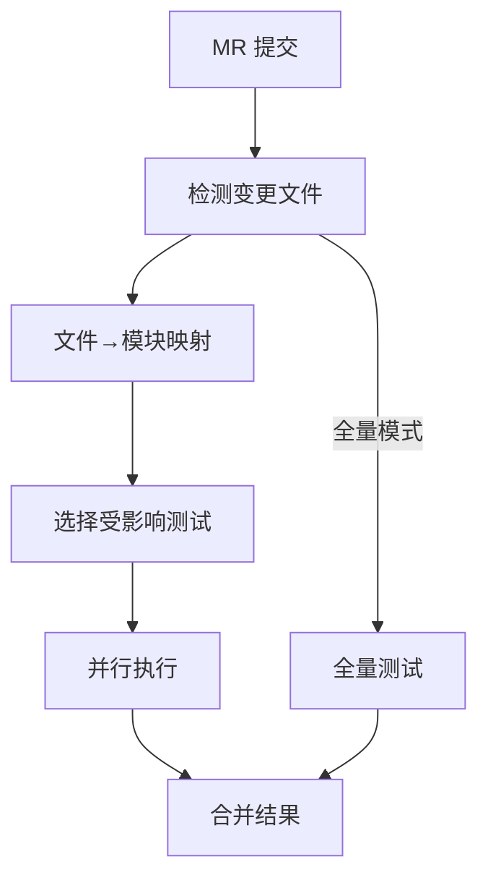

```yaml
# GitLab CI 增量测试配置
incremental-test:
  stage: test
  script:
    - |
      CHANGED_FILES=$(git diff --name-only origin/main)
      AFFECTED_MODULES=$(python scripts/detect_modules.py $CHANGED_FILES)
      for MODULE in $AFFECTED_MODULES; do
        pytest $MODULE/tests/ --junitxml=report-$MODULE.xml
      done
  artifacts:
    reports:
      junit: report-*.xml
```

## 三十、Test Sharding 分片执行

### 30.1 分片策略

| 策略 | 做法 | 优点 | 缺点 |
|------|------|------|------|
| 按测试文件 | 文件名 hash 分片 | 简单 | 负载不均 |
| 按测试标签 | 标记 `@shard(1/4)` | 精确 | 需要标注 |
| 按执行时间 | 历史耗时均衡分配 | 最优 | 需采集数据 |
| 按模块 | 模块级分片 | 天然隔离 | 粒度粗 |

### 30.2 GitHub Actions 分片实现

```yaml
# Test Sharding 矩阵
strategy:
  matrix:
    shard: [1, 2, 3, 4]
  fail-fast: false
steps:
  - name: Run shard ${{ matrix.shard }}/4
    run: |
      npx jest --shard=${{ matrix.shard }}/4 --reporters=default
```

## 三十一、制品晋级流程

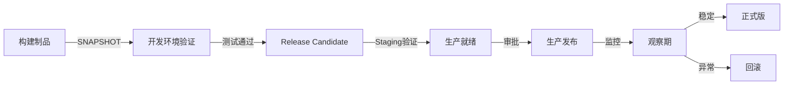

| 阶段 | 制品标签 | 验证环境 | 准入条件 |
|------|----------|----------|----------|
| SNAPSHOT | `1.0.0-SNAPSHOT` | Dev | 构建成功+单测通过 |
| RC | `1.0.0-rc.1` | Staging | 集成测试+安全扫描 |
| PROD | `1.0.0` | Production | 审批通过+冒烟测试 |
| GA | `1.0.0`（稳定版） | 全量 | 观察期无P0告警 |

## 三十二、环境一致性保障

### 32.1 一致性策略

| 层级 | 工具 | 目标 |
|------|------|------|
| OS | Docker/distroless | 操作系统一致 |
| 运行时 | asdf/nvm | 语言版本一致 |
| 依赖 | lock文件锁定 | 依赖版本一致 |
| 配置 | 环境变量模板化 | 配置结构一致 |
| 数据库 | Migration脚本 | Schema一致 |

```bash
# 环境一致性验证脚本
echo "=== 环境检查 ==="
node -v        # 确认 Node 版本
java -version  # 确认 JDK 版本
python --version
docker version
cat .tool-versions  # asdf 版本声明
```

## 三十三、流水线模块化设计

### 33.1 模块拆分原则

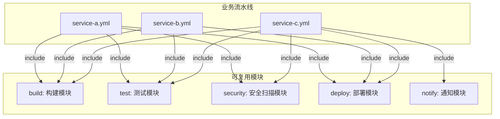

### 33.2 模块接口标准化

| 模块 | 输入参数 | 输出产物 | 退出码 |
|------|----------|----------|--------|
| build | `source_dir`, `language` | `image_tag`, `build_report.json` | 0=成功 |
| test | `image_tag`, `test_type` | `junit.xml`, `coverage.txt` | 0=通过 |
| security | `image_tag`, `severity` | `scan_report.json` | 1=阻断 |
| deploy | `image_tag`, `env` | `deploy_status`, `rollout_id` | 0=成功 |

## 三十四、流水线可观测性

### 34.1 关键度量维度

| 维度 | 指标 | 采集方式 |
|------|------|----------|
| 效率 | 构建时长、队列等待、MTTR | CI 平台 API |
| 质量 | Flaky率、覆盖率、安全扫描结果 | 测试报告聚合 |
| 稳定性 | 成功率、重试率、超时率 | 流水线日志分析 |
| 成本 | Agent使用时长、并行度、缓存命中 | 基础设施监控 |

```yaml
# 流水线指标采集（Prometheus Pushgateway）
- name: push metrics
  run: |
    cat <<EOF | curl --data-binary @- http://pushgateway:9091/metrics/job/ci_pipeline
    ci_pipeline_duration_seconds $BUILD_DURATION
    ci_pipeline_success_total{service="$SERVICE_NAME"} 1
    ci_test_coverage_ratio $COVERAGE
    EOF
```

## 与其他模块的关联

- [01-概述与核心概念](01-概述与核心概念.md)：CI/CD 基础概念总览。
- [03-构建与制品管理](03-构建与制品管理.md)：不可变制品、OCI/Helm 归档，本篇"不可变制品"原则落地点。
- [08-云原生CI-CD与GitOps工具.md](08-云原生CI-CD与GitOps工具.md)：Tekton/Flux 如何把本篇设计落地为 K8s CRD 流水线。
- [10-部署策略](10-部署策略.md)：流水线末端的渐进式发布（蓝绿/金丝雀）深入。
- [12-密钥与配置管理](12-环境配置与密钥管理.md)（计划篇）：密钥外置、Sealed Secrets / ESO，呼应反模式红线。
- [../大数据/02-技术体系与架构演进.md](../大数据/02-技术体系与架构演进.md) 与 [../大数据/12-数据治理与数据质量.md](../大数据/12-数据治理与数据质量.md)：数据 pipeline 的 DAG 与质量门禁类比。
- [../../云原生/K8S.md](../../云原生/K8S.md)：缓存在 K8s 节点/PV 上的实现、Secret 注入机制。

## 十四、参考

- 测试金字塔（Fowler）：https://martinfowler.com/bliki/TestPyramid.html
- Google SRE：CI/CD 与流水线可重现性：https://sre.google/sre-book/automation-at-google/
- GitLab CI 文档（cache / include / rules / matrix）：https://docs.gitlab.com/ee/ci/
- GitHub Actions 复用工作流（reusable workflows）：https://docs.github.com/en/actions
- Tekton Catalog（可复用 Task）：https://github.com/tektoncd/catalog
- Bazel 可重现构建 / Reproducible Builds 项目：https://reproducible-builds.org/
- 缓存与分布式构建（BuildKit / Bazel remote cache）：https://docs.docker.com/build/cache/ 、https://bazel.build/remote-caching
- Flaky 测试治理（Google 测试博客）：https://testing.googleblog.com/2016/05/flaky-tests-at-google-and-how-we.html
- 流水线即代码与质量门禁（CNCF CI/CD 实践）：https://github.com/cncf/tag-app-delivery
- 数据质量与治理（数据 pipeline 门禁类比）：https://github.com/apache/dolphinscheduler

## 十五、Golden Pipeline（流水线模板化）

把"组织最佳实践"固化成模板，团队只填参数即可获得标准流水线，避免千人千面：

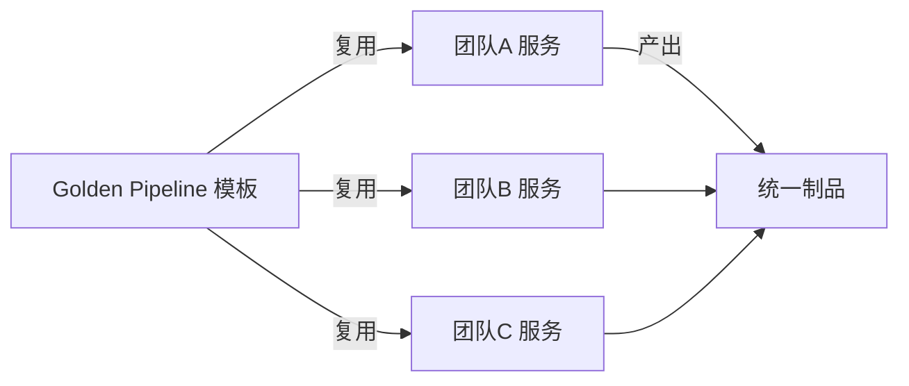

- **模板即代码**：Jenkins 共享库 / GitLab `include` 模板 / GitHub reusable workflow。
- **强制门禁**：模板内置单测覆盖率、SAST、SBOM、签名，团队不能绕过。
- **参数化**：`service-name`/`language`/`deploy-target` 由团队声明，骨架平台定。

## 十六、质量门与安全门（Gate）

| 门禁 | 触发点 | 拦截条件 | 工具 |
|------|--------|----------|------|
| 质量门 | 测试后 | 覆盖率 < 80% / 单测失败 | JaCoCo / coverage |
| 安全门 | 构建后 | SAST 高危 / 依赖 CVE | Semgrep / Trivy / Snyk |
| 供应链门 | 发布前 | 无 SBOM / 无签名 / 非可信源 | cosign / Syft |
| 合规门 | 部署前 | 未过审批 / 环境未授权 | OPA / 手动 |

```yaml
# 质量门示例（覆盖率不足即失败）
- name: coverage gate
  run: |
    COV=$(grep Total coverage.txt | awk '{print $4}' | tr -d '%')
    [ "$COV" -ge 80 ] || { echo "覆盖率 $COV% < 80%"; exit 1; }
```

## 十七、审批流（Approval）

生产发布需人工卡点，与自动化门禁互补：

- **GitLab**：`when: manual` + `allow_failure: false` + Protected Environment。
- **GitHub**：`environment: production` 配 reviewers；`concurrency` 防并发。
- **Jenkins**：`input` 步骤阻塞等人在控制台确认。

```groovy
// Jenkins input 审批
stage('Approval') {
    steps {
        input message: '确认发布生产？',
              ok: '发布',
              submitter: 'lead,manager'
    }
}
```

## 十八、跨团队协作模式

| 模式 | 做法 | 适用 |
|------|------|------|
| 平台团队提供模板 | 平台写 Golden Pipeline，业务方复用 | 中大型多团队 |
| 多项目流水线 | 上游发版触发下游（GitLab `trigger`/GitHub `workflow_run`） | 微服务协同 |
| 合同测试 | 上下游约定接口契约，CI 互验 | 强耦合服务 |
| 共享制品库晋级 | snapshot→rc→prod，跨团队共用同一可信源 | 多消费方 |

> 原则：**"谁构建谁负责"，但"平台定标准、业务填参数"**，用模板+门禁把协作成本降到最低。

## 十九、Pipeline as Code 模式深入

### 19.1 同仓 vs 异仓

| 模式 | 做法 | 优点 | 缺点 |
|------|------|------|------|
| 同仓（Mono-repo） | Jenkinsfile/.gitlab-ci.yml 与业务代码同仓 | 版本一致、变更可追溯 | 业务代码与 CI 耦合 |
| 异仓（Multi-repo） | Pipeline 定义存独立仓库 | CI 团队独立维护、多服务复用 | 版本对齐成本高 |
| 混合 | 业务仓引用平台模板库 | 兼得灵活与复用 | 需版本锁定机制 |

```yaml
# GitLab CI 混合模式示例
include:
  - project: 'platform/ci-templates'
    ref: 'v2.3.0'                    # 锁版本
    file: '/templates/build.yml'

build:
  extends: .build_template
  variables:
    SERVICE_NAME: "payment"
```

### 19.2 参数化与矩阵

```yaml
# GitHub Actions 矩阵构建
strategy:
  matrix:
    os: [ubuntu-latest, macos-latest]
    node: [18, 20, 22]
    exclude:
      - os: macos-latest
        node: 18                     # 排除特定组合
    include:
      - os: ubuntu-latest
        node: 22
        experimental: true           # 额外组合
  fail-fast: true
```

## 二十、Trunk-Based Development 与 CI/CD

### 20.1 核心原则

```
Trunk-Based Development（TBD）：
  所有开发者向主干（main/trunk）频繁提交（至少每天一次）
  短命分支（<1天）或直接提交主干
  用 Feature Flag 控制未完成功能的可见性

与 GitFlow 对比：
  GitFlow：长寿命分支（develop/release/feature），合并周期长
  TBD：主干为主，分支极短，CI 频繁
```

| 指标 | GitFlow | Trunk-Based |
|------|---------|-------------|
| 合并频率 | 每周/每版本 | 每天/多次 |
| 集成冲突 | 频繁（分支分叉久） | 少（频繁合并） |
| 发布节奏 | 按版本 | 持续 |
| Feature Flag | 不必须 | 必须 |
| CI 压力 | 合并时集中 | 均匀分布 |

> **选型口诀**：追求持续交付用 TBD + Feature Flag，版本发布节奏慢用 GitFlow。

## 二十一、蓝绿部署流水线设计

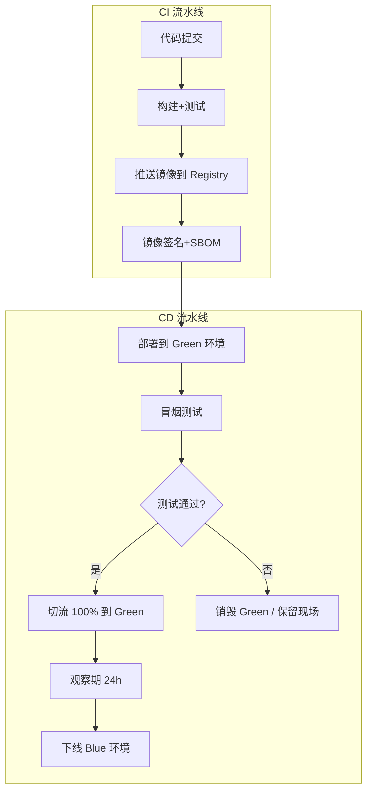

## 二十二、金丝雀发布流水线设计

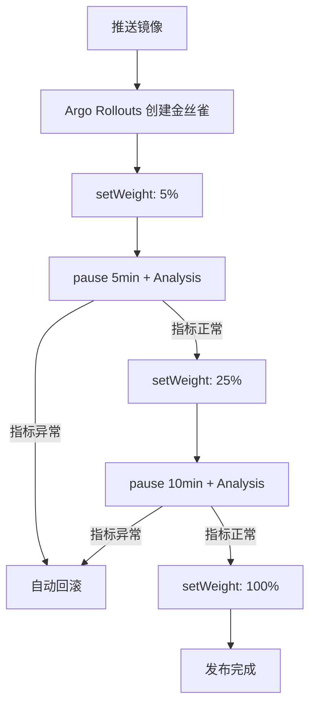

## 二十三、Feature Flag 集成模式

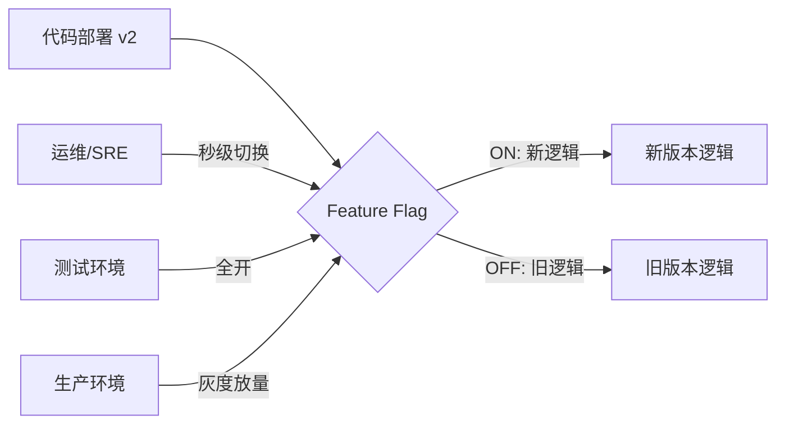

```yaml
# LaunchDarkly SDK 集成示例
import ldclient
ldclient = ldclient.init("sdk-key")
user = {"key": "user-123", "country": "CN"}
flag_value = ldclient.variation("new-checkout-flow", user, False)
if flag_value:
    new_checkout_logic()
else:
    old_checkout_logic()
```

## 二十四、流水线安全扫描集成

### 24.1 SAST/DAST/SCA 扫描层

| 扫描类型 | 时机 | 工具 | 输出 |
|----------|------|------|------|
| SAST（静态分析） | 代码提交后 | Semgrep/CodeQL/SonarQube | 漏洞+代码异味 |
| SCA（软件成分分析） | 依赖解析后 | Trivy/Snyk/OWASP | CVE+License |
| DAST（动态分析） | 部署预发后 | ZAP/Burp Suite | 运行时漏洞 |
| 密钥检测 | 代码提交前 | gitleaks/trufflehog | 硬编码密钥 |

```yaml
# GitHub Actions 安全扫描集成
jobs:
  security:
    runs-on: ubuntu-latest
    steps:
      - uses: actions/checkout@v4
      - name: SAST - Semgrep
        uses: semgrep/semgrep-action@v1
        with:
          config: auto
      - name: SCA - Trivy
        uses: aquasecurity/trivy-action@master
        with:
          scan-type: 'fs'
          severity: 'HIGH,CRITICAL'
          exit-code: '1'
      - name: Secret Detection - gitleaks
        uses: gitleaks/gitleaks-action@v2
```

### 24.2 扫描门禁策略

| 严重级别 | 处理 | 说明 |
|----------|------|------|
| CRITICAL | 阻断发布 | 必须修复 |
| HIGH | 阻断发布 | 必须修复或安全豁免 |
| MEDIUM | 警告 | 记录工单，限期修复 |
| LOW | 信息 | 知悉即可 |

## 二十五、流水线模板化设计

### 25.1 组织级模板架构

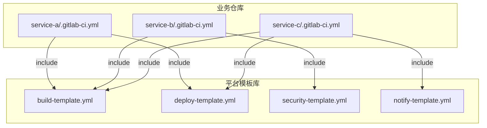

### 25.2 模板最佳实践

| 原则 | 做法 |
|------|------|
| 强制门禁 | 模板内置 SAST/SBOM/签名，团队不能绕过 |
| 参数化 | `service-name`/`language`/`deploy-target` 由团队声明 |
| 版本锁定 | 模板用 SemVer tag，禁止 `latest` |
| 向后兼容 | 模板变更需兼容旧版本使用者 |
| 文档化 | 每个模板参数附说明，新人可自助接入 |

## 二十六、流水线度量与优化

### 26.1 关键指标

| 指标 | 计算方式 | 目标 |
|------|----------|------|
| 构建时长 P50/P95 | 流水线执行时间分布 | P50 < 5min，P95 < 15min |
| 缓存命中率 | 命中次数/总构建次数 | > 80% |
| Flaky 率 | 不稳定测试数/总测试数 | < 1% |
| 排队等待时间 | 任务入队到开始执行 | < 2min |
| 成功率 | 成功次数/总执行次数 | > 95% |
| MTTR | 从失败到恢复的平均时间 | < 30min |

### 26.2 优化手段

| 瓶颈 | 优化 |
|------|------|
| 构建慢 | 分层缓存 + 并行阶段 + 增量构建 |
| 测试慢 | 测试分层 + 并行执行 + 只跑受影响用例 |
| 排队久 | 增加 Agent/动态扩缩 + 优先级队列 |
| Flaky 多 | 隔离区 + 根因修复 + 重试上限 |
| 门禁卡点 | 分层拦截（快检查前置，慢检查后置） |

## 二十七、跨团队协作模式深入

### 27.1 平台工程赋能

| 角色 | 职责 | 产出 |
|------|------|------|
| 平台团队 | 提供 CI/CD 基础设施 + 模板 | Golden Pipeline、CLI 工具 |
| 业务团队 | 使用模板 + 填参数 | 自己的流水线 |
| SRE | 监控流水线健康度 + 门禁策略 | DORA 指标、优化建议 |

### 27.2 多项目触发与级联

```yaml
# GitLab 上游发版触发下游
# downstream/.gitlab-ci.yml
trigger:
  project: platform/service-a
  branch: main
  strategy: depend

# GitHub workflow_run
on:
  workflow_run:
    workflows: ["Build Service A"]
    branches: [main]
```

## 二十八、审批流与并发控制

### 28.1 生产审批实现

```groovy
// Jenkins 审批
stage('Production Approval') {
    steps {
        input message: '确认发布到生产环境？',
              ok: '发布',
              submitter: 'release-team,admin',
              parameters: [
                string(name: 'RELEASE_NOTES', defaultValue: '', description: '发布说明')
              ]
    }
}

// 并发控制（防重复发布）
options {
    lock(resource: 'production-deploy', inversePrecedence: true)
}
```

### 28.2 审批最佳实践

| 原则 | 做法 |
|------|------|
| 最小权限 | 审批人限定为 release-team，非全员 |
| 超时自动取消 | `submitterTimeout` 防止审批无限等待 |
| 并发锁 | `lock()` 防止同时发布 |
| 审计追溯 | 审批记录保留到构建历史 |
| 自动化优先 | 非核心服务可配置自动审批（无风险变更） |

## 三十五、合并请求驱动 CI 模式（MR-based Pipeline）

### 35.1 MR 触发规则设计

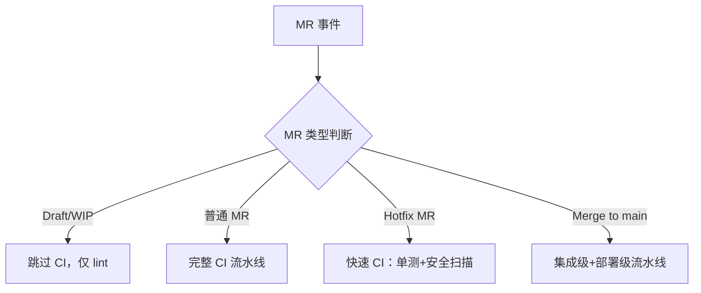

| MR 触发规则 | 配置方式 | 适用场景 |
|------------|---------|---------|
| Draft MR 跳过测试 | `rules: if: $CI_MERGE_REQUEST_draft == false` | 节省资源 |
| 仅改文档跳过构建 | `changes: [*.md, docs/**]` | 减少无效构建 |
| 目标分支过滤 | `rules: if: $CI_MERGE_REQUEST_TARGET_BRANCH_NAME == "main"` | 仅主干触发完整流水线 |
| 标签触发特定阶段 | `rules: if: $CI_MERGE_REQUEST_LABELS =~ /deploy-staging/` | 按需部署 |
| 并发控制 | `resource_group: $CI_MERGE_REQUEST_REF_NAME` | 避免同 MR 重复跑 |

```yaml
# GitLab CI：MR 触发规则示例
stages:
  - lint
  - test
  - build
  - security

unit-test:
  stage: test
  rules:
    - if: $CI_MERGE_REQUEST_draft == true
      when: never
    - if: $CI_MERGE_REQUEST_TARGET_BRANCH_NAME == "main"
      when: always
    - changes:
        - "**/*.java"
        - "pom.xml"
      when: on_success
  script:
    - mvn test

security-scan:
  stage: security
  rules:
    - if: $CI_MERGE_REQUEST_LABELS =~ /security-scan/
      when: always
    - if: $CI_COMMIT_BRANCH == "main"
      when: on_success
```

## 三十六、集成测试并行化（Test Sharding + Matrix）

### 36.1 分片策略对比

| 分片策略 | 做法 | 优点 | 缺点 |
|----------|------|------|------|
| 按测试文件 | 文件名 hash 分片 | 简单 | 负载不均 |
| 按测试标签 | 标记 `@shard(1/4)` | 精确 | 需要标注 |
| 按执行时间 | 历史耗时均衡分配 | 最优 | 需采集数据 |
| 按模块 | 模块级分片 | 天然隔离 | 粒度粗 |

```yaml
# GitHub Actions：测试分片 + Matrix
jobs:
  test:
    runs-on: ubuntu-latest
    strategy:
      fail-fast: false
      matrix:
        shard: [1, 2, 3, 4]
        java: [11, 17]
    steps:
      - uses: actions/checkout@v4
      - uses: actions/setup-java@v4
        with:
          java-version: ${{ matrix.java }}
      - name: Run shard ${{ matrix.shard }}/4
        run: |
          mvn test -Dtest.shard=${{ matrix.shard }}/4 \
            -DfailIfNoTests=false
```

## 三十七、制品晋级（Promotion）自动化工作流

### 37.1 制品晋级流程


| 阶段 | 制品标签 | 验证环境 | 准入条件 |
|------|----------|----------|----------|
| SNAPSHOT | `1.0.0-SNAPSHOT` | Dev | 构建成功+单测通过 |
| RC | `1.0.0-rc.1` | Staging | 集成测试+安全扫描 |
| PROD | `1.0.0` | Production | 审批通过+冒烟测试 |
| GA | `1.0.0` | 全量 | 观察期无 P0 告警 |

## 三十八、环境一致性验证（Snapshot vs Golden Image）

| 层级 | 工具 | 目标 | 验证方式 |
|------|------|------|---------|
| OS | Docker/distroless | 操作系统一致 | 镜像 digest 校验 |
| 运行时 | asdf/.tool-versions | 语言版本一致 | 版本声明文件校验 |
| 依赖 | lock 文件 | 依赖版本一致 | hash 校验 |
| 配置 | 环境变量模板化 | 配置结构一致 | schema 校验 |
| 数据库 | Migration 脚本 | Schema 一致 | 版本号校验 |

```bash
# 环境一致性验证脚本
echo "=== 环境一致性检查 ==="
node -v && java -version && python --version
cat .tool-versions
sha256sum package-lock.json
```

## 三十九、流水线模块化设计（Template + Extends）

```yaml
# templates/build.yml
.build_template:
  stage: build
  script:
    - docker build --cache-from $CACHE_REPO -t $IMAGE_TAG .
    - docker push $IMAGE_TAG

# 业务仓库 service-a/.gitlab-ci.yml
include:
  - project: 'platform/ci-templates'
    ref: 'v2.3.0'
    file: '/templates/build.yml'

build:
  extends: .build_template
  variables:
    IMAGE_NAME: "service-a"
```

## 四十、流水线性能分析（Stage 耗时分析/瓶颈定位）

| 指标 | 目标值 | 瓶颈信号 |
|------|--------|---------|
| 构建时长 P50/P95 | P50 < 5min, P95 < 15min | 长尾严重 |
| 缓存命中率 | > 80% | 低命中率 |
| 排队等待时间 | < 2min | runner 不足 |
| Flaky 率 | < 1% | 信号失真 |

| 瓶颈 | 优化手段 | 预期效果 |
|------|---------|---------|
| 构建慢 | BuildKit 层缓存 + 并行阶段 | -50% |
| 测试慢 | Test sharding + 只跑受影响用例 | -60% |
| 排队久 | 动态扩缩 runner + 优先级队列 | -70% |
| 门禁卡点 | 分层拦截（快检查前置，慢检查后置） | 反馈加速 |

```yaml
# 流水线性能指标采集
- name: push pipeline metrics
  run: |
    BUILD_DURATION=$(date +%s) - $BUILD_START
    cat <<EOF | curl --data-binary @- http://pushgateway:9091/metrics/job/ci_pipeline
    ci_pipeline_duration_seconds{service="$SERVICE",stage="build"} $BUILD_DURATION
    ci_pipeline_success_total{service="$SERVICE"} 1
    ci_cache_hit_ratio{service="$SERVICE"} $CACHE_HIT_RATIO
    EOF
```

## 质量门禁配置

```yaml
# 质量门禁配置示例
quality_gates:
  - name: 代码质量
    conditions:
      - metric: code_coverage
        threshold: 80%
        operator: ">="
      - metric: duplication
        threshold: 3%
        operator: "<="
      - metric: complexity
        threshold: 20
        operator: "<="
  
  - name: 安全检查
    conditions:
      - metric: critical_vulnerabilities
        threshold: 0
        operator: "=="
      - metric: high_vulnerabilities
        threshold: 5
        operator: "<="
  
  - name: 性能指标
    conditions:
      - metric: response_time_p99
        threshold: 500ms
        operator: "<="
      - metric: error_rate
        threshold: 0.1%
        operator: "<="
```

### 质量门禁分类

| 门禁类型 | 检查内容 | 阻断级别 | 执行时机 |
|----------|----------|----------|----------|
| 代码质量 | 覆盖率、重复率、复杂度 | CRITICAL | 每次提交 |
| 安全检查 | 漏洞扫描、密钥检测 | CRITICAL | 每次提交 |
| 性能指标 | 响应时间、错误率 | HIGH | 预发环境 |
| 合规检查 | 许可证、依赖版本 | MEDIUM | 每日构建 |

### 门禁执行流程

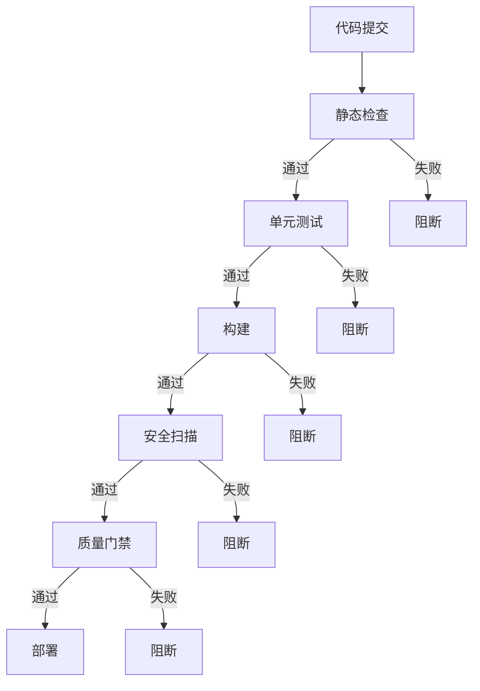

## 测试分层策略

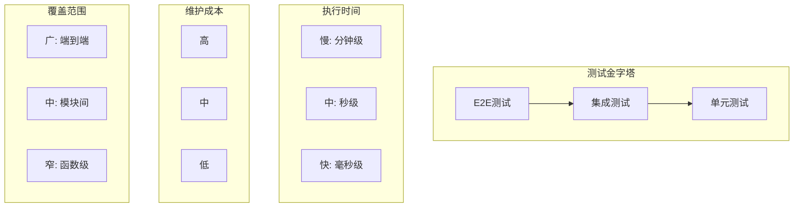

### 测试分层比例

| 测试层级 | 占比 | 执行时间 | 维护成本 | 覆盖重点 |
|----------|------|----------|----------|----------|
| 单元测试 | 70% | 毫秒级 | 低 | 函数逻辑 |
| 集成测试 | 20% | 秒级 | 中 | 模块交互 |
| E2E测试 | 10% | 分钟级 | 高 | 业务流程 |

### 测试策略配置

```yaml
# 测试策略配置
test_strategy:
  unit_tests:
    framework: JUnit5
    coverage_threshold: 80%
    parallel: true
    max_workers: 4
  
  integration_tests:
    framework: TestContainers
    database: PostgreSQL
    cache: Redis
    timeout: 30s
  
  e2e_tests:
    framework: Playwright
    browsers: [chromium, firefox]
    retries: 3
    timeout: 60s
```

## 环境一致性验证

```bash
# 环境一致性检查脚本
#!/bin/bash

# 检查运行时版本
echo "=== 运行时版本检查 ==="
java -version
node --version
python --version

# 检查依赖版本
echo "=== 依赖版本检查 ==="
mvn dependency:tree
npm ls

# 检查配置差异
echo "=== 配置差异检查 ==="
diff config/dev.yml config/prod.yml

# 检查环境变量
echo "=== 环境变量检查 ==="
env | grep -E "(DB_|REDIS_|KAFKA_)"
```

### 环境一致性对比

| 维度 | 开发环境 | 测试环境 | 生产环境 |
|------|----------|----------|----------|
| 运行时版本 | 相同 | 相同 | 相同 |
| 依赖版本 | 相同 | 相同 | 相同 |
| 配置差异 | 按需 | 模拟生产 | 生产配置 |
| 数据 | 本地测试 | 脱敏数据 | 真实数据 |
| 网络 | 单机 | 模拟隔离 | 真实网络 |

## 流水线即代码

```yaml
# Jenkinsfile 示例
pipeline {
    agent any
    
    parameters {
        choice(
            name: 'ENVIRONMENT',
            choices: ['dev', 'staging', 'prod'],
            description: '部署环境'
        )
        booleanParam(
            name: 'SKIP_TESTS',
            defaultValue: false,
            description: '跳过测试'
        )
    }
    
    stages {
        stage('Build') {
            steps {
                sh 'mvn clean package'
            }
        }
        
        stage('Test') {
            when {
                expression { !params.SKIP_TESTS }
            }
            steps {
                sh 'mvn test'
            }
        }
        
        stage('Deploy') {
            steps {
                script {
                    if (params.ENVIRONMENT == 'prod') {
                        input message: '确认部署到生产环境？'
                    }
                    sh "deploy.sh ${params.ENVIRONMENT}"
                }
            }
        }
    }
    
    post {
        always {
            cleanWs()
        }
        success {
            slackSend channel: '#deploys', message: '部署成功'
        }
        failure {
            slackSend channel: '#deploys', message: '部署失败'
        }
    }
}
```

### 流水线即代码优势

| 优势 | 说明 | 收益 |
|------|------|------|
| 版本控制 | 流水线配置可追溯 | 审计、回滚 |
| 代码审查 | PR审查流水线变更 | 质量保证 |
| 复用性 | 模板化、共享库 | 减少重复 |
| 一致性 | 环境无关的配置 | 可重现 |
| 自动化 | 自动执行流水线 | 效率提升 |

## 常见反模式

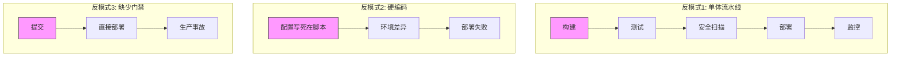

### 反模式与解决方案

| 反模式 | 问题 | 解决方案 |
|--------|------|----------|
| 单体流水线 | 一个阶段失败全部重来 | 分阶段、并行执行 |
| 硬编码配置 | 环境差异导致失败 | 配置外置、参数化 |
| 缺少门禁 | 质量问题流入生产 | 质量门禁拦截 |
| 手动部署 | 人为错误风险高 | 自动化部署 |
| 无回滚机制 | 问题无法快速恢复 | 蓝绿/金丝雀发布 |
| 缓存不当 | 构建时间过长 | 优化缓存策略 |

## 本篇补充 Checklist

- [ ] Golden Pipeline 模板化，团队只填参数，强制内置门禁。
- [ ] 质量门/安全门/供应链门/合规门分层拦截，不达标禁止晋级。
- [ ] 生产审批用 manual/input/environment reviewers，配并发锁。
- [ ] 跨团队靠模板+多项目流水线+合同测试+共享晋级，降协作成本。
- [ ] Trunk-Based Development + Feature Flag 实现持续交付。
- [ ] SAST/SCA/DAST 分层扫描，CRITICAL/HIGH 阻断发布。
- [ ] 流水线度量 DORA 指标 + 构建时长/缓存命中率/flaky 率。
- [ ] 审批人最小权限 + 超时取消 + 并发锁 + 审计追溯。
