# CI/CD · 10 部署策略

> 部署策略的本质，是在「速度」与「安全」之间找平衡：用可控的方式把新版本推到生产，让出问题时影响面最小、回退最快。没有策略的发布，就是拿生产环境赌运气。

本篇承接 [01-概述与核心概念](01-概述与核心概念.md) 与 [09-流水线设计模式与最佳实践](09-流水线设计模式与最佳实践.md)，把「如何把构建好的制品安全上线」这件事讲透；并与 [11-容器化与Kubernetes集成](11-容器化与Kubernetes集成.md) 在 K8s 落地层衔接；数据库的兼容迁移思路也与 [../大数据/10-资源调度：YARN与Kubernetes.md](../大数据/10-资源调度：YARN与Kubernetes.md) 中提到的资源与版本演化相呼应。

## 一、为什么需要部署策略

传统「停服发布」（`停机 → 部署 → 验证 → 开服`）在今天的 7×24 业务里已不可接受：用户在全球任何时区都可能在线，几分钟的停机就是真实资损与口碑损失。部署策略应运而生，解决三个核心诉求：

- **零停机（Zero Downtime）**：用户无感知地完成版本切换，请求不中断。
- **快速回滚（Fast Rollback）**：新版本出问题（错误率飙升、延迟劣化、逻辑 bug）时，能在秒级~分钟级把流量切回已知良好版本。
- **降低风险（Risk Reduction）**：不一次性把 100% 流量压到未经验证的新版本，而是用「小流量先行、指标护航、逐步放量」把爆炸半径压到最小。

> 口诀：发布不是「把新代码推上去」，而是「把风险一步步试探着放出去，随时能收得回」。

没有部署策略的代价（真实故障模式）：直接全量替换 → 新版本隐藏 bug 瞬间影响 100% 用户 → 回滚需要重新构建/重新部署 → 故障时长以分钟到小时计。部署策略把「回滚」从「重新来一遍」变成「切一刀流量」。

## 二、七种部署策略大表对比

| 策略 | 停机时间 | 回滚速度 | 资源占用 | 流量控制粒度 | 复杂度 | 典型适用场景 |
|------|---------|---------|---------|------------|--------|------------|
| 蓝绿 Blue-Green | 近零（一次性切流） | 极快（切回旧环境） | 高（双倍资源） | 粗（全量切） | 中 | 对回滚速度极敏感的核心服务 |
| 金丝雀 Canary | 零 | 快（停放量/切回） | 中（小比例叠加） | 细（1%/5%/10%…） | 中高 | 需要业务指标护航的渐进发布 |
| 滚动更新 Rolling | 零 | 中（依赖版本回退） | 低（仅小幅超出） | 粗（按批次 Pod） | 低 | K8s 无状态服务默认姿势 |
| 灰度/分批 Staged | 零 | 中 | 低~中 | 中（按用户群/批次） | 中 | 按地域/白名单分批放量 |
| A-B 测试 | 零 | 不适用（并行对照） | 高 | 中（按分桶） | 中 | 业务对比实验，非安全发布 |
| 影子 Shadow/Mirror | 零（不影响真实用户） | 不涉及 | 高（复制流量） | 无（流量不返回） | 高 | 新版本压测/正确性验证 |
| 重建 Recreate | 有（先删后建） | 中 | 低 | 无 | 最低 | 无法新旧共存的离线/独占任务 |

> 口诀：没有「最好」的策略，只有「最合适」的策略——先定 SLO 与回滚预算，再选策略。

补充几个关键区分：
- **金丝雀 vs A-B 测试**：金丝雀是「安全发布」（验证新版本是否健康，不健康就停），A-B 是「业务对比」（同一功能两个变体比转化率，两个都是「好」的）。两者流量切分技术相似，目的完全不同。
- **灰度 vs 金丝雀**：灰度常按「用户分群」（白名单、地域、tenant）放量，金丝雀按「流量比例」放量；灰度更偏运营节奏，金丝雀更偏技术指标护航。

## 三、蓝绿部署（Blue-Green）

### 3.1 原理
准备两套完全一样的生产环境：**蓝（Blue，当前线上稳定版）** 与 **绿（Green，待发布新版本）**。新版本先部署到绿环境并完成全部验证（冒烟、集成、压测），然后通过负载均衡器 / 网关的「一次切换」把 100% 流量从蓝切到绿。

```mermaid
flowchart LR
    title 蓝绿部署切流图
    U[用户/客户端] --> LB[负载均衡 / 网关]
    LB -->|切流前 100%| B[Blue 稳定环境 v1]
    LB -.->|切流后 100%| G[Green 新环境 v2]
    G -. 验证通过前不接流 .-> MON[冒烟/集成/压测]
    B -. 切流后仍保留, 用于即时回滚 .-> COLD[(冷备)]
```

### 3.2 回滚
蓝绿最诱人之处在于回滚极简：**把流量从绿切回蓝即可**，无需重新部署、无需重新构建。旧环境原地保留，直到新版本观察期（如 24h）无异常才下线。

### 3.3 致命约束：数据库迁移要兼容
两套环境共享同一数据库时，「切流」只解决应用层，解决不了数据层。新版本若改了表结构，必须保证**旧版本（蓝）仍可读写**——这要求数据库迁移遵循「向后兼容」（见第八节）。否则切到绿后数据库 schema 已变，一旦回滚到蓝会直接报错。

> 口诀：蓝绿切的是「流量」，不是「数据库」；数据库不兼容，蓝绿回滚就是空谈。

⚠️ **生产踩坑**
- **双倍资源成本**：绿环境要与蓝等规格常驻，机器成本 ×2；很多团队为省钱只给绿环境「缩容版」，结果切流后容量不足被打挂。
- **状态不一致**：有状态服务（本地缓存、长连接、WebSocket）切流瞬间会断连，需要在客户端做重连或走共享存储。
- **数据库不兼容导致无法回滚**：最经典的蓝绿翻车——新版本 DDL 删了旧列，切流后发现问题回滚，旧代码写旧列直接抛异常。
- **切流瞬间缓存/队列积压**：若蓝环境已写入消息队列，绿环境消费者可能与蓝环境消息格式不兼容。

## 四、金丝雀部署（Canary）

### 4.1 原理
金丝雀（取名自煤矿里的金丝雀——用脆弱生命探测瓦斯）的核心是**先放极少量真实流量到新版本，观察关键指标（错误率、延迟、业务指标），确认健康后再逐步放大比例**，直至 100%。

```mermaid
flowchart LR
    title 金丝雀逐步放量图
    U[用户流量] --> R[路由器/网关/Service Mesh]
    R -->|95%| S1[稳定版 v1 x95实例]
    R -->|5%| S2[金丝雀 v2 x5实例]
    S2 --> M[监控: 错误率/延迟/订单量]
    M -->|指标正常| R2[放大到 25%]
    R2 --> R3[50%]
    R3 --> R4[100% 全量]
    M -->|指标异常| RB[自动回滚/暂停放量]
```

### 4.2 与监控/告警联动：自动晋升与回滚
成熟的金丝雀不是「手动调权重」，而是**用分析（Analysis）把指标当成晋级门槛**：每个放量台阶都伴随一段观察窗口（如 5 分钟），在此期间持续查询 Prometheus / Datadog / 自定义 webhook，满足 `successCondition`（如成功率 ≥ 99.5%）才自动进下一档；连续失败达到 `failureLimit` 则自动回滚。

```yaml
# Argo Rollouts 金丝雀：指标护航的自动晋升（详见 11 篇）
apiVersion: argoproj.io/v1alpha1
kind: Rollout
metadata:
  name: api-server
spec:
  replicas: 10
  strategy:
    canary:
      steps:
        - setWeight: 5
        - pause: { duration: 5m }      # 观察窗口
        - analysis:
            templates:
              - templateName: success-rate
        - setWeight: 25
        - pause: { duration: 10m }
        - setWeight: 100
```

### 4.3 金丝雀 vs A-B 测试（再强调）
- 金丝雀：**新 vs 旧**，目标「验证新版本是否安全」，不健康就停。
- A-B：**变体A vs 变体B**，目标「哪个转化更好」，两者都安全，只是业务取舍。
- 技术上都用流量分桶，但**金丝雀的对照组是「上一个稳定版」且可随时回滚**，A-B 的对照组是「另一个实验变体」且通常要跑满一个实验周期。

> 口诀：金丝雀问「新版本会不会挂」，A-B 问「哪个版本更赚钱」。

⚠️ **生产踩坑**
- **金丝雀没监控等于裸奔**：只切 5% 流量却不挂监控/分析，等于把 5% 用户当小白鼠还不知道他们死了——必须「切流 + 分析」成对出现。
- **指标选错**：只看「Pod 健康」不够（容器活着 ≠ 业务健康），要看成功率、P99 延迟、业务漏斗（如下单转化）。
- **放量过快**：5%→100% 一步跨，前面的小流量失去意义；台阶要留足够观察窗口。
- **有状态/缓存一致性**：金丝雀与稳定版若读写同一缓存 key 但结构不同，会出现诡异串味，需要特性开关或双写兼容。

## 五、滚动更新（Rolling Update）

### 5.1 原理
逐批替换旧实例：先起一批新 Pod，就绪后杀一批旧 Pod，循环往复直到全部为新版本。K8s Deployment 默认即此策略，靠 `maxSurge`（最多超出期望副本数）与 `maxUnavailable`（最多不可用副本数）控制节奏。

```mermaid
flowchart LR
    title 滚动更新批次图
    subgraph 批次1[批次1]
      N1[新 Pod x1]
      O1[旧 Pod x2]
    end
    subgraph 批次2[批次2]
      N2[新 Pod x2]
      O2[旧 Pod x1]
    end
    subgraph 批次3[批次3]
      N3[新 Pod x3 - 全量]
    end
    批次1 --> 批次2 --> 批次3
```

### 5.2 参数含义（K8s 官方定义）
- `maxSurge`：更新期间可超出期望副本数的最大 Pod 数（绝对数或百分比，默认 25%，向上取整）。决定「能多快地起新 Pod」。
- `maxUnavailable`：更新期间可不可用的最大 Pod 数（默认 25%，向下取整）。决定「能多快地杀旧 Pod」。
- 经典零停机配置：`maxSurge: 1`（或 25%）、`maxUnavailable: 0`——保证「先起新、就绪后再杀旧」，容量永不掉。

> 口诀：滚动更新是「慢工出细活」——用时间换资源，用探针（见 11 篇）保证每一批都健康再进下一批。

⚠️ **生产踩坑**
- **默认 25%/25% 在副本数很少时 math 会取整到 0**：如 `replicas: 2`，25% 向下取整为 0 个不可用、向上取整为 1 个可超出，实际变成「起 1 新、杀 1 旧」的串行，扩容慢；大流量服务建议显式设 `maxUnavailable: 0`。
- **滚动更新无流量切分**：它按「Pod 批次」而非「百分比流量」推进，无法做「5% 用户」级别灰度，需要金丝雀能力时请用 Argo Rollouts（11 篇）。
- **新旧版本短暂共存要求兼容**：滚动期间新旧 Pod 同时接流，共享 DB/缓存，必须向后兼容。

## 六、特性开关（Feature Flag）

### 6.1 与部署解耦的发布控制
特性开关把「代码上线」与「功能对用户提供」拆成两件事：**代码始终部署，但功能是否对用户可见由开关控制**。这样即使全量部署了新代码，也可在运行时瞬间关闭问题功能（kill switch），无需回滚发布。

```mermaid
flowchart LR
    title 特性开关解耦部署与发布
    DEPLOY[部署新代码 v2] --> FLAG{开关 useNewCheckout}
    FLAG -->|ON| NEW[新结算逻辑]
    FLAG -->|OFF| OLD[旧结算逻辑]
    OPS[运维/SRE] -->|秒级切换| FLAG
```

### 6.2 主流工具对比（2025）

| 工具 | 性质 | 关键能力 | 适用 |
|------|------|---------|------|
| LaunchDarkly | 商业 SaaS（有免费层） | 30+ SDK、实验、 Targeting、SOC2 | 企业级、省运维 |
| Unleash | 开源 + 托管 | 25+ SDK、渐进发布、审计、RBAC | 自托管、合规 |
| Flagsmith | 开源 + SaaS | 远程配置、A-B、OpenFeature | 开源/混合 |
| Flagd | CNCF/OpenFeature 参考实现 | 标准合规、OFREP | 与 OpenFeature 生态 |
| Flipt | 开源（Git 存 flag） | 百分比/分群、无数据库 | 轻量、GitOps 风 |
| 自研 | 自建 | 完全可控 | 特殊需求、但易成债 |

> 口诀：特性开关让「回滚」从「重发代码」降级为「拨一个开关」——但开关用完不删，就是技术债。

⚠️ **生产踩坑**
- **长期堆积成技术债**：开关只加不开（删），代码里 `if(flagA){...}else{...}` 越积越多，最终没人敢动。必须有「开关生命周期」：上线即排期下线。
- **开关求值性能**：每次请求远程拉取开关配置会引入延迟，应用应本地缓存 + 订阅变更（如 OpenFeature 的本地求值）。
- **开关与发布割裂导致状态混乱**：开了开关但对应代码路径有 bug，关开关成了唯一止血手段，却没人验证过关开关后的旧路径是否还正常。

## 七、影子/镜像流量（Shadow / Mirror）

把生产真实流量**复制一份**发给新版本，但新版本的响应**不返回给用户**，只用于验证其正确性、性能与稳定性。这是「零风险验证」：真实流量、真实数据，但用户完全无感。

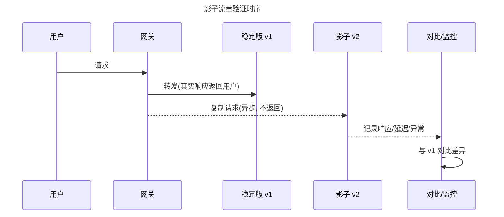

> 口诀：影子流量是「让新版本在影子下经历真实风暴」，用户却永远看不见它。

⚠️ **生产踩坑**
- **副作用污染**：影子版若真去写数据库/发消息/调用第三方支付，会造成双倍写入。影子版必须「只读」或对写操作打标/隔离。
- **资源翻倍**：复制流量意味着新版本要扛一份额外负载，需单独容量评估。

## 八、回滚策略

### 8.1 快速回滚的两种形态
- **切流式回滚**（蓝绿/金丝雀/网关权重）：改路由把流量指回稳定版，秒级生效，无需重建。
- **版本式回滚**（滚动更新/K8s）：`kubectl rollout undo` 把 ReplicaSet 切回上一修订版；Argo Rollouts 失败时回退到「stable」ReplicaSet。

### 8.2 数据库兼容：expand-contract（并行变更）迁移模式
应用回滚容易，**数据库回滚难**（已写入的新数据不能丢）。解决之道是「expand-contract / parallel change」：把一次破坏性 schema 变更拆成「扩展 → 迁移 → 收缩」三步，每步都向后兼容，任何时刻旧代码都能跑。

```mermaid
stateDiagram-v2
    title expand-contract 迁移状态机（以重命名列为例）
    [*] --> Expand: 部署1 加新列 username(可空)
    Expand --> Migrate: 部署2 双写 + 回填旧数据
    Migrate --> Contract: 部署3 代码只读新列
    Contract --> [*]: 部署4 删除旧列 user_name
    Migrate --> Expand: 任一中间步出问题, 旧代码仍可运行(回滚应用即可)
    Contract --> Migrate: 发现新列异常, 切回读旧列
```

具体步骤（以 `users.name → users.username` 为例）：
1. **Expand（扩展）**：`ALTER TABLE users ADD COLUMN username VARCHAR(255);`（只加不改，旧代码无感）。
2. **Migrate（迁移）**：应用改为**双写**（同时写 name 与 username），后台批量回填存量数据；读逻辑用新列、缺失时 fallback 旧列。
3. **Contract（收缩）**：确认所有代码只读新列后，停止写旧列，最终 `DROP COLUMN name`。

> 口诀：数据库迁移「只加不改、双写过渡、最后才删」——让任何一步都能被应用回滚兜底。

### 8.3 向前兼容与向后兼容
- **向后兼容（Backward Compatibility）**：新版本应用能读旧版本写的数据 / 旧 schema。部署新应用前必须保证它兼容现有数据——这是滚动更新、蓝绿的前提。
- **向前兼容（Forward Compatibility）**：旧版本应用能容忍新版本写的数据 / 新 schema（如新增的可空列）。这是「先部署应用、后改数据」或「回滚后旧代码仍能跑」的前提。
- 安全顺序：**先部署向前兼容的新应用（旧数据可跑）→ 再扩 schema → 最后切流量**，保证任何单点失败都可独立回退。

⚠️ **生产踩坑**
- **数据库迁移导致无法回滚**：最常见的「伪回滚」——应用回滚了，但 DDL 已删除列，旧代码写库报错。务必用 expand-contract，且「删列」放到多个发布之后。
- **回滚时才发现数据格式不兼容**：新版本写了旧版本不认识的枚举/字段，回滚后旧代码解析失败。发布前要做「向前兼容」测试。
- **大表 DDL 锁表**：`ALTER TABLE` 大表会拿 ACCESS EXCLUSIVE 锁阻塞读写，应用 `CONCURRENTLY`（PG）/ `gh-ost`、`pt-online-schema-change`（MySQL）做在线变更。

## 九、流量治理与渐进式交付（Progressive Delivery）

### 9.1 按权重切流的载体
- **网关 / Ingress**：如 NGINX Ingress、Traefik，按服务权重分流（能力有限，多为粗粒度）。
- **Service Mesh**：Istio / Linkerd 通过 sidecar 在 L7 按百分比精确切流，并自带 mTLS、指标。
- **专用控制器**：Argo Rollouts / Flagger 在 K8s 上直接操作 Service/Ingress/VirtualService 权重（详见 [11-容器化与Kubernetes集成](11-容器化与Kubernetes集成.md)）。

### 9.2 渐进式交付 = 金丝雀 + 特性开关 + 自动分析
渐进式交付是把「金丝雀放量」「特性开关」「指标自动分析」「自动晋升/回滚」工程化地编织在一起的理念。代表实现：
- **Argo Rollouts**：K8s 原生 CRD，金丝雀/蓝绿 + AnalysisTemplate 指标门槛。
- **Flagger**：基于 Flux/GitOps，用指标自动驱动金丝雀晋级。
- 与 [08-云原生CI-CD与GitOps工具](08-云原生CI-CD与GitOps工具.md) 衔接：GitOps 控制器（Argo CD）负责把期望状态同步到集群，Argo Rollouts 负责在集群内把「一次发布」安全地推进。

```mermaid
flowchart LR
    title 渐进式交付闭环
    GIT[Git 提交新镜像] --> CD[Argo CD 同步期望状态]
    CD --> RO[Argo Rollouts 启动金丝雀]
    RO --> ANA[AnalysisTemplate 查 Prometheus]
    ANA -->|达标| PROMOTE[晋级下一档权重]
    ANA -->|不达标| ABORT[自动 abort 回退 stable]
    PROMOTE -->|100%| DONE[发布完成]
```

> 口诀：渐进式交付不是「一个工具」，而是「金丝雀 + 开关 + 指标 + 自动化」的组合拳。

### 9.3 选型速查决策流
不确定用哪种策略时，按「能否新旧共存 → 是否要指标护航 → 资源是否宽裕」逐层判断：

```mermaid
flowchart TD
    title 部署策略选型决策流
    Q1{新旧版本能否短期共存?}
    Q1 -->|否| REC1[Recreate / 维护窗口]
    Q1 -->|能| Q2{需要按流量比例指标护航?}
    Q2 -->|是| Q3{资源是否宽裕?}
    Q3 -->|宽裕+要求极速回滚| REC2[蓝绿 Blue-Green]
    Q3 -->|一般| REC3[金丝雀 Canary + 分析]
    Q2 -->|否, 只要平滑替换| REC4[滚动更新 Rolling]
    Q1 -->|能 但要按用户群放量| REC5[灰度/分批 Staged]
    Q1 -->|要验证新版本正确性| REC6[影子 Shadow]
    Q1 -->|要比业务变体转化| REC7[A-B 测试]
```

> 口诀：先问「能不能共存」与「要不要指标」——这两个答案基本锁定策略。

⚠️ **生产踩坑**
- **蓝绿双倍资源成本**（见第三节）在渐进式交付里依然存在（蓝绿模式）。
- **金丝雀没监控等于裸奔**（见第四节）。
- **特性开关长期堆积成技术债**（见第六节）。
- **回滚时才发现数据格式不兼容**（见第八节）。
- **网关切流与网格切流冲突**：同时用 Ingress 权重和 Istio VirtualService 权重会造成规则打架，要明确「谁是唯一权威」。

## 蓝绿部署数据库兼容性：Expand-Contract 模式

### 为什么要用 Expand-Contract

蓝绿部署切的是流量，不是数据库。当新版本需要修改数据库 Schema 时，必须保证**旧版本（蓝）仍可读写**——这就是 Expand-Contract（扩展-收缩）模式的核心思想。它把一次破坏性 Schema 变更拆成「扩展 → 迁移 → 收缩」三步，每步都向后兼容。

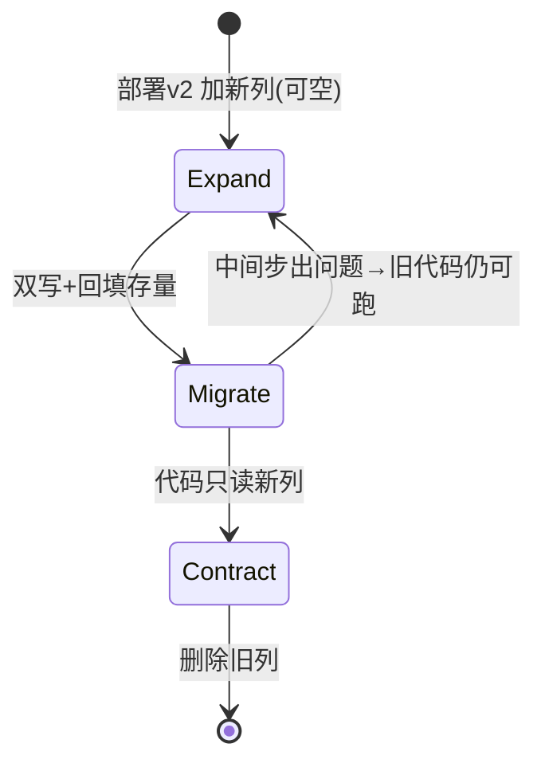

### 蓝绿部署 Schema 兼容矩阵

| Schema 状态 | 蓝(v1)兼容 | 绿(v2)兼容 | 能否切流 | 能否回滚 |
|-------------|-----------|-----------|---------|---------|
| 原始 Schema | ✅ | ✅ | ✅ | ✅ |
| Expand（加列） | ✅ | ✅ | ✅ | ✅ |
| Migrate（双写） | ✅ | ✅ | ✅ | ✅ |
| Contract（删列） | ❌ | ✅ | ⚠️ 切流后不可回滚 | ❌ |

### 常见 DDL 操作的 Expand-Contract 映射

| 变更类型 | Expand 步骤 | Migrate 步骤 | Contract 步骤 | 最小发布周期 |
|----------|-------------|-------------|---------------|-------------|
| 加非空列 | 加可空列 | 双写+回填 | 分批补 NOT NULL | 2 个版本 |
| 重命名列 | 加新列 | 双写+回填 | 切读新列→停写旧列→DROP | 3 个版本 |
| 删列 | 先停代码引用 | 确认无访问 | N+1 版本后 DROP | 2+ 个版本 |
| 拆表 | 建新表+双写 | 存量迁移 | 旧表归档 | 3 个版本 |
| 改类型 | 加新列(目标类型) | 双写+类型转换 | 切读新列→DROP 旧列 | 3 个版本 |

```sql
-- Expand: 加可空列，旧代码完全无感
ALTER TABLE orders ADD COLUMN amount_cents BIGINT;
-- 双写: 应用同时写新旧列
UPDATE orders SET amount_cents = amount * 100 WHERE amount_cents IS NULL;
-- Contract: 确认无旧代码后才删
ALTER TABLE orders DROP COLUMN amount;
```

> 口诀：**"先扩展后收缩，绝不一次破坏性迁移"**；破坏性变更分两次发布，中间保持兼容。

## 金丝雀自动分析：成功率与延迟基线偏离判定

### 基线偏离判定原理

金丝雀分析不是简单看「绝对阈值」，而是与**基线（Baseline）**对比，判断新版本是否偏离正常范围：

```text
基线偏离判定模型：
  Baseline = 稳定版 v1 在相同时间段的指标值
  Canary = 金丝雀 v2 的实时指标值

  偏离度 = |Canary - Baseline| / Baseline

  判定规则：
    偏离度 < 5%  → 正常，继续放量
    偏离度 5~15% → 警告，延长观察窗口
    偏离度 > 15% → 异常，自动回滚
```

| 指标 | 基线采集方式 | 偏离阈值 | 判定逻辑 |
|------|-------------|---------|---------|
| 成功率 | v1 近 30 分钟 P50 | ↓ 2% 即异常 | 绝对下限 + 相对偏离 |
| P99 延迟 | v1 近 30 分钟 P99 | ↑ 20% 即异常 | 基线偏离 + 绝对上限 |
| 错误率 | v1 近 30 分钟均值 | ↑ 50% 即异常 | 相对偏离 |
| QPS | v1 近 30 分钟均值 | ↓ 30% 即异常 | 流量丢失检测 |

### 自动分析误判防护策略

| 误判场景 | 原因 | 防护策略 |
|----------|------|---------|
| 小流量统计噪声 | 5% 流量下样本不足 | 设最小请求量门槛（<100 req/min 不计入） |
| 时间窗口偏差 | 早晚高峰延迟自然波动 | 观察窗覆盖完整周期，或与同时段基线对比 |
| 缓存冷启动 | 新实例缓存命中率低 | minReadySeconds + 预热完成后再启动分析 |
| 上游依赖抖动 | 依赖方故障连坐新版本 | 分析条件改为「新旧差值」而非绝对阈值 |
| 指标采集延迟 | Prometheus 15s 间隔 | 分析间隔 ≥ 2× 采集间隔 |

## 滚动发布 + PDB 配合

### PDB 解决什么问题

滚动更新杀旧 Pod 时，若叠加节点故障驱逐，可用副本可能跌破底线。PodDisruptionBudget 声明「自愿驱逐时最少保留多少可用副本」，为发布兜底。

```yaml
apiVersion: policy/v1
kind: PodDisruptionBudget
metadata:
  name: api-server-pdb
spec:
  minAvailable: 2          # 或 maxUnavailable: 1
  selector:
    matchLabels:
      app: api-server
```

### maxUnavailable 与 PDB 冲突矩阵

| Deployment 设置 | PDB 设置 | 结果 |
|-----------------|----------|------|
| maxUnavailable=1 | minAvailable=全副本数 | 滚动更新卡死 ⚠️ |
| maxSurge=1, maxUnavailable=0 | minAvailable=N-1 | 正常 ✅ |
| replicas=2 | minAvailable=2 | 更新与驱逐互斥 ⚠️ |

> 经验法则：PDB 的 minAvailable ≤ replicas - 1，与 `maxUnavailable: 0` 组合。

### 发布期间容量保障流程

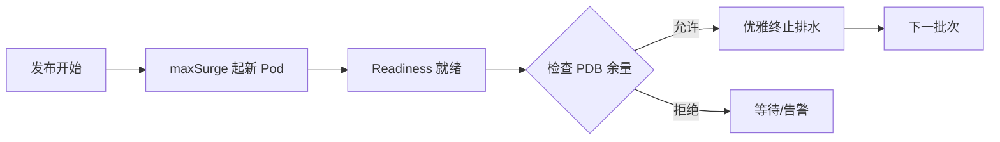

## 影子流量录制回放（Traffic Replay）

### 录制回放 vs 实时镜像

| 维度 | 实时镜像 Mirror | 录制回放 Replay |
|------|----------------|----------------|
| 流量来源 | 实时复制线上请求 | 录制后离线回放 |
| 工具 | Istio mirror / Nginx mirror | GoReplay / tcpcopy |
| 适用场景 | 验证新版正确性 | 压测/回归/容量评估 |
| 副作用风险 | 高（实时影响下游） | 低（离线可控） |
| 资源消耗 | 需额外线上资源 | 独立环境回放 |

### GoReplay 录制回放实战

```bash
# 录制生产流量（旁路抓包，不影响线上）
gor --input-raw :8080 \
    --output-file production-$(date +%Y%m%d).gor \
    --http-disallow-url '/admin' \
    --http-disallow-url '/health'

# 回放：2 倍速压测影子环境
gor --input-file 'production-20250101.gor|200%' \
    --output-http 'http://shadow-api:8080' \
    --output-http-stats \
    --middleware './add_shadow_header.sh'
```

### 录制回放工程约束

| 约束 | 说明 | 对策 |
|------|------|------|
| 写副作用 | 回放请求可能写数据库/发消息 | 影子库隔离 + 写操作 mock |
| 数据污染 | 回放数据混入生产 | 独立 schema + 标记头隔离 |
| 第三方调用 | 支付/短信等外部 API | stub/mock 替代 |
| 指标混淆 | 回放流量污染 SLO 统计 | 独立 label + 采集隔离 |

## 发布窗口与冻结期管理制度

### 发布窗口分类

```text
发布窗口分类：
  常规窗口：工作日 10:00-16:00（避开午休/晚高峰）
  紧急窗口：7×24（P0/P1 故障修复）
  冻结窗口：大促/财报季/重大活动前 N 天~后 N 天
```

### 冻结期管理制度

| 阶段 | 时间 | 措施 |
|------|------|------|
| 冻结前 7 天 | 准备期 | 冻结范围通知、待发布功能排期 |
| 冻结前 3 天 | 预冻结 | 非关键变更冻结、hotfix 需双人审批 |
| 冻结期 | 执行期 | 仅 P0 安全补丁可走绿色通道 |
| 冻结后 1 天 | 解冻期 | 积压变更批量发布、观察期延长 |
| 冻结后 7 天 | 复盘期 | 冻结期间问题复盘、改进措施落地 |

### 冻结期工程化落地

```yaml
# Argo CD sync window 实现冻结
apiVersion: argoproj.io/v1alpha1
kind: AppProject
spec:
  syncWindows:
    - kind: deny
      schedule: "0 0 10 11 *"    # 示例：11 月 10 日起
      duration: 72h
      applications: ["production-*"]
      manualSync: true            # 例外需人工确认放行
```

> 口诀：冻结期管住的是「变更量」，兜底靠「特性开关 + hotfix 绿色通道」，而不是彻底停止响应。

## 回滚演练制度化

### 为什么要专门演练回滚

真实故障中最贵的浪费是「回滚路径从未走过」：权限没配、镜像被清理、DB 已 contract 无法回退——只有演练才能暴露。

### 季度回滚演练脚本

```text
场景一：应用回滚
  ① 注入必然失败的版本（启动即 5xx）
  ② 计时：告警触发 → 流量恢复的 MTTR
  ③ 检查：rollout undo 成功 / 镜像还在仓库 / 配置兼容

场景二：数据库前滚式恢复
  ① 模拟「contract 执行第二步后发现 bug」
  ② 验证补偿脚本能把数据修回旧结构可用状态

场景三：配置/开关回滚
  ① 全局关闭新功能开关
  ② 验证旧路径功能完好（防开关腐化）
```

### 演练产出 Checklist

- [ ] 回滚命令写入值班手册并实际验证过权限
- [ ] 最近 N 个版本镜像仍在制品库
- [ ] DB 迁移处于 expand 阶段或备有补偿脚本
- [ ] 特性开关可在 60s 内全局关闭
- [ ] 演练 MTTR 达标（目标 < 5 分钟）

### 演练频率与责任

| 演练类型 | 频率 | 责任人 | 产出 |
|----------|------|--------|------|
| 桌面演练 | 每月 | SRE 团队 | 检查清单更新 |
| 实操演练 | 每季 | SRE + 开发 | MTTR 报告 |
| 全链路演练 | 每半年 | 全组织 | 故障恢复能力评估 |

## 部署策略选型决策树

### 决策维度与权重

| 维度 | 权重 | 评估标准 |
|------|------|---------|
| 回滚速度 | 30% | 秒级=5分，分钟级=3分，小时级=1分 |
| 资源成本 | 25% | 双倍=1分，1.5倍=3分，无额外=5分 |
| 流量控制粒度 | 20% | 1%=5分，10%=3分，全量=1分 |
| 实现复杂度 | 15% | 低=5分，中=3分，高=1分 |
| 数据库兼容要求 | 10% | 无要求=5分，需兼容=3分，需迁移=1分 |

### 策略组合推荐

| 业务场景 | 推荐策略 | 理由 |
|----------|---------|------|
| 核心交易服务 | 金丝雀 + 特性开关 | 渐进放量 + 秒级回滚 |
| 静态资源/CDN | 蓝绿 + 特性开关 | 切流极速 + 零停机 |
| 批处理任务 | 滚动更新 | 资源敏感 + 无实时流量 |
| 数据库密集型 | 金丝雀 + Expand-Contract | 兼容窗口长 + Schema 演进 |
| 低频内部工具 | 滚动更新 | 简单 + 资源省 |
| 大促/活动页 | 蓝绿 + 冻结期 | 极速回滚 + 变更管控 |

> 口诀：没有万能策略，只有「业务场景 + 资源约束 + 回滚预算」三维匹配的最优解。

## 与其他模块的关联

- [01-概述与核心概念](01-概述与核心概念.md)：部署策略是 CI/CD「CD（持续部署）」环节的落子，需先理解流水线全景。
- [09-流水线设计模式与最佳实践](09-流水线设计模式与最佳实践.md)：部署策略常作为流水线最后一个 stage，与「环境晋升」「自动化门禁」配合。
- [11-容器化与Kubernetes集成](11-容器化与Kubernetes集成.md)：本文所有策略在 K8s 上的具体落地（Deployment 滚动、Argo Rollouts 金丝雀）。
- [08-云原生CI-CD与GitOps工具](08-云原生CI-CD与GitOps工具.md)：GitOps 与渐进式交付的协同，Argo CD 管期望状态、Rollouts 管发布过程。
- [../../云原生/K8S.md](../../云原生/K8S.md)：探针（readiness/liveness）、Service、Ingress、VirtualService 是切流与接流的底层机制。
- [../大数据/10-资源调度：YARN与Kubernetes.md](../大数据/10-资源调度：YARN与Kubernetes.md)：数据库迁移的兼容原则与资源调度中的版本共存思想一脉相承。

## 参考

- Kubernetes 官方文档 — Deployment 滚动更新策略（maxSurge/maxUnavailable）: https://kubernetes.io/docs/reference/kubernetes-api/workload-resources/deployment-v1/
- Argo Rollouts 官方文档 — Architecture / Getting Started / Analysis: https://argoproj.github.io/argo-rollouts/architecture/ ｜ https://argoproj.github.io/argo-rollouts/getting-started/
- Argo Rollouts 金丝雀与指标分析实践（2025）: https://geekoncloud.com/blog/zero-downtime-kubernetes-deployments-argo-rollouts ｜ https://www.techsimplified.info/argo-rollouts-progressive-delivery-kubernetes
- Expand-Contract / Parallel Change 数据库迁移模式（2025）: https://engineering.zooz.com/@jasminfluri/expand-and-contract-method-for-database-changes-414d236f236f ｜ https://www.stew.so/blog/database-migration-steps-zero-downtime ｜ https://aidev.fit/en/tech/database-migration-strategies.html
- 特性开关工具对比（2025）: LaunchDarkly https://launchdarkly.com/blog/best-free-feature-flag-services ｜ ConfigCat 替代清单 https://configcat.com/blog/top-eight-launchdarkly-alternatives/ ｜ OpenFeature（CNCF 孵化） https://blog.devcycle.com/comparing-top-openfeature-providers/
- 零停机滚动更新最佳实践（探针 + 优雅终止）: https://devops.aibit.im/en/article/how-to-perform-zero-downtime-kubernetes-rolling-updates

## 九、流量调度细节：谁在切流

| 切流层 | 机制 | 精度 | 适用 |
|--------|------|------|------|
| Ingress | 权重 annotation | 粗（整服务） | 简单蓝绿 |
| Service Mesh | VirtualService 权重 | 细（按 header/用户） | 金丝雀按用户群 |
| 网关 | 路由规则 | 中 | API 网关层 |
| DNS | 权重解析 | 最粗 | 跨地域切换 |

> ⚠️ **唯一权威**：同时用 Ingress 权重与 Istio 权重会规则打架，必须明确"谁是唯一权威"（通常网格优先）。

## 十、回滚 SOP（标准作业程序）

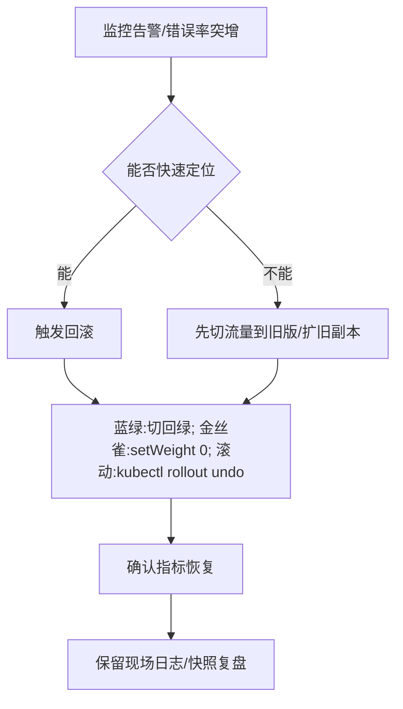

- **蓝绿回滚**：切回旧版本负载均衡目标（秒级，无重建）。
- **金丝雀回滚**：`setWeight: 0` 或 `kubectl argo rollouts abort`，流量归旧。
- **滚动回滚**：`kubectl rollout undo deploy/app`，ReplicaSet 回上一版。
- **原则**：回滚必须演练；DB 变更若已提交则需配套向后兼容或补偿迁移。

## 十一、数据库与部署解耦

部署新版本 != 改数据库。用**扩展-收缩（Expand-Contract）/ 并行变更**让新旧代码与新旧 schema 共存：


| 步骤 | 操作 | 风险 |
|------|------|------|
| Expand | 加新列、新表，应用双写新旧 | 低 |
| Migrate | 回填历史数据 | 中 |
| Coexist | 新代码读新写新，旧代码仍可用 | 低 |
| Contract | 确认无旧代码后删旧结构 | 高（需确认） |

> 口诀：**"先扩展后收缩，绝不一次破坏性迁移"**；破坏性变更分两次发布，中间保持兼容。

## 十二、特性开关与影子流量补充

- **特性开关回滚**：关开关即回滚功能，不重新部署（最快逃生舱）。
- **影子（Shadow）**：把生产流量复制一份打到新版本，不被用户感知，用于验证正确性/容量，不影响真实响应。

```yaml
# Argo Rollouts 影子（mirror）流量
strategy:
  canary:
    trafficRouting:
      istio:
        mirror: true          # 复制流量到金丝雀，不返回给用户
```

## 十三、Istio 金丝雀发布实战

### 13.1 VirtualService 权重切流

```yaml
apiVersion: networking.istio.io/v1beta1
kind: VirtualService
metadata:
  name: api-server
spec:
  hosts:
    - api-server
  http:
    - route:
        - destination:
            host: api-server
            subset: stable
          weight: 90
        - destination:
            host: api-server
            subset: canary
          weight: 10
---
apiVersion: networking.istio.io/v1beta1
kind: DestinationRule
metadata:
  name: api-server
spec:
  host: api-server
  subsets:
    - name: stable
      labels:
        version: v1
    - name: canary
      labels:
        version: v2
```

### 13.2 Istio 金丝雀晋升流程

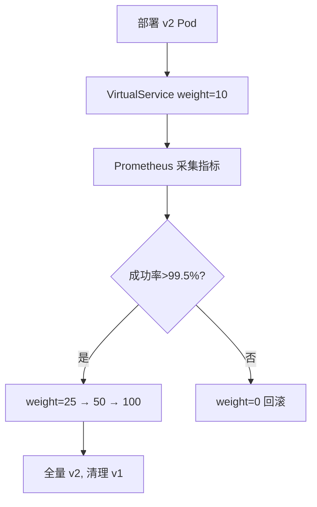

## 十四、滚动更新参数深度解析

### 14.1 maxSurge 与 maxUnavailable 组合效果

| maxSurge | maxUnavailable | 行为 | 零停机？ |
|----------|----------------|------|----------|
| 25% | 0 | 先起新再杀旧，容量不降 | ✅ |
| 25% | 25% | 新旧同时替换，容量波动 | ✅ |
| 1 | 0 | 一次起一个新 Pod，就绪后再杀旧 | ✅（慢） |
| 0 | 1 | 先杀旧再起新（有停机风险） | ❌ |

### 14.2 Rolling Update 最佳配置

```yaml
apiVersion: apps/v1
kind: Deployment
spec:
  replicas: 6
  strategy:
    type: RollingUpdate
    rollingUpdate:
      maxSurge: 1
      maxUnavailable: 0      # 零停机关键
  minReadySeconds: 10         # Pod 就绪后观察 10s 再继续
  progressDeadlineSeconds: 600  # 部署超时告警
```

## 十五、影子部署工程实践

### 15.1 Istio Mirror 流量配置

```yaml
apiVersion: networking.istio.io/v1beta1
kind: VirtualService
metadata:
  name: api-server-mirror
spec:
  hosts:
    - api-server
  http:
    - route:
        - destination:
            host: api-server
            subset: stable
      mirror:
        host: api-server
        subset: canary          # 复制流量到金丝雀
      mirrorPercentage:
        value: 100              # 100% 复制
```

### 15.2 影子部署约束

| 约束 | 说明 | 对策 |
|------|------|------|
| 副作用 | 影子版写 DB/发 MQ 导致双写 | 影子版只读，或写操作标记隔离 |
| 资源翻倍 | 复制流量需额外计算资源 | 独立影子集群，与生产隔离 |
| 结果对比 | 需对比 v1/v2 响应差异 | 影子版上报结果到对比平台 |
| 超时 | 影子版慢不应影响主路径 | 异步复制 + 超时隔离 |

## 十六、A/B 测试部署设计

### 16.1 流量分桶策略

```
A/B 测试 ≠ 金丝雀：
  金丝雀：新 vs 旧，验证安全性
  A/B：变体A vs 变体B，比较转化率

分桶方式：
  ① 用户 ID hash % 100 → 固定分桶（同一用户始终看同一变体）
  ② 按地域/设备/租户分桶
  ③ 按时间段交替（较少用）
```

### 16.2 A/B 测试流水线

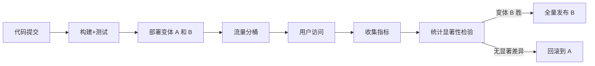

## 十七、特性开关部署模式

### 17.1 开关与发布解耦

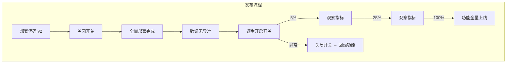

### 17.2 开关类型对比

| 类型 | 说明 | 生命周期 |
|------|------|----------|
| Release Flag | 控制功能可见性 | 短（发布后删除） |
| Ops Flag | 控制运行时行为（降级/限流） | 长期 |
| Experiment Flag | A/B 测试分桶 | 实验周期 |
| Permission Flag | 权限控制（Beta/白名单） | 长期 |

> **口诀**：Release Flag 发布后必须删，否则代码越积越多；Ops Flag 可长期保留但需文档化。

## 十八、部署回滚 SOP 详细版

### 18.1 各策略回滚操作

| 策略 | 回滚命令 | 生效时间 | 数据层处理 |
|------|----------|----------|------------|
| 蓝绿 | 切回 Blue 负载均衡 | 秒级 | 需 DB 兼容 |
| 金丝雀 | `kubectl argo rollouts abort` | 秒级 | 需 DB 兼容 |
| 滚动 | `kubectl rollout undo deploy/app` | 分钟级 | 需 DB 兼容 |
| 特性开关 | 关闭开关 | 秒级 | 无需 |
| 重建 | 重新部署旧版本 | 分钟级 | 需 DB 兼容 |

### 18.2 回滚检查清单

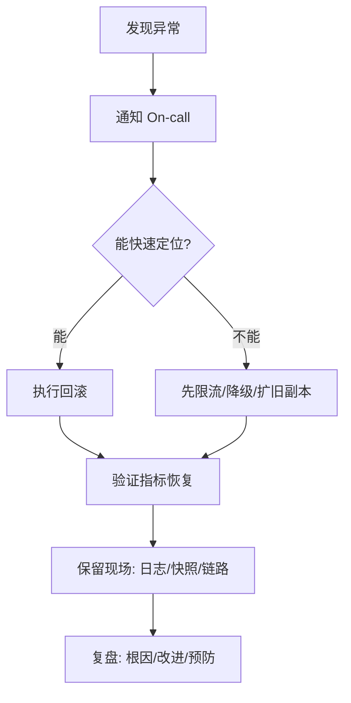

## 十九、部署自动化与 GitOps 集成

### 19.1 GitOps 部署流程

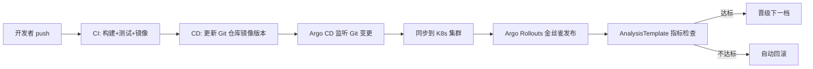

### 19.2 部署自动化成熟度

| 级别 | 能力 | 实践 |
|------|------|------|
| L1 | 手动部署 | kubectl apply / UI 点击 |
| L2 | CI/CD 自动 | 流水线自动构建+部署 |
| L3 | GitOps 声明 | Git 为唯一真相源，Argo CD 同步 |
| L4 | 渐进式交付 | 金丝雀+指标分析+自动晋升/回滚 |
| L5 | 混沌验证 | 部署注入故障，验证韧性 |

## 二十、部署策略选型决策树

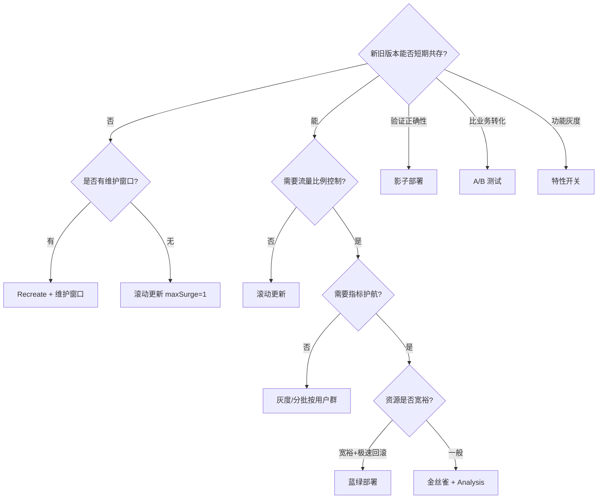

## 二十一、金丝雀指标自动分析深化（把「看指标」变成「算指标」）

### 21.1 手动看盘 vs 自动分析的差距

| 维度 | 手动看 Grafana | 自动分析（Analysis） |
|------|---------------|---------------------|
| 响应速度 | 人肉盯屏，分钟级滞后 | 观察窗口内分钟级采样判定 |
| 判定标准 | 凭经验「看起来正常」 | successCondition 明确量化 |
| 夜间发布 | 无人值守不可行 | 可全自动晋升/回滚 |
| 抖动处理 | 主观犹豫 | failureLimit / delay 控制毛刺 |

### 21.2 指标选型三层模型

| 层次 | 指标 | 数据来源 | 用法 |
|------|------|---------|------|
| 服务质量层 | HTTP 5xx 率、P99 延迟 | Prometheus / Istio | 晋级硬门槛 |
| 业务健康层 | 下单成功率、支付回调延迟 | 业务埋点 / 数仓 | 核心业务必配 |
| 资源信号层 | CPU 节流、GC 停顿、OOMKill | cAdvisor / JMX | 辅助诊断，不作单独门槛 |

> 口诀：系统指标决定「能不能放量」，业务指标决定「该不该放量」——只看系统指标的发布是半盲飞。

### 21.3 Argo Rollouts AnalysisTemplate 实战

```yaml
apiVersion: argoproj.io/v1alpha1
kind: AnalysisTemplate
metadata:
  name: canary-gate
spec:
  args:
    - name: service-name
  metrics:
    - name: success-rate
      interval: 1m
      count: 5                 # 连续采 5 个点
      successCondition: result[0] >= 0.995
      failureLimit: 2           # 允许 2 次失败，第 3 次判负回滚
      provider:
        prometheus:
          address: http://prometheus:9090
          query: |
            sum(rate(http_requests_total{service="{{args.service-name}}",code!~"5.."}[2m]))
            /
            sum(rate(http_requests_total{service="{{args.service-name}}"}[2m]))
    - name: p99-latency-ms
      interval: 1m
      count: 5
      successCondition: result[0] <= 300
      provider:
        prometheus:
          address: http://prometheus:9090
          query: |
            histogram_quantile(0.99, sum by (le) (
              rate(http_request_duration_seconds_bucket{service="{{args.service-name}}"}[2m]))) * 1000
```

### 21.4 自动分析误判的四个经典原因

| 误判原因 | 现象 | 对策 |
|----------|------|------|
| 小流量统计噪声 | 5% 台阶下错误率抖动剧烈 | 设最小样本门槛（<100 req/min 不计入判定） |
| 周期性流量波动 | 早晚高峰延迟天然上涨 | 观察窗覆盖完整周期，或与基线做相对比较 |
| 缓存冷启动 | 金丝雀实例命中率低导致 P99 虚高 | minReadySeconds + 预热完成后再启动分析 |
| 上游依赖抖动 | 依赖方故障连坐新版本 | 分析条件改为「新旧差值」而非绝对阈值 |

## 二十二、Expand-Contract：零停机发布的数据库前提

| 策略 | 新旧共存时长 | 对数据库的要求 |
|------|-------------|----------------|
| 滚动更新 | 分钟级 | 新旧代码同时读写同一 schema |
| 金丝雀 | 小时~天级 | 共存更久，兼容窗口更大 |
| 蓝绿 | 切流后旧版仍需可回滚 | 回滚后旧代码必须能跑在新 schema 上 |

任何零停机发布都默认「schema 向后兼容」——破坏性 DDL（DROP/RENAME/改类型）直接让回滚失效，expand-contract 是前置条件而非可选优化。

### 常见 DDL 的映射表

| 变更类型 | Expand | Migrate | Contract |
|----------|--------|---------|----------|
| 加非空列 | 加可空列 | 双写 + 回填 | 分多次发布补 NOT NULL |
| 重命名列 | 加新列 | 双写 + 回填 | 读切新列 → 停写旧列 → DROP |
| 删列 | 先停读写引用 | 确认无代码访问 | N+1 个版本后才 DROP |
| 拆表 | 建新表 + 双写 | 存量批量迁移 | 旧表转只读归档 |

```text
大表在线 DDL：MySQL 用 gh-ost（binlog 模式）/ pt-osc；PG 用 CREATE INDEX CONCURRENTLY。
原则：DDL 与应用发布分属流水线两个独立 stage，低峰期执行。
```

## 二十三、PDB 与滚动发布的配合

### 23.1 PDB 解决什么问题

滚动更新杀旧 Pod 时，若叠加节点故障驱逐，可用副本可能跌破底线。PodDisruptionBudget 声明「自愿驱逐时最少保留多少可用副本」，为发布兜底。

```yaml
apiVersion: policy/v1
kind: PodDisruptionBudget
metadata:
  name: api-server-pdb
spec:
  minAvailable: 2          # 或 maxUnavailable: 1
  selector:
    matchLabels:
      app: api-server
```

### 23.2 maxUnavailable 与 PDB 的冲突矩阵

| Deployment 设置 | PDB 设置 | 结果 |
|-----------------|----------|------|
| maxUnavailable=1 | minAvailable=全副本数 | 滚动更新卡死（杀旧 Pod 被 PDB 拒绝）⚠️ |
| maxSurge=1, maxUnavailable=0 | minAvailable=N-1 | 正常：新 Pod Ready 后才杀旧 ✅ |
| replicas=2 | minAvailable=2 | 更新与驱逐互斥，发布永久阻塞 ⚠️ |

> 经验法则：PDB 的 minAvailable ≤ replicas - 1，与 `maxUnavailable: 0` 组合；replicas < 3 的服务别指望 PDB 提供有效保障。

### 23.3 发布期间的容量联动

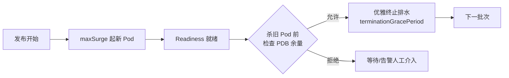

## 二十四、影子流量回放工程化

### 24.1 「镜像」与「录制回放」两条路线

| 路线 | 原理 | 工具 | 适用 |
|------|------|------|------|
| 流量镜像 Mirror | 实时复制线上请求到影子版 | Istio mirror / Nginx mirror | 验证新版正确性 |
| 录制回放 Replay | 录生产流量后定时/加倍回放 | GoReplay、tcpcopy | 压测、回归、容量评估 |

### 24.2 GoReplay 回放示例

```bash
# 生产网关抓包录制（旁路，不影响线上）
gor --input-raw :8080 --output-file requests.gor --http-disallow-url '/admin'

# 影子环境按 2 倍速回放压测
gor --input-file 'requests.gor|200%' \
    --output-http 'http://shadow-api:8080' \
    --output-http-stats \
    --middleware './mark_shadow.sh'    # 给请求打 X-Shadow 标记头
```

### 24.3 影子回放的隔离红线

| 风险点 | 红线 |
|--------|------|
| 写副作用 | 影子请求带标记头，下游写路径 mock 或落影子库 |
| 数据污染 | 影子库独立 schema，禁与生产共享表 |
| 第三方调用 | 支付/短信等外部调用一律 stub |
| 指标混淆 | 影子流量打独立 label，避免污染 SLO 统计 |

## 二十五、发布冻结期（Change Freeze）

### 25.1 定义与典型时段

冻结期 = 禁止常规生产变更的时间窗口：大促（双11/黑五）、财报季、重大活动。目的不是「不出问题」，而是「出问题时排除变量、缩短定位链路」。

### 25.2 冻结期例外通道

| 类型 | 处理方式 |
|------|----------|
| 安全补丁（CVE/P0） | 绿色通道：安全负责人审批 + 精简流水线 |
| 热修复 hotfix | 双人审批 + 发布后 30 分钟观察 + 回滚预案就绪 |
| 配置/开关类 | 允许（不动二进制），记录变更清单 |
| 常规需求 | 排队至解冻后首个发布窗口 |

### 25.3 冻结的工程化落地

```yaml
# Argo CD sync window 实现冻结
apiVersion: argoproj.io/v1alpha1
kind: AppProject
spec:
  syncWindows:
    - kind: deny
      schedule: "0 0 10 11 *"    # 示例：11 月 10 日起
      duration: 72h
      applications: ["production-*"]
      manualSync: true            # 例外需人工确认放行
```

> 口诀：冻结期管住的是「变更量」，兜底靠「特性开关 + hotfix 绿色通道」，而不是彻底停止响应。

## 二十六、回滚演练（Rollback GameDay）

### 26.1 为什么要专门演练回滚

真实故障中最贵的浪费是「回滚路径从未走过」：权限没配、镜像被清理、DB 已 contract 无法回退——只有演练才能暴露。

### 26.2 季度回滚演练脚本

```text
场景一：应用回滚
  ① 注入必然失败的版本（启动即 5xx）
  ② 计时：告警触发 → 流量恢复的 MTTR
  ③ 检查：rollout undo 成功 / 镜像还在仓库 / 配置兼容

场景二：数据库前滚式恢复
  ① 模拟「contract 执行第二步后发现 bug」
  ② 验证补偿脚本能把数据修回旧结构可用状态

场景三：配置/开关回滚
  ① 全局关闭新功能开关
  ② 验证旧路径功能完好（防开关腐化）
```

### 26.3 演练产出 Checklist

- [ ] 回滚命令写入值班手册并实际验证过权限；最近 N 个版本镜像仍在制品库；
- [ ] DB 迁移处于 expand 阶段或备有补偿脚本；
- [ ] 特性开关可在 60s 内全局关闭；演练 MTTR 达标（目标 < 5 分钟）。

## 二十七、蓝绿部署数据库兼容性前提（Expand-Contract 模式深化）

### 27.1 蓝绿部署与数据库 Schema 兼容矩阵

蓝绿部署切的是流量不是数据库，因此数据库 Schema 必须在任一时刻对两个版本的应用都兼容：

| Schema 状态 | 蓝(v1)兼容？ | 绿(v2)兼容？ | 能否切流？ | 能否回滚？ |
|-------------|-------------|-------------|-----------|-----------|
| 原始 Schema | ✅ | ✅（v2 向后兼容） | ✅ | ✅ |
| Expand（加列） | ✅ | ✅（v2 写新列） | ✅ | ✅ |
| Migrate（双写） | ✅ | ✅ | ✅ | ✅ |
| Contract（删列） | ❌（v1 读旧列报错） | ✅ | ⚠️ 切流后不可回滚 | ❌ |

> 口诀：蓝绿部署的数据库前提是「Expand 阶段可切流，Contract 阶段不可回滚」——破坏性 DDL 放到最后一步，且需等旧版本完全下线。

### 27.2 Expand-Contract 三阶段流水线集成

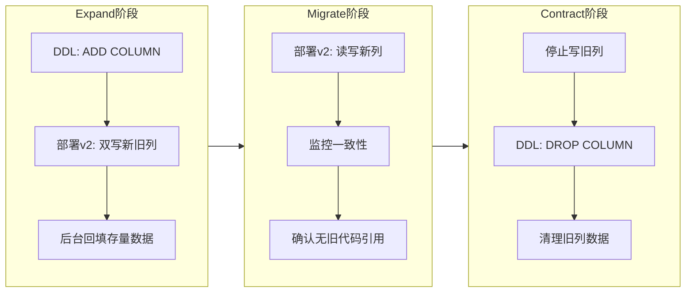

```yaml
# 流水线中集成 Expand-Contract 阶段
stages:
  - expand_ddl:
      script:
        - psql -c "ALTER TABLE orders ADD COLUMN amount_cents BIGINT;"
        - echo "Expand DDL 执行完成，旧代码不受影响"
  - deploy_v2_dual_write:
      script:
        - helm upgrade --set image.tag=$SHA --set dualWrite=true ./chart
  - verify_consistency:
      script:
        - python scripts/verify_column_consistency.py --table orders
  - contract_ddl:
      when: manual
      script:
        - psql -c "ALTER TABLE orders DROP COLUMN amount;"
```

### 27.3 常见 Schema 变更的 Expand-Contract 映射

| 变更类型 | Expand 步骤 | Migrate 步骤 | Contract 步骤 | 最小发布周期 |
|----------|-------------|-------------|---------------|-------------|
| 加非空列 | 加可空列 | 双写+回填 | 分批补 NOT NULL | 2 个版本 |
| 重命名列 | 加新列 | 双写+回填 | 切读新列→停写旧列→DROP | 3 个版本 |
| 删列 | 先停代码引用 | 确认无访问 | N+1 版本后 DROP | 2+ 个版本 |
| 拆表 | 建新表+双写 | 存量迁移 | 旧表归档 | 3 个版本 |
| 改类型 | 加新列(目标类型) | 双写+类型转换 | 切读新列→DROP 旧列 | 3 个版本 |

> 口诀：任何破坏性 Schema 变更至少拆成 2 个发布周期，中间保持新旧代码双向兼容。

## 二十八、金丝雀发布自动分析（成功率与延迟基线偏离判定）

### 28.1 基线偏离判定原理

金丝雀分析不是简单地看「绝对阈值」，而是与**基线（Baseline）**对比，判断新版本是否偏离正常范围：

```text
基线偏离判定模型：
  Baseline = 稳定版 v1 在相同时间段的指标值
  Canary = 金丝雀 v2 的实时指标值

  偏离度 = |Canary - Baseline| / Baseline

  判定规则：
    偏离度 < 5%  → 正常，继续放量
    偏离度 5~15% → 警告，延长观察窗口
    偏离度 > 15% → 异常，自动回滚
```

| 指标 | 基线采集方式 | 偏离阈值 | 判定逻辑 |
|------|-------------|---------|---------|
| 成功率 | v1 近 30 分钟 P50 | ↓ 2% 即异常 | 绝对下限 + 相对偏离 |
| P99 延迟 | v1 近 30 分钟 P99 | ↑ 20% 即异常 | 基线偏离 + 绝对上限 |
| 错误率 | v1 近 30 分钟均值 | ↑ 50% 即异常 | 相对偏离 |
| QPS | v1 近 30 分钟均值 | ↓ 30% 即异常 | 流量丢失检测 |

### 28.2 Argo Rollouts 基线偏离分析模板

```yaml
apiVersion: argoproj.io/v1alpha1
kind: AnalysisTemplate
metadata:
  name: canary-baseline-deviation
spec:
  args:
    - name: canary-service
    - name: stable-service
  metrics:
    - name: success-rate-deviation
      interval: 1m
      count: 5
      successCondition: |
        result[0] >= 0.98 &&
        (result[0] - result[1]) / result[1] > -0.02
      provider:
        prometheus:
          address: http://prometheus:9090
          query: |
            # result[0] = canary 成功率
            # result[1] = baseline 成功率
            label_join(
              sum(rate(http_requests_total{service="{{args.canary-service}}",code!~"5.."}[2m])) by (job)
              /
              sum(rate(http_requests_total{service="{{args.canary-service}}"}[2m])) by (job)
            , "_canary", "job", "_")
            /
            label_join(
              sum(rate(http_requests_total{service="{{args.stable-service}}",code!~"5.."}[2m])) by (job)
              /
              sum(rate(http_requests_total{service="{{args.stable-service}}"}[2m])) by (job)
            , "_baseline", "job", "_")
```

### 28.3 自动分析误判防护

| 误判场景 | 原因 | 防护策略 |
|----------|------|---------|
| 小流量统计噪声 | 5% 流量下样本不足 | 设最小请求量门槛（<100 req/min 不计入） |
| 时间窗口偏差 | 早晚高峰延迟自然波动 | 观察窗覆盖完整周期，或与同时段基线对比 |
| 缓存冷启动 | 新实例缓存命中率低 | minReadySeconds + 预热完成后再启动分析 |
| 上游依赖抖动 | 依赖方故障连坐新版本 | 分析条件改为「新旧差值」而非绝对阈值 |
| 指标采集延迟 | Prometheus 15s 间隔 | 分析间隔 ≥ 2× 采集间隔 |

## 二十九、滚动发布与 PDB 配合避免服务中断

### 29.1 PDB 与滚动更新的协同

PodDisruptionBudget（PDB）确保滚动更新杀旧 Pod 时可用副本不低于阈值：

```yaml
apiVersion: policy/v1
kind: PodDisruptionBudget
metadata:
  name: api-server-pdb
spec:
  minAvailable: 2
  selector:
    matchLabels:
      app: api-server
```

### 29.2 maxUnavailable 与 PDB 冲突矩阵

| Deployment maxUnavailable | PDB minAvailable | replicas | 结果 |
|--------------------------|-----------------|----------|------|
| 0 | 2 | 4 | ✅ 正常：先起新再杀旧 |
| 1 | 3 | 4 | ⚠️ 风险：新 Pod 起不来时可能阻塞 |
| 25% | 全副本数 | 4 | ❌ 死锁：杀旧被 PDB 拒绝 |
| 0 | 0 | 2 | ✅ 但无 PDB 保护 |

> 口诀：PDB 的 minAvailable ≤ replicas - maxUnavailable - 1，否则发布与驱逐会死锁。

### 29.3 发布期间的容量保障流程

```mermaid
flowchart TB
    A[发布开始] --> B{当前可用副本 ≥ minAvailable?}
    B -->|是| C[maxSurge 起新 Pod]
    B -->|否| D[等待 Pod 就绪/告警]
    C --> E[Readiness 通过]
    E --> F{杀旧 Pod 前检查 PDB}
    F -->|允许| G[优雅终止 terminationGracePeriod]
    F -->|拒绝| H[等待/告警人工介入]
    G --> I[下一批次]
    I --> J{全部完成?}
    J -->|否| A
    J -->|是| K[发布完成]
```

## 三十、影子流量录制回放（Gor/Traffic Replay）原理

### 30.1 录制回放 vs 实时镜像

| 维度 | 实时镜像 Mirror | 录制回放 Replay |
|------|----------------|----------------|
| 流量来源 | 实时复制线上请求 | 录制后离线回放 |
| 工具 | Istio mirror / Nginx mirror | GoReplay / tcpcopy / Goreplay |
| 适用场景 | 验证新版正确性 | 压测/回归/容量评估 |
| 副作用风险 | 高（实时影响下游） | 低（离线可控） |
| 资源消耗 | 需额外线上资源 | 独立环境回放 |

### 30.2 GoReplay 录制回放实战

```bash
# 录制生产流量（旁路抓包，不影响线上）
gor --input-raw :8080 \
    --output-file production-$(date +%Y%m%d).gor \
    --http-disallow-url '/admin' \
    --http-disallow-url '/health'

# 回放：2 倍速压测影子环境
gor --input-file 'production-20250101.gor|200%' \
    --output-http 'http://shadow-api:8080' \
    --output-http-stats \
    --middleware './add_shadow_header.sh'

# add_shadow_header.sh 内容
#!/bin/bash
sed 's/\r\n\r\n/\r\nX-Traffic-Source: replay\r\n\r\n/'
```

### 30.3 录制回放的工程约束

| 约束 | 说明 | 对策 |
|------|------|------|
| 写副作用 | 回放请求可能写数据库/发消息 | 影子库隔离 + 写操作 mock |
| 数据污染 | 回放数据混入生产 | 独立 schema + 标记头隔离 |
| 第三方调用 | 支付/短信等外部 API | stub/mock 替代 |
| 指标混淆 | 回放流量污染 SLO 统计 | 独立 label + 采集隔离 |
| 时间扭曲 | 回放加速后时序错乱 | 保持原始时间戳或按比例缩放 |

## 三十一、发布窗口与冻结期管理制度

### 31.1 发布窗口定义

```text
发布窗口分类：
  常规窗口：工作日 10:00-16:00（避开午休/晚高峰）
  紧急窗口：7×24（P0/P1 故障修复）
  冻结窗口：大促/财报季/重大活动前 N 天~后 N 天

发布节奏：
  日发布：每日 1~2 次常规发布
  周发布：每周固定 1~2 个发布窗口
  按需发布：Feature Flag 控制，随时部署
```

### 31.2 冻结期管理制度

| 阶段 | 时间 | 措施 |
|------|------|------|
| 冻结前 7 天 | 准备期 | 冻结范围通知、待发布功能排期 |
| 冻结前 3 天 | 预冻结 | 非关键变更冻结、hotfix 需双人审批 |
| 冻结期 | 执行期 | 仅 P0 安全补丁可走绿色通道 |
| 冻结后 1 天 | 解冻期 | 积压变更批量发布、观察期延长 |
| 冻结后 7 天 | 复盘期 | 冻结期间问题复盘、改进措施落地 |

### 31.3 冻结期工程化落地

```yaml
# Argo CD Sync Window 实现冻结
apiVersion: argoproj.io/v1alpha1
kind: AppProject
metadata:
  name: production
spec:
  syncWindows:
    - kind: deny
      schedule: "0 0 10 11 *"   # 11 月 10 日起
      duration: 168h             # 冻结 7 天
      applications: ["prod-*"]
      manualSync: true           # 例外需人工放行
    - kind: allow
      schedule: "0 0 * * 1-5"   # 工作日
      duration: 6h               # 常规发布窗口
      applications: ["prod-*"]
```

## 三十二、回滚演练制度化流程

### 32.1 季度回滚演练脚本

```text
场景一：应用回滚演练
  ① 注入必然失败的版本（启动即 5xx）
  ② 计时：告警触发 → 流量恢复的 MTTR
  ③ 检查项：
     - rollout undo 是否成功
     - 镜像是否仍在制品库
     - 配置是否兼容旧版本
     - DB Schema 是否处于 Expand 阶段

场景二：数据库前滚式恢复
  ① 模拟 Contract 执行后发现 bug
  ② 验证补偿脚本能修回旧结构
  ③ 计时：数据修复 → 服务恢复

场景三：配置/开关回滚
  ① 全局关闭新功能开关
  ② 验证旧路径功能完好
  ③ 检查开关腐化（长期未删除的开关）
```

### 32.2 演练产出 Checklist

| 检查项 | 目标 | 验证方式 |
|--------|------|---------|
| 回滚命令 | 写入值班手册 | 实际执行验证权限 |
| 镜像保留 | N 个版本仍在仓库 | 查询制品库 |
| DB 迁移 | 处于 Expand 阶段或有补偿脚本 | 检查迁移状态 |
| 特性开关 | 60s 内全局关闭 | 实际操作计时 |
| MTTR | < 5 分钟 | 演练计时 |
| 通知链 | 告警→值班→升级 | 模拟告警 |

### 32.3 演练频率与责任

| 演练类型 | 频率 | 责任人 | 产出 |
|----------|------|--------|------|
| 桌面演练 | 每月 | SRE 团队 | 检查清单更新 |
| 实操演练 | 每季 | SRE + 开发 | MTTR 报告 |
| 全链路演练 | 每半年 | 全组织 | 故障恢复能力评估 |

## 三十三、部署策略选型决策树（深化版）

### 33.1 决策维度与权重

| 维度 | 权重 | 评估标准 |
|------|------|---------|
| 回滚速度 | 30% | 秒级=5分，分钟级=3分，小时级=1分 |
| 资源成本 | 25% | 双倍=1分，1.5倍=3分，无额外=5分 |
| 流量控制粒度 | 20% | 1%=5分，10%=3分，全量=1分 |
| 实现复杂度 | 15% | 低=5分，中=3分，高=1分 |
| 数据库兼容要求 | 10% | 无要求=5分，需兼容=3分，需迁移=1分 |

### 33.2 决策流程

```mermaid
flowchart TD
    Q1{新旧版本能否短期共存?}
    Q1 -->|否| Q2{是否有维护窗口?}
    Q2 -->|有| R1[Recreate + 维护窗口]
    Q2 -->|无| R2[滚动更新 maxSurge=1]
    Q1 -->|能| Q3{需要流量比例控制?}
    Q3 -->|否| R3[滚动更新]
    Q3 -->|是| Q4{需要指标护航?}
    Q4 -->|否| R4[灰度/分批按用户群]
    Q4 -->|是| Q5{资源是否宽裕?}
    Q5 -->|宽裕+极速回滚| R5[蓝绿部署]
    Q5 -->|一般| R6[金丝雀 + Analysis]
    Q5 -->|紧张| R7[金丝雀 + 手动分析]
    Q1 -->|验证正确性| R8[影子部署]
    Q1 -->|比业务转化| R9[A/B 测试]
    Q1 -->|功能灰度| R10[特性开关]
```

### 33.3 策略组合推荐

| 业务场景 | 推荐策略 | 理由 |
|----------|---------|------|
| 核心交易服务 | 金丝雀 + 特性开关 | 渐进放量 + 秒级回滚 |
| 静态资源/CDN | 蓝绿 + 特性开关 | 切流极速 + 零停机 |
| 批处理任务 | 滚动更新 | 资源敏感 + 无实时流量 |
| 数据库密集型 | 金丝雀 + Expand-Contract | 兼容窗口长 + Schema 演进 |
| 低频内部工具 | 滚动更新 | 简单 + 资源省 |
| 大促/活动页 | 蓝绿 + 冻结期 | 极速回滚 + 变更管控 |

> 口诀：没有万能策略，只有「业务场景 + 资源约束 + 回滚预算」三维匹配的最优解。

## 三十二、蓝绿部署数据库兼容性前提（expand-contract 模式）

### 32.1 Expand-Contract 模式

```
Expand-Contract 模式：
  阶段一（Expand）：
    新版本代码兼容旧数据库结构
    添加新字段（允许 NULL）
    添加新表
    保持旧字段可用

  阶段二（Contract）：
    旧版本代码下线
    删除旧字段
    删除旧表
    数据迁移完成

示例：
  旧结构：users(name, email)
  新结构：users(name, email, phone)

  Expand：新代码读写 phone（允许 NULL）
  Contract：旧代码下线，删除旧代码对 phone 的依赖
```

## 三十三、金丝雀发布自动分析（成功率和延迟基线偏离判定）

### 33.1 自动分析配置

```yaml
# Argo Rollouts Analysis Template
apiVersion: argoproj.io/v1alpha1
kind: AnalysisTemplate
metadata:
  name: success-rate
spec:
  args:
  - name: service-name
  metrics:
  - name: success-rate
    interval: 60s
    successCondition: result[0] >= 0.99
    failureLimit: 3
    provider:
      prometheus:
        address: http://prometheus:9090
        query: |
          sum(rate(http_requests_total{service="{{args.service-name}}",code=~"2.."}[5m]))
          /
          sum(rate(http_requests_total{service="{{args.service-name}}"}[5m]))
```

### 33.2 基线偏离判定

| 指标 | 基线 | 偏离阈值 | 动作 |
|------|------|----------|------|
| 成功率 | 99.9% | < 99% | 回滚 |
| P99 延迟 | 200ms | > 500ms | 回滚 |
| 错误率 | 0.1% | > 1% | 回滚 |

## 三十四、滚动发布与 PDB 配合

### 34.1 PodDisruptionBudget 配置

```yaml
apiVersion: policy/v1
kind: PodDisruptionBudget
metadata:
  name: my-app-pdb
spec:
  minAvailable: 2  # 或 maxUnavailable: 1
  selector:
    matchLabels:
      app: my-app
```

### 34.2 滚动更新与 PDB 配合

```yaml
apiVersion: apps/v1
kind: Deployment
metadata:
  name: my-app
spec:
  replicas: 4
  strategy:
    type: RollingUpdate
    rollingUpdate:
      maxSurge: 1
      maxUnavailable: 0  # 零停机
  template:
    spec:
      terminationGracePeriodSeconds: 60
```

## 三十五、影子流量录制回放原理

### 35.1 影子流量架构

```mermaid
graph TD
    A[生产流量] --> B[流量复制]
    B --> C[生产版本]
    B --> D[金丝雀版本]
    C --> E[响应返回用户]
    D --> F[影子响应丢弃]
```

### 35.2 Istio 流量镜像

```yaml
apiVersion: networking.istio.io/v1beta1
kind: VirtualService
metadata:
  name: my-service
spec:
  hosts:
  - my-service
  http:
  - route:
    - destination:
        host: my-service
        subset: v1
    mirror:
      host: my-service
      subset: v2
    mirrorPercentage:
      value: 100
```

## 三十六、发布窗口与冻结期管理制度

### 36.1 发布窗口配置

```yaml
# Argo CD AppProject 配置
apiVersion: argoproj.io/v1alpha1
kind: AppProject
metadata:
  name: production
spec:
  syncWindows:
    - kind: deny
      schedule: "0 0 10 11 *"   # 11 月 10 日起
      duration: 168h             # 冻结 7 天
      applications: ["prod-*"]
      manualSync: true
    - kind: allow
      schedule: "0 0 * * 1-5"   # 工作日
      duration: 6h               # 常规发布窗口
      applications: ["prod-*"]
```

### 36.2 冻结期管理

| 冻结类型 | 时间 | 原因 |
|----------|------|------|
| 节假日冻结 | 春节/国庆 | 人员不足 |
| 大促冻结 | 双11/618 | 业务高峰 |
| 安全冻结 | CVE 修复期 | 稳定性优先 |

## 三十七、回滚演练制度化流程

### 37.1 季度回滚演练脚本

```
场景一：应用回滚演练
  ① 注入必然失败的版本（启动即 5xx）
  ② 计时：告警触发 → 流量恢复的 MTTR
  ③ 检查项：
     - rollout undo 是否成功
     - 镜像是否仍在制品库
     - 配置是否兼容旧版本

场景二：数据库前滚式恢复
  ① 模拟 Contract 执行后发现 bug
  ② 验证补偿脚本能修回旧结构
  ③ 计时：数据修复 → 服务恢复

场景三：配置/开关回滚
  ① 全局关闭新功能开关
  ② 验证旧路径功能完好
  ③ 检查开关腐化
```

### 37.2 演练产出 Checklist

| 检查项 | 目标 | 验证方式 |
|--------|------|---------|
| 回滚命令 | 写入值班手册 | 实际执行验证权限 |
| 镜像保留 | N 个版本仍在仓库 | 查询制品库 |
| DB 迁移 | 处于 Expand 阶段 | 检查迁移状态 |
| 特性开关 | 60s 内全局关闭 | 实际操作计时 |
| MTTR | < 5 分钟 | 演练计时 |

## 三十八、部署策略选型决策树

### 38.1 决策维度与权重

| 维度 | 权重 | 评估标准 |
|------|------|---------|
| 回滚速度 | 30% | 秒级=5分，分钟级=3分 |
| 资源成本 | 25% | 双倍=1分，无额外=5分 |
| 流量控制粒度 | 20% | 1%=5分，全量=1分 |
| 实现复杂度 | 15% | 低=5分，高=1分 |
| 数据库兼容 | 10% | 无要求=5分 |

### 38.2 策略组合推荐

| 业务场景 | 推荐策略 | 理由 |
|----------|---------|------|
| 核心交易服务 | 金丝雀 + 特性开关 | 渐进放量 + 秒级回滚 |
| 静态资源/CDN | 蓝绿 + 特性开关 | 切流极速 + 零停机 |
| 批处理任务 | 滚动更新 | 资源敏感 + 无实时流量 |
| 数据库密集型 | 金丝雀 + Expand-Contract | 兼容窗口长 |

> 口诀：没有万能策略，只有「业务场景 + 资源约束 + 回滚预算」三维匹配的最优解。

## 三十九、部署策略自动化与 GitOps 实践

### 39.1 GitOps 工作流

```mermaid
graph LR
    A[开发者] --> B[Git Push]
    B --> C[CI 构建]
    C --> D[镜像推送]
    D --> E[更新 Git 仓库]
    E --> F[Argo CD 检测]
    F --> G[同步部署]
    G --> H[生产环境]

    subgraph "Git 仓库"
        E
    end

    subgraph "部署流程"
        F
        G
        H
    end
```

### 39.2 Argo Rollout 渐进式交付

```yaml
apiVersion: argoproj.io/v1alpha1
kind: Rollout
metadata:
  name: my-app
spec:
  replicas: 10
  strategy:
    canary:
      canaryService: my-app-canary
      stableService: my-app-stable
      trafficRouting:
        istio:
          virtualServices:
          - name: my-app-vsvc
            routes:
            - primary
      analysis:
        templates:
        - templateName: success-rate
        startingStep: 2
        args:
        - name: service-name
          value: my-app-canary
      steps:
      - setWeight: 5
      - pause: {duration: 5m}
      - setWeight: 10
      - pause: {duration: 5m}
      - setWeight: 30
      - pause: {duration: 10m}
      - setWeight: 60
      - pause: {duration: 10m}
      - setWeight: 100
```

### 39.3 部署成熟度模型

| 等级 | 描述 | 特征 | 工具 |
|------|------|------|------|
| L0 | 手动部署 | 人工操作 | SSH+脚本 |
| L1 | 脚本化部署 | 自动化脚本 | Ansible/Chef |
| L2 | 平台化部署 | CI/CD平台 | Jenkins/GitLab |
| L3 | 智能化部署 | 自动化+智能 | ArgoCD/Flux |
| L4 | 自治化部署 | 全自动+自愈 | AI+K8s |

### 39.4 部署策略选型矩阵

| 策略 | 回滚速度 | 资源成本 | 复杂度 | 流量控制 | 推荐场景 |
|------|---------|---------|--------|---------|---------|
| 滚动更新 | 分钟级 | 低 | 低 | 无 | 无状态服务 |
| 蓝绿部署 | 秒级 | 高 | 中 | 全量 | 核心服务 |
| 金丝雀 | 秒级 | 中 | 中 | 渐进 | 高风险变更 |
| A/B测试 | 秒级 | 中 | 高 | 精细 | 实验验证 |
| 影子流量 | 秒级 | 高 | 高 | 复制 | 变更验证 |

---

## 本篇补充 Checklist

- [ ] 切流明确唯一权威层（网格优先于 Ingress/DNS）。
- [ ] 回滚 SOP 演练：蓝绿切回 / 金丝雀置 0 / 滚动 undo，先保流量再查因。
- [ ] DB 用 Expand-Contract 与新代码解耦，破坏性迁移分两次发布。
- [ ] 特性开关作最快逃生舱；影子流量用于无感验证。
- [ ] 滚动更新 maxSurge=1/maxUnavailable=0 保证零停机。
- [ ] 金丝雀必须配套 Analysis 指标检查，裸切流量等于裸奔。
- [ ] Release Flag 发布后必须删除，Ops Flag 需文档化。
- [ ] 部署自动化成熟度逐步提升：L2→L3→L4 渐进式交付。
