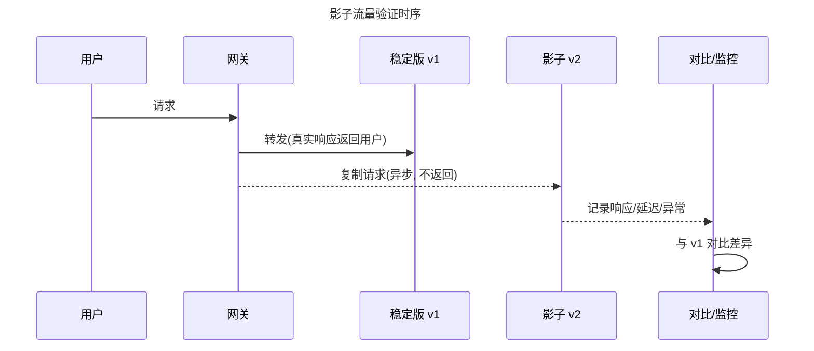
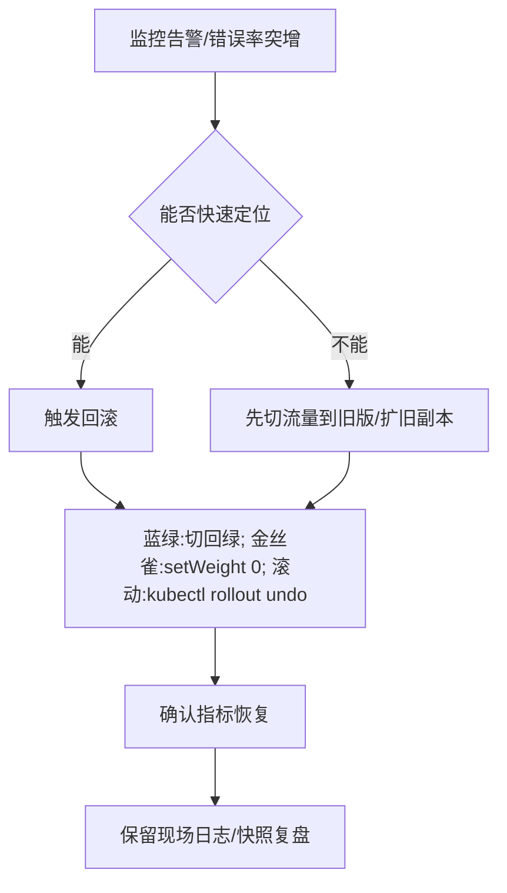
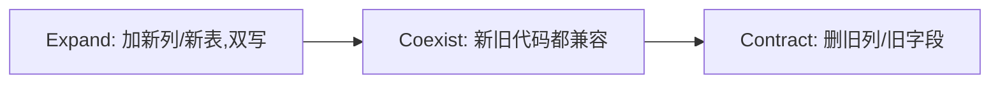

# CI/CD · 10 部署策略

> 部署策略的本质，是在「速度」与「安全」之间找平衡：用可控的方式把新版本推到生产，让出问题时影响面最小、回退最快。没有策略的发布，就是拿生产环境赌运气。

本篇承接 [01-概述与核心概念](01-概述与核心概念.md) 与 [09-流水线设计模式与最佳实践](09-流水线设计模式与最佳实践.md)，把「如何把构建好的制品安全上线」这件事讲透；并与 [11-容器化与Kubernetes集成](11-容器化与Kubernetes集成.md) 在 K8s 落地层衔接；数据库的兼容迁移思路也与 [../大数据/10-资源调度：YARN与Kubernetes.md](../大数据/10-资源调度：YARN与Kubernetes.md) 中提到的资源与版本演化相呼应。

## 一、为什么需要部署策略

传统「停服发布」（`停机 → 部署 → 验证 → 开服`）在今天的 7×24 业务里已不可接受：用户在全球任何时区都可能在线，几分钟的停机就是真实资损与口碑损失。部署策略应运而生，解决三个核心诉求：

- **零停机（Zero Downtime）**：用户无感知地完成版本切换，请求不中断。
- **快速回滚（Fast Rollback）**：新版本出问题（错误率飙升、延迟劣化、逻辑 bug）时，能在秒级~分钟级把流量切回已知良好版本。
- **降低风险（Risk Reduction）**：不一次性把 100% 流量压到未经验证的新版本，而是用「小流量先行、指标护航、逐步放量」把爆炸半径压到最小。

> 口诀：发布不是「把新代码推上去」，而是「把风险一步步试探着放出去，随时能收得回」。

没有部署策略的代价（真实故障模式）：直接全量替换 → 新版本隐藏 bug 瞬间影响 100% 用户 → 回滚需要重新构建/重新部署 → 故障时长以分钟到小时计。部署策略把「回滚」从「重新来一遍」变成「切一刀流量」。

## 二、七种部署策略大表对比

| 策略 | 停机时间 | 回滚速度 | 资源占用 | 流量控制粒度 | 复杂度 | 典型适用场景 |
|------|---------|---------|---------|------------|--------|------------|
| 蓝绿 Blue-Green | 近零（一次性切流） | 极快（切回旧环境） | 高（双倍资源） | 粗（全量切） | 中 | 对回滚速度极敏感的核心服务 |
| 金丝雀 Canary | 零 | 快（停放量/切回） | 中（小比例叠加） | 细（1%/5%/10%…） | 中高 | 需要业务指标护航的渐进发布 |
| 滚动更新 Rolling | 零 | 中（依赖版本回退） | 低（仅小幅超出） | 粗（按批次 Pod） | 低 | K8s 无状态服务默认姿势 |
| 灰度/分批 Staged | 零 | 中 | 低~中 | 中（按用户群/批次） | 中 | 按地域/白名单分批放量 |
| A-B 测试 | 零 | 不适用（并行对照） | 高 | 中（按分桶） | 中 | 业务对比实验，非安全发布 |
| 影子 Shadow/Mirror | 零（不影响真实用户） | 不涉及 | 高（复制流量） | 无（流量不返回） | 高 | 新版本压测/正确性验证 |
| 重建 Recreate | 有（先删后建） | 中 | 低 | 无 | 最低 | 无法新旧共存的离线/独占任务 |

> 口诀：没有「最好」的策略，只有「最合适」的策略——先定 SLO 与回滚预算，再选策略。

补充几个关键区分：
- **金丝雀 vs A-B 测试**：金丝雀是「安全发布」（验证新版本是否健康，不健康就停），A-B 是「业务对比」（同一功能两个变体比转化率，两个都是「好」的）。两者流量切分技术相似，目的完全不同。
- **灰度 vs 金丝雀**：灰度常按「用户分群」（白名单、地域、tenant）放量，金丝雀按「流量比例」放量；灰度更偏运营节奏，金丝雀更偏技术指标护航。

## 三、蓝绿部署（Blue-Green）

### 3.1 原理
准备两套完全一样的生产环境：**蓝（Blue，当前线上稳定版）** 与 **绿（Green，待发布新版本）**。新版本先部署到绿环境并完成全部验证（冒烟、集成、压测），然后通过负载均衡器 / 网关的「一次切换」把 100% 流量从蓝切到绿。

```mermaid
flowchart LR
    title 蓝绿部署切流图
    U[用户/客户端] --> LB[负载均衡 / 网关]
    LB -->|切流前 100%| B[Blue 稳定环境 v1]
    LB -.->|切流后 100%| G[Green 新环境 v2]
    G -. 验证通过前不接流 .-> MON[冒烟/集成/压测]
    B -. 切流后仍保留, 用于即时回滚 .-> COLD[(冷备)]
```

### 3.2 回滚
蓝绿最诱人之处在于回滚极简：**把流量从绿切回蓝即可**，无需重新部署、无需重新构建。旧环境原地保留，直到新版本观察期（如 24h）无异常才下线。

### 3.3 致命约束：数据库迁移要兼容
两套环境共享同一数据库时，「切流」只解决应用层，解决不了数据层。新版本若改了表结构，必须保证**旧版本（蓝）仍可读写**——这要求数据库迁移遵循「向后兼容」（见第八节）。否则切到绿后数据库 schema 已变，一旦回滚到蓝会直接报错。

> 口诀：蓝绿切的是「流量」，不是「数据库」；数据库不兼容，蓝绿回滚就是空谈。

⚠️ **生产踩坑**
- **双倍资源成本**：绿环境要与蓝等规格常驻，机器成本 ×2；很多团队为省钱只给绿环境「缩容版」，结果切流后容量不足被打挂。
- **状态不一致**：有状态服务（本地缓存、长连接、WebSocket）切流瞬间会断连，需要在客户端做重连或走共享存储。
- **数据库不兼容导致无法回滚**：最经典的蓝绿翻车——新版本 DDL 删了旧列，切流后发现问题回滚，旧代码写旧列直接抛异常。
- **切流瞬间缓存/队列积压**：若蓝环境已写入消息队列，绿环境消费者可能与蓝环境消息格式不兼容。

## 四、金丝雀部署（Canary）

### 4.1 原理
金丝雀（取名自煤矿里的金丝雀——用脆弱生命探测瓦斯）的核心是**先放极少量真实流量到新版本，观察关键指标（错误率、延迟、业务指标），确认健康后再逐步放大比例**，直至 100%。

```mermaid
flowchart LR
    title 金丝雀逐步放量图
    U[用户流量] --> R[路由器/网关/Service Mesh]
    R -->|95%| S1[稳定版 v1 x95实例]
    R -->|5%| S2[金丝雀 v2 x5实例]
    S2 --> M[监控: 错误率/延迟/订单量]
    M -->|指标正常| R2[放大到 25%]
    R2 --> R3[50%]
    R3 --> R4[100% 全量]
    M -->|指标异常| RB[自动回滚/暂停放量]
```

### 4.2 与监控/告警联动：自动晋升与回滚
成熟的金丝雀不是「手动调权重」，而是**用分析（Analysis）把指标当成晋级门槛**：每个放量台阶都伴随一段观察窗口（如 5 分钟），在此期间持续查询 Prometheus / Datadog / 自定义 webhook，满足 `successCondition`（如成功率 ≥ 99.5%）才自动进下一档；连续失败达到 `failureLimit` 则自动回滚。

```yaml
# Argo Rollouts 金丝雀：指标护航的自动晋升（详见 11 篇）
apiVersion: argoproj.io/v1alpha1
kind: Rollout
metadata:
  name: api-server
spec:
  replicas: 10
  strategy:
    canary:
      steps:
        - setWeight: 5
        - pause: { duration: 5m }      # 观察窗口
        - analysis:
            templates:
              - templateName: success-rate
        - setWeight: 25
        - pause: { duration: 10m }
        - setWeight: 100
```

### 4.3 金丝雀 vs A-B 测试（再强调）
- 金丝雀：**新 vs 旧**，目标「验证新版本是否安全」，不健康就停。
- A-B：**变体A vs 变体B**，目标「哪个转化更好」，两者都安全，只是业务取舍。
- 技术上都用流量分桶，但**金丝雀的对照组是「上一个稳定版」且可随时回滚**，A-B 的对照组是「另一个实验变体」且通常要跑满一个实验周期。

> 口诀：金丝雀问「新版本会不会挂」，A-B 问「哪个版本更赚钱」。

⚠️ **生产踩坑**
- **金丝雀没监控等于裸奔**：只切 5% 流量却不挂监控/分析，等于把 5% 用户当小白鼠还不知道他们死了——必须「切流 + 分析」成对出现。
- **指标选错**：只看「Pod 健康」不够（容器活着 ≠ 业务健康），要看成功率、P99 延迟、业务漏斗（如下单转化）。
- **放量过快**：5%→100% 一步跨，前面的小流量失去意义；台阶要留足够观察窗口。
- **有状态/缓存一致性**：金丝雀与稳定版若读写同一缓存 key 但结构不同，会出现诡异串味，需要特性开关或双写兼容。

## 五、滚动更新（Rolling Update）

### 5.1 原理
逐批替换旧实例：先起一批新 Pod，就绪后杀一批旧 Pod，循环往复直到全部为新版本。K8s Deployment 默认即此策略，靠 `maxSurge`（最多超出期望副本数）与 `maxUnavailable`（最多不可用副本数）控制节奏。

```mermaid
flowchart LR
    title 滚动更新批次图
    subgraph 批次1[批次1]
      N1[新 Pod x1]
      O1[旧 Pod x2]
    end
    subgraph 批次2[批次2]
      N2[新 Pod x2]
      O2[旧 Pod x1]
    end
    subgraph 批次3[批次3]
      N3[新 Pod x3 - 全量]
    end
    批次1 --> 批次2 --> 批次3
```

### 5.2 参数含义（K8s 官方定义）
- `maxSurge`：更新期间可超出期望副本数的最大 Pod 数（绝对数或百分比，默认 25%，向上取整）。决定「能多快地起新 Pod」。
- `maxUnavailable`：更新期间可不可用的最大 Pod 数（默认 25%，向下取整）。决定「能多快地杀旧 Pod」。
- 经典零停机配置：`maxSurge: 1`（或 25%）、`maxUnavailable: 0`——保证「先起新、就绪后再杀旧」，容量永不掉。

> 口诀：滚动更新是「慢工出细活」——用时间换资源，用探针（见 11 篇）保证每一批都健康再进下一批。

⚠️ **生产踩坑**
- **默认 25%/25% 在副本数很少时 math 会取整到 0**：如 `replicas: 2`，25% 向下取整为 0 个不可用、向上取整为 1 个可超出，实际变成「起 1 新、杀 1 旧」的串行，扩容慢；大流量服务建议显式设 `maxUnavailable: 0`。
- **滚动更新无流量切分**：它按「Pod 批次」而非「百分比流量」推进，无法做「5% 用户」级别灰度，需要金丝雀能力时请用 Argo Rollouts（11 篇）。
- **新旧版本短暂共存要求兼容**：滚动期间新旧 Pod 同时接流，共享 DB/缓存，必须向后兼容。

## 六、特性开关（Feature Flag）

### 6.1 与部署解耦的发布控制
特性开关把「代码上线」与「功能对用户提供」拆成两件事：**代码始终部署，但功能是否对用户可见由开关控制**。这样即使全量部署了新代码，也可在运行时瞬间关闭问题功能（kill switch），无需回滚发布。

```mermaid
flowchart LR
    title 特性开关解耦部署与发布
    DEPLOY[部署新代码 v2] --> FLAG{开关 useNewCheckout}
    FLAG -->|ON| NEW[新结算逻辑]
    FLAG -->|OFF| OLD[旧结算逻辑]
    OPS[运维/SRE] -->|秒级切换| FLAG
```

### 6.2 主流工具对比（2025）

| 工具 | 性质 | 关键能力 | 适用 |
|------|------|---------|------|
| LaunchDarkly | 商业 SaaS（有免费层） | 30+ SDK、实验、 Targeting、SOC2 | 企业级、省运维 |
| Unleash | 开源 + 托管 | 25+ SDK、渐进发布、审计、RBAC | 自托管、合规 |
| Flagsmith | 开源 + SaaS | 远程配置、A-B、OpenFeature | 开源/混合 |
| Flagd | CNCF/OpenFeature 参考实现 | 标准合规、OFREP | 与 OpenFeature 生态 |
| Flipt | 开源（Git 存 flag） | 百分比/分群、无数据库 | 轻量、GitOps 风 |
| 自研 | 自建 | 完全可控 | 特殊需求、但易成债 |

> 口诀：特性开关让「回滚」从「重发代码」降级为「拨一个开关」——但开关用完不删，就是技术债。

⚠️ **生产踩坑**
- **长期堆积成技术债**：开关只加不开（删），代码里 `if(flagA){...}else{...}` 越积越多，最终没人敢动。必须有「开关生命周期」：上线即排期下线。
- **开关求值性能**：每次请求远程拉取开关配置会引入延迟，应用应本地缓存 + 订阅变更（如 OpenFeature 的本地求值）。
- **开关与发布割裂导致状态混乱**：开了开关但对应代码路径有 bug，关开关成了唯一止血手段，却没人验证过关开关后的旧路径是否还正常。

## 七、影子/镜像流量（Shadow / Mirror）

把生产真实流量**复制一份**发给新版本，但新版本的响应**不返回给用户**，只用于验证其正确性、性能与稳定性。这是「零风险验证」：真实流量、真实数据，但用户完全无感。



> 口诀：影子流量是「让新版本在影子下经历真实风暴」，用户却永远看不见它。

⚠️ **生产踩坑**
- **副作用污染**：影子版若真去写数据库/发消息/调用第三方支付，会造成双倍写入。影子版必须「只读」或对写操作打标/隔离。
- **资源翻倍**：复制流量意味着新版本要扛一份额外负载，需单独容量评估。

## 八、回滚策略

### 8.1 快速回滚的两种形态
- **切流式回滚**（蓝绿/金丝雀/网关权重）：改路由把流量指回稳定版，秒级生效，无需重建。
- **版本式回滚**（滚动更新/K8s）：`kubectl rollout undo` 把 ReplicaSet 切回上一修订版；Argo Rollouts 失败时回退到「stable」ReplicaSet。

### 8.2 数据库兼容：expand-contract（并行变更）迁移模式
应用回滚容易，**数据库回滚难**（已写入的新数据不能丢）。解决之道是「expand-contract / parallel change」：把一次破坏性 schema 变更拆成「扩展 → 迁移 → 收缩」三步，每步都向后兼容，任何时刻旧代码都能跑。

```mermaid
stateDiagram-v2
    title expand-contract 迁移状态机（以重命名列为例）
    [*] --> Expand: 部署1 加新列 username(可空)
    Expand --> Migrate: 部署2 双写 + 回填旧数据
    Migrate --> Contract: 部署3 代码只读新列
    Contract --> [*]: 部署4 删除旧列 user_name
    Migrate --> Expand: 任一中间步出问题, 旧代码仍可运行(回滚应用即可)
    Contract --> Migrate: 发现新列异常, 切回读旧列
```

具体步骤（以 `users.name → users.username` 为例）：
1. **Expand（扩展）**：`ALTER TABLE users ADD COLUMN username VARCHAR(255);`（只加不改，旧代码无感）。
2. **Migrate（迁移）**：应用改为**双写**（同时写 name 与 username），后台批量回填存量数据；读逻辑用新列、缺失时 fallback 旧列。
3. **Contract（收缩）**：确认所有代码只读新列后，停止写旧列，最终 `DROP COLUMN name`。

> 口诀：数据库迁移「只加不改、双写过渡、最后才删」——让任何一步都能被应用回滚兜底。

### 8.3 向前兼容与向后兼容
- **向后兼容（Backward Compatibility）**：新版本应用能读旧版本写的数据 / 旧 schema。部署新应用前必须保证它兼容现有数据——这是滚动更新、蓝绿的前提。
- **向前兼容（Forward Compatibility）**：旧版本应用能容忍新版本写的数据 / 新 schema（如新增的可空列）。这是「先部署应用、后改数据」或「回滚后旧代码仍能跑」的前提。
- 安全顺序：**先部署向前兼容的新应用（旧数据可跑）→ 再扩 schema → 最后切流量**，保证任何单点失败都可独立回退。

⚠️ **生产踩坑**
- **数据库迁移导致无法回滚**：最常见的「伪回滚」——应用回滚了，但 DDL 已删除列，旧代码写库报错。务必用 expand-contract，且「删列」放到多个发布之后。
- **回滚时才发现数据格式不兼容**：新版本写了旧版本不认识的枚举/字段，回滚后旧代码解析失败。发布前要做「向前兼容」测试。
- **大表 DDL 锁表**：`ALTER TABLE` 大表会拿 ACCESS EXCLUSIVE 锁阻塞读写，应用 `CONCURRENTLY`（PG）/ `gh-ost`、`pt-online-schema-change`（MySQL）做在线变更。

## 九、流量治理与渐进式交付（Progressive Delivery）

### 9.1 按权重切流的载体
- **网关 / Ingress**：如 NGINX Ingress、Traefik，按服务权重分流（能力有限，多为粗粒度）。
- **Service Mesh**：Istio / Linkerd 通过 sidecar 在 L7 按百分比精确切流，并自带 mTLS、指标。
- **专用控制器**：Argo Rollouts / Flagger 在 K8s 上直接操作 Service/Ingress/VirtualService 权重（详见 [11-容器化与Kubernetes集成](11-容器化与Kubernetes集成.md)）。

### 9.2 渐进式交付 = 金丝雀 + 特性开关 + 自动分析
渐进式交付是把「金丝雀放量」「特性开关」「指标自动分析」「自动晋升/回滚」工程化地编织在一起的理念。代表实现：
- **Argo Rollouts**：K8s 原生 CRD，金丝雀/蓝绿 + AnalysisTemplate 指标门槛。
- **Flagger**：基于 Flux/GitOps，用指标自动驱动金丝雀晋级。
- 与 [08-云原生CI-CD与GitOps工具](08-云原生CI-CD与GitOps工具.md) 衔接：GitOps 控制器（Argo CD）负责把期望状态同步到集群，Argo Rollouts 负责在集群内把「一次发布」安全地推进。

```mermaid
flowchart LR
    title 渐进式交付闭环
    GIT[Git 提交新镜像] --> CD[Argo CD 同步期望状态]
    CD --> RO[Argo Rollouts 启动金丝雀]
    RO --> ANA[AnalysisTemplate 查 Prometheus]
    ANA -->|达标| PROMOTE[晋级下一档权重]
    ANA -->|不达标| ABORT[自动 abort 回退 stable]
    PROMOTE -->|100%| DONE[发布完成]
```

> 口诀：渐进式交付不是「一个工具」，而是「金丝雀 + 开关 + 指标 + 自动化」的组合拳。

### 9.3 选型速查决策流
不确定用哪种策略时，按「能否新旧共存 → 是否要指标护航 → 资源是否宽裕」逐层判断：

```mermaid
flowchart TD
    title 部署策略选型决策流
    Q1{新旧版本能否短期共存?}
    Q1 -->|否| REC1[Recreate / 维护窗口]
    Q1 -->|能| Q2{需要按流量比例指标护航?}
    Q2 -->|是| Q3{资源是否宽裕?}
    Q3 -->|宽裕+要求极速回滚| REC2[蓝绿 Blue-Green]
    Q3 -->|一般| REC3[金丝雀 Canary + 分析]
    Q2 -->|否, 只要平滑替换| REC4[滚动更新 Rolling]
    Q1 -->|能 但要按用户群放量| REC5[灰度/分批 Staged]
    Q1 -->|要验证新版本正确性| REC6[影子 Shadow]
    Q1 -->|要比业务变体转化| REC7[A-B 测试]
```

> 口诀：先问「能不能共存」与「要不要指标」——这两个答案基本锁定策略。

⚠️ **生产踩坑**
- **蓝绿双倍资源成本**（见第三节）在渐进式交付里依然存在（蓝绿模式）。
- **金丝雀没监控等于裸奔**（见第四节）。
- **特性开关长期堆积成技术债**（见第六节）。
- **回滚时才发现数据格式不兼容**（见第八节）。
- **网关切流与网格切流冲突**：同时用 Ingress 权重和 Istio VirtualService 权重会造成规则打架，要明确「谁是唯一权威」。

## 与其他模块的关联

- [01-概述与核心概念](01-概述与核心概念.md)：部署策略是 CI/CD「CD（持续部署）」环节的落子，需先理解流水线全景。
- [09-流水线设计模式与最佳实践](09-流水线设计模式与最佳实践.md)：部署策略常作为流水线最后一个 stage，与「环境晋升」「自动化门禁」配合。
- [11-容器化与Kubernetes集成](11-容器化与Kubernetes集成.md)：本文所有策略在 K8s 上的具体落地（Deployment 滚动、Argo Rollouts 金丝雀）。
- [08-云原生CI-CD与GitOps工具](08-云原生CI-CD与GitOps工具.md)：GitOps 与渐进式交付的协同，Argo CD 管期望状态、Rollouts 管发布过程。
- [../../云原生/K8S.md](../../云原生/K8S.md)：探针（readiness/liveness）、Service、Ingress、VirtualService 是切流与接流的底层机制。
- [../大数据/10-资源调度：YARN与Kubernetes.md](../大数据/10-资源调度：YARN与Kubernetes.md)：数据库迁移的兼容原则与资源调度中的版本共存思想一脉相承。

## 参考

- Kubernetes 官方文档 — Deployment 滚动更新策略（maxSurge/maxUnavailable）: https://kubernetes.io/docs/reference/kubernetes-api/workload-resources/deployment-v1/
- Argo Rollouts 官方文档 — Architecture / Getting Started / Analysis: https://argoproj.github.io/argo-rollouts/architecture/ ｜ https://argoproj.github.io/argo-rollouts/getting-started/
- Argo Rollouts 金丝雀与指标分析实践（2025）: https://geekoncloud.com/blog/zero-downtime-kubernetes-deployments-argo-rollouts ｜ https://www.techsimplified.info/argo-rollouts-progressive-delivery-kubernetes
- Expand-Contract / Parallel Change 数据库迁移模式（2025）: https://engineering.zooz.com/@jasminfluri/expand-and-contract-method-for-database-changes-414d236f236f ｜ https://www.stew.so/blog/database-migration-steps-zero-downtime ｜ https://aidev.fit/en/tech/database-migration-strategies.html
- 特性开关工具对比（2025）: LaunchDarkly https://launchdarkly.com/blog/best-free-feature-flag-services ｜ ConfigCat 替代清单 https://configcat.com/blog/top-eight-launchdarkly-alternatives/ ｜ OpenFeature（CNCF 孵化） https://blog.devcycle.com/comparing-top-openfeature-providers/
- 零停机滚动更新最佳实践（探针 + 优雅终止）: https://devops.aibit.im/en/article/how-to-perform-zero-downtime-kubernetes-rolling-updates

## 九、流量调度细节：谁在切流

| 切流层 | 机制 | 精度 | 适用 |
|--------|------|------|------|
| Ingress | 权重 annotation | 粗（整服务） | 简单蓝绿 |
| Service Mesh | VirtualService 权重 | 细（按 header/用户） | 金丝雀按用户群 |
| 网关 | 路由规则 | 中 | API 网关层 |
| DNS | 权重解析 | 最粗 | 跨地域切换 |

> ⚠️ **唯一权威**：同时用 Ingress 权重与 Istio 权重会规则打架，必须明确"谁是唯一权威"（通常网格优先）。

## 十、回滚 SOP（标准作业程序）



- **蓝绿回滚**：切回旧版本负载均衡目标（秒级，无重建）。
- **金丝雀回滚**：`setWeight: 0` 或 `kubectl argo rollouts abort`，流量归旧。
- **滚动回滚**：`kubectl rollout undo deploy/app`，ReplicaSet 回上一版。
- **原则**：回滚必须演练；DB 变更若已提交则需配套向后兼容或补偿迁移。

## 十一、数据库与部署解耦

部署新版本 != 改数据库。用**扩展-收缩（Expand-Contract）/ 并行变更**让新旧代码与新旧 schema 共存：



| 步骤 | 操作 | 风险 |
|------|------|------|
| Expand | 加新列、新表，应用双写新旧 | 低 |
| Migrate | 回填历史数据 | 中 |
| Coexist | 新代码读新写新，旧代码仍可用 | 低 |
| Contract | 确认无旧代码后删旧结构 | 高（需确认） |

> 口诀：**"先扩展后收缩，绝不一次破坏性迁移"**；破坏性变更分两次发布，中间保持兼容。

## 十二、特性开关与影子流量补充

- **特性开关回滚**：关开关即回滚功能，不重新部署（最快逃生舱）。
- **影子（Shadow）**：把生产流量复制一份打到新版本，不被用户感知，用于验证正确性/容量，不影响真实响应。

```yaml
# Argo Rollouts 影子（mirror）流量
strategy:
  canary:
    trafficRouting:
      istio:
        mirror: true          # 复制流量到金丝雀，不返回给用户
```

## 本篇补充 Checklist

- [ ] 切流明确唯一权威层（网格优先于 Ingress/DNS）。
- [ ] 回滚 SOP 演练：蓝绿切回 / 金丝雀置 0 / 滚动 undo，先保流量再查因。
- [ ] DB 用 Expand-Contract 与新代码解耦，破坏性迁移分两次发布。
- [ ] 特性开关作最快逃生舱；影子流量用于无感验证。
