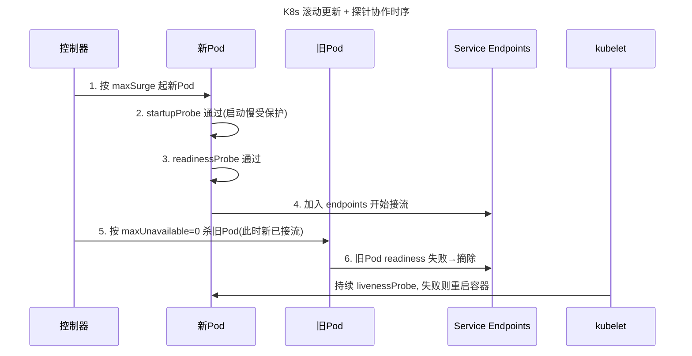
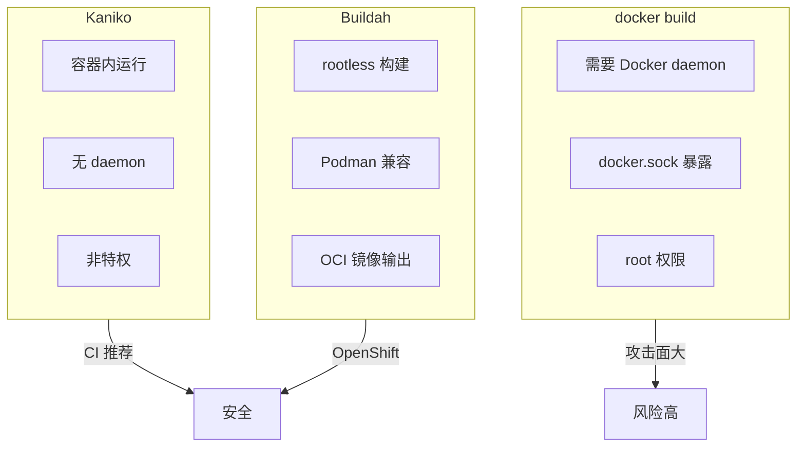
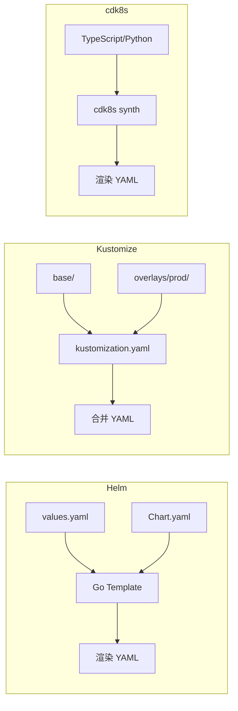
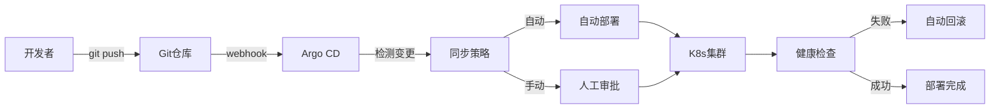
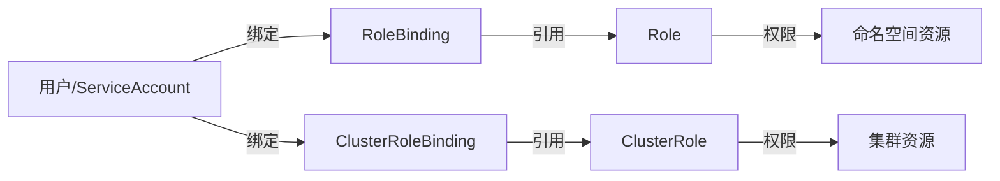

# CI/CD · 11 容器化与 Kubernetes 集成

> 容器化是 CI/CD 的基石：它把「在我机器上能跑」变成「在任意机器上都一样跑」。而 Kubernetes 把这种一致性从单机延伸到集群——一次构建的镜像，到处以相同方式运行与发布。

本篇是 [10-部署策略](10-部署策略.md) 在 K8s 上的「施工图纸」：部署策略讲「怎么安全上线」，本篇讲「用容器与 K8s 原语怎么把它落地」。向上衔接 [03-构建与制品管理](03-构建与制品管理.md)（镜像即制品），与 [08-云原生CI-CD与GitOps工具](08-云原生CI-CD与GitOps工具.md) 在 GitOps 层汇合；底层机制参见 [../../云原生/K8S.md](../../云原生/K8S.md)。

## 一、容器化为什么是 CI/CD 的基石

- **环境一致性**：镜像把代码 + 依赖 + 运行环境打包成一个不可变单元，开发、测试、生产环境完全一致，消灭「环境差异」类故障。
- **不可变制品（Immutable Artifact）**：一次构建，处处运行；发布时不再「现场编译」，而是「搬运已验证的镜像」，可重现、可审计。
- **一次构建，到处运行**：同一镜像可在笔记本、CI 节点、EKS/GKE/AKS、边缘节点运行，调度与发布解耦。

> 口诀：镜像是「交付物」不是「构建过程」——构建一次、签名一次、到处跑，绝不在生产现场重新编译。

## 二、Dockerfile 最佳实践

### 2.1 多阶段构建（Multi-stage）
把「编译环境」与「运行环境」分开：编译阶段用含 SDK 的大镜像，运行阶段只拷贝产物到极小基础镜像，最终镜像不含编译器与源码。

```dockerfile
# ---- 阶段1：构建 ----
FROM golang:1.23 AS builder
WORKDIR /src
COPY go.mod go.sum ./
RUN go mod download
COPY . .
RUN CGO_ENABLED=0 GOOS=linux go build -o /app/bin/server ./cmd/server

# ---- 阶段2：运行（distroless，无 shell、极小、安全） ----
FROM gcr.io/distroless/static-debian12
WORKDIR /app
COPY --from=builder /app/bin/server /app/server
# 非 root 运行
USER 65532:65532
EXPOSE 8080
# 应用自带健康检查端点
HEALTHCHECK --interval=30s --timeout=3s --start-period=10s --retries=3 \
  CMD ["/app/server", "healthz"]
ENTRYPOINT ["/app/server"]
```

```mermaid
flowchart TB
    title 多阶段构建层图
    subgraph B[builder 阶段 golang:1.23]
      SRC[源码 + go.mod] --> BUILD[go build 产物 server]
    end
    subgraph R[运行阶段 distroless]
      COPY[COPY --from=builder 仅拷贝二进制]
    end
    B -->|只传产物| R
    R --> IMG[最终镜像: 仅二进制 + 运行时, ~5MB]
```

### 2.2 关键实践清单
- **最小化基础镜像**：优先 `distroless` / `alpine` / `chainguard`（中国场景可考虑 `alpine` 或国内镜像站的精简版），避免 `ubuntu:latest` 这类几百 MB 的胖镜像。
- **非 root 用户运行**：`USER 65532`（distroless 的 nonroot）或自建低权用户，降低容器逃逸危害。
- **合理分层利用缓存**：变动少的层（基础依赖）放前面，变动多的层（业务代码）放后面，`COPY go.mod` 先于 `COPY .` 以命中依赖缓存。
- **HEALTHCHECK**：声明应用级健康端点，让容器运行时也能判断「进程在但服务废」。
- **.dockerignore**：排除 `.git`、`node_modules`、`target`、`*.md`、 secret 文件，减小构建上下文、防泄密。
- **避免 secrets 进镜像**：密钥用挂载/Secret/External Secrets，绝不用 `ENV` 或 `COPY` 把密码烧进镜像。
- **清理包管理器缓存**：`apt-get clean && rm -rf /var/lib/apt/lists/*`，减小体积。

```dockerignore
# .dockerignore 示例
.git
**/*.md
node_modules
target
*.log
secrets/
.env
Dockerfile
docker-compose.yml
```

> 口诀：Dockerfile 的灵魂是「分层缓存 + 最小攻击面」——少一层、小一点、非 root，安全和速度都来了。

⚠️ **生产踩坑**
- **latest 标签导致不可重现**：`image: myapp:latest` 在不同节点/不同时间拉到不同内容，回滚与审计全失效。一律用 `git sha` 或 `semver` 标签。
- **镜像过大拖慢拉取**：大镜像在弹性扩容（HPA/节点扩容）时拉取耗时长，拖慢扩容速度甚至触发雪崩；多阶段 + 小基础镜像是刚需。
- **特权容器风险**：`securityContext.privileged: true` 等同于近似宿主 root，被逃逸即集群沦陷；用 `runAsNonRoot`、`readOnlyRootFilesystem`、`drop ALL capabilities` 替代。
- **缓存层陷阱**：`RUN apt-get update && apt-get install -y xxx` 若与 `apt-get update` 在同一层且上游索引变了，可能命中旧缓存导致装到旧包；依赖层单独成层并及时刷新。

## 三、镜像仓库（Registry）

### 3.1 主流仓库对比

| 仓库 | 特点 | 适用 |
|------|------|------|
| Harbor（开源） | 镜像签名（Notary）、漏洞扫描（Trivy）、复制、RBAC | 自建企业级、合规 |
| ECR（AWS） | 与 IAM 集成、生命周期策略 | AWS 体系 |
| GCR/Artifact Registry（GCP） | 与 GCP 原生集成 | GCP 体系 |
| ACR（Azure） | 与 Entra ID 集成 | Azure 体系 |
| 阿里云 ACR | 国内加速、海外同步 | 国内业务 |

### 3.2 标签策略
- **git sha**：`myapp:7f3a9c2` 唯一、可追溯到提交，最推荐用于生产发布。
- **semver**：`myapp:v1.4.2` 人类可读，适合对外版本号。
- **latest 慎用**：永远浮动，破坏可重现性与回滚能力，仅适合本地/演示。

> 口诀：标签即身份证——用 git sha 锁定「这一次到底跑了什么」，latest 是匿名的危险分子。

### 3.3 Harbor 签名与扫描（示意）
```yaml
# Harbor 项目策略（概念示意，非 k8s 资源）
project:
  name: prod-apps
  vulnerability_scanning: true      # Trivy 阻断高危漏洞
  replication:                      # 跨机房同步
    - dest: harbor-dr
  content_trust: true               # 仅允许签名镜像
```

## 四、Helm：Kubernetes 包管理

### 4.1 Chart 结构
```
mychart/
├── Chart.yaml          # 名称、版本、依赖
├── values.yaml         # 默认参数（可被覆盖）
├── templates/          # 受控的 Go 模板
│   ├── deployment.yaml
│   ├── service.yaml
│   └── _helpers.tpl    # 公共模板片段
├── charts/             # 子 Chart
└── templates/NOTES.txt # 安装后提示
```

### 4.2 模板渲染：声明 + 覆盖
```yaml
# values.yaml
replicaCount: 3
image:
  repository: registry.example.com/myapp
  tag: "7f3a9c2"        # 用 git sha，不用 latest
resources:
  requests: { cpu: "100m", memory: "128Mi" }
  limits:   { cpu: "500m", memory: "256Mi" }
```
```yaml
# templates/deployment.yaml（节选）
apiVersion: apps/v1
kind: Deployment
metadata:
  name: {{ .Release.Name }}-app
spec:
  replicas: {{ .Values.replicaCount }}
  template:
    spec:
      containers:
        - name: app
          image: "{{ .Values.image.repository }}:{{ .Values.image.tag }}"
          resources:
            requests: {{ toYaml .Values.resources.requests | nindent 12 }}
            limits:   {{ toYaml .Values.resources.limits | nindent 12 }}
```

```mermaid
flowchart LR
    title Helm 渲染流程
    VALUES[values.yaml + -f 覆盖] --> TPL[Go 模板 templates/]
    CHART[Chart.yaml 元数据] --> TPL
    TPL --> RENDER[kubectl 渲染出标准 YAML]
    RENDER --> K8S[apply 到集群]
```

### 4.3 发布与原子回滚
```bash
# 安装/升级，-atomic 失败时自动回滚到上一稳定版本
helm upgrade my-app ./mychart \
  --install --atomic --timeout 5m \
  -f values-prod.yaml \
  --set image.tag=7f3a9c2

# 查看历史与回滚
helm history my-app
helm rollback my-app 2

# hooks：在升级前后执行数据库迁移等动作
# 在模板里用 annotation: "helm.sh/hook": pre-upgrade
```

### 4.4 Helm vs Kustomize

| 维度 | Helm | Kustomize |
|------|------|-----------|
| 范式 | 模板（参数化生成） | 无模板（声明式 patch/overlay） |
| 学习曲线 | 需学 Go template | YAML 原生，易上手 |
| 多环境 | values 多文件覆盖 | base + overlays 目录 |
| 包/分发 | Chart 可发布到仓库 | 直接 Git 目录 |
| 适合 | 复杂可复用应用 | 同应用多环境差异化 |

> 口诀：Helm 用「变量生成 YAML」，Kustomize 用「补丁叠加 YAML」——复杂产品选 Helm，环境差异选 Kustomize。

## 五、Kustomize：声明式 overlay

```yaml
# base/deployment.yaml
apiVersion: apps/v1
kind: Deployment
metadata:
  name: myapp
spec:
  replicas: 2
  template:
    spec:
      containers:
        - name: app
          image: myapp:7f3a9c2
```
```yaml
# overlays/prod/kustomization.yaml
resources:
  - ../../base
patches:
  - target:
      kind: Deployment
      name: myapp
    patch: |
      - op: replace
        path: /spec/replicas
        value: 6
```
```bash
kubectl apply -k overlays/prod
```

## 六、K8s 原生部署：Deployment 滚动更新 + 探针

### 6.1 滚动更新参数
见 [10-部署策略](10-部署策略.md) 第五节。`maxSurge` / `maxUnavailable` 控制节奏；零停机推荐 `maxUnavailable: 0`、`maxSurge: 1` 或 `25%`。

### 6.2 三种探针协作
- **startupProbe（启动探针）**：保护启动慢的应用，期间禁用 liveness/readiness，防止启动期被误杀。
- **readinessProbe（就绪探针）**：决定 Pod 是否**进入 Service endpoints 接流量**；失败即从端点摘除（不重启）。
- **livenessProbe（存活探针）**：决定容器**是否健康**，失败则 kubelet 重启容器。

> 口诀：就绪管「接不接流」，存活管「死不死掉」——二者职责不同，配错就是雪崩或不接流。

```yaml
apiVersion: apps/v1
kind: Deployment
metadata:
  name: myapp
spec:
  replicas: 4
  strategy:
    type: RollingUpdate
    rollingUpdate:
      maxSurge: 1
      maxUnavailable: 0
  selector:
    matchLabels: { app: myapp }
  template:
    metadata:
      labels: { app: myapp }
    spec:
      containers:
        - name: app
          image: registry.example.com/myapp:7f3a9c2
          ports: [{ containerPort: 8080 }]
          startupProbe:
            httpGet: { path: /healthz, port: 8080 }
            failureThreshold: 30
            periodSeconds: 2          # 最多允许 60s 启动
          readinessProbe:
            httpGet: { path: /ready, port: 8080 }
            initialDelaySeconds: 5
            periodSeconds: 5
            failureThreshold: 3
          livenessProbe:
            httpGet: { path: /live, port: 8080 }
            initialDelaySeconds: 15
            periodSeconds: 10
            failureThreshold: 3
          resources:
            requests: { cpu: "100m", memory: "128Mi" }
            limits:   { cpu: "500m", memory: "256Mi" }
```



### 6.3 回滚与状态命令
```bash
kubectl set image deployment/myapp app=registry.example.com/myapp:9b1c4d0
kubectl rollout status deployment/myapp
kubectl rollout undo deployment/myapp
kubectl rollout undo deployment/myapp --to-revision=2
kubectl rollout history deployment/myapp
```

### 6.4 StatefulSet / DaemonSet 简要
- **StatefulSet**：有状态（DB、MQ），稳定网络标识、有序部署/扩缩、持久存储。
- **DaemonSet**：每个节点跑一份（日志/监控 Agent），节点级守护。

⚠️ **生产踩坑**
- **探针配置错误引发雪崩/不接流**：readiness 路径在启动期就返回失败 → Pod 永远不进 endpoints（不接流）；liveness 路径依赖外部依赖（如 DB） → DB 抖动导致全量重启（雪崩）。liveness 只查「进程死活」，不要查下游依赖。
- **探针阈值太紧**：`periodSeconds` 太小、`failureThreshold` 太小，网络抖动即误杀。
- **无优雅终止**：应用不处理 `SIGTERM`、不 `sleep` 等待连接排空，滚动更新会丢弃在途请求。需 `terminationGracePeriodSeconds` + 应用优雅 shutdown。

## 七、Argo Rollouts：K8s 上的金丝雀 / 蓝绿

### 7.1 为什么不用原生 Deployment
原生 Deployment 只能「按 Pod 批次」滚动，无法「按流量百分比」金丝雀，也没有指标护航的自动晋级。Argo Rollouts 用 `Rollout` CRD 扩展 Deployment，支持金丝雀/蓝绿 + `AnalysisTemplate` 自动分析。

### 7.2 Rollout 金丝雀 + 自动分析
```yaml
apiVersion: argoproj.io/v1alpha1
kind: Rollout
metadata:
  name: api-server
spec:
  replicas: 10
  selector:
    matchLabels: { app: api-server }
  template:
    metadata:
      labels: { app: api-server }
    spec:
      containers:
        - name: api-server
          image: registry.example.com/api-server:v2.1.0
          ports: [{ containerPort: 8080 }]
  strategy:
    canary:
      steps:
        - setWeight: 5                  # 先放 5% 流量
        - pause: { duration: 5m }       # 观察窗口
        - analysis:
            templates:
              - templateName: success-rate   # 指标达标才继续
        - setWeight: 25
        - pause: { duration: 10m }
        - setWeight: 100
      # 在 Service Mesh 下按权重切流（Istio 示例）
      trafficRouting:
        istio:
          virtualService:
            name: api-server
            routes: [primary]
```
```yaml
# AnalysisTemplate：用 Prometheus 成功率当晋级门槛
apiVersion: argoproj.io/v1alpha1
kind: AnalysisTemplate
metadata:
  name: success-rate
spec:
  metrics:
    - name: success-rate
      interval: 2m
      successCondition: result[0] >= 0.95
      failureLimit: 3
      provider:
        prometheus:
          address: http://prometheus:9090
          query: |
            sum(rate(http_requests_total{job="api-server",status=~"2.."}[5m]))
            / sum(rate(http_requests_total{job="api-server"}[5m]))
```

```mermaid
flowchart LR
    title Argo Rollouts 金丝雀分析图
    U[流量] --> VS[VirtualService/Service]
    VS -->|95%| STABLE[stable RS v1]
    VS -->|5%| CANARY[canary RS v2]
    CANARY --> A[AnalysisRun 查 Prometheus]
    A -->|successCondition 达标| NEXT[setWeight 25 → 100]
    A -->|failureLimit 触发| ABORT[abort, 回退 stable]
    NEXT --> DONE[新版本成为 stable]
```

### 7.3 与 GitOps 衔接（接 [08-云原生CI-CD与GitOps工具](08-云原生CI-CD与GitOps工具.md)）
Argo CD 负责把 Git 里的 `Rollout` 期望状态同步到集群；Argo Rollouts 负责在集群内把「这一次发布」按金丝雀步骤安全推进。二者分工：**Argo CD 管「期望什么」，Argo Rollouts 管「怎么安全到达」**。安装 `argo-rollouts` 插件后，Rollout 可直接在 Argo CD UI 里 promote/abort。

> 口诀：Argo CD 定「目标」，Argo Rollouts 走「过程」——GitOps 管终态，渐进式交付管路径。

## 八、Operator 模式简介

特定中间件（如数据库、消息队列）的运维知识被编码为「自定义资源（CRD）+ 自定义控制器」，集群按声明自动完成部署、备份、故障转移。例如 `MysqlCluster` CR 声明副本数与版本，控制器调谐出 StatefulSet、PVC、备份任务。

```yaml
apiVersion: apps.shop.com/v1
kind: MysqlCluster
metadata: { name: mydb }
spec:
  replicas: 3
  version: "8.0"
  storage: 20Gi
```

> 口诀：Operator 把「老手的运维经验」写成控制器——集群自己会按最佳实践照顾有状态服务。

## 补充：镜像构建策略对比

### VM docker build vs Kaniko vs Buildah

| 工具 | 需要 Docker daemon | 运行环境 | 缓存支持 | 安全性 | 适用场景 |
|------|-------------------|----------|----------|--------|----------|
| **docker build** | 是（挂载 docker.sock） | 需 Docker 环境 | BuildKit 缓存 | 低（daemon root 权限） | 本地开发/CI 有 Docker 环境 |
| **Kaniko** | 否 | 容器内运行 | GCS/S3 仓库缓存 | 高（无 daemon，非特权） | K8s CI（Jenkins/GitLab） |
| **Buildah** | 否 | Podman 兼容 | --layers 缓存 | 高（rootless） | OpenShift/无 daemon 场景 |
| **BuildKit** | 否（独立守护进程） | 独立进程 | 本地/远程缓存 | 中高（secret mount） | 需高级缓存/并行构建 |



### 多阶段构建瘦身实测数据

| 阶段 | 基础镜像 | 最终大小 | 攻击面 |
|------|----------|----------|--------|
| 构建阶段 | `golang:1.23` | ~1.2GB（不进入最终镜像） | — |
| 运行阶段 | `alpine:3.19` | ~15MB | 中（含 shell/包管理） |
| 运行阶段 | `distroless/static` | ~2MB | 极小（无 shell） |
| 运行阶段 | `chainguard/static` | ~2MB | 极小（可审计供应链） |
| Java 多阶段 | `maven:3.9` → `eclipse-temurin:17-jre` | ~180MB | 中 |
| Java 多阶段 | `maven:3.9` → `distroless/java17` | ~150MB | 小 |

> 口诀：**distroless 是最小攻击面，alpine 是折中，ubuntu/debian 是反模式**。

## 补充：K8s 清单管理工具对比

### Helm / Kustomize / cdk8s

| 工具 | 范式 | 配置方式 | 多环境 | 包管理 | 适合场景 |
|------|------|----------|--------|--------|----------|
| **Helm** | 模板化 | Go template + values.yaml | values 覆盖 | Chart 仓库 | 复杂可复用应用（数据库/MQ） |
| **Kustomize** | 声明式 patch | base + overlays 目录 | overlays 目录 | Git 目录 | 同应用多环境差异化 |
| **cdk8s** | 编程生成 | TypeScript/Python/Go | 代码复用 | npm/语言包管理 | 需要编程逻辑生成清单 |



### cdk8s 示例

```typescript
import { App } from 'cdk8s';
import { Deployment } from 'cdk8s-plus-k8s';

const app = new App();
const deployment = new Deployment(app, 'MyApp', {
  replicas: 3,
  containers: [{
    image: 'registry/myapp:v1.0',
    ports: [{ number: 8080 }],
  }],
});
app.synth();
```

## 补充：镜像 Tag 策略与不可变 Digest

### Tag 策略对比

| 策略 | 示例 | 可重现 | 可追溯 | 推荐度 |
|------|------|--------|--------|--------|
| **Digest** | `myapp@sha256:abc123...` | 不可变 | 精确到内容 | 最高（生产必用） |
| **Git SHA** | `myapp:7f3a9c2` | 唯一 | 关联提交 | 高 |
| **Semver** | `myapp:v1.4.2` | 需锁 digest | 关联版本号 | 中（对外版本号） |
| **Latest** | `myapp:latest` | 浮动 | 无法追溯 | 禁用 |

```yaml
# K8s Deployment 使用 digest（不可变）
spec:
  template:
    spec:
      containers:
        - name: app
          image: registry.example.com/myapp@sha256:abc123def456...  # 不可变 digest
```

> **黄金规则**：CI 构建时 `docker build -t myapp:${SHA}` + `docker push myapp:${SHA}`；部署时用 digest `myapp@sha256:...` 确保不可变。

## 补充：滚动更新参数调优

### maxSurge / maxUnavailable 最佳实践

| 场景 | maxSurge | maxUnavailable | 理由 |
|------|----------|----------------|------|
| 零停机（推荐） | 1 或 25% | 0 | 确保新 Pod 就绪后再杀旧 |
| 快速发布 | 25% | 25% | 旧 Pod 快速释放资源 |
| 资源紧张 | 1 | 1 | 最小化同时运行 Pod 数 |
| 大规模 | 25% | 0 | 平衡速度与安全 |

```yaml
# 零停机推荐配置
apiVersion: apps/v1
kind: Deployment
spec:
  strategy:
    type: RollingUpdate
    rollingUpdate:
      maxSurge: 1
      maxUnavailable: 0
  minReadySeconds: 10       # 就绪后等 10s 再继续
  revisionHistoryLimit: 5   # 保留回滚历史
  progressDeadlineSeconds: 600  # 10 分钟内未完成则标记失败
```

### 优雅终止配合

```yaml
spec:
  containers:
    - name: app
      terminationGracePeriodSeconds: 30  # 给应用排空连接的时间
      lifecycle:
        preStop:
          exec:
            command: ["/bin/sh", "-c", "sleep 5"]  # 等待 LB 摘除端点
```

## 补充：私有镜像仓库拉取凭据

### K8s Image Pull Secrets

```yaml
# 1. 创建 Secret
kubectl create secret docker-registry regcred \
  --docker-server=registry.example.com \
  --docker-username=ci-bot \
  --docker-password=$TOKEN \
  -n default

# 2. Deployment 引用
spec:
  imagePullSecrets:
    - name: regcred
  containers:
    - name: app
      image: registry.example.com/myapp:v1.0
```

### ServiceAccount 自动绑定

```yaml
apiVersion: v1
kind: ServiceAccount
metadata:
  name: ci-build-sa
  namespace: ci
imagePullSecrets:
  - name: regcred
automountServiceAccountToken: false
```

> **安全要点**：避免在每个 Deployment 中硬编码 imagePullSecrets，通过 ServiceAccount 自动注入；定期轮换 registry 凭据。

## 十五、Trivy 镜像安全扫描

### 15.1 扫描类型与集成

| 扫描类型 | 命令 | 适用场景 |
|----------|------|----------|
| 文件系统扫描 | `trivy fs .` | 代码依赖扫描 |
| 镜像扫描 | `trivy image app:latest` | 发布前检查 |
| 配置文件扫描 | `trivy config k8s/` | K8s YAML 安全 |
| SBOM 生成 | `trivy image --format spdx app:latest` | 供应链清单 |

```yaml
# GitHub Actions Trivy 扫描
- name: Trivy Scan
  uses: aquasecurity/trivy-action@master
  with:
    image-ref: ${{ env.IMAGE }}
    format: 'sarif'
    output: 'trivy-results.sarif'
    severity: 'CRITICAL,HIGH'
    exit-code: '1'
```

## 十六、Helm 版本管理与回滚

### 16.1 Helm 版本策略

| 策略 | 做法 | 适用 |
|------|------|------|
| 固定版本 | `helm upgrade --version 1.2.3` | 生产发布 |
| 语义化 | SemVer + Values 文件 | 多环境 |
| atomic | `helm upgrade --atomic` | 自动回滚 |
| 等待 | `helm upgrade --wait --timeout 5m` | 确保就绪 |

```bash
# Helm 回滚流程
helm history myapp -n production       # 查看历史
helm rollback myapp 5 -n production    # 回滚到版本5
helm test myapp -n production          # 验证回滚
```

## 十七、Kustomize Overlay 管理

### 17.1 多环境 Overlay 结构

```text
k8s/
├── base/
│   ├── deployment.yaml
│   ├── service.yaml
│   └── kustomization.yaml
├── overlays/
│   ├── dev/
│   │   ├── kustomization.yaml
│   │   └── replicas-patch.yaml
│   ├── staging/
│   │   ├── kustomization.yaml
│   │   └── resources-patch.yaml
│   └── prod/
│       ├── kustomization.yaml
│       └── hpa-patch.yaml
```

```yaml
# overlays/prod/kustomization.yaml
apiVersion: kustomize.config.k8s.io/v1beta1
kind: Kustomization
resources:
  - ../../base
patchesStrategicMerge:
  - replicas-patch.yaml
  - hpa-patch.yaml
  - env-patch.yaml
namePrefix: prod-
commonLabels:
  environment: production
```

## 十八、Pre-deploy Hooks 与部署前置检查

| Hook 类型 | 用途 | 工具 |
|-----------|------|------|
| Pre-install | 首次安装前检查（CRD/依赖） | Helm hooks |
| Pre-upgrade | 升级前备份/迁移 | Helm/Argo CD |
| Pre-rollback | 回滚前清理临时资源 | Helm hooks |
| Post-install | 初始化数据/管理员创建 | Helm hooks |

```yaml
# Helm pre-upgrade hook
apiVersion: batch/v1
kind: Job
metadata:
  name: db-migration
  annotations:
    "helm.sh/hook": pre-upgrade
    "helm.sh/hook-weight": "-5"
    "helm.sh/hook-delete-policy": before-hook-creation
spec:
  template:
    spec:
      containers:
        - name: migrate
          image: app-migrator:latest
          command: ["./migrate.sh"]
      restartPolicy: Never
```

## 十九、Cosign 镜像签名与验证

| 操作 | 命令 | 用途 |
|------|------|------|
| 签名 | `cosign sign --key cosign.key $IMAGE` | 标记可信来源 |
| 验证 | `cosign verify --key cosign.pub $IMAGE` | 部署前校验 |
| SBOM附着 | `cosign attach sbom --sbom sbom.spdx $IMAGE` | 供应链清单 |
| 透明日志 | `cosign verify --certificate-identity=...` | 审计追溯 |

```yaml
# Kyverno 策略：强制镜像签名
apiVersion: kyverno.io/v1
kind: ClusterPolicy
metadata:
  name: verify-image-signature
spec:
  validationFailureAction: Enforce
  rules:
    - name: check-signature
      match:
        any:
          - resources:
              kinds: ["Pod"]
      verifyImages:
        - imageReferences: ["registry.example.com/*"]
          attestors:
            - entries:
                - keys:
                    publicKeys: |-
                      -----BEGIN PUBLIC KEY-----
                      ...
```

## 二十、Rollback 触发条件与自动化

### 20.1 自动回滚触发条件

| 条件 | 阈值 | 检测方式 |
|------|------|----------|
| 健康检查失败 | 连续3次 | K8s liveness probe |
| 错误率上升 | >5% 持续5min | Prometheus alert |
| P99延迟 | >2s 持续3min | SLO alerting |
| 内存泄漏 | RSS持续增长 | cAdvisor监控 |

```yaml
# Argo Rollouts 自动分析回滚
apiVersion: argoproj.io/v1alpha1
kind: AnalysisTemplate
metadata:
  name: success-rate
spec:
  args:
    - name: service-name
  metrics:
    - name: success-rate
      interval: 1m
      successCondition: result[0] >= 0.99
      provider:
        prometheus:
          address: http://prometheus:9090
          query: |
            sum(rate(http_requests_total{service="{{args.service-name}}",code=~"2.."}[5m]))
            /
            sum(rate(http_requests_total{service="{{args.service-name}}"}[5m]))
```

## 与其他模块的关联

- [10-部署策略](10-部署策略.md)：本文是部署策略在 K8s 上的具体落地（滚动 / 金丝雀 / 蓝绿）。
- [08-云原生CI-CD与GitOps工具](08-云原生CI-CD与GitOps工具.md)：Argo CD + Argo Rollouts 的 GitOps 协同，渐进式交付的工程底座。
- [03-构建与制品管理](03-构建与制品管理.md)：镜像即不可变制品，本文 Dockerfile/Registry 段承接其「制品来源」。
- [09-流水线设计模式与最佳实践](09-流水线设计模式与最佳实践.md)：镜像构建、推送、Helm 升级常作为流水线 stage。
- [../../云原生/K8S.md](../../云原生/K8S.md)：探针、Service、Ingress、VirtualService、Operator 与 CNCF 生态的完整说明。
- [../大数据/10-资源调度：YARN与Kubernetes.md](../大数据/10-资源调度：YARN与Kubernetes.md)：K8s 作为统一调度平台的资源视角。

## 参考

- Kubernetes 官方文档 — Deployments / 探针: https://kubernetes.io/docs/concepts/workloads/controllers/deployment/ ｜ https://kubernetes.io/docs/tasks/configure-pod-container/configure-liveness-readiness-startup-probes/
- Kubernetes 官方文档 — Deployment 滚动更新策略: https://kubernetes.io/docs/reference/kubernetes-api/workload-resources/deployment-v1/
- Argo Rollouts 官方文档 — Architecture / Getting Started / Analysis（2025）: https://argoproj.github.io/argo-rollouts/architecture/ ｜ https://argoproj.github.io/argo-rollouts/getting-started/
- Argo Rollouts 金丝雀 + 指标分析实践（2025）: https://geekoncloud.com/blog/zero-downtime-kubernetes-deployments-argo-rollouts ｜ https://medium.chuklee.com/argo-rollouts-rollout-analysis-0a839156e6d4
- Helm 官方文档 — 安装/升级/回滚: https://helm.sh/docs/helm/helm_upgrade/ ｜ https://helm.sh/docs/topics/charts/
- Kustomize 官方文档: https://kustomize.io/
- Harbor 官方文档 — 镜像签名与漏洞扫描: https://goharbor.io/docs/
- 零停机滚动更新最佳实践（探针 + 优雅终止，2025）: https://devops.aibit.im/en/article/how-to-perform-zero-downtime-kubernetes-rolling-updates

## 十一、安全构建：Kaniko / BuildKit（免 Docker daemon）

CI 里跑 `docker build` 需挂载 daemon socket（root 权限，攻击面大）。改用无守护进程构建：

| 工具 | 特点 | 适用 |
|------|------|------|
| Kaniko | 在容器内跑、不需 daemon、适合 K8s | Jenkins K8s Agent / GitLab |
| BuildKit | 并行构建、缓存、secret 挂载安全 | GitHub Actions / 自建 |

```dockerfile
# Kaniko 在 K8s Agent 内构建（无 docker.sock）
# 命令：/kaniko/executor \
#   --destination=registry/app:${SHA} \
#   --cache=true --cache-repo=registry/app-cache
```

```yaml
# BuildKit 安全挂载密钥（构建期用，不进镜像层）
# docker buildx build --secret id=npm,src=$NPMRC .
# Dockerfile: RUN --mount=type=secret,id=npm,target=/root/.npmrc npm ci
```

> 安全要点：禁止把 `docker.sock` 挂进 runner；用 Kaniko/BuildKit 把构建降到非特权；secret 用 `--mount=secret` 而非 `ARG` 写层。

## 十二、镜像瘦身

```dockerfile
# 多阶段：构建与运行分离
FROM maven:3.9 AS build
COPY . /src && RUN mvn -B package
FROM eclipse-temurin:17-jre                     # 仅运行时不带 JDK
COPY --from=build /src/target/app.jar /app.jar
ENTRYPOINT ["java","-jar","/app.jar"]

# distroless 进一步瘦身（无 shell/包管理，攻击面最小）
# FROM gcr.io/distroless/java17-debian12
```

瘦身清单：多阶段构建、distroless/Alpine、`.dockerignore`、合并 RUN、非 root 用户、钉 digest。

## 十三、K8s 滚动更新参数（零停机）

```yaml
apiVersion: apps/v1
kind: Deployment
spec:
  strategy:
    type: RollingUpdate
    rollingUpdate:
      maxSurge: 1            # 最多多起 1 个新副本
      maxUnavailable: 0      # 更新期间不允许少副本（零停机）
  minReadySeconds: 10        # 就绪后等 10s 再继续
  revisionHistoryLimit: 5    # 保留可回滚历史
  template:
    spec:
      containers:
        - name: app
          readinessProbe:    # 就绪才接流量
            httpGet: { path: /health, port: 8080 }
            initialDelaySeconds: 5
          livenessProbe:     # 不健康才重启
            httpGet: { path: /health, port: 8080 }
```

## 十四、CI 集成 ephemeral K8s 测试环境

每个 MR 起一套临时集群/命名空间跑集成测试，结束即回收：

```bash
# 用 kind 起临时集群跑 e2e，用完即删
kind create cluster --name pr-${{ github.event.number }}
helm install app ./charts -n pr-test
npm run e2e
kind delete cluster --name pr-${{ github.event.number }}
```

| 方案 | 速度 | 成本 | 适用 |
|------|------|------|------|
| kind / K3d | 秒级 | 低（本机/单节点） | 单仓库 e2e |
| 命名空间隔离 | 快 | 低 | 共用集群多 PR |
| 临时托管集群（ACK/EKS） | 慢 | 高 | 近生产验证 |

## 二十一、镜像扫描集成到流水线（Trivy exit code / SARIF 输出）

### 21.1 Trivy 扫描模式对比

| 模式 | 命令 | 输出格式 | 适用场景 |
|------|------|---------|---------|
| Exit Code 阻断 | `trivy image --exit-code 1` | 纯文本 | CI 门禁阻断 |
| SARIF 上传 | `trivy image --format sarif` | SARIF | GitHub Security 面板 |
| JSON 报告 | `trivy image --format json` | JSON | 自定义分析 |
| Table 展示 | `trivy image --format table` | 表格 | 人工查看 |

```yaml
trivy-scan:
  stage: security
  script:
    - trivy image --exit-code 1 --severity HIGH,CRITICAL $IMAGE
    - trivy image --format sarif --output trivy.sarif $IMAGE
    - trivy image --format cyclonedx --output sbom.cdx.json $IMAGE
  artifacts:
    paths: [trivy.sarif, sbom.cdx.json]
    when: always
```

## 二十二、Helm Chart 版本管理

### 22.1 Chart 仓库策略

| 策略 | 做法 | 适用 |
|------|------|------|
| ChartMuseum | 自建 OCI 仓库 | 中小团队 |
| Artifactory | 企业级制品库 | 大型企业 |
| Harbor | OCI 原生支持 | K8s 原生环境 |

```bash
# Chart 版本管理
helm package ./mychart
helm push mychart-1.2.3.tgz oci://registry.example.com/charts
helm upgrade --install myapp oci://registry.example.com/charts/myapp \
  --version 1.2.3 --namespace production
```

## 二十三、Kustomize Overlay 环境差异管理

```yaml
# overlays/prod/kustomization.yaml
apiVersion: kustomize.config.k8s.io/v1beta1
kind: Kustomization
resources:
  - ../../base
patchesStrategicMerge:
  - replicas-patch.yaml
  - hpa-patch.yaml
namePrefix: prod-
commonLabels:
  environment: production
```

| 差异维度 | dev | staging | prod |
|----------|-----|---------|------|
| 副本数 | 2 | 3 | 6+ |
| 资源限制 | 低 | 中 | 高 |
| HPA | 无 | 有 | 有 |
| 镜像 Tag | latest | semver | digest |

## 二十四、部署前置条件检查（Pre-deploy Hooks）

```yaml
apiVersion: batch/v1
kind: Job
metadata:
  name: db-migration
  annotations:
    "helm.sh/hook": pre-upgrade
    "helm.sh/hook-delete-policy": before-hook-creation
spec:
  template:
    spec:
      containers:
        - name: migrate
          image: app-migrator:latest
          command: ["./migrate.sh"]
      restartPolicy: Never
```

| 检查项 | 工具 | 阻断条件 |
|--------|------|---------|
| K8s 版本兼容 | kubectl version | 版本不兼容 |
| CRD 存在 | kubectl get crd | CRD 缺失 |
| 依赖服务就绪 | curl health check | 依赖不可用 |
| 资源配额 | kubectl describe quota | 配额不足 |

## 二十五、镜像签名验证（Cosign / Notary v2）

```bash
# Cosign keyless 签名
COSIGN_EXPERIMENTAL=1 cosign sign $IMAGE

# 验证
cosign verify \
  --certificate-identity "https://github.com/myorg/myrepo/.github/workflows/ci.yml@refs/heads/main" \
  --certificate-oidc-issuer "https://token.actions.githubusercontent.com" \
  $IMAGE
```

```yaml
# Kyverno 强制签名验证
apiVersion: kyverno.io/v1
kind: ClusterPolicy
metadata:
  name: require-signed-images
spec:
  validationFailureAction: Enforce
  rules:
    - name: check-signature
      match:
        any:
          - resources:
              kinds: ["Pod"]
      verifyImages:
        - imageReferences: ["registry.example.com/*"]
          attestors:
            - entries:
                - keyless:
                    identities:
                      - { issuer: "https://token.actions.githubusercontent.com" }
```

## 二十六、K8s Rollout Undo 自动触发条件配置

| 条件 | 阈值 | 检测方式 | 处理 |
|------|------|---------|------|
| 健康检查失败 | 连续 3 次 | liveness probe | 自动重启 |
| 错误率上升 | >5% 持续 5min | Prometheus alert | 自动回滚 |
| P99 延迟 | >2s 持续 3min | SLO alerting | 自动回滚 |
| 部署超时 | 10min 未完成 | progressDeadlineSeconds | 标记失败 |

```yaml
apiVersion: argoproj.io/v1alpha1
kind: AnalysisTemplate
metadata:
  name: success-rate
spec:
  args:
    - name: service-name
  metrics:
    - name: success-rate
      interval: 1m
      count: 5
      successCondition: result[0] >= 0.99
      failureLimit: 2
      provider:
        prometheus:
          address: http://prometheus:9090
          query: |
            sum(rate(http_requests_total{service="{{args.service-name}}",code=~"2.."}[5m]))
            / sum(rate(http_requests_total{service="{{args.service-name}}"}[5m]))
```

## Helm Chart 最佳实践

```yaml
# Chart.yaml 版本管理
apiVersion: v2
name: my-app
version: 1.2.3  # 语义版本
appVersion: "1.0.0"

# values.yaml 默认值
replicaCount: 2
image:
  repository: my-app
  tag: "1.0.0"
  pullPolicy: IfNotPresent
resources:
  limits:
    cpu: 500m
    memory: 512Mi
  requests:
    cpu: 250m
    memory: 256Mi

# 条件启用
monitoring:
  enabled: true

ingress:
  enabled: false
```

### Helm 部署命令

```bash
# 安装
helm install my-release ./my-chart -f values-prod.yaml

# 升级
helm upgrade my-release ./my-chart --set image.tag=1.0.1

# 回滚
helm rollback my-release 1

# 查看状态
helm list
helm status my-release
```

## Kustomize 环境差异管理

```yaml
# base/kustomization.yaml
apiVersion: kustomize.config.k8s.io/v1beta1
kind: Kustomization
resources:
  - deployment.yaml
  - service.yaml
  - configmap.yaml

# overlays/production/kustomization.yaml
apiVersion: kustomize.config.k8s.io/v1beta1
kind: Kustomization
resources:
  - ../../base
patchesStrategicMerge:
  - patch-replicas.yaml
  - patch-resources.yaml
namePrefix: prod-
commonLabels:
  environment: production
```

### Kustomize vs Helm

| 特性 | Kustomize | Helm |
|------|-----------|------|
| 配置方式 | 补丁叠加 | 模板渲染 |
| 版本控制 | 声明式 | 模板化 |
| 学习曲线 | 低 | 中 |
| 适用场景 | 简单差异 | 复杂配置 |

## 容器安全扫描

```yaml
# GitHub Actions 安全扫描
- name: Run Trivy vulnerability scanner
  uses: aquasecurity/trivy-action@master
  with:
    image-ref: my-app:${{ github.sha }}
    format: 'sarif'
    output: 'trivy-results.sarif'
    severity: 'CRITICAL,HIGH'

- name: Upload Trivy scan results
  uses: github/codeql-action/upload-sarif@v2
  with:
    sarif_file: 'trivy-results.sarif'
```

### 容器安全检查清单

| 检查项 | 说明 | 工具 |
|--------|------|------|
| 镜像漏洞 | CVE漏洞扫描 | Trivy/Snyk |
| 镜像签名 | 验证镜像来源 | Cosign |
| 运行时安全 | 异常行为检测 | Falco |
| 网络策略 | 流量控制 | NetworkPolicy |
| 资源限制 | 防止资源耗尽 | ResourceQuota |

## 服务网格集成

```yaml
# Istio VirtualService
apiVersion: networking.istio.io/v1beta1
kind: VirtualService
metadata:
  name: my-service
spec:
  hosts:
  - my-service
  http:
  - route:
    - destination:
        host: my-service
        subset: v1
      weight: 90
    - destination:
        host: my-service
        subset: v2
      weight: 10
```

### 服务网格功能

| 功能 | 说明 | 实现 |
|------|------|------|
| 流量管理 | 路由、负载均衡 | VirtualService |
| 安全 | mTLS、认证授权 | PeerAuthentication |
| 可观测性 | 指标、日志、追踪 | Kiali/Jaeger |
| 弹性 | 重试、熔断、超时 | DestinationRule |

## 可观测性集成

```yaml
# Prometheus ServiceMonitor
apiVersion: monitoring.coreos.com/v1
kind: ServiceMonitor
metadata:
  name: my-service
spec:
  selector:
    matchLabels:
      app: my-service
  endpoints:
  - port: http-metrics
    path: /metrics
    interval: 15s
```

### 可观测性三支柱

| 支柱 | 说明 | 工具 |
|------|------|------|
| 指标 | 数值型时间序列 | Prometheus |
| 日志 | 文本型事件记录 | ELK/Loki |
| 追踪 | 请求链路追踪 | Jaeger/Tempo |

## 容器化与 Kubernetes 集成深度

### Helm Chart 开发最佳实践

```yaml
# helpers.tpl 模板助手
{{/*
通用标签
*/}}
{{- define "app.labels" -}}
app.kubernetes.io/name: {{ .Chart.Name }}
app.kubernetes.io/instance: {{ .Release.Name }}
app.kubernetes.io/version: {{ .Chart.AppVersion | quote }}
app.kubernetes.io/managed-by: {{ .Release.Service }}
helm.sh/chart: {{ .Chart.Name }}-{{ .Chart.Version }}
{{- end }}

# values.yaml 验证
{{- if not .Values.image.repository }}
{{- fail "image.repository is required" }}
{{- end }}
```

| 实践 | 说明 |
|------|------|
| helpers.tpl | 提取通用模板，避免重复 |
| Subcharts | 复用其他 Chart 作为依赖 |
| values 验证 | 使用 required/fail 确保必填项 |
| Chart.yaml 版本管理 | 遵循 SemVer 2.0 |

### Argo CD Application 配置

```yaml
apiVersion: argoproj.io/v1alpha1
kind: Application
metadata:
  name: my-app
  namespace: argocd
spec:
  project: default
  source:
    repoURL: https://github.com/org/charts
    targetRevision: main
    path: apps/my-app
  destination:
    server: https://kubernetes.default.svc
    namespace: production
  syncPolicy:
    automated:
      prune: true           # 删除资源
      selfHeal: true        # 自动修复
      allowEmpty: false     # 不允许删除所有资源
    syncOptions:
      - CreateNamespace=true
      - PrunePropagationPolicy=foreground
      - PruneLast=true      # 最后删除资源
    retry:
      limit: 5
      backoff:
        duration: 5s
        factor: 2
        maxDuration: 3m
```

### 镜像安全扫描（Trivy 集成 CI）

```yaml
# GitHub Actions 集成
- name: Run Trivy vulnerability scanner
  uses: aquasecurity/trivy-action@master
  with:
    image-ref: my-app:${{ github.sha }}
    format: 'sarif'
    output: 'trivy-results.sarif'
    severity: 'CRITICAL,HIGH'
    exit-code: '1'  # 发现高危漏洞时失败

- name: Upload Trivy scan results
  uses: github/codeql-action/upload-sarif@v2
  with:
    sarif_file: 'trivy-results.sarif'
```

### K8s RBAC 权限模型

```yaml
# Role（命名空间级）
apiVersion: rbac.authorization.k8s.io/v1
kind: Role
metadata:
  name: pod-reader
  namespace: default
rules:
- apiGroups: [""]
  resources: ["pods"]
  verbs: ["get", "list", "watch"]
- apiGroups: ["apps"]
  resources: ["deployments"]
  verbs: ["get", "list"]

# ClusterRole（集群级）
apiVersion: rbac.authorization.k8s.io/v1
kind: ClusterRole
metadata:
  name: secret-reader
rules:
- apiGroups: [""]
  resources: ["secrets"]
  verbs: ["get", "list"]

# RoleBinding
apiVersion: rbac.authorization.k8s.io/v1
kind: RoleBinding
metadata:
  name: read-pods
  namespace: default
subjects:
- kind: User
  name: jane
  apiGroup: rbac.authorization.k8s.io
roleRef:
  kind: Role
  name: pod-reader
  apiGroup: rbac.authorization.k8s.io
```

| 资源 | 作用域 | 说明 |
|------|--------|------|
| Role | 命名空间 | 命名空间内权限 |
| ClusterRole | 集群 | 集群级权限 |
| RoleBinding | 命名空间 | 绑定用户到 Role |
| ClusterRoleBinding | 集群 | 绑定用户到 ClusterRole |

### 容器运行时对比

| 运行时 | 语言 | 特点 | 适用 |
|--------|------|------|------|
| containerd | Go | CNCF 毕业项目，主流选择 | K8s 默认 |
| CRI-O | Go | 轻量级，仅支持 K8s | OpenShift |
| gVisor | Go | 用户态内核，安全隔离 | 多租户 |
| Kata Containers | Go | 轻量级 VM，安全隔离 | 安全敏感 |

### 本篇补充 Checklist

- [ ] Helm chart 使用 helpers.tpl 提取通用模板
- [ ] Argo CD 启用 automated sync + selfHeal
- [ ] 镜像扫描集成 CI（Trivy/Snyk）
- [ ] RBAC 最小权限原则
- [ ] 容器运行时选型考虑安全需求

## Helm Chart 开发最佳实践

### Chart 目录结构

```
my-chart/
├── Chart.yaml          # 元数据
├── values.yaml         # 默认配置
├── values-dev.yaml     # 开发环境覆盖
├── values-prod.yaml    # 生产环境覆盖
├── templates/
│   ├── _helpers.tpl    # 公共模板
│   ├── deployment.yaml
│   ├── service.yaml
│   ├── ingress.yaml
│   ├── hpa.yaml
│   ├── pdb.yaml
│   ├── configmap.yaml
│   ├── secret.yaml
│   └── tests/
│       └── test-connection.yaml
└── .helmignore
```

### helpers.tpl 公共模板

```yaml
{{/* 公共标签 */}}
{{- define "my-chart.labels" -}}
app.kubernetes.io/name: {{ .Chart.Name }}
app.kubernetes.io/instance: {{ .Release.Name }}
app.kubernetes.io/version: {{ .Chart.AppVersion | quote }}
app.kubernetes.io/managed-by: {{ .Release.Service }}
helm.sh/chart: {{ .Chart.Name }}-{{ .Chart.Version }}
{{- end }}

{{/* Selector标签 */}}
{{- define "my-chart.selectorLabels" -}}
app.kubernetes.io/name: {{ .Chart.Name }}
app.kubernetes.io/instance: {{ .Release.Name }}
{{- end }}
```

### HPA 自动扩缩容

```yaml
apiVersion: autoscaling/v2
kind: HorizontalPodAutoscaler
metadata:
  name: {{ include "my-chart.fullname" . }}
spec:
  scaleTargetRef:
    apiVersion: apps/v1
    kind: Deployment
    name: {{ include "my-chart.fullname" . }}
  minReplicas: {{ .Values.autoscaling.minReplicas }}
  maxReplicas: {{ .Values.autoscaling.maxReplicas }}
  metrics:
    - type: Resource
      resource:
        name: cpu
        target:
          type: Utilization
          averageUtilization: {{ .Values.autoscaling.targetCPU }}
    - type: Resource
      resource:
        name: memory
        target:
          type: Utilization
          averageUtilization: {{ .Values.autoscaling.targetMemory }}
```

## Argo CD GitOps 工作流



| Argo CD配置 | 推荐值 | 说明 |
|-------------|--------|------|
| auto-sync | true | 自动同步 |
| selfHeal | true | 自动修复漂移 |
| prune | false | 不自动删除资源 |
| retry | 3次 | 重试次数 |
| timeout | 5min | 同步超时 |

## 镜像扫描集成

```yaml
# GitLab CI 镜像扫描
trivy-scan:
  stage: security
  image:
    name: aquasec/trivy:latest
    entrypoint: [""]
  script:
    - trivy image --exit-code 1 --severity HIGH,CRITICAL $CI_REGISTRY_IMAGE:$CI_COMMIT_SHA
  allow_failure: false

# 扫描结果报告
trivy-report:
  stage: security
  script:
    - trivy image --format json --output trivy-report.json $CI_REGISTRY_IMAGE:$CI_COMMIT_SHA
  artifacts:
    reports:
      container_scanning: trivy-report.json
```

## 准入控制（OPA/Gatekeeper）

```yaml
# 禁止 privileged 容器
apiVersion: constraints.gatekeeper.sh/v1beta1
kind: K8sPSPPrivilegedContainer
metadata:
  name: deny-privileged
spec:
  match:
    kinds:
      - apiGroups: [""]
        kinds: ["Pod"]
    namespaces: ["production"]
---
# 强制资源限制
apiVersion: constraints.gatekeeper.sh/v1beta1
kind: K8sContainerLimits
metadata:
  name: container-limits
spec:
  match:
    kinds:
      - apiGroups: [""]
        kinds: ["Pod"]
  parameters:
    cpu: "2"
    memory: "4Gi"
```

## Helm Chart 开发深度实践

### Chart 目录结构最佳实践

```
my-chart/
├── Chart.yaml              # 元数据 + 依赖声明
├── values.yaml             # 默认配置
├── values-dev.yaml         # 开发环境覆盖
├── values-staging.yaml     # 预发环境覆盖
├── values-prod.yaml        # 生产环境覆盖
├── templates/
│   ├── _helpers.tpl        # 公共模板函数
│   ├── deployment.yaml
│   ├── service.yaml
│   ├── ingress.yaml
│   ├── hpa.yaml
│   ├── pdb.yaml
│   ├── configmap.yaml
│   ├── secret.yaml
│   ├── serviceaccount.yaml
│   ├── networkpolicy.yaml
│   └── tests/
│       └── test-connection.yaml
├── charts/                 # 依赖子 Chart
├── .helmignore
└── README.md
```

### values.yaml 验证与必填项

```yaml
# 使用 required 强制必填
image:
  repository: {{ required "image.repository is required" .Values.image.repository }}
  tag: {{ .Values.image.tag | default "latest" }}

# 使用 fail 条件校验
{{- if and .Values.ingress.enabled (not .Values.ingress.host) }}
{{- fail "ingress.host is required when ingress.enabled is true" }}
{{- end }}

# 数值范围校验
{{- if or (lt .Values.replicaCount 1) (gt .Values.replicaCount 100) }}
{{- fail "replicaCount must be between 1 and 100" }}
{{- end }}
```

### Subcharts 依赖管理

```yaml
# Chart.yaml 声明依赖
dependencies:
  - name: redis
    version: "17.x.x"
    repository: "https://charts.bitnami.com/bitnami"
    condition: redis.enabled
  - name: postgresql
    version: "12.x.x"
    repository: "https://charts.bitnami.com/bitnami"
    condition: postgresql.enabled

# values.yaml 控制依赖
redis:
  enabled: true
  auth:
    enabled: true
postgresql:
  enabled: true
  auth:
    postgresPassword: "changeme"
```

### Helm Hooks 生命周期

```yaml
# Pre-install: 首次安装前执行
apiVersion: batch/v1
kind: Job
metadata:
  name: db-migration
  annotations:
    "helm.sh/hook": pre-install,pre-upgrade
    "helm.sh/hook-weight": "0"  # 执行顺序
    "helm.sh/hook-delete-policy": before-hook-creation
spec:
  template:
    spec:
      containers:
        - name: migrate
          image: app-migrator:latest
      restartPolicy: Never
---
# Post-install: 安装完成后执行
apiVersion: batch/v1
kind: Job
metadata:
  name: smoke-test
  annotations:
    "helm.sh/hook": post-install,post-upgrade
    "helm.sh/hook-weight": "1"
    "helm.sh/hook-delete-policy": hook-succeeded
```

| Hook 类型 | 用途 | 典型场景 |
|-----------|------|---------|
| pre-install | 安装前 | 数据库迁移、依赖服务检查 |
| post-install | 安装后 | 冒烟测试、数据初始化 |
| pre-upgrade | 升级前 | 数据库迁移、配置验证 |
| post-upgrade | 升级后 | 健康检查、通知 |
| pre-delete | 删除前 | 资源清理、数据备份 |
| post-delete | 删除后 | 清理完成通知 |

## Argo CD syncPolicy 深度配置

### 自动同步策略

```yaml
apiVersion: argoproj.io/v1alpha1
kind: Application
metadata:
  name: my-app
  namespace: argocd
spec:
  project: default
  source:
    repoURL: https://github.com/org/charts
    targetRevision: main
    path: apps/my-app
  destination:
    server: https://kubernetes.default.svc
    namespace: production
  syncPolicy:
    automated:
      prune: true              # 自动删除 Git 中已移除的资源
      selfHeal: true           # 自动修复手动修改（Git 为准）
      allowEmpty: false        # 不允许删除所有资源（安全防护）
    syncOptions:
      - CreateNamespace=true          # 自动创建命名空间
      - PrunePropagationPolicy=foreground  # 前台删除策略
      - PruneLast=true                # 最后删除资源
      - ApplyOutOfSyncOnly=true       # 只同步 OutOfSync 资源
      - ServerSideApply=true          # 服务端 Apply
    retry:
      limit: 5
      backoff:
        duration: 5s
        factor: 2
        maxDuration: 3m
```

### 忽略差异配置

```yaml
spec:
  ignoreDifferences:
    - group: apps
      kind: Deployment
      jsonPointers:
        - /spec/replicas  # 忽略 HPA 管理的副本数
    - kind: MutatingWebhookConfiguration
      jqPathExpressions:
        - '.webhooks[]?.clientConfig.caBundle'
```

### 同步策略对比

| 策略 | 说明 | 适用场景 |
|------|------|---------|
| automated.prune | 自动删除 Git 中已移除的资源 | 生产环境（谨慎） |
| automated.selfHeal | 自动修复手动修改 | 生产环境（推荐） |
| manual | 手动触发同步 | 审批严格环境 |
| retry | 同步失败自动重试 | 网络不稳定环境 |

## Trivy 镜像扫描集成（CI/CD）

### 扫描模式对比

| 模式 | 命令 | 输出格式 | 适用场景 |
|------|------|---------|---------|
| Exit Code 阻断 | `trivy image --exit-code 1` | 纯文本 | CI 门禁阻断 |
| SARIF 上传 | `trivy image --format sarif` | SARIF | GitHub Security 面板 |
| JSON 报告 | `trivy image --format json` | JSON | 自定义分析 |
| CycloneDX SBOM | `trivy image --format cyclonedx` | CDX JSON | SBOM 合规 |
| Table 展示 | `trivy image --format table` | 表格 | 人工查看 |

### GitLab CI 集成

```yaml
trivy-scan:
  stage: security
  image:
    name: aquasec/trivy:latest
    entrypoint: [""]
  script:
    - trivy image --exit-code 1 --severity HIGH,CRITICAL $CI_REGISTRY_IMAGE:$CI_COMMIT_SHA
    - trivy image --format sarif --output trivy.sarif $CI_REGISTRY_IMAGE:$CI_COMMIT_SHA
  artifacts:
    paths: [trivy.sarif]
    when: always

trivy-report:
  stage: security
  image:
    name: aquasec/trivy:latest
    entrypoint: [""]
  script:
    - trivy image --format json --output trivy-report.json $CI_REGISTRY_IMAGE:$CI_COMMIT_SHA
    - trivy image --format cyclonedx --output sbom.cdx.json $CI_REGISTRY_IMAGE:$CI_COMMIT_SHA
  artifacts:
    reports:
      container_scanning: trivy-report.json
    paths: [sbom.cdx.json]
```

### GitHub Actions 集成

```yaml
- name: Run Trivy vulnerability scanner
  uses: aquasecurity/trivy-action@master
  with:
    image-ref: my-app:${{ github.sha }}
    format: 'sarif'
    output: 'trivy-results.sarif'
    severity: 'CRITICAL,HIGH'
    exit-code: '1'

- name: Upload Trivy scan results
  uses: github/codeql-action/upload-sarif@v2
  with:
    sarif_file: 'trivy-results.sarif'
```

## K8s RBAC 权限模型

### Role / ClusterRole / Binding 关系



### 最小权限原则配置

```yaml
# CI/CD ServiceAccount 权限（仅部署所需）
apiVersion: rbac.authorization.k8s.io/v1
kind: Role
metadata:
  name: deployer
  namespace: production
rules:
- apiGroups: ["apps"]
  resources: ["deployments"]
  verbs: ["get", "list", "watch", "update", "patch"]
- apiGroups: [""]
  resources: ["services", "configmaps"]
  verbs: ["get", "list", "watch"]
---
apiVersion: rbac.authorization.k8s.io/v1
kind: RoleBinding
metadata:
  name: deployer-binding
  namespace: production
subjects:
- kind: ServiceAccount
  name: deployer-sa
  namespace: argocd
roleRef:
  kind: Role
  name: deployer
  apiGroup: rbac.authorization.k8s.io
```

### RBAC 权限对照表

| 资源 | 作用域 | 说明 |
|------|--------|------|
| Role | 命名空间 | 命名空间内权限 |
| ClusterRole | 集群 | 集群级权限（Nodes/PersistentVolumes等） |
| RoleBinding | 命名空间 | 绑定用户到 Role |
| ClusterRoleBinding | 集群 | 绑定用户到 ClusterRole |

## 容器运行时对比（containerd vs CRI-O vs gVisor）

| 维度 | containerd | CRI-O | gVisor |
|------|-----------|-------|--------|
| 语言 | Go | Go | Go |
| CNCF 状态 | 毕业项目 | 毕业项目 | 沙箱项目 |
| 支持运行时 | Docker 镜像 | Docker 镜像 | Docker 镜像 |
| OCI 兼容 | 完全兼容 | 完全兼容 | 部分兼容 |
| 资源占用 | 中 | 低 | 高（用户态内核） |
| 安全隔离 | 内核级 | 内核级 | 用户态内核（强隔离） |
| 适用场景 | K8s 默认 | OpenShift | 多租户/安全敏感 |
| 性能损耗 | 无 | 无 | 5-15%（系统调用拦截） |

### 运行时选型决策

```
容器运行时选型：
  标准 K8s 集群 → containerd（主流）
  OpenShift 环境 → CRI-O（原生支持）
  多租户/安全隔离 → gVisor（用户态内核）
  强安全合规 → Kata Containers（轻量 VM）
  开发测试 → Docker（便捷）
```

## 镜像签名（Cosign / Notary v2）

### Cosign Keyless 签名

```bash
# 使用 Fulcio 临时证书签名（推荐）
COSIGN_EXPERIMENTAL=1 cosign sign $IMAGE

# 验证签名
cosign verify \
  --certificate-identity "https://github.com/myorg/myrepo/.github/workflows/ci.yml@refs/heads/main" \
  --certificate-oidc-issuer "https://token.actions.githubusercontent.com" \
  $IMAGE

# 附加 SBOM
cosign attest --predicate sbom.cdx.json --type cyclonedx $IMAGE

# 验证 SBOM
cosign verify-attestation --type cyclonedx $IMAGE
```

### Kyverno 强制签名验证

```yaml
apiVersion: kyverno.io/v1
kind: ClusterPolicy
metadata:
  name: require-signed-images
spec:
  validationFailureAction: Enforce
  background: false
  rules:
    - name: check-signature
      match:
        any:
          - resources:
              kinds: ["Pod"]
      verifyImages:
        - imageReferences: ["registry.example.com/*"]
          attestors:
            - entries:
                - keyless:
                    identities:
                      - issuer: "https://token.actions.githubusercontent.com"
                        subject: "https://github.com/myorg/myrepo/.github/workflows/*"
```

### Notary v2 签名

```bash
# 使用 Notary v2 签名
notation sign --signature-format cosign $IMAGE

# 验证签名
notation verify $IMAGE

# 列出信任策略
notation trustpolicy-list
```

| 签名工具 | 证书管理 | 签名格式 | 集成生态 |
|---------|---------|---------|---------|
| Cosign | Fulcio（临时）/ 自定义 CA | JWS | Kyverno/OPA |
| Notary v2 | Notation CA | COSE/COSign | Kyverno/OPA |

## Helm vs Kustomize 深度对比

| 维度 | Helm | Kustomize |
|------|------|-----------|
| 配置方式 | Go 模板渲染 | YAML 补丁叠加 |
| 版本控制 | Chart.yaml SemVer | Git 标签 |
| 学习曲线 | 中（模板语法） | 低（纯 YAML） |
| 依赖管理 | Chart 依赖 | 无原生支持 |
| 环境差异 | values-{env}.yaml | overlays/{env}/ |
| 复用性 | Subcharts/OCI 仓库 | base 复用 |
| 渲染时机 | 客户端渲染 | 客户端/服务端 |
| 适用场景 | 复杂应用/多环境 | 简单差异/纯 YAML |
| 生态工具 | Helm Hub/OCI 仓库 | kubectl apply |
| 团队协作 | Chart 仓库 + 版本管理 | Git 仓库 + PR |

### 选型决策树

```
配置管理选型：
  应用复杂（多组件/条件逻辑）？→ Helm
  配置简单（仅副本数/资源差异）？→ Kustomize
  需要版本管理？→ Helm（Chart.yaml）
  纯 GitOps？→ Kustomize（声明式）
  多团队共享？→ Helm（Chart 仓库）
  渐进式迁移？→ Kustomize（补丁叠加）
```

## GitOps 工作流最佳实践

### 分支策略

```
GitOps 分支模型：
  main      → 生产环境（Argo CD 监控）
  staging   → 预发环境（Argo CD 监控）
  dev       → 开发环境（Argo CD 监控）
  feature/* → 功能分支（PR 合并后自动同步）
```

### 仓库结构

```
gitops-repo/
├── apps/                    # 应用配置
│   ├── app-a/
│   │   ├── base/           # 基础配置
│   │   └── overlays/       # 环境覆盖
│   │       ├── dev/
│   │       ├── staging/
│   │       └── production/
│   └── app-b/
├── infrastructure/          # 基础设施配置
│   ├── monitoring/
│   ├── ingress/
│   └── cert-manager/
├── clusters/                # 集群配置
│   ├── cluster-dev/
│   └── cluster-prod/
└── README.md
```

### Argo CD 多集群管理

```yaml
# 集群注册
argocd cluster add dev-context --name dev
argocd cluster add prod-context --name prod

# ApplicationSet 跨集群部署
apiVersion: argoproj.io/v1alpha1
kind: ApplicationSet
metadata:
  name: my-app
spec:
  generators:
    - clusters:
        selector:
          matchLabels:
            env: production
  template:
    spec:
      project: default
      source:
        repoURL: https://github.com/org/charts
        targetRevision: main
        path: apps/my-app
      destination:
        server: "{{server}}"
        namespace: production
```

## PDB（Pod Disruption Budget）配置

```yaml
apiVersion: policy/v1
kind: PodDisruptionBudget
metadata:
  name: my-app-pdb
spec:
  minAvailable: 2           # 或 maxUnavailable: 1
  selector:
    matchLabels:
      app: my-app
```

### PDB 策略对比

| 策略 | 配置 | 说明 |
|------|------|------|
| minAvailable | 2 | 最少保留 2 个 Pod 可用 |
| maxUnavailable | 1 | 最多允许 1 个 Pod 不可用 |

## 本篇补充 Checklist

- [ ] 免 daemon 构建用 Kaniko / BuildKit，不挂 docker.sock，secret 用 mount。
- [ ] 镜像多阶段 + distroless + `.dockerignore` + 非 root + digest。
- [ ] 滚动更新 `maxUnavailable:0` + 探针 + `revisionHistoryLimit` 保回滚。
- [ ] 集成测试用 ephemeral 集群/命名空间，用完即销，控成本。
