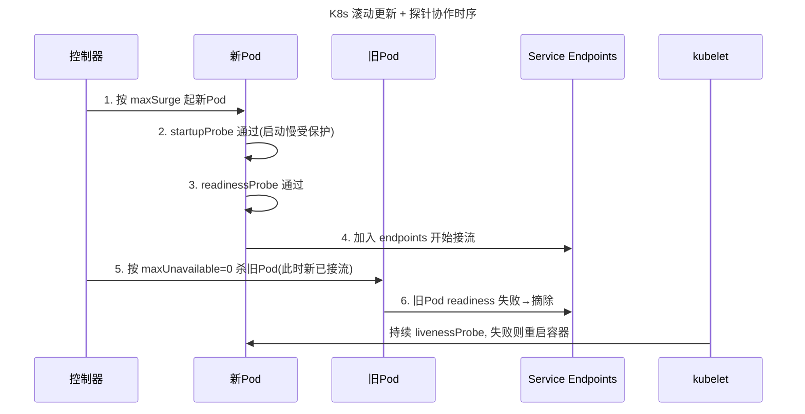

# CI/CD · 11 容器化与 Kubernetes 集成

> 容器化是 CI/CD 的基石：它把「在我机器上能跑」变成「在任意机器上都一样跑」。而 Kubernetes 把这种一致性从单机延伸到集群——一次构建的镜像，到处以相同方式运行与发布。

本篇是 [10-部署策略](10-部署策略.md) 在 K8s 上的「施工图纸」：部署策略讲「怎么安全上线」，本篇讲「用容器与 K8s 原语怎么把它落地」。向上衔接 [03-构建与制品管理](03-构建与制品管理.md)（镜像即制品），与 [08-云原生CI-CD与GitOps工具](08-云原生CI-CD与GitOps工具.md) 在 GitOps 层汇合；底层机制参见 [../../云原生/K8S.md](../../云原生/K8S.md)。

## 一、容器化为什么是 CI/CD 的基石

- **环境一致性**：镜像把代码 + 依赖 + 运行环境打包成一个不可变单元，开发、测试、生产环境完全一致，消灭「环境差异」类故障。
- **不可变制品（Immutable Artifact）**：一次构建，处处运行；发布时不再「现场编译」，而是「搬运已验证的镜像」，可重现、可审计。
- **一次构建，到处运行**：同一镜像可在笔记本、CI 节点、EKS/GKE/AKS、边缘节点运行，调度与发布解耦。

> 口诀：镜像是「交付物」不是「构建过程」——构建一次、签名一次、到处跑，绝不在生产现场重新编译。

## 二、Dockerfile 最佳实践

### 2.1 多阶段构建（Multi-stage）
把「编译环境」与「运行环境」分开：编译阶段用含 SDK 的大镜像，运行阶段只拷贝产物到极小基础镜像，最终镜像不含编译器与源码。

```dockerfile
# ---- 阶段1：构建 ----
FROM golang:1.23 AS builder
WORKDIR /src
COPY go.mod go.sum ./
RUN go mod download
COPY . .
RUN CGO_ENABLED=0 GOOS=linux go build -o /app/bin/server ./cmd/server

# ---- 阶段2：运行（distroless，无 shell、极小、安全） ----
FROM gcr.io/distroless/static-debian12
WORKDIR /app
COPY --from=builder /app/bin/server /app/server
# 非 root 运行
USER 65532:65532
EXPOSE 8080
# 应用自带健康检查端点
HEALTHCHECK --interval=30s --timeout=3s --start-period=10s --retries=3 \
  CMD ["/app/server", "healthz"]
ENTRYPOINT ["/app/server"]
```

```mermaid
flowchart TB
    title 多阶段构建层图
    subgraph B[builder 阶段 golang:1.23]
      SRC[源码 + go.mod] --> BUILD[go build 产物 server]
    end
    subgraph R[运行阶段 distroless]
      COPY[COPY --from=builder 仅拷贝二进制]
    end
    B -->|只传产物| R
    R --> IMG[最终镜像: 仅二进制 + 运行时, ~5MB]
```

### 2.2 关键实践清单
- **最小化基础镜像**：优先 `distroless` / `alpine` / `chainguard`（中国场景可考虑 `alpine` 或国内镜像站的精简版），避免 `ubuntu:latest` 这类几百 MB 的胖镜像。
- **非 root 用户运行**：`USER 65532`（distroless 的 nonroot）或自建低权用户，降低容器逃逸危害。
- **合理分层利用缓存**：变动少的层（基础依赖）放前面，变动多的层（业务代码）放后面，`COPY go.mod` 先于 `COPY .` 以命中依赖缓存。
- **HEALTHCHECK**：声明应用级健康端点，让容器运行时也能判断「进程在但服务废」。
- **.dockerignore**：排除 `.git`、`node_modules`、`target`、`*.md`、 secret 文件，减小构建上下文、防泄密。
- **避免 secrets 进镜像**：密钥用挂载/Secret/External Secrets，绝不用 `ENV` 或 `COPY` 把密码烧进镜像。
- **清理包管理器缓存**：`apt-get clean && rm -rf /var/lib/apt/lists/*`，减小体积。

```dockerignore
# .dockerignore 示例
.git
**/*.md
node_modules
target
*.log
secrets/
.env
Dockerfile
docker-compose.yml
```

> 口诀：Dockerfile 的灵魂是「分层缓存 + 最小攻击面」——少一层、小一点、非 root，安全和速度都来了。

⚠️ **生产踩坑**
- **latest 标签导致不可重现**：`image: myapp:latest` 在不同节点/不同时间拉到不同内容，回滚与审计全失效。一律用 `git sha` 或 `semver` 标签。
- **镜像过大拖慢拉取**：大镜像在弹性扩容（HPA/节点扩容）时拉取耗时长，拖慢扩容速度甚至触发雪崩；多阶段 + 小基础镜像是刚需。
- **特权容器风险**：`securityContext.privileged: true` 等同于近似宿主 root，被逃逸即集群沦陷；用 `runAsNonRoot`、`readOnlyRootFilesystem`、`drop ALL capabilities` 替代。
- **缓存层陷阱**：`RUN apt-get update && apt-get install -y xxx` 若与 `apt-get update` 在同一层且上游索引变了，可能命中旧缓存导致装到旧包；依赖层单独成层并及时刷新。

## 三、镜像仓库（Registry）

### 3.1 主流仓库对比

| 仓库 | 特点 | 适用 |
|------|------|------|
| Harbor（开源） | 镜像签名（Notary）、漏洞扫描（Trivy）、复制、RBAC | 自建企业级、合规 |
| ECR（AWS） | 与 IAM 集成、生命周期策略 | AWS 体系 |
| GCR/Artifact Registry（GCP） | 与 GCP 原生集成 | GCP 体系 |
| ACR（Azure） | 与 Entra ID 集成 | Azure 体系 |
| 阿里云 ACR | 国内加速、海外同步 | 国内业务 |

### 3.2 标签策略
- **git sha**：`myapp:7f3a9c2` 唯一、可追溯到提交，最推荐用于生产发布。
- **semver**：`myapp:v1.4.2` 人类可读，适合对外版本号。
- **latest 慎用**：永远浮动，破坏可重现性与回滚能力，仅适合本地/演示。

> 口诀：标签即身份证——用 git sha 锁定「这一次到底跑了什么」，latest 是匿名的危险分子。

### 3.3 Harbor 签名与扫描（示意）
```yaml
# Harbor 项目策略（概念示意，非 k8s 资源）
project:
  name: prod-apps
  vulnerability_scanning: true      # Trivy 阻断高危漏洞
  replication:                      # 跨机房同步
    - dest: harbor-dr
  content_trust: true               # 仅允许签名镜像
```

## 四、Helm：Kubernetes 包管理

### 4.1 Chart 结构
```
mychart/
├── Chart.yaml          # 名称、版本、依赖
├── values.yaml         # 默认参数（可被覆盖）
├── templates/          # 受控的 Go 模板
│   ├── deployment.yaml
│   ├── service.yaml
│   └── _helpers.tpl    # 公共模板片段
├── charts/             # 子 Chart
└── templates/NOTES.txt # 安装后提示
```

### 4.2 模板渲染：声明 + 覆盖
```yaml
# values.yaml
replicaCount: 3
image:
  repository: registry.example.com/myapp
  tag: "7f3a9c2"        # 用 git sha，不用 latest
resources:
  requests: { cpu: "100m", memory: "128Mi" }
  limits:   { cpu: "500m", memory: "256Mi" }
```
```yaml
# templates/deployment.yaml（节选）
apiVersion: apps/v1
kind: Deployment
metadata:
  name: {{ .Release.Name }}-app
spec:
  replicas: {{ .Values.replicaCount }}
  template:
    spec:
      containers:
        - name: app
          image: "{{ .Values.image.repository }}:{{ .Values.image.tag }}"
          resources:
            requests: {{ toYaml .Values.resources.requests | nindent 12 }}
            limits:   {{ toYaml .Values.resources.limits | nindent 12 }}
```

```mermaid
flowchart LR
    title Helm 渲染流程
    VALUES[values.yaml + -f 覆盖] --> TPL[Go 模板 templates/]
    CHART[Chart.yaml 元数据] --> TPL
    TPL --> RENDER[kubectl 渲染出标准 YAML]
    RENDER --> K8S[apply 到集群]
```

### 4.3 发布与原子回滚
```bash
# 安装/升级，-atomic 失败时自动回滚到上一稳定版本
helm upgrade my-app ./mychart \
  --install --atomic --timeout 5m \
  -f values-prod.yaml \
  --set image.tag=7f3a9c2

# 查看历史与回滚
helm history my-app
helm rollback my-app 2

# hooks：在升级前后执行数据库迁移等动作
# 在模板里用 annotation: "helm.sh/hook": pre-upgrade
```

### 4.4 Helm vs Kustomize

| 维度 | Helm | Kustomize |
|------|------|-----------|
| 范式 | 模板（参数化生成） | 无模板（声明式 patch/overlay） |
| 学习曲线 | 需学 Go template | YAML 原生，易上手 |
| 多环境 | values 多文件覆盖 | base + overlays 目录 |
| 包/分发 | Chart 可发布到仓库 | 直接 Git 目录 |
| 适合 | 复杂可复用应用 | 同应用多环境差异化 |

> 口诀：Helm 用「变量生成 YAML」，Kustomize 用「补丁叠加 YAML」——复杂产品选 Helm，环境差异选 Kustomize。

## 五、Kustomize：声明式 overlay

```yaml
# base/deployment.yaml
apiVersion: apps/v1
kind: Deployment
metadata:
  name: myapp
spec:
  replicas: 2
  template:
    spec:
      containers:
        - name: app
          image: myapp:7f3a9c2
```
```yaml
# overlays/prod/kustomization.yaml
resources:
  - ../../base
patches:
  - target:
      kind: Deployment
      name: myapp
    patch: |
      - op: replace
        path: /spec/replicas
        value: 6
```
```bash
kubectl apply -k overlays/prod
```

## 六、K8s 原生部署：Deployment 滚动更新 + 探针

### 6.1 滚动更新参数
见 [10-部署策略](10-部署策略.md) 第五节。`maxSurge` / `maxUnavailable` 控制节奏；零停机推荐 `maxUnavailable: 0`、`maxSurge: 1` 或 `25%`。

### 6.2 三种探针协作
- **startupProbe（启动探针）**：保护启动慢的应用，期间禁用 liveness/readiness，防止启动期被误杀。
- **readinessProbe（就绪探针）**：决定 Pod 是否**进入 Service endpoints 接流量**；失败即从端点摘除（不重启）。
- **livenessProbe（存活探针）**：决定容器**是否健康**，失败则 kubelet 重启容器。

> 口诀：就绪管「接不接流」，存活管「死不死掉」——二者职责不同，配错就是雪崩或不接流。

```yaml
apiVersion: apps/v1
kind: Deployment
metadata:
  name: myapp
spec:
  replicas: 4
  strategy:
    type: RollingUpdate
    rollingUpdate:
      maxSurge: 1
      maxUnavailable: 0
  selector:
    matchLabels: { app: myapp }
  template:
    metadata:
      labels: { app: myapp }
    spec:
      containers:
        - name: app
          image: registry.example.com/myapp:7f3a9c2
          ports: [{ containerPort: 8080 }]
          startupProbe:
            httpGet: { path: /healthz, port: 8080 }
            failureThreshold: 30
            periodSeconds: 2          # 最多允许 60s 启动
          readinessProbe:
            httpGet: { path: /ready, port: 8080 }
            initialDelaySeconds: 5
            periodSeconds: 5
            failureThreshold: 3
          livenessProbe:
            httpGet: { path: /live, port: 8080 }
            initialDelaySeconds: 15
            periodSeconds: 10
            failureThreshold: 3
          resources:
            requests: { cpu: "100m", memory: "128Mi" }
            limits:   { cpu: "500m", memory: "256Mi" }
```



### 6.3 回滚与状态命令
```bash
kubectl set image deployment/myapp app=registry.example.com/myapp:9b1c4d0
kubectl rollout status deployment/myapp
kubectl rollout undo deployment/myapp
kubectl rollout undo deployment/myapp --to-revision=2
kubectl rollout history deployment/myapp
```

### 6.4 StatefulSet / DaemonSet 简要
- **StatefulSet**：有状态（DB、MQ），稳定网络标识、有序部署/扩缩、持久存储。
- **DaemonSet**：每个节点跑一份（日志/监控 Agent），节点级守护。

⚠️ **生产踩坑**
- **探针配置错误引发雪崩/不接流**：readiness 路径在启动期就返回失败 → Pod 永远不进 endpoints（不接流）；liveness 路径依赖外部依赖（如 DB） → DB 抖动导致全量重启（雪崩）。liveness 只查「进程死活」，不要查下游依赖。
- **探针阈值太紧**：`periodSeconds` 太小、`failureThreshold` 太小，网络抖动即误杀。
- **无优雅终止**：应用不处理 `SIGTERM`、不 `sleep` 等待连接排空，滚动更新会丢弃在途请求。需 `terminationGracePeriodSeconds` + 应用优雅 shutdown。

## 七、Argo Rollouts：K8s 上的金丝雀 / 蓝绿

### 7.1 为什么不用原生 Deployment
原生 Deployment 只能「按 Pod 批次」滚动，无法「按流量百分比」金丝雀，也没有指标护航的自动晋级。Argo Rollouts 用 `Rollout` CRD 扩展 Deployment，支持金丝雀/蓝绿 + `AnalysisTemplate` 自动分析。

### 7.2 Rollout 金丝雀 + 自动分析
```yaml
apiVersion: argoproj.io/v1alpha1
kind: Rollout
metadata:
  name: api-server
spec:
  replicas: 10
  selector:
    matchLabels: { app: api-server }
  template:
    metadata:
      labels: { app: api-server }
    spec:
      containers:
        - name: api-server
          image: registry.example.com/api-server:v2.1.0
          ports: [{ containerPort: 8080 }]
  strategy:
    canary:
      steps:
        - setWeight: 5                  # 先放 5% 流量
        - pause: { duration: 5m }       # 观察窗口
        - analysis:
            templates:
              - templateName: success-rate   # 指标达标才继续
        - setWeight: 25
        - pause: { duration: 10m }
        - setWeight: 100
      # 在 Service Mesh 下按权重切流（Istio 示例）
      trafficRouting:
        istio:
          virtualService:
            name: api-server
            routes: [primary]
```
```yaml
# AnalysisTemplate：用 Prometheus 成功率当晋级门槛
apiVersion: argoproj.io/v1alpha1
kind: AnalysisTemplate
metadata:
  name: success-rate
spec:
  metrics:
    - name: success-rate
      interval: 2m
      successCondition: result[0] >= 0.95
      failureLimit: 3
      provider:
        prometheus:
          address: http://prometheus:9090
          query: |
            sum(rate(http_requests_total{job="api-server",status=~"2.."}[5m]))
            / sum(rate(http_requests_total{job="api-server"}[5m]))
```

```mermaid
flowchart LR
    title Argo Rollouts 金丝雀分析图
    U[流量] --> VS[VirtualService/Service]
    VS -->|95%| STABLE[stable RS v1]
    VS -->|5%| CANARY[canary RS v2]
    CANARY --> A[AnalysisRun 查 Prometheus]
    A -->|successCondition 达标| NEXT[setWeight 25 → 100]
    A -->|failureLimit 触发| ABORT[abort, 回退 stable]
    NEXT --> DONE[新版本成为 stable]
```

### 7.3 与 GitOps 衔接（接 [08-云原生CI-CD与GitOps工具](08-云原生CI-CD与GitOps工具.md)）
Argo CD 负责把 Git 里的 `Rollout` 期望状态同步到集群；Argo Rollouts 负责在集群内把「这一次发布」按金丝雀步骤安全推进。二者分工：**Argo CD 管「期望什么」，Argo Rollouts 管「怎么安全到达」**。安装 `argo-rollouts` 插件后，Rollout 可直接在 Argo CD UI 里 promote/abort。

> 口诀：Argo CD 定「目标」，Argo Rollouts 走「过程」——GitOps 管终态，渐进式交付管路径。

## 八、Operator 模式简介

特定中间件（如数据库、消息队列）的运维知识被编码为「自定义资源（CRD）+ 自定义控制器」，集群按声明自动完成部署、备份、故障转移。例如 `MysqlCluster` CR 声明副本数与版本，控制器调谐出 StatefulSet、PVC、备份任务。

```yaml
apiVersion: apps.shop.com/v1
kind: MysqlCluster
metadata: { name: mydb }
spec:
  replicas: 3
  version: "8.0"
  storage: 20Gi
```

> 口诀：Operator 把「老手的运维经验」写成控制器——集群自己会按最佳实践照顾有状态服务。

## 与其他模块的关联

- [10-部署策略](10-部署策略.md)：本文是部署策略在 K8s 上的具体落地（滚动 / 金丝雀 / 蓝绿）。
- [08-云原生CI-CD与GitOps工具](08-云原生CI-CD与GitOps工具.md)：Argo CD + Argo Rollouts 的 GitOps 协同，渐进式交付的工程底座。
- [03-构建与制品管理](03-构建与制品管理.md)：镜像即不可变制品，本文 Dockerfile/Registry 段承接其「制品来源」。
- [09-流水线设计模式与最佳实践](09-流水线设计模式与最佳实践.md)：镜像构建、推送、Helm 升级常作为流水线 stage。
- [../../云原生/K8S.md](../../云原生/K8S.md)：探针、Service、Ingress、VirtualService、Operator 与 CNCF 生态的完整说明。
- [../大数据/10-资源调度：YARN与Kubernetes.md](../大数据/10-资源调度：YARN与Kubernetes.md)：K8s 作为统一调度平台的资源视角。

## 参考

- Kubernetes 官方文档 — Deployments / 探针: https://kubernetes.io/docs/concepts/workloads/controllers/deployment/ ｜ https://kubernetes.io/docs/tasks/configure-pod-container/configure-liveness-readiness-startup-probes/
- Kubernetes 官方文档 — Deployment 滚动更新策略: https://kubernetes.io/docs/reference/kubernetes-api/workload-resources/deployment-v1/
- Argo Rollouts 官方文档 — Architecture / Getting Started / Analysis（2025）: https://argoproj.github.io/argo-rollouts/architecture/ ｜ https://argoproj.github.io/argo-rollouts/getting-started/
- Argo Rollouts 金丝雀 + 指标分析实践（2025）: https://geekoncloud.com/blog/zero-downtime-kubernetes-deployments-argo-rollouts ｜ https://medium.chuklee.com/argo-rollouts-rollout-analysis-0a839156e6d4
- Helm 官方文档 — 安装/升级/回滚: https://helm.sh/docs/helm/helm_upgrade/ ｜ https://helm.sh/docs/topics/charts/
- Kustomize 官方文档: https://kustomize.io/
- Harbor 官方文档 — 镜像签名与漏洞扫描: https://goharbor.io/docs/
- 零停机滚动更新最佳实践（探针 + 优雅终止，2025）: https://devops.aibit.im/en/article/how-to-perform-zero-downtime-kubernetes-rolling-updates
