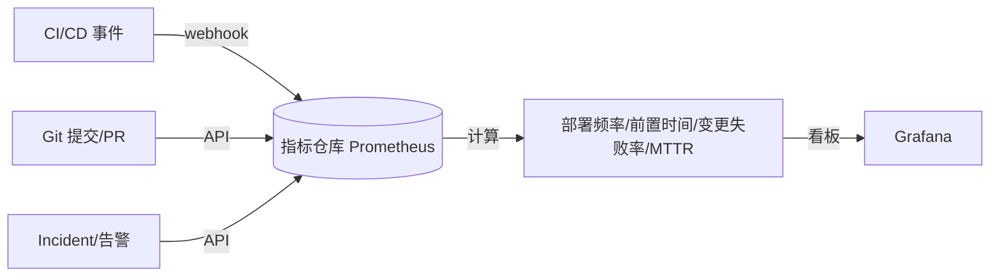
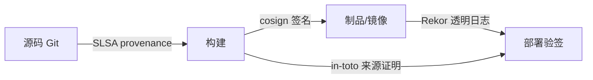
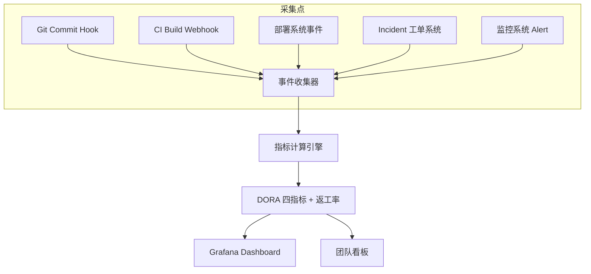
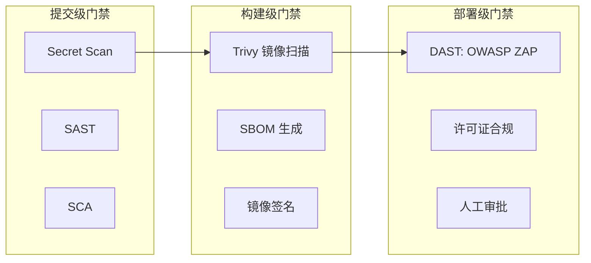
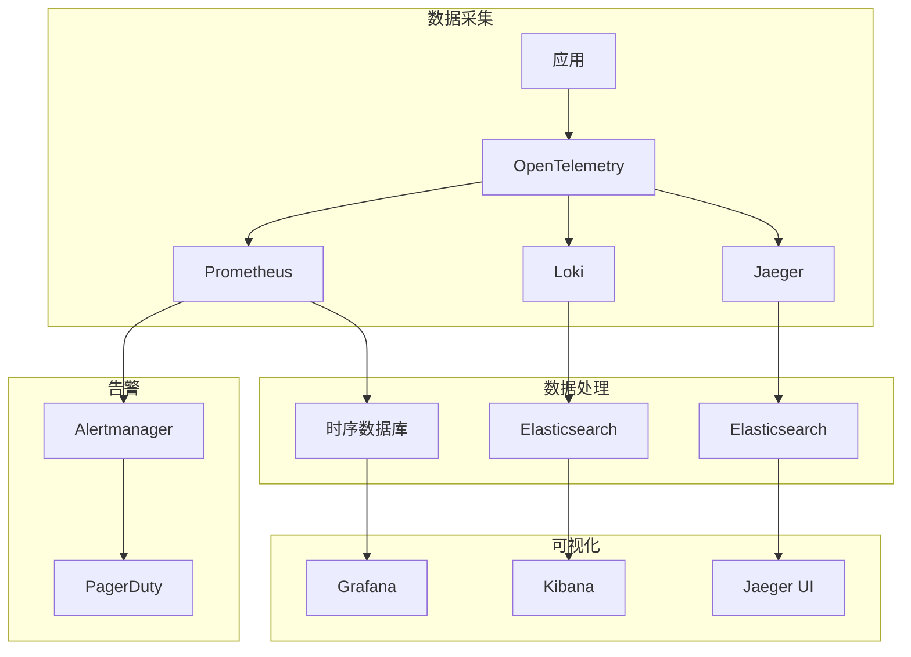

# CI/CD · 13 可观测性、DORA 度量与 DevSecOps

> "你无法改进你无法度量之物；你无法防御你无法左移之险。" 可观测性让流水线"看得见"，DORA 让效能"可比较"，DevSecOps 让安全"内建而非外挂"。

本篇串起 CI/CD 的"最后一公里与最前一公里"：研发效能度量（DORA 四项 + 2025 新增返工率）、流水线可观测性、制品溯源；以及把安全左移进流水线的 DevSecOps（SAST/DAST/SCA/secret scan/镜像扫描/IaC 扫描）、深入软件供应链（SBOM / SLSA / Sigstore）、平台工程与 AI 辅助 CI/CD 趋势。

## 一、研发效能度量与 DORA 四项关键指标

DORA（DevOps Research and Assessment，Google 团队）用**四个关键指标**衡量软件交付效能，后被写入《Accelerate》并成为业界事实标准：

| 指标 | 英文 | 含义 | 衡量维度 |
|------|------|------|----------|
| 部署频率 | Deployment Frequency (DF) | 向生产交付代码的频率 | 吞吐量(速度) |
| 变更前置时间 | Lead Time for Changes (LT) | 从提交到生产跑通的时间 | 吞吐量(速度) |
| 变更失败率 | Change Failure Rate (CFR) | 导致生产故障/需修复的部署占比 | 稳定性 |
| 服务恢复时间 | MTTR / Failed Deployment Recovery Time | 故障后恢复服务的时长 | 稳定性 |

> 口诀：**"快用 DF+LT，稳用 CFR+MTTR；效能是吞吐量与稳定性的双轴，不是单看谁跑得快。"**

### 1.1 2025 DORA 报告要点（已联网核实）

2025 年报告更名为 **《State of AI-assisted Software Development》**，调研约 **5000** 名技术从业者。核心变化：

- **新增第五指标「返工率 Rework Rate」**：因生产问题而需的非计划修复/热修占比，补上原四项漏掉的"稳定性盲区"。指标重组为：**吞吐量**（DF、LT、恢复时间）与**不稳定度**（CFR、Rework Rate）。
- **AI 已成日常**：**90%** 开发者在工作中使用 AI 工具（同比 +14%），平均每天约 **2 小时**。但报告指出 **"mirror and multiplier（镜子与放大器）"效应**——AI 放大团队既有的好流程与烂流程：流程好则更快，流程烂则更快产出烂代码。
- **分类方式改变**：2025 起不再用 Elite/High/Medium/Low 固定档，改用**百分位分布**；业界常以 Top 15% 近似原"精英档"。
- **新增「AI Capabilities Model」**：七个实践决定 AI 是助力还是阻力（如代码审查、文档、安全左移是否被 AI 增强）。

**2025 精英区间（Top 15% 近似，来源 Multitudes 对 2025 DORA 报告 P20-21 的整理）**：

| 指标 | 精英档（Top 15%）阈值 | 该档占比 |
|------|----------------------|----------|
| 变更前置时间 LT | < 1 天 | 15% |
| 部署频率 DF | 按需（一天多次） | 16.2% |
| 服务恢复时间 MTTR | < 1 小时 | 21.3% |
| 变更失败率 CFR | 0–4% | 16.7% |
| 返工率 Rework Rate | 0–4% | 12.8%（4–8% 占 13.7%） |

> ⚠️ **AI 时代的误读**：DF 上升 ≠ 效能变好。若 DF 与 CFR、Rework Rate **同时**上升，说明"更快地产出更多要返工的东西"。解读 DORA 必须**组合看**，绝不孤立看一个指标。

### 1.2 其他效能指标与"虚荣指标"陷阱

| 指标 | 说明 | 用途 |
|------|------|------|
| Lead Time 分布 | 各 PR 的前置时间分布（中位数 vs 长尾） | 定位评审/测试瓶颈 |
| 变更批量大小 | 单次部署的变更行数/提交数 | 小批量=更易恢复 |
| 流水线时长 | 各阶段耗时之和 | 反馈速度 |
| 队列等待时间 | job 在排队未被调度的时间 | 识别资源瓶颈 |
| 构建成功率/失败率趋势 | 时间维度稳定性 | 质量门禁健康度 |

> ⚠️ **虚荣指标（vanity metrics）**：代码行数、提交数、CI 跑了多少次、覆盖率数字本身——这些不直接关联业务价值。DORA 之所以权威，是因为它只度量"对用户可感知的交付速度与稳定性"，而非"团队有多忙"。

```mermaid
flowchart LR
    title DORA 度量闭环仪表盘
    SRC[(代码/流水线的真实事件)] --> COLL[采集: deploy/incident/PR 事件]
    COLL --> CALC[计算: DF/LT/CFR/MTTR/Rework]
    CALC --> DASH[仪表盘: 趋势+同比+分位]
    DASH --> REVIEW[团队复盘: 找瓶颈]
    REVIEW --> ACTION[改进: 小批量/并行/门禁]
    ACTION --> SRC
    DASH -.告警.-> NOTIFY[Slack/飞书/邮件]
```

## 二、流水线可观测性

流水线本身也是系统，需要被观测。维度：

- **各阶段耗时**：拉代码、构建、测试、扫描、推送、部署各花多久（热点在哪）。
- **缓存命中率**：依赖/镜像层缓存命中率直接决定构建快慢。
- **构建趋势**：时长随代码量增长是否失控、失败率是否恶化。
- **队列**：job 排队等待时间（runner 不足的信号）。
- **失败即时通知**：红绿状态推到 Slack / 钉钉 / 飞书 / 邮件。

> 口诀：**"流水线不是黑盒；每个阶段都该有耗时、有成功率、有告警。"**

**用 Prometheus + Grafana 展现**：CI runner 暴露指标，Grafana 出图；用 **OpenTelemetry** 把一次 CI 跑批的"构建链路"做成 trace（每个 stage 是一个 span），可跨 job 串联分析。

```yaml
# 示例：Prometheus 抓取自建 runner 指标（片段）
scrape_configs:
  - job_name: ci-runners
    metrics_path: /metrics
    static_configs:
      - targets: ['runner-1:9100', 'runner-2:9100']
# Grafana 面板关心：job_duration_seconds、queue_wait_seconds、build_success_total
```

**失败根因即时通知**（GitHub Actions 为例）：

```yaml
# 在流水线末尾加通知步骤
  notify:
    if: failure()
    runs-on: ubuntu-latest
    steps:
      - name: 飞书/Slack 通知
        uses: slackapi/slack-github-action@v1
        with:
          channel-id: '#ci-alerts'
          slack-message: "❌ ${{ github.repository }} 的 ${{ github.workflow }} 在 ${{ github.ref }} 失败：${{ github.server_url }}/${{ github.repository }}/actions/runs/${{ github.run_id }}"
        env:
          SLACK_BOT_TOKEN: ${{ secrets.SLACK_BOT_TOKEN }}
```

## 三、制品溯源与可追溯

每一次部署都必须能回溯到：**git commit → 制品（含 digest）→ 构建号 → 谁、何时、用什么流水线**。这是审计、合规与"出事能止血"的基础。

- 制品用 **内容寻址（digest，如 `sha256:...`）** 而非 mutable tag 引用，避免"同名不同内容"。
- 构建产生 **SBOM**（见第五节）与 **provenance**（构建来源证明）。
- 留存：构建日志、扫描结果、签名记录至少保留一个合规周期（如 1–3 年）。

> 口诀：**"没有 digest 的部署不叫可追溯；没有 SBOM 的制品不叫可审计。"**

## 四、DevSecOps 左移

**左移（Shift Left）**：把安全活动尽量前移到开发早期——提交/PR 阶段就扫，而非上线前才安全评审。

### 4.1 安全工具全景

| 类型 | 全称 | 代表工具 | 扫什么 | 嵌入阶段 |
|------|------|----------|--------|----------|
| SAST | 静态应用安全测试 | SonarQube、CodeQL、Semgrep | 源码漏洞/坏味道 | 提交/PR |
| DAST | 动态应用安全测试 | OWASP ZAP、Burp | 运行态漏洞（注入/XSS） | 部署后/预发 |
| IAST | 交互式应用安全测试 | Contrast | 运行时插桩 | 测试环境 |
| SCA | 软件成分分析 | Dependabot、Snyk、Renovate | 开源依赖漏洞 | 构建/PR |
| Secret Scanning | 密钥扫描 | gitleaks、trufflehog | 泄露的密钥/令牌 | 提交/PR 预提交钩子 |
| 镜像扫描 | 容器漏洞 | Trivy、Grype | 基础镜像/依赖 CVE | 构建后 |
| IaC 扫描 | 基础设施即代码 | Checkov、TFSec | Terraform/K8s 误配置 | PR |
| 许可证合规 | License | FOSSA、ScanCode | 许可证冲突（GPL 传染） | PR |

```mermaid
flowchart TD
    title DevSecOps 在流水线各阶段嵌入
    subgraph 提交/PR
      A1[Secret Scan: gitleaks]
      A2[SAST: Semgrep/CodeQL]
      A3[IaC 扫描: Checkov]
      A4[SCA: Dependabot/Renovate]
    end
    subgraph 构建
      B1[Trivy 镜像扫描]
      B2[SBOM 生成: syft/trivy]
      B3[单元测试+覆盖率]
    end
    subgraph 部署前
      C1[DAST: OWASP ZAP]
      C2[许可证合规检查]
      C3[质量门禁: 不达标阻断]
    end
    subgraph 运行
      D1[运行时防护 + 持续扫描]
      D2[RASP/WAF]
    end
    A1 --> B1
    A2 --> B1
    A3 --> B1
    A4 --> B1
    B1 --> C1
    B2 --> C2
    C1 --> C3
    C2 --> C3
    C3 --> D1
    D1 --> D2
    C3 -.失败.-> BLOCK[[阻断合并/发布]]
```

### 4.2 质量门禁与踩坑

质量门禁（Quality Gate）：在流水线设阈值，超过则**阻断**发布——例如 CRITICAL/HIGH 漏洞未修复、密钥扫描命中、测试覆盖率下降。

> ⚠️ **安全卡点三大反模式**：
> 1. **太严拖慢交付**：把所有 INFO/LOW 都设成阻断，开发者天天和噪声搏斗，最终学会"跳过/忽略"。
> 2. **误报疲劳**：不区分"可达/不可达"，一律告警，信任被耗尽。
> 3. **只扫不修**：扫描报告堆着没人跟，门禁形同虚设。

建议：门禁只对**高危 + 有修复方案 + 可达**的项阻断；其余进技术债看板；定期的忽略项要有**到期日**（如 `.trivyignore` 必须带 `exp:`）。

### 4.3 Trivy 实战（容器与更多）

Trivy（Aqua）是目前事实标准的开源扫描器，覆盖镜像、文件系统、Git 仓库、K8s、IaC、密钥、许可证，还能直接出 SBOM。

```bash
# 构建后立即扫描，发现 HIGH/CRITICAL 则让构建失败
trivy image --severity HIGH,CRITICAL --exit-code 1 --ignore-unfixed myapp:${{ sha }}

# 顺带扫密钥与误配置（不止 CVE）
trivy image --scanners vuln,secret,misconfig myapp:${{ sha }}

# 生成 SBOM（CycloneDX / SPDX 两种格式都行）
trivy image --format cyclonedx --output sbom.cdx.json myapp:${{ sha }}
trivy image --format spdx-json  --output sbom.spdx.json myapp:${{ sha }}

# 定时扫描：今天干净的镜像，两周后可能爆 CVE——所以要做计划任务
# 0 4 * * *  trivy image --severity HIGH,CRITICAL --ignore-unfixed \
#   --format json --output /var/log/trivy/$(date +%F).json registry/app:latest
```

```yaml
# GitHub Actions：Trivy 扫描并上传 SARIF 到 Security 面板
# .github/workflows/scan.yml
name: image-scan
on: [push, pull_request]
jobs:
  scan:
    runs-on: ubuntu-latest
    steps:
      - uses: actions/checkout@v4
      - name: Build
        run: docker build -t myapp:${{ github.sha }} .
      - name: Trivy scan
        uses: aquasecurity/trivy-action@master
        with:
          image-ref: myapp:${{ github.sha }}
          severity: CRITICAL,HIGH
          exit-code: '1'
          ignore-unfixed: true
          format: sarif
          output: trivy.sarif
      - name: Upload SARIF
        if: always()
        uses: github/codeql-action/upload-sarif@v3
        with:
          sarif_file: trivy.sarif
```

> Grype（Anchore）+ Syft 与 Trivy **互补**：二者漏洞库覆盖略有差异，生产级流水线常两者并行，捕捉对方漏报。

## 五、软件供应链安全（深入）

### 5.1 SBOM（软件物料清单）

SBOM 是"软件由哪些成分组成"的机器可读清单。主流格式：

| 格式 | 维护方 | 特点 |
|------|--------|------|
| **CycloneDX** | OWASP | 轻量、原生支持漏洞(VEX)、供应链数据 |
| **SPDX** | Linux Foundation（3.0 RC 2025） | ISO 标准、许可证表达强 |

SBOM 让"我们是否用了 log4j / 某个有 CVE 的组件"从"翻代码"变成"一条查询"。它在 [03-构建与制品管理](../CI-CD/03-构建与制品管理.md) 已提概念，这里落到生成与消费。

```bash
# 用 syft/trivy 生成 SBOM
syft  myapp:latest -o cyclonedx-json > sbom.cdx.json
trivy image --format cyclonedx --output sbom.cdx.json myapp:latest

# 之后只扫 SBOM，无需再拉镜像（审计/二次扫描更快）
grype sbom:./sbom.cdx.json --fail-on high
trivy sbom sbom.cdx.json
```

### 5.2 SLSA（Supply-chain Levels for Software Artifacts）

OpenSSF 主导的供应链安全分级框架（读作"salsa"）。**v1.1（2025-04）** 聚焦 **Build Track**；**v1.2（2025-11-24 标记 Approved）** 增加了 **Source Track**。它由"轨道（track）× 等级（level）"组成，允许某一方面先达标。

**Build Track（构建轨道）**：

| 等级 | 名称 | 关键要求 | 防什么 |
|------|------|----------|--------|
| L0 | 无保证 | 无要求 | — |
| L1 | Provenance 存在 | 自动生成 provenance（谁/怎么/用什么输入构建） | 人为失误、文档缺失 |
| L2 | 托管构建平台 | L1 + 构建平台**签名** provenance（如 GitHub Actions） | 构建后篡改 |
| L3 | 加固构建平台 | L2 + 隔离/临时环境、签名密钥不可被构建步骤接触 | 构建中篡改（如被投毒的 runner） |

**Source Track（v1.2 新增）**：L1 版本可控、L2 历史不可变且连续、L3 持续技术控制（强制评审/2FA/签名提交/CODEOWNERS）。

> 达成路径：先用 `slsa-github-generator` 在 GitHub Actions 出 L3 provenance（GitHub OIDC + Fulcio 即满足 Build L3）；自托管 Jenkins/GitLab 不加硬化通常只能到 L2。

### 5.3 Sigstore：无密钥签名

传统代码签名要管长期私钥（轮换、HSM、分发公钥），小团队玩不起。Sigstore 用 **OIDC 身份换临时证书**颠覆模型：

- **Fulcio**：短期 CA，凭 OIDC 身份签发**几分钟有效**的 X.509 证书，私钥用完即弃。
- **Rekor**：不可篡改的**透明日志**，记录每次签名（制品 digest + 证书 + 签名）。
- **cosign**：客户端，容器镜像/ blob / SBOM 的签名与验签。

```bash
# 无密钥签名（身份绑定到 workflow OIDC）
COSIGN_EXPERIMENTAL=1 cosign sign registry.example.com/myapp@sha256:abcdef...

# 部署前验签：必须来自指定 workflow 且由 GitHub OIDC 签发
cosign verify \
  --certificate-identity "https://github.com/myorg/myrepo/.github/workflows/ci.yml@refs/heads/main" \
  --certificate-oidc-issuer "https://token.actions.githubusercontent.com" \
  registry.example.com/myapp:latest

# 验签 SBOM 证明（attestation）
cosign verify-attestation --type cyclonedx \
  --certificate-identity "..." --certificate-oidc-issuer "..." \
  registry.example.com/myapp:latest | jq .payload | base64 -d | jq .
```

**in-toto**：定义制品"来源证明"的框架，SLSA provenance 就是其 attestation 的一种。Sigstore Policy Controller / Kyverno 在 K8s 准入时强制校验签名与 digest。

```mermaid
flowchart LR
    title SLSA 供应链信任链
    DEV[开发者/CI 身份 OIDC] -->|登录| FULCIO[Fulcio: 签发短期证书]
    BUILD[CI 构建制品] --> SIGN[cosign 签名]
    FULCIO --> SIGN
    SIGN --> REKOR[Rekor: 透明日志存证]
    SIGN --> REG[OCI 仓库: 镜像+签名+SBOM attestation]
    REKOR --> VERIFY[消费端验签: cosign / Kyverno / Policy Controller]
    REG --> VERIFY
    VERIFY -->|通过| DEPLOY[准入并部署]
    VERIFY -->|失败| DENY[[拒绝部署]]
    PROV[SLSA Provenance(in-toto)] --> REG
```

> ⚠️ **签名无用论的反面**：签名只有"在部署时强制验签"才有价值。若只是签了却没人验，被替换的镜像照样能部署——必须配合 K8s 准入控制（Kyverno / Sigstore Policy Controller）形成闭环。

## 六、平台工程与内部开发者平台（IDP）

平台工程把 CI/CD、环境、密钥、可观测等能力沉淀成**自助式内部平台**，降低研发认知负担。

- 典型载体：**Backstage**（CNCF，统一开发者门户 + 软件目录）、**Port**（可建模的 IDP）。
- 与 CI/CD 的关系：CI/CD 是"引擎"，IDP 是"方向盘和仪表盘"——研发在 IDP 点一下"新建服务/跑流水线/看 DORA 指标"，底层由 CI/CD 与 GitOps 执行。
- 价值：标准化最佳实践（安全门禁、密钥注入、环境模板内置），减少"每个团队重复造轮子 + 各自踩坑"。

> 口诀：**"平台工程不是再加一层审批，而是把正确做法做成默认选项，让研发自助且不易犯错。"**

## 七、AI 辅助 CI/CD（2025–2026 趋势）

AI 正在重塑 CI/CD 的"诊断、选择、生成"三件事：

| 能力 | 说明 | 代表（已核实） |
|------|------|----------------|
| 智能测试选择 | 只跑受本次变更影响的测试，省 60–80% 时间 | Launchable、Buildpulse、Codecov |
| Flaky 测试检测/隔离 | 从历史识别不稳定测试并隔离，避免误拦 | Buildpulse、Harness AIDA |
| 失败根因智能分析 | 解析失败日志、定位根因、给修复建议 | GitHub Copilot（PR 评论）、Datadog Watchdog |
| 自然语言生成流水线 | 用 Markdown/自然语言生成 YAML 工作流 | GitHub Agentic Workflows（2026-02 预览） |
| PR 描述/变更摘要 | 自动生成变更摘要，辅助评审 | Copilot PR 摘要、Autofix |
| 自愈流水线 | Agent 诊断失败→改代码→开 PR | GitHub Copilot SDK（2026-01 发布） |
| 构建时长预测/智能调度 | 预测耗时、错峰调度、弹性扩 runner | AIOps 平台 |

> ⚠️ **AI 的风险**：① 幻觉配置——生成的 YAML 看似合理实则错误/越权；② 凭证泄露——Agent 读日志/上下文时把密钥带进模型或 PR 评论；③ 过度自信——AI 给的"修复"掩盖真实 bug。**AI 出的流水线改动也要走 review + 门禁，不能自动合并。**

```mermaid
flowchart TB
    title AI 辅助 CI/CD 能力地图
    subgraph 诊断
      D1[失败根因分析]
      D2[Flaky 检测与隔离]
      D3[构建时长预测]
    end
    subgraph 选择
      S1[智能测试选择]
      S2[变更影响分析]
    end
    subgraph 生成
      G1[自然语言→流水线 YAML]
      G2[PR 摘要/Autofix]
      G3[自愈: 改代码开 PR]
    end
    subgraph 治理
      GV1[质量门禁必须仍生效]
      GV2[AI 改动走 review]
      GV3[防凭证泄露]
    end
    D1 --> GV1
    D2 --> GV1
    S1 --> GV1
    G1 --> GV2
    G2 --> GV2
    G3 --> GV2
    GV2 --> GV3
```

## 八、趋势展望小结

- **GitOps 主流化**：声明式 + 不可变 + 自动 reconcile 成为生产默认（呼应 [08-云原生CI-CD与GitOps工具](../CI-CD/08-云原生CI-CD与GitOps工具.md)）。
- **云原生流水线**：构建用临时 rootless VM / BuildKit，天然满足 SLSA L3。
- **Serverless CI**：按 job 起停，零闲置成本。
- **AI 原生**：诊断/选择/生成内建到流水线，但门禁与人工 review 不可省。
- **合规内建**：SBOM、SLSA、签名验签成为采购与等保的硬性要求。

## 九、SLI/SLO/SLA 体系

### SLI/SLO/SLA 定义

```text
SLI（Service Level Indicator）服务等级指标：
  可量化的服务质量度量
  示例：
    ├── 可用性：成功请求数 / 总请求数
    ├── 延迟：P95 响应时间
    ├── 吞吐：每秒请求数（QPS）
    └── 错误率：错误请求数 / 总请求数

SLO（Service Level Objective）服务等级目标：
  SLI 的目标值
  示例：
    ├── 可用性 SLO：99.9%（每月宕机 ≤ 43.8 分钟）
    ├── 延迟 SLO：P95 < 200ms
    ├── 吞吐 SLO：QPS > 1000
    └── 错误率 SLO：< 0.1%

SLA（Service Level Agreement）服务等级协议：
  对客户的正式承诺
  包含 SLO + 补偿条款
  示例：
    ├── 可用性 SLA：99.9%
    ├── 未达标补偿：按比例退款
    └── 报告周期：每月提供 SLA 报告

Error Budget：
  允许的故障预算 = 1 - SLO
  99.9% SLO → Error Budget = 0.1%
  每月允许宕机：720 分钟 × 0.1% = 43.8 分钟

Error Budget 策略：
  ├── 预算充足：可以发布新功能、进行实验
  ├── 预算紧张：减少发布、加强测试
  └── 预算耗尽：停止发布、专注稳定性
```

### SLI 定义模板

```yaml
# SLI 定义模板
sli:
  name: "http_availability"
  description: "HTTP 请求可用性"
  metric: "success_rate"
  query: |
    sum(rate(http_requests_total{status!~"5.."}[5m])) 
    / 
    sum(rate(http_requests_total[5m]))
  sli_spec:
    target: 0.999
    window: 30d
  error_budget:
    target: 0.001
    window: 30d
  alerting:
    warning: 0.9995
    critical: 0.999
    window: 5m

# 多维度 SLI 定义
slis:
  - name: "availability"
    query: |
      sum(rate(http_requests_total{status!~"5.."}[5m])) 
      / sum(rate(http_requests_total[5m]))
    target: 0.999
  - name: "latency_p95"
    query: |
      histogram_quantile(0.95, rate(http_request_duration_seconds_bucket[5m]))
    target: 0.2
  - name: "error_rate"
    query: |
      sum(rate(http_requests_total{status=~"5.."}[5m])) 
      / sum(rate(http_requests_total[5m]))
    target: 0.001
```

## 十、DORA 指标深入

### DORA 指标计算方法

```
DORA 指标计算方法：
  1. 部署频率（Deployment Frequency）
     计算：生产环境部署次数 / 时间窗口
     数据来源：CI/CD 流水线、Git Tag
     示例：每天 10 次 → 部署频率 = 10 次/天

  2. 变更前置时间（Lead Time for Changes）
     计算：代码提交到生产部署的时间
     数据来源：Git commit 时间到部署时间
     示例：平均 2 小时 → 变更前置时间 = 2h

  3. 变更失败率（Change Failure Rate）
     计算：导致故障的变更比例
     数据来源：故障报告、回滚记录
     示例：每月 100 次部署，5 次故障 → 失败率 = 5%

  4. 恢复时间（Time to Restore Service）
     计算：故障到恢复的时间
     数据来源：故障报告、监控系统
     示例：平均 30 分钟 → 恢复时间 = 30m

  分类标准：
    精英：部署频率 > 1次/天，前置时间 < 1h，失败率 < 5%，恢复时间 < 1h
    高效：部署频率 1次/天-1次/周，前置时间 1天-1周，失败率 5-10%，恢复时间 < 1天
    中等：部署频率 1次/月-1次/周，前置时间 1周-1月，失败率 10-15%，恢复时间 1天-1周
    低效：部署频率 < 1次/月，前置时间 > 1月，失败率 > 15%，恢复时间 > 1周
```

### DORA 指标收集

```yaml
# DORA 指标收集配置
dora_metrics:
  deployment_frequency:
    data_source: gitlab_api
    query: |
      SELECT COUNT(*) 
      FROM deployments 
      WHERE created_at > NOW() - INTERVAL '1 day'
    target: 10
    unit: "deployments/day"

  lead_time_for_changes:
    data_source: gitlab_api
    query: |
      SELECT AVG(deployed_at - committed_at)
      FROM commits
      WHERE deployed_at IS NOT NULL
      AND committed_at > NOW() - INTERVAL '30 days'
    target: 120
    unit: "minutes"

  change_failure_rate:
    data_source: incident_api
    query: |
      SELECT COUNT(*) FILTER (WHERE severity = 'critical') * 100.0 / COUNT(*)
      FROM deployments
      WHERE created_at > NOW() - INTERVAL '30 days'
    target: 5
    unit: "percent"

  time_to_restore:
    data_source: incident_api
    query: |
      AVG(resolved_at - detected_at)
      FROM incidents
      WHERE severity = 'critical'
      AND detected_at > NOW() - INTERVAL '30 days'
    target: 30
    unit: "minutes"
```

## 十一、DevSecOps 安全左移

### 安全左移实施

```text
安全左移（Shift-Left Security）：
  在软件开发生命周期早期集成安全
  传统：开发 → 测试 → 安全审计（右移，成本高）
  左移：安全需求 → 设计 → 开发 → 测试（全程集成）

安全左移实施步骤：
  1. 安全需求阶段
     ├── 威胁建模（STRIDE）
     ├── 安全需求文档
     └── 安全设计评审

  2. 开发阶段
     ├── IDE 安全插件（SonarLint、ESLint Security）
     ├── 代码审查（安全检查清单）
     ├── 依赖扫描（Snyk、Dependabot）
     └── 密钥管理（HashiCorp Vault）

  3. 构建阶段
     ├── SAST（静态应用安全测试）
     ├── SCA（软件组成分析）
     ├── 密钥扫描（GitLeaks、TruffleHog）
     └── 容器镜像扫描（Trivy、Clair）

  4. 测试阶段
     ├── DAST（动态应用安全测试）
     ├── IAST（交互式应用安全测试）
     ├── 渗透测试
     └── 安全回归测试

  5. 部署阶段
     ├── 基础设施即代码安全（Terraform 代码扫描）
     ├── 容器安全（运行时保护）
     ├── 网络安全（网络策略）
     └── 密钥管理（Kubernetes Secrets）

  6. 运行阶段
     ├── RASP（运行时应用自我保护）
     ├── WAF（Web 应用防火墙）
     ├── 入侵检测
     └── 安全日志审计
```

### 安全扫描工具链

```yaml
# 安全扫描工具链配置
security_scanning:
  sast:
    tool: "SonarQube"
    languages: ["java", "python", "javascript"]
    rules: "OWASP Top 10"
    gate: "quality"

  sca:
    tool: "Snyk"
    severity: ["critical", "high"]
    auto_fix: true
    pr_creation: true

  secret_scan:
    tool: "GitLeaks"
    rules: ["aws_key", "gcp_key", "private_key"]
    blocking: true

  container_scan:
    tool: "Trivy"
    severity: ["critical", "high"]
    ignore_unfixed: false
    format: "sarif"

  dast:
    tool: "OWASP ZAP"
    target: "https://staging.example.com"
    rules: "OWASP Top 10"
    timeout: "30m"

  iac_scan:
    tool: "Checkov"
    frameworks: ["terraform", "kubernetes"]
    severity: ["critical", "high"]
    soft_fail: false

# CI/CD 集成
pipeline:
  stages:
    - security_scan
    - build
    - test
    - deploy

  security_scan:
    sast: "sonar-scanner"
    sca: "snyk test"
    secret_scan: "gitleaks detect"
    container_scan: "trivy image"
```

## 十二、SRE 错误预算管理

### 错误预算策略

```text
错误预算（Error Budget）策略：
  1. 定义错误预算
     ├── SLO: 99.9% 可用性
     ├── 错误预算: 0.1%（每月 43.8 分钟）
     └── 滚动窗口: 30 天

  2. 错误预算消耗
     ├── 事件 1: 5 分钟故障 → 消耗 11.4%
     ├── 事件 2: 10 分钟故障 → 消耗 22.8%
     └── 总消耗: 34.2%（剩余 65.8%）

  3. 错误预算策略
     ├── 预算 > 50%: 正常发布，可以实验
     ├── 预算 25-50%: 减少发布，加强测试
     ├── 预算 < 25%: 停止新功能，专注稳定性
     └── 预算耗尽: 冻结发布，紧急修复

  4. 错误预算恢复
     ├── 故障修复 → 恢复可用性
     ├── 错误预算自动恢复
     └── 滚动窗口: 旧事件自动过期

错误预算仪表盘：
  ├── 当前剩余预算
  ├── 历史消耗趋势
  ├── 各服务预算分配
  └── 告警阈值设置
```

### SRE 实践模板

```yaml
# SRE 实践模板
sre_practices:
  error_budget:
    slo: 99.9%
    window: 30d
    alert_threshold: 25%
    policy: |
      if error_budget_remaining < 25%:
        freeze_deployments()
        notify_team("错误预算不足，冻结发布")
      elif error_budget_remaining < 50%:
        reduce_deployments()
        enhance_testing()
      else:
        normal_operations()

  incident_management:
    severity_levels:
      P0: "完全不可用，影响所有用户"
      P1: "主要功能不可用，影响大部分用户"
      P2: "次要功能不可用，影响部分用户"
      P3: "功能降级，影响少量用户"

    response_times:
      P0: "15 分钟响应，1 小时恢复"
      P1: "30 分钟响应，4 小时恢复"
      P2: "2 小时响应，24 小时恢复"
      P3: "8 小时响应，1 周恢复"

    on_call:
      primary: "主值班（24/7）"
      secondary: "副值班（备份）"
      escalation: "升级路径"

  postmortem:
    template: |
      # 故障复盘报告

      ## 概述
      - 故障时间：
      - 影响范围：
      - 持续时间：
      - 严重程度：

      ## 时间线
      - 发现时间：
      - 响应时间：
      - 恢复时间：
      - 根本原因：

      ## 影响
      - 用户影响：
      - 业务影响：
      - 数据影响：

      ## 根本原因
      - 技术原因：
      - 流程原因：
      - 人员原因：

      ## 改进措施
      - 短期修复：
      - 长期改进：
      - 预防措施：

      ## 经验教训
      - 做得好的：
      - 需要改进的：
      - 行动项：
```

## 与其他模块的关联

- [01-概述与核心概念](../CI-CD/01-概述与核心概念.md)：CI/CD 全景与流水线基本形态。
- [03-构建与制品管理](../CI-CD/03-构建与制品管理.md)：制品、digest、SBOM 的生成与留存。
- [08-云原生CI-CD与GitOps工具](../CI-CD/08-云原生CI-CD与GitOps工具.md)：GitOps 的声明式、不可变与签名验签闭环。
- [09-流水线设计模式与最佳实践](../CI-CD/09-流水线设计模式与最佳实践.md)：门禁、阶段拆分、失败通知的设计落点。
- [10-部署策略](../CI-CD/10-部署策略.md)：灰度/回滚与 MTTR、可追溯的联动。
- [12-环境配置与密钥管理](../CI-CD/12-环境配置与密钥管理.md)：OIDC 免密钥、Vault、外部密钥是 DevSecOps 的信任底座。
- [大数据·12-数据治理与数据质量](../大数据/12-数据治理与数据质量.md)：分级分类、审计与合规内建思路同样适用于供应链。
- [云原生·K8S](../../云原生/K8S.md)：准入控制（Kyverno/Policy Controller）、etcd 加密与运行时防护。

## 参考

- DORA 官方四指标指南：https://dora.dev/guides/dora-metrics-four-keys/
- 2025 DORA 报告（State of AI-assisted Software Development）解读（Plandek）：https://plandek.com/blog/dora-metrics-in-the-age-of-ai-how-engineering-leaders-should-measure-delivery-in-2025
- 2025 DORA 基准（Multitudes，精英区间分布）：https://www.multitudes.com/blog/dora-metrics
- SLSA v1.2 规范（Build + Source Track）：https://slsa.dev/spec/v1.2/
- SLSA v1.1 单页版：https://slsa.dev/spec/v1.1-rc1/onepage
- Sigstore 官方（cosign / Fulcio / Rekor）：https://www.sigstore.dev/
- in-toto 来源证明框架：https://in-toto.io/
- Trivy（Aqua）官方文档：https://trivy.dev/
- Grype + Syft（Anchore）：https://github.com/anchore/grype 、https://github.com/anchore/syft
- OWASP ZAP / Semgrep / gitleaks / Checkov 官方文档
- GitHub Agentic Workflows（2026-02 预览，Markdown 写流水线）：https://github.blog/
- GitHub Copilot SDK（2026-01）：https://github.com/features/copilot
- 2026 AI DevOps/CI-CD 工具综述（Launchable/Buildpulse/Harness AIDA/Datadog Watchdog）：https://superdots.sh/blog/ai-devops-tools/
- SPDX 3.0 / CycloneDX 1.6 SBOM 规范：https://spdx.dev/ 、https://cyclonedx.org/

## 十、DORA 四指标采集实战

四指标需从 CI/CD 与 Issue 系统抽取，而非拍脑袋。常见采集链路：



| 指标 | 数据源 | 采集方式 |
|------|--------|----------|
| 部署频率 | CI 部署 job / Argo CD sync | 统计成功部署次数 |
| 前置时间 | Git PR 创建→生产部署 | PR 时间戳差 |
| 变更失败率 | 部署后 incident / 回滚 | 失败部署 / 总部署 |
| MTTR | 告警开启→关闭 | incident 时长 |

```yaml
# 用 cicd-exporter / 自定义脚本把 Jenkins/GitLab 事件写入 Prometheus
# 例：部署计数指标
# - job_name: jenkins
#   metrics_path: /prometheus
# Grafana 面板按团队/服务分组展示四指标
```

## 十一、SLI / SLO 接入流水线

把可靠性目标接入发布门禁：金丝雀/灰度期间若 SLI 跌破 SLO 阈值，自动暂停或回滚。

| 概念 | 含义 | 示例 |
|------|------|------|
| SLI | 当前指标 | 错误率 0.5%、P99 220ms |
| SLO | 目标阈值 | 错误率 < 1%、P99 < 300ms |
| 错误预算 | 可容忍违规额度 | 每月 43min 不可用 |

```yaml
# Argo Rollouts AnalysisTemplate 用 SLI 作门禁
apiVersion: argoproj.io/v1alpha1
kind: AnalysisTemplate
spec:
  metrics:
    - name: error-rate
      successCondition: result < 0.01      # SLO：错误率 < 1%
      provider:
        prometheus:
          query: sum(rate(http_errors[5m]))/sum(rate(http_total[5m]))
```

## 十二、供应链安全：SLSA / cosign / sigstore



- **SLSA**：构建来源等级（L1-L3），证明"谁、在哪、怎么构建"。
- **cosign / sigstore**：keyless 签名（Fulcio 短期证书 + Rekor 日志）。
- **in-toto / SLSA provenance**：生成来源证明，部署前校验。

```bash
# 生成 SLSA provenance 并签名
cosign attest --yes --type slsaprovenance \
  --predicate provenance.json registry/app@sha256:abc
# 验签 + 验 provenance
cosign verify-attestation registry/app@sha256:abc \
  --certificate-identity-regexp '.*@corp.com'
```

## 十三、合规审计

- **等保 / SOC2 / ISO27001**：要求制品不可变、可溯源、签名验签、密钥托管。
- **审计证据自动化**：把 SBOM、签名、部署记录、审批日志汇成不可篡改证据链。
- **OPA / Kyverno**：集群准入控制，禁止未签名镜像运行、强制 Pod 安全上下文。

```yaml
# Kyverno：禁止未签名镜像
apiVersion: kyverno.io/v1
kind: ClusterPolicy
metadata: { name: require-signed }
spec:
  validationFailureAction: enforce
  rules:
    - name: check-signature
      match: { resources: { kinds: [Pod] } }
      verifyImages:
        - image: "*"
          attestors:
            - entries:
                - keyless:
                    identities:
                      - { issuer: https://oauth.corp.com }
```

## 十四、DORA 四指标采集埋点位置详解

### 14.1 采集链路架构



### 14.2 各指标埋点位置与采集方式

| 指标 | 埋点位置 | 采集方式 | 计算公式 | 数据源 |
|------|---------|---------|---------|--------|
| 部署频率 DF | ArgoCD/K8s deploy 事件 | Webhook/API | 成功部署次数/天 | CI/CD 平台 |
| 变更前置时间 LT | Git PR merge → 生产部署 | 时间戳差值 | deploy_time - first_commit_time | Git + 部署系统 |
| 变更失败率 CFR | 部署后 incident / 回滚 | 关联变更与故障 | 因变更导致故障的部署占比 | 事故工单 + 监控 |
| 服务恢复时间 MTTR | 告警开启→关闭 | incident 时长 | 故障确认到恢复的时间差 | 告警系统 |
| 返工率 Rework | 非计划修复 commit | Git commit 分类 | 非计划修复数/总部署数 | Git 分析 |

## 十五、DevSecOps 工具链集成（SonarQube + Trivy + OWASP ZAP）

### 15.1 SonarQube 静态分析集成

```yaml
- name: SonarQube Scan
  uses: SonarSource/sonarqube-scan-action@master
  env:
    SONAR_TOKEN: ${{ secrets.SONAR_TOKEN }}
    SONAR_HOST_URL: ${{ secrets.SONAR_HOST_URL }}
  with:
    args: >
      -Dsonar.projectKey=my-project
      -Dsonar.sources=src/
      -Dsonar.qualitygate.wait=true
```

| 扫描维度 | 规则 | 阻断条件 |
|----------|------|---------|
| Bug | Critical/Major | Critical 阻断 |
| 漏洞 | High/Critical | High 阻断 |
| 安全热点 | High | High 阻断 |
| 覆盖率 | 新增代码 ≥ 80% | 低于阈值阻断 |

### 15.2 Trivy 镜像扫描 + SBOM 生成

```yaml
- name: Trivy Image Scan
  uses: aquasecurity/trivy-action@master
  with:
    image-ref: ${{ env.IMAGE }}
    format: 'sarif'
    output: 'trivy.sarif'
    severity: 'CRITICAL,HIGH'
    exit-code: '1'
    scanners: 'vuln,secret,misconfig'

- name: Generate SBOM
  run: |
    trivy image --format cyclonedx --output sbom.cdx.json $IMAGE
    trivy image --format spdx-json --output sbom.spdx.json $IMAGE
```

### 15.3 OWASP ZAP 动态扫描

```yaml
zap-scan:
  stage: security
  image: ghcr.io/zaproxy/zaproxy:stable
  script:
    - zap-full-scan.py -t https://staging.example.com \
        -r zap-report.html -x zap-report.xml -J zap-report.json
    - python scripts/evaluate_zap.py \
        --input zap-report.json --max-high 0 --max-medium 5
```

## 十六、安全门禁实现（Pipeline Stage Gate）



| 门禁级别 | 拦截条件 | 处理方式 |
|----------|---------|---------|
| CRITICAL | 安全漏洞 | 阻断发布 |
| HIGH | 安全漏洞 | 阻断或安全豁免 |
| MEDIUM | 安全问题 | 警告，限期修复 |
| LOW | 安全建议 | 信息，知悉即可 |

## 十七、混沌工程在 CI/CD 中的实验

### 17.1 混沌实验类型与工具

| 实验类型 | 工具 | 目标 | 适用阶段 |
|----------|------|------|---------|
| Pod 故障 | Chaos Monkey / LitmusChaos | 验证自愈能力 | 预发/生产 |
| 网络延迟 | tc / LitmusChaos | 验证超时处理 | 预发 |
| 磁盘压力 | stress-ng | 验证资源限制 | 预发 |
| DNS 故障 | LitmusChaos | 验证 DNS 容错 | 预发 |
| 依赖服务故障 | Toxiproxy | 验证降级能力 | 预发 |

### 17.2 混沌实验与发布门禁

| 混沌实验结果 | 对发布的影响 | 处理方式 |
|-------------|-------------|---------|
| Pod 故障后 30s 内恢复 | 不阻断发布 | 继续放量 |
| Pod 故障后 60s 内恢复 | 警告 | 延长观察窗口 |
| Pod 故障后 60s 未恢复 | 阻断发布 | 回滚并修复 |
| 依赖服务故障后降级正常 | 不阻断发布 | 继续放量 |

## 十八、部署频率优化策略

| 杠杆 | 策略 | 预期效果 |
|------|------|---------|
| 小批量提交 | 每次变更 < 400 行代码 | -50% 故障半径 |
| 并行化 CI | 测试并行+构建缓存 | -60% 构建时间 |
| 自动化门禁 | SAST/SCA/测试自动拦截 | -80% 人工审批 |
| Feature Flags | 部署与发布分离 | 随时可部署 |
| 数据库解耦 | Expand-Contract 模式 | -90% Schema 变更风险 |

## 十九、Lead Time 测量方法

### 19.1 Lead Time 拆解

```text
Lead Time = 编码时间 + 评审时间 + CI 时间 + 部署时间 + 排队时间

各段时间占比（典型）：
  编码时间：30%
  评审时间：25%
  CI 时间：20%
  部署时间：10%
  排队时间：15%
```

| 时间段 | 优化策略 | 工具/方法 |
|--------|---------|----------|
| 编码时间 | 代码模板、AI 辅助 | GitHub Copilot |
| 评审时间 | 自动分配 reviewer、SLA | CODEOWNERS + 告警 |
| CI 时间 | 并行、缓存、增量 | BuildKit + Matrix |
| 部署时间 | 自动化、金丝雀 | ArgoCD + Rollouts |
| 排队时间 | 自动化门禁、优先级队列 | OPA Gatekeeper |

## 二十、混沌工程实验清单

### 20.1 基础设施层实验

| 实验 | 工具 | 预期结果 | 回滚条件 |
|------|------|---------|---------|
| Pod 随机删除 | Chaos Monkey | 30s 内自愈 | 60s 未恢复 |
| 节点故障 | LitmusChaos | 工作负载迁移 | 5min 未恢复 |
| 网络延迟注入 | tc / LitmusChaos | 超时重试成功 | 错误率 > 5% |
| 磁盘压力 | stress-ng | 资源限制生效 | OOMKill |

### 20.2 应用层实验

| 实验 | 工具 | 预期结果 | 回滚条件 |
|------|------|---------|---------|
| 依赖服务故障 | Toxiproxy | 降级逻辑生效 | 错误率 > 10% |
| 数据库连接池耗尽 | LitmusChaos | 连接池恢复 | 错误率 > 5% |
| 缓存失效 | 手动清除 | 回源正常 | 延迟 P99 > 1s |

---

## DORA 指标深度解析

```yaml
# DORA 指标定义
dora_metrics:
  # 部署频率
  deployment_frequency:
    definition: "代码部署到生产的频率"
    elite: "按需（一天多次）"
    high: "每天到每周"
    medium: "每周到每月"
    low: "每月以下"
    
  # 变更前置时间
  lead_time:
    definition: "从提交代码到生产部署的时间"
    elite: "小于一小时"
    high: "一天到一周"
    medium: "一周到一个月"
    low: "一个月以上"
    
  # 变更失败率
  change_failure_rate:
    definition: "导致服务故障的变更比例"
    elite: "0-15%"
    high: "16-30%"
    medium: "31-45%"
    low: "46-60%"
    
  # 服务恢复时间
  mttr:
    definition: "从故障恢复到服务正常的时间"
    elite: "小于一小时"
    high: "小于一天"
    medium: "一天到一周"
    low: "一周以上"
```

### DORA 指标计算

```python
# DORA 指标计算示例
def calculate_dora_metrics(deployments, failures, lead_times, incidents):
    # 部署频率（次/天）
    deploy_frequency = len(deployments) / 30
    
    # 变更前置时间（小时）
    lead_time_hours = sum(lead_times) / len(lead_times) / 3600
    
    # 变更失败率（%）
    failure_rate = len(failures) / len(deployments) * 100
    
    # 服务恢复时间（小时）
    mttr_hours = sum(incidents) / len(incidents) / 3600
    
    return {
        'deployment_frequency': deploy_frequency,
        'lead_time': lead_time_hours,
        'change_failure_rate': failure_rate,
        'mttr': mttr_hours
    }
```

### DORA 指标改进策略

| 指标 | 改进策略 | 工具支持 |
|------|----------|----------|
| 部署频率 | CI/CD自动化、Feature Flag | GitHub Actions |
| 变更前置时间 | 并行测试、快速反馈 | Jenkins/GitLab CI |
| 变更失败率 | 自动化测试、金丝雀发布 | Argo CD |
| 服务恢复时间 | 监控告警、自动回滚 | PagerDuty |

## 供应链安全框架

```yaml
# 供应链安全配置
supply_chain_security:
  # SLSA 配置
  slsa:
    level: 3
    provenance: true
    build_platform: "https://github.com/actions/runner"
    
  # 镜像签名
  cosign:
    keyless: true
    fulcio: true
    rekor: true
    
  # SBOM 生成
  sbom:
    format: "spdx-json"
    tool: "syft"
    upload: true
```

### SLSA 级别要求

| 级别 | 要求 | 说明 |
|------|------|------|
| SLSA 1 | 构建过程有文档 | 基础安全 |
| SLSA 2 | 使用版本控制构建平台 | 防篡改 |
| SLSA 3 | 构建平台不可篡改 | 高安全 |
| SLSA 4 | 双人审查 | 最高安全 |

### 供应链安全检查清单

| 检查项 | 说明 | 工具 |
|--------|------|------|
| 依赖扫描 | 检查已知漏洞 | Snyk/Trivy |
| SBOM生成 | 软件物料清单 | Syft/CycloneDX |
| 镜像签名 | 验证镜像来源 | Cosign |
| 构建验证 | 验证构建来源 | SLSA Provenance |

## 合规自动化

```yaml
# OPA Gatekeeper 策略
apiVersion: templates.gatekeeper.sh/v1
kind: ConstraintTemplate
metadata:
  name: k8srequiredlabels
spec:
  crd:
    spec:
      names:
        kind: K8sRequiredLabels
      validation:
        openAPIV3Schema:
          type: object
          properties:
            labels:
              type: array
              items:
                type: string
---
apiVersion: constraints.gatekeeper.sh/v1beta1
kind: K8sRequiredLabels
metadata:
  name: require-team-label
spec:
  match:
    kinds:
      - apiGroups: [""]
        kinds: ["Pod"]
  parameters:
    labels: ["team", "environment"]
```

### 合规检查配置

| 合规要求 | 检查内容 | 工具 |
|----------|----------|------|
| 等保三级 | 访问控制、审计 | OPA/Kyverno |
| GDPR | 数据保护、同意 | 自定义策略 |
| SOC 2 | 可用性、安全性 | 云平台审计 |
| PCI DSS | 支付安全 | 专用扫描器 |

## 混沌工程实验

```yaml
# Chaos Mesh 实验配置
apiVersion: chaos-mesh.org/v1alpha1
kind: NetworkChaos
metadata:
  name: network-delay
  namespace: production
spec:
  action: delay
  mode: all
  selector:
    labelSelectors:
      app: my-service
  delay:
    latency: "100ms"
    jitter: "10ms"
    correlation: "100"
  duration: "5m"
```

### 混沌实验类型

| 实验类型 | 说明 | 适用场景 |
|----------|------|----------|
| 网络延迟 | 模拟网络延迟 | 验证超时处理 |
| 网络丢包 | 模拟网络丢包 | 验证重试机制 |
| Pod删除 | 模拟Pod故障 | 验证自愈能力 |
| CPU压力 | 模拟CPU压力 | 验证资源限制 |
| 内存压力 | 模拟内存压力 | 验证OOM处理 |

## 可观测性架构



### 可观测性最佳实践

| 实践 | 说明 | 收益 |
|------|------|------|
| 统一标准 | 使用OpenTelemetry | 数据互通 |
| 采样策略 | 智能采样 | 降低成本 |
| 关联分析 | 指标-日志-追踪关联 | 快速定位 |
| 成本优化 | 分层存储 | 降低存储成本 |

## 变更失败率深度分析

### 变更失败率（CFR）计算与优化

| 指标 | 计算方式 | 目标值 | 改进方向 |
|------|----------|--------|----------|
| 变更失败率 | 失败部署/总部署 | < 5% | 自动化回滚、灰度发布 |
| 平均恢复时间 | 总恢复时间/故障次数 | < 1 小时 | 告警自动化、Runbook |
| 变更失败频率 | 月失败次数 | < 2 次 | 代码审查、自动化测试 |
| 回滚成功率 | 成功回滚/总回滚 | > 95% | 蓝绿部署、快速回滚 |

```
变更失败率归因分析：
  代码缺陷 → 单元测试覆盖率不足 → 提升测试覆盖率
  配置错误 → 配置管理混乱 → GitOps 配置管理
  环境差异 → 开发/生产环境不一致 → 容器化 + IaC
  依赖问题 → 第三方组件漏洞 → SCA 扫描
  人为操作 → 手动部署 → CI/CD 自动化
```

### Lead Time 拆解与优化

```
Lead Time = 代码提交 → 生产部署完成

  拆解：
    开发时间：编码 + 代码审查
    构建时间：编译 + 打包 + 测试
    部署时间：部署 + 验证
    等待时间：环境准备 + 人工审批

  优化：
    开发时间 → 代码审查自动化、PR 模板
    构建时间 → 增量构建、并行测试
    部署时间 → 蓝绿部署、Canary
    等待时间 → 自动化审批流

  目标：
    Elite：小于 1 小时
    High：1 天 ~ 1 周
    Medium：1 周 ~ 1 月
    Low：大于 1 月
```

### SAST/DAST/SCA 安全集成

| 工具类型 | 工具示例 | 集成阶段 | 扫描对象 |
|----------|----------|----------|----------|
| SAST | SonarQube、Checkmarx | 代码提交/PR | 源代码 |
| DAST | OWASP ZAP、Burp Suite | 预发布/生产 | 运行时应用 |
| SCA | Snyk、OWASP Dep-Check | 构建阶段 | 依赖组件 |
| IaC 扫描 | Checkov、Terrascan | IaC 提交 | Terraform/CloudFormation |
| Secret 扫描 | GitLeaks、TruffleHog | Git 提交 | 代码中的密钥 |

```yaml
# GitLab CI 安全扫描配置
stages:
  - security-sast
  - security-dast

sast:
  stage: security-sast
  image: sonarqube:latest
  script:
    - sonar-scanner -Dsonar.projectKey=myapp
  artifacts:
    reports:
      sast: gl-sast-report.json

dependency_scanning:
  stage: security-sast
  image: snyk/snyk:latest
  script:
    - snyk test --all-projects

dast:
  stage: security-dast
  image: owasp/zap2docker-stable
  script:
    - zap-baseline.py -t https://staging.example.com
```

### 混沌工程实验框架

| 实验类型 | 实验内容 | 工具 | 影响范围 |
|----------|----------|------|----------|
| Pod 故障 | 随机 Kill Pod | Chaos Mesh | 单 Pod |
| 网络故障 | 延迟/丢包/分区 | Litmus Chaos | 服务间网络 |
| 磁盘故障 | 磁盘填满/只读 | Chaos Mesh | 单节点 |
| DNS 故障 | DNS 解析失败 | Litmus Chaos | 集群级 |
| 时钟偏移 | 系统时钟跳变 | Chaos Mesh | 单节点 |

```yaml
# Chaos Mesh 实验示例
apiVersion: chaos-mesh.org/v1alpha1
kind: NetworkChaos
metadata:
  name: api-latency
spec:
  action: delay
  mode: all
  selector:
    labelSelectors:
      app: api-server
  delay:
    latency: "200ms"
    correlation: "50"
    jitter: "50ms"
  duration: "5m"
```

### DORA 指标与业务价值映射

| DORA 指标 | 业务价值 | 量化影响 |
|-----------|----------|----------|
| 部署频率 | 快速响应市场 | 每日部署 → 功能上线速度提升 30x |
| Lead Time | 缩短交付周期 | 1天交付 → 客户满意度提升 40% |
| 变更失败率 | 降低线上事故 | 5% → 1% → 事故成本降低 80% |
| 恢复时间 | 提升系统韧性 | 1小时 → 5分钟 → SLA 提升至 99.99% |

## 二十一、变更失败率深度分析

### 21.1 变更失败率计算

```
变更失败率（CFR）计算公式：
  CFR = 失败变更数 / 总变更数 × 100%

失败变更定义：
  1. 需要回滚的变更
  2. 导致生产故障的变更
  3. 需要热修复的变更
  4. 导致服务降级的变更

基准值：
  Elite：0~15%
  High：16~30%
  Medium：16~30%
  Low：> 30%
```

### 21.2 降低变更失败率策略

| 策略 | 做法 | 效果 | 优先级 |
|------|------|------|--------|
| 质量门禁 | 分层拦截 | 降低50% | P0 |
| 金丝雀发布 | 渐进式发布 | 降低40% | P0 |
| 自动化测试 | 全覆盖测试 | 降低30% | P0 |
| 代码审查 | 人工+自动审查 | 降低25% | P1 |
| 混沌工程 | 故障注入测试 | 降低20% | P1 |

## 二十二、Lead Time拆解详解

### 22.1 Lead Time组成

```
Lead Time拆解：
  开发时间：编写代码时间
  代码审查时间：PR审查时间
  构建时间：编译打包时间
  测试时间：自动化测试时间
  部署时间：发布上线时间
  验证时间：冒烟测试时间

优化重点：
  1. 构建时间：并行+缓存+增量
  2. 测试时间：并行+分层+精准
  3. 部署时间：自动化+蓝绿/金丝雀
  4. 审查时间：自动化审查+模板化
```

### 22.2 Lead Time优化策略

| 阶段 | 优化策略 | 预期效果 |
|------|---------|---------|
| 开发 | IDE插件+代码模板 | -20% |
| 审查 | 自动化审查+模板 | -30% |
| 构建 | 并行+缓存+增量 | -50% |
| 测试 | 并行+分层+精准 | -40% |
| 部署 | 自动化+蓝绿 | -30% |
| 验证 | 冒烟测试自动化 | -20% |

## 二十三、SAST安全扫描详解

### 23.1 SAST工具对比

| 工具 | 语言支持 | 精度 | 性能 | 集成难度 |
|------|---------|------|------|---------|
| SonarQube | 多语言 | 高 | 中 | 低 |
| Checkmarx | 多语言 | 高 | 中 | 中 |
| Fortify | 多语言 | 高 | 低 | 高 |
| Snyk Code | 多语言 | 高 | 高 | 低 |

### 23.2 SAST集成示例

```yaml
# GitLab SAST配置
sast:
  stage: security-sast
  image: sonarqube:latest
  script:
    - sonar-scanner -Dsonar.projectKey=myapp
  artifacts:
    reports:
      sast: gl-sast-report.json

# GitHub Actions SAST
- name: Run SAST
  uses: github/codeql-action/analyze@v2
  with:
    languages: java
```

## 二十四、DevSecOps成熟度模型

### 24.1 成熟度等级

| 等级 | 特征 | 安全措施 | 自动化程度 |
|------|------|---------|-----------|
| 初始级 | 手动安全 | 基础扫描 | 低 |
| 可重复级 | 部分自动化 | SAST/DAST | 中 |
| 已定义级 | 流程标准化 | 全面扫描 | 高 |
| 已管理级 | 度量驱动 | 高级分析 | 高 |
| 优化级 | 持续改进 | AI增强 | 极高 |

### 24.2 成熟度评估清单

```
DevSecOps成熟度评估：
  1. 安全左移
     → SAST集成到IDE
     → 依赖扫描自动化
     → 密钥检测自动化

  2. 供应链安全
     → SBOM生成
     → 依赖漏洞扫描
     → 镜像签名验证

  3. 合规自动化
     → 策略即代码
     → 审计日志自动化
     → 合规报告生成

  4. 响应自动化
     → 漏洞告警
     → 自动修复建议
     → 紧急响应流程
```

## 二十五、混沌工程实验详解

### 25.1 混沌工程实验框架

| 实验类型 | 实验内容 | 工具 | 影响范围 |
|----------|----------|------|----------|
| Pod故障 | 随机Kill Pod | Chaos Mesh | 单Pod |
| 网络故障 | 延迟/丢包/分区 | Litmus Chaos | 服务间网络 |
| 磁盘故障 | 磁盘填满/只读 | Chaos Mesh | 单节点 |
| DNS故障 | DNS解析失败 | Litmus Chaos | 集群级 |
| 时钟偏移 | 系统时钟跳变 | Chaos Mesh | 单节点 |

### 25.2 混沌工程实验示例

```yaml
# Chaos Mesh实验示例
apiVersion: chaos-mesh.org/v1alpha1
kind: NetworkChaos
metadata:
  name: api-latency
spec:
  action: delay
  mode: all
  selector:
    labelSelectors:
      app: api-server
  delay:
    latency: "200ms"
    correlation: "50"
    jitter: "50ms"
  duration: "5m"
```

### 本篇补充 Checklist

- [ ] DORA 四指标从 CI/Git/Incident 自动抽取，Grafana 看板按团队分组。
- [ ] SLI/SLO 接入发布门禁，跌破阈值自动暂停/回滚。
- [ ] 供应链用 SLSA provenance + cosign keyless 签名 + Rekor 透明日志。
- [ ] 合规审计：SBOM/签名/审批链自动化，Kyverno 禁未签名镜像。
