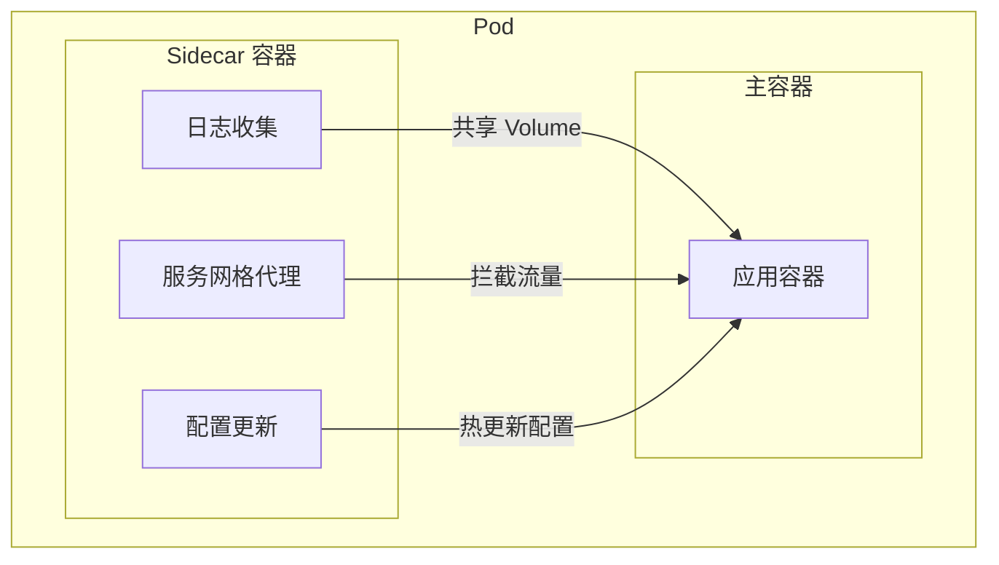
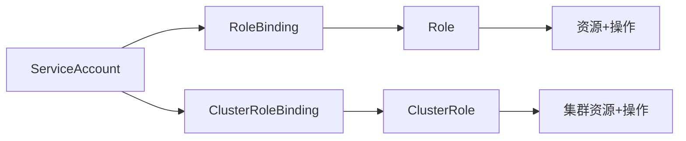
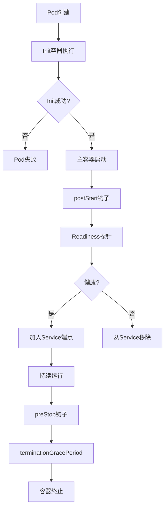
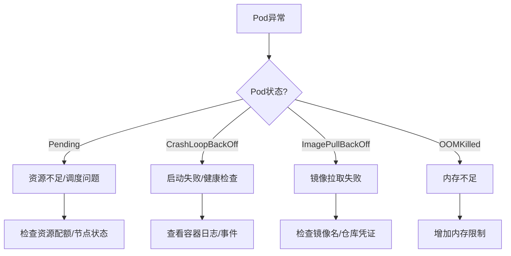

# Docker 与 Kubernetes（容器底层 / 镜像工程 / K8s 核心对象 / 调度发布 / 网络存储安全 / 排障）

> 云原生时代的部署底座。本篇把「容器原理」讲透（namespace/cgroup/OverlayFS），把「镜像工程」做细（分层/多阶段/扫描），再把「Kubernetes」铺全：架构、全量资源对象、探针、调度、滚动/金丝雀发布、网络 CNI、存储 PV/PVC、安全 RBAC、可观测性、Helm、Operator，最后给出**生产排障 SOP**。

---

## 一、容器技术全景

```text
容器 vs 虚拟机：
┌────────┬────────────────────┬──────────────────────┐
│        │ 虚拟机(VM)          │ 容器(Container)       │
├────────┼────────────────────┼──────────────────────┤
│ 隔离   │ 硬件级（Hypervisor）│ OS 级（内核 namespace）│
│ 单位   │ Guest OS + 应用     │ 应用 + 依赖（共享内核）│
│ 启动   │ 秒~分钟            │ 毫秒~秒              │
│ 密度   │ 低（GB 级）        │ 高（MB 级）          │
│ 内核   │ 独立内核           │ 共享宿主内核          │
└────────┴────────────────────┴──────────────────────┘
```

> 容器 = **Namespace（隔离视图）+ Cgroup（资源限制）+ 文件系统（rootfs/镜像）** 的组合，比 VM 更轻但隔离性弱（共享内核）。

---

## 二、Docker 原理深入

### 2.1 Namespace（六种隔离）

```text
Mount(mnt)    ：挂载点/文件系统视图
PID           ：进程编号空间（容器内 1 号进程）
Network(net)  ：网络栈（IP/端口/路由）
UTS           ：主机名与域名
IPC           ：进程间通信（共享内存/信号量）
User          ：用户与组映射（容器内 root ≠ 宿主 root）
```

### 2.2 Cgroup（资源限制）

```text
v1：按子系统（cpu/memory/blkio/net_cls）分别挂载，层级复杂。
v2（推荐）：统一层级，支持 cpu.weight、memory.max、io.max，配合 systemd。
限制示例：--memory=512m --cpus=1.5 --pids-limit=200
```

### 2.3 UnionFS / OverlayFS（镜像分层核心）

```text
OverlayFS 四层：
lowerdir  ：只读基础层（镜像各 layer）
upperdir  ：可读写层（容器修改）
workdir   ：内部临时层
merged    ：最终挂载给用户看到的统一视图
```

```text
写时复制(Copy-on-Write)：修改文件时先复制到 upperdir，原 lower 不动。
删除文件：在 upper 建 whiteout 标记，遮蔽 lower 同名文件（非真删）。
```

---

## 三、镜像工程

### 3.1 分层与复用

```text
Dockerfile 每条指令 = 一层 layer（layer 可跨镜像复用，缓存）。
同一基础镜像 + 相同指令顺序 ⇒ 直接命中缓存，秒级构建。
```

### 3.2 多阶段构建（减小体积）

```dockerfile
# 构建阶段
FROM maven:3.9 AS build
COPY . /app && RUN mvn -q package

# 运行阶段（仅拷贝产物）
FROM eclipse-temurin:17-jre
COPY --from=build /app/target/app.jar /app.jar
ENTRYPOINT ["java","-jar","/app.jar"]
```

### 3.3 镜像优化清单

```dockerfile
FROM eclipse-temurin:17-jre          # 用 jre 而非 jdk，用 distroless/scratch 更小
WORKDIR /app
COPY target/app.jar app.jar           # 依赖变动少的放前面，利用缓存
RUN groupadd -r app && useradd -r -g app app  # 非 root 运行！
USER app
HEALTHCHECK --interval=30s CMD curl -f http://localhost/health || exit 1
EXPOSE 8080
ENTRYPOINT ["java","-jar","app.jar"]
```

```text
优化要点：
- 合并 RUN（减少层数）；.dockerignore 排除 .git/target；
- 指令顺序：变动少的在前；用 distroless/scratch 基础镜像；
- 安全：非 root、只读根文件系统、cap-drop ALL、no-new-privileges。
```

### 3.4 镜像扫描与仓库

```bash
trivy image myapp:1.0        # 扫描 CVE 漏洞
# 仓库：Harbor（含漏洞扫描/签名）、registry、云厂商 ACR/ECR
# 生产建议镜像签名（cosign）+ 准入控制（拒绝未签名镜像）
```

---

## 四、Docker 网络与存储

### 4.1 网络模式

```text
bridge（默认）：容器连 docker0 网桥，NAT 出网。
host          ：共享宿主网络栈（性能高，隔离差）。
none          ：无网络。
overlay       ：跨主机容器网络（Swarm）。
```

```bash
docker run -p 8080:8080 --network mynet app   # 端口映射 + 自定义网络
```

### 4.2 存储

```bash
docker volume create data        # 命名卷（持久化，独立于容器生命周期）
docker run -v data:/var/lib/mysql mysql
docker run -v $(pwd):/app bind   # 绑定挂载（开发热更新）
docker run --tmpfs /tmp tmpfs     # 内存临时文件系统
```

### 4.3 Docker Compose（单机编排）

```yaml
version: "3.8"
services:
  web: { image: myapp, ports: ["8080:8080"], depends_on: [db] }
  db:  { image: mysql:8, environment: { MYSQL_ROOT_PASSWORD: x } }
```

---

## 五、Kubernetes 架构

```text
控制面（Control Plane）：
- kube-apiserver ：唯一入口，所有组件通过它通信（鉴权/准入/校验）
- etcd           ：集群唯一数据源（强一致 KV，Raft）
- kube-scheduler ：将 Pod 调度到合适节点
- kube-controller-manager：控制器集合（Deployment/Node/Endpoint 等）

数据面（Node）：
- kubelet   ：节点代理，管理 Pod 生命周期、上报状态
- kube-proxy：维护节点 iptables/IPVS 规则，实现 Service 转发
- 容器运行时：containerd / CRI-O（通过 CRI 接口对接 K8s）
```

> 插件：CNI（网络）、CSI（存储）、CRI（运行时）；核心扩展靠 CRD + Operator。

---

## 六、核心资源对象全景

| 类别 | 对象 | 作用 |
|------|------|------|
| 工作负载 | `Pod` | 最小调度单位（一或多个共享网络的容器） |
| | `ReplicaSet` | 维持 Pod 副本数（很少直接用） |
| | `Deployment` | 无状态应用，管理 RS，支持滚动更新 |
| | `StatefulSet` | 有状态应用（稳定网络标识/有序滚动/持久存储） |
| | `DaemonSet` | 每节点一个（日志/监控 Agent） |
| | `Job` / `CronJob` | 一次性 / 定时任务 |
| 服务发现 | `Service` | 稳定虚拟 IP + 负载均衡（ClusterIP/NodePort/LB/Headless） |
| | `Ingress` | 七层路由（域名/路径 → Service） |
| 配置 | `ConfigMap` / `Secret` | 配置 / 敏感信息（挂载或环境变量） |
| 存储 | `PV` / `PVC` / `StorageClass` | 持久卷 / 声明 / 动态供给 |
| 弹性 | `HPA` / `VPA` | 基于指标扩缩容 |
| 治理 | `ResourceQuota` / `LimitRange` | 命名空间资源上限 / 默认 Limit |
| 身份 | `ServiceAccount` + `RBAC` | 工作负载身份与权限 |
| 策略 | `NetworkPolicy` / `PodDisruptionBudget` | 网络隔离 / 驱逐保护 |

### 6.1 Pod 本质

```text
Pod = 一个 pause 容器（共享 Network/IPC/UTS 命名空间）+ 用户容器。
- 容器间通过 localhost 通信、共享 Volume。
- 一个 Pod 通常只放"紧密协作"的一组容器（sidecar 模式：日志/代理/初始化）。
```

---

## 七、Pod 生命周期与探针

```text
Pod 阶段：Pending → Running → Succeeded/Failed
容器状态：Waiting / Running / Terminated

探针（决定流量与重启）：
- livenessProbe  ：失败 ⇒ 杀掉容器重启（检测"卡死"）
- readinessProbe ：失败 ⇒ 从 Service 摘除（不杀容器，处理"启动慢/临时不可用"）
- startupProbe   ：启动保护，成功前不执行 liveness（防慢启动被误杀）
```

```yaml
livenessProbe:
  httpGet: { path: /health, port: 8080 }
  initialDelaySeconds: 10
  periodSeconds: 10
  failureThreshold: 3
readinessProbe:
  tcpSocket: { port: 8080 }
  periodSeconds: 5
terminationGracePeriodSeconds: 30   # 优雅停机宽限
```

```text
优雅停机：收到 SIGTERM → 停止接收新请求 → 处理完在途请求 → 退出。
preStop hook 可用于通知注册中心下线。
```

---

## 八、调度（Scheduler）

```text
调度流程：过滤（Filter）→ 打分（Score）→ 绑定（Bind）。

调度约束：
- nodeSelector / nodeAffinity  ：偏向某些节点
- podAffinity / podAntiAffinity：同/不同节点共置（如避免同应用全在一台）
- taint + toleration          ：节点污点排挤，Pod 容忍才可调度
- 拓扑分布 topologySpreadConstraints：跨可用区/机架均匀打散
- 优先级与抢占：PriorityClass 高优可抢占低优 Pod
```

---

## 九、发布策略

```yaml
spec:
  strategy:
    rollingUpdate: { maxSurge: 25%, maxUnavailable: 25% }  # 滚动更新
```

| 策略 | 实现 | 特点 |
|------|------|------|
| 滚动更新 | Deployment 默认 | 逐步替换，零停机 |
| 重新创建 | `Recreate` | 先停后起，有短暂不可用 |
| 蓝绿 | 两套 Deployment + 切 Service | 瞬间切换，易回滚 |
| 金丝雀 | Ingress 权重 / Argo Rollouts | 先放少量流量验证 |

```bash
kubectl rollout status deploy/myapp       # 观察滚动
kubectl rollout undo deploy/myapp         # 回滚到上一版
kubectl rollout history deploy/myapp      # 查看历史
```

---

## 十、网络（CNI）

```text
网络模型：
- 每个 Pod 独立 IP（CNI 插件分配，如 Calico/Flannel/Cilium）。
- Service：ClusterIP 经 kube-proxy（iptables/IPVS）负载到后端 Pod。
- CoreDNS：集群内 DNS 解析（service.namespace.svc）。
- Ingress：外部流量入口（Nginx/ Traefik / Envoy），七层路由。
- NetworkPolicy：基于标签的 Pod 间防火墙（默认全通，需显式限制）。
```

> 服务网格（Istio/Linkerd）在应用旁注入 sidecar（Envoy），接管东西向流量，实现熔断/重试/灰度/可观测，但增加复杂度和延迟。

---

## 十一、存储（PV / PVC）

```text
PV（PersistentVolume）：集群级存储资源（由管理员或 StorageClass 动态创建）。
PVC（PersistentVolumeClaim）：Pod 对存储的"申领"（按大小/访问模式）。
StorageClass：定义 provisioner，实现动态供给（如云盘自动创建）。

访问模式：RWO（单节点读写）/ RWM（多节点读写）/ ROM（只读多节点）。
```

```yaml
apiVersion: v1
kind: PersistentVolumeClaim
spec:
  accessModes: [ReadWriteOnce]
  resources: { requests: { storage: 10Gi } }
  storageClassName: ssd
```

---

## 十二、安全（Security）

```text
身份与权限：
- ServiceAccount：Pod 身份，对接 API（最小权限）。
- RBAC：Role/ClusterRole + RoleBinding 控制"谁能对什么资源做什么"。

工作负载安全：
- 非 root 运行（securityContext.runAsNonRoot）
- 只读根文件系统、drop 多余 Linux Capabilities
- PodSecurity Admission（替代 deprecated PSP）：privileged / baseline / restricted
- 镜像签名校验 + 准入拒绝未签名镜像

网络与数据：
- NetworkPolicy 默认拒绝，按需开放
- Secret 用外部密钥管理（Vault / 云 KMS），避免明文
- 静态加密 etcd（EncryptionConfiguration）
```

---

## 十三、可观测性

```text
Metrics：Prometheus 抓取 /metrics；kube-state-metrics 暴露对象状态；
         HPA 基于 CPU/自定义指标（KEDA 支持事件驱动扩缩）。
Logs   ：DaemonSet 收集（Fluent Bit → Kafka/ES/Loki），stdout/stderr 收集。
Traces ：OpenTelemetry 跨服务链路追踪，旁路 sidecar 上报。
告警   ：Prometheus Alertmanager → 钉钉/企微/电话。
```

---

## 十四、Helm（包管理）

```text
Chart = 模板（templates/）+ 值（values.yaml）+ 元数据（Chart.yaml）。
Release = 某 Chart 在某命名空间的具体安装实例。
```

```bash
helm repo add bitnami https://charts.bitnami.com
helm install myapp bitnami/redis -n demo --set auth.enabled=false
helm upgrade myapp bitnami/redis --set replica.replicaCount=3
helm rollback myapp 1
helm template myapp ./chart   # 渲染查看最终 YAML（排错利器）
```

> Hooks：pre-install / post-install / pre-upgrade 等，在生命周期节点执行 Job。

---

## 十五、Operator 与 CRD

```text
CRD（CustomResourceDefinition）：扩展 K8s API，定义自己的资源类型。
Operator：针对自定义资源运行的控制器（watch 资源 → reconcile 使实际态趋近期望态）。
典型场景：数据库（Prometheus Operator / Etcd Operator / TiDB）、中间件生命周期管理。
工具链：kubebuilder / operator-sdk（基于 controller-runtime，实现 reconcile 循环）。
```

---

## 十六、生产排障 SOP

```bash
# 1. 看事件（第一步，90% 问题线索在此）
kubectl get events -n demo --sort-by=.lastTimestamp
kubectl describe pod myapp-xxx -n demo     # 看状态/事件/挂载

# 2. 看日志
kubectl logs myapp-xxx -n demo --previous # 上一次崩溃日志
kubectl logs -l app=myapp -n demo         # 按标签聚合

# 3. 进容器 / 调试
kubectl exec -it myapp-xxx -n demo -- sh
kubectl debug myapp-xxx -it --image=busybox --target=app  # 临时调试容器

# 4. 常见异常速查
CrashLoopBackOff  ：看 --previous 日志（配置错/依赖未就绪/OOM）
ImagePullBackOff  ：镜像名/标签错、仓库无权限、Secret 缺失
Pending           ：资源不足/节点污点/无满足亲和性的节点/PVC 未绑定
OOMKilled         ：内存 limit 太小或真实泄漏（看 exit code 137）
NodeNotReady      ：kubelet 掉线/磁盘压力/网络分区
```

---

## 十七、GitOps（声明式交付）

```text
理念：Git 为唯一事实源，集群状态由控制器持续对齐 Git 中声明的 YAML。
工具：Argo CD（拉模式，对比 Drift 并自动同步）、Flux（CNCF 毕业）。
价值：审计可追溯、一键回滚、多环境一致、防配置漂移。
```

---

## 十八、Pod 生命周期深度剖析

### 18.1 Pod 生命周期详解

```text
Pod 完整生命周期（含所有阶段）：
┌─────────────────────────────────────────────────────────────────┐
│  Pending → Running → Succeeded/Failed/Unknown                    │
│                                                                  │
│  Pod 内部状态机：                                                  │
│  ┌──────────┐   ┌──────────┐   ┌──────────┐   ┌──────────┐      │
│  │ Pending  │──▶│ Running  │──▶│ Succeeded│──▶│  等待 GC  │      │
│  │(调度中)  │   │(运行中)  │   │(正常结束)│   │          │      │
│  └──────────┘   └──────────┘   └──────────┘   └──────────┘      │
│       │               │               │                          │
│       ▼               ▼               ▼                          │
│  ┌──────────┐   ┌──────────┐   ┌──────────┐                     │
│  │  Failed  │   │ Unknown  │   │  Waiting │                     │
│  │(异常退出)│   │(状态未知)│   │(等待启动)│                     │
│  └──────────┘   └──────────┘   └──────────┘                     │
└─────────────────────────────────────────────────────────────────┘
```

**Pod 启动流程**：

| 阶段 | 行为 | 关键配置 |
|------|------|----------|
| 调度 | Scheduler 选节点绑定 | nodeSelector/affinity/taint |
| 拉取镜像 | kubelet 拉取容器镜像 | imagePullPolicy: Always/IfNotPresent |
| 启动容器 | 按 restartPolicy 决定重启策略 | restartPolicy: Always/OnFailure/Never |
| 初始化容器 | initContainers 依次执行成功 | initContainers[].command |
| 就绪探针 | readinessProbe 成功后加入 Service | readinessProbe |
| 存活探针 | livenessProbe 失败则重启容器 | livenessProbe |
| 停止 | SIGTERM → preStop → SIGKILL | terminationGracePeriodSeconds |

### 18.2 Init Containers 详解

```yaml
apiVersion: v1
kind: Pod
spec:
  initContainers:
  - name: init-db
    image: busybox:1.36
    command: ['sh', '-c', 'until nslookup mysql-service; do echo waiting...; sleep 2; done']
  - name: init-config
    image: busybox:1.36
    command: ['sh', '-c', 'wget -O /config/app.yaml http://config-server/config']
  containers:
  - name: app
    image: myapp:1.0
```

**Init Container 特性**：

| 特性 | 说明 |
|------|------|
| 顺序执行 | 严格按定义顺序，前一个成功后才启动下一个 |
| 重启策略 | 失败会重试（受 restartPolicy 影响），直到成功 |
| 资源隔离 | 独立于主容器，有独立的资源请求/限制 |
| 终止态 | 退出后不再启动（除非 Pod 重启） |
| 典型场景 | 等待依赖服务、预下载配置、初始化数据库schema、设置权限 |

### 18.3 Sidecar 模式



| Sidecar 类型 | 工具 | 用途 |
|-------------|------|------|
| 日志收集 | Fluent Bit/Filebeat | 采集 stdout + 文件日志 |
| 服务网格 | Istio Envoy | mTLS、熔断、重试、灰度 |
| 配置更新 | Consul Template | 配置变更热加载 |
| 监控代理 | Istio Metrics | 自动注入 metrics 采集 |
| 证书管理 | Cert-manager | 证书自动轮换 |

### 18.4 Resource Requests/Limits 调优

```yaml
resources:
  requests:
    cpu: "500m"      # 调度依据：确保节点有 0.5 核空闲
    memory: "256Mi"  # OOM 判断依据
  limits:
    cpu: "1000m"     # CPU 限流（throttle），非硬限制
    memory: "512Mi"  # 超出则 OOMKill
```

**调优原则**：

| 策略 | 说明 | 注意事项 |
|------|------|----------|
| requests=limits | Guaranteed QoS，不被驱逐 | 资源浪费，适合核心服务 |
| requests<limits | Burstable QoS，弹性伸缩 | 常见选择，平衡成本与稳定 |
| 无 limits | Best-Effort QoS | 最先被驱逐，慎用 |
| CPU 粒度 | 1m=0.001核 | CPU 可压缩，超限被 throttle |
| 内存粒度 | 1Mi=1048576字节 | 内存不可压缩，超限被 OOMKill |

```text
QoS 等级与驱逐优先级：
Best-Effort（无 requests/limits）→ Burstable（requests<limits）→ Guaranteed（requests=limits）
低优先级先驱逐
```

### 18.5 HPA/VPA/KEDA 自动扩缩容

**HPA（Horizontal Pod Autoscaler）**：

```yaml
apiVersion: autoscaling/v2
kind: HorizontalPodAutoscaler
spec:
  scaleTargetRef:
    apiVersion: apps/v1
    kind: Deployment
    name: myapp
  minReplicas: 2
  maxReplicas: 10
  metrics:
  - type: Resource
    resource:
      name: cpu
      target:
        type: Utilization
        averageUtilization: 70
  - type: Resource
    resource:
      name: memory
      target:
        type: Utilization
        averageUtilization: 80
  behavior:
    scaleDown:
      stabilizationWindowSeconds: 300  # 缩容冷却5分钟
      policies:
      - type: Percent
        value: 10
        periodSeconds: 60
    scaleUp:
      stabilizationWindowSeconds: 30
      policies:
      - type: Percent
        value: 50
        periodSeconds: 60
```

**VPA（Vertical Pod Autoscaler）**：

```yaml
apiVersion: autoscaling.k8s.io/v1
kind: VerticalPodAutoscaler
spec:
  targetRef:
    apiVersion: apps/v1
    kind: Deployment
    name: myapp
  updatePolicy:
    updateMode: "Auto"  # 自动重建 Pod 应用新资源
  resourcePolicy:
    containerPolicies:
    - containerName: app
      minAllowed:
        cpu: "100m"
        memory: "128Mi"
      maxAllowed:
        cpu: "4"
        memory: "8Gi"
```

**KEDA（Kubernetes Event-Driven Autoscaling）**：

| 指标源 | 触发器 | 场景 |
|--------|--------|------|
| Kafka lag | kafka | 消费积压自动扩容 |
| RabbitMQ queue | rabbitmq | 队列深度触发 |
| Prometheus | prometheus | 自定义指标 |
| Cron | cron | 定时扩缩 |
| MySQL/PG | 外部指标 | DB 连接数/慢查询 |

```yaml
apiVersion: keda.sh/v1alpha1
kind: ScaledObject
spec:
  scaleTargetRef:
    name: myapp
  minReplicaCount: 2
  maxReplicaCount: 50
  triggers:
  - type: kafka
    metadata:
      bootstrapServers: kafka:9092
      consumerGroup: mygroup
      topic: orders
      lagThreshold: "100"
```

### 18.6 NetworkPolicy 网络策略

```yaml
apiVersion: networking.k8s.io/v1
kind: NetworkPolicy
metadata:
  name: deny-all
  namespace: production
spec:
  podSelector: {}
  policyTypes:
  - Ingress
  - Egress
---
apiVersion: networking.k8s.io/v1
kind: NetworkPolicy
metadata:
  name: allow-frontend-to-backend
spec:
  podSelector:
    matchLabels:
      app: backend
  ingress:
  - from:
    - podSelector:
        matchLabels:
          app: frontend
    ports:
    - protocol: TCP
      port: 8080
  egress:
  - to:
    - podSelector:
        matchLabels:
          app: database
    ports:
    - protocol: TCP
      port: 5432
```

```text
NetworkPolicy 工作原理：
1. 默认全通：未定义策略时 Pod 间无限制
2. 默认拒绝：定义了 ingress/egress 后只放行匹配规则
3. 选择器：podSelector + namespaceSelector 做标签匹配
4. CIDR：ipBlock 放行特定 IP 段
5. 实现依赖：Calico/Cilium 支持，Flannel 不支持 NetworkPolicy
```

### 18.7 PodDisruptionBudget（PDB）

```yaml
apiVersion: policy/v1
kind: PodDisruptionBudget
metadata:
  name: myapp-pdb
spec:
  minAvailable: 2    # 至少保留 2 个 Pod
  # 或 maxUnavailable: 1  # 最多不可用 1 个
  selector:
    matchLabels:
      app: myapp
```

**PDB 使用场景**：

| 场景 | 配置 | 效果 |
|------|------|------|
| 滚动更新 | minAvailable: 50% | 更新时至少一半可用 |
| 节点维护 | maxUnavailable: 1 | 驱逐时逐个进行 |
| 有状态服务 | minAvailable: 3 | 保证 quorum |

### 18.8 K8s RBAC 权限模型



```yaml
# 命名空间级角色
apiVersion: rbac.authorization.k8s.io/v1
kind: Role
metadata:
  namespace: production
  name: pod-reader
rules:
- apiGroups: [""]
  resources: ["pods", "pods/log"]
  verbs: ["get", "list", "watch"]
- apiGroups: ["apps"]
  resources: ["deployments"]
  verbs: ["get", "list"]
---
# 集群级角色
apiVersion: rbac.authorization.k8s.io/v1
kind: ClusterRole
metadata:
  name: secret-reader
rules:
- apiGroups: [""]
  resources: ["secrets"]
  verbs: ["get", "list"]
---
# 绑定
apiVersion: rbac.authorization.k8s.io/v1
kind: RoleBinding
metadata:
  name: read-pods
  namespace: production
subjects:
- kind: ServiceAccount
  name: app-sa
roleRef:
  kind: Role
  name: pod-reader
  apiGroup: rbac.authorization.k8s.io
```

### 18.9 K8s 调试利器：kubectl debug 与临时容器

```bash
# 基础调试
kubectl debug mypod -it --image=busybox:1.36 -- sh

# 复用现有容器的进程命名空间
kubectl debug mypod -it --image=busybox:1.36 --target=app

# 节点级调试（进入节点的 host PID/IPC）
kubectl debug node/worker-1 -it --image=ubuntu

# 查看 Pod 的环境变量/挂载
kubectl exec mypod -it -- env
kubectl exec mypod -it -- ls /data

# 查看事件（排障第一步）
kubectl get events -n production --sort-by=.lastTimestamp | tail -20
```

**Ephemeral Containers（临时容器）**：

```yaml
apiVersion: v1
kind: EphemeralContainer
name: debugger
image: busybox:1.36
targetNamespace: ""
command: ["sleep", "3600"]
# kubectl debug mypod -it --image=busybox --target=app
```

### 18.10 Helm Chart 最佳实践

```text
Helm Chart 结构：
mychart/
├── Chart.yaml          # 元数据（版本、依赖）
├── values.yaml         # 默认配置值
├── templates/          # 模板文件
│   ├── deployment.yaml
│   ├── service.yaml
│   ├── ingress.yaml
│   ├── hpa.yaml
│   ├── pdb.yaml
│   ├── networkpolicy.yaml
│   ├── _helpers.tpl    # 辅助模板
│   └── tests/          # 测试
├── charts/             # 依赖子 chart
└── .helmignore
```

```yaml
# values.yaml 最佳实践
replicaCount: 2
image:
  repository: myapp
  tag: "1.0"
  pullPolicy: IfNotPresent
resources:
  requests:
    cpu: 200m
    memory: 256Mi
  limits:
    cpu: 500m
    memory: 512Mi
autoscaling:
  enabled: true
  minReplicas: 2
  maxReplicas: 10
  targetCPUUtilizationPercentage: 70
```

```bash
# 开发阶段：模板渲染调试
helm template myapp ./chart -f values-dev.yaml

# 生产部署：dry-run 验证
helm upgrade myapp ./chart -f values-prod.yaml --dry-run

# 回滚
helm rollback myapp 1

# 查看历史
helm history myapp
```

## 十八、Kubernetes 高级模式与生产实践

### 18.1 Admission Webhooks（准入控制）

```text
Admission Webhooks 是 K8s API Server 的扩展机制，用于在资源创建/更新/删除时进行拦截和校验。

两种类型：
┌──────────────────┬────────────────────────────────────────────────┐
│ 类型              │ 作用                                            │
├──────────────────┼────────────────────────────────────────────────┤
│ ValidatingWebhook │ 校验请求是否合法（拒绝非法请求）                  │
│ MutatingWebhook   │ 修改请求内容（注入默认值/边车等）                 │
└──────────────────┴────────────────────────────────────────────────┘

执行顺序：认证 → 授权 → MutatingWebhook → 对象schema校验 → ValidatingWebhook
```

```yaml
# ValidatingWebhook 示例：校验 Pod 必须有 app 标签
apiVersion: admissionregistration.k8s.io/v1
kind: ValidatingWebhookConfiguration
metadata:
  name: pod-label-validator
webhooks:
- name: validate-pod-labels.example.com
  clientConfig:
    service:
      name: webhook-server
      namespace: webhook-system
      path: /validate
    caBundle: <base64-ca-cert>
  rules:
  - operations: ["CREATE", "UPDATE"]
    apiGroups: [""]
    apiVersions: ["v1"]
    resources: ["pods"]
  failurePolicy: Fail
  sideEffects: None
  admissionReviewVersions: ["v1"]
```

```yaml
# MutatingWebhook 示例：自动注入 sidecar
apiVersion: admissionregistration.k8s.io/v1
kind: MutatingWebhookConfiguration
metadata:
  name: sidecar-injector
webhooks:
- name: inject-sidecar.example.com
  clientConfig:
    service:
      name: webhook-server
      namespace: webhook-system
      path: /mutate
  rules:
  - operations: ["CREATE"]
    apiGroups: [""]
    apiVersions: ["v1"]
    resources: ["pods"]
  objectSelector:
    matchLabels:
      sidecar-inject: "enabled"
  admissionReviewVersions: ["v1"]
```

### 18.2 API Aggregation Layer（API 聚合层）

```text
API Aggregation Layer 允许将第三方 API 扩展为 K8s API 的一部分。

┌─────────────────────────────────────────────────────────────────┐
│                     K8s API Server                              │
├─────────────────────────────────────────────────────────────────┤
│  /api/v1          (核心 API，内置)                               │
│  /apis/apps/v1    (扩展 API，内置)                               │
│  /apis/custom.example.com/v1  (聚合 API，第三方提供)             │
└─────────────────────────────────────────────────────────────────┘

vs CRD：
- CRD：声明式资源定义，简单，适合大多数场景
- Aggregation：完整 API 实现，适合复杂逻辑/已有 REST API 对接
```

```yaml
# APIService 注册示例
apiVersion: apiregistration.k8s.io/v1
kind: APIService
metadata:
  name: v1beta1.custom.example.com
spec:
  group: custom.example.com
  version: v1beta1
  service:
    name: custom-api-server
    namespace: custom-system
  caBundle: <base64-ca-cert>
  groupPriorityMinimum: 1000
  versionPriority: 100
```

### 18.3 CronJob 与 Job 模式

```text
Job 模式：
┌─────────────────┬───────────────────────────────────────────────┐
│ 类型              │ 特点                                           │
├─────────────────┼───────────────────────────────────────────────┤
│ Non-parallel     │ 单个 Pod 完成即结束                             │
│ Parallel (fixed) │ 固定并行度，N 个 Pod 完成即结束                  │
│ Work Queue       │ 队列模式，Pod 自行获取任务                      │
│ Indexed          │ 每个 Pod 获得唯一 index（0 ~ completions-1）    │
└─────────────────┴───────────────────────────────────────────────┘
```

```yaml
# CronJob：每日凌晨 2 点执行数据库备份
apiVersion: batch/v1
kind: CronJob
metadata:
  name: db-backup
spec:
  schedule: "0 2 * * *"
  concurrencyPolicy: Forbid        # 禁止并发
  successfulJobsHistoryLimit: 3
  failedJobsHistoryLimit: 1
  startingDeadlineSeconds: 600     # 错过调度窗口 10 分钟内补执行
  jobTemplate:
    spec:
      backoffLimit: 2              # 最多重试 2 次
      activeDeadlineSeconds: 3600  # 1 小时超时
      template:
        spec:
          restartPolicy: OnFailure
          containers:
          - name: backup
            image: mysql:8.0
            command:
            - /bin/sh
            - -c
            - |
              mysqldump -h $DB_HOST -u $DB_USER -p$DB_PASS \
                --all-databases | gzip > /backup/db-$(date +%Y%m%d).sql.gz
            env:
            - name: DB_HOST
              valueFrom:
                configMapKeyRef:
                  name: db-config
                  key: host
```

```yaml
# Job 并行模式：批量图片处理
apiVersion: batch/v1
kind: Job
metadata:
  name: image-processor
spec:
  completions: 100      # 总共完成 100 个任务
  parallelism: 10       # 10 个 Pod 并行
  completionMode: Indexed  # 每个 Pod 获得唯一 index
  template:
    spec:
      restartPolicy: Never
      containers:
      - name: processor
        image: processor:latest
        env:
        - name: JOB_COMPLETION_INDEX
          valueFrom:
            fieldRef:
              fieldPath: metadata.labels['batch.kubernetes.io/job-completion-index']
```

### 18.4 StatefulSet 深入

```text
StatefulSet 核心特性：
┌──────────────────────┬────────────────────────────────────────────┐
│ 特性                  │ 实现方式                                    │
├──────────────────────┼────────────────────────────────────────────┤
│ 稳定网络标识          │ pod-0, pod-1, ...（不变）                   │
│ 稳定存储              │ volumeClaimTemplates（PVC 随 Pod 重建）     │
│ 有序部署/删除         │ 按索引顺序创建/反序删除                      │
│ 有序滚动更新          │ 从最大索引到最小（与 Deployment 相反）       │
│ Headless Service      │ 通过 DNS 直接访问特定 Pod                   │
│ Ordinal Index         │ metadata.labels['statefulset.kubernetes.io/pod-name'] │
└──────────────────────┴────────────────────────────────────────────┘
```

```yaml
# 3 节点 MySQL 主从集群
apiVersion: apps/v1
kind: StatefulSet
metadata:
  name: mysql
spec:
  serviceName: mysql-headless
  replicas: 3
  selector:
    matchLabels:
      app: mysql
  template:
    metadata:
      labels:
        app: mysql
    spec:
      terminationGracePeriodSeconds: 60
      containers:
      - name: mysql
        image: mysql:8.0
        ports:
        - containerPort: 3306
        volumeMounts:
        - name: data
          mountPath: /var/lib/mysql
        env:
        - name: MYSQL_ROOT_PASSWORD
          valueFrom:
            secretKeyRef:
              name: mysql-secret
              key: root-password
  volumeClaimTemplates:
  - metadata:
      name: data
    spec:
      accessModes: ["ReadWriteOnce"]
      storageClassName: fast-ssd
      resources:
        requests:
          storage: 50Gi
```

### 18.5 DaemonSet 使用场景

```text
DaemonSet 保证每个（或指定）节点运行一个 Pod 实例。

典型使用场景：
┌──────────────────────┬────────────────────────────────────────────┐
│ 场景                  │ 说明                                        │
├──────────────────────┼────────────────────────────────────────────┤
│ 日志采集              │ Fluentd/Filebeat 采集节点日志               │
│ 节点监控              │ node_exporter 采集节点指标                  │
│ 网络插件              │ Calico/Cilium 网络代理                      │
│ 存储代理              │ Ceph Rook 代理                             │
│ 安全代理              │ Falco 运行时安全监控                        │
│ Ingress               │ NodePort 模式的 Ingress                    │
└──────────────────────┴────────────────────────────────────────────┘
```

```yaml
# 节点级日志采集 DaemonSet
apiVersion: apps/v1
kind: DaemonSet
metadata:
  name: fluentd-logging
spec:
  selector:
    matchLabels:
      name: fluentd
  template:
    metadata:
      labels:
        name: fluentd
    spec:
      tolerations:
      - key: node-role.kubernetes.io/control-plane
        effect: NoSchedule
      - key: node.kubernetes.io/not-ready
        effect: NoExecute
        operator: Exists
      containers:
      - name: fluentd
        image: fluentd:v1.16
        resources:
          limits:
            cpu: 200m
            memory: 256Mi
          requests:
            cpu: 100m
            memory: 128Mi
        volumeMounts:
        - name: varlog
          mountPath: /var/log
          readOnly: true
        - name: container-logs
          mountPath: /var/lib/docker/containers
          readOnly: true
      volumes:
      - name: varlog
        hostPath:
          path: /var/log
      - name: container-logs
        hostPath:
          path: /var/lib/docker/containers
```

### 18.6 多租户模式

```text
K8s 多租户方案：
┌──────────────────────┬────────────────────────────────────────────┐
│ 隔离级别              │ 实现方式                                    │
├──────────────────────┼────────────────────────────────────────────┤
│ Namespace            │ 资源配额 + RBAC + NetworkPolicy             │
│ Virtual Cluster      │ vCluster（独立控制面）                       │
│ Node Pool            │ 节点池级别隔离                              │
│ Cluster              │ 独立集群（最隔离，成本最高）                 │
└──────────────────────┴────────────────────────────────────────────┘

Namespace + ResourceQuota + LimitRange 组合：
- ResourceQuota：限制命名空间总资源
- LimitRange：限制单个 Pod/容器资源
- NetworkPolicy：网络隔离
- RBAC：权限隔离
```

```yaml
# 多租户命名空间配置
apiVersion: v1
kind: Namespace
metadata:
  name: tenant-a
  labels:
    tenant: a
---
apiVersion: v1
kind: ResourceQuota
metadata:
  name: tenant-a-quota
  namespace: tenant-a
spec:
  hard:
    requests.cpu: "20"
    requests.memory: 40Gi
    limits.cpu: "40"
    limits.memory: 80Gi
    pods: "50"
    services: "20"
    persistentvolumeclaims: "10"
    configmaps: "50"
    secrets: "50"
---
apiVersion: v1
kind: LimitRange
metadata:
  name: tenant-a-limits
  namespace: tenant-a
spec:
  limits:
  - type: Container
    default:
      cpu: "1"
      memory: 512Mi
    defaultRequest:
      cpu: 100m
      memory: 128Mi
    max:
      cpu: "4"
      memory: 4Gi
    min:
      cpu: 50m
      memory: 64Mi
```

### 18.7 ResourceQuota 与 LimitRange

```text
ResourceQuota vs LimitRange：
┌─────────────────────┬──────────────────────────────────────────────┐
│                     │ ResourceQuota           │ LimitRange         │
├─────────────────────┼──────────────────────────────────────────────┤
│ 作用范围             │ 命名空间整体             │ 单个 Pod/Container  │
│ 限制内容             │ CPU/Memory/Pod/VC/PVC  │ CPU/Memory          │
│ 默认值设置           │ 不支持                  │ 支持 default/defaultRequest │
│ 配额策略             │ BestEffort/NotBestEffort/NotTerminating     │
└─────────────────────┴──────────────────────────────────────────────┘
```

```yaml
# ResourceQuota：按优先级配额
apiVersion: v1
kind: ResourceQuota
metadata:
  name: critical-pods-quota
  namespace: production
spec:
  hard:
    pods: "10"
    requests.cpu: "10"
    requests.memory: 20Gi
  scopeSelector:
    matchExpressions:
    - scopeName: PriorityClass
      operator: In
      values: ["system-cluster-critical"]
```

### 18.8 Karpenter（集群自动扩缩容）

```text
Karpenter vs Cluster Autoscaler：
┌─────────────────────┬──────────────────────────────────────────────┐
│                     │ Cluster Autoscaler      │ Karpenter          │
├─────────────────────┼──────────────────────────────────────────────┤
│ 扩缩容逻辑           │ 基于 Pod 调度状态        │ 基于实际资源需求    │
│ 节点选择             │ 单一 Node Group          │ 跨实例类型/区域     │
│ 响应速度             │ 分钟级                  │ 秒级               │
│ 碎片整理             │ 不支持                  │ 支持               │
│ 云厂商               │ AWS/GCP/Azure           │ AWS（原生）         │
│ 配置复杂度           │ 中等                    │ 简单               │
└─────────────────────┴──────────────────────────────────────────────┘
```

```yaml
# Karpenter NodePool 配置
apiVersion: karpenter.sh/v1beta1
kind: NodePool
metadata:
  name: default
spec:
  template:
    spec:
      requirements:
      - key: karpenter.sh/capacity-type
        operator: In
        values: ["on-demand", "spot"]
      - key: node.kubernetes.io/instance-type
        operator: In
        values: ["m5.large", "m5.xlarge", "m5.2xlarge", "c5.large", "c5.xlarge"]
      - key: topology.kubernetes.io/zone
        operator: In
        values: ["us-west-2a", "us-west-2b", "us-west-2c"]
      nodeClassRef:
        name: default
  disruption:
    consolidationPolicy: WhenUnderutilized
    expireAfter: 720h  # 30 天后自动回收
  limits:
    cpu: "100"
    memory: 200Gi
---
apiVersion: karpenter.k8s.aws/v1beta1
kind: EC2NodeClass
metadata:
  name: default
spec:
  amiFamily: AL2
  subnetSelectorTerms:
  - tags:
      karpenter.sh/discovery: my-cluster
  securityGroupSelectorTerms:
  - tags:
      karpenter.sh/discovery: my-cluster
  blockDeviceMappings:
  - deviceName: /dev/xvda
    ebs:
      volumeSize: 100Gi
      volumeType: gp3
      encrypted: true
      deleteOnTermination: true
```

### 18.9 生产环境 Checklist

```text
□ Pod 配置
  □ requests/limits 合理（CPU: requests=limits，Memory: limits ≥ requests）
  □ Liveness/Readiness/Startup 探针
  □ 资源请求（requests）不为空
  □ securityContext 非 root 运行

□ 工作负载
  □ Deployment 设置 replicas ≥ 2
  □ PodDisruptionBudget（PDB）配置
  □ 滚动更新策略（maxSurge/maxUnavailable）
  □ 优雅停机（preStop + terminationGracePeriodSeconds）

□ 网络
  □ NetworkPolicy 默认拒绝
  □ Service 类型正确（ClusterIP/NodePort/LoadBalancer）
  □ Ingress 配置 TLS
  □ DNS 解析正常

□ 存储
  □ PVC 使用 StorageClass
  □ 有状态应用使用 volumeClaimTemplates
  □ 备份策略（Velero）

□ 安全
  □ RBAC 最小权限
  □ Secret 加密（KMS）
  □ 镜像签名验证
  □ 准入控制（OPA/Gatekeeper）

□ 可观测
  □ Prometheus 指标采集
  □ 日志采集（Fluentd/Loki）
  □ 链路追踪
  □ 告警规则配置
```

## 十九、多阶段构建与镜像安全

### 多阶段构建最佳实践

```dockerfile
# 构建阶段：编译依赖
FROM maven:3.9-eclipse-temurin-21 AS builder
WORKDIR /app
COPY pom.xml .
RUN mvn dependency:go-offline -B
COPY src ./src
RUN mvn package -DskipTests -B

# 运行阶段：最小化镜像
FROM eclipse-temurin:21-jre-jammy
RUN groupadd -r app && useradd -r -g app app
WORKDIR /app
COPY --from=builder /app/target/*.jar app.jar
USER app
EXPOSE 8080
ENTRYPOINT ["java", "-jar", "app.jar"]
```

| 构建策略 | 镜像大小 | 构建速度 | 适用场景 |
|----------|---------|---------|---------|
| 单阶段 | 大(800MB+) | 快 | 开发环境 |
| 多阶段 | 小(200MB) | 中 | 生产环境 |
| distroless | 极小(50MB) | 慢 | 安全敏感 |
| scratch | 最小(10MB) | 慢 | 纯静态二进制 |

### Pod 生命周期详解



| 探针类型 | 用途 | 失败后果 | 调用时机 |
|----------|------|---------|---------|
| liveness | 检测容器是否存活 | 重启容器 | 周期性 |
| readiness | 检测是否就绪接收流量 | 从Service移除 | 周期性 |
| startup | 检测启动是否完成 | 阻止后续探针 | 启动时 |

### Helm Chart 最佳实践

```yaml
# Chart.yaml 语义化版本
apiVersion: v2
name: my-app
version: 1.2.3        # Chart版本
appVersion: "2.1.0"   # 应用版本

# values.yaml 分层配置
replicaCount: 2

image:
  repository: my-app
  tag: "2.1.0"
  pullPolicy: IfNotPresent

resources:
  requests:
    cpu: 250m
    memory: 256Mi
  limits:
    cpu: 500m
    memory: 512Mi

autoscaling:
  enabled: true
  minReplicas: 2
  maxReplicas: 10
  targetCPUUtilizationPercentage: 70
```

| Helm实践 | 做法 | 原因 |
|----------|------|------|
| helpers.tpl | 提取公共模板 | 减少重复 |
| values分层 | base/prod/dev | 环境差异 |
| 资源限制 | 必须设置 | 防止资源争抢 |
| 副本数 | ≥2+PDB | 高可用 |
| 更新策略 | maxUnavailable:0 | 零停机 |
| 健康检查 | 三类探针全配 | 故障自动恢复 |

## 二十、Service 类型与 Ingress 对比

| Service类型 | 用途 | 暴露方式 | 适用场景 |
|-------------|------|---------|---------|
| ClusterIP | 集群内部 | Pod IP | 内部服务 |
| NodePort | 开发测试 | 节点IP:端口 | 临时暴露 |
| LoadBalancer | 云环境 | 云LB | 生产入口 |
| ExternalName | DNS别名 | CNAME | 外部服务引用 |

```yaml
# Service 配置示例
apiVersion: v1
kind: Service
metadata:
  name: my-app
  labels:
    app: my-app
spec:
  type: ClusterIP
  ports:
    - port: 80
      targetPort: 8080
      protocol: TCP
  selector:
    app: my-app
---
# Ingress 配置
apiVersion: networking.k8s.io/v1
kind: Ingress
metadata:
  name: my-app
  annotations:
    nginx.ingress.kubernetes.io/rewrite-target: /
spec:
  tls:
    - hosts: [app.example.com]
      secretName: app-tls
  rules:
    - host: app.example.com
      http:
        paths:
          - path: /
            pathType: Prefix
            backend:
              service:
                name: my-app
                port:
                  number: 80
```

## 二十一、NetworkPolicy 网络策略

```yaml
# 默认拒绝所有入站
apiVersion: networking.k8s.io/v1
kind: NetworkPolicy
metadata:
  name: default-deny-ingress
  namespace: production
spec:
  podSelector: {}
  policyTypes:
    - Ingress
---
# 允许前端访问后端
apiVersion: networking.k8s.io/v1
kind: NetworkPolicy
metadata:
  name: allow-frontend-to-backend
  namespace: production
spec:
  podSelector:
    matchLabels:
      app: backend
  ingress:
    - from:
        - podSelector:
            matchLabels:
              app: frontend
      ports:
        - port: 8080
```

## Docker 多阶段构建缓存优化

### 缓存优化策略

```dockerfile
# 优化1：利用构建缓存
FROM node:18-alpine AS deps
WORKDIR /app
COPY package.json package-lock.json ./
RUN npm ci --only=production

# 优化2：分层构建
FROM node:18-alpine AS builder
WORKDIR /app
COPY --from=deps /app/node_modules ./node_modules
COPY . .
RUN npm run build

# 优化3：生产镜像
FROM node:18-alpine AS runner
WORKDIR /app
COPY --from=builder /app/dist ./dist
COPY --from=deps /app/node_modules ./node_modules
EXPOSE 3000
CMD ["node", "dist/main.js"]
```

### 缓存优化原则

| 原则 | 说明 | 示例 |
|------|------|------|
| 依赖缓存 | 先复制依赖文件 | package.json |
| 变更隔离 | 频繁变更的放后面 | 源代码 |
| 多阶段构建 | 构建与运行分离 | builder + runner |
| 选择性复制 | 只复制必要文件 | COPY --from |

## K8s Pod 生命周期

### Pod 生命周期阶段

```
Pod 生命周期：
  Pending：等待调度
  Running：容器运行中
  Succeeded：正常退出
  Failed：异常退出
  Unknown：状态未知

容器生命周期：
  Waiting：等待启动
  Running：运行中
  Terminating：终止中
```

### Init Container

```yaml
apiVersion: v1
kind: Pod
metadata:
  name: my-app
spec:
  initContainers:
    - name: init-db
      image: busybox
      command: ['sh', '-c', 'until nslookup mysql-service; do sleep 2; done']
    - name: init-config
      image: busybox
      command: ['sh', '-c', 'cp /config/* /app/config/']
  containers:
    - name: app
      image: my-app:latest
```

### Sidecar Container

```yaml
# Sidecar 日志收集
apiVersion: v1
kind: Pod
metadata:
  name: my-app
spec:
  containers:
    - name: app
      image: my-app:latest
    - name: log-collector
      image: fluentbit:latest
      volumeMounts:
        - name: logs
          mountPath: /var/log/app
  volumes:
    - name: logs
      emptyDir: {}
```

## Helm Chart 最佳实践

### Chart 目录结构

```
my-chart/
├── Chart.yaml          # 元数据
├── values.yaml         # 默认配置
├── values-dev.yaml     # 开发环境
├── values-prod.yaml    # 生产环境
├── templates/
│   ├── _helpers.tpl    # 公共模板
│   ├── deployment.yaml
│   ├── service.yaml
│   ├── ingress.yaml
│   ├── hpa.yaml
│   ├── pdb.yaml
│   └── configmap.yaml
└── .helmignore
```

### Helm Hooks

```yaml
# Pre-install/upgrade Hook
apiVersion: batch/v1
kind: Job
metadata:
  name: db-migration
  annotations:
    "helm.sh/hook": pre-install,pre-upgrade
    "helm.sh/hook-delete-policy": before-hook-creation
spec:
  template:
    spec:
      containers:
        - name: migrate
          image: app-migrator:latest
      restartPolicy: Never
```

## K8s Service 类型

### Service 类型对比

| 类型 | 说明 | 适用场景 |
|------|------|---------|
| ClusterIP | 集群内访问 | 内部服务 |
| NodePort | 节点端口暴露 | 开发测试 |
| LoadBalancer | 云负载均衡 | 生产环境 |
| ExternalName | DNS别名 | 外部服务 |

### Service 配置示例

```yaml
# ClusterIP
apiVersion: v1
kind: Service
metadata:
  name: my-service
spec:
  type: ClusterIP
  selector:
    app: my-app
  ports:
    - port: 80
      targetPort: 8080

---
# NodePort
apiVersion: v1
kind: Service
metadata:
  name: my-service-nodeport
spec:
  type: NodePort
  selector:
    app: my-app
  ports:
    - port: 80
      targetPort: 8080
      nodePort: 30080

---
# LoadBalancer
apiVersion: v1
kind: Service
metadata:
  name: my-service-lb
spec:
  type: LoadBalancer
  selector:
    app: my-app
  ports:
    - port: 80
      targetPort: 8080
```

## PV/PVC/StorageClass

### 存储架构

```
K8s 存储架构：
  PV（Persistent Volume）：集群级存储资源
  PVC（Persistent Volume Claim）：存储请求
  StorageClass：存储类定义

动态供给流程：
  PVC → StorageClass → 自动创建 PV → 绑定
```

### StorageClass 配置

```yaml
# StorageClass
apiVersion: storage.k8s.io/v1
kind: StorageClass
metadata:
  name: fast
provisioner: kubernetes.io/aws-ebs
parameters:
  type: gp3
  fsType: ext4
reclaimPolicy: Retain
volumeBindingMode: WaitForFirstConsumer

---
# PVC
apiVersion: v1
kind: PersistentVolumeClaim
metadata:
  name: my-pvc
spec:
  accessModes:
    - ReadWriteOnce
  storageClassName: fast
  resources:
    requests:
      storage: 100Gi
```

## 网络策略

### NetworkPolicy 配置

```yaml
# 默认拒绝所有入站
apiVersion: networking.k8s.io/v1
kind: NetworkPolicy
metadata:
  name: default-deny-ingress
spec:
  podSelector: {}
  policyTypes:
    - Ingress

---
# 允许前端访问后端
apiVersion: networking.k8s.io/v1
kind: NetworkPolicy
metadata:
  name: allow-frontend-to-backend
spec:
  podSelector:
    matchLabels:
      app: backend
  ingress:
    - from:
        - podSelector:
            matchLabels:
              app: frontend
      ports:
        - port: 8080
```

### 网络策略最佳实践

```
网络策略最佳实践：
  1. 默认拒绝所有入站（default-deny-ingress）
  2. 显式允许必要的流量
  3. 按命名空间隔离
  4. 使用标签选择器（而非IP）
  5. 测试环境验证后再上线
```

## HPA 自动扩缩

### HPA 配置

```yaml
apiVersion: autoscaling/v2
kind: HorizontalPodAutoscaler
metadata:
  name: my-app-hpa
spec:
  scaleTargetRef:
    apiVersion: apps/v1
    kind: Deployment
    name: my-app
  minReplicas: 2
  maxReplicas: 10
  metrics:
    - type: Resource
      resource:
        name: cpu
        target:
          type: Utilization
          averageUtilization: 70
    - type: Resource
      resource:
        name: memory
        target:
          type: Utilization
          averageUtilization: 80
  behavior:
    scaleUp:
      stabilizationWindowSeconds: 60
      policies:
        - type: Pods
          value: 2
          periodSeconds: 60
    scaleDown:
      stabilizationWindowSeconds: 300
      policies:
        - type: Percent
          value: 10
          periodSeconds: 60
```

### HPA 最佳实践

```
HPA 最佳实践：
  1. 设置合理的资源 requests/limits
  2. 使用 stabilizationWindowSeconds 防抖
  3. scaleDown 设置较长窗口，避免频繁缩容
  4. 监控 HPA 状态，确保扩缩正常
  5. 考虑使用 KEDA 处理复杂扩缩场景
```

## PDB（Pod Disruption Budget）

### PDB 配置

```yaml
apiVersion: policy/v1
kind: PodDisruptionBudget
metadata:
  name: my-app-pdb
spec:
  minAvailable: 2  # 或 maxUnavailable: 1
  selector:
    matchLabels:
      app: my-app
```

### PDB 策略对比

| 策略 | 配置 | 说明 |
|------|------|------|
| minAvailable | 2 | 最少保留 2 个 Pod |
| maxUnavailable | 1 | 最多允许 1 个 Pod 不可用 |

## Docker多阶段构建深度优化

### 构建缓存策略

| 缓存策略 | 说明 | 优化效果 |
|----------|------|----------|
| 层缓存 | 利用Docker层缓存机制 | 快 |
| BuildKit缓存 | 使用--mount=type=cache | 快 |
| 多阶段构建 | 隔离构建环境 | 中 |
| .dockerignore | 排除不需要的文件 | 快 |

```dockerfile
# 多阶段构建示例
FROM golang:1.21 AS builder
WORKDIR /app
COPY go.mod go.sum ./
RUN --mount=type=cache,target=/go/pkg/mod go mod download
COPY . .
RUN --mount=type=cache,target=/go/pkg/mod \
    --mount=type=cache,target=/root/.cache/go-build \
    CGO_ENABLED=0 go build -o /app/server .

FROM alpine:3.18
RUN apk --no-cache add ca-certificates
COPY --from=builder /app/server /server
ENTRYPOINT ["/server"]
```

### K8s Pod生命周期详解

| 阶段 | 说明 | 配置 |
|------|------|------|
| Pending | 等待调度 | - |
| Running | 容器运行中 | - |
| Succeeded | 正常退出 | restartPolicy: Never |
| Failed | 异常退出 | restartPolicy: Never |
| Unknown | 状态未知 | - |

### Pod生命周期钩子

| 钩子 | 用途 | 示例 |
|------|------|------|
| postStart | 容器启动后执行 | 初始化/注册服务 |
| preStop | 容器停止前执行 | 优雅关闭/清理 |

```yaml
# Pod生命周期钩子示例
apiVersion: v1
kind: Pod
metadata:
  name: lifecycle-demo
spec:
  containers:
  - name: lifecycle-demo-container
    image: nginx
    lifecycle:
      postStart:
        exec:
          command: ["/bin/sh", "-c", "echo Started > /tmp/started"]
      preStop:
        exec:
          command: ["/bin/sh", "-c", "nginx -s quit; sleep 15"]
```

### Helm Chart最佳实践

| 实践 | 说明 | 优先级 |
|------|------|--------|
| 模板化 | 使用values.yaml参数化 | 高 |
| 版本管理 | 语义化版本号 | 高 |
| 测试 | helm test验证部署 | 高 |
| 回滚 | helm rollback支持 | 高 |
| 依赖管理 | Chart.yaml声明依赖 | 中 |

### K8s Service类型对比

| Service类型 | 说明 | 适用场景 | 负载均衡 |
|-------------|------|----------|----------|
| ClusterIP | 集群内访问 | 内部服务 | K8s |
| NodePort | 节点端口暴露 | 开发测试 | K8s |
| LoadBalancer | 云LB暴露 | 生产环境 | 云厂商 |
| ExternalName | DNS别名 | 外部服务 | - |

### PV/PVC/StorageClass

| 组件 | 作用 | 说明 |
|------|------|------|
| PV | 持久化存储 | 管理员创建 |
| PVC | 存储请求 | 用户创建 |
| StorageClass | 存储类别 | 动态供给 |
| StoragePod | 存储服务 | CSI驱动 |

### 网络策略配置

```yaml
# 网络策略示例
apiVersion: networking.k8s.io/v1
kind: NetworkPolicy
metadata:
  name: default-deny-ingress
spec:
  podSelector: {}
  policyTypes:
  - Ingress
  - Egress
  ingress:
  - from:
    - namespaceSelector:
        matchLabels:
          name: allowed
    ports:
    - protocol: TCP
      port: 8080
  egress:
  - to:
    - namespaceSelector:
        matchLabels:
          name: allowed
    ports:
    - protocol: TCP
      port: 53
    - protocol: UDP
      port: 53
```

### HPA自动扩缩配置

```yaml
# HPA配置示例
apiVersion: autoscaling/v2
kind: HorizontalPodAutoscaler
metadata:
  name: my-app-hpa
spec:
  scaleTargetRef:
    apiVersion: apps/v1
    kind: Deployment
    name: my-app
  minReplicas: 2
  maxReplicas: 10
  metrics:
  - type: Resource
    resource:
      name: cpu
      target:
        type: Utilization
        averageUtilization: 70
  - type: Resource
    resource:
      name: memory
      target:
        type: Utilization
        averageUtilization: 80
  behavior:
    scaleUp:
      stabilizationWindowSeconds: 60
      policies:
      - type: Pods
        value: 2
        periodSeconds: 60
    scaleDown:
      stabilizationWindowSeconds: 300
      policies:
      - type: Percent
        value: 10
        periodSeconds: 60
```

### PDB（Pod Disruption Budget）

| 参数 | 说明 | 推荐值 |
|------|------|--------|
| minAvailable | 最少可用Pod数 | 1 |
| maxUnavailable | 最多不可用Pod数 | 1 |
| selector | Pod选择器 | 匹配目标Pod |

### 最佳实践清单

| 实践 | 说明 | 优先级 |
|------|------|--------|
| 资源限制 | 设置requests/limits | 高 |
| 健康检查 | liveness/readiness探针 | 高 |
| 滚动更新 | maxSurge/maxUnavailable | 高 |
| 镜像拉取 | 使用imagePullPolicy | 高 |
| 标签管理 | 规范化标签 | 中 |
| 命名空间 | 隔离不同环境 | 中 |
| RBAC | 最小权限原则 | 高 |

### 常见问题排查

| 问题 | 原因 | 解决方案 |
|------|------|----------|
| Pod CrashLoopBackOff | 启动失败/健康检查失败 | 检查日志/调整探针 |
| Pod Pending | 资源不足/节点亲和 | 检查资源/调整调度 |
| Service无法访问 | 端口不匹配/标签错误 | 检查Service配置 |
| PVC绑定失败 | StorageClass/权限 | 检查存储配置 |
| OOMKilled | 内存不足 | 增加内存限制 |

## K8s生产环境调试与排障

### Pod故障排查流程



### K8s调试命令速查

```bash
# Pod状态排查
kubectl get pods -n <ns> --field-selector=status.phase!=Running
kubectl describe pod <pod> -n <ns>
kubectl logs <pod> -n <ns> --previous  # 上一次崩溃日志
kubectl logs <pod> -n <ns> -c <container>  # 多容器Pod

# 网络排查
kubectl exec -it <pod> -n <ns> -- nslookup <service>
kubectl exec -it <pod> -n <ns> -- curl <service>:<port>
kubectl get endpoints <service> -n <ns>

# 资源排查
kubectl top pods -n <ns> --sort-by=memory
kubectl top nodes
kubectl describe nodes <node> | grep -A 5 "Allocated resources"

# 事件排查
kubectl get events -n <ns> --sort-by='.lastTimestamp'
kubectl get events -n <ns> --field-selector=type=Warning
```

### HPA自动扩缩配置详解

```yaml
# 基于CPU/内存的自动扩缩
apiVersion: autoscaling/v2
kind: HorizontalPodAutoscaler
metadata:
  name: my-app-hpa
spec:
  scaleTargetRef:
    apiVersion: apps/v1
    kind: Deployment
    name: my-app
  minReplicas: 2
  maxReplicas: 20
  metrics:
  - type: Resource
    resource:
      name: cpu
      target:
        type: Utilization
        averageUtilization: 70
  - type: Resource
    resource:
      name: memory
      target:
        type: Utilization
        averageUtilization: 80
  behavior:
    scaleUp:
      stabilizationWindowSeconds: 60
      policies:
      - type: Percent
        value: 100
        periodSeconds: 60
    scaleDown:
      stabilizationWindowSeconds: 300
      policies:
      - type: Percent
        value: 10
        periodSeconds: 60
```

### PDB与滚动更新策略

| 策略 | 配置示例 | 说明 | 适用场景 |
|------|----------|------|----------|
| minAvailable | minAvailable: 3 | 至少保持3个Pod | 关键服务 |
| maxUnavailable | maxUnavailable: 1 | 最多1个不可用 | 一般服务 |
| maxSurge | maxSurge: 25% | 最多25%额外Pod | 快速扩容 |
| 交织更新 | maxUnavailable: 0, maxSurge: 1 | 零停机滚动 | 核心服务 |

### 安全策略与最佳实践

```yaml
# Pod Security Standards
apiVersion: v1
kind: Namespace
metadata:
  name: production
  labels:
    pod-security.kubernetes.io/enforce: restricted
    pod-security.kubernetes.io/audit: restricted
    pod-security.kubernetes.io/warn: restricted

# 非Root用户配置
securityContext:
  runAsNonRoot: true
  runAsUser: 1000
  fsGroup: 2000
  capabilities:
    drop:
      - ALL
    add:
      - NET_BIND_SERVICE

# 只读根文件系统
containers:
- name: app
  securityContext:
    readOnlyRootFilesystem: true
    allowPrivilegeEscalation: false
  volumeMounts:
  - name: tmp
    mountPath: /tmp
```

### 网络策略实战

```yaml
# 默认拒绝所有入站
apiVersion: networking.k8s.io/v1
kind: NetworkPolicy
metadata:
  name: default-deny-ingress
  namespace: production
spec:
  podSelector: {}
  policyTypes:
  - Ingress

# 允许前端访问后端
apiVersion: networking.k8s.io/v1
kind: NetworkPolicy
metadata:
  name: allow-frontend-to-backend
  namespace: production
spec:
  podSelector:
    matchLabels:
      app: backend
  ingress:
  - from:
    - podSelector:
        matchLabels:
          app: frontend
    ports:
    - port: 8080
      protocol: TCP

# 限制Pod间通信
apiVersion: networking.k8s.io/v1
kind: NetworkPolicy
metadata:
  name: deny-cross-namespace
  namespace: production
spec:
  podSelector: {}
  policyTypes:
  - Ingress
  - Egress
  ingress:
  - from:
    - namespaceSelector:
        matchLabels:
          name: production
  egress:
  - to:
    - namespaceSelector:
        matchLabels:
          name: production
```

## 二十二、与其他板块的关系

```text
Docker/K8s ↔ 知识库：
- 云原生       ：K8s 是云原生核心；Service Mesh/可观测/ Helm 同源
- SRE与稳定性  ：HPA/探针/滚动发布/优雅停机 = 稳定性三板斧的落地
- 测试与代码质量：流水线构建镜像 → 部署测试环境
- 场景设计     ：容器 OOM、Pod 驱逐、滚动失败是生产高频故障
- 中间件       ：Kafka/Redis 等以 StatefulSet/Operator 部署
```

> **口诀**：镜像小且只读、运行非 root；Pod 配齐三类探针；用 Deployment 滚动、HPA 弹性；配置走 ConfigMap、密钥走 Secret；网络 NetworkPolicy 默认拒绝；排障先看 events 再看 logs。
