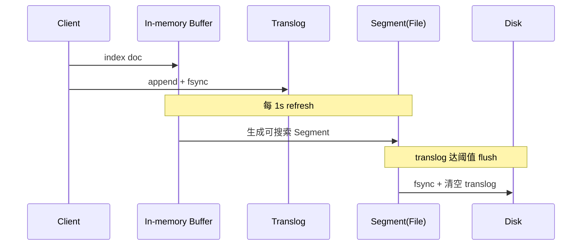

# ES 体系

## ES 的整体结构

> 图：ES 整体结构（集群、节点、分片、Segment 的关系）

- 一个 ES Index 在集群模式下，由多个 Node（节点）组成。每个节点就是 ES 的 Instance（实例）。
- 每个节点上会有多个 shard（分片），P1、P2 是主分片，R1、R2 是副本分片。
- 每个分片对应着一个 Lucene Index（底层索引文件）。
- Lucene Index 是一个统称：
  - 由多个 Segment（段文件，即倒排索引）组成，每个段文件存储着 Doc 文档。
  - commit point 记录了所有 segments 的信息。

### 补充 Lucene 索引结构

> 图：Lucene 索引结构补充说明

## ES 存储的流程

> 图：ES 存储流程示意

## ES 写入原理（近实时搜索的奥秘）

ES 之所以被称为“近实时（NRT, Near Real-Time）”检索，根源在于写入链路中 refresh、flush、translog 三者的协作。

- **Refresh（刷新）**：写入的文档先放进 In-memory Buffer，默认每 1s 将 Buffer 中的文档生成一个新的 **Segment**（文件），并打开使其可被搜索。这就是“近实时”的来源——文档在 1s 后才可见。可通过 `index.refresh_interval` 调整；批量导入时可临时调大以减少 Segment 数量。
- **Translog（事务日志）**：每一次写入都会顺序追加到 translog 并落盘（fsync 策略可配），用于宕机后恢复未 flush 的数据，保证不丢。
- **Flush（落盘）**：当 translog 达到一定阈值（默认 512MB）或 30 分钟，触发 flush：将 Buffer 中的 Segment 真正 fsync 到磁盘，并清空 translog、生成 commit point。

## 倒排索引与分词（Analyzer）

ES 的检索能力来自 **倒排索引**：term → 包含该 term 的文档 id 列表。而 term 长什么样，由 **Analyzer** 决定，它包含三部分：

| 组件 | 作用 | 常见实现 |
| --- | --- | --- |
| Character Filters | 预处理（去 HTML 标签等） | HTML Strip |
| Tokenizer | 切词，得到 term | Standard、IK、whitespace |
| Token Filters | 小写化、去停用词、同义词 | lowercase、stop、synonym |

中文场景几乎必用 **IK 分词器**（`ik_max_word` 最细粒度，`ik_smart` 最粗）。自定义词典可显著提升召回与精度。

## 聚合（Aggregation）

聚合类似 SQL 的 GROUP BY + 统计函数，但能力更强，分三类：

- **Bucket（桶）聚合**：分组。`terms`（按字段值分桶）、`date_histogram`（按时间分桶）、`range`（按数值区间）。
- **Metric（指标）聚合**：计算。`avg`/`sum`/`max`/`min`/`cardinality`（近似去重，基于 HyperLogLog）/`percentiles`（分位数）。
- **Pipeline（管道）聚合**：对聚合结果再做聚合，如 `derivative`（导数）、`cumulative_sum`（累计和）、`bucket_sort`（桶排序分页）。

注意：聚合在**查询命中的文档**上执行。深度聚合（大量桶）极易 OOM，生产应配合 `composite` 聚合做分页游标。

## 查询与性能调优

- **避免通配符前缀**：`*abc` 无法走倒排，性能极差；
- **用 filter 替代 query**：filter 不计算评分、结果可缓存，适合 bool 过滤；
- **深分页用 search_after**：`from+size` 越深越慢（每个 shard 都要取前 N 条再归并），`search_after` 基于上一页最后一个排序值游标推进；
- **Mapping 设计**：能 `keyword` 就不 `text`；不需要聚合/排序的字段设 `doc_values: false`；大文本用 `text`；时间用 `date`。
- **Segment 合并**：`forcemerge` 将小 segment 合成大 segment 提升查询速度，但会消耗 IO，建议在写入完成后对冷索引执行。

## 集群运维与脑裂

- 选主：基于 `cluster.initial_master_nodes` 与 `discovery.seed_hosts`；`minimum_master_nodes`（7.x 后由 `cluster.initial_master_nodes` + 奇数节点自动仲裁）防止**脑裂**。
- 分片规划：单个分片建议 10~50GB；分片数一旦设定不可轻易修改，前期需按数据总量与节点数合理规划（经验：节点数 ≈ 分片数）。
- 写入瓶颈排查：`_nodes/hot_threads`、`_cat/indices?v`、`_cat/thread_pool?v` 看 bulk 队列是否满。
