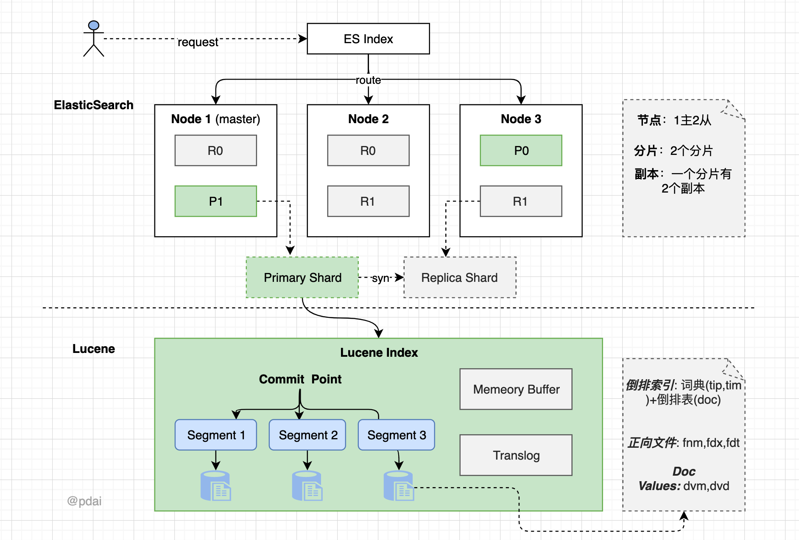
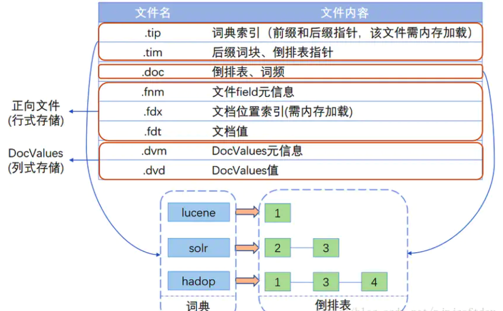
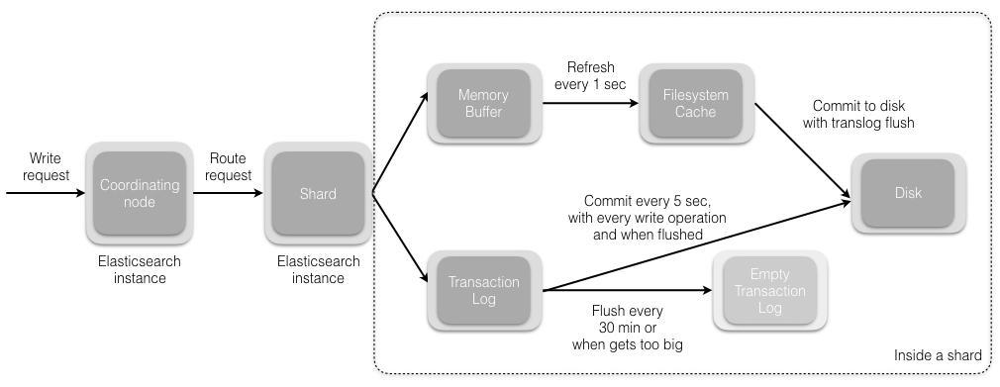
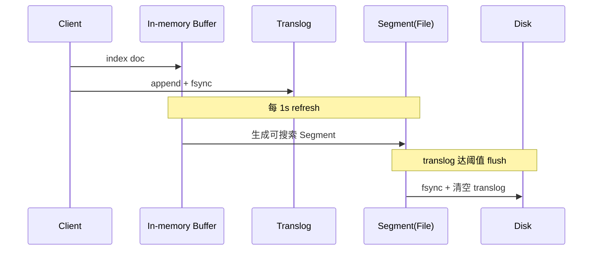
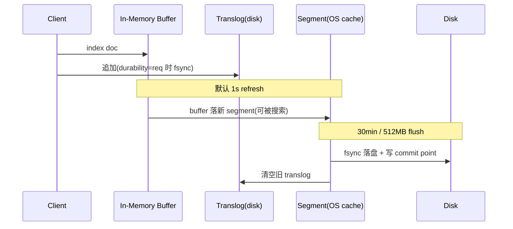

# ES 体系

## ES 的整体结构



> 图：ES 整体结构（集群、节点、分片、Segment 的关系）

- 一个 ES Index 在集群模式下，由多个 Node（节点）组成。每个节点就是 ES 的 Instance（实例）。
- 每个节点上会有多个 shard（分片），P1、P2 是主分片，R1、R2 是副本分片。
- 每个分片对应着一个 Lucene Index（底层索引文件）。
- Lucene Index 是一个统称：
  - 由多个 Segment（段文件，即倒排索引）组成，每个段文件存储着 Doc 文档。
  - commit point 记录了所有 segments 的信息。

### 补充 Lucene 索引结构



> 图：Lucene 索引结构补充说明

## ES 存储的流程



> 图：ES 存储流程示意

## ES 写入原理（近实时搜索的奥秘）

ES 之所以被称为“近实时（NRT, Near Real-Time）”检索，根源在于写入链路中 refresh、flush、translog 三者的协作。

- **Refresh（刷新）**：写入的文档先放进 In-memory Buffer，默认每 1s 将 Buffer 中的文档生成一个新的 **Segment**（文件），并打开使其可被搜索。这就是“近实时”的来源——文档在 1s 后才可见。可通过 `index.refresh_interval` 调整；批量导入时可临时调大以减少 Segment 数量。
- **Translog（事务日志）**：每一次写入都会顺序追加到 translog 并落盘（fsync 策略可配），用于宕机后恢复未 flush 的数据，保证不丢。
- **Flush（落盘）**：当 translog 达到一定阈值（默认 512MB）或 30 分钟，触发 flush：将 Buffer 中的 Segment 真正 fsync 到磁盘，并清空 translog、生成 commit point。



## 倒排索引与分词（Analyzer）

ES 的检索能力来自 **倒排索引**：term → 包含该 term 的文档 id 列表。而 term 长什么样，由 **Analyzer** 决定，它包含三部分：

| 组件 | 作用 | 常见实现 |
| --- | --- | --- |
| Character Filters | 预处理（去 HTML 标签等） | HTML Strip |
| Tokenizer | 切词，得到 term | Standard、IK、whitespace |
| Token Filters | 小写化、去停用词、同义词 | lowercase、stop、synonym |

中文场景几乎必用 **IK 分词器**（`ik_max_word` 最细粒度，`ik_smart` 最粗）。自定义词典可显著提升召回与精度。

## 聚合（Aggregation）

聚合类似 SQL 的 GROUP BY + 统计函数，但能力更强，分三类：

- **Bucket（桶）聚合**：分组。`terms`（按字段值分桶）、`date_histogram`（按时间分桶）、`range`（按数值区间）。
- **Metric（指标）聚合**：计算。`avg`/`sum`/`max`/`min`/`cardinality`（近似去重，基于 HyperLogLog）/`percentiles`（分位数）。
- **Pipeline（管道）聚合**：对聚合结果再做聚合，如 `derivative`（导数）、`cumulative_sum`（累计和）、`bucket_sort`（桶排序分页）。

注意：聚合在**查询命中的文档**上执行。深度聚合（大量桶）极易 OOM，生产应配合 `composite` 聚合做分页游标。

## 查询与性能调优

- **避免通配符前缀**：`*abc` 无法走倒排，性能极差；
- **用 filter 替代 query**：filter 不计算评分、结果可缓存，适合 bool 过滤；
- **深分页用 search_after**：`from+size` 越深越慢（每个 shard 都要取前 N 条再归并），`search_after` 基于上一页最后一个排序值游标推进；
- **Mapping 设计**：能 `keyword` 就不 `text`；不需要聚合/排序的字段设 `doc_values: false`；大文本用 `text`；时间用 `date`。
- **Segment 合并**：`forcemerge` 将小 segment 合成大 segment 提升查询速度，但会消耗 IO，建议在写入完成后对冷索引执行。

## 集群运维与脑裂

- 选主：基于 `cluster.initial_master_nodes` 与 `discovery.seed_hosts`；`minimum_master_nodes`（7.x 后由 `cluster.initial_master_nodes` + 奇数节点自动仲裁）防止**脑裂**。
- 分片规划：单个分片建议 10~50GB；分片数一旦设定不可轻易修改，前期需按数据总量与节点数合理规划（经验：节点数 ≈ 分片数）。
- 写入瓶颈排查：`_nodes/hot_threads`、`_cat/indices?v`、`_cat/thread_pool?v` 看 bulk 队列是否满。

---

# 第二轮深度优化：写入引擎 / 段合并 / 分词定制 / 聚合实战 / 冷热架构 / 调优 / 选型

## 一、写入原理：refresh / flush / translog（深度）

ES 是**近实时（NRT）**搜索引擎：文档写入到可被搜索，默认有 ≈1s 延迟，根源在 refresh 机制。一次 `index/update/delete` 的落盘链路如下：

1. **内存缓冲 + Translog**：文档先写入 In-memory buffer，同时**顺序追加**到 translog 文件。translog 的作用是故障恢复——即便 segment 还没落盘，重启也能重放。
   - `index.translog.durability=request`（默认）：每次写请求都 `fsync` translog，最强不丢；
   - `index.translog.durability=async`：按 `sync_interval`（默认 5s）+ `flush_threshold_size` 异步 fsync，吞吐更高但可能丢数秒数据。
2. **refresh（默认 1s）**：将 buffer 里的文档生成一个新的**倒排索引 segment**，写入 OS 页缓存（**未 fsync**），之后该 segment 即可被搜索——这就是"近实时"不是实时。调优：
   - 写多读少 / 批量导入：调大 `refresh_interval: 30s` 甚至 `-1`（关闭），导入完再手动 `_refresh`；
   - 实时性要求高：调到 `1s` 以内，但更频繁生成小 segment，增加 CPU/IO。
3. **flush（默认 30min 或 translog 达 512MB）**：将文件系统缓存里的 segment **真正 fsync 到磁盘**，生成 commit point，并**清空旧 translog**。
4. **恢复**：节点重启时先加载已落盘 segment，再用 translog 重放未 flush 的写，保证 `request` 级 durability。



> 要点：refresh 只进 OS cache 不 fsync；故障保护靠 translog；flush 才真正持久化。机器宕机时未 flush 的已 refresh 数据由 translog 兜底。

## 二、段合并（Segment Merge）

每次 refresh 都会产生一个小 segment，小 segment 过多会拖慢查询（每个 query 要遍历所有 segment）、占用文件句柄。ES 后台 **Merge 线程** 持续把小 segment 合成大 segment：

- 合并是**段拷贝 + 标记删除**：旧 segment 中 `_delete` 标记的文档（update/delete 实际是标记删除）在新段中不再写入，合并完成后旧段被删除，从而**物理回收删除文档的空间**（update 在 ES 里是先删后插）。
- `forcemerge`：手动将分片 segment 合并到指定数量（如 `max_num_segments=1`），适合**冷索引/只读索引**大幅减少 segment、提升查询速度；但合并极耗 IO/CPU，**严禁在热写入索引上跑**。
- 调优：`index.merge.scheduler.max_thread_count` 限制合并线程（HDD 建议 1 避免磁头抖动），`segments_per_tier` / `max_merged_segment` 控制每层段数与上限。

## 三、分词器定制：IK 与 Pinyin 实战

写入与查询都要经过 analyzer（`char_filter → tokenizer → token_filter`）。中文必须定制分词：

- **IK 分词器**：`ik_max_word`（最细粒度，召回高、索引膨胀）vs `ik_smart`（最粗粒度，精度高）。
  ```json
  PUT /news
  {
    "settings": {
      "analysis": { "analyzer": { "my_ik": { "type": "ik_max_word" } } }
    },
    "mappings": {
      "properties": {
        "title": { "type": "text", "analyzer": "my_ik", "search_analyzer": "ik_smart" }
      }
    }
  }
  ```
- **自定义词典**：`IKAnalyzer.cfg.xml` 配置 `ext_dict`（主词典）、`ext_stopwords`（停用词）。热更新可指向 HTTP 地址，IK 定时拉取。新增行业词（如"鸿蒙""算力"）不进词典会导致召回失败。
- **Pinyin 分词器**：用于拼音搜索/首字母补全，常与 IK 组合成 `ik_pinyin` analyzer：
  ```json
  "analyzer": {
    "ik_pinyin": { "tokenizer": "ik_max_word", "filter": ["pinyin_filter"] }
  },
  "filter": {
    "pinyin_filter": {
      "type": "pinyin", "keep_full_pinyin": true,
      "keep_joined_full_pinyin": true, "keep_first_letter": true
    }
  }
  ```
  这样"张三"可被"张三 / zhangsan / zs"搜到。生产建议索引时用 ik_pinyin、查询时按需，并评估空间膨胀。

## 四、聚合实战进阶

聚合在**查询命中的文档（各 shard 本地数据）**上执行，进阶要点：

- **`composite` 聚合做深分页**：`terms` 聚合受 `size` 上限（默认 10000）与内存限制，深翻页会 OOM。`composite` 用 `after` 游标分批拉取，适合"全量导出每个分组的统计"：
  ```json
  {
    "size": 0,
    "aggs": {
      "by_user": {
        "composite": { "sources": [{ "u": { "terms": { "field": "user_id" } } }], "size": 1000 }
      }
    }
  }
  ```
  下一次请求带上 `"after": { "u": "<上次最后一个 user_id>" }` 即可续拉。
- **`filter` 聚合做同维度多视角**：一个桶内用不同 filter 统计（如"支付成功 / 失败"各自 count），避免多次查询。
- **`percentiles` 看 RT 分布**：监控场景用 `percentiles{field:latency, percents:[50,90,99]}` 看 P99 延迟，比 avg 更有意义。
- **`date_histogram` + `derivative`/`cumulative_sum`**：配合 pipeline 聚合看"每小时增量""环比变化"。
- **陷阱**：`fielddata`（text 字段聚合）会把数据加载到堆内存，极易 OOM——聚合字段务必用 `keyword`；大基数 `terms` 聚合用 `shard_size` 调优，或 `execution_hint: map`。

## 五、冷热温架构（Hot-Warm-Cold / ILM）

日志/指标类数据有明显生命周期：新数据热（高写入、少量查询）、旧数据温（偶尔查）、更旧冷（归档、极少查）。用 **ILM（Index Lifecycle Management）** 自动滚动与降配：


- 节点打标签：`node.attr.box_type: hot/warm/cold`，ILM 的 `allocate` action 把 shard 迁移到对应节点；
- `rollover`：索引写满 `max_size`/`max_age`/`max_docs` 自动滚动出新索引（`logs-000001 → logs-000002`）；
- `freeze`/`searchable snapshots`：冷数据转可搜索快照，存对象存储省本地盘。
- 收益：少量 SSD 热节点扛写入，整体成本大幅下降。

## 六、性能调优 Checklist

- **写入侧**：`refresh_interval` 调大；bulk 批量（5~15MB/批）；导入时副本设为 0、导入完再调回；`translog.durability=async`（可容忍丢数时）。
- **Mapping 侧**：`keyword` 优先 `text`；不需要聚合/排序字段关 `doc_values`；`text` 不要开 `fielddata`；`nested` vs `object` 按数组语义选择（nested 会炸数组）。
- **查询侧**：`filter` 替代 `query`；`search_after` 替代深分页；`_source` 过滤只取所需字段；`preference` 固定路由避免 shard 缓存失效。
- **集群侧**：单分片 10~50GB；观察 `thread_pool.write` 队列是否满；`indices.query.bool.max_clause_count` 防超大 bool；监控 `_nodes/hot_threads`、`_cat/indices?v&h=docs,store.size`、`_cat/segments`。
- **JVM**：堆 ≤ 50% 物理内存且 ≤ 32GB（压缩指针）；留一半内存给 OS 文件系统缓存（segment 靠 page cache 加速）。

## 七、ES vs MySQL vs ClickHouse 选型对比

| 维度 | Elasticsearch | MySQL（InnoDB） | ClickHouse |
| --- | --- | --- | --- |
| 定位 | 搜索 + 聚合分析 | OLTP 事务型 | OLAP 列存分析 |
| 写入 | 近实时、批量友好 | 实时事务、行级 | 批量追加、弱更新 |
| 查询 | 全文检索、灵活聚合 | 点查/事务、二级索引 | 海量列聚合极快 |
| 一致性 | 近实时最终一致 | 强一致（ACID） | 最终一致、弱事务 |
| 典型场景 | 日志检索、商品搜索 | 订单/账户核心交易 | 报表、埋点、BI 大宽表 |

经验：**ES 不替代数据库做源头存储**（它是索引/派生数据）；核心数据在 MySQL，ES 作为检索副本通过 binlog（Canal/Debezium）同步；超大量固定维度报表用 ClickHouse，ES 做交互式探索。三者常组合：MySQL 写、ES 检索、ClickHouse 分析。

## 八、写入实战：bulk / reindex / 别名

- **bulk 最佳实践**：单批 5~15MB、几千条为宜；`index`/`create`/`update`/`delete` 可混合；响应 `errors:true` 时必须逐条检查 `items[].index.status`，对 `429`（队列满）做退避重试。导入期设 `refresh=false`、副本 0，完成后恢复。
- **`_reindex` 迁移**：跨索引/集群迁数据，`wait_for_completion=false` 异步 + Task API 查进度；`slices` 并行加速；`script` 做字段变换/改名。注意目标索引 mapping 需先建好。
- **别名零停机切换**：业务查 alias，重建新索引后原子切 `aliases`（`remove` 旧 + `add` 新在一个动作里），避免改业务配置；配合 ILM rollover 自动管理，发布无感。
- **安全与权限**：生产开启安全（xpack 口令/TLS），用角色控制索引读写；严禁公网暴露 9200；`字段级安全` 屏蔽敏感字段；`http.cors` 别随意开。

## 九、Mapping 与写入设计实例（订单检索）

- 订单检索场景：订单号/用户ID 用 `keyword`（精确匹配 + 聚合），标题用 `text + ik`，状态/时间用 `keyword`/`date`，金额用 `scaled_float`（避免 double 精度问题）。
- 避免 `dynamic: true` 自动加字段导致 mapping 爆炸（用 `dynamic: strict` 拒绝意外字段，或用 `runtime fields` 运行时字段按需计算不落存储）。
- 写入用 `bulk` + 重试；查询用 `filter` + `search_after` 翻页；冷数据进 Warm/Cold 节点降成本；监控 segment 数与 refresh 开销。
