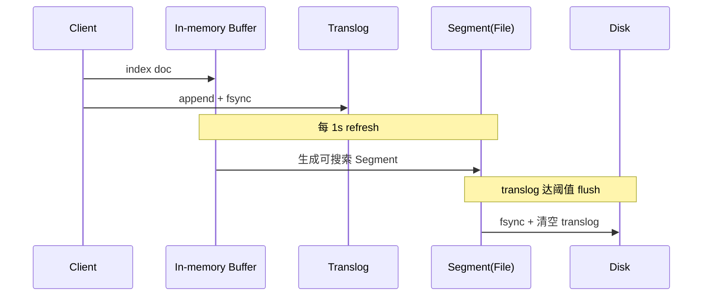
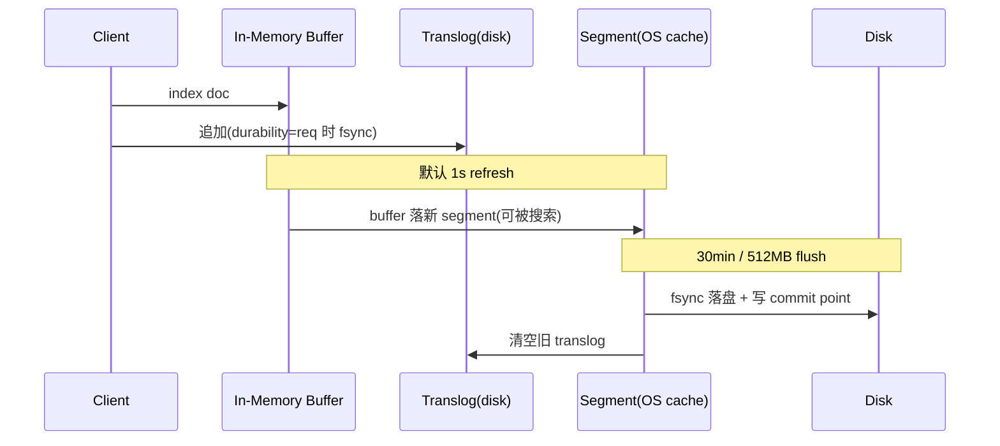
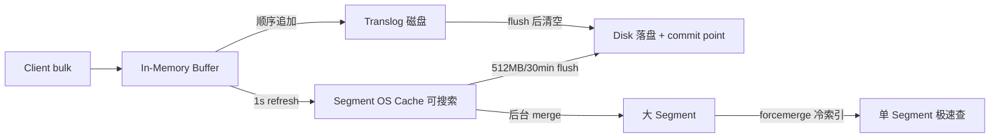
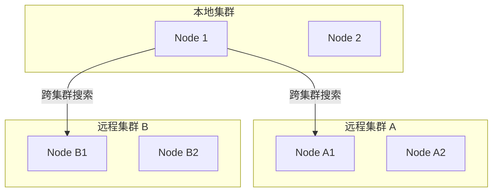
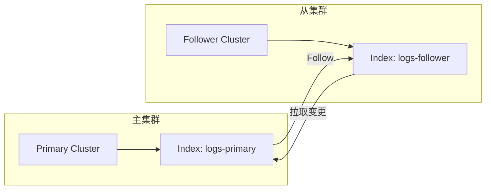

# ES 体系

## ES 的整体结构


> 图：ES 整体结构（集群、节点、分片、Segment 的关系）

- 一个 ES Index 在集群模式下，由多个 Node（节点）组成。每个节点就是 ES 的 Instance（实例）。
- 每个节点上会有多个 shard（分片），P1、P2 是主分片，R1、R2 是副本分片。
- 每个分片对应着一个 Lucene Index（底层索引文件）。
- Lucene Index 是一个统称：
  - 由多个 Segment（段文件，即倒排索引）组成，每个段文件存储着 Doc 文档。
  - commit point 记录了所有 segments 的信息。

### 补充 Lucene 索引结构


> 图：Lucene 索引结构补充说明

## ES 存储的流程


> 图：ES 存储流程示意

## ES 写入原理（近实时搜索的奥秘）

ES 之所以被称为“近实时（NRT, Near Real-Time）”检索，根源在于写入链路中 refresh、flush、translog 三者的协作。

- **Refresh（刷新）**：写入的文档先放进 In-memory Buffer，默认每 1s 将 Buffer 中的文档生成一个新的 **Segment**（文件），并打开使其可被搜索。这就是“近实时”的来源——文档在 1s 后才可见。可通过 `index.refresh_interval` 调整；批量导入时可临时调大以减少 Segment 数量。
- **Translog（事务日志）**：每一次写入都会顺序追加到 translog 并落盘（fsync 策略可配），用于宕机后恢复未 flush 的数据，保证不丢。
- **Flush（落盘）**：当 translog 达到一定阈值（默认 512MB）或 30 分钟，触发 flush：将 Buffer 中的 Segment 真正 fsync 到磁盘，并清空 translog、生成 commit point。



## 倒排索引与分词（Analyzer）

ES 的检索能力来自 **倒排索引**：term → 包含该 term 的文档 id 列表。而 term 长什么样，由 **Analyzer** 决定，它包含三部分：

| 组件 | 作用 | 常见实现 |
| --- | --- | --- |
| Character Filters | 预处理（去 HTML 标签等） | HTML Strip |
| Tokenizer | 切词，得到 term | Standard、IK、whitespace |
| Token Filters | 小写化、去停用词、同义词 | lowercase、stop、synonym |

中文场景几乎必用 **IK 分词器**（`ik_max_word` 最细粒度，`ik_smart` 最粗）。自定义词典可显著提升召回与精度。

## 聚合（Aggregation）

聚合类似 SQL 的 GROUP BY + 统计函数，但能力更强，分三类：

- **Bucket（桶）聚合**：分组。`terms`（按字段值分桶）、`date_histogram`（按时间分桶）、`range`（按数值区间）。
- **Metric（指标）聚合**：计算。`avg`/`sum`/`max`/`min`/`cardinality`（近似去重，基于 HyperLogLog）/`percentiles`（分位数）。
- **Pipeline（管道）聚合**：对聚合结果再做聚合，如 `derivative`（导数）、`cumulative_sum`（累计和）、`bucket_sort`（桶排序分页）。

注意：聚合在**查询命中的文档**上执行。深度聚合（大量桶）极易 OOM，生产应配合 `composite` 聚合做分页游标。

## 查询与性能调优

- **避免通配符前缀**：`*abc` 无法走倒排，性能极差；
- **用 filter 替代 query**：filter 不计算评分、结果可缓存，适合 bool 过滤；
- **深分页用 search_after**：`from+size` 越深越慢（每个 shard 都要取前 N 条再归并），`search_after` 基于上一页最后一个排序值游标推进；
- **Mapping 设计**：能 `keyword` 就不 `text`；不需要聚合/排序的字段设 `doc_values: false`；大文本用 `text`；时间用 `date`。
- **Segment 合并**：`forcemerge` 将小 segment 合成大 segment 提升查询速度，但会消耗 IO，建议在写入完成后对冷索引执行。

## 集群运维与脑裂

- 选主：基于 `cluster.initial_master_nodes` 与 `discovery.seed_hosts`；`minimum_master_nodes`（7.x 后由 `cluster.initial_master_nodes` + 奇数节点自动仲裁）防止**脑裂**。
- 分片规划：单个分片建议 10~50GB；分片数一旦设定不可轻易修改，前期需按数据总量与节点数合理规划（经验：节点数 ≈ 分片数）。
- 写入瓶颈排查：`_nodes/hot_threads`、`_cat/indices?v`、`_cat/thread_pool?v` 看 bulk 队列是否满。

---

# 第二轮深度优化：写入引擎 / 段合并 / 分词定制 / 聚合实战 / 冷热架构 / 调优 / 选型

## 一、写入原理：refresh / flush / translog（深度）

ES 是**近实时（NRT）**搜索引擎：文档写入到可被搜索，默认有 ≈1s 延迟，根源在 refresh 机制。一次 `index/update/delete` 的落盘链路如下：

1. **内存缓冲 + Translog**：文档先写入 In-memory buffer，同时**顺序追加**到 translog 文件。translog 的作用是故障恢复——即便 segment 还没落盘，重启也能重放。
   - `index.translog.durability=request`（默认）：每次写请求都 `fsync` translog，最强不丢；
   - `index.translog.durability=async`：按 `sync_interval`（默认 5s）+ `flush_threshold_size` 异步 fsync，吞吐更高但可能丢数秒数据。
2. **refresh（默认 1s）**：将 buffer 里的文档生成一个新的**倒排索引 segment**，写入 OS 页缓存（**未 fsync**），之后该 segment 即可被搜索——这就是"近实时"不是实时。调优：
   - 写多读少 / 批量导入：调大 `refresh_interval: 30s` 甚至 `-1`（关闭），导入完再手动 `_refresh`；
   - 实时性要求高：调到 `1s` 以内，但更频繁生成小 segment，增加 CPU/IO。
3. **flush（默认 30min 或 translog 达 512MB）**：将文件系统缓存里的 segment **真正 fsync 到磁盘**，生成 commit point，并**清空旧 translog**。
4. **恢复**：节点重启时先加载已落盘 segment，再用 translog 重放未 flush 的写，保证 `request` 级 durability。



> 要点：refresh 只进 OS cache 不 fsync；故障保护靠 translog；flush 才真正持久化。机器宕机时未 flush 的已 refresh 数据由 translog 兜底。

## 二、段合并（Segment Merge）

每次 refresh 都会产生一个小 segment，小 segment 过多会拖慢查询（每个 query 要遍历所有 segment）、占用文件句柄。ES 后台 **Merge 线程** 持续把小 segment 合成大 segment：

- 合并是**段拷贝 + 标记删除**：旧 segment 中 `_delete` 标记的文档（update/delete 实际是标记删除）在新段中不再写入，合并完成后旧段被删除，从而**物理回收删除文档的空间**（update 在 ES 里是先删后插）。
- `forcemerge`：手动将分片 segment 合并到指定数量（如 `max_num_segments=1`），适合**冷索引/只读索引**大幅减少 segment、提升查询速度；但合并极耗 IO/CPU，**严禁在热写入索引上跑**。
- 调优：`index.merge.scheduler.max_thread_count` 限制合并线程（HDD 建议 1 避免磁头抖动），`segments_per_tier` / `max_merged_segment` 控制每层段数与上限。

## 三、分词器定制：IK 与 Pinyin 实战

写入与查询都要经过 analyzer（`char_filter → tokenizer → token_filter`）。中文必须定制分词：

- **IK 分词器**：`ik_max_word`（最细粒度，召回高、索引膨胀）vs `ik_smart`（最粗粒度，精度高）。
  ```json
  PUT /news
  {
    "settings": {
      "analysis": { "analyzer": { "my_ik": { "type": "ik_max_word" } } }
    },
    "mappings": {
      "properties": {
        "title": { "type": "text", "analyzer": "my_ik", "search_analyzer": "ik_smart" }
      }
    }
  }
  ```
- **自定义词典**：`IKAnalyzer.cfg.xml` 配置 `ext_dict`（主词典）、`ext_stopwords`（停用词）。热更新可指向 HTTP 地址，IK 定时拉取。新增行业词（如"鸿蒙""算力"）不进词典会导致召回失败。
- **Pinyin 分词器**：用于拼音搜索/首字母补全，常与 IK 组合成 `ik_pinyin` analyzer：
  ```json
  "analyzer": {
    "ik_pinyin": { "tokenizer": "ik_max_word", "filter": ["pinyin_filter"] }
  },
  "filter": {
    "pinyin_filter": {
      "type": "pinyin", "keep_full_pinyin": true,
      "keep_joined_full_pinyin": true, "keep_first_letter": true
    }
  }
  ```
  这样"张三"可被"张三 / zhangsan / zs"搜到。生产建议索引时用 ik_pinyin、查询时按需，并评估空间膨胀。

## 四、聚合实战进阶

聚合在**查询命中的文档（各 shard 本地数据）**上执行，进阶要点：

- **`composite` 聚合做深分页**：`terms` 聚合受 `size` 上限（默认 10000）与内存限制，深翻页会 OOM。`composite` 用 `after` 游标分批拉取，适合"全量导出每个分组的统计"：
  ```json
  {
    "size": 0,
    "aggs": {
      "by_user": {
        "composite": { "sources": [{ "u": { "terms": { "field": "user_id" } } }], "size": 1000 }
      }
    }
  }
  ```
  下一次请求带上 `"after": { "u": "<上次最后一个 user_id>" }` 即可续拉。
- **`filter` 聚合做同维度多视角**：一个桶内用不同 filter 统计（如"支付成功 / 失败"各自 count），避免多次查询。
- **`percentiles` 看 RT 分布**：监控场景用 `percentiles{field:latency, percents:[50,90,99]}` 看 P99 延迟，比 avg 更有意义。
- **`date_histogram` + `derivative`/`cumulative_sum`**：配合 pipeline 聚合看"每小时增量""环比变化"。
- **陷阱**：`fielddata`（text 字段聚合）会把数据加载到堆内存，极易 OOM——聚合字段务必用 `keyword`；大基数 `terms` 聚合用 `shard_size` 调优，或 `execution_hint: map`。

## 五、冷热温架构（Hot-Warm-Cold / ILM）

日志/指标类数据有明显生命周期：新数据热（高写入、少量查询）、旧数据温（偶尔查）、更旧冷（归档、极少查）。用 **ILM（Index Lifecycle Management）** 自动滚动与降配：


- 节点打标签：`node.attr.box_type: hot/warm/cold`，ILM 的 `allocate` action 把 shard 迁移到对应节点；
- `rollover`：索引写满 `max_size`/`max_age`/`max_docs` 自动滚动出新索引（`logs-000001 → logs-000002`）；
- `freeze`/`searchable snapshots`：冷数据转可搜索快照，存对象存储省本地盘。
- 收益：少量 SSD 热节点扛写入，整体成本大幅下降。

## 六、性能调优 Checklist

- **写入侧**：`refresh_interval` 调大；bulk 批量（5~15MB/批）；导入时副本设为 0、导入完再调回；`translog.durability=async`（可容忍丢数时）。
- **Mapping 侧**：`keyword` 优先 `text`；不需要聚合/排序字段关 `doc_values`；`text` 不要开 `fielddata`；`nested` vs `object` 按数组语义选择（nested 会炸数组）。
- **查询侧**：`filter` 替代 `query`；`search_after` 替代深分页；`_source` 过滤只取所需字段；`preference` 固定路由避免 shard 缓存失效。
- **集群侧**：单分片 10~50GB；观察 `thread_pool.write` 队列是否满；`indices.query.bool.max_clause_count` 防超大 bool；监控 `_nodes/hot_threads`、`_cat/indices?v&h=docs,store.size`、`_cat/segments`。
- **JVM**：堆 ≤ 50% 物理内存且 ≤ 32GB（压缩指针）；留一半内存给 OS 文件系统缓存（segment 靠 page cache 加速）。

## 七、ES vs MySQL vs ClickHouse 选型对比

| 维度 | Elasticsearch | MySQL（InnoDB） | ClickHouse |
| --- | --- | --- | --- |
| 定位 | 搜索 + 聚合分析 | OLTP 事务型 | OLAP 列存分析 |
| 写入 | 近实时、批量友好 | 实时事务、行级 | 批量追加、弱更新 |
| 查询 | 全文检索、灵活聚合 | 点查/事务、二级索引 | 海量列聚合极快 |
| 一致性 | 近实时最终一致 | 强一致（ACID） | 最终一致、弱事务 |
| 典型场景 | 日志检索、商品搜索 | 订单/账户核心交易 | 报表、埋点、BI 大宽表 |

经验：**ES 不替代数据库做源头存储**（它是索引/派生数据）；核心数据在 MySQL，ES 作为检索副本通过 binlog（Canal/Debezium）同步；超大量固定维度报表用 ClickHouse，ES 做交互式探索。三者常组合：MySQL 写、ES 检索、ClickHouse 分析。

## 八、写入实战：bulk / reindex / 别名

- **bulk 最佳实践**：单批 5~15MB、几千条为宜；`index`/`create`/`update`/`delete` 可混合；响应 `errors:true` 时必须逐条检查 `items[].index.status`，对 `429`（队列满）做退避重试。导入期设 `refresh=false`、副本 0，完成后恢复。
- **`_reindex` 迁移**：跨索引/集群迁数据，`wait_for_completion=false` 异步 + Task API 查进度；`slices` 并行加速；`script` 做字段变换/改名。注意目标索引 mapping 需先建好。
- **别名零停机切换**：业务查 alias，重建新索引后原子切 `aliases`（`remove` 旧 + `add` 新在一个动作里），避免改业务配置；配合 ILM rollover 自动管理，发布无感。
- **安全与权限**：生产开启安全（xpack 口令/TLS），用角色控制索引读写；严禁公网暴露 9200；`字段级安全` 屏蔽敏感字段；`http.cors` 别随意开。

## 九、Mapping 与写入设计实例（订单检索）

- 订单检索场景：订单号/用户ID 用 `keyword`（精确匹配 + 聚合），标题用 `text + ik`，状态/时间用 `keyword`/`date`，金额用 `scaled_float`（避免 double 精度问题）。
- 避免 `dynamic: true` 自动加字段导致 mapping 爆炸（用 `dynamic: strict` 拒绝意外字段，或用 `runtime fields` 运行时字段按需计算不落存储）。
- 写入用 `bulk` + 重试；查询用 `filter` + `search_after` 翻页；冷数据进 Warm/Cold 节点降成本；监控 segment 数与 refresh 开销。

---

# 第三轮深度优化：写入全链路监控 / 聚合性能 / 索引模板与 ILM / 压测调优 / ES vs ClickHouse / 故障 SOP

## 一、写入全链路监控（refresh / flush / translog / merge 触发条件）

第二轮讲了原理，本轮落到**可监控、可干预**。

- **refresh 触发条件**：定时（`index.refresh_interval`，默认 1s）、`refresh=wait_for` 显式等待、bulk 默认不自动 refresh（除非 `?refresh=true`）。监控：`_stats/refresh` 看 `total_time_in_ms` 与 `external_total`（对外可见耗时）；refresh 过频 → 小 segment 暴涨、CPU 高；过稀 → 实时性差。
- **flush 触发条件**：translog 达 `index.translog.flush_threshold_size`（默认 512MB）、`index.translog.flush_threshold_period`（默认 30min）、`flush` API 手动。监控：`_stats/flush`，关注 flush 频率——频繁 flush 说明写入突增或阈值偏低。
- **translog 落盘策略**：`durability=request`（每次 fsync，默认）vs `async`（`sync_interval` 默认 5s 异步）。监控：`_stats/translog`，`uncommitted_operations` 表示尚未 flush 的写，宕机即靠它重放。
- **segment merge 触发条件**：后台 `merge` 线程持续合并；`refresh` 产生新段即进入待合并队列；`forcemerge` 手动。监控：`_stats/merges`（当前合并数 `current`、耗时 `total_time_in_ms`）、`_cat/segments/{index}?v` 看单分片 segment 数量与大小。经验：单分片 segment 数 > 数百即影响查询，冷索引可 `forcemerge?max_num_segments=1`。
- **写阻塞信号**：`_cat/thread_pool/write?v` 看 `queue`（满则拒绝 429）、`rejected`；`indices.store` 与 `refresh.total` 突增常是写入瓶颈前兆。



## 二、聚合性能优化（composite 深翻页 + pipeline 实战）

- **深翻页用 composite**：`terms` 聚合受 `size` 上限与堆内存限制，导出全部分组统计时必用 `composite` + `after` 游标。示例（按用户 + 月份二维分组）：
  ```json
  {
    "size": 0,
    "aggs": {
      "g": {
        "composite": {
          "size": 1000,
          "sources": [
            { "u": { "terms": { "field": "user_id" } } },
            { "m": { "date_histogram": { "field": "ts", "calendar_interval": "month" } } }
          ]
        }
      }
    }
  }
  ```
  续拉请求带 `"after": { "u": "<last user_id>", "m": "<last ts>" }`。注意 composite 不支持 `order` 跨 source 排序，需严格游标续拉。
- **pipeline 实战**：`derivative`（环比增量）、`cumulative_sum`（累计和）、`bucket_script`（桶内算比率）、`bucket_sort`（桶内排序/截断分页）。示例——算每小时 UV 的环比增长率：
  ```json
  "aggs": {
    "per_hour": { "date_histogram": { "field": "ts", "fixed_interval": "1h" },
      "aggs": {
        "uv": { "cardinality": { "field": "user_id" } },
        "uv_growth": { "derivative": { "buckets_path": "uv" } }
      }
    }
  }
  ```
- **聚合防 OOM**：聚合字段必须 `keyword`（禁 `fielddata` 上堆）；大基数 `terms` 用 `shard_size` 提升精度或减少精度换性能；`cardinality` 用 HyperLogLog 近似，调 `precision_threshold` 控制精度/内存；`max_buckets`（`search.max_buckets`，默认 65535）超限直接报错而非堆爆。

## 三、索引模板与 ILM 生命周期管理（YAML 实战）

- **组件模板（Component Template）**：定义可复用的 settings/mappings 片段，多个索引引用。
  ```yaml
  # component-template-logs.yaml
  template:
    settings:
      number_of_shards: 3
      number_of_replicas: 1
      refresh_interval: 30s
    mappings:
      properties:
        ts: { type: date }
        msg: { type: text, analyzer: ik_max_word }
  ```
- **索引模板（Index Template）**：用通配符匹配索引名，关联组件模板 + 挂 ILM 策略。
  ```yaml
  # index-template-logs.yaml
  index_patterns: ["logs-*"]
  composed_of: [logs-component]
  template:
    settings:
      index.lifecycle.name: logs-ilm
      index.lifecycle.rollover_alias: logs-write
  ```
- **ILM 策略 YAML**：hot 写满滚动 → warm 降副本 → cold 冻结 → delete 删除。
  ```yaml
  # ilm-policy-logs.yaml
  policy:
    phases:
      hot:
        actions:
          rollover: { max_size: 50gb, max_age: 7d }
          set_priority: { priority: 100 }
      warm:
        min_age: 7d
        actions:
          shrink: { number_of_shards: 1 }
          forcemerge: { max_num_segments: 1 }
      cold:
        min_age: 30d
        actions:
          freeze: {}
          set_priority: { priority: 0 }
      delete:
        min_age: 90d
        actions:
          delete: {}
  ```
  应用：`PUT _ilm/policy/logs-ilm` + bootstrap 初始索引 `logs-000001` 并指向 alias `logs-write`；`ILM explain`（`GET logs-*/_ilm/explain`）看阶段卡点。注意：ILM 需 `index.lifecycle.name` 与 `rollover_alias` 同时配，且 bootstrap 索引必须是 `is_write_index: true`。

## 四、写入吞吐压测与调优参数

- **压测工具**：`esrally`（官方基准，可对比版本/参数）、自写 bulk 客户端（如 `elasticsearch-bulk` 脚本）。压测前固定变量：文档大小、并发、批大小、refresh 策略。
- **调优参数清单**：
  - 导入期：`refresh_interval: -1`（关闭）、`number_of_replicas: 0`（导入完改回，避免主副双写）、`translog.durability: async`（可容忍丢数秒）。
  - bulk 批大小：5~15MB / 批，太大 GC 压力大、太小吞吐上不去；并发线程数 ≈ 数据节点数 × (1~2)。
  - 磁盘：SSD 必选（HDD 在 merge/flush 时磁头抖动致命）；`index.merge.scheduler.max_thread_count` HDD 设 1。
  - JVM：堆 ≤ 物理内存 50% 且 ≤ 32GB（保压缩指针），留一半给 page cache 缓存 segment。
- **监控吞吐瓶颈**：`_nodes/hot_threads` 看 CPU 花在哪；`thread_pool.write.queue` 满 → 调大 `queue_size` 或降写入；`disk IO wait` 高 → 磁盘瓶颈；`refresh`/`merge` 占比高 → 调大 `refresh_interval` 与 merge 线程。
- **典型收益**：关闭 refresh + 副本 0 后导入吞吐常提升 3~5 倍；导入完 `refresh` + 副本恢复 + `forcemerge` 冷索引。

## 五、ES 与 ClickHouse 在 OLAP 场景的分工

二者常被拿来对比，但**定位互补**而非替代：

| 维度 | Elasticsearch | ClickHouse |
| --- | --- | --- |
| 核心能力 | 全文检索 + 交互式聚合探索 | 海量列存聚合（固定维度报表） |
| 写入模型 | 近实时、单条/批量、更新靠标记删除 | 批量追加为主、弱更新、Mutation 异步 |
| 查询模式 | 任意条件组合、模糊/分词、深翻页探索 | 大宽表、GROUP BY 多维度、扫描亿级极快 |
| 交互体验 | Kibana 即席探索、Dev Tools 即查 | 交 SQL、BI 直连、物化视图预聚合 |
| 成本 | 倒排 + doc_values 占空间大 | 列存压缩比高、空间省 |
| 一致性 | 近实时最终一致 | 最终一致、弱事务 |

- **组合打法**：日志/文档类"既要检索又要分析"——ES 做检索与交互式下钻，原始明细/指标落 ClickHouse 做 T+1 大报表；或 ES 承接在线探索、ClickHouse 承接离线宽表。经典链路：Kafka → ES（检索）+ ClickHouse（分析），MySQL 保交易源。
- **何时选谁**：需要"关键词/分词/任意过滤/秒级可见"→ ES；需要"亿级固定维度聚合、SQL 分析、成本敏感"→ ClickHouse；两者都要就都上。

## 六、索引设计深度（时间序列 vs 非时间序列）

### 6.1 时间序列索引设计


| 设计要素 | 推荐做法 | 说明 |
|----------|----------|------|
| 索引名 | `logs-{yyyy.MM.dd}` | 按天滚动，ILM 自动管理 |
| 分片数 | 单分片 10~50GB | 日志索引 1~3 分片即可 |
| 刷新间隔 | `30s` 或更大 | 日志场景实时性要求低 |
| 副本数 | Hot=0, Warm=1 | 导入期 0 副本，完成后恢复 |
| 生命周期 | ILM 策略自动滚动 | rollover + shrink + forcemerge + delete |

**ILM 策略 YAML 完整示例**：

```yaml
# 日志索引 ILM 策略
policy:
  phases:
    hot:
      min_age: 0ms
      actions:
        rollover:
          max_size: 30gb
          max_age: 1d
          max_docs: 100000000
        set_priority: { priority: 100 }
    warm:
      min_age: 3d
      actions:
        shrink: { number_of_shards: 1 }
        forcemerge: { max_num_segments: 1 }
        set_priority: { priority: 50 }
    cold:
      min_age: 30d
      actions:
        freeze: {}
        set_priority: { priority: 0 }
    delete:
      min_age: 90d
      actions:
        delete: {}
```

### 6.2 非时间序列索引设计

| 场景 | 设计要点 | 示例 |
|------|----------|------|
| 商品搜索 | keyword+text 组合、`dynamic: strict` | `products` 索引 |
| 用户画像 | 高基数字段用 keyword、关闭不需要的 doc_values | `user_profiles` 索引 |
| 配置中心 | 小数据量、高读低写、长生命周期 | `configurations` 索引 |

### 6.3 Mapping 爆炸预防

```text
Mapping 爆炸（Mapping Explosion）：
- dynamic: true（默认）时，新字段自动加入 mapping
- 高基数字段（userId、requestId）自动加字段 → mapping 数万 → 内存爆炸

解决方案：
1. dynamic: strict（拒绝未知字段）
2. dynamic: runtime（运行时字段，不落存储，按需计算）
3. 关闭不需要聚合/排序的字段的 doc_values
```

```json
PUT /logs
{
  "mappings": {
    "dynamic": "strict",
    "properties": {
      "timestamp": { "type": "date" },
      "level": { "type": "keyword" },
      "message": { "type": "text" },
      "extra": {
        "type": "object",
        "dynamic": true
      }
    }
  }
}
```

## 七、Elasticsearch Ingest Pipelines

Ingest Pipeline 在文档索引前做预处理，类似轻量 ETL：

```json
PUT _ingest/pipeline/logs-pipeline
{
  "processors": [
    {
      "set": {
        "field": "ingest_time",
        "value": "{{_ingest.timestamp}}"
      }
    },
    {
      "date": {
        "field": "timestamp",
        "formats": ["ISO8601", "yyyy-MM-dd HH:mm:ss"]
      }
    },
    {
      "grok": {
        "field": "message",
        "patterns": ["%{IP:client_ip} %{GREEDYDATA:request_path}"]
      }
    },
    {
      "geoip": {
        "field": "client_ip",
        "target_field": "geo"
      }
    },
    {
      "remove": {
        "fields": ["raw_message"]
      }
    }
  ]
}

# 使用 Pipeline
PUT /logs/_doc/1?pipeline=logs-pipeline
{ "message": "192.168.1.1 GET /api/users", "timestamp": "2025-01-01T00:00:00Z" }
```

**常用 Processor 对照表**：

| Processor | 用途 | 典型场景 |
|-----------|------|----------|
| set | 设置字段值 | 添加固定字段、时间戳 |
| date | 日期解析 | 统一时间格式 |
| grok | 正则提取 | 解析日志格式 |
| geoip | IP 地理位置 | 添加地理信息 |
| user-agent | UA 解析 | 提取浏览器/OS 信息 |
| remove | 删除字段 | 清理不需要的字段 |
| rename | 重命名字段 | 统一字段命名 |
| script | 自定义脚本 | 复杂转换逻辑 |
| drop | 丢弃文档 | 过滤无效日志 |
| fail | 验证失败 | 数据校验 |

## 八、Runtime Fields（运行时字段）

```text
Runtime Fields = 不落存储、查询时动态计算的字段
优势：节省存储空间、灵活添加字段无需 reindex
劣势：查询时实时计算，性能比原生字段差
```

```json
PUT /logs/_mapping
{
  "runtime": {
    "response_time_ms": {
      "type": "long",
      "script": {
        "source": "emit(doc['duration'].value * 1000)"
      }
    },
    "full_url": {
      "type": "keyword",
      "script": {
        "source": "emit(params._source.scheme + '://' + params._source.host + params._source.path)"
      }
    }
  }
}

# 查询时使用
GET /logs/_search
{
  "runtime_mappings": {
    "is_error": {
      "type": "boolean",
      "script": {
        "source": "emit(doc['status_code'].value >= 500)"
      }
    }
  },
  "query": { "term": { "is_error": true } }
}
```

## 九、Elasticsearch SQL

```sql
-- 基础查询
SELECT * FROM logs WHERE level = 'ERROR' ORDER BY timestamp DESC LIMIT 100

-- 聚合
SELECT level, COUNT(*) as cnt FROM logs GROUP BY level ORDER BY cnt DESC

-- 时间聚合
SELECT DATE_FORMAT(timestamp, 'yyyy-MM-dd HH:00') as hour, COUNT(*) as cnt
FROM logs
WHERE timestamp > NOW() - INTERVAL 1 DAY
GROUP BY hour ORDER BY hour

-- JOIN（ES 7.10+）
SELECT o.order_id, c.name FROM orders o JOIN customers c ON o.customer_id = c.id

-- 子查询
SELECT * FROM (
  SELECT level, COUNT(*) as cnt FROM logs GROUP BY level
) WHERE cnt > 1000
```

```bash
# 通过 API 执行
POST /_xpack/sql?format=txt
{ "query": "SELECT * FROM logs WHERE level = 'ERROR' LIMIT 10" }

# 转换为 DSL
POST /_xpack/sql/translate
{ "query": "SELECT * FROM logs WHERE level = 'ERROR'" }
# 返回对应的 Elasticsearch DSL JSON
```

## 十、跨集群搜索（Cross-Cluster Search）



```yaml
# elasticsearch.yml 配置
# 本地集群配置远程集群
cluster.remote.cluster_a.seeds: ["10.0.1.1:9300", "10.0.1.2:9300"]
cluster.remote.cluster_a.transport.ping_connect_timeout: "30s"
cluster.remote.cluster_b.seeds: ["10.0.2.1:9300"]
```

```bash
# 跨集群查询
GET /cluster_a:logs-*,cluster_b:logs-*/_search
{
  "query": { "match_all": {} }
}

# 跨集群聚合
GET /cluster_a:logs-*/_search
{
  "size": 0,
  "aggs": {
    "by_cluster": {
      "terms": { "field": "_index" }
    }
  }
}
```

## 十一、Elasticsearch 作为向量存储

```json
# 创建向量索引
PUT /vector_docs
{
  "mappings": {
    "properties": {
      "text": { "type": "text" },
      "embedding": {
        "type": "dense_vector",
        "dims": 768,
        "index": true,
        "similarity": "cosine"
      },
      "metadata": { "type": "object", "enabled": false }
    }
  }
}

# 生成向量并索引（需先用模型生成 embedding）
POST /vector_docs/_doc/1
{
  "text": "Spring Boot 自动配置原理",
  "embedding": [0.1, 0.2, ... , 0.768个维度]
}

# kNN 向量搜索
GET /vector_docs/_search
{
  "knn": {
    "field": "embedding",
    "query_vector": [0.1, 0.2, ...],
    "k": 10,
    "num_candidates": 100
  },
  "source": ["text", "metadata"]
}

# 混合搜索（向量 + 关键词）
GET /vector_docs/_search
{
  "query": {
    "match": { "text": "Spring Boot" }
  },
  "knn": {
    "field": "embedding",
    "query_vector": [...],
    "k": 10,
    "num_candidates": 100,
    "boost": 0.5
  }
}
```

## 十二、性能测试方法论

```text
ES 压测流程：
1. 准备阶段
   - 固定变量：文档大小、数量、分片数、副本数
   - 确定基线：单节点默认配置的吞吐与延迟
   - 准备数据：bulk 导入，等待 refresh + flush 完成

2. 压测阶段
   - 写入压测：不同并发/batch size 的写入吞吐
   - 查询压测：match/term/range/aggregation 的 QPS 与延迟
   - 混合压测：写入+查询同时进行的资源竞争

3. 分析阶段
   - 吞吐指标：docs/s、search QPS
   - 延迟指标：P50/P90/P99
   - 资源指标：CPU/内存/IO/GC
   - 稳定性：长时间运行是否性能衰减
```

| 测试工具 | 特点 | 适用场景 |
|----------|------|----------|
| esrally | 官方基准测试工具 | 版本对比、参数调优 |
|自写 bulk 脚本 | 灵活定制 | 特定业务场景 |
| JMeter + ES 插件 | 通用压测平台 | 混合场景 |

**压测报告模板**：

| 指标 | 默认配置 | 优化后 | 提升 |
|------|----------|--------|------|
| 写入吞吐 (docs/s) | - | - | - |
| 查询 QPS (match) | - | - | - |
| 查询 P99 延迟 (ms) | - | - | - |
| CPU 使用率 (%) | - | - | - |
| JVM GC 暂停 (ms) | - | - | - |

## 十二、ES 高级特性与生产实践

### 12.1 Data Stream（时间序列数据）

```text
Data Stream 是 ES 7.9+ 引入的专为时间序列数据设计的 API。

核心概念：
┌──────────────────┬────────────────────────────────────────────────┐
│ 概念              │ 说明                                            │
├──────────────────┼────────────────────────────────────────────────┤
│ Data Stream      │ 由多个 backing index 组成的逻辑容器              │
│ Backing Index    │ 实际存储数据的索引（由 ILM 管理 rollover）      │
│ Index Template   │ 定义 Data Stream 的 mapping 和 settings          │
│ ILM Policy       │ 管理索引生命周期（hot/warm/cold/delete）         │
└──────────────────┴────────────────────────────────────────────────┘
```

```json
// 创建 Index Template
PUT _index_template/logs-template
{
  "index_patterns": ["logs-*"],
  "data_stream": {},
  "template": {
    "settings": {
      "number_of_shards": 3,
      "number_of_replicas": 1,
      "index.lifecycle.name": "logs-ilm-policy",
      "index.lifecycle.rollover_alias": "logs"
    },
    "mappings": {
      "properties": {
        "@timestamp": { "type": "date" },
        "message": { "type": "text" },
        "service": { "type": "keyword" },
        "level": { "type": "keyword" },
        "trace_id": { "type": "keyword" }
      }
    }
  }
}
```

```bash
# 写入数据（自动生成 backing index）
POST logs-_write
{
  "@timestamp": "2026-08-25T10:00:00Z",
  "message": "User login success",
  "service": "auth-service",
  "level": "INFO",
  "trace_id": "abc-123"
}

# 查询 Data Stream
GET logs-*/

# Rollover（ILM 自动或手动触发）
POST logs-_rollover
```

### 12.2 Enrich Processor（数据富化）

```text
Enrich Processor 在索引前将文档与已有数据进行关联匹配。

流程：
1. 创建 Enrich Policy（定义源索引和匹配字段）
2. 执行 Enrich Policy（加载数据到内存）
3. 在 Ingest Pipeline 中使用 enrich processor
```

```json
// 1. 创建 Enrich Policy
PUT _enrich/policy/user-enrich-policy
{
  "match": {
    "indices": "users",
    "match_field": "user_id",
    "enrich_fields": ["username", "email", "department"]
  }
}

// 2. 执行 Enrich Policy
POST _enrich/policy/user-enrich-policy/_execute

// 3. 在 Ingest Pipeline 中使用
PUT _ingest/pipeline/enrich-log
{
  "processors": [
    {
      "enrich": {
        "policy_name": "user-enrich-policy",
        "field": "user_id",
        "target_field": "user_info",
        "max_matches": 1
      }
    }
  ]
}

// 4. 使用 Pipeline 索引数据
POST app-logs/_doc?pipeline=enrich-log
{
  "user_id": "12345",
  "action": "purchase",
  "amount": 99.99
}
// 索引结果会自动包含 user_info.username, user_info.email 等字段
```

### 12.3 Runtime Fields（运行时字段）

```text
Runtime Fields 不修改原始 mapping，在查询时动态计算字段值。

优点：
- 无需 reindex 即可添加新字段
- 节省存储空间（不持久化计算结果）
- 快速原型开发

缺点：
- 查询性能低于映射字段（每次查询都需计算）
- 不支持聚合的精确排序
- 建议生产环境最终迁移到正式 mapping
```

```json
// 添加 Runtime Field
PUT logs-*/_mapping
{
  "runtime": {
    "response_time_ms": {
      "type": "long",
      "script": {
        "source": "emit(doc['response_time'].value * 1000)"
      }
    },
    "client_ip_geo": {
      "type": "keyword",
      "script": {
        "source": """
          def ip = doc['client_ip'].value;
          if (ip.startsWith('10.')) {
            emit('internal');
          } else if (ip.startsWith('192.168.')) {
            emit('private');
          } else {
            emit('public');
          }
        """
      }
    }
  }
}

// 查询时使用 Runtime Field
GET logs-*/_search
{
  "query": {
    "range": {
      "response_time_ms": {
        "gte": 1000
      }
    }
  },
  "runtime_mappings": {
    "slow_request": {
      "type": "boolean",
      "script": {
        "source": "emit(doc['response_time'].value > 500)"
      }
    }
  }
}
```

### 12.4 Cross-Cluster Search（跨集群搜索）

```text
CCS 允许从一个集群搜索另一个集群的数据，无需复制。

场景：
- 跨数据中心搜索
- 多集群日志聚合
- 数据驻留合规（数据不动，查询跨集群）
```

```yaml
# 集群 A 配置（搜索端）
# elasticsearch.yml
cluster.remote.cluster_b.seeds: ["cluster-b-node1:9300", "cluster-b-node2:9300"]
cluster.remote.cluster_b.transport.ping_schedule: 30s
```

```json
// 跨集群搜索
GET cluster_b:logs-*/_search
{
  "query": {
    "match": { "service": "payment" }
  }
}

// 多集群搜索
GET logs-*,cluster_b:logs-*,cluster_c:logs-*/_search
{
  "query": {
    "bool": {
      "must": [
        { "match": { "level": "ERROR" } }
      ],
      "filter": [
        { "range": { "@timestamp": { "gte": "now-1h" } } }
      ]
    }
  }
}
```

### 12.5 Frozen Tier（冻结层）

```text
ES 7.14+ 引入的冷数据存储层级，使用 searchable snapshots 实现极低成本存储。

存储层级：
┌──────────┬────────────────────────────────────────────────────────┐
│ 层级      │ 特点                                                  │
├──────────┼────────────────────────────────────────────────────────┤
│ Hot      │ SSD，高写入性能，最新数据                                │
│ Warm     │ SSD/HDD，读优化，近期数据                               │
│ Cold     │ HDD，压缩存储，较旧数据                                 │
│ Frozen   │ 对象存储（S3），极低成本，极旧数据                        │
└──────────┴────────────────────────────────────────────────────────┘
```

```json
// ILM Policy 配置 Frozen Tier
PUT _ilm/policy/logs-ilm-policy
{
  "policy": {
    "phases": {
      "hot": {
        "min_age": "0ms",
        "actions": {
          "rollover": {
            "max_size": "50gb",
            "max_age": "1d"
          },
          "set_priority": { "priority": 100 }
        }
      },
      "warm": {
        "min_age": "7d",
        "actions": {
          "shrink": { "number_of_shards": 1 },
          "forcemerge": { "max_num_segments": 1 },
          "set_priority": { "priority": 50 }
        }
      },
      "cold": {
        "min_age": "30d",
        "actions": {
          "set_priority": { "priority": 0 }
        }
      },
      "frozen": {
        "min_age": "90d",
        "actions": {
          "searchable_snapshot": {
            "snapshot_repository": "my-s3-repo",
            "force_merge_index": true
          }
        }
      },
      "delete": {
        "min_age": "365d",
        "actions": {
          "delete": {}
        }
      }
    }
  }
}
```

### 12.6 节点角色详解

```text
ES 节点角色（8.x 细化）：
┌──────────────────┬────────────────────────────────────────────────┐
│ 角色              │ 职责                                           │
├──────────────────┼────────────────────────────────────────────────┤
│ master           │ 集群管理、索引创建删除、分片分配                  │
│ data             │ 数据存储和搜索                                  │
│ data_hot         │ 热数据节点（SSD）                               │
│ data_warm        │ 温数据节点（SSD/HDD）                           │
│ data_cold        │ 冷数据节点（HDD）                               │
│ data_frozen      │ 冻结数据节点（对象存储）                         │
│ ingest           │ 数据预处理管道                                  │
│ coordinating     │ 查询协调、结果聚合                              │
│ ml               │ 机器学习任务                                    │
│ transform        │ 数据转换任务                                    │
│ voting_only      │ 仅投票节点（减少 master 选举开销）               │
│ remote_cluster_client │ 跨集群搜索客户端                         │
└──────────────────┴────────────────────────────────────────────────┘
```

```yaml
# 节点角色分离配置示例
# master 节点
node.roles: [master]

# data_hot 节点
node.roles: [data_hot, ingest]

# data_warm 节点
node.roles: [data_warm]

# coordinating 节点
node.roles: []
```

### 12.7 容量规划

```text
ES 容量规划公式：

存储容量：
  原始数据量 × 副本数 × (1 + 1/分片数) × 开销系数(1.1~1.3) ≈ 实际存储
  示例：100GB 数据 × 1 副本 × 1.1 × 1.2 ≈ 132GB

分片数量：
  单分片建议 10-50GB（写入密集取小，查询密集取大）
  总分片数 = 数据量 / 单分片大小
  分片数 = 索引数 × 每索引分片数 × (1 + 副本数)

主节点内存：
  集群状态管理：每 1000 个分片约消耗 1GB 堆内存
  建议：master 节点堆内存 ≥ 8GB

协调节点内存：
  查询结果聚合：每 1000 QPS 约需 4-8GB 堆内存
  建议：coordinating 节点堆内存 ≥ 16GB

写入性能：
  单节点写入上限约 10,000-20,000 docs/s（取决于文档大小）
  Bulk 批量大小建议 5,000-15,000 docs 或 5-15MB
```

```text
生产集群配置参考（中等规模）：
┌──────────────┬────────────────────────────────────────────────┐
│ 角色          │ 配置                                           │
├──────────────┼────────────────────────────────────────────────┤
│ Master       │ 3 节点，8GB 堆，16GB 内存，SSD                   │
│ Data Hot     │ 3-5 节点，31GB 堆，64GB 内存，NVMe SSD           │
│ Data Warm    │ 3 节点，16GB 堆，32GB 内存，SSD                  │
│ Coordinating │ 2 节点，16GB 堆，32GB 内存                       │
│ Ingest       │ 2 节点，8GB 堆，16GB 内存                        │
└──────────────┴────────────────────────────────────────────────┘
```

## Index Lifecycle Management (ILM)

### Hot / Warm / Cold / Delete

```
ILM 阶段：
  Hot（热数据）：写入节点，SSD，高性能
  Warm（温数据）：只读，HDD，压缩存储
  Cold（冷数据）：归档，高密度存储
  Delete（删除）：自动清理过期数据

Policy 配置示例：
{
  "policy": {
    "phases": {
      "hot": {
        "actions": {
          "rollover": {
            "max_size": "50GB",
            "max_age": "1d"
          },
          "set_priority": { "priority": 100 }
        }
      },
      "warm": {
        "min_age": "7d",
        "actions": {
          "shrink": { "number_of_shards": 1 },
          "forcemerge": { "max_num_segments": 1 },
          "set_priority": { "priority": 50 }
        }
      },
      "cold": {
        "min_age": "30d",
        "actions": {
          "set_priority": { "priority": 0 }
        }
      },
      "delete": {
        "min_age": "90d",
        "actions": {
          "delete": {}
        }
      }
    }
  }
}
```

| 阶段 | 存储 | 副本 | 说明 |
|------|------|------|------|
| Hot | SSD | 1-2 | 写入+查询 |
| Warm | HDD | 1 | 只读+压缩 |
| Cold | 归档存储 | 0 | 低频访问 |
| Delete | - | - | 自动清理 |

## Index Alias 灵活切换

### alias / reindex / zero-downtime migration

```json
// 创建别名
PUT /logs-2026-01
{
  "aliases": {
    "logs": {
      "is_write_index": true
    },
    "logs-readonly": {}
  }
}

// 零停机迁移：reindex 到新索引 + 切换别名
POST /_reindex
{
  "source": { "index": "logs-2026-01" },
  "dest": { "index": "logs-2026-02" }
}

POST /_aliases
{
  "actions": [
    { "remove": { "index": "logs-2026-01", "alias": "logs" } },
    { "add":    { "index": "logs-2026-02", "alias": "logs" } }
  ]
}
```

## Replica 与 Shard 策略

| 参数 | 说明 | 建议 |
|------|------|------|
| number_of_shards | 主分片数 | 50GB/分片，固定后不可改 |
| number_of_replicas | 副本数 | 生产至少 1，读多调大 |
| auto_expand_replicas | 自动扩展副本 | `"0-all"` 跨所有节点 |

```json
// 动态调整副本（读压力大时）
PUT /logs/_settings
{
  "number_of_replicas": 2
}

// 自动扩展副本
PUT /logs/_settings
{
  "index.auto_expand_replicas": "1-5"
}
```

## Scripted Fields 与 Painless

```json
// Painless 脚本字段
PUT /logs/_search
{
  "script_fields": {
    "response_time_ms": {
      "script": {
        "source": "doc['response_time'].value * 1000",
        "lang": "painless"
      }
    },
    "status_category": {
      "script": {
        "source": """
          def code = doc['status_code'].value;
          if (code < 300) return 'success';
          else if (code < 500) return 'client_error';
          else return 'server_error';
        """,
        "lang": "painless"
      }
    }
  }
}

// 运行时字段（不修改 mapping）
GET /logs/_search
{
  "runtime_fields": {
    "response_time_sec": {
      "type": "double",
      "script": {
        "source": "emit(doc['response_time'].value / 1000.0)"
      }
    }
  }
}
```

## Cross-Cluster Replication (CCR)

### 异地容灾 / 读写分离

```
CCR 架构：
  Leader 集群：主集群（写入）
  Follower 集群：备份集群（只读）
  异步复制（最终一致）

配置步骤：
  1. Leader 集群配置 remote cluster
  PUT /_cluster/settings
  {
    "persistent": {
      "cluster.remote.leader_cluster.seed": "leader-node:9300"
    }
  }

  2. Follower 集群创建 follower index
  PUT /logs-follower
  {
    "settings": {
      "index.remote_cluster": "leader_cluster",
      "index.leader_index": "logs"
    }
  }

  3. 检查复制状态
  GET /_cat/indices/logs-follower?v&h=index,health,prirep,docs.count
```

## Index Templates 与 Data Streams

```json
// Index Templates
PUT /_index_template/logs-template
{
  "index_patterns": ["logs-*"],
  "template": {
    "settings": {
      "number_of_shards": 3,
      "number_of_replicas": 1,
      "index.lifecycle.name": "logs-policy"
    },
    "mappings": {
      "properties": {
        "@timestamp": { "type": "date" },
        "message": { "type": "text" },
        "level": { "type": "keyword" }
      }
    }
  },
  "priority": 100
}

// Data Streams（推荐日志场景）
PUT /_index_template/logs-ds-template
{
  "index_patterns": ["logs-ds-*"],
  "data_stream": {},
  "template": {
    "settings": {
      "index.lifecycle.name": "logs-policy"
    }
  }
}

// 使用 Data Stream
POST /logs-ds-create/_doc
{
  "@timestamp": "2026-01-15T10:00:00Z",
  "message": "User logged in",
  "level": "INFO"
}
```

## 十三、ILM 索引生命周期管理策略

### ILM 阶段配置

```json
PUT _ilm/policy/logs-policy
{
  "policy": {
    "phases": {
      "hot": {
        "actions": {
          "rollover": {
            "max_primary_shard_size": "50gb",
            "max_age": "1d"
          },
          "set_priority": { "priority": 100 }
        }
      },
      "warm": {
        "min_age": "7d",
        "actions": {
          "shrink": { "number_of_shards": 1 },
          "forcemerge": { "max_num_segments": 1 },
          "set_priority": { "priority": 50 }
        }
      },
      "cold": {
        "min_age": "30d",
        "actions": {
          "freeze": {},
          "set_priority": { "priority": 0 }
        }
      },
      "delete": {
        "min_age": "90d",
        "actions": {
          "delete": {}
        }
      }
    }
  }
}
```

| 阶段 | 存储介质 | 副本数 | 分片数 | 查询性能 |
|------|---------|--------|--------|---------|
| Hot | SSD | 1 | 3-5 | 极高 |
| Warm | HDD | 0 | 1 | 中 |
| Cold | 对象存储 | 0 | 1 | 低 |
| Delete | - | - | - | 不可查 |

### Index Alias 别名管理

```json
// 创建别名
POST _aliases
{
  "actions": [
    { "add": { "index": "logs-2026.01.15", "alias": "logs-write" } },
    { "add": { "index": "logs-*", "alias": "logs-read" } }
  ]
}

// 别名切换（零停机）
POST _aliases
{
  "actions": [
    { "remove": { "index": "logs-2026.01.14", "alias": "logs-write" } },
    { "add": { "index": "logs-2026.01.15", "alias": "logs-write" } }
  ]
}
```

| 别名类型 | 用途 | 示例 |
|----------|------|------|
| 写入别名 | 应用写入固定别名 | `logs-write` |
| 读取别名 | 查询跨多个索引 | `logs-read` |
| 时间别名 | 按时间范围查询 | `logs-2026.01.*` |

## 十四、副本与分片策略深度解析

### 分片分配策略

| 策略 | 配置 | 行为 | 适用场景 |
|------|------|------|---------|
| 轮询 | `round_robin` | 均匀分配 | 通用 |
| 磁盘水位 | `disk watermark` | 避免热点 | 磁盘不均 |
| 感知路由 | `aware` | 跨可用区 | 高可用 |
| 强制感知 | `force_aware` | 必须跨区 | 金融级 |

```
分片数计算公式：
  分片数 = 数据量 / 单分片大小(30-50GB)
  副本数 = 可用区数 - 1（至少1个副本）

  示例：
    日志量 500GB/天，保留7天 = 3.5TB
    单分片 50GB → 需 70 个分片
    3个可用区 → 副本数 = 2
    总分片 = 70 × (1+2) = 210
```

### 脚本使用场景

| 场景 | 脚本类型 | 示例 |
|------|---------|------|
| 更新字段 | Painless | `ctx._source.views += 1` |
| 条件更新 | Painless | `if (ctx._source.status == 'new') { ctx._source.status = 'updated' }` |
| 聚合计算 | Painless | 脚本聚合自定义指标 |
| 排序 | Painless | 基于计算值排序 |

## 十五、CCR 跨集群复制与灾备

### CCR 架构



| 特性 | 主集群 | 从集群 |
|------|--------|--------|
| 写入 | 可读写 | 只读 |
| 查询 | 可查询 | 可查询 |
| 延迟 | - | 通常<1s |
| 用途 | 生产写入 | 灾备/读多写少 |

---

## 十七、ILM 策略完整配置示例

### 17.1 ILM 策略配置

```json
PUT _ilm/policy/logs-policy
{
  "policy": {
    "phases": {
      "hot": {
        "min_age": "0ms",
        "actions": {
          "rollover": {
            "max_primary_shard_size": "50gb",
            "max_age": "1d"
          },
          "set_priority": {
            "priority": 100
          }
        }
      },
      "warm": {
        "min_age": "3d",
        "actions": {
          "shrink": {
            "number_of_shards": 1
          },
          "forcemerge": {
            "max_num_segments": 1
          },
          "set_priority": {
            "priority": 50
          }
        }
      },
      "cold": {
        "min_age": "30d",
        "actions": {
          "set_priority": {
            "priority": 0
          }
        }
      },
      "delete": {
        "min_age": "90d",
        "actions": {
          "delete": {}
        }
      }
    }
  }
}
```

### 17.2 ILM 状态监控

```bash
# 查看 ILM 状态
GET _ilm/explain
# 或查看特定索引
GET my-index/_ilm/explain

# 查看 ILM 步骤
# status: RUNNING/STOPPED
# step: check-rollover-ready/complete
# step_info: 错误信息

# 手动触发 ILM
POST my-index/_ilm/move
{
  "current_step": {
    "phase": "hot",
    "action": "rollover",
    "name": "check-rollover-ready"
  },
  "next_step": {
    "phase": "warm",
    "action": "shrink",
    "name": "shrink"
  }
}
```

---

## 十八、索引别名高级用法

### 18.1 零停机迁移

```bash
# 创建新索引
PUT logs-2024.01.01
{
  "settings": {
    "number_of_shards": 3,
    "number_of_replicas": 1
  }
}

# 切换别名（原子操作）
POST _aliases
{
  "actions": [
    { "remove": { "index": "logs-2023.12.31", "alias": "logs" } },
    { "add": { "index": "logs-2024.01.01", "alias": "logs" } }
  ]
}

# 应用无感知切换
# 之前：GET logs/_search
# 之后：GET logs/_search（别名不变）
```

### 18.2 多别名查询

```bash
# 创建多个别名
POST _aliases
{
  "actions": [
    { "add": { "index": "logs-2024.01", "alias": "logs" } },
    { "add": { "index": "logs-2024.01", "alias": "logs-2024" } },
    { "add": { "index": "logs-2024.01", "alias": "logs-2024-01" } }
  ]
}

# 查询多个别名
GET logs-*,logs-2024*/_search
{
  "query": {
    "match_all": {}
  }
}
```

---

## 十九、副本与分片策略深度优化

### 19.1 分片分配策略

```
分片分配决策：
  ① 磁盘水位：low(85%) → 停止分配；high(90%) → 迁移；flood(95%) → 只读
  ② 节点负载：均衡分配到所有数据节点
  ③ 分片大小：单个分片建议 10-50GB
  ④ 分片数：一旦创建不可修改（需 reindex）

  分片数计算：
    分片数 = 预估数据量 / 单分片大小
    示例：100GB 数据 / 30GB 每分片 ≈ 4 个分片

  副本数建议：
    生产环境：至少 1 副本（高可用）
    读多写少：2-3 副本（提升读性能）
    写密集：1 副本（减少写放大）
```

### 19.2 分片调优参数

```yaml
# 分片分配过滤
index.routing.allocation.require.node_role: data_hot
index.routing.allocation.require.zone: zone-a

# 分片重平衡
cluster.routing.rebalance.enable: all
cluster.routing.allocation.balance.shard: 0.45
cluster.routing.allocation.balance.index: 0.55

# 分片恢复
cluster.routing.allocation.node_concurrent_recoveries: 2
cluster.routing.allocation.node_concurrent_incoming_recoveries: 1
cluster.routing.allocation.node_concurrent_outgoing_recoveries: 1
```

---

## 二十、Painless 脚本实战

### 20.1 更新脚本

```bash
# 使用脚本更新文档
POST my-index/_update/1
{
  "script": {
    "source": "ctx._source.views += params.count",
    "lang": "painless",
    "params": {
      "count": 1
    }
  }
}

# 条件更新
POST my-index/_update_by_query
{
  "script": {
    "source": "ctx._source.status = 'inactive'",
    "lang": "painless"
  },
  "query": {
    "range": {
      "last_login": {
        "lt": "now-30d"
      }
    }
  }
}
```

### 20.2 聚合脚本

```bash
# 脚本聚合
GET my-index/_search
{
  "size": 0,
  "aggs": {
    "profit": {
      "sum": {
        "script": {
          "source": "doc['price'].value * doc['quantity'].value",
          "lang": "painless"
        }
      }
    }
  }
}
```

---

## 二十一、Data Stream 设计最佳实践

### 21.1 Data Stream 配置

```json
# 创建索引模板
PUT _index_template/logs-template
{
  "index_patterns": ["logs-*"],
  "data_stream": {},
  "template": {
    "settings": {
      "number_of_shards": 3,
      "number_of_replicas": 1,
      "index.lifecycle.name": "logs-policy",
      "index.lifecycle.rollover_alias": "logs"
    },
    "mappings": {
      "properties": {
        "@timestamp": { "type": "date" },
        "message": { "type": "text" },
        "service": { "type": "keyword" },
        "level": { "type": "keyword" }
      }
    }
  }
}

# 写入数据
POST logs-myapp/_doc
{
  "@timestamp": "2024-01-15T10:30:00Z",
  "message": "User logged in",
  "service": "user-service",
  "level": "INFO"
}

# 查询数据
GET logs-myapp/_search
{
  "query": {
    "range": {
      "@timestamp": {
        "gte": "now-1h"
      }
    }
  }
}
```

### 21.2 Data Stream 生命周期

```
Data Stream 生命周期：
  1. 写入：数据写入当前写索引（backing index）
  2. Rollover：当索引达到阈值时，创建新写索引
  3. Warm：旧索引迁移到 warm 节点
  4. Cold：更旧索引迁移到 cold 节点
  5. Delete：超过保留期的索引自动删除

  监控命令：
    GET _data_stream/logs-*
    GET _ilm/explain/logs-*
```

---

## 二十二、文档大小对索引性能影响

### 22.1 文档大小与性能关系

```
文档大小影响：
  小文档（<1KB）：
    优点：索引快、查询快、存储省
    缺点：文档数多、分片元数据大
    建议：合并小文档、批量写入

  中等文档（1-10KB）：
    优点：平衡性能
    缺点：无
    建议：最佳实践

  大文档（>10MB）：
    优点：文档数少
    缺点：索引慢、查询慢、内存压力大
    建议：拆分大文档、使用附件存储

  批量写入建议：
    单次批量：5-15MB 或 1000-5000 文档
    批量间隔：1-10 秒
    线程数：CPU 核心数 × 1-2
```

### 22.2 性能测试数据

| 文档大小 | 写入 QPS | 索引大小 | 查询延迟 |
|----------|----------|----------|----------|
| 100B | 50,000 | 5GB | 5ms |
| 1KB | 30,000 | 30GB | 10ms |
| 10KB | 10,000 | 300GB | 50ms |
| 100KB | 2,000 | 3TB | 200ms |
| 1MB | 500 | 30TB | 500ms |

## 十六、生产故障排查 SOP（集群变红 / 脑裂 / 磁盘水位）

- **集群变红（Red）**：`GET _cluster/health` 看 `status=red`（主分片未分配）。排查：`GET _cat/indices?v&health=red` 定位红索引；`GET _cluster/allocation/explain` 看分片未分配原因（最常见：磁盘水位、节点离线、分片数超限）。红通常意味着有主分片丢失、数据可能已损，优先恢复节点而非强制分配（强制分配空分片会丢数据）。
- **脑裂（Split-Brain）**：两主并存、元数据冲突。成因：网络分区 + `minimum_master_nodes` 配错（7.x 后由奇数节点 + `cluster.initial_master_nodes` 自动仲裁，但仍需节点数为奇数）。SOP：① 确认真正的主（看 `_cat/nodes?v&h=node,node.role,master` 中 `*` 标记）；② 隔离/重启"假主"节点让其重新加入；③ 网络恢复后 `GET _cluster/health` 回到 green；④ 长期：节点数奇数、跨可用区部署 `discovery.seed_hosts`、加 `cluster.fault_detection.*` 调优心跳。
- **磁盘水位（Disk Watermark）**：ES 三档——`low`（默认 85%，停止分配新分片）、`high`（默认 90%，触发分片迁走）、`flood_stage`（默认 95%，强制所有索引只读 `index.blocks.read_only_allow_delete`）。SOP：① `GET _cat/allocation?v` 看各节点磁盘；② 清理磁盘/扩容后**必须手动解除只读**：`PUT */_settings { "index.blocks.read_only_allow_delete": null }`（flood_stage 触发的是只读块，要清对应 block）；③ 临时上调：`cluster.routing.allocation.disk.watermark.flood_stage: 97%`；④ 长期：ILM rollover + 冷数据降配、监控磁盘曲线设 80% 预警。
- **通用排障清单**：`_cluster/health` → `_cat/nodes?v&h=...cpu,heap...` → `_cat/thread_pool?v` → `_cat/pending_tasks?v`（堆积说明 master 忙）→ `_nodes/hot_threads` + `_cat/slow_log`；变更前先 `GET _cluster/settings` 留底，回滚有据。

## 补充：索引管理 ILM

### ILM 生命周期

```text
ILM 生命周期阶段：
  ├── Hot：热数据（SSD，频繁读写）
  │   ├── rollover：按大小/文档数/时间滚动
  │   └── shrink：缩小分片数

  ├── Warm：温数据（SSD/HDD，只读）
    ├── force_merge：合并分片
    └── shrink：缩小分片数

  ├── Cold：冷数据（HDD，归档）
    ├── freeze：冻结索引
    └── searchable_snapshot：可搜索快照

  └── Delete：删除
      ├── delete：删除索引
      └── delete_after：过期删除
```

### ILM 策略配置

```json
// ILM 策略配置
PUT _ilm/policy/logs_policy
{
  "policy": {
    "phases": {
      "hot": {
        "min_age": "0ms",
        "actions": {
          "rollover": {
            "max_primary_shard_size": "50gb",
            "max_age": "7d"
          },
          "set_priority": {
            "priority": 100
          }
        }
      },
      "warm": {
        "min_age": "30d",
        "actions": {
          "shrink": {
            "number_of_shards": 1
          },
          "forcemerge": {
            "max_num_segments": 1
          },
          "set_priority": {
            "priority": 50
          }
        }
      },
      "cold": {
        "min_age": "90d",
        "actions": {
          "freeze": {},
          "set_priority": {
            "priority": 0
          }
        }
      },
      "delete": {
        "min_age": "365d",
        "actions": {
          "delete": {}
        }
      }
    }
  }
}
```

### ILM 管理

```bash
# 查看 ILM 策略
GET _ilm/policy/logs_policy

# 查看索引 ILM 状态
GET my-index/_ilm/explain

# 手动触发 ILM
POST my-index/_ilm/force_transition?phase=hot

# 查看 ILM 统计
GET _ilm/stats
```

---

## 补充：副本策略

### 副本配置

```json
// 副本配置
PUT /my-index/_settings
{
  "number_of_replicas": 1
}

// 动态调整副本
PUT /my-index/_settings
{
  "number_of_replicas": 2
}

// 查看副本状态
GET _cat/shards?v&h=index,shard,prirep,unassigned.reason
```

### 副本策略

```text
副本策略：
  1. 默认策略
     ├── 副本数：1
     ├── 跨节点分布
     └── 同分片不同节点

  2. 高可用策略
     ├── 副本数：2+
     ├── 跨可用区分布
     └── 容灾考虑

  3. 读写分离策略
     ├── 主分片：写入
     ├── 副本分片：读取
     └── 负载均衡

  4. 成本优化策略
     ├── 副本数：0（测试环境）
     └── 降低存储成本
```

---

## 补充：检索优化

### 检索优化策略

```text
检索优化策略：
  1. 索引优化
     ├── 合理设计分片
     ├── 合理设计副本
     └── 合理设计字段

  2. 查询优化
     ├── 使用 filter 替代 query
     ├── 避免深分页
     └── 使用 scroll/search_after

  3. 缓存优化
     ├── 启用请求缓存
     ├── 使用节点查询缓存
     └── 使用文件系统缓存

  4. 聚合优化
     ├── 使用 doc_values
     ├── 使用 global ordinals
     └── 避免高基数聚合
```

### 检索性能对比

| 查询类型 | 延迟 | 优化建议 |
|----------|------|----------|
| term 查询 | 1-5ms | 使用 keyword 字段 |
| match 查询 | 5-20ms | 使用合适的分词器 |
| range 查询 | 1-10ms | 使用数值/日期字段 |
| 聚合查询 | 10-100ms | 使用 doc_values |
| 全文搜索 | 10-50ms | 使用 text 字段 |

---

## 补充：集群架构

### 集群拓扑

```text
集群拓扑：
  小集群（<10节点）：
    ├── 3 Master 节点
    ├── 3 Data 节点
    └── 1 Coordinating 节点

  中集群（10-50节点）：
    ├── 3 Master 节点
    ├── 10+ Data 节点
    ├── 3 Coordinating 节点
    └── 3 Ingest 节点

  大集群（>50节点）：
    ├── 5 Master 节点
    ├── 30+ Data 节点
    ├── 5 Coordinating 节点
    ├── 5 Ingest 节点
    └── 专用 Master 节点
```

### 集群配置

```yaml
# 集群配置
cluster.name: my-cluster
node.name: node-1
node.roles: [master]
path.data: /var/lib/elasticsearch
path.logs: /var/log/elasticsearch
network.host: 0.0.0.0
discovery.seed_hosts: ["node-1", "node-2", "node-3"]
cluster.initial_master_nodes: ["node-1", "node-2", "node-3"]
```

---

## 补充：生命周期管理

### 索引生命周期

```text
索引生命周期：
  创建 → 写入 → 只读 → 归档 → 删除

生命周期管理：
  1. 自动管理
     ├── ILM 策略
     ├── rollover
     └── 自动删除

  2. 手动管理
     ├── 手动创建索引
     ├── 手动关闭索引
     └── 手动删除索引

  3. 监控管理
     ├── 监控索引状态
     ├── 监控存储使用
     └── 监控性能指标
```

### 索引管理操作

```bash
# 创建索引
PUT /my-index-000001
{
  "settings": {
    "number_of_shards": 3,
    "number_of_replicas": 1
  }
}

# 关闭索引
POST /my-index/_close

# 打开索引
POST /my-index/_open

# 删除索引
DELETE /my-index

# 查看索引
GET /my-index/_settings
```

---

## 补充：文档管理

### 文档操作

```bash
# 创建文档
PUT /my-index/_doc/1
{
  "title": "Document 1",
  "content": "This is document 1"
}

# 更新文档
POST /my-index/_update/1
{
  "doc": {
    "title": "Updated Document 1"
  }
}

# 删除文档
DELETE /my-index/_doc/1

# 批量操作
POST _bulk
{"index": {"_index": "my-index", "_id": "1"}}
{"title": "Document 1"}
{"index": {"_index": "my-index", "_id": "2"}}
{"title": "Document 2"}
```

### 文档最佳实践

```text
文档最佳实践：
  1. 文档大小
     ├── 建议：< 100KB
     ├── 避免：> 1MB
     └── 大文档：拆分存储

  2. 文档结构
     ├── 扁平化结构
     ├── 避免嵌套过深
     └── 合理使用数组

  3. 文档 ID
     ├── 自动生成：简单
     ├── 业务ID：唯一性
     └── 避免：过长ID

  4. 文档更新
     ├── 整体更新：PUT
     ├── 部分更新：POST _update
     └── 避免：频繁更新
```

---

## 补充：聚合

### 聚合类型

```json
// 桶聚合
{
  "aggs": {
    "avg_price": {
      "avg": {
        "field": "price"
      }
    }
  }
}

// 度量聚合
{
  "aggs": {
    "price_stats": {
      "stats": {
        "field": "price"
      }
    }
  }
}

// 管道聚合
{
  "aggs": {
    "avg_price_per_category": {
      "terms": {
        "field": "category"
      },
      "aggs": {
        "avg_price": {
          "avg": {
            "field": "price"
          }
        }
      }
    }
  }
}
```

### 聚合优化

```text
聚合优化：
  1. 使用 doc_values
     ├── 启用 doc_values
     ├── 避免 fielddata
     └── 优化聚合性能

  2. 使用 global ordinals
     ├── 高基数字段
     ├── 加速聚合
     └── 减少内存

  3. 使用 filter 聚合
     ├── 预过滤数据
     ├── 减少聚合范围
     └── 提高性能

  4. 使用多级聚合
     ├── 分层聚合
     ├── 减少单次聚合量
     └── 提高准确性
```

---

## 补充：查询 DSL

### 查询 DSL 示例

```json
// bool 查询
{
  "query": {
    "bool": {
      "must": [
        { "match": { "title": "elasticsearch" } }
      ],
      "filter": [
        { "term": { "status": "published" } }
      ],
      "must_not": [
        { "term": { "status": "draft" } }
      ],
      "should": [
        { "match": { "content": "search engine" } }
      ],
      "minimum_should_match": 1
    }
  }
}

// 范围查询
{
  "query": {
    "range": {
      "price": {
        "gte": 10,
        "lte": 100
      }
    }
  }
}

// 聚合查询
{
  "size": 0,
  "aggs": {
    "categories": {
      "terms": {
        "field": "category",
        "size": 10
      },
      "aggs": {
        "avg_price": {
          "avg": {
            "field": "price"
          }
        }
      }
    }
  }
}
```

### 查询最佳实践

```text
查询最佳实践：
  1. 使用 filter 替代 query
     ├── filter：不计算分数，可缓存
     ├── query：计算分数，不可缓存
     └── 优先使用 filter

  2. 避免深分页
     ├── 使用 search_after
     ├── 使用 scroll
     └── 限制结果大小

  3. 使用 highlight
     ├── 高亮显示
     ├── 提高可读性
     └── 用户体验

  4. 使用 explain
     ├── 分析查询性能
     ├── 优化查询
     └── 调试查询
```

---

## 补充：索引设计

### 索引设计原则

```text
索引设计原则：
  1. 分片设计
     ├── 分片大小：10-50GB
     ├── 分片数量：按数据量计算
     └── 避免：过多/过少分片

  2. 副本设计
     ├── 副本数量：按可用性要求
     ├── 跨节点分布
     └── 成本考虑

  3. 字段设计
     ├── 选择合适的字段类型
     ├── 启用 doc_values
     └── 避免：不必要的字段

  4. 映射设计
     ├── 合理使用分词器
     ├── 合理使用索引选项
     └── 避免：动态映射
```

### 索引模板设计

```json
// 索引模板设计
{
  "index_patterns": ["logs-*"],
  "template": {
    "settings": {
      "number_of_shards": 3,
      "number_of_replicas": 1,
      "refresh_interval": "30s"
    },
    "mappings": {
      "properties": {
        "@timestamp": { "type": "date" },
        "level": { "type": "keyword" },
        "message": { "type": "text" }
      }
    }
  },
  "priority": 100
}
```

---

## 补充：健康检查

### 健康检查指标

| 指标 | 正常值 | 告警阈值 | 说明 |
|------|--------|----------|------|
| Cluster Status | green | yellow/red | 集群状态 |
| Pending Tasks | 0 | > 100 | 待处理任务 |
| Relocating Shards | 0 | > 10 | 迁移分片 |
| Initializing Shards | 0 | > 10 | 初始化分片 |
| Unassigned Shards | 0 | > 0 | 未分配分片 |

### 健康检查脚本

```bash
#!/bin/bash
# ES 集群健康检查脚本

ES_HOST="localhost:9200"

# 检查集群状态
CLUSTER_STATUS=$(curl -s "$ES_HOST/_cluster/health" | jq -r '.status')
if [ "$CLUSTER_STATUS" != "green" ]; then
  echo "CRITICAL: Cluster status is $CLUSTER_STATUS"
  exit 2
fi

# 检查未分配分片
UNASSIGNED=$(curl -s "$ES_HOST/_cluster/health" | jq -r '.unassigned_shards')
if [ "$UNASSIGNED" -gt 0 ]; then
  echo "WARNING: $UNASSIGNED unassigned shards"
  exit 1
fi

echo "OK: Cluster is healthy"
exit 0
```

### 日常维护

```bash
# 列出所有索引
GET /_cat/indices?v&s=size:desc

# 列出所有分片
GET /_cat/shards?v&s=index,shard

# 列出所有节点
GET /_cat/nodes?v

# 查看集群设置
GET /_cluster/settings?include_defaults=false

# 查看磁盘使用
GET /_cat/allocation?v
```
