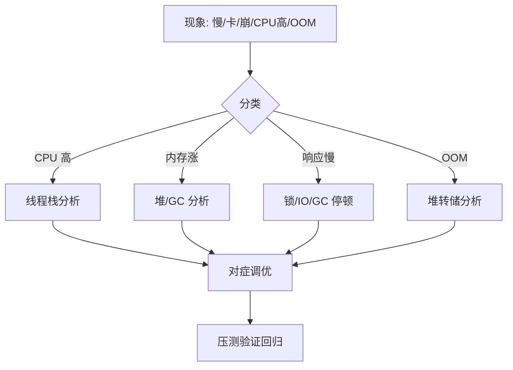

# JVM 调优实战：从参数到线上问题定位

> 调优不是「背参数」，而是「定位瓶颈 → 对症下药」。本篇讲 JVM 调优的**完整方法论**：先看现象、再定位（CPU/内存/GC/锁）、最后才调参数；含工具链（jps/jmap/jstat/jstack/Arthas）、GC 选型、典型 OOM 案例与生产排障 SOP。与「[Java 虚拟机](../基础知识/Java虚拟机.md)」「[并发编程](../基础知识/并发编程.md)」「[Linux 性能排查手册](../基础知识/Linux排查.md)」互链。

---

## 一、调优方法论：先定位，后调参



> **口诀：先现象，再分类，定位了才动参数；一次只改一个变量，压测验证再上生产。**

### 排障 SOP（生产问题标准动作）

| 步骤 | 动作 | 工具 |
|------|------|------|
| 1 | 看进程与整体负载 | `top`、`jps -l` |
| 2 | 看 GC 状态 | `jstat -gcutil <pid> 1000` |
| 3 | 看线程状态（CPU 高时） | `top -Hp <pid>` → `jstack` |
| 4 | 看堆内存分布 | `jmap -heap`、`jcmd GC.heap_info` |
| 5 | 必要时候抓堆转储 | `jmap -dump:live,format=b,file=heap.hprof <pid>` |
| 6 | 分析 | MAT / jhat / Arthas |
| 7 | 改参数/代码 → 压测 → 回归 | JMH / 压测平台 |

---

## 二、关键参数速查（先懂含义再调）

| 参数 | 含义 | 典型值/建议 |
|------|------|-------------|
| `-Xms` / `-Xmx` | 初始/最大堆 | 相等（避免动态扩缩），≤ 物理内存 50%~75% |
| `-Xmn` | 新生代大小 | 堆的 1/3~1/2；对象朝生夕死场景可更大 |
| `-XX:MaxMetaspaceSize` | 元空间上限 | 视类加载量，几百 MB~1GB |
| `-XX:+UseG1GC` | G1 垃圾回收器 | 默认（JDK9+），大堆优先 |
| `-XX:MaxGCPauseMillis` | 目标停顿（G1） | 100~200ms，勿设过低导致频繁 GC |
| `-XX:ParallelGCThreads` | GC 线程数 | 默认=CPU 数 |
| `-Xss` | 线程栈大小 | 512k~1m；线程数多时别太大 |
| `-XX:HeapDumpOnOutOfMemoryError` | OOM 自动转储 | **生产必开** |
| `-XX:+PrintGCDetails` / `-Xlog:gc*` | GC 日志 | 生产必开，配合归档 |
| `-XX:SurvivorRatio` | Eden/Survivor 比 | 默认 8 |
| `-XX:+UseZGC` / `Shenandoah` | 低延迟 GC | 超大堆/低停顿需求（JDK17+） |

> **经验值不是铁律**：堆大不一定好（GC 停顿变长）、调小不一定省（GC 频繁）。所有参数围绕「对象存活情况 + 停顿预算」决定。

---

## 三、GC 选型决策

| 收集器 | 特点 | 适用 |
|--------|------|------|
| **G1**（默认） | 分区式、可设目标停顿、吞吐与延迟均衡 | 绝大多数生产服务 |
| **CMS**（已废弃） | 低停顿标记清除 | 老系统（JDK8 时代遗留） |
| **Parallel** | 吞吐优先、STW 长 | 离线批处理/无交互 |
| **ZGC / Shenandoah** | 亚毫秒级停顿、可上 TB 堆 | 大堆 + 低延迟（支付/高频交易） |
| **Serial** | 单线程、简单 | 小客户端应用 |

**调优决策树**：

```
堆 < 4G 且简单服务 → 默认参数即可
堆 4G~64G、交互式服务 → G1，调 MaxGCPauseMillis + 观察
堆 > 64G 或停顿敏感 → ZGC/Shenandoah（JDK17+）
离线批处理 → Parallel（吞吐优先）
```

---

## 四、三大典型问题实战

### 4.1 CPU 飙高 → 线程栈分析

```bash
top -Hp <pid>                 # 找到 CPU 最高的线程号（十六进制）
printf '%x\n' <tid>           # 转十六进制
jstack <pid> | grep -A50 '0x<hex>'   # 看该线程栈
```

**常见结论**：死循环/空转（业务 bug）、GC 线程繁忙（内存问题）、锁竞争（`BLOCKED`）、正则回溯/序列化热点。

### 4.2 频繁 Full GC / 内存涨 → GC 日志与堆分析

```bash
jstat -gcutil <pid> 1000      # 观察 Full GC 频率与耗时
```

**分析顺序**：
1. 老年代涨速快 → 大对象直接进老年代？对象过早晋升？
2. Full GC 后内存不回收 → 内存泄漏（集合持有、ThreadLocal、静态缓存、连接未释放）；
3. 堆外内存涨 → 直接内存/NIO 泄漏、本地线程栈。

> 排查泄漏：`jmap -dump` 两次对比，或 Arthas `dashboard`/`memory` 命令观察；MAT 找「支配树大对象 + GC Roots 路径」。

### 4.3 OOM（生产必开转储）

```
-XX:+HeapDumpOnOutOfMemoryError -XX:HeapDumpPath=/data/logs/
```

| OOM 类型 | 根因方向 | 处置 |
|----------|----------|------|
| `Java heap space` | 堆内泄漏/超大对象 | 堆转储分析，修泄漏或加堆 |
| `GC overhead limit exceeded` | 98% 时间在 GC | 先查泄漏，不是加堆 |
| `Metaspace` | 类加载过多 | 查动态代理/反射类生成，加 MaxMetaspaceSize |
| `Direct buffer memory` | 直接内存 | 查 NIO 未释放/ByteBuffer 池 |
| `unable to create native thread` | 线程数超限 | 查线程泄漏、`ulimit`、`-Xss` |

> **加堆是最后的选项**：大多数「OOM」是「泄漏」，先转储分析再决定，加堆只是续命。

---

## 五、Arthas：线上诊断瑞士军刀

| 命令 | 作用 | 典型场景 |
|------|------|----------|
| `dashboard` | 线程/内存/GC 实时大盘 | 第一眼定位 |
| `thread -n 3` | CPU 最高线程栈 | CPU 飙高秒定位 |
| `heapdump` | 快速堆转储 | OOM 现场 |
| `trace` / `watch` | 方法耗时/入参出参 | 慢接口定位、参数现场 |
| `jvm` | JVM 参数与版本总览 | 确认生效参数 |
| `ognl` | 表达式查看/修改 | 线上调试静态状态 |
| `sc` / `sm` | 类/方法查找 | 确认加载类 |

> Arthas 的价值：**不需要重启、不需要改代码**，生产环境直接在线诊断。

---

## 六、调优红线与反模式

| 反模式 | 后果 |
|--------|------|
| 不看现象直接堆参数 | 越调越乱，无法验证 |
| `-Xmx` 调到物理内存 80%+ | OS 页交换/直接内存没空间 |
| 无压测直接改线上 | 参数事故 |
| 一次改一堆参数 | 无法归因 |
| 忽略 GC 日志与转储 | 出问题无现场 |
| 堆内缓存无限增长 | 隐性泄漏 |
| 为省事关闭 System.gc 不考虑调用方 | RMI/NIO 场景踩坑 |

**健康指标基线**（参考值，按业务微调）：
- Young GC：秒级间隔、单次 < 50ms；
- Full GC：极少发生（核心服务目标 < 1 次/小时）；
- GC 时间占比 < 5%（吞吐损失）；G1 目标停顿达成率 > 95%。

---

## 七、与其他板块的关联

- **JVM 原理**：参数背后的机制见 [Java 虚拟机](../基础知识/Java虚拟机.md)（内存模型/GC 算法/类加载）。
- **并发问题**：锁竞争导致的卡顿见 [并发编程](../基础知识/并发编程.md)。
- **OS 层面**：CPU/内存/IO 先看 [Linux 性能排查手册](../基础知识/Linux排查.md)。
- **压测验证**：调优效果用压测平台回归，参考 [测试与代码质量](../测试与代码质量/测试与代码质量总览.md)。

---

## 八、面试高频追问（12+ 条）

1. Q：调优第一步做什么？ A：定位瓶颈——看 CPU/内存/GC/锁，不定位不调参。
2. Q：G1 和 CMS 区别？ A：G1 分区化+可设目标停顿+整体吞吐好；CMS 标记清除、碎片化、已废弃。
3. Q：为什么生产必须开 HeapDumpOnOutOfMemoryError？ A：OOM 现场最珍贵，没转储只能靠猜。
4. Q：频繁 Full GC 怎么排查？ A：jstat 看频次→堆转储找大对象/泄漏→GC Roots 路径分析。
5. Q：老年代涨得快说明什么？ A：大对象多或晋升过快（Survivor 不足/动态晋升阈值），或内存泄漏。
6. Q：CPU 100% 怎么定位到代码？ A：top -Hp 找线程 → 转十六进制 → jstack 看栈 → 定位业务代码。
7. Q：Metaspace OOM 常见原因？ A：动态生成类（反射/代理/热部署）没卸载，类加载器泄漏。
8. Q：直接内存 OOM 怎么来的？ A：NIO ByteBuffer 未释放、堆外缓存、Netty 池泄露。
9. Q：堆越大越好吗？ A：不是，堆大 GC 停顿变长；要按对象存活量与停顿预算设计。
10. Q：ZGC 适合什么？ A：超大堆 + 亚毫秒停顿要求（如支付/高频交易），JDK17+ 才成熟。
11. Q：Arthas 和 jmap/jstack 区别？ A：Arthas 在线诊断不重启，jmap/jstack 是 JDK 原生命令。
12. Q：如何判断是泄漏还是配置不当？ A：连续转储对比内存是否持续增长；GC 后内存是否回落。
13. Q：G1 MaxGCPauseMillis 设太小会怎样？ A：GC 频繁（每次没做完又触发），吞吐反而下降。
14. Q：线程栈 BLOCKED 大面是什么？ A：锁竞争严重，查锁粒度/同步块范围/锁顺序。
