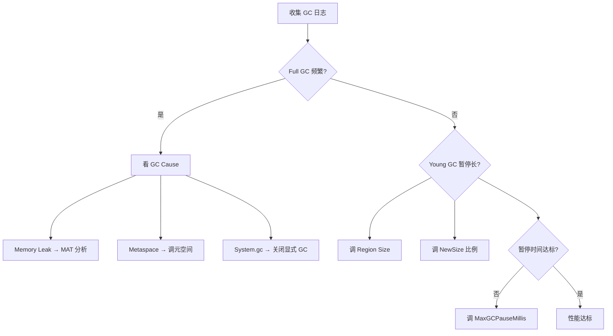

# JVM 调优实战（G1/ZGC/Shenandoah / JFR / Arthas 深入 / OOM 全场景）

> 调优不是「背参数」，而是「定位瓶颈 → 对症下药」。本篇从「概览」升级为「深入实战」：G1/ZGC/Shenandoah 调优案例、JFR/JMC 分析、Arthas 高级命令、OOM 全场景排查、生产排障 SOP。与「[Java 虚拟机](../基础知识/Java虚拟机.md)」「[并发编程](../基础知识/并发编程.md)」「[Linux 性能排查手册](../基础知识/Linux排查.md)」互链。

---

## 一、调优方法论

```
现象（慢/卡/崩/CPU高/OOM）→ 分类 → 定位 → 调参 → 压测验证

口诀：先现象，再分类，定位了才动参数；一次只改一个变量，压测验证再上生产。
```

### 排障 SOP

| 步骤 | 动作 | 工具 |
|------|------|------|
| 1 | 看进程与整体负载 | `top`、`jps -l` |
| 2 | 看 GC 状态 | `jstat -gcutil <pid> 1000` |
| 3 | 看线程状态（CPU 高时） | `top -Hp <pid>` → `jstack` |
| 4 | 看堆内存分布 | `jmap -heap`、`jcmd GC.heap_info` |
| 5 | 必要时候抓堆转储 | `jmap -dump:live,format=b,file=heap.hprof <pid>` |
| 6 | 分析 | MAT / Arthas / JFR |
| 7 | 改参数/代码 → 压测 → 回归 | JMH / 压测平台 |

---

## 二、关键参数速查

| 参数 | 含义 | 典型值/建议 |
|------|------|-------------|
| `-Xms` / `-Xmx` | 初始/最大堆 | 相等（避免动态扩缩），≤ 物理内存 50%~75% |
| `-Xmn` | 新生代大小 | 堆的 1/3~1/2 |
| `-XX:MaxMetaspaceSize` | 元空间上限 | 视类加载量，几百 MB~1GB |
| `-XX:+UseG1GC` | G1 垃圾回收器 | 默认（JDK9+），大堆优先 |
| `-XX:MaxGCPauseMillis` | 目标停顿（G1） | 100~200ms，勿设过低 |
| `-XX:ParallelGCThreads` | GC 线程数 | 默认=CPU 数 |
| `-Xss` | 线程栈大小 | 512k~1m |
| `-XX:HeapDumpOnOutOfMemoryError` | OOM 自动转储 | **生产必开** |
| `-Xlog:gc*` | GC 日志 | 生产必开 |
| `-XX:SurvivorRatio` | Eden/Survivor 比 | 默认 8 |
| `-XX:InitiatingHeapOccupancyPercent` | G1 触发并发标记的堆占用比 | 默认 45% |

---

## 三、GC 选型与调优

### 3.1 G1 调优

```
G1 = 分区式（Region）+ 可设目标停顿 + 吞吐与延迟均衡

核心参数：
  -XX:+UseG1GC
  -XX:MaxGCPauseMillis=200      # 目标停顿时间
  -XX:G1HeapRegionSize=8m       # Region 大小（1~32MB）
  -XX:InitiatingHeapOccupancyPercent=45  # 堆占用 45% 时触发并发标记
  -XX:G1ReservePercent=10       # 保留内存（防 to-space exhausted）
  -XX:G1NewSizePercent=5        # 新生代最小比例
  -XX:G1MaxNewSizePercent=60    # 新生代最大比例

调优要点：
  1. MaxGCPauseMillis 设太小 → GC 频繁（每次没做完又触发）→ 吞吐下降
  2. MaxGCPauseMillis 设太大 → 停顿变长
  3. IHOP 设太低 → 并发标记频繁 → CPU 开销高
  4. IHOP 设太高 → 老年代涨满触发 Full GC
  5. Region 大小影响：大对象多 → 增大 Region → 减少 Humongous 分配
```

### 3.2 ZGC 调优

```
ZGC = 亚毫秒级停顿 + 支持 TB 级堆 + 可在堆占用 99% 时运行

核心参数：
  -XX:+UseZGC
  -XX:+ZGenerational           # 分代 ZGC（JDK21+，推荐）
  -XX:SoftMaxHeapSize=N        # 软限制（ZGC 尽量不超过）
  -XX:ZAllocationSpikeTolerance=2.0  # 分配尖峰容忍度

特点：
  - STW 停顿 < 1ms（与堆大小无关）
  - 并发标记 + 并发 relocation
  - 支持 NUMA 感知
  - 适合：大堆（>64GB）+ 低延迟（支付/交易）

调优要点：
  1. 不需要调 Region 大小（ZGC 自动管理）
  2. 不需要调 -Xmn（ZGC 自动分代）
  3. 重点调 -XX:SoftMaxHeapSize 控制内存使用
  4. 监控：-Xlog:gc* 查看 GC 日志
```

### 3.3 Shenandoah 调优

```
Shenandoah = Red Hat 主导 + 亚毫秒停顿 + 并发压缩

核心参数：
  -XX:+UseShenandoahGC
  -XX:ShenandoahGCHeuristics=adaptive  # 启发式策略
  -XX:ShenandoahMinFreeThreshold=10    # 最小空闲比例

与 ZGC 对比：
  - ZGC: JDK 官方，分代模型（JDK21+），NUMA 感知
  - Shenandoah: Red Hat 贡献，非分代，更激进的并发策略
  - 生产选择：优先 ZGC（官方支持更好）
```

### 3.4 GC 选型决策树

```
堆 < 4G 且简单服务 → 默认参数即可
堆 4G~64G、交互式服务 → G1，调 MaxGCPauseMillis + 观察
堆 > 64G 或停顿敏感 → ZGC（JDK21+ 分代模式）
离线批处理 → Parallel（吞吐优先）
JDK8 老系统 → G1（CMS 已废弃）
```

---

## 四、JFR/JMC 分析

### 4.1 JFR（Java Flight Recorder）

```bash
# 启动时开启 JFR
java -XX:StartFlightRecording=duration=60s,filename=recording.jfr -jar app.jar

# 运行时开启
jcmd <pid> JFR.start duration=60s filename=recording.jfr

# 持续录制（手动停止）
jcmd <pid> JFR.start settings=profile filename=continuous.jfr
jcmd <pid> JFR.stop

# 用 JMC 分析
# 下载 JDK Mission Control（JMC）
# 打开 .jfr 文件 → 事件浏览器 → 线程/内存/GC/IO/锁 全维度分析
```

### 4.2 JFR 事件类型

| 事件 | 说明 |
|------|------|
| GC Heap Statistics | 堆内存变化 |
| GC Pause | GC 停顿详情 |
| Thread Start/End | 线程生命周期 |
| Java Method Execution | 方法执行耗时 |
| JVM Information | JVM 版本/参数 |
| CPU Load | CPU 使用率 |
| Network IO | 网络读写 |
| File IO | 文件读写 |
| Exception Statistics | 异常统计 |

---

## 五、Arthas 高级命令

### 5.1 常用命令

| 命令 | 作用 | 典型场景 |
|------|------|----------|
| `dashboard` | 线程/内存/GC 实时大盘 | 第一眼定位 |
| `thread -n 3` | CPU 最高线程栈 | CPU 飙高秒定位 |
| `thread -b` | 查看阻塞线程 | 锁竞争定位 |
| `thread --state BLOCKED` | 所有 BLOCKED 线程 | 死锁/锁竞争 |
| `heapdump` | 快速堆转储 | OOM 现场 |
| `trace com.example.Svc method` | 方法耗时链路 | 慢接口定位 |
| `watch com.example.Svc method returnObj` | 观察返回值 | 参数/返回值调试 |
| `watch com.example.Svc method '{params, throwExp}'` | 观察入参和异常 | 异常排查 |
| `stack com.example.Svc method` | 调用栈 | 方法被谁调用 |
| `jvm` | JVM 参数与版本总览 | 确认生效参数 |
| `ognl '@com.example.Config@getInstance().getValue()'` | 表达式查看/修改 | 线上调试静态状态 |
| `sc -d com.example.*` | 类加载信息 | 确认类是否加载 |
| `sm com.example.Svc -l` | 方法列表 | 确认方法签名 |
| `logger` | 查看日志级别 | 动态调日志 |
| `redefine` | 热更新 class | 线上修复（谨慎） |
| `reset` | 重置所有增强 | 恢复原始状态 |

### 5.2 Arthas 实战案例

```bash
# 案例一：慢接口定位
trace com.example.OrderService createOrder -n 5 --skipJDKMethod false
# 输出每个子调用的耗时，找到最慢的一跳

# 案例二：异常排查
watch com.example.UserService getUser '{params, throwExp}' -e -x 2
# 触发异常后查看入参和异常信息

# 案例三：线程死锁
thread -b
# 找到阻塞线程和持有的锁

# 案例四：动态修改日志级别
ognl '@org.slf4j.LoggerFactory@getLogger("com.example")' -x 2
logger --name com.example --level DEBUG
```

---

## 六、OOM 全场景排查

### 6.1 Java heap space

```
原因：堆内存不足（泄漏或配置不当）

排查：
  1. jstat -gcutil 看老年代涨速
  2. jmap -dump 抓堆转储
  3. MAT 分析：Dominator Tree 找大对象
  4. GC Roots 路径分析：找到持有大对象的引用链

常见泄漏：
  - 静态集合（static Map/List 无限增长）
  - ThreadLocal 未 remove
  - 连接/流未关闭
  - 缓存无过期策略
  - 大对象直接进老年代（大查询/大文件）
```

### 6.2 Metaspace OOM

```
原因：类加载过多（动态代理/反射类生成）

排查：
  1. jcmd <pid> VM.classloader_stats 查看类加载统计
  2. 搜索可疑的类生成代码（CGLIB/ByteBuddy/Javassist）
  3. 检查热部署框架是否正确卸载类

解决：
  - 增大 -XX:MaxMetaspaceSize（治标）
  - 修复类加载器泄漏（治本）
  - 检查反射生成类的缓存
```

### 6.3 Direct buffer memory

```
原因：NIO 直接内存未释放（Netty/自定义 NIO）

排查：
  1. jcmd <pid> VM.native_memory 查看堆外内存
  2. 检查 Netty ByteBuf 是否 release
  3. 检查 DirectByteBuffer 是否手动调用 clean()

解决：
  - 设置 -XX:MaxDirectMemorySize 限制
  - 修复 NIO 内存泄漏
  - 使用 Netty 的 PooledByteBufAllocator
```

### 6.4 unable to create native thread

```
原因：线程数超限

排查：
  1. cat /proc/<pid>/status | grep Threads 查看线程数
  2. ulimit -u 查看用户线程限制
  3. jstack <pid> | grep "nid=" | wc -l 统计 Java 线程数

解决：
  - 增大 ulimit -u
  - 减小 -Xss（减少每线程栈大小）
  - 修复线程泄漏（线程池未 shutdown）
  - 使用虚拟线程（Java 21+）
```

### 6.5 GC overhead limit exceeded

```
原因：98% 时间在 GC，但回收不到 2% 内存

排查：
  1. 先看是否是泄漏（堆转储分析）
  2. 检查是否有大量小对象频繁创建（临时对象过多）
  3. 检查 Survivor 空间是否足够（对象过早晋升）

解决：
  - 优先修复泄漏
  - 调整 SurvivorRatio/MaxTenuringThreshold
  - 不是加堆，加堆只是续命
```

---

## 七、虚拟线程（Java 21+）

```java
// 虚拟线程 = 轻量级线程（类似 goroutine）
// 创建成本极低（~几百字节），可以创建百万级

// 创建虚拟线程
Thread.startVirtualThread(() -> {
    // 业务逻辑
});

// 虚拟线程池
try (var executor = Executors.newVirtualThreadPerTaskExecutor()) {
    IntStream.range(0, 100_000).forEach(i -> {
        executor.submit(() -> {
            Thread.sleep(Duration.ofSeconds(1));
            return i;
        });
    });
}

// Structured Concurrency（结构化并发，预览特性）
try (var scope = new StructuredTaskScope.ShutdownOnFailure()) {
    Future<String> user = scope.fork(() -> fetchUser());
    Future<Order> order = scope.fork(() -> fetchOrder());
    scope.join();
    return new Response(user.get(), order.get());
}
```

---

## 八、调优红线与反模式

| 反模式 | 后果 |
|--------|------|
| 不看现象直接堆参数 | 越调越乱，无法验证 |
| `-Xmx` 调到物理内存 80%+ | OS 页交换/直接内存没空间 |
| 无压测直接改线上 | 参数事故 |
| 一次改一堆参数 | 无法归因 |
| 忽略 GC 日志与转储 | 出问题无现场 |
| 堆内缓存无限增长 | 隐性泄漏 |
| 为省事关闭 System.gc | RMI/NIO 场景踩坑 |

**健康指标基线**：
- Young GC：秒级间隔、单次 < 50ms
- Full GC：极少发生（核心服务目标 < 1 次/小时）
- GC 时间占比 < 5%
- G1 目标停顿达成率 > 95%

---

## 九、面试高频追问

1. Q：调优第一步做什么？ A：定位瓶颈——看 CPU/内存/GC/锁，不定位不调参。
2. Q：G1 和 ZGC 区别？ A：G1 分区+可设目标停顿+均衡；ZGC 亚毫秒停顿+TB级堆+更贵。
3. Q：为什么生产必须开 HeapDumpOnOutOfMemoryError？ A：OOM 现场最珍贵，没转储只能靠猜。
4. Q：频繁 Full GC 怎么排查？ A：jstat 看频次→堆转储找大对象/泄漏→GC Roots 路径分析。
5. Q：ZGC 适合什么？ A：超大堆（>64GB）+ 亚毫秒停顿（支付/交易），JDK17+。
6. Q：Arthas 和 jmap/jstack 区别？ A：Arthas 在线诊断不重启，jmap/jstack 是 JDK 原生命令。
7. Q：G1 MaxGCPauseMillis 设太小会怎样？ A：GC 频繁，吞吐反而下降。
8. Q：虚拟线程和平台线程区别？ A：虚拟线程轻量（~KB），可创建百万；平台线程重（~MB），受 OS 限制。

---

## 十、GC 日志分析方法论

### 10.1 GC 日志格式（JDK11+ 统一日志）

```bash
# 启用 GC 日志
-Xlog:gc*:file=gc.log:time,uptime,level,tags:filecount=10,filesize=50m

# 分析 GC 日志
# 使用 GCViewer 或 GCEasy 可视化
# 关键指标：GC 频率、暂停时间、回收效率、晋升速率
```

**GC 日志关键字段解读**：

| 字段 | 含义 | 关注点 |
|------|------|--------|
| GC Cause | 触发原因 | Allocation Failure/ Metadata GC Threshold/ System.gc() |
| Pause Time | STW 暂停时间 | Young GC < 50ms, Full GC < 200ms |
| GC Strategy | GC 策略 | G1 Evacuation Pause, G1 Concurrent Mark |
| Heap Before/After | GC 前后堆大小 | 回收量、是否接近上限 |
| Promotion | 晋升到老年代的量 | 过快说明 Survivor 太小 |
| Humongous | 大对象分配 | G1 中大对象直接进老年代 |

### 10.2 GC 日志分析步骤



## 十一、JVM 内存布局深度

### 11.1 对象内存布局（HotSpot）

```text
对象头（Object Header）：
┌───────────────────────────────────────┐
│  Mark Word (64 bits, 64位 JVM)        │
│  ┌─────────────────────────────────┐  │
│  │ 无锁: hashcode(31) | age(4) | 1│  │
│  │ 偏向: threadId(54)| epoch(2)| 1 │  │
│  │ 轻量: ptr_to_lock(62)      | 00│  │
│  │ 重量: ptr_to_monitor(62)   | 10│  │
│  └─────────────────────────────────┘  │
│  Klass Pointer (32 bits, 指向类元数据)  │
│  数组长度 (32 bits, 仅数组)            │
├───────────────────────────────────────┤
│  实例数据（Instance Data）             │
│  对齐填充（Padding, 8 字节对齐）       │
└───────────────────────────────────────┘

对象大小：
- 对象头: 12 bytes (Mark Word 8 + Klass 4)
- 实例数据: 按字段类型
- 对齐: 总大小必须是 8 的倍数
```

### 11.2 TLAB（Thread Local Allocation Buffer）

```text
TLAB = 每个线程独享的 Eden 区小块，无锁分配

工作流程：
1. 线程首次分配对象 → 从 Eden 区申请一块 TLAB（默认 Eden 的 1%）
2. 在 TLAB 内分配 → CAS 无需加锁，极快
3. TLAB 用完 → 申请新 TLAB 或直接 Eden 分配（CAS）
4. 对象进入 Survivor → 线程切换 TLAB

相关参数：
- -XX:+UseTLAB（默认开启）
- -XX:TLABSize=<bytes>（初始大小）
- -XX:MinTLABSize=2KB（最小值）
- -XX:TLABRefillWasteFraction=64（ refill 浪费比例）
```

## 十二、JIT 编译层级（C1/C2/Graal）

```text
JIT 编译层级：
解释器 → C1 (Client Compiler) → C2 (Server Compiler) → Graal JIT

┌──────────┬──────────────────────┬───────────────────────┐
│ 层级      │ 特点                  │ 优化级别              │
├──────────┼──────────────────────┼───────────────────────┤
│ 解释执行  │ 逐行解释，启动快       │ 无优化                │
│ C1       │ 编译为本地代码         │ 方法内联、逃逸分析      │
│ C2       │ 深度优化编译           │ 循环展开、向量化        │
│ Graal    │ Java 编写的 JIT       │ 部分场景超越 C2        │
└──────────┴──────────────────────┴───────────────────────┘

编译触发：
- C1: 方法调用次数 > 1500 (Client 模式)
- C2: 方法调用次数 > 10000 (Server 模式)
- -XX:+TieredCompilation（分层编译，默认开启）
```

## 十三、JVM Crash 分析

```text
JVM Crash 常见类型：
1. SIGSEGV (Segmentation Fault)
   - 原因：JVM Bug、JNI 代码越界、内存损坏
   - 文件：hs_err_pid<>.log
   - 关键信息：siginfo、registers、stack、memory map

2. OutOfMemoryError
   - Java heap space: 堆不足
   - Metaspace: 类加载过多
   - Direct buffer memory: NIO 堆外内存

3. StackOverflowError
   - 线程栈溢出：递归过深或栈帧过大

hs_err_pid<>.log 关键部分：
- # A fatal error has been detected by the Java Runtime
- siginfo: signal 11 (SIGSEGV)  → 信号类型
- Registers: → CPU 寄存器状态
- Stack: [0x...,0x...], sp=0x..., free space=...  → 栈空间
- Java Threads: → 所有 Java 线程状态
- Lockown: → 锁信息
```

```bash
# 分析 JVM Crash
# 1. 查看 hs_err_pid<>.log 文件
# 2. 关注 signal、fault addr、registers
# 3. 检查 JVM 版本已知 Bug
# 4. 检查是否有 JNI 代码问题
# 5. 升级 JVM 到最新补丁版本
```

## 十四、JVM 容器环境调优（MaxRAMPercentage）

```text
JVM 在容器中的内存配置：
传统方式：-Xmx 512m（固定值，容器 limit 变化时不自适应）
推荐方式：-XX:MaxRAMPercentage=75.0（按容器 limit 动态计算）

为什么用百分比：
- 容器 limit 可能变化（HPA 扩缩容）
- 固定 -Xmx 会导致 OOM 或内存浪费
- MaxRAMPercentage 自动适配容器内存 limit

JVM 可用内存检测：
- 容器 cgroup v1: /sys/fs/cgroup/memory/memory.limit_in_bytes
- 容器 cgroup v2: /sys/fs/cgroup/memory.max
- JDK 10+ 自动检测容器内存 limit
- JDK 8u131+ 需要 -XX:+UnlockExperimentalVMOptions -XX:+UseCGroupMemoryLimitForHeap
```

```bash
# 容器环境推荐 JVM 参数
java \
  -XX:MaxRAMPercentage=75.0 \
  -XX:InitialRAMPercentage=50.0 \
  -XX:+UseContainerSupport \
  -XX:+UseG1GC \
  -Xlog:gc*:file=/var/log/gc.log \
  -jar app.jar

# 常见错误配置
-XX:MaxRAMPercentage=90.0  # 太高，OS/page cache 没空间
-XX:MaxRAMPercentage=50.0  # 太低，内存浪费
```

## 十五、ZGC/Shenandoah 高级调优

### 15.1 ZGC 高级参数

```bash
# ZGC 调优参数
-XX:+UseZGC
-XX:+ZGenerational           # 分代 ZGC（JDK21+）
-XX:SoftMaxHeapSize=N        # 软限制，ZGC 尽量不超过
-XX:ZAllocationSpikeTolerance=2.0  # 分配尖峰容忍度（默认2.0）
-XX:ZCollectionInterval=5    # 主动 GC 间隔（秒）
-XX:ConcGCThreads=N          # 并发 GC 线程数

# NUMA 感知（多路 CPU）
-XX:+UseNUMA
```

### 15.2 Shenandoah 高级参数

```bash
# Shenandoah 调优
-XX:+UseShenandoahGC
-XX:ShenandoahGCHeuristics=adaptive  # 启发式策略
-XX:ShenandoahMinFreeThreshold=10    # 最小空闲比例触发 GC
-XX:ShenandoahGuaranteedGCInterval=300000  # 保证 GC 间隔（ms）
-XX:ShenandoahUncommitDelay=3000     # 内存归还延迟（ms）
```

## 十六、JVM Profiling 工具（async-profiler/JFR）

### 16.1 async-profiler

```bash
# CPU profiling
./profiler.sh -d 30 -f cpu_profile.html <pid>

# 内存分配 profiling
./profiler.sh -d 30 -e alloc -f alloc_profile.html <pid>

# Wall-clock profiling
./profiler.sh -d 30 -e wall -f wall_profile.html <pid>

# 火焰图分析
# - 纵轴：调用栈深度
# - 横轴：采样比例（越宽 = CPU 时间越多）
# - 找"宽"的帧 = 性能瓶颈
```

### 16.2 JFR（Java Flight Recorder）

```bash
# 持续录制（生产低开销）
jcmd <pid> JFR.start settings=profile duration=0 filename=recording.jfr

# 事件过滤
jcmd <pid> JFR.start settings=profile filename=recording.jfr \
  jdk.GC* \
  jdk.JavaMonitorWait \
  jdk.LockContended

# 查看 JFR 事件
jfr summary recording.jfr
jfr print --events jdk.GCHeapSummary recording.jfr
```

**JFR 常用事件**：

| 事件类别 | 事件 | 用途 |
|----------|------|------|
| GC | G1HeapSummary | 堆内存变化 |
| GC | G1CollectionPause | GC 暂停详情 |
| JVM | JVMInformation | JVM 版本/参数 |
| Thread | ThreadStart/End | 线程生命周期 |
| Method | MethodExecution | 方法执行耗时 |
| IO | FileRead/Write | 文件 IO |
| Socket | SocketRead/Write | 网络 IO |
| Exception | JavaExceptionThrow | 异常统计 |
| JFR | FlightRecorder | JFR 自身状态 |

## 十七、与其他板块的关联

- JVM 原理见「[Java 虚拟机](../基础知识/Java虚拟机.md)」；
- 并发问题见「[并发编程](../基础知识/并发编程.md)」；
- OS 层面见「[Linux 性能排查手册](../基础知识/Linux排查.md)」；
- 压测验证见「[测试与代码质量](../测试与代码质量/测试与代码质量总览.md)」。

> 一句话：**JVM 调优 = 先定位后调参——G1 通用（调 IHOP + MaxGCPauseMillis），ZGC 低延迟（调 SoftMaxHeapSize），OOM 必开 HeapDump——Arthas 是线上诊断瑞士军刀，trace/watch/thread -b 三板斧**。
