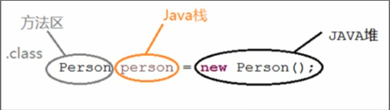
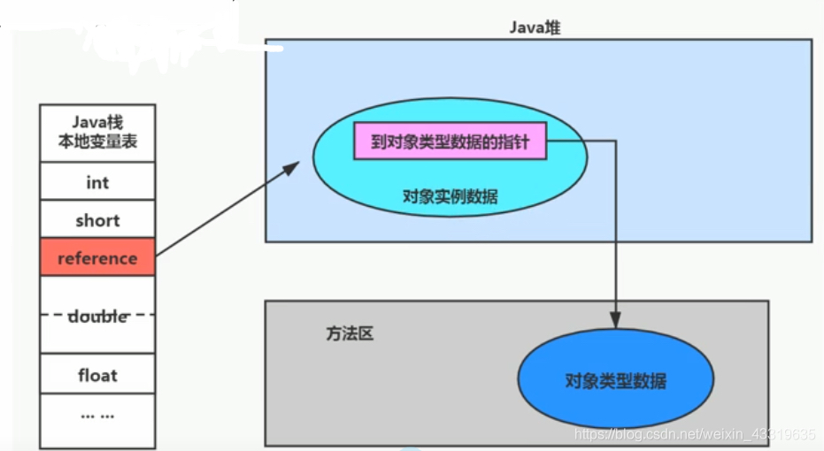
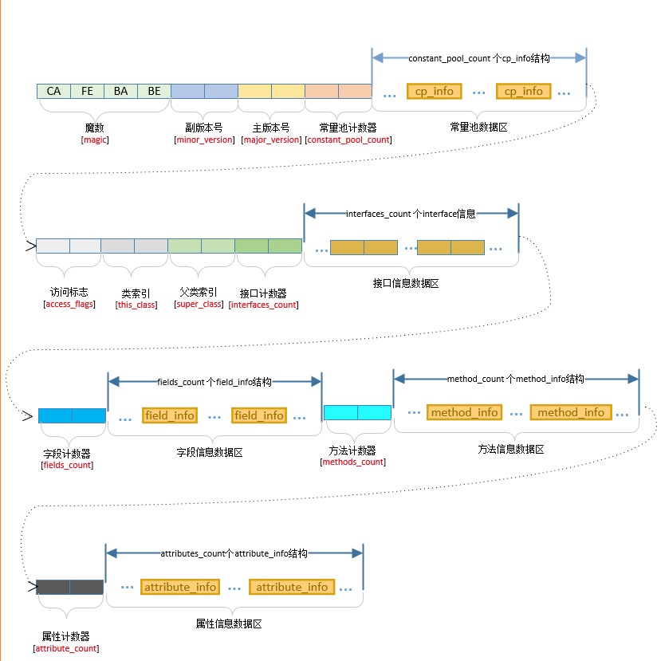
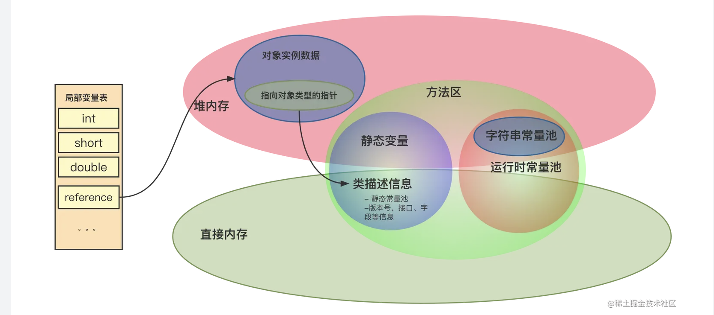
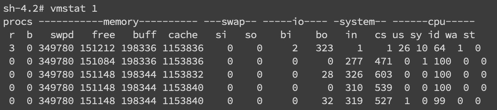
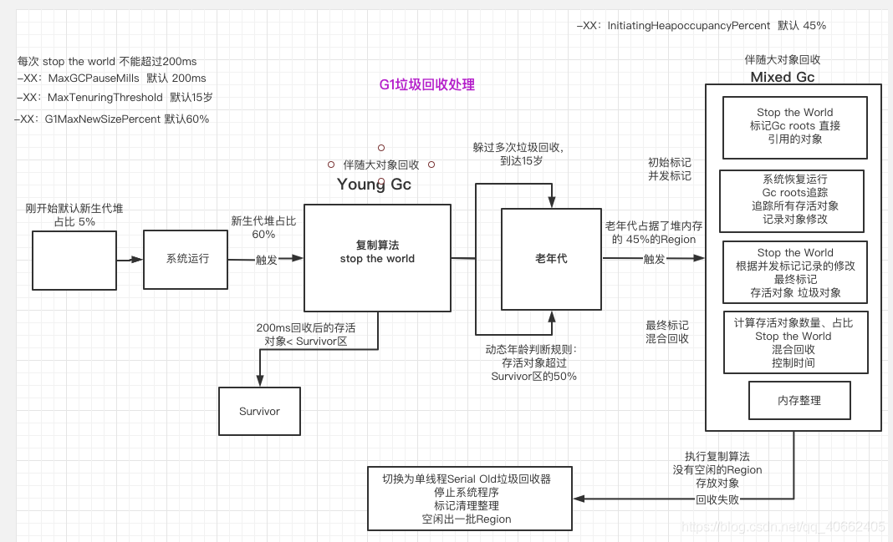
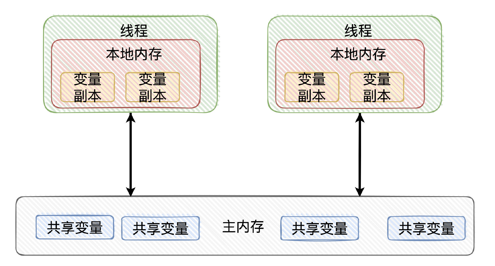
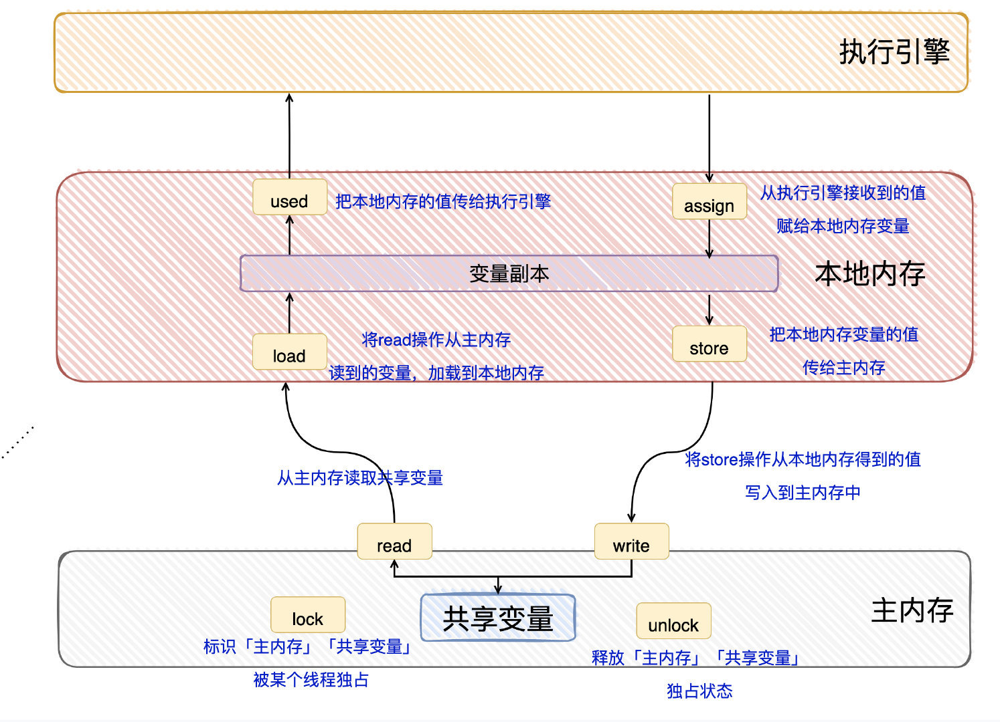
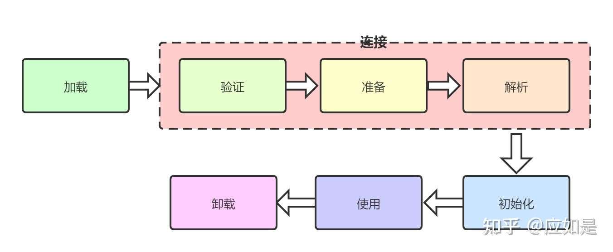
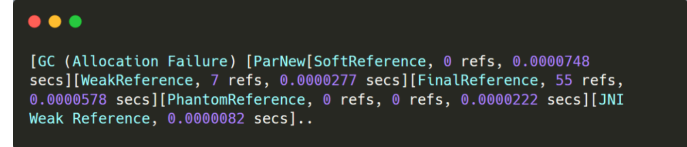

**详解方法区**

栈堆方法区的交互关系

它用于存储已被虚拟机加载的类型信息，常量，[静态变量](https://so.csdn.net/so/search?q=%E9%9D%99%E6%80%81%E5%8F%98%E9%87%8F&spm=1001.2101.3001.7020)，及时编译器编译后的代码缓存等。

**1、类型信息**

对每个加载的类型（类class、接口、枚举、注解），jvm必须在方法区存储以下类型信息

（1）类型的完整有效名称（全名=包名.类名）

（2）类型直接父类的完整有效名（接口和java.lang.Object，没有父类）

（3）类型的修饰符（public，abstract，final的某个子集）

（4）类型直接接口的一个有序列表

**2、域（Field）信息**

（1）保存类型的所有域的相关信息以及域的声明顺序

（2）域的相关信息：域名称，域类型，域修饰符（public，private，protected，static，final，volatile，transient）

**3、方法（Method）信息**

jvm保存所有方法的以下信息，同域信息一样的包括声明顺序

（1）方法名称

（2）方法返回参数（或者void）

（3）方法参数的数量和类型（按顺序）

（4）方法的修饰符（public，private，protected，static，final，synchronized，native，abstract）

（5）方法的字节码，操作数栈、局部变量表及大小（abstract和native除外）

（6）异常表（abstract和native除外），每个异常处理的开始位置，结束位置，代码处理在程序计数器中的偏移地址、被捕获的异常类的常量池索引。

**4、常量池**

一个有效的字节码文件除了包含类的版本信息，字段，方法以及接口等描述信息外，还包含一项信息那就是常量池，包含各种字面量（数量值，字符串值）和对类型（类），域和方法的符号引用。

常量池，可以看作是一个表，虚拟机指令根据这张常量表找到要执行的类名，方法名，参数类型，字面量等类型

（1）方法区，内部包含了运行时常量池

（2）字节码文件，内部包含了常量池

**常量池的作用**

一个java源文件的类，接口，编译后产生一个字节码文件。而java中字节码需要数据支持，通常这种数据会很大以至于不能直接存储在字节码里，换一种方式，可以存储到常量池里。

**运行时常量池**

（1）运行时常量池是方法区的一部分，常量池表是class文件的一部分，用于存放编译期生成的各种字面量与符号引用，这部分内容将在类加载存放到方法区的运行时常量池中。

（2）运行时常量池创建时机：在加载类和接口到虚拟机后，就会创建对应的运行时常量池

（3）jvm为每一个已加载的类型（类或者接口）都维护一个常量池，池中的数据项和数组项类似，使用索引访问

（4）运行时常量池中包含多种不同的常量，包括编译期就已经明确的数值字面量，也包括到运行期解析后才能获得的方法或者字段引用。此时不再是常量池中的符号地址了，这里换成真实地址

（5）运行时常量池类似于传统编程语言的符号表，但是它所包含的数据比符号表更加丰富

（6）当创建类或者接口的运行时常量池，如果构造运行时常量池所需的内存空间超过了方法区所能提供的最大值，则jvm会抛出OutOfMemoryError异常。

（7）运行时常量池具备动态性，比如使用String类的intern方法加入运行时常量池中

**方法区的垃圾回收**

方法区的回收效果不好，尤其是对类型的卸载，条件很苛刻，但是回收方法区又是必要的。

**1、方法区的垃圾回收主要回收两部分**

（1）常量池中废弃的常量

（2）不再使用的类型，需要将其卸载

判定一个类型是否能被卸载的条件

1）该类所有的实例都已经被回收，java堆中不存在该类以及任何派生子类的实例

2）加载该类的加载器已经被回收。

3）该类对应的java.lang.Class对象没有任何地方被引用，没有任何地方通过反射访问该类的方法

## **class文件结构**

[https://blog.csdn.net/zhengzhaoyang122/article/details/115742908](https://blog.csdn.net/zhengzhaoyang122/article/details/115742908)

    

ClassFile {

    u4             magic; //Class 文件的标志，魔数

    u2             minor_version;//Class 的小版本号

    u2             major_version;//Class 的大版本号

    u2             constant_pool_count;//常量池的数量

    cp_info        constant_pool[constant_pool_count-1];//常量池

    u2             access_flags;//Class 的访问标记

    u2             this_class;//当前类

    u2             super_class;//父类

    u2             interfaces_count;//接口

    u2             interfaces[interfaces_count];//一个类可以实现多个接口

    u2             fields_count;//Class 文件的字段属性

    field_info     fields[fields_count];//一个类会可以有个字段

    u2             methods_count;//Class 文件的方法数量

    method_info    methods[methods_count];//一个类可以有个多个方法

    u2             attributes_count;//此类的属性表中的属性数

    attribute_info attributes[attributes_count];//属性表集合

}

常量池主要存储了**字面量**以及**符号引用**，其中字面量主要包括字符串，final常量的值或者某个属性的初始值等，而符号引用主要存储类和接口的全限定名称，字段的名称以及描述符，方法的名称以及描述符。

## JVM的组成

VM（Java Virtual Machine）的核心组成包括以下五大模块，其中您提到的运行时数据区、类加载系统（类加载子系统）、执行引擎是核心组件、本地方法接口（JNI）和本地方法库。

**1. 类加载子系统（Class Loader Subsystem）**

负责将.class文件（字节码）加载到JVM中，流程包括加载（获取字节流）、链接（验证、准备、解析）、初始化（执行静态代码块和静态变量赋值）。其核心机制是双亲委派模型（优先委派父类加载器加载，避免核心类篡改），确保类的唯一性和安全性。

**2. 运行时数据区（Runtime Data Areas）**

JVM管理的内存区域，分为线程共享区和线程私有区：

线程共享区：

方法区（Method Area）：存储类元数据（类名、字段、方法）、常量池、静态变量、即时编译器（JIT）编译后的代码。JDK 8+用**元空间（Metaspace）**替代永久代（PermGen），使用本地内存。

堆（Heap）：存储对象实例和数组，是GC（垃圾回收）的主要区域，分为新生代（Eden、S0、S1）和老年代。

线程私有区：

虚拟机栈（JVM Stack）：描述Java方法执行的栈帧（局部变量表、操作数栈、动态链接、方法出口），每个方法对应一个栈帧的入栈/出栈。

程序计数器（Program Counter）：记录当前线程执行的字节码行号，线程私有，用于线程恢复。

本地方法栈（Native Method Stack）：为Native方法（如C/C++实现的方法）提供栈空间，与虚拟机栈功能类似。

**3. 执行引擎（Execution Engine）**

负责将字节码转换为机器码并执行，核心组件包括：

解释器（Interpreter）：逐行解释字节码，启动快但执行效率低。

即时编译器（JIT Compiler）：将高频执行的字节码编译为本地机器码（如热点代码），提高执行效率。

垃圾回收器（Garbage Collector, GC）：属于执行引擎的辅助模块，负责运行时数据区中堆和方法区的内存回收（详见下文）。

**4. 本地方法接口（Native Method Interface, JNI）**

提供Java代码调用本地方法（如操作系统原生API）的能力，是Java与其他语言（C/C++）交互的桥梁。例如，System.out.println()底层通过JNI调用本地方法打印输出。

**5. 本地方法库（Native Libraries）**

存储本地方法的实现（如C/C++编写的动态链接库），是JNI的具体实现载体。JVM通过JNI加载本地方法库，执行Native方法。

## jvm的内存结构

## **局部变量表**

局部变量表（LVT） 是一个索引以0开始的字节数组，存储了一个方法的所有入参和局部变量。LVT所存储的类型都是编译期可知的，包括各基础类型（byte、char、short、int、long、float、double、boolean）、对象引用（reference类型）和returnAddress类型（指向一条字节码指令的地址）。

LVT有如下几个特点：

1. 第0个Slot（槽位）固定存储指向方法所属对象的this指针。

1. 除了long和double占用了连续2个Slot之外，其他类型都只占用了1个Slot。

1. LVT按照变量的声明顺序进行存储。

动态返回地址(return address)

存放该调用方法的pc寄存器的值

一个方法的结束，有两种方式

遇到return，将返回值传递给上层方法调用者，简称正常完成出口（返回指令包括ireturn(返回值为boolean,byte,char,short,int),lreturn,freturn,dreturn,以及areturn，还有return 返回为void、实例初始化方法，类和接口的初始化方法）

异常完成出口，即碰到了异常，并且没有在方法内进行处理，就会退出方法。方法在执行过程总抛出异常时的异常处理，储存在一个异常处理表，方法在发生异常时候找到处理异常的代码

无论通过哪种方式退出，在方法退出后都返回到该方法被调用的位置。方法正常退出时，调用者的pc计数器的值作为返回地址，即调用该方法的指令的下一条指令的地址，而通过异常退出的，返回地址是要通过异常表来确定，栈帧中一般不会保存这部分信息

本质上，方法的退出就是当前栈帧出栈的过程，此时，需要恢复上层方法的数据区等信息，让调用者方法继续执行下去

正常完成出口和异常完成出口的区别在于，通过异常完成出口推出的不会给他的上层调用者产生任何的返回值

** jvm排查**

jstat -gc pid 1000命令来对gc分代变化情况进行观察，1000表示采样间隔(ms)，S0C/S1C、S0U/S1U、EC/EU、OC/OU、MC/MU分别代表两个Survivor区、Eden区、老年代、元数据区的容量和使用量。YGC/YGT、FGC/FGCT、GCT则代表YoungGc、FullGc的耗时和次数以及总耗时。如果看到gc比较频繁，再针对gc方面做进一步分析，具体可以参考一下gc章节的描述。

vmstat 看上下文切换

cs(context switch)

pidstat -w pid

cswch和nvcswch表示自愿及非自愿切换

磁盘问题和cpu一样是属于比较基础的。首先是磁盘空间方面，我们直接使用df -hl来查看文件系统状态

iostatiostat -d -k -x

iotop 查看哪个地方再做磁盘读写

## **TLAB深入理解**

[https://zhuanlan.zhihu.com/p/349173209](https://zhuanlan.zhihu.com/p/349173209)

## **JVM需要判断栈上的数据是什么类型**

[https://mp.weixin.qq.com/s?__biz=MzkxNTE3NjQ3MA==&mid=2247485910&idx=1&sn=54ebca3a2dfe449e7f922f347aa4d2dc&scene=21#wechat_redirect](https://mp.weixin.qq.com/s?__biz=MzkxNTE3NjQ3MA==&mid=2247485910&idx=1&sn=54ebca3a2dfe449e7f922f347aa4d2dc&scene=21#wechat_redirect)

**保守式 GC**

保守式 GC 指的是 JVM 不会记录数据的类型，也就是无法区分内存上的某个位置的数据到底是引用类型还是非引用类型。

半保守式GC，

在对象上会记录类型信息而其他地方还是没有记录，因此从根扫描的话还是一样，得靠猜测。

但是得到堆内对象了之后，就能准确知晓对象所包含的信息了，因此之后 tracing 都是准确的，所以称为半保守式 GC。

现在可以得知半保守式 GC 只有根直接扫描的对象无法移动，从直接对象再追溯出去的对象可以移动，所以半保守式 GC 可以使用移动部分对象的算法，也可以使用标记-清除这种不移动对象的算法。

而保守式 GC 只能使用标记-清除算法。

**准确式 GC**

相信大家看下来已经知道准确意味 JVM 需要清晰的知晓对象的类型，包括在栈上的引用也能得知类型等。

能想到的可以在指针上打标记，来表明类型，或者在外部记录类型信息形成一张映射表。

HotSpot 用的就是映射表，这个表叫 OopMap

在 HotSpot 中，对象的类型信息里会记录自己的 OopMap，记录了在该类型的对象内什么偏移量上是什么类型的数据，而在解释器中执行的方法可以通过解释器里的功能自动生成出 OopMap 出来给 GC 用。

被 JIT 编译过的方法，也会在特定的位置生成 OopMap，记录了执行到该方法的某条指令时栈上和寄存器里哪些位置是引用。

这些特定的位置主要在：

1. 循环的末尾（

**非 counted 循环**）

1. 方法临返回前 / 调用方法的call指令后

1. 可能抛异常的位置

这些位置就叫作**安全点(safepoint)**。

那为什么要选择这些位置插入呢？因为如果对每条指令都记录一个 OopMap 的话空间开销就过大了，因此就选择这些个关键位置来记录即可。

## **full gc的触发条件**

- 在要进行 young gc 的时候，根据之前统计数据发现年轻代平均晋升大小比现在老年代剩余空间要大，那就会触发 full gc。

- 有永久代的话如果永久代满了也会触发 full gc。

- 老年代空间不足，大对象直接在老年代申请分配，如果此时老年代空间不足则会触发 full gc。

- 担保失败即 promotion failure，新生代的 to 区放不下从 eden 和 from 拷贝过来对象，或者新生代对象 gc 年龄到达阈值需要晋升这两种情况，老年代如果放不下的话都会触发 full gc。

- 执行 System.gc()、jmap -dump 等命令会触发 full gc。

## **TLAB**

TLAB简单来说本质上就是三个指针：start，top 和end （实际实现中还有一些额外信息但这里暂不讨论）。

其中start 和end 是占位用的，标识出Eden 里被这个TLAB 所管理的区域，卡住 Eden 里的一块空间说其它线程别来这里分配了。而top 就是里面的分配指针，一开始指向跟start 同样的位置，然后逐渐分配，直到再要分配下一个对象就会撞上end 的时候就会触发一次TLAB refill。

在 HotSpot 中会生成一个填充对象来填满这一块，**因为堆需要线性遍历**，遍历的流程是通过对象头得知对象的大小，然后跳过这个大小就能找到下一个对象，所以不能有空洞。

当然也可以通过空闲链表等外部记录方式来实现遍历。

## **PLAB**

可以看到和 TLAB 很像，PLAB 即 Promotion Local Allocation Buffers。

用在年轻代对象晋升到老年代时。

在多线程并行执行 YGC 时，可能有很多对象需要晋升到老年代，此时老年代的指针就“热”起来了，于是搞了个 PLAB。

先从老年代 freelist（空闲链表） 申请一块空间，然后在这一块空间中就可以通过指针加法（bump the pointer）来分配内存，这样对 freelist 竞争也少了，分配空间也快了

## **cms 的记忆集和 G1 的记忆集有什么不一样？**

cms 的记忆集的实现是卡表即 card table。

通常实现的记忆集是 points-out 的，我们知道**记忆集是用来记录非收集区域指向收集区域的跨代引用**，它的主语其实是非收集区域，所以是 points-out 的。

在 cms 中只有老年代指向年轻代的卡表，用于年轻代 gc。

而 G1 是基于 region 的，所以在 points-out 的卡表之上还加了个 points-into 的结构。

因为一个 region 需要知道**有哪些别的 region 有指向自己的指针，然后还需要知道这些指针在哪些 card 中**。

其实 G1 的记忆集就是个 hash table，key 就是别的 region 的起始地址，然后 value 是一个集合，里面存储这 card table 的 index。

我们来看下这个图就很清晰了。

## **GC ROOT**

虚拟机栈（栈帧中的本地变量表）中引用的对象

方法区中类静态属性引用的对象

方法区中常量引用的对象

本地方法栈中JNI（Native方法）引用的对象

## **安全点**

安全点的初始目的并不是让其他线程停下，而是找到一个稳定的执行状态。在这个执行状态下，Java虚拟机的堆栈不会发生变化。这么一来，垃圾回收器便能够“安全”地执行可达性分析。只要不离开这个安全点，Java虚拟机便能够在垃圾回收的同时，继续运行这段本地代码。

程序运行时并非在所有地方都能停顿下来开始GC，只有在到达安全点时才能暂停。安全点的选定基本上是以程序“是否具有让程序长时间执行的特征”为标准进行选定的。“长时间执行”的最明显特征就是指令序列复用，例如方法调用、循环跳转、异常跳转等，所以具有这些功能的指令才会产生Safepoint。

对于安全点，另一个需要考虑的问题就是如何在GC发生时让所有线程（这里不包括执行JNI调用的线程）都“跑”到最近的安全点上再停顿下来。

两种解决方案：

- 抢先式中断（Preemptive Suspension）

抢先式中断不需要线程的执行代码主动去配合，在GC发生时，首先把所有线程全部中断，如果发现有线程中断的地方不在安全点上，就恢复线程，让它“跑”到安全点上。现在几乎没有虚拟机采用这种方式来暂停线程从而响应GC事件。

- 主动式中断（Voluntary Suspension）

主动式中断的思想是当GC需要中断线程的时候，不直接对线程操作，仅仅简单地设置一个标志，各个线程执行时主动去轮询这个标志，发现中断标志为真时就自己

解释器：每一段字节码的边界都可以作为一个safe point，因为对于解释器来说找到完整的执行状态实在是一件非常容易的事。

JIT：对于来说则是以每个方法临返回前，以及所有的非 counted loop（可数循环） 循环回跳之前，放置一个safe point。并且在每个safepoint生成一些“调试符号信息”，方便VM找到需要的运行状态。

## **CMS的执行流程**

[https://blog.csdn.net/wind_cp/article/details/116987074](https://blog.csdn.net/wind_cp/article/details/116987074)

**初始标记**

这是一个STW过程，主要分两步

1、标记GC Roots可达的老年代对象；

2、遍历GC Roots下的新生代对象能够可达的老年代对象；

3、此过程不对以上可达的老年代对象进行进一步的可达扫描。

暂停应用程序线程，遍历**GC ROOTS直接可达的对象**并将其压入**标记栈(mark-stack)。标记完之后恢复应用程序线程。**

**并发标记 **

这个阶段虚拟机会分出若干线程(GC 线程)去进行并发标记。标记哪些对象呢，标记那些**GC ROOTS最终可达的对象**。具体做法是推出**标记栈**里面的对象，然后递归标记其**直接引用的子对象（**如果遇到地址比当前对象低的对象则标记并压如栈中，遇到地址比当前对象高则只标记不入栈**）**，同样的把子对象压到标记栈中，重复推出，压入。。。直至清空标记栈。**这个阶段GC线程和应用程序线程同时运行。**

这里面运用到了card table、mod union table数据结构和write barrier技术（三色），

**card table**

CMS中一个与YGC相关并十分重要的数据结构是：卡表(card table)。之所以出现卡表这样的一个数据结构是因为：YGC时为了标记活动标记对象除了tracing GC ROOTS之外, 别忘了**老年代里也可能会引用新生代对象**。所以正常来说还要扫描一次老年代，如果是扫描整个老年代这将会随着堆的增大变得越来越慢，特别是现在内存都越来越大了。所以为了提升性能就引入卡表。

卡表提升性能的原理：逻辑上把老年代内存分成一个个大小相等的卡页(card page,大小512byte)，然后对每个卡片准备一个与其对应的标记位,并将这些位集中起管理就好像一个表格(mark table)一样,**当改写对象引用是从老年代指向新生代时，在老年代对应的卡片标记位上设置标志位即可，通常这样的卡片我们称之为dirty card**。这项操作可以通过上面的提到的write barrier来实现，这样就算对象跨多张卡片也不会有什么问题。**卡表通常是用byte数组实现的，byte的值只能取[0,1]这两种。所以btye[i] = 1 就表示第i + 1 卡片所在内存上有指向新生代引用的老年代对象，这时只要tracing这个卡片上的对象即可。如果每个card大小的是128字节(1024位，)那卡表就只占整个老年代的1/1024之一。所以遍历卡表的时间会远比遍历整个老年代快得多！这其中背后思想就是典型以空间换时间的思路！这种思路在G1中也有体现，只不其对应的数据是remember set而已。**

对于新生代：它记录老年代到新生代的引用，younggc时不用遍历整个老年代

对于老年代：它记录并发标记开始引用发生变化的card，并发标记结束后需要处理这些card

由于新生代GC与老年代GC同时使用card table，所以会出现冲突的情况

Young GC如果发生，比方说：

1、并发标记还未扫描到脏卡1.

2、Young GC扫描完脏卡，并改变dirty到clean.

3、并发标记扫描，发现卡1已不是脏卡，则不会处理，这就造成了漏标。

但这个card必须在remark阶段进行重新标记。所以增加了另一个数据结构mod union table解决此问题。

mod union table是一个bit位向量，一个bit表示一个card的状态。

它由新生代垃圾收集器维护，新生代GC将card设置为clean之前，把mod union table设置为dirty。card table状态为dirty、或者mod union table标记为dirty、或者同时两种数据结构都标记为dirty的card表示并发标记阶段引用发生了变化，需要在后面的阶段进行处理。

**write barrie **

write barrie写屏障类似于一个切面，用户线程写对象引用的时候就触发write barrier的逻辑，将对象所处的card设置为dirty。

**并发预清理concurrent preclean**

处理dirty card，降低remark阶段暂停时间。

重新标记的过程是STW的，所以为了缩短停顿时间，在并发标记之前应该尽可能多的完成重新标记阶段的工作。并发预清理就是对dirty card进行遍历处理，降低重新标记需要处理的dirty card的数量。

**可中断预清理concurrent abortable preclean**

继续处理dirty card，满足条件时停止当前阶段，进入下一阶段。

可中断预清理也会处理dirty card，替remark阶段分担一部分工作。这个阶段更主要的目的是控制remark和新生代GC分开执行，避免连续两次暂停导致总的暂停时间过长，其中运用了一些策略。

预清理阶段结束之后，如果Eden空间大于CMSScheduleRemarkEdenSizeThreshold（默认2M），则进入可中断预清理阶段。

当Eden空间达到CMSScheduleRemarkEdenPenetration（默认50%）时进入remark阶段。

如果等待超过了CMSMaxAbortablePrecleanTime（默认5s）同样进入remark阶段。

另外，还有个CMSMaxAbortablePrecleanLoops参数可以控制可中断预清理循环的次数，到达次数则退出预清理阶段进入remark，默认是0不限制次数。

**重新标记final remark**

在之前的并行阶段，可能产生新的引用关系如下：

1、老年代的新对象被GC Roots引用

2、老年代的未标记对象被新生代对象引用

3、老年代已标记的对象增加新引用指向老年代其它对象

4、新生代对象指向老年代引用被删除

上述对象中可能有一些已经在Precleaning阶段和AbortablePreclean阶段被处理过，但总存在没来得及处理的，所以需要做以下事情：

1、遍历新生代对象，重新标记

2、根据GC Roots，重新标记

3、遍历老年代的Dirty Card和Mod Union Table，重新标记

在第1步骤中，需要遍历新生代的全部对象，如果新生代的使用率很高，需要遍历处理的对象也很多，这对于这个阶段的总耗时来说，是个灾难（因为可能大量的对象是暂时存活的，而且这些对象也可能引用大量的老年代对象，造成很多应该回收的老年代对象而没有被回收，遍历递归的次数也增加不少），如果在这之前发生一次YGC，这样就可以避免扫描无效的对象。

CMS算法中提供了一个参数：CMSScavengeBeforeRemark，默认并没有开启，如果开启该参数，在执行该阶段之前，会强制触发一次YGC，可以减少新生代对象的遍历时间，回收的也更彻底一点。

**并发清除concurrent sweep**

并发清除标记为不可达的对象，回收并合并空闲内存。重新设置CMS相关的各种状态及数据结构，为下一个垃圾收集周期做好准备。

**并发重置concurrent reset**

重新设置CMS相关的各种状态及数据结构，为下一个垃圾收集周期做好准备。

**运行过程常见问题**

concurrent mode failure

并发虽好，但会引入一些问题。对于非并发的垃圾收集器，可以等到老年代无法分配对象时再执行GC。但对于cms则需要预留出空间提前开始GC，预留的空间供并发期间新对象的分配及新生代对象的晋升使用。如果在老年代分配对象发现老年代装不下，则会触发concurrent mode failure，此时将会暂停用户线程执行FullGC或者串行模式的CMS。

promotion failed

这个错误涉及到CMS担保机制，新生代GC之前会根据历史晋升到老年代对象的大小，预估本次老年代是否足够容纳新生代晋升的对象。如果预估时空间足够，但新生代GC实际执行时发现容纳不了，则会引起promotion failed错误。

OutOfMemoryError 

CMS垃圾收集器发现大部分时间都浪费在GC上就会抛出OutOfMemoryError异常，具体为98%的时间在GC但回收不到2%的空间。这样做实际上是为了防止程序进入一种虽然在运行实际上一直在GC假死状态，也可以通过设置-XX:-UseGCOverheadLimit禁用该机制。

## **G1的执行流程**

    [https://juejin.cn/post/6844903960550047757#heading-9](https://juejin.cn/post/6844903960550047757#heading-9)

**G1收集器与常见收集器的不同**

1.在G1中的年轻代比例会动态调整，同样也是Eden区满了触发MinorGC，分为以下三个步骤：G1的设计原则是"**首先收集尽可能多的垃圾(Garbage First)**"。因此，G1并不会等内存耗尽(串行、并行)或者快耗尽(CMS)的时候开始垃圾收集，而是在内部采用了启发式算法，在老年代找出具有高收集收益的分区进行收集。同时G1可以根据用户设置的暂停时间目标自动调整年轻代和总堆大小，暂停目标越短年轻代空间越小、总空间就越大；

2.G1采用内存分区(Region)的思路，将内存划分为一个个相等大小的内存分区，回收时则以分区为单位进行回收，存活的对象复制到另一个空闲分区中。由于都是以相等大小的分区为单位进行操作，因此G1天然就是一种压缩方案(局部压缩)；

3.G1虽然也是分代收集器，但整个内存分区不存在物理上的年轻代与老年代的区别，也不需要完全独立的survivor(to space)堆做复制准备。G1只有逻辑上的分代概念，或者说每个分区都可能随G1的运行在不同代之间前后切换；

4.G1的收集都是STW的（值得是年轻代收集以及混合收集），但年轻代和老年代的收集界限比较模糊，采用了混合(mixed)收集的方式。即每次收集既可能只收集年轻代分区(年轻代收集)，也可能在收集年轻代的同时，包含部分老年代分区(混合收集)，这样即使堆内存很大时，也可以限制收集范围，从而降低停顿。

**巨型对象**：Humongous Region

一个大小达到甚至超过分区大小一半的对象称为巨型对象(Humongous Object)。当线程为巨型分配空间时，不能简单在TLAB进行分配，因为巨型对象的移动成本很高，而且有可能一个分区不能容纳巨型对象。因此，巨型对象会直接在老年代分配，所占用的连续空间称为巨型分区(Humongous Region)。G1内部做了一个优化，一旦发现没有引用指向巨型对象，则可直接在年轻代收集周期中被回收。

**已记忆集合**：Remember Set (RSet)

在串行和并行收集器中，GC通过整堆扫描，来确定对象是否处于可达路径中。然而G1为了避免STW式的整堆扫描，在每个分区记录了一个已记忆集合(RSet)，内部类似一个反向指针，记录引用分区内对象的卡片索引。当要回收该分区时，通过扫描分区的RSet，来确定引用本分区内的对象是否存活，进而确定本分区内的对象存活情况。

事实上，并非所有的引用都需要记录在RSet中，如果一个分区确定需要扫描，那么无需RSet也可以无遗漏的得到引用关系。那么引用源自本分区的对象，当然不用落入RSet中；同时，G1 GC每次都会对年轻代进行整体收集，因此引用源自年轻代的对象，也不需要在RSet中记录。最后只有老年代的分区可能会有RSet记录，这些分区称为拥有RSet分区(an RSet’s owning region)。

**Per Region Table(PRT)**

RSet在内部使用Per Region Table(PRT)记录分区的引用情况。由于RSet的记录要占用分区的空间，如果一个分区非常"受欢迎"，那么RSet占用的空间会上升，从而降低分区的可用空间。G1应对这个问题采用了改变RSet的密度的方式，在PRT中将会以三种模式记录引用：

- 稀少：直接记录引用对象的卡片索引(Region内的Card的索引)

- 细粒度：记录引用对象的分区索引(Region索引)

- 粗粒度：只记录引用情况，每个分区对应一个比特位

由上可知，**粗粒度的PRT只是记录了引用数量**(每个分区的引用卡片数)，需要通过整个分区才能找出所有引用，因此扫描速度也是最慢的。

根扫描、更新&&处理 RSet、复制对象

因为Minor GC 是回收年轻代的对象，但如果老年代有对象引用着年轻代，那这些被老年代引用的对象也不能回收掉

同样的，在G1也有这种问题（毕竟是Minor GC）。CMS是卡表，而G1解决「跨代引用」的问题的存储一般叫做RSet

对于年轻代的Region，它的RSet 只保存了来自老年代的引用（因为年轻代的没必要存储啊，自己都要做Minor GC了）

：而对于老年代的 Region 来说，它的 RSet 也只会保存老年代对它的引用（在G1垃圾收集器，老年代回收之前，都会先对年轻代进行回收，所以没必要保存年轻代的引用）

这里要提下的是，在G1还有另一个名词，叫做CSet。

它的全称是 Collection Set，保存了一次GC中「将执行垃圾回收」的Region。CSet中的所有存活对象都会被转移到别的可用Region上

在Minor GC 的最后，会处理下软引用、弱引用、JNI Weak等引用，结束收集

当堆空间的占用率达到一定阈值后会触发Mixed GC（默认45%，由参数决定）

Mixed GC 依赖「全局并发标记」统计后的Region数据

「全局并发标记」它的过程跟CMS非常类型，步骤大概是：初始标记（STW）、并发标记、最终标记（STW）以及清理（STW）

Mixed GC它一定会回收年轻代，并会采集部分老年代的Region进行回收的，所以它是一个“混合”GC。

首先是「初始标记」，这个过程是「共用」了Minor GC的 Stop The World（Mixed GC 一定会发生 Minor GC），复用了「扫描GC Roots」的操作

在G1中解决「并发标记」阶段导致引用变更的问题，使用的是SATB算法

## **JMM**

    

Java内存模型规定了：线程对变量的所有操作都必须在「本地内存」进行，「不能直接读写主内存」的变量

Java内存模型定义了8种操作来完成「变量如何从主内存到本地内存，以及变量如何从本地内存到主内存」

分别是read/load/use/assign/store/write/lock/unlock操作

    

## **类加载机制**

对于什么时候开始加载一个类，Java虚拟机规范中并没有强制约束，一般都是由虚拟机的具体实现来决定。但是，对于初始化阶段，Java[虚拟机规范](https://www.zhihu.com/search?q=%E8%99%9A%E6%8B%9F%E6%9C%BA%E8%A7%84%E8%8C%83&search_source=Entity&hybrid_search_source=Entity&hybrid_search_extra=%7B%22sourceType%22%3A%22answer%22%2C%22sourceId%22%3A2398752531%7D)则规定了有且只有5种情况必须立即对类进行「初始化」（**主动引用**）：

1. 遇到new、getstatic、putstatic、invokestatic这4条字节码指令时，如果类还没有进行过初始化，则需要先初始化。生成这4条

1. **使用java.lang.reflect包的方法对类进行反射调用**的时候，如果类没有进行过初始化，则需要先初始化。

1. 当初始化一个类的时候，如果发现其**父类还没有进行过初始化**，则需要先触发父类的初始化。

1. 当虚拟机启动时，用户需要指定一个要执行的主类（包含main方法的类），虚拟机会先**初始化这个主类**。

1. 当使用动态语言支持时，如果一个java.lang.invoke.MethodHandle实例最后的解析结果是REF_getStatic、REF_putStatic、REF_invokeStatic的方法句柄，并且这个方法句柄所对应的的类没有进行过初始化，则需要先触发其初始化。

另外，接口的加载过程和类的加载过程稍微有些不同：当一个类在初始化时，要求其父类全部都已经初始化过了；但是一个接口在初始化时，并不要求其父接口全部都完成了初始化，只有在真正使用到父接口的时候（如引用父接口中定义的常量）才会初始化。

**加载（Loading**）

在加载阶段，Java虚拟机需要做三件事：

**1、通过类的**[**全限定名**](https://www.zhihu.com/search?q=%E5%85%A8%E9%99%90%E5%AE%9A%E5%90%8D&search_source=Entity&hybrid_search_source=Entity&hybrid_search_extra=%7B%22sourceType%22%3A%22answer%22%2C%22sourceId%22%3A2398752531%7D)**来获取定义此类的二进制字节流。**

第一个问题：类的二进制字节流从哪里获取？总不能是从石头里蹦出来的吧。其实，类的二进制字节流的来源还挺多的，常见的有如下几种：

1. 从ZIP包中获取，例如JAR、EAR、WAR格式的包。

1. 从网络中获取，例如Applet。

1. 运行时计算生成，例如动态代理技术，在java.lang.reflect.Proxy中，就是用了ProxyGenerator.generateProxyClass来为特定接口生成形式为「*Proxy」的代理类的二进制流。

1. 由其他文件生成，例如JSP应用，就是由JSP文件生成对应的Class类。

1. 从数据库中读取，例如中间件服务器SAP Netweaver。

从上面可以看出，类的加载阶段可以非常方便的被开发人员控制，我们既可以使用引导类加载器完成加载动作，也可以用用户自定义的类加载器完成加载动作。

大家需要特别注意的是，**数组类本身并不是通过类加载器创建的，而是有Java虚拟机直接创建的**。另外，对于HotSpot虚拟机来说，**Class对象比较特殊，它虽然是对象，但是却存放在方法区里面**。

**2、将这个字节流所代表的静态存储结构转换为方法区的运行时数据结构。**

**3、在内存中生成一个代表这个类的java.lang.Class对象，作为方法区这个类的各种数据的访问入口。**

**验证（Verification）**

本阶段的目的是为了确保Class文件的字节流中包含的信息符合当前虚拟机的要求，并且不会危害虚拟机自身的安全。

所以，验证一定要严谨，那么Java虚拟机可能遭到恶意攻击。

验证阶段大概分为下面4个检验动作：文件格式验证、元数据验证、字节码验证和符合引用验证。

**文件格式验证**

**验证字节流是否符合Class文件格式的规范，并且能被当前版本的虚拟机处理**，可能包括以下几个方面：

- 是否以魔数0xCAFEBABAE开头

- 主版本号和此版本号是否在当前虚拟机处理范围之内

- 常量池的常量中是否有不被支持的常量类型（检查常量的tag标志）

- 指向常量的各种索引值中是否有指向不存在的常量或者不符合类型的常量

- CONSTANT_Utf8_info型的常量是否又不符合UTF8编码的数据

- Class文件中各个部分本身是否又被删除的或者附加的其他信息

- ......

本验证阶段的主要目的是保证输入的字节流能被正确地解析并存储于方法区内，格式上符合描述一个JAVA

类型信息的要求。通过这个验证阶段之后，字节流才会进入内存的方法区中进行存储。后面3个验证阶段都是基于方法区的存储结构进行的，不再直接操作字节流。

**元数据验证**

**对字节码描述的信息进行语义分析，保证其描述的信息符合Java语义规范的要求**。

本阶段的验证点肯能包括下面几点：

- 这个类是否有父类（除了java.lang.Object类之外，所有类都应该有父类）

- 这个类的父类是否继承了不被允许继承的类（被final修饰的类）

- 如果这个类不是抽象类，是否实现了其父类或接口中要求实现的所有方法

- 类中的字段、方法是否与父类产生矛盾（例如覆盖了父类的final字段，或者出现不符合规则的方法重载，例如方法参数都一致，但返回值类型却不同等）

- ......

**字节码验证**

**通过数据流和控制流分析，确定程序语义是合法的、符合逻辑的。**

对方法体进行校验分析，保证被校验的类的方法在运行时不会做出危害虚拟机安全的事件，如：

- 保证任意时刻操作数栈的数据类型与指令代码序列都能配合工作。例如，不会出现在操作防止了一个int类型的数据，使用时却按照long类型来加载到本地变量表中。

- 保证跳转指令不会跳转到方法体之外的字节码指令上。

- 保证方法体中的类型转化是有效的。

- ......

在JDK1.6之后，Java虚拟机给方法体的Code属性的属性表中增加了一个名为StackMapTable的属性，该属性描述了方法体重所有的基本快开始时，本地变量表和操作栈应有的状态。

在字节码验证期间，只需要检查StackMapTable属性中的记录是否合法即可，这样就将原来字节码验证的类型推导转变为了类型检查，可以节省一些时间。

但是，理论上，StackMapTable也是存在错误或者被篡改的可能。

**符号引用验证**

**符号引用验证发生在虚拟机将符号引用转化为直接引用的时候，这个动作在连接的第三个阶段——解析阶段发生，符号引用可以看做是对类自身之外（常用池中的各种符号引用）的信息进行匹配性校验。**

检查点有：

- 符号引用中通过字符串描述的全限定名是否可以找到对象的类。

- 在指定的类中是否存在符合方法的字段描述符以及简单名称所描述的方法和字段。

- 符号引用中的类、字段、方法的访问性是否可被当前类访问。

- ......

符合引用验证的目的是确保解析动作能够正常执行，如果无法通过符合引用验证，将抛出一个java.lang.IncompatibleClassChangeError异常的子类。

另外，可以通过-Xverify:none参数来关闭大部分的类验证措施，以缩短虚拟机类加载的时间。

**准备（Preparation）**

**准备阶段是正式为类变量（static修饰的变量）分配内存，并设置类变量初始值（数据类型的0值）的阶段，这些变量所使用的内存，都在方法区中进行分配**。

举个例子。

假设一个类变量为public static int value = 11;

那么，变量value在准备阶段过后，初始值是0，而不是11，因为这时候还没有执行Java方法，而把value赋值为11的动作是在初始化阶段执行的。

有一种特殊情况，如果类变量字段的字段属性表中存在ConstantValue属性，那么，在准备阶段变量value就会被初始化为ConstantValue属性指定的值。

假设一个类变量为public static final int value = 11;

那么，在编译时，javac将会为value生成ConstantValue属性，在准备阶段虚拟机就会根据ConstantValue属性的设置，将value赋值为11。

**解析（Resolution）**

**将常量池内的符号引用替换为直接引用**。

所谓符号引用（Symbolic References）就是以一组符号来描述所引用的目标，符号可以是任何形式的字面量，只有使用时能无歧义的定位到目标即可。

符号引用与虚拟机实现的内存布局无关。

所谓直接引用（Direct Refreences）可以是直接指向目标的指针、相对偏移量或者是一个能间接定位到目标的句柄。

直接引用和虚拟机实现的内存布局有关。

解析动作主要针对类或接口、字段、类方法、接口方法、方法类型、方法句柄和调用点限定符7类符号引用进行，分别对应常量池的CONSTANT_Class_info、CONSTANT_Fieldref_info、CONSTANT_Methodref_info、CONSTANT_InterfaceMethdref_info、CONSTANT_MethodType_info、CONSTANT_MethodHandle_info、CONSTANT_InvokeDynamic_info7种常量类型。

**初始化（Initialization）**

初始化阶段是类加载过程的最后一步，是**执行类构造器方法<clinit>()的过程**。

在初始化阶段，有以下几点需要注意：

1）<clinit>()方法是由编译器自动收集类中的所有类变量的复制动作和静态语句块（static{}）中的语句合并产生的，编译器收集的顺序是由语句在源文件中出现的顺序决定的。

也就是说，静态语句块只能访问到定义在静态语句块之前的变量，定义在它之后的变量，在前面的静态语句块可以赋值，但是不能访问。

## **java的多态的实现**

https://zhuanlan.zhihu.com/p/69764885

## **jvm调优**

- 理解应用需求和问题，确定调优目标。假设，我们开发了一个应用服务，但发现偶尔会出现性能抖动，出现较长的服务停顿。评估用户可接受的响应时间和业务量，将目标简化为，希望 GC 暂停尽量控制在 200ms 以内，并且保证一定标准的吞吐量。

- 掌握 JVM 和 GC 的状态，定位具体的问题，确定真的有 GC 调优的必要。具体有很多方法，比如，通过 jstat 等工具查看 GC 等相关状态，可以开启 GC 日志，或者是利用操作系统提供的诊断工具等。例如，通过追踪 GC 日志，就可以查找是不是 GC 在特定时间发生了长时间的暂停，进而导致了应用响应不及时。

- 这里需要思考，选择的 GC 类型是否符合我们的应用特征，如果是，具体问题表现在哪里，是 Minor GC 过长，还是 Mixed GC 等出现异常停顿情况；如果不是，考虑切换到什么类型，如 CMS 和 G1 都是更侧重于低延迟的 GC 选项。

- 通过分析确定具体调整的参数或者软硬件配置。

- 验证是否达到调优目标，如果达到目标，即可以考虑结束调优；否则，重复完成分析、调整、验证这个过程

分析YGC处理Reference的耗时

1、对存活对象标注时间过长：比如重载了Object类的Finalize方法，导致标注Final Reference耗时过长；或者String.intern方法使用不当，导致YGC扫描StringTable时间过长。

针对第1类问题，可以通过以下参数显示GC处理Reference的耗时-XX:+PrintReferenceGC。添加此参数后，可以看到不同类型的 reference 处理耗时都很短，因此又排除了此项因素。

2、长周期对象积累过多：比如本地缓存使用不当，积累了太多存活对象；或者锁竞争严重导致线程阻塞，局部变量的生命周期变长。

## **Eden区的分配**

由于Eden区是连续的，因此bump-the-pointer在对象创建时，只需要检查最后一个对象后面是否有足够的内存即可，从而加快内存分配速度。

## **GC ROOT对象**

> 1、虚拟机栈中引用的对象
> 2、方法区中静态属性、常量引用的对象3、本地方法栈中引用的对象4、被Synchronized锁持有的对象5、记录当前被加载类的SystemDictionary
> 6、记录字符串常量引用的StringTable
> 7、存在跨代引用的对象8、和GC Root处于同一CardTable的对象

## **Shenandoah收集器 **

·初始标记(Initial M arking):与G1一样，首先标记与GC Roots直接关联的对象，这个阶段仍

是“Stop The World”的，但停顿时间与堆大小无关，只与GC Roots的数量相关。

 ·并发标记(Concurrent Marking):与G1一样，遍历对象图，标记出全部可达的对象，这个阶段是 与 用户 线程 一起 并发 的 ，时间长短取决于堆中存活对象的数量及对象图的结构复杂程度 

·最终标记(Final M arking):与G1一样，处理剩余的SATB扫描，并在这个阶段统计出回收价值 最高的Region，将这些Region构成一组回收集(Collection Set)。最终标记阶段也会有一小段短暂的停 顿。

·并发清理(Concurrent Cleanup):这个阶段用于清理那些整个区域内连一个存活对象都没有找到 的Region(这类Region被称为Immediate Garbage Region)。

·并发回收(Concurrent Evacuation):并发回收阶段是Shenandoah与之前HotSpot中其他收集器的 核心差异。在这个阶段，Shenandoah要把回收集里面的存活对象先复制一份到其他未被使用的Region之 中。复制对象这件事情如果将用户线程冻结起来再做那是相当简单的，但如果两者必须要同时并发进 行的话，就变得复杂起来了。其困难点是在移动对象的同时，用户线程仍然可能不停对被移动的对象 进行读写访问，移动对象是一次性的行为，但移动之后整个内存中所有指向该对象的引用都还是旧对象的地址，这是很难一瞬间全部改变过来的。对于并发回收阶段遇到的这些困难，Shenandoah将会通 过读屏障和被称为“Brooks Pointers”的转发指针来解决(讲解完Shenandoah整个工作过程之后笔者还要 再回头介绍它)。并发回收阶段运行的时间长短取决于回收集的大小。

·初始引用更新(Initial Update Reference):并发回收阶段复制对象结束后，还需要把堆中所有指 向旧对象的引用修正到复制后的新地址，这个操作称为引用更新。引用更新的初始化阶段实际上并未 做什么具体的处理，设立这个阶段只是为了建立一个线程集合点，确保所有并发回收阶段中进行的收 集器线程都已完成分配给它们的对象移动任务而已。初始引用更新时间很短，会产生一个非常短暂的 停顿。

·并发引用更新(Concurrent Update Reference):真正开始进行引用更新操作，这个阶段是与用户 线程一起并发的，时间长短取决于内存中涉及的引用数量的多少。并发引用更新与并发标记不同，它 不再需要沿着对象图来搜索，只需要按照内存物理地址的顺序，线性地搜索出引用类型，把旧值改为 新值即可。

·最终引用更新(Final Update Reference):解决了堆中的引用更新后，还要修正存在于GC Roots 中的引用。这个阶段是Shenandoah的最后一次停顿，停顿时间只与GC Roots的数量相关。

·并发清理(Concurrent Cleanup):经过并发回收和引用更新之后，整个回收集中所有的Region已 再无存活对象，这些Region都变成Immediate Garbage Regions了，最后再调用一次并发清理过程来回收 这些Region的内存空间，供以后新对象分配使用。

核心的流程是  并发标记、并发回收、并发引用更新

Brooks Pointer。“Brooks”是一个人的名字。1984年，Rodney A.Brooks在论文《Trading Data Space for Reduced Time and Code Space in Real-Time Garbage Collection on Stock Hardware》中提出了使用转发 指针(Forwarding Pointer，也常被称为Indirection Pointer)来实现对象移动与用户程序并发的一种解决 方案。此前，要做类似的并发操作，通常是在被移动对象原有的内存上设置保护陷阱(M emory Protection Trap)，一旦用户程序访问到归属于旧对象的内存空间就会产生自陷中段，进入预设好的异 常处理器中，再由其中的代码逻辑把访问转发到复制后的新对象上。虽然确实能够实现对象移动与用

户线程并发，但是如果没有操作系统层面的直接支持，这种方案将导致用户态频繁切换到核心态[6]， 代价是非常大的，不能频繁使用

Brooks提出的新方案不需要用到内存保护陷阱，而是在原有对象布局结构的最前面统一增加一个

新的引用字段，在正常不处于并发移动的情况下，该引用指向对象自己，如图3-17所示。

从结构上来看，Brooks提出的转发指针与某些早期Java虚拟机使用过的句柄定位(关于对象定位 详见第2章)有一些相似之处，两者都是一种间接性的对象访问方式，差别是句柄通常会统一存储在专 门的句柄池中，而转发指针是分散存放在每一个对象头前面。

有了转发指针之后，有何收益暂且不论，所有间接对象访问技术的缺点都是相同的，也是非常显 著的——每次对象访问会带来一次额外的转向开销，尽管这个开销已经被优化到只有一行汇编指令的 程度

转发指针另一点必须注意的是执行频率的问题，尽管通过对象头上的Brooks Pointer来保证并发时 原对象与复制对象的访问一致性，这件事情只从原理上看是不复杂的，但是“对象访问”这四个字的分 量是非常重的，对于一门面向对象的编程语言来说，对象的读取、写入，对象的比较，为对象哈希值 计算，用对象加锁等，这些操作都属于对象访问的范畴，它们在代码中比比皆是，要覆盖全部对象访 问操作，Shenandoah不得不同时设置读、写屏障去拦截。

之前介绍其他收集器时，或者是用于维护卡表，或者是用于实现并发标记，写屏障已被使用多 次，累积了不少的处理任务了，这些写屏障有相当一部分在Shenandoah收集器中依然要被使用到。除 此以外，为了实现Brooks Pointer，Shenandoah在读、写屏障中都加入了额外的转发处理，尤其是使用 读屏障的代价，这是比写屏障更大的。代码里对象读取的出现频率要比对象写入的频率高出很多，读 屏障数量自然也要比写屏障多得多，所以读屏障的使用必须更加谨慎，不允许任何的重量级操作。 Shenandoah是本书中第一款使用到读屏障的收集器，它的开发者也意识到数量庞大的读屏障带来的性

能开销会是Shenandoah被诟病的关键点之一[9]，所以计划在JDK 13中将Shenandoah的内存屏障模型改

进为基于引用访问屏障(Load Reference Barrier)[10]的实现，所谓“引用访问屏障”是指内存屏障只拦 截对象中数据类型为引用类型的读写操作，而不去管原生数据类型等其他非引用字段的读写，这能够 省去大量对原生类型、对象比较、对象加锁等场景中设置内存屏障所带来的消耗。

## **ZGC**

ZGC收集器是一款基于Region内存布局的，(暂时) 不设分代的，使用了读屏障、染色指针和内存多重映射等技术来实现可并发的标记-整理算法的，以低 延迟为首要目标的一款垃圾收集器

尽管Linux下64位指针的高18位不能用来寻址，但剩余的46位指针所能支持的64T B内存在今天仍 然能够充分满足大型服务器的需要。鉴于此，ZGC的染色指针技术继续盯上了这剩下的46位指针宽 度，将其高4位提取出来存储四个标志信息。通过这些标志位，虚拟机可以直接从指针中看到其引用对 象的三色标记状态、是否进入了重分配集(即被移动过)、是否只能通过finaliz e()方法才能被访问 到，如图3-20所示。当然，由于这些标志位进一步压缩了原本就只有46位的地址空间，也直接导致

ZGC能够管理的内存不可以超过4TB(2的42次幂)

Linux/x86-64平台上的ZGC使用了多重映射(Multi-Mapping)将多个不同的虚拟内存地址映射到同一 个物理内存地址上，这是一种多对一映射，意味着ZGC在虚拟内存中看到的地址空间要比实际的堆内 存容量来得更大。把染色指针中的标志位看作是地址的分段符，那只要将这些不同的地址段都映射到 同一个物理内存空间，经过多重映射转换后，就可以使用染色指针正常进行寻址了

·并发标记(Concurrent Mark):与G1、Shenandoah一样，并发标记是遍历对象图做可达性分析的 阶 段 ， 前 后 也 要 经 过 类 似 于 G 1 、 Sh e n a n d o a h 的 初 始 标 记 、 最 终 标 记 ( 尽 管 Z G C 中 的 名 字 不 叫 这 些 ) 的 短 暂 停 顿 ， 而 且 这 些 停 顿 阶 段 所 做 的 事 情 在 目 标 上 也 是 相 类 似 的 。 与 G 1 、 Sh e n a n d o a h 不 同 的 是 ， Z G C 的标记是在指针上而不是在对象上进行的，标记阶段会更新染色指针中的Marked 0、Marked 1标志 位。

·并发预备重分配(Concurrent Prepare for Relocate):这个阶段需要根据特定的查询条件统计得出 本次收集过程要清理哪些Region，将这些Region组成重分配集(Relocation Set)。重分配集与G1收集器 的回收集(Collection Set)还是有区别的，ZGC划分Region的目的并非为了像G1那样做收益优先的增量 回 收 。 相 反 ， Z G C 每 次 回 收 都 会 扫 描 所 有 的 R e gi o n ， 用 范 围 更 大 的 扫 描 成 本 换 取 省 去 G 1 中 记 忆 集 的 维 护 成 本 。 因 此 ， Z G C 的 重 分 配 集 只 是 决 定 了 里 面 的 存 活 对 象 会 被 重 新 复 制 到 其 他 的 R e gi o n 中 ， 里 面 的Region会被释放，而并不能说回收行为就只是针对这个集合里面的Region进行，因为标记过程是针对 全堆的。此外，在JDK 12的ZGC中开始支持的类卸载以及弱引用的处理，也是在这个阶段中完成的。

·并发重分配(Concurrent Relocate):重分配是ZGC执行过程中的核心阶段，这个过程要把重分 配集中的存活对象复制到新的Region上，并为重分配集中的每个Region维护一个转发表(Forward Table)，记录从旧对象到新对象的转向关系。得益于染色指针的支持，ZGC收集器能仅从引用上就明 确得知一个对象是否处于重分配集之中，如果用户线程此时并发访问了位于重分配集中的对象，这次 访问将会被预置的内存屏障所截获，然后立即根据Region上的转发表记录将访问转发到新复制的对象 上，并同时修正更新该引用的值，使其直接指向新对象，ZGC将这种行为称为指针的“自愈”(Self- Healing)能力。这样做的好处是只有第一次访问旧对象会陷入转发，也就是只慢一次，对比 Shenandoah的Brooks转发指针，那是每次对象访问都必须付出的固定开销，简单地说就是每次都慢， 因 此 Z G C 对 用 户 程 序 的 运 行 时 负 载 要 比 Sh e n a n d o a h 来 得 更 低 一 些 。 还 有 另 外 一 个 直 接 的 好 处 是 由 于 染 色指针的存在，一旦重分配集中某个Region的存活对象都复制完毕后，这个Region就可以立即释放用于 新对象的分配(但是转发表还得留着不能释放掉)，哪怕堆中还有很多指向这个对象的未更新指针也 没有关系，这些旧指针一旦被使用，它们都是可以自愈的。

·并发重映射(Concurrent Remap):重映射所做的就是修正整个堆中指向重分配集中旧对象的所 有 引 用 ， 这 一 点 从 目 标 角 度 看 是 与 Sh e n a n d o a h 并 发 引 用 更 新 阶 段 一 样 的 ， 但 是 Z G C 的 并 发 重 映 射 并 不 是一个必须要“迫切”去完成的任务，因为前面说过，即使是旧引用，它也是可以自愈的，最多只是第 一次使用时多一次转发和修正操作。重映射清理这些旧引用的主要目的是为了不变慢(还有清理结束 后可以释放转发表这样的附带收益)，所以说这并不是很“迫切”。因此，ZGC很巧妙地把并发重映射 阶段要做的工作，合并到了下一次垃圾收集循环中的并发标记阶段里去完成，反正它们都是要遍历所

有对象的，这样合并就节省了一次遍历对象图[9]的开销。一旦所有指针都被修正之后，原来记录新旧 对象关系的转发表就可以释放掉了。

相比G1、Shenandoah等先进的垃圾收集器，ZGC在实现细节上做了一些不同的权衡选择，譬如G1 需要通过写屏障来维护记忆集，才能处理跨代指针，得以实现Region的增量回收。记忆集要占用大量 的内存空间，写屏障也对正常程序运行造成额外负担，这些都是权衡选择的代价。ZGC就完全没有使 用记忆集，它甚至连分代都没有，连像CM S中那样只记录新生代和老年代间引用的卡表也不需要，因 而完全没有用到写屏障，所以给用户线程带来的运行负担也要小得多。可是，必定要有优有劣才会称

作权衡，ZGC的这种选择[11]也限制了它能承受的对象分配速率不会太高，可以想象以下场景来理解 ZGC的这个劣势:ZGC准备要对一个很大的堆做一次完整的并发收集，假设其全过程要持续十分钟以 上(请读者切勿混淆并发时间与停顿时间，ZGC立的Flag是停顿时间不超过十毫秒)，在这段时间里 面，由于应用的对象分配速率很高，将创造大量的新对象，这些新对象很难进入当次收集的标记范 围，通常就只能全部当作存活对象来看待——尽管其中绝大部分对象都是朝生夕灭的，这就产生了大 量的浮动垃圾。如果这种高速分配持续维持的话，每一次完整的并发收集周期都会很长，回收到的内 存空间持续小于期间并发产生的浮动垃圾所占的空间，堆中剩余可腾挪的空间就越来越小了。目前唯

一的办法就是尽可能地增加堆容量大小，获得更多喘息的时间。但是若要从根本上提升ZGC能够应对 的对象分配速率，还是需要引入分代收集，让新生对象都在一个专门的区域中创建，然后专门针对这 个区域进行更频繁、更快的收集。Azul的C4收集器实现了分代收集后，能够应对的对象分配速率就比 不分代的PGC收集器提升了十倍之多。

ZGC还有一个常在技术资料上被提及的优点是支持“NUM A-Aware”的内存分配。NUM A(Non- Uniform M emory Access，非统一内存访问架构)是一种为多处理器或者多核处理器的计算机所设计的 内存架构。由于摩尔定律逐渐失效，现代处理器因频率发展受限转而向多核方向发展，以前原本在北

桥芯片中的内存控制器也被集成到了处理器内核中，这样每个处理器核心所在的裸晶(DIE)[12]都有 属于自己内存管理器所管理的内存，如果要访问被其他处理器核心管理的内存，就必须通过Int er- Connect通道来完成，这要比访问处理器的本地内存慢得多。在NUM A架构下，ZGC收集器会优先尝 试在请求线程当前所处的处理器的本地内存上分配对象，以保证高效内存访问。在ZGC之前的收集器

就只有针对吞吐量设计的Parallel Scavenge支持NUM A内存分配[13]，如今ZGC也成为另外一个选择。 在性能方面，尽管目前还处于实验状态，还没有完成所有特性，稳定性打磨和性能调优也仍在进

行，但即使是这种状态下的ZGC，其性能表现已经相当亮眼，从官方给出的测试结果[14]来看，用“令 人震惊的、革命性的ZGC”来形容都不为过。

## **Epsilon**

在实际生产环境中，不能进行垃圾收集的Ep silon也仍有用武之地。很长一段时间以来，Java技术 体系的发展重心都在面向长时间、大规模的企业级应用和服务端应用，尽管也有移动平台(指JavaM E而不是Android)和桌面平台的支持，但使用热度上与前者相比要逊色不少。可是近年来大型系统 从传统单体应用向微服务化、无服务化方向发展的趋势已越发明显，Java在这方面比起Golang等后起 之秀来确实有一些先天不足，使用率正渐渐下降。传统Java有着内存占用较大，在容器中启动时间 长，即时编译需要缓慢优化等特点，这对大型应用来说并不是什么太大的问题，但对短时间、小规模 的服务形式就有诸多不适。为了应对新的技术潮流，最近几个版本的JDK逐渐加入了提前编译、面向 应用的类数据共享等支持。Ep silon也是有着类似的目标，如果读者的应用只要运行数分钟甚至数秒， 只要Java虚拟机能正确分配内存，在堆耗尽之前就会退出，那显然运行负载极小、没有任何回收行为 的Ep silon便是很恰当的选择

## **
**