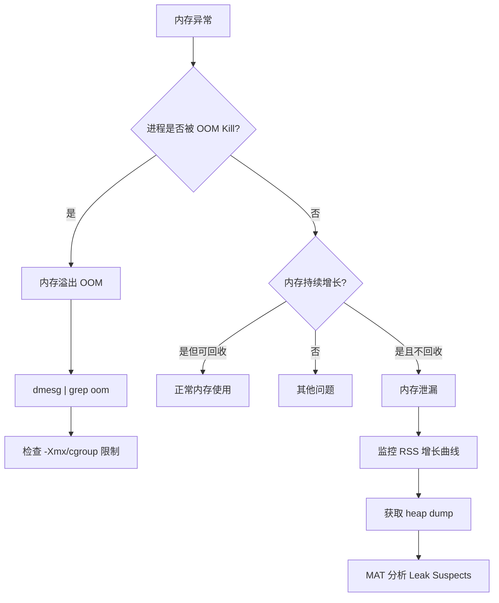
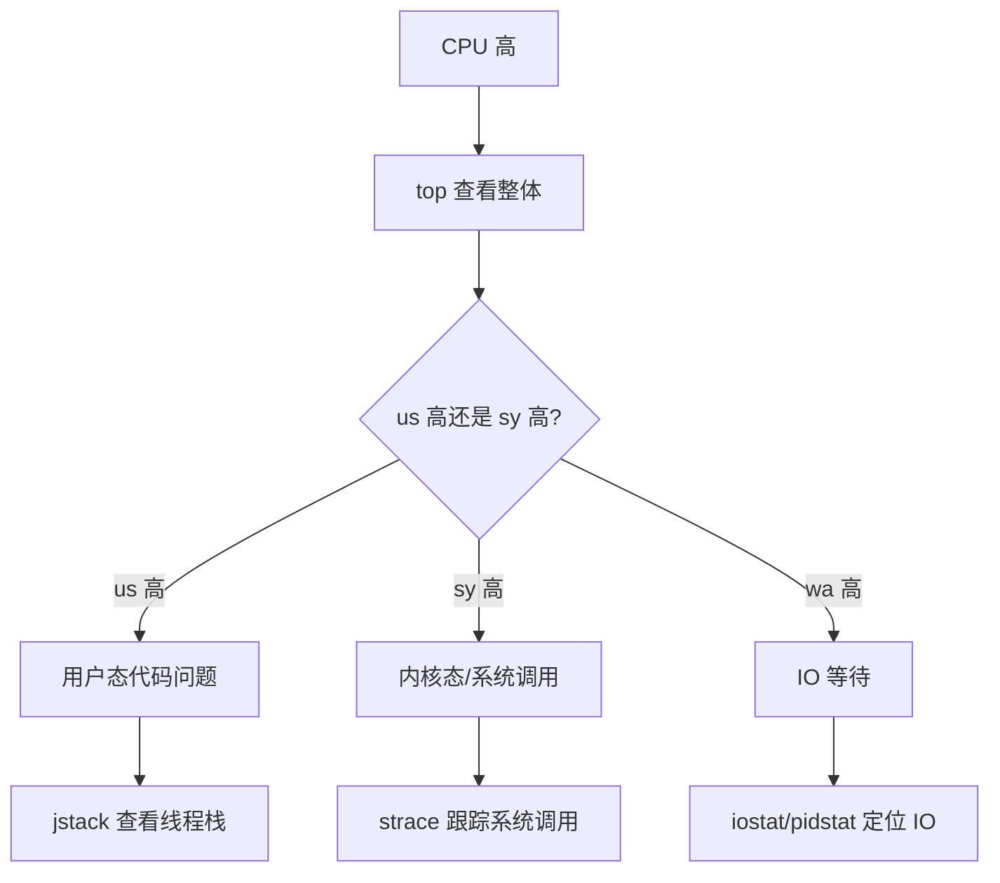
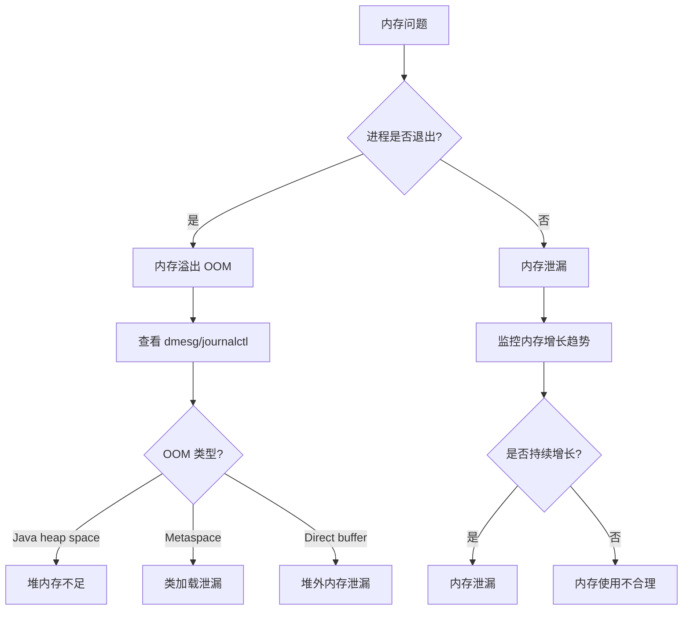

# Linux 性能排查手册（深入版）

## 〇、本体介绍

**Linux 排查**：线上出问题（CPU 飙、内存涨、IO 卡、网络抖、进程假死）时，用一套命令与工具**量化定位瓶颈**，而非瞎猜。它是后端工程师的「听诊器」。

**核心思路**：**先整体（top/负载）→ 再细分（per-资源工具）→ 最后进进程（strace/perf/火焰图）**。配合日志与可观测性（见 [云原生/可观测性](../云原生/可观测性.md)）。

**排查顺序口诀**：整体→CPU→内存→IO→网络→进程→应用→日志

---

## 一、整体概览

### 1.1 系统负载

```bash
uptime
# 14:30:01 up 45 days, load average: 2.35, 1.89, 1.67
# 三个数字：1分钟/5分钟/15分钟的平均负载
# 经验值：load < CPU核数 正常；load > 2×核数 需关注

top
# %Cpu(s): 25.3 us, 3.1 sy, 0.0 ni, 68.2 id, 2.8 wa, 0.0 hi, 0.6 si
# us: 用户态CPU  sy: 内核态CPU  wa: IO等待  si: 软中断
# 重点看 wa（IO等待）和 us（用户态）

# top 交互命令
# P — 按CPU排序  M — 按内存排序  1 — 显示每核CPU  c — 显示完整命令
```

### 1.2 系统信息速查

```bash
# 系统版本
cat /etc/os-release
uname -r

# CPU 信息
lscpu | head -15
cat /proc/cpuinfo | grep "model name" | head -1

# 内存信息
free -h
cat /proc/meminfo | head -10

# 磁盘信息
lsblk
df -hT

# 网络信息
ip addr show
cat /proc/net/dev
```

---

## 二、CPU 排查

### 2.1 整体 CPU 分析

```bash
# 实时 CPU 监控（每秒刷新）
top -d 1
# 关注：%Cpu(s) 行的 us/sy/wa/si；进程列表的 %CPU

# 多核 CPU 查看
mpstat -P ALL 1
# %usr/%sys/%iowait/%irq/%soft 每核细分

# 历史 CPU 回看
sar -u 1 10    # 每秒采样，共10次
sar -u -f /var/log/sa/sa15  # 回看15号的历史数据
```

### 2.2 进程级 CPU 分析

```bash
# 按 CPU 排序找进程
ps aux --sort=-%cpu | head -10

# 实时看进程 CPU
top -p <pid>     # 监控指定进程
pidstat -u 1     # 所有进程 CPU 使用

# 线程级 CPU（Java 多线程排查）
top -H -p <pid>            # 看线程级 CPU
ps -eLf | grep <pid> | wc -l  # 线程数
```

### 2.3 热点函数定位

```bash
# perf 实时看函数级 CPU 占用
perf top -g
# 输出：函数名 + 采样占比（最上面的最耗CPU）

# 抓取调用栈（录制 30 秒）
perf record -g -p <pid> -- sleep 30
perf report
# 交互界面：Enter 展开调用链

# 火焰图（最直观）
perf script | stackcollapse-perf.pl | flamegraph.pl > cpu.svg
# 横轴 = 采样时长占比，最宽的函数最耗CPU
# 自底向上 = 调用链（从 main → handleRequest → queryDB）
```

### 2.4 上下文切换

```bash
# 系统级上下文切换
vmstat 1
# cs 列 = 上下文切换次数（正常几千，过高需关注）

# 进程级上下文切换
pidstat -w -p <pid> 1
# cswch/s: 自愿切换（通常是 IO 等待）
# nvcswch/s: 非自愿切换（时间片用完，CPU 抢占）
# 非自愿过高 = 大量线程争抢 CPU

# 进程内线程切换
cat /proc/<pid>/status | grep voluntary
```

### 2.5 常见 CPU 问题

| 现象 | 可能原因 | 排查 |
|------|----------|------|
| us 高 | 应用代码热点（计算密集） | perf top / 火焰图 |
| sy 高 | 内核态开销（系统调用多/锁竞争） | strace -c 统计系统调用 |
| wa 高 | IO 等待（磁盘慢/IO 密集） | iostat -x / iotop |
| si 高 | 软中断（网络包处理） | cat /proc/softirqs / sar -I |
| hi 高 | 硬中断（磁盘/网卡中断） | cat /proc/interrupts |
| load 高但 CPU 不高 | 进程阻塞（D 状态） | ps aux | grep D |

---

## 三、内存排查

### 3.1 整体内存分析

```bash
# 内存概览
free -h
# total   used   free   shared  buff/cache  available
# 62Gi    45Gi   2.1Gi  128Mi   14Gi        15Gi
# 关注 available（真正可用 = free + 可回收缓存）
# 不要被 free 低吓到（buff/cache 可回收）

# 内存详细信息
cat /proc/meminfo | grep -E "MemTotal|MemFree|MemAvailable|Cached|Buffers|SwapTotal|SwapFree"

# 实时内存监控
vmstat 1
# si/so = swap 换入换出（非零说明内存不足）
```

### 3.2 进程级内存

```bash
# 按内存排序找进程
ps aux --sort=-%mem | head -10

# 进程详细内存映射
pmap -x <pid> | tail -5
# total KB = 进程总内存占用

# 更精细的内存分析
smem -tk    # 按 PSS 排序（PSS = 按比例分摊共享内存）
cat /proc/<pid>/smaps | grep -E "Pss|Rss" | awk '{sum+=$2} END{print sum/1024"MB"}'

# Java 堆外内存
jcmd <pid> VM.native_memory summary
```

### 3.3 内存泄漏定位

```bash
# 1. 监控 RSS 增长曲线
while true; do
    echo "$(date +%H:%M:%S) $(ps -o rss= -p <pid>)KB"
    sleep 60
done > rss_monitor.log

# 2. 找内存增长点（Java）
jmap -dump:live,format=b,file=heap.hprof <pid>
# 用 MAT / VisualVM 分析

# 3. 非 Java 进程
pmap -x <pid> > pmap_start.txt
# 等一段时间
pmap -x <pid> > pmap_end.txt
diff pmap_start.txt pmap_end.txt

# 4. 内存分配跟踪（需 root）
valgrind --tool=massif ./myapp
ms_print massif.out.<pid>
```

### 3.4 OOM 排查

```bash
# 查看 OOM Killer 记录
dmesg | grep -i "oom\|killed process" | tail -5
# [12345.678] Out of memory: Kill process 12345 (java) score 800

# 查看历史 OOM
journalctl -k | grep -i "oom\|killed"

# Java OOM 后
# 1. 检查启动参数：-Xmx 是否超过物理内存的 70%
# 2. 检查堆外内存：NIO direct buffer / metaspace
# 3. 检查 cgroup 限制：cat /sys/fs/cgroup/memory/<container>/memory.limit_in_bytes
```

### 3.5 Swap 分析

```bash
# 查看 swap 使用
swapon -s
cat /proc/swaps

# 查看哪些进程在用 swap
for f in /proc/[0-9]*/status; do
    awk '/VmSwap/{if($2>0)print FILENAME,$0}' "$f" 2>/dev/null
done

# Swap 偏好（控制 swap 使用倾向）
cat /proc/sys/vm/swappiness
# 0: 尽量不用 swap  # 60: 默认  # 100: 积极使用
# Java 建议设 10-30（减少 swap 对 GC 的影响）
```

---

## 四、磁盘 IO 排查

### 4.1 整体 IO 分析

```bash
# 实时 IO 监控
iostat -x 1
# 关键指标：
# %util: 磁盘利用率（>80% 接近瓶颈）
# await: 平均 IO 等待时间（ms，越小越好）
# r/s w/s: 读写次数
# rkB/s wkB/s: 读写吞吐

# 进程级 IO
iotop -oP          # 只显示有 IO 的进程
pidstat -d -p <pid> 1  # 指定进程 IO

# 文件系统空间
df -hT              # 各挂载点空间和类型
du -sh /var/log/*   # 找大目录
ncdu /              # 交互式磁盘占用分析
```

### 4.2 IO 问题定位

```bash
# 已删文件空间不释放（常见！）
lsof | grep deleted
# 找到占用的进程 → 重启进程 或 清空 /proc/<pid>/fd/<fd号>

# 文件系统只读
mount | grep "ro,"
# 修复：remount rw 或 fsck

# inode 耗尽（df -i 查看）
df -i
# 找大量小文件：find / -xdev -type f | wc -l
```

### 4.3 文件系统深入

| 文件系统 | 特点 | 适用 |
|----------|------|------|
| ext4 | 成熟稳定、支持日志 | 通用 |
| xfs | 高性能大文件、并行IO | 数据库/日志 |
| btrfs | 快照/压缩/子卷 | 测试/备份 |
| tmpfs | 内存文件系统 | 临时文件/IPC |

```bash
# 文件系统类型
df -T / | tail -1

# 挂载参数
mount | grep " / "

# 常用挂载选项（/etc/fstab）
# noatime: 不更新访问时间（提升性能）
# discard: SSD TRIM（SSD 必须）
# barrier=0: 禁用写屏障（有 UPS 时可提升性能，但有风险）
```

---

## 五、网络排查

### 5.1 连通性

```bash
# 基础连通
ping -c 4 <host>
traceroute <host>       # 路径追踪
mtr -n <host>          # 实时丢包率（比 traceroute 更好）
nc -zv <host> <port>   # TCP 端口探测
telnet <host> <port>   # 端口探测（经典）
```

### 5.2 连接状态

```bash
# 所有监听端口
ss -lantp
# 状态分布
ss -ant | awk '{print $1}' | sort | uniq -c | sort -rn
# LISTEN  SYN_RECV  ESTABLISHED  TIME_WAIT  CLOSE_WAIT

# TIME_WAIT 过多（短连接风暴）
ss -ant | grep TIME_WAIT | wc -l
# 解决：长连接/连接池 + net.ipv4.tcp_tw_reuse=1

# CLOSE_WAIT 过多（应用未关闭连接）
ss -ant | grep CLOSE_WAIT
# 原因：应用 bug（未调 close()）→ 检查代码
```

### 5.3 抓包分析

```bash
# 抓指定端口的包
tcpdump -i any -n port 8080 -w capture.pcap
# -i any: 所有网卡  -n: 不解析域名  -w: 写文件

# 抓指定主机
tcpdump -i any -n host 10.0.0.1 and port 3306

# 实时查看（ASCII）
tcpdump -i any -n port 8080 -A | head -50

# 分析重传/乱序
tcpdump -r capture.pcap | grep -i "retrans\|dup"

# Wireshark 离线分析
# 下载 .pcap 文件，用 Wireshark 打开
```

### 5.4 网络调优（sysctl）

```bash
# 查看当前值
sysctl net.ipv4.tcp_tw_reuse
sysctl net.core.somaxconn

# 常用调优参数
# TIME_WAIT 复用
net.ipv4.tcp_tw_reuse = 1

# 连接队列大小
net.core.somaxconn = 65535
net.ipv4.tcp_max_syn_backlog = 65535

# 端口范围
net.ipv4.ip_local_port_range = 1024 65535

# TCP 缓冲区
net.core.rmem_max = 16777216
net.core.wmem_max = 16777216
net.ipv4.tcp_rmem = 4096 87380 16777216
net.ipv4.tcp_wmem = 4096 65536 16777216

# SYN 洪泛防护
net.ipv4.tcp_syncookies = 1

# 生效方式
sysctl -w net.ipv4.tcp_tw_reuse=1
# 持久化：echo "net.ipv4.tcp_tw_reuse=1" >> /etc/sysctl.conf && sysctl -p
```

### 5.5 DNS 排查

```bash
# DNS 解析测试
dig <domain> +short
nslookup <domain>
getent hosts <domain>   # 用系统解析（走 /etc/hosts + nsswitch）

# DNS 配置
cat /etc/resolv.conf
cat /etc/nsswitch.conf   # 解析顺序：files dns

# DNS 调试
dig <domain> +trace      # 完整解析链路
```

---

## 六、进程与线程

### 6.1 进程管理

```bash
# 进程树
ps auxf                  # 树形显示
pstree -p                # 进程树 + PID

# 进程资源
ps -eo pid,ppid,comm,rss,vsz,%cpu,%mem --sort=-%mem | head -20

# 进程打开的文件
lsof -p <pid> | wc -l    # fd 数量
ls /proc/<pid>/fd | wc -l # 同上

# 进程环境变量
cat /proc/<pid>/environ | tr '\0' '\n'
```

### 6.2 系统调用追踪

```bash
# strace 跟踪系统调用
strace -p <pid> -c        # 统计系统调用次数/耗时
strace -p <pid> -e trace=network  # 只看网络调用
strace -p <pid> -e trace=file     # 只看文件操作
strace -p <pid> -T         # 显示每个调用耗时

# 进程卡死排查
strace -p <pid>
# 如果输出停在 futex(0x..., FUTEX_WAIT, ...) → 死锁
# 如果停在 read(0x..., ...) → 等待输入
# 如果停在 epoll_wait → 正常等待事件

# 查看内核栈
cat /proc/<pid>/stack
# 常见：futex_wait_queue → 死锁/锁竞争
# 常见：do_page_fault → 缺页/OOM
```

### 6.3 信号与终止

```bash
# 常用信号
kill -15 <pid>   # SIGTERM（优雅终止，默认）
kill -9 <pid>    # SIGKILL（强制终止，不可捕获）
kill -1 <pid>    # SIGHUP（重载配置，如 nginx）

# 批量杀进程
kill $(ps aux | grep "myapp" | grep -v grep | awk '{print $2}')
# 更安全
pkill -f "myapp"
```

---

## 七、JVM 应用专项

```bash
# 进程查找
jps -l                    # 列出 Java 进程
jps -v <pid>              # 查看启动参数

# 线程分析
jstack <pid>              # 线程快照
jstack <pid> | grep -A 5 "BLOCKED"  # 查死锁
jstack <pid> | grep "tid=" | wc -l  # 线程数

# GC 分析
jstat -gcutil <pid> 1000  # 每秒 GC 统计
jstat -gccause <pid> 1000 # GC 原因

# 堆分析
jmap -heap <pid>          # 堆概览
jmap -dump:live,format=b,file=heap.hprof <pid>
# MAT / VisualVM 分析

# Arthas 在线诊断（推荐）
# 启动：java -jar arthas-boot.jar <pid>
thread -n 3               # 最忙的3个线程
thread -b                 # 阻塞线程
trace com.example.Svc method  # 方法耗时
watch com.example.Svc method returnObj  # 返回值
stack com.example.Svc method  # 调用栈
```

---

## 八、systemd 服务管理

```bash
# 查看服务状态
systemctl status nginx
systemctl list-units --type=service --state=failed

# 服务管理
systemctl start/stop/restart/reload nginx
systemctl enable/disable nginx  # 开机自启

# 查看服务日志
journalctl -u nginx -f           # 实时日志
journalctl -u nginx --since "1 hour ago"
journalctl -u nginx -p err       # 只看错误

# 自定义服务
cat /etc/systemd/system/myapp.service
```

---

## 九、iptables / nftables 防火墙

```bash
# 查看规则
iptables -L -n -v
iptables -L -n --line-numbers

# 常用规则
iptables -A INPUT -p tcp --dport 8080 -j ACCEPT    # 允许端口
iptables -A INPUT -s 10.0.0.0/24 -j ACCEPT          # 允许网段
iptables -A INPUT -j DROP                            # 默认拒绝

# 删除规则
iptables -D INPUT 3          # 删除第3条

# nftables（iptables 后继）
nft list ruleset
nft add table inet filter
nft add chain inet filter input { type filter hook input priority 0 \; }
```

---

## 十、经典排障 SOP

### 案例 A：接口变慢

```bash
# 1. 看整体负载
uptime   # load average 高吗？
top      # CPU us 高？wa 高？

# 2. CPU 高 → 火焰图
perf record -g -p <pid> -- sleep 30
perf script | stackcollapse-perf.pl | flamegraph.pl > cpu.svg

# 3. wa 高 → IO 瓶颈
iostat -x 1     # %util 高？
iotop            # 哪个进程 IO 高？

# 4. 结合日志
tail -f /var/log/app.log | grep ERROR
```

### 案例 B：内存涨到 OOM

```bash
# 1. 确认 OOM
dmesg | grep -i oom
# 2. 看内存使用
free -h
ps aux --sort=-%mem | head -5
# 3. Java 堆泄漏
jmap -dump:live,format=b,file=heap.hprof <pid>
# MAT 分析
# 4. 非 Java 进程
pmap -x <pid> > start.txt
# 等 30 分钟
pmap -x <pid> > end.txt
diff start.txt end.txt | grep "total"
```

### 案例 C：磁盘满

```bash
# 1. 找大文件
df -h
du -sh /* 2>/dev/null | sort -rh | head -10
du -sh /var/log/* | sort -rh | head -5

# 2. 已删文件占空间
lsof | grep deleted | sort -k7 -rn | head -5
# 清空：> /proc/<pid>/fd/<fd号> 或 重启进程

# 3. inode 耗尽
df -i
find / -xdev -type f | wc -l
# 找小文件目录
find / -xdev -type d -exec sh -c 'echo "$(find "$1" -maxdepth 1 -type f | wc -l) $1"' _ {} \; | sort -rn | head
```

### 案例 D：连接不上

```bash
# 1. 看监听
ss -lantp | grep :8080
# 2. 测端口
telnet <host> 8080
nc -zv <host> 8080
# 3. 看防火墙
iptables -L -n | grep 8080
# 4. 抓包
tcpdump -i any -n port 8080
# SYN 没回 → 防火墙/端口没监听
# RST → 服务拒绝
# SYN-ACK → 三次握手成功，问题在应用层
```

---

## 十一、速查表

| 维度 | 先看 | 再细分 |
|------|------|--------|
| CPU | `top` / `uptime` | `perf top` / 火焰图 / `vmstat` |
| 内存 | `free -h` / `top RES` | `pmap` / `smem` / `dmesg oom` |
| IO | `iostat -x` / `vmstat` | `iotop` / `pidstat -d` / `lsof deleted` |
| 网络 | `ping` / `ss -lantp` | `tcpdump` / `sar -n DEV` / `dig` |
| 进程 | `ps` / `top -H` | `strace` / `lsof` / `jstack` |

---

## 十二、CPU 高定位完整链路

### 12.1 定位四步法（Java 进程）

```bash
# Step 1: top 找 CPU 高的进程
top
# %CPU 列排序，找到高 CPU 的 PID（如 12345）

# Step 2: top -Hp <pid> 找高 CPU 的线程
top -Hp 12345
# 找到 CPU 最高的线程 TID（如 12378）

# Step 3: printf 转换为 16 进制
printf "%x\n" 12378
# 输出如 305a

# Step 4: jstack <pid> 找对应线程
jstack 12345 | grep "nid=0x305a" -A 30
# 定位到具体代码行和调用栈
```

### 12.2 完整排查流程图

```mermaid
flowchart TB
    A[top 看 %CPU] --> B{CPU 高在哪?}
    B -->|us 高| C[应用代码热点]
    B -->|sy 高| D[系统调用/锁竞争]
    B -->|si 高| E[软中断/网络包处理]
    C --> F[top -Hp pid 找线程]
    F --> G["printf '%x' tid"]
    G --> H[jstack pid | grep nid]
    H --> I[定位代码行]
    D --> J[strace -p pid -c]
    J --> K[看系统调用统计]
    E --> L[cat /proc/softirqs]
    L --> M[看 NET_RX/SOFTIRQ]
```

### 12.3 非 Java 进程排查

```bash
# C/Go 进程：perf + 火焰图
perf record -g -p <pid> -- sleep 30
perf script | stackcollapse-perf.pl | flamegraph.pl > cpu.svg

# Python 进程：py-spy
py-spy top --pid <pid>
py-spy record -o profile.svg --pid <pid>

# Node.js 进程
node --inspect=<port>
# Chrome 打开 chrome://inspect 分析
```

> **口诀：top → top -Hp → printf → jstack 是 Java CPU 高的黄金四步——先定位到线程，再定位到代码行。**

---

## 十三、内存泄漏 vs 内存溢出判别流程图

### 13.1 判别逻辑



### 13.2 区分方法

| 维度 | 内存泄漏 | 内存溢出 |
|------|---------|---------|
| 现象 | RSS 持续增长不释放 | 进程被 OOM Kill |
| 速度 | 缓慢增长（小时/天） | 快速耗尽（分钟/小时） |
| 触发 | 内部对象未释放 | 总需求超过限制 |
| 排查 | heap dump + MAT | dmesg + 检查限制 |
| 修复 | 修复泄漏代码 | 增大内存/优化使用 |

### 13.3 排查命令

```bash
# 检查 OOM 记录
dmesg | grep -i "oom\|killed process"
# [12345.678] Out of memory: Killed process 12345 (java) score 800

# 监控 RSS 增长
while true; do
    echo "$(date +%H:%M:%S) $(ps -o rss= -p <pid>)KB"
    sleep 60
done > rss_monitor.log

# Java 堆分析
jmap -dump:live,format=b,file=heap.hprof <pid>
# MAT 打开 hprof → Leak Suspects 报告

# 非 Java 进程内存增长
pmap -x <pid> > pmap_start.txt
# 等 30 分钟
pmap -x <pid> > pmap_end.txt
diff pmap_start.txt pmap_end.txt | grep "total"
```

> **口诀：泄漏 = RSS 慢慢涨但不 Kill（查代码释放），溢出 = 直接被 OOM Kill（查限制是否太小）。**

---

## 十四、io_wait 高用 iostat/pidstat 定位

### 14.1 定位链路

```bash
# Step 1: top 看 wa（IO 等待占比）
top
# %Cpu(s): ... 15.2 wa ...  → IO 等待 15%

# Step 2: iostat 看哪块磁盘瓶颈
iostat -x 1
# 关键指标：
# %util: 磁盘利用率（>80% 接近瓶颈）
# await: 平均 IO 等待时间（ms，>10ms 需关注）
# r/s, w/s: 读写次数
# rkB/s, wkB/s: 读写吞吐

# Step 3: pidstat 看哪个进程 IO 高
pidstat -d 1
# PID   kB_rd/s  kB_wr/s  Command
# 12345  50000    20000    java
```

### 14.2 iostat 关键指标解读

| 指标 | 含义 | 阈值 |
|------|------|------|
| %util | 磁盘利用率 | > 80% 瓶颈 |
| await | 平均 IO 延迟 | > 10ms 需关注 |
| r_await | 读延迟 | > 5ms 需关注 |
| w_await | 写延迟 | > 10ms 需关注 |
| avgqu-sz | 平均队列深度 | > 2 需关注 |
| aqu-sz | 平均 IO 大小 | 越大越好 |

```bash
# 深度 IO 分析
iostat -x -d 1 10  # 每秒采样，共 10 次

# 关注 %util 高且 await 高 → 磁盘真瓶颈
# 关注 %util 低但 await 高 → 可能是 IO 调度问题
# 关注 %util 高但 await 低 → 吞吐高但磁盘还没到瓶颈
```

### 14.3 常见 IO 问题

| 现象 | 可能原因 | 排查 |
|------|---------|------|
| wa 高 + %util 高 | 磁盘写满/慢 | df -h + iotop |
| wa 高 + %util 低 | IO 调度不当/文件系统问题 | ionice + mount 参数 |
| wa 高 + d 状态进程多 | 进程等 IO 阻塞 | ps aux \| grep D |

> **口诀：wa 高 → iostat 看磁盘 → pidstat 定进程 → iotop 定文件——IO 排查三板斧。**

---

## 十五、网络丢包排查（ethtool→netstat→dropwatch）

### 15.1 排查链路

```bash
# Step 1: ethtool 看网卡级别丢包
ethtool -S eth0 | grep -i "drop\|error\|miss"
# rx_dropped: 1000      → 网卡丢包（Ring Buffer 满）
# rx_missed_errors: 500 → DMA 来不及处理
# tx_dropped: 0

# Step 2: netstat 看协议栈丢包
netstat -s | grep -i "drop\|overflow\|reset"
# 1234 times the listen queue of a socket overflowed  → 全连接队列满
# 567 segments retransmitted                          → TCP 重传
# 89 receive buffer errors                            → 接收缓冲区满

# Step 3: dropwatch 精确定位丢包函数
dropwatch -l kas
# 监控内核丢包事件，定位到具体函数
```

### 15.2 Ring Buffer 丢包

```bash
# 查看 Ring Buffer 大小
ethtool -g eth0
# Pre-set:  RX:  4096  TX:  4096
# Current:  RX:  4096  TX:  4096

# 增大 Ring Buffer
ethtool -G eth0 rx 8192 tx 8192

# 持久化（/etc/network/interfaces 或 NetworkManager）
```

### 15.3 接收缓冲区丢包

```bash
# 查看接收缓冲区
sysctl net.core.rmem_max
sysctl net.core.rmem_default

# 增大缓冲区
sysctl -w net.core.rmem_max=16777216
sysctl -w net.core.rmem_default=16777216

# 查看 socket 缓冲区使用
ss -m | grep :8080
# skmem:(r0,rb131071,t0,tb87380,f0,w0,o0,bl0,d0)
# rb = 接收缓冲区大小
# r = 当前使用
```

> **口诀：丢包排查 ethtool→netstat→dropwatch 三步走——网卡丢包查 Ring Buffer，协议栈丢包查队列/缓冲区。**

---

## 十六、dmesg OOM Killer 日志解读

### 16.1 OOM 日志结构

```bash
dmesg | grep -i "oom\|killed process"
```

```text
[12345.678] java invoked oom-killer: gfp_mask=0xcc0, order=0, oom_score_adj=0
[12345.679] Out of memory: Killed process 12345 (java) total-vm:8388608kB, anon-rss:6291456kB, file-rss:0kB, shmem-rss:0kB
[12345.680] oom_reaper: reaped process 12345 (java), now anon-rss:0kB, file-rss:0kB
```

### 16.2 字段解读

| 字段 | 含义 | 关注点 |
|------|------|--------|
| total-vm | 进程虚拟内存总量 | 包含未实际分配的部分 |
| anon-rss | 匿名页 RSS（实际物理内存） | 真正占用的内存 |
| file-rss | 文件页 RSS | 映射的文件缓存 |
| shmem-rss | 共享内存 RSS | tmpfs/shmem |
| oom_score_adj | OOM 优先级（-1000~1000） | 越高越先被 Kill |

### 16.3 常见 OOM 场景

| 场景 | 日志特征 | 原因 |
|------|---------|------|
| Java 堆超限 | anon-rss 接近 -Xmx | -Xmx 设太大超过物理内存 |
| 堆外内存泄漏 | anon-rss > -Xmx 很多 | NIO direct buffer/Metaspace 泄漏 |
| cgroup 限制 | cgroup memory limit 触发 | K8s Pod 内存 limit 太小 |
| 系统整体不足 | 多个进程 RSS 之和 > 物理内存 | 多个内存大户竞争 |

```bash
# 查看 cgroup 内存限制（K8s Pod）
cat /sys/fs/cgroup/memory/memory.limit_in_bytes
# 或
cat /sys/fs/cgroup/memory.max  # cgroup v2

# 查看 cgroup 内存使用
cat /sys/fs/cgroup/memory/memory.usage_in_bytes
```

> **口诀：OOM 日志看 anon-rss——Java 堆超限 anon-rss≈-Xmx，堆外泄漏 anon-rss>>-Xmx，cgroup 限制看 limit_in_bytes。**

---

## 十七、perf flame graph 使用步骤

### 17.1 火焰图生成步骤

```bash
# Step 1: 录制性能数据（30秒）
perf record -g -p <pid> -- sleep 30
# -g: 记录调用栈
# -- sleep 30: 录制 30 秒

# Step 2: 生成折叠栈
perf script | stackcollapse-perf.pl > out.folded
# 需要安装 FlameGraph 工具集：
# git clone https://github.com/brendangregg/FlameGraph

# Step 3: 生成火焰图 SVG
flamegraph.pl out.folded > cpu-flamegraph.svg

# Step 4: 浏览器打开 SVG 分析
# 横轴 = 采样时长占比（最宽的函数最耗 CPU）
# 纵轴 = 调用栈深度（从 main → handleRequest → queryDB）
# 点击可以放大查看子树
```

### 17.2 火焰图解读

```
火焰图解读要点：
  ① 横轴宽度 = 该函数在采样中的占比（越宽越耗 CPU）
  ② 纵轴深度 = 调用栈深度（越深调用链越长）
  ③ 颜色无特殊含义（区分不同函数用）
  ④ 看"平顶"函数（自身耗 CPU 多，不是子调用多）
  ⑤ 对比两次火焰图找差异（优化前后）

常见模式：
  宽平顶 → CPU 热点函数（优化目标）
  深调用栈 → 递归/嵌套过深（可能栈溢出风险）
  突然变宽 → 某个分支耗 CPU 多（分支热点）
```

### 17.3 高级用法

```bash
# 内存火焰图
perf record -e kmem:kmalloc -g -p <pid> -- sleep 10
perf script | stackcollapse-perf.pl | flamegraph.pl --color=mem > mem.svg

# Off-CPU 火焰图（分析阻塞等待）
perf record -e sched:sched_switch -g -p <pid> -- sleep 30
# 需要 bcc 工具：offcputime-bpfcc <pid> -df | flamegraph.pl > offcpu.svg

# 差异火焰图（对比优化前后）
difffolded.pl before.folded after.folded | flamegraph.pl > diff.svg
# 红色 = 优化后增加，蓝色 = 优化后减少
```

> **口诀：火焰图 = "CPU 时间的 X 光片"——perf record → stackcollapse → flamegraph.pl 三步出图，看宽平顶函数就是优化目标。**

---

## 十二、与其他板块的关系

- 操作系统原理见「[操作系统](./操作系统.md)」；
- K8s 排障见「[K8s 故障排查手册](../云原生/K8s故障排查手册.md)」；
- K8s 运维见「[K8s 运维实战](../云原生/K8s运维实战.md)」；
- 可观测性见「[云原生/可观测性](../云原生/可观测性.md)」；
- 场景设计排障见「[场景设计/问题定位](../场景设计/问题定位.md)」。

## CPU 分析完整链路

```
CPU 排查完整流程：

  ① 确认 CPU 使用率
     top -bn1 | head -5
     mpstat -P ALL 1 5

  ② 定位高 CPU 进程
     top -bn1 | head -15
     pidstat -u 1 10

  ③ 定位高 CPU 线程
     top -Hp <pid>
     pidstat -t -p <pid> 1 10

  ④ 分析线程状态
     jstack <pid> | grep <tid> -A 30
     jstack <pid> | grep "RUNNABLE"

  ⑤ 火焰图分析
     perf record -g -p <pid> -- sleep 30
     perf script | stackcollapse-perf.pl | flamegraph.pl > cpu.svg

  ⑥ Java 线程分析
     jcmd <pid> Thread.print
     arthas thread -n 5
```

| 工具 | 用途 | 适用场景 |
|------|------|---------|
| top | 整体 CPU | 快速定位 |
| mpstat | 每核 CPU | 多核分析 |
| pidstat | 进程/线程 CPU | 精确定位 |
| perf | CPU 采样 | 热点函数 |
| jstack | 线程快照 | Java 线程 |
| Arthas | 在线诊断 | 生产环境 |

## OOM 排查完整流程

```
OOM 排查步骤：

  ① 确认 OOM 类型
     ├── Java heap space → 堆内存
     ├── GC overhead limit exceeded → GC 超时
     ├── Metaspace → 元空间
     ├── Direct buffer memory → 堆外内存
     └── unable to create new native thread → 线程数

  ② 获取堆内存信息
     jmap -heap <pid>
     jstat -gcutil <pid> 1000 10

  ③ 分析堆 dump
     jmap -dump:live,format=b,file=heap.hprof <pid>
     MAT / VisualVM 分析

  ④ 线程数排查
     ls /proc/<pid>/task | wc -l
     jstack <pid> | grep "java.lang.Thread.State" | wc -l

  ⑤ 堆外内存
     pmap <pid> | sort -rnk 3 | head
     -XX:MaxDirectMemorySize
```

```
# OOM Killer 日志解读
dmesg | grep -i "oom"

# 查看进程内存详情
cat /proc/<pid>/status | grep -E "VmRSS|VmSize|VmSwap"
cat /proc/<pid>/smaps_rollup
pmap -x <pid> | sort -rnk 3 | head -10

# 查看 OOM 分数
cat /proc/<pid>/oom_score
cat /proc/<pid>/oom_score_adj
```

## io_wait 高用 iostat/pidstat 定位

```
io_wait 排查流程：

  ① 确认 io_wait
     top → %wa 列
     vmstat 1 → wa 列

  ② 定位磁盘 IO 瓶颈
     iostat -x 1 10
     ├── %util > 80% → 磁盘繁忙
     ├── await > 10ms → IO 延迟高
     └── r/s + w/s → IOPS

  ③ 定位 IO 高的进程
     pidstat -d 1 10
     iotop -oP

  ④ 分析 IO 操作
     strace -p <pid> -e trace=read,write,fsync
     perf trace -p <pid>

  ⑤ Java IO 分析
     jstack <pid> | grep -A 20 "BLOCKED"
     jcmd <pid> GC.heap_info
```

```bash
# iostat 详细输出
iostat -x 1 10
# Device  r/s   w/s   rkB/s   wkB/s  await  %util
# sda     100   50    400     200    5.2    45.2

# pidstat IO 监控
pidstat -d 1 10
# PID   kB_rd/s  kB_wr/s  kB_ccwr/s
# 1234  1024     512      0

# 查看进程 IO
cat /proc/<pid>/io
# read_bytes: 1024000
# write_bytes: 512000
```

## 网络丢包排查

```
网络丢包排查流程：

  ① 确认丢包
     netstat -s | grep -i "drop\|retrans"
     ss -s

  ② 网卡级别
     ethtool -S eth0 | grep -i "drop\|error"
     cat /proc/net/dev

  ③ 内核级别
     nstat -az | grep -i "drop\|retrans"
     cat /proc/net/snmp

  ④ 连接级别
     ss -tnp state established
     netstat -an | grep ESTABLISHED | wc -l

  ⑤ 抓包分析
     tcpdump -i eth0 -w /tmp/drop.pcap
     wireshark 分析
```

```bash
# ethtool 网卡统计
ethtool -S eth0 | grep -E "drop|error|miss"

# 内核丢包统计
nstat -az | grep -E "Drop|Retrans|Reasm"

# socket 缓冲区
cat /proc/net/udp
cat /proc/net/tcp
# Recv-Q 满 = 缓冲区溢出

# 网络接口统计
cat /proc/net/dev
# 累计丢包数
```

## dmesg OOM Killer 日志解读

```
OOM Killer 日志格式：

  [xxx.xxx] Out of memory: Kill process 12345 (java) score 800 or sacrifice child
  [xxx.xxx] Killed process 12345 (java) total-vm:4096000kB, anon-rss:2048000kB

  解读：
    ├── Kill process 12345 → 被杀进程 PID
    ├── score 800 → OOM 分数（越高越容易被杀）
    ├── total-vm → 虚拟内存总量
    └── anon-rss → 物理内存使用量

  OOM 分数计算：
    ├── 基础分 = 进程 RSS / 总内存 × 1000
    ├── 调整分 = oom_score_adj
    └── 最终分 = 基础分 + 调整分

  防止 OOM：
    ├── 设置 oom_score_adj = -1000（不被杀）
    ├── 限制 cgroup 内存
    └── 增加物理内存
```

```bash
# 查看 OOM 分数
cat /proc/<pid>/oom_score
cat /proc/<pid>/oom_score_adj

# 设置 OOM 分数调整
echo -1000 > /proc/<pid>/oom_score_adj  # 不被 OOM Kill

# 查看历史 OOM 事件
dmesg | grep -i "oom"
journalctl -k | grep -i "oom"

# cgroup 内存限制
cat /sys/fs/cgroup/memory/<cgroup>/memory.limit_in_bytes
cat /sys/fs/cgroup/memory/<cgroup>/memory.usage_in_bytes
```

## perf flame graph 使用步骤

```
火焰图使用完整流程：

  ① 安装工具
     apt install linux-tools-common linux-tools-$(uname -r)
     pip install perf-flamegraph

  ② 采集数据
     perf record -g -p <pid> -- sleep 30
     # 或
     perf record -g -F 99 -p <pid> -- sleep 30

  ③ 生成火焰图
     perf script | stackcollapse-perf.pl | flamegraph.pl > cpu.svg

  ④ 分析火焰图
     ├── 横轴 = 采样比例（越宽占用 CPU 越多）
     ├── 纵轴 = 调用栈深度（越深调用链越长）
     ├── 颜色无特殊含义
     └── 看"平顶"函数（自身耗 CPU 多）

  ⑤ 差异火焰图（优化前后）
     difffolded.pl before.folded after.folded | flamegraph.pl > diff.svg
```

```bash
# 基础火焰图
perf record -g -p <pid> -- sleep 30
perf script | stackcollapse-perf.pl | flamegraph.pl > cpu.svg

# 内存火焰图
perf record -e kmem:kmalloc -g -p <pid> -- sleep 10
perf script | stackcollapse-perf.pl | flamegraph.pl --color=mem > mem.svg

# Off-CPU 火焰图（分析阻塞等待）
perf record -e sched:sched_switch -g -p <pid> -- sleep 30
# 需要 bcc 工具：offcputime-bpfcc <pid> -df | flamegraph.pl > offcpu.svg
```

> 一句话：**Linux 排障三板斧：`top` 看整体 → `perf/strace` 定热点 → `jstack/jmap` 进应用——wa 高查 IO、us 高查代码、load 高查阻塞（D 状态）**。

## CPU 高完整定位链路（top→top -Hp→printf→jstack 对照）

### 完整排查流程

```bash
# 1. top 查看整体 CPU 使用
top -bn1 | head -20
# 关注：%Cpu(s): us(用户态), sy(内核态), wa(IO等待), id(空闲)

# 2. top -Hp <pid> 查看线程 CPU
top -Hp <java_pid>
# 记录 CPU 最高的线程 PID

# 3. printf '%x' <tid> 转换为 16 进制
printf '%x\n' <tid>
# 输出如：1a2b

# 4. jstack <pid> | grep <tid_hex> 查看线程栈
jstack <java_pid> | grep "1a2b" -A 30
```

### 排查路径图



## 内存泄漏 vs 内存溢出判别流程图



## io_wait 高用 iostat/pidstat 定位

```bash
# 1. iostat 查看磁盘 IO
iostat -x 1 10
# 关注：%util（磁盘使用率）、await（平均 IO 等待时间）

# 2. pidstat 查看进程 IO
pidstat -d 1 10
# 关注：kB_rd/s（读速率）、kB_wr/s（写速率）

# 3. iotop 查看 IO 最高的进程
iotop -o -P

# 4. 定位具体文件
lsof -p <pid> | grep REG
strace -e trace=read,write -p <pid>
```

### IO 排查清单

| 工具 | 用途 | 关注指标 |
|------|------|----------|
| iostat -x | 磁盘级 IO | %util, await, r/s, w/s |
| pidstat -d | 进程级 IO | kB_rd/s, kB_wr/s |
| iotop | 进程 IO 排名 | Total DISK READ/WRITE |
| lsof | 文件句柄 | 打开的文件列表 |

## 网络丢包排查路径（ethtool -S→netstat -s→dropwatch）

### 排查流程

```bash
# 1. 确认丢包
netstat -s | grep -i "drop\|retrans"
ss -s

# 2. 网卡级别
ethtool -S eth0 | grep -i "drop\|error"
cat /proc/net/dev

# 3. 内核级别
nstat -az | grep -i "drop\|retrans"
cat /proc/net/snmp

# 4. 连接级别
ss -tnp state established
netstat -an | grep ESTABLISHED | wc -l

# 5. 抓包分析
tcpdump -i eth0 -w /tmp/drop.pcap
wireshark 分析
```

### 丢包类型与原因

| 丢包类型 | 原因 | 解决方案 |
|----------|------|----------|
| RX drop | 接收缓冲区满 | 调大 net.core.rmem_max |
| TX drop | 发送缓冲区满 | 调大 net.core.wmem_max |
| FIFO overrun | 网卡队列满 | 调大网卡队列长度 |
| Frame errors | 物理层错误 | 检查网线/交换机 |

## dmesg OOM Killer 日志解读

### OOM 日志分析

```bash
# 查看 OOM 事件
dmesg | grep -i "oom"
journalctl -k | grep -i "oom"

# 日志格式：
# [xxx.xxx] Out of memory: Kill process 12345 (java) score 800 or sacrifice child
# [xxx.xxx] Killed process 12345 (java) total-vm:4096000kB, anon-rss:2048000kB

# OOM 分数计算：
# 基础分 = 进程 RSS / 总内存 × 1000
# 调整分 = oom_score_adj
# 最终分 = 基础分 + 调整分
```

### OOM 防护

```bash
# 查看 OOM 分数
cat /proc/<pid>/oom_score
cat /proc/<pid>/oom_score_adj

# 设置 OOM 分数调整（不被杀）
echo -1000 > /proc/<pid>/oom_score_adj

# cgroup 内存限制
cat /sys/fs/cgroup/memory/<cgroup>/memory.limit_in_bytes
cat /sys/fs/cgroup/memory/<cgroup>/memory.usage_in_bytes
```

## perf flamegraph 生成步骤

### 火焰图完整流程

```bash
# 1. 安装工具
apt install linux-tools-common linux-tools-$(uname -r)
pip install perf-flamegraph

# 2. 采集数据
perf record -g -p <pid> -- sleep 30
# 或
perf record -g -F 99 -p <pid> -- sleep 30

# 3. 生成火焰图
perf script | stackcollapse-perf.pl | flamegraph.pl > cpu.svg

# 4. 差异火焰图（优化前后）
difffolded.pl before.folded after.folded | flamegraph.pl > diff.svg
```

### 火焰图分析

```
火焰图解读：
  横轴 = 采样比例（越宽占用 CPU 越多）
  纵轴 = 调用栈深度（越深调用链越长）
  颜色无特殊含义

  分析方法：
    1. 找最宽顶帧（自身耗 CPU 多）
    2. 看调用链（优化热点函数）
    3. 对比优化前后（差异火焰图）

  火焰图类型：
    CPU 火焰图：分析 CPU 热点
    Off-CPU 火焰图：分析阻塞等待
    内存火焰图：分析内存分配
```

## 二十六、CPU高完整定位链路详解

### 26.1 CPU定位五步法

```
CPU高定位链路：
  第一步：top查看整体CPU使用率
    → 找到CPU高的进程（%CPU列）

  第二步：top -Hp <pid>查看线程
    → 找到CPU高的线程（%CPU列）

  第三步：printf "%x" <tid>转换线程ID
    → 将十进制转换为十六进制

  第四步：jstack <pid> | grep <tid十六进制>查看线程堆栈
    → 找到具体代码位置

  第五步：jstack <pid> > thread_dump.txt保存完整堆栈
    → 分析调用链
```

### 26.2 CPU定位工具对比

| 工具 | 用途 | 精度 | 性能影响 |
|------|------|------|---------|
| top | 整体CPU | 低 | 低 |
| top -Hp | 线程CPU | 高 | 低 |
| pidstat | 线程CPU | 高 | 低 |
| jstack | 线程堆栈 | 高 | 中 |
| async-profiler | 火焰图 | 极高 | 低 |

## 二十七、内存泄漏vs内存溢出判别详解

### 27.1 判别方法

```
内存泄漏vs内存溢出：
  内存泄漏：
    定义：对象未被使用但未被回收
    表现：内存使用持续增长
    后果：最终导致内存溢出
    工具：jmap/jhat/MAT分析堆

  内存溢出：
    定义：内存不足无法分配新对象
    表现：OOM异常
    后程：进程崩溃
    工具：jmap/jstat/GC日志

  判别流程：
    1. 查看GC日志（Full GC频率）
    2. 查看堆内存趋势（jstat -gcutil）
    3. 分析堆转储（jmap -dump）
    4. 使用MAT分析泄漏点
```

### 27.2 内存问题排查工具

| 工具 | 用途 | 命令 |
|------|------|------|
| jstat | GC统计 | jstat -gcutil <pid> 1000 |
| jmap | 堆转储 | jmap -dump:format=b,file=heap.bin <pid> |
| jhat | 堆分析 | jhat heap.bin |
| MAT | 堆分析 | 导入heap.bin分析 |
| jstack | 线程堆栈 | jstack <pid> |

## 二十八、io_wait高定位详解

### 28.1 io_wait定位流程

```
io_wait定位流程：
  第一步：top查看%Cpu行的wa值
    → wa值高表示IO等待高

  第二步：iostat -x 1查看磁盘IO
    → %util：磁盘使用率
    → await：IO平均等待时间
    → svctm：IO平均服务时间

  第三步：pidstat -d 1查看进程IO
    → 找到IO高的进程

  第四步：iotop查看线程IO
    → 找到IO高的线程

  第五步：strace -p <pid> -e trace=file
    → 查看具体IO操作
```

### 28.2 io_wait优化策略

| 优化策略 | 做法 | 效果 |
|---------|------|------|
| 增加内存 | 减少swap使用 | 降低IO |
| SSD替换HDD | 提升IO性能 | 降低延迟 |
| 调整IO调度 | deadline/noop | 提升性能 |
| 优化文件系统 | ext4/xfs选择 | 提升性能 |
| 减少IO操作 | 合并写入/缓存 | 降低IO |

## 二十九、网络丢包排查详解

### 29.1 网络丢包排查路径

```
网络丢包排查路径：
  第一步：ethtool -S eth0查看网卡统计
    → rx_dropped：接收丢包
    → tx_dropped：发送丢包
    → rx_crc_errors：CRC错误

  第二步：netstat -s查看网络统计
    → TcpExtRetransSegs：TCP重传
    → TcpExtTCPTimeouts：TCP超时

  第三步：dropwatch查看丢包位置
    → 定位内核丢包点

  第四步：tcpdump抓包分析
    → 分析丢包原因

  第五步：iperf3测试网络性能
    → 测试带宽/延迟/丢包
```

### 29.2 网络丢包原因分析

| 原因 | 表现 | 解决方案 |
|------|------|---------|
| 网卡队列满 | rx_dropped增加 | 调整ring buffer |
| 带宽不足 | 延迟高/丢包 | 升级带宽 |
| 网络拥塞 | 重传增加 | QoS/流量控制 |
| MTU不匹配 | 分片丢包 | 调整MTU |
| 防火墙规则 | 连接被拒 | 调整iptables |

## 三十、dmesg OOM Killer详解

### 30.1 OOM Killer日志解读

```
OOM Killer日志解读：
  日志格式：
    [xxx.xxx] Out of memory: Kill process 12345 (java) score 800 or sacrifice child
    [xxx.xxx] Killed process 12345 (java) total-vm:4096000kB, anon-rss:2048000kB

  关键字段：
    process：被杀进程名
    score：OOM分数（越高越可能被杀）
    total-vm：虚拟内存大小
    anon-rss：实际物理内存大小

  OOM分数计算：
    基础分 = 进程RSS / 总内存 × 1000
    调整分 = oom_score_adj
    最终分 = 基础分 + 调整分
```

### 30.2 OOM防护策略

```bash
# 查看OOM分数
cat /proc/<pid>/oom_score
cat /proc/<pid>/oom_score_adj

# 设置OOM分数调整（不被杀）
echo -1000 > /proc/<pid>/oom_score_adj

# cgroup内存限制
cat /sys/fs/cgroup/memory/<cgroup>/memory.limit_in_bytes
cat /sys/fs/cgroup/memory/<cgroup>/memory.usage_in_bytes
```

## 三十一、perf火焰图生成详解

### 31.1 火焰图完整流程

```bash
# 1. 安装工具
apt install linux-tools-common linux-tools-$(uname -r)
pip install perf-flamegraph

# 2. 采集数据
perf record -g -p <pid> -- sleep 30
# 或
perf record -g -F 99 -p <pid> -- sleep 30

# 3. 生成火焰图
perf script | stackcollapse-perf.pl | flamegraph.pl > cpu.svg

# 4. 差异火焰图（优化前后）
difffolded.pl before.folded after.folded | flamegraph.pl > diff.svg
```

### 31.2 火焰图分析技巧

```
火焰图分析技巧：
  1. 找最宽顶帧
     → 自身耗CPU多的函数

  2. 看调用链
     → 优化热点函数

  3. 对比优化前后
     → 验证优化效果

  4. 关注颜色
     → 颜色无特殊含义

  5. 关注宽度
     → 宽度=采样比例

  火焰图类型：
    CPU火焰图：分析CPU热点
    Off-CPU火焰图：分析阻塞等待
    内存火焰图：分析内存分配
```
