# MQ（消息队列）

## Kafka 的 Producer 流程

AR、ISR、OSR

> 注：原文此处写作「AR、LSR、OSR」，但下文定义的三个概念是 AR、ISR、OSR，故将 LSR 修正为 ISR。

分区中的所有副本统称为 AR（Assigned Replicas）。

所有与 leader 副本保持一定程度同步的副本（包括 leader 副本在内）组成 ISR（In-Sync Replicas），ISR 集合是 AR 集合中的一个子集。

与 leader 副本同步滞后过多的副本（不包括 leader 副本）组成 OSR（Out-of-Sync Replicas）。

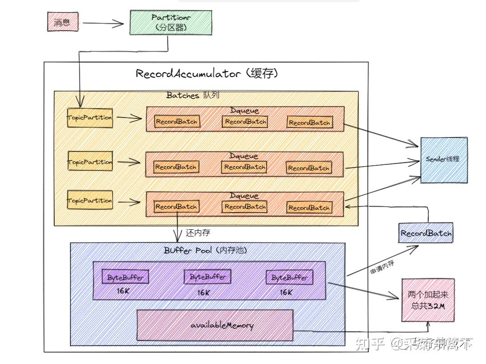

> 图：Kafka Producer 流程 / AR、ISR、OSR 示意

初始化分配固定的内存，即 32MB。然后把 32MB 划分为 N 多个内存块，一个内存块默认是 16KB，这样缓冲池里就会有很多的内存块。然后如果需要创建一个新的 Batch，就从缓冲池里取一个 16KB 的内存块就可以了。

接着如果 Batch 数据被发送到 Kafka 服务端了，此时 Batch 底层的内存块就直接还回缓冲池就可以了。这样循环往复就可以利用有限的内存，那么就不涉及到垃圾回收了。没有频繁的垃圾回收，自然就避免了频繁导致的工作线程的停顿了。

## Kafka 的语义保证

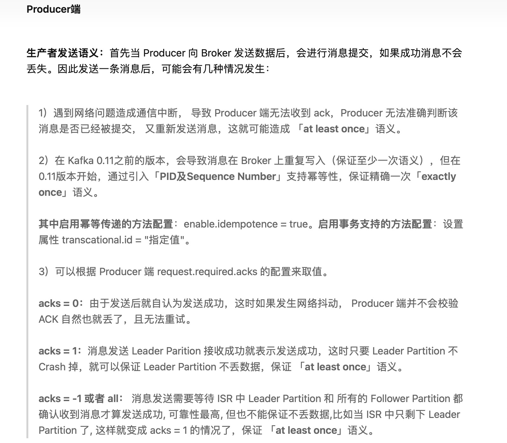

> 图：Kafka 语义保证示意（一）

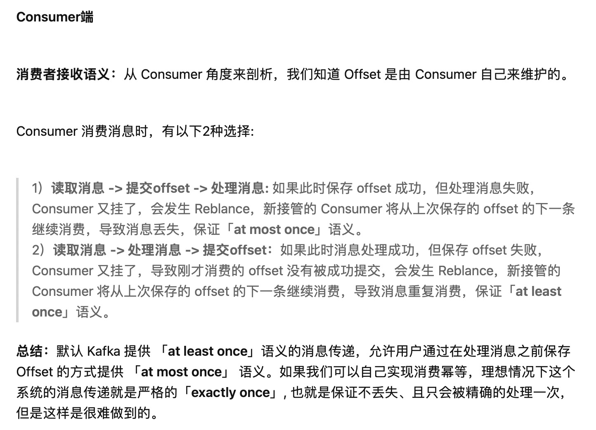

> 图：Kafka 语义保证示意（二）

### MQ 的消息发送方式

- Kafka：不关心返回、同步、异步（回调）
- RocketMQ：同步、异步和 OneWay（同 Kafka 的不关心结果）

## RocketMQ 和 Kafka 的存储和部分细节

[RocketMQ 存储详解（知乎）](https://zhuanlan.zhihu.com/p/431590257)

[RocketMQ 存储细节（知乎）](https://zhuanlan.zhihu.com/p/643661946?utm_psn=1845228963422691328)

RocketMQ 存储的文件主要包括 Commitlog 文件、ConsumeQueue 文件、Index 文件。

在 RocketMQ 中顺序写入到 Commitlog 文件后，ConsumeQueue 与 Index 文件都是异步构建的。

Commitlog 文件的设计理念是追求极致的消息写，但我们知道消息消费模型是基于主题的订阅机制，即一个消费组是消费特定主题的消息。如果根据主题从 commitlog 文件中检索消息，我们会发现这绝不是一个好主意，只能从文件的第一条消息逐条检索，其性能可想而知，故为了解决基于 topic 的消息检索问题，RocketMQ 引入了 consumequeue 文件，consumequeue 的结构如下图所示。

ConsumeQueue 的设计极具技巧，每个条目长度固定（8 字节 commitlog 物理偏移量、4 字节消息长度、8 字节 tag hashcode）。

这里不是存储 tag 的原始字符串，而选择存储 hashcode，目的就是确保每个条目的长度固定，可以使用访问类似数组下标的方式快速定位条目，极大地提高了 ConsumeQueue 文件的读取性能。

RocketMQ 引入了 Index 索引文件，实现基于文件的哈希索引。IndexFile 的文件存储结构如下图所示：

```text
RocketMQ根目录/
├── store/  # Broker核心数据存储目录（由storePathRootDir配置）
│   ├── commitlog/  # 所有主题的消息统一存储区（顺序写）
│   │   ├── 00000000000000000000  # 消息数据文件（固定1G/个，按偏移量递增命名）
│   │   ├── 000000000000001073741824  # 滚动生成的下一个文件（1G=1073741824字节）
│   │   └── ...
│   ├── consumequeue/  # 消费队列目录（按主题-队列维度索引commitlog）
│   │   ├── TopicA/  # 主题A
│   │   │   ├── 0/  # 队列0
│   │   │   │   ├── 00000000000000000000  # 队列数据文件（30W条/个，固定20字节/条）
│   │   │   │   ├── 00000000000000000001
│   │   │   │   └── ...
│   │   │   ├── 1/  # 队列1（结构同队列0）
│   │   │   └── ...  # 其他队列
│   │   ├── TopicB/  # 主题B
│   │   └── ...
│   ├── index/  # 索引文件目录（支持按key查询消息）
│   │   ├── 20250714120000.index  # 索引文件（按时间戳命名）
│   │   ├── 20250714120000.index.lock  # 索引文件写锁
│   │   └── ...
│   ├── checkpoint  # 存储刷盘检查点（记录commitlog、consumequeue、index的最新刷盘位置）
│   ├── abort  # 异常关闭标记（Broker启动时检测，存在则触发数据恢复）
│   └── lock/  # 存储目录锁（防止多Broker实例同时操作同一存储目录）
│       └── unlock  # 锁文件（正常运行时存在，确保存储独占访问）
│
├── logs/  # 运行日志目录（与数据文件分离）
│   ├── broker.log  # Broker运行日志
│   ├── namesrv.log  # NameServer运行日志
│   └── ...
│
├── namesrv/  # NameServer数据目录（可选，存储路由元数据缓存）
│   └── namesrv.properties  # NameServer配置文件
│
└── config/  # 配置文件目录
    ├── broker.conf  # Broker核心配置（存储路径、主题队列数等）
    ├── namesrv.conf  # NameServer配置
    └── logback.xml  # 日志配置
```

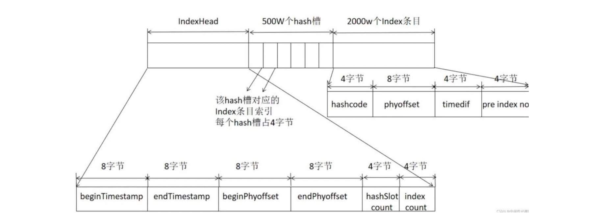

> 图：RocketMQ 存储目录结构（store / logs / namesrv / config）

IndexFile 文件基于物理磁盘文件实现 Hash 索引。其文件由 40 字节的文件头、500 万个 Hash 槽，每个 Hash 槽 4 个字节，最后由 2000 万个 Index 条目，每个条目由 20 个字节构成，分别为 4 字节索引 key 的 hashcode、8 字节消息物理偏移量、4 字节时间戳、4 字节的前一个 Index 条目（Hash 冲突的链表结构）。

即建立了索引 Key 的 hashcode 与物理偏移量的映射关系，根据 key 先快速定位到 commitlog 文件。

### Kafka

每个 Topic 的消息被一个或者多个 Partition 进行管理，Partition 是一个有序的、不变的消息队列，消息总是被追加到尾部。一个 Partition 不能被切分成多个、散落在多个 broker 上或者多个磁盘上。

它作为消息管理名义上最大的管家，内里其实是由很多的 Segment 文件组成。如果一个 Partition 是一个单个非常长的文件的话，那么这个查找操作会非常慢并且容易出错。为解决这个问题，Partition 又被划分成多个 Segment 来组织数据。Segment 并不是终极存储，在它的下面还有两个组成部分：

- 索引文件：以 `.index` 后缀结尾，存储当前数据文件的索引；
- 数据文件：以 `.log` 后缀结尾，存储当前索引文件名对应的数据文件。

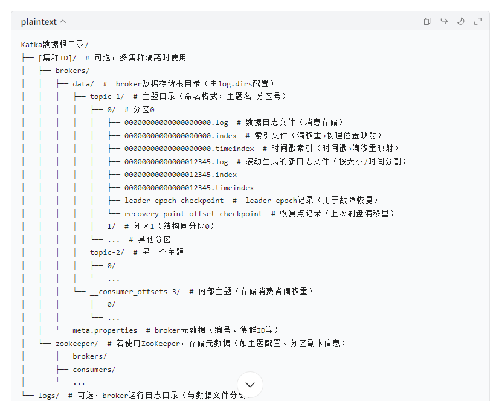

> 图：Kafka Partition / Segment 结构（一）

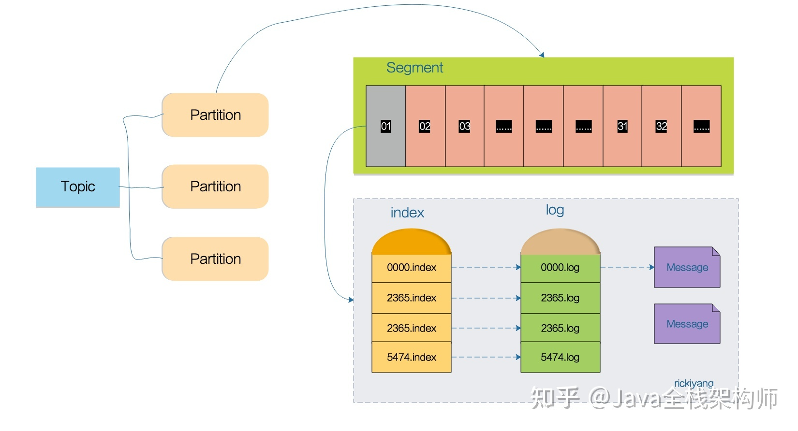

> 图：Kafka Partition / Segment 结构（二）

Segment 文件的命名规则是：某个 Partition 全局的第一个 Segment 从 0 开始，后续每个 Segment 文件名以当前 Partition 的最大 offset（消息偏移量）为基准，文件名长度为 64 位 long 类型，19 位数字字符长度，不足部分用 0 填充。

首先会根据 offset 值去查找 Segment 中的 index 文件，因为 index 文件是以上个文件的最大 offset 偏移命名的，所以可以通过二分法快速定位到索引文件。

找到索引文件后，索引文件中保存的是 offset 和对应的消息行在 log 日志中的存储位置，因为 Kafka 采用稀疏索引的方式来存储索引信息，并不是每一条索引都存储，所以这里只是查到文件中符合当前 offset 范围的索引。

拿到当前查到的范围索引对应的行号之后，再去对应的 log 文件中从当前 Position 位置开始查找 offset 对应的消息，直到找到该 offset 为止。

## Kafka 的重平衡

Kafka 提供了三种再平衡策略：Round Robin（轮询）、Range（范围）和 Sticky（粘性）。

- Round Robin（轮询）：这种策略会以轮询的方式将所有分区依次分配给消费者，确保每个消费者都能均匀地获得分区。
- Range（范围）：Range 策略首先计算每个消费者可以消费的分区个数，然后按照顺序将指定个数范围的分区分配给各个消费者。这有助于均衡分配消费压力。
- Sticky（粘性）：Sticky 是较新版本中新增的策略，旨在解决 Round Robin 和 Range 策略可能导致某些消费者负载过重的问题。Sticky 策略在保持均衡的基础上，尽可能保持未宕机的消费者仍然消费它们之前负责的分区，以减少不必要的再平衡。

再平衡会在以下情况发生时触发：

1. 新增或删除消费者：当消费者组中新增或删除消费者时，需要重新分配分区。
2. 消费者订阅主题发生变化：例如，使用正则表达式。
3. 主题新增分区：如果消费者订阅的主题发生新增分区的情况，新增的分区需要被分配给消费者。

[RocketMQ / Kafka 再平衡相关讨论（知乎）](https://www.zhihu.com/question/495501697/answer/3296985757)

Kafka 的重平衡其实包含两个非常重要的阶段：消费组加入阶段（PreparingRebalance）、队列负载（CompletingRebalance）。

- **PreparingRebalance**：此阶段是消费者陆续加入消费组，该组第一个加入的消费者被推举为 Leader，当该组所有已知 memberId 的消费者全部加入后，状态驱动到 CompletingRebalance。
- **CompletingRebalance**：PreparingRebalance 状态完成后，如果消费者被推举为 Leader，Leader 会采用该消费组中都支持的队列负载算法进行队列分布，然后将结果回报给组协调器；如果消费者的角色为非 Leader，会向组协调器发送同步队列分区算法，组协调器会将 Leader 节点分配的结果分配给消费者。

### 重平衡的过程

1. 触发条件：重平衡可以通过多种方式触发，包括但不限于消费者组内的成员发生变化（如消费者加入、退出）、主题的分区数量变化等。
2. 准备阶段：一旦检测到需要进行重平衡，Kafka 会选定一个协调者（Coordinator）。所有属于该消费者组的消费者将向协调者发送心跳来表明自己仍然活跃，并准备参与新一轮的分配。
3. 选举领导者：在某些情况下，比如使用了 KafkaConsumer.assign() 手动分配分区时，不会执行此步骤。但在自动订阅模式下，协调者会在所有存活的消费者中选择一个作为领导者来进行具体的分配决策。
4. 分配策略计算：由选出的领导者根据当前存活的消费者列表以及要消费的主题分区情况，采用特定算法（如 Range Assignment 或 Round Robin Assignment 等）来决定如何最公平地分配这些分区给每个消费者。
5. 同步与应用新分配：领导者将计算好的分配方案发送给协调者，然后协调者再广播给所有的消费者。消费者收到新分配后开始按照新的配置拉取消息。

### 重平衡过程中可能出现的问题

- 服务中断：在整个重平衡期间，整个消费者组实际上处于暂停状态，直到所有成员都接收到新的分配并且确认为止。这意味着在这段时间内，消息处理会被暂时停止。
- 频繁发生导致效率低下：如果消费者频繁地加入或离开组，则会导致连续不断的重平衡操作，这不仅增加了网络开销，也降低了整体的消息吞吐量。
- 不均匀的数据分布：虽然 Kafka 提供了几种不同的分配策略来尝试优化负载均衡，但在实际部署中，由于各种因素的影响，有时候可能会出现部分消费者负担过重而其他消费者则相对空闲的情况。
- 长时间阻塞：在极端情况下，如果某个消费者无法及时响应或者协调过程中出现了错误，可能导致整个重平衡过程被卡住，进而影响整个系统的正常运行。

## Kafka 的消息投递 / 幂等

[Kafka 消息投递与幂等（微信）](https://mp.weixin.qq.com/s/GxPT-MfoGvsDsEP--4z8WA)

## Kafka 的 ISR 机制

**AR（Assigned Replicas）**：

定义：AR 是指分配给某个主题的分区的所有副本的集合。

作用：AR 包括所有的副本，无论是领导者（Leader）副本还是跟随者（Follower）副本。这些副本分布在不同的 Broker 上，以确保高可用性和数据冗余。

**ISR（In-Sync Replicas）**：

定义：ISR 是指与领导者副本保持同步的副本集合。

作用：ISR 中的副本被认为是“同步”的，即它们与领导者副本的数据是一致的。只有 ISR 中的副本才有资格成为新的领导者副本。

**OSR（Out-of-Sync Replicas）**：

定义：OSR 是指与领导者副本不同步的副本集合。

作用：OSR 中的副本落后于领导者副本，可能因为网络延迟、Broker 故障等原因导致数据不一致。这些副本不能成为新的领导者副本，直到它们重新同步到 ISR 中。

在分区中，所有副本统称为 AR，Leader 维护了一个动态的 in-sync replica（ISR），ISR 是指与 leader 副本保持同步状态的副本集合。当然 leader 副本本身也是这个集合中的一员。

当 ISR 中的 follower 完成数据同步之后，leader 就会给 follower 发送 ack，如果其中一个 follower 长时间未向 leader 同步数据，该 follower 将会被踢出 ISR 集合，该时间阈值由 replica.log.time.max.ms 参数设定。当 leader 发生故障后，就会从 ISR 集合中重新选举出新的 leader。

## Kafka 中 LEO、HW、LSO、LW 分别代表什么

- **LEO**：是 LogEndOffset 的简称，代表当前日志文件中下一条。
- **HW**：水位或水印一词，也可称为高水位（High Watermark），通常被用在流式处理领域（Flink、Spark），以表征元素或事件在基于时间层面上的进展。在 Kafka 中，水位的概念与时间无关，而是与位置信息相关。严格来说，它表示的就是位置信息，即位移（offset）。取 partition 对应的 ISR 中最小的 LEO 作为 HW，consumer 最多只能消费到 HW 所在的上一条信息。
- **LSO**：是 LastStableOffset 的简称，对未完成的事务而言，LSO 的值等于事务中第一条消息的位置（firstUnstableOffset），对已完成的事务而言，它的值同 HW 相同。
- **LW**：Low Watermark 低水位，代表 AR 集合中最小的 logStartOffset 值。

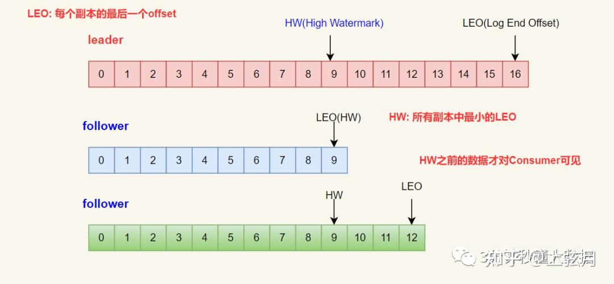

> 图：Kafka LEO / HW / LSO / LW 示意

## Kafka 是如何清理过期数据的

Kafka 将数据持久化到了硬盘上，允许你配置一定的策略对数据清理，清理的策略有两个：删除和压缩。

### 数据清理的方式

1. **删除**

   `log.cleanup.policy=delete` 启用删除策略。

   直接删除，删除后的消息不可恢复。可配置以下两个策略：

   - 清理超过指定时间：`log.retention.hours=16`
   - 超过指定大小后，删除旧的消息：`log.retention.bytes=1073741824`

   为了避免在删除时阻塞读操作，采用了 copy-on-write 形式的实现，删除操作进行时，读取操作的二分查找功能实际是在一个静态的快照副本上进行的，这类似于 Java 的 CopyOnWriteArrayList。

2. **压缩**

   将数据压缩，只保留每个 key 最后一个版本的数据。

   首先在 broker 的配置中设置 `log.cleaner.enable=true` 启用 cleaner，这个默认是关闭的。

   在 topic 的配置中设置 `log.cleanup.policy=compact` 启用压缩策略。

## RocketMQ 如何保证消费顺序性

[RocketMQ 顺序消费（CSDN）](https://blog.csdn.net/crazymakercircle/article/details/135416965)

[RocketMQ 顺序消费（CSDN）](https://blog.csdn.net/zsq1233ddd/article/details/143191477)

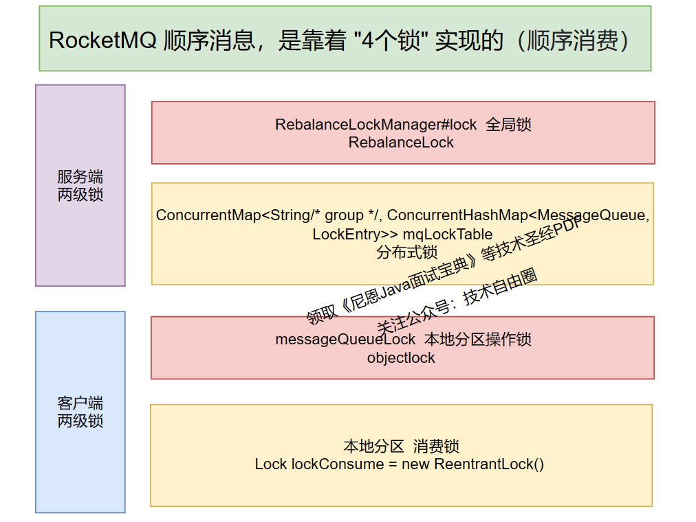

> 图：RocketMQ 消费顺序性示意

### 第一把锁：Broker 端的分布式锁

正常的逻辑，如果保证一个分区，分配到也仅仅分配到一个 client，就需要分布式锁，比如 Redis 分布式锁。

RocketMQ 没有用 Redis 分布式锁，而是自研分布式锁，在 broker 中设置分布式锁，所以 broker 直接充当 Redis 这些角色而已。

所以，在 RocketMQ 的 broker 端：

通过分布式锁，实现一个分区 queue 绑定到一个消费者 client，并且 broker 设置一个专门的管理器，来管理分布式锁。

### 第二把锁：Broker 端的全局锁

一个分区配备一把锁，分布式锁 `this.mqLockTable` 是一个 ConcurrentMap。

为了保证分布式锁操作的原子性，broker 设置一个专门的管理器，来管理分布式锁。

### 客户端两级锁

MQClientInstance 客户端实例，会开启多个异步并行服务：

- 负载均衡服务 rebalanceService：再平衡服务，专门进行 queue 分区的再平衡、再分配。
- 消息拉取服务 pullMessageService：专门拉取消息，通过内部实现类 DefaultMQPushConsumerImpl 拉取。
- 消息消费线程：ConsumeMessageOrderlyService 有序消息消费。

## 事务消息（半消息机制）

分布式事务中，本地事务与消息发送需一致。RocketMQ 的**事务消息**流程：

1. 发送 **Half Message（半消息）** 到 Broker，对消费者不可见；
2. 执行本地事务，返回 `COMMIT` / `ROLLBACK`；
3. Broker 收到 `COMMIT` 才将消息转为正向可消费；`ROLLBACK` 则丢弃；
4. 若 Producer 超时未回查，Broker 发起**回查（checkLocalTransaction）**确认状态。

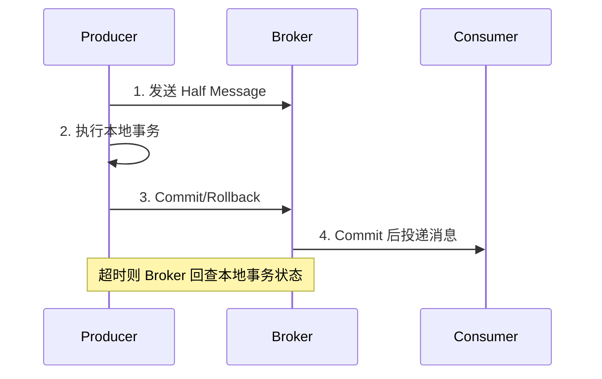

Kafka 通过 **事务 API + 幂等 Producer**（`enable.idempotence=true`、`transactional.id`）实现 EOS（精确一次语义），配合 `read_committed` 隔离级别消费。

## 消息队列横向对比

| 维度 | Kafka | RocketMQ | RabbitMQ | Pulsar |
| --- | --- | --- | --- | --- |
| 定位 | 大数据/日志流 | 业务级可靠消息 | 低延迟、复杂路由 | 云原生、存算分离 |
| 协议 | 私有(仿AMQP) | 私有 | AMQP | 自研+Kafka协议 |
| 顺序性 | 分区内有序 | 队列有序 | 队列有序 | 分区有序 |
| 事务消息 | 事务API | 半消息 | 不支持 | 支持 |
| 堆积能力 | 极强(磁盘) | 强 | 一般(内存为主) | 极强(分层存储) |
| 延迟消息 | 不支持(靠外部) | 支持(18级/精度) | 支持 | 支持 |

## 消费幂等（补充）

MQ 不保证"只投递一次"（多为至少一次），消费端必须幂等：
- **业务唯一键 + 去重表**：如订单号，消费前查/插去重表；
- **Redis `SETNX`** 标记 messageId，设置 TTL 防重复；
- **乐观锁/状态机**：避免重复扣款、重复发货。

## 生产实践与面试高频

1. **消息丢失**：Producer 侧 acks/事务、Broker 侧多副本(ISR)+刷盘策略、Consumer 侧**先处理后提交 offset**。
2. **重复消费**：由 at-least-once 必然带来，靠幂等兜底；Kafka 可上 exactly-once。
3. **消息积压**：扩容消费者、提升并行度（RocketMQ 加 queue、Kafka 加 partition）、临时转存+批量处理。
4. **RocketMQ 零拷贝**：消费时 Broker 用 `mmap` + `sendfile` 提升吞吐；Kafka 同样重度使用 `sendfile`。
5. **延迟消息**：RocketMQ 默认 18 个延迟级别（`1s/5s/10s...`）；精确任意时间需时间轮或外部调度。

---

# 第二轮深度优化：堆积治理 / 消息轨迹 / Exactly-Once / Pulsar / 死信重试

## 一、消息堆积治理

- **现象**：consumer 消费速度 < 生产速度，`lag` 持续增长，消费延迟高，最终可能触发超时/重试雪崩。
- **根因**：消费逻辑慢（同步远程调用/慢 SQL）、消费线程少、MQ 并行度低（partition/queue 数少）、消费失败反复重试占满线程。
- **治理**：
  1. 临时扩容消费者实例（受 partition/queue 数上限约束）；
  2. 提高并行度：Kafka 增 partition、RocketMQ 增 queue 并扩容消费组；
  3. 批量消费 + 异步处理，缩短单条耗时；
  4. 降级非核心逻辑（先落库、后续异步补偿）；
  5. 紧急时开"转发通道"把堆积消息转存临时 topic，用更多 consumer 处理；
  6. 优化消费逻辑（去慢调用、加缓存、批量写 DB）。
- **预防**：监控 `consumer lag` 告警；消费幂等保证可重复处理；必要时限流生产端。

## 二、消息轨迹（Tracing）

- **目的**：追踪消息从 生产 → Broker → 消费 全生命周期，定位丢失/重复/慢。
- **RocketMQ**：`msgTraceTopic` 开启轨迹，记录生产/存储/消费各时间戳，控制台可视化。
- **Kafka**：原生无内建轨迹，用消息 `header` + OpenTelemetry 串联；消费端上报 trace。
- **Pulsar**：原生 `messageId` 可追溯，配合 broker 日志。
- **排查**：消息没消费到 → 看是否投递成功、offset 是否提交、是否消费异常进入重试。

## 三、Exactly-Once 实现思路

- 端到端 Exactly-Once 很难，常见组合：
  1. **Producer 幂等**：`enable.idempotence=true`（PID + 序列号去重）保证单分区不重复；
  2. **事务**：`transactional.id` 保证"生产不重复 + 跨分区原子"；
  3. **消费端事务性输出**：消费 + 写结果 + 提交 offset 在一个事务（如 Kafka Streams / 事务性 sink）；
  4. **下游幂等兜底**：去重表 / 状态机（最终防线）。
- 代价：吞吐下降、实现复杂。多数业务用 **at-least-once + 幂等** 即可，不必强求 EOS。

## 四、死信队列与重试

- **重试**：消费失败按退避重试（RocketMQ 默认 16 次后进死信；Kafka 手动 `seek` 重试或借助重试 topic）。
- **死信队列（DLQ）**：超过重试次数进 DLQ，人工排查/定时重放，避免**毒消息（poison message）** 阻塞正常消费。
- **设计要点**：区分"可重试"（网络抖动）与"不可重试"（参数非法）；不可重试直接进 DLQ，别空转重试拖垮消费线程。

## 五、Pulsar 简介与对比

- **架构**：存算分离——Broker（无状态计算）+ BookKeeper（持久存储），分层存储（S3）存冷数据。
- **优势**：多租户、统一消息模型（队列 + 流）、跨地域复制、分层存储无限堆积、订阅灵活（Exclusive/Shared/Key_Shared/Failover）。
- **对比**：

| 维度 | Kafka | RocketMQ | Pulsar |
| --- | --- | --- | --- |
| 架构 | 存算一体 | 存算一体 | 存算分离 |
| 多租户 | 弱 | 中 | 强（原生） |
| 事务消息 | 事务 API | 半消息 | 支持 |
| 分层存储 | 弱 | 弱 | 强（S3） |
| 运维复杂度 | 中 | 中 | 高（多组件） |

- **选型**：业务可靠 + 事务选 RocketMQ；日志流/超高吞吐选 Kafka；云原生、多租户、弹性伸缩选 Pulsar。

## 六、RocketMQ 存储机制（CommitLog）

- 所有消息**顺序写 CommitLog**（append-only），ConsumeQueue 是稀疏索引（指向 CommitLog 的 offset），顺序写盘 + 零拷贝读是高吞吐关键。
- **刷盘策略**：`SYNC_FLUSH`（每条 fsync，强可靠低吞吐）vs `ASYNC_FLUSH`（默认，批量 fsync）。
- **消息顺序**：单 queue 内有序；全局有序需单 queue，吞吐受限；顺序消费靠 `MessageListenerOrderly` + 队列锁。

## 七、Kafka 副本与 ISR

- **ISR（In-Sync Replicas）**：与 leader 保持同步的副本集合；`acks=all` 需 ISR 全确认；follower 落后超 `replica.lag.time.max.ms` 被踢出 ISR（不再要求"消息条数差"，避免频繁进出）。
- **Leader Epoch**：防 HW（高水位）机制下的"数据丢失/回退"隐患，取代单纯靠 offset 的副本同步。
- **事务消息**：producer `initTransactions` → `beginTransaction` → `sendOffsetsToTransaction` → `commitTransaction`，保证"消费 + 生产"原子（EOS 基础）。

## 八、消息顺序与流处理 EOS

- 顺序：单 partition 内有序；用消息 `key` 决定分区，保证同 key 落同一分区有序。
- **Kafka Streams**：`exactly_once_v2`（幂等 producer + 事务 + 消费位移与输出同事务提交）实现端到端 Exactly-Once。

## 九、RabbitMQ 补充

- 路由灵活：direct / topic / fanout / headers；**死信 Exchange（DLX）** + 消息 TTL 实现延迟队列。
- **Quorum Queue**（Raft 复制）替代镜像队列，高可用更强；内存为主，堆积能力弱于 Kafka/RocketMQ。

## 十、补充：消费幂等键设计

- 幂等键应选**业务唯一且稳定**的标识（如订单号、交易流水号），而非每次请求随机生成的 ID（重试时 ID 变则去重失效）。
- 去重表用唯一索引兜底；Redis `SET` 带业务 TTL（覆盖重试窗口）；下游状态机拒绝逆向/重复流转，三者可组合。

## 十一、消息积压治理与高阶实战（第三轮深度补充）

### 11.1 消息积压百万级治理 SOP

1. **先止血**：确认消费侧是否宕机/慢（DB 慢查询、下游超时、线程池满）；看 `lag`（`kafka-consumer-groups --describe` / RocketMQ `mqadmin brokerStatus`）。
2. **提吞吐**：
   - 临时扩容消费者实例（Kafka 受分区数限制，分区不够先扩分区）；
   - 提升消费并发（线程池 / 批量消费 `max.poll.records` 调大）；
   - 消费逻辑降级（先落库/标记，重计算异步补）；
   - 单条慢 SQL/外部调用改成批量/缓存。
3. **旁路追平（积压极大）**：新建「临时topic + 更多分区」，写脚本/作业把旧 topic 积压消息搬运到新 topic 多实例并发消费，追平后切回；或跳过非关键历史消息（打标跳过）。
4. **防复发**：消费幂等（见前文十）+ 监控 `lag` 告警 + 消费耗时 SLO；大促前压测消费能力留 2x 余量。

### 11.2 Exactly-Once 在 Kafka / RocketMQ / Pulsar 的实现差异

| MQ | Exactly-Once 机制 | 能力边界 |
| --- | --- | --- |
| Kafka | **EOS**：幂等 Producer（`enable.idempotence`，PID+序列号去重）+ 事务（`transactional.id`，消费位移与输出同事务）+ 消费者 `isolation.level=read_committed` | 仅保证"消费→处理→产出"原子，端到端需下游也配合（如幂等写 DB） |
| RocketMQ | 事务消息（半消息 + 本地事务 + 回查）+ 消费幂等 | 保证"发端"事务一致，消费端靠业务幂等兜底 |
| Pulsar | **Pulsar IO + 幂等 Sink** + 单分区有序 + 去重（`BrokerDeduplicationEnabled`）；流处理用 Pulsar Functions 精确一次 | 单消息去重 + Functions 端到端 EOS，跨系统仍靠幂等 |

- **本质提醒**：纯消息中间件几乎无法做到跨系统的绝对 Exactly-Once，都是"幂等 + 原子提交 + 去重"的组合近似；工程上优先把下游做成幂等，比追求中间件 EOS 更可靠。

### 11.3 消息轨迹与全链路追踪

- **消息轨迹（Message Trace）**：RocketMQ 原生 `msgId` 追踪「生产→存储→消费」各时间戳/状态（RocketMQ Console 可见）；Kafka 用 `producerId/sequence` + 消费位点近似；Pulsar 有 `messageId`。
- **接入全链路**：在消息 `header`/`properties` 注入 `traceId`（OpenTelemetry），消费者用同一 `traceId` 起新 span，串起「生产应用 → MQ → 消费应用」；用 Jaeger/SkyWalking 看跨进程调用链，定位"消息卡在哪一跳"。
- **价值**：排查"消息发了但下游没动"= 生产成功/消费未拉/消费失败重试中，轨迹一眼分清。

### 11.4 顺序消息与分区再均衡冲突

- **顺序保证**：Kafka 单 partition 内有序，同 key 落同分区即同 key 有序；RocketMQ 用 `MessageListenerOrderly` + 队列锁保证单队列顺序消费。
- **冲突点**：发生 **rebalance（再均衡）** 时分区在消费者间重分配，若旧消费者还没 commit 偏移、新消费者已接管，可能重复消费（破坏"恰好一次顺序"）；或消费慢导致再均衡反复触发（"再均衡风暴"）。
- **治理**：
  - 消费处理要快、不在消费中做长事务；`max.poll.interval.ms` 调大避免被踢出；
  - 用**静态成员资格（Static Membership）**减少再均衡（`group.instance.id`），实例重启不触发全量重平衡；
  - 顺序消费必须幂等，rebalance 导致的少量重复用幂等键吸收。

### 11.5 死信队列与人工兜底

- **死信（DLQ）**：消费失败超过重试次数（Kafka 用重试 topic + 最终进 DLQ；RocketMQ `retry` topic 耗尽进 `%DLQ%`；RabbitMQ 用 DLX + TTL），消息进死信队列隔离，避免阻塞主队列、不丢消息。
- **兜底流程**：监控 DLQ 堆积告警 → 排查根因（数据错误/下游永久不可用）→ 修复后**重放（replay）**死信（消费/重发）；对资金类必须有人工审核入口，禁止自动无限重试。
- **注意**：死信消息保留原始 payload + 失败原因 + 次数，便于复盘；重放前确保下游已幂等，防二次副作用。

### 11.6 与 CDC（Debezium）结合的实战

- **CDC 链路**：Debezium 监听 MySQL/PG 的 binlog/WAL → 发到 Kafka（topic 按表分）→ 下游消费做：缓存失效、异构同步、构建 ES 索引、触发领域事件。
- **价值**：与应用解耦，数据变更"天然有序、不侵入业务代码"，比"业务代码双写"一致性强。
- **坑与要点**：
  - **顺序**：同一主键变更必须落同一分区（按主键路由），否则乱序致状态回退。
  - **快照与流式衔接**：首次全量快照 + 切到 binlog 位点需无缝，Debezium 用 `snapshot.mode` 处理。
  - **Schema 演进**：表结构变更（DDL）需用 Schema Registry 管理兼容（backward/forward compatible），否则消费者解析失败。
  - **幂等消费**：下游写 ES/缓存按主键 upsert，天然幂等；避免"同一条变更被重放两次"致脏数据。
  - **Kafka Connect 运维**：Debezium 跑在 Kafka Connect 集群，需管 offset/topic 留存与 Connect 容错。

## 十二、消息顺序保证全景（跨系统）

### 12.1 各 MQ 顺序保证对比

| MQ | 顺序保证 | 实现方式 | 限制 |
|---|---|---|---|
| Kafka | 分区内有序 | 同 key 落同 partition | 跨 partition 无序 |
| RocketMQ | 队列内有序 | MessageListenerOrderly + 队列锁 | 全局有序需单 queue |
| RabbitMQ | 队列内有序 | 单消费者 | 队列级有序 |
| Pulsar | 分区有序 | Key_Shared 订阅 | 跨分区无序 |

### 12.2 跨系统顺序保证模式

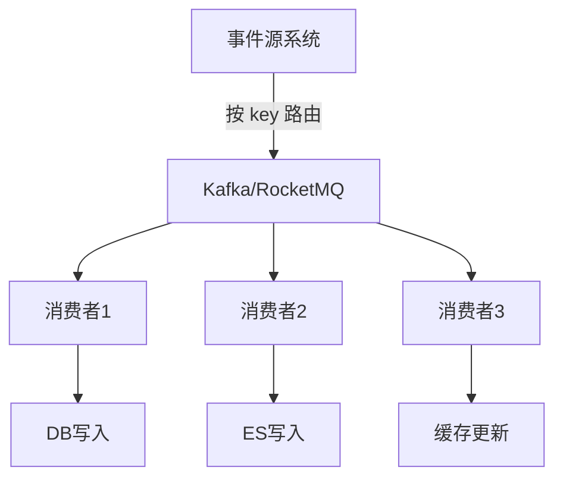

**关键点**：
- 同一聚合根（如订单ID）的事件必须路由到同一 partition
- 下游消费者单线程消费单 partition 可保序
- 跨 partition 顺序不可保，业务需容忍最终一致

## 十三、消息去重模式

### 13.1 幂等消费

```java
// 方案一：数据库唯一索引去重表
@Component
public class IdempotentConsumer {
    @Autowired JdbcTemplate jdbc;
    
    public void consume(Message msg) {
        try {
            jdbc.update("INSERT INTO consume_log(message_id, status) VALUES(?, 'PROCESSING')", 
                msg.getId());
            // 正常业务处理
            processMessage(msg);
            jdbc.update("UPDATE consume_log SET status='DONE' WHERE message_id=?", msg.getId());
        } catch (DuplicateKeyException e) {
            // 重复消费，跳过
            log.info("Duplicate message: {}", msg.getId());
        }
    }
}

// 方案二：Redis SETNX 去重
public boolean tryAcquire(String messageId) {
    String key = "mq:dedup:" + messageId;
    return redis.setIfAbsent(key, "1", Duration.ofHours(24));
}
```

### 13.2 去重表设计

| 字段 | 类型 | 说明 |
|------|------|------|
| message_id | VARCHAR(64) UK | 消息唯一标识 |
| status | VARCHAR(20) | PROCESSING/DONE/FAILED |
| retry_count | INT | 重试次数 |
| create_time | DATETIME | 创建时间 |
| update_time | DATETIME | 最后更新时间 |

## 十四、请求-应答模式（Request-Reply over MQ）

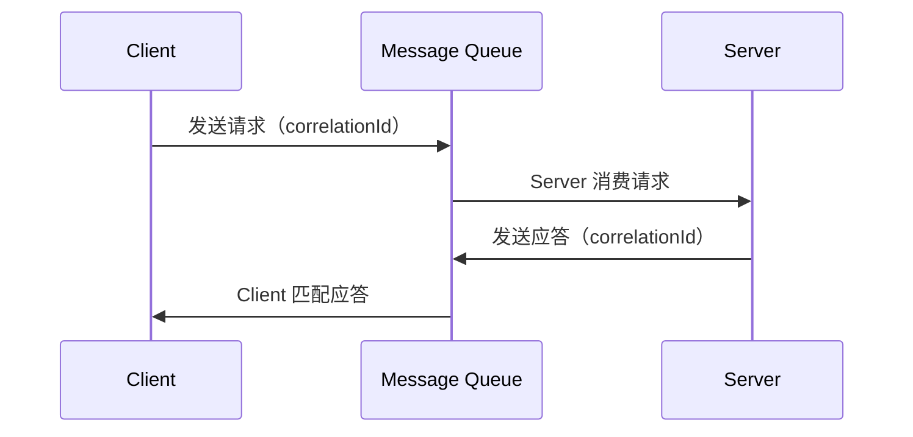

```java
// 客户端：发送请求并等待应答
public Object sendAndReceive(Object request, Duration timeout) {
    String correlationId = UUID.randomUUID().toString();
    // 发送请求到 request queue
    rabbitTemplate.convertAndSend("request-queue", request, msg -> {
        msg.getMessageProperties().setCorrelationId(correlationId);
        return msg;
    });
    // 监听 reply queue，用 correlationId 匹配
    return rabbitTemplate.receiveAndConvert("reply-queue", timeout.toMillis());
}
```

## 十五、消息优先级

```text
Kafka：原生不支持优先级（消息追加到 log 尾部）
  解决：多个 topic 代表不同优先级，消费者按优先级消费

RocketMQ：支持优先级队列（队列级别优先级）
  发送时设置 msg.setPriority(level)
  消费端按优先级调度

RabbitMQ：原生支持（x-max-priority 属性）
  声明队列时设置：arguments.put("x-max-priority", 10)
  消息发送时设置 priority 字段
```

```json
// RabbitMQ 优先级队列声明
{
  "durable": true,
  "arguments": {
    "x-max-priority": 10,
    "x-queue-type": "quorum"
  }
}
```

## 十六、消息 TTL（Time-To-Live）

```text
消息 TTL = 消息在队列中的最大存活时间，超时则被丢弃或进入死信队列

Kafka：通过 log.retention.hours/bytes 控制（topic 级别）
  // 消息保留 7 天或 1GB
  log.retention.hours=168
  log.retention.bytes=1073741824

RocketMQ：消息级别 TTL
  msg.setDeliverTimeMs(System.currentTimeMillis() + 3600_000); // 延迟 1 小时投递

RabbitMQ：消息 TTL 或队列 TTL
  // 消息级别
  AMQP.BasicProperties props = new AMQP.BasicProperties.Builder()
      .expiration("60000") // 60 秒
      .build();
  // 队列级别
  arguments.put("x-message-ttl", 60000);
```

## 十七、死信队列（DLQ）模式

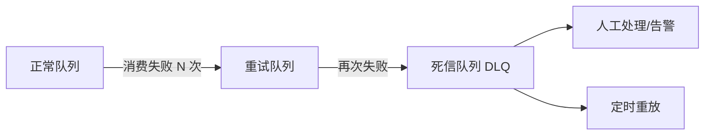

**DLQ 设计要点**：

| 要点 | 说明 |
|------|------|
| 失败计数 | 消息属性中携带失败次数 |
| 退避策略 | 指数退避：1s → 5s → 30s → 5min |
| 最大重试 | 超过阈值进 DLQ（RocketMQ 默认 16 次） |
| 保留信息 | 保留原始 payload + 失败原因 |
| 监控告警 | DLQ 堆积量 > 阈值则告警 |
| 重放机制 | 修复后从 DLQ 重新投递到正常队列 |

## 十八、MQ 在 Event Sourcing 中的应用

```text
Event Sourcing = 状态变更以事件形式持久化，而非直接修改状态

写入流程：
1. 命令（Command）到达
2. 验证命令合法性
3. 生成领域事件
4. 事件持久化到 Event Store（MQ）
5. 事件投影（Projection）更新读模型

读取流程：
1. 查询读模型（CQRS 读侧）
2. 读模型 = 事件流的物化视图

MQ 在 Event Sourcing 中的角色：
- 事件持久化：Kafka 作为 Event Store（append-only log）
- 事件分发：消费者订阅事件流更新读模型
- 事件重放：Kafka 支持按 offset 重放事件
- 事件溯源：通过事件重建聚合根状态
```

## 十九、MQ 容量规划公式

```text
容量规划核心公式：

1. 吞吐需求：
   消息生产速率 = QPS × 每条消息大小
   消息消费速率 = QPS × 处理延迟

2. 存储需求：
   存储 = 消息速率 × 保留时间 × 副本数 × 安全系数
   例：10000 msg/s × 1KB × 7天 × 3副本 × 1.5 = ~3TB

3. 带宽需求：
   生产带宽 = 消息速率 × 消息大小
   消费带宽 = 消息速率 × 消息大小 × 消费者数

4. 分区/队列数：
   Kafka 分区数 ≥ max(消费者数, 目标吞吐 / 单分区吞吐)
   RocketMQ 队列数 ≥ 消费者数（每个消费者分配至少一个队列）
```

| 指标 | Kafka 计算 | RocketMQ 计算 |
|------|-----------|---------------|
| 分区/队列数 | max(消费者数, 目标TPS/单分区TPS) | max(消费者数, 目标TPS/单队列TPS) |
| Broker 数 | 分区数 × 副本数 / 每Broker分区数 | broker 数 ≥ 副本数 |
| 磁盘 | 消息速率 × 保留时间 × 副本数 | 消息速率 × 保留时间 × 副本数 |
| 内存 | 分区数 × segment 缓冲 | CommitLog 缓冲 + ConsumeQueue 缓存 |
| 网络 | 生产带宽 + 消费带宽 × 消费者数 | 生产带宽 + 消费带宽 × 消费者数 |

---

## 二十二、幂等消费模式

### 22.1 幂等方案对比

| 方案 | 实现 | 优点 | 缺点 |
|------|------|------|------|
| 唯一ID+去重表 | 消息带ID，DB去重 | 简单可靠 | 增加DB压力 |
| Redis SET | `SET msg_id 1 NX EX` | 高性能 | 需维护过期 |
| 业务天然幂等 | 更新操作（set not add） | 无额外成本 | 只适用部分场景 |
| 状态机 | 订单状态流转 | 精确控制 | 实现复杂 |

```sql
-- 去重表实现
CREATE TABLE msg_dedup (
  msg_id VARCHAR(64) PRIMARY KEY,
  consumer_group VARCHAR(64),
  consumed_at TIMESTAMP DEFAULT CURRENT_TIMESTAMP,
  INDEX idx_expire (consumed_at)
);

-- 消费时检查
INSERT INTO msg_dedup (msg_id, consumer_group) VALUES ('msg_123', 'order-group');
-- 若插入成功 → 处理消息；若重复 → 跳过
```

## 二十三、延迟消息与定时任务

| 场景 | 方案 | 延迟精度 |
|------|------|----------|
| 订单超时关闭 | RocketMQ 延迟消息 | 秒级 |
| 定时报告生成 | quartz + DB 调度 | 分钟级 |
| 优惠券到期 | Kafka + 延迟 topic | 分钟级 |
| 复杂 DAG 调度 | Elastic-Job/XXL-JOB | 秒级 |

## 二十四、correlationId 分布式追踪

```java
// 生产端设置 correlationId
String correlationId = UUID.randomUUID().toString();
Message msg = MessageBuilder.withPayload(payload)
    .setHeader("correlationId", correlationId)
    .setHeader("timestamp", System.currentTimeMillis())
    .build();
kafkaTemplate.send("order-topic", msg);

// 消费端提取
@KafkaListener(topics = "order-topic")
public void consume(ConsumerRecord<String, String> record) {
    String correlationId = record.headers().lastHeader("correlationId").value();
    MDC.put("correlationId", correlationId);
    // 处理消息...
    log.info("Message processed", correlationId);
}
```

## 二十五、消费积压应急扩容

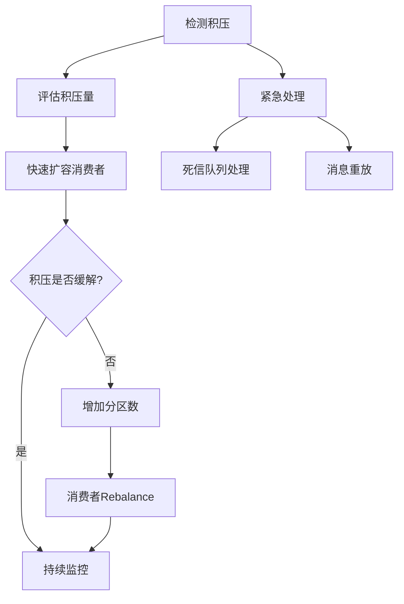

| 等级 | 积压量 | 处理方式 |
|------|--------|----------|
| 轻微 | <1万条 | 自动扩容消费者 |
| 中等 | 1~10万条 | 手动扩容+提升消费线程 |
| 严重 | 10~100万条 | 增加分区+消费者 |
| 紧急 | >100万条 | 停止生产+紧急扩容+消息重放 |

## 二十六、批量消费性能优化

```java
// 批量消费配置
@KafkaListener(topics = "batch-topic", containerFactory = "batchFactory")
public void batchConsume(List<ConsumerRecord<String, String>> records) {
    // 批量处理：减少网络往返
    List<Entity> entities = records.stream()
        .map(this::parse)
        .collect(Collectors.toList());
    batchInsert(entities);  // 批量写入DB
}

// 批量配置
@Bean
public ConcurrentKafkaListenerContainerFactory<String, String> batchFactory() {
    ConcurrentKafkaListenerContainerFactory<String, String> factory =
        new ConcurrentKafkaListenerContainerFactory<>();
    factory.setBatchListener(true);
    factory.getConsumerProperties().setMaxPollRecords(500);
    return factory;
}
```

## 二十七、容量规划公式汇总

| 指标 | 计算公式 |
|------|----------|
| Broker 数 | `ceil(目标TPS / 单Broker TPS) × 副本因子` |
| 分区数 | `max(消费者数, 目标TPS / 单分区TPS)` |
| 磁盘容量 | `消息速率 × 消息大小 × 保留时间 × 副本数 × 1.5` |
| 内存 | `分区数 × segment大小 + 消费缓冲` |
| 带宽 | `(生产TPS + 消费TPS × 消费者数) × 消息大小` |
| 消费者数 | `min(分区数, 目标TPS / 单消费者TPS)` |

## 二十八、消息队列监控告警

### 28.1 核心监控指标

| 指标 | 说明 | 告警阈值 |
|------|------|----------|
| 消费延迟(Lag) | 消费者积压量 | >10000条 |
| 消息丢失率 | 生产/消费丢失 | >0.01% |
| Broker负载 | CPU/内存/磁盘 | >80% |
| 分区分布 | 分区是否均衡 | 不均衡度>20% |

### 28.2 监控工具

```text
Kafka 监控：
  - Kafka Manager (Yahoo)
  - Confluent Control Center
  - Prometheus + JMX Exporter
  - Grafana Dashboard

RocketMQ 监控：
  - RocketMQ Dashboard
  - Prometheus + RocketMQ Exporter
  - Grafana Dashboard
```

## 二十九、消息幂等消费三方案对比

| 方案 | 实现 | 优点 | 缺点 | 适用场景 |
|------|------|------|------|---------|
| 去重表 | 消息带唯一 ID，DB 唯一索引 | 简单可靠 | 增加 DB 压力 | 通用（推荐） |
| 天然幂等 | 更新操作（set not add） | 无额外成本 | 只适用部分场景 | 状态更新 |
| 事务消息 | RocketMQ 半消息+本地事务 | 发端事务一致 | 实现复杂 | 分布式事务 |

```
去重表设计：
  message_id VARCHAR(64) PRIMARY KEY
  consumer_group VARCHAR(64)
  consumed_at TIMESTAMP

  消费时：INSERT INTO msg_dedup(message_id) VALUES(?)
  若插入成功 → 处理消息
  若重复 → 跳过（DuplicateKeyException）

Redis SETNX 去重：
  SET mq:dedup:{message_id} 1 NX EX 86400
  设置 24 小时 TTL（覆盖重试窗口）

状态机幂等：
  订单状态流转：CREATED → PAID → SHIPPED → COMPLETED
  拒绝逆向/重复流转（如 PAID 不能重复扣款）
```

## 三十、延迟消息在订单超时中的完整实现

### 30.1 RocketMQ 定时消息 + 补偿

```
订单超时关闭流程：

  1. 用户下单 → 发送延迟消息（30 分钟后投递）
     msg.setDeliverTimeMs(System.currentTimeMillis() + 30*60*1000);

  2. 30 分钟后 Consumer 收到消息
     检查订单状态：
       若 still CREATED → 关闭订单 + 释放库存
       若 already PAID → 忽略（不关闭）

  3. 补偿机制（兜底）
     定时任务扫描：created_at < NOW() - 30min AND status = 'CREATED'
     → 关闭超时订单

  4. 延迟级别配置
     RocketMQ 默认 18 级：1s/5s/10s/30s/1m/2m/3m/4m/5m/6m/7m/8m/9m/10m/20m/30m/1h/2h
     精确任意时间：时间轮或外部调度
```

### 30.2 Kafka 延迟消息实现

```
Kafka 原生不支持延迟消息，需要外部方案：

  方案一：RocketMQ 延迟消息（推荐）
  方案二：Kafka + 时间轮（HashedWheelTimer）
  方案三：Kafka + 延迟 topic（消费者 sleep，不推荐）

  最佳实践：延迟消息用 RocketMQ，其他用 Kafka
```

## 三十一、请求应答模式的 correlationId 设计

```java
// correlationId = 请求-应答匹配的唯一标识

// 生产端：发送请求并设置 correlationId
String correlationId = UUID.randomUUID().toString();
Message msg = MessageBuilder.withPayload(payload)
    .setHeader("correlationId", correlationId)
    .setHeader("timestamp", System.currentTimeMillis())
    .build();
kafkaTemplate.send("request-topic", msg);

// 消费端：提取 correlationId 并透传到应答
@KafkaListener(topics = "request-topic")
public void consume(ConsumerRecord<String, String> record) {
    String correlationId = record.headers().lastHeader("correlationId").value();
    // 处理请求...
    // 发送应答（带同一 correlationId）
    Message reply = MessageBuilder.withPayload(result)
        .setHeader("correlationId", correlationId)
        .build();
    kafkaTemplate.send("reply-topic", reply);
}

// 客户端：匹配应答
// 用 correlationId 关联请求和应答，支持异步超时
```

## 三十二、消息积压应急扩容方案

```
消息积压百万级治理 SOP：

  1. 先止血：确认消费侧是否宕机/慢
     看 lag（kafka-consumer-groups --describe）

  2. 快速扩容消费者
     Kafka 受分区数限制，分区不够先扩分区
     RocketMQ 增 queue 并扩容消费组

  3. 提升消费并发
     线程池 / 批量消费 max.poll.records 调大
     消费逻辑降级（先落库/标记，重计算异步补）

  4. 旁路追平（积压极大）
     新建临时 topic + 更多分区
     写脚本把旧 topic 积压搬运到新 topic
     多实例并发消费，追平后切回

  5. 防复发
     消费幂等 + 监控 lag 告警
     大促前压测消费能力留 2x 余量
```

| 等级 | 积压量 | 处理方式 |
|------|--------|---------|
| 轻微 | <1万条 | 自动扩容消费者 |
| 中等 | 1~10万条 | 手动扩容+提升消费线程 |
| 严重 | 10~100万条 | 增加分区+消费者 |
| 紧急 | >100万条 | 停止生产+紧急扩容+消息重放 |

## 三十三、消息体大小对性能的影响

| 维度 | 小消息（<1KB） | 中消息（1KB~100KB） | 大消息（>100KB） |
|------|---------------|-------------------|----------------|
| 批量吞吐 | 高（batch 聚合好） | 中 | 低（序列化开销大） |
| 网络开销 | 低 | 中 | 高 |
| 内存占用 | 低 | 中 | 高（可能 OOM） |
| 压缩效果 | 差（压缩率低） | 中 | 好（压缩率高） |

```
最佳实践：
  批量消费：多条小消息合并为一批处理
  消息压缩：大消息开启 gzip/snappy 压缩
  消息体大小：控制在 10KB 以内
  大对象：走对象存储，消息只传引用
  批量 vs 单条：batch 吞吐 > 单条 × N
```

## 三十四、消息中间件容量规划公式

```
容量规划核心公式：

  1. 吞吐需求：
     消息生产速率 = QPS × 每条消息大小
     消息消费速率 = QPS × 处理延迟

  2. 存储需求：
     存储 = 消息速率 × 保留时间 × 副本数 × 安全系数
     例：10000 msg/s × 1KB × 7天 × 3副本 × 1.5 = ~3TB

  3. 带宽需求：
     生产带宽 = 消息速率 × 消息大小
     消费带宽 = 消息速率 × 消息大小 × 消费者数

  4. 分区/队列数：
     Kafka 分区数 ≥ max(消费者数, 目标吞吐 / 单分区吞吐)
     RocketMQ 队列数 ≥ 消费者数
```

| 指标 | 计算公式 |
|------|----------|
| Broker 数 | `ceil(目标TPS / 单Broker TPS) × 副本因子` |
| 分区数 | `max(消费者数, 目标TPS / 单分区TPS)` |
| 磁盘容量 | `消息速率 × 消息大小 × 保留时间 × 副本数 × 1.5` |
| 内存 | `分区数 × segment大小 + 消费缓冲` |
| 带宽 | `(生产TPS + 消费TPS × 消费者数) × 消息大小` |

## 三十五、消息队列最佳实践

## 消息幂等消费深度方案

```
幂等消费方案：

  1. 数据库唯一约束
     ├── 消息表记录 message_id
     ├── 消费前查询是否已存在
     └── 存在则跳过

  2. Redis SETNX
     ├── SET message_id 1 NX EX 3600
     ├── 成功则消费
     └── 失败则跳过

  3. 业务去重
     ├── 订单号去重
     ├── 业务流水号去重
     └── 数据库唯一索引

  4. 乐观锁
     ├── UPDATE ... WHERE version = ?
     └── version 不匹配则跳过
```

```java
// 方案 1：数据库去重
public void consume(Message message) {
    String msgId = message.getMessageId();
    if (messageMapper.exists(msgId)) {
        return; // 已消费，跳过
    }
    try {
        messageMapper.insert(new MessageRecord(msgId, "PROCESSED"));
        processBusiness(message);
    } catch (DuplicateKeyException e) {
        // 并发重复，忽略
    }
}

// 方案 2：Redis 去重
public void consume(Message message) {
    String key = "msg:" + message.getMessageId();
    if (redisTemplate.opsForValue().setIfAbsent(key, "1", 1, TimeUnit.HOURS)) {
        processBusiness(message);
    }
}

// 方案 3：业务幂等
public void createOrder(OrderDTO dto) {
    // 使用订单号作为幂等键
    if (orderMapper.existsByOrderNo(dto.getOrderNo())) {
        return;
    }
    orderMapper.insert(dto);
}
```

## 延迟消息实现方案对比

| 方案 | 实现方式 | 精度 | 适用场景 |
|------|---------|------|---------|
| RocketMQ | 原生延迟消息 | 秒级 | 延迟订单 |
| RabbitMQ | TTL + 死信队列 | 秒级 | 简单延迟 |
| Kafka | 延迟 Topic + 定时消费 | 分钟级 | 大批量 |
| Redis | ZSet + 定时扫描 | 毫秒级 | 高精度 |
| 数据库 | 定时任务扫描 | 秒级 | 低频场景 |

```java
// Redis 延迟消息实现
public void sendDelayedMessage(Message message, long delayMs) {
    String key = "delay:queue";
    long executeTime = System.currentTimeMillis() + delayMs;
    redisTemplate.opsForZSet().add(key, message.toJson(), executeTime);
}

// 定时消费
@Scheduled(fixedRate = 1000)
public void consumeDelayedMessages() {
    String key = "delay:queue";
    long now = System.currentTimeMillis();
    Set<String> messages = redisTemplate.opsForZSet().rangeByScore(key, 0, now);
    for (String msg : messages) {
        processMessage(Message.fromJson(msg));
        redisTemplate.opsForZSet().remove(key, msg);
    }
}
```

## 消息积压应急扩容方案

```
积压应急流程：

  ① 监控告警
     ├── 积压数量 > 阈值
     └── 消费延迟 > 阈值

  ② 快速扩容
     ├── 增加消费者实例
     ├── 增加分区/队列（Kafka）
     └── 增加线程池

  ③ 临时方案
     ├── 跳过非关键消息
     ├── 降级处理
     └── 紧急手动消费

  ④ 根因分析
     ├── 消费者代码 Bug
     ├── 下游依赖超时
     └── 消息格式异常

  ⑤ 恢复
     ├── 修复问题
     ├── 回放消息
     └── 确认积压清零
```

```bash
# Kafka 消费者扩容
# 1. 增加消费者实例（自动 Rebalance）
# 2. 增加分区
kafka-topics.sh --alter --topic my-topic --partitions 16 --bootstrap-server localhost:9092

# RocketMQ 消费者扩容
# 1. 增加消费者实例
# 2. 增加队列数
mqadmin updateTopic -b brokerAddr -t my-topic -n 16
```

## 消息体大小对性能的影响

| 消息大小 | 吞吐量 | 延迟 | 网络开销 | 建议 |
|----------|--------|------|----------|------|
| < 1KB | 高 | 低 | 低 | 小消息 |
| 1-10KB | 中 | 中 | 中 | 正常范围 |
| 10-100KB | 低 | 高 | 高 | 压缩或引用 |
| > 100KB | 极低 | 极高 | 极高 | 避免大消息 |

```
大消息优化：
  ├── 消息压缩（gzip/snappy/lz4）
  ├── 引用模式（消息存 URL，正文存 OSS）
  ├── 分片传输
  └── 异步拉取
```

## 三十五、消息队列最佳实践

| 实践 | 说明 |
|------|------|
| 消息幂等 | 消费端做去重 |
| 消息顺序 | 分区内保证顺序 |
| 消息回溯 | 保留足够时间窗口 |
| 死信队列 | 失败消息单独处理 |
| 消息压缩 | 大消息压缩传输 |
| 批量消费 | 提高消费效率 |
| 延迟消息 | 订单超时/定时任务 |
| 容量规划 | 按公式预留余量 |
