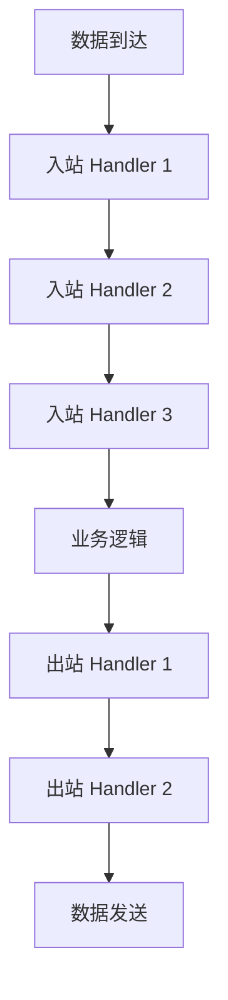
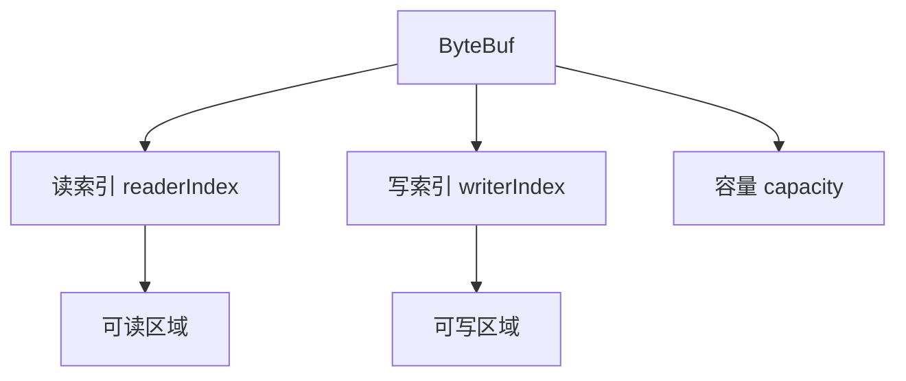
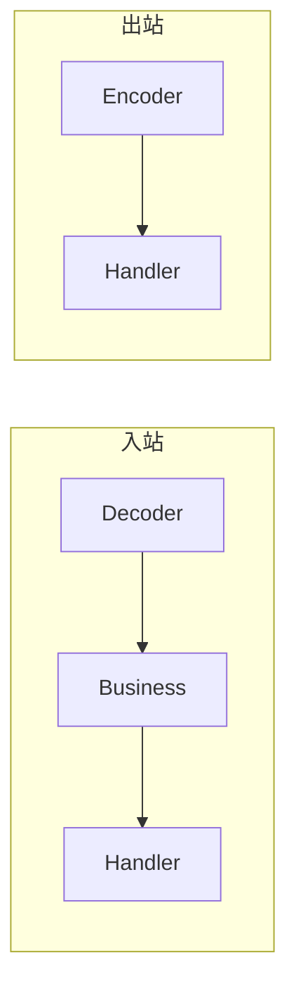
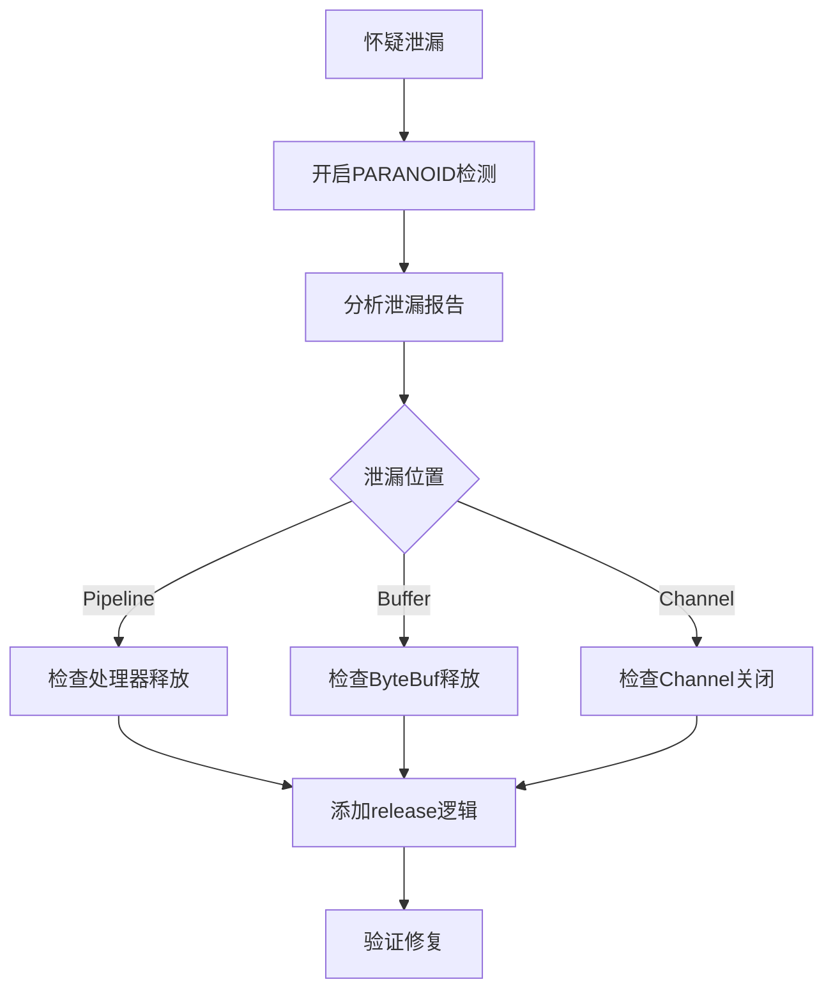
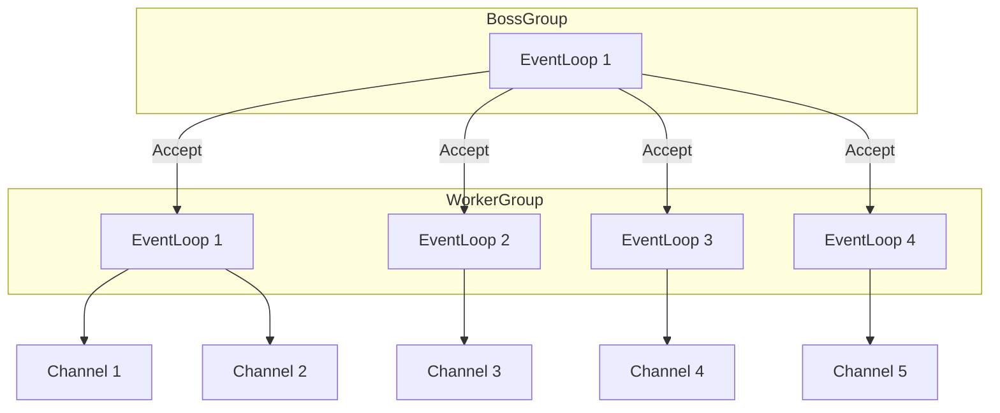

# Netty 网络编程深入（Reactor / ByteBuf / Pipeline / 内存池 / 生产调优）

> Netty 是 **Java 网络编程的事实标准**：Dubbo/gRPC/Kafka 客户端/RocketMQ/Redis 客户端（Lettuce）底层全部基于 Netty。核心价值：**Reactor 多线程模型 + 零拷贝 + 内存池 + Pipeline 链式处理**，用极少线程处理海量并发连接。本篇按「架构 → 核心组件 → 关键机制 → 生产调优」拆解。

---

## 一、Netty 整体架构

```
                    ┌─────────────────────────────────┐
                    │         Netty 线程模型           │
                    ├─────────────────────────────────┤
                    │  Boss Group（Accept 线程）        │
                    │    └─ 接受新连接 → 注册到 Worker  │
                    │                                  │
                    │  Worker Group（IO 线程）          │
                    │    └─ 读写数据 → Pipeline 处理    │
                    └─────────────────────────────────┘

应用层：  Bootstrap / ServerBootstrap（启动引导）
通道层：  Channel（连接抽象）+ ChannelPipeline（处理链）
缓冲层：  ByteBuf（零拷贝缓冲区）
协议层：  编解码器（Codec）
```

### 1.1 Reactor 模型

| 模型 | 说明 | Netty 实现 |
|------|------|-----------|
| 单 Reactor 单线程 | 一个线程处理所有 IO | 不推荐（阻塞） |
| **单 Reactor 多线程** | Reactor 线程处理 IO，业务交给线程池 | WorkerGroup |
| **主从 Reactor 多线程** | Boss 处理 Accept，Worker 处理 IO | BossGroup + WorkerGroup |
| Proactor | 异步 IO（AIO） | Linux 下不支持，Netty 未采用 |

**Netty 默认是主从 Reactor 多线程模型**：BossGroup（默认1线程）处理 Accept，WorkerGroup（默认 CPU核数×2 线程）处理 IO 读写。

### 1.2 启动流程

```java
// 服务端启动
ServerBootstrap b = new ServerBootstrap();
b.group(bossGroup, workerGroup)
 .channel(NioServerSocketChannel.class)  // NIO 实现
 .childHandler(new ChannelInitializer<SocketChannel>() {
     @Override
     protected void initChannel(SocketChannel ch) {
         ch.pipeline()
           .addLast(new IdleStateHandler(60, 30, 0))  // 心跳检测
           .addLast(new LengthFieldBasedFrameDecoder(1024, 0, 4))  // 粘包拆包
           .addLast(new ProtobufDecoder(msg))
           .addLast(new BusinessHandler());  // 业务逻辑
     }
 })
 .option(ChannelOption.SO_BACKLOG, 128)
 .childOption(ChannelOption.SO_KEEPALIVE, true);
```

---

## 二、核心组件

### 2.1 Channel（通道）

```
Channel = 网络连接的抽象（Socket 的封装）

核心操作：
  bind()     — 绑定端口
  connect()  — 连接远端
  read()     — 注册读事件
  write()    — 写数据
  flush()    — 刷新写缓冲
  close()    — 关闭连接

常用实现：
  NioServerSocketChannel  — 服务端 NIO
  NioSocketChannel       — 客户端 NIO
  EpollServerSocketChannel — Linux epoll（性能更好）
```

### 2.2 ByteBuf（零拷贝缓冲区）

```
ByteBuf vs Java NIO ByteBuffer：

| 维度 | ByteBuf | ByteBuffer |
|------|---------|-----------|
| 读写指针 | 双指针（readerIndex/writerIndex） | 单指针（flip 切换） |
| 扩容 | 自动扩容 | 固定大小 |
| 零拷贝 | slice/composite/wrap | 无 |
| 内存池 | 支持（PooledByteBufAllocator） | 无 |
| 引用计数 | 支持（ReferenceCounted） | 无 |

内存分配：
  堆内（Heap）：分配 JVM 堆内存，GC 管理，简单但多一次拷贝
  堆外（Direct）：分配 OS 内存，零拷贝，但需要手动释放
  池化（Pooled）：复用内存块，减少 GC 压力（默认）
```

### 2.3 Pipeline 与 ChannelHandler

```
Pipeline = 双向链表，每个节点是一个 ChannelHandler

入站（Inbound）处理链：
  数据读取 → 解码 → 业务逻辑 → 响应

出站（Outbound）处理链：
  业务逻辑 → 编码 → 数据写入

Handler 类型：
  ChannelInboundHandler   — 处理入站事件（读数据/连接建立）
  ChannelOutboundHandler  — 处理出站事件（写数据/连接）
  ChannelDuplexHandler    — 同时处理入站和出站
```

### 2.4 EventLoop（事件循环）

```
EventLoop = 单线程事件循环（一个线程处理一组 Channel 的所有 IO）

一个 Worker EventLoop 绑定多个 Channel：
  EventLoop 线程 → 轮询注册在其上的 Channel 的 IO 事件
  → 一个 Channel 的所有事件都在同一个线程中处理（无需加锁）

任务调度：
  eventLoop.schedule(task, delay, TimeUnit)  — 延迟任务
  eventLoop.execute(task)                     — 立即执行
```

---

## 三、关键机制

### 3.1 粘包与拆包

| 原因 | 说明 |
|------|------|
| TCP 粘包 | 发送方多次 write 合并为一次发送（Nagle 算法） |
| TCP 拆包 | 发送数据大于 MSS 时拆分 |
| 缓冲区 | 应用层多次写入缓冲区，一次读出 |

**解决方案（解码器）**：

| 解码器 | 原理 |
|--------|------|
| FixedLengthFrameDecoder | 固定长度 |
| LineBasedFrameDecoder | 换行分隔 |
| LengthFieldBasedFrameDecoder | 长度字段（最常用） |
| DelimiterBasedFrameDecoder | 自定义分隔符 |
| ProtobufDecoder | Protobuf 协议（自带长度） |

### 3.2 零拷贝

```
Netty 零拷贝的三种实现：

1. compositeByteBuf：合并多个 ByteBuf（逻辑合并，不拷贝数据）
2. slice：ByteBuf 切片（共享底层内存）
3. FileRegion + transferTo：文件传输（绕过用户态，直接 DMA 拷贝）

传统文件传输（4次拷贝）：
  磁盘 → 内核缓冲区 → 用户缓冲区 → Socket 缓冲区 → 网卡
  
Netty FileRegion（3次拷贝）：
  磁盘 → 内核缓冲区 → Socket 缓冲区 → 网卡（绕过用户态）
```

### 3.3 内存池（PooledByteBufAllocator）

```
Netty 内存池 = Arena + Chunk + Page + Subpage

Arena（区）：每个线程一个本地 Arena（减少锁竞争）
  → 线程先从本地 Arena 分配，本地不够从全局 Arena 偷取

Chunk（块）：一大块连续内存（如 16MB）
  → 按 Page 切分（默认 8KB/页）
  → 小对象按 Subpage 切分（如 8B/16B/32B...）

分配策略：
  小对象（< 页大小）：从 Subpage 分配（精确匹配，减少碎片）
  大对象（≥ 页大小）：从 Page 分配（按需分配）
  超大对象（> 16MB）：直接分配堆外内存（不池化）

效果：减少 90%+ 的内存分配与 GC 压力
```

### 3.4 心跳与空闲检测

```
IdleStateHandler（空闲检测）：
  readerIdleTime：读空闲超时（服务端检测客户端是否存活）
  writerIdleTime：写空闲超时（客户端检测服务端是否存活）
  allIdleTime：读写都空闲

实现：
  定时检测 Channel 是否有读/写事件
  → 超时触发 IdleStateEvent
  → 自定义 Handler 处理（如发心跳/断开连接）

典型配置：
  IdleStateHandler(60, 30, 0)  — 60s 读空闲发心跳，30s 写空闲发心跳
```

---

## 四、编解码器

### 4.1 常用编解码器

| 编解码器 | 协议 | 适用 |
|----------|------|------|
| StringDecoder/StringEncoder | 字符串 | 简单文本 |
| ProtobufDecoder/Encoder | Protobuf | 高性能二进制（Dubbo/gRPC） |
| MarshallingDecoder/Encoder | JBoss Marshalling | Java 序列化（兼容性好） |
| HttpRequestDecoder/Encoder | HTTP | Web 服务 |
| LengthFieldBasedFrameDecoder | 自定义 | 通用私有协议 |

### 4.2 自定义协议设计

```java
// 典型私有协议结构
+--------+--------+---------+--------+----------+
| 魔数    | 版本   | 序列化  | 消息类型 | 数据长度  |
| 4 bytes | 1 byte | 1 byte  | 1 byte  | 4 bytes  |
+--------+--------+---------+--------+----------+
| 数据体                                                    |
+----------------------------------------------------------+

解码器实现：
  1. 读魔数校验
  2. 读版本号
  3. 读序列化方式
  4. 读消息类型
  5. 读数据长度
  6. 按长度读数据体
  7. 反序列化为 Java 对象
```

---

## 五、生产调优

### 5.1 线程模型调优

| 参数 | 建议 |
|------|------|
| BossGroup 线程数 | 1（Accept 事件不多） |
| WorkerGroup 线程数 | CPU 核数 × 2（IO 密集） |
| 业务线程池 | 独立线程池（避免阻塞 Worker） |

### 5.2 ChannelOption 调优

| 参数 | 说明 | 建议 |
|------|------|------|
| SO_BACKLOG | Accept 队列大小 | 128~1024 |
| SO_KEEPALIVE | TCP 心跳 | true |
| SO_REUSEADDR | 地址复用 | true |
| TCP_NODELAY | 禁用 Nagle | true（低延迟场景） |
| SO_SNDBUF / SO_RCVBUF | 发送/接收缓冲区 | 按业务调整（默认 128KB） |
| WRITE_BUFFER_WATER_MARK | 写缓冲水位 | 高低水位控制背压 |

### 5.3 内存调优

| 参数 | 说明 |
|------|------|
| -Dio.netty.allocator.numDirectArenas | 直接内存 Arena 数 |
| -Dio.netty.allocator.pageSize | 页大小（默认 8192） |
| -Dio.netty.allocator.maxOrder | 最大阶（默认 11，即 2^11 × 8KB = 16MB chunk） |
| -Dio.netty.leakDetection.level | 内存泄漏检测（SIMPLE/ADVANCED/DISABLED） |

### 5.4 常见问题

| 问题 | 原因 | 解决 |
|------|------|------|
| 内存泄漏 | ByteBuf 未 release | 开启 leakDetection + try-finally 释放 |
| 连接数暴增 | 未设置读空闲检测 | IdleStateHandler + 超时断开 |
| 写缓冲堆积 | 下游消费慢 | 设置 WRITE_BUFFER_WATER_MARK 背压 |
| GC 停顿 | 大量小对象分配 | 用 PooledByteBufAllocator（默认） |
| 线程饿死 | 业务逻辑阻塞 Worker | 业务逻辑提交到独立线程池 |

---

## 六、Netty 在中间件中的应用

| 中间件 | Netty 用途 |
|--------|-----------|
| Dubbo | RPC 通信层（NettyClient/NettyServer） |
| gRPC-Java | HTTP/2 传输层 |
| RocketMQ | Broker/Producer/Consumer 通信 |
| Kafka | 新版客户端（Netty 替代 Java NIO） |
| Elasticsearch | Transport 通信 |
| Redis（Lettuce） | Redis 客户端 |
| ZooKeeper | NIO→Netty（3.5+） |
| Sentinel | 数据传输 |

---

## 五、Netty ByteBuf 内部实现

### 5.1 ByteBuf 内存布局

```
ByteBuf 内存结构：
  ┌──────────────────────────────────────────────┐
  │  已读区（0 ~ readerIndex）                      │
  ├──────────────────────────────────────────────┤
  │  可读区（readerIndex ~ writerIndex）            │
  ├──────────────────────────────────────────────┤
  │  可写区（writerIndex ~ capacity）               │
  ├──────────────────────────────────────────────┤
  │  最大容量区（capacity ~ maxCapacity）            │
  └──────────────────────────────────────────────┘

双指针设计：
  readerIndex → 读位置
  writerIndex → 写位置
  无需 flip() 操作（与 Java NIO ByteBuffer 区别）
```

### 5.2 ByteBuf 类型

| 类型 | 说明 | 适用场景 |
|------|------|----------|
| HeapByteBuf | JVM 堆内存 | 简单场景，GC 管理 |
| DirectByteBuf | OS 直接内存 | 零拷贝，高性能 |
| PooledByteBuf | 内存池化 | 高并发场景（默认） |
| UnpooledByteBuf | 非池化 | 低频使用 |
| CompositeByteBuf | 组合缓冲区 | 多 Buffer 合并（零拷贝） |
| SlicedByteBuf | 切片缓冲区 | 共享内存（零拷贝） |

### 5.3 引用计数机制

```java
// 引用计数管理
ByteBuf buf = Unpooled.buffer();
try {
    // 增加引用计数
    buf.retain();
    
    // 使用 ByteBuf
    // ...
    
} finally {
    // 释放引用计数
    buf.release();
}

// 引用计数规则：
//   创建时 count=1
//   retain() → count++
//   release() → count-- → count=0 时释放内存
//   防止内存泄漏：try-finally 确保 release
```

---

## 六、Netty Channel Pipeline 详解

### 6.1 Pipeline 处理流程



### 6.2 Handler 类型详解

| Handler 类型 | 事件 | 典型用途 |
|--------------|------|----------|
| ChannelInboundHandlerAdapter | channelRead | 接收数据 |
| ChannelOutboundHandlerAdapter | write | 发送数据 |
| ChannelDuplexHandler | 两者 | 编解码器 |
| ChannelInboundHandler | exceptionCaught | 异常处理 |
| IdleStateHandler | userEventTriggered | 空闲检测 |
| LengthFieldBasedFrameDecoder | channelRead | 粘包拆包 |

### 6.3 Pipeline 操作方法

```java
// 添加 Handler
pipeline.addLast("decoder", new StringDecoder());
pipeline.addLast("encoder", new StringEncoder());
pipeline.addLast("business", new BusinessHandler());

// 插入 Handler
pipeline.addFirst("first", new FirstHandler());
pipeline.addLast("last", new LastHandler());
pipeline.addBefore("business", "auth", new AuthHandler());
pipeline.addAfter("business", "log", new LogHandler());

// 移除 Handler
pipeline.remove("decoder");

// 替换 Handler
pipeline.replace("decoder", "newDecoder", new NewDecoder());
```

### 6.4 入站与出站事件传播

```java
// 入站事件传播（从 Head 到 Tail）
ctx.fireChannelRead(msg);  // 传播到下一个入站 Handler

// 出站事件传播（从 Tail 到 Head）
ctx.write(msg);  // 传播到下一个出站 Handler

// 终止传播
// 不调用 fireXxx() 即可终止
```

---

## 七、Netty EventLoop 事件循环模型

### 7.1 EventLoop 工作流程

```
EventLoop 单线程事件循环：

while (true) {
    // 1. 阻塞等待 IO 事件
    int readyChannels = selector.select(timeout);
    
    // 2. 处理就绪的 IO 事件
    for (SelectionKey key : selector.selectedKeys()) {
        if (key.isAcceptable()) { /* Accept 新连接 */ }
        if (key.isReadable()) { /* 读数据 */ }
        if (key.isWritable()) { /* 写数据 */ }
    }
    
    // 3. 处理所有待执行的任务
    runAllTasks();
}
```

### 7.2 EventLoop 与 Channel 绑定

```
EventLoopGroup（线程池）
  ├── EventLoop-1 → Channel-1, Channel-2, Channel-3
  ├── EventLoop-2 → Channel-4, Channel-5, Channel-6
  ├── EventLoop-3 → Channel-7, Channel-8, Channel-9
  └── EventLoop-4 → Channel-10, Channel-11, Channel-12

一个 Channel 始终绑定一个 EventLoop：
  → 所有事件在同一线程中处理（无需加锁）
  → 减少上下文切换开销
```

### 7.3 EventLoop 任务调度

```java
// 延迟任务
eventLoop.schedule(() -> {
    System.out.println("延迟 5 秒执行");
}, 5, TimeUnit.SECONDS);

// 定时任务
eventLoop.scheduleAtFixedRate(() -> {
    System.out.println("每 10 秒执行一次");
}, 0, 10, TimeUnit.SECONDS);

// 立即执行
eventLoop.execute(() -> {
    System.out.println("立即执行");
});
```

---

## 八、Netty 零拷贝详解

### 8.1 零拷贝实现方式

| 方式 | 说明 | 性能提升 |
|------|------|----------|
| CompositeByteBuf | 逻辑合并多个 Buffer | 避免数据拷贝 |
| ByteBuf.slice | 切片共享内存 | 避免数据拷贝 |
| FileRegion.transferTo | 文件传输（DMA） | 绕过用户态 |
| WebSocket 零拷贝 | 直接转发 Frame | 避免解码再编码 |

### 8.2 传统文件传输 vs 零拷贝

```
传统文件传输（4 次拷贝）：
  1. 磁盘 → 内核缓冲区（DMA 拷贝）
  2. 内核缓冲区 → 用户缓冲区（CPU 拷贝）
  3. 用户缓冲区 → Socket 缓冲区（CPU 拷贝）
  4. Socket 缓冲区 → 网卡（DMA 拷贝）

Netty 零拷贝（3 次拷贝）：
  1. 磁盘 → 内核缓冲区（DMA 拷贝）
  2. 内核缓冲区 → 网卡（DMA 拷贝，绕过用户态）
  3. 文件描述符传递（无数据拷贝）

性能：减少 1 次 CPU 拷贝，大文件传输提升显著
```

### 8.3 FileRegion 使用示例

```java
// 零拷贝文件传输
RandomAccessFile file = new RandomAccessFile("data.bin", "r");
FileRegion region = new DefaultFileRegion(
    file.getChannel(), 0, file.length());

ctx.write(region, new VoidChannelPromise());
```

---

## 九、Netty 编解码框架

### 9.1 编解码器类型

| 类型 | 说明 | 示例 |
|------|------|------|
| MessageToByteEncoder | 出站编码 | Object → ByteBuf |
| ByteToMessageDecoder | 入站解码 | ByteBuf → Object |
| MessageToMessageEncoder | 出站转出站 | Object → Object |
| MessageToMessageDecoder | 入站转入站 | Object → Object |
| ByteToMessageCodec | 编解码一体 | ByteBuf ↔ Object |
| MessageToMessageCodec | 转码一体 | Object ↔ Object |

### 9.2 自定义编解码器示例

```java
// 编码器：对象 → ByteBuf
public class MyEncoder extends MessageToByteEncoder<MyMessage> {
    @Override
    protected void encode(ChannelHandlerContext ctx, MyMessage msg, ByteBuf out) {
        out.writeInt(msg.getType());
        out.writeBytes(msg.getData());
    }
}

// 解码器：ByteBuf → 对象
public class MyDecoder extends ByteToMessageDecoder {
    @Override
    protected void decode(ChannelHandlerContext ctx, ByteBuf in, List<Object> out) {
        if (in.readableBytes() < 8) return; // 等待数据足够
        int type = in.readInt();
        byte[] data = new byte[in.readableBytes()];
        in.readBytes(data);
        out.add(new MyMessage(type, data));
    }
}
```

### 9.3 粘包拆包解决方案

| 解决方案 | 说明 | 适用场景 |
|----------|------|----------|
| 固定长度 | FixedLengthFrameDecoder | 消息长度固定 |
| 分隔符 | DelimiterBasedFrameDecoder | 文本协议（换行） |
| 长度字段 | LengthFieldBasedFrameDecoder | 二进制协议（最常用） |
| 自定义协议 | 继承 ByteToMessageDecoder | 私有协议 |

---

## 十、Netty 连接池

### 10.1 连接池架构

```java
// Netty 连接池实现
GenericKeyedObjectPool<HostPort, Channel> pool = 
    new GenericKeyedObjectPool<>(new ChannelFactory());

// 借用连接
Channel ch = pool.borrowObject(new HostPort("127.0.0.1", 8080));
try {
    // 使用连接发送请求
    ch.writeAndFlush(request).sync();
} finally {
    // 归还连接
    pool.returnObject(new HostPort("127.0.0.1", 8080), ch);
}
```

### 10.2 连接池参数配置

| 参数 | 说明 | 建议值 |
|------|------|--------|
| maxTotal | 最大连接数 | 100~1000 |
| maxPerKey | 每个目标最大连接数 | 10~50 |
| minIdle | 最小空闲连接数 | 5~10 |
| maxIdle | 最大空闲连接数 | 10~20 |
| maxWaitMillis | 获取连接最大等待时间 | 3000ms |
| timeBetweenEvictionRunsMillis | 空闲检测间隔 | 60000ms |
| minEvictableIdleTimeMillis | 空闲驱逐时间 | 300000ms |

### 10.3 连接池健康检查

```java
// 连接健康检查
pool.setTestOnBorrow(true);  // 借用时检查
pool.setTestOnReturn(true);   // 归还时检查
pool.setTestWhileIdle(true);  // 空闲时检查

// 自定义健康检查
pool.setValidator(new KeyedPoolableObjectPool<HostPort, Channel>() {
    @Override
    public boolean validateObject(HostPort key, Channel obj) {
        return obj.isActive() && !obj.isClosing();
    }
});
```

---

## 十一、Netty SSL/TLS 支持

### 11.1 SSL 配置示例

```java
// SSL Context 初始化
SslContext sslCtx = SslContextBuilder.forServer(certFile, keyFile)
    .protocols("TLSv1.3", "TLSv1.2")
    .ciphers(CipherSuite.THREE_DES_EDE_CBC_SHA)
    .build();

// 客户端 SSL
SslContext clientSslCtx = SslContextBuilder.forClient()
    .trustManager(trustCertFile)
    .build();

// Pipeline 中添加 SSL Handler
pipeline.addLast("ssl", sslCtx.newHandler(ctx.alloc()));
pipeline.addLast("http", new HttpServerCodec());
```

### 11.2 SSL 性能优化

| 参数 | 说明 |
|------|------|
| SSL 会话缓存 | 启用 SSLSessionCache 减少握手 |
| TLS 1.3 | 更快的握手（1-RTT） |
| 会话票据 | 避免完整握手 |
| 硬件加速 | 使用 Intel QAT/ARM CE |

---

## 十二、Netty 在 RPC 框架中的应用

### 12.1 Dubbo 中的 Netty

```
Dubbo RPC 调用流程：
  Consumer → NettyClient → 网络 → NettyServer → Provider

Netty 在 Dubbo 中的作用：
  ├── TCP 连接管理（连接池）
  ├── 协议编解码（Dubbo 协议）
  ├── 心跳检测（IdleStateHandler）
  ├── 超时控制（Future）
  └── 序列化（Hessian2/Protobuf）
```

### 12.2 gRPC 中的 Netty

```
gRPC Java 底层：
  gRPC-Java → Netty → HTTP/2

Netty 提供：
  ├── HTTP/2 帧编解码器
  ├── 多路复用（Stream 处理）
  ├── 流控（Flow Control）
  ├── TLS 支持（gRPC over TLS）
  └── 压缩（Message Size）
```

### 12.3 RocketMQ 中的 Netty

```
RocketMQ 通信层：
  Producer/Broker/Consumer → NettyRemotingServer/Client

Netty 提供：
  ├── 异步通信（Future/Promise）
  ├── 协议编解码（RemotingCommand）
  ├── 连接管理（心跳检测）
  ├── 序列化（JSON/Protobuf）
  └── 流控（信号量限流）
```

---

## 十三、Netty 内存泄漏检测

### 13.1 泄漏检测级别

```bash
# 启动参数设置检测级别
-Dio.netty.leakDetection.level=PARANOID  # 最严格（生产不推荐）
-Dio.netty.leakDetection.level=ADVANCED   # 高级检测
-Dio.netty.leakDetection.level=SIMPLE     # 简单检测（默认）
-Dio.netty.leakDetection.level=DISABLED   # 禁用
```

### 13.2 泄漏检测原理

```
Netty 内存泄漏检测：
  每个 ByteBuf 分配时记录堆栈信息
  release() 时检查引用计数
  如果引用计数 > 0 → 输出泄漏警告

警告信息包含：
  泄漏的 ByteBuf 类型
  分配时的堆栈信息
  当前引用计数
  访问的线程
```

### 13.3 常见泄漏场景与解决

| 泄漏场景 | 原因 | 解决 |
|----------|------|------|
| 未 release | ByteBuf 未释放 | try-finally 释放 |
| 重复 release | 多次释放导致异常 | 用 ReferenceCountUtil.releaseOnce |
| 异步未处理 | 异步回调中未释放 | 在回调中释放 |
| 编解码器泄漏 | 编解码器内部未释放 | 检查编解码器实现 |

```java
// 正确的释放方式
ByteBuf buf = ctx.alloc().buffer();
try {
    // 使用 ByteBuf
    buf.writeBytes(data);
    ctx.writeAndFlush(buf);
} finally {
    // 注意：writeAndFlush 会自动 release，这里不需要
    // 但如果写入失败，需要手动 release
}
```

---

## 十四、Netty 高级特性与生产实践

### 14.1 协议解码（LengthFieldBasedFrameDecoder）

```text
LengthFieldBasedFrameDecoder 是处理 TCP 粘包/拆包的核心解码器。

参数说明：
┌──────────────────────┬────────────────────────────────────────────┐
│ 参数                  │ 说明                                        │
├──────────────────────┼────────────────────────────────────────────┤
│ maxFrameLength       │ 最大帧长度（超过则报错）                     │
│ lengthFieldOffset    │ 长度字段在帧中的偏移量                       │
│ lengthFieldLength    │ 长度字段占用的字节数                         │
│ lengthAdjustment     │ 长度字段的调整值                             │
│ initialBytesToStrip  │ 跳过的字节数（解码后不传递）                 │
└──────────────────────┴────────────────────────────────────────────┘
```

```java
// 常见协议解码配置
// 协议格式：[4字节长度][消息体]
new LengthFieldBasedFrameDecoder(
    1024 * 1024,  // maxFrameLength: 1MB
    0,            // lengthFieldOffset: 长度字段从第0字节开始
    4,            // lengthFieldLength: 长度字段占4字节
    0,            // lengthAdjustment: 无调整
    4             // initialBytesToStrip: 跳过4字节长度字段
);

// 协议格式：[2字节类型][4字节长度][消息体]
new LengthFieldBasedFrameDecoder(
    1024 * 1024,  // maxFrameLength
    2,            // lengthFieldOffset: 跳过2字节类型字段
    4,            // lengthFieldLength
    0,            // lengthAdjustment
    6             // initialBytesToStrip: 跳过类型+长度共6字节
);

// 协议格式：[4字节长度][2字节类型][消息体]
new LengthFieldBasedFrameDecoder(
    1024 * 1024,  // maxFrameLength
    0,            // lengthFieldOffset
    4,            // lengthFieldLength
    -2,           // lengthAdjustment: 长度字段包含类型字段（-2调整）
    0             // initialBytesToStrip: 不跳过
);
```

```java
// 自定义协议解码器示例
public class MyProtocolDecoder extends ByteToMessageDecoder {
    private static final int HEADER_LENGTH = 8; // 4字节长度 + 4字节魔数

    @Override
    protected void decode(ChannelHandlerContext ctx, ByteBuf in, List<Object> out) {
        // 1. 检查可读字节数
        if (in.readableBytes() < HEADER_LENGTH) {
            return;
        }

        // 2. 标记读位置（用于回退）
        in.markReaderIndex();

        // 3. 读取长度和魔数
        int length = in.readInt();
        int magic = in.readInt();

        // 4. 验证魔数
        if (magic != 0x12345678) {
            ctx.close();
            return;
        }

        // 5. 检查消息体是否完整
        if (in.readableBytes() < length) {
            in.resetReaderIndex();
            return;
        }

        // 6. 读取消息体
        ByteBuf body = in.readRetainedSlice(length);
        out.add(new MyMessage(magic, body));
    }
}
```

### 14.2 背压处理（Back Pressure）

```text
Netty 背压处理策略：
┌──────────────────────┬────────────────────────────────────────────┐
│ 策略                  │ 实现方式                                    │
├──────────────────────┼────────────────────────────────────────────┤
│ 水位线控制            │ ChannelOutboundBuffer 高/低水位线          │
│ 通道不可写            │ Channel.isWritable() 检查                 │
│ 自适应控制            │ 根据写入速度动态调整                       │
│ 消费者拉取            │ PollingSource（响应式）                    │
└──────────────────────┴────────────────────────────────────────────┘
```

```java
// 水位线配置
ServerBootstrap b = new ServerBootstrap();
b.option(ChannelOption.SO_BACKLOG, 1024);
b.option(ChannelOption.WRITE_BUFFER_WATER_MARK, 
    new WriteBufferWaterMark(32 * 1024, 64 * 1024)); // 低水位32KB，高水位64KB

// 检查通道是否可写
if (channel.isWritable()) {
    channel.writeAndFlush(message);
} else {
    // 暂存消息，等待水位线下降
    pendingMessages.add(message);
}

// 监听可写状态变化
channel.pipeline().addLast(new ChannelInboundHandlerAdapter() {
    @Override
    public void channelWritabilityChanged(ChannelHandlerContext ctx) {
        Channel ch = ctx.channel();
        if (ch.isWritable()) {
            // 水位线下降，继续写入
            flushPendingMessages(ch);
        }
    }
});
```

```java
// 自适应写入控制
public class AdaptiveWriteHandler extends ChannelOutboundHandlerAdapter {
    private final Queue<Runnable> pendingWrites = new ConcurrentLinkedQueue<>();
    private volatile boolean writable = true;

    @Override
    public void write(ChannelHandlerContext ctx, Object msg, ChannelPromise promise) {
        if (writable) {
            ctx.write(msg, promise);
        } else {
            pendingWrites.offer(() -> ctx.write(msg, promise));
        }
    }

    @Override
    public void channelWritabilityChanged(ChannelHandlerContext ctx) {
        writable = ctx.channel().isWritable();
        if (writable) {
            drainPendingWrites(ctx);
        }
    }

    private void drainPendingWrites(ChannelHandlerContext ctx) {
        Runnable task;
        while ((task = pendingWrites.poll()) != null) {
            task.run();
        }
    }
}
```

### 14.3 资源释放（ReferenceCountUtil）

```text
Netty 引用计数管理：
┌──────────────────────┬────────────────────────────────────────────┐
│ 方法                  │ 说明                                        │
├──────────────────────┼────────────────────────────────────────────┤
│ retain()             │ 引用计数 +1                                 │
│ release()            │ 引用计数 -1（归零时释放）                   │
│ refCnt()             │ 当前引用计数                                │
│ ReferenceCountUtil.release(msg) │ 安全释放消息                     │
└──────────────────────┴────────────────────────────────────────────┘
```

```java
// 正确的资源释放模式
@Override
protected void channelRead0(ChannelHandlerContext ctx, ByteBuf msg) {
    // 方式1：使用 try-finally
    try {
        // 处理消息
        processMessage(msg);
    } finally {
        ReferenceCountUtil.release(msg);
    }
}

// 方式2：传递给下一个 Handler（由下一个负责释放）
@Override
public void channelRead(ChannelHandlerContext ctx, Object msg) {
    try {
        // 不要在这里释放，传递给下一个
        ctx.fireChannelRead(msg);
    } catch (Exception e) {
        // 异常时释放
        ReferenceCountUtil.release(msg);
        throw e;
    }
}

// 方式3：使用 SimpleChannelInboundHandler（自动释放）
public class MyHandler extends SimpleChannelInboundHandler<ByteBuf> {
    @Override
    protected void channelRead0(ChannelHandlerContext ctx, ByteBuf msg) {
        // 不需要手动释放，框架自动处理
        processMessage(msg);
    }
}
```

```java
// 常见泄漏场景
// 1. 异步回调中未释放
channel.writeAndFlush(msg).addListener(future -> {
    if (!future.isSuccess()) {
        // 必须释放！
        ReferenceCountUtil.release(msg);
    }
});

// 2. 编解码器中未释放
@Override
protected void decode(ChannelHandlerContext ctx, ByteBuf in, List<Object> out) {
    if (in.readableBytes() < 4) {
        return; // 不够，等待
    }
    ByteBuf decoded = in.readRetainedSlice(4); // retain 了
    out.add(decoded); // 传递给下一个 Handler
    // 不要在这里 release
}
```

### 14.4 空闲状态检测（IdleStateHandler）

```text
IdleStateHandler 用于检测连接的读/写/全空闲超时：

三种事件：
┌──────────────────────┬────────────────────────────────────────────┐
│ 事件                  │ 触发条件                                    │
├──────────────────────┼────────────────────────────────────────────┤
│ READER_IDLE          │ 读空闲（指定时间内没有收到数据）            │
│ WRITER_IDLE          │ 写空闲（指定时间内没有发送数据）            │
│ ALL_IDLE             │ 读写空闲（指定时间内没有读写操作）          │
└──────────────────────┴────────────────────────────────────────────┘
```

```java
// 心跳检测配置
pipeline.addLast("idleStateHandler", new IdleStateHandler(
    60,  // readerIdleTime：60秒无读取触发
    30,  // writerIdleTime：30秒无写入触发
    0,   // allIdleTime：不检测全空闲
    TimeUnit.SECONDS
));

pipeline.addLast("heartbeatHandler", new ChannelInboundHandlerAdapter() {
    @Override
    public void userEventTriggered(ChannelHandlerContext ctx, Object evt) {
        if (evt instanceof IdleStateEvent) {
            IdleStateEvent event = (IdleStateEvent) evt;
            switch (event.state()) {
                case READER_IDLE:
                    // 读空闲，可能对端断开
                    ctx.close();
                    break;
                case WRITER_IDLE:
                    // 写空闲，发送心跳
                    ctx.writeAndFlush(heartbeatMessage());
                    break;
                case ALL_IDLE:
                    // 全空闲
                    break;
            }
        }
        ctx.fireUserEventTriggered(evt);
    }
});
```

```java
// 服务端心跳配置
pipeline.addLast("serverIdleHandler", new IdleStateHandler(
    0,     // 不检测读空闲（由客户端主动发心跳）
    0,     // 不检测写空闲
    300,   // 5分钟全空闲
    TimeUnit.SECONDS
));
```

### 14.5 HTTP 编解码

```java
// HTTP 服务端配置
pipeline.addLast("httpServerCodec", new HttpServerCodec());
pipeline.addLast("httpObjectAggregator", new HttpObjectAggregator(65536));
pipeline.addLast("httpHandler", new SimpleChannelInboundHandler<FullHttpRequest>() {
    @Override
    protected void channelRead0(ChannelHandlerContext ctx, FullHttpRequest request) {
        // 处理 HTTP 请求
        String uri = request.uri();
        HttpMethod method = request.method();
        ByteBuf content = request.content();

        // 构建响应
        FullHttpResponse response = new DefaultFullHttpResponse(
            HttpVersion.HTTP_1_1,
            HttpResponseStatus.OK,
            Unpooled.copiedBuffer("Hello", CharsetUtil.UTF_8)
        );
        response.headers().set(HttpHeaderNames.CONTENT_TYPE, "text/plain");
        response.headers().set(HttpHeaderNames.CONTENT_LENGTH, response.content().readableBytes());

        ctx.writeAndFlush(response);
    }
});

// HTTP 客户端配置
pipeline.addLast("httpClientCodec", new HttpClientCodec());
pipeline.addLast("httpObjectAggregator", new HttpObjectAggregator(65536));
```

### 14.6 WebSocket 支持

```java
// WebSocket 服务端配置
pipeline.addLast("httpServerCodec", new HttpServerCodec());
pipeline.addLast("httpObjectAggregator", new HttpObjectAggregator(65536));
pipeline.addLast("websocketServerProtocol", 
    new WebSocketServerProtocolHandler("/ws", null, true));
pipeline.addLast("websocketHandler", new SimpleChannelInboundHandler<WebSocketFrame>() {
    @Override
    protected void channelRead0(ChannelHandlerContext ctx, WebSocketFrame frame) {
        if (frame instanceof TextWebSocketFrame) {
            String text = ((TextWebSocketFrame) frame).text();
            // 处理文本消息
            ctx.writeAndFlush(new TextWebSocketFrame("Echo: " + text));
        } else if (frame instanceof BinaryWebSocketFrame) {
            ByteBuf data = ((BinaryWebSocketFrame) frame).content();
            // 处理二进制消息
            ctx.writeAndFlush(new BinaryWebSocketFrame(data.retain()));
        } else if (frame instanceof CloseWebSocketFrame) {
            // 处理关闭帧
            ctx.close();
        } else if (frame instanceof PingWebSocketFrame) {
            // 处理 Ping，自动回复 Pong
            ctx.writeAndFlush(new PongWebSocketFrame(frame.content().retain()));
        }
    }
});
```

### 14.7 实时通信（IM 系统）

```java
// IM 系统核心架构
public class IMMessageDecoder extends ByteToMessageDecoder {
    @Override
    protected void decode(ChannelHandlerContext ctx, ByteBuf in, List<Object> out) {
        // 协议：[4字节长度][1字节类型][消息体]
        if (in.readableBytes() < 5) return;

        int length = in.readInt();
        byte type = in.readByte();

        if (in.readableBytes() < length) {
            in.resetReaderIndex();
            return;
        }

        ByteBuf body = in.readRetainedSlice(length);
        IMMessage msg = new IMMessage(type, body);
        out.add(msg);
    }
}

// 消息路由
public class IMMessageRouter extends SimpleChannelInboundHandler<IMMessage> {
    private final Map<Long, Channel> userChannels = new ConcurrentHashMap<>();

    @Override
    protected void channelRead0(ChannelHandlerContext ctx, IMMessage msg) {
        switch (msg.getType()) {
            case MSG_TYPE_LOGIN:
                long userId = msg.getUserId();
                userChannels.put(userId, ctx.channel());
                break;
            case MSG_TYPE_CHAT:
                long targetId = msg.getTargetId();
                Channel targetChannel = userChannels.get(targetId);
                if (targetChannel != null && targetChannel.isActive()) {
                    targetChannel.writeAndFlush(msg);
                } else {
                    // 离线消息存储
                    storeOfflineMessage(targetId, msg);
                }
                break;
            case MSG_TYPE_GROUP:
                broadcastToGroup(msg.getGroupId(), msg);
                break;
        }
    }
}
```

```text
IM 系统关键设计：
┌──────────────────────┬────────────────────────────────────────────┐
│ 功能                  │ 实现方式                                    │
├──────────────────────┼────────────────────────────────────────────┤
│ 连接管理              │ ChannelGroup + 用户映射                    │
│ 消息可靠              │ ACK 机制 + 消息重试 + 本地存储              │
│ 消息顺序              │ 单聊序列号 / 群聊时间戳                    │
│ 离线消息              │ Redis/DB 存储，上线拉取                    │
│ 已读回执              │ 消息状态 + 批量更新                        │
│ 群消息扩散            │ 写扩散 / 读扩散                            │
│ 心跳保活              │ IdleStateHandler + Ping/Pong               │
│ 粘包处理              │ LengthFieldBasedFrameDecoder                │
└──────────────────────┴────────────────────────────────────────────┘
```

## 十六、ByteBuf 深度解析

### ByteBuf 栶心特性

```text
ByteBuf 核心特性：
  1. 双指针：readerIndex（读指针） + writerIndex（写指针）
  2. 零拷贝：slice/composite/duplicate 不复制数据
  3. 内存池：PooledByteBufAllocator 减少 GC
  4. 引用计数：ReferenceCounted 管理生命周期
  5. 扩容：自动扩容，2倍增长到 4MB 后线性增长
```

### ByteBuf 类型对比

| 类型 | 存储位置 | 特点 | 适用场景 |
|------|----------|------|----------|
| HeapByteBuf | JVM 堆 | 分配快，GC 压力 | 一般场景 |
| DirectByteBuf | 堆外内存 | 零拷贝，分配慢 | 网络IO |
| PooledByteBuf | 内存池 | 复用，减少分配 | 高并发 |
| UnpooledByteBuf | 非池化 | 简单，不复用 | 低频场景 |

### ByteBuf 使用示例

```java
// 创建 ByteBuf
ByteBuf buf = Unpooled.buffer(1024);
ByteBuf directBuf = Unpooled.directBuffer(1024);
ByteBuf pooledBuf = PooledByteBufAllocator.DEFAULT.buffer(1024);

// 写入数据
buf.writeBytes("hello".getBytes());
buf.writeInt(123);

// 读取数据
byte[] data = new byte[buf.readableBytes()];
buf.readBytes(data);

// 零拷贝：slice
ByteBuf slice = buf.slice(0, 5);

// 零拷贝：composite
ByteBuf composite = Unpooled.wrappedHeap(buf1, buf2);
```

---

## 十七、Pipeline 顺序与事件处理

### Pipeline 处理流程

```text
Pipeline 处理流程：
  Inbound（入站）：Head → Tail
  Outbound（出站）：Tail → Head

入站事件：
  channelRegistered → channelActive → channelRead → channelReadComplete → channelInactive → channelUnregistered

出站事件：
  bind → connect → write → flush → close
```

### Handler 执行顺序

```java
// 添加 Handler 顺序
ch.pipeline()
    .addLast("decoder", new MyDecoder())      // 入站
    .addLast("encoder", new MyEncoder())      // 出站
    .addLast("handler", new MyHandler())      // 入站
    .addLast("business", new BusinessHandler()); // 入站

// 入站：decoder → handler → business
// 出站：encoder
```

### Handler 类型对比

| 类型 | 入站 | 出站 | 说明 |
|------|------|------|------|
| ChannelInboundHandler | ✅ | ❌ | 处理入站事件 |
| ChannelOutboundHandler | ❌ | ✅ | 处理出站事件 |
| ChannelDuplexHandler | ✅ | ✅ | 双向处理 |
| ChannelInitializer | 初始化 | 初始化 | 添加 Handler |

---

## 十八、心跳机制

### IdleStateHandler 配置

```java
// 心跳配置
ch.pipeline().addLast(new IdleStateHandler(
    60,  // readerIdleTime 读空闲超时
    30,  // writerIdleTime 写空闲超时
    0,   // allIdleTime 全空闲超时
    TimeUnit.SECONDS
));

// 心跳处理
public class HeartbeatHandler extends ChannelInboundHandlerAdapter {
    @Override
    public void userEventTriggered(ChannelHandlerContext ctx, Object evt) throws Exception {
        if (evt instanceof IdleStateEvent) {
            IdleStateEvent event = (IdleStateEvent) evt;
            switch (event.state()) {
                case READER_IDLE:
                    // 读空闲：可能对方已断开
                    ctx.close();
                    break;
                case WRITER_IDLE:
                    // 写空闲：发送心跳包
                    ctx.writeAndFlush(new PingMessage());
                    break;
                case ALL_IDLE:
                    // 全空闲：发送心跳包
                    ctx.writeAndFlush(new PingMessage());
                    break;
            }
        } else {
            super.userEventTriggered(ctx, evt);
        }
    }
}
```

### 心跳机制设计

| 设计点 | 说明 | 生产建议 |
|--------|------|----------|
| 心跳间隔 | Ping 发送频率 | 30s |
| 超时次数 | 连续未收到 Pong | 3次 |
| 心跳包大小 | 尽量小 | <100B |
| 心跳时间 | 避开业务高峰 | 随机偏移 |

---

## 十九、编解码器

### 常用编解码器

| 编解码器 | 说明 | 适用场景 |
|----------|------|----------|
| LengthFieldBasedFrameDecoder | 长度字段解码 | 通用 |
| StringDecoder/StringEncoder | 字符串编解码 | 文本协议 |
| ProtobufDecoder/Encoder | Protobuf 编解码 | 高性能 |
| Jackson2JsonDecoder/Encoder | JSON 编解码 | Web API |
| HttpObjectDecoder/Encoder | HTTP 编解码 | HTTP 服务 |

### LengthFieldBasedFrameDecoder 配置

```java
// 长度字段解码器配置
ch.pipeline().addLast(new LengthFieldBasedFrameDecoder(
    1024,   // maxFrameLength 最大帧长度
    0,      // lengthFieldOffset 长度字段偏移
    4,      // lengthFieldLength 长度字段长度
    0,      // lengthAdjustment 长度调整
    0       // initialBytesToStrip 初始跳过字节
));

// 协议：[4字节长度][消息体]
// 偏移：0，长度：4，调整：0，跳过：0
```

---

## 二十、零拷贝

### Netty 零拷贝实现

```text
Netty 零拷贝实现：
  1. CompositeByteBuf：合并多个 ByteBuf，无需复制
  2. Slice：切分 ByteBuf，共享底层内存
  3. DirectByteBuf：堆外内存，避免 JVM 堆复制
  4. FileRegion：sendfile 系统调用

零拷贝 vs 传统拷贝：
  传统：4 次拷贝（用户态 2 次 + 内核态 2 次）
  零拷贝：2 次拷贝（内核态 2 次）
  sendfile：0 次拷贝（直接从内核到网卡）
```

### FileRegion 使用

```java
// 文件传输零拷贝
FileRegion region = new DefaultFileRegion(
    fileChannel, 0, fileChannel.size());
ctx.writeAndFlush(region);
```

---

## 二十一、调优参数

### Netty 核心参数

| 参数 | 说明 | 生产建议 |
|------|------|----------|
| bossGroupThreads | 主线程数 | CPU 核数 |
| workerGroupThreads | 工作线程数 | CPU 核数 * 2 |
| soBacklog | 连接队列大小 | 1024 |
| tcpNoDelay | 禁用 Nagle 算法 | true |
| soKeepalive | TCP 保活 | true |
| writeBufferHighWaterMark | 写缓冲高水位 | 64KB |
| writeBufferLowWaterMark | 写缓冲低水位 | 32KB |

### 内存池配置

```java
// 内存池配置
ByteBufAllocator allocator = PooledByteBufAllocator.DEFAULT;
// 设置每个线程的缓存大小
allocator.directMemoryCacheAlignment = 64;

// 监控内存使用
PooledByteBufAllocatorMetric metric = allocator.metric();
long usedDirectMemory = metric.usedDirectMemory();
long usedHeapMemory = metric.usedHeapMemory();
```

---

## 二十二、Netty 高性能实践

### 高性能设计

```text
Netty 高性能设计：
  1. 事件驱动：非阻塞 IO
  2. 单线程无锁：EventLoop 单线程处理
  3. 内存池：减少对象创建
  4. 零拷贝：减少数据复制
  5. 批量处理：减少系统调用
```

### 性能优化配置

```java
// 优化配置
ServerBootstrap b = new ServerBootstrap();
b.group(bossGroup, workerGroup)
 .channel(NioServerSocketChannel.class)
 .option(ChannelOption.SO_BACKLOG, 1024)
 .childOption(ChannelOption.TCP_NODELAY, true)
 .childOption(ChannelOption.SO_KEEPALIVE, true)
 .childOption(ChannelOption.WRITE_BUFFER_WATER_MARK, 
     new WriteBufferWaterMark(32 * 1024, 64 * 1024))
 .childHandler(new ChannelInitializer<SocketChannel>() {
     @Override
     protected void initChannel(SocketChannel ch) {
         ch.pipeline()
             .addLast(new IdleStateHandler(60, 30, 0))
             .addLast(new LengthFieldBasedFrameDecoder(1024, 0, 4, 0, 0))
             .addLast(new MyDecoder())
             .addLast(new MyEncoder())
             .addLast(businessGroup, new BusinessHandler());
     }
 });
```

---

## ByteBuf 深入理解

### ByteBuf 内存模型



### ByteBuf 类型对比

| 类型 | 内存位置 | 特点 | 适用场景 |
|------|----------|------|----------|
| HeapByteBuf | JVM 堆 | GC 友好、分配快 | 一般场景 |
| DirectByteBuf | 堆外内存 | 零拷贝、减少复制 | 高性能 |
| PooledByteBuf | 内存池 | 复用、减少分配 | 高并发 |
| UnpooledByteBuf | 非池化 | 简单、无池化 | 测试/低频 |

### ByteBuf 使用示例

```java
// 创建 ByteBuf
ByteBuf buf = Unpooled.buffer(1024);

// 写入数据
buf.writeBytes("hello".getBytes());

// 读取数据（自增 readerIndex）
byte[] data = new byte[buf.readableBytes()];
buf.readBytes(data);

// 标记与重置
buf.markReaderIndex();
buf.readByte();
buf.resetReaderIndex(); // 回到标记位置

// 复制 ByteBuf
ByteBuf copy = buf.copy();
```

## Pipeline 链式处理

### Pipeline 处理流程


### Handler 类型

| 类型 | 说明 | 示例 |
|------|------|------|
| ChannelInboundHandler | 处理入站 | 解码、业务逻辑 |
| ChannelOutboundHandler | 处理出站 | 编码、压缩 |
| ChannelDuplexHandler | 双向处理 | 统计、日志 |

```java
// 自定义 Handler
public class MyHandler extends ChannelInboundHandlerAdapter {
    @Override
    public void channelRead(ChannelHandlerContext ctx, Object msg) {
        ByteBuf in = (ByteBuf) msg;
        // 处理业务逻辑
        ctx.writeAndFlush("response");
    }
    
    @Override
    public void exceptionCaught(ChannelHandlerContext ctx, Throwable cause) {
        ctx.close();
    }
}
```

## 心跳机制

### IdleStateHandler 配置

```java
// 心跳配置
pipeline.addLast(new IdleStateHandler(
    60,    // 读空闲超时（秒）
    30,    // 写空闲超时（秒）
    0      // 全部空闲超时（秒）
));

// 心跳处理
public class HeartbeatHandler extends ChannelInboundHandlerAdapter {
    @Override
    public void userEventTriggered(ChannelHandlerContext ctx, Object evt) {
        if (evt instanceof IdleStateEvent) {
            IdleStateEvent event = (IdleStateEvent) evt;
            if (event.state() == IdleState.READER_IDLE) {
                ctx.close(); // 读空闲超时，关闭连接
            } else if (event.state() == IdleState.WRITER_IDLE) {
                ctx.writeAndFlush(Heartbeat.PING); // 发送心跳
            }
        }
    }
}
```

| 心跳类型 | 说明 | 默认超时 |
|----------|------|----------|
| READER_IDLE | 读空闲 | 60s |
| WRITER_IDLE | 写空闲 | 30s |
| ALL_IDLE | 全部空闲 | - |

## 编解码器

### 常用编解码器

| 编码器 | 说明 | 适用场景 |
|--------|------|----------|
| LengthFieldBasedFrameDecoder | 基于长度字段 | 自定义协议 |
| StringDecoder/StringEncoder | 字符串编解码 | 文本协议 |
| ProtobufDecoder/Encoder | Protobuf | 高性能 |
| HttpRequestDecoder | HTTP 协议 | Web 服务 |

```java
// 基于长度字段的解码器
pipeline.addLast(new LengthFieldBasedFrameDecoder(
    1024,    // 最大帧长度
    0,       // 长度字段偏移
    4,       // 长度字段长度
    0,       // 长度调整值
    4        // 跳过的字节数
));
```

## 零拷贝机制

### 零拷贝实现方式

| 方式 | 说明 | 性能提升 |
|------|------|----------|
| FileRegion | sendfile 系统调用 | 减少用户态拷贝 |
| CompositeByteBuf | 合并多个 ByteBuf | 减少内存拷贝 |
| Slice | 切割 ByteBuf | 零拷贝视图 |
| WrappedByteBuf | 包装 ByteBuf | 零拷贝包装 |

```java
// CompositeByteBuf 合并
CompositeByteBuf composite = Unpooled.compositeBuffer();
composite.addComponents(true, buf1, buf2, buf3);

// Slice 切割
ByteBuf slice = buf.slice(readerIndex, readableBytes);
```

## 生产调优核心

### 性能调优参数

| 参数 | 推荐值 | 说明 |
|------|--------|------|
| bossGroup 线程数 | 1 | 主 Reactor |
| workerGroup 线程数 | CPU核数×2 | 从 Reactor |
| SO_BACKLOG | 1024 | 连接队列 |
| TCP_NODELAY | true | 禁用 Nagle |
| SO_KEEPALIVE | true | TCP 保活 |
| WRITE_BUFFER_WATER_MARK | 32K/64K | 写缓冲区 |

### 内存泄漏检测

```java
// 开启内存泄漏检测
-Dio.netty.leakDetection.level=PARANOID  // 最严格
-Dio.netty.leakDetection.level=ADVANCED  // 高级
-Dio.netty.leakDetection.level=SIMPLE    // 简单
-Dio.netty.leakDetection.level=DISABLED  // 关闭（生产）
```

## ByteBuf深度解析（Pooled/Unpooled/CompositeByteBuf）

### ByteBuf类型对比

| 类型 | 说明 | 适用场景 | 性能 |
|------|------|----------|------|
| PooledByteBuf | 内存池化（默认） | 高频读写 | 最高 |
| UnpooledByteBuf | 非池化分配 | 低频/测试 | 低 |
| CompositeByteBuf | 组合多个ByteBuf | 协议拼装 | 中 |
| WrappedByteBuf | 包装已有ByteBuf | 序列化适配 | 高 |

### 内存池化原理

```
PooledByteBufAllocator：
  Arena：内存分配区域（多个Chunk）
  Chunk：连续内存块（默认16MB）
  Page：内存页（默认8KB）
  Subpage：细分页（用于小对象）

分配策略：
  Tiny：≤256B → 从Subpage分配
  Small：256B~8MB → 从Page分配
  Normal：8MB~16MB → 从Chunk分配
  Huge：>16MB → 直接分配Unpooled

回收策略：
  直接内存：JVM GC时回收（慢）
  堆内存：JVM GC时回收
  池化内存：引用计数归零后回收到Pool
```

```java
// ByteBuf使用示例
ByteBuf buf = Unpooled.buffer(1024);
try {
    buf.writeBytes(data);
    // 处理buf
} finally {
    ReferenceCountUtil.release(buf); // 引用计数-1
}
```

## ChannelPipeline事件传播

### 入站/出站处理器链



| 处理方向 | 说明 | 常用处理器 |
|----------|------|------------|
| 入站（Inbound） | 数据从网络到应用 | Decoder、BusinessHandler |
| 出站（Outbound） | 数据从应用到网络 | Encoder、FlushHandler |

```java
// Pipeline配置
ch.pipeline()
    .addLast("decoder", new LengthFieldBasedFrameDecoder(1024, 0, 4))
    .addLast("encoder", new LengthFieldPrepender(4))
    .addLast("handler", new BusinessHandler());

// 事件传播
ctx.fireChannelRead(msg);     // 传递给下一个入站处理器
ctx.writeAndFlush(msg);       // 触发出站处理器链
```

## 心跳检测（IdleStateHandler）

### 超时检测机制

```java
// IdleStateHandler配置
ch.pipeline().addLast(
    new IdleStateHandler(
        60,  // readerIdleTime：读超时（秒）
        30,  // writerIdleTime：写超时（秒）
        0    // allIdleTime：全部超时
    )
);

// 心跳处理器
public class HeartbeatHandler extends ChannelInboundHandlerAdapter {
    @Override
    public void userEventTriggered(ChannelHandlerContext ctx, Object evt) {
        if (evt instanceof IdleStateEvent) {
            IdleStateEvent event = (IdleStateEvent) evt;
            if (event.state() == IdleState.READER_IDLE) {
                // 读超时 → 关闭连接
                ctx.close();
            } else if (event.state() == IdleState.WRITER_IDLE) {
                // 写超时 → 发送心跳
                ctx.writeAndFlush(new HeartbeatMessage());
            }
        }
    }
}
```

| 超时类型 | 检测方向 | 典型动作 |
|----------|----------|----------|
| READER_IDLE | 长时间无数据 | 关闭连接 |
| WRITER_IDLE | 长时间未写 | 发送心跳 |
| ALL_IDLE | 读写都空闲 | 发送心跳/关闭 |

## 编解码器（LengthFieldBasedFrameDecoder）

### 粘包拆包处理

```java
// LengthFieldBasedFrameDecoder参数
// maxFrameLength：最大帧长度
// lengthFieldOffset：长度字段偏移
// lengthFieldLength：长度字段字节数
// lengthAdjustment：长度调整
// initialBytesToStrip：跳过字节数

// 协议：[4字节长度][1字节类型][N字节数据]
ch.pipeline().addLast(
    new LengthFieldBasedFrameDecoder(
        1024,    // 最大帧1024
        0,       // 长度字段偏移0
        4,       // 长度字段4字节
        0,       // 长度调整0
        4        // 跳过4字节长度字段
    )
);
```

### 自定义协议编解码

```java
// 编码器
public class MyEncoder extends MessageToByteEncoder<MyMessage> {
    @Override
    protected void encode(ChannelHandlerContext ctx, MyMessage msg, ByteBuf out) {
        out.writeInt(msg.getLength());
        out.writeByte(msg.getType());
        out.writeBytes(msg.getData());
    }
}

// 解码器
public class MyDecoder extends ByteToMessageDecoder {
    @Override
    protected void decode(ChannelHandlerContext ctx, ByteBuf in, List<Object> out) {
        if (in.readableBytes() < 5) return; // 不够最小长度
        in.markReaderIndex();
        int length = in.readInt();
        byte type = in.readByte();
        if (in.readableBytes() < length) {
            in.resetReaderIndex();
            return;
        }
        byte[] data = new byte[length];
        in.readBytes(data);
        out.add(new MyMessage(length, type, data));
    }
}
```

## 零拷贝（FileRegion/CompositeByteBuf）

### 零拷贝实现

```
传统IO：
  磁盘 → 内核缓冲 → 用户缓冲 → 内核Socket缓冲 → 网卡
  4次拷贝，4次上下文切换

零拷贝（sendfile）：
  磁盘 → 内核缓冲 → 网卡
  2次拷贝，2次上下文切换

Netty零拷贝：
  1. FileRegion：文件传输直接走sendfile
  2. CompositeByteBuf：组合多个ByteBuf无需拷贝
  3. ByteBuf.slice：切片视图无需拷贝
  4. DirectByteBuffer：堆外内存减少拷贝
```

```java
// FileRegion零拷贝传输
RandomAccessFile raf = new RandomAccessFile("file.txt", "r");
FileRegion region = new DefaultFileRegion(
    raf.getChannel(), 0, raf.length());
ch.writeAndFlush(region);

// CompositeByteBuf组合
CompositeByteBuf composite = Unpooled.compositeBuffer();
composite.addComponent(true, buf1); // true自动更新readerIndex
composite.addComponent(true, buf2);
```

## 生产调优（workerGroup/option/内存泄漏检测）

### 关键配置参数

| 参数 | 默认值 | 说明 | 推荐值 |
|------|--------|------|--------|
| bossGroup线程数 | 1 | Accept线程 | 1 |
| workerGroup线程数 | CPU×2 | IO线程 | CPU×2 |
| SO_BACKLOG | 128 | 连接队列 | 1024 |
| TCP_NODELAY | false | 禁用Nagle | true |
| SO_KEEPALIVE | false | TCP保活 | true |
| WRITE_BUFFER_WATER_MARK | 32KB | 写缓冲 | 64KB |
| CONNECT_TIMEOUT_MILLIS | 30000 | 连接超时 | 5000 |

### 内存泄漏检测

```java
// 泄漏检测级别
-Dio.netty.leakDetection.level=PARANOID  // 最严格（开发）
-Dio.netty.leakDetection.level=ADVANCED  // 高级（测试）
-Dio.netty.leakDetection.level=SIMPLE    // 简单（预发）
-Dio.netty.leakDetection.level=DISABLED  // 关闭（生产）

// 泄漏报告示例
LEAK: ByteBuf.release() was not called before it's garbage-collected.
  Recent access records: 1
  #1: io.netty.buffer.AdvancedLeakAwareByteBuf...
```

## Netty线程模型（Reactor单线程/多线程/主从）

| 模型 | 说明 | Netty实现 | 适用 |
|------|------|-----------|------|
| 单Reactor单线程 | 一个线程处理所有IO | 不推荐 | 低并发 |
| 单Reactor多线程 | Reactor+线程池 | WorkerGroup | 一般场景 |
| 主从Reactor | Boss+Worker | BossGroup+WorkerGroup | 高并发（默认） |

```
主从Reactor模型：
  BossGroup（1线程）：
    → 接收新连接
    → 注册到WorkerGroup的EventLoop

  WorkerGroup（CPU×2线程）：
    → 每个EventLoop处理一组Channel
    → 读取数据 → Pipeline处理 → 写回数据

  优势：
    → Boss只处理Accept，不阻塞
    → Worker单线程无锁，高性能
    → EventLoop绑定线程，避免上下文切换
```

## Netty在RPC中的应用（gRPC/Dubbo底层）

### gRPC底层Netty使用

```
gRPC传输层：
  Netty作为默认传输层（NettyServerHandler/NettyClientHandler）

  服务端：
    ServerBootstrap → NioServerSocketChannel
    → Http2MultiplexHandler（HTTP/2多路复用）
    → NettyServerHandler（gRPC处理）

  客户端：
    Bootstrap → NioSocketChannel
    → Http2MultiplexHandler
    → NettyClientHandler（gRPC调用）
```

### Dubbo底层Netty使用

```
Dubbo传输层：
  Netty作为默认传输层

  服务端：
    NettyServer → ServerBootstrap
    → NettyServerHandler（Dubbo协议处理）

  客户端：
    NettyClient → Bootstrap
    → NettyClientHandler（Dubbo协议调用）

  协议：
    Dubbo协议头（16字节）+ 消息体
    Magic(2B) + Flag(1B) + Status(1B) + ...
```

## Netty性能基准（QPS/延迟/内存）

### 性能参考值

| 指标 | 参考值 | 说明 |
|------|--------|------|
| QPS | 10万+/秒 | 单节点echo服务器 |
| 延迟 | P99 < 1ms | 同机房 |
| 内存 | 1KB/连接 | 空闲连接 |
| 吞吐 | 1GB/s | 大消息传输 |

### 性能优化要点

```
1. 内存管理：
   - 使用PooledByteBufAllocator（默认）
   - 减少对象创建和GC
   - 直接内存用于网络IO

2. 线程模型：
   - 主从Reactor分离
   - 业务线程池隔离
   - EventLoop单线程无锁

3. 网络优化：
   - TCP_NODELAY（禁用Nagle）
   - SO_BACKLOG（调大连接队列）
   - WRITE_BUFFER_WATER_MARK（调整写缓冲）

4. 协议优化：
   - 自定义协议（避免HTTP开销）
   - 编解码器优化
   - 合并小包发送
```

## Netty最佳实践（内存泄漏排查/ByteBuf使用规范）

### ByteBuf使用规范

```
规则1：始终释放ByteBuf
  ReferenceCountUtil.release(buf) 或 try-with-resources

规则2：使用堆外内存时注意GC
  DirectByteBuf需要手动释放或等待GC

规则3：避免内存拷贝
  使用slice()、CompositeByteBuf

规则4：池化复用
  PooledByteBufAllocator自动管理

规则5：检查引用计数
  refCnt()检查是否已释放
```

### 内存泄漏排查流程



## 十五、与其他板块的关系

- 网络基础见「[网络](../基础知识/网络.md)」；
- Reactor 模式见「[并发编程](../基础知识/并发编程.md)」；
- Dubbo RPC 见「[Dubbo](./中间件/ApacheDubboRPC框架.md)」；
- gRPC 见「[gRPC](./中间件/gRPC.md)」；
- Kafka 源码见「[源码系列/Kafka 源码](../源码系列/Kafka源码.md)」；
- 零拷贝见「[操作系统](../基础知识/操作系统.md)」。

> 一句话：**Netty = 主从 Reactor + ByteBuf（零拷贝+内存池）+ Pipeline（链式处理）+ EventLoop（单线程无锁）——生产调优核心：业务线程池隔离 + IdleStateHandler 心跳 + PooledByteBufAllocator + leakDetection**。

---

## 十六、Netty 线程模型深入

### 16.1 线程模型对比

| 模型 | 说明 | 优点 | 缺点 | 适用场景 |
|------|------|------|------|----------|
| 单线程 | 一个线程处理所有 | 简单 | 阻塞 | 低并发 |
| 多线程 | 业务交给线程池 | 并发高 | 复杂 | 一般场景 |
| 主从 Reactor | Boss+Worker | 高性能 | 复杂 | 高并发 |

### 16.2 EventLoop 线程模型



---

## 十七、Netty 协议设计

### 17.1 私有协议设计

| 字段 | 长度 | 说明 |
|------|------|------|
| 魔数 | 4字节 | 协议标识 |
| 版本 | 1字节 | 协议版本 |
| 序列化 | 1字节 | 序列化类型 |
| 消息类型 | 1字节 | 请求/响应/通知 |
| 状态码 | 2字节 | 响应状态 |
| 消息ID | 8字节 | 请求-响应匹配 |
| 数据长度 | 4字节 | 数据体长度 |
| 数据体 | 变长 | 业务数据 |

### 17.2 协议处理流程


---

## 十八、Netty 与 Dubbo/gRPC

### 18.1 集成方式

| 框架 | Netty 使用 | 说明 |
|------|------------|------|
| Dubbo | 底层传输层 | Dubbo 协议 |
| gRPC | HTTP/2 实现 | 高性能 RPC |
| RocketMQ | Broker/Client | 消息传输 |
| Redis | Lettuce 客户端 | Redis 通信 |

### 18.2 Dubbo 中的 Netty

```
Dubbo 通信流程：
  Consumer → Netty Client → 网络 → Netty Server → Provider
  
  Netty 在 Dubbo 中的作用：
    1. 连接管理：长连接复用
    2. 协议编解码：Dubbo 协议
    3. 心跳检测：连接保活
    4. 负载均衡：客户端负载
```

---

## 十九、Netty 安全机制

### 19.1 安全威胁

| 威胁 | 说明 | 应对措施 |
|------|------|----------|
| DDoS | 大量连接请求 | 限制连接数/速率 |
| 恶意数据 | 超大包攻击 | 限制帧长度 |
| 内存耗尽 | 内存泄漏 | 内存池+引用计数 |
| 连接耗尽 | 大量短连接 | 长连接+连接池 |

### 19.2 安全配置

```java
// 安全配置
ServerBootstrap b = new ServerBootstrap();
b.option(ChannelOption.SO_BACKLOG, 1024)
 .option(ChannelOption.CONNECT_TIMEOUT_MILLIS, 3000)
 .childOption(ChannelOption.SO_RCVBUF, 1024 * 1024)  // 接收缓冲区
 .childOption(ChannelOption.SO_SNDBUF, 1024 * 1024)  // 发送缓冲区
 .childOption(ChannelOption.MAX_MESSAGES_PER_READ, 16)  // 每次读取最大消息数
 .childOption(ChannelOption.ALLOCATOR, new PooledByteBufAllocator(true));
```

---

## 二十、Netty 性能优化最佳实践

### 20.1 内存优化

| 优化项 | 配置 | 效果 | 适用场景 |
|--------|------|------|----------|
| 堆外内存 | -Dio.netty.allocator.type=unpooled | 减少GC压力 | 高吞吐 |
| 内存池 | PooledByteBufAllocator | 对象复用 | 通用 |
| 直接内存 | -XX:MaxDirectMemorySize | 避免内存拷贝 | 大数据传输 |
| 零拷贝 | FileRegion.transferTo | 减少拷贝 | 文件传输 |

### 20.2 线程模型优化

```java
// 优化线程配置
ServerBootstrap b = new ServerBootstrap();
b.group(bossGroup, workerGroup)
 .channel(NioServerSocketChannel.class)
 .option(ChannelOption.SO_BACKLOG, 1024)
 .option(ChannelOption.SO_REUSEADDR, true)
 .childOption(ChannelOption.TCP_NODELAY, true)
 .childOption(ChannelOption.SO_KEEPALIVE, true)
 .childOption(ChannelOption.ALLOCATOR, 
     PooledByteBufAllocator.DEFAULT)
 .childOption(ChannelOption.RCVBUF_ALLOCATOR, 
     new AdaptiveRecvByteBufAllocator(128, 1024, 65536));
```

### 20.3 常见性能问题

| 问题 | 现象 | 排查工具 | 解决方案 |
|------|------|----------|----------|
| 内存泄漏 | OOM/内存持续增长 | 内存分析工具 | 检查ByteBuf释放 |
| 线程阻塞 | 吞吐下降 | jstack/Arthas | 避免阻塞操作 |
| GC停顿 | 延迟飙升 | GC日志/JFR | 使用堆外内存 |
| 连接泄漏 | 连接数持续增长 | 监控指标 | 检查连接关闭 |

---

## 二十、与其他板块的关系

- 网络基础见「[网络](../基础知识/网络.md)」；
- Reactor 模式见「[并发编程](../基础知识/并发编程.md)」；
- Dubbo RPC 见「[Dubbo](./中间件/ApacheDubboRPC框架.md)」；
- gRPC 见「[gRPC](./中间件/gRPC.md)」；
- Kafka 源码见「[源码系列/Kafka 源码](../源码系列/Kafka源码.md)」；
- 零拷贝见「[操作系统](../基础知识/操作系统.md)」；
- 内存管理见「[JVM内存模型](../基础知识/JVM.md)」。
