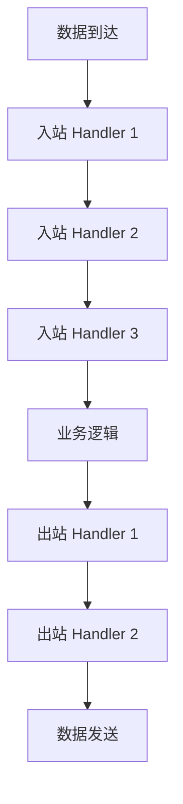

# Netty 网络编程深入（Reactor / ByteBuf / Pipeline / 内存池 / 生产调优）

> Netty 是 **Java 网络编程的事实标准**：Dubbo/gRPC/Kafka 客户端/RocketMQ/Redis 客户端（Lettuce）底层全部基于 Netty。核心价值：**Reactor 多线程模型 + 零拷贝 + 内存池 + Pipeline 链式处理**，用极少线程处理海量并发连接。本篇按「架构 → 核心组件 → 关键机制 → 生产调优」拆解。

---

## 一、Netty 整体架构

```
                    ┌─────────────────────────────────┐
                    │         Netty 线程模型           │
                    ├─────────────────────────────────┤
                    │  Boss Group（Accept 线程）        │
                    │    └─ 接受新连接 → 注册到 Worker  │
                    │                                  │
                    │  Worker Group（IO 线程）          │
                    │    └─ 读写数据 → Pipeline 处理    │
                    └─────────────────────────────────┘

应用层：  Bootstrap / ServerBootstrap（启动引导）
通道层：  Channel（连接抽象）+ ChannelPipeline（处理链）
缓冲层：  ByteBuf（零拷贝缓冲区）
协议层：  编解码器（Codec）
```

### 1.1 Reactor 模型

| 模型 | 说明 | Netty 实现 |
|------|------|-----------|
| 单 Reactor 单线程 | 一个线程处理所有 IO | 不推荐（阻塞） |
| **单 Reactor 多线程** | Reactor 线程处理 IO，业务交给线程池 | WorkerGroup |
| **主从 Reactor 多线程** | Boss 处理 Accept，Worker 处理 IO | BossGroup + WorkerGroup |
| Proactor | 异步 IO（AIO） | Linux 下不支持，Netty 未采用 |

**Netty 默认是主从 Reactor 多线程模型**：BossGroup（默认1线程）处理 Accept，WorkerGroup（默认 CPU核数×2 线程）处理 IO 读写。

### 1.2 启动流程

```java
// 服务端启动
ServerBootstrap b = new ServerBootstrap();
b.group(bossGroup, workerGroup)
 .channel(NioServerSocketChannel.class)  // NIO 实现
 .childHandler(new ChannelInitializer<SocketChannel>() {
     @Override
     protected void initChannel(SocketChannel ch) {
         ch.pipeline()
           .addLast(new IdleStateHandler(60, 30, 0))  // 心跳检测
           .addLast(new LengthFieldBasedFrameDecoder(1024, 0, 4))  // 粘包拆包
           .addLast(new ProtobufDecoder(msg))
           .addLast(new BusinessHandler());  // 业务逻辑
     }
 })
 .option(ChannelOption.SO_BACKLOG, 128)
 .childOption(ChannelOption.SO_KEEPALIVE, true);
```

---

## 二、核心组件

### 2.1 Channel（通道）

```
Channel = 网络连接的抽象（Socket 的封装）

核心操作：
  bind()     — 绑定端口
  connect()  — 连接远端
  read()     — 注册读事件
  write()    — 写数据
  flush()    — 刷新写缓冲
  close()    — 关闭连接

常用实现：
  NioServerSocketChannel  — 服务端 NIO
  NioSocketChannel       — 客户端 NIO
  EpollServerSocketChannel — Linux epoll（性能更好）
```

### 2.2 ByteBuf（零拷贝缓冲区）

```
ByteBuf vs Java NIO ByteBuffer：

| 维度 | ByteBuf | ByteBuffer |
|------|---------|-----------|
| 读写指针 | 双指针（readerIndex/writerIndex） | 单指针（flip 切换） |
| 扩容 | 自动扩容 | 固定大小 |
| 零拷贝 | slice/composite/wrap | 无 |
| 内存池 | 支持（PooledByteBufAllocator） | 无 |
| 引用计数 | 支持（ReferenceCounted） | 无 |

内存分配：
  堆内（Heap）：分配 JVM 堆内存，GC 管理，简单但多一次拷贝
  堆外（Direct）：分配 OS 内存，零拷贝，但需要手动释放
  池化（Pooled）：复用内存块，减少 GC 压力（默认）
```

### 2.3 Pipeline 与 ChannelHandler

```
Pipeline = 双向链表，每个节点是一个 ChannelHandler

入站（Inbound）处理链：
  数据读取 → 解码 → 业务逻辑 → 响应

出站（Outbound）处理链：
  业务逻辑 → 编码 → 数据写入

Handler 类型：
  ChannelInboundHandler   — 处理入站事件（读数据/连接建立）
  ChannelOutboundHandler  — 处理出站事件（写数据/连接）
  ChannelDuplexHandler    — 同时处理入站和出站
```

### 2.4 EventLoop（事件循环）

```
EventLoop = 单线程事件循环（一个线程处理一组 Channel 的所有 IO）

一个 Worker EventLoop 绑定多个 Channel：
  EventLoop 线程 → 轮询注册在其上的 Channel 的 IO 事件
  → 一个 Channel 的所有事件都在同一个线程中处理（无需加锁）

任务调度：
  eventLoop.schedule(task, delay, TimeUnit)  — 延迟任务
  eventLoop.execute(task)                     — 立即执行
```

---

## 三、关键机制

### 3.1 粘包与拆包

| 原因 | 说明 |
|------|------|
| TCP 粘包 | 发送方多次 write 合并为一次发送（Nagle 算法） |
| TCP 拆包 | 发送数据大于 MSS 时拆分 |
| 缓冲区 | 应用层多次写入缓冲区，一次读出 |

**解决方案（解码器）**：

| 解码器 | 原理 |
|--------|------|
| FixedLengthFrameDecoder | 固定长度 |
| LineBasedFrameDecoder | 换行分隔 |
| LengthFieldBasedFrameDecoder | 长度字段（最常用） |
| DelimiterBasedFrameDecoder | 自定义分隔符 |
| ProtobufDecoder | Protobuf 协议（自带长度） |

### 3.2 零拷贝

```
Netty 零拷贝的三种实现：

1. compositeByteBuf：合并多个 ByteBuf（逻辑合并，不拷贝数据）
2. slice：ByteBuf 切片（共享底层内存）
3. FileRegion + transferTo：文件传输（绕过用户态，直接 DMA 拷贝）

传统文件传输（4次拷贝）：
  磁盘 → 内核缓冲区 → 用户缓冲区 → Socket 缓冲区 → 网卡
  
Netty FileRegion（3次拷贝）：
  磁盘 → 内核缓冲区 → Socket 缓冲区 → 网卡（绕过用户态）
```

### 3.3 内存池（PooledByteBufAllocator）

```
Netty 内存池 = Arena + Chunk + Page + Subpage

Arena（区）：每个线程一个本地 Arena（减少锁竞争）
  → 线程先从本地 Arena 分配，本地不够从全局 Arena 偷取

Chunk（块）：一大块连续内存（如 16MB）
  → 按 Page 切分（默认 8KB/页）
  → 小对象按 Subpage 切分（如 8B/16B/32B...）

分配策略：
  小对象（< 页大小）：从 Subpage 分配（精确匹配，减少碎片）
  大对象（≥ 页大小）：从 Page 分配（按需分配）
  超大对象（> 16MB）：直接分配堆外内存（不池化）

效果：减少 90%+ 的内存分配与 GC 压力
```

### 3.4 心跳与空闲检测

```
IdleStateHandler（空闲检测）：
  readerIdleTime：读空闲超时（服务端检测客户端是否存活）
  writerIdleTime：写空闲超时（客户端检测服务端是否存活）
  allIdleTime：读写都空闲

实现：
  定时检测 Channel 是否有读/写事件
  → 超时触发 IdleStateEvent
  → 自定义 Handler 处理（如发心跳/断开连接）

典型配置：
  IdleStateHandler(60, 30, 0)  — 60s 读空闲发心跳，30s 写空闲发心跳
```

---

## 四、编解码器

### 4.1 常用编解码器

| 编解码器 | 协议 | 适用 |
|----------|------|------|
| StringDecoder/StringEncoder | 字符串 | 简单文本 |
| ProtobufDecoder/Encoder | Protobuf | 高性能二进制（Dubbo/gRPC） |
| MarshallingDecoder/Encoder | JBoss Marshalling | Java 序列化（兼容性好） |
| HttpRequestDecoder/Encoder | HTTP | Web 服务 |
| LengthFieldBasedFrameDecoder | 自定义 | 通用私有协议 |

### 4.2 自定义协议设计

```java
// 典型私有协议结构
+--------+--------+---------+--------+----------+
| 魔数    | 版本   | 序列化  | 消息类型 | 数据长度  |
| 4 bytes | 1 byte | 1 byte  | 1 byte  | 4 bytes  |
+--------+--------+---------+--------+----------+
| 数据体                                                    |
+----------------------------------------------------------+

解码器实现：
  1. 读魔数校验
  2. 读版本号
  3. 读序列化方式
  4. 读消息类型
  5. 读数据长度
  6. 按长度读数据体
  7. 反序列化为 Java 对象
```

---

## 五、生产调优

### 5.1 线程模型调优

| 参数 | 建议 |
|------|------|
| BossGroup 线程数 | 1（Accept 事件不多） |
| WorkerGroup 线程数 | CPU 核数 × 2（IO 密集） |
| 业务线程池 | 独立线程池（避免阻塞 Worker） |

### 5.2 ChannelOption 调优

| 参数 | 说明 | 建议 |
|------|------|------|
| SO_BACKLOG | Accept 队列大小 | 128~1024 |
| SO_KEEPALIVE | TCP 心跳 | true |
| SO_REUSEADDR | 地址复用 | true |
| TCP_NODELAY | 禁用 Nagle | true（低延迟场景） |
| SO_SNDBUF / SO_RCVBUF | 发送/接收缓冲区 | 按业务调整（默认 128KB） |
| WRITE_BUFFER_WATER_MARK | 写缓冲水位 | 高低水位控制背压 |

### 5.3 内存调优

| 参数 | 说明 |
|------|------|
| -Dio.netty.allocator.numDirectArenas | 直接内存 Arena 数 |
| -Dio.netty.allocator.pageSize | 页大小（默认 8192） |
| -Dio.netty.allocator.maxOrder | 最大阶（默认 11，即 2^11 × 8KB = 16MB chunk） |
| -Dio.netty.leakDetection.level | 内存泄漏检测（SIMPLE/ADVANCED/DISABLED） |

### 5.4 常见问题

| 问题 | 原因 | 解决 |
|------|------|------|
| 内存泄漏 | ByteBuf 未 release | 开启 leakDetection + try-finally 释放 |
| 连接数暴增 | 未设置读空闲检测 | IdleStateHandler + 超时断开 |
| 写缓冲堆积 | 下游消费慢 | 设置 WRITE_BUFFER_WATER_MARK 背压 |
| GC 停顿 | 大量小对象分配 | 用 PooledByteBufAllocator（默认） |
| 线程饿死 | 业务逻辑阻塞 Worker | 业务逻辑提交到独立线程池 |

---

## 六、Netty 在中间件中的应用

| 中间件 | Netty 用途 |
|--------|-----------|
| Dubbo | RPC 通信层（NettyClient/NettyServer） |
| gRPC-Java | HTTP/2 传输层 |
| RocketMQ | Broker/Producer/Consumer 通信 |
| Kafka | 新版客户端（Netty 替代 Java NIO） |
| Elasticsearch | Transport 通信 |
| Redis（Lettuce） | Redis 客户端 |
| ZooKeeper | NIO→Netty（3.5+） |
| Sentinel | 数据传输 |

---

## 五、Netty ByteBuf 内部实现

### 5.1 ByteBuf 内存布局

```
ByteBuf 内存结构：
  ┌──────────────────────────────────────────────┐
  │  已读区（0 ~ readerIndex）                      │
  ├──────────────────────────────────────────────┤
  │  可读区（readerIndex ~ writerIndex）            │
  ├──────────────────────────────────────────────┤
  │  可写区（writerIndex ~ capacity）               │
  ├──────────────────────────────────────────────┤
  │  最大容量区（capacity ~ maxCapacity）            │
  └──────────────────────────────────────────────┘

双指针设计：
  readerIndex → 读位置
  writerIndex → 写位置
  无需 flip() 操作（与 Java NIO ByteBuffer 区别）
```

### 5.2 ByteBuf 类型

| 类型 | 说明 | 适用场景 |
|------|------|----------|
| HeapByteBuf | JVM 堆内存 | 简单场景，GC 管理 |
| DirectByteBuf | OS 直接内存 | 零拷贝，高性能 |
| PooledByteBuf | 内存池化 | 高并发场景（默认） |
| UnpooledByteBuf | 非池化 | 低频使用 |
| CompositeByteBuf | 组合缓冲区 | 多 Buffer 合并（零拷贝） |
| SlicedByteBuf | 切片缓冲区 | 共享内存（零拷贝） |

### 5.3 引用计数机制

```java
// 引用计数管理
ByteBuf buf = Unpooled.buffer();
try {
    // 增加引用计数
    buf.retain();
    
    // 使用 ByteBuf
    // ...
    
} finally {
    // 释放引用计数
    buf.release();
}

// 引用计数规则：
//   创建时 count=1
//   retain() → count++
//   release() → count-- → count=0 时释放内存
//   防止内存泄漏：try-finally 确保 release
```

---

## 六、Netty Channel Pipeline 详解

### 6.1 Pipeline 处理流程



### 6.2 Handler 类型详解

| Handler 类型 | 事件 | 典型用途 |
|--------------|------|----------|
| ChannelInboundHandlerAdapter | channelRead | 接收数据 |
| ChannelOutboundHandlerAdapter | write | 发送数据 |
| ChannelDuplexHandler | 两者 | 编解码器 |
| ChannelInboundHandler | exceptionCaught | 异常处理 |
| IdleStateHandler | userEventTriggered | 空闲检测 |
| LengthFieldBasedFrameDecoder | channelRead | 粘包拆包 |

### 6.3 Pipeline 操作方法

```java
// 添加 Handler
pipeline.addLast("decoder", new StringDecoder());
pipeline.addLast("encoder", new StringEncoder());
pipeline.addLast("business", new BusinessHandler());

// 插入 Handler
pipeline.addFirst("first", new FirstHandler());
pipeline.addLast("last", new LastHandler());
pipeline.addBefore("business", "auth", new AuthHandler());
pipeline.addAfter("business", "log", new LogHandler());

// 移除 Handler
pipeline.remove("decoder");

// 替换 Handler
pipeline.replace("decoder", "newDecoder", new NewDecoder());
```

### 6.4 入站与出站事件传播

```java
// 入站事件传播（从 Head 到 Tail）
ctx.fireChannelRead(msg);  // 传播到下一个入站 Handler

// 出站事件传播（从 Tail 到 Head）
ctx.write(msg);  // 传播到下一个出站 Handler

// 终止传播
// 不调用 fireXxx() 即可终止
```

---

## 七、Netty EventLoop 事件循环模型

### 7.1 EventLoop 工作流程

```
EventLoop 单线程事件循环：

while (true) {
    // 1. 阻塞等待 IO 事件
    int readyChannels = selector.select(timeout);
    
    // 2. 处理就绪的 IO 事件
    for (SelectionKey key : selector.selectedKeys()) {
        if (key.isAcceptable()) { /* Accept 新连接 */ }
        if (key.isReadable()) { /* 读数据 */ }
        if (key.isWritable()) { /* 写数据 */ }
    }
    
    // 3. 处理所有待执行的任务
    runAllTasks();
}
```

### 7.2 EventLoop 与 Channel 绑定

```
EventLoopGroup（线程池）
  ├── EventLoop-1 → Channel-1, Channel-2, Channel-3
  ├── EventLoop-2 → Channel-4, Channel-5, Channel-6
  ├── EventLoop-3 → Channel-7, Channel-8, Channel-9
  └── EventLoop-4 → Channel-10, Channel-11, Channel-12

一个 Channel 始终绑定一个 EventLoop：
  → 所有事件在同一线程中处理（无需加锁）
  → 减少上下文切换开销
```

### 7.3 EventLoop 任务调度

```java
// 延迟任务
eventLoop.schedule(() -> {
    System.out.println("延迟 5 秒执行");
}, 5, TimeUnit.SECONDS);

// 定时任务
eventLoop.scheduleAtFixedRate(() -> {
    System.out.println("每 10 秒执行一次");
}, 0, 10, TimeUnit.SECONDS);

// 立即执行
eventLoop.execute(() -> {
    System.out.println("立即执行");
});
```

---

## 八、Netty 零拷贝详解

### 8.1 零拷贝实现方式

| 方式 | 说明 | 性能提升 |
|------|------|----------|
| CompositeByteBuf | 逻辑合并多个 Buffer | 避免数据拷贝 |
| ByteBuf.slice | 切片共享内存 | 避免数据拷贝 |
| FileRegion.transferTo | 文件传输（DMA） | 绕过用户态 |
| WebSocket 零拷贝 | 直接转发 Frame | 避免解码再编码 |

### 8.2 传统文件传输 vs 零拷贝

```
传统文件传输（4 次拷贝）：
  1. 磁盘 → 内核缓冲区（DMA 拷贝）
  2. 内核缓冲区 → 用户缓冲区（CPU 拷贝）
  3. 用户缓冲区 → Socket 缓冲区（CPU 拷贝）
  4. Socket 缓冲区 → 网卡（DMA 拷贝）

Netty 零拷贝（3 次拷贝）：
  1. 磁盘 → 内核缓冲区（DMA 拷贝）
  2. 内核缓冲区 → 网卡（DMA 拷贝，绕过用户态）
  3. 文件描述符传递（无数据拷贝）

性能：减少 1 次 CPU 拷贝，大文件传输提升显著
```

### 8.3 FileRegion 使用示例

```java
// 零拷贝文件传输
RandomAccessFile file = new RandomAccessFile("data.bin", "r");
FileRegion region = new DefaultFileRegion(
    file.getChannel(), 0, file.length());

ctx.write(region, new VoidChannelPromise());
```

---

## 九、Netty 编解码框架

### 9.1 编解码器类型

| 类型 | 说明 | 示例 |
|------|------|------|
| MessageToByteEncoder | 出站编码 | Object → ByteBuf |
| ByteToMessageDecoder | 入站解码 | ByteBuf → Object |
| MessageToMessageEncoder | 出站转出站 | Object → Object |
| MessageToMessageDecoder | 入站转入站 | Object → Object |
| ByteToMessageCodec | 编解码一体 | ByteBuf ↔ Object |
| MessageToMessageCodec | 转码一体 | Object ↔ Object |

### 9.2 自定义编解码器示例

```java
// 编码器：对象 → ByteBuf
public class MyEncoder extends MessageToByteEncoder<MyMessage> {
    @Override
    protected void encode(ChannelHandlerContext ctx, MyMessage msg, ByteBuf out) {
        out.writeInt(msg.getType());
        out.writeBytes(msg.getData());
    }
}

// 解码器：ByteBuf → 对象
public class MyDecoder extends ByteToMessageDecoder {
    @Override
    protected void decode(ChannelHandlerContext ctx, ByteBuf in, List<Object> out) {
        if (in.readableBytes() < 8) return; // 等待数据足够
        int type = in.readInt();
        byte[] data = new byte[in.readableBytes()];
        in.readBytes(data);
        out.add(new MyMessage(type, data));
    }
}
```

### 9.3 粘包拆包解决方案

| 解决方案 | 说明 | 适用场景 |
|----------|------|----------|
| 固定长度 | FixedLengthFrameDecoder | 消息长度固定 |
| 分隔符 | DelimiterBasedFrameDecoder | 文本协议（换行） |
| 长度字段 | LengthFieldBasedFrameDecoder | 二进制协议（最常用） |
| 自定义协议 | 继承 ByteToMessageDecoder | 私有协议 |

---

## 十、Netty 连接池

### 10.1 连接池架构

```java
// Netty 连接池实现
GenericKeyedObjectPool<HostPort, Channel> pool = 
    new GenericKeyedObjectPool<>(new ChannelFactory());

// 借用连接
Channel ch = pool.borrowObject(new HostPort("127.0.0.1", 8080));
try {
    // 使用连接发送请求
    ch.writeAndFlush(request).sync();
} finally {
    // 归还连接
    pool.returnObject(new HostPort("127.0.0.1", 8080), ch);
}
```

### 10.2 连接池参数配置

| 参数 | 说明 | 建议值 |
|------|------|--------|
| maxTotal | 最大连接数 | 100~1000 |
| maxPerKey | 每个目标最大连接数 | 10~50 |
| minIdle | 最小空闲连接数 | 5~10 |
| maxIdle | 最大空闲连接数 | 10~20 |
| maxWaitMillis | 获取连接最大等待时间 | 3000ms |
| timeBetweenEvictionRunsMillis | 空闲检测间隔 | 60000ms |
| minEvictableIdleTimeMillis | 空闲驱逐时间 | 300000ms |

### 10.3 连接池健康检查

```java
// 连接健康检查
pool.setTestOnBorrow(true);  // 借用时检查
pool.setTestOnReturn(true);   // 归还时检查
pool.setTestWhileIdle(true);  // 空闲时检查

// 自定义健康检查
pool.setValidator(new KeyedPoolableObjectPool<HostPort, Channel>() {
    @Override
    public boolean validateObject(HostPort key, Channel obj) {
        return obj.isActive() && !obj.isClosing();
    }
});
```

---

## 十一、Netty SSL/TLS 支持

### 11.1 SSL 配置示例

```java
// SSL Context 初始化
SslContext sslCtx = SslContextBuilder.forServer(certFile, keyFile)
    .protocols("TLSv1.3", "TLSv1.2")
    .ciphers(CipherSuite.THREE_DES_EDE_CBC_SHA)
    .build();

// 客户端 SSL
SslContext clientSslCtx = SslContextBuilder.forClient()
    .trustManager(trustCertFile)
    .build();

// Pipeline 中添加 SSL Handler
pipeline.addLast("ssl", sslCtx.newHandler(ctx.alloc()));
pipeline.addLast("http", new HttpServerCodec());
```

### 11.2 SSL 性能优化

| 参数 | 说明 |
|------|------|
| SSL 会话缓存 | 启用 SSLSessionCache 减少握手 |
| TLS 1.3 | 更快的握手（1-RTT） |
| 会话票据 | 避免完整握手 |
| 硬件加速 | 使用 Intel QAT/ARM CE |

---

## 十二、Netty 在 RPC 框架中的应用

### 12.1 Dubbo 中的 Netty

```
Dubbo RPC 调用流程：
  Consumer → NettyClient → 网络 → NettyServer → Provider

Netty 在 Dubbo 中的作用：
  ├── TCP 连接管理（连接池）
  ├── 协议编解码（Dubbo 协议）
  ├── 心跳检测（IdleStateHandler）
  ├── 超时控制（Future）
  └── 序列化（Hessian2/Protobuf）
```

### 12.2 gRPC 中的 Netty

```
gRPC Java 底层：
  gRPC-Java → Netty → HTTP/2

Netty 提供：
  ├── HTTP/2 帧编解码器
  ├── 多路复用（Stream 处理）
  ├── 流控（Flow Control）
  ├── TLS 支持（gRPC over TLS）
  └── 压缩（Message Size）
```

### 12.3 RocketMQ 中的 Netty

```
RocketMQ 通信层：
  Producer/Broker/Consumer → NettyRemotingServer/Client

Netty 提供：
  ├── 异步通信（Future/Promise）
  ├── 协议编解码（RemotingCommand）
  ├── 连接管理（心跳检测）
  ├── 序列化（JSON/Protobuf）
  └── 流控（信号量限流）
```

---

## 十三、Netty 内存泄漏检测

### 13.1 泄漏检测级别

```bash
# 启动参数设置检测级别
-Dio.netty.leakDetection.level=PARANOID  # 最严格（生产不推荐）
-Dio.netty.leakDetection.level=ADVANCED   # 高级检测
-Dio.netty.leakDetection.level=SIMPLE     # 简单检测（默认）
-Dio.netty.leakDetection.level=DISABLED   # 禁用
```

### 13.2 泄漏检测原理

```
Netty 内存泄漏检测：
  每个 ByteBuf 分配时记录堆栈信息
  release() 时检查引用计数
  如果引用计数 > 0 → 输出泄漏警告

警告信息包含：
  泄漏的 ByteBuf 类型
  分配时的堆栈信息
  当前引用计数
  访问的线程
```

### 13.3 常见泄漏场景与解决

| 泄漏场景 | 原因 | 解决 |
|----------|------|------|
| 未 release | ByteBuf 未释放 | try-finally 释放 |
| 重复 release | 多次释放导致异常 | 用 ReferenceCountUtil.releaseOnce |
| 异步未处理 | 异步回调中未释放 | 在回调中释放 |
| 编解码器泄漏 | 编解码器内部未释放 | 检查编解码器实现 |

```java
// 正确的释放方式
ByteBuf buf = ctx.alloc().buffer();
try {
    // 使用 ByteBuf
    buf.writeBytes(data);
    ctx.writeAndFlush(buf);
} finally {
    // 注意：writeAndFlush 会自动 release，这里不需要
    // 但如果写入失败，需要手动 release
}
```

---

## 十四、与其他板块的关系

- 网络基础见「[网络](../基础知识/网络.md)」；
- Reactor 模式见「[并发编程](../基础知识/并发编程.md)」；
- Dubbo RPC 见「[Dubbo](./中间件/ApacheDubboRPC框架.md)」；
- gRPC 见「[gRPC](./中间件/gRPC.md)」；
- Kafka 源码见「[源码系列/Kafka 源码](../源码系列/Kafka源码.md)」；
- 零拷贝见「[操作系统](../基础知识/操作系统.md)」。

> 一句话：**Netty = 主从 Reactor + ByteBuf（零拷贝+内存池）+ Pipeline（链式处理）+ EventLoop（单线程无锁）——生产调优核心：业务线程池隔离 + IdleStateHandler 心跳 + PooledByteBufAllocator + leakDetection**。
