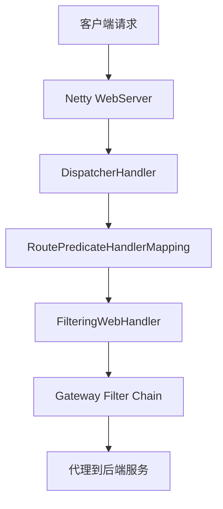

# Spring Cloud 微服务整合（Nacos / Sentinel / Seata / Gateway / 链路追踪）

> Spring Cloud = **Java 微服务治理的事实标准**。本篇聚焦 Spring Cloud Alibaba 生态的完整集成实战：Nacos（注册+配置）+ Sentinel（限流熔断）+ Seata（分布式事务）+ Gateway（网关）+ Sleuth/Zipkin（链路追踪），给出可直接落地的架构方案。

---

## 一、Spring Cloud 全景

```
Spring Cloud 生态：
  服务发现：Nacos / Eureka / Consul
  配置中心：Nacos Config / Apollo / Spring Cloud Config
  网关：Spring Cloud Gateway
  熔断：Sentinel / Resilience4j
  负载均衡：Spring Cloud LoadBalancer / Ribbon
  链路追踪：Sleuth + Zipkin / Micrometer Tracing
  分布式事务：Seata
  消息驱动：Spring Cloud Stream + RocketMQ/Kafka
  消费者驱动：OpenFeign（声明式 HTTP 客户端）
```

### 1.1 技术选型推荐

| 组件 | 推荐 | 备选 |
|------|------|------|
| 注册+配置 | Nacos（一站式） | Consul |
| 网关 | Spring Cloud Gateway | Kong |
| 熔断 | Sentinel（阿里生态） | Resilience4j |
| 分布式事务 | Seata（AT 模式） | 本地消息表 |
| 链路追踪 | Sleuth + Zipkin | SkyWalking |
| 消息 | RocketMQ | Kafka |

---

## 二、Nacos（注册+配置中心）

### 2.1 核心能力

```
Nacos = 服务注册发现 + 配置管理（一个组件解决两个问题）

服务注册：
  Provider 启动 → 注册到 Nacos（IP/端口/元数据）
  Consumer 启动 → 从 Nacos 拉取服务列表
  Provider 变更 → Nacos 长轮询推送 → Consumer 实时感知

配置管理：
  配置变更 → Nacos 推送 → 客户端 @RefreshScope 自动刷新
  多环境：data-id + group + namespace 隔离
```

### 2.2 配置示例

```yaml
# application.yml
spring:
  cloud:
    nacos:
      discovery:
        server-addr: nacos-server:8848
        namespace: dev
        group: DEFAULT_GROUP
      config:
        server-addr: nacos-server:8848
        file-extension: yaml
        group: DEFAULT_GROUP
        shared-configs:
          - data-id: common.yaml
            group: DEFAULT_GROUP
            refresh: true
```

### 2.3 集群部署

```
Nacos 集群（3 节点起步）：
  1. 部署 3 个 Nacos 实例
  2. 配置 cluster.conf（节点 IP 列表）
  3. 前置 Nginx 做负载均衡
  4. 客户端配置 Nginx 地址

数据一致性：
  Distro 协议（AP）：临时实例（服务注册）
  Raft 协议（CP）：持久实例（配置管理）
```

---

## 三、Sentinel（限流熔断）

### 3.1 核心概念

```
Sentinel = 流量控制 + 熔断降级 + 系统负载保护

流控规则：
  QPS 模式：限制每秒请求数
  线程数模式：限制并发线程数
  关联模式：当关联资源达到阈值时限流

熔断规则：
  慢调用比例：RT > 阈值的比例超过阈值 → 熔断
  异常比例：异常比例超过阈值 → 熔断
  异常数：异常数超过阈值 → 熔断
```

### 3.2 集成示例

```java
// 限流
@SentinelResource(value = "queryUser", blockHandler = "queryUserBlock")
public User queryUser(Long id) {
    return userService.getById(id);
}

public User queryUserBlock(Long id, BlockException ex) {
    return new User("默认用户");  // 降级返回
}

// 熔断降级
@SentinelResource(value = "callRemote", fallback = "callRemoteFallback")
public String callRemote() {
    return remoteService.call();
}

public String callRemoteFallback(Throwable ex) {
    return "降级响应";  // 异常降级
}
```

### 3.3 Dashboard 配置

```
Sentinel Dashboard（实时监控+规则配置）：
  访问：http://dashboard:8080
  功能：实时监控 / 流控规则 / 熔断规则 / 系统规则 / 热点规则
  持久化：规则推送到 Nacos/ZK（重启不丢失）
```

---

## 四、Seata（分布式事务）

### 4.1 四种模式

| 模式 | 原理 | 侵入性 | 性能 | 适用 |
|------|------|--------|------|------|
| AT | 自动生成回滚 SQL | 无 | 高 | 通用（默认推荐） |
| TCC | 手动实现 Try/Confirm/Cancel | 高 | 最高 | 高性能场景 |
| SAGA | 长事务编排（正向+补偿） | 中 | 中 | 长事务 |
| XA | 数据库两阶段提交 | 无 | 低 | 强一致 |

### 4.2 AT 模式集成

```java
// 1. 添加注解
@GlobalTransactional  // 分布式事务入口
public void createOrder(OrderDTO dto) {
    // 2. 调用库存服务（远程）
    stockService.deduct(dto.getSkuId(), dto.getCount());
    // 3. 创建订单（本地）
    orderMapper.insert(dto);
    // Seata 自动管理回滚
}

// 4. 库存服务
@Transactional
public void deduct(Long skuId, int count) {
    // Seata 自动生成 before image / after image
    stockMapper.deduct(skuId, count);
}
```

### 4.3 AT 模式原理

```
一阶段（自动）：
  1. 解析 SQL，记录 before image
  2. 执行业务 SQL
  3. 记录 after image
  4. 生成 undo log
  5. 提交本地事务（数据已提交）
  6. 通知 TC（事务协调器）

二阶段-提交：
  TC 通知所有分支提交 → 删除 undo log（异步，不阻塞）

二阶段-回滚：
  TC 通知所有分支回滚 → 根据 undo log 生成反向 SQL 执行
```

---

## 五、Spring Cloud Gateway（网关）

### 5.1 核心架构

```
请求 → Gateway（WebFlux 响应式）
  → RoutePredicateHandlerMapping（匹配路由）
  → FilteringWebHandler（执行过滤器链）
  → ProxyWebFilter（转发到后端服务）

路由配置：
  predicates: 匹配条件（Path/Header/Method/Query）
  filters: 处理逻辑（鉴权/限流/重写/灰度）
  uri: 后端服务地址（lb://service-name）
```

### 5.2 鉴权过滤器

```java
@Component
public class AuthFilter implements GlobalFilter, Ordered {
    @Override
    public Mono<Void> filter(ServerWebExchange exchange, GatewayFilterChain chain) {
        String token = exchange.getRequest().getHeaders().getFirst("Authorization");
        if (token == null || !validate(token)) {
            exchange.getResponse().setStatusCode(HttpStatus.UNAUTHORIZED);
            return exchange.getResponse().setComplete();
        }
        // 传递用户信息到下游
        exchange.getRequest().mutate()
            .header("X-User-Id", parseUserId(token));
        return chain.filter(exchange);
    }
}
```

---

## 六、链路追踪

### 6.1 Sleuth + Zipkin

```
Sleuth = 自动生成 TraceId/SpanId（贯穿整个调用链）
Zipkin = 可视化调用链（延迟/错误/依赖关系）

集成：
  1. 引入 spring-cloud-starter-sleuth + spring-cloud-sleuth-zipkin
  2. 配置 zipkin.base-url
  3. 自动注入 TraceId/SpanId 到日志
  4. 日志格式：[app-name, trace-id, span-id, export]
```

### 6.2 日志关联

```java
// 日志自动带 TraceId
log.info("查询用户 {}", userId);
// 输出：[user-service, abc123, def456, true] 查询用户 123

// 手动传递上下文
Span span = tracer.nextSpan().name("custom-operation").start();
try (Tracer.SpanInScope ws = tracer.withSpan(span)) {
    // 业务逻辑
} finally {
    span.end();
}
```

---

## 七、完整架构示例

```
                    ┌─────────────┐
                    │   Nginx LB  │
                    └──────┬──────┘
                           │
                    ┌──────┴──────┐
                    │   Gateway   │  ← 限流/鉴权/路由
                    └──────┬──────┘
                           │
              ┌────────────┼────────────┐
              │            │            │
         ┌────┴────┐ ┌────┴────┐ ┌────┴────┐
         │ 订单服务 │ │ 库存服务 │ │ 用户服务 │
         └────┬────┘ └────┬────┘ └────┬────┘
              │            │            │
              └────────────┼────────────┘
                           │
              ┌────────────┼────────────┐
              │            │            │
         ┌────┴────┐ ┌────┴────┐ ┌────┴────┐
         │  Nacos  │ │ Sentinel│ │  Seata  │
         │注册+配置│ │限流熔断  │ │分布式事务│
         └─────────┘ └─────────┘ └─────────┘
```

---

## 八、Spring Cloud Gateway 深入

### 8.1 Gateway 核心架构



### 8.2 路由断言工厂

| 断言工厂 | 配置示例 | 说明 |
|----------|----------|------|
| Path | `Path=/api/**` | 路径匹配 |
| Header | `Header=X-Auth-Token, \d+` | Header 匹配 |
| Method | `Method=GET,POST` | HTTP 方法匹配 |
| Query | `Query=name, zhangsan` | 参数匹配 |
| After | `After=2024-01-01T00:00:00+08:00` | 时间之后 |
| Before | `Before=2024-12-31T23:59:59+08:00` | 时间之前 |
| Between | `Between=time1,time2` | 时间区间 |
| Host | `Host=**.example.com` | 域名匹配 |
| RemoteAddr | `RemoteAddr=192.168.1.0/24` | IP 匹配 |
| Weight | `Weight=group1, 8` | 权重路由 |

### 8.3 Gateway 过滤器

```java
// 全局过滤器
@Component
public class AuthGlobalFilter implements GlobalFilter, Ordered {
    @Override
    public Mono<Void> filter(ServerWebExchange exchange, GatewayFilterChain chain) {
        String token = exchange.getRequest().getHeaders().getFirst("Authorization");
        if (token == null || !validate(token)) {
            exchange.getResponse().setStatusCode(HttpStatus.UNAUTHORIZED);
            return exchange.getResponse().setComplete();
        }
        // 传递用户信息
        exchange.getRequest().mutate()
            .header("X-User-Id", parseUserId(token));
        return chain.filter(exchange);
    }
    
    @Override
    public int getOrder() {
        return -1;  // 优先级（越小越优先）
    }
}

// 局部过滤器
@Component
public class RequestTimeFilter implements GatewayFilter, Ordered {
    @Override
    public Mono<Void> filter(ServerWebExchange exchange, GatewayFilterChain chain) {
        long start = System.currentTimeMillis();
        return chain.filter(exchange).then(Mono.fromRunnable(() -> {
            long duration = System.currentTimeMillis() - start;
            exchange.getResponse().getHeaders().add("X-Response-Time", duration + "ms");
        }));
    }
    
    @Override
    public int getOrder() {
        return 0;
    }
}
```

### 8.4 Gateway 限流配置

```yaml
spring:
  cloud:
    gateway:
      routes:
      - id: order-service
        uri: lb://order-service
        predicates:
        - Path=/api/order/**
        filters:
        - name: RequestRateLimiter
          args:
            redis-rate-limiter.replenishRate: 100
            redis-rate-limiter.burstCapacity: 200
            key-resolver: "#{@userKeyResolver}"

# KeyResolver 实现
@Bean
public KeyResolver userKeyResolver() {
    return exchange -> Mono.just(
        exchange.getRequest().getHeaders().getFirst("X-User-Id")
    );
}
```

---

## 九、Spring Cloud Circuit Breaker（Resilience4j）

### 9.1 核心组件

| 组件 | 说明 |
|------|------|
| CircuitBreaker | 熔断器（Closed/Open/HalfOpen） |
| RateLimiter | 限流器（固定窗口） |
| Retry | 重试（指数退避） |
| Bulkhead | 隔离器（信号量/线程池） |
| TimeLimiter | 超时控制 |
| Cache | 缓存（请求结果缓存） |

### 9.2 集成示例

```java
// 熔断器配置
@Bean
public CircuitBreakerConfig circuitBreakerConfig() {
    return CircuitBreakerConfig.custom()
        .failureRateThreshold(50)          // 失败率阈值
        .waitDurationInOpenState(Duration.ofSeconds(10))  // 熔断等待时间
        .slidingWindowSize(100)            // 滑动窗口大小
        .minimumNumberOfCalls(10)          // 最小请求数
        .build();
}

// 使用熔断器
@Service
public class OrderService {
    @CircuitBreaker(name = "orderService", fallbackMethod = "fallback")
    public Order getOrder(Long id) {
        return orderRepository.findById(id);
    }
    
    public Order fallback(Long id, Throwable t) {
        return new Order("默认订单");  // 降级返回
    }
}
```

### 9.3 Resilience4j 配置

```yaml
resilience4j:
  circuitbreaker:
    instances:
      orderService:
        slidingWindowSize: 100
        failureRateThreshold: 50
        waitDurationInOpenState: 10s
        permittedNumberOfCallsInHalfOpenState: 10
  retry:
    instances:
      orderService:
        maxAttempts: 3
        waitDuration: 500ms
        exponentialBackoffMultiplier: 2
  bulkhead:
    instances:
      orderService:
        maxConcurrentCalls: 25
        maxWaitDuration: 0
  timelimiter:
    instances:
      orderService:
        timeoutDuration: 3s
```

---

## 十、Spring Cloud Config Server 模式

### 10.1 Config Server 架构

```
Git/SVN/DB → Config Server → Config Client（应用）

配置流程：
  1. Config Server 从 Git/SVN 拉取配置
  2. 应用启动时从 Config Server 获取配置
  3. 配置变更 → Bus 通知 → 应用刷新
```

### 10.2 配置中心对比

| 维度 | Spring Cloud Config | Nacos Config | Apollo |
|------|---------------------|--------------|--------|
| 配置存储 | Git/SVN | 内置数据库 | 内置数据库 |
| 配置推送 | Bus（消息总线） | 长轮询 | 长轮询 |
| 版本管理 | Git 版本控制 | 内置版本管理 | 内置版本管理 |
| 灰度发布 | 不支持 | 支持 | 支持 |
| 权限管理 | Git 权限 | 内置权限 | 内置权限 |
| 运维复杂度 | 高（需维护 Git） | 低 | 中 |

### 10.3 Config Server 高可用

```yaml
# Config Server 集群 + Eureka 注册
spring:
  application:
    name: config-server
  cloud:
    config:
      server:
        git:
          uri: https://github.com/company/config-repo
    discovery:
      enabled: true
      service-id: config-server

# 客户端配置（通过服务发现获取 Config Server）
spring:
  cloud:
    config:
      discovery:
        enabled: true
        service-id: config-server
```

---

## 十一、Spring Cloud Sleuth/Micrometer Tracing

### 11.1 链路追踪架构

```
Spring Cloud Sleuth（2020+ 改为 Micrometer Tracing）：
  ├── 自动生成 TraceId/SpanId
  ├── 日志关联（MDC）
  ├── HTTP Header 传播
  └── 与 Zipkin/Jaeger 集成

Micrometer Tracing（新标准）：
  ├── 自动埋点
  ├── 与 Micrometer Metrics 集成
  ├── 支持 OpenTelemetry
  └── 多后端支持
```

### 11.2 配置示例

```yaml
# Micrometer Tracing + Zipkin
management:
  tracing:
    sampling:
      probability: 1.0  # 采样率 100%
  zipkin:
    tracing:
      endpoint: http://zipkin:9411/api/v2/spans

# 依赖
# micrometer-tracing-bridge-brave
# brave-instrumentation-http
```

### 11.3 手动传播上下文

```java
// 手动创建 Span
@Autowired
Tracer tracer;

public void processRequest() {
    Span span = tracer.nextSpan().name("custom-operation").start();
    try (Tracer.SpanInScope ws = tracer.withSpan(span)) {
        // 业务逻辑
        span.tag("userId", userId);
        span.annotate("processing started");
    } finally {
        span.end();
    }
}
```

---

## 十二、Spring Cloud Kubernetes 集成

### 12.1 集成方式

| 组件 | 功能 |
|------|------|
| spring-cloud-kubernetes-discovery | K8s Service 发现 |
| spring-cloud-kubernetes-config | ConfigMap/Secret 配置 |
| spring-cloud-kubernetes-loadbalancer | K8s Service 负载均衡 |

### 12.2 配置示例

```yaml
spring:
  cloud:
    kubernetes:
      discovery:
        enabled: true
      config:
        enabled: true
        sources:
        - configmap: my-config
        - secret: my-secret
```

### 12.3 与 Nacos 共存

```
双注册模式：
  应用同时注册到 K8s Service 和 Nacos
  K8s 集群内：使用 K8s Service 发现
  K8s 集群外：使用 Nacos 发现
  适用于混合云场景
```

---

## 十三、Spring Cloud Stream 消息驱动

### 13.1 Stream 架构

```
Binder（绑定器）：抽象消息中间件
  ├── Kafka Binder
  ├── RabbitMQ Binder
  ├── RocketMQ Binder
  └── Redis Binder

核心概念：
  Input Channel → Consumer
  Output Channel → Producer
  Binding → Channel 与中间件的映射
```

### 13.2 Kafka Binder 示例

```yaml
spring:
  cloud:
    stream:
      bindings:
        order-output:
          destination: order-topic
          content-type: application/json
          binder: kafka
        order-input:
          destination: order-topic
          content-type: application/json
          group: order-consumer-group
          binder: kafka
      kafka:
        binder:
          brokers: kafka:9092
          auto-create-topics: true
```

### 13.3 消费者分组与分区

```java
// 消费者组（负载均衡）
@StreamListener(Sink.INPUT)
public void consume(Order order) {
    // 同一 Group 只有一个实例消费
}

// 生产者分区（顺序保证）
@EnableBinding(Source.class)
public class OrderProducer {
    @Autowired
    private Source source;
    
    public void sendOrder(Order order) {
        // 按 orderId 分区，保证同一订单顺序
        source.output().send(MessageBuilder
            .withPayload(order)
            .setHeader("partitionKey", order.getOrderId())
            .build());
    }
}
```

---

## 十四、Spring Cloud Alibaba 组件全景

### 14.1 组件对比

| 组件 | 功能 | 替代 |
|------|------|------|
| Nacos | 注册+配置中心 | Eureka + Spring Cloud Config |
| Sentinel | 限流熔断 | Hystrix + Resilience4j |
| Seata | 分布式事务 | TCC + 本地消息表 |
| RocketMQ | 消息队列 | Kafka + RabbitMQ |
| Dubbo | RPC 框架 | OpenFeign + RestTemplate |
| Gateway | 网关 | Zuul |

### 14.2 Spring Cloud Alibaba 版本对应

| Spring Cloud Alibaba | Spring Cloud | Spring Boot |
|-----------------------|--------------|-------------|
| 2022.0.0 | 2022.0.0 | 3.0.x |
| 2021.0.5 | 2021.0.5 | 2.6.x |
| 2020.0.1 | Hoxton | 2.4.x |
| 2.2.9 | Greenwich | 2.3.x |

---

## 十五、Spring Cloud vs Dubbo 对比

### 15.1 核心能力对比

| 维度 | Spring Cloud | Dubbo |
|------|--------------|-------|
| 服务发现 | Nacos/Eureka/Consul | Nacos/ZK |
| 负载均衡 | LoadBalancer/Ribbon | 内置（随机/轮询） |
| 熔断 | Sentinel/Resilience4j | Sentinel |
| RPC | OpenFeign（HTTP） | Dubbo 协议（二进制） |
| 序列化 | JSON | Hessian2/Protobuf |
| 性能 | 中 | 高 |
| 生态 | Spring 全家桶 | 阿里全家桶 |

### 15.2 选型建议

```
选 Spring Cloud：
  ✓ 需要 Spring 生态集成（Boot/Data/Security）
  ✓ 多语言支持（HTTP 协议）
  ✓ 云原生/K8s 场景
  ✓ 团队熟悉 Spring

选 Dubbo：
  ✓ 高性能 RPC（二进制协议）
  ✓ 存量 Java 微服务
  ✓ 需要丰富的负载均衡/路由策略
  ✓ 阿里生态（Nacos/Sentinel/Seata）

混合使用：
  Spring Cloud Gateway + Dubbo RPC
  → 网关层用 Spring Cloud，内部 RPC 用 Dubbo
```

---

## 十六、Spring Cloud 高级主题与生产实践

### 16.1 Spring Cloud LoadBalancer vs Ribbon

```text
Spring Cloud LoadBalancer vs Netflix Ribbon：
┌──────────────────────┬────────────────────────────────────────────┐
│                      │ LoadBalancer            │ Ribbon             │
├──────────────────────┼────────────────────────────────────────────┤
│ 状态                  │ 活跃（Spring 官方）     │ 维护模式            │
│ 性能                  │ 非阻塞（基于 Reactor）  │ 阻塞（每个请求线程）│
│ 缓存                  │ 默认开启（30s 刷新）    │ 默认开启            │
│ 负载均衡算法           │ RoundRobin/Random      │ 多种内置           │
│ 自定义                │ ReactorLoadBalancer    │ IRule/IPing        │
│ 与 Spring Boot        │ 3.x 默认               │ 2.x 默认           │
└──────────────────────┴────────────────────────────────────────────┘
```

```java
// 自定义 LoadBalancer 配置
@Configuration
public class LoadBalancerConfig {

    @Bean
    public ReactorLoadBalancer<ServiceInstance> randomLoadBalancer(
            Environment environment,
            LoadBalancerClientFactory clientFactory) {
        String name = environment.getProperty(LoadBalancerClientFactory.PROPERTY_NAME);
        return new RandomLoadBalancer(
            clientFactory.getLazyProvider(name, ServiceInstanceListSupplier.class),
            name);
    }
}

// 使用自定义负载均衡
@LoadBalancerClient(name = "user-service", configuration = LoadBalancerConfig.class)
public interface UserServiceClient {
    @GetMapping("/users/{id}")
    User getUser(@PathVariable Long id);
}
```

### 16.2 Circuit Breaker 模式

```text
Spring Cloud Circuit Breaker 选项：
┌──────────────────────┬────────────────────────────────────────────┐
│                      │ Resilience4j           │ Hystrix（已废弃）  │
├──────────────────────┼────────────────────────────────────────────┤
│ 隔离策略              │ 信号量（默认）          │ 线程池/信号量      │
│ 熔断器状态            │ CLOSED/OPEN/HALF_OPEN  │ 同                 │
│ 滑动窗口              │ 基于计数/时间           │ 基于时间           │
│ 降级逻辑              │ fallbackMethod         │ fallback method   │
│ 限流                  │ 内置 RateLimiter       │ 不支持             │
│ 重试                  │ 内置 Retry             │ 不支持             │
│ 超时控制              │ CircuitBreakerTimeout  │ 线程池超时         │
└──────────────────────┴────────────────────────────────────────────┘
```

```java
// Resilience4j 熔断器配置
@Service
public class UserService {

    @CircuitBreaker(name = "userService", fallbackMethod = "getUserFallback")
    @Retry(name = "userService")
    @TimeLimiter(name = "userService")
    public CompletableFuture<User> getUser(Long id) {
        return CompletableFuture.supplyAsync(() -> {
            // 调用远程服务
            return restTemplate.getForObject("http://user-service/users/" + id, User.class);
        });
    }

    public CompletableFuture<User> getUserFallback(Long id, Throwable t) {
        // 降级逻辑
        return CompletableFuture.completedFuture(new User(id, "默认用户"));
    }
}
```

```yaml
# Resilience4j 配置
resilience4j:
  circuitbreaker:
    instances:
      userService:
        slidingWindowSize: 100
        failureRateThreshold: 50
        waitDurationInOpenState: 10s
        permittedNumberOfCallsInHalfOpenState: 10
        automaticTransitionFromOpenToHalfOpenEnabled: true
  retry:
    instances:
      userService:
        maxAttempts: 3
        waitDuration: 500ms
        enableExponentialBackoff: true
        exponentialBackoffMultiplier: 2
  timelimiter:
    instances:
      userService:
        timeoutDuration: 3s
        cancelRunningFuture: true
```

### 16.3 Spring Cloud Task（短时任务）

```java
// Spring Cloud Task 示例
@SpringBootApplication
public class BatchJobApplication {

    public static void main(String[] args) {
        SpringApplication.run(BatchJobApplication.class, args);
    }

    @Bean
    public TaskExecutionListener taskExecutionListener() {
        return new TaskExecutionListener() {
            @Override
            public void onTaskStartup(TaskExecution taskExecution) {
                System.out.println("Task Started: " + taskExecution.getTaskName());
            }

            @Override
            public void onTaskEnd(TaskExecution taskExecution) {
                System.out.println("Task Ended: " + taskExecution.getTaskName() 
                    + " Status: " + taskExecution.getExitCode());
            }
        };
    }

    @Bean
    public CommandLineRunner runner(TaskRepository taskRepository) {
        return args -> {
            // 执行任务逻辑
            System.out.println("Executing batch job...");
            // 任务完成后会自动记录到数据库
        };
    }
}
```

```yaml
# application.yml
spring:
  task:
    initialize-schema: always  # 自动创建任务记录表
  datasource:
    url: jdbc:mysql://localhost:3306/task_db
    username: root
    password: password
```

### 16.4 Spring Cloud Config（Git 后端）

```yaml
# Config Server 配置
spring:
  cloud:
    config:
      server:
        git:
          uri: https://github.com/example/config-repo
          default-label: main
          search-paths: '{application}'
          clone-on-start: true
          force-pull: true
        encrypt:
          enabled: true  # 启用加密
```

```java
// Config Client 使用
@RefreshScope  // 支持动态刷新
@RestController
public class ConfigController {

    @Value("${app.feature.enabled:false}")
    private boolean featureEnabled;

    @GetMapping("/feature")
    public Map<String, Object> getFeature() {
        return Map.of(
            "featureEnabled", featureEnabled,
            "timestamp", System.currentTimeMillis()
        );
    }
}

// 手动触发刷新
@PostConstruct
public void init() {
    // 监听配置变更事件
    ContextRefresher refresher = new ContextRefresher(applicationContext, ConfigurationProperties.class);
}
```

### 16.5 Spring Cloud Stream Binder 深入

```java
// Spring Cloud Stream 绑定器配置
@EnableBinding(Source.class, Sink.class)
public class StreamConfig {

    // 自定义 Binder
    @Bean
    public MessageConverter customMessageConverter() {
        return new JsonMessageConverter();
    }
}

// 消息生产者
@Service
@RequiredArgsConstructor
public class OrderEventPublisher {
    private final Source source;

    public void publishOrderCreated(Order order) {
        source.output().send(MessageBuilder
            .withPayload(order)
            .setHeader("eventType", "ORDER_CREATED")
            .setHeader("timestamp", System.currentTimeMillis())
            .build());
    }
}

// 消息消费者
@Service
@StreamListener(Sink.INPUT)
public class OrderEventHandler {

    @SendTo(Source.OUTPUT)  // 消息转换
    public Order handleOrderCreated(Order order) {
        // 处理订单
        order.setStatus("PROCESSED");
        return order;
    }

    @StreamListener(
        target = Sink.INPUT,
        condition = "headers['eventType']=='ORDER_CANCELLED'"
    )
    public void handleOrderCancelled(Order order) {
        // 处理取消订单
    }
}
```

```yaml
# Stream 配置
spring:
  cloud:
    stream:
      bindings:
        input:
          destination: order-events
          group: order-service
          content-type: application/json
        output:
          destination: order-events
          content-type: application/json
      rabbit:
        binder:
          admin-addresses: localhost:5672
      kafka:
        binder:
          brokers: localhost:9092
          auto-create-topics: true
```

### 16.6 Spring Cloud Function

```java
// Spring Cloud Function 函数定义
@Configuration
public class FunctionConfig {

    // 消费函数
    @Bean
    public Consumer<String> logMessage() {
        return message -> {
            System.out.println("Received: " + message);
        };
    }

    // 供应商函数
    @Bean
    public Supplier<String> generateEvent() {
        return () -> {
            return "Event-" + System.currentTimeMillis();
        };
    }

    // 函数管道
    @Bean
    public Function<String, String> uppercase() {
        return value -> value.toUpperCase();
    }

    @Bean
    public Function<String, String> exclaim() {
        return value -> value + "!";
    }

    // 组合函数
    @Bean
    public Function<String, String> shout() {
        return uppercase().andThen(exclaim());
    }
}

// 使用函数
@RestController
@RequiredArgsConstructor
public class FunctionController {
    private final Function<String, String> shout;

    @GetMapping("/shout/{message}")
    public String shout(@PathVariable String message) {
        return shout.apply(message);
    }
}
```

### 16.7 Spring Cloud Kubernetes 原生集成

```yaml
# Spring Cloud Kubernetes 配置
spring:
  cloud:
    kubernetes:
      enabled: true
      discovery:
        enabled: true
        all-namespaces: true
      config:
        enabled: true
        sources:
        - namespace: production
          name: my-config
      secrets:
        enabled: true
        sources:
        - namespace: production
          name: my-secret
```

```java
// 自动发现 Kubernetes 中的服务
@FeignClient(name = "user-service")  // 自动从 Kubernetes Service 发现
public interface UserServiceClient {

    @GetMapping("/users/{id}")
    User getUser(@PathVariable Long id);
}

// 使用 Kubernetes ConfigMap 和 Secret
@RefreshScope
@RestController
public class KubernetesConfigController {

    @Value("${config.from.configmap:default}")
    private String configValue;

    @Value("${secret.from.secret:default}")
    private String secretValue;

    @GetMapping("/config")
    public Map<String, String> getConfig() {
        return Map.of(
            "config", configValue,
            "secret", secretValue
        );
    }
}
```

```yaml
# Kubernetes ConfigMap 和 Secret
apiVersion: v1
kind: ConfigMap
metadata:
  name: my-config
  namespace: production
data:
  application.yml: |
    app:
      feature:
        enabled: true
      name: my-service
---
apiVersion: v1
kind: Secret
metadata:
  name: my-secret
  namespace: production
type: Opaque
data:
  database-password: cGFzc3dvcmQxMjM=
  api-key: c2VjcmV0LWFwaS1rZXk=
```

## 十七、与其他板块的关系

- Spring Cloud Gateway 见「[Spring Cloud Gateway](../基础知识/中间件/SpringCloudGateway.md)」；
- Nacos 源码见「[源码系列/Nacos](../源码系列/Nacos.md)」；
- Sentinel 源码见「[源码系列/Sentinel](../源码系列/sentinel.md)」；
- Seata 详细见「[分布式事务 Seata](../基础知识/中间件/分布式事务Seata.md)」；
- 微服务治理见「[架构/微服务治理全链路](../架构/微服务治理全链路.md)」。

> 一句话：**Spring Cloud Alibaba = Nacos（注册+配置）+ Sentinel（限流熔断）+ Seata（分布式事务）+ Gateway（网关）——微服务全家桶，先跑通一个完整 demo，再逐个深入**。
