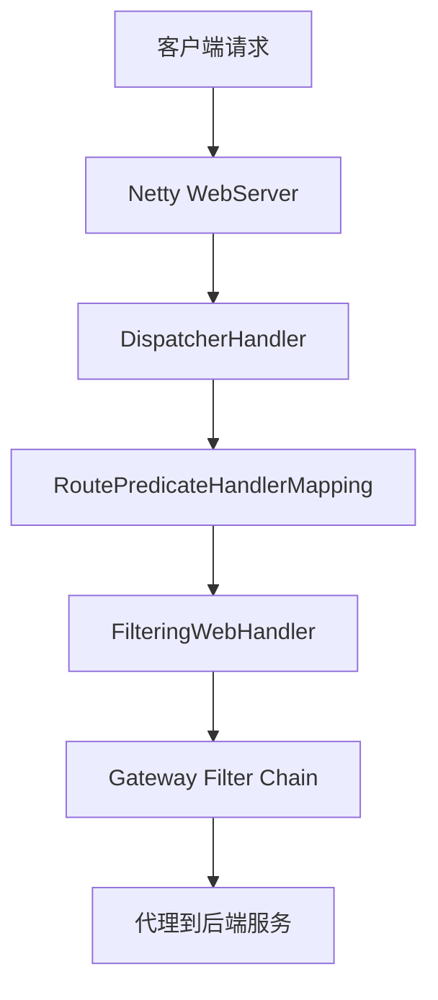
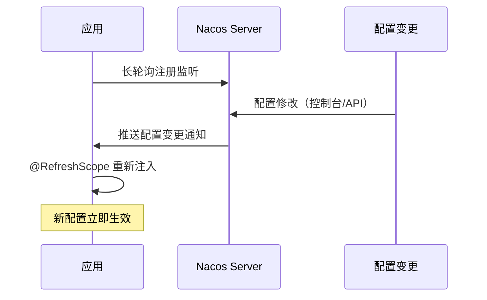
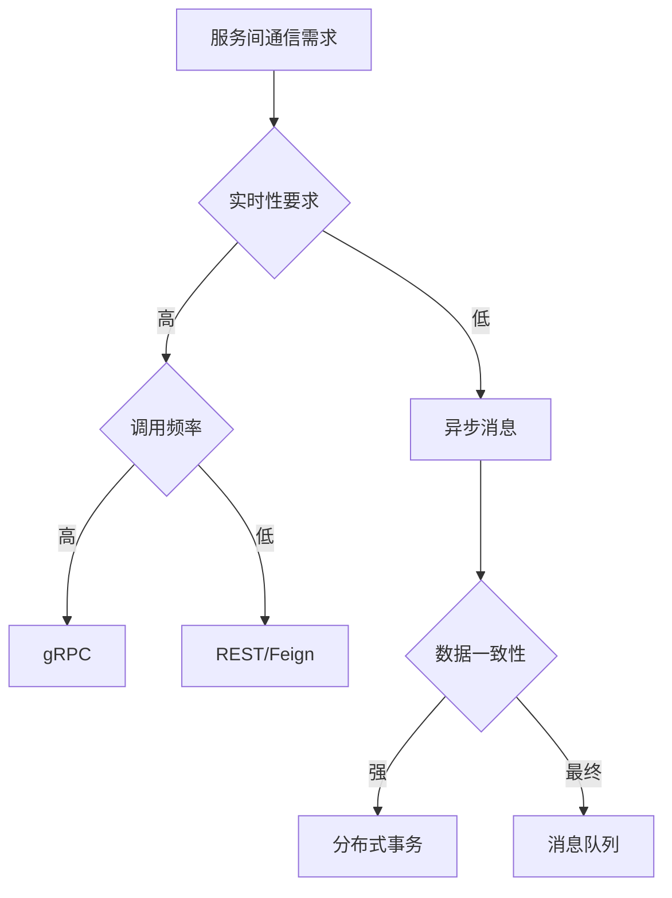
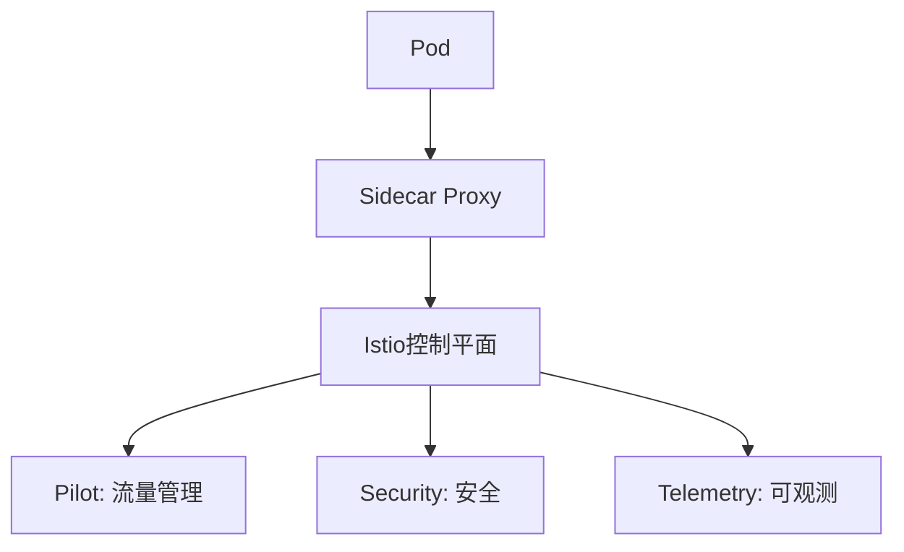
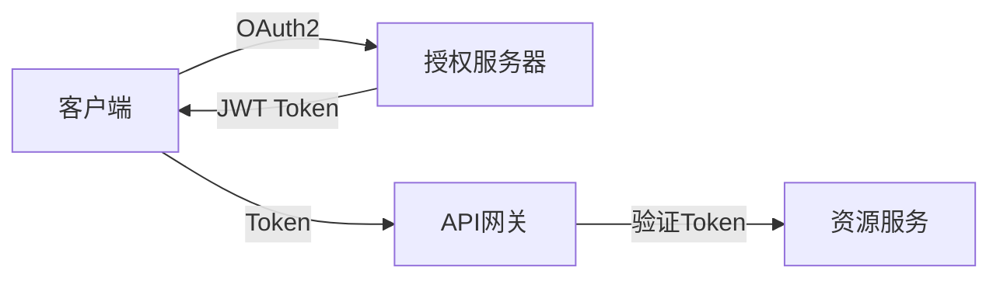
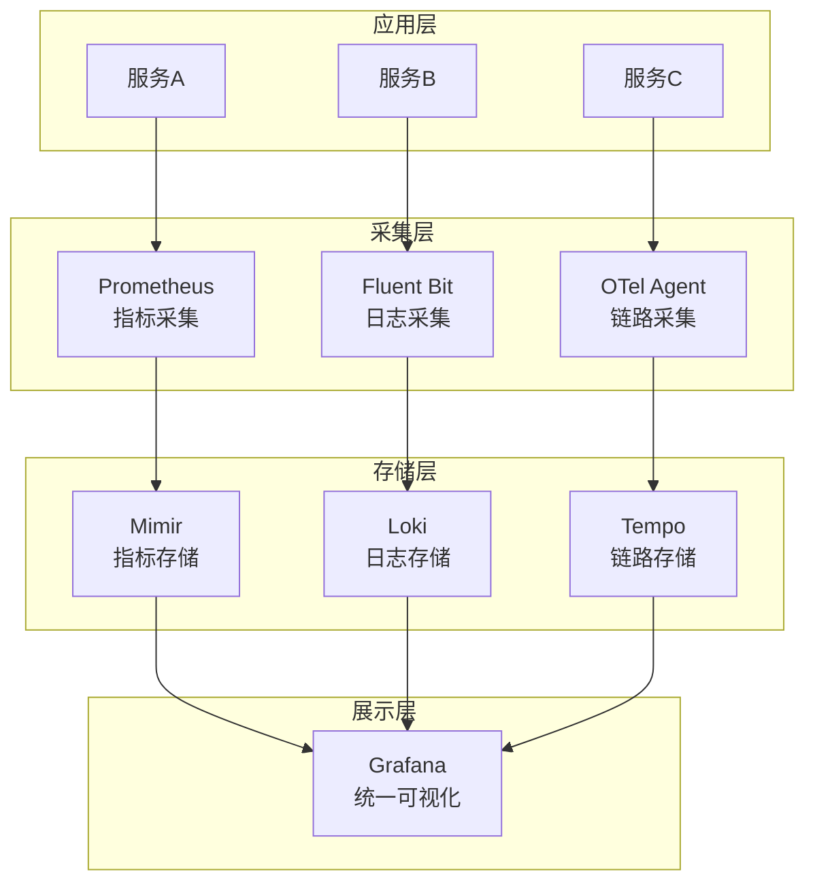
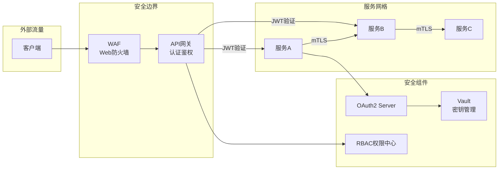
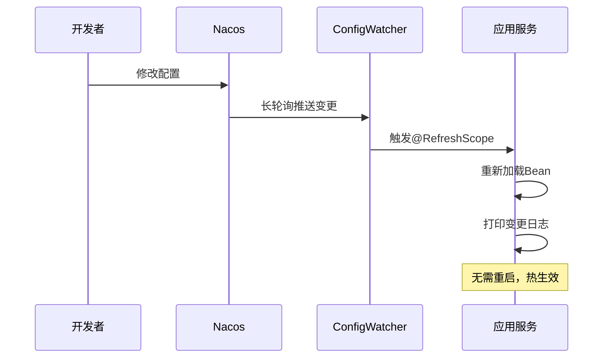

# Spring Cloud 微服务整合（Nacos / Sentinel / Seata / Gateway / 链路追踪）

> Spring Cloud = **Java 微服务治理的事实标准**。本篇聚焦 Spring Cloud Alibaba 生态的完整集成实战：Nacos（注册+配置）+ Sentinel（限流熔断）+ Seata（分布式事务）+ Gateway（网关）+ Sleuth/Zipkin（链路追踪），给出可直接落地的架构方案。

---

## 一、Spring Cloud 全景

```
Spring Cloud 生态：
  服务发现：Nacos / Eureka / Consul
  配置中心：Nacos Config / Apollo / Spring Cloud Config
  网关：Spring Cloud Gateway
  熔断：Sentinel / Resilience4j
  负载均衡：Spring Cloud LoadBalancer / Ribbon
  链路追踪：Sleuth + Zipkin / Micrometer Tracing
  分布式事务：Seata
  消息驱动：Spring Cloud Stream + RocketMQ/Kafka
  消费者驱动：OpenFeign（声明式 HTTP 客户端）
```

### 1.1 技术选型推荐

| 组件 | 推荐 | 备选 |
|------|------|------|
| 注册+配置 | Nacos（一站式） | Consul |
| 网关 | Spring Cloud Gateway | Kong |
| 熔断 | Sentinel（阿里生态） | Resilience4j |
| 分布式事务 | Seata（AT 模式） | 本地消息表 |
| 链路追踪 | Sleuth + Zipkin | SkyWalking |
| 消息 | RocketMQ | Kafka |

---

## 二、Nacos（注册+配置中心）

### 2.1 核心能力

```
Nacos = 服务注册发现 + 配置管理（一个组件解决两个问题）

服务注册：
  Provider 启动 → 注册到 Nacos（IP/端口/元数据）
  Consumer 启动 → 从 Nacos 拉取服务列表
  Provider 变更 → Nacos 长轮询推送 → Consumer 实时感知

配置管理：
  配置变更 → Nacos 推送 → 客户端 @RefreshScope 自动刷新
  多环境：data-id + group + namespace 隔离
```

### 2.2 配置示例

```yaml
# application.yml
spring:
  cloud:
    nacos:
      discovery:
        server-addr: nacos-server:8848
        namespace: dev
        group: DEFAULT_GROUP
      config:
        server-addr: nacos-server:8848
        file-extension: yaml
        group: DEFAULT_GROUP
        shared-configs:
          - data-id: common.yaml
            group: DEFAULT_GROUP
            refresh: true
```

### 2.3 集群部署

```
Nacos 集群（3 节点起步）：
  1. 部署 3 个 Nacos 实例
  2. 配置 cluster.conf（节点 IP 列表）
  3. 前置 Nginx 做负载均衡
  4. 客户端配置 Nginx 地址

数据一致性：
  Distro 协议（AP）：临时实例（服务注册）
  Raft 协议（CP）：持久实例（配置管理）
```

---

## 三、Sentinel（限流熔断）

### 3.1 核心概念

```
Sentinel = 流量控制 + 熔断降级 + 系统负载保护

流控规则：
  QPS 模式：限制每秒请求数
  线程数模式：限制并发线程数
  关联模式：当关联资源达到阈值时限流

熔断规则：
  慢调用比例：RT > 阈值的比例超过阈值 → 熔断
  异常比例：异常比例超过阈值 → 熔断
  异常数：异常数超过阈值 → 熔断
```

### 3.2 集成示例

```java
// 限流
@SentinelResource(value = "queryUser", blockHandler = "queryUserBlock")
public User queryUser(Long id) {
    return userService.getById(id);
}

public User queryUserBlock(Long id, BlockException ex) {
    return new User("默认用户");  // 降级返回
}

// 熔断降级
@SentinelResource(value = "callRemote", fallback = "callRemoteFallback")
public String callRemote() {
    return remoteService.call();
}

public String callRemoteFallback(Throwable ex) {
    return "降级响应";  // 异常降级
}
```

### 3.3 Dashboard 配置

```
Sentinel Dashboard（实时监控+规则配置）：
  访问：http://dashboard:8080
  功能：实时监控 / 流控规则 / 熔断规则 / 系统规则 / 热点规则
  持久化：规则推送到 Nacos/ZK（重启不丢失）
```

---

## 四、Seata（分布式事务）

### 4.1 四种模式

| 模式 | 原理 | 侵入性 | 性能 | 适用 |
|------|------|--------|------|------|
| AT | 自动生成回滚 SQL | 无 | 高 | 通用（默认推荐） |
| TCC | 手动实现 Try/Confirm/Cancel | 高 | 最高 | 高性能场景 |
| SAGA | 长事务编排（正向+补偿） | 中 | 中 | 长事务 |
| XA | 数据库两阶段提交 | 无 | 低 | 强一致 |

### 4.2 AT 模式集成

```java
// 1. 添加注解
@GlobalTransactional  // 分布式事务入口
public void createOrder(OrderDTO dto) {
    // 2. 调用库存服务（远程）
    stockService.deduct(dto.getSkuId(), dto.getCount());
    // 3. 创建订单（本地）
    orderMapper.insert(dto);
    // Seata 自动管理回滚
}

// 4. 库存服务
@Transactional
public void deduct(Long skuId, int count) {
    // Seata 自动生成 before image / after image
    stockMapper.deduct(skuId, count);
}
```

### 4.3 AT 模式原理

```
一阶段（自动）：
  1. 解析 SQL，记录 before image
  2. 执行业务 SQL
  3. 记录 after image
  4. 生成 undo log
  5. 提交本地事务（数据已提交）
  6. 通知 TC（事务协调器）

二阶段-提交：
  TC 通知所有分支提交 → 删除 undo log（异步，不阻塞）

二阶段-回滚：
  TC 通知所有分支回滚 → 根据 undo log 生成反向 SQL 执行
```

---

## 五、Spring Cloud Gateway（网关）

### 5.1 核心架构

```
请求 → Gateway（WebFlux 响应式）
  → RoutePredicateHandlerMapping（匹配路由）
  → FilteringWebHandler（执行过滤器链）
  → ProxyWebFilter（转发到后端服务）

路由配置：
  predicates: 匹配条件（Path/Header/Method/Query）
  filters: 处理逻辑（鉴权/限流/重写/灰度）
  uri: 后端服务地址（lb://service-name）
```

### 5.2 鉴权过滤器

```java
@Component
public class AuthFilter implements GlobalFilter, Ordered {
    @Override
    public Mono<Void> filter(ServerWebExchange exchange, GatewayFilterChain chain) {
        String token = exchange.getRequest().getHeaders().getFirst("Authorization");
        if (token == null || !validate(token)) {
            exchange.getResponse().setStatusCode(HttpStatus.UNAUTHORIZED);
            return exchange.getResponse().setComplete();
        }
        // 传递用户信息到下游
        exchange.getRequest().mutate()
            .header("X-User-Id", parseUserId(token));
        return chain.filter(exchange);
    }
}
```

---

## 六、链路追踪

### 6.1 Sleuth + Zipkin

```
Sleuth = 自动生成 TraceId/SpanId（贯穿整个调用链）
Zipkin = 可视化调用链（延迟/错误/依赖关系）

集成：
  1. 引入 spring-cloud-starter-sleuth + spring-cloud-sleuth-zipkin
  2. 配置 zipkin.base-url
  3. 自动注入 TraceId/SpanId 到日志
  4. 日志格式：[app-name, trace-id, span-id, export]
```

### 6.2 日志关联

```java
// 日志自动带 TraceId
log.info("查询用户 {}", userId);
// 输出：[user-service, abc123, def456, true] 查询用户 123

// 手动传递上下文
Span span = tracer.nextSpan().name("custom-operation").start();
try (Tracer.SpanInScope ws = tracer.withSpan(span)) {
    // 业务逻辑
} finally {
    span.end();
}
```

---

## 七、完整架构示例

```
                    ┌─────────────┐
                    │   Nginx LB  │
                    └──────┬──────┘
                           │
                    ┌──────┴──────┐
                    │   Gateway   │  ← 限流/鉴权/路由
                    └──────┬──────┘
                           │
              ┌────────────┼────────────┐
              │            │            │
         ┌────┴────┐ ┌────┴────┐ ┌────┴────┐
         │ 订单服务 │ │ 库存服务 │ │ 用户服务 │
         └────┬────┘ └────┬────┘ └────┬────┘
              │            │            │
              └────────────┼────────────┘
                           │
              ┌────────────┼────────────┐
              │            │            │
         ┌────┴────┐ ┌────┴────┐ ┌────┴────┐
         │  Nacos  │ │ Sentinel│ │  Seata  │
         │注册+配置│ │限流熔断  │ │分布式事务│
         └─────────┘ └─────────┘ └─────────┘
```

---

## 八、Spring Cloud Gateway 深入

### 8.1 Gateway 核心架构



### 8.2 路由断言工厂

| 断言工厂 | 配置示例 | 说明 |
|----------|----------|------|
| Path | `Path=/api/**` | 路径匹配 |
| Header | `Header=X-Auth-Token, \d+` | Header 匹配 |
| Method | `Method=GET,POST` | HTTP 方法匹配 |
| Query | `Query=name, zhangsan` | 参数匹配 |
| After | `After=2024-01-01T00:00:00+08:00` | 时间之后 |
| Before | `Before=2024-12-31T23:59:59+08:00` | 时间之前 |
| Between | `Between=time1,time2` | 时间区间 |
| Host | `Host=**.example.com` | 域名匹配 |
| RemoteAddr | `RemoteAddr=192.168.1.0/24` | IP 匹配 |
| Weight | `Weight=group1, 8` | 权重路由 |

### 8.3 Gateway 过滤器

```java
// 全局过滤器
@Component
public class AuthGlobalFilter implements GlobalFilter, Ordered {
    @Override
    public Mono<Void> filter(ServerWebExchange exchange, GatewayFilterChain chain) {
        String token = exchange.getRequest().getHeaders().getFirst("Authorization");
        if (token == null || !validate(token)) {
            exchange.getResponse().setStatusCode(HttpStatus.UNAUTHORIZED);
            return exchange.getResponse().setComplete();
        }
        // 传递用户信息
        exchange.getRequest().mutate()
            .header("X-User-Id", parseUserId(token));
        return chain.filter(exchange);
    }
    
    @Override
    public int getOrder() {
        return -1;  // 优先级（越小越优先）
    }
}

// 局部过滤器
@Component
public class RequestTimeFilter implements GatewayFilter, Ordered {
    @Override
    public Mono<Void> filter(ServerWebExchange exchange, GatewayFilterChain chain) {
        long start = System.currentTimeMillis();
        return chain.filter(exchange).then(Mono.fromRunnable(() -> {
            long duration = System.currentTimeMillis() - start;
            exchange.getResponse().getHeaders().add("X-Response-Time", duration + "ms");
        }));
    }
    
    @Override
    public int getOrder() {
        return 0;
    }
}
```

### 8.4 Gateway 限流配置

```yaml
spring:
  cloud:
    gateway:
      routes:
      - id: order-service
        uri: lb://order-service
        predicates:
        - Path=/api/order/**
        filters:
        - name: RequestRateLimiter
          args:
            redis-rate-limiter.replenishRate: 100
            redis-rate-limiter.burstCapacity: 200
            key-resolver: "#{@userKeyResolver}"

# KeyResolver 实现
@Bean
public KeyResolver userKeyResolver() {
    return exchange -> Mono.just(
        exchange.getRequest().getHeaders().getFirst("X-User-Id")
    );
}
```

---

## 九、Spring Cloud Circuit Breaker（Resilience4j）

### 9.1 核心组件

| 组件 | 说明 |
|------|------|
| CircuitBreaker | 熔断器（Closed/Open/HalfOpen） |
| RateLimiter | 限流器（固定窗口） |
| Retry | 重试（指数退避） |
| Bulkhead | 隔离器（信号量/线程池） |
| TimeLimiter | 超时控制 |
| Cache | 缓存（请求结果缓存） |

### 9.2 集成示例

```java
// 熔断器配置
@Bean
public CircuitBreakerConfig circuitBreakerConfig() {
    return CircuitBreakerConfig.custom()
        .failureRateThreshold(50)          // 失败率阈值
        .waitDurationInOpenState(Duration.ofSeconds(10))  // 熔断等待时间
        .slidingWindowSize(100)            // 滑动窗口大小
        .minimumNumberOfCalls(10)          // 最小请求数
        .build();
}

// 使用熔断器
@Service
public class OrderService {
    @CircuitBreaker(name = "orderService", fallbackMethod = "fallback")
    public Order getOrder(Long id) {
        return orderRepository.findById(id);
    }
    
    public Order fallback(Long id, Throwable t) {
        return new Order("默认订单");  // 降级返回
    }
}
```

### 9.3 Resilience4j 配置

```yaml
resilience4j:
  circuitbreaker:
    instances:
      orderService:
        slidingWindowSize: 100
        failureRateThreshold: 50
        waitDurationInOpenState: 10s
        permittedNumberOfCallsInHalfOpenState: 10
  retry:
    instances:
      orderService:
        maxAttempts: 3
        waitDuration: 500ms
        exponentialBackoffMultiplier: 2
  bulkhead:
    instances:
      orderService:
        maxConcurrentCalls: 25
        maxWaitDuration: 0
  timelimiter:
    instances:
      orderService:
        timeoutDuration: 3s
```

---

## 十、Spring Cloud Config Server 模式

### 10.1 Config Server 架构

```
Git/SVN/DB → Config Server → Config Client（应用）

配置流程：
  1. Config Server 从 Git/SVN 拉取配置
  2. 应用启动时从 Config Server 获取配置
  3. 配置变更 → Bus 通知 → 应用刷新
```

### 10.2 配置中心对比

| 维度 | Spring Cloud Config | Nacos Config | Apollo |
|------|---------------------|--------------|--------|
| 配置存储 | Git/SVN | 内置数据库 | 内置数据库 |
| 配置推送 | Bus（消息总线） | 长轮询 | 长轮询 |
| 版本管理 | Git 版本控制 | 内置版本管理 | 内置版本管理 |
| 灰度发布 | 不支持 | 支持 | 支持 |
| 权限管理 | Git 权限 | 内置权限 | 内置权限 |
| 运维复杂度 | 高（需维护 Git） | 低 | 中 |

### 10.3 Config Server 高可用

```yaml
# Config Server 集群 + Eureka 注册
spring:
  application:
    name: config-server
  cloud:
    config:
      server:
        git:
          uri: https://github.com/company/config-repo
    discovery:
      enabled: true
      service-id: config-server

# 客户端配置（通过服务发现获取 Config Server）
spring:
  cloud:
    config:
      discovery:
        enabled: true
        service-id: config-server
```

---

## 十一、Spring Cloud Sleuth/Micrometer Tracing

### 11.1 链路追踪架构

```
Spring Cloud Sleuth（2020+ 改为 Micrometer Tracing）：
  ├── 自动生成 TraceId/SpanId
  ├── 日志关联（MDC）
  ├── HTTP Header 传播
  └── 与 Zipkin/Jaeger 集成

Micrometer Tracing（新标准）：
  ├── 自动埋点
  ├── 与 Micrometer Metrics 集成
  ├── 支持 OpenTelemetry
  └── 多后端支持
```

### 11.2 配置示例

```yaml
# Micrometer Tracing + Zipkin
management:
  tracing:
    sampling:
      probability: 1.0  # 采样率 100%
  zipkin:
    tracing:
      endpoint: http://zipkin:9411/api/v2/spans

# 依赖
# micrometer-tracing-bridge-brave
# brave-instrumentation-http
```

### 11.3 手动传播上下文

```java
// 手动创建 Span
@Autowired
Tracer tracer;

public void processRequest() {
    Span span = tracer.nextSpan().name("custom-operation").start();
    try (Tracer.SpanInScope ws = tracer.withSpan(span)) {
        // 业务逻辑
        span.tag("userId", userId);
        span.annotate("processing started");
    } finally {
        span.end();
    }
}
```

---

## 十二、Spring Cloud Kubernetes 集成

### 12.1 集成方式

| 组件 | 功能 |
|------|------|
| spring-cloud-kubernetes-discovery | K8s Service 发现 |
| spring-cloud-kubernetes-config | ConfigMap/Secret 配置 |
| spring-cloud-kubernetes-loadbalancer | K8s Service 负载均衡 |

### 12.2 配置示例

```yaml
spring:
  cloud:
    kubernetes:
      discovery:
        enabled: true
      config:
        enabled: true
        sources:
        - configmap: my-config
        - secret: my-secret
```

### 12.3 与 Nacos 共存

```
双注册模式：
  应用同时注册到 K8s Service 和 Nacos
  K8s 集群内：使用 K8s Service 发现
  K8s 集群外：使用 Nacos 发现
  适用于混合云场景
```

---

## 十三、Spring Cloud Stream 消息驱动

### 13.1 Stream 架构

```
Binder（绑定器）：抽象消息中间件
  ├── Kafka Binder
  ├── RabbitMQ Binder
  ├── RocketMQ Binder
  └── Redis Binder

核心概念：
  Input Channel → Consumer
  Output Channel → Producer
  Binding → Channel 与中间件的映射
```

### 13.2 Kafka Binder 示例

```yaml
spring:
  cloud:
    stream:
      bindings:
        order-output:
          destination: order-topic
          content-type: application/json
          binder: kafka
        order-input:
          destination: order-topic
          content-type: application/json
          group: order-consumer-group
          binder: kafka
      kafka:
        binder:
          brokers: kafka:9092
          auto-create-topics: true
```

### 13.3 消费者分组与分区

```java
// 消费者组（负载均衡）
@StreamListener(Sink.INPUT)
public void consume(Order order) {
    // 同一 Group 只有一个实例消费
}

// 生产者分区（顺序保证）
@EnableBinding(Source.class)
public class OrderProducer {
    @Autowired
    private Source source;
    
    public void sendOrder(Order order) {
        // 按 orderId 分区，保证同一订单顺序
        source.output().send(MessageBuilder
            .withPayload(order)
            .setHeader("partitionKey", order.getOrderId())
            .build());
    }
}
```

---

## 十四、Spring Cloud Alibaba 组件全景

### 14.1 组件对比

| 组件 | 功能 | 替代 |
|------|------|------|
| Nacos | 注册+配置中心 | Eureka + Spring Cloud Config |
| Sentinel | 限流熔断 | Hystrix + Resilience4j |
| Seata | 分布式事务 | TCC + 本地消息表 |
| RocketMQ | 消息队列 | Kafka + RabbitMQ |
| Dubbo | RPC 框架 | OpenFeign + RestTemplate |
| Gateway | 网关 | Zuul |

### 14.2 Spring Cloud Alibaba 版本对应

| Spring Cloud Alibaba | Spring Cloud | Spring Boot |
|-----------------------|--------------|-------------|
| 2022.0.0 | 2022.0.0 | 3.0.x |
| 2021.0.5 | 2021.0.5 | 2.6.x |
| 2020.0.1 | Hoxton | 2.4.x |
| 2.2.9 | Greenwich | 2.3.x |

---

## 十五、Spring Cloud vs Dubbo 对比

### 15.1 核心能力对比

| 维度 | Spring Cloud | Dubbo |
|------|--------------|-------|
| 服务发现 | Nacos/Eureka/Consul | Nacos/ZK |
| 负载均衡 | LoadBalancer/Ribbon | 内置（随机/轮询） |
| 熔断 | Sentinel/Resilience4j | Sentinel |
| RPC | OpenFeign（HTTP） | Dubbo 协议（二进制） |
| 序列化 | JSON | Hessian2/Protobuf |
| 性能 | 中 | 高 |
| 生态 | Spring 全家桶 | 阿里全家桶 |

### 15.2 选型建议

```
选 Spring Cloud：
  ✓ 需要 Spring 生态集成（Boot/Data/Security）
  ✓ 多语言支持（HTTP 协议）
  ✓ 云原生/K8s 场景
  ✓ 团队熟悉 Spring

选 Dubbo：
  ✓ 高性能 RPC（二进制协议）
  ✓ 存量 Java 微服务
  ✓ 需要丰富的负载均衡/路由策略
  ✓ 阿里生态（Nacos/Sentinel/Seata）

混合使用：
  Spring Cloud Gateway + Dubbo RPC
  → 网关层用 Spring Cloud，内部 RPC 用 Dubbo
```

---

## 十六、Spring Cloud 高级主题与生产实践

### 16.1 Spring Cloud LoadBalancer vs Ribbon

```text
Spring Cloud LoadBalancer vs Netflix Ribbon：
┌──────────────────────┬────────────────────────────────────────────┐
│                      │ LoadBalancer            │ Ribbon             │
├──────────────────────┼────────────────────────────────────────────┤
│ 状态                  │ 活跃（Spring 官方）     │ 维护模式            │
│ 性能                  │ 非阻塞（基于 Reactor）  │ 阻塞（每个请求线程）│
│ 缓存                  │ 默认开启（30s 刷新）    │ 默认开启            │
│ 负载均衡算法           │ RoundRobin/Random      │ 多种内置           │
│ 自定义                │ ReactorLoadBalancer    │ IRule/IPing        │
│ 与 Spring Boot        │ 3.x 默认               │ 2.x 默认           │
└──────────────────────┴────────────────────────────────────────────┘
```

```java
// 自定义 LoadBalancer 配置
@Configuration
public class LoadBalancerConfig {

    @Bean
    public ReactorLoadBalancer<ServiceInstance> randomLoadBalancer(
            Environment environment,
            LoadBalancerClientFactory clientFactory) {
        String name = environment.getProperty(LoadBalancerClientFactory.PROPERTY_NAME);
        return new RandomLoadBalancer(
            clientFactory.getLazyProvider(name, ServiceInstanceListSupplier.class),
            name);
    }
}

// 使用自定义负载均衡
@LoadBalancerClient(name = "user-service", configuration = LoadBalancerConfig.class)
public interface UserServiceClient {
    @GetMapping("/users/{id}")
    User getUser(@PathVariable Long id);
}
```

### 16.2 Circuit Breaker 模式

```text
Spring Cloud Circuit Breaker 选项：
┌──────────────────────┬────────────────────────────────────────────┐
│                      │ Resilience4j           │ Hystrix（已废弃）  │
├──────────────────────┼────────────────────────────────────────────┤
│ 隔离策略              │ 信号量（默认）          │ 线程池/信号量      │
│ 熔断器状态            │ CLOSED/OPEN/HALF_OPEN  │ 同                 │
│ 滑动窗口              │ 基于计数/时间           │ 基于时间           │
│ 降级逻辑              │ fallbackMethod         │ fallback method   │
│ 限流                  │ 内置 RateLimiter       │ 不支持             │
│ 重试                  │ 内置 Retry             │ 不支持             │
│ 超时控制              │ CircuitBreakerTimeout  │ 线程池超时         │
└──────────────────────┴────────────────────────────────────────────┘
```

```java
// Resilience4j 熔断器配置
@Service
public class UserService {

    @CircuitBreaker(name = "userService", fallbackMethod = "getUserFallback")
    @Retry(name = "userService")
    @TimeLimiter(name = "userService")
    public CompletableFuture<User> getUser(Long id) {
        return CompletableFuture.supplyAsync(() -> {
            // 调用远程服务
            return restTemplate.getForObject("http://user-service/users/" + id, User.class);
        });
    }

    public CompletableFuture<User> getUserFallback(Long id, Throwable t) {
        // 降级逻辑
        return CompletableFuture.completedFuture(new User(id, "默认用户"));
    }
}
```

```yaml
# Resilience4j 配置
resilience4j:
  circuitbreaker:
    instances:
      userService:
        slidingWindowSize: 100
        failureRateThreshold: 50
        waitDurationInOpenState: 10s
        permittedNumberOfCallsInHalfOpenState: 10
        automaticTransitionFromOpenToHalfOpenEnabled: true
  retry:
    instances:
      userService:
        maxAttempts: 3
        waitDuration: 500ms
        enableExponentialBackoff: true
        exponentialBackoffMultiplier: 2
  timelimiter:
    instances:
      userService:
        timeoutDuration: 3s
        cancelRunningFuture: true
```

### 16.3 Spring Cloud Task（短时任务）

```java
// Spring Cloud Task 示例
@SpringBootApplication
public class BatchJobApplication {

    public static void main(String[] args) {
        SpringApplication.run(BatchJobApplication.class, args);
    }

    @Bean
    public TaskExecutionListener taskExecutionListener() {
        return new TaskExecutionListener() {
            @Override
            public void onTaskStartup(TaskExecution taskExecution) {
                System.out.println("Task Started: " + taskExecution.getTaskName());
            }

            @Override
            public void onTaskEnd(TaskExecution taskExecution) {
                System.out.println("Task Ended: " + taskExecution.getTaskName() 
                    + " Status: " + taskExecution.getExitCode());
            }
        };
    }

    @Bean
    public CommandLineRunner runner(TaskRepository taskRepository) {
        return args -> {
            // 执行任务逻辑
            System.out.println("Executing batch job...");
            // 任务完成后会自动记录到数据库
        };
    }
}
```

```yaml
# application.yml
spring:
  task:
    initialize-schema: always  # 自动创建任务记录表
  datasource:
    url: jdbc:mysql://localhost:3306/task_db
    username: root
    password: password
```

### 16.4 Spring Cloud Config（Git 后端）

```yaml
# Config Server 配置
spring:
  cloud:
    config:
      server:
        git:
          uri: https://github.com/example/config-repo
          default-label: main
          search-paths: '{application}'
          clone-on-start: true
          force-pull: true
        encrypt:
          enabled: true  # 启用加密
```

```java
// Config Client 使用
@RefreshScope  // 支持动态刷新
@RestController
public class ConfigController {

    @Value("${app.feature.enabled:false}")
    private boolean featureEnabled;

    @GetMapping("/feature")
    public Map<String, Object> getFeature() {
        return Map.of(
            "featureEnabled", featureEnabled,
            "timestamp", System.currentTimeMillis()
        );
    }
}

// 手动触发刷新
@PostConstruct
public void init() {
    // 监听配置变更事件
    ContextRefresher refresher = new ContextRefresher(applicationContext, ConfigurationProperties.class);
}
```

### 16.5 Spring Cloud Stream Binder 深入

```java
// Spring Cloud Stream 绑定器配置
@EnableBinding(Source.class, Sink.class)
public class StreamConfig {

    // 自定义 Binder
    @Bean
    public MessageConverter customMessageConverter() {
        return new JsonMessageConverter();
    }
}

// 消息生产者
@Service
@RequiredArgsConstructor
public class OrderEventPublisher {
    private final Source source;

    public void publishOrderCreated(Order order) {
        source.output().send(MessageBuilder
            .withPayload(order)
            .setHeader("eventType", "ORDER_CREATED")
            .setHeader("timestamp", System.currentTimeMillis())
            .build());
    }
}

// 消息消费者
@Service
@StreamListener(Sink.INPUT)
public class OrderEventHandler {

    @SendTo(Source.OUTPUT)  // 消息转换
    public Order handleOrderCreated(Order order) {
        // 处理订单
        order.setStatus("PROCESSED");
        return order;
    }

    @StreamListener(
        target = Sink.INPUT,
        condition = "headers['eventType']=='ORDER_CANCELLED'"
    )
    public void handleOrderCancelled(Order order) {
        // 处理取消订单
    }
}
```

```yaml
# Stream 配置
spring:
  cloud:
    stream:
      bindings:
        input:
          destination: order-events
          group: order-service
          content-type: application/json
        output:
          destination: order-events
          content-type: application/json
      rabbit:
        binder:
          admin-addresses: localhost:5672
      kafka:
        binder:
          brokers: localhost:9092
          auto-create-topics: true
```

### 16.6 Spring Cloud Function

```java
// Spring Cloud Function 函数定义
@Configuration
public class FunctionConfig {

    // 消费函数
    @Bean
    public Consumer<String> logMessage() {
        return message -> {
            System.out.println("Received: " + message);
        };
    }

    // 供应商函数
    @Bean
    public Supplier<String> generateEvent() {
        return () -> {
            return "Event-" + System.currentTimeMillis();
        };
    }

    // 函数管道
    @Bean
    public Function<String, String> uppercase() {
        return value -> value.toUpperCase();
    }

    @Bean
    public Function<String, String> exclaim() {
        return value -> value + "!";
    }

    // 组合函数
    @Bean
    public Function<String, String> shout() {
        return uppercase().andThen(exclaim());
    }
}

// 使用函数
@RestController
@RequiredArgsConstructor
public class FunctionController {
    private final Function<String, String> shout;

    @GetMapping("/shout/{message}")
    public String shout(@PathVariable String message) {
        return shout.apply(message);
    }
}
```

### 16.7 Spring Cloud Kubernetes 原生集成

```yaml
# Spring Cloud Kubernetes 配置
spring:
  cloud:
    kubernetes:
      enabled: true
      discovery:
        enabled: true
        all-namespaces: true
      config:
        enabled: true
        sources:
        - namespace: production
          name: my-config
      secrets:
        enabled: true
        sources:
        - namespace: production
          name: my-secret
```

```java
// 自动发现 Kubernetes 中的服务
@FeignClient(name = "user-service")  // 自动从 Kubernetes Service 发现
public interface UserServiceClient {

    @GetMapping("/users/{id}")
    User getUser(@PathVariable Long id);
}

// 使用 Kubernetes ConfigMap 和 Secret
@RefreshScope
@RestController
public class KubernetesConfigController {

    @Value("${config.from.configmap:default}")
    private String configValue;

    @Value("${secret.from.secret:default}")
    private String secretValue;

    @GetMapping("/config")
    public Map<String, String> getConfig() {
        return Map.of(
            "config", configValue,
            "secret", secretValue
        );
    }
}
```

```yaml
# Kubernetes ConfigMap 和 Secret
apiVersion: v1
kind: ConfigMap
metadata:
  name: my-config
  namespace: production
data:
  application.yml: |
    app:
      feature:
        enabled: true
      name: my-service
---
apiVersion: v1
kind: Secret
metadata:
  name: my-secret
  namespace: production
type: Opaque
data:
  database-password: cGFzc3dvcmQxMjM=
  api-key: c2VjcmV0LWFwaS1rZXk=
```

## 十七、Spring Cloud 配置中心深度对比

### 17.1 Config Server / Consul / Nacos 对比

| 维度 | Spring Cloud Config | Consul KV | Nacos Config |
|------|---------------------|-----------|--------------|
| 存储后端 | Git/SVN/JDBC | Consul KV | 内置 Derby/MySQL |
| 推送机制 | Bus（Spring Cloud Bus + MQ） | Long Polling | Long Polling（长轮询） |
| 版本管理 | Git 原生版本 | Consul 内置版本 | 内置版本+回滚 |
| 灰度发布 | 不原生支持 | 不原生支持 | 支持（Beta发布） |
| 权限控制 | Git 权限 | ACL/Token | RBAC（内置权限） |
| 多环境 | Profile + Label | Key 前缀隔离 | Namespace + Group + DataID |
| 动态刷新 | @RefreshScope + Bus | @RefreshScope | @RefreshScope（自动推送） |
| 运维复杂度 | 高（需维护 Git + Bus） | 中（依赖 Consul 集群） | 低（自带管理界面） |

### 17.2 Nacos Config 动态刷新原理



### 17.3 Spring Cloud Stream 消息驱动 Binder 抽象

```
Binder 抽象层：
  统一 API → Kafka Binder / RabbitMQ Binder / RocketMQ Binder

  Producer:
    output channel → Binder → Kafka/RabbitMQ/RocketMQ

  Consumer:
    Kafka/RabbitMQ/RocketMQ → Binder → input channel → @StreamListener

  优势：
    切换 MQ 只需改配置，代码零改动
    支持 consumer group / partition / DLQ
```

### 17.4 CircuitBreaker（Resilience4j）核心组件

| 组件 | 功能 | 配置 |
|------|------|------|
| CircuitBreaker | 熔断器（Closed/Open/HalfOpen） | slidingWindowSize/failureRateThreshold |
| RateLimiter | 限流器（令牌桶） | limitForPeriod/limitRefreshPeriod |
| Retry | 重试（指数退避） | maxAttempts/waitDuration |
| Bulkhead | 隔离器（信号量/线程池） | maxConcurrentCalls |
| TimeLimiter | 超时控制 | timeoutDuration |

### 17.5 微服务间通信模式对比

| 模式 | 协议 | 延迟 | 吞吐 | 适用场景 |
|------|------|------|------|----------|
| HTTP/REST | HTTP/JSON | 中 | 中 | 通用、跨语言 |
| gRPC | HTTP/2 + Protobuf | 低 | 高 | 高性能内部调用 |
| 异步MQ | Kafka/RocketMQ | 高 | 极高 | 解耦、削峰、事件驱动 |
| Feign+LB | HTTP + Ribbon | 中 | 中 | Spring 生态标准 |
| Dubbo RPC | TCP 二进制 | 低 | 高 | Java 体系高性能 RPC |

```
选型决策：
  同步调用 → gRPC（性能优先）或 Feign（简单优先）
  异步解耦 → MQ（Kafka/RocketMQ）
  跨语言 → HTTP/REST 或 gRPC
  高吞吐 → gRPC（多路复用）或 MQ
```

### 17.6 Spring Cloud Gateway 路由谓词与过滤器

| 说明 | 参数 |
|------|------|
| Path | Path=/api/\*\* |
| Header | Header=X-Tenant, \d+ |
| Method | Method=GET,POST |
| Query | Query=name, zhangsan |
| Host | Host=\*\*.example.com |
| Weight | Weight=group1, 80 |
| After/Before/Between | 时间窗口灰度 |

```yaml
# Gateway 路由 + 限流配置
spring:
  cloud:
    gateway:
      routes:
        - id: order-service
          uri: lb://order-service
          predicates:
            - Path=/api/orders/**
            - Weight=group1, 90
          filters:
            - name: RequestRateLimiter
              args:
                redis-rate-limiter.replenishRate: 100
                redis-rate-limiter.burstCapacity: 200
            - name: CircuitBreaker
              args:
                name: orderCB
                fallbackUri: forward:/fallback
```

## 二十、OpenTelemetry 统一可观测

### 20.3 OpenTelemetry SDK 初始化与导出

```text
SDK 初始化流程：
  1. 创建 TracerProvider
     → 设置 Resource（service.name, env）
     → 配置 BatchSpanProcessor
     → 挂载 OTLP Exporter

  2. 创建 MeterProvider
     → 配置 PeriodicExportingMeterReader
     → 挂载 OTLP Metrics Exporter

  3. 创建 LoggerProvider
     → 配置 BatchLogRecordProcessor
     → 挂载 OTLP Log Exporter

  4. 注册到 GlobalOpenTelemetry
     → 自动注入 Spring Bean
     → 通过 @Observed 注解采集
```

### 20.4 Trace Context 传播格式

| 传播格式 | 说明 | 适用场景 |
|----------|------|----------|
| W3C TraceContext | 标准格式 | HTTP/gRPC 调用 |
| B3 (Zipkin) | Zipkin 格式 | 兼容 Zipkin |
| Jaeger | Jaeger 格式 | 兼容 Jaeger |
| baggage | 业务上下文 | 跨服务传递业务数据 |

## 二十一、微服务灰度发布与流量染色

### 灰度发布策略

```
灰度发布策略：
  1. 金丝雀发布（Canary）
     → 先发 1% 流量到新版本
     → 观察指标 15 分钟
     → 逐步扩大到 100%

  2. 蓝绿发布（Blue-Green）
     → 两套环境并行
     → 流量一次性切换
     → 回滚 = 切回旧环境

  3. A/B 测试
     → 按用户属性分流
     → 同时运行多版本
     → 统计效果对比
```

### 流量染色架构

```text
流量染色流程：
  请求进入 → API 网关
    → 根据规则打标（Header: x-canary=true）
    → 染色流量 → 灰度服务
    → 未染色流量 → 正常服务

  染色规则：
    按用户 ID 尾号
    按地域/IP 段
    按 Header/Query 参数
    按比例百分比
```

## 二十二、Service Mesh 数据平面（Envoy Sidecar）

### Envoy Sidecar 注入

```yaml
# Istio 自动注入
apiVersion: apps/v1
kind: Deployment
metadata:
  labels:
    sidecar.istio.io/inject: "true"
spec:
  template:
    metadata:
      labels:
        sidecar.istio.io/inject: "true"
```

### Envoy 代理能力

| 能力 | 说明 | 配置方式 |
|------|------|----------|
| 负载均衡 | 多种算法 | RouteConfiguration |
| 熔断 | 连接/请求限制 | CircuitBreaker |
| 超时重试 | 可配置 | RouteAction |
| mTLS | 双向认证 | PeerAuthentication |
| 访问日志 | 详细记录 | AccessLog |

## 二十三、混沌工程注入框架

### Chaos Mesh 架构

```text
Chaos Mesh 架构：
  Control Plane → Dashboard + Controller
    → 管理 Chaos 实验

  Daemon Plane → Chaosd + Chaos Daemon
    → 在每个 Pod 注入故障

  支持故障类型：
    Pod Chaos：PodKill / PodChaos / PodNetworkChaos
    Network Chaos：延迟/丢包/带宽限制
    IO Chaos：文件读写延迟/错误
    Time Chaos：时钟偏移
    Stress Chaos：CPU/内存压力
```

### 混沌实验流程

| 阶段 | 活动 | 目标 |
|------|------|------|
| 稳态假设 | 定义正常指标范围 | P99 < 200ms |
| 注入故障 | Pod 网络延迟 200ms | 验证熔断是否生效 |
| 观察指标 | 监控延迟/错误率 | 确认影响范围 |
| 恢复验证 | 移除故障 | 指标回归正常 |
| 经验沉淀 | 文档化实验结果 | 优化架构设计 |

## 微服务故障排查

### 常见故障处理

| 故障类型 | 排查步骤 | 解决方案 |
|----------|----------|----------|
| 服务不可用 | 检查注册中心/健康检查 | 重启服务 |
| 调用超时 | 检查网络/超时配置 | 调整超时 |
| 限流触发 | 检查限流配置 | 调整限流参数 |
| 熔断触发 | 检查下游服务 | 修复下游 |

### 故障排查命令

```bash
# 检查服务注册状态
curl -s http://localhost:8848/nacos/v1/ns/instance/list?serviceName=myservice

# 检查服务健康状态
curl -s http://localhost:8848/nacos/v1/ns/instance/list?serviceName=myservice&healthy=true

# 检查配置
curl -s http://localhost:8848/nacos/v1/cs/configs?dataId=myconfig&group=DEFAULT_GROUP

# 检查日志
tail -f /var/log/myservice/myservice.log
```

## 二十四、Spring Cloud配置中心详解

### 24.1 配置中心对比

| 特性 | Spring Cloud Config | Nacos | Apollo | Consul |
|------|-------------------|-------|--------|--------|
| 配置格式 | Properties/YAML | 多格式 | 多格式 | KV |
| 动态刷新 | @RefreshScope | 监听推送 | 监听推送 | 轮询 |
| 版本管理 | Git | 本地 | 本地 | 无 |
| 权限控制 | Git权限 | 命名空间 | 环境/权限 | ACL |
| 监控审计 | Git历史 | 控制台 | 控制台 | 日志 |
| 高可用 | Git高可用 | 集群 | 集群 | 集群 |

### 24.2 配置中心选择

```
配置中心选择：
  Spring Cloud Config：
    优点：Git集成，版本管理好
    缺点：动态刷新弱，高可用依赖Git
    适用：已有Git基础设施

  Nacos：
    优点：动态推送，控制台好用
    缺点：与Spring Cloud绑定
    适用：Spring Cloud Alibaba

  Apollo：
    优点：功能全，权限细粒度
    缺点：部署复杂，资源消耗大
    适用：大型企业

  Consul：
    优点：服务发现+配置一体
    缺点：配置功能弱
    适用：Consul生态
```

## 二十五、OpenFeign详解

### 25.1 OpenFeign vs RestTemplate

| 特性 | OpenFeign | RestTemplate |
|------|-----------|--------------|
| 声明式 | 是 | 否 |
| 负载均衡 | 集成Ribbon | 需手动 |
| 熔断降级 | 集成Hystrix/Sentinel | 需手动 |
| 请求拦截 | 支持 | 不支持 |
| 日志 | 支持 | 基础 |
| 学习曲线 | 低 | 中 |

### 25.2 OpenFeign使用示例

```java
// OpenFeign客户端定义
@FeignClient(
    name = "user-service",
    fallback = UserServiceFallback.class,
    configuration = FeignConfig.class
)
public interface UserServiceClient {
    @GetMapping("/users/{id}")
    User getUser(@PathVariable("id") Long id);
    
    @PostMapping("/users")
    User createUser(@RequestBody User user);
}

// 降级实现
@Component
public class UserServiceFallback implements UserServiceClient {
    @Override
    public User getUser(Long id) {
        return new User(id, "默认用户", "默认邮箱");
    }
    
    @Override
    public User createUser(User user) {
        throw new RuntimeException("服务不可用");
    }
}
```

## 二十六、Spring Cloud Stream详解

### 26.1 Stream核心概念

```
Spring Cloud Stream核心概念：
  Binder：消息中间件抽象层
  Input/Channel：消息输入通道
  Output/Channel：消息输出通道
  Source：消息生产者
  Sink：消息消费者

支持的Binder：
  Kafka
  RabbitMQ
  RocketMQ
  Redis
  JMS
```

### 26.2 Stream使用示例

```java
// 定义Output通道
@EnableBinding(Source.class)
public class MessageProducer {
    @Autowired
    private Source source;
    
    public void sendMessage(String message) {
        source.output().send(MessageBuilder.withPayload(message).build());
    }
}

// 定义Input通道
@EnableBinding(Sink.class)
public class MessageConsumer {
    @StreamListener(Sink.INPUT)
    public void handleMessage(String message) {
        // 处理消息
    }
}
```

## 二十七、微服务熔断降级详解

### 27.1 熔断降级对比

| 特性 | Hystrix | Sentinel | Resilience4j |
|------|---------|----------|--------------|
| 状态 | 维护模式 | 活跃 | 活跃 |
| 熔断 | 支持 | 支持 | 支持 |
| 限流 | 线程池隔离 | 信号量隔离 | 信号量隔离 |
| 降级 | 支持 | 支持 | 支持 |
| 监控 | Dashboard | Dashboard | Micrometer |
| 配置 | 动态 | 动态 | 动态 |

### 27.2 熔断降级配置

```yaml
# Sentinel熔断降级配置
spring:
  cloud:
    sentinel:
      datasource:
        ds1:
          file:
            file: classpath:degrade-rule.json
            dataType: json
            ruleType: DEGRADE

# degrade-rule.json
[
  {
    "resource": "user-service",
    "grade": 0,
    "count": 100,
    "timeWindow": 10,
    "minRequestAmount": 5,
    "statIntervalMs": 1000
  }
]
```

## 二十八、微服务通信模式详解

### 28.1 通信模式对比

| 模式 | 说明 | 优点 | 缺点 | 适用场景 |
|------|------|------|------|---------|
| 同步调用 | HTTP/gRPC | 简单 | 耦合高 | 简单场景 |
| 异步消息 | MQ | 解耦 | 一致性弱 | 事件驱动 |
| 事件驱动 | Event | 松耦合 | 复杂 | 复杂业务 |
| 响应式 | WebFlux | 高性能 | 学习曲线陡 | 高并发 |

### 28.2 通信模式选择

```
通信模式选择：
  同步调用：
    适用：查询操作，简单场景
    技术：OpenFeign/RestTemplate/gRPC

  异步消息：
    适用：写操作，解耦场景
    技术：Kafka/RabbitMQ/RocketMQ

  事件驱动：
    适用：复杂业务，事件溯源
    技术：EventStore/Kafka

  响应式：
    适用：高并发，实时系统
    技术：WebFlux/R2DBC
```

- Spring Cloud Gateway 见「[Spring Cloud Gateway](../基础知识/中间件/SpringCloudGateway.md)」；
- Nacos 源码见「[源码系列/Nacos](../源码系列/Nacos.md)」；
- Sentinel 源码见「[源码系列/Sentinel](../源码系列/sentinel.md)」；
- Seata 详细见「[分布式事务 Seata](../基础知识/中间件/分布式事务Seata.md)」；
- 微服务治理见「[架构/微服务治理全链路](../架构/微服务治理全链路.md)」。

> 一句话：**Spring Cloud Alibaba = Nacos（注册+配置）+ Sentinel（限流熔断）+ Seata（分布式事务）+ Gateway（网关）——微服务全家桶，先跑通一个完整 demo，再逐个深入**。

---

## 二十四、微服务通信模式

### 24.1 同步 vs 异步

| 通信模式 | 技术 | 优点 | 缺点 | 适用场景 |
|----------|------|------|------|----------|
| 同步 REST | Feign/RestTemplate | 简单直观 | 阻塞、延迟高 | 查询操作 |
| 同步 gRPC | gRPC | 高性能、强类型 | 学习成本高 | 内部调用 |
| 异步消息 | Kafka/RocketMQ | 解耦、削峰 | 最终一致性 | 事件驱动 |
| 异步事件 | Spring Event | 简单、进程内 | 不可靠 | 单体应用 |

### 24.2 通信模式选择



---

## 二十五、服务治理深入

### 25.1 服务治理能力矩阵

| 治理能力 | Sentinel | Hystrix | Resilience4j | 说明 |
|----------|----------|---------|--------------|------|
| 限流 | 支持 | 不支持 | 支持 | 流量控制 |
| 熔断 | 支持 | 支持 | 支持 | 失败率触发 |
| 降级 | 支持 | 支持 | 支持 | 返回兜底值 |
| 热点参数 | 支持 | 不支持 | 不支持 | 热点数据保护 |
| 系统自适应 | 支持 | 不支持 | 不支持 | CPU/负载保护 |

### 25.2 服务治理配置

```yaml
# Sentinel 限流配置
sentinel:
  transport:
    dashboard: localhost:8080
  datasource:
    flow:
      nacos:
        server-addr: localhost:8848
        data-id: sentinel-flow-rules
        group-id: SENTINEL_GROUP
        rule-type: flow
```

---

## 二十六、分布式事务深入

### 26.1 事务模式对比

| 模式 | 一致性 | 性能 | 复杂度 | 适用场景 |
|------|--------|------|--------|----------|
| AT | 最终一致 | 高 | 低 | 一般业务 |
| TCC | 最终一致 | 中 | 高 | 资金业务 |
| SAGA | 最终一致 | 高 | 中 | 长事务 |
| XA | 强一致 | 低 | 高 | 银行核心 |

### 26.2 事务模式选择

```mermaid
flowchart TD
    A[分布式事务需求] --> B{一致性要求}
    B -->|强一致| C[XA模式]
    B -->|最终一致| D{业务复杂度}
    D -->|简单| E[AT模式]
    D -->|复杂| F{TCC模式]
    D -->|长事务| G[SAGA模式]
```

---

## 二十七、监控与可观测性

### 27.1 可观测性三支柱

| 支柱 | 技术栈 | 采集方式 | 存储 | 可视化 |
|------|--------|----------|------|--------|
| 指标 | Prometheus | Agent采集 | TSDB | Grafana |
| 日志 | ELK/Loki | Filebeat | ES/Loki | Kibana |
| 链路 | SkyWalking/Jaeger | SDK埋点 | ES | UI |

### 27.2 监控配置

```yaml
# Prometheus 监控配置
scrape_configs:
  - job_name: 'spring-cloud-service'
    metrics_path: '/actuator/prometheus'
    static_configs:
      - targets: ['localhost:8080']
```

---

## 配置中心对比（Config Server/Consul/Nacos）

| 维度 | Config Server | Consul | Nacos |
|------|---------------|--------|-------|
| 配置格式 | Git/文件 | KV存储 | 多格式 |
| 动态推送 | Webhook | Long Polling | 长轮询+推送 |
| 历史版本 | Git版本 | 不支持 | 原生支持 |
| 权限控制 | Git权限 | ACL | RBAC |
| 集群模式 | 多实例 | Raft | Raft |
| 适用场景 | Git生态 | Service Mesh | 阿里生态 |

```yaml
# Nacos配置示例
spring.cloud.nacos.config.server-addr: nacos:8848
spring.cloud.nacos.config.shared-configs[0]:
  data-id: common.yaml
  group: DEFAULT_GROUP
  refresh: true
```

## Gateway路由（谓词/过滤器/限流）

### Gateway核心概念


| 谓词 | 说明 | 示例 |
|------|------|------|
| Path | 路径匹配 | Path('/api/**') |
| Host | 主机匹配 | Host('**.example.com') |
| Method | HTTP方法 | Method(GET,POST) |
| Header | 请求头匹配 | Header('X-Token','xxx') |
| After | 时间之后 | After(2024-01-01T00:00:00) |

### Gateway限流配置

```yaml
spring:
  cloud:
    gateway:
      routes:
      - id: user-service
        uri: lb://user-service
        predicates:
        - Path=/api/user/**
        filters:
        - name: RequestRateLimiter
          args:
            redis-rate-limiter.replenishRate: 100
            redis-rate-limiter.burstCapacity: 200
            key-resolver: "#{@userKeyResolver}"
```

## OpenFeign底层（InvocationHandler/负载均衡/熔断）

### OpenFeign执行流程

```
调用流程：
  1. @FeignClient接口 → JDK动态代理
  2. InvocationHandler.invoke() → MethodMetadata解析
  3. SynchronousMethodHandler处理 → 拼装HTTP请求
  4. Client执行 → LoadBalancer负载均衡
  5. ResponseDecoder解码 → 返回结果

关键组件：
  InvocationHandler：动态代理处理器
  SynchronousMethodHandler：方法调用处理器
  Client：HTTP执行器（OkHttp/Apache）
  LoadBalancer：负载均衡（Ribbon/LoadBalancer）
```

### 熔断集成

```java
// OpenFeign + Sentinel熔断
@FeignClient(
    name = "user-service",
    fallback = UserServiceFallback.class
)
public interface UserService {
    @GetMapping("/user/{id}")
    User getUser(@PathVariable Long id);
}

// Fallback实现
@Component
public class UserServiceFallback implements UserService {
    @Override
    public User getUser(Long id) {
        return new User(id, "降级用户");
    }
}
```

## Stream消息驱动（Binder）

### Stream架构


| Binder | 中间件 | 适用场景 |
|--------|--------|----------|
| Kafka | Kafka | 大数据生态 |
| RabbitMQ | RabbitMQ | 企业级消息 |
| RocketMQ | RocketMQ | 阿里生态 |

```java
// Stream生产者
@EnableBinding(Source.class)
public class EventProducer {
    @Autowired
    private Source source;

    public void sendOrder(Order order) {
        source.output().send(
            MessageBuilder.withPayload(order).build());
    }
}

// Stream消费者
@EnableBinding(Sink.class)
public class EventConsumer {
    @StreamListener(Sink.INPUT)
    public void handleOrder(Order order) {
        // 处理订单
    }
}
```

## Circuit Breaker（Resilience4j）

### Resilience4j核心组件

| 组件 | 说明 | 配置 |
|------|------|------|
| CircuitBreaker | 熔断器 | 滑动窗口/阈值 |
| RateLimiter | 限流器 | 令牌桶 |
| Retry | 重试 | 指数退避 |
| Bulkhead | 隔离舱 | 信号量/线程池 |
| TimeLimiter | 超时 | 超时控制 |

```java
// CircuitBreaker配置
CircuitBreakerConfig config = CircuitBreakerConfig.custom()
    .failureRateThreshold(50)
    .waitDurationInOpenState(Duration.ofMillis(1000))
    .slidingWindowSize(10)
    .build();

CircuitBreaker cb = CircuitBreaker.of("userService", config);

// 使用
Supplier<User> decoratedSupplier = Decorators
    .ofSupplier(() -> userService.getUser(id))
    .withCircuitBreaker(cb)
    .decorate();

Try<User> result = Try.ofSupplier(decoratedSupplier);
```

## 微服务间通信（HTTP/gRPC/MQ对比）

| 维度 | HTTP/REST | gRPC | MQ |
|------|-----------|------|-----|
| 协议 | HTTP/1.1 | HTTP/2 | 自定义 |
| 序列化 | JSON | Protobuf | 多种 |
| 性能 | 中 | 高 | 高 |
| 流式 | 有限 | 原生支持 | 原生支持 |
| 跨语言 | 通用 | 多语言 | 多语言 |
| 适用 | 对外API | 内部RPC | 异步解耦 |

## 服务网格（Istio sidecar）

### Istio架构



| 功能 | 说明 |
|------|------|
| 流量管理 | 路由、限流、熔断 |
| 安全 | mTLS、认证、授权 |
| 可观测 | 链路追踪、指标、日志 |
| 策略 | 限流、配额、访问控制 |

## 微服务拆分（DDD/限界上下文/领域事件）

### DDD拆分原则

```
DDD核心概念：
  领域（Domain）：业务领域
  限界上下文（Bounded Context）：业务边界
  领域事件（Domain Event）：业务事件

拆分步骤：
  1. 识别领域：梳理业务能力
  2. 划分限界上下文：确定服务边界
  3. 定义领域事件：服务间通信
  4. 确定聚合根：数据一致性边界

示例：
  电商领域：
    用户上下文（User Context）
    商品上下文（Product Context）
    订单上下文（Order Context）
    支付上下文（Payment Context）
    物流上下文（Logistics Context）
```

## 微服务监控（链路追踪/日志聚合/指标采集）

### 监控三大支柱

| 支柱 | 工具 | 说明 |
|------|------|------|
| 链路追踪 | SkyWalking/Jaeger | 请求链路追踪 |
| 日志聚合 | ELK/Loki | 统一日志管理 |
| 指标采集 | Prometheus/Grafana | 系统指标监控 |

```yaml
# Micrometer + Prometheus
management:
  endpoints:
    web:
      exposure:
        include: health,info,prometheus
  metrics:
    tags:
      application: ${spring.application.name}
    export:
      prometheus:
        enabled: true
```

## 微服务安全（OAuth2/JWT/HTTPS）

### 安全架构



| 安全机制 | 说明 | 适用场景 |
|----------|------|----------|
| OAuth2 | 授权框架 | 第三方登录 |
| JWT | 令牌格式 | 无状态认证 |
| HTTPS | 传输加密 | 所有场景 |
| mTLS | 双向认证 | 服务间安全 |
| RBAC | 角色权限 | 细粒度控制 |

## 二十八、微服务监控体系全景

### 28.1 三大支柱对比

| 监控支柱 | 工具 | 数据类型 | 存储 | 查询语言 |
|----------|------|----------|------|----------|
| Metrics（指标） | Prometheus | 数值时间序列 | TSDB | PromQL |
| Logging（日志） | ELK/Loki | 文本日志 | ES/S3 | LogQL/KQL |
| Tracing（链路） | Jaeger/Zipkin | 分布式链路 | ES/内存 | TraceQL |



### 28.2 Micrometer Tracing 集成

```java
// 1. 添加依赖
// spring-cloud-starter-zipkin
// spring-boot-starter-actuator

// 2. 配置
management:
  tracing:
    sampling:
      probability: 1.0  // 采样率100%
  zipkin:
    tracing:
      endpoint: http://zipkin:9411/api/v2/spans

// 3. 自定义Span
@Service
public class OrderService {
    @Autowired
    private Tracer tracer;
    
    public Order createOrder(OrderRequest req) {
        Span span = tracer.nextSpan().name("createOrder");
        try (Tracer.SpanInScope ws = tracer.withSpan(span.start())) {
            span.tag("userId", req.getUserId());
            span.event("validation_passed");
            // 业务逻辑
            return orderRepository.save(order);
        } finally {
            span.end();
        }
    }
}
```

### 28.3 Grafana Dashboard 关键面板

| 面板 | 指标 | 告警阈值 |
|------|------|----------|
| 服务可用性 | 成功请求/总请求 | <99.9% |
| P99延迟 | http_server_requests_seconds | >500ms |
| 错误率 | 错误请求/总请求 | >1% |
| GC暂停 | jvm_gc_pause_seconds | >200ms |
| 线程池 | 线程活跃数/最大数 | >80% |
| 连接池 | 活跃连接/最大连接 | >80% |

---

## 二十九、微服务安全体系深度

### 29.1 安全架构全景



### 29.2 mTLS 服务间认证

```yaml
# Istio mTLS 配置
apiVersion: security.istio.io/v1beta1
kind: PeerAuthentication
metadata:
  name: default
  namespace: production
spec:
  mtls:
    mode: STRICT  # 强制mTLS
---
# 服务间调用示例
# 调用方自动携带证书，被调用方验证证书
# 无需修改业务代码，Sidecar自动处理
```

### 29.3 权限模型对比

| 模型 | 核心思想 | 适用场景 | 复杂度 |
|------|----------|----------|--------|
| RBAC | 角色→权限 | 企业内部系统 | 低 |
| ABAC | 属性→策略 | 细粒度控制 | 高 |
| ReBAC | 关系→权限 | 社交/协作系统 | 中 |
| PBAC | 策略→权限 | 动态权限 | 高 |

```java
// RBAC 实现示例
@Entity
public class Role {
    @Id
    private String name;
    @ManyToMany
    private Set<Permission> permissions;
}

@Entity
public class UserRole {
    @ManyToOne
    private User user;
    @ManyToOne
    private Role role;
    private String scope; // 作用域：全局/部门/项目
}

// 权限检查
@PreAuthorize("hasRole('ADMIN') or hasPermission(#resource, 'WRITE')")
public void updateResource(Resource resource) {
    // 业务逻辑
}
```

---

## 三十、微服务配置管理最佳实践

### 30.1 配置分层模型

```text
配置优先级（从低到高）：
  1. application.yml（默认配置）
  2. application-{profile}.yml（环境配置）
  3. Nacos远程配置（配置中心）
  4. 环境变量（部署时注入）
  5. 命令行参数（最高优先级）
  
命名规范：
  服务名-profile.yml → order-service-dev.yml
  分组：DEFAULT_GROUP / 按业务线分组
  命名空间：dev / test / staging / prod
```

### 30.2 配置加密方案

```yaml
# Nacos配置加密（Jasypt集成）
spring:
  cloud:
    nacos:
      config:
        server-addr: nacos:8848
        # 配置内容使用ENC()加密
        # 数据库密码：ENC(加密后的密文)

# Jasypt密钥管理
jasypt:
  encryptor:
    password: ${JASYPT_KEY}  # 密钥从环境变量获取
    algorithm: PBEWithMD5AndDES
```

### 30.3 配置变更通知流程



---

## 三十一、微服务部署与运维

### 31.1 部署策略对比

| 策略 | 描述 | 风险 | 回滚速度 | 适用场景 |
|------|------|------|----------|----------|
| 滚动更新 | 逐个替换实例 | 中 | 快 | 常规发布 |
| 蓝绿部署 | 两套环境切换 | 低 | 极快 | 关键服务 |
| 金丝雀 | 小比例试运行 | 极低 | 快 | 高风险变更 |
| A/B测试 | 按用户分流 | 低 | 快 | 功能验证 |
| 影子模式 | 生产流量复制 | 极低 | 极快 | 性能测试 |

### 31.2 Kubernetes 部署配置

```yaml
# Deployment配置
apiVersion: apps/v1
kind: Deployment
metadata:
  name: order-service
spec:
  replicas: 3
  strategy:
    type: RollingUpdate
    rollingUpdate:
      maxSurge: 1
      maxUnavailable: 0
  template:
    spec:
      containers:
      - name: order-service
        image: order-service:1.0.0
        resources:
          requests:
            memory: "512Mi"
            cpu: "250m"
          limits:
            memory: "1Gi"
            cpu: "500m"
        readinessProbe:
          httpGet:
            path: /actuator/health/readiness
            port: 8080
          initialDelaySeconds: 30
          periodSeconds: 10
        livenessProbe:
          httpGet:
            path: /actuator/health/liveness
            port: 8080
          initialDelaySeconds: 60
          periodSeconds: 15
```

### 31.3 服务降级策略

| 降级级别 | 策略 | 触发条件 | 恢复条件 |
|----------|------|----------|----------|
| L1-警告 | 告警通知 | 错误率>5% | 错误率<2% |
| L2-限流 | 令牌桶限流 | QPS>阈值 | QPS<阈值 |
| L3-熔断 | 断路器打开 | 错误率>50% | 半开成功 |
| L4-降级 | 返回兜底数据 | 超时>3s | 服务恢复 |
| L5-隔离 | 线程池隔离 | 线程池满 | 线程池空闲 |

---

## 三十二、微服务测试策略

### 32.1 测试金字塔

```text
         /\
        /  \  E2E测试（少量）
       /----\
      /      \  集成测试（适量）
     /--------\
    /          \  单元测试（大量）
   /------------\
  
  单元测试：Mock外部依赖，验证业务逻辑
  集成测试：验证服务间协作、数据库交互
  E2E测试：验证完整用户流程
```

### 32.2 测试工具矩阵

| 测试类型 | 工具 | 特点 | 执行环境 |
|----------|------|------|----------|
| 单元测试 | JUnit 5 + Mockito | 快速、隔离 | 本地 |
| 集成测试 | Testcontainers | 真实依赖容器 | 本地/CI |
| API测试 | RestAssured | HTTP接口验证 | 本地/CI |
| 契约测试 | Pact | 消费者驱动 | CI |
| 性能测试 | Gatling/JMeter | 高并发模拟 | 独立环境 |

---

## 三十三、微服务性能优化

### 33.1 性能瓶颈分析

| 瓶颈 | 现象 | 排查工具 | 优化方案 |
|------|------|----------|----------|
| 线程池满 | 请求排队、超时 | jstack/Arthas | 调整线程池参数 |
| 连接池耗尽 | 获取连接超时 | HikariCP监控 | 增加最大连接数 |
| GC停顿 | 响应延迟飙升 | GC日志/JFR | 调整堆大小/GC算法 |
| 网络延迟 | 跨机房调用慢 | 链路追踪 | 就近部署/缓存 |
| 数据库慢查询 | SQL执行慢 | 慢查询日志 | 优化SQL/加索引 |

### 33.2 连接池优化配置

```yaml
# HikariCP连接池优化
spring:
  datasource:
    hikari:
      maximum-pool-size: 20
      minimum-idle: 5
      idle-timeout: 30000
      max-lifetime: 1800000
      connection-timeout: 30000
      leak-detection-threshold: 60000
      pool-name: HikariPool-OrderService
      data-source-properties:
        cachePrepStmts: true
        prepStmtCacheSize: 250
        prepStmtCacheSqlLimit: 2048
        useServerPrepStmts: true
```

### 33.3 缓存策略

| 缓存层级 | 工具 | 延迟 | 一致性 | 适用场景 |
|----------|------|------|--------|----------|
| 本地缓存 | Caffeine | 纳秒级 | 弱 | 热点数据 |
| 分布式缓存 | Redis | 毫秒级 | 中 | 共享数据 |
| 数据库缓存 | MySQL Query Cache | 毫秒级 | 强 | 查询结果 |
| CDN缓存 | Nginx/CDN | 毫秒级 | 弱 | 静态资源 |

---

## 与其他板块的关系

- Redis 知识见「[基础知识/redis知识](redis知识.md)」；
- 大数据链路见「[大数据/08-流处理计算：Flink](大数据/08-流处理计算：Flink.md)」；
- 架构设计见「[基础知识/一些概念](一些概念.md)」；
- 微服务网关见「[Spring Cloud Gateway](../基础知识/中间件/SpringCloudGateway.md)」；
- 服务注册见「[Nacos](../源码系列/Nacos.md)」；
- 限流熔断见「[Sentinel](../源码系列/sentinel.md)」；
- 分布式事务见「[Seata](../基础知识/中间件/分布式事务Seata.md)」；
- 微服务治理见「[架构/微服务治理全链路](../架构/微服务治理全链路.md)」。
