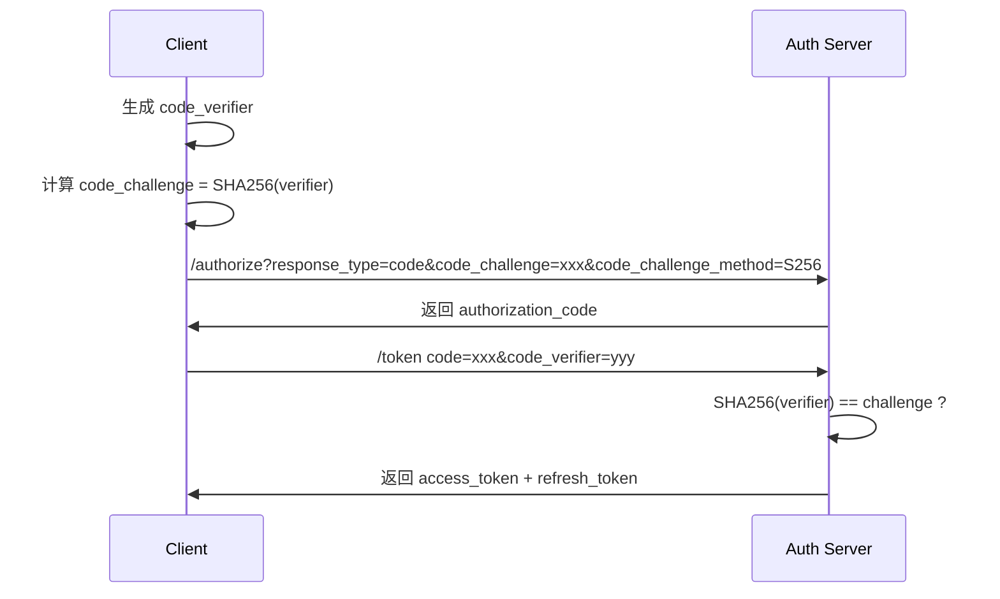

# Web 安全深入（注入深入 / 越权全场景 / 认证会话 / SDL 实战）

> Web 安全 = **保护应用免受恶意利用**，覆盖注入、跨站、越权、数据泄露、身份伪造等。与 [认证授权 JWT/OAuth2](../基础知识/中间件/认证授权JWT-OAuth2.md) 互补——那篇讲「你是谁、能进」，本篇讲「进来了怎么防被攻击」。本篇深入拆解每种攻击的利用方式与防御实战。

---

## 一、注入类（Injection）

### 1.1 SQL 注入

```
原理：把恶意 SQL 拼进查询

经典 Payload：
  ' OR '1'='1              -- 绕过认证
  ' UNION SELECT 1,2,3--    -- 联合查询拖库
  '; DROP TABLE users;--    -- 堆叠注入
  1' AND SLEEP(5)--         -- 时间盲注
  1' AND (SELECT COUNT(*) FROM information_schema.tables)--  -- 布尔盲注
```

#### 防御体系

| 层级 | 防御 | 说明 |
|------|------|------|
| 代码层 | PreparedStatement 参数化查询 | **第一防线**，语句与数据分离 |
| 代码层 | ORM 框架（MyBatis/JPA） | #{} 而非 ${}（# 预编译，$ 拼接） |
| 代码层 | 输入校验（白名单） | 数字型参数直接 parseInt |
| DB 层 | 最小权限 | 应用账号只给 SELECT/INSERT/UPDATE，不给 DROP |
| DB 层 | 禁用危险函数 | 禁用 xp_cmdshell / LOAD_FILE |
| 网络层 | WAF | 拦截常见 SQL 注入 Payload |

#### MyBatis 安全示例

```java
// 安全：#{} 预编译
@Select("SELECT * FROM users WHERE id = #{id}")
User findById(@Param("id") Long id);

// 危险：${} 直接拼接（必须用白名单校验）
@Select("SELECT * FROM users ORDER BY ${column}")
List<User> findAll(@Param("column") String column);
// ${column} 必须限制为白名单（如 id/name/create_time），否则注入
```

### 1.2 命令注入

```
原理：用户输入拼接进系统命令执行

危险代码：
  Runtime.getRuntime().exec("ping " + userInput);  // userInput 含 ;rm -rf /
  ProcessBuilder pb = new ProcessBuilder("sh", "-c", cmd);

防御：
  1. 避免调用系统命令（用语言原生 API）
  2. 必须调用时用 ProcessBuilder + 参数数组（不拼接字符串）
  3. 白名单校验输入（只允许 IP/域名等合法字符）
  4. 最小权限运行（不用 root）
```

### 1.3 XXE（XML 外部实体注入）

```
原理：解析不可信 XML 时，外部实体读取本地文件或发起 SSRF

恶意 XML：
  <?xml version="1.0"?>
  <!DOCTYPE foo [
    <!ENTITY xxe SYSTEM "file:///etc/passwd">
  ]>
  <data>&xxe;</data>

防御：
  // Java
  DocumentBuilderFactory dbf = DocumentBuilderFactory.newInstance();
  dbf.setFeature(XMLConstants.FEATURE_SECURE_PROCESSING, true);
  dbf.setFeature("http://apache.org/xml/features/disallow-doctype-decl", true);

  // Spring Boot 配置
  spring.jackson.xml.inclusion=non_null
```

### 1.4 SpEL/OGNL 表达式注入

```
原理：模板/规则引擎拼接用户输入 → RCE（远程代码执行）

Spring SpEL 注入示例：
  #{T(java.lang.Runtime).getRuntime().exec('calc')}

防御：
  1. 不要把用户输入直接作为表达式执行
  2. 使用 SimpleEvaluationContext（限制可用类/方法）
  3. 启用表达式沙箱
```

---

## 二、XSS（跨站脚本）深入

### 2.1 三类 XSS

| 类型 | 触发方式 | 危害 | 持久性 |
|------|----------|------|--------|
| 存储型 | 恶意脚本存入 DB（评论/帖子） | 最大（所有访客执行） | 持久 |
| 反射型 | URL 参数反射到页面 | 中等（需诱导点击） | 临时 |
| DOM 型 | 前端 JS 操作 innerHTML 等 | 中等（不经过服务端） | 临时 |

### 2.2 利用场景

```
1. 盗取 Cookie：document.cookie → 发送到攻击者服务器
2. 钓鱼：伪造登录弹窗
3. 蠕虫：自动发帖/关注（如新浪微博 XSS 蠕虫事件）
4. 键盘记录：监听用户输入
5. 挖矿：注入 CryptoMiner 脚本
```

### 2.3 防御体系

| 防御 | 说明 |
|------|------|
| **输出编码** | HTML/JS/URL/CSS 上下文不同，编码方式不同 |
| **CSP（Content Security Policy）** | 限制可加载脚本来源，缓解 XSS |
| **HttpOnly Cookie** | 防 JS 读取 Cookie（XSS 盗 Cookie 无效） |
| **输入校验** | 白名单过滤危险字符（但不能只靠输入校验） |
| **X-XSS-Protection** | 浏览器内置 XSS 过滤器（已过时，仍建议配置） |

#### CSP 配置示例

```java
// Spring Security 配置
@Bean
public SecurityFilterChain filterChain(HttpSecurity http) throws Exception {
    http.headers(headers -> headers
        .contentSecurityPolicy(csp -> csp
            .policyDirectives("default-src 'self'; script-src 'self' https://cdn.example.com; style-src 'self' 'unsafe-inline'; img-src 'self' data:; object-src 'none'")
        )
    );
    return http.build();
}

// Nginx 配置
add_header Content-Security-Policy "default-src 'self'; script-src 'self' https://trusted.cdn.com;";
```

---

## 三、CSRF 深入

### 3.1 攻击流程

```
1. 用户登录 bank.com，获得 Session Cookie
2. 攻击者构造恶意页面 evil.com
3. 用户访问 evil.com
4. evil.com 页面自动向 bank.com 发请求（浏览器自动带 Cookie）
   
5. bank.com 收到请求，Cookie 有效 → 执行转账
```

### 3.2 防御体系

| 防御 | 说明 |
|------|------|
| **CSRF Token** | 服务端签发 token，请求时校验（最可靠） |
| **SameSite Cookie** | 限制跨站 Cookie 发送（Strict/Lax/None） |
| **Referer/Origin 校验** | 检查请求来源（可被伪造，辅助手段） |
| **二次确认** | 敏感操作弹窗确认（如转账验证码） |
| **双重 Cookie 验证** | 页面随机 token 写入 Cookie + 表单，服务端比对 |

#### SameSite Cookie 配置

```java
// Java Servlet
Cookie cookie = new Cookie("SESSION", sessionId);
cookie.setHttpOnly(true);
cookie.setSecure(true);
cookie.setSameSite("Strict");  // Lax/Strict/None
response.addCookie(cookie);

// Spring Boot
server.servlet.session.cookie.same-site=strict
```

---

## 四、SSRF 深入

### 4.1 攻击目标

```
1. 内网扫描：探测内网 IP/端口
2. 读取本地文件：file:///etc/passwd
3. 获取云元数据：http://169.254.169.254/latest/meta-data/iam/security-credentials/
4. 内网服务攻击：访问 Redis/MySQL/Memcached
5. 协议走私：gopher://redis:6379/_*1%0d%0a$8%0d%0aflushall  (CRLF 注入)
```

### 4.2 防御体系

| 防御 | 说明 |
|------|------|
| **URL 白名单** | 只允许访问白名单内的域名/IP |
| **协议限制** | 只允许 http/https（禁止 file/gopher/dict） |
| **内网 IP 禁止** | 解析域名后校验 IP 是否为内网地址 |
| **DNS 重解析** | 解析域名后二次校验（防止 DNS 绑定攻击） |
| **网络隔离** | 应用服务器不能访问内网管理端口 |

#### Java 防御示例

```java
public boolean isSafeUrl(String url) {
    URI uri = URI.create(url);
    // 1. 协议限制
    if (!"http".equals(uri.getScheme()) && !"https".equals(uri.getScheme())) {
        return false;
    }
    // 2. DNS 解析后校验 IP
    InetAddress addr = InetAddress.getByName(uri.getHost());
    if (addr.isLoopbackAddress() || addr.isSiteLocalAddress()) {
        return false;  // 禁止内网
    }
    // 3. 白名单校验
    return ALLOWED_HOSTS.contains(uri.getHost());
}
```

---

## 五、越权（Broken Access Control）全场景

### 5.1 越权类型

| 类型 | 示例 | 防御 |
|------|------|------|
| 水平越权 | A 改 URL 的 id 查看 B 的订单 | 服务端校验资源归属 |
| 垂直越权 | 普通用户调 /admin/delete | RBAC 权限校验 |
| 越权修改 | 修改隐藏字段（如 price=0） | 服务端重新计算 |
| 对象级别越权 | 访问其他租户的数据 | 多租户隔离（tenant_id） |
| 功能级别越权 | 访问未授权的功能 | 功能权限表 + 动态菜单 |

### 5.2 防御核心

```
口诀：任何「我能不能看/改这个数据」都要服务端判，不能只靠前端隐藏按钮

实现：
  1. 资源归属校验：查订单时 WHERE id=? AND user_id=当前用户
  2. RBAC：角色 → 权限 → 接口（每个接口校验角色）
  3. 多租户：tenant_id 作为查询条件
  4. 审计日志：记录所有越权尝试
```

---

## 六、认证与会话安全

### 6.1 密码存储

| 方案 | 安全性 | 速度 | 推荐 |
|------|--------|------|------|
| MD5/SHA1 | 极低 | 极快（易暴力） | 禁用 |
| MD5+盐 | 低 | 快 | 禁用 |
| bcrypt | 高 | 慢（~100ms/次） | 推荐 |
| scrypt | 高 | 慢（内存硬） | 推荐 |
| Argon2 | 最高 | 慢（内存硬+CPU硬） | 首选 |

```java
// Spring Security BCrypt
String encoded = passwordEncoder.encode("rawPassword");
boolean matches = passwordEncoder.matches("rawPassword", encoded);
```

### 6.2 会话安全

```
Cookie 安全属性：
  HttpOnly：防 JS 读取（XSS 无效）
  Secure：只通过 HTTPS 传输
  SameSite：限制跨站发送（CSRF 防御）
  Path：限制 Cookie 路径
  Max-Age/Expires：合理过期时间

JWT 安全：
  算法：用 RS256（非对称），不用 HS256（对称，密钥泄露风险）
  过期：Access Token 15min，Refresh Token 7d
  黑名单：登出/改密后吊销 Token
```

### 6.3 暴力破解防护

```
防御措施：
  1. 登录限流：IP 维度（5次/分钟）+ 账号维度（5次/10分钟）
  2. 验证码：失败 3 次后弹出
  3. 账号锁定：连续失败 10 次锁定 30 分钟
  4. MFA：双因素认证（TOTP/SMS）
  5. 密码策略：最小 8 位 + 大小写 + 数字 + 特殊字符
```

---

## 七、文件上传漏洞

### 7.1 攻击方式

```
1. 上传 webshell（.jsp/.php/.aspx）→ 执行任意代码
2. 上传大文件 → 服务器磁盘满（DoS）
3. 上传 XSS 文件（.svg 含脚本）→ 窃取信息
4. 覆盖配置文件 → 篡改系统行为
```

### 7.2 防御体系

| 防御 | 说明 |
|------|------|
| 类型白名单 | 只允许 jpg/png/pdf（检查 MIME + 文件头） |
| 文件重命名 | 用 UUID 重命名（防止路径穿越） |
| 存储目录 | 非执行目录（与 Web 应用分离） |
| 大小限制 | 限制文件大小（防 DoS） |
| 杀毒扫描 | 上传后扫描恶意代码 |
| 禁止解析 | 存储目录禁止执行脚本（Nginx 配置） |

---

## 八、其他高频威胁

| 威胁 | 说明 | 防御 |
|------|------|------|
| 点击劫持 | 透明 iframe 覆盖诱导点击 | X-Frame-Options / CSP frame-ancestors |
| CORS 错误 | `Access-Control-Allow-Origin: *` 泄露凭据 | 显式白名单 origin |
| 依赖漏洞 | Log4j/Spring4Shell 等 | SCA 扫描 + 及时升级 |
| 敏感数据泄露 | 日志/响应中暴露密码/Token | 日志脱敏 + 响应过滤 |
| 安全配置错误 | 默认密码/调试模式/目录浏览 | 安全加固清单 |

---

## 九、SDL 安全开发生命周期

```
1. 威胁建模（STRIDE）：识别每个功能的威胁
2. 安全编码规范：OWASP 安全编码指南
3. 代码审计：SAST 静态扫描（SonarQube/Checkmarx）
4. 依赖扫描：SCA（OWASP Dependency-Check/Snyk）
5. 渗透测试：DAST 动态扫描（OWASP ZAP/Burp Suite）
6. 安全运维：WAF + 监控告警 + 应急响应
7. 安全左移：DevSecOps（安全嵌入 CI/CD 流水线）
```

### 常用工具

| 工具 | 类型 | 用途 |
|------|------|------|
| SonarQube | SAST | 代码安全扫描 |
| OWASP ZAP | DAST | 动态渗透测试 |
| Burp Suite | 代理+扫描 | 手动渗透 |
| Snyk | SCA | 依赖漏洞扫描 |
| Trivy | SCA | 容器镜像漏洞扫描 |

---

## 十、防御清单

| 威胁 | 关键防御 |
|------|---------|
| SQL 注入 | 参数化查询、白名单、最小权限 |
| 命令注入 | 避免 shell、参数数组、白名单 |
| XSS | 输出转义、CSP、HttpOnly |
| CSRF | Token、SameSite、Referer |
| SSRF | 协议/域名白名单、禁内网 |
| 越权 | 服务端校验归属、RBAC |
| 密码 | 加盐哈希（Argon2/bcrypt） |
| 文件上传 | 类型白名单、非执行目录 |

---

## 十一、OAuth2 PKCE 流程

```text
PKCE（Proof Key for Code Exchange）= 防止授权码拦截攻击的 OAuth2 扩展

传统 OAuth2 授权码流程的问题：
1. 客户端获取授权码
2. 客户端用授权码换取 Token
3. 如果授权码在传输中被拦截，攻击者可直接换 Token

PKCE 解决方案：
1. 客户端生成 code_verifier（随机字符串）
2. 客户端计算 code_challenge = SHA256(code_verifier)
3. 发送授权请求时带上 code_challenge
4. 换 Token 时带上 code_verifier
5. 服务端验证 SHA256(code_verifier) == code_challenge
```



```java
// Spring Authorization Server PKCE 配置
@Bean
public RegisteredClientRepository registeredClientRepository() {
    RegisteredClient client = RegisteredClient.withId(UUID.randomUUID().toString())
        .clientId("my-client")
        .clientAuthenticationMethod(ClientAuthenticationMethod.NONE) // 公共客户端
        .authorizationGrantType(AuthorizationGrantType.AUTHORIZATION_CODE)
        .redirectUri("http://localhost:8080/callback")
        .authorizationSettings(AuthorizationSettings.builder()
            .requireProofKey(true)  // 强制 PKCE
            .build())
        .build();
    return new InMemoryRegisteredClientRepository(client);
}
```

## 十二、CSP Headers 深度解析

```text
Content Security Policy = 限制页面可以加载的资源来源

关键指令：
default-src    : 默认策略（未指定指令的 fallback）
script-src     : JavaScript 来源
style-src      : CSS 来源
img-src        : 图片来源
font-src       : 字体来源
connect-src    : AJAX/WebSocket/fetch 来源
frame-src      : iframe 来源
object-src     : Flash/Java 插件来源
media-src      : 音视频来源
worker-src     : Service Worker 来源
base-uri       : <base> 标签限制
form-action    : 表单提交目标
frame-ancestors: 允许嵌入的来源（替代 X-Frame-Options）
```

**CSP 常用策略示例**：

```text
# 严格模式（推荐）
default-src 'none'; script-src 'self'; style-src 'self' 'unsafe-inline'; img-src 'self' data: https:; font-src 'self'; connect-src 'self'; frame-ancestors 'none'; base-uri 'self'; form-action 'self';

# 宽松模式（兼容性好）
default-src 'self'; script-src 'self' https://cdn.example.com; style-src 'self' 'unsafe-inline'; img-src 'self' data: https:; object-src 'none';

# 报告模式（先监控不阻断）
default-src 'self'; report-uri /csp-report; report-to csp-endpoint;
```

```java
// Spring Security CSP 配置
http.headers(headers -> headers
    .contentSecurityPolicy(csp -> csp
        .policyDirectives("default-src 'self'; script-src 'self'; style-src 'self' 'unsafe-inline'; img-src 'self' data:; object-src 'none'; frame-ancestors 'none'")
        .reportOnly(false)  // false=强制执行, true=仅报告
    )
);
```

## 十三、CORS 错误配置攻击

```text
CORS 错误配置攻击场景：
1. 服务端配置 Access-Control-Allow-Origin: *（允许所有来源）
2. 服务端配置反射 Origin（回显请求中的 Origin）
3. 攻击者构造恶意页面，利用受害者的 Cookie 发起跨域请求
4. 浏览器自动带上 Cookie，服务端返回数据
5. 攻击者通过 JavaScript 读取响应数据

防御：
1. 显式白名单（不使用 * 和反射 Origin）
2. 配置 Access-Control-Allow-Credentials: true 时不允许 *
3. 使用 Nginx 严格校验 Origin
```

```nginx
# Nginx CORS 安全配置
set $cors_origin "";
if ($http_origin ~* "^https://(www\.)?trusted\.com$") {
    set $cors_origin $http_origin;
}
add_header Access-Control-Allow-Origin $cors_origin always;
add_header Access-Control-Allow-Methods "GET, POST, PUT, DELETE" always;
add_header Access-Control-Allow-Headers "Content-Type, Authorization" always;
add_header Access-Control-Allow-Credentials "true" always;
add_header Access-Control-Max-Age 3600 always;
```

## 十四、JWT 安全最佳实践

| 安全要点 | 推荐做法 | 风险 |
|----------|----------|------|
| 签名算法 | RS256/ES256（非对称） | HS256 密钥泄露风险 |
| 密钥管理 | 密钥轮换 + KMS 托管 | 硬编码密钥泄露 |
| Token 过期 | Access Token 15min，Refresh Token 7d | 长期有效 Token 风险 |
| 吊销机制 | Token 黑名单/版本号 | 登出后 Token 仍有效 |
| Claims 校验 | 校验 iss/aud/exp/nbf | 未校验导致伪造 |
| 存储安全 | HttpOnly Cookie 或安全存储 | localStorage XSS 泄露 |

```java
// JWT 安全配置
String token = Jwts.builder()
    .setIssuer("https://auth.example.com")     // 签发者
    .setAudience("https://api.example.com")    // 受众
    .setSubject(userId)                         // 用户标识
    .setIssuedAt(new Date())                    // 签发时间
    .setExpiration(new Date(System.currentTimeMillis() + 900_000)) // 15分钟
    .setId(UUID.randomUUID().toString())        // 唯一ID（用于吊销）
    .signWith(privateKey, SignatureAlgorithm.RS256)
    .compact();

// JWT 校验
Claims claims = Jwts.parserBuilder()
    .setSigningKey(publicKey)
    .requireIssuer("https://auth.example.com")
    .requireAudience("https://api.example.com")
    .build()
    .parseClaimsJws(token)
    .getBody();
```

## 十五、SSRF 防御进阶

```text
SSRF 高级防御策略：

1. URL 白名单 + DNS 重解析：
   - 先解析域名获取 IP
   - 校验 IP 是否在白名单内
   - 防止 DNS 绑定攻击（第一次解析到白名单 IP，第二次解析到内网 IP）

2. 协议白名单：
   - 只允许 http/https
   - 禁止 file/gopher/dict/ftp 等协议

3. 内网 IP 段禁止：
   - 10.0.0.0/8
   - 172.16.0.0/12
   - 192.168.0.0/16
   - 127.0.0.0/8
   - 169.254.0.0/16（云元数据）

4. 网络层隔离：
   - 应用服务器网络 ACL 限制访问内网管理端口
   - 禁止应用服务器访问云元数据端口
```

```java
public boolean isSafeUrl(String url) {
    URI uri = URI.create(url);
    // 1. 协议限制
    String scheme = uri.getScheme();
    if (!"http".equals(scheme) && !"https".equals(scheme)) return false;
    
    // 2. DNS 解析后校验 IP
    InetAddress[] addrs = InetAddress.getAllByName(uri.getHost());
    for (InetAddress addr : addrs) {
        if (addr.isLoopbackAddress()) return false;
        if (addr.isSiteLocalAddress()) return false;
        byte[] octets = addr.getAddress();
        // 禁止内网 IP
        if (octets[0] == 10) return false;
        if (octets[0] == 172 && (octets[1] & 0xFF) >= 16 && (octets[1] & 0xFF) <= 31) return false;
        if (octets[0] == 192 && octets[1] == (byte)168) return false;
        if (octets[0] == 169 && octets[1] == (byte)254) return false;
    }
    
    // 3. 白名单校验
    return ALLOWED_HOSTS.contains(uri.getHost());
}
```

## 十六、文件上传安全进阶

```text
文件上传安全检查清单：

1. 类型校验：
   - 白名单扩展名：.jpg, .png, .pdf, .docx
   - MIME 类型校验：Content-Type 必须匹配
   - 文件头校验：检查 magic bytes（JPG=FFD8, PNG=89504E47）

2. 文件重命名：
   - 使用 UUID 重命名：a1b2c3d4.jpg
   - 禁止用户指定文件名
   - 防止路径穿越：../etc/passwd

3. 存储隔离：
   - 非执行目录：与 Web 应用分离
   - 独立域名/CDN：不走应用域名
   - 禁止脚本执行：Nginx 配置禁止解析 .php/.jsp

4. 大小限制：
   - 单文件大小限制：10MB
   - 总上传大小限制：50MB
   - 并发上传限制

5. 杀毒扫描：
   - ClamAV 扫描恶意代码
   - SVG 文件特殊处理（可能含 XSS）
```

```nginx
# Nginx 文件上传安全配置
location /upload/ {
    # 禁止脚本执行
    location ~* \.(php|jsp|py|pl|cgi)$ {
        deny all;
    }
    # 禁止访问隐藏文件
    location ~ /\. {
        deny all;
    }
    # 设置上传大小限制
    client_max_body_size 10m;
    # 设置超时
    client_body_timeout 30s;
}
```

## 十七、API 安全测试方法论

```text
API 安全测试流程：

1. 信息收集
   - 识别 API 类型（REST/GraphQL/gRPC）
   - 收集端点列表（Swagger/OpenAPI）
   - 识别认证方式（JWT/OAuth2/API Key）

2. 认证测试
   - Token 伪造/篡改
   - Token 过期/吊销
   - 权限提升

3. 授权测试
   - IDOR（不安全的直接对象引用）
   - 越权访问其他用户数据
   - 功能级别越权

4. 输入验证测试
   - SQL 注入
   - XSS
   - 命令注入
   - 路径穿越

5. 业务逻辑测试
   - 速率限制绕过
   - 批量操作滥用
   - 竞态条件

6. 配置安全测试
   - CORS 配置
   - 安全头缺失
   - 错误信息泄露
```

| 测试工具 | 类型 | 用途 |
|----------|------|------|
| Burp Suite | 代理+扫描 | 手动渗透测试 |
| OWASP ZAP | DAST | 自动化扫描 |
| Postman | API 测试 | 手动测试 |
| Nuclei | 漏洞扫描 | 模板化扫描 |
| ffuf | 模糊测试 | 端点发现 |

## 十八、OWASP Top 10 2023 解读

| 排名 | 威胁 | 说明 | 防御 |
|------|------|------|------|
| A01 | Broken Access Control | 越权访问 | 服务端校验、RBAC |
| A02 | Cryptographic Failures | 加密失败 | 强加密、密钥管理 |
| A03 | Injection | 注入攻击 | 参数化查询、输入校验 |
| A04 | Insecure Design | 不安全设计 | 威胁建模、安全设计 |
| A05 | Security Misconfiguration | 安全配置错误 | 加固清单、最小化 |
| A06 | Vulnerable Components | 漏洞组件 | SCA 扫描、及时升级 |
| A07 | Auth Failures | 认证失败 | MFA、强密码策略 |
| A08 | Data Integrity Failures | 数据完整性失败 | 签名验证、CI/CD 安全 |
| A09 | Logging Failures | 日志记录失败 | 安全日志、监控告警 |
| A10 | SSRF | 服务端请求伪造 | URL 白名单、协议限制 |

## 十九、安全 Headers 完整清单

```text
安全 Headers 检查清单：

1. 传输安全：
   Strict-Transport-Security: max-age=31536000; includeSubDomains; preload

2. 内容安全：
   Content-Security-Policy: default-src 'self'; script-src 'self'; ...
   X-Content-Type-Options: nosniff
   X-Frame-Options: DENY (已被 CSP frame-ancestors 替代)

3. 缓存安全：
   Cache-Control: no-store, no-cache, must-revalidate
   Pragma: no-cache

4. CORS 安全：
   Access-Control-Allow-Origin: https://trusted.com
   Access-Control-Allow-Methods: GET, POST, PUT, DELETE
   Access-Control-Allow-Headers: Content-Type, Authorization

5. 其他安全：
   Referrer-Policy: strict-origin-when-cross-origin
   Permissions-Policy: camera=(), microphone=(), geolocation=()
   X-XSS-Protection: 0 (已过时，建议禁用浏览器 XSS 过滤器)
```

```java
// Spring Security 安全 Headers 配置
http.headers(headers -> headers
    .httpStrictTransportSecurity(hsts -> hsts
        .includeSubDomains(true)
        .maxAgeInSeconds(31536000)
        .preload(true)
    )
    .contentSecurityPolicy(csp -> csp
        .policyDirectives("default-src 'self'; script-src 'self'")
    )
    .frameOptions(frame -> frame.deny())
    .contentTypeOptions(Customizer.withDefaults())
    .referrerPolicy(referrer -> referrer
        .policy(ReferrerPolicyHeaderWriter.ReferrerPolicy.STRICT_ORIGIN_WHEN_CROSS_ORIGIN)
    )
    .permissionsPolicy(permissions -> permissions
        .policy("camera=(), microphone=(), geolocation=()")
    )
);
```

## 二十、与其他板块的关系

- 认证授权见「[中间件/认证授权 JWT-OAuth2](../基础知识/中间件/认证授权JWT-OAuth2.md)」；
- API 网关安全见「[API 网关](../中间件/API网关.md)」；
- CI/CD 安全见「[安全工程](../安全工程)」；
- 供应链安全见「[供应链安全](../安全工程/06-供应链安全与SBOM.md)」。

> 一句话：**Web 安全 = 输入不可信 + 输出要转义 + 权限要校验 + 密钥要管好——核心防御：参数化查询防注入、CSP+HttpOnly 防 XSS、Token+SameSite 防 CSRF、白名单防 SSRF、服务端校验防越权**。
