## **对面向对象的理解**

向对象的目的：解决软件系统的可扩展性，可维护性和可重用性；

面向对象的三大特性：封装、多态和继承：

（1）封装（对应可扩展性）：隐藏对象的属性和实现细节，仅对外公开接口，控制在程序中属性的读和修改的访问级别。封装是通过访问控制符（public protected private）来实现。一个类就可看成一个封装。

（2）继承（重用性和扩展性）：子类继承父类，可以继承父类的方法和属性。可以对父类方向进行覆盖（实现了多态）。但是继承破坏了封装，因为他是对子类开放的，修改父类会导致所有子类的改变，因此继承一定程度上又破坏了系统的可扩展性，只有明确的IS-A关系才能使用。继承要慎用，尽量优先使用组合。

（3）多态（可维护性和可扩展性）：接口的不同实现方式即为多态。接口是对行为的抽象，刚才在封装提到，找到变化部分并封装起来，但是封装起来后，怎么适应接下来的变化？这正是接口的作用，接口的主要目的是为不相关的类提供通用的处理服务，我们可以想象一下。比如鸟会飞，但是超人也会飞，通过飞这个接口，我们可以让鸟和超人，都实现这个接口。

面向对象编程（OOP）其实就是一种设计思想，在程序设计过程中把每一部分都尽量当成一个对象来考虑，以实现软件系统的可扩展性，可维护性和可重用性。

## **CPU 的大致组成和所谓的超线程技术**

CPU的基本组成

PC -> Program Counter 程序计数器 （记录当前指令地址）

Registers -> 暂时存储CPU计算需要用到的数据

ALU -> Arithmetic & Logic Unit 运算单元

CU -> Control Unit 控制单元

MMU -> Memory Management Unit 内存管理单元

Cache -> 缓存

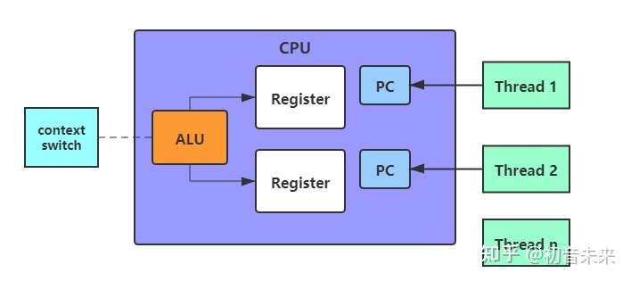

## **new 一个对象**

字节码指令分为3个

new 分配内存空间

invokespecial 执行初始化

astore_1 指向

## **分布式系统的NPC**

N（Network网络）、P（Process进程）、C（Clock时钟）

  进程会出现的问题？

失败模型

1. Crash-stop（fail-stop）：进程可随时崩溃并停止响应，不再恢复，永远消失。这可能会伴随着物理硬件的损坏或丢失，比如你上洗手间的时候把手机洗了。

1. Omissions：进程不接受其它节点的请求或者不返回响应（注意，其它节点无法区分这两种情况）。从其它节点的角度看，就是懒政、不作为。

1. Crash-recovery（fail-recovery）：进程可随时崩溃，但在一段时间后可以恢复并再次响应。在该模型中，经过持久化（到非易失性存储）的数据可以恢复，但在内存中的状态则可能会丢失。

1. Byzantine（fail-arbitrary）：拜占庭将军问题，问题进程可以干任何事情，包括试图作弊和欺骗其它节点。

脑裂

时钟漂移

## **c1 c2 编译器**

【java之JIT(Just in time) - 抒抒说 - 博客园】[https://www.cnblogs.com/msymm/p/9395234.html](https://www.cnblogs.com/msymm/p/9395234.html)

在运行过程中被即时编译器编译的“热点代码”有两类，即：

被多次调用的方法

被多次执行的循环体

对第一种情况，由于是方法调用触发的编译，因此编译器会以整个方法作为编译对象，即标准的JIT编译方式。后一种，虽然是循环体触发的编译动作，但编译器依然按照整个方法（而不是单独的循环体）作为编译对象。这种编译方式称为栈上替换（On Stack Replacement，简称为OSR编译）。

判断一段代码是不是热点代码，是不是需要触发即时编译，这样的行为称为热点探测（Hot Spot Detection），目前有两种方法：

基于采样的热点探测：采用这样的方法的虚拟机会周期性的检查各个线程的栈顶，如果发现某个（或某些）方法经常出现在栈顶，那这个方法就是“热点方法”。其好处就是实现简单、高效，还可以很容易的获取方法调用关系（将调用栈展开即可），缺点是很难精确的确认一个方法的热度，容易因为受到线程阻塞或别的外界因素的影响。

基于计数器的热点探测：为每一个方法（甚至是代码块）建立计数器，统计方法的执行次数，超过一定的阈值就认为是“热点方法”。缺点是实现起来更麻烦，需要为每个方法建立并维护计数器，并且不能直接获取到方法的调用关系，优点是它的统计结果相对来说更加精确和严谨。

HotSpot虚拟机使用第二种，它为每个方法准备了两类计数器：方法调用计数器（Invocation Counter）和回边计数器（Back Edge Counter，用于统计一个方法中循环体代码执行的次数）

分层编译将 Java 虚拟机的执行状态分为了五个层次。为了方便阐述，我用“C1 代码”来指代由 C1 生成的机器码，“C2 代码”来指代由 C2 生成的机器码。五个层级分别是：

解释执行；

执行不带 profiling 的 C1 代码；

执行仅带方法调用次数以及循环回边执行次数 profiling 的 C1 代码；

执行带所有 profiling 的 C1 代码；

执行 C2 代码。

通常情况下，C2 代码的执行效率要比 C1 代码的高出 30% 以上。然而，对于 C1 代码的三种状态，按执行效率从高至低则是 1 层 > 2 层 > 3 层。

其中 1 层的性能比 2 层的稍微高一些，而 2 层的性能又比 3 层高出 30%。这是因为 profiling 越多，其额外的性能开销越大。

这里解释一下，profiling 是指在程序执行过程中，收集能够反映程序执行状态的数据。这里所收集的数据我们称之为程序的 profile。

当C2优化产生的代码出现问题了，ava 虚拟机给出的解决方案便是去优化，即从执行即时编译生成的机器码切换回解释执行。

在生成的机器码中，即时编译器将在假设失败的位置上插入一个陷阱（trap）。该陷阱实际上是一条 call 指令，调用至 Java 虚拟机里专门负责去优化的方法。与普通的 call 指令不一样的是，去优化方法将更改栈上的返回地址，并不再返回即时编译器生成的机器码中。

在上面的程序控制流图中，我画了很多红色方框的问号。这些问号便代表着一个个的陷阱。一旦踏入这些陷阱，便将发生去优化，并切换至解释执行。

去优化的过程相当复杂。由于即时编译器采用了许多优化方式，其生成的代码和原本的字节码的差异非常之大。

在去优化的过程中，需要将当前机器码的执行状态转换至某一字节码之前的执行状态，并从该字节码开始执行。这便要求即时编译器在编译过程中记录好这两种执行状态的映射。

举例来说，经过逃逸分析之后，机器码可能并没有实际分配对象，而是在各个寄存器中存储该对象的各个字段（标量替换，具体我会在之后的篇章中进行介绍）。在去优化过程中，Java 虚拟机需要还原出这个对象，以便解释执行时能够使用该对象。

当根据映射关系创建好对应的解释执行栈桢后，Java 虚拟机便会采用 OSR 技术，动态替换栈上的内容，并在目标字节码处开始解释执行。

此外，在调用 Java 虚拟机的去优化方法时，即时编译器生成的机器码可以根据产生去优化的原因来决定是否保留这一份机器码，以及何时重新编译对应的 Java 方法。

如果去优化的原因与优化无关，即使重新编译也不会改变生成的机器码，那么生成的机器码可以在调用去优化方法时传入 Action_None，表示保留这一份机器码，在下一次调用该方法时重新进入这一份机器码。

如果去优化的原因与静态分析的结果有关，例如类层次分析，那么生成的机器码可以在调用去优化方法时传入 Action_Recompile，表示不保留这一份机器码，但是可以不经过重新 profile，直接重新编译。

如果去优化的原因与基于 profile 的激进优化有关，那么生成的机器码需要在调用去优化方法时传入 Action_Reinterpret，表示不保留这一份机器码，而且需要重新收集程序的 profile。

这是因为基于 profile 的优化失败的时候，往往代表这程序的执行状态发生改变，因此需要更正已收集的 profile，以更好地反映新的程序执行状态

## **java对象构成**

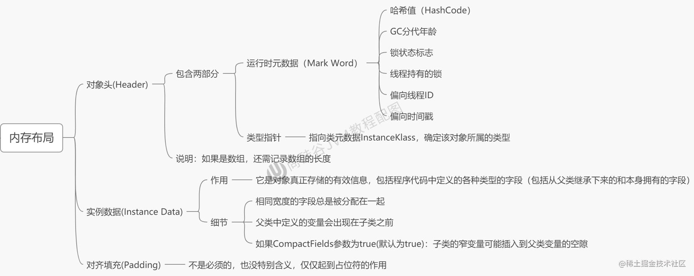

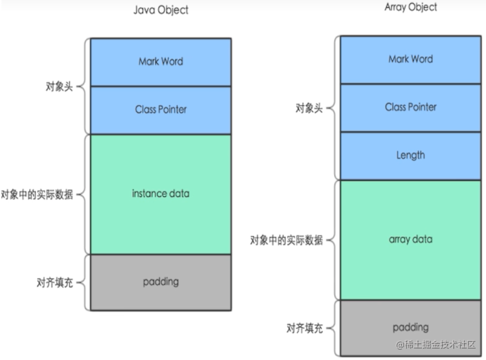

## **FastClass调用机制**

    JDK动态代理在调用目标类时，只能采用反射。而CGLIB采用FastClass机制，对代理类和目标类的方法建立签名hash映射，这样就可以直接调用，避免了反射调用目标类，其实是switch

    cglib源码流程：

    创建 Enhancer.*create**(*cls,this*)*;

    net.sf.cglib.core.AbstractClassGenerator#create  从缓存取  

    net.sf.cglib.core.internal.LoadingCache#get

    net.sf.cglib.core.internal.LoadingCache#createEntry  封装futureTask执行

**Jdk动态代理源码**

        从java.lang.reflect.Method#invoke

        java.lang.reflect.Method#acquireMethodAccessor

        15次后会转为java的invoke

## **SPI机制核心**

java.util.ServiceLoader 

## **异常处理**


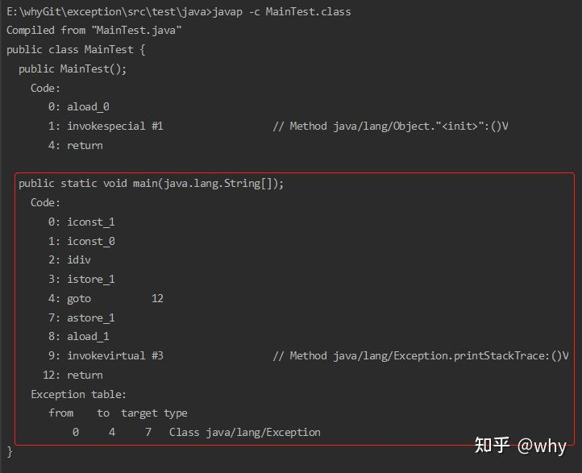


- from：可能发生异常的起始点指令索引下标(包含)

- to：可能发生异常的结束点指令索引下标(不包含)

- target：在from和to的范围内，发生异常后，开始处理异常的指令索引下标

- type：当前范围可以处理的异常类信息

## **JUC下一些类的特点说明**

**CountDownLatch**

 通过内部类Sync继承AQS

countDown()   实际上就是去释放一个共享资源  基于AQS的doReleaseShared()

await()调用了tryAcquireShared(), 重写后逻辑为当state不为0的时候，放入AQS的等待队列

当 countDown到0的时候，唤醒

**CyclicBarrier**

    内部基于

      private final ReentrantLock lock = new ReentrantLock();

     private final Condition trip = lock.newCondition();

    当调用await()的时候，实际上是判断size是否减到0了，如果没有，会调用trip.wait()

       当为0了，会调用trip.notifyAll()

**Semphore**

    默认非公平

    获取一个共享的states，如果没有获取到，就阻塞排队

    每次release()一个，都会唤醒等待的下一个节点

## 线程状态

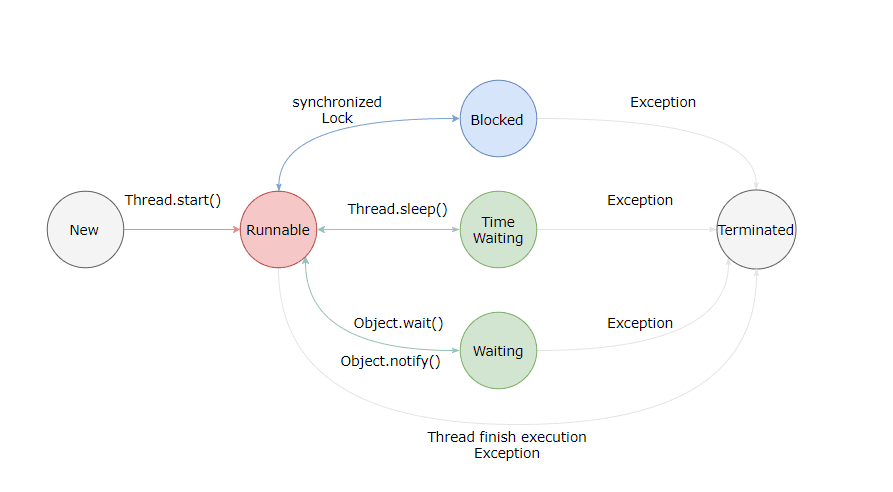

**新建(New)**

创建后尚未启动。

[](#可运行-runnable)**可运行(Runnable)**

可能正在运行，也可能正在等待 CPU 时间片。

包含了操作系统线程状态中的 Running 和 Ready。

[](#阻塞-blocking)阻塞(Blocking)

等待获取一个排它锁，如果其线程释放了锁就会结束此状态。

[](#无限期等待-waiting)无限期等待(Waiting)

等待其它线程显式地唤醒，否则不会被分配 CPU 时间片。

| 进入方法 | 退出方法 | 
| -- | -- |
| 没有设置 Timeout 参数的 Object.wait() 方法 | Object.notify() / Object.notifyAll() | 
| 没有设置 Timeout 参数的 Thread.join() 方法 | 被调用的线程执行完毕 | 
| LockSupport.park() 方法 | - | 


[](#限期等待-timed-waiting)限期等待(Timed Waiting)

无需等待其它线程显式地唤醒，在一定时间之后会被系统自动唤醒。

调用 Thread.sleep() 方法使线程进入限期等待状态时，常常用“使一个线程睡眠”进行描述。

调用 Object.wait() 方法使线程进入限期等待或者无限期等待时，常常用“挂起一个线程”进行描述。

睡眠和挂起是用来描述行为，而阻塞和等待用来描述状态。

阻塞和等待的区别在于，阻塞是被动的，它是在等待获取一个排它锁。而等待是主动的，通过调用 Thread.sleep() 和 Object.wait() 等方法进入。

| 进入方法 | 退出方法 | 
| -- | -- |
| Thread.sleep() 方法 | 时间结束 | 
| 设置了 Timeout 参数的 Object.wait() 方法 | 时间结束 / Object.notify() / Object.notifyAll() | 
| 设置了 Timeout 参数的 Thread.join() 方法 | 时间结束 / 被调用的线程执行完毕 | 
| LockSupport.parkNanos() 方法 | - | 
| LockSupport.parkUntil() 方法 | - | 


[](#死亡-terminated)死亡(Terminated)

可以是线程结束任务之后自己结束，或者产生了异常而结束。

## **线程池**

ctl 是一个涵盖了两个概念的原子整数类，它将工作线程数和线程池状态结合在一起维护，低 29 位存放 workerCount，高 3 位存放 runState。

线程池的状态

- RUNNING：能接受新任务，并处理阻塞队列中的任务

- SHUTDOWN：不接受新任务，但是可以处理阻塞队列中的任务

- STOP：不接受新任务，并且不处理阻塞队列中的任务，并且还打断正在运行任务的线程，就是直接撂担子不干了！

- TIDYING：所有任务都终止，并且工作线程也为0，处于关闭之前的状态

- TERMINATED：已关闭。


    

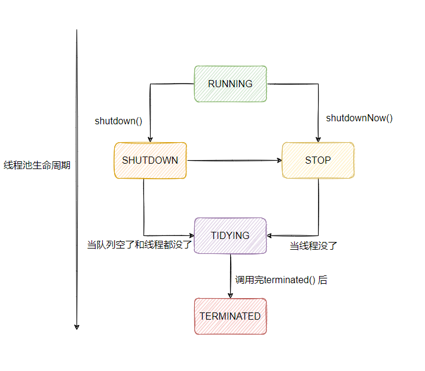

## **死锁产生条件**

- 互斥条件

临界资源是独占资源，进程应互斥且排他的使用这些资源。

- 占有和等待条件

进程在请求资源得不到满足而等待时，不释放已占有资源。

- 不剥夺条件

又称不可抢占，已获资源只能由进程自愿释放，不允许被其他进程剥夺。

- 循环等待条件

又称环路条件，存在循环等待链，其中，每个进程都在等待链中等待下一个进程所持有的资源，造成这组进程处于永远等待状态。

## **泛型的extend和super**

1）上界<? extends T>不能往里存，只能往外取

原因是编译器只知道容器内是Fruit或者它的派生类，但具体是什么类型不知道。可能是Fruit？可能是Apple？也可能是Banana，RedApple，GreenApple？编译器在看到后面用Plate赋值以后，盘子里没有被标上有“苹果”。而是标上一个占位符：CAP#1，来表示捕获一个Fruit或Fruit的子类，具体是什么类不知道，代号CAP#1。然后无论是想往里插入Apple或者Meat或者Fruit编译器都不知道能不能和这个CAP#1匹配，所以就都不允许。

（2）下界<? super T>不影响往里存，但往外取只能放在Object对象里

使用下界<? super Fruit>会使从盘子里取东西的get( )方法部分失效，只能存放到Object对象里。set( )方法正常。

因为下界规定了元素的最小粒度的下限，实际上是放松了容器元素的类型控制。既然元素是Fruit的基类，那往里存粒度比Fruit小的都可以。但往外读取元素就费劲了，只有所有类的基类Object对象才能装下。但这样的话，元素的类型信息就全部丢失。

**总结:**

PECS原则:最后看一下什么是PECS（Producer Extends Consumer Super）原则，已经很好理解了：

（1）频繁往外读取内容的，适合用上界Extends。

（2）经常往里插入的，适合用下界Super。

获得泛型类型

```java
static <T> T newTclass (Class < T > clazz) throws InstantiationException, IllegalAccessException { T obj =clazz.newInstance(); return obj; }

```

**为什么overload不能通过返回值去确认**

注意不能根据方法返回值来确定是否重载，因为假如用方法返回值作为方法重载的标记，当直接调用方法 overload() 没有指明是否需要返回值，这时候系统就会产生疑问，有不确定的因素，因此不能根据返回值来区分方法是否重载。

## **java反射**

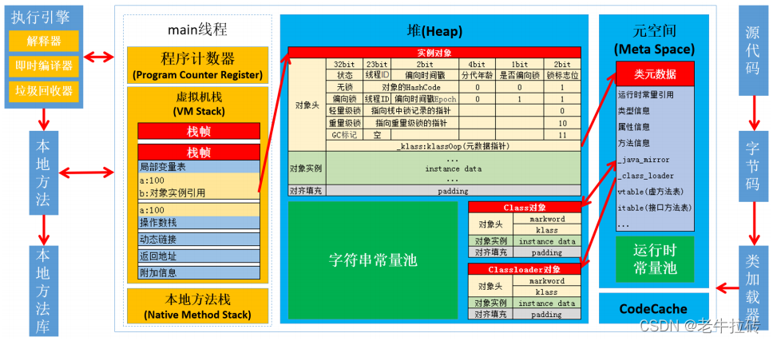

[https://blog.csdn.net/wy_05689/article/details/123101320](https://blog.csdn.net/wy_05689/article/details/123101320)

MethodAccessor有两个实现，一个是基于本地方法实现，相当于直接调用原始对象的方法，一直是基于字节码生成技术执行，分别对应的实现为DelegatingMethodAccessorImpl和NativeMethodAccessorImpl，当NativeMethodAccessorImpl调用超过阈值15次，就会转为DelegatingMethodAccessorImpl的实现

性能损耗的几个点：

1. 获得的method对象是copy的，建议复用，避免占用堆内存

1. 字节码生成的是object数组作为可变参数，涉及装箱和拆箱 

1. 方法的获取采用的是遍历匹配

1. 不利于方法内联

1. class.forname调用的native方法占用性能

**Future实现阻塞等待的原理**

get()方法的底层实际上是判断当前任务执行状态，如果不是COMPLETING，会调LockSupport.park(this) 阻断

如果执行完成，会调用内部的set()方法，唤醒阻塞的线程，并获取值

## **谈谈java的面向对象  **

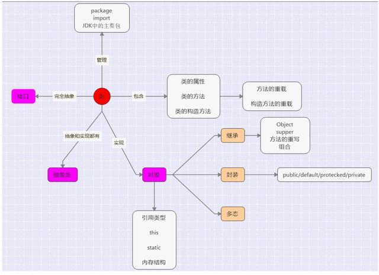

## **java的线程模型**

多对一模型、一对一模型和多对多模型

**多对一线程模型**，又叫作用户级线程模型，即多个用户线程对应到同一个内核线程上，线程的创建、调度、同步的所有细节全部由进程的用户空间线程库来处理。

**优点：**

- 用户线程的很多操作对内核来说都是透明的，不需要用户态和内核态的频繁切换，使线程的创建、调度、同步等非常快；

**缺点：**

- 由于多个用户线程对应到同一个内核线程，如果其中一个用户线程阻塞，那么该其他用户线程也无法执行；

- 内核并不知道用户态有哪些线程，无法像内核线程一样实现较完整的调度、优先级等；

许多语言实现的协程库基本上都属于这种方式，比如python的gevent。

**一对一模型**，又叫作内核级线程模型，即一个用户线程对应一个内核线程，内核负责每个线程的调度，可以调度到其他处理器上面。

**优点：**

- 用户的应用进程中的线程也是通过一对一的使用系统内核提供的轻量级进程LWP（Light weight process）接口来使用系统内核线程，这种模型的好处是LWP在调用过程中即使阻塞了也不会影响整个进程的执行；

**缺点：**

- 对用户线程的大部分操作都会映射到内核线程上，引起用户态和内核态的频繁切换；

- 内核为每个线程都映射调度实体，如果系统出现大量线程，会对系统性能有影响；

Java使用的就是一对一线程模型，所以在Java中启一个线程要谨慎。

**多对多模型**，又叫作两级线程模型，它是博采众长之后的产物，充分吸收前两种线程模型的优点且尽量规避它们的缺点。

在此模型下，用户线程与内核线程是多对多（m : n，通常m>=n）的映射模型。

首先，区别于多对一模型，多对多模型中的一个进程可以与多个内核线程关联，于是进程内的多个用户线程可以绑定不同的内核线程，这点和一对一模型相似；

其次，又区别于一对一模型，它的进程里的所有用户线程并不与内核线程一一绑定，而是可以动态绑定内核线程， 当某个内核线程因为其绑定的用户线程的阻塞操作被内核调度让出CPU时，其关联的进程中其余用户线程可以重新与其他内核线程绑定运行。

所以，多对多模型既不是多对一模型那种完全靠自己调度的也不是一对一模型完全靠操作系统调度的，而是中间态（自身调度与系统调度协同工作），因为这种模型的高度复杂性，操作系统内核开发者一般不会使用，所以更多时候是作为第三方库的形式出现。

**优点：**

- 兼具多对一模型的轻量；

- 由于对应了多个内核线程，则一个用户线程阻塞时，其他用户线程仍然可以执行；

- 由于对应了多个内核线程，则可以实现较完整的调度、优先级等；

**缺点：**

- 实现复杂

Go语言中的goroutine调度器就是采用的这种实现方案，在Go语言中一个进程可以启动成千上万个goroutine，这也是其出道以来就自带“高并发”光环的重要原因。

后面讲到Java中的ForkJoinPool的时候，我们会拿Go语言的PMG线程模型来对比讲解

## **指令重排序**

在计算机执行程序时候，为了能够提高性能，编译器和处理器常常会对指令做重新排序处理，就是指令的重排序。

**指令重排的条件**

- 在单线程环境下不能改变程序的运行结果；

- 存在数据依赖关系的不允许重排序；

- 无法通过Happens-before原则推到出来的，才能进行指令的重排序

**指令重排的三种情况：**

- 编译器优化重排：编译器再不改变单线程程序语义的前体下，可以重新安排语句的执行顺序。

- 指令并行重排：才用到指令级并行基数来讲多条指令重叠执行，在不存在数据依赖（即后一个执行的语句无需依赖前面执行的语句的结果），处理器可以改变语句对应的机器指令的执行顺序。

- 内存系统重排：由于处理器使用缓存和读写缓存冲区,这使得加载(load)和存储( store)操作看上去可能是在乱序执行,因为三级缓存的存在,导致内存与缓存的数据同步存在时间差

上述的1属于编辑器重排序，2和3属于处理器重排序。这些重排序可能会导致多线程程序出现内存可见性问题，对于编译器，JMM的编辑器重排序规则会禁止特定类型的编译器重排序（不是所有的编译器重排序都要禁止）。对于处理器重排序，JMM的处理器重排序规则会要求Java编译器在生成指令序列时，插入特定类型的内存屏障（Memory Barriers, Inter称之为Memory Fence）指令，通过内存屏障指令来禁止特定类型的处理器重排序。

**指令重排可以保证串行语义一致,但是没有义务保证多线程间的语义也一致**。所以在多线程下,指令重排序可能会导致一些问题。

**什么是Happens-before**

一方面，我们需要**JMM**给我们提供一个强大的内存模型来编写代码，同时另外一方面对于编译器和处理器来说希望**JMM**对他们的约束越少越好，这样就可以进行跟多的优化处理，也就是希望是一个弱的内存模型。

于是对于**JMM**来说考虑了这两种的需求： 对于编译器和处理器来说：只要不改变程序的运行结果（单线程程序和正确同步了的多线程程序），编译器和处理器进行如何的优化都是可行的。

于是**JMM**提供了一个**Happens-before**（JSR-133规范），来满足我们在简单易懂的前提下，并且提供了足够强的内存可见性保证。

就是说对于这个规则来说，我们只要是遵循了 就能够保证其在**JMM**中具有强的内存可见性。

**定义**

1. 如果一个操作 happens-before另一个操作,那么第一个操作的执行结果将对第二个操作可见,而且第一个操作的执行顺序排在第二个操作之前

1. 两个操作之间存在 happens-before关系,并不意味着Java平台的具体实现必须要按照 happens-before关系指定的顺序来执行。如果重排序之后的执行结果,与按 happens- before关系来执行的结果一致,那么JMM也允许这样的重排序

**天然的happens-before有哪些v**

在Java中,有以下天然的 happens-before关系：

- 程序顺序规则:一个线程中的每一个操作, happens-before于该线程中的任意后续操作。·

- 监视器锁规则:对一个锁的解锁, happens- before于随后对这个锁的加锁。

- volatile变量规则:对一个 volatile域的写, happens- before于任意后续对这个volatile域的读。

- 传递性:如果 A happens- before b,且 B happens-before C,那么 A happensbefore c。

- start规则:如果线程A执行操作 Thread. start0启动线程B,那么A线程的Thread B.stat0)操作 happens-before于线程B中的任意操作

- join规则:如果线程A执行操作 Thread join()并成功返回,那么线程B中的任意操作 happens-before于线程A从 Thread join0操作成功返回。

## **java为什么 要避免使用split**

Java 正则表达式使用的引擎实现是 NFA（Non deterministic Finite Automaton，不确定型有穷自动机）自动机，这种正则表达式引擎在进行字符匹配时会发生回溯（backtracking），而一旦发生回溯，那其消耗的时间就会变得很长，有可能是几分钟，也有可能是几个小时，时间长短取决于回溯的次数和复杂度。

https://zhuanlan.zhihu.com/p/476891220  NFA 与 DFA

## **java的switch**

对于 switch 来说，他最终生成的字节码有两种形态，一种是 tableswitch，另一种是 lookupswitch，决定最终生成的代码使用那种形态取决于 switch 的判断添加是否紧凑，例如到 case 是 1...2...3...4 这种依次递增的判断条件时，使用的是 tableswitch，而像 case 是 1...33...55...22 这种非紧凑型的判断条件时则会使用 lookupswitch

当执行一次 tableswitch 时，堆栈顶部的 int 值直接用作表中的索引，以便抓取跳转目标并立即执行跳转。也就是说 tableswitch 的存储结构类似于数组，是直接用索引获取元素的，所以整个查询的时间复杂度是 O(1)，这也意味着它的搜索速度非常快。

而执行 lookupswitch 时，会逐个进行分支比较或者使用二分法进行查询，因此查询时间复杂度是 O(log n)，**所以使用 lookupswitch 会比 tableswitch 慢**。

## **java处理散列的方式**

**开放定址法**

①核心思想：如果出现散列冲突，就重新探测一个空闲位置，将其插入。

②线性探测法（Linear Probing)                                                                        ** **

**插入数据**：当我们往散列表中插入数据时，如果某个数据经过散列函数之后，存储的位置已经被占用了，我们就从当前位置开始，依次往后查找，看是否有空闲位置，直到找到为止。

**查找数据**：我们通过散列函数求出要查找元素的键值对应的散列值，然后比较数组中下标为散列值的元素和要查找的元素是否相等，若相等，则说明就是我们要查找的元素；否则，就顺序往后依次查找。如果遍历到数组的空闲位置还未找到，就说明要查找的元素并没有在散列表中。

**删除数据**：为了不让查找算法失效，可以将删除的元素特殊标记为deleted，当线性探测查找的时候，遇到标记为deleted的空间，并不是停下来，而是继续往下探测。

**结论：最坏时间复杂度为O(n)**

③二次探测（Quadratic probing）：线性探测每次探测的步长为1，即在数组中一个一个探测，而二次探测的步长变为原来的平方。(原: hash+1，hash+2; 现在 hash+1^2,hash+2^2…)

④双重散列（Double hashing）：使用一组散列函数，直到找到空闲位置为止。

⑤线性探测法的性能描述：用“装载因子”来表示空位多少，散列表装载因子=填入表中的个数/散列表的长度。装载因子越大，说明空闲位置越少，冲突越多，散列表的性能会下降。**注: ThreadLocalMap即使用了开放寻址法解决hash冲突。**

**链地址法(常用）**

**插入数据：**当插入的时候，我们需要通过散列函数计算出对应的散列槽位，将其插入到对应的链表中即可，所以插入的时间复杂度为O(1)。

**查找或删除数据：**当查找、删除一个元素时，通过散列函数计算对应的槽，然后遍历链表查找或删除。对于散列比较均匀的散列函数，链表的节点个数k=n/m，其中n表示散列表中数据的个数，m表示散列表中槽的个数，所以是时间复杂度为O(k)。                                                                                  **注: ****HashMap****即使用了开放寻址法解决hash冲突。**

## **JAVA agent**

说到JVMTI，必须说一下JPDA，因为JVMTI是JPDA中的一环JPDA叫做Java 平台调试架构（Java Platform Debugger Architecture）JVMTI（JVM tool interface）位于jpda最底层

JVMTI（Java Virtual Machine Tool Interface）即指 Java 虚拟机工具接口，它是一套由虚拟机直接提供的 native 接口，它处于整个 JPDA 体系的最底层，所有调试功能本质上都需要通过 JVMTI 来提供。通过这些接口，开发人员不仅调试在该虚拟机上运行的 Java 程序，还能查看它们运行的状态，设置回调函数，控制某些环境变量，从而优化程序性能。JVMTI 本质上是在 JVM 内部的许多事件进行了埋点。通过这些埋点可以给外部提供当前上下文的一些信息。甚至可以接受外部的命令来改变下一步的动作。外部程序一般利用C/C++实现一个JVMTIAgent，在Agent里面注册一些JVM事件的回调。当事件发生时JVMTI调用这些回调方法。Agent可以在回调方法里面实现自己的逻辑。JVMTIAgent是以动态链接库的形式被虚拟机加载的。

- 可以在加载class文件之前进行拦截并把字节码做修改。

- 可以在运行期对已加载类的字节码做变更，但是这种情况下会有很多的限制。

- 还有其他一些小众的功能

	- 获取所有已经加载过的类

	- 获取所有已经初始化过的类（执行过 clinit 方法，是上面的一个子集）

	- 获取某个对象的大小

	- 将某个jar加入到bootstrap classpath里作为高优先级被bootstrapClassloader 加载

	- 将某个jar加入到classpath里供AppClassloard去加载

	- 设置某些native方法的前缀，主要在查找native方法的时候做规则匹配

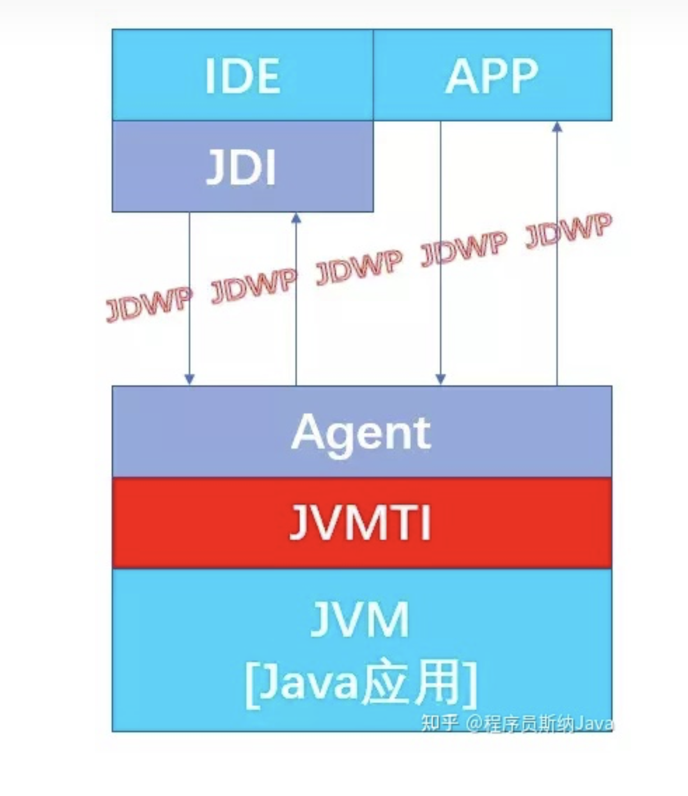

[https://zhuanlan.zhihu.com/p/139756708](https://zhuanlan.zhihu.com/p/139756708)

												

Instrument 的底层实现依赖于 JVMTI(JVM Tool Interface)，它是 JVM 暴露出来的一些供用户扩展的接口集合，JVMTI 是基于事件驱动的，JVM 每执行到一定的逻辑就会调用一些事件的回调接口(如果存在)，这些接口可以供开发者去扩展自己的逻辑。					

JVMTIAgent 是一个利用 JVMTI 暴露出来的接口提供了代理启动时加载(AgentOn Load)、代理通过 Attach 形式加载(Agent On Attach)和代理卸载(AgentOn Unload)功能的动态库。而 Instrument Agent 可以理解为一类 JVMTIAgent动 态 库， 别 名 是 JPLISAgent(Java Programming Language InstrumentationServices Agent)，也就是专门为 Java 语言编写的插桩服务提供支持的代理									

## java的管程模型

管程模型分为三种（Java选择了MESA管程模型）：

1）、Hasen模型

Hasen模型要求notify放到最后，这样T2线程通知T1后，T2线程就结束了，然后T1执行完，这样就能保证同一时刻只有一个线程在执行。

2）、Hoare模型

Hoare模型里面，T2线程通知完T1线程后，T2马上阻塞，T1马上执行；等T1执行完之后再唤醒T2线程，也能保证同一时刻只有一个线程在执行，但是T2多了一次阻塞唤醒操作。

3）、MESA管程模型（Java使用MESA模型实现）

MESA模型中，T2唤醒T1之后，T2还是会接着执行，T1并不立即执行，仅仅是从条件变量队列到等待队列中。

好处：notify（或notifyAll）、signal（或signalAll）不用放到代码的最后，T2也没有多余的阻塞唤醒操作

坏处：T1执行的时候，可能曾经满足过条件，现在已经不能满足了，需要增加循环验证条件方式（个人理解也算是乐观锁的思想）。

## Synchronized详解

[https://zhuanlan.zhihu.com/p/302654066](https://zhuanlan.zhihu.com/p/302654066)

[深入分析synchronized原理(阿里面试题) - 知乎.webarchive](attachments/WEBRESOURCE2e761aecff1bf52981d81eb2dabee63c深入分析Synchronized原理(阿里面试题) - 知乎.webarchive)


## LockSupport.park()详解

就是获取java线程的parker对象,然后执行它的park方法。Parker的定义如下

```java
class Parker : public os::PlatformParker {
private:
   //表示许可
  volatile int _counter ; 
  Parker * FreeNext ;
  JavaThread * AssociatedWith ; // Current association
public:
  Parker() : PlatformParker() {
    //初始化_counter
    _counter       = 0 ; 
    FreeNext       = NULL ;
    AssociatedWith = NULL ;
  }
protected:
  ~Parker() { ShouldNotReachHere(); }
public:
  void park(bool isAbsolute, jlong time);
  void unpark();

  // Lifecycle operators  
  static Parker * Allocate (JavaThread * t) ;
  static void Release (Parker * e) ;
private:
  static Parker * volatile FreeList ;
  static volatile int ListLock ;

};
```

它继承了os::PlatformParker，内置了一个volatitle的 _counter。PlatformParker则是在不同的操作系统中有不同的实现；

[https://zhuanlan.zhihu.com/p/343549180](https://zhuanlan.zhihu.com/p/343549180)

## 探秘java stream api的底层实现

我们大致能够想到，应该采用某种方式记录用户每一步的操作，当用户调用结束操作时将之前记录的操作叠加到一起在一次迭代中全部执行掉。沿着这个思路，有几个问题需要解决：

1. 用户的操作如何记录？

1. 操作如何叠加？

1. 叠加之后的操作如何执行？

1. 执行后的结果（如果有）在哪里？

[https://zhuanlan.zhihu.com/p/163073352](https://zhuanlan.zhihu.com/p/163073352)

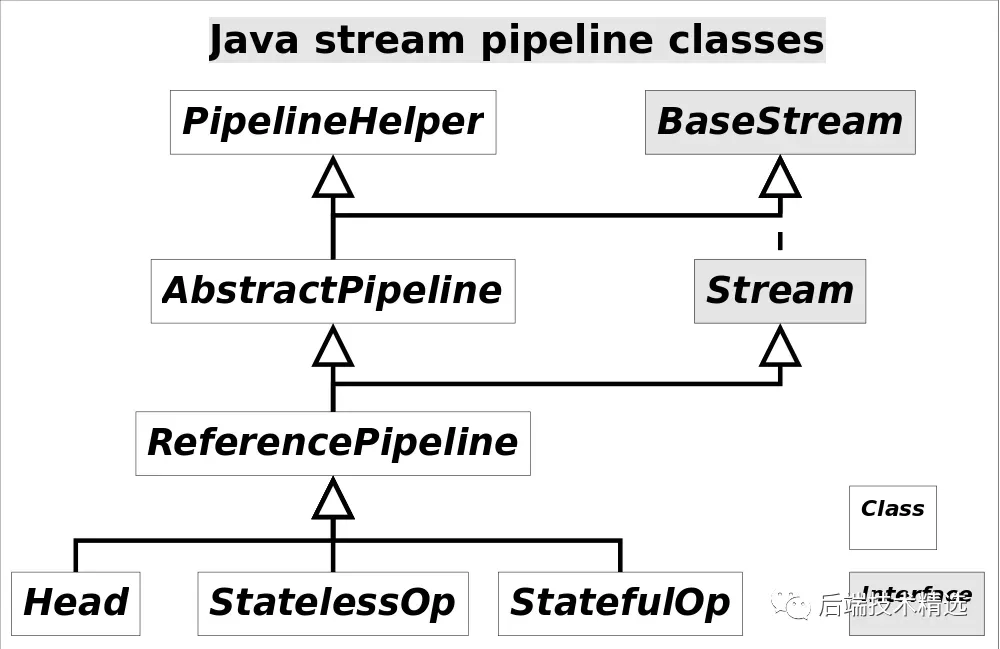

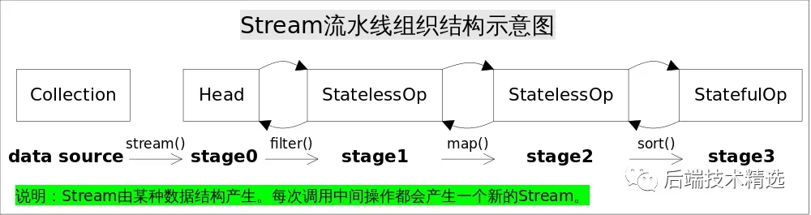

**操作如何叠加**

以上只是解决了操作记录的问题，要想让流水线起到应有的作用我们需要一种将所有操作叠加到一起的方案。你可能会觉得这很简单，只需要从流水线的head开始依次执行每一步的操作（包括回调函数）就行了。

这听起来似乎是可行的，但是你忽略了前面的Stage并不知道后面Stage到底执行了哪种操作，以及回调函数是哪种形式。换句话说，只有当前Stage本身才知道该如何执行自己包含的动作。这就需要有某种协议来协调相邻Stage之间的调用关系。

这种协议由*Sink*接口完成，*Sink*接口包含的方法如下表所示：

方法名作用void begin(long size)开始遍历元素之前调用该方法，通知Sink做好准备。void end()所有元素遍历完成之后调用，通知Sink没有更多的元素了。boolean cancellationRequested()是否可以结束操作，可以让短路操作尽早结束。void accept(T t)遍历元素时调用，接受一个待处理元素，并对元素进行处理。Stage把自己包含的操作和回调方法封装到该方法里，前一个Stage只需要调用当前Stage.accept(T t)方法就行了。

有了上面的协议，相邻Stage之间调用就很方便了，每个Stage都会将自己的操作封装到一个Sink里，前一个Stage只需调用后一个Stage的accept()方法即可，并不需要知道其内部是如何处理的。

当然对于有状态的操作，Sink的begin()和end()方法也是必须实现的。比如Stream.sorted()是一个有状态的中间操作，其对应的Sink.begin()方法可能创建一个盛放结果的容器，而accept()方法负责将元素添加到该容器，最后end()负责对容器进行排序。

对于短路操作，Sink.cancellationRequested()也是必须实现的，比如Stream.findFirst()是短路操作，只要找到一个元素，cancellationRequested()就应该返回*true*，以便调用者尽快结束查找。Sink的四个接口方法常常相互协作，共同完成计算任务。

**实际上Stream API内部实现的的本质，就是如何重写Sink的这四个接口方法**。

## TransmittableThreadLocal

[https://mp.weixin.qq.com/s/a6IGrOtn1mi0r05355L5Ng](https://mp.weixin.qq.com/s/a6IGrOtn1mi0r05355L5Ng)

## 注解的源码实现

注解@interface 是一个实现了Annotation接口的 接口， 然后在调用getDeclaredAnnotations()方法的时候，返回一个代理$Proxy对象，这个是使用jdk动态代理创建，使用Proxy的newProxyInstance方法时候，传入接口 和InvocationHandler的一个实例(也就是 AnotationInvocationHandler ) ，最后返回一个代理实例。

期间，在创建代理对象之前，解析注解时候 从该注解类的常量池中取出注解的信息，包括之前写到注解中的参数，然后将这些信息在创建 AnnotationInvocationHandler时候 ，传入进去 作为构造函数的参数。

[https://blog.csdn.net/qq_20009015/article/details/106038023](https://blog.csdn.net/qq_20009015/article/details/106038023)

以下是一个比较难的处理注解的用法例子：

[https://www.race604.com/annotation-processing/](https://www.race604.com/annotation-processing/)

## 并发的几种模式

**一，****Immutability模式**

如果对象一旦被创建，状态就不会再发生任何变化，并且只允许存在只读方法，这个对象就是不可变对象。利用不可变对象解决并发问题的模式，就是不可变模式。快速实现具备不可变性的类时，将类设置成final，类内的所有属性设置成final，只暴露只读方法即可。

经常用到的String对象和各种基础类型的包装类，比如，Long，Integer都具备不可变性。更进一步，基本数据类型的包装类都用到了享元模式（Flyweight Pattern），即在JVM启动时，创建一个对象池，当创建包装类型的对象时，首先查找对象池是否存在，如果不存在，才会创建新对象，并将其放入对象池中。比如，Long对象就默认缓存了[-128,127]之间的对象。几乎所有用到了享元模式的对象，比如，包装类对象，都不适合做锁，因为看上去是私有的这些对象，其实是共用的，会导致并发问题。

但是在使用不可变模式时，一定要搞清楚特定不可变对象的边界在哪里。比如，一个final类C的final成员变量a，当a的内部存在非final的其他对象时，并且C中存在着get_a的public接口，那么C就不是线程安全的。

**二，****Copy-on-Write模式**

Copy-on-Write模式适用于对数据的实时性不敏感，读多写少且对读性能要求极为苛刻的小数据场景。

具体的实现也很简单，当数据需要修改时，先复制一份出来，在复制的数据上进行修改，并发读还是在旧的数据上，当数据修改完成后，再将老数据替换为修改后的新数据即可。但需要注意的是，当发生并发写时，可以使用CAS的策略来完成。

**三，****线程本地存储**

Java语言提供ThreadLocal实现避免共享，即每个线程拥有自己的一份数据，线程之间没有竞争关系。

它的具体实现原理有点反直觉，因为ThreadLocal本质上仅仅是一个代理工具类，真正的数据存储在Thread类中。即，当ThreadLocal.get()获取线程本地数据时，通过Thread.currentThread().threadLocals来获取线程内真正的本地对象进行操作。

这种设计方式，从业务上看，线程的本地数据存在线程内部显然更合理，更重要的是，这样做不容易产生内存泄漏，因为线程本地对象和线程同生命周期，当线程被gc时，其数据也同样可以被gc掉。

但需要注意的是，在线程池的场景中，因为线程池中的线程通常与进程是同生共死的，即使线程本地变量的生命周期已经结束了，但因为该线程池尚未被释放，数据也是无法被回收的。因此，在这种场景下，ThreadLocal方案要小心使用。

**四，****Guarded Suspension模式**

Guarded Suspension模式常用在异步转同步的场景中，是一个经典的管程实现。通过使用一个中间的GuardedObject对象，管理受保护的对象，并为对象的消费者提供get方法，为对象的生产者提供onChange方法。

消费者通常在执行一些操作后（比如，发出请求消息），创建GuardedObjec并调用get等待反馈（比如，等待应答消息），因此GuardedObject被消费者线程持有。如果应答消息就绪，生产者线程如何通过onChanged告知消费者呢？

一个方案是，在GuardedObject内维护1个K-V的static Map对象和2个static方法（create和fireEvent）,消费者使用create创建和key绑定的Object对象并get等待，生产者线程在fireEvent中，通过消息中传递的key获得对应的Object对象并onChanged通知。

**五，****Balking模式**

在Guarded Suspension模式中，如果消息未获得返回，消费者会始终阻塞在等待条件上，但需要快速放弃也是一个常见的需求。比如，自动存盘需求中，如果文件没有改变，就无需磁盘操作。又一个更常见的需求是，单次初始化操作时，使用init变量来控制。

通常会使用一个状态变量status来控制是否存在改变，如果对原子性有要求，可以使用互斥锁，如果对原子性无特殊要求，直接使用volatile即可。

**六，****Thread-Per-Message**

现实世界中，很多事情需要委托他人办理，同样的场景，在并发编程领域，就是Thread-Per_message模式，简而言之，就是由一个线程接收任务，并发的为每一个收到的任务分配一个独立线程，这是最简单的分工方法，实现起来也非常简单。

线程在Java中是成本非常高的对象，本质上并不适合高并发场景。但是，换个角度思考，语言，工具和框架本身应该是帮助我们更敏捷的实现稳定可靠的方案，Thread-Per-Message是一种最简单的分工方法，Java语言支持不了，显然是Java语言本身的问题。

在Go语言中，存在一种轻量级线程，即协程的方案。在协程的架构下，Thread-Per-Message模式就完全没有问题了。

**七，****Worker Thread模式**

Java语言中，Thread-Per-Message毕竟还是一种高消耗的并发模式，如果可以使用阻塞队列做任务池，再创建固定数量的线程消费队列中的任务，这种方式也是SDK并发工具包里提供的线程池方案。

线程池有很多优点，比如，避免重复创建，销毁线程，能够限制创建线程的上限等等。但需要重点关注并设置阻塞队列，比如，无界的阻塞队列可能在高并发下导致OOM，不建议使用，而有界的阻塞队列需要配合合理的拒绝策略。即，在创建线程池时，建议使用有界队列，并清晰的指明拒绝策略，并且，最好还能为线程赋予一个业务相关的名字，便于调试。

更重要的是，在Worker Thread模式的线程池方案中，需要时刻关注提交到线程池中的任务是否相互独立，如果任务间存在依赖关系，则可能导致线程死锁。死锁产生的原因通常是，线程池中存在相互依赖的任务。比如，线程池中的全部线程都在执行任务1，并且阻塞等待任务2的完成，当提交任务2后，当前并没有任何空闲的线程去调度执行，于是世界静止，死锁产生。

除此之外，使用线程池，还需要注意ThreadLocal内存泄漏问题和任务的异常处理等，尤其是，在业务中，异常处理一旦发生，后果非常严重。

**八，****两阶段终止模式**

前面所有的内容都是论述，如何启动多线程去执行一个异步任务。那么，如何优雅的终止线程呢？业界也有一套成熟的方案，叫做“两阶段终止”模式。即，将终止过程分成两个阶段，第一阶段由线程T1向线程T2发送终止指令，第二阶段是由线程T2响应终止指令。

在Java语言中，Java线程存在4种状态：初始状态（NEW），可运行/运行状态（RUNNABLE），休眠状态（BLOCKED，WAITING，TIMED_WAITING）和终止状态（TERMINATED）。如果要让一个线程优雅的进入终止状态，一个大前提是让线程首先进入RUNNABLE状态，即，将线程从休眠状态中唤醒至可运行/运行状态，这个可以通过interrupt()方法来实现。

实现上，可以使用一个状态标志位status，在线程T1里设置T2.status后，调用T2.interrupt，将T2从可能的休眠状态中唤醒，T2检查status是否符合终止条件，如果符合，则尝试完成正确的收尾，并优雅退出。

**九，****生产者-消费者模式**

两个线程池通过一个阻塞队列连接起来，一个生产者线程池向队列添加任务，另一个消费者线程池从队列中消费任务，两个线程池并不知道对方的存在，符合架构设计上的“解耦”，支持异步，并可以通过控制两个线程池的线程数目，平衡生产者和消费者的速度差异。

并且，通过分析任务的类型，可以在消费端更精细化的进行控制。比如，如果执行单个任务的消耗与多个任务批量执行的消耗类似，则可以在大并发的场景下，消费端批量处理或者分阶段的批量处理来提高效率。

## 多线程导致的问题

- CPU 增加了缓存，以均衡与内存的速度差异；// 导致 可见性问题

- 操作系统增加了进程、线程，以分时复用 CPU，进而均衡 CPU 与 I/O 设备的速度差异；// 导致 原子性问题

- 编译程序优化指令执行次序，使得缓存能够得到更加合理地利用。// 导致 有序性问题

1. 单一线程原则

> Single Thread rule


在一个线程内，在程序前面的操作先行发生于后面的操作。

[](#_2-管程锁定规则)2. 管程锁定规则

> Monitor Lock Rule


一个 unlock 操作先行发生于后面对同一个锁的 lock 操作。

[](#_3-volatile-变量规则)3. volatile 变量规则

> Volatile Variable Rule


对一个 volatile 变量的写操作先行发生于后面对这个变量的读操作。

[](#_4-线程启动规则)4. 线程启动规则

> Thread Start Rule


Thread 对象的 start() 方法调用先行发生于此线程的每一个动作。

[](#_5-线程加入规则)5. 线程加入规则

> Thread Join Rule


Thread 对象的结束先行发生于 join() 方法返回。

[](#_6-线程中断规则)6. 线程中断规则

> Thread Interruption Rule


对线程 interrupt() 方法的调用先行发生于被中断线程的代码检测到中断事件的发生，可以通过 interrupted() 方法检测到是否有中断发生。

[](#_7-对象终结规则)7. 对象终结规则

> Finalizer Rule


一个对象的初始化完成(构造函数执行结束)先行发生于它的 finalize() 方法的开始。

[](#_8-传递性) 8. 传递性

> Transitivity


如果操作 A 先行发生于操作 B，操作 B 先行发生于操作 C，那么操作 A 先行发生于操作 C。

## 线程安全

一个类在可以被多个线程安全调用时就是线程安全的。

线程安全不是一个非真即假的命题，可以将共享数据按照安全程度的强弱顺序分成以下五类: 不可变、绝对线程安全、相对线程安全、线程兼容和线程对立。

[](#_1-不可变) 1. 不可变

不可变(Immutable)的对象一定是线程安全的，不需要再采取任何的线程安全保障措施。只要一个不可变的对象被正确地构建出来，永远也不会看到它在多个线程之中处于不一致的状态。

多线程环境下，应当尽量使对象成为不可变，来满足线程安全。

不可变的类型:

- final 关键字修饰的基本数据类型

- String

- 枚举类型

- Number 部分子类，如 Long 和 Double 等数值包装类型，BigInteger 和 BigDecimal 等大数据类型。但同为 Number 的原子类 AtomicInteger 和 AtomicLong 则是可变的。

对于集合类型，可以使用 Collections.unmodifiableXXX() 方法来获取一个不可变的集合

[](#线程安全-不是一个非真即假的命题)2. 绝对线程安全

不管运行时环境如何，调用者都不需要任何额外的同步措施。

3. 相对线程安全

相对线程安全需要保证对这个对象单独的操作是线程安全的，在调用的时候不需要做额外的保障措施。但是对于一些特定顺序的连续调用，就可能需要在调用端使用额外的同步手段来保证调用的正确性。

在 Java 语言中，大部分的线程安全类都属于这种类型，例如 Vector、HashTable、Collections 的 synchronizedCollection() 方法包装的集合等。

对于下面的代码，如果删除元素的线程删除了 Vector 的一个元素，而获取元素的线程试图访问一个已经被删除的元素，那么就会抛出 ArrayIndexOutOfBoundsException。

4. 线程兼容

线程兼容是指对象本身并不是线程安全的，但是可以通过在调用端正确地使用同步手段来保证对象在并发环境中可以安全地使用，我们平常说一个类不是线程安全的，绝大多数时候指的是这一种情况。Java API 中大部分的类都是属于线程兼容的，如与前面的 Vector 和 HashTable 相对应的集合类 ArrayList 和 HashMap 等。

[](#_5-线程对立)5. 线程对立

线程对立是指无论调用端是否采取了同步措施，都无法在多线程环境中并发使用的代码。由于 Java 语言天生就具备多线程特性，线程对立这种排斥多线程的代码是很少出现的，而且通常都是有害的，应当尽量避免。

## Disruptor 为什么这么快

- RingBuffer（环形数组）: Disruptor 内部的 RingBuffer 是通过数组实现的。由于这个数组中的所有元素在初始化时一次性全部创建，因此这些元素的内存地址一般来说是连续的。这样做的好处是，当生产者不断往 RingBuffer 中插入新的事件对象时，这些事件对象的内存地址就能够保持连续，从而利用 CPU 缓存的局部性原理，将相邻的事件对象一起加载到缓存中，提高程序的性能。这类似于 MySQL 的预读机制，将连续的几个页预读到内存里。除此之外，RingBuffer 基于数组还支持批量操作（一次处理多个元素）、还可以避免频繁的内存分配和垃圾回收（RingBuffer 是一个固定大小的数组，当向数组中添加新元素时，如果数组已满，则新元素将覆盖掉最旧的元素）。

- 避免了伪共享问题：CPU 缓存内部是按照 Cache Line（缓存行）管理的，一般的 Cache Line 大小在 64 字节左右。Disruptor 为了确保目标字段独占一个 Cache Line，会在目标字段前后增加了 64 个字节的填充（前 56 个字节和后 8 个字节），这样可以避免 Cache Line 的伪共享（False Sharing）问题。

- 无锁设计：Disruptor 采用无锁设计，避免了传统锁机制带来的竞争和延迟。Disruptor 的无锁实现起来比较复杂，主要是基于 CAS、内存屏障（Memory Barrier）、RingBuffer 等技术实现的。

## 并发问题的本质

CPU缓存导致的可见性问题

线程切换导致的原子性问题

编译优化导致的有序性问题

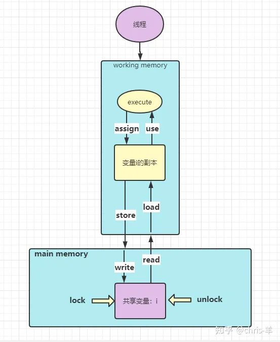

关于主内存与工作内存之间具体的交互协议，即一个变量如何从主内存拷贝到工作内存、如何从工作内存同步回主内存这一类的实现细节，**Java内存模型中定义了8种操作来完成。Java虚拟机实现时必须保证下面提及的每个操作都是原子性的、不可再分的**（但对于 double 和 long 类型来说允许有例外，这个不是今天的重点，所以不在本文中详细阐述）

**JMM定义了这8种操作，并对他们进行了规范，而这些规范是解决上文种提到的三特性问题的根本。**

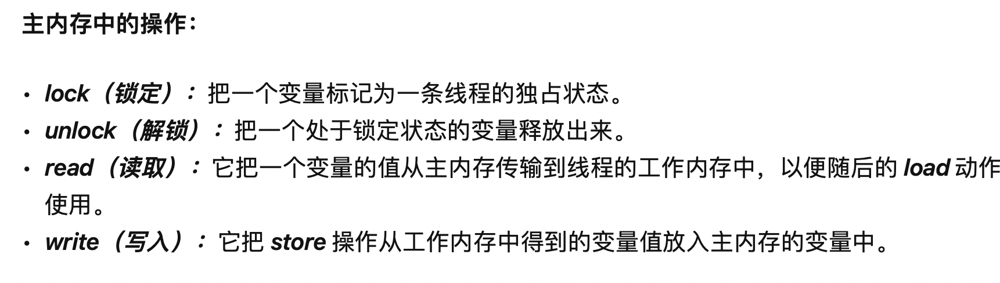

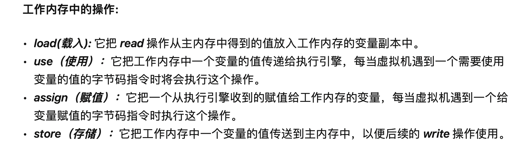

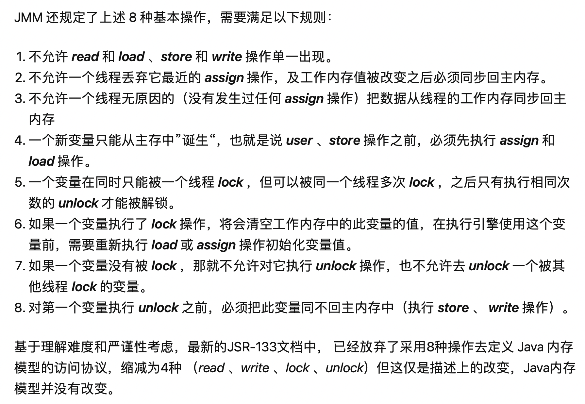

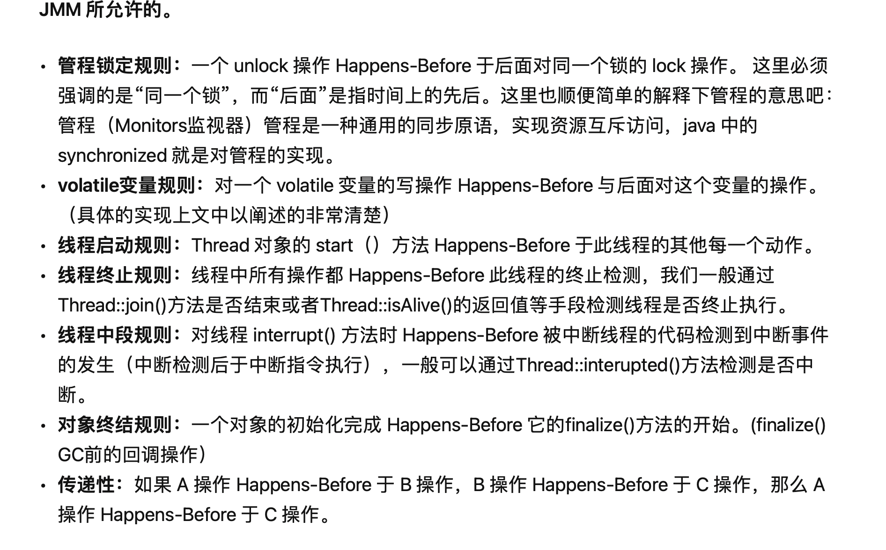

## 新建对象的安全发布（Safe Publication）

在多线程编程中，"新建对象的安全发布（Safe Publication）"是一个关键的概念，它确保了当一个线程创建了一个对象并将对象的引用传递给其他线程时，接收该引用的线程能够看到该对象的完整状态，包括所有的final字段都被正确初始化。安全发布是避免数据竞争、保证线程间正确交互的基础。以下是几种实现安全发布的常见方法：

1. 初始化安全性（Initialization Safety）

: 如果一个对象在构造函数完成后，其引用只能通过final字段或者final类型的引用变量来访问，那么这个对象就被视为安全发布的。这是因为在Java内存模型中，final字段的写入和构造函数的完成有一个happens-before关系，保证了其他线程看到这个对象时，它的final字段已经被正确初始化。

1. 锁

: 在锁的保护下发布对象也是一种安全发布的方式。如果一个对象在某个锁的保护下被创建，并且这个锁保护了所有能够访问这个对象的途径，那么当锁被释放并且其他线程获取到这个锁时，这个对象对于它们就是安全发布的。这是因为锁的解锁操作与随后的加锁操作之间存在happens-before关系。

1. volatile

: 使用volatile关键字修饰的对象引用也是安全发布的。当一个对象的引用被写入volatile变量时，任何线程读取这个volatile变量都会看到这个写入操作，且能看到这个对象的完整构造状态，包括final字段的初始化。

1. 静态初始化和类初始化

: 类的静态字段（无论是final还是非final）以及通过类初始化代码块初始化的对象，都是安全发布的。类初始化过程在多线程环境中是线程安全的，因此通过类访问的这些对象对所有线程都是可见的且完全初始化的。

1. ThreadLocal

: 虽然不是直接的安全发布机制，但ThreadLocal可以为每个线程提供独立的对象副本，从而避免了线程间的共享数据竞争，间接实现了线程安全。

## 使用了安全点的场景

1. GC

1. 线程栈收集与安全点。当某些操作需要收集所有线程的栈信息时，JVM会发出STW请求。所有线程在达到安全点后暂停，然后JVM可以安全地收集每个线程的栈信息，保证栈帧信息的准确性。

1. 偏向锁撤销

1. 类卸载

1. 调试与断点设置

1. JIT编译与安全点

1. 其他。对象转储：在生成堆转储（Heap Dump）或线程转储（Thread Dump）时，JVM需要确保所有线程处于一致的状态，以便获取准确的堆或线程信息。

Code Cache清理：JVM有时需要清理JIT编译器生成的代码缓存，以释放空间。为了确保代码缓存的安全清理，JVM会暂停所有线程，检查哪些代码段仍在使用。

异常处理：某些异常处理逻辑（特别是未捕获异常）需要JVM通过安全点机制暂停所有线程，以确保异常处理过程的准确性和一致性。

[https://blog.csdn.net/lssffy/article/details/142613573](https://blog.csdn.net/lssffy/article/details/142613573)

## PECS原则

PECS原则是Java泛型中的一个重要原则，它代表了“Producer Extends, Consumer Super”，即生产者使用extends，消费者使用super。这个原则用于指导如何正确地使用泛型的上界和下界。

在Java中，泛型允许我们指定一个类或方法可以接受哪些类型的参数。上界（extends）用于限制可以作为参数传递的类型的上限，而下界（super）用于限制可以作为参数传递的类型的下限。

## wait()与notify()

[https://juejin.cn/post/6894477934841561101?searchId=20241112211849C86B21B301BA4A418546](https://juejin.cn/post/6894477934841561101?searchId=20241112211849C86B21B301BA4A418546)

## Thread Local的内存泄露问题

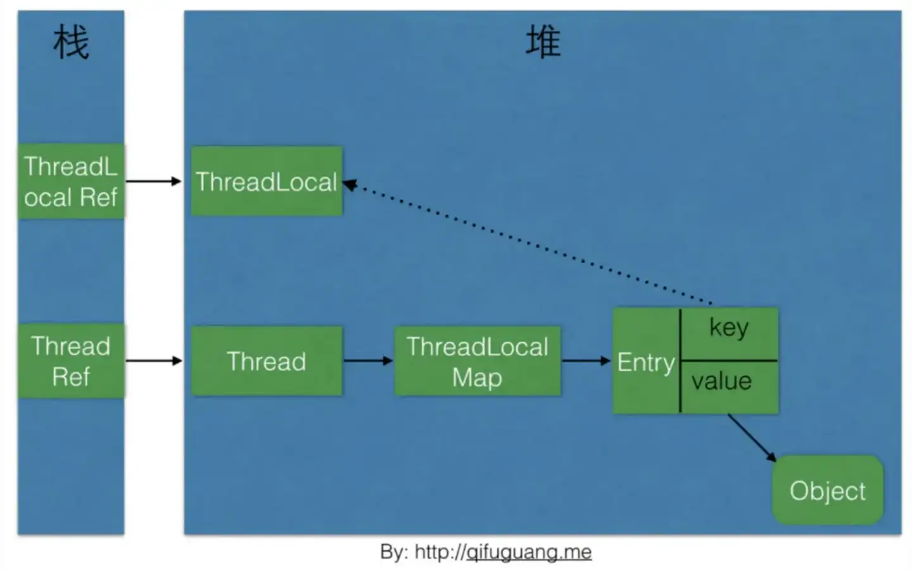

那存在长期性内存泄露需要满足条件：ThreadLocal被回收&&线程被复用&&线程复用后不再调用ThreadLocal的set/get/remove方法

## 更快的“反射”

ReflectionUtils：[https://juejin.cn/post/7401358349877674018](https://juejin.cn/post/7401358349877674018)

LambdaMetafactory：[https://juejin.cn/post/7490777239878418473](https://juejin.cn/post/7490777239878418473)