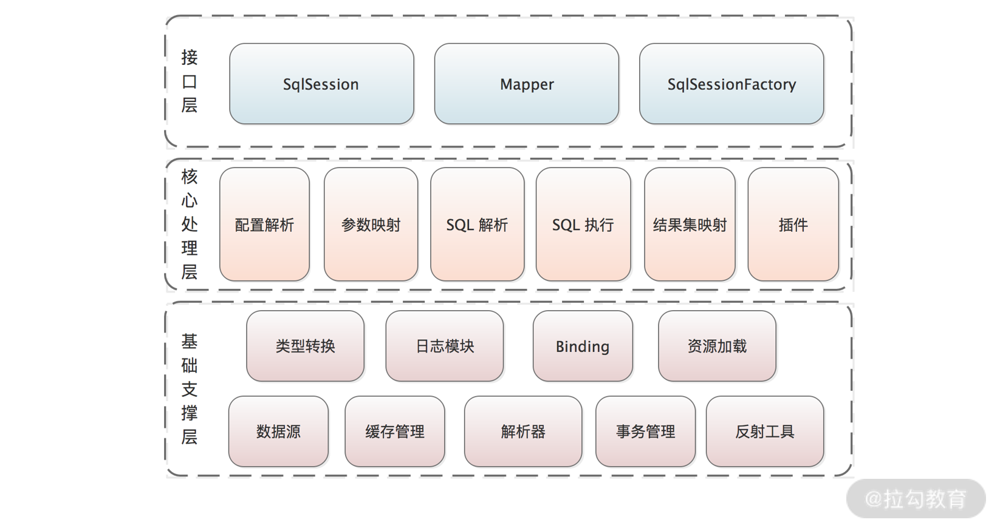
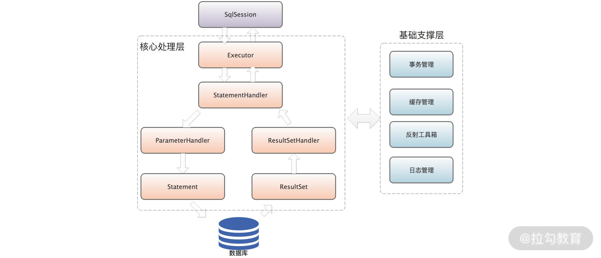
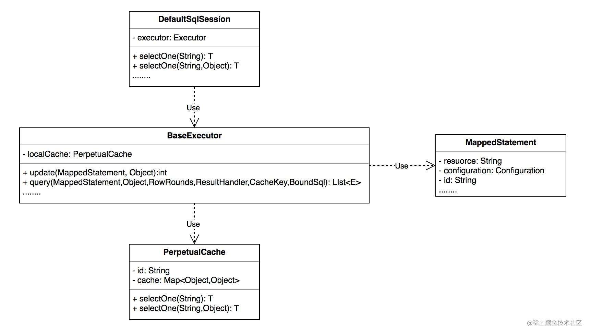
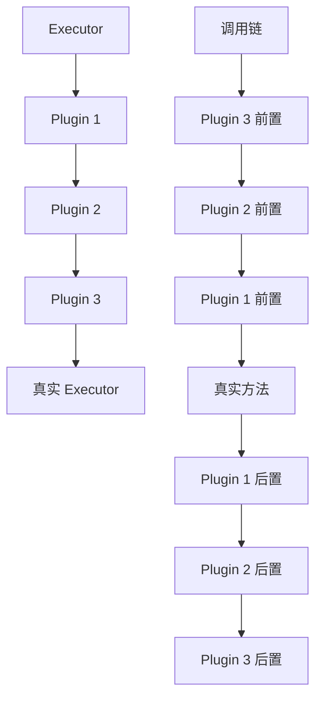
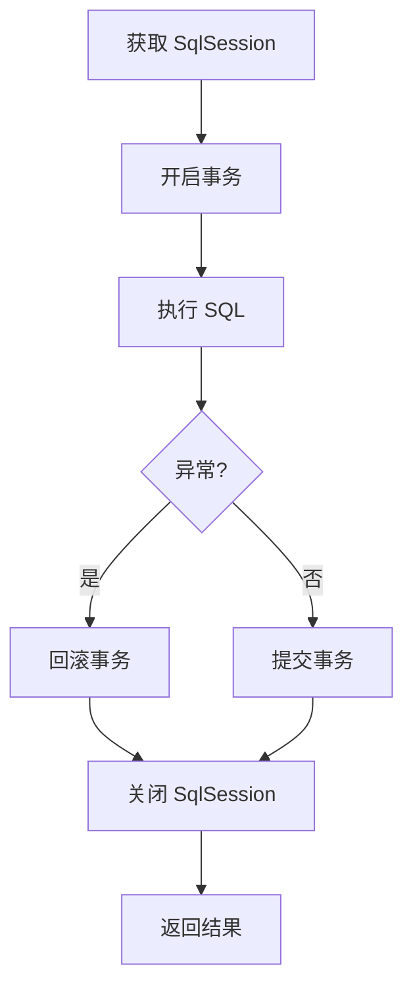

# MyBatis

本文围绕以下三个问题展开：

1. 延迟加载的原理是什么
2. 说一下 MyBatis 的一级缓存和二级缓存
3. MyBatis 解析执行 xml 的语句的流程



> 图：MyBatis 整体结构示意（一）



> 图：MyBatis 整体结构示意（二）

## 1. 延迟加载的原理是什么

它的原理是，使用 CGLIB 或 Javassist（默认）创建目标对象的代理对象。当调用代理对象的延迟加载属性的 getting 方法时，进入拦截器方法。比如调用 `a.getB().getName()` 方法，进入拦截器的 `invoke(...)` 方法，发现 `a.getB()` 需要延迟加载时，那么就会单独发送事先保存好的查询关联 B 对象的 SQL，把 B 查询上来，然后调用 `a.setB(b)` 方法，于是 a 对象 b 属性就有值了，接着完成 `a.getB().getName()` 方法的调用。这就是延迟加载的基本原理。

## 2. 说一下 MyBatis 的一级缓存和二级缓存



> 图：MyBatis 一级缓存与二级缓存示意

### 一级缓存

BaseExecutor

BaseExecutor 是一个抽象类，实现了 Executor 接口，并提供了大部分方法的实现，只有 4 个基本方法：`doUpdate`、`doQuery`、`doQueryCursor`、`doFlushStatement` 没有实现，还是抽象方法，由子类实现，这 4 个方法相当于模板方法中变化的那部分。

### 二级缓存

当配置打开，MyBatis 的二级缓存是用 CachingExecutor 来实现的，它是 Executor 的一个装饰器类。为 Executor 对象添加了 MapperFactoryBean 缓存的功能。

在介绍 CachingExecutor 之前，先来看看 CachingExecutor 依赖的两个类，TransactionalCacheManager 和 TransactionalCache。

## 3. MyBatis 解析执行 xml 的语句的流程

1. MapperScannerConfigurer 是一个 BeanDefinitionRegistryPostProcessor，会在 Spring 构建 IoC 容器的早期被调用重写的 `postProcessBeanDefinitionRegistry`，扫描注册 basePackage 包下的所有 bean，将 basePackage 包下的所有 bean 进行一些特殊处理：beanClass 设置为 MapperFactoryBean、bean 的真正接口类作为构造函数参数传入 MapperFactoryBean、为 MapperFactoryBean 添加 sqlSessionFactory 和 sqlSessionTemplate 属性。
2. SqlSessionFactoryBean 来说，实现了 2 个接口，InitializingBean 和 FactoryBean，build 了 buildSqlSessionFactory，构建了全局配置 Configuration，解析 mapperLocations 属性的 mapper 文件，将 mapper 文件中的每个 SQL 封装成 MappedStatement，放到 mappedStatements 缓存中，key 为 id，例如：`com.joonwhee.open.mapper.UserPOMapper.queryByPrimaryKey`，value 为 MappedStatement。并且将解析过的 mapper 文件的 namespace 放到 knownMappers 缓存中，key 为 namespace 对应的 class，value 为 MapperProxyFactory。
3. 创建 DAO 的 bean 时，通过 mapperInterface 从 knownMappers 缓存中获取到 MapperProxyFactory 对象，通过 JDK 动态代理创建 MapperProxyFactory 实例对象，InvocationHandler 为 MapperProxy。
4. DAO 中的接口被调用时，通过动态代理，调用 MapperProxy 的 invoke 方法，最终通过 mapperInterface 从 mappedStatements 缓存中拿到对应的 MappedStatement，执行相应的操作。

## MyBatis 插件机制（Interceptor）

MyBatis 通过**拦截器**在四大对象的方法上织入逻辑：

- 可拦截对象：`Executor`（增删改查）、`ParameterHandler`（参数）、`ResultSetHandler`（结果集）、`StatementHandler`（SQL 执行）。
- 实现 `Interceptor` 接口，用 `@Intercepts({@Signature(type=, method=, args=)})` 指定拦截点；`plugin()` 方法用 `Plugin.wrap(target, this)` 返回代理。

```java
@Intercepts({@Signature(type = Executor.class, method = "update",
        args = {MappedStatement.class, Object.class})})
public class ExampleInterceptor implements Interceptor {
    @Override
    public Object intercept(Invocation invocation) throws Throwable {
        // 前后织入逻辑：分页、审计、慢SQL统计
        return invocation.proceed();
    }
}
```

典型应用：PageHelper 分页（重写 SQL 拼 LIMIT）、数据权限（加部门过滤）、读写分离路由。

## 动态 SQL 进阶

`<if>/<choose>/<foreach>/<trim>/<where>/<set>` 在 `XMLScriptBuilder` 中被解析为 `SqlNode` 树，OGNL 表达式取值：

```xml
<select id="list" parameterType="map">
  SELECT * FROM t
  <where>
    <if test="name != null">AND name = #{name}</if>
    <if test="statusList != null">
      AND status IN
      <foreach collection="statusList" item="s" open="(" close=")" separator=",">#{s}</foreach>
    </if>
  </where>
</select>
```

注意：`<where>` 自动去除首部 `AND/OR`；`<set>` 去除尾部逗号；`${}` 用于动态表名/排序字段（**有注入风险，必须白名单校验**）。

## 缓存深入与 `#{}` vs `${}`

- **一级缓存**：`SqlSession` 级别，相同 `Mapper + 参数 + 方法` 命中；`update/commit/close` 失效；Spring 集成下 SqlSession 短命，一级缓存基本失效。
- **二级缓存**：`Mapper`(namespace) 级别，需 `cacheEnabled=true` + `<cache/>`；跨 SqlSession 共享；**事务提交后才写入**，避免脏读；但多表关联缓存易不一致，谨慎开启。
- **`#{}` 预编译**：`?` 占位 + PreparedStatement，防 SQL 注入（**必须用**）。
- **`${}` 字符串拼接**：原样替换，仅用于排序字段、表名等，务必服务端白名单。

## 批量操作与生产实践

- **`foreach` 批量插入**：`INSERT INTO t (...) VALUES (...),(...)`；注意单条 SQL 长度受 `max_allowed_packet` 限制，需分批（每批 500~1000）。
- **`ExecutorType.BATCH`**：`SqlSessionFactory.openSession(ExecutorType.BATCH)` 攒批 `addBatch`，`flushStatements()` 一次性提交，大幅降低网络往返。
- **关联查询**：`N+1` 问题用 `<collection>/<association>` 嵌套（join 一次查）或延迟加载（按需）。
- **类型处理器**：自定义 `TypeHandler` 处理枚举/JSON/加密字段。

## 面试高频

1. **MyBatis 与 Hibernate 区别**：半自动（手写 SQL，灵活可控）vs 全自动（HQL，对象化、屏蔽 SQL）；MyBatis 在复杂查询/性能敏感场景占优。
2. **插件能拦截哪些**：四大对象（Executor/ParameterHandler/ResultSetHandler/StatementHandler）。
3. **逻辑分页 vs 物理分页**：`RowBounds` 是逻辑分页（先查全量再内存截取，禁用）；PageHelper 是物理分页（改写 SQL）。

---

# 第二轮深度优化：插件 / 缓存源码 / 动态 SQL 陷阱 / 注入风险 / 批量流式 / Spring 整合

## 一、插件（Interceptor）机制与自定义实战

MyBatis 通过**责任链 + 动态代理**拦截四大核心对象：`Executor`、`ParameterHandler`、`ResultSetHandler`、`StatementHandler`。插件本质是 `@Intercepts({@Signature(type=, method=, args=)})` 标注的 `Interceptor`，在创建这四类对象时 MyBatis 用 `Plugin.wrap` 生成代理，方法调用前走 `intercept(Invocation)`。

- **自定义插件步骤**：
  ```java
  @Intercepts({@Signature(type = Executor.class, method = "update",
          args = {MappedStatement.class, Object.class})})
  public class SqlCostInterceptor implements Interceptor {
      public Object intercept(Invocation inv) throws Throwable {
          long t = System.nanoTime();
          Object r = inv.prokeed();           // 放行原方法
          log.info("sql cost={}ms", (System.nanoTime()-t)/1_000_000);
          return r;
      }
      public Object plugin(Object target){ return Plugin.wrap(target, this); }
  }
  ```
- **实战场景**：分页（PageHelper 思路，改写 SQL 拼 limit）、读写分离（按 SQL 类型路由数据源）、SQL 性能监控、数据脱敏（`ResultSetHandler` 对结果字段解密）、防全表更新（`Executor.update` 前解析 SQL 校验是否有 where）。
- **注意**：插件按配置顺序形成嵌套代理；`invocation.proceed()` 必须调用；不要在插件里做重 IO（会拖慢所有 SQL）。

## 二、缓存源码级剖析

- **一级缓存（SqlSession 级）**：存于 `BaseExecutor.localCache`（`PerpetualCache`，本质 HashMap）。cacheKey = `statementId + rowBounds + params + boundSql` 的哈希。执行 `query` 先查 localCache；`update`/`commit`/`rollback`/`close` 会 `clearLocalCache`。**纯 MyBatis** 下同一 SqlSession 两次相同查询命中；但 **Spring 集成** 时 `SqlSessionTemplate` 每次 mapper 方法调用往往新建/归还 SqlSession，一级缓存基本不跨方法生效。
- **二级缓存（namespace/Mapper 级）**：`CachingExecutor` 装饰 `BaseExecutor`，namespace 级。命中顺序：二级 → 一级 → DB。`<cache/>` 默认 `LRU` + 要求 POJO 实现 `Serializable`、`readWrite=true` 返回副本防并发修改。关键：`TransactionalCacheManager` 在**事务提交后**才把待提交缓存刷入 `delegate`，避免脏读（未提交就读到别人未提交数据）。**多表 join 的二级缓存极易不一致**（A 表更新但 B 表缓存没清），生产慎用，常用 Redis 替代。

## 三、动态 SQL 陷阱（foreach / choose / trim）

- **`foreach` 空集合**：默认会生成 `IN ()` 语法错误；务必 `collection != null and collection.size() > 0` 守卫，或用 `(1=0)` 兜底。
- **`foreach` 大列表**：拼接超长 SQL 触发 `max_allowed_packet`；分批（每批 500~1000）。
- **`choose/when/otherwise`**：类似 switch，注意 `when` 顺序，第一个命中即停，后续不再判断。
- **`trim`**：`prefixOverrides`/`suffixOverrides` 去掉多余 AND/OR/逗号，比手写 `<where>` 灵活，但要小心多 Condition 全空导致 `WHERE` 残留。
- **`#{}` 在 `foreach` 中**：每个 item 都是预编译占位，安全。

## 四、`#{}` 与 `${}` 注入风险深度

- **`#{}`**：→ `?` + PreparedStatement 设参，`'` 被转义，**杜绝 SQL 注入**。任何用户输入的列值、参数必须用 `#{}`。
- **`${}`**：→ 字符串直接拼接（text 替换），**有注入风险**。仅用于：动态表名（`FROM ${tableName}`，必须白名单校验表名集合）、动态排序字段（`ORDER BY ${column}`，白名单 + 方向校验）、动态 `LIMIT`（数值强校验）。
- **真实事故**：用 `${}` 拼 `ORDER BY ${userInput}`，用户传 `id; DROP TABLE users;--` 导致删表。防护：排序字段映射到枚举白名单 `{ "createTime":"create_time DESC" }`，前端只传 key。

## 五、批量与流式

- **`ExecutorType.BATCH`**：攒 `addBatch`，`flushStatements()` 一次性提交，减少网络 RTT；但批内异常定位难，且单批过大占内存。
- **流式查询**：`resultSetType=FORWARD_ONLY` + `fetchSize=Integer.MIN_VALUE`（MySQL 驱动流式），`ResultHandler` 逐条处理大结果集，避免全量加载 OOM。`Cursor<T>`（`@Options(resultSetType=...)`）类似。
- **对比**：小批量用 `foreach VALUES`，超大用 BATCH + 分批；超大读用流式 / Cursor。

## 六、MyBatis 与 Spring 整合原理

- `SqlSessionFactoryBean` 构建 `SqlSessionFactory`（读配置、`mapperLocations` 扫描 XML）。
- `@MapperScan` + `ClassPathMapperScanner`：把 Mapper 接口扫描注册为 `MapperFactoryBean`，其 `getObject()` 返回 `SqlSession.getMapper(interface)` 生成的**动态代理**（`MapperProxy`）。
- 调用代理方法 → `MapperMethod.execute` → 经 `SqlSessionTemplate`（线程安全，用 `SqlSessionInterceptor` 每次从 `SqlSessionHolder` 取/建 SqlSession，自动关闭）→ `Executor`。
- **事务**：Spring 托管 `SpringManagedTransaction`，把 SqlSession 与 Spring 事务绑定（同一事务复用同一 Connection），`@Transactional` 才生效。
- **一级缓存为何在 Spring 下失效**：每次 mapper 方法调用经 `SqlSessionTemplate` 默认把 SqlSession `close`（实际归还），下一个方法新建，故 localCache 不共享；但同一事务内通过 `SqlSessionHolder` 复用，一级缓存可在事务内命中。

## 七、TypeHandler 实战（枚举 / JSON / 加密）

- **枚举**：`@Enumerated` 或自定义 `TypeHandler` 把枚举与 code 互转（存 code 不存 name，防改名错乱）；`getNullableResult`/`setNonNullParameter` 做转换。
- **JSON 字段**：自定义 `JacksonTypeHandler` 把对象 ↔ JSON 字符串；MySQL 5.7+ 也可用 `JSON` 类型 + `GeneratedProperty` 读，兼顾查询与存储。
- **加密字段**：在 `TypeHandler` 的 `setParameter`/`getResult` 做加解密，业务无感；注意密钥管理、且加密后字段无法走索引/范围查询。

## 八、useGeneratedKeys 与主键回填

- `useGeneratedKeys=true` + `keyProperty` 让插入后把自增主键回填到对象；批量插入需 `keyProperty` 对应且驱动支持（JDBC 3+）。
- 注意：回填基于 JDBC `getGeneratedKeys`，与 `ExecutorType.BATCH` 配合时需在 `flushStatements()` 之后才能拿到回填值。
- Oracle 等无自增需用 `selectKey`（执行 `select seq.nextval`）先取主键再插入。

## 九、多数据源与整合进阶

- 多 `SqlSessionFactory` + 多 `DataSource` + `@MapperScan(basePackages=, sqlSessionFactoryRef=)` 分库；或用 `AbstractRoutingDataSource` 按上下文（ThreadLocal）动态路由（读写分离 / 多租户）。
- 事务：多数据源无法用单 `@Transactional` 跨库原子，需 `JtaTransactionManager`（Atomikos/Narayana）或退而求其次用最终一致（本地消息表 / TCC）。

## 十、XML 与注解混用、OGNL 陷阱

- 注解（`@Select`/`@Update`）与 XML 二选一；复杂动态 SQL 仍用 XML（`@SelectProvider` 也可，但可读性差）。
- OGNL 取值：`#{}` 按属性名取（支持 `user.name` 嵌套），`${}` 拼字符串；`<if test="status == 1">` 里 `==` 比较对象时当心 `Integer` 缓存只覆盖 -128~127，超范围要用 `eq` 或 `.equals()`。
- 字符串判空：`<if test="name != null and name != ''">`；集合判空：`<if test="list != null and list.size() > 0">`。

## 十一、通用 Mapper / MyBatis-Plus

- **MyBatis-Plus** 提供 `BaseMapper` 通用 CRUD、`Wrapper` 条件构造、`分页插件`、`逻辑删除`（`@TableLogic`）、`自动填充`（`MetaObjectHandler`）；大幅减样板代码。
- 代价：复杂 SQL 仍要手写；`Wrapper` 过度拼接易出 `TooManyResults`/误全表风险，必要时 `last("limit 1")` 兜底；代码生成器（generator）可一键出 entity/mapper/xml。

## 十二、常见性能坑与排查

- 慢 SQL：`logImpl=STDOUT` 或 `p6spy` 打印实际 SQL 与耗时；`fetchSize` 调大减少往返。
- N+1：`@One`/`@Many` 嵌套 + `fetchType` 控制；优先 join 一次查或分页避免。
- 缓存误用：同 SqlSession 多次查触发一级缓存，但并发下可能读到中间状态；明确缓存作用域，别依赖它做跨请求一致性。
- 大结果集：务必流式/分页，勿 `select *` 全量进内存；`resultMap` 复杂映射注意懒加载触发次数。

## 十三、二级缓存与 Redis 整合

- 二级缓存跨 SqlSession 但多表关联易不一致；生产更常用 **Redis 作为二级缓存**（MyBatis Redis Cache 实现 / 自写 `Cache` 接口），集中存储、可 TTL、多实例共享。
- 注解：`@CacheNamespace(implementation = RedisCache.class)` 或 XML `<cache type="com.x.RedisCache"/>`；`@Options(useCache=false)` 关闭单条缓存、`flushCache=true` 强制刷新。

## 十四、批处理 BATCH 陷阱

- `ExecutorType.BATCH` 靠 `PreparedStatement.addBatch` + `executeBatch` 合并；**只有同一条 SQL 才合并**，不同 SQL 各自 batch；`flushStatements()` 后才真正发送。
- 坑：批内某条失败抛 `BatchUpdateException`，需 `getUpdateCounts` 逐条看；批太大占 JDBC 内存，应分批（每批 500~1000）。

## 十五、插件拦截顺序与常见问题

- 多个插件按配置顺序形成嵌套代理：最外层先执行 `intercept` 前置逻辑，`Executor` 实际执行。调试时注意调用栈顺序。
- 常见坑：在 `ResultSetHandler` 改结果却忘了处理 `proceed()` 之后；插件里做 IO 拖慢所有查询；拦截 `update` 做审计要跳过自身写入。

## 十六、延迟加载（Lazy Loading）

- `fetchType=LAZY` + `aggressiveLazyLoading=false`：关联对象用代理，访问时才查，避免无用 join。坑：SqlSession 关闭后访问懒加载属性抛 `LazyInitializationException`；序列化时可能触发或丢失。

## 十七、MyBatis 与 JPA 再次选型

- 复杂 SQL/高性能用 MyBatis，标准 CRUD/对象模型用 JPA；也可"JPA 管写、MyBatis 管复杂读"混用（见其他框架技术篇）。

## 十八、常见面试题深入

- **`#{}` 预编译原理**：MyBatis 把 `#{}` 替换为 `?`，用 `PreparedStatement.setXxx` 设参，类型由 JavaType/JdbcType 推断；`${}` 直接文本替换，有注入风险。
- **插件能拦截哪些**：Executor / ParameterHandler / ResultSetHandler / StatementHandler；`SqlSession` 不在其列（它不是被代理包装的核心对象）。
- **一级缓存失效原因**：SqlSession 关闭/commit/update；Spring 集成下每次 mapper 调用新建 SqlSession。
- **逻辑 vs 物理分页**：`RowBounds` 逻辑分页（先查全量再截断，禁用），PageHelper 改写 SQL 物理分页。

## 十九、MyBatis 与 Spring 事务整合坑

- 事务失效常因"自调用"或 SqlSession 作用域：同一 Service 内方法互调不经过代理；跨 mapper 调用由 `SpringManagedTransaction` 把 SqlSession 绑到 Spring 事务，同一事务复用同一 Connection。`@Transactional` 不生效时优先查：是否 public、是否被自调用、异常是否被吞、数据库是否支持。
- 多数据源下每个数据源有独立 `SqlSessionFactory` 与事务管理器，单 `@Transactional` 不能跨库原子，需用 JTA 或最终一致。

## 二十、批量主键生成（useGeneratedKeys 深入）

- `useGeneratedKeys=true` + `keyProperty` 在插入后回填 JDBC 自增主键；批量插入时 MyBatis 会按 `BatchResult` 回填每个对象的 key（要求驱动/JDBC 支持 `getGeneratedKeys`）。
- Oracle 无自增，用 `<selectKey>` 先查序列 `seq.nextval` 赋给 keyProperty，再插入；MySQL 8 可用 `IDENTITY` 自增。
- 注意：与 `ExecutorType.BATCH` 配合时，回填发生在 `flushStatements()` 之后，若提前读取会拿到 null。

## 二十一、MyBatis-Plus 常见陷阱

- `Wrapper` 拼接若来自外部输入需防注入（只拼白名单字段）；`eq` 字段名用实体属性而非数据库列名（MP 做映射）。
- 逻辑删除（`@TableLogic`）会在查询自动加 `deleted=0`，但**手动 SQL / XML 不受控**，易漏；更新时逻辑删除是 `update deleted=1` 而非物理删。
- `updateById` 只更新非 null 字段（null 不更新），想更新为 null 需 `set` 或 `UpdateWrapper`。
- 乐观锁 `@Version` 靠 `UPDATE ... SET ..., version=version+1 WHERE id=? AND version=?`，并发冲突抛 `OptimisticLockException`，需业务重试。

---

# 第三轮深度优化：插件链源码 / 缓存与事务坑 / 复杂动态 SQL / 注入防护 / TypeHandler / MP 对比与生成

## 一、插件链源码级（Interceptor 四大拦截点 + 责任链）

MyBatis 在创建四大对象（Executor / ParameterHandler / ResultSetHandler / StatementHandler）时，会遍历所有 `Interceptor`，用 `Plugin.wrap(target, interceptor)` 生成**嵌套代理**。以 `Executor` 为例：

```java
// Plugin.wrap 核心：对被 @Signature 标注的接口方法生成 JDK 动态代理
public static Object wrap(Object target, Interceptor i) {
    Map<Class<?>, Set<Method>> signatureMap = getSignatureMap(i);
    Class<?> type = target.getClass();
    Class<?>[] interfaces = getAllInterfaces(type, signatureMap);
    return interfaces.length > 0
        ? Proxy.newProxyInstance(type.getClassLoader(), interfaces, new Plugin(target, i, signatureMap))
        : target;
}
// Plugin.invoke：命中签名方法才走 intercept，否则直调
public Object invoke(Object proxy, Method method, Object[] args) throws Throwable {
    if (signatureMap.get(method.getDeclaringClass()).contains(method))
        return interceptor.intercept(new Invocation(target, method, args));
    return method.invoke(target, args);
}
```

- **四大拦截点的典型用途**：
  - `Executor.update/query`：分页改写、数据权限加过滤、SQL 审计、防全表更新。
  - `ParameterHandler.setParameters`：参数加密、租户 ID 注入、脱敏。
  - `ResultSetHandler.handleResultSets`：结果解密、字段脱敏、类型转换。
  - `StatementHandler.prepare/parameterize`：SQL 改写（分表路由）、读写分离选库。
- **调用顺序**：多个插件按 `mybatis-config.xml` 中 `<plugins>` 配置顺序**从外到内**嵌套，最外层 `intercept` 前置先执行，`invocation.proceed()` 进入下一层，最终到真实对象。调试看调用栈即知顺序。

## 二、自定义数据权限插件（实战代码）

需求：所有查询按当前用户部门自动加 `AND dept_id IN (...)`，业务 SQL 无感知。

```java
@Intercepts({@Signature(type = Executor.class, method = "query",
        args = {MappedStatement.class, Object.class, RowBounds.class, ResultHandler.class})})
public class DataPermissionInterceptor implements Interceptor {
    public Object intercept(Invocation inv) throws Throwable {
        MappedStatement ms = inv.getArgs()[0];
        Object param = inv.getArgs()[1];
        // 跳过非白名单、或标记跳过权限的 statement
        if (needSkip(ms.getId())) return inv.proceed();
        // 用 JSqlParser/Custom 解析 BoundSql，注入 dept 过滤条件
        BoundSql boundSql = ms.getBoundSql(param);
        String newSql = appendDeptFilter(boundSql.getSql(), currentUserDeptIds());
        // 重写 MappedStatement 的 SQL（构造新 MS 不可变，需重建）
        MappedStatement newMs = rewriteMs(ms, newSql, boundSql);
        inv.getArgs()[0] = newMs;
        return inv.proceed();
    }
    public Object plugin(Object t){ return Plugin.wrap(t, this); }
}
```

要点：`MappedStatement`/`BoundSql` 不可变，改写 SQL 必须**重建 MappedStatement**（复制 builder 并替换 sqlSource）；解析 SQL 推荐 `JSqlParser` 而非字符串拼接（避免破坏子查询/别名）；租户/数据权限是插件最典型场景。

## 三、分表插件（按分片键路由表名）

```java
@Intercepts({@Signature(type = StatementHandler.class, method = "prepare",
        args = {Connection.class, Integer.class})})
public class ShardingInterceptor implements Interceptor {
    public Object intercept(Invocation inv) throws Throwable {
        StatementHandler sh = (StatementHandler) inv.getTarget();
        BoundSql bs = sh.getBoundSql();
        Object param = bs.getParameterObject();
        // 从参数取分片键（如 userId），算表后缀
        String suffix = tableSuffix(getShardKey(param));
        String sql = bs.getSql().replaceAll("(?i)\\{tableName\\}", "order_" + suffix);
        // 反射改写 StatementHandler 的 delegate.boundSql.sql
        setField(sh, "boundSql.sql", sql);
        return inv.proceed();
    }
}
```

SQL 中写逻辑表名 `INSERT INTO {tableName} (...) VALUES (...)`，插件按分片键把 `{tableName}` 替换为物理表；更大规模直接用 ShardingSphere，避免自研边界坑（事务、跨片查询）。

## 四、一级/二级缓存与 Spring 事务的坑

- **一级缓存（SqlSession 级）与事务的关系**：纯 MyBatis 下同一 SqlSession 内事务未提交，查询命中 localCache 返回同一对象；但 Spring 整合时 `SqlSessionTemplate` 在方法结束（或事务提交）后会归还/关闭 SqlSession，**跨方法一级缓存基本不共享**。坑：在 Spring 事务中循环 `getById` 同一 id 多次，若每次都从 `SqlSessionHolder` 取同一 SqlSession（同一事务），会命中一级缓存；一旦事务边界不同，缓存不共享、多查库。
- **二级缓存与事务提交**：`CachingExecutor` 用 `TransactionalCacheManager` 暂存待写缓存，**只有事务提交后**才刷入 `delegate`；若事务回滚，缓存不写入，避免脏读。坑：在 `@Transactional` 内更新后立刻查（同事务）能拿到新值，但这是 DB 回滚一致性保证，不是缓存——跨 SqlSession 的读仍读旧缓存直到提交。
- **Spring 事务 + 缓存的双重失效**：`@Transactional` 方法内 `clearCache`/更新，二级缓存事务提交才生效；若方法抛异常回滚，缓存不更新但 DB 也回滚，一致；但若混用 Redis 二级缓存（外部），需 `TransactionalEventListener(AFTER_COMMIT)` 同步清 Redis，否则提交前清了 Redis 却 DB 回滚，造成脏数据。
- **口诀**：缓存一致性难在"跨 SqlSession/跨进程"；多表 join 的二级缓存几乎必不一致，生产优先 Redis + TTL，而非 MyBatis 内置二级。

## 五、动态 SQL 复杂场景（嵌套 choose / foreach 批量 upsert）

- **嵌套 choose**：按条件组合不同过滤分支，注意 `when` 顺序（命中即停）：
  ```xml
  <where>
    <choose>
      <when test="type == 'A'">
        AND status = 1 AND region = #{region}
      </when>
      <when test="type == 'B'">
        AND status IN <foreach collection="statusList" item="s" open="(" close=")" separator=",">#{s}</foreach>
      </when>
      <otherwise>
        AND create_time >= #{start}
      </otherwise>
    </choose>
    <if test="keyword != null">
      AND name LIKE CONCAT('%', #{keyword}, '%')
    </if>
  </where>
  ```
- **foreach 批量 upsert（MySQL `INSERT ... ON DUPLICATE KEY UPDATE`）**：
  ```xml
  <insert id="batchUpsert">
    INSERT INTO t (id, name, cnt) VALUES
    <foreach collection="list" item="e" separator=",">
      (#{e.id}, #{e.name}, #{e.cnt})
    </foreach>
    ON DUPLICATE KEY UPDATE name = VALUES(name), cnt = VALUES(cnt)
  </insert>
  ```
  注意：必须有唯一键（PK 或 UK）才能 upsert；批过大超 `max_allowed_packet`，需分批（每批 500~1000）；`VALUES(col)` 引用插入行的值，避免常量覆盖。
- **foreach 批量 update（case when）**：`UPDATE t SET cnt = CASE id WHEN #{i.id} THEN #{i.cnt} ... END WHERE id IN (...)`，单条 SQL 完成多行更新，减少网络往返；但 SQL 长，批大时拆批。

## 六、`#{}` 与 `${}` 注入风险与防护（进阶）

- **`#{}` 永远优先**：任何值参数（列值、IN 列表元素、LIKE 内容）一律 `#{}`，PreparedStatement 预编译 + 转义，`'` 被处理，注入无效。
- **`${}` 仅三种合法场景，且必须服务端白名单**：
  1. 动态表名 `FROM ${table}`：表名来自固定枚举/配置，校验 `table.matches("[a-zA-Z0-9_]+")` 并查白名单集合，禁止用户任意输入。
  2. 动态排序列 `ORDER BY ${col}`：映射 `{ "ctime": "create_time DESC" }`，前端只传 key，后端取值。**绝不把用户字符串直接拼进 ORDER BY**——`col; DROP TABLE t;--` 即删表。
  3. 动态 direction：`ASC/DESC` 枚举校验，禁止其他值。
- **真实防护模式**：建 `SqlInjectionFilter` 工具，对 `${}` 入参做正则白名单 + 关键字（select/update/delete/drop/;/--）拦截；MyBatis-Plus 的 `QueryWrapper` 用 `orderBy(..., "create_time")` 也只接受列名字符串，外部排序键走映射表。
- **LIKE 注入**：`LIKE CONCAT('%', #{kw}, '%')` 安全；若用 `${'%'+kw+'%'}` 则 `$` 拼接有注入，且特殊字符（%、_、\）需 `ESCAPE` 转义。

## 七、类型处理器 TypeHandler 自定义（实战）

实现 `org.apache.ibatis.type.TypeHandler<T>`（或继承 `BaseTypeHandler<T>`），`setNonNullParameter` 写、`getNullableResult` 读：

```java
public class JsonTypeHandler extends BaseTypeHandler<Object> {
    private final ObjectMapper mapper = new ObjectMapper();
    public void setNonNullParameter(PreparedStatement ps, int i, Object p, JdbcType t) throws SQLException {
        ps.setString(i, mapper.writeValueAsString(p));   // 对象 -> JSON 串
    }
    public Object getNullableResult(ResultSet rs, String col) throws SQLException {
        String s = rs.getString(col);
        return s == null ? null : mapper.readValue(s, Map.class); // JSON 串 -> 对象
    }
    // getNullableResult(ResultSet,int) / (CallableStatement,int) 同逻辑
}
```

注册：`mybatis-config.xml` `<typeHandlers><typeHandler handler="..JsonTypeHandler" javaType="..."/></typeHandlers>`，或在 `@Result`/`resultMap` 上 `typeHandler=`。场景：JSON 字段、枚举存 code、敏感字段加解密（在 set/get 做 AES-GCM，密钥走 KMS；注意加密字段无法走索引/范围查询）。Map 统一注册 Gson/Jackson，省去每个字段声明。

## 八、MyBatis-Plus 对比及代码生成

| 维度 | MyBatis（原生） | MyBatis-Plus |
| --- | --- | --- |
| CRUD | 手写 XML/注解 | `BaseMapper` 通用 CRUD，零 XML |
| 条件构造 | 手写动态 SQL | `QueryWrapper`/`LambdaUpdateWrapper` 链式 |
| 分页 | 自写/PageHelper | 内置分页插件（`PaginationInnerInterceptor`） |
| 逻辑删除/填充 | 手写 | `@TableLogic` / `MetaObjectHandler` 自动 |
| 复杂 SQL | 灵活，手写最优 | 仍要手写 XML（Wrapper 拼不出时） |
| 学习/掌控 | 完全可控 | 黑盒较多，需懂其生成逻辑 |

- **代码生成器**：MP `AutoGenerator`（或 `mybatis-plus-generator`）按表结构一键出 `Entity / Mapper / Service / Controller / XML`，配 `StrategyConfig`（表前缀、字段命名驼峰）、`GlobalConfig`（输出路径）、`DataSourceConfig`。注意：生成代码仅作脚手架，**复杂查询与业务逻辑仍需手写**，生成的 `updateById` 只更非 null 字段（想置 null 用 `UpdateWrapper.set`）。
- **选型**：简单 CRUD 多、想省样板 → MP；复杂报表/极致性能/可读 SQL → 原生 MyBatis；二者可共存（MP 管简单读写，XML 管复杂 SQL）。

## 二十二、MyBatis 插件机制深度（责任链 + 动态代理）

### 22.1 四大拦截点详解

```text
MyBatis 插件可拦截的四大对象：

1. Executor（执行器）
   - 拦截方法：update/query/commit/rollback
   - 用途：分页改写、数据权限、SQL审计、缓存控制
   - 典型实现：PageHelper

2. StatementHandler（语句处理器）
   - 拦截方法：prepare/parameterize/batch/update/query
   - 用途：SQL改写、分表路由、读写分离
   - 最常用拦截点

3. ParameterHandler（参数处理器）
   - 拦截方法：setParameters/getParameterObject
   - 用途：参数加密、租户ID注入、脱敏

4. ResultSetHandler（结果集处理器）
   - 拦截方法：handleResultSets/handleOutputParameters
   - 用途：结果解密、字段脱敏、类型转换
```

### 22.2 插件执行顺序



```java
// 插件执行顺序示例
// mybatis-config.xml 中配置顺序决定执行顺序
<plugins>
  <plugin interceptor="com.example.SqlCostInterceptor"/>      <!-- 最外层 -->
  <plugin interceptor="com.example.DataPermissionInterceptor"/> <!-- 中间层 -->
  <plugin interceptor="com.example.TenantInterceptor"/>         <!-- 最内层 -->
</plugins>
```

## 二十三、MyBatis TypeHandler 机制

### 23.1 内置 TypeHandler 对照

| Java Type | JDBC Type | TypeHandler |
|-----------|-----------|-------------|
| String | VARCHAR | StringTypeHandler |
| Integer | INTEGER | IntegerTypeHandler |
| Long | BIGINT | LongTypeHandler |
| Double | DOUBLE | DoubleTypeHandler |
| Boolean | BOOLEAN | BooleanTypeHandler |
| Date | TIMESTAMP | JdbcDateHandler |
| LocalDateTime | TIMESTAMP | LocalDateTimeTypeHandler |
| Enum | VARCHAR/INTEGER | EnumTypeHandler |
| byte[] | BLOB | BlobTypeHandler |

### 23.2 自定义 TypeHandler 实战

```java
// JSON 字段 TypeHandler
@MappedTypes(Map.class)
public class JsonTypeHandler extends BaseTypeHandler<Object> {
    private final ObjectMapper mapper = new ObjectMapper();
    
    @Override
    public void setNonNullParameter(PreparedStatement ps, int i, Object parameter, JdbcType jdbcType) 
            throws SQLException {
        ps.setString(i, mapper.writeValueAsString(parameter));
    }
    
    @Override
    public Object getNullableResult(ResultSet rs, String columnName) throws SQLException {
        return parse(rs.getString(columnName));
    }
    
    @Override
    public Object getNullableResult(ResultSet rs, int columnIndex) throws SQLException {
        return parse(rs.getString(columnIndex));
    }
    
    @Override
    public Object getNullableResult(CallableStatement cs, int columnIndex) throws SQLException {
        return parse(cs.getString(columnIndex));
    }
    
    private Object parse(String json) {
        if (json == null || json.isEmpty()) return null;
        try {
            return mapper.readValue(json, Map.class);
        } catch (Exception e) {
            throw new RuntimeException("JSON parse error", e);
        }
    }
}
```

```xml
<!-- 注册 TypeHandler -->
<typeHandlers>
  <typeHandler handler="com.example.JsonTypeHandler" 
               javaType="com.example.dto.UserExtra"
               jdbcType="VARCHAR"/>
</typeHandlers>

<!-- 使用 TypeHandler -->
<resultMap id="userResultMap" type="User">
  <id property="id" column="id"/>
  <result property="extra" column="extra_json" 
          typeHandler="com.example.JsonTypeHandler"/>
</resultMap>
```

## 二十四、MyBatis 动态 SQL 引擎原理

### 24.1 动态 SQL 解析流程

```text
XML SQL → XMLScriptBuilder → SqlNode 树 → DynamicContext → SqlSource → BoundSql

1. XMLScriptBuilder.parseBodyNode()
   - 解析 <if>/<where>/<set>/<foreach>/<choose>/<trim> 等节点
   - 构建 MixedSqlNode（包含所有子节点）

2. SqlNode.apply(DynamicContext)
   - 遍历所有子节点，根据条件生成 SQL 片段
   - <if> 用 OGNL 表达式判断条件
   - <where> 自动去除首部 AND/OR
   - <set> 自动去除尾部逗号
   - <foreach> 展开集合

3. DynamicContext.getSql()
   - 获取拼接后的完整 SQL
   - 调用 SqlSource 的 getBoundSql()

4. SqlSource.getBoundSql()
   - 替换 ${} 为实际值（字符串替换）
   - 替换 #{} 为 ?（预编译占位符）
   - 返回 BoundSql（包含 SQL + 参数映射）
```

### 24.2 OGNL 表达式陷阱

```xml
<!-- 陷阱1：Integer 缓存范围 -->
<if test="status == 1">  <!-- status 为 Integer，>127 时 == 比较对象引用失败 -->
  AND status = 1
</if>
<!-- 正确写法 -->
<if test="status == 1 or status eq 1">
  AND status = 1
</if>

<!-- 陷阱2：字符串判空 -->
<if test="name != null and name != ''">  <!-- 必须同时判 null 和空串 -->
  AND name = #{name}
</if>

<!-- 陷阱3：集合判空 -->
<if test="list != null and list.size() > 0">  <!-- 不能用 list.isEmpty() -->
  AND id IN
  <foreach collection="list" item="id" open="(" close=")" separator=",">
    #{id}
  </foreach>
</if>

<!-- 陷阱4：choose 顺序 -->
<choose>
  <when test="type == 'A'">AND status = 1</when>  <!-- 第一个命中即停 -->
  <when test="type == 'B'">AND status = 2</when>
  <otherwise>AND status = 0</otherwise>
</choose>
```

## 二十五、MyBatis 缓存层级（L1/L2）

### 25.1 一级缓存（SqlSession 级）

```text
一级缓存工作原理：
┌─────────────────────────────────────────┐
│ SqlSession                              │
│  └── Executor (BaseExecutor)            │
│       └── localCache (PerpetualCache)   │
│            └── HashMap<CacheKey, Object>│
└─────────────────────────────────────────┘

CacheKey 构成：
- statementId（Mapper + 方法名）
- rowBounds（分页参数）
- params（查询参数）
- boundSql.sql（SQL 语句）

失效条件：
- 执行 update/insert/delete
- 执行 commit/rollback
- 调用 clearCache()
- SqlSession 关闭

Spring 集成下的问题：
- SqlSessionTemplate 每次方法调用新建/归还 SqlSession
- 跨方法一级缓存基本不共享
- 同一事务内通过 SqlSessionHolder 复用
```

### 25.2 二级缓存（Mapper/Namespace 级）

```text
二级缓存工作原理：
┌──────────────────────────────────────────┐
│ SqlSession 1     SqlSession 2            │
│     │                │                   │
│     ▼                ▼                   │
│  CachingExecutor (装饰器)                │
│     │                │                   │
│     ▼                ▼                   │
│  ┌──────────────────────────────────┐   │
│  │ 二级缓存 (namespace 级)          │   │
│  │  └── TransactionalCacheManager   │   │
│  │       └── TransactionalCache     │   │
│  │            └── HashMap 缓存       │   │
│  └──────────────────────────────────┘   │
└──────────────────────────────────────────┘

命中顺序：二级缓存 → 一级缓存 → 数据库

关键特性：
- 事务提交后才写入二级缓存（避免脏读）
- 多表 join 的二级缓存极易不一致
- 生产建议用 Redis 替代 MyBatis 内置二级缓存
```

## 二十六、MyBatis-Spring 整合原理

```text
整合流程：
1. SqlSessionFactoryBean 构建 SqlSessionFactory
   - 读取 mybatis-config.xml
   - 扫描 mapperLocations 的 XML 文件
   - 注册 TypeHandler
   - 注册 Mapper 到 knownMappers

2. @MapperScan + ClassPathMapperScanner
   - 扫描 Mapper 接口
   - 注册为 MapperFactoryBean
   - getObject() 返回 SqlSession.getMapper() 的代理

3. 调用 Mapper 方法
   - MapperProxy.invoke()
   - MapperMethod.execute()
   - SqlSessionTemplate（线程安全）
   - Executor 执行 SQL

4. 事务绑定
   - SpringManagedTransaction
   - 同一事务复用同一 Connection
   - @Transactional 才生效
```

## 二十七、MyBatis 与 JPA/Hibernate 对比

| 维度 | MyBatis | JPA/Hibernate |
|------|---------|---------------|
| SQL 控制 | 完全控制，手写 SQL | 自动生成，HQL/JPQL |
| 学习曲线 | 低，SQL 为基础 | 高，ORM 概念多 |
| 复杂查询 | 强，灵活编写 | 弱，复杂查询受限 |
| 缓存 | L1/L2，可集成 Redis | L1/L2，更完善 |
| 性能 | 优化空间大 | 需调优，N+1 问题 |
| 适用场景 | 互联网/复杂查询/性能敏感 | 企业级/CRUD 为主/快速开发 |
| 迁移成本 | 低，SQL 显式 | 高，ORM 耦合重 |

**混用策略**：JPA 管简单 CRUD（省代码），MyBatis 管复杂报表/批量操作（控性能）。

## 二十八、MyBatis 批量操作优化

### 28.1 三种批量方式对比

| 方式 | 原理 | 性能 | 适用场景 |
|------|------|------|----------|
| foreach VALUES | 单条 SQL 插入多行 | 高 | 中等批量（<1000行） |
| ExecutorType.BATCH | JDBC addBatch + executeBatch | 最高 | 大批量（>1000行） |
| 流式查询 | 游标逐条处理 | 中 | 大结果集读取 |

### 28.2 BATCH 模式最佳实践

```java
// 批量插入示例
public void batchInsert(List<User> users) {
    SqlSession sqlSession = sqlSessionFactory.openSession(ExecutorType.BATCH, false);
    UserMapper mapper = sqlSession.getMapper(UserMapper.class);
    
    try {
        for (int i = 0; i < users.size(); i++) {
            mapper.insert(users.get(i));
            // 每 500 条提交一次
            if (i % 500 == 499) {
                sqlSession.flushStatements();
                sqlSession.clearCache();
            }
        }
        sqlSession.flushStatements();
        sqlSession.commit();
    } catch (Exception e) {
        sqlSession.rollback();
        throw e;
    } finally {
        sqlSession.close();
    }
}
```

```xml
<!-- 流式查询示例 -->
<select id="selectLargeResult" resultMap="userResultMap" 
        resultSetType="FORWARD_ONLY" fetchSize="-2147483648">
  SELECT * FROM users WHERE status = #{status}
</select>
<!-- fetchSize=Integer.MIN_VALUE 启用 MySQL 流式查询 -->
```

---

## 二十四、MyBatis 拦截器链执行顺序与四大拦截点

### 24.1 四大拦截点详解

| 拦截对象 | 拦截方法 | 典型用途 | 优先级 |
|----------|----------|----------|--------|
| Executor | update/query | 分页改写、数据权限、SQL审计 | 1（最外层） |
| StatementHandler | prepare/parameterize | SQL改写、分表路由、读写分离 | 2 |
| ParameterHandler | setParameters | 参数加密、租户ID注入 | 3 |
| ResultSetHandler | handleResultSets | 结果解密、字段脱敏 | 4（最内层） |

### 24.2 插件嵌套代理执行流程

```
多个插件按配置顺序形成嵌套代理：

  Plugin A → Plugin B → Plugin C → 真实对象

  调用链：
    A.intercept()
      → B.intercept()
        → C.intercept()
          → 真实方法执行
        ← C 后置处理
      ← B 后置处理
    ← A 后置处理

  关键：invocation.proceed() 必须调用，否则链断裂
```

### 24.3 MyBatis-Plus 条件构造器使用场景

```java
// LambdaQueryWrapper：类型安全，避免字段名硬编码
LambdaQueryWrapper<User> wrapper = new LambdaQueryWrapper<>();
wrapper.eq(User::getStatus, 1)
       .like(StringUtils.isNotBlank(name), User::getName, name)
       .in(User::getAge, Arrays.asList(20, 25, 30))
       .orderByDesc(User::getCreateTime)
       .last("LIMIT 10");

// LambdaUpdateWrapper：更新指定字段
LambdaUpdateWrapper<User> updateWrapper = new LambdaUpdateWrapper<>();
updateWrapper.eq(User::getId, 1)
             .set(User::getName, "李四")
             .set(User::getStatus, 0);
```

### 24.4 MyBatis 与 Spring TransactionManager 交互细节

| 传播行为 | 事务行为 | 典型场景 |
|----------|----------|----------|
| REQUIRED | 有则加入，无则新建 | 默认，最常用 |
| REQUIRES_NEW | 始终新建事务 | 独立日志记录 |
| NESTED | 嵌套事务（savepoint） | 部分回滚 |
| SUPPORTS | 有则加入，无则非事务 | 查询方法 |

```
Spring 集成事务流程：
  @Transactional → TransactionManager
    → TransactionSynchronizationManager 绑定 SqlSession 到线程
    → 同一事务复用同一 Connection
    → 事务提交/回滚 → 关闭 SqlSession

  关键点：
    自调用不经过代理 → 事务不生效
    异常被 catch 吞掉 → 事务不回滚
    rollbackFor 需指定（默认只回滚 RuntimeException）
```

### 24.5 延迟加载原理与 N+1 问题规避

```
延迟加载原理：
  fetchType=LAZY → 使用 CGLIB/Javassist 创建代理对象
  访问关联属性时 → 拦截器检测到延迟加载触发 → 发送额外 SQL 查询

  N+1 问题：
    查询 N 条主记录 → 每条触发 1 次关联查询 → N+1 次 SQL

  规避方案：
    1. join fetch（一次查询全部关联数据）
    2. batch fetch（按批次预加载，@BatchSize）
    3. 子查询 + IN（2 次查询解决 N+1）
```

```xml
<!-- Batch Fetch 规避 N+1 -->
<resultMap id="orderWithItems" type="Order">
    <id property="id" column="id"/>
    <collection property="items" ofType="OrderItem"
                select="selectItemsByOrderId"
                fetchType="lazy"/>
</resultMap>
```

### 24.6 MyBatis 多数据源配置

```java
// AbstractRoutingDataSource 动态数据源切换
public class DynamicDataSource extends AbstractRoutingDataSource {
    @Override
    protected Object determineCurrentLookupKey() {
        return DataSourceContextHolder.getDataSourceType();
    }
}

// 使用：切换数据源
DataSourceContextHolder.setDataSource("slave");
try {
    // 执行读操作
    userMapper.selectById(1);
} finally {
    DataSourceContextHolder.clear();
}
```

## 二十五、PageHelper 分页原理

### 24.1 工作流程


```java
// PageHelper 使用示例
PageHelper.startPage(1, 10);  // 设置分页参数
List<User> users = userMapper.selectAll();  // 自动分页
PageInfo<User> pageInfo = new PageInfo<>(users);
// pageInfo.getTotal() → 总记录数
// pageInfo.getPages() → 总页数
// pageInfo.getList() → 当前页数据
```

### 24.2 分页拦截器核心逻辑

```java
@Intercepts({
    @Signature(type = StatementHandler.class, method = "prepare",
               args = {Connection.class, Integer.class})
})
public class PageInterceptor implements Interceptor {
    @Override
    public Object intercept(Invocation invocation) throws Throwable {
        // 1. 检查是否有分页参数
        Object[] args = invocation.getArgs();
        StatementHandler handler = (StatementHandler) args[0];
        BoundSql boundSql = handler.getBoundSql();
        String originalSql = boundSql.getSql();

        // 2. 改写为 COUNT 查询
        String countSql = "SELECT COUNT(*) FROM (" + originalSql + ") _count";

        // 3. 执行 COUNT
        // ... 获取总数

        // 4. 改写为分页 SQL（MySQL）
        String pageSql = originalSql + " LIMIT " + offset + ", " + pageSize;

        // 5. 设置回原 SQL
        ReflectUtil.setFieldValue(boundSql, "sql", pageSql);
        return invocation.proceed();
    }
}
```

## 二十五、MyBatis 拦截器链机制

| 拦截器类型 | 拦截目标 | 用途 |
|-----------|----------|------|
| PageInterceptor | StatementHandler | 分页 |
| TenantInterceptor | Executor | 多租户 SQL 改写 |
| DataPermissionInterceptor | Executor | 数据权限过滤 |
| CacheInterceptor | Executor | 二级缓存 |
| SqlLogInterceptor | StatementHandler | SQL 日志 |

```java
// 自定义拦截器：SQL 执行时间统计
@Intercepts({
    @Signature(type = StatementHandler.class, method = "query",
               args = {Statement.class, ResultHandler.class})
})
public class SqlTimerInterceptor implements Interceptor {
    @Override
    public Object intercept(Invocation invocation) throws Throwable {
        long start = System.currentTimeMillis();
        Object result = invocation.proceed();
        long cost = System.currentTimeMillis() - start;
        if (cost > 1000) {
            log.warn("Slow SQL detected: {}ms, sql: {}", cost,
                ((StatementHandler) invocation.getTarget()).getBoundSql().getSql());
        }
        return result;
    }
}
```

## 二十六、LambdaQueryWrapper 高级用法

```java
// 条件构建
LambdaQueryWrapper<User> wrapper = new LambdaQueryWrapper<>();
wrapper.eq(User::getStatus, 1)
       .like(StringUtils.isNotBlank(name), User::getName, name)
       .in(User::getAge, Arrays.asList(20, 25, 30))
       .orderByDesc(User::getCreateTime)
       .last("LIMIT 10");

// 子查询
wrapper.inSql(User::getId, "SELECT user_id FROM orders WHERE amount > 1000");

// BETWEEN
wrapper.between(User::getCreateTime, startDate, endDate);

// EXISTS
wrapper.exists("SELECT 1 FROM user_roles WHERE user_id = users.id AND role_id = 1");
```

## 二十七、TransactionManager 与 SqlSession 交互

### 27.1 事务管理流程



```java
// 编程式事务
SqlSession sqlSession = sqlSessionFactory.openSession();
try {
    sqlSession.getConnection().setAutoCommit(false);
    UserMapper mapper = sqlSession.getMapper(UserMapper.class);
    mapper.insert(user);
    mapper.updateBalance(userId, amount);
    sqlSession.commit();  // 手动提交
} catch (Exception e) {
    sqlSession.rollback();  // 异常回滚
    throw e;
} finally {
    sqlSession.close();
}
```

### 27.2 Spring 集成事务

```java
@Transactional(rollbackFor = Exception.class, propagation = Propagation.REQUIRED)
public void transfer(Long fromId, Long toId, BigDecimal amount) {
    userMapper.deductBalance(fromId, amount);  // 扣款
    userMapper.addBalance(toId, amount);       // 加款
    // 若此处抛异常，两个操作都回滚
}
```

## 二十八、LazyLoading N+1 问题

## MyBatis 拦截器链机制深度

```
拦截器链执行流程：

  Executor.query()
      │
      ├── ExecutorInterceptor 1
      │     └── plugin.intercept(invocation)
      │           └── invocation.proceed()
      │
      ├── ExecutorInterceptor 2
      │     └── plugin.intercept(invocation)
      │           └── invocation.proceed()
      │
      ├── StatementHandler
      │     ├── StatementHandlerInterceptor 1
      │     └── StatementHandlerInterceptor 2
      │
      └── 返回结果

  可拦截四大对象：
    ├── Executor（SQL 执行）
    ├── StatementHandler（SQL 预编译）
    ├── ParameterHandler（参数设置）
    └── ResultSetHandler（结果集处理）
```

```java
// 自定义分页拦截器
@Intercepts({
    @Signature(type = StatementHandler.class,
               method = "prepare",
               args = {Connection.class, Integer.class})
})
public class PageInterceptor implements Interceptor {
    @Override
    public Object intercept(Invocation invocation) throws Throwable {
        StatementHandler handler = (StatementHandler) invocation.getTarget();
        BoundSql boundSql = handler.getBoundSql();
        String sql = boundSql.getSql();

        // 判断是否需要分页
        if (isPage(boundSql)) {
            // 改写 SQL
            String pageSql = sql + " LIMIT " + getOffset() + "," + getLimit();
            // 反射设置 SQL
            Field sqlField = boundSql.getClass().getDeclaredField("sql");
            sqlField.setAccessible(true);
            sqlField.set(boundSql, pageSql);
        }

        return invocation.proceed();
    }
}

// 注册拦截器
@Configuration
public class MyBatisConfig {
    @Bean
    public PageInterceptor pageInterceptor() {
        return new PageInterceptor();
    }
}
```

## PageHelper 分页原理

```
PageHelper 分页流程：

  1. 设置分页参数
     PageHelper.startPage(1, 10);  // ThreadLocal 存储

  2. 执行查询
     mapper.selectList()  // 拦截器检测到分页参数

  3. 拦截器处理
     ├── 获取原始 SQL
     ├── 改写为分页 SQL
     │     ├── MySQL: SELECT * FROM t LIMIT 0, 10
     │     ├── PostgreSQL: SELECT * FROM t LIMIT 10 OFFSET 0
     │     └── Oracle: SELECT * FROM (SELECT ROWNUM r, t.* FROM t) WHERE r BETWEEN 1 AND 10
     ├── 执行 count 查询（可选）
     └── 封装 Page 对象

  4. 清理参数
     └── PageHelper.clearPage();  // 清除 ThreadLocal

  5. 返回结果
     └── Page<T> 包含数据 + 总数 + 当前页 + 每页大小
```

```java
// PageHelper 使用
PageHelper.startPage(1, 10);
List<User> users = userMapper.selectAll();
PageInfo<User> pageInfo = PageInfo.of(users);

// 获取分页信息
pageInfo.getTotal();     // 总数
pageInfo.getPages();     // 总页数
pageInfo.getPageNum();   // 当前页
pageInfo.getPageSize();  // 每页大小

// 嵌套分页
PageHelper.startPage(1, 5);
List<Order> orders = orderMapper.selectWithItems();  // 每个 Order 的 items 也被分页
```

## LambdaQueryWrapper 高级用法

```java
// 条件构造器
LambdaQueryWrapper<User> wrapper = new LambdaQueryWrapper<>();
wrapper.eq(User::getStatus, 1)
       .like(User::getName, "张")
       .between(User::getAge, 18, 30)
       .orderByDesc(User::getCreateTime);

List<User> users = userMapper.selectList(wrapper);

// 动态条件
String name = null;
Integer age = 18;

LambdaQueryWrapper<User> dynamicWrapper = new LambdaQueryWrapper<>();
if (name != null) {
    dynamicWrapper.eq(User::getName, name);
}
if (age != null) {
    dynamicWrapper.ge(User::getAge, age);
}

// 更新条件
LambdaUpdateWrapper<User> updateWrapper = new LambdaUpdateWrapper<>();
updateWrapper.eq(User::getId, 1)
             .set(User::getName, "李四")
             .set(User::getStatus, 0);

userMapper.update(null, updateWrapper);

// 子查询
wrapper.inSql(User::getId, "SELECT user_id FROM orders WHERE amount > 1000");
```

## TransactionManager 与 SqlSession 交互

```
事务管理流程：

  编程式事务：
    SqlSession session = sqlSessionFactory.openSession();
    try {
        session.update("insertOrder", order);
        session.update("updateStock", stock);
        session.commit();
    } catch (Exception e) {
        session.rollback();
        throw e;
    } finally {
        session.close();
    }

  声明式事务：
    @Transactional
    public void createOrder(Order order) {
        orderMapper.insert(order);        // SqlSession 1
        stockMapper.update(stock);        // SqlSession 2（同一线程复用）
    }
    // Spring 通过 ThreadLocal 管理 SqlSession 生命周期
```

```
事务传播行为：

  REQUIRED（默认）
    └── 有事务则加入，无则新建

  REQUIRES_NEW
    └── 始终新建事务

  NESTED
    └── 嵌套事务（savepoint）

  SUPPORTS
    └── 有则加入，无则非事务执行

  NOT_SUPPORTED
    └── 挂起当前事务

  MANDATORY
    └── 必须在事务中，否则抛异常

  NEVER
    └── 不能在事务中，否则抛异常
```

| 传播行为 | 事务 | 嵌套 | 说明 |
|----------|------|------|------|
| REQUIRED | 新建/加入 | 否 | 默认，最常用 |
| REQUIRES_NEW | 新建 | 否 | 独立事务 |
| NESTED | 加入 | 是 | savepoint 嵌套 |
| SUPPORTS | 加入/无 | 否 | 查询方法 |

## LazyLoading N+1 问题

```xml
<!-- 一对多关联 -->
<resultMap id="orderWithItems" type="Order">
    <id property="id" column="id"/>
    <collection property="items" ofType="OrderItem"
                select="selectItemsByOrderId" lazy="true"/>
</resultMap>

<!-- 每个 Order 都触发一次查询 -->
<select id="selectItemsByOrderId" resultType="OrderItem">
    SELECT * FROM order_items WHERE order_id = #{id}
</select>
```

### 28.2 解决方案

| 方案 | 做法 | 优点 | 缺点 |
|------|------|------|------|
| JOIN 查询 | `resultMap` 用 `association`/`collection` | 一次查询 | SQL 复杂 |
| 批量查询 | `fetchType="eager"` + 批量 IN | 减少查询次数 | 内存占用 |
| SubQuery | 嵌套子查询 | 简单 | N+1 问题 |
| GraphQL | 按需加载 | 灵活 | 需要额外框架 |

```xml
<!-- JOIN 查询替代 N+1 -->
<resultMap id="orderWithItemsJoin" type="Order">
    <id property="id" column="o_id"/>
    <collection property="items" ofType="OrderItem">
        <id property="id" column="item_id"/>
        <result property="name" column="item_name"/>
    </collection>
</resultMap>

<select id="selectOrderWithItems" resultMap="orderWithItemsJoin">
    SELECT o.*, oi.* FROM orders o
    LEFT JOIN order_items oi ON o.id = oi.order_id
</select>
```
