## **mysql的存储引擎**

show engines; // 查看mysql所支持的存储引擎，以及从中得到mysql默认的存储引擎。

**MyISAM存储引擎：**

优缺点：MyISAM的优势在于占用空间小，处理速度快。缺点是不支持事务的完整性和并发性。

**MEMORY存储引擎**

使用存储在内从中的数据来创建表，而且所有的数据也都存储在内存中。

每个基于memory存储引擎的表实际对应一个磁盘文件，该文件的文件名和表名是相同的，类型为.frm。该文件只存储表的结构，而其数据文件，都是存储在内存中，这样有利于对数据的快速处理，提高整个表的处理能力。

memory存储引擎默认使用哈希（HASH）索引，其速度比使用B-+Tree型要快，如果读者希望使用B树型，则在创建的时候可以引用。

memory存储引擎文件数据都存储在内存中，如果mysqld进程发生异常，重启或关闭机器这些数据都会消失。所以memory存储引擎中的表的生命周期很短，一般只使用一次。

**ARCHIVE存储引擎**

该存储引擎非常适合存储大量独立的、作为历史记录的数据。区别于InnoDB和MyISAM这两种引擎，ARCHIVE提供了压缩功能，拥有高效的插入速度，但是这种引擎不支持索引，所以查询性能较差一些。

**总结：**

InnoDB：支持事务处理，支持外键，支持崩溃修复能力和并发控制。如果需要对事务的完整性要求比较高（比如银行），要求实现并发控制（比如售票），那选择InnoDB有很大的优势。如果需要频繁的更新、删除操作的数据库，也可以选择InnoDB，因为支持事务的提交（commit）和回滚（rollback）。

MyISAM：插入数据快，空间和内存使用比较低。如果表主要是用于插入新记录和读出记录，那么选择MyISAM能实现处理高效率。如果应用的完整性、并发性要求比 较低，也可以使用。如果数据表主要用来插入和查询记录，则MyISAM引擎能提供较高的处理效率

MEMORY：所有的数据都在内存中，数据的处理速度快，但是安全性不高。如果需要很快的读写速度，对数据的安全性要求较低，可以选择MEMOEY。它对表的大小有要求，不能建立太大的表。所以，这类数据库只使用在相对较小的数据库表。如果只是临时存放数据，数据量不大，并且不需要较高的数据安全性，可以选择将数据保存在内存中的Memory引擎，MySQL中使用该引擎作为临时表，存放查询的中间结果

如果只有INSERT和SELECT操作，可以选择Archive，Archive支持高并发的插入操作，但是本身不是事务安全的。Archive非常适合存储归档数据，如记录日志信息可以使用Archiv

注意，同一个数据库也可以使用多种存储引擎的表。如果一个表要求比较高的事务处理，可以选择InnoDB。这个数据库中可以将查询要求比较高的表选择MyISAM存储。如果该数据库需要一个用于查询的临时表，可以选择MEMORY存储引擎。

[https://zhuanlan.zhihu.com/p/50564425](https://zhuanlan.zhihu.com/p/50564425)

## mysql如何实现ACID

***原子性（Atomicity）:***

依靠Undo Log（回滚日志）来确保事务的原子性。如果事务需要回滚，Undo Log中记录的信息会被用来撤销事务中已经完成的操作，确保事务要么全部完成，要么完全不发生。

***一致性（Consistency）:***

一致性由多种机制共同维护，包括事务的原子性、隔离性和持久性。除此之外，InnoDB使用MVCC（多版本并发控制）来支持读取已提交（RC）和可重复读（RR）隔离级别下的数据一致性。

***隔离性（Isolation）:***

主要通过MVCC（多版本并发控制）和锁机制（行级锁和表级锁）实现。MVCC允许非阻塞读取，而锁则防止事务间的脏读、不可重复读和幻读，确保不同事务之间的数据隔离。

***持久性（Durability）:***

依赖于Redo Log（重做日志）来保证持久性。在事务提交后，Redo Log会记录下所有修改的数据页信息。即使在系统崩溃的情况下，通过Redo Log中的信息，MySQL可以在重启后恢复未写入磁盘的数据，确保事务的更改永久保存。

## **MYSQL死锁检测**

show variables like 'innodb_lock_wait_timeout';

在InnoDB中，参数innodb_lock_wait_timeout用来控制等待的时间，innodb_rollback_on_timeout用来设定是否在等待超时后回滚。前者是动态的，后者是静态的。 

解决死锁做简单的方法就是超时，即当两个事务互相等待时，当一个等待时间超过了某一阈值，其中一个事务进行回滚，另一个等待的事务就能继续进行。

但是如果超时的事务所占权重比较大，如事务更新了很多行，占用了较多的undo log，回滚这个事务的时间相对于另一个事务所占用的时间可能会更多，就显得不合适了。

因此，除了超时机制，当前数据库都普遍采用**等待图**（wait-for graph）的方式来进行死锁检测。

wait-for graph要求数据库保存以下两种信息:

- 锁的信息链表：目前持有每个锁的事务是谁

- 事务等待链表：阻塞的事务要等待的锁是谁

每当一个事务需要阻塞等待某个锁时，就会触发一次wait-for graph算法，该算法会以当前事务作为起点，然后从「锁的信息链表」中找到对应中锁信息，再去根据锁的持有者（事务），在「事务等待链表」中进行查找，看看持有锁的事务是否在等待获取其他锁，如果是，则再去看看另一个持有锁的事务，是否在等待其他锁.....，经过一系列的判断后，再看看是否会出现闭环，出现的话则介入破坏。

但出现死锁问题时，MySQL会选择哪个事务回滚呢？之前分析过，当一个事务在执行SQL更改数据时，都会记录在Undo-log日志中，Undo量越小的事务，代表它对数据的更改越少，同时回滚的代价最低，因此会选择Undo量最小的事务回滚（如若两个事务的Undo量相同，会选择回滚触发死锁的事务）。

同时，可以通过innodb_deadlock_detect=on|off这个参数，来控制是否开启死锁检测机制。

死锁检测机制在MySQL后续的高版本中是默认开启的，但实际上死锁检测的开销不小，上面三个并发事务阻塞时，会对「事务等待链表、锁的信息链表」共计检索六次，那当阻塞的并发事务越来越多时，检测的效率也会呈线性增长。

## **mysql 的 explain有哪些字段**

   ** id 列**

- 每个select语句都会自动分配的一个唯一标识符

- 表示查询中，操作表的顺序，有三种情况

	- id相同，执行顺序从上到下

	- id不同，如果是子查询，id号会自增，id越大，优先级越高

	- id相同的不相同的同时存在

- id列为null表示为结果集，不需要使用这个语句来查询

select_type 列（很重要）

查询类型，主要用于区别 普通查询、联合查询（union、union all）、子查询等复杂查询。

table 列

- 显示的查询表名，如果查询使用了别名，那么这里显示的就是别名

- 如果不涉及对数据表的操作，那么这里就是null

- 如果显示为尖括号括起来的就表示这是一个临时表，N就是执行计划的id，表示结果来自这个查询

- 如果显示为尖括号括起来的也表示一个临时表，表示来自union查询id为n、m的结果集

partitions 列

分区信息

type 列 重要

- 依次从好到差：

system、const、eq_ref、ref、full_text、ref_or_null、unique_subquery、
index_subquery、range、index_merge、index、all

| system | 表中只有一行数据或者是空表。 | 
| -- | -- |
| const | 使用唯一索引或者主键，返回记录一定是一条的等值where条件时，通常type是const | 
| eq_ref | 连接字段为主键或者唯一索引，此类型通常出现于多表的join查询，表示对于前表的每一个结果，都对应后表的唯一一条结果。并且查询的比较是=操作，查询效率比较高。 | 
| ref | 1. | 
| fulltext | 全文检索索引 | 
| ref_or | 和ref类似，增加了null值判断 | 
| unique_subquery、 index_subquery | 都是子查询，前者返回唯一值，后者返回可能有重复 | 
| range | 索引范围扫描，常用于 ><,is null,between,in,like等 | 
| index_merge | 表示查询使用了两个或者以上的索引数量，常见于and或者or查询匹配上了多个不同索引的字段 | 
| index | 减少回表次数,因为要查询的索引都在一颗索引树上 | 
| all | 全表扫描 | 


key 列

查询实际使用的索引，select_type为index_merge时，key列可能有多个索引，其它时候这里只会有一个

key_len 列

- 用于处理查询的索引长度，如果是单列索引，那么整个索引长度都会计算进去，如果是多列索引，那么查询不一定能使用到所有的列，具体使用了多少个列的索引，这里就会计算进去，没有使用到的索引，这里不会计算进去。

- 留意一下这个长度，计算一下就知道这个索引使用了多少列

- 另外，key_len 只计算 where 条件使用到索引长度，而排序和分组就算用到了索引也不会计算key_len

ref

- 如果是使用的常数等值查询，这里会显示const

- 如果是连接查询，被驱动表的执行计划这里会显示驱动表的关联字段

- 如果是条件使用了表达式或者函数，或者条件列发生了内部隐式转换，这里可能会显示func

rows

执行计划估算的扫描行数，不是精确值（innodb不是精确值，myisam是精确值，主要是因为innodb使用了mvcc）。

extra

这个列包含很多不适合在其它列显示的重要信息，有很多种，常用的有：

| ● | ● | 
| -- | -- |
| ● | ● | 
| using index  | ● | 
| ● | 表示存储引擎返回的记录并不都是符合条件的，需要在server层进行筛选过滤，性能很低 | 
| ● | ● | 
| ● | ● | 
| ● | ● | 


filtered 列

5.7之后的版本默认就有这个字段，不需要使用explain extended了。这个字段表示存储引擎返回的数据在server层过滤后，剩下多少满足查询的记录数量的比例，注意是百分比，不是具体记录数。

## **mysql的整体架构**

1.连接层：最上层是一些客户端和连接服务。主要完成一些类似于连接处理、授权认证、及相关的安全方案。在该层上引入了线程池的概念，为通过认证安全接入的客户端提供线程。同样在该层上可以实现基于SSL的安全链接。服务器也会为安全接入的每个客户端验证它所具有的操作权限。

2.服务层：第二层服务层，主要完成大部分的核心服务功能， 包括查询解析、分析、优化、缓存、以及所有的内置函数，所有跨存储引擎的功能也都在这一层实现，包括触发器、存储过程、视图等。

3.引擎层：第三层存储引擎层，存储引擎真正的负责了MySQL中数据的存储和提取，服务器通过API与存储引擎进行通信。不同的存储引擎具有的功能不同，这样我们可以根据自己的实际需要进行选取

4.存储层：第四层为数据存储层，主要是将数据存储在运行于该设备的文件系统之上，并完成与存储引擎的交互。

**一个请求的交互：**


    

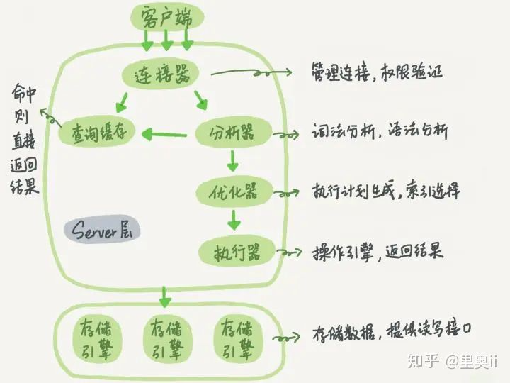

## **关系型数据库的2PL**

传统RDBMS加锁的一个原则，就是2PL (二阶段锁)：Two-Phase Locking。相对而言，2PL比较容易理解，说的是锁操作分为两个阶段：加锁阶段与解锁阶段，并且保证加锁阶段与解锁阶段不相交

## **mysql的cpu飙高**

SELECT * FROM information_schema.PROCESSLIST WHERE command != 'Sleep' ORDER BY time DESC

select concat('kill ', id, ';') from information_schema.processlist 
where command != 'Sleep'
and time > 100
order by time desc

## **数据库中间件的设计**

**服务端代理：**

独立部署一个代理服务，这个代理服务背后管理多个数据库实例。而在应用中，我们通过一个普通的数据源(c3p0、druid、dbcp等)与代理服务器建立连接，所有的sql操作语句都是发送给这个代理，由这个代理去操作底层数据库，得到结果并返回给应用

目前实现的方案：阿里巴巴开源的cobar，mycat团队在cobar基础上开发的mycat，mysql官方提供的mysql-proxy，奇虎360在mysql-proxy基础开发的atlas

**优点**：多语言支持。1.不论你用的php、java或是其他语言，都可以支持。原因在于数据库代理本身就实现了mysql的通信协议，你可以就将其看成一个mysql服务器。mysql官方团队为不同语言提供了不同的客户端驱动，如java语言的mysql-connector-java，python语言的mysql-connector-python等等。因此不同语言的开发者都可以使用mysql官方提供的对应的驱动来与这个代理服务器建通信

**缺点**：实现复杂。因为代理服务器需要实现mysql服务端的通信协议，因此实现难度较大


    

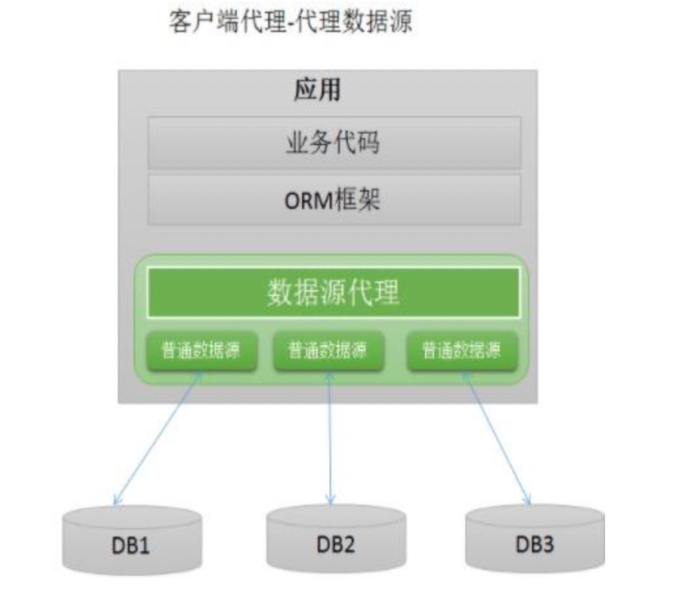


**客户端代理：**

应用程序需要使用一个特定的数据源，其作用是代理，内部管理了多个普通的数据源(c3p0、druid、dbcp等)，每个普通数据源各自与不同的库建立连接。应用程序产生的sql交给数据源代理进行处理，数据源内部对sql进行必要的操作，如sql改写等，然后交给各个普通的数据源去执行，将得到的结果进行合并，返回给应用。数据源代理通常也实现了JDBC规范定义的API，因此能够直接与orm框架整合。用户的代码需要修改，使用这个代理的数据源，而不是直接使用c3p0、druid、dbcp这样的连接池

目前实现的方案：阿里巴巴开源的tddl，大众点评开源的zebra，当当网开源的sharding-jdbc

**优点**：更加轻量，可以与任何orm框架整合。这种方案不需要实现mysql的通信协议，因为底层管理的普通数据源，可以直接通过mysql-connector-java驱动与mysql服务器进行通信，因此实现相对简单

**缺点**：1.仅支持某一种语言。例如tddl、zebra、sharding-jdbc都是使用java语言开发，因此对于使用其他语言的用户，就无法使用这些中间件2.版本升级困难。因为应用使用数据源代理就是引入一个jar包的依赖，在有多个应用都对某个版本的jar包产生依赖时，一旦这个版本有bug，所有的应用都需要升级


    

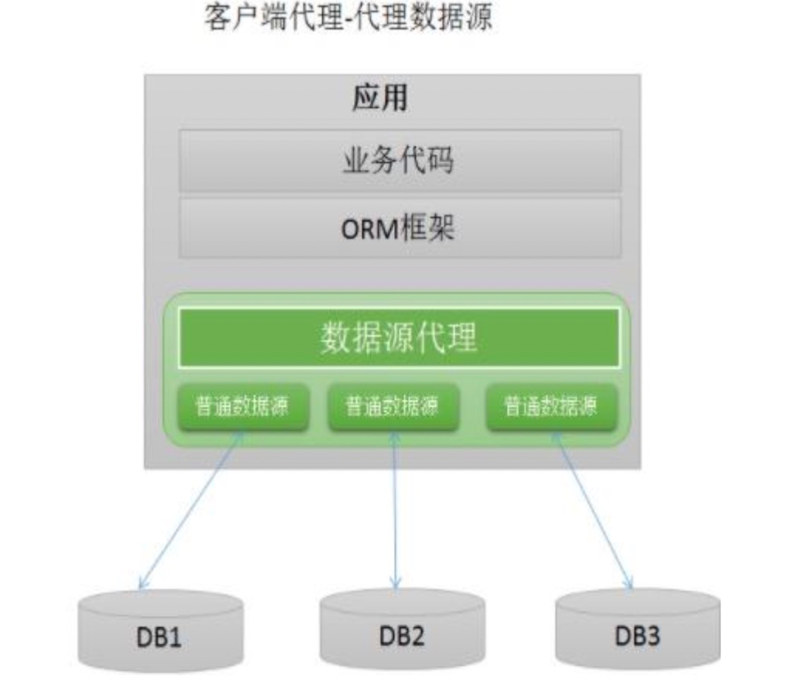


## **zebra**


    

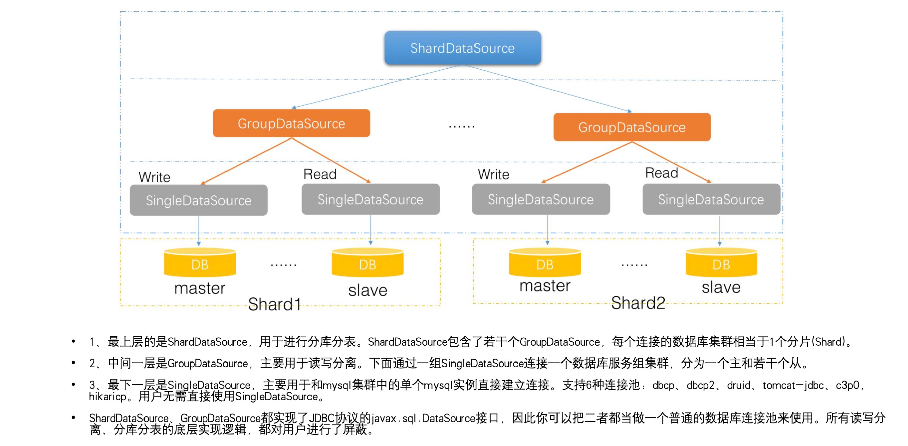

## **MVCC**

当一个事务启动后，首次执行select操作时，MVCC就会生成一个数据库当前的ReadView。

隐藏字段见下面的隐藏字段说明

**Read view 的几个重要属性**

trx_ids:  当前系统活跃(未提交)事务版本号集合。

low_limit_id:  创建当前read view 时“当前系统最大事务版本号+1”。表示在生成当前ReadView时，系统中要给下一个事务分配的ID值。

up_limit_id:  创建当前read view 时“系统正处于活跃事务最小版本号”

creator_trx_id:  创建当前read view的事务版本号

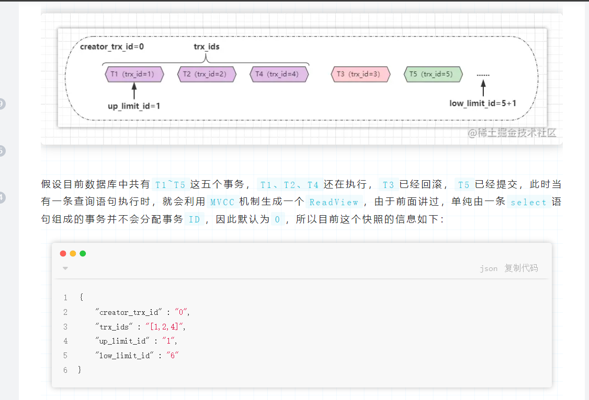

阶段总结：

①当一个事务尝试改动某条数据时，会将原本表中的旧数据放入Undo-log日志中。

②当一个事务尝试查询某条数据时，MVCC会生成一个ReadView快照。

**Read view 匹配条件**

（1）数据事务ID 

如果数据事务ID小于read view中的最小活跃事务ID，则可以肯定该数据是在当前事务启之前就已经存在了的,所以可以显示。

（2）数据事务ID>=low_limit_id 则不显示

如果数据事务ID大于read view 中的当前系统的最大事务ID，则说明该数据是在当前read view 创建之后才产生的，所以数据不予显示。

（3） up_limit_id <=数据事务ID

如果数据的事务ID大于最小的活跃事务ID,同时又小于等于系统最大的事务ID，这种情况就说明这个数据有可能是在当前事务开始的时候还没有提交的。

所以这时候我们需要把数据的事务ID与当前read view 中的活跃事务集合trx_ids 匹配:

情况1:  如果事务ID不存在于trx_ids 集合（则说明read view产生的时候事务已经commit了），这种情况数据则可以显示。

情况2： 如果事务ID存在trx_ids则说明read view产生的时候数据还没有提交，但是如果数据的事务ID等于creator_trx_id ，那么说明这个数据就是当前事务自己生成的，自己生成的数据自己当然能看见，所以这种情况下此数据也是可以显示的。

情况3： 如果事务ID既存在trx_ids而且又不等于creator_trx_id那就说明read view产生的时候数据还没有提交，又不是自己生成的，所以这种情况下此数据不能显示。

（4）不满足read view条件时候，从undo log里面获取数据

当数据的事务ID不满足read view条件时候，从undo log里面获取数据的历史版本，然后数据历史版本事务号回头再来和read view 条件匹配 ，直到找到一条满足条件的历史数据，或者找不到则返回空结果；

**下面是另外一种理解方法：**

①当事务中出现select语句时，会先根据MySQL的当前情况生成一个ReadView。

②判断行数据中的隐藏列trx_id与ReadView.creator_trx_id是否相同：

相同：代表创建ReadView和修改行数据的事务是同一个，自然可以读取最新版数据。

不相同：代表目前要查询的数据，是被其他事务修改过的，继续往下执行。

③判断隐藏列trx_id是否小于ReadView.up_limit_id最小活跃事务ID：

小于：代表改动行数据的事务在创建快照前就已结束，可以读取最新版本的数据。

不小于：则代表改动行数据的事务还在执行，因此需要继续往下判断。

④判断隐藏列trx_id是否小于ReadView.low_limit_id这个值：

大于或等于：代表改动行数据的事务是生成快照后才开启的，因此不能访问最新版数据。

小于：表示改动行数据的事务ID在up_limit_id、low_limit_id之间，需要进一步判断。

⑤如果隐藏列trx_id小于low_limit_id，继续判断trx_id是否在trx_ids中：

在：表示改动行数据的事务目前依旧在执行，不能访问最新版数据。

不在：表示改动行数据的事务已经结束，可以访问最新版的数据

就是首先会去获取表中行数据的隐藏列，然后经过上述一系列判断后，可以得知：目前查询数据的事务到底能不能访问最新版的数据。如果能，就直接拿到表中的数据并返回，反之，不能则去Undo-log日志中获取旧版本的数据返回

## **分库分表**

数据偏斜问题

这边我们定义分库分表最大数据偏斜率为：(数据量最大样本-数据量最小样本)/数据量最小样本。

一般来说，如果我们的最大数据偏斜率在 5% 以内是可以接受的。

常见的分库分表方案

| Range 分库分表 | 顾名思义，该方案根据数据范围划分数据的存放位置。 | 
| -- | -- |
| Hash 分库分表 | 常见错误案例一：非互质关系导致的数据偏斜问题 | 


**mysql定位死锁**

- MySQL 5.7 及以下

```
-- 查看活跃事务
SELECT * FROM information_schema.INNODB_TRX;

-- 查看当前锁信息
SELECT * FROM information_schema.INNODB_LOCKS;

-- 查看锁等待关系
SELECT * FROM information_schema.INNODB_LOCK_WAITS;
```

- MySQL 8.0+

```
-- 查看活跃事务和锁信息
SELECT * FROM performance_schema.data_locks;

-- 查看锁等待关系
SELECT * FROM performance_schema.data_lock_waits;
```

结果解读：

INNODB_TRX：关注 trx_id（事务ID）、trx_state（事务状态）、trx_query（事务当前SQL）。

INNODB_LOCKS/data_locks：查看锁类型（LOCK_TYPE）、锁模式（LOCK_MODE，如 X 排他锁，S 共享锁）、锁定的资源（LOCK_DATA）。

INNODB_LOCK_WAITS/data_lock_waits：通过 BLOCKING_ENGINE_TRANSACTION_ID 和 REQUESTING_ENGINE_TRANSACTION_ID 找到阻塞关系。

58.mysql的碎片查询

show table status like '%table_name%';
mysql> show table status like 'salaries'\G; 
*************************** 1. row ***************************
           Name: salaries
         Engine: InnoDB
        Version: 10
     Row_format: Dynamic
           Rows: 2838918
 Avg_row_length: 31
    Data_length: 90832896
Max_data_length: 0
   Index_length: 0
      Data_free: 4194304
 Auto_increment: NULL
    Create_time: 2021-01-14 14:33:47
    Update_time: 2021-01-14 14:34:42
     Check_time: NULL
      Collation: utf8_bin
       Checksum: NULL
 Create_options: 
        Comment: 

mysql> select 
t.table_schema,
t.table_name,
t.table_rows,
t.data_length,
t.index_length,
concat(round(t.data_free/1024/1024,2),'m') as data_free
from information_schema.tables t
where t.table_schema = 'employees';

+--------------+----------------------+------------+-------------+--------------+-----------+
| TABLE_SCHEMA | TABLE_NAME           | TABLE_ROWS | DATA_LENGTH | INDEX_LENGTH | DATA_FREE |
+--------------+----------------------+------------+-------------+--------------+-----------+
| employees    | current_dept_emp     |       NULL |        NULL |         NULL | NULL      |
| employees    | departments          |          9 |       16384 |        16384 | 0.00M     |
| employees    | dept_emp             |     331143 |    12075008 |      5783552 | 4.00M     |
| employees    | dept_emp_latest_date |       NULL |        NULL |         NULL | NULL      |
| employees    | dept_manager         |         24 |       16384 |        16384 | 0.00M     |
| employees    | employees            |     299069 |    15220736 |            0 | 4.00M     |
| employees    | salaries             |    2838426 |   100270080 |            0 | 4.00M     |
| employees    | titles               |     442902 |    20512768 |            0 | 4.00M     |
+--------------+------------------

## **mysql加锁细节**

MySQL 的隔离等级对加锁有影响，所以在分析具体加锁场景时，首先要确定当前的隔离等级。

- 读未提交（Read Uncommitted 后续简称 RU）：可以读到未提交的读。 **即写操作加排他锁，读操作不加锁！**

- 读已提交（Read Committed 后续简称 RC）：存在幻读问题，对当前读获取的数据加记录锁。因此对于RC级别的底层实现，对于写操作会加排他锁，而读操作会使用MVCC机制。

- 可重复读（Repeatable Read 后续简称 RR）：不存在幻读问题，对当前读获取的数据加记录锁，同时对涉及的范围加间隙锁，防止新的数据插入，导致幻读。

- 序列化（Serializable）：从 MVCC 并发控制退化到基于锁的并发控制，不存在快照读，都是当前读，并发效率急剧下降，不建议使用。 所有写操作加临键锁（具备互斥特性），所有读操作加共享锁

这里说明一下，RC 总是读取记录的最新版本，而 RR 是读取该记录事务开始时的那个版本，虽然这两种读取的版本不同，但是都是快照数据，并不会被写操作阻塞，所以这种读操作称为 快照读（Snapshot Read）

MySQL 还提供了另一种读取方式叫当前读（Current Read），它读的不再是数据的快照版本，而是数据的最新版本，并会对数据加锁，根据语句和加锁的不同，又分成三种情况：

- SELECT ... LOCK IN SHARE MODE：加共享(S)锁

- SELECT ... FOR UPDATE：加排他(X)锁

- INSERT / UPDATE / DELETE：加排他(X)锁

当前读在 RR 和 RC 两种隔离级别下的实现也是不一样的：RC 只加记录锁，RR 除了加记录锁，还会加间隙锁，用于解决幻读问题。

**不同 SQL 语句对加锁的影响**

不同的 SQL 语句当然会加不同的锁，总结起来主要分为五种情况：

- SELECT ... 语句正常情况下为快照读，不加锁；

- SELECT ... LOCK IN SHARE MODE 语句为当前读，加 S 锁； *-- MySQL8.0之后也优化了写法，如下  ***SELECT** ... **FOR** SHARE;

- SELECT ... FOR UPDATE 语句为当前读，加 X 锁；

- 常见的 DML 语句（如 INSERT、DELETE、UPDATE）为当前读，加 X 锁；

- 常见的 DDL 语句（如 ALTER、CREATE 等）加表级锁，这里涉及MDL锁且这些语句为隐式提交，不能回滚。

## **mysql的online-ddl**

虽然FIC可以让InnoDB存储引擎避免创建临时表，从而提高索引创建的效率。但正如前面面试题中所说的，索引

创建时会阻塞表上的DML操作（除读操作）。OSC（一个FaceBook的PHP脚本）虽然解决了上述的部分问题，但

是还是有很大的局限性。MySQL 5.6版本开始支持Online DDL（在线数据定义）操作，其允许辅助索引创建的

同时，还允许其他诸如INSERT、UPDATE、DELETE这类DML操作，这极大地提高了MySQL数据库在生产环境中

的可用性。

不仅是辅助索引，以下这几类DDL操作都可以通过“在线”的方式进行操作：

❑辅助索引的创建与删除

❑改变自增长值

❑添加或删除外键约束

❑列的重命名

使用语法：

ALTER TABLE tbl_name

|ADD{INDEX|KEY}[index_name]

[index_type](index_col_name,...)[index_option]...

ALGORITHM[=]{DEFAULT|INPLACE|COPY}

LOCK[=]{DEFAULT|NONE|SHARED|EXCLUSIVE}

ALGORITHM指定了创建或删除索引的算法，COPY表示按照MySQL 5.1版本之前的工作模式，即创建临时表的方式。

INPLACE表示索引创建或删除操作不需要创建临时表。DEFAULT表示根据参数old_alter_table来判断是通过INPLACE

还是COPY的算法，该参数的默认值为OFF，表示采用INPLACE的方式。

LOCK部分为索引创建或删除时对表添加锁的情况：

（

1）NONE

执行索引创建或者删除操作时，对目标表不添加任何的锁，即事务仍然可以进行读写操作，不会收到阻塞。因此这

种模式可以获得最大的并发度。

（

2）SHARE

这和之前的FIC类似，执行索引创建或删除操作时，对目标表加上一个S锁。对于并发地读事务，依然可以执行，但

是遇到写事务，就会发生等待操作。如果存储引擎不支持SHARE模式，会返回一个错误信息。

（

3）EXCLUSIVE

在EXCLUSIVE模式下，执行索引创建或删除操作时，对目标表加上一个X锁。读写事务都不能进行，因此会阻塞所

有的线程，这和COPY方式运行得到的状态类似，但是不需要像COPY方式那样创建一张临时表。

（

4）DEFAULT

DEFAULT模式首先会判断当前操作是否可以使用NONE模式，若不能，则判断是否可以使用SHARE模式，最后判断

是否可以使用EXCLUSIVE模式。也就是说DEFAULT会通过判断事务的最大并发性来判断执行DDL的模式。

InnoDB存储引擎实现Online DDL的原理是在执行创建或者删除操作的同时，将INSERT、UPDATE、DELETE这类

DML操作日志写入到一个缓存中。待完成索引创建后再将重做应用到表上，以此达到数据的一致性。这个缓存的大

小由参数innodb_online_alter_log_max_size控制，默认的大小为128MB。

需要特别注意的是，由于Online DDL在创建索引完成后再通过重做日志达到数据库的最终一致性，这意味着在索引

创建过程中，SQL优化器不会选择正在创建中的索引

## **mysql的FIC**

MySQL 5.5版本之前（不包括5.5）存在的一个普遍被人诟病的问题是：MySQL数据库对于索引的添加或者删除的这类

DDL操作，MySQL数据库的操作过程为：

❑首先创建一张新的临时表，表结构为通过命令ALTER TABLE新定义的结构。

❑然后把原表中数据导入到临时表。

❑接着删除原表。

❑最后把临时表重命名为原来的表名。

可以发现，若用户对于一张大表进行索引的添加和删除操作，那么这会需要很长的时间。更关键的是，若有大量事务

需要访问正在被修改的表，这意味着数据库服务不可用。MySQL数据库的索引维护始终让使用者感觉非常痛苦。

InnoDB存储引擎从InnoDB 1.0.x版本开始支持一种称为Fast Index Creation（快速索引创建）的索引创建方式——简称

FIC。

对于辅助索引的创建，InnoDB存储引擎会对创建索引的表加上一个S锁。在创建的过程中，不需要重建表，因此速度

较之前提高很多，并且数据库的可用性也得到了提高。删除辅助索引操作就更简单了，InnoDB存储引擎只需更新内部

视图，并将辅助索引的空间标记为可用（不影响附注索引的使用，因为可读，后边的同时删除四个字非常传神），同

时删除MySQL数据库内部视图上对该表的索引定义即可。

由于FIC在索引的创建的过程中对表加上了S锁，因此在创建的过程中只能对该表进行读操作，若有大量的事务需要对

目标表进行写操作，那么数据库的服务同样不可用。此外，FIC方式只限定于辅助索引，对于主键的创建和删除同样

需要重建一张表

## **mysql的自增锁（****AUTO-INC Locks****）**

**锁模式**

其实在 InnoDB 中，把锁的行为叫做**锁模式**可能更加准确，那具体有哪些锁模式呢，如下：

- 传统模式（Traditional）

- 连续模式（Consecutive）

- 交叉模式（Interleaved）

分别对应配置项 innodb_autoinc_lock_mode 的值0、1、2.

看到这就已经知道为啥上面说不准确了，因为三种模式下，InnoDB 对并发的处理是不一样的，而且具体选择哪种锁模式跟你当前使用的 MySQL 版本还有关系。

在 MySQL 8.0 之前，InnoDB 锁模式默认为**连续模式**，值为1，而在 MySQL 8.0 之后，默认模式变成了**交叉模式**。至于为啥会改变默认模式，后面会讲。

**传统模式**

传统模式（Traditional），说白了就是还没有**锁模式**这个概念时，InnoDB 的自增锁运行的模式。只是后面版本更新，InnoDB 引入了**锁模式**的概念，然后 InnoDB 给了这种以前默认的模式一个名字，叫——传统模式。

传统模式具体是咋工作的？


    


我们知道，当我们向包含了 AUTO_INCREMENT 列的表中插入数据时，都会持有这么一个特殊的表锁——自增锁（AUTO-INC），并且当语句执行完之后就会释放。这样一来可以保证单个语句内生成的自增值是连续的。

这样一来，传统模式的弊端就自然暴露出来了，如果有多个事务并发的执行 INSERT 操作，AUTO-INC的存在会使得 MySQL 的性能略有下降，因为同时只能执行一条 INSERT 语句。

**连续模式**

连续模式（Consecutive）是 MySQL 8.0 之前默认的模式，之所以提出这种模式，是因为传统模式存在影响性能的弊端，所以才有了连续模式。

在锁模式处于连续模式下时，如果 INSERT 语句能够提前确定插入的数据量，则可以不用获取自增锁，举个例子，像 INSERT INTO 这种简单的、能提前确认数量的新增语句，就不会使用自增锁，这个很好理解，在自增值上，我可以直接把这个 INSERT 语句所需要的空间流出来，就可以继续执行下一个语句了。

当然，这里其实并非什么锁也不用。在实际分配 ID 的过程中，InnoDB 会使用较为轻量级的 mutex 锁，来防止 ID 重复分配，ID 一旦分配好了，mutex 锁就会被释放。

但是如果 INSERT 语句不能提前确认数据量，则还是会去获取自增锁。例如像 INSERT INTO ... SELECT ... 这种语句，INSERT 的值来源于另一个 SELECT 语句。

连续模式的图和交叉模式差不多

**交叉模式**

交叉模式（Interleaved）下，所有的 INSERT 语句，包含 INSERT 和 INSERT INTO ... SELECT ，都不会使用 AUTO-INC 自增锁，而是使用较为轻量的 mutex 锁。这样一来，多条 INSERT 语句可以并发的执行，这也是三种锁模式中扩展性最好的一种。


    

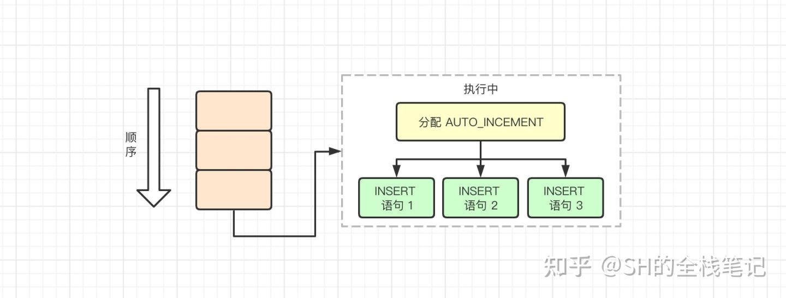


并发执行所带来的副作用就是单个 INSERT 的自增值并不连续，因为 AUTO_INCREMENT 的值分配会在多个 INSERT 语句中来回交叉的执行。

优点很明确，缺点是在并发的情况下无法保证数据一致性，这个下面会讨论。

**交叉模式缺陷**

要了解缺陷是什么，还得先了解一下 MySQL 的 Binlog。Binlog 一般用于 MySQL 的**数据复制**，通俗一点就是用于主从同步。在 MySQL 中 Binlog 的格式有 3 种，分别是：

- Statement

-  

- 基于语句，只记录对数据做了修改的SQL语句，能够有效的减少binlog的数据量，提高读取、基于binlog重放的性能

- Row

-  

- 只记录被修改的行，所以Row记录的binlog日志量一般来说会比Statement格式要多。基于Row的binlog日志非常完整、清晰，记录了所有数据的变动，但是缺点是可能会非常多，例如一条

- update

- 语句，有可能是所有的数据都有修改；再例如

- alter table

- 之类的，修改了某个字段，同样的每条记录都有改动。

- Mixed

-  

- Statement和Row的结合，怎么个结合法呢。例如像

- alter table

- 之类的对表结构的修改，采用Statement格式。其余的对数据的修改例如

- update

- 和

- delete

- 采用Row格式进行记录。

如果 MySQL 采用的格式为 Statement ，那么 MySQL 的主从同步实际上同步的就是一条一条的 SQL 语句。如果此时我们采用了交叉模式，那么并发情况下 INSERT 语句的执行顺序就无法得到保障。

可能你还没看出问题在哪儿，INSERT 同时交叉执行，并且 AUTO_INCREMENT 交叉分配将会直接导致主从之间同行的数据**主键 ID 不同**。而这对主从同步来说是灾难性的。

## **mysql的CBO**

MySQL 执行过程

如上图所示，MySQL 数据库由 Server 层和 Engine 层组成：

- Server 层有 SQL 分析器、SQL优化器、SQL 执行器，用于负责 SQL 语句的具体执行过程；

- Engine 层负责存储具体的数据，如最常使用的 InnoDB 存储引擎，还有用于在内存中存储临时结果集的 TempTable 引擎。

SQL 优化器会分析所有可能的执行计划，选择成本最低的执行，这种优化器称之为：CBO（Cost-based Optimizer，基于成本的优化器）。

而在 MySQL中，**一条 SQL 的计算成本计算如下所示：**

Cost  = Server Cost + Engine Cost

      = CPU Cost + IO Cost

数据库 mysql 下的表 server_cost、engine_cost 则记录了对于各种成本的计算，如：

表 server_cost 记录了 Server 层优化器各种操作的成本，这里面包括了所有 CPU Cost，其具体含义如下。

- disk_temptable_create_cost：创建磁盘临时表的成本，默认为20。

- disk_temptable_row_cost：磁盘临时表中每条记录的成本，默认为0.5。

- key_compare_cost：索引键值比较的成本，默认为0.05，成本最小。

- memory_temptable_create_cost：创建内存临时表的成本：默认为1。

- memory_temptable_row_cost：内存临时表中每条记录的成本，默认为0.1。

- row_evaluate_cost：记录间的比较成本，默认为0.1。

**可以看到，** MySQL 优化器认为如果一条 SQL 需要创建基于磁盘的临时表，则这时的成本是最大的，其成本是基于内存临时表的 20 倍。而索引键值的比较、记录之间的比较，其实开销是非常低的，但如果要比较的记录数非常多，则成本会变得非常大。

而表 engine_cost 记录了存储引擎层各种操作的成本，这里包含了所有的 IO Cost，具体含义如下。

- io_block_read_cost：从磁盘读取一个页的成本，默认值为1。

- memory_block_read_cost：从内存读取一个页的成本，默认值为0.25。

**也就是说，** MySQL 优化器认为从磁盘读取的开销是内存开销的 4 倍。

## **mysql的join的实现**

在Mysql中，使用Nested-Loop Join的算法思想去优化join，Nested-Loop Join翻译成中文则是“[嵌套](https://so.csdn.net/so/search?q=%E5%B5%8C%E5%A5%97&spm=1001.2101.3001.7020)循环连接”。

**Simple Nested-Loop**

简单嵌套循环连接实际上就是简单粗暴的嵌套循环，如果table1有1万条数据，table2有1万条数据，那么数据比较的次数=1万 * 1万 =1亿次，这种查询效率会非常慢。

所以Mysql继续优化，然后衍生出Index Nested-LoopJoin、Block Nested-Loop Join两种NLJ算法。在执行join查询时mysql会根据情况选择两种之一进行join查询。

**Index Nested-LoopJoin（减少内层表数据的匹配次数）**

索引嵌套循环连接是基于索引进行连接的算法，索引是基于内层表的，通过外层表匹配条件直接与内层表索引进行匹配，避免和内层表的每条记录进行比较， 从而利用索引的查询减少了对内层表的匹配次数，优势极大的提升了 join的性能：

原来的匹配次数 = 外层表行数 * 内层表行数

优化后的匹配次数= 外层表的行数 * 内层表索引的高度

1. 使用场景：只有内层表join的列有索引时，才能用到Index Nested-LoopJoin进行连接。

1. 由于用到索引，如果索引是辅助索引而且返回的数据还包括内层表的其他数据，则会回内层表查询数据，多了一些IO操作。
**Block Nested-Loop Join（减少内层表数据的循环次数）**

缓存块嵌套循环连接通过一次性缓存多条数据，把参与查询的列缓存到Join Buffer 里，然后拿join buffer里的数据批量与内层表的数据进行匹配，从而减少了内层循环的次数（遍历一次内层表就可以批量匹配一次Join Buffer里面的外层表数据）。

当不使用Index Nested-Loop Join的时候，默认使用Block Nested-Loop Join。

什么是Join Buffer？

（1）Join Buffer会缓存所有参与查询的列而不是只有Join的列。

（2）可以通过调整join_buffer_size缓存大小

（3）join_buffer_size的默认值是256K，join_buffer_size的最大值在MySQL 5.1.22版本前是4G-1，而之后的版本才能在64位操作系统下申请大于4G的Join Buffer空间。

（4）使用Block Nested-Loop Join算法需要开启优化器管理配置的optimizer_switch的设置block_nested_loop为on，默认为开启。

 **Batched Key Access Join（BKA）**算法的工作步骤如下：

1) 将外部表中相关的列放入Join Buffer中。

2) 批量的将Key（索引键值）发送到Multi-Range Read（MRR）接口

3) Multi-Range Read（MRR）通过收到的Key，根据其对应的ROWID进行排序，然后再进行数据的读取操作。

4) 返回结果集给客户端

**如何优化Join速度**

用小结果集驱动大结果集，减少外层循环的数据量：

如果小结果集和大结果集连接的列都是索引列，mysql在内连接时也会选择用小结果集驱动大结果集，因为索引查询的成本是比较固定的，这时候外层的循环越少，join的速度便越快。

为匹配的条件增加索引：争取使用INLJ，减少内层表的循环次数

增大join buffer size的大小：当使用BNLJ时，一次缓存的数据越多，那么外层表循环的次数就越少

减少不必要的字段查询：

（1）当用到BNLJ时，字段越少，join buffer 所缓存的数据就越多，外层表的循环次数就越少；

（2）当用到INLJ时，如果可以不回表查询，即利用到覆盖索引，则可能可以提示速度。（未经验证，只是一个推论）

## **mysql中 in 和 exist**

**exists的执行原理：**

对外表做loop循环，每次loop循环再对内表（子查询）进行查询，那么因为对内表的查询使用的索引（内表效率高，故可用大表），而外表有多大都需要遍历，不可避免（尽量用小表），故内表大的使用exists，可加快效率；

**in的执行原理：**

是把外表和内表做连接，先查询内表，再把内表结果与外表匹配，对外表使用索引（外表效率高，可用大表），而内表多大都需要查询，不可避免，故外表大的使用in，可加快效率。

## **mysql的主从复制**

首先看一张图片： 需要三个线程来完成的，在从端有两个线程，sql线程与 I/O线程。 主端有 一个 I/O线程。在实现主从复制的时候 ，首先会开启 Master端的 **binLog**记录功能 因为整个的复制流程就是 Slave从Master端获取到 binlog日志，然后再Slave上以相同的顺序执行获取到的binlog日志中的记录中的各种的SQL操作。 

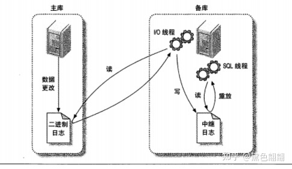

1. 在从端打开主从复制的开关，开始进行复制操作。

1. 此时 对于 从的 I/O线程会通过 master上已经授权的赋值用户权限请求建立连接master服务。并请求从执行binlog日志的指定位置之后开始发送binlog日志的内从（注意这里的日志文件名和位置就是在配置主从服务质量执行 change master命令指定的）

1. Mater 服务器接收到来自 Salve服务器的IO请求以后，其上负责复制的IO线程会根据Slave服务器的IO线程请求的信息分批读取指定binlog日志文件指定位置之后的binlog日志信息，然后 返回给Slave端的IO线程，返回的除了基础的binlog日志内容以外，还有Master服务端记录的IO线程。返回的信息还有binlog中下一个指定更新的位置。

1. 当slave 服务器的IO线程读取到 Master服务器上 IO线程发送过来的日志内容，日志文件，及位置以后，会将binlog日志内容依次写到Slave端自身的Relay Log （即中继日志）文件（Mysq-relay-bin.xxx的最末端。并将新的binlog文件名和位置记录到 master-info文件中，以便能够在下一次读取master端新binlog日志时能告诉Master服务器从新binlog日志的指定文件及位置开始读取新的binlog日志内容。

1. Slave服务器端的SQL线程会实时检测本地Relay Log 中IO线程新增的日志内容，然后及时把Relay LOG 文件中的内容解析成sql语句，并在自身Slave服务器上按解析SQL语句的位置顺序执行应用这样sql语句，并在relay-log.info中记录当前应用中继日志的文件名和位置点

## **mysql的order  by实现 **

1. 内存排序

- 初始化sort_buffer,MySQL会给每个线程分配一块内存用于排序，称为sort_buffer

- 从索引name找到第一个满足 name='李'条件的主键id

- 通过主键id去主键索引取出整行， 取id、 name、 age三个字段的值， 存入sort_buffer中

- 从索引name取下一个记录的主键id；

- 重复步骤3、 4直到值不满足查询条件为止

- 对sort_buffer中的数据按照字段age做快速排序；

- 按照排序结果返回给客户端

2. 文件排序

 如果要排序的数据量小于sort_buffer_size，排序就在内存中完成。 但如果排序数据量太大， 内存放不下，此时就会使用磁盘临时文件辅助排序。可以使用下面命令查看值。

```sql
SET optimizer_trace='enabled=on';

/* 执行语句 */
select name,age from `user` where name='李' order by age;

/* 查看 OPTIMIZER_TRACE 输出 */
SELECT * FROM `information_schema`.`OPTIMIZER_TRACE`
```

```json
  "filesort_summary": {
              "rows": 2,
              "examined_rows": 2,
              "number_of_tmp_files": 0,
              "sort_buffer_size": 867728,
              "sort_mode": "<sort_key, packed_additional_fields>"
            }

```

[https://juejin.cn/post/7215736946253430844/](https://juejin.cn/post/7215736946253430844/)

## 
mysql的group by及内存分配

[https://juejin.cn/post/6957696820621344775](https://juejin.cn/post/6957696820621344775)

## mysql中字符串的排序规则

排序规则（Collation）是比较和排序字符串的一种规则，每个字符集都会有默认的排序规则，你可以用命令 SHOW CHARSET 来查看：

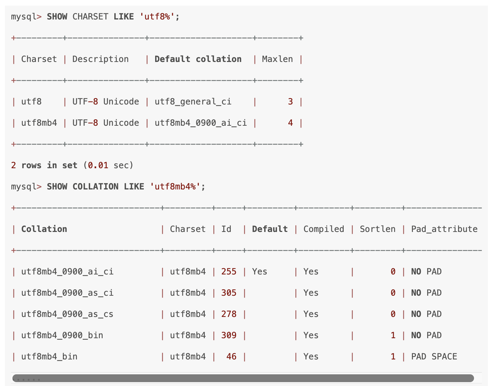

排序规则以 _ci 结尾，表示不区分大小写（Case Insentive），_cs 表示大小写敏感，_bin 表示通过存储字符的二进制进行比较

## 查看不经常使用的索引

**那你怎么知道哪些 B+树索引未被使用过呢**？在 MySQL 数据库中，可以通过查询表sys.schema_unused_indexes，查看有哪些索引一直未被使用过，可以被废弃：

```sql
SELECT * FROM schema_unused_indexes

WHERE object_schema != 'performance_schema';

+---------------+-------------+--------------+

| object_schema | object_name | index_name   |

+---------------+-------------+--------------+

| sbtest        | sbtest1     | k_1          |

| sbtest        | sbtest2     | k_2          |

| sbtest        | sbtest3     | k_3          |

| sbtest        | sbtest4     | k_4          |

| tpch          | customer    | CUSTOMER_FK1 |

| tpch          | lineitem    | LINEITEM_FK2 |

| tpch          | nation      | NATION_FK1   |

| tpch          | orders      | ORDERS_FK1   |

| tpch          | partsupp    | PARTSUPP_FK1 |

| tpch          | supplier    | SUPPLIER_FK1 |

```

## mysql的页分裂、页合并

[https://zhuanlan.zhihu.com/p/98818611](https://zhuanlan.zhihu.com/p/98818611)

## mysql的行溢出和页溢出

只存储部分数据，其他以链表形式存储

## **mysql索引跳跃扫描**

MySQL8.0版本开始增加了**索引跳跃扫描**的功能，当第一列索引的唯一值较少时，即使where条件没有第一列索引，查询的时候也可以用到联合索引。

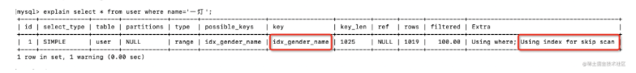

具体优化方式，就是匹配的时候遇到第一列索引就跳过，直接匹配第二列索引的值，这样就可以用到联合索引了。

其实我们优化一下SQL，把第一列的所有枚举值加到where条件中，也可以用到联合索引：

## mysql单行数据的存储

[https://mp.weixin.qq.com/s/r-RPEoqvgERfYOjYeFPoIg](https://mp.weixin.qq.com/s/r-RPEoqvgERfYOjYeFPoIg)

行格式分别是compact（紧凑的）、redundant(冗余)、dynamic（动态的）和compressed（压缩的）行格式

**compact格式：**

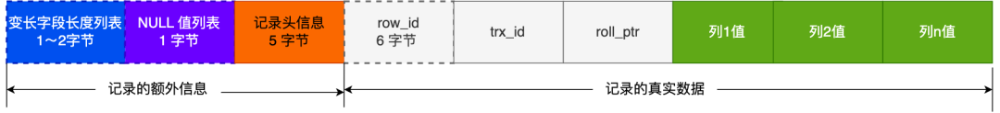

逆序存放可变长列和null值列，利用cup cache line

记录头信息中包含的内容很多，我就不一一列举了，这里说几个比较重要的：

- delete_mask ：标识此条数据是否被删除。从这里可以知道，我们执行 detele 删除记录的时候，并不会真正的删除记录，只是将这个记录的 delete_mask 标记为 1。

- next_record：下一条记录的位置。从这里可以知道，记录与记录之间是通过链表组织的。在前面我也提到了，指向的是下一条记录的「记录头信息」和「真实数据」之间的位置，这样的好处是向左读就是记录头信息，向右读就是真实数据，比较方便。

- record_type：表示当前记录的类型，0表示普通记录，1表示B+树非叶子节点记录，2表示最小记录，3表示最大记录

真实数据的3个特殊字段

- row_id 如果我们建表的时候指定了主键或者唯一约束列，那么就没有 row_id 隐藏字段了。如果既没有指定主键，又没有唯一约束，那么 InnoDB 就会为记录添加 row_id 隐藏字段。row_id不是必需的，占用 6 个字节。

- trx_id 事务id，表示这个数据是由哪个事务生成的。trx_id是必需的，占用 6 个字节。

- roll_pointer 这条记录上一个版本的指针。roll_pointer 是必需的，占用 7 个字节。

redundant 格式

与compact 格式相比, 没有了 变长字段列表以及 NULL值列表, 取而代之的是 记录了所有真实数据的偏移地址表 ，偏移地址表 是倒序排放的, 但是计算偏移量却还是正序开始的从row_id作为第一个, 第一个从0开始累加字段对应的字节数。在记录头信息中, 大部分字段和compact 中的相同，但是对比compact多了

**dynamic 格式**

在现在 mysql 5.7 的版本中,使用的格式就是 dynamic。

dynamic 和 compact 基本是相同的，只有在溢出页的处理上面,有所不同。

在compact行格式中，对于占用存储空间非常大的列，在记录的真实数据处只会存储该列的前768个字节的数据，把剩余的数据分散存储在几个其他的页中，然后记录的真实数据处用20个字节存储指向这些页的地址，从而可以找到剩余数据所在的页。

**compressed 格式**

compressed 格式将会在Dynamic 的基础上面进行压缩处理特别是对溢出页的压缩处理，存储在其中的行数据会以zlib的算法进行压缩，因此对于blob、text这类大长度类型的数据能够进行非常有效的存储。但compressed格式其实也是以时间换空间，性能并不友好，并不推荐在常见的业务中使用。

## Index Skip Scan索引跳跃式扫描

MySQL8.x推出了跳跃扫描机制，但跳跃扫描并不是真正的“跳过了”第一个字段，而是优化器为你重构了SQL其实也就是

MySQL优化器会自动对联合索引中的第一个字段的值去重，然后基于去重后的值全部拼接起来查一遍

## mysql锁的内存结构

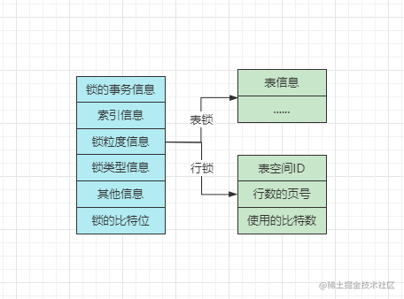

锁的事务信息：其中记录着当前的锁结构是由哪个事务生成的，记录的是指针，指向一个具体的事务。

索引的信息：这个是行锁的特有信息，对于行锁来说，需要记录一下加锁的行数据属于哪个索引、哪个节点，记录的也是指针。

锁粒度信息：这个略微有些复杂，对于不同粒度的锁，其中存储的信息也并不同，如果是表锁，其中就记录了一下是对哪张表加的锁，以及表的一些其他信息。

但如果锁粒度是行锁，其中记录的信息更多，有三个较为重要的：

- Space ID：加锁的行数据，所在的表空间ID。

- Page Number：加锁的行数据，所在的页号。

- n_bits：使用的比特位，对于一页数据中，加了多少个锁（后续结合讲）。

锁类型信息：对于锁结构的类型，在内部实现了复用，采用一个32bit的type_mode来表示，这个32bit的值可以拆为lock_mode、lock_type、rec_lock_type三部分，如下：

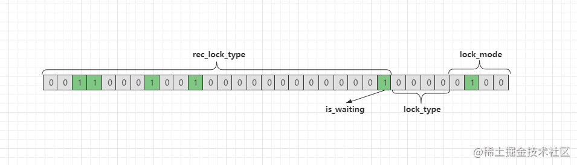

- lock_mode：表示锁的模式，使用低四位。

	- 0000/0：表示当前锁结构是共享意向锁，即IS锁。

	- 0001/1：表示当前锁结构是排他意向锁，即IX锁。

	- 0010/2：表示当前锁结构是共享锁，即S锁。

	- 0011/3：表示当前锁结构是排他锁，即X锁。

	- 0100/4：表示当前锁结构是自增锁，即AUTO-INC锁。

- lock_type：表示锁的类型，使用低位中的5~8位。

	- LOCK_TABLE：当第5个比特位是1时，表示目前是表级锁。

	- LOCK_REC：当第6个比特位是1时，表示目前是行级锁。

- rec_lock_type：表示行锁的具体类型，使用其余位。

	- LOCK_ORDINARY：当高23位全零时，表示目前是临键锁。

	- LOCK_GAP：当第10位是1时，表示目前是间隙锁。

	- LOCK_REC_NOT_GAP：当第11位是1时，表示目前是记录锁。

	- LOCK_INSERT_INTENTION：当第12位是1时，表示目前是插入意向锁。

	- .....：内部还有一些其他的锁类型，会使用其他位。

- is_waiting：表示目前锁处于等待状态还是持有状态，使用低位中的第9位。

	- 0：表示is_waiting=false，即当前锁无需阻塞等待，是持有状态。

	- 1：表示is_waiting=true，即当前锁需要阻塞，是等待状态。

其他信息：这个所谓的其他信息，也就是指一些用于辅助锁机制的信息，比如之前死锁检测机制中的「事务等待链表、锁的信息链表」，每一个事务和锁的持有、等待关系，都会在这里存储，将所有的事务、锁连接起来，就形成了上述的两个链表。

锁的比特位：学生表中有七条数据，此时就会形成一个比特数组：000000000，等等，似乎不对！明明只有七条数据，为啥会有9个比特位呢？因为行锁中，间隙锁可以锁定无穷小、无穷大这两个间隙，因此这组比特中，首位和末位即表示无穷小、无穷大两个间隙。

- ①目前对表中不同行记录加锁的事务是同一个。

- ②需要加锁的记录在同一个页面中。

- ③目前事务加锁的类型都是相同的。

- ④锁的等待状态也是相同的。

当上述四点条件被满足时，符合条件的行记录会被放入到同一个锁结构中

## LBCC

LBCC是Lock-Based Concurrent Control的简称，意思是基于锁的并发控制。在InnoDB中按锁的模式来分的话可以分为共享锁（S）、排它锁（X）和意向锁，其中意向锁又分为意向共享锁（IS）和意向排它锁（IX）（此处先不做介绍，后期会专门出篇文章讲一下InnoDB和Myisam引擎的锁）；如果按照锁的算法来分的话又分为记录锁（Record Locks）、间隙锁（Gap Locks）和临键锁（Next-key Locks）

- 以锁粒度的维度划分：


	- ①表锁：


		- 全局锁：加上全局锁之后，整个数据库只能允许读，不允许做任何写操作。 **FLUSH TABLES WITH READ LOCK (FTWRL)** FLUSH TABLES WITH READ LOCK 是一个全局读锁，执行后会阻塞所有对表的写操作（如INSERT、UPDATE、DELETE等），同时允许其他会话进行只读查询。该命令通常用于全库逻辑备份，确保在备份过程中数据的一致性，防止备份过程中有其他写操作修改数据。一旦执行了 FTWRL，除非显式执行 UNLOCK TABLES 命令或关闭连接，否则全局读锁会一直保持。这意味着在此期间，任何需要对表进行写操作的事务都无法执行，可能会导致其他会话长时间阻塞。

		- 元数据锁 / MDL锁：基于表的元数据加锁，加锁后整张表不允许其他事务操作。

		- 意向锁：这个是InnoDB中为了支持多粒度的锁，为了兼容行锁、表锁而设计的。

		- 自增锁 / AUTO-INC锁：这个是为了提升自增ID的并发插入性能而设计的。

	- ②页面锁

	- ③行锁：


		- 记录锁 / Record锁：也就是行锁，一条记录和一行数据是同一个意思。

		- 间隙锁 / Gap锁：InnoDB中解决幻读问题的一种锁机制。

		- 临建锁 / Next-Key锁：间隙锁的升级版，同时具备记录锁+间隙锁的功能。

- 以互斥性的维度划分：


	- 共享锁 / S锁：不同事务之间不会相互排斥、可以同时获取的锁。

	- 排他锁 / X锁：不同事务之间会相互排斥、同时只能允许一个事务获取的锁。

	- 共享排他锁 / SX锁：MySQL5.7版本中新引入的锁，主要是解决SMO带来的问题。

- 以操作类型的维度划分：


	- 读锁：查询数据时使用的锁。

	- 写锁：执行插入、删除、修改、DDL语句时使用的锁。

- 以加锁方式的维度划分：


	- 显示锁：编写SQL语句时，手动指定加锁的粒度。

	- 隐式锁：执行SQL语句时，根据隔离级别自动为SQL操作加锁。

- 以思想的维度划分：


	- 乐观锁：每次执行前认为自己会成功，因此先尝试执行，失败时再获取锁。

	- 悲观锁：每次执行前都认为自己无法成功，因此会先获取锁，然后再执行。

## mysql多主集群解决方案

Keepalived + VIP + MySQL 主从/双主

PXC (Percona XtraDB Cluster) 是基于 MySQL 和 Percona Server 的多主复制集群解决方案。它采用了 Galera Cluster 技术，提供了在多个数据库节点之间实现数据同步和复制的机制。PXC 集群中的节点可以被配置为主节点或从节点，可以实现自动故障切换和容错。

MGR (MySQL Group Replication) 是 MySQL 官方提供的多主复制解决方案。它基于 Paxos 协议和 GCS (Group Communication System) 技术，提供了在多个 MySQL 实例之间实现数据同步和复制的机制。MGR 集群中的节点可以被配置为主节点或从节点，可以实现自动故障切换和容错。

虽然 PXC 和 MGR 都是多主复制集群解决方案，但它们在实现细节和技术上有所不同。PXC 集群采用了 Galera Cluster 技术，而 MGR 集群采用了 Paxos 协议和 GCS 技术。另外，PXC 集群是 Percona 公司提供的解决方案，而 MGR 是 MySQL 官方提供的解决方案。

## 几个数据库的设计架构

**Shared Everthting:**一般是针对单个主机，完全透明共享CPU/MEMORY/IO，并行处理能力是最差的，典型的代表SQLServer

> 


**Shared Disk：**各个处理单元使用自己的私有 CPU和Memory，共享磁盘系统。典型的代表 Oracle Rac， 它是数据共享，可通过增加节点来提高并行处理的能力，扩展能力较好。其类似于SMP（对称多处理）模式，但是当存储器接口达到饱和的时候，增加节点并不能获得更高的性能 。

> 


**Shared Nothing：**各个处理单元都有自己私有的CPU/内存/硬盘等，不存在共享资源，类似于MPP（大规模并行处理）模式，各处理单元之间通过协议通信，并行处理和扩展能力更好。典型代表DB2 DPF和 Hadoop ，各节点相互独立，各自处理自己的数据，处理后的结果可能向上层汇总或在节点间流转。

我们常说的 Sharding 其实就是Share Nothing，它是把某个表从物理存储上被水平分割，并分配给多台服务器（或多个实例），每台服务器可以独立工作，具备共同的schema，比如MySQL Proxy和Google的各种架构，只需增加服务器数就可以增加处理能力和容量

## mysql的存储结构

页：


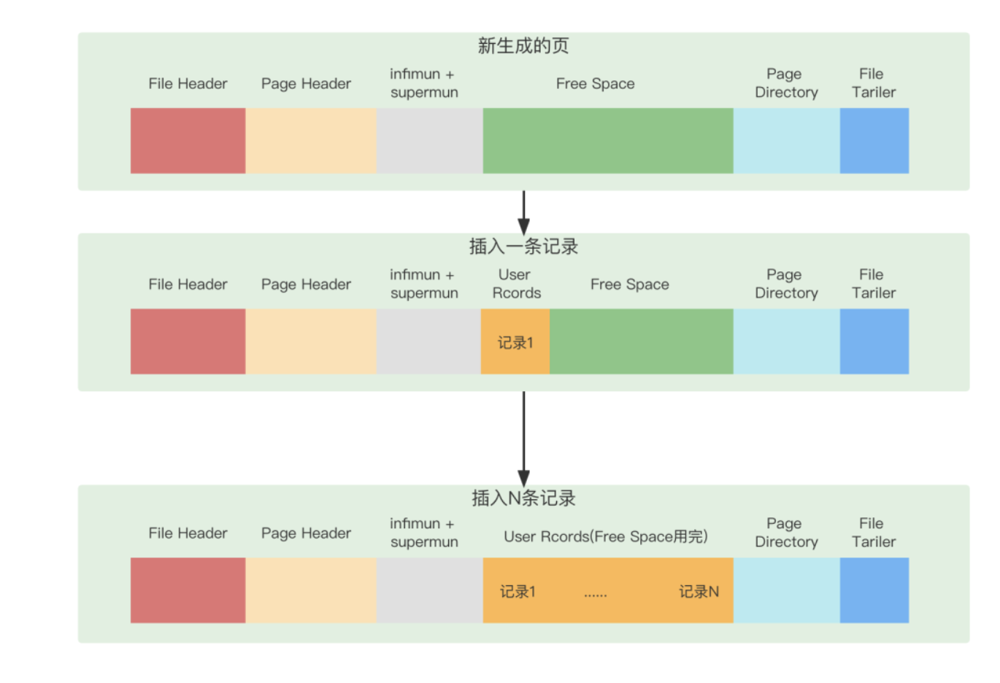

[https://mp.weixin.qq.com/s/r-RPEoqvgERfYOjYeFPoIg](https://mp.weixin.qq.com/s/r-RPEoqvgERfYOjYeFPoIg)

## MEM_ROOT

这是mysql内部实现的一套内存分配机制。

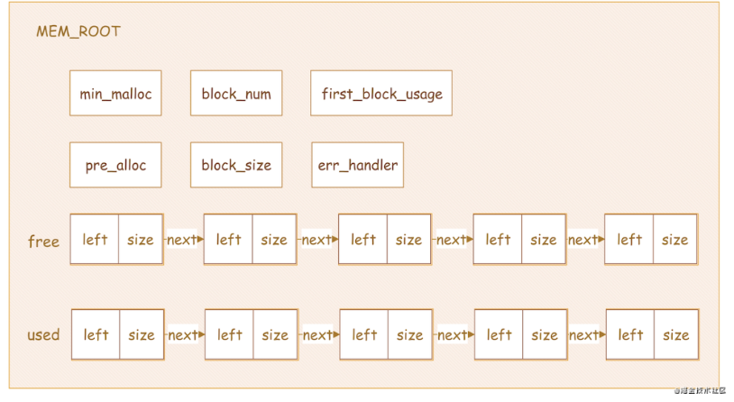

free：一个单向链表，链表中每一个单元叫block，block中存放的是空闲的内存区，每个block包含3个元素：

- left：block中剩余的内存大小

- size：block对应内存的大小

- next：指向下一个block的指针

如上图，free所在的行就是一个free链表，链表中每个箭头相连的部分就是block，block中有left和 size，每个block之间的箭头就是next指针

used：一个单向链表，链表中每一个单元叫block，block中存放已使用的内存区，同样，每个block包含上面3 个元素

min_malloc：控制一个 block 剩余空间还有多少的时候从free链表移除，加入到used链表中

block_size：block对应内存的大小

block_num：MEM_ROOT 管理的block数量

first_block_usage：free链表中第一个block不满足申请空间大小的次数

pre_alloc：当释放整个MEM_ROOT的时候可以通过参数控制，选择保留pre_alloc指向的block

通过MEM_ROOT内存分配和释放的讲解，我们发现MEM_ROOT的内存管理方式是在每个Block上连续分配，内部碎片基本在每个Block的尾部，由min_malloc成员变量控制，但是min_malloc的值是在代码中写死的，有点不够灵活。所以，对一个block来说，当left小于min_malloc，从其申请的内存越大，那么block中的left值越小，那么，该block的内存利用率越高，碎片越少，反之，碎片越多。这个写死是MySQL的内存分配的一个缺陷

## mysql使用profiles功能优化和查询信息

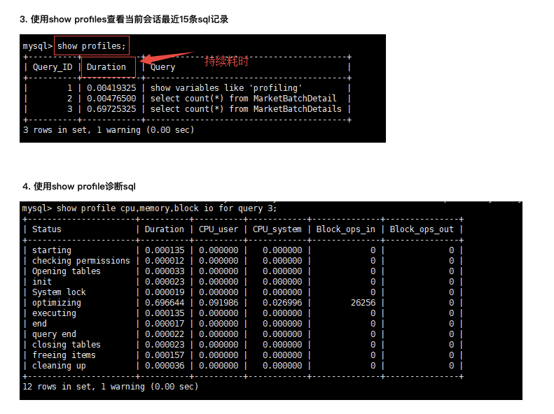

## Innodb四大特性

**1.插入缓冲（insert buffer)**

插入缓冲（Insert Buffer/Change Buffer）：提升插入性能，change buffering是insert buffer的加强，insert buffer只针对insert有效，change buffering对insert、delete、update(delete+insert)、purge都有效

只对于非聚集索引（非唯一）的插入和更新有效，对于每一次的插入不是写到索引页中，而是先判断插入的非聚集索引页是否在缓冲池中，如果在则直接插入；若不在，则先放到Insert Buffer 中，再按照一定的频率进行合并操作，再写回disk。这样通常能将多个插入合并到一个操作中，目的还是为了减少随机IO带来性能损耗。

使用插入缓冲的条件：

非聚集索引

非唯一索引

反过来，假设一个业务的更新模式是写入之后马上会做查询，那么即使满足了条件，将更新先记录在 change buffer，但之后由于马上要访问这个数据页，会立即触发 merge 过程。这样随机访问 IO 的次数不会减少，反而增加了 change buffer 的维护代价。所以，对于这种业务模式来说，change buffer 反而起到了副作用。

**2.二次写(double write)**

Doublewrite缓存是位于系统表空间的存储区域，用来缓存InnoDB的数据页从innodb buffer pool中flush之后并写入到数据文件之前，所以当操作系统或者数据库进程在数据页写磁盘的过程中崩溃，Innodb可以在doublewrite缓存中找到数据页的备份而用来执行crash恢复。数据页写入到doublewrite缓存的动作所需要的IO消耗要小于写入到数据文件的消耗，因为此写入操作会以一次大的连续块的方式写入

在应用（apply）重做日志前，用户需要一个页的副本，当写入失效发生时，先通过页的副本来还原该页，再进行重做，这就是double write

doublewrite组成：

内存中的doublewrite buffer,大小2M。

物理磁盘上共享表空间中连续的128个页，即2个区（extend），大小同样为2M。

对缓冲池的脏页进行刷新时，不是直接写磁盘，而是会通过memcpy()函数将脏页先复制到内存中的doublewrite buffer，之后通过doublewrite 再分两次，每次1M顺序地写入共享表空间的物理磁盘上，在这个过程中，因为doublewrite页是连续的，因此这个过程是顺序写的，开销并不是很大。在完成doublewrite页的写入后，再将doublewrite buffer 中的页写入各个 表空间文件中，此时的写入则是离散的。如果操作系统在将页写入磁盘的过程中发生了崩溃，在恢复过程中，innodb可以从共享表空间中的doublewrite中找到该页的一个副本，将其复制到表空间文件，再应用重做日志。

**3.自适应哈希索引(ahi)**

Adaptive Hash index属性使得InnoDB更像是内存数据库。该属性通过innodb_adapitve_hash_index开启，也可以通过—skip-innodb_adaptive_hash_index参数关闭。

Innodb存储引擎会监控对表上二级索引的查找，如果发现某二级索引被频繁访问，二级索引成为热数据，建立哈希索引可以带来速度的提升

经常访问的二级索引数据会自动被生成到hash索引里面去(最近连续被访问三次的数据)，自适应哈希索引通过缓冲池的B+树构造而来，因此建立的速度很快。

哈希（hash）是一种非常快的等值查找方法，在一般情况下这种查找的时间复杂度为O(1),即一般仅需要一次查找就能定位数据。而B+树的查找次数，取决于B+树的高度，在生产环境中，B+树的高度一般3-4层，故需要3-4次的查询。

innodb会监控对表上个索引页的查询。如果观察到建立哈希索引可以带来速度提升，则自动建立哈希索引，称之为自适应哈希索引（Adaptive Hash Index，AHI）。

AHI有一个要求，就是对这个页的连续访问模式必须是一样的。

例如对于（a,b）访问模式情况：

where a = xxx

where a = xxx and b = xxx

特点

　　1、无序，没有树高

　　2、降低对二级索引树的频繁访问资源，索引树高<=4，访问索引：访问树、根节点、叶子节点

　　3、自适应

3、缺陷

　　1、hash自适应索引会占用innodb buffer pool，由于删除表的时候，会同时删除数据页、索引页、自适应哈希页在BP中的数据，这会导致mysql的抖动甚至是hang死，但是在mysql8,.0版本中修复了这个问题

　　2、自适应hash索引只适合搜索等值的查询，如select * from table where index_col=‘xxx’，而对于其他查找类型，如范围查找，是不能使用的；

　　3、极端情况下，自适应hash索引才有比较大的意义，可以降低逻辑读。

**4.预读(read ahead)**

InnoDB使用两种预读算法来提高I/O性能：线性预读（linear read-ahead）和随机预读（randomread-ahead）

为了区分这两种预读的方式，我们可以把线性预读放到以extent为单位，而随机预读放到以extent中的page为单位。线性预读着眼于将下一个extent提前读取到buffer pool中，而随机预读着眼于将当前extent中的剩余的page提前读取到buffer pool中。

4.1 线性预读

方式有一个很重要的变量控制是否将下一个extent预读到buffer pool中，通过使用配置参数innodb_read_ahead_threshold，可以控制Innodb执行预读操作的时间。如果一个extent中的被顺序读取的page超过或者等于该参数变量时，Innodb将会异步的将下一个extent读取到buffer pool中，innodb_read_ahead_threshold可以设置为0-64的任何值，默认值为56，值越高，访问模式检查越严格

例如，如果将值设置为48，则InnoDB只有在顺序访问当前extent中的48个pages时才触发线性预读请求，将下一个extent读到内存中。如果值为8，InnoDB触发异步预读，即使程序段中只有8页被顺序访问。你可以在MySQL配置文件中设置此参数的值，或者使用SET GLOBAL需要该SUPER权限的命令动态更改该参数。

在没有该变量之前，当访问到extent的最后一个page的时候，Innodb会决定是否将下一个extent放入到buffer pool中。

4.2 随机预读

随机预读方式则是表示当同一个extent中的一些page在buffer pool中发现时，Innodb会将该extent中的剩余page一并读到buffer pool中，由于随机预读方式给Innodb code带来了一些不必要的复杂性，同时在性能也存在不稳定性，在5.5中已经将这种预读方式废弃。要启用此功能，请将配置变量设置innodb_random_read_ahead为ON。

## Mysql的索引分类

可以按照四个角度来分类索引。

- 按「数据结构」分类：

**B+tree索引、Hash索引、Full-text索引**。

- 按「物理存储」分类：

**聚簇索引（主键索引）、二级索引（辅助索引）**。

- 按「字段特性」分类：

**主键索引、唯一索引、普通索引、前缀索引**。

- 按「字段个数」分类：

**单列索引、联合索引**。

## sort_mode三种模式

第一种，<sort_key, rowid> 模式。

这种模式的工作逻辑就是把需要排序的字段按照 order by 在 sort buff 里面排好序。

sort buff 里面放的是排序字段和这个字段对应的 ID。排序字段和 ID 是以键值对的形式存在的。

如果 sort buff 不够放，那就让临时文件帮帮忙。

反正最后把所有数据都过一遍，完成排序任务。接着再拿着 ID 进行回表操作，取出完整的数据，写进结果文件。

第二种，<sort_key, additional_fields> 模式：

这种模式和回表不一样，就是直接一梭子把整个用户需要查询的字段放在存入 sort buffer 中。

当然，还是会先按照排序的字段 order by ，在 sort buff 里面排好序。

这样全部数据读取完毕之后，就不需要回表了，可以直接往结果文件里面写。

其实我理解，第一种和第二种就是是否回表的区别。第二种模式应该是第一种模式的迭代优化。

因为不管怎么样，用第一种模式都能完成排序并获取数据任务。

至于怎么决策使用哪种方案，MySQL 内部肯定也是有一套自己的逻辑。

第三种模式是 <sort_key, packed_additional_fields>:

这种模式是第二种模式的优化。描述中说用 packed tightly together 代替了 fixed-length encoding。

啥意思呢？

比如我们的表结构中 rating 字段的类型是 varchar(255):

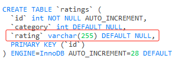

如果我只是在里面存储一个 why，那么它的实际长度应该是 “why” 这 3 个字符的内存空间，加 2 个字节的字段长度，而不是真正的 255 这么长。

这就是 “packed tightly together”，字段紧密的排列在一起，不浪费空间。

sort buffer 就这么点大，肯定不能太浪费了

## 事务中的回滚点概念

在MySQL中提供了两个关于事务回滚点的命令：

- savepoint point_name：添加一个事务回滚点

- rollback to point_name：回滚到指定的事务回滚点

## SMO问题

在SQL执行期间一旦更新操作触发，B+Tree叶子节点分裂，那么就会对整棵B+Tree加排它锁，这不但阻塞了后续这张表上的所有的更新操作，同时也阻止了所有试图在B+Tree上的读操作，也就是会导致所有的读写操作都被阻塞，其影响巨大。因此，这种大粒度的排它锁成为了InnoDB支持高并发访问的主要瓶颈，而这也是MySQL 5.7版本中引入SX锁要解决的问题。

在聊之前首先得搞清楚SQL执行时的几个概念：

- 读取操作：基于B+Tree去读取某条或多条行记录。

- 乐观写入：不会改变B+Tree的索引键，仅会更改索引值，比如主键索引树中不修改主键字段，只修改其他字段的数据，不会引起节点分裂。

- 悲观写入：会改变B+Tree的结构，也就是会造成节点分裂，比如无序插入、修改索引键的字段值。

**MySQL5.7中读操作的执行流程**

- ①读取数据之前首先会对B+Tree加一个共享锁。

- ②在基于树检索数据的过程中，对于所有走过的叶节点会加一个共享锁。

- ③找到需要读取的目标叶子节点后，先加一个共享锁，释放步骤②上加的所有共享锁。

- ④读取最终的目标叶子节点中的数据，读取完成后释放对应叶子节点上的共享锁。

**MySQL5.7中乐观写入的执行流程**

- ①乐观写入之前首先会对B+Tree加一个共享锁。

- ②在基于树检索修改位置的过程中，对于所有走过的叶节点会加一个共享锁。

- ③找到需要写入数据的目标叶子节点后，先加一个排他锁，释放步骤②上加的所有共享锁。

- ④修改目标叶子节点中的数据后，释放对应叶子节点上的排他锁。

**MySQL5.7中悲观写入的执行流程**

- ①悲观更新之前首先会对B+Tree加一个共享排他锁。

- ②由于①上已经加了SX锁，因此当前事务执行过程中会阻塞其他尝试更改树结构的事务。

- ③遍历查找需要写入数据的目标叶子节点，找到后对其分支加上排他锁，释放①中加的SX锁。

- ④执行SMO操作，也就是执行悲观写入操作，完成后释放步骤③中在分支上加的排他锁。

   如果需要修改多个数据时，会在遍历查找的过程中，记录下所有要修改的目标节点。

**MySQL5.7中并发事务冲突分析**

观察上述讲到的三种执行情况，对于读操作、乐观写入操作而言，并不会加SX锁，共享排他锁仅针对于悲观写入操作会加，由于读操作、乐观写入执行前对整颗树加的是S锁，因此悲观写入时加的SX锁并不会阻塞乐观写入和读操作，但当另一个事务尝试执行SMO操作变更树结构时，也需要先对树加上一个SX锁，这时两个悲观写入的并发事务就会出现冲突，新来的事务会被阻塞。

但是要注意：当第一个事务寻找到要修改的节点后，会对其分支加上X锁，紧接着会释放B+Tree上的SX锁，这时另外一个执行SMO操作的事务就能获取SX锁啦！

## InnoDB引擎中的隐藏字段

DB_ROW_ID

对于InnoDB引擎的表而言，由于其表数据是按照聚簇索引的格式存储，因此通常都会选择主键作为聚簇索引列，然后基于主键字段构建索引树，但如若表中未定义主键，则会选择一个具备唯一非空属性的字段，作为聚簇索引的字段来构建树。当两者都不存在时，InnoDB就会隐式定义一个顺序递增的列ROW_ID来作为聚簇索引列。因此要牢记一点，如果你选择的引擎是InnoDB，就算你的表中未定义主键、索引，其实默认也会存在一个聚簇索引，只不过这个索引在上层无法使用，仅提供给InnoDB构建树结构存储表数据

DB_Deleted_Bit

对于一条delete语句而言，当执行后并不会立马删除表的数据，而是将这条数据的Deleted_Bit删除标识改为1/true，后续的查询SQL检索数据时，如果检索到了这条数据，但看到隐藏字段Deleted_Bit=1时，就知道该数据已经被其他事务delete了，因此不会将这条数据纳入结果集。好处是避免回滚导致页的分裂或者合并

DB_TRX_ID

TRX_ID全称为transaction_id，翻译过来也就是事务ID的意思，MySQL对于每一个创建的事务，都会为其分配一个事务ID，事务ID同样遵循顺序递增的特性，即后来的事务ID绝对会比之前的ID要大。如果是select，则分配的id为0

不过对于手动开启的事务，MySQL都会为其分配事务ID，就算这个手动开启的事务中仅有select操作。

表中的隐藏字段TRX_ID，记录的就是最近一次改动当前这条数据的事务ID，这个字段是实现MVCC机制的核心之一

DB_ROLL_PTR

ROLL_PTR全称为rollback_pointer，也就是回滚指针的意思，这个也是表中每条数据都会存在的一个隐藏字段，当一个事务对一条数据做了改动后，都会将旧版本的数据放到Undo-log日志中，而rollback_pointer就是一个地址指针，指向Undo-log日志中旧版本的数据，当需要回滚事务时，就可以通过这个隐藏列，来找到改动之前的旧版本数据，而MVCC机制也利用这点，实现了行数据的多版本

与之前的删除标识类似，一条数据被delete后并提交了，最终会从磁盘移除，而Undo-log中记录的旧版本数据，同样会占用空间，因此在事务提交后也会移除，移除的工作同样由purger线程负责，purger线程内部也会维护一个ReadView，它会以此作为判断依据，来决定何时移除Undo记录。

## mysql中为什么checkpoint每次默认刷8k

涉及到一个概念： read-on-write

[https://blog.csdn.net/qq_27028561/article/details/116540923](https://blog.csdn.net/qq_27028561/article/details/116540923)

## mysql的内存结构

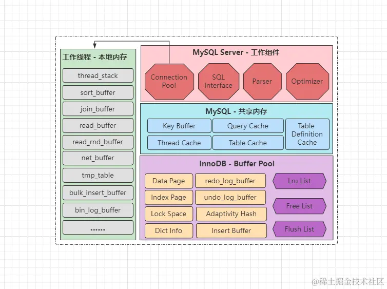

实际上MySQL内存模型和JVM类似，JVM内存主要会划分为线程共享区和线程私有区，而上图中的MySQL内存区域，左边则是线程私有区域，每条工作线程中都会分配的区域，各线程之间互不影响，而右边的三大板块，则属于线程共享区域，即所有线程都可访问的内存

**mysql架构图**

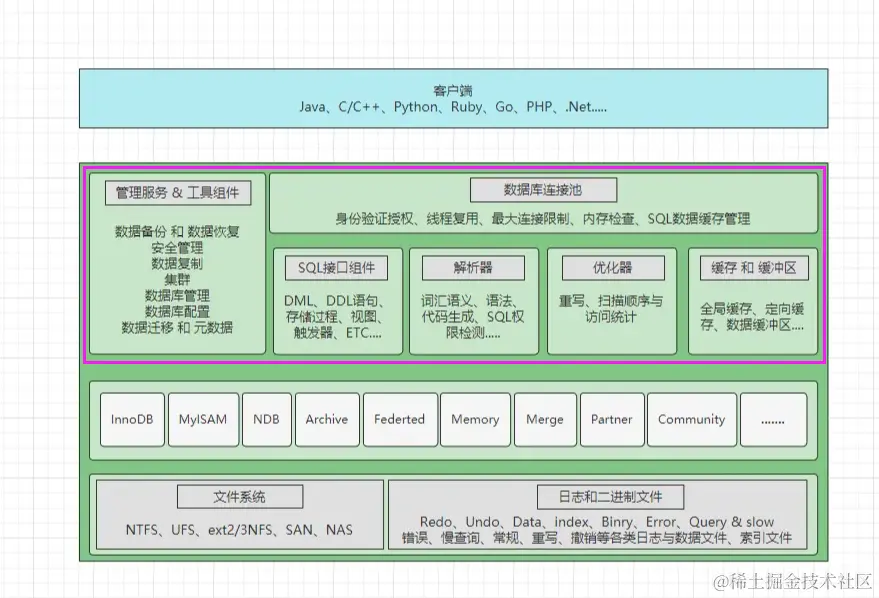

1. 本地内存

- thread_stack：线程堆栈，主要用于暂时存储运行的SQL语句及运算数据，和Java虚拟机栈类似。

- sort_buffer：排序缓冲区，执行排序SQL时，用于存放排序后数据的临时缓冲区。

- join_buffer：连接缓冲区，做连表查询时，存放符合连表查询条件的数据临时缓冲区。

- read_buffer：顺序读缓冲区，MySQL磁盘IO一次读一页数据，这个是顺序IO的数据临时缓冲区。

- read_rnd_buffer：随机读缓冲区，当基于无序字段查询数据时，这里存放随机读到的数据。

- net_buffer：网络连接缓冲区，这里主要是存放当前线程对应的客户端连接信息。

- tmp_table：内存临时表，当SQL中用到了临时表时，这里存放临时表的结构及数据。

- bulk_insert_buffer：MyISAM批量插入缓冲区，批量insert时，存放临时数据的缓冲区。

- bin_log_buffer：bin-log日志缓冲区，

2. 共享内存

- Key Buffer：MyISAM表的索引缓冲区，提升MyISAM表的索引读写速度。

- Query Cache：查询缓存区，缓冲SQL的查询结果，提升热点SQL的数据检索效率。

- Thread Cache：线程缓存区，存放工作线程运行期间，一些需要被共享的临时数据。

- Table Cache：表数据文件的文件描述符缓存，提升数据表的打开效率。

- Table Definition Cache：表结构文件的文件描述符缓存，提升结构表的打开效率。

比如我现在想要操作zz_users表的数据，那首先是不是得找到这张表？但表的位置可能分布在磁盘的任何一处，总不能触发磁盘IO把整个磁盘检索一遍，然后确定表的位置吧？所以内存中直接设计了一个缓存区，专门缓存这些表数据文件的磁盘位置，要对某张表进行操作时，直接去文件描述符缓存中找，然后根据其中记录的地址，去磁盘中固定的位置上操作表数据

3. buffer pool

- Data Page：写入缓冲区，主要用来缓冲磁盘的表数据，将写操作转移到内存进行。

- Index Page：索引缓冲页，对于所有已创建的索引根节点，都会放入到内存，提升索引效率。

- Lock Space：锁空间，主要是存放所有创建出的锁对象，详情可参考

- Dict Info：数据字典，主要用来存储MySQL-InnoDB引擎自带的系统表。

- redo_log_buffer：redo-log缓冲区，存放写SQL执行时写入的redo记录。

- undo_log_buffer：undo-log缓冲区，存放写SQL执行时写入的undo记录。

- Adaptivity Hash：自适应哈希索引，InnoDB会为热点索引页，创建相应的哈希索引。

- Insert Buffer：写入缓冲区，对于insert的数据，会先放在这里，然后定期刷写磁盘。

- Lru List：内存淘汰页列表，对于整个缓冲池的内存管理列表（后续细聊）。

- Free List：空闲内存列表，这里面记录着目前未被使用的内存页。

- Flush List：脏页内存列表，这里主要记录未落盘的数据。

**show** **global** variables **like** "%innodb_buffer_pool_size%";

在MySQL5.6版本以下，默认大小为42MB，而MySQL5.6以后的版本中，默认大小为128MB，这块内存是MySQL启动时向OS申请的一块连续空间。当然，我们也可以手动调整innodb_buffer_pool_size参数来控制，一般建议设置为机器内存的60~80%

**InnoDB****也有自己的预读机制**

每个数据页都被划分在一个个的extent里，一个extent容量为64，当select操作发生时，一个extent里被读取的数据页达到一定阈值后，会触发InnoDB的预读机制，将剩余的数据页、或下一个extent提前载入到内存中

InnoDB在存储数据时，会以64个数据页作为一个extent，同时，InnoDB内部有两种预算策略：

- ①线性预读：当前extent中的数据页，被读取到一定数量时，触发预读直接提前读取下一个extent；

- ②随机预读：当前extent中的数据页，大部分被载入到内存时，会触发预读将extent剩下的数据页全部载入内存；

**show** variables **like** 'innodb_read_ahead_threshold';

young、old两个区域在LRU链表中的占比，默认为63:37，你也可以通过innodb_old_blocks_pc这个参数，来手动调整old区在整个LRU链表中的占比。

也就是说，在划分为两个区域后，young区域是用来存储真正的热点数据页，而old区则是用来存放有可能成为热点数据页的“候选人”，当需要淘汰缓冲页时，会优先淘汰old区中的数据页，毕竟young区中留下的都是久经考验的精英！

nnoDB内存管理这块的内容，InnoDB采用三个链表结构来管理所有的缓冲页：

- Free链表：统一管理、分配所有未使用的缓冲页。

- Flush链表：统一管理、刷写所有被标记过的缓冲页。

- Lru链表：统一管理、淘汰所有已使用、未变更过的缓冲页。

在内存的淘汰机制方面，InnoDB基于末尾淘汰机制做了两点改善：

- ①将Lru链表划分为了young、old两个分区，用来解决预读失效导致的内存占用问题。

- ②引入了young区的晋升限制，1s内再次访问，解决了全表扫描时，young区的热点数据页被换出的问题。

## mysql的架构选型

- 项目业务中读写参半，单节点难以承载压力，项目集群、双主热备值得参考。

- 项目业务中写大于读，引入消息中间件、DB分库、项目集群也可以考虑。

- 项目业务中读大于写，引入缓存/搜索中间件、动静分离、读写分离是些不错的选择。

当你的系统原有架构遇到性能瓶颈时，你甚至可以考虑进一步做架构优化，如：设计多级分布式缓存、缓存中间件做集群、消息中间件做集群、

Java程序做集群、数据库做分库分表、搜索中间件做集群.....，慢慢的，你的系统会越来越庞大复杂，需要处理的问题也更为棘手，但带来的效果也显而易见，随着系统的结构不断变化，承载百万级、千万级、亿级、乃至更大级别的流量也并非难事。

   聊到MySQL的性能优化，其实也可以从多个维度出发，共计优化项如下：

- ①客户端与连接层的优化：调整客户端DB连接池的参数和DB连接层的参数。

**最大连接数 = (CPU核心数 * 2) + 有效磁盘数**

**在一些场景下可以分连接池，有些sql一定执行的慢的，在这个连接池中处理，其他的在快连接池中处理**

- ②MySQL结构的优化：合理的设计库表结构，表中字段根据业务选择合适的数据类型、索引。

- ③MySQL参数优化：调整参数的默认值，根据业务将各类参数调整到合适的大小。

- ④整体架构优化：引入中间件减轻数据库压力，优化MySQL架构提高可用性。

- ⑤编码层优化：根据库表结构、索引结构优化业务SQL语句，提高索引命中率。

纵观现在MySQL中的各类优化手段，基本上都是围绕着上述的五个维度展开，这五个性能优化项中，通常情况下，带来的性能收益排序为④ > ② >  ⑤ > ③ > ①，不过带来的性能收益越大，也就意味着成本会更高，因此大家在调优时，一定要记得按需进行，不要过度调优，否则也会带来额外的成本开销！

## mysql8.0的更新

1. 移除查询缓存

1. 支持非阻塞式获取锁机制，可以在获取锁的写法上加上NOWAIT、SKIP LOCKED关键字，这样在未获取到锁时不会阻塞等待，使用SKIP LOCKED未获取到锁时会直接返回空，使用NOWAIT会直接返回并向客户端返回异常

```sql
select ... for update nowait;
select ... for update skip locked;
```

3. 推出了在线修改参数后，支持持久化到本地文件的机制，也就是通过SET PERSIST命令来完成

```sql
-- 调整事务的隔离级别（针对于当前连接有效）
set transaction isolation level read uncommitted;

-- 调整事务的隔离级别（针对于全局有效，重启后会丢失）
set global tx_isolation = "read-committed";

-- 调整事务的隔离级别（针对于全局有效，并且会持久化到本地，重启后不会丢失）
set persist global.tx_isolation = "repeatable-read";


通过set persist命令持久化的参数，可以通过下述命令来查看
select * from performance_schema.persisted_variables;

```

但当你想要参数不再持久化到本地时，可以选择删除安装目录下的mysqld-auto.cnf文件，或执行reset persist命令来清除，但这两种方式都只对下次重启时生效，毕竟本次参数已经被载入内存了，所以只能通过再次手动修改的方式复原。

4.   在之前的MySQL版本中，仅支持交叉连接、内连接、左外连接、右外连接四种连接类型，这四种连接都会采用默认的连接算法，而在8.0版本中提供了哈希连接、反连接两种连接优化的支持。

1. 哈希连接

在哈希连接算法中会分为两个阶段：

- 构建阶段：选择一张小表作为构建表，接着会基于连接字段做哈希处理，生成哈希值放入内存中构建出一张哈希表。

- 探测阶段：遍历大表的每一行数据，然后对连接字段做哈希处理，通过生成的哈希值与内存哈希表做比较，符合条件则放入结果集中。

对比之前的循环连接算法，这种哈希连接算法带来的性能提升直线提升N倍，因为在循环连接算法中，需要遍历count(驱动表)次，即驱动表中有多少条数据就要遍历多少次。而在这种算法中，只需要将大表遍历一次，伪逻辑代码如下：

```java
// 构建阶段：将小表的每行数据，根据哈希值放入内存哈希表中
Map hashTable = new HashMap();
for(数据 x : 构建表){
    hashTable.put(x);
}

// 探测阶段：遍历大表的每行数据与内存哈希表做连接匹配
for(数据 y : 探测表){
    if (hashTable.get(y) != null){
        // 如果哈希处理后能够在内存哈希表中存在，
        // 则表示这条数据符合连接条件，则记录到连接查询的结果集中.....
    }
}

```

哈希连接对比循环连接算法而言，主要在两方面可以得到性能提升：

①哈希连接算法中，只需要将大表遍历一次，但循环连接算法需要遍历N次。

②哈希连接探测阶段，做连接判断时只需要先对数据做一次哈希处理，然后在内存中查找即可，复杂度仅为O(1)，但循环连接算法的复杂度为O(n)。

但虽然哈希连接算法能够带来卓越的性能提升，但也存在一个致命问题，就是内存中join_buffer_size的容量无法完全载入构建表的哈希数据时怎么办呢？这里就有两种解决方案：

①分批处理，将构建表的数据拆分为几部分，每次载入一部分到内存，但这样会导致大表的遍历次数，随着分批次数变大而增多。

②利用磁盘完成，也就是首先将构建表的所有数据做哈希处理，放不下时将一部分处理好的哈希数据放入磁盘，在探测阶段遍历大表时，每次对大表数据生成哈希值后，做判断时从磁盘依次读取处理好的哈希值做判断。

而MySQL中选择的是第二种，也就是当内存无法完全放下构建表的哈希数据时，会采用磁盘+内存混合的模式执行哈希连接。

MySQL什么情况下会选用哈希连接？

首先并不是多表连接的情况下都会使用哈希连接算法，该算法有几个硬性限制：

①目前哈希连接算法仅支持内连接的多表连查方式。

②哈希连接算法必须要求存在等值连接条件，即a.id=b.id才行，a.id>b.id是不行的。

③如果连接字段可以走索引查询的情况下，默认依旧会采用循环连接算法。

第二点的原因在于：哈希连接算法生成的哈希值是无序的，所以必须要用等值连接才行。

第三点的原因在于：连接查询时走索引的效率并不低，哈希连接需要生成哈希表，因此需要时间，因此在能够走索引连表的情况下，哈希连接算法的效率反而比不上循环连接。

也就是说，当连表时存在等值连接条件，并且未命中索引的情况下，MySQL默认会采用哈希连接算法来完成连表查询，不过还有一种情况也会使用，就是笛卡尔积情况，即不指定连接条件的情况下也会使用哈希连接，此时MySQL会直接对整条数据生成哈希表。

**2. 反连接**

反连接是MySQL8.0对于一些反范围查询操作的优化，主要针对于下述几种情况会做优化：

NOT IN (SELECT … FROM …)

NOT EXISTS (SELECT … FROM …)

IN (SELECT … FROM …) IS NOT TRUE

EXISTS (SELECT … FROM …) IS NOT TRUE

IN (SELECT … FROM …) IS FALSE

EXISTS (SELECT … FROM …) IS FALSE

在MySQL早些版本中，使用NOT EXISTS、NOT IN、IS NOT...这类操作时有可能会导致索引失效，而且也会让查询效率变低，因此MySQL8.0版本中会对上述几类语句进行优化，当你的SQL语句使用了上述语法检索数据时，在MySQL内部会将其转变为反连接类型的查询语句。

也就是会将右边的子查询结果集，变为一张物理临时表，然后基于条件字段做连接查询，官方号称在某些场景下，能够让上述几类语句的查询性能提升20%，但对于这块我没做深入研究，因此就不展开叙述啦。

5. 增强索引

5.1 索引跳跃式扫描

其实也就是MySQL优化器会自动对联合索引中的第一个字段的值去重，然后基于去重后的值全部拼接起来查一遍

但是跳跃扫描机制也有很多限制，比如多表联查时无法触发、SQL条件中有分组操作也无法触发、SQL中用了DISTINCT去重也无法触发.....，总之有很多限制条件

5.2 隐藏索引

隐藏索引并不是一种新的索引类型，而是一种对索引的骚操作，可以理解为对每个索引新增了一个开关按键，主要用于测试环境和灰度场景，在MySQL8.0版本中，可以通过INVISIBLE、VISIBLE来控制索引的开关：

当对一个索引使用INVISIBLE后，会关闭这个索引，优化器在执行SQL时无法发现和使用它。

当对一个索引使用VISIBLE后，会将索引从隐藏状态恢复到正常状态。

所谓的隐藏索引，就是指将一个已经创建的索引“藏起来”，被藏起来的索引是无法被优化器探测到的，因此执行SQL语句时，就算语句中显式使用了索引字段，优化器也不会选择走这条索引。

```sql
-- 隐藏某张表上已存在的一个索引
alter table 表名 alter index 索引名 invisible;

-- 恢复某张表上已存在的一个索引
alter table 表名 alter index 索引名 visible;
```

5. 3 降序索引

在创建索引时，可以通过ASC、DESC来定义一个索引是按升序还是降序存储索引键，但本质上这种语法，在MySQL8.0之前，就算你手动写明了DESC降序，在创建时依旧会默认忽略，也就是本质上还是按升序存储索引键的，当你要对某个倒序索引的字段做倒序时，依旧会发生filesort排序的动作。（因为数据页内是单向链表）

5.4 函数索引

支持对使用函数的字段加索引

6. 通用表 表达式（common table expression） CTE

CTE是一个具备变量名的临时结果集，也就是可以将一条查询语句的结果保存到一个变量里面，后续在其他语句中允许直接通过变量名来使用该结果集

```sql
with CTE名称
as (查询语句/子查询语句)
select 语句;

# 举例
-- MySQL8.0版本之前的子查询语句
select * from t1 where xx in (select xx from t2 where yy = "zzz");

-- MySQL8.0中使用CTE表达式来代替
with cte_query as
    (select xx from t2 where yy = "zzz")

select * from t1 join cte_query on t1.xx = cte_query.xx;

```

7. 窗口函数

窗口函数是一种分析型的OLAP函数，因此也被称之为分析函数，它可以理解成是数据的集合，类似于group by分组的功能，但之前的MySQL版本基于某个字段分组后，会将数据压缩到一行显示

```sql
[window 窗口函数名 as (window_spec) [, 窗口函数名 AS (window_spec)] ...]

窗口函数名(窗口名/表达式) 
over (
    [partition_defintion]
    [order_definition]
    [frame_definition]
)

---其实这个语法看起来不是特别能让人理解，所以结合具体的场景来举例
窗口函数 over([partition by 字段名 order by 字段名 asc|desc])

窗口函数 over 窗口名 ... window 窗口名 
as ([partition by 字段名 order by 字段名 asc|desc])


-- 按性别分组，并按照ID值从大到小对各分组中的数据进行排序，最后输出。
select 
    -- 使用 row_number() 序号窗口函数
    row_number() over(
        -- 基于性别做分组，然后基于 ID 做倒序
        partition by user_sex order by user_id desc
    ) as  serial_num,
    user_id, user_name, user_sex, password, register_time
from
    zz_users;

+------------+---------+-----------+----------+----------+---------------------+
| serial_num | user_id | user_name | user_sex | password | register_time       |
+------------+---------+-----------+----------+----------+---------------------+
| 1          |       4 | 猫熊      | 女       | 8888     | 2022-09-17 23:48:29 |
| 2          |       1 | 熊猫      | 女       | 6666     | 2022-08-14 15:22:01 |
| 1          |       3 | 子竹      | 男       | 4321     | 2022-09-16 07:42:21 |
| 2          |       2 | 竹子      | 男       | 1234     | 2022-09-14 16:17:44 |
+------------+---------+-----------+----------+----------+---------------------+

```

## 分库后程序如何访问数据库

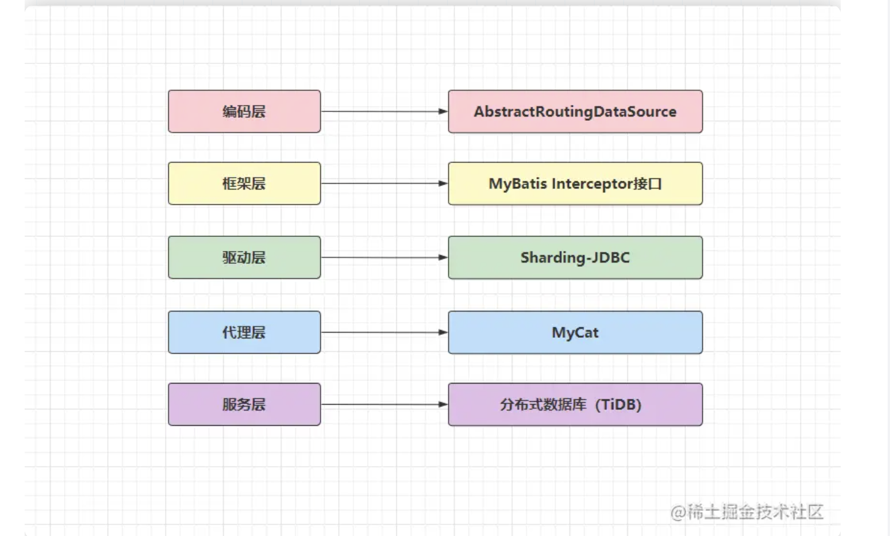

一般编码层或框架层都无法单独实现数据源的切换，两者必须配合起来完成，用MyBatis.Interceptor接口拦截SQL语句，然后根据SQL中的路由键做运算，最终再通过Spring.AbstractRoutingDataSource类去动态切换数据源。但这种方案的工程量很大，实现过程也较为繁杂，所以下面直接来看一些成熟的方案，如下：

工程（依赖、Jar包、不需要独立部署，可集成在业务项目中）

淘宝网：TDDL

蘑菇街：TSharding

当当网：Sharding-Sphere-JDBC

进程（中间件、需要独立部署的第三方进程）

早年最热门、基于阿里Cobar二开的MyCat

阿里B2B：Cobar

奇虎360：Atlas

58同城：Oceanus

谷歌开源：Vitess

当当网：Sharding-Sphere-Proxy

## 主从架构小结

一主多从架构：适用于读大于写的场景，采用多个从库来分担数据库系统的读压力。

多主架构：适用于读写参半的场景，采用多个主库来承载数据库系统整体的读写压力。

多主一从架构：适用于写大于读的场景，采用多个主库分担写压力，单个从库承载读压力。

级联复制架构：适用于读大于写的场景，采用单个从节点来分担从库对主库造成的I/O压力。

## 主从复制数据的方式

异步复制、同步复制、半同步复制、增强式半同步复制/无损复制、延迟复制、并行复制

 增强式半同步复制也被称为无损复制，这是MySQL5.7版本中引入的一种新技术，在MySQL5.7版本中就不存在普通的半同步模式了，当将复制模式配置成半同步时，默认就会选用无损复制模式，和之前传统的半同步复制区别在于：从after-commit变成了after-sync

那延迟复制的好处在于什么呢？可以防止误删操作，如若在主库上不小心误删了大量数据、表、库或其他数据库对象，因为从库并不是立即执行同步过去的记录，因此可以及时通过从节点上的数据回滚数据。除此之外，也能对一些线上Bug进行实时观测，比如一个无法复现的故障问题发生时，如果发现时还在配置的延迟复制时间内，则可以去到从库上观察。

**重点并行复制**

GTID(Global Transaction ID)也就是全局事务标识符的意思，它由节点UUID+事务ID两部分组成，MySQL在第一次启动时都会利用UUID随机生成一个server_id，还记得在之前的[《MVCC机制》](https://juejin.cn/post/7155359629050904584#heading-13)中聊过的事务ID嘛？MySQL会对每一个写事务都分配一个顺序递增的值作为事务ID，而GTID则是由这两玩意儿组成的，格式为server_uuid:trx_id

当主库的事务有了这个全局事务标识后，再发生主从切换时就无需手动寻点了，仅需要执行change master to master_auto_position = 1这条命令即可，它会自动去新主库上寻找数据的同步点，也就是MySQL自身就具备断点复制的功能。

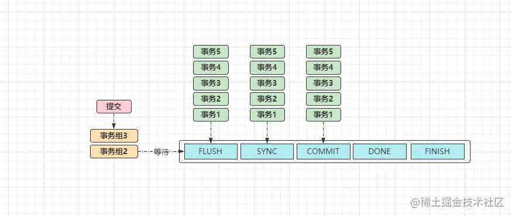

当一个事务提交时都会调用ordered_commit函数，首先会将事务加入等待事务组，接着会经过三个核心步骤：FLUSH、SYNC、COMMIT，对应的也会有三个队列，它们三者的工作原理都大致相同：

①如果某个事务进入FLUSH队列时，该队列还是空的，则这个事务会担任“队长”的角色。

②当后续其他事务进入队列时，发现队列不为空，则会将提交工作委托给队长来完成。

③如上图中的「事务1」则是队长，后续的都是队员，但队长不会无限制等待队员到来：

从队长加入的时间点开始，当超出binlog_group_commit_sync_delay规定的时间后，就会进行一次组提交。

到了MySQL5.7中，才基于组复制技术实现了真正意义上的并行复制，因为能够在同一时间内提交的事务，绝对是不存在锁冲突的，所以可以开启多条线程同时执行一个组中不同的事务，但这个思想是从MariaDB中照抄过来的~

在5.7中官方为这种机制命名为enhanced multi-threaded slave，简称MTS机制，同时为了兼容5.6版本中的并行复制，又多加入了一个slave-parallel-type参数：

DATABASE：默认的并行复制模式，表示基于库级别的来完成并行复制。（就是相当于保证不会同时执行同一个数据库的sql）

LOGICAL_CLOCK：表示基于组提交的方式来完成并行复制。

但当你想要使用这种并行复制的技术，必须要将版本升级到MySQL 5.7.19才行，因为在此之前的版本中，MTS技术依旧存在不小瑕疵。

## mysql中各个关键字的执行顺序

1. 先找到（FROM）你要查询的表。

1. 如果数据来自多个表，那么你需要把这些表（JOIN）连接起来。

1. 之后，你需要筛选出（WHERE）你感兴趣的记录。

1. 对这些记录进行分类统计（GROUP BY），并根据某些条件再次筛选（HAVING）。

1. 选择你需要展示的字段（SELECT）。

1. 最后，对结果进行排序（ORDER BY），并可能还需要限制（LIMIT）结果的数量。

## **索引合并(Index Merge)**

索引合并是通过对一个表同时使用多个索引进行条件扫描，并将满足条件的多个主键集合取交集或并集后再进行回表，可以提升查询效率。

索引合并主要包含交集(intersection)，并集(union)和排序并集(sort-union)三种类型：

- **intersection**：将基于多个索引扫描的结果集取交集后返回给用户；

- **union**：将基于多个索引扫描的结果集取并集后返回给用户；

- **sort-union**：与union类似，不同的是sort-union会对结果集进行排序，随后再返回给用户；

- 

## mysql的hint

## mysql加锁规则

**包含了两个“原则”、两个“优化”和一个“bug”。**

1. 原则 1：加锁的基本单位是 next-key lock。希望你还记得，next-key lock 是前开后闭区间。

1. 原则 2：查找过程中访问到的对象才会加锁。

1. 优化 1：索引上的等值查询，给唯一索引加锁的时候，next-key lock 退化为行锁。

1. 优化 2：索引上的等值查询，向右遍历时且最后一个值不满足等值条件的时候，next-key lock 退化为间隙锁。

1. 一个 bug：唯一索引上的范围查询会访问到不满足条件的第一个值为止。