## redis的大致架构


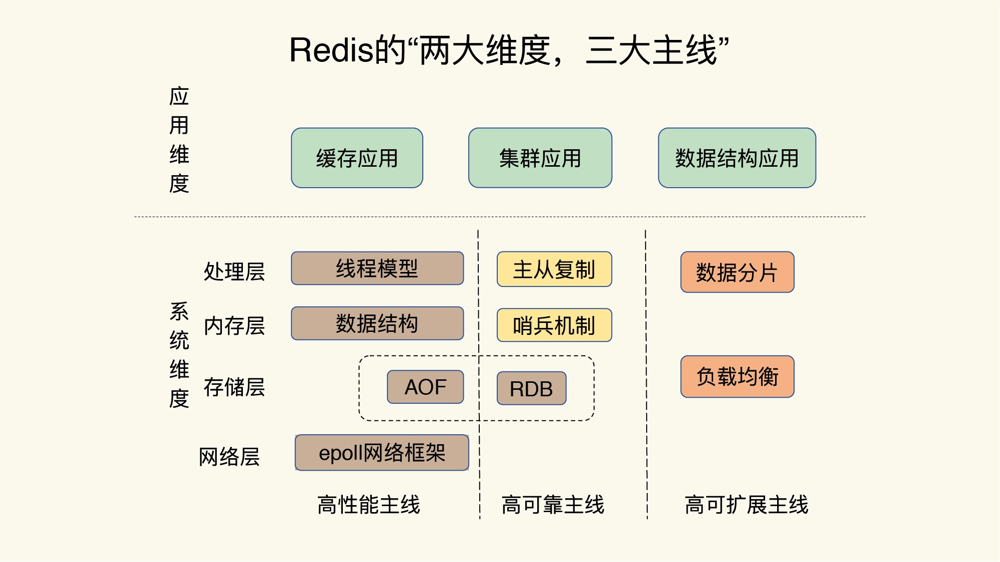

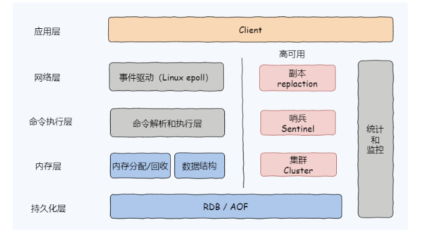

## **redis数据结构**

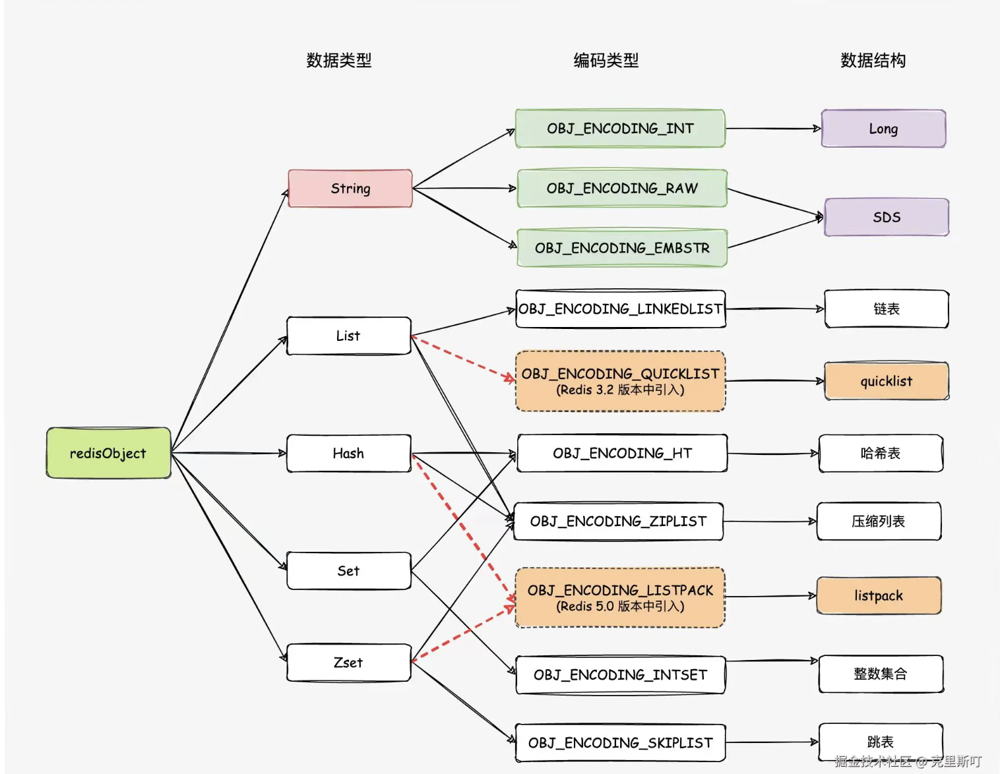

[https://mp.weixin.qq.com/s/x9yrYOmQqKPyjd4n4FhRfQ](https://mp.weixin.qq.com/s/x9yrYOmQqKPyjd4n4FhRfQ)

    Redis支持9种数据类型，以K-V形式进行存储，K是String类型的，V支持5种不同的数据类型，分别是：string，list，hash，set，sorted set，每一种数据结构都有其特定的应用场景。从内部实现的角度来看是如何更好的实现这些数据类型。Redis底层数据结构有以下数据类型：简单动态字符串（SDS），链表，字典，跳跃表，整数集合，压缩列表，对象。

在 Redis 中，所有的对象都会包含 redisObject 对象头。我们先来看 redisObject 对象的源码：

```javascript
typedef struct redisObject {
    unsigned type:4; // 4 bit  对象的数据类型，例如：string、list、hash 等，占用 4 bits 也就是半个字符的大小；
    unsigned encoding:4; // 4 bit  对象数据编码，占用 4 bits；
    unsigned lru:LRU_BITS; // 3 个字节  记录对象的 LRU(Least Recently Used 的缩写，即最近最少使用)信息，内存回收时会用到此属性，占用 24 bits(3 字节)；
    int refcount; // 4 个字节  引用计数器，占用 32 bits(4 字节)
    void *ptr; // 8 个字节  对象指针用于指向具体的内容，占用 64 bits(8 字节)。
} robj;
```

在 Redis 中 LFU 存储分为两部分，16 bit 的 ldt（last decrement time）和 8 bit 的 logc（logistic counter）。

1. logc 是用来存储访问频次，8 bit 能表示的最大整数值为 255，它的值越小表示使用频率越低，越容易淘汰；

1. ldt 是用来存储上一次 logc 的更新时间。    

注意：SDS除了用于实现字符串类型，还被用作AOF持久化时的缓冲区。

| 字符串(stirng)对象 | 在上面的图我们知道string类型有三种 |
| -- | -- |
| 列表(list)对象 | 在上面的图我们知道list类型有两种 |
| 哈希(hash)对象 | 在上面的图我们知道hash类型有两种 |
| 集合(set)对象 | 在上面的图我们知道set类型有两种 |
| 有序集合(sortset)对象 | 在上面的图我们知道set类型有两种 |

    高级点：HyperLogLog、Gep、Pub/Sub

   拓展:   BloomFilter、 RedisSearch(全文搜索)、Redis-ML(机器学习)

    


下面详细介绍结构：

**1.SDS**

```javascript
struct sdshdr{

    // 字节数组，用于保存字符串
    char buf[];

    // 记录buf数组中已使用的字节数量，也是字符串的长度
    int len;

    // 记录buf数组未使用的字节数量
    int free;
}
```

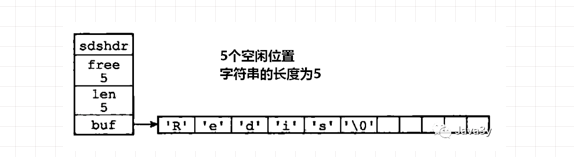

**使用 SDS的好处： **

1. sdshdr数据结构中用len属性记录了字符串的长度。那么**获取字符串的长度时，时间复杂度只需要O(1)**。

1. SDS不会发生溢出的问题，如果修改SDS时，空间不足。先会扩展空间，再进行修改！(**内部实现了动态扩展机制**)。

1. SDS可以**减少内存分配的次数**(空间预分配机制)。在扩展空间时，除了分配修改时所必要的空间，还会分配额外的空闲空间(free 属性)。

1. SDS是**二进制安全的**，所有SDS API都会以处理二进制的方式来处理SDS存放在buf数组里的数据。

**2.链表 **

```javascript
typedef strcut listNode{

    //前置节点
    strcut listNode  *pre;

    //后置节点
    strcut listNode  *pre;

    //节点的值
    void  *value;

}listNode
```

```javascript
typedef struct list{

    //表头结点
    listNode  *head;

    //表尾节点
    listNode  *tail;

    //链表长度
    unsigned long len;

    //节点值复制函数
    void *(*dup) (viod *ptr);

    //节点值释放函数
    void  (*free) (viod *ptr);

    //节点值对比函数
    int (*match) (void *ptr,void *key);

}list
```

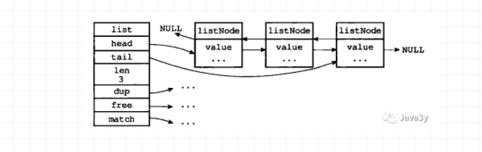

**3.  哈希表 **

```javascript
 typedef struct dictht{

        //哈希表数组
        dictEntry **table;  

        //哈希表大小
        unsigned long size;    

        //哈希表大小掩码，用于计算索引值
        //总是等于size-1
        unsigned long sizemark;     

        //哈希表已有节点数量
        unsigned long used;

    }dictht
```

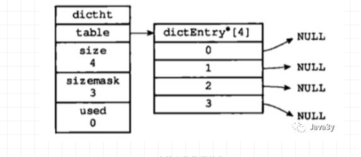

```javascript
 typedef struct dictEntry {

        //键
        void *key;

        //值
        union {
            void *value;
            uint64_tu64;
            int64_ts64;
        }v;    

        //指向下个哈希节点，组成链表
        struct dictEntry *next;

    }dictEntry;
```

```javascript
typedef struct dict {

    //类型特定函数
    dictType *type;

    //私有数据
    void *privdata;

    //哈希表
    dictht ht[2];

    //rehash索引
    //当rehash不进行时，值为-1
    int rehashidx;  

}dict;


//-----------------------------------

typedef struct dictType{

    //计算哈希值的函数
    unsigned int (*hashFunction)(const void * key);

    //复制键的函数
    void *(*keyDup)(void *private, const void *key);

    //复制值得函数
    void *(*valDup)(void *private, const void *obj);  

    //对比键的函数
    int (*keyCompare)(void *privdata , const void *key1, const void *key2)

    //销毁键的函数
    void (*keyDestructor)(void *private, void *key);

    //销毁值的函数
    void (*valDestructor)(void *private, void *obj);  

}dictType
```

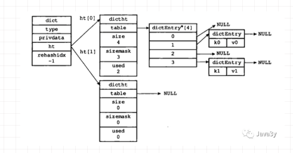

**从代码实现和示例图上我们可以发现，****Redis中有两个哈希表****：**

- ht[0]：用于存放**真实**的key-vlaue数据

- ht[1]：用于**扩容(rehash)**

Redis中哈希算法和哈希冲突跟Java实现的差不多，它俩**差异**就是：

- Redis哈希冲突时：是将新节点添加在链表的**表头**。

- JDK1.8后，Java在哈希冲突时：是将新的节点添加到链表的**表尾**。

下面来具体讲讲Redis是怎么rehash的，因为我们从上面可以明显地看到，**Redis是专门使用一个哈希表来做rehash的**。这跟Java一次性直接rehash是有区别的。

> 在对哈希表进行扩展或者收缩操作时，reash过程并不是一次性地完成的，而是**渐进式**地完成的。

Redis在rehash时采取渐进式的原因：**数据量如果过大的话，一次性rehash会有庞大的计算量，这很可能导致服务器一段时间内停止服务**。

Redis具体是rehash时这么干的：

- (1:在字典中维持一个索引计数器变量rehashidx，并将设置为0，表示rehash开始。

- (2:在rehash期间每次对字典进行增加、查询、删除和更新操作时，**除了执行指定命令外**；还会将ht[0]中rehashidx索引上的值**rehash到ht[1]**，操作完成后rehashidx+1。

- (3:字典操作不断执行，最终在某个时间点，所有的键值对完成rehash，这时**将rehashidx设置为-1，表示rehash完成**

- (4:在渐进式rehash过程中，字典会同时使用两个哈希表ht[0]和ht[1]，所有的更新、删除、查找操作也会在两个哈希表进行。例如要查找一个键的话，**服务器会优先查找ht[0]，如果不存在，再查找ht[1]**，诸如此类。此外当执行**新增操作**时，新的键值对**一律保存到ht[1]**，不再对ht[0]进行任何操作，以保证ht[0]的键值对数量只减不增，直至变为空表。

**4.跳跃表**

```javascript
typeof struct zskiplistNode {
        // 后退指针
        struct zskiplistNode *backward;
        // 分值
        double score;
        // 成员对象
        robj *obj;
        // 层
        struct zskiplistLevel {
                // 前进指针
                struct zskiplistNode *forward;
                // 跨度
                unsigned int span;
        } level[];
} zskiplistNode;** **
```

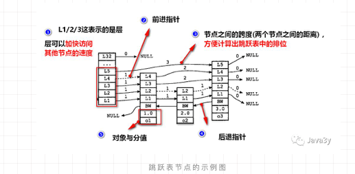

```javascript
typeof struct zskiplist {
        // 表头节点，表尾节点
        struct skiplistNode *header,*tail;
        // 表中节点数量
        unsigned long length;
        // 表中最大层数
        int level;
} zskiplist;
```

**5.整数集合 (intset) **

```javascript
typeof struct intset {
        // 编码方式
        unit32_t encoding;
        // 集合包含的元素数量
        unit32_t lenght;
        // 保存元素的数组
        int8_t contents[];
} intset;
```

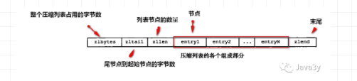

**6.压缩列表 （ziplist）**


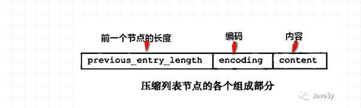

## **redis的大key删除**

unlink命令，异步非阻塞删除，版本 > 4.0

当Redis版本小于4.0时，避免使用阻塞式命令KEYS，而是建议通过SCAN命令执行增量迭代扫描key，然后判断进行删除。

## **Redis的对象体系**

struct redisServer{  

    //redisDb数组,表示服务器中所有的数据库

    redisDb *db;  

    //服务器中数据库的数量

    int dbnum;  

}; 

typedef struct redisClient{  

    //客户端当前所选数据库

    redisDb *db;  

}redisClient;

typedef struct redisDb { 

    int id;         // 数据库ID标识

    dict *dict;     // 键空间，存放着所有的键值对              

    dict *expires;  // 过期哈希表，保存着键的过期时间                          

    dict *watched_keys; // 被watch命令监控的key和相应client    

    long long avg_ttl;  // 数据库内所有键的平均TTL（生存时间）     

} redisDb;

## **redis性能优化**

| 缩短键值对的存储长度； | 在 key 不变的情况下，value 值越大操作效率越慢，因为 Redis 对于同一种数据类型会使用不同的内部编码进行存储，比如字符串的内部编码就有三种：int（整数编码）、raw（优化内存分配的字符串编码）、embstr（动态字符串编码），这是因为 Redis 的作者是想通过不同编码实现效率和空间的平衡，然而数据量越大使用的内部编码就越复杂，而越是复杂的内部编码存储的性能就越低。 |
| -- | -- |
| 使用 lazy free（延迟删除）特性； | lazy free 特性是 Redis 4.0 新增的一个非常实用的功能，它可以理解为惰性删除或延迟删除。意思是在删除的时候提供异步延时释放键值的功能，把键值释放操作放在 BIO（Background I/O）单独的子线程处理中，以减少删除对 Redis 主线程的阻塞，可以有效地避免删除 big key 时带来的性能和可用性问题。 |
| 设置键值的过期时间； | 我们应该根据实际的业务情况，对键值设置合理的过期时间，这样 Redis 会帮你自动清除过期的键值对，以节约对内存的占用，以避免键值过多的堆积，频繁的触发内存淘汰策略。 |
| 禁用耗时长的查询命令； |  |
| 使用 slowlog 优化耗时命令； | 我们可以使用 slowlog 功能找出最耗时的 Redis 命令进行相关的优化，以提升 Redis 的运行速度，慢查询有两个重要的配置项： |
| 使用 Pipeline 批量操作数据； | Pipeline（管道技术）是客户端提供的一种批处理技术，用于一次处理多个 Redis 命令，从而提高整个交互的性能。 |
| 避免大量数据同时失效； | 如果在大型系统中有大量缓存在同一时间同时过期，那么会导致 Redis 循环多次持续扫描删除过期字典，直到过期字典中过期键值被删除的比较稀疏为止，而在整个执行过程会导致 Redis 的读写出现明显的卡顿，卡顿的另一种原因是内存管理器需要频繁回收内存页，因此也会消耗一定的 CPU。 |
| 客户端使用优化； | 在客户端的使用上我们除了要尽量使用 Pipeline 的技术外，还需要注意要尽量使用 Redis 连接池，而不是频繁创建销毁 Redis 连接，这样就可以减少网络传输次数和减少了非必要调用指令。 |
| 限制 Redis 内存大小； | 在 64 位操作系统中 Redis 的内存大小是没有限制的，也就是配置项  |
| 使用物理机而非虚拟机安装 Redis 服务； | 在虚拟机中运行 Redis 服务器，因为和物理机共享一个物理网口，并且一台物理机可能有多个虚拟机在运行，因此在内存占用上和网络延迟方面都会有很糟糕的表现，我们可以通过  |
| 检查数据持久化策略； | RDB 和 AOF 持久化各有利弊，RDB 可能会导致一定时间内的数据丢失，而 AOF 由于文件较大则会影响 Redis 的启动速度，为了能同时拥有 RDB 和 AOF 的优点，Redis 4.0 之后新增了混合持久化的方式，因此我们在必须要进行持久化操作时，应该选择混合持久化的方式。 |
| 使用分布式架构来增加读写速度。 | Redis 分布式架构有三个重要的手段： |

## **redis中COW**

在读《Redis设计与实现》关于哈希表扩容的时候，发现这么一段话：

执行BGSAVE命令或者BGREWRITEAOF命令的过程中，Redis需要创建当前服务器进程的子进程，而大多数操作系统都采用写时复制（copy-on-write）来优化子进程的使用效率，所以在子进程存在期间，服务器会提高负载因子的阈值，从而避免在子进程存在期间进行哈希表扩展操作，避免不必要的内存写入操作，最大限度地节约内存。

- Redis在持久化时，如果是采用BGSAVE命令或者BGREWRITEAOF的方式，那Redis会fork出一个子进程来读取数据，从而写到磁盘中。

- 总体来看，Redis还是读操作比较多。如果子进程存在期间，发生了大量的写操作，那可能就会出现很多的分页错误(页异常中断page-fault)，这样就得耗费不少性能在复制上。

- 而在rehash阶段上，写操作是无法避免的。所以Redis在fork出子进程之后，将负载因子阈值提高，尽量减少写操作，避免不必要的内存写入操作，最大限度地节约内存。

## **redis的主从复制**

Redis2.8之前使用sync[runId][offset]同步命令，Redis2.8之后使用psync[runId][offset]命令。两者不同在于，sync命令仅支持全量复制过程，psync支持全量和部分复制

- runId：每个Redis节点启动都会生成唯一的uuid，每次Redis重启后，runId都会发生变化

- offset：主节点和从节点都各自维护自己的主从复制偏移量offset，当主节点有写入命令时，offset=offset+命令的字节长度。从节点在收到主节点发送的命令后，也会增加自己的offset，并把自己的offset发送给主节点。这样，主节点同时保存自己的offset和从节点的offset，通过对比offset来判断主从节点数据是否一致

- repl_back_buffer：复制缓冲区，用来存储增量数据命令

- 主从数据同步具体过程如下：

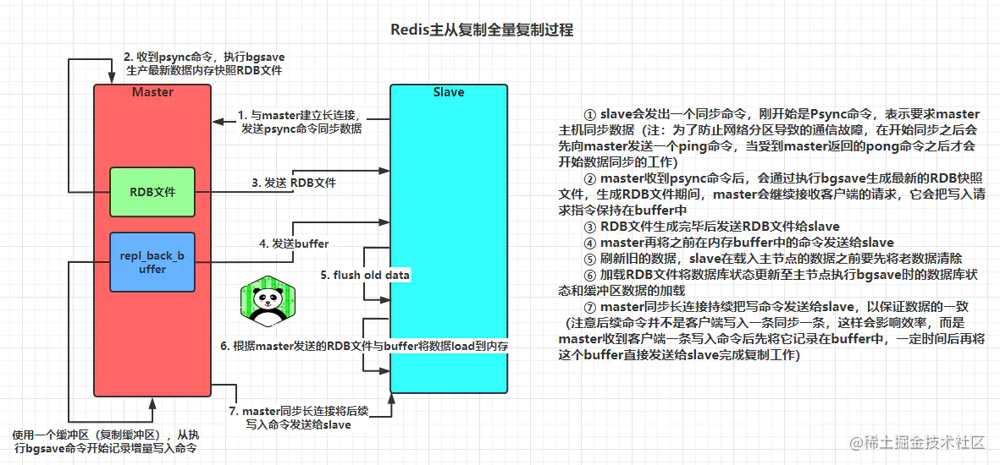

当然psync命令除了支持全量复制之外还支持部分复制，因为在做主从数据同步时会导致主从机器网络带宽开销非常大，而在2.8之前Redis仅支持全量复制，这样非常容易导致Redis在线上出现网络瓶颈，而在2.8之后的增量（部分）复制，用于处理在主从复制中因网络闪断等原因造成的数据丢失场景，当slave再次连上master后，如果条件允许，master会补发丢失数据给slave。因为补发的数据远远小于全量数据，可以有效避免全量复制的过高开销。部分复制流程图如下（复制缓存区溢出也会导致全量复制）：

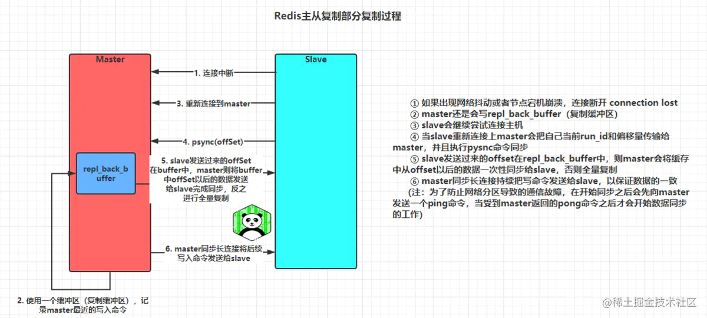

优点：

- 能够为后续的高可用机制打下基础

- 在持久化的基础上能够将数据同步到其他机器，在极端情况下做到灾备的效果

- 能够通过主写从读的形式实现读写分离提升Redis整体吞吐，并且读的性能可以通过对从节点进行线性扩容无限提升

缺点：

- 全量数据同步时如果数据量比较大，在之前会导致线上短暂性的卡顿

- 一旦主节点宕机，从节点晋升为主节点，同时需要修改应用方的主节点地址，还需要命令所有从节点去复制新的主节点，整个过程需要人工干预

- 写入的QPS性能受到主节点限制，虽然主从复制能够通过读写分离来提升整体性能，但是只有从节点能够做到线性扩容升吞吐，写入的性能还是受到主节点限制

- 木桶效应，整个Redis节点群能够存储的数据容量受到所有节点中内存最小的那台限制，比如一主两从架构：master=32GB、slave1=32GB、slave2=16GB，那么整个Redis节点群能够存储的最大容量为16GB

## **redis的内存模型**

Redis的内存模型我们可以通过客户端连接之后使用内存统计命令info memory去查看，如下：

- **used_memory（单位：字节）：** Redis分配器分配的内存总量，包括使用的虚拟内存（稍后会详解）

- **used_memory_rss（单位：字节）：** Redis进程占据操作系统的内存；除了分配器分配的内存之外，used_memory_rss还包括进程运行本身需要的内存、内存碎片等，但是不包括虚拟内存

- **说明：** used_memory是从Redis角度得到的量，used_memory_rss是从操作系统角度得到的量。二者之所以有所不同，一方面是因为内存碎片和Redis进程运行需要占用内存，使得used_memory_rss可能更大；另一方面虚拟内存的存在，使得used_memory可能更大

- **mem_fragmentation_ratio：** 内存碎片比率，该值是used_memory_rss / used_memory；一般大于1，且该值越大，内存碎片比例越大。而小于1，说明Redis使用了虚拟内存，由于虚拟内存的媒介是磁盘，比内存速度要慢很多，当这种情况出现时，应该及时排查，如果内存不足应该及时处理，如增加Redis节点、增加Redis服务器的内存、优化应用等；一般来说，mem_fragmentation_ratio在1.03左右是比较健康的状态（对于jemalloc分配器来说），由于在实际应用中，Redis的数据量会比较大，此时进程运行占用的内存与Redis数据量和内存碎片相比，都会小得多，mem_fragmentation_ratio便成了衡量Redis内存碎片率的参数

- **mem_allocator：** Redis使用的内存分配器，在编译时指定；可以是libc 、jemalloc或tcmalloc，默认是jemalloc

而Redis作为内存数据库，在内存中存储的内容主要是数据，但除了数据以外，Redis的其他部分也会占用内存。Redis的内存占用可以划分为以下几个部分：

- **数据：** 作为数据库，数据是最主要的部分；这部分占用的内存会统计在used_memory中

- **进程本身运行需要的内存：** Redis主进程本身运行肯定需要占用内存，如代码、常量池等等，这部分内存大约几兆，在大多数生产环境中与Redis数据占用的内存相比可以忽略。这部分内存不是由jemalloc分配，因此不会统计在used_memory中。除了主进程外，Redis创建的子进程运行也会占用内存，如Redis执行AOF、RDB重写时创建的子进程。当然，这部分内存不属于Redis进程，也不会统计在used_memory和used_memory_rss中。

- **缓冲内存：** 缓冲内存包括客户端缓冲区、复制积压缓冲区、AOF缓冲区等；其中，客户端缓冲存储客户端连接的输入输出缓冲；复制积压缓冲用于部分复制功能；AOF缓冲区用于在进行AOF重写时，保存最近的写入命令。在了解相应功能之前，不需要知道这些缓冲的细节；这部分内存由jemalloc分配，因此会统计在used_memory中。

- **内存碎片：** 内存碎片是Redis在分配、回收物理内存过程中产生的。例如，如果对数据的更改频繁，而且数据之间的大小相差很大，可能导致Redis释放的空间在物理内存中并没有释放，但Redis又无法有效利用，这就形成了内存碎片。内存碎片不会统 计在used_memory中。

	- 内存碎片的产生与对数据进行的操作、数据的特点等都有关；此外，与使用的内存分配器也有关系：如果内存分配器设计合理，可以尽可能的减少内存碎片的产生。如果Redis服务器中的内存碎片已经很大，可以通过安全重启的方式减小内存碎片：因为重启之后，Redis重新从备份文件中读取数据，在内存中进行重排，为每个数据重新选择合适的内存单元，减小内存碎片。

## **redis的虚拟内存概念**

不鼓励使用

首先说明下Redis的虚拟内存与操作系统虚拟内存不是一码事,但是思路和目的都是相冋的。就是暂时把不经常访问的数据从內存交换到磁盘中,从而腾出宝贵的内存空间。对于Redis这样的内存数据库,内存总是不够用的。除了可以将数据分割到多个Redis实例以外。另外的能够提高数据库容量的办法就是使用虚拟内存技术把那些不经常访问的数据交换到磁盘上。如果我们存储的数据总是有少部分数据被经常访问,大部分数据很少被访问,对于网站来说确实总是只有少量用户经常活跃。当少量数据被经常访问时,使用虚拟内存不但能提高单台 Redis数据库服务器的容量,而且也不会对性能造成太多影响Redis没有使用操作系统提供的虚拟内存机制而是自己在用户态实现了自己的虚拟内存机制。主要的理由有以下两点：

- 一、操作系统的虚拟内存是以4k/页为最小单位进行交换的。而Redis的大多数对象都远小于4k,所以一个操作系统页上可能有多个Redis对象。另外 Redis的集合对象类型如list,set可能行在于多个操作系统页上。最终可能造成只有10%的key被经常访问,但是所有操作系统页都会被操作系统认为是活跃的,这样只有内存真正耗尽时操作系统才会进行页的交换

- 二、相比操作系统的交换方式，Redis可以将被交换到磁盘的对象进行压缩,保存到磁盘的对象可以去除指针和对象元数据信息。一般压缩后的对象会比内存中的对象小10倍。这样Redis的虛拟内存会比操作系统的虚拟内存少做很多I0操作

而关于Redis虚拟内存的配置也存在于redis.conf文件中，如下：

- vm-enabled ves：#开启虚拟内存功能

- vm-swap-file ../redis.swap：#交换出来value保存的文件路径

- Vm-max-memory 268435456：# Redis使用的最大内存上限(256MB),超过上限后Redis开始交换value到磁盘swap文件中。建议设置为系统空闲内存的60%-80%

- vm-page-size 32：#每个 Redis页的大小32个字节

- vm-pages 134217728：#最多在文件中使用多少个页,交换文件的大小

- vm-max-threads 8：#用于执行value对象换入换出的工作线程数量，0表示不使用工作线程(详情后面介绍)。

Redis的虚拟内存在设计上为了保证key的查询速度,只会将value交换到swap文件。如果是由于太多key很小的value造成的内存问题,那么Redis的虚拟内存并不能解决问题。和操作系统一样 Redis也是按页来交换对象的。Redis规定同一个页只能保存一个对象。但是一个对象可以保存在多个页中。在Redis使用的内存没超过vm-max-memory之前是不会交换任何value的。当超过最大内存限制后,Redis会选择把较老的对象交换到swap文件中去。如果两个对象一样老会优先交换比较大的对象,精确的交换计算公式swappability=age*1og(size_Inmemory)。对于vm-page-size的设置应该根据自己应用将页的大小设置为可以容纳大多数对象的尺寸。太大了会浪费磁盘空间,太小了会造成交换文件出现过多碎片。对于交换文件中的每个页, Redis会在内存中用一个1bit值来对应记录页的空闲状态。所以像上面配置中页数量(vm pages134217728)会占用16MB内存用来记录页的空內状态。vm-max-threads表示用做交换任务的工作线程数量。如果大于0推荐设为服务器的cpu的核心数。如果是0则交换过程在上线程进行。具体工作模式如下：

- 阻塞模式(vm-max-threads=0)：

	- 换出：主线程定期检査发现内存超出最大上限后,会直接以阻塞的方式,将选中的对象保存到swap文件中,并释放对象占用的内存空间,此过程会一直重复直到下面条件满足。

		- 内存使用降到最大限制以下

		- swap文件满了

		- 几乎全部的对象都被交换到磁盘了

	- 换入：当有客户端请求已经被换出的value时,主线程会以阳塞的方式从swap文件中加载对应的value对象,加载时此时会阻塞所客户端。然后处理该客户端的请求

- 非阻塞模式(vm-max-threads>0)：

	- 换出：当主线程检测到使用内存超过最大上限,会将选中要父换的对象信息放到一个队列中父给工作线程后台处理,主线程会继续处理客户端请求

	- 换入：如果有客户端请求的key已终被换出了,主线程会先阳塞发出命令的客户端,然后将加载对象的信息放到一个队列中,让工作线程去加载。加载完毕后工作线程通知主线程。主线程再执行客户端的命令。这种方式只阻塞请求的value是已经被 换出key的客户端总的来说阻塞方式的性能会好些,因为不需要线程同步、创建线程和恢复被阻塞的客户端等开销。但是也相应的牺牡了响应性。工作线稈方式主线程不会阳塞在磁盘1O上,所以响应性更好。如果我们的应用不太经常发生换入换出,而且也不太在意有点延迟的话推荐使用阻塞方式（

## **redis的共享对象概念**

- 在RedisObject对象中有一个refcount，refcount记录的是该对象被引用的次数，类型为整型。refcount的作用，主要在于对象的引用计数和内存回收。当创建新对象时，refcount初始化为1；当有新程序使用该对象时，refcount加1；当对象不再被一个新程序使用时，refcount减1；当refcount变为0时，对象占用的内存会被释放。

Redis中被多次使用的对象(refcount>1)，称为共享对象。Redis为了节省内存，当有一些对象重复出现时，新的程序不会创建新的对象，而是仍然使用原来的对象。这个被重复使用的对象，就是共享对象。目前共享对象仅支持整数值的字符串对象。 - 共享对象的具体实现：

Redis的共享对象目前只支持整数值的字符串对象。之所以如此，实际上是对内存和CPU（时间）的平衡：共享对象虽然会降低内存消耗，但是判断两个对象是否相等却需要消耗额外的时间。对于整数值，判断操作复杂度为O(1)；对于普通字符串，判断复杂度为O(n)；而对于哈希、列表、集合和有序集合，判断的复杂度为O(n^2)。 虽然共享对象只能是整数值的字符串对象，但是5种类型都可能使用共享对象（如哈希、列表等的元素可以使用）。

就目前的实现来说，Redis服务器在初始化时，会创建10000个字符串对象，值分别是0-9999的整数值；当Redis需要使用值为0-9999的字符串对象时，可以直接使用这些共享对象。10000这个数字可以通过调整参数Redis_SHARED_INTEGERS（4.0中是OBJ_SHARED_INTEGERS）的值进行改变。

共享对象的引用次数可以通过object refcount命令查看。

## **redis的哨兵机制**

- 一、每个哨兵节点每10秒会向主节点和从节点发送info命令获取最级联结构图，哨兵配置时只要配置对主节点的监控即可，通过向主节点发送info，获取从节点的信息，并当有新的从节点加入时可以马上感知到

- 二、每个哨兵节点每隔2秒会向Redis数据节点的指定频道上发送该哨兵节点对于主节点的判断以及当前哨兵节点的信息，同时每个哨兵节点也会订阅该频道，来了解其它哨兵节点的信息及对主节点的判断，其实就是通过消息publish和subscribe来完成的

- 三、隔1秒每个哨兵根据自己info获取的级联结构信息，会向主节点、从节点及其余哨兵节点发送一次ping命令做一次心跳检测，这个也是哨兵用来判断节点是否正常的重要依据

- 四、Sentinel会以每秒一次的频率向所有与其建立了命令连接的实例（master、salve、其他Sentinel）发ping命令，通过判断ping回复是有效回复还是无效回复来判断实例是否在线/存活（对该Sentinel来说是“主观在线”），Sentinel配置文件中的down-after-milliseconds设置了判断主观下线的时间长度，如果实例在down-after-milliseconds毫秒内，返回的都是无效回复，那么Sentinel会认为该实例已（主观）下线，修改其flags状态为SRI_S_DOWN。如果多个Sentinel监视一个服务，有可能存在多个Sentinel的down-after-milliseconds配置不同，这个在实际生产中要注意（主观下线：所谓主观下线，就是单个Sentinel认为某个实例下线（有可能是接收不到订阅，之间的网络不通等等原因））

- 五、当主观下线的节点是主节点时，此时该哨兵3节点会通过指令sentinel is-masterdown-by-addr寻求其它哨兵节点对主节点的判断，如果其他的哨兵也认为主节点主观下线了，则当认为主观下线的票数超过了quorum（选举）个数，此时哨兵节点则认为该主节点确实有问题，这样就客观下线了，大部分哨兵节点都同意下线操作，也就说是客观下线，一般情况下，每个Sentinel会以每10秒一次的频率向它已知的所有主服务器和从服务器发送INFO命令，当一个主服务器被标记为客观下线时，Sentinel向下线主服务器的所有从服务器发送INFO命令的频率，会从10秒一次改为每秒一次

- 六、Sentinel和其他Sentinel协商客观下线的主节点的状态，如果处于SDOWN状态，则自动选出新的主节点，将剩余从节点指向新的主节点进行数据复制

新主选举原理（自动故障转移）：Sentinel状态数据结构中保存了主服务的所有从服务信息，领头Sentinel按照如下的规则从从服务列表中挑选出新的主服务：

- 过滤掉主观下线的节点

- 选择slave-priority最高的节点，如果有则返回没有就继续选择

- 选择出复制偏移量最大的系节点，因为复制便宜量越大则数据复制的越完整，如果有就返回了，没有就继续下一步

- 选择run_id最小的节点

- 通过slaveof no one命令，让选出来的从节点成为主节点；并通过slaveof命令让其他节点成为其从节点

- 将已下线的主节点设置成新的主节点的从节点，当其回复正常时，复制新的主节点，变成新的主节点的从节点，同理，当已下线的服务重新上线时，Sentinel会向其发送slaveof命令，让其成为新主的从

哨兵lerder选举流程：如果主节点被判定为客观下线之后，就要选取一个哨兵节点来完成后面的故障转移工作，选举出一个leader的流程如下：

- 每个在线的哨兵节点都可以成为领导者，当它确认主节点下线时，会向其它哨兵发is-master-down-by-addr命令，征求判断并要求将自己设置为领导者，由领导者处理故障转移

- 当其它哨兵收到此命令时，可以同意或者拒绝它成为领导者

- 如果征求投票的哨兵发现自己在选举的票数大于等于num(sentinels)/2+1时，将成为领导者，如果没有超过，继续重复选举…………

服务下线注意事项：

- 主观下线：单个哨兵节点认为某个节点故障时出现的情况，一般出现主观下线的节点为从节点时，不需要与其他哨兵协商，当前哨兵可直接对改节点完成下线操作

- 客观下线：当一个节点被哨兵判定为主观下线时，这个节点是主节点，那么会和其他哨兵协商完成下线操作的情况被称为客观下线（客观下线只存在于主节点）

哨兵机制优点：

- 解决了之前主从切换需要人工干预问题，保证了一定意义上的高可用

哨兵机制缺点：

- 全量数据同步仍然会导致线上出现短暂卡顿

- 写入QPS仍然受到主节点单机限制，对于写入并发较高的项目无法满足需求

- 仍然存在主从复制时的木桶效应问题，存储容量受到节点群中最小内存机器限制

## **redis cluster**

Redis Cluster要求至少需要3个master才能组成一个集群，同时每个master至少需要有一个slave节点。各个节点之间保持TCP通信。当master发生了宕机， Redis Cluster自动会将对应的slave节点提拔为master，来重新对外提供服务。

Redis Cluster 功能 ： 负载均衡，故障切换，主从复制 。

当redis客户端设置值时，会拿key进行CRC16算法，然后 跟16384取模，得到的就是落在哪个槽位，根据上面表格就得出在哪台节点上。槽公式如下：

slot = CRC16(key) & 16383

集群机器等数据信息通常有两种方式，一种是集中式，比如springcloud服务集群信息保存在配置中心 。另一种就是redis的方式，gossip。

集中式：好处在于，元数据的更新和读取，时效性非常好，一旦元数据出现了变更，立即就更新到集中式的存储中，其他节点读取的时候立即就可以感知到; 不好在于，所有的元数据的跟新压力全部集中在一个地方，可能会导致元数据的存储有压力。

gossip：好处在于，元数据的更新比较分散，不是集中在一个地方，更新请求会陆陆续续，打到所有节点上去更新，有一定的延时，降低了压力; 缺点，元数据更新有延时，可能导致集群的一些操作会有一些滞后。

通信的端口就是本身redis监听端口+10000 ，比如 监听端口6379，通信端口就是16379 。

Gossip协议的主要职责就是信息交换。信息交换的载体就是节点彼此发送的Gossip消息，常用的Gossip消息可分为：ping消息、pong消息、meet消息、fail消息等。

- meet消息：用于通知新节点加入。消息发送者通知接收者加入到当前集群，meet消息通信正常完成后，接收节点会加入到集群中并进行周期性的ping、pong消息交换。

- ping消息：集群内交换最频繁的消息，集群内每个节点每秒向多个其他节点发送ping消息，用于检测节点是否在线和交换彼此状态信息。ping消息发送封装了自身节点和部分其他节点的状态数据。

- pong消息：当接收到ping、meet消息时，作为响应消息回复给发送方确认消息正常通信。pong消息内部封装了自身状态数据。节点也可以向集群内广播自身的pong消息来通知整个集群对自身状态进行更新。

- fail消息：当节点判定集群内另一个节点下线时，会向集群内广播一个fail消息，其他节点接收到fail消息之后把对应节点更新为下线状态。

JedisCluster配置只用指定集群中某一个节点的IP，端口信息就可以了。JedisCluster初始化时，会找配置的节点获取整个集群的信息（cluster nodes命令）。

解析集群信息，得到集群中所有master信息，然后遍历每台master，通过ip，端口构建jedis实例，然后put到一个全局nodes变量里面（Map类型） ， key为ip，端口，值为Jedis实例,nodes值如下：

nodes={172.19.93.120:6380=redis.clients.jedis.JedisPool@74ad1f1f,.....}

在上面遍历master过程中，还做一件事，遍历此台master负责的槽索引，然后又put到一个全局map slots里面。值为上面的Jedis实例， slots值如下：

slots={0=redis.clients.jedis.JedisPool@74ad1f1f,
1=redis.clients.jedis.JedisPool@74ad1f1f,
2=redis.clients.jedis.JedisPool@74ad1f1f,
....
5461 = redis.clients.jedis.JedisPool@65aa1f2f,    ####另外的master机器
....
16383=redis.clients.jedis.JedisPool@756d1afd}

有了上面的slots变量，当有值set 时， 会先算出slot = getCRC16(key)&(16383-1)，假如是12182 ， 然后调用slots.get(12182) 得到jedis实例，然后去操作redis。

如果发现MovedDataException,说明初始化得到的槽位与节点的对应关系有问题，（节点新增或者宕机）就会重置slots

## **redis的跳表的实现**

## **redis的压缩列表的实现**

## **redis的io多路复用**

Redis 封装了 4 种多路复用程序，每种封装实现都提供了相同的 API 实现。编译时，会按照性能和系统平台，选择最佳的 IO 多路复用函数作为底层实现，选择顺序是，首先尝试选择 Solaries 中的 evport，如果没有，就尝试选择 Linux 中的 epoll，否则就选择大多 UNIX 系统都支持的 kqueue，这 3 个多路复用函数都直接使用系统内核内部的结构，可以服务数十万的文件描述符。

如果当前编译环境没有上述函数，就会选择 select 作为底层实现方案。select 方案的性能较差，事件发生时，会扫描全部监听的描述符，事件复杂度是 O(n)，并且只能同时服务有限个文件描述符，32 位机默认是 1024 个，64 位机默认是 2048 个，所以一般情况下，并不会选择 select 作为线上运行方案。Redis 的这 4 种实现，分别在 ae_evport、ae_epoll、ae_kqueue 和 ae_select 这 4 个代码文件中。

## **redis的文件事件**

Redis 中的文件事件分派器是 aeProcessEvents 函数。它会首先计算最大可以等待的时间，然后利用 aeApiPoll 等待文件事件的发生。如果在等待时间内，一旦 IO 多路复用程序产生了事件通知，则会立即轮询所有已产生的文件事件，并将文件事件放入 aeEventLoop 中的 aeFiredEvents 结构数组中。每个 fired event 会记录 socket 及 Redis 读写事件类型。

这里会涉及将多路复用中的事件类型，转换为 Redis 的 ae 事件驱动模型中的事件类型。以采用 Linux 中的 epoll 为例，会将 epoll 中的 EPOLLIN 转为 AE_READABLE 类型，将 epoll 中的 EPOLLOUT、EPOLLERR 和 EPOLLHUP 转为 AE_WRITABLE 事件。

aeProcessEvents 在获取到触发的事件后，会根据事件类型，将文件事件 dispatch 派发给对应事件处理函数。如果同一个 socket，同时有读事件和写事件，Redis 派发器会首先派发处理读事件，然后再派发处理写事件。

文件事件处理函数分类

Redis 中文件事件函数的注册和处理主要分为 3 种。

连接处理函数 acceptTcpHandler

Redis 在启动时，在 initServer 中对监听的 socket 注册读事件，事件处理器为 acceptTcpHandler，该函数在有新连接进入时，会被派发器派发读任务。在处理该读任务时，会 accept 新连接，获取调用方的 IP 及端口，并对新连接创建一个 client 结构。如果同时有大量连接同时进入，Redis 一次最多处理 1000 个连接请求。

readQueryFromClient 请求处理函数

连接函数在创建 client 时，会对新连接 socket 注册一个读事件，该读事件的事件处理器就是 readQueryFromClient。在连接 socket 有请求命令到达时，IO 多路复用程序会获取并触发文件事件，然后这个读事件被派发器派发给本请求的处理函数。readQueryFromClient 会从连接 socket 读取数据，存入 client 的 query 缓冲，然后进行解析命令，按照 Redis 当前支持的 2 种请求格式，及 inline 内联格式和 multibulk 字符块数组格式进行尝试解析。解析完毕后，client 会根据请求命令从命令表中获取到对应的 redisCommand，如果对应 cmd 存在。则开始校验请求的参数，以及当前 server 的内存、磁盘及其他状态，完成校验后，然后真正开始执行 redisCommand 的处理函数，进行具体命令的执行，最后将执行结果作为响应写入 client 的写缓冲中。

命令回复处理器 sendReplyToClient

当 redis需要发送响应给client时，Redis 事件循环中会对client的连接socket注册写事件，这个写事件的处理函数就是sendReplyToClient。通过注册写事件，将 client 的socket与 AE_WRITABLE 进行间接关联。当 Client fd 可进行写操作时，就会触发写事件，该函数就会将写缓冲中的数据发送给调用方。

## **redis的时间事件**

Redis 中的时间事件是指需要在特定时间执行的事件。多个 Redis 中的时间事件构成 aeEventLoop 中的一个链表，供 Redis 在 ae 事件循环中轮询执行。

Redis 当前的主要时间事件处理函数有 2 个：

- serverCron

- moduleTimerHandler

Redis 中的时间事件分为 2 类：

- 单次时间，即执行完毕后，该时间事件就结束了。

- 周期性事件，在事件执行完毕后，会继续设置下一次执行的事件，从而在时间到达后继续执行，并不断重复。

时间事件主要有 5 个属性组成。

- 事件 ID：Redis 为时间事件创建全局唯一 ID，该 ID 按从小到大的顺序进行递增。

- 执行时间 when_sec 和 when_ms：精确到毫秒，记录该事件的到达可执行时间。

- 时间事件处理器 timeProc：在时间事件到达时，Redis 会调用相应的 timeProc 处理事件。

- 关联数据 clientData：在调用 timeProc 时，需要使用该关联数据作为参数。

- 链表指针 prev 和 next：它用来将时间事件维护为双向链表，便于插入及查找所要执行的时间事件。

时间事件的处理是在事件循环中的 aeProcessEvents 中进行。执行过程是：

1. 首先遍历所有的时间事件。

1. 比较事件的时间和当前时间，找出可执行的时间事件。

1. 然后执行时间事件的 timeProc 函数。

1. 执行完毕后，对于周期性时间，设置时间新的执行时间；对于单次性时间，设置事件的 ID为 -1，后续在事件循环中，下一次执行 aeProcessEvents 的时候从链表中删除。

## **redis持久化的键值过期怎么判定的 **

**RDB 中的过期键**

RDB 文件分为两个阶段，RDB 文件生成阶段和加载阶段。

**1. RDB 文件生成**

从内存状态持久化成 RDB（文件）的时候，会对 key 进行过期检查，过期的键不会被保存到新的 RDB 文件中，因此 Redis 中的过期键不会对生成新 RDB 文件产生任何影响。

**2. RDB 文件加载**

RDB 加载分为以下两种情况：

- 如果 Redis 是主服务器运行模式的话，在载入 RDB 文件时，程序会对文件中保存的键进行检查，过期键不会被载入到数据库中。所以过期键不会对载入 RDB 文件的主服务器造成影响；

- 如果 Redis 是从服务器运行模式的话，在载入 RDB 文件时，不论键是否过期都会被载入到数据库中。但由于主从服务器在进行数据同步时，从服务器的数据会被清空。所以一般来说，过期键对载入 RDB 文件的从服务器也不会造成影响。

***AOF 中的过期键***

**1. AOF 文件写入**

当 Redis 以 AOF 模式持久化时，如果数据库某个过期键还没被删除，那么 AOF 文件会保留此过期键，当此过期键被删除后，Redis 会向 AOF 文件追加一条 DEL 命令来显式地删除该键值。

**2. AOF 重写**

执行 AOF 重写时，会对 Redis 中的键值对进行检查已过期的键不会被保存到重写后的 AOF 文件中，因此不会对 AOF 重写造成任何影响。

***主从库的过期键***

当 Redis 运行在主从模式下时，从库不会进行过期扫描，从库对过期的处理是被动的。也就是即使从库中的 key 过期了，如果有客户端访问从库时，依然可以得到 key 对应的值，像未过期的键值对一样返回。

从库的过期键处理依靠主服务器控制，主库在 key 到期时，会在 AOF 文件里增加一条 del 指令，同步到所有的从库，从库通过执行这条 del 指令来删除过期的 key。

## **redis的“发布订阅模式”**

直接使用publish 和  subscribe

发布订阅模式存在以下两个缺点：

1. 无法持久化保存消息，如果 Redis 服务器宕机或重启，那么所有的消息将会丢失；

1. 发布订阅模式是“发后既忘”的工作模式，如果有订阅者离线重连之后不能消费之前的历史消息。

然而这些缺点在 Redis 5.0 添加了 Stream 类型之后会被彻底的解决。

除了以上缺点外，发布订阅模式还有另一个需要注意问题：当消费端有一定的消息积压时，也就是生产者发送的消息，消费者消费不过来时，如果超过 32M 或者是 60s 内持续保持在 8M 以上，消费端会被强行断开，这个参数是在配置文件中设置的，默认值是 client-output-buffer-limit pubsub 32mb 8mb 60。

List 优点：

- 消息可以被持久化，借助 Redis 本身的持久化（AOF、RDB 或者是混合持久化），可以有效的保存数据；

- 消费者可以积压消息，基于 brpop实现阻塞读取不会因为客户端的消息过多而被强行断开。

List 缺点：

- 消息不能被重复消费，一个消息消费完就会被删除；

- 没有主题订阅的功能。

ZSet 版消息队列相比于之前的两种方式，List 和发布订阅方式在实现上要复杂一些，但 ZSet 因为多了一个 score（分值）属性，从而使它具备更多的功能，例如我们可以用它来存储时间戳，以此来实现延迟消息队列等。

它的实现思路和 List 相同也是利用 zadd 和 zrangebyscore 来实现存入和读取，这里就不重复叙述了，读者可以根据 List 的实现方式来实践一下，看能不能实现相应的功能，如果写不出来也没关系，本课程的后面章节，介绍延迟队列的时候会用 ZSet 来实现。

***优缺点分析***

ZSet 优点：

- 支持消息持久化；

- 相比于 List 查询更方便，ZSet 可以利用 score 属性很方便的完成检索，而 List 则需要遍历整个元素才能检索到某个值。

ZSet 缺点：

- ZSet 不能存储相同元素的值，也就是如果有消息是重复的，那么只能插入一条信息在有序集合中；

- ZSet 是根据 score 值排序的，不能像 List 一样，按照插入顺序来排序；

- ZSet 没有向 List 的 brpop 那样的阻塞弹出的功能。

## redis的阻塞点

Redis 的**第一个阻塞点：集合全量查询和聚合操作**

**bigkey 删除操作就是 Redis 的第二个阻塞点**

**Redis 的第三个阻塞点：清空数据库**。

Redis 的**第四个阻塞点了：AOF 日志同步写**

**加载 RDB 文件就成为了 Redis 的第五个阻塞点,需要flush db**

## **redis6的新特性**

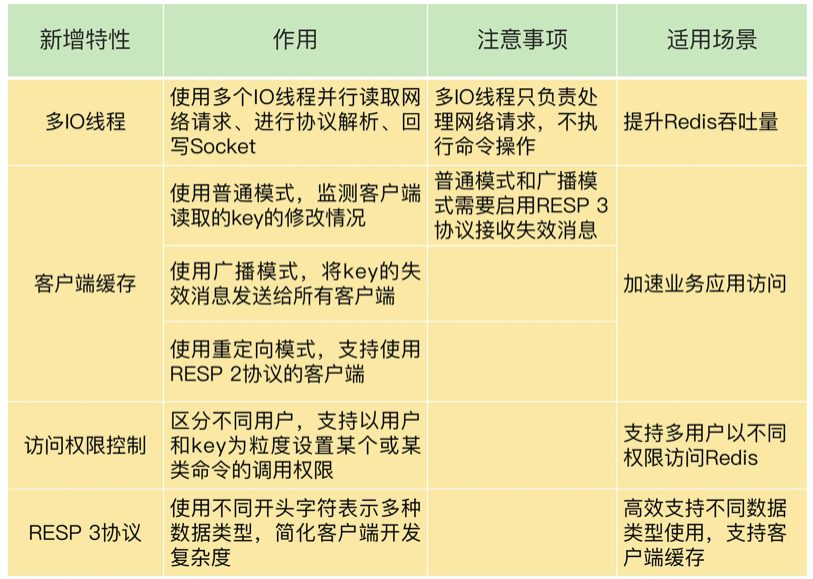

## redis如何进行性能优化

edis内存使用情况：info memory

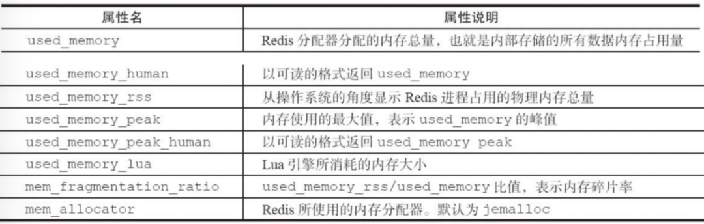

[https://mp.weixin.qq.com/s?__biz=MzIyNDU2ODA4OQ==&mid=2247484460&idx=1&sn=fbe1377d2e51451311aa910c92de022a&chksm=e80db25adf7a3b4c9d3b38c5c3c73e6ce97dbbcf8c8249acddc452352bf771f28a5ad82c02b1&scene=178&cur_album_id=1793728691378667521#rd](https://mp.weixin.qq.com/s?__biz=MzIyNDU2ODA4OQ==&mid=2247484460&idx=1&sn=fbe1377d2e51451311aa910c92de022a&chksm=e80db25adf7a3b4c9d3b38c5c3c73e6ce97dbbcf8c8249acddc452352bf771f28a5ad82c02b1&scene=178&cur_album_id=1793728691378667521#rd)

## redis使用的基础坑

[https://www.zhihu.com/question/57045322/answer/1931497548](https://www.zhihu.com/question/57045322/answer/1931497548)

## Redis大页

Redis大页功能是针对使用Linux系统的Redis用户。它可以让Redis使用大页技术来优化内存使用和性能。

大页是一种内存页的大小，与标准页大小（通常是4KB）不同。在Linux系统中，大页通常是2MB或1GB。使用大页可以减少页表的大小，从而减少管理内存所需的CPU时间和内存开销。此外，大页还可以提升内存访问性能，因为它可以减少TLB（翻译后备缓存）缓存失效的次数。

Redis透明大页功能可以自动配置操作系统和Redis配置文件，以启用大页技术。要使用此功能，需要Root权限。可以使用以下命令来启用透明大页：

```
echo always > /sys/kernel/mm/transparent_hugepage/enabled
```

此外，还可以在Redis配置文件中添加以下行：

```
transparent-huge-pages yes
```

这将启用透明大页功能，并在Redis服务器启动时自动配置大页。在使用Redis透明大页时，需要确保系统的内存足够大，可以支持大页的分配和使用。

## redis的单线程模型

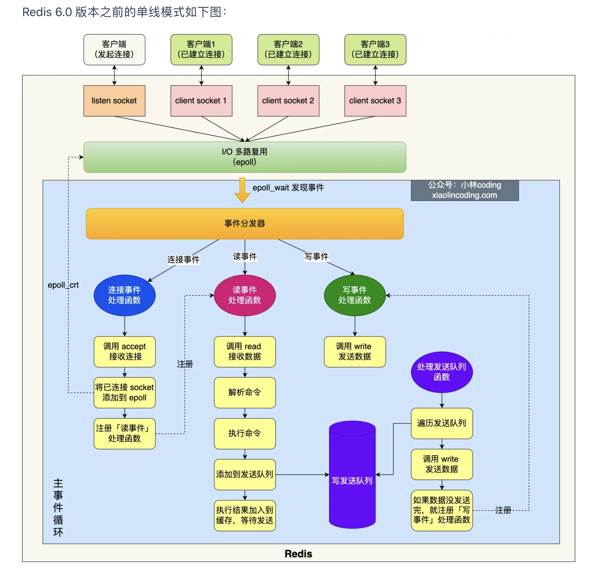

图中的蓝色部分是一个事件循环，是由主线程负责的，可以看到网络 I/O 和命令处理都是单线程。 Redis 初始化的时候，会做下面这几件事情：

- 首先，调用 epoll_create() 创建一个 epoll 对象和调用 socket() 创建一个服务端 socket

- 然后，调用 bind() 绑定端口和调用 listen() 监听该 socket；

- 然后，将调用 epoll_ctl() 将 listen socket 加入到 epoll，同时注册「连接事件」处理函数。

初始化完后，主线程就进入到一个**事件循环函数**，主要会做以下事情：

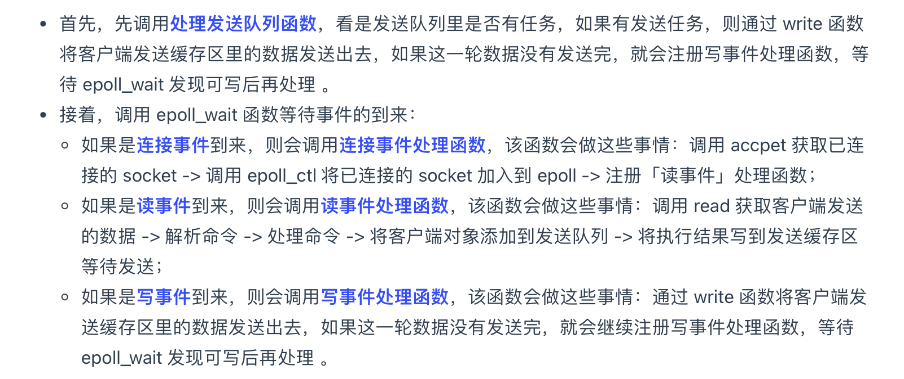

## redis多线程情况下的线程及作用

因此， Redis 6.0 版本之后，Redis 在启动的时候，默认情况下会**额外创建 6 个线程**（**这里的线程数不包括主线程**）：

- Redis-server ： Redis的主线程，主要负责执行命令；

- bio_close_file、bio_aof_fsync、bio_lazy_free：三个后台线程，分别异步处理关闭文件任务、AOF刷盘任务、释放内存任务；

- io_thd_1、io_thd_2、io_thd_3：三个 I/O 线程，io-threads 默认是 4 ，所以会启动 3（4-1）个 I/O 多线程，用来分担 Redis 网络 I/O 的压力。

## AOF文件的格式

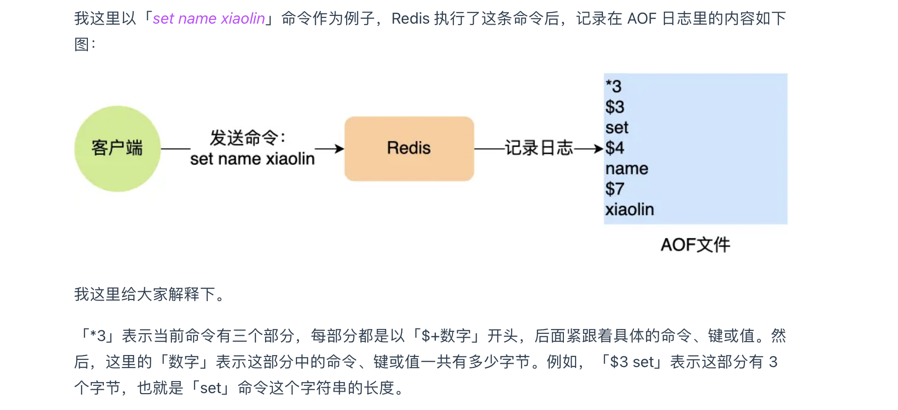

## Redis 持久化时，对过期键会如何处理的？

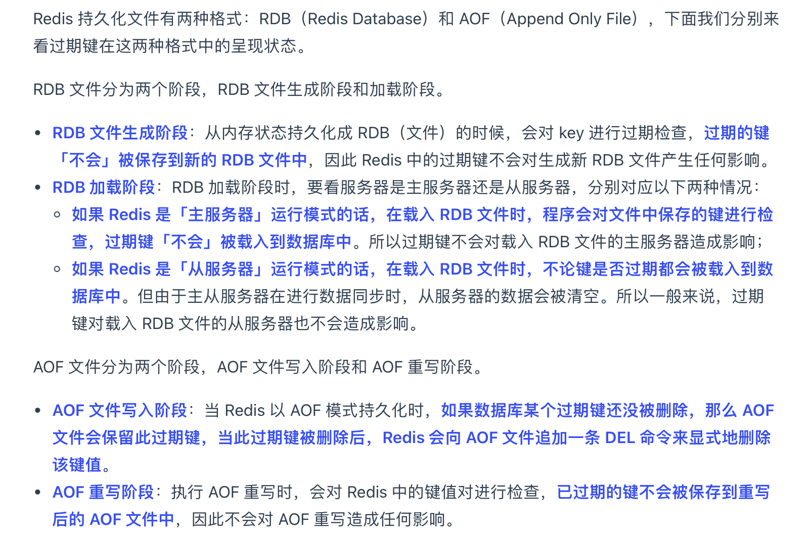

## redis为什么快

一、Redis完全基于内存

二、Redis整个结构类似于HashMap，查找和操作复杂度为O(1)，不需要和MySQL查找数据一样需要产生随机磁盘IO或者全表

三、Redis对于客户端的处理是单线程的，采用单线程处理所有客户端请求，避免了多线程的上下文切换和线程竞争造成的开销

四、底层采用select/epoll多路复用的高效非阻塞IO模型

五、客户端通信协议采用RESP，简单易读，避免了复杂请求的解析开销

## redis的watch

可以对执行事务exec的指令进行回滚

## redis的monitor命令

可以监控redis中执行的命令，用来观察框架执行的redis语句或分析，开启会影响性能
