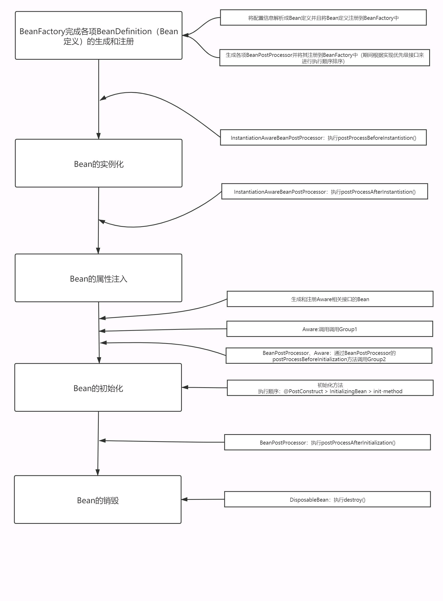
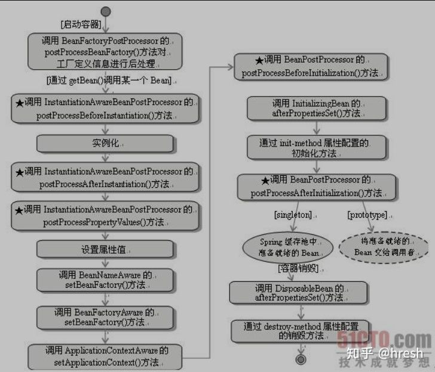
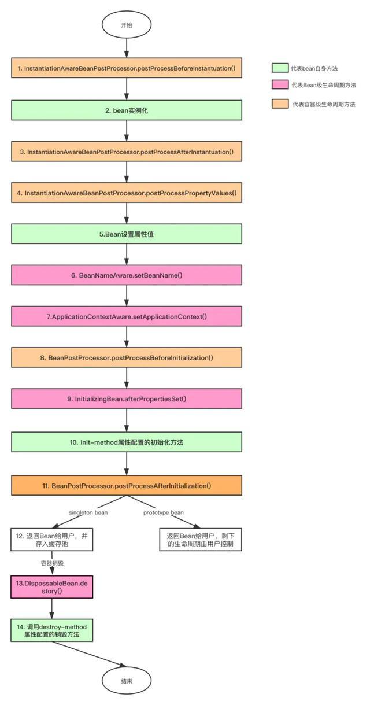
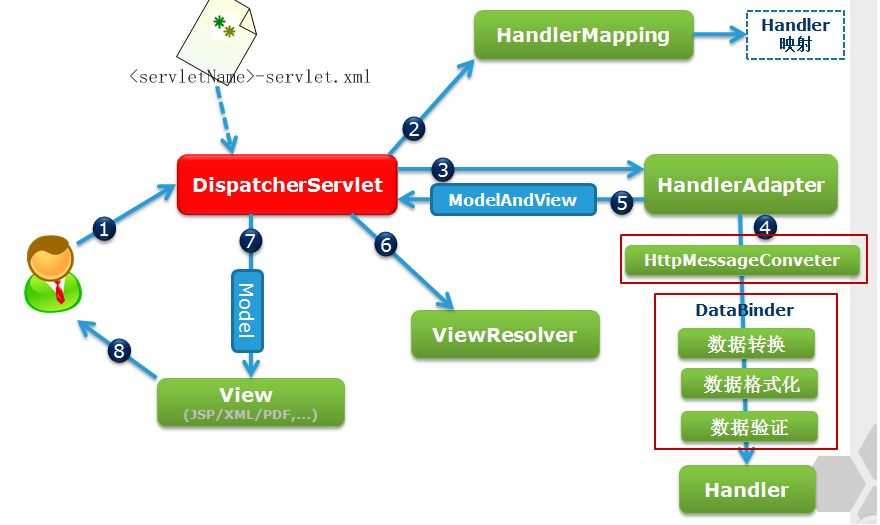
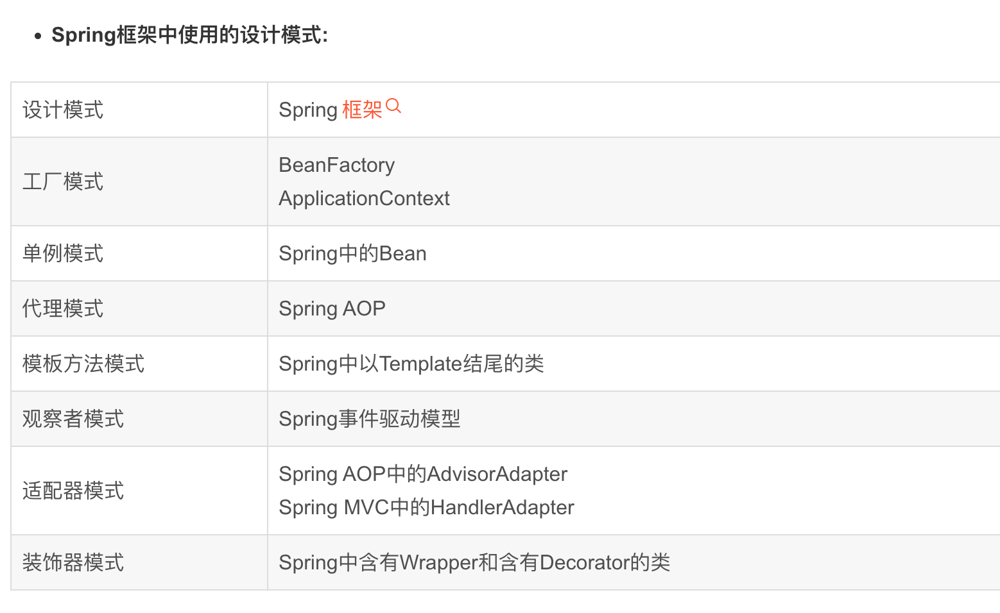
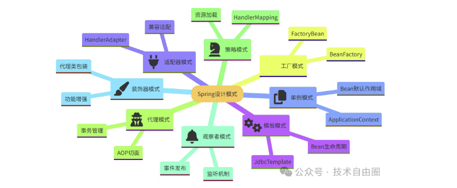
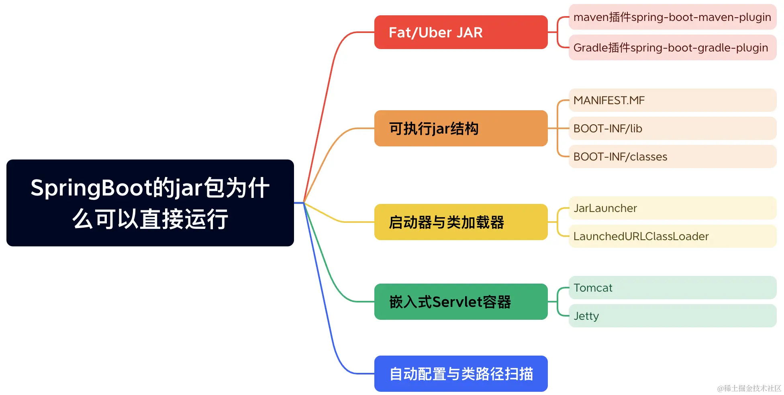
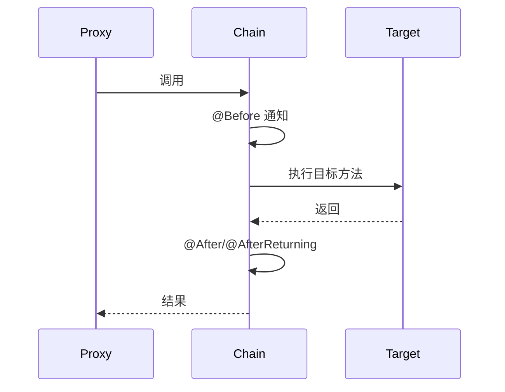
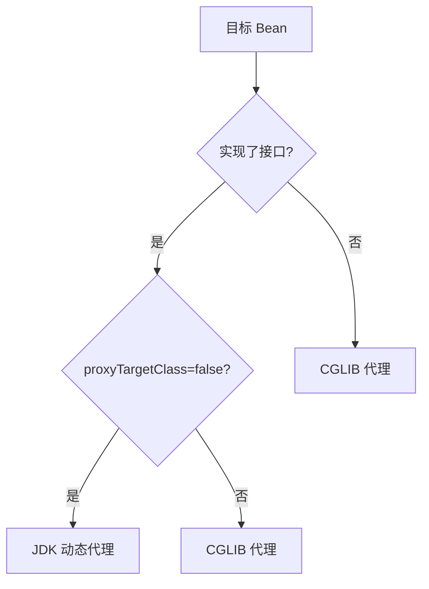
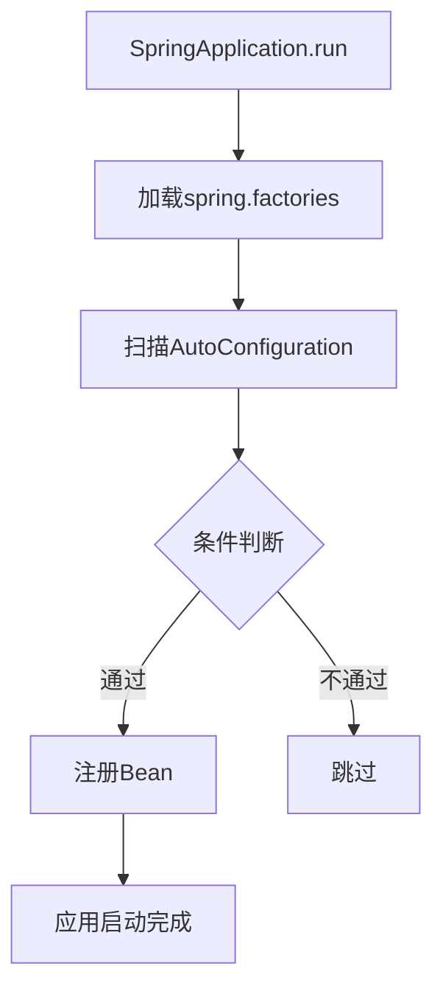

# Spring

## Spring Bean 的几个处理扩展方法

1. Bean 自身的方法：比如构造函数、getter/setter 以及 init-method 和 destory-method 所指定的方法等。
2. Bean 级生命周期方法：可以理解为 Bean 类直接实现接口的方法，比如 BeanNameAware、BeanFactoryAware、ApplicationContextAware、InitializingBean、DisposableBean 等方法，这些方法只对当前 Bean 生效。
3. 容器级的方法（BeanPostProcessor 一系列接口）：主要是后处理器方法，比如上图的 InstantiationAwareBeanPostProcessor、BeanPostProcessor 接口方法。这些接口的实现类是独立于 bean 的，并且会注册到 Spring 容器中。在 Spring 容器创建任何 Bean 的时候，这些后处理器都会发生作用。
4. 工厂后处理器方法（BeanFactoryProcessor 一系列接口）：包括 AspectJWeavingEnabler、CustomAutowireConfigurer、ConfigurationClassPostProcessor 等。这些都是 Spring 框架中已经实现好的 BeanFactoryPostProcessor，用来实现某些特定的功能。



> 图：Spring Bean 生命周期示意



> 图：Spring Bean 生命周期扩展方法示意（一）



> 图：Spring Bean 生命周期扩展方法示意（二）

## Spring MVC 的整体流程



> 图：Spring MVC 整体流程

## Spring 循环依赖源码解析

```java
// 一级缓存
private final Map singletonObjects = new ConcurrentHashMap<>(256);
// 二级缓存
private final Map earlySingletonObjects = new HashMap<>(16);
// 三级缓存
private final Map> singletonFactories = new HashMap<>(16);

protected Object getBean(final String beanName) {
    // !以下为getSingleton逻辑！
    // 先从一级缓存获取
    Object single = singletonObjects.get(beanName);
    if (single != null) {
        return single;
    }
    // 再从二级缓存获取
    single = earlySingletonObjects.get(beanName);
    if (single != null) {
        return single;
    }
    // 从三级缓存获取objectFactory
    ObjectFactory objectFactory = singletonFactories.get(beanName);
    if (objectFactory != null) {
        single = objectFactory.get();
        // 升到二级缓存
        earlySingletonObjects.put(beanName, single);
        singletonFactories.remove(beanName);
        return single;
    }
    // !以上为getSingleton逻辑！

    // ！以下为doCreateBean逻辑
    // 缓存完全拿不到，需要创建
    // 创建实例
    Object beanInstance = createBeanInstance(beanName);
    // 实例创建之后，放入三级缓存
    singletonFactories.put(beanName, () -> return beanInstance);
    // 依赖注入，会触发依赖的bean的getBean方法
    populateBean(beanName, beanInstance);
    // 初始化方法调用
    initializeBean(beanName, beanInstance);

    // 依赖注入完之后，如果二级缓存有值，说明出现了循环依赖
    // 这个时候直接取二级缓存中的bean实例
    Object earlySingletonReference = earlySingletonObjects.get(beanName);
    if (earlySingletonReference != null) {
        beanInstance = earlySingletonObject;
    }
    // ！以上为doCreateBean逻辑

    // 从二三缓存移除，放入一级缓存
    singletonObjects.put(beanName, beanInstance);
    earlySingletonObjects.remove(beanName);
    singletonFactories.remove(beanName);

    return beanInstance;
}
```

## Spring 涉及的设计模式



> 图：Spring 设计模式示意（一）



> 图：Spring 设计模式示意（二）

## 对 Spring 的 IOC 和 AOP 的理解

Spring 的 IOC 包含两种实现方式：DI（依赖注入）和 DL（依赖查找）。

DL 分两种：依赖拖曳（Dependency Pull）、上下文查找。

## 对 Spring 的循环依赖和 Bean 生命周期相关的比较好的博主

[Spring 循环依赖与 Bean 生命周期（掘金）](https://juejin.cn/post/7213307533279199292#heading-11)

## Spring 事务详解

[Spring 事务详解（掘金）](https://juejin.cn/post/7208479235132244023)

## 熔断框架

取代了原先的 Netflix Hystrix，官网停止维护了。

Resilience4j 是一个轻量级、易于使用的“容错”包。它受 Netflix Hystrix 启发但只有一个依赖（Vavr），而不像 Hystrix 有很多很多的依赖。

Resilience4j 在“容错”方面提供了各种模式：断路器（Circuit Breaker）、重试（Retry）、限时器（Time Limiter）、限流器（Rate Limiter）、隔板（BulkHead）。

[Resilience4j 介绍（知乎）](https://zhuanlan.zhihu.com/p/583585713?utm_id=0)

## Spring Boot 项目为什么能一键启动



> 图：Spring Boot 一键启动原理

## 实现多数据源切换

核心是 AbstractRoutingDataSource 这个类，这个是 spring-jdbc 自带的。

## Spring Modulith（模块化单体）

## AOP 原理深度

AOP（面向切面编程）基于**动态代理**与**责任链**实现：

- **JDK 动态代理**：目标类实现接口时，生成接口代理，拦截 `invoke`；
- **CGLIB**：无接口时继承目标类生成子类，`MethodInterceptor` 拦截；Spring Boot 2.x 起默认 CGLIB。
- **织入（Weaving）**：Spring 在 Bean 初始化后（`postProcessAfterInitialization`）用 `AbstractAutoProxyCreator` 决定是否创建代理。
- **责任链执行**：一个方法上的多个 Advisor 组成拦截器链（`ReflectiveMethodInvocation`），依次 `proceed()` 嵌套执行，形成前置→目标→后置的环绕。



切点表达式：`execution(* com.x..*Service.*(..))`、`@annotation(Log)`、`within`、`this/ target`。

## Spring 事务传播行为（7 种）

| 传播行为 | 行为 |
| --- | --- |
| `REQUIRED`（默认） | 有事务加入，无则新建 |
| `REQUIRES_NEW` | 挂起当前事务，新建独立事务（内外互不回滚） |
| `SUPPORTS` | 有则加入，无则以非事务运行 |
| `NOT_SUPPORTED` | 挂起事务，非事务执行 |
| `MANDATORY` | 必须有事务，否则抛异常 |
| `NEVER` | 必须无事务，否则抛异常 |
| `NESTED` | 当前事务内嵌保存点子事务，回滚只到保存点 |

关键点：**自调用失效**——同类方法互调不经过代理，事务/`@Async`/`@Cacheable` 不生效；需注入自身代理或拆类。

## Bean 生命周期（完整链路）

`BeanDefinition` 加载 → `BeanFactoryPostProcessor`(改 BD) → 实例化 → `BeanPostProcessor.postProcessBeforeInitialization` → `@PostConstruct` / `InitializingBean.afterPropertiesSet` → 自定义 init-method → `postProcessAfterInitialization`(AOP 在此) → 就绪 → 销毁 `@PreDestroy` / `DisposableBean.destroy`。

## 常见坑与面试高频

1. **循环依赖**：Spring 用**三级缓存**（`singletonObjects`/`earlySingletonObjects`/`singletonFactories`）解决单例 setter/字段注入；**构造器注入无法解决**（抛 `BeanCurrentlyInCreationException`）。
2. **事务失效场景**：自调用、非 public 方法、异常被 catch 吞掉、数据库引擎不支持（MyISAM）、数据源未交由 Spring 事务管理。
3. **`@Transactional` 只读**：查询方法设 `readOnly=true` 可提示数据库优化（如 MySQL 只读连接）。
4. **Bean 作用域**：`singleton`（默认，容器内单例）/ `prototype`（每次新）/ `request`、`session`、`application`（Web）。
5. **`ApplicationContext` vs `BeanFactory`**：前者是后者的超集，预初始化单例、支持事件/国际化/AOP 等。

---

# 第二轮深度优化：扩展点 / 事件 / 事务失效 / 条件装配 / WebFlux / 自动配置

## 一、BeanPostProcessor 与 FactoryBean 扩展点

- **`BeanPostProcessor`**：Bean 初始化前后钩子 `postProcessBeforeInitialization` / `postProcessAfterInitialization`，返回的对象即最终 Bean（可包装/代理）。AOP（`AnnotationAwareAspectJAutoProxyCreator`）、`@Autowired`（`AutowiredAnnotationBeanPostProcessor`）、`@PostConstruct` 都靠它实现。可自定义做统一处理（如给全部 Bean 打监控标签、校验配置）。
- **`InstantiationAwareBeanPostProcessor`**：更早，实例化前后、属性填充前介入，可短路实例化（返回非 null 即不再走默认构造）。
- **`FactoryBean`**：工厂 Bean，`getObject()` 返回真正对象，`&beanName` 取工厂本身。用于构造复杂对象（如 `SqlSessionFactoryBean`、整合第三方客户端）。与 `@Bean` 工厂方法的区别：FactoryBean 是容器内一类特殊 Bean 类型，生命周期由容器管理；`@Bean` 是方法返回即注册。
- **`BeanFactoryPostProcessor`**：Bean 定义加载后、实例化前修改 `BeanDefinition`（如 `PropertySourcesPlaceholderConfigurer` 替换 `${}` 占位符）。

## 二、事件监听机制（ApplicationEvent）

- 发布：`ApplicationEventPublisher.publishEvent(new OrderCreatedEvent(...))`。
- 监听：`@EventListener` 标注方法，参数即事件类型；`@EventListener(condition = "#event.amount > 100")` 用 SpEL 条件过滤；`@TransactionalEventListener(phase = AFTER_COMMIT)` 在事务提交后触发（避免事务未提交就被事件消费者读到数据）。
- 异步：`@EventListener` + `@Async`（需 `@EnableAsync`），但异步事件异常需自行处理，且不保证顺序。
- 用途：解耦（下单后发通知、清缓存、发 MQ）。但**不要把核心一致性链路放进事件**，避免"发了事件但下游失败"的半成品。

## 三、`@Transactional` 失效全场景

1. **自调用**：同类方法互调不经过代理——拆类，或注入 `AopContext.currentProxy()`（需 `@EnableAspectJAutoProxy(exposeProxy=true)`）。
2. **非 public 方法**：Spring AOP 默认只代理 public（CGLIB 也受限）。
3. **异常被 catch 吞掉**：未抛出到代理；默认只回滚 `RuntimeException`/`Error`，checked 异常需 `rollbackFor`。
4. **异常类型不匹配**：抛 `IOException` 但没配 `rollbackFor=IOException` → 不回滚。
5. **数据库引擎不支持**：MyISAM 无事务。
6. **Connection 未被 Spring 管理**：自己 `new` 的 Connection、或数据源没交给事务管理器。
7. **多线程**：事务绑定在 ThreadLocal 的 Connection 上，新线程拿不到 → 失效。
8. **传播行为显式非事务**：`NOT_SUPPORTED` / `NEVER`。
9. **代理方式限制**：`final` 方法无法被代理（CGLIB 也绕不过 final）。

## 四、条件化装配（@Conditional 及派生）

- `@Conditional(ClassCondition.class)`：`matches` 返回 true 才注册 Bean。Spring Boot 大量派生：`@ConditionalOnClass`（classpath 有某类）、`@ConditionalOnMissingBean`（用户没自定义才用默认）、`@ConditionalOnProperty`、`@ConditionalOnWebApplication`、`@ConditionalOnBean`。
- **实战**：starter 里 `XxxAutoConfiguration` 用 `@ConditionalOnMissingBean` 提供默认 Bean，用户自定义同名 Bean 即覆盖——这是 Spring Boot "约定优于配置" 的底座。
- **顺序**：用户 `@Bean` > 自动配置；`@AutoConfigureBefore/After` 控制自动配置之间顺序。

## 五、WebFlux 响应式简介

- 基于 Reactor（`Mono` 0/1 元素，`Flux` 0~N），运行在 Netty 事件循环，**少量线程处理高并发 IO**（非阻塞）。适合 IO 密集、延迟敏感的网关类服务。
- **背压（Backpressure）**：上游按下游 `request(n)` 推送，避免淹没消费者（`Flux.limitRate` / `onBackpressureXXX`）。
- **局限**：阻塞调用（JDBC、同步 SDK）会卡事件循环，需用 `publishOn(Schedulers.boundedElastic())` 迁走；生态（R2DBC）不如 JDBC 成熟。传统 MVC 仍是多数业务首选。

## 六、SpringBoot 自动配置原理

- 入口：`@SpringBootApplication` 含 `@EnableAutoConfiguration`，借 `AutoConfigurationImportSelector` 读取 `META-INF/spring/org.springframework.boot.autoconfigure.AutoConfiguration.imports`（2.7 前为 `spring.factories`）中候选类。
- 每个 `XxxAutoConfiguration` 用 `@ConditionalOn...` 系列按需生效，并通过 `@EnableConfigurationProperties` 绑定 `application.yml`（`@ConfigurationProperties`）。
- **加载顺序**：用户配置 > 自动配置；`@ConditionalOnMissingBean` 让用户 Bean 覆盖默认。
- **调试**：`--debug` 启动打印 Positive/Negative matches；`ConditionEvaluationReport` 看哪些自动配置生效/未生效及原因。
- **自定义 starter**：写 `AutoConfiguration` + `ConfigurationProperties` + `imports` 文件，供他人引入即用。

## 七、循环依赖三级缓存源码

- 三级缓存：`singletonObjects`（成品）、`earlySingletonObjects`（早期暴露）、`singletonFactories`（ObjectFactory，生产早期引用）。
- 流程：创建 Bean A → 实例化后把 `() -> getEarlyReference` 放进 `singletonFactories` → 填充属性发现依赖 B → 创建 B → B 又依赖 A → 从 `singletonFactories` 拿 A 的早期引用（经 `getEarlyBeanReference` 可能生成 AOP 代理）放进 `earlySingletonObjects` → B 完成 → A 注入 B 完成。
- 关键：只有**单例 + setter/字段注入**能解决；**构造器注入**在实例化阶段就要 B，此时 B 还没开始创建，直接抛 `BeanCurrentlyInCreationException`。

## 八、`@Async` 原理与陷阱

- 基于 `@EnableAsync` + `AsyncAnnotationBeanPostProcessor` 生成代理，方法调用提交到线程池（`SimpleAsyncTaskExecutor` 默认每次 new 线程，**务必自定义 `ThreadPoolTaskExecutor`**）。
- 同 `@Transactional`：**自调用失效**（不走代理）；方法须 public；返回值用 `Future`/`CompletableFuture` 才能取结果/异常；异常默认被吞，需 `AsyncUncaughtExceptionHandler` 处理。

## 九、AOP 织入：JDK 动态代理 vs CGLIB

- 有接口且 `proxyTargetClass=false` → JDK 动态代理（基于接口，`final`/非接口方法不代理）；否则 CGLIB（子类化，不能代理 `final` 类/方法）。
- Spring Boot 2.x 默认 CGLIB（`spring.aop.proxy-target-class=true`）。**`final` 方法无法被增强**——常见"事务/缓存 `@Cacheable` 不生效"的元凶。

## 十、Profile 与环境隔离 / 外部化配置

- `@Profile("dev"/"prod")` 按环境激活 Bean；`application-{profile}.yml` + `spring.profiles.active` 切换环境。
- 外部化优先级：命令行参数 > 环境变量 > 配置文件 > 默认值；敏感配置走配置中心/密钥管理（KMS），避免把环境差异硬编码进代码。

## 十一、SpEL 与 `@Value`

- `@Value("${app.timeout:30}")` 取配置带默认值；`@Value("#{systemProperties['os.name']}")` 做 SpEL 计算；支持注入集合/数组（逗号分隔）。
- 风险：SpEL 表达式别拼接外部输入，否则有**表达式注入**风险（类似 SQL 注入，可执行任意方法）。

## 十二、事务隔离级别与只读

- `isolation`：READ_UNCOMMITTED / READ_COMMITTED / REPEATABLE_READ / SERIALIZABLE，需数据库支持；MySQL 默认 RR。
- `readOnly=true`：提示事务只读，ORM（Hibernate）可跳过脏检查、MySQL 路由只读连接优化。
- `timeout`：超时自动回滚，防止长事务长期占连接、拖慢整库。

## 十三、Spring 测试支持

- `@SpringBootTest` 起完整上下文做集成测试；`@DataJpaTest`/`@WebMvcTest` 做切片测试（只加载相关层）；`@MockBean` 替换依赖；`@TestPropertySource` 覆盖配置；`@Transactional` 测试后自动回滚。
- 测试金字塔：单测（快、多）> 集成（中）> 端到端（少）；Spring 测试偏集成，注意用上下文缓存加速（`@ContextConfiguration` 复用）。

## 十四、`@Lazy` 与部分循环依赖

- `@Lazy` 让注入时先注入代理，首次使用时才真正创建，可解决部分构造器/初始化期循环依赖；也可标注在 `@Bean` 方法参数。
- 注意：`@Lazy` 只是延迟，不解决根本设计问题（双向依赖本就是坏味道），应优先重构解耦。

## 十五、事件异步化

- `@EventListener` + `@Async` 让监听异步执行；配合 `@TransactionalEventListener(phase=AFTER_COMMIT)` 在事务提交后异步处理（发通知、清缓存），避免阻塞主事务。
- 注意：异步事件异常需 `AsyncUncaughtExceptionHandler` 处理；事务上下文不跨线程传递。

## 十六、FactoryBean 实战

- 例：整合第三方客户端（RedisTemplate、SqlSessionFactoryBean）常用 FactoryBean 封装复杂构建；`getObject()` 返回成品，`getObjectType()` 声明类型，`isSingleton()` 控制是否单例。
- 取 FactoryBean 本身用 `&beanName`；与 `@Bean` 工厂方法区分（后者是配置类方法，前者是容器内特殊 Bean）。

## 十七、容器启动流程概要

- `SpringApplication.run` → 准备 Environment → 创建 ApplicationContext → `refresh()`：`prepareRefresh` → `obtainFreshBeanFactory` → `invokeBeanFactoryPostProcessors`（改 BD）→ `registerBeanPostProcessors` → `onRefresh` → `registerListeners` → `finishBeanFactoryInitialization`（预初始化单例）→ `finishRefresh`（发布 ContextRefreshedEvent）。
- 理解这条主线，才能定位"Bean 何时可用""配置何时生效""监听器何时收到事件"。

## 十八、常用注解原理速查

- `@Autowired`：`AutowiredAnnotationBeanPostProcessor` 按类型注入，配 `@Qualifier` 按名；`@Resource` 按名（JSR-250）；`@Value` 取配置。
- `@Component` 系：`@Service`/`@Repository`/`@Controller` 仅是语义化 `@Component`；`@Repository` 还做持久层异常转换（JDBC → Spring 统一异常）。
- `@Scope`：singleton/prototype/request/session/application；prototype 每次新实例，且容器不负责其销毁。

## 十九、Spring 与 GraalVM 原生镜像

- Spring Boot 3 + GraalVM `native-image` 把应用编译为原生可执行文件：启动毫秒级、内存小、无 JIT 预热，适合 Serverless/容器。
- 代价：反射/动态代理/资源需通过 `reflect-config`/`resource-config` 或 `@RegisterReflectionForBinding` 显式注册；`ApplicationContext` 在构建期就确立（run-time 元数据处理受限）；部分库不兼容原生。
- 适用：短生命周期、高密度部署的服务；重反射/动态加载场景谨慎。

## 二十、AOP 执行顺序与多切面

- 多 `@Aspect` 顺序用 `@Order` / 实现 `Ordered` 控制；`@Before` 按 Order 升序、`@After`/`@AfterReturning` 降序（形成环绕嵌套）。
- 同一切面内 `@Before → @AfterReturning` 包裹目标方法；异常时走 `@AfterThrowing`。理解顺序才能正确排布日志、鉴权、事务切面（事务最内层）。

## 二十一、Environment 与 PropertySource

- `Environment` 统一抽象配置来源：`PropertySource`（系统属性、环境变量、配置文件、配置中心）按优先级组成；`environment.getProperty("key", default)` 取值。
- `ApplicationListener<ApplicationEnvironmentPreparedEvent>` 可在环境就绪早期插入自定义 PropertySource（如从 DB/远程拉配置）。
- `@PropertySource` 引入额外配置文件；Spring Boot 的 `application-{profile}.yml` 覆盖默认；配置中心（Nacos/Apollo）通过 `PropertySource` 动态刷新（`@RefreshScope` 重建 Bean）。

## 二十二、常见事务隔离级别实战

- `READ_COMMITTED`：防脏读，允许不可重复读/幻读；多数业务够用。
- `REPEATABLE_READ`（MySQL 默认）：防脏读 + 不可重复读，配合 MVCC + Next-Key Lock 防幻读（快照读）。
- `SERIALIZABLE`：最高隔离、锁最重，仅极端一致性要求用。
- 隔离级别越高一致性越强但并发越低；按业务读一致性需求选，别盲目用最高。

## 二十三、Spring Bean 生命周期深度剖析

### 23.1 Bean 生命周期完整流程

```mermaid
graph TB
    A[BeanDefinition 加载] --> B[BeanFactoryPostProcessor]
    B --> C[InstantiationAwareBeanPostProcessor.postProcessBeforeInstantiation]
    C --> D[createBeanInstance 实例化]
    D --> E[BeanPostProcessor.postProcessBeforeInitialization]
    E --> F[@PostConstruct / InitializingBean.afterPropertiesSet]
    F --> G[自定义 init-method]
    G --> H[BeanPostProcessor.postProcessAfterInitialization]
    H --> I[Bean 就绪，可使用]
    I --> J[容器关闭]
    J --> K[@PreDestroy / DisposableBean.destroy]
    K --> L[自定义 destroy-method]
```

### 23.2 关键扩展点

| 扩展点 | 触发时机 | 典型用途 |
|--------|----------|----------|
| BeanFactoryPostProcessor | Bean 定义加载后 | 修改 BeanDefinition（如占位符替换） |
| InstantiationAwareBeanPostProcessor | 实例化前后 | 短路实例化、属性注入 |
| BeanPostProcessor | 初始化前后 | AOP 代理、@Autowired 处理 |
| SmartInitializingSingleton | 所有单例初始化后 | 触发依赖注入完成后的逻辑 |
| DisposableBean | 销毁时 | 资源清理 |

## 二十四、Spring AOP 代理机制（CGLIB vs JDK）

### 24.1 代理方式对比

| 维度 | JDK 动态代理 | CGLIB |
|------|-------------|-------|
| 实现方式 | 基于接口，Proxy.newProxyInstance | 基于继承，生成子类 |
| 限制 | 目标类必须实现接口 | 不能代理 final 类/方法 |
| 性能 | 反射调用，略慢 | 字节码生成，较快 |
| Spring Boot 默认 | false | true |
| 配置 | spring.aop.proxy-target-class=false | spring.aop.proxy-target-class=true |

### 24.2 代理选择逻辑



```java
// 代理判断逻辑
if (targetClass.getInterfaces().length > 0 && !proxyTargetClass) {
    // JDK 动态代理
    return Proxy.newProxyInstance(classLoader, interfaces, handler);
} else {
    // CGLIB 代理
    Enhancer enhancer = new Enhancer();
    enhancer.setSuperclass(targetClass);
    enhancer.setCallback(handler);
    return enhancer.create();
}
```

### 24.3 AOP 执行顺序（多切面）

```text
@Order(1) @Aspect:
  @Before → 执行顺序 1
  
@Order(2) @Aspect:
  @Before → 执行顺序 2
  
目标方法执行
  
@Order(2) @Aspect:
  @AfterReturning → 执行顺序 2
  
@Order(1) @Aspect:
  @AfterReturning → 执行顺序 1

执行顺序：@Before 升序，@After 降序
```

## 二十五、Spring 事件系统（ApplicationEvent）

### 25.1 事件发布与监听

```java
// 定义事件
public class OrderCreatedEvent extends ApplicationEvent {
    private final Long orderId;
    private final BigDecimal amount;
    
    public OrderCreatedEvent(Object source, Long orderId, BigDecimal amount) {
        super(source);
        this.orderId = orderId;
        this.amount = amount;
    }
}

// 发布事件
@Service
public class OrderService {
    @Autowired ApplicationEventPublisher publisher;
    
    public void createOrder(Order order) {
        // 业务逻辑...
        publisher.publishEvent(new OrderCreatedEvent(this, order.getId(), order.getAmount()));
    }
}

// 监听事件
@Component
public class OrderEventListener {
    @EventListener
    public void handleOrderCreated(OrderCreatedEvent event) {
        // 发送通知、清缓存等
    }
    
    @EventListener(condition = "#event.amount > 1000")
    public void handleLargeOrder(OrderCreatedEvent event) {
        // 大额订单特殊处理
    }
    
    @TransactionalEventListener(phase = TransactionPhase.AFTER_COMMIT)
    public void afterOrderCommitted(OrderCreatedEvent event) {
        // 事务提交后异步处理
    }
}
```

### 25.2 事件系统最佳实践

| 实践 | 说明 |
|------|------|
| 事务事件 | @TransactionalEventListener(AFTER_COMMIT) 避免脏读 |
| 异步事件 | @EventListener + @Async 不阻塞主流程 |
| 解耦 | 事件用于跨模块通知，不放核心一致性逻辑 |
| 失败处理 | 异步事件异常需 AsyncUncaughtExceptionHandler |

## 二十六、Spring @Conditional 魔法

### 26.1 条件装配注解体系

```mermaid
graph TB
    A[@Conditional] --> B[@ConditionalOnClass]
    A --> C[@ConditionalOnMissingBean]
    A --> D[@ConditionalOnProperty]
    A --> E[@ConditionalOnWebApplication]
    A --> F[@ConditionalOnBean]
    A --> G[@ConditionalOnResource]
    A --> H[@ConditionalOnExpression]
```

### 26.2 条件装配实战

```java
// Starter 自动配置
@Configuration
@ConditionalOnClass(RedisTemplate.class)           // classpath 有 RedisTemplate
@ConditionalOnMissingBean(CacheService.class)      // 用户没自定义 CacheService
public class CacheAutoConfiguration {
    
    @Bean
    @ConditionalOnProperty(name = "cache.type", havingValue = "redis", matchIfMissing = true)
    public CacheService redisCacheService() {
        return new RedisCacheService();
    }
    
    @Bean
    @ConditionalOnProperty(name = "cache.type", havingValue = "local")
    public CacheService localCacheService() {
        return new LocalCacheService();
    }
}

// 用户自定义覆盖默认
@Service
public class MyCacheService implements CacheService {
    // 自动覆盖默认的 RedisCacheService
}
```

## 二十七、Spring Boot 自动配置原理

### 27.1 自动配置加载流程

```mermaid
flowchart TB
    A[@SpringBootApplication] --> B[@EnableAutoConfiguration]
    B --> C[AutoConfigurationImportSelector]
    C --> D[读取 META-INF/spring/AutoConfiguration.imports]
    D --> E[过滤 @Conditional 注解]
    E --> F[按 @Order 排序]
    F --> G[注册为 BeanDefinition]
```

### 27.2 自动配置调试

```bash
# 启动时打印自动配置报告
java -jar app.jar --debug

# 日志中会显示：
# Positive matches:（生效的自动配置）
# Negative matches:（未生效的自动配置及原因）
```

```java
// 获取条件评估报告
@Autowired ConditionEvaluationReport report;
Map<String, ConditionOutcome> outcomes = report.getOutcomes();
outcomes.forEach((key, value) -> {
    System.out.println(key + ": " + (value.isMatch() ? "匹配" : "不匹配"));
});
```

## 二十八、Spring Profiles 环境隔离

### 28.1 Profile 配置方式

```java
// 注解方式
@Component
@Profile("dev")
public class DevDataSource extends DataSource { }

@Configuration
@Profile("prod")
public class ProdDataSource extends DataSource { }

// YAML 多环境配置
---
spring:
  config:
    activate:
      on-profile: dev
server:
  port: 8080
---
spring:
  config:
    activate:
      on-profile: prod
server:
  port: 80
```

### 28.2 Profile 激活方式

| 方式 | 命令/配置 | 说明 |
|------|-----------|------|
| 命令行 | --spring.profiles.active=dev | 最高优先级 |
| 环境变量 | SPRING_PROFILES_ACTIVE=prod | 容器环境 |
| 配置文件 | spring.profiles.active: dev | application.yml |
| 代码 | environment.setActiveProfiles("test") | 编程方式 |

## 二十九、Spring Cache 抽象

### 29.1 Cache 注解

```java
@Service
public class UserService {
    
    @Cacheable(value = "users", key = "#id")
    public User getUserById(Long id) {
        // 有缓存不执行，无缓存执行后缓存
        return userRepository.findById(id).orElse(null);
    }
    
    @CachePut(value = "users", key = "#user.id")
    public User updateUser(User user) {
        // 总是执行，更新缓存
        return userRepository.save(user);
    }
    
    @CacheEvict(value = "users", key = "#id")
    public void deleteUser(Long id) {
        // 删除缓存
        userRepository.deleteById(id);
    }
    
    @Caching(
        evict = {
            @CacheEvict(value = "users", key = "#id"),
            @CacheEvict(value = "userProfiles", key = "#id")
        }
    )
    public void deleteUserWithProfile(Long id) {
        // 删除多个缓存
    }
}
```

### 29.2 Cache 实现对比

| 实现 | 特点 | 适用场景 |
|------|------|----------|
| ConcurrentMapCache | 内存，JVM 级 | 开发测试 |
| RedisCache | 分布式，持久化 | 生产环境 |
| CaffeineCache | 高性能本地缓存 | 热点数据 |
| EhCacheCache | 支持磁盘持久化 | 大本地缓存 |

## 三十、Spring vs Quarkus vs Micronaut 对比

| 维度 | Spring Boot | Quarkus | Micronaut |
|------|-------------|---------|-----------|
| 启动时间 | 2~5s | 0.5~2s | 0.5~2s |
| 内存占用 | 200~500MB | 100~300MB | 100~300MB |
| 反射使用 | 大量 | 极少（AOT） | 极少（编译时） |
| GraalVM | 支持 | 原生支持 | 原生支持 |
| 生态成熟度 | 最丰富 | 快速增长 | 较丰富 |
| 学习曲线 | 中等 | 中等 | 中等 |
| 适用场景 | 通用企业应用 | Serverless/云原生 | 微服务/边缘计算 |

```text
选型建议：
- 传统企业应用/团队熟悉 → Spring Boot
- Serverless/低延迟/容器密度 → Quarkus
- 微服务/编译时优化 → Micronaut
- 三者都支持 GraalVM 原生镜像
```

## 三十一、Spring 与 GraalVM 原生镜像

### 31.1 原生镜像优势与限制

| 优势 | 限制 |
|------|------|
| 启动毫秒级 | 编译时间长（数分钟） |
| 内存占用小 | 反射/动态代理需配置 |
| 无 JIT 预热 | 运行时元数据处理受限 |
| 适合 Serverless | 部分库不兼容 |

### 31.2 原生镜像配置

```java
// 反射配置
@RegisterReflectionForBinding({User.class, Order.class})
public class NativeConfig { }

// 资源配置
@ImportResource("classpath:applicationContext.xml")
public class NativeConfig { }

// 构建时注册
@Reflective
public class MyService {
    // 运行时可通过反射访问
}
```

```bash
# 构建原生镜像
mvn -Pnative native:compile
# 或
./mvnw -DskipTests package -Pnative

# 运行
./target/myapp
```

---

# 第三轮深度优化：Spring6 循环依赖变更 / @Transactional 全失效 / 事件驱动 / 条件装配 / WebFlux选型 / Actuator监控

## 一、循环依赖在 Spring 6 / Spring Boot 3 的变更

- **默认禁止构造器循环依赖**：Spring 自 2.6 起默认 `spring.main.allow-circular-references=false`（之前默认 true）；Spring 6 / Boot 3 延续此默认——一旦发现构造器注入的循环依赖，直接抛 `UnsatisfiedDependencyException`，**启动即失败**，而非运行时才暴露。
- **setter/字段注入仍能解析**：三级缓存（前文已述）仍支持单例的 setter/字段循环，但官方**不鼓励**——循环依赖是设计坏味道，应重构解耦。
- **为什么禁止构造器循环**：构造器注入在实例化阶段就要依赖 Bean，此时对方还没 `createBeanInstance`，三级缓存救不了（三级缓存是实例化之后才放 ObjectFactory）。Spring 索性默认禁止，逼你改设计。
- **迁移应对**：
  - 首选：用 `@Lazy` 打破（注入代理，首次使用才创建）；或拆出公共依赖、引入接口反转依赖方向。
  - 兜底：显式 `spring.main.allow-circular-references=true` 临时兼容，但属技术债。
- **诊断**：启动报 `Requested bean is currently in creation: Is there an unresolvable circular reference?`，用 `--debug` 看 `ConditionEvaluationReport`，或 `BeanCurrentlyInCreationException` 栈里两个 Bean 名即循环双方。

## 二、`@Transactional` 七种失效场景全解

1. **自调用（同对象方法互调）**：`this.methodB()` 不经过 AOP 代理，事务不开启。解决：拆类、或 `AopContext.currentProxy()`（需 `@EnableAspectJAutoProxy(exposeProxy=true)`）。
2. **非 public 方法**：Spring AOP 默认只代理 public，private/protected 上的 `@Transactional` 被忽略。
3. **异常被 catch 吞掉**：未抛到代理层，默认只对 `RuntimeException`/`Error` 回滚；catch 后没 rethrow → 提交。
4. **异常类型不匹配**：抛 checked 异常（如 `IOException`）但没配 `rollbackFor`，不回滚。
5. **数据库引擎不支持事务**：MyISAM、某些 NoSQL 不支持，注解无效。
6. **Connection 未由 Spring 管理**：自己 `new` 的 `Connection`、或用了非 Spring 事务管理器管理的数据源。
7. **多线程调用**：事务绑定在 ThreadLocal 的 Connection，新线程拿不到上下文，子线程操作不在同一事务。
- **额外 8/9**：传播行为设为 `NOT_SUPPORTED`/`NEVER` 显式非事务；`final` 方法无法被 CGLIB/JDK 代理（CGLIB 也绕不过 final）。
- **排查套路**：先确认是代理对象（`AopUtils.isAopProxy(bean)`）、方法是否 public、异常是否抛出到代理、是否自调用、数据源是否交给 `PlatformTransactionManager`。

## 三、事件驱动（`@EventListener` + `@Async` + 事务事件）

- **基础发布订阅**：
  ```java
  @Service
  public class OrderService {
      @Autowired ApplicationEventPublisher publisher;
      public void create(Order o){
          // ... 落库
          publisher.publishEvent(new OrderCreatedEvent(o.getId(), o.getAmount()));
      }
  }
  @Component
  public class NotifyListener {
      @EventListener
      public void on(OrderCreatedEvent e){ /* 发通知、清缓存、推 MQ */ }
  }
  ```
- **条件过滤**：`@EventListener(condition = "#e.amount > 100")` 用 SpEL 过滤；`@TransactionalEventListener(phase = TransactionPhase.AFTER_COMMIT)` 在事务提交后才触发，避免消费者读到未提交的 DB 数据（**推荐用于跨部门取数据**）。
- **异步 + 事务**：`@EventListener` + `@Async`（需 `@EnableAsync`）让监听跑在独立线程池，不阻塞主流程；组合 `@TransactionalEventListener(AFTER_COMMIT)` + `@Async` = "提交后异步处理"。
  ```java
  @Async
  @TransactionalEventListener(phase = TransactionPhase.AFTER_COMMIT)
  public void afterCommit(OrderCreatedEvent e){ pushToMq(e); }
  ```
- **坑**：异步事件异常被默认吞，需 `AsyncUncaughtExceptionHandler`；事务上下文不跨线程；事件链路不该放核心一致性逻辑（发了事件下游失败 = 半成品），改用 Outbox 表 + 定时/CDC 投递保证可靠。

## 四、条件化装配（`@Conditional` 系列）实战

- **派生注解**：`@ConditionalOnClass`（classpath 有某类才装配，常用于 starter 探测）、`@ConditionalOnMissingBean`（用户未自定义才用默认，**用户 Bean 覆盖默认的核心机制**）、`@ConditionalOnProperty`（按配置开关）、`@ConditionalOnWebApplication`（仅 Web 环境）、`@ConditionalOnBean`（容器内已有某 Bean）。
- **实战一（starter 默认值）**：
  ```java
  @Configuration
  @ConditionalOnClass(RedisTemplate.class)
  @ConditionalOnMissingBean(CacheService.class)
  public class CacheAutoConfiguration {
      @Bean
      public CacheService cacheService() { return new RedisCacheService(); }
  }
  ```
  用户自定义 `CacheService` Bean 即覆盖；没引入 Redis 则不装配。这就是 Spring Boot "约定优于配置" 的底座。
- **实战二（按属性开关）**：`@ConditionalOnProperty(name="feature.x.enabled", havingValue="true")` 控制某功能是否装配，配合配置中心热推送 + `@RefreshScope` 动态生效。
- **顺序**：用户 `@Bean` > 自动配置；自动配置间用 `@AutoConfigureBefore/After` 控制；`--debug` 打印 Positive/Negative matches 看清谁生效谁没生效及原因。

## 五、WebFlux 与 MVC 选型

| 维度 | Spring MVC | Spring WebFlux |
| --- | --- | --- |
| 编程模型 | 同步阻塞、每人线程 | 响应式非阻塞、少量事件循环线程 |
| 底层 | Servlet API / Tomcat | Reactor + Netty（也可 Servlet 3.1+） |
| 并发模型 | 一请求一线程（线程池） | 少量线程处理海量 IO |
| 适用 | 多数业务 CRUD、JDBC 生态成熟 | 高并发 IO 密集、网关、流式推送 |
| 局限 | 线程数受限、阻塞拖垮 | 阻塞调用（JDBC）卡事件循环，需 `Schedulers.boundedElastic()` 迁走 |

- **选型**：传统业务、强事务、JDBC/MyBatis 主导、团队熟悉 → **MVC 首选**；网关/代理/高并发流式（SSE、WebSocket 推送）、延迟敏感且全程非阻塞（R2DBC）→ WebFlux。混合：MVC 主应用 + WebFlux 做网关/推送，不要一个服务内混用两套阻塞模型。
- **陷阱**：在 WebFlux 里调 JDBC 或同步 SDK 会卡 Netty 事件循环，必须用 `Mono.fromCallable(...).subscribeOn(Schedulers.boundedElastic())`；否则吞吐反而暴跌。下游未全链路响应式前，别盲目上 WebFlux。

## 六、Actuator + Micrometer 生产监控接入

- **Actuator 端点**：引入 `spring-boot-starter-actuator`，开 `management.endpoints.web.exposure.include=health,info,metrics,prometheus`。常用：`/actuator/health`（存活/就绪/存活探针 split：`liveness`/`readiness`）、`/actuator/metrics`（JVM/线程/HTTP 指标）、`/actuator/prometheus`（供 Prometheus 拉）。
- **Micrometer 埋点**：Spring Boot 默认用 Micrometer 作为 Metrics 门面，自动采集 JVM、Tomcat 线程、HTTP 请求计数/RT、DataSource 连接池：
  ```java
  @Autowired MeterRegistry registry;
  public void biz(){
      Timer.Sample s = Timer.start(registry);
      try { /* 业务逻辑 */ } finally { s.stop(registry.timer("order.create", "type", "vip")); }
  }
  // 计数器
  registry.counter("biz.error", "code", "TIMEOUT").increment();
  ```
- **关键指标**：JVM 内存/GC（`jvm.memory.used`/`gc.pause`）、HTTP RT 与错误率（`http.server.requests`，用 P99 而非 avg）、DB 连接池活跃/等待（`hikaricp.connections.*`）、线程池活跃数。配 Grafana 面板 + 基于 SLO 的告警（如 P99>500ms 持续 5min）。
- **健康探针**：K8s 用 `readiness`（就绪：能接流量，依赖就绪才 true）与 `liveness`（存活：崩了才重启）分开，避免依赖慢导致误重启。生产务必开 `management.endpoint.health.probes.enabled=true`。
- **安全**：`/actuator` 别公网暴露，配 `management.endpoint.health.show-details=when_authorized` + Spring Security 限制内网/鉴权访问。

## 七、Spring Bean 生命周期完整流程

### 7.1 四大阶段详解

```text
实例化 → 属性注入 → 初始化 → 销毁

1. 实例化（Instantiation）
   - 通过构造函数或工厂方法创建 Bean 实例
   - @Autowired 构造函数注入在此阶段完成
   - InstantiationAwareBeanPostProcessor.postProcessBeforeInstantiation()

2. 属性注入（Populate）
   - setter/field 注入 @Value、@Autowired
   - BeanFactoryAware、ApplicationContextAware 回调
   - InstantiationAwareBeanPostProcessor.postProcessAfterInstantiation()

3. 初始化（Initialize）
   - Aware 回调：BeanNameAware → BeanFactoryAware → ApplicationContextAware
   - BeanPostProcessor.postProcessBeforeInitialization()
   - @PostConstruct → InitializingBean.afterPropertiesSet() → init-method
   - BeanPostProcessor.postProcessAfterInitialization()（AOP 代理在此生成）

4. 销毁（Destroy）
   - @PreDestroy → DisposableBean.destroy() → destroy-method
   - 容器关闭时触发
```

### 7.2 BeanPostProcessor 扩展点

| 处理器 | 作用 | 典型使用 |
|--------|------|----------|
| InstantiationAwareBeanPostProcessor | 实例化前后拦截 | @Autowired 注入 |
| DestructionAwareBeanPostProcessor | 销毁前后拦截 | 资源释放 |
| AbstractAutoProxyCreator | AOP 自动代理 | @Transactional/@Cacheable |
| CommonAnnotationBeanPostProcessor | JSR-250 注解 | @PostConstruct/@PreDestroy |
| AutowiredAnnotationBeanPostProcessor | 自动注入 | @Autowired/@Value |

## 八、Spring AOP 代理机制

### 8.1 CGLIB vs JDK 动态代理选择

```text
选择条件（Spring Boot 默认策略）：
  1. 目标类实现了接口 → 默认 JDK 动态代理
  2. 目标类没有接口 → 强制 CGLIB
  3. Spring Boot 2.x+ → 默认 CGLIB（spring.aop.proxy-target-class=true）

性能对比：
  JDK 代理：基于接口，反射调用，启动快，调用略慢
  CGLIB：基于继承（生成子类），字节码生成，启动慢，调用快

局限性：
  JDK：目标类必须实现接口
  CGLIB：不能代理 final 类/方法，不能代理自身方法调用
```

```java
// 强制使用 CGLIB
@EnableAspectJAutoProxy(proxyTargetClass = true)

// 代理检查
AopUtils.isAopProxy(bean)        // 是否代理
AopUtils.isCglibProxy(bean)      // 是否 CGLIB
AopUtils.isJdkDynamicProxy(bean) // 是否 JDK
```

### 8.2 AOP 执行顺序

```text
多个切面执行顺序（环绕通知包裹）：
  Aspect1 @Around → Aspect2 @Around → 目标方法 → Aspect2 @AfterReturning → Aspect1 @AfterReturning

代理创建时机：
  早期代理：BeanFactory.getBean() 时（默认）
  延迟代理：getBean() 返回原始对象，首次调用时创建（proxyBeanMethods=false）
```

## 九、Spring 事件机制

### 9.1 核心组件

```java
// 1. 定义事件
public class OrderCreatedEvent extends ApplicationEvent {
    private final Order order;
    public OrderCreatedEvent(Object source, Order order) {
        super(source);
        this.order = order;
    }
}

// 2. 发布事件
@Service
public class OrderService {
    @Autowired private ApplicationEventPublisher publisher;
    public void createOrder(Order order) {
        // 业务逻辑
        publisher.publishEvent(new OrderCreatedEvent(this, order));
    }
}

// 3. 监听事件
@Component
public class OrderEventHandler {
    @EventListener
    @Async  // 异步监听
    public void handleOrderCreated(OrderCreatedEvent event) { ... }

    @TransactionalEventListener(phase = TransactionPhase.AFTER_COMMIT)
    public void afterOrderCommitted(OrderCreatedEvent event) { ... }
}
```

### 9.2 使用场景

| 场景 | 说明 | 示例 |
|------|------|------|
| 解耦模块 | 发布者不感知消费者 | 订单创建→通知/积分/库存 |
| 跨上下文 | 不同 ApplicationContext 事件传递 | Web 层→Service 层 |
| 事务绑定 | 事务提交后才触发 | 订单落库后发通知 |
| 审计日志 | 记录关键操作 | 用户登录/数据变更 |
| 缓存刷新 | 数据变更后失效缓存 | @CacheEvict 的手动替代 |

## 十、Spring @Conditional 注解族

### 10.1 常用条件注解

```java
@ConditionalOnClass(DataSource.class)        // classpath 有指定类
@ConditionalOnMissingBean(DataSource.class)  // 容器无指定 Bean
@ConditionalOnProperty(prefix="app", name="enabled", havingValue="true")
@ConditionalOnWebApplication                 // Web 应用环境
@ConditionalOnExpression("${app.feature:true}")

// 自定义条件
@Conditional(MyCustomCondition.class)
public class MyCustomCondition implements Condition {
    @Override
    public boolean matches(ConditionContext context, AnnotatedTypeMetadata metadata) {
        String env = context.getEnvironment().getProperty("app.env");
        return "production".equals(env);
    }
}
```

### 10.2 自动配置中的典型组合

```java
@Configuration
@ConditionalOnClass(RedisOperations.class)
@ConditionalOnProperty(prefix = "spring.redis", name = "host")
public class RedisAutoConfiguration {
    @Bean
    @ConditionalOnMissingBean
    public RedisConnectionFactory redisConnectionFactory() { ... }
}
```

## 十一、Spring Boot 自动配置原理

### 11.1 spring.factories → AutoConfiguration.imports 演进

```text
Spring Boot 2.7 之前：
  META-INF/spring.factories
  org.springframework.boot.autoconfigure.EnableAutoConfiguration=\
    com.example.RedisAutoConfiguration

Spring Boot 2.7+ / 3.x：
  META-INF/spring/org.springframework.boot.autoconfigure.AutoConfiguration.imports
  com.example.RedisAutoConfiguration

优势：
  - 按序加载，替代 @AutoConfigureOrder
  - 支持条件过滤（AutoConfigurationImportFilter）
  - 避免扫描整个 jar
```

### 11.2 自动配置加载流程

```text
SpringApplication.run()
  → SpringFactoriesLoader.loadFactoryNames()
    → 读取 META-INF/spring.factories 或 AutoConfiguration.imports
  → @Conditional 条件过滤（OnClass/OnBean/OnProperty）
  → 排序（@AutoConfigureBefore/After）
  → 注册 BeanDefinition
```

## 十二、Spring 与 GraalVM 原生镜像集成

### 12.1 核心挑战与解决方案

| 挑战 | 原因 | 解决方案 |
|------|------|----------|
| 反射不可见 | 原生镜像需显式声明 | @RegisterReflectionForBinding / @Reflective |
| 动态代理 | 运行时生成类 | @RegisterReflection + proxy-config.json |
| 资源加载 | Classpath 资源不可见 | @RegisterReflection + resource-config.json |
| 自动配置 | 运行时条件判断失效 | spring-native 自动检测 + AOT 编译 |
| AOT | 运行时字节码生成受限 | Spring Boot 3.2+ 内置 AOT 处理 |

```text
Spring Boot 3.2+ 原生镜像支持：
  1. AOT 处理：编译时生成 GraalVM 配置
  2. 运行时提示：@RegisterForReflection 注解
  3. Native Image 兼容库：Spring Data / Security / Web MVC
  4. 构建工具：mvn -Pnative native:compile
```

### 12.2 注意事项

```text
不支持/需注意：
  - Spring Data JPA 动态查询（Criteria API 部分受限）
  - Bean Validation 动态代理
  - JMX 远程访问
  - 条件化 Bean 注册（需 AOT 提前确定）

最佳实践：
  - 使用 Spring Boot 3.2+ 官方支持
  - 避免运行时反射，用构造函数注入
  - 测试原生镜像：nativeTest
  - 监控启动时间（目标 <100ms）和内存占用（目标 <50MB）
```

## Spring AOP 原理深入

```java
// AOP 核心概念
@Aspect
@Component
public class LoggingAspect {
    
    @Before("execution(* com.example.service.*.*(..))")
    public void logBefore(JoinPoint joinPoint) {
        System.out.println("Before: " + joinPoint.getSignature().getName());
    }
    
    @After("execution(* com.example.service.*.*(..))")
    public void logAfter(JoinPoint joinPoint) {
        System.out.println("After: " + joinPoint.getSignature().getName());
    }
    
    @Around("execution(* com.example.service.*.*(..))")
    public Object logAround(ProceedingJoinPoint joinPoint) throws Throwable {
        long start = System.currentTimeMillis();
        Object result = joinPoint.proceed();
        long duration = System.currentTimeMillis() - start;
        System.out.println("Duration: " + duration + "ms");
        return result;
    }
}
```

### AOP 代理方式对比

| 方式 | 实现 | 优势 | 劣势 |
|------|------|------|------|
| JDK动态代理 | 接口代理 | 无侵入 | 只能代理接口 |
| CGLIB代理 | 子类代理 | 可代理类 | 性能开销大 |
| AspectJ | 编译时织入 | 性能最好 | 需要特殊编译 |

### AOP 应用场景

| 场景 | 实现方式 | 说明 |
|------|----------|------|
| 日志记录 | @Before/@After | 方法执行日志 |
| 事务管理 | @Transactional | 声明式事务 |
| 权限控制 | @Before | 方法级权限 |
| 性能监控 | @Around | 方法耗时统计 |
| 缓存管理 | @Around | 方法结果缓存 |

## Spring 事件机制

```java
// 自定义事件
public class OrderCreatedEvent extends ApplicationEvent {
    private final Order order;
    
    public OrderCreatedEvent(Object source, Order order) {
        super(source);
        this.order = order;
    }
    
    public Order getOrder() {
        return order;
    }
}

// 事件监听器
@Component
public class OrderEventListener {
    
    @EventListener
    public void handleOrderCreated(OrderCreatedEvent event) {
        System.out.println("订单创建: " + event.getOrder().getId());
    }
    
    @TransactionalEventListener(phase = TransactionPhase.AFTER_COMMIT)
    public void handleAfterCommit(OrderCreatedEvent event) {
        // 事务提交后执行
        sendNotification(event.getOrder());
    }
}

// 发布事件
@Service
public class OrderService {
    @Autowired
    private ApplicationEventPublisher eventPublisher;
    
    public void createOrder(Order order) {
        // 保存订单
        orderRepository.save(order);
        // 发布事件
        eventPublisher.publishEvent(new OrderCreatedEvent(this, order));
    }
}
```

### 事件机制原理

| 概念 | 说明 | 用途 |
|------|------|------|
| ApplicationEvent | 事件基类 | 封装事件数据 |
| ApplicationListener | 事件监听器 | 处理事件 |
| ApplicationEventPublisher | 事件发布器 | 发布事件 |
| @EventListener | 注解监听器 | 简化配置 |
| @TransactionalEventListener | 事务监听器 | 事务感知 |

## Spring 条件注解

```java
// 条件注解使用
@Configuration
public class AppConfig {
    
    @Bean
    @ConditionalOnProperty(name = "feature.enabled", havingValue = "true")
    public FeatureService featureService() {
        return new FeatureService();
    }
    
    @Bean
    @ConditionalOnClass(name = "com.example.redis.RedisTemplate")
    public CacheService cacheService() {
        return new RedisCacheService();
    }
    
    @Bean
    @ConditionalOnMissingBean
    public DefaultService defaultService() {
        return new DefaultService();
    }
    
    @Bean
    @ConditionalOnWebApplication
    public WebService webService() {
        return new WebService();
    }
}
```

### 条件注解列表

| 注解 | 说明 | 示例 |
|------|------|------|
| @ConditionalOnProperty | 配置属性条件 | feature.enabled=true |
| @ConditionalOnClass | 类存在条件 | 类路径下有Redis |
| @ConditionalOnMissingBean | Bean缺失条件 | 没有自定义实现 |
| @ConditionalOnWebApplication | Web应用条件 | Web环境 |
| @ConditionalOnExpression | SpEL表达式条件 | 复杂逻辑判断 |

## Spring Boot 自动配置原理

```java
// 自动配置类
@Configuration
@EnableConfigurationProperties(MyProperties.class)
@ConditionalOnClass(MyService.class)
public class MyAutoConfiguration {
    
    @Bean
    @ConditionalOnMissingBean
    public MyService myService(MyProperties properties) {
        return new MyService(properties);
    }
}

// 配置属性类
@ConfigurationProperties(prefix = "my")
public class MyProperties {
    private String name;
    private int timeout;
    // getters/setters
}
```

### 自动配置加载流程



### 自动配置最佳实践

| 实践 | 说明 | 示例 |
|------|------|------|
| 命名规范 | 包名以autoconfigure结尾 | com.example.autoconfigure |
| 条件组合 | 多条件组合使用 | @ConditionalOnClass + @ConditionalOnProperty |
| 配置元数据 | 提供additional-spring-configuration-metadata.json | IDE提示 |
| 测试覆盖 | 使用ApplicationContextRunner测试 | 自动配置测试 |

## Spring 测试框架

```java
// Spring Boot 测试
@SpringBootTest
class MyApplicationTests {
    
    @Autowired
    private ApplicationContext context;
    
    @Test
    void contextLoads() {
        assertNotNull(context);
    }
}

// Web 测试
@WebMvcTest(UserController.class)
class UserControllerTests {
    
    @Autowired
    private MockMvc mockMvc;
    
    @MockBean
    private UserService userService;
    
    @Test
    void shouldReturnUser() throws Exception {
        when(userService.findById(1L)).thenReturn(new User("test"));
        
        mockMvc.perform(get("/users/1"))
            .andExpect(status().isOk())
            .andExpect(jsonPath("$.name").value("test"));
    }
}

// 数据层测试
@DataJpaTest
class UserRepositoryTests {
    
    @Autowired
    private TestEntityManager entityManager;
    
    @Autowired
    private UserRepository userRepository;
    
    @Test
    void shouldFindUser() {
        User user = new User("test");
        entityManager.persistAndFlush(user);
        
        Optional<User> found = userRepository.findByName("test");
        assertTrue(found.isPresent());
    }
}
```

### 测试注解列表

| 注解 | 说明 | 用途 |
|------|------|------|
| @SpringBootTest | 完整上下文测试 | 集成测试 |
| @WebMvcTest | Web层测试 | Controller测试 |
| @DataJpaTest | 数据层测试 | Repository测试 |
| @MockBean | Mock Bean | 模拟依赖 |
| @TestConfiguration | 测试配置 | 测试专用配置 |

## 七、生产就绪检查清单（Spring 视角）

上线前逐项核对，把个人经验变团队流程：

1. **配置外置**：敏感配置走配置中心/KMS，绝不硬编码；`application-{profile}.yml` 按环境分离。
2. **优雅停机**：`server.shutdown=graceful` + `spring.lifecycle.timeout-per-shutdown-phase` 让在途请求处理完再停；K8s `preStop` 配合。
3. **探针分离**：`liveness`（崩了才重启）与 `readiness`（依赖就绪才接流量）分开配置，避免依赖慢导致误重启。
4. **事务边界**：确认 `@Transactional` 不踩九种失效（自调用/非 public/吞异常/多线程/…）；跨服务用最终一致。
5. **异步线程池**：`@Async` 配自定义 `ThreadPoolTaskExecutor`（禁默认每次 new 线程）；监控队列堆积。
6. **监控埋点**：Micrometer 关键业务指标 + JVM/连接池/HTTP P99；Grafana 面板 + 基于 SLO 告警。
7. **缓存一致性**：明确缓存更新策略（Cache-Aside + 删除）、TTL、防穿透/雪崩；多实例用 Redis 而非本地缓存。
8. **限流降级**：入口与关键依赖调用都限流；非核心依赖加 Feature Flag 默认可关。
9. **启动校验**：`@PostConstruct`/SmartLifecycle 做依赖就绪校验（DB 连通、配置合法），fail-fast。
10. **日志与追踪**：MDC 透传 traceId；默认 INFO、DEBUG 动态开；敏感信息脱敏。

## Spring Boot 3.x 新特性

### 虚拟线程支持

```
虚拟线程配置：
  spring.threads.virtual.enabled=true

  效果：
    请求处理使用虚拟线程
    不再需要线程池配置
    并发能力大幅提升

  注意：
    阻塞操作会阻塞虚拟线程
    传统 JDBC 驱动可能不兼容
    需要测试验证
```

### GraalVM Native 支持

| 特性 | 说明 | 配置 |
|------|------|------|
| AOT 编译 | 提前编译为本地代码 | spring-boot:build-image |
| 原生镜像 | 独立可执行文件 | GraalVM Native Image |
| 快速启动 | 毫秒级启动 | 无需 JVM |
| 低内存 | 内存占用大幅降低 | 适合容器 |

## Spring Security 新特性

### 授权服务器

```
Spring Authorization Server：
  OAuth 2.1 支持
  PKCE 增强
  Token 绑定
  自定义扩展点

  配置示例：
    @Bean
    public RegisteredClientRepository registeredClientRepository() {
        return new InMemoryRegisteredClientRepository();
    }

    @Bean
    public OAuth2TokenService tokenService() {
        return new OpaqueTokenIntrospector() {
            @Override
            public OAuth2AuthenticatedPrincipal introspect(String token) {
                // 验证 token
            }
        };
    }
```

### 安全配置对比

| 配置项 | Spring Security 5.x | Spring Security 6.x |
|--------|---------------------|---------------------|
| 默认配置 | 全部拦截 | 最小化配置 |
| 授权服务器 | 需要单独模块 | 内置支持 |
| 密码编码 | BCrypt | Argon2 |
| CSRF | 默认开启 | 按需开启 |

## Spring Cloud Gateway 新特性

### 路由配置增强

```yaml
spring:
  cloud:
    gateway:
      routes:
        - id: my-route
          uri: lb://my-service
          predicates:
            - Path=/api/**
          filters:
            - name: CircuitBreaker
              args:
                name: my-circuitbreaker
                fallbackUri: forward:/fallback
            - name: RequestRateLimiter
              args:
                redis-rate-limiter.replenishRate: 10
                redis-rate-limiter.burstCapacity: 20
```

### 网关增强功能

| 功能 | 说明 | 配置 |
|------|------|------|
| 限流 | 请求速率限制 | RequestRateLimiter |
| 熔断 | 服务熔断降级 | CircuitBreaker |
| 重试 | 请求重试 | Retry |
| 超时 | 请求超时 | Timeout |

## Spring 故障排查

### 常见故障处理

| 故障类型 | 排查步骤 | 解决方案 |
|----------|----------|----------|
| 启动失败 | 检查依赖/配置 | 修复依赖 |
| Bean 注入失败 | 检查 Bean 定义 | 修复注入 |
| 事务失效 | 检查事务注解 | 修复事务 |
| 异步失效 | 检查线程池配置 | 修复线程池 |

### 故障排查命令

```bash
# 检查应用状态
curl -s http://localhost:8080/actuator/health

# 检查 Bean 状态
curl -s http://localhost:8080/actuator/beans

# 检查环境变量
curl -s http://localhost:8080/actuator/env

# 检查日志
tail -f /var/log/myservice/myservice.log
```
