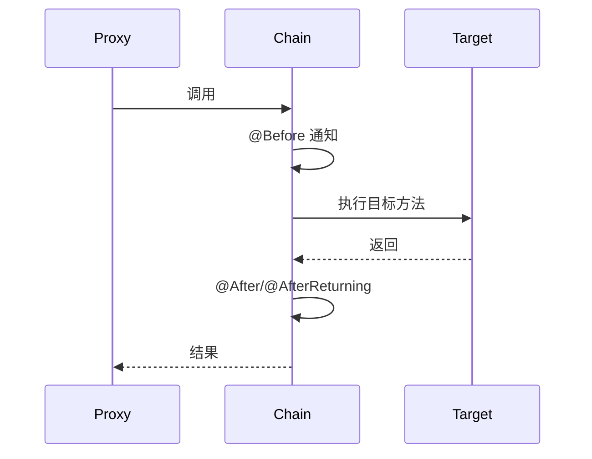

# Spring

## Spring Bean 的几个处理扩展方法

1. Bean 自身的方法：比如构造函数、getter/setter 以及 init-method 和 destory-method 所指定的方法等。
2. Bean 级生命周期方法：可以理解为 Bean 类直接实现接口的方法，比如 BeanNameAware、BeanFactoryAware、ApplicationContextAware、InitializingBean、DisposableBean 等方法，这些方法只对当前 Bean 生效。
3. 容器级的方法（BeanPostProcessor 一系列接口）：主要是后处理器方法，比如上图的 InstantiationAwareBeanPostProcessor、BeanPostProcessor 接口方法。这些接口的实现类是独立于 bean 的，并且会注册到 Spring 容器中。在 Spring 容器创建任何 Bean 的时候，这些后处理器都会发生作用。
4. 工厂后处理器方法（BeanFactoryProcessor 一系列接口）：包括 AspectJWeavingEnabler、CustomAutowireConfigurer、ConfigurationClassPostProcessor 等。这些都是 Spring 框架中已经实现好的 BeanFactoryPostProcessor，用来实现某些特定的功能。


> 图：Spring Bean 生命周期示意


> 图：Spring Bean 生命周期扩展方法示意（一）


> 图：Spring Bean 生命周期扩展方法示意（二）

## Spring MVC 的整体流程


> 图：Spring MVC 整体流程

## Spring 循环依赖源码解析

```java
// 一级缓存
private final Map singletonObjects = new ConcurrentHashMap<>(256);
// 二级缓存
private final Map earlySingletonObjects = new HashMap<>(16);
// 三级缓存
private final Map> singletonFactories = new HashMap<>(16);

protected Object getBean(final String beanName) {
    // !以下为getSingleton逻辑！
    // 先从一级缓存获取
    Object single = singletonObjects.get(beanName);
    if (single != null) {
        return single;
    }
    // 再从二级缓存获取
    single = earlySingletonObjects.get(beanName);
    if (single != null) {
        return single;
    }
    // 从三级缓存获取objectFactory
    ObjectFactory objectFactory = singletonFactories.get(beanName);
    if (objectFactory != null) {
        single = objectFactory.get();
        // 升到二级缓存
        earlySingletonObjects.put(beanName, single);
        singletonFactories.remove(beanName);
        return single;
    }
    // !以上为getSingleton逻辑！

    // ！以下为doCreateBean逻辑
    // 缓存完全拿不到，需要创建
    // 创建实例
    Object beanInstance = createBeanInstance(beanName);
    // 实例创建之后，放入三级缓存
    singletonFactories.put(beanName, () -> return beanInstance);
    // 依赖注入，会触发依赖的bean的getBean方法
    populateBean(beanName, beanInstance);
    // 初始化方法调用
    initializeBean(beanName, beanInstance);

    // 依赖注入完之后，如果二级缓存有值，说明出现了循环依赖
    // 这个时候直接取二级缓存中的bean实例
    Object earlySingletonReference = earlySingletonObjects.get(beanName);
    if (earlySingletonReference != null) {
        beanInstance = earlySingletonObject;
    }
    // ！以上为doCreateBean逻辑

    // 从二三缓存移除，放入一级缓存
    singletonObjects.put(beanName, beanInstance);
    earlySingletonObjects.remove(beanName);
    singletonFactories.remove(beanName);

    return beanInstance;
}
```

## Spring 涉及的设计模式


> 图：Spring 设计模式示意（一）


> 图：Spring 设计模式示意（二）

## 对 Spring 的 IOC 和 AOP 的理解

Spring 的 IOC 包含两种实现方式：DI（依赖注入）和 DL（依赖查找）。

DL 分两种：依赖拖曳（Dependency Pull）、上下文查找。

## 对 Spring 的循环依赖和 Bean 生命周期相关的比较好的博主

[Spring 循环依赖与 Bean 生命周期（掘金）](https://juejin.cn/post/7213307533279199292#heading-11)

## Spring 事务详解

[Spring 事务详解（掘金）](https://juejin.cn/post/7208479235132244023)

## 熔断框架

取代了原先的 Netflix Hystrix，官网停止维护了。

Resilience4j 是一个轻量级、易于使用的“容错”包。它受 Netflix Hystrix 启发但只有一个依赖（Vavr），而不像 Hystrix 有很多很多的依赖。

Resilience4j 在“容错”方面提供了各种模式：断路器（Circuit Breaker）、重试（Retry）、限时器（Time Limiter）、限流器（Rate Limiter）、隔板（BulkHead）。

[Resilience4j 介绍（知乎）](https://zhuanlan.zhihu.com/p/583585713?utm_id=0)

## Spring Boot 项目为什么能一键启动


> 图：Spring Boot 一键启动原理

## 实现多数据源切换

核心是 AbstractRoutingDataSource 这个类，这个是 spring-jdbc 自带的。

## Spring Modulith（模块化单体）

## AOP 原理深度

AOP（面向切面编程）基于**动态代理**与**责任链**实现：

- **JDK 动态代理**：目标类实现接口时，生成接口代理，拦截 `invoke`；
- **CGLIB**：无接口时继承目标类生成子类，`MethodInterceptor` 拦截；Spring Boot 2.x 起默认 CGLIB。
- **织入（Weaving）**：Spring 在 Bean 初始化后（`postProcessAfterInitialization`）用 `AbstractAutoProxyCreator` 决定是否创建代理。
- **责任链执行**：一个方法上的多个 Advisor 组成拦截器链（`ReflectiveMethodInvocation`），依次 `proceed()` 嵌套执行，形成前置→目标→后置的环绕。



切点表达式：`execution(* com.x..*Service.*(..))`、`@annotation(Log)`、`within`、`this/ target`。

## Spring 事务传播行为（7 种）

| 传播行为 | 行为 |
| --- | --- |
| `REQUIRED`（默认） | 有事务加入，无则新建 |
| `REQUIRES_NEW` | 挂起当前事务，新建独立事务（内外互不回滚） |
| `SUPPORTS` | 有则加入，无则以非事务运行 |
| `NOT_SUPPORTED` | 挂起事务，非事务执行 |
| `MANDATORY` | 必须有事务，否则抛异常 |
| `NEVER` | 必须无事务，否则抛异常 |
| `NESTED` | 当前事务内嵌保存点子事务，回滚只到保存点 |

关键点：**自调用失效**——同类方法互调不经过代理，事务/`@Async`/`@Cacheable` 不生效；需注入自身代理或拆类。

## Bean 生命周期（完整链路）

`BeanDefinition` 加载 → `BeanFactoryPostProcessor`(改 BD) → 实例化 → `BeanPostProcessor.postProcessBeforeInitialization` → `@PostConstruct` / `InitializingBean.afterPropertiesSet` → 自定义 init-method → `postProcessAfterInitialization`(AOP 在此) → 就绪 → 销毁 `@PreDestroy` / `DisposableBean.destroy`。

## 常见坑与面试高频

1. **循环依赖**：Spring 用**三级缓存**（`singletonObjects`/`earlySingletonObjects`/`singletonFactories`）解决单例 setter/字段注入；**构造器注入无法解决**（抛 `BeanCurrentlyInCreationException`）。
2. **事务失效场景**：自调用、非 public 方法、异常被 catch 吞掉、数据库引擎不支持（MyISAM）、数据源未交由 Spring 事务管理。
3. **`@Transactional` 只读**：查询方法设 `readOnly=true` 可提示数据库优化（如 MySQL 只读连接）。
4. **Bean 作用域**：`singleton`（默认，容器内单例）/ `prototype`（每次新）/ `request`、`session`、`application`（Web）。
5. **`ApplicationContext` vs `BeanFactory`**：前者是后者的超集，预初始化单例、支持事件/国际化/AOP 等。

---

# 第二轮深度优化：扩展点 / 事件 / 事务失效 / 条件装配 / WebFlux / 自动配置

## 一、BeanPostProcessor 与 FactoryBean 扩展点

- **`BeanPostProcessor`**：Bean 初始化前后钩子 `postProcessBeforeInitialization` / `postProcessAfterInitialization`，返回的对象即最终 Bean（可包装/代理）。AOP（`AnnotationAwareAspectJAutoProxyCreator`）、`@Autowired`（`AutowiredAnnotationBeanPostProcessor`）、`@PostConstruct` 都靠它实现。可自定义做统一处理（如给全部 Bean 打监控标签、校验配置）。
- **`InstantiationAwareBeanPostProcessor`**：更早，实例化前后、属性填充前介入，可短路实例化（返回非 null 即不再走默认构造）。
- **`FactoryBean`**：工厂 Bean，`getObject()` 返回真正对象，`&beanName` 取工厂本身。用于构造复杂对象（如 `SqlSessionFactoryBean`、整合第三方客户端）。与 `@Bean` 工厂方法的区别：FactoryBean 是容器内一类特殊 Bean 类型，生命周期由容器管理；`@Bean` 是方法返回即注册。
- **`BeanFactoryPostProcessor`**：Bean 定义加载后、实例化前修改 `BeanDefinition`（如 `PropertySourcesPlaceholderConfigurer` 替换 `${}` 占位符）。

## 二、事件监听机制（ApplicationEvent）

- 发布：`ApplicationEventPublisher.publishEvent(new OrderCreatedEvent(...))`。
- 监听：`@EventListener` 标注方法，参数即事件类型；`@EventListener(condition = "#event.amount > 100")` 用 SpEL 条件过滤；`@TransactionalEventListener(phase = AFTER_COMMIT)` 在事务提交后触发（避免事务未提交就被事件消费者读到数据）。
- 异步：`@EventListener` + `@Async`（需 `@EnableAsync`），但异步事件异常需自行处理，且不保证顺序。
- 用途：解耦（下单后发通知、清缓存、发 MQ）。但**不要把核心一致性链路放进事件**，避免"发了事件但下游失败"的半成品。

## 三、`@Transactional` 失效全场景

1. **自调用**：同类方法互调不经过代理——拆类，或注入 `AopContext.currentProxy()`（需 `@EnableAspectJAutoProxy(exposeProxy=true)`）。
2. **非 public 方法**：Spring AOP 默认只代理 public（CGLIB 也受限）。
3. **异常被 catch 吞掉**：未抛出到代理；默认只回滚 `RuntimeException`/`Error`，checked 异常需 `rollbackFor`。
4. **异常类型不匹配**：抛 `IOException` 但没配 `rollbackFor=IOException` → 不回滚。
5. **数据库引擎不支持**：MyISAM 无事务。
6. **Connection 未被 Spring 管理**：自己 `new` 的 Connection、或数据源没交给事务管理器。
7. **多线程**：事务绑定在 ThreadLocal 的 Connection 上，新线程拿不到 → 失效。
8. **传播行为显式非事务**：`NOT_SUPPORTED` / `NEVER`。
9. **代理方式限制**：`final` 方法无法被代理（CGLIB 也绕不过 final）。

## 四、条件化装配（@Conditional 及派生）

- `@Conditional(ClassCondition.class)`：`matches` 返回 true 才注册 Bean。Spring Boot 大量派生：`@ConditionalOnClass`（classpath 有某类）、`@ConditionalOnMissingBean`（用户没自定义才用默认）、`@ConditionalOnProperty`、`@ConditionalOnWebApplication`、`@ConditionalOnBean`。
- **实战**：starter 里 `XxxAutoConfiguration` 用 `@ConditionalOnMissingBean` 提供默认 Bean，用户自定义同名 Bean 即覆盖——这是 Spring Boot "约定优于配置" 的底座。
- **顺序**：用户 `@Bean` > 自动配置；`@AutoConfigureBefore/After` 控制自动配置之间顺序。

## 五、WebFlux 响应式简介

- 基于 Reactor（`Mono` 0/1 元素，`Flux` 0~N），运行在 Netty 事件循环，**少量线程处理高并发 IO**（非阻塞）。适合 IO 密集、延迟敏感的网关类服务。
- **背压（Backpressure）**：上游按下游 `request(n)` 推送，避免淹没消费者（`Flux.limitRate` / `onBackpressureXXX`）。
- **局限**：阻塞调用（JDBC、同步 SDK）会卡事件循环，需用 `publishOn(Schedulers.boundedElastic())` 迁走；生态（R2DBC）不如 JDBC 成熟。传统 MVC 仍是多数业务首选。

## 六、SpringBoot 自动配置原理

- 入口：`@SpringBootApplication` 含 `@EnableAutoConfiguration`，借 `AutoConfigurationImportSelector` 读取 `META-INF/spring/org.springframework.boot.autoconfigure.AutoConfiguration.imports`（2.7 前为 `spring.factories`）中候选类。
- 每个 `XxxAutoConfiguration` 用 `@ConditionalOn...` 系列按需生效，并通过 `@EnableConfigurationProperties` 绑定 `application.yml`（`@ConfigurationProperties`）。
- **加载顺序**：用户配置 > 自动配置；`@ConditionalOnMissingBean` 让用户 Bean 覆盖默认。
- **调试**：`--debug` 启动打印 Positive/Negative matches；`ConditionEvaluationReport` 看哪些自动配置生效/未生效及原因。
- **自定义 starter**：写 `AutoConfiguration` + `ConfigurationProperties` + `imports` 文件，供他人引入即用。

## 七、循环依赖三级缓存源码

- 三级缓存：`singletonObjects`（成品）、`earlySingletonObjects`（早期暴露）、`singletonFactories`（ObjectFactory，生产早期引用）。
- 流程：创建 Bean A → 实例化后把 `() -> getEarlyReference` 放进 `singletonFactories` → 填充属性发现依赖 B → 创建 B → B 又依赖 A → 从 `singletonFactories` 拿 A 的早期引用（经 `getEarlyBeanReference` 可能生成 AOP 代理）放进 `earlySingletonObjects` → B 完成 → A 注入 B 完成。
- 关键：只有**单例 + setter/字段注入**能解决；**构造器注入**在实例化阶段就要 B，此时 B 还没开始创建，直接抛 `BeanCurrentlyInCreationException`。

## 八、`@Async` 原理与陷阱

- 基于 `@EnableAsync` + `AsyncAnnotationBeanPostProcessor` 生成代理，方法调用提交到线程池（`SimpleAsyncTaskExecutor` 默认每次 new 线程，**务必自定义 `ThreadPoolTaskExecutor`**）。
- 同 `@Transactional`：**自调用失效**（不走代理）；方法须 public；返回值用 `Future`/`CompletableFuture` 才能取结果/异常；异常默认被吞，需 `AsyncUncaughtExceptionHandler` 处理。

## 九、AOP 织入：JDK 动态代理 vs CGLIB

- 有接口且 `proxyTargetClass=false` → JDK 动态代理（基于接口，`final`/非接口方法不代理）；否则 CGLIB（子类化，不能代理 `final` 类/方法）。
- Spring Boot 2.x 默认 CGLIB（`spring.aop.proxy-target-class=true`）。**`final` 方法无法被增强**——常见"事务/缓存 `@Cacheable` 不生效"的元凶。

## 十、Profile 与环境隔离 / 外部化配置

- `@Profile("dev"/"prod")` 按环境激活 Bean；`application-{profile}.yml` + `spring.profiles.active` 切换环境。
- 外部化优先级：命令行参数 > 环境变量 > 配置文件 > 默认值；敏感配置走配置中心/密钥管理（KMS），避免把环境差异硬编码进代码。

## 十一、SpEL 与 `@Value`

- `@Value("${app.timeout:30}")` 取配置带默认值；`@Value("#{systemProperties['os.name']}")` 做 SpEL 计算；支持注入集合/数组（逗号分隔）。
- 风险：SpEL 表达式别拼接外部输入，否则有**表达式注入**风险（类似 SQL 注入，可执行任意方法）。

## 十二、事务隔离级别与只读

- `isolation`：READ_UNCOMMITTED / READ_COMMITTED / REPEATABLE_READ / SERIALIZABLE，需数据库支持；MySQL 默认 RR。
- `readOnly=true`：提示事务只读，ORM（Hibernate）可跳过脏检查、MySQL 路由只读连接优化。
- `timeout`：超时自动回滚，防止长事务长期占连接、拖慢整库。

## 十三、Spring 测试支持

- `@SpringBootTest` 起完整上下文做集成测试；`@DataJpaTest`/`@WebMvcTest` 做切片测试（只加载相关层）；`@MockBean` 替换依赖；`@TestPropertySource` 覆盖配置；`@Transactional` 测试后自动回滚。
- 测试金字塔：单测（快、多）> 集成（中）> 端到端（少）；Spring 测试偏集成，注意用上下文缓存加速（`@ContextConfiguration` 复用）。

## 十四、`@Lazy` 与部分循环依赖

- `@Lazy` 让注入时先注入代理，首次使用时才真正创建，可解决部分构造器/初始化期循环依赖；也可标注在 `@Bean` 方法参数。
- 注意：`@Lazy` 只是延迟，不解决根本设计问题（双向依赖本就是坏味道），应优先重构解耦。

## 十五、事件异步化

- `@EventListener` + `@Async` 让监听异步执行；配合 `@TransactionalEventListener(phase=AFTER_COMMIT)` 在事务提交后异步处理（发通知、清缓存），避免阻塞主事务。
- 注意：异步事件异常需 `AsyncUncaughtExceptionHandler` 处理；事务上下文不跨线程传递。

## 十六、FactoryBean 实战

- 例：整合第三方客户端（RedisTemplate、SqlSessionFactoryBean）常用 FactoryBean 封装复杂构建；`getObject()` 返回成品，`getObjectType()` 声明类型，`isSingleton()` 控制是否单例。
- 取 FactoryBean 本身用 `&beanName`；与 `@Bean` 工厂方法区分（后者是配置类方法，前者是容器内特殊 Bean）。

## 十七、容器启动流程概要

- `SpringApplication.run` → 准备 Environment → 创建 ApplicationContext → `refresh()`：`prepareRefresh` → `obtainFreshBeanFactory` → `invokeBeanFactoryPostProcessors`（改 BD）→ `registerBeanPostProcessors` → `onRefresh` → `registerListeners` → `finishBeanFactoryInitialization`（预初始化单例）→ `finishRefresh`（发布 ContextRefreshedEvent）。
- 理解这条主线，才能定位"Bean 何时可用""配置何时生效""监听器何时收到事件"。

## 十八、常用注解原理速查

- `@Autowired`：`AutowiredAnnotationBeanPostProcessor` 按类型注入，配 `@Qualifier` 按名；`@Resource` 按名（JSR-250）；`@Value` 取配置。
- `@Component` 系：`@Service`/`@Repository`/`@Controller` 仅是语义化 `@Component`；`@Repository` 还做持久层异常转换（JDBC → Spring 统一异常）。
- `@Scope`：singleton/prototype/request/session/application；prototype 每次新实例，且容器不负责其销毁。

## 十九、Spring 与 GraalVM 原生镜像

- Spring Boot 3 + GraalVM `native-image` 把应用编译为原生可执行文件：启动毫秒级、内存小、无 JIT 预热，适合 Serverless/容器。
- 代价：反射/动态代理/资源需通过 `reflect-config`/`resource-config` 或 `@RegisterReflectionForBinding` 显式注册；`ApplicationContext` 在构建期就确立（run-time 元数据处理受限）；部分库不兼容原生。
- 适用：短生命周期、高密度部署的服务；重反射/动态加载场景谨慎。

## 二十、AOP 执行顺序与多切面

- 多 `@Aspect` 顺序用 `@Order` / 实现 `Ordered` 控制；`@Before` 按 Order 升序、`@After`/`@AfterReturning` 降序（形成环绕嵌套）。
- 同一切面内 `@Before → @AfterReturning` 包裹目标方法；异常时走 `@AfterThrowing`。理解顺序才能正确排布日志、鉴权、事务切面（事务最内层）。

## 二十一、Environment 与 PropertySource

- `Environment` 统一抽象配置来源：`PropertySource`（系统属性、环境变量、配置文件、配置中心）按优先级组成；`environment.getProperty("key", default)` 取值。
- `ApplicationListener<ApplicationEnvironmentPreparedEvent>` 可在环境就绪早期插入自定义 PropertySource（如从 DB/远程拉配置）。
- `@PropertySource` 引入额外配置文件；Spring Boot 的 `application-{profile}.yml` 覆盖默认；配置中心（Nacos/Apollo）通过 `PropertySource` 动态刷新（`@RefreshScope` 重建 Bean）。

## 二十二、常见事务隔离级别实战

- `READ_COMMITTED`：防脏读，允许不可重复读/幻读；多数业务够用。
- `REPEATABLE_READ`（MySQL 默认）：防脏读 + 不可重复读，配合 MVCC + Next-Key Lock 防幻读（快照读）。
- `SERIALIZABLE`：最高隔离、锁最重，仅极端一致性要求用。
- 隔离级别越高一致性越强但并发越低；按业务读一致性需求选，别盲目用最高。
