# 一些概念
## 软件系统复杂性应对
[https://zhuanlan.zhihu.com/p/83875541](https://zhuanlan.zhihu.com/p/83875541)

怎么理解“复杂度”：

- **修改扩散**，修改时有连锁反应。

- **认知负担**，开发人员需要多长时间来理解功能模块。

- **不可知**（Unknown Unknowns），开发人员在接到任务时，不知道从哪里入手。

造成复杂的原因一般是代码依赖和晦涩（Obscurity）。其中，依赖是指某部分代码不能被独立地修改和理解，必定会牵涉到其他代码。代码晦涩，是指从代码中难以找到重要信息。

解决复杂和大规模软件的武器可以被粗略地归为三类：抽象、分治和知识。

分治 把问题空间分割为规模更小且易于处理的若干子问题。分割后的问题需要足够小，以便一个人单枪匹马就能够解决他们；其次，必须考虑如何将分割后的各个部分装配为整体。分割得越合理越易于理解，在装配成整体时，所需跟踪的细节也就越少。即更容易设计各部分的协作方式。评判什么是分治得好，即高内聚低耦合。

抽象 使用抽象能够精简问题空间，而且问题越小越容易理解。举个例子，从北京到上海出差，可以先理解为使用交通工具前往，但不需要一开始就想清楚到底是高铁还是飞机，以及乘坐他们需要注意什么。

知识 顾名思义，DDD可以认为是知识的一种。

DDD提供了这样的知识手段，让我们知道如何抽象出限界上下文以及如何去分治。

### 进程间的通信

| 管道 | A进程将数据写入管道，B进程需要等待A进程将信息写完以后才能读出来，所以这种方案不适合频繁的通信。那优点是什么？ |
| -- | -- |
| 消息队列 | 可以的。消息队列在发送数据的时候，按照一个个独立单元(消息体)进行发送，其中每个消息体规定大小块，同时发送方和接收方约定好消息类型或者正文的格式。 |
| 共享内存 | 我们知道每个进程都有自己的虚拟内存空间，不同的进程映射到不同的物理内存空间。那么我们可不可以申请一块虚拟地址空间，不同进程通过这块虚拟地址空间映射到相同的物理地址空间呢？这样不同进程就可以及时的感知进程都干了啥，就不需要再拷贝来拷贝去。 |
| 信号量 | 信号量实际上是一个计数器，这里需要注意下，信号量主要实现进程之间的同步和互斥，而不是存储通信内容。 |
| 信号 | 从管道----消息队列-共享内存/信号量，有需要等待的管道机制，共享内存空间的进程通信方式，还有一种特殊的方式--信号 |
| 套接字 | 上面的几种方式都是单机情况下多个进程的通信方式，如果我想和相隔几千里的小姐姐通信怎么办？ |
|   |   |

## 缓存的读写模式
​ **CacheAside旁路缓存**

写请求更新数据库后删除缓存数据。读请求不命中查询数据库，查询完成写入缓存

    


> 图：缓存的读写模式 相关截图

    

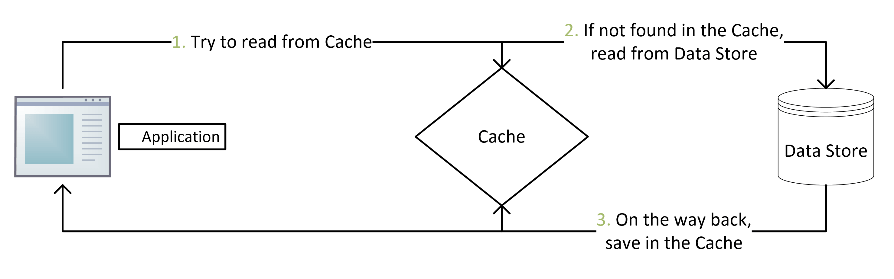
> 图：缓存的读写模式 相关截图

​ 业务端处理所有数据访问细节，同时利用 Lazy 计算的思想，更新 DB 后，直接删除 cache 并通过 DB 更新，确保数据以 DB 结果为准，则可以大幅降低 cache 和 DB 中数据不一致的概率

​ 如果没有专门的存储服务，同时是对数据一致性要求比较高的业务，或者是缓存数据更新比较复杂的业务，适合使用 Cache Aside 模式。如微博发展初期，不少业务采用这种模式

// 延迟双删，用以保证最终一致性,防止小概率旧数据读请求在第一次删除后更新数据库
public void write(String key,Object data){
	redis.delKey(key);
	db.updateData(data);
	Thread.sleep(1000);
	redis.delKey(key);
}

高并发下保证绝对的一致，先删缓存再更新数据，需要用到内存队列做异步串行化。非高并发场景，先更新数据再删除缓存，延迟双删策略基本满足了

- 先更新db后删除redis：删除redis失败则出现问题

- 先删redis后更新db：删除redis瞬间，旧数据被回填redis

- 先删redis后更新db休眠后删redis：同第二点，休眠后删除redis 可能宕机

- java内部jvm队列：不适用分布式场景且降低并发

​ **Read/Write Though（读写穿透）**

​ 先查询缓存中数据是否存在,如果存在则直接返回,如果不存在,则由缓存组件负责从数据库中同步加载数据.

​ 

    


> 图：缓存的读写模式 相关截图

​ 先查询要写入的数据在缓存中是否已经存在,如果已经存在,则更新缓存中的数据，并且由缓存组件同步更新到数据库中。

​ 

    


> 图：缓存的读写模式 相关截图

​ 用户读操作较多.相较于Cache aside而言更适合缓存一致的场景。使用简单屏蔽了底层数据库的操作,只是操作缓存.

场景：

微博 Feed 的 Outbox Vector（即用户最新微博列表）就采用这种模式。一些粉丝较少且不活跃的用户发表微博后，Vector 服务会首先查询 Vector Cache，如果 cache 中没有该用户的 Outbox 记录，则不写该用户的 cache 数据，直接更新 DB 后就返回，只有 cache 中存在才会通过 CAS 指令进行更新。

​

### Write Behind Caching（异步缓存写入）

    

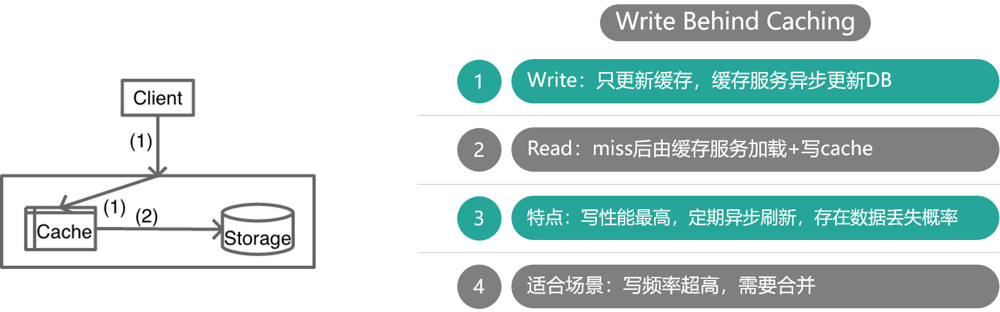
> 图：Write Behind Caching（异步缓存写入） 相关截图

比如对一些计数业务，一条 Feed 被点赞 1万 次，如果更新 1万 次 DB 代价很大，而合并成一次请求直接加 1万，则是一个非常轻量的操作。但这种模型有个显著的缺点，即数据的一致性变差，甚至在一些极端场景下可能会丢失数据。

## COW机制
fork()会产生一个和父进程完全相同的子进程(除了pid)

如果按传统的做法，会直接将父进程的数据拷贝到子进程中，拷贝完之后，父进程和子进程之间的数据段和堆栈是相互独立的。

既然很多时候复制给子进程的数据是无效的，于是就有了Copy On Write这项技术了，原理也很简单：

- fork创建出的子进程，与父进程共享内存空间。也就是说，如果子进程不对内存空间进行写入操作的话，内存空间中的数据并不会复制给子进程，这样创建子进程的速度就很快了！(不用复制，直接引用父进程的物理空间)。

- 并且如果在fork函数返回之后，子进程第一时间exec一个新的可执行映像，那么也不会浪费时间和内存空间了。

另外的表达方式：

在fork之后exec之前两个进程用的是相同的物理空间（内存区），子进程的代码段、数据段、堆栈都是指向父进程的物理空间，也就是说，两者的虚拟空间不同，但其对应的物理空间是同一个。

当父子进程中有更改相应段的行为发生时，再为子进程相应的段分配物理空间。

如果不是因为exec，内核会给子进程的数据段、堆栈段分配相应的物理空间（至此两者有各自的进程空间，互不影响），而代码段继续共享父进程的物理空间（两者的代码完全相同）。

而如果是因为exec，由于两者执行的代码不同，子进程的代码段也会分配单独的物理空间。 

Copy On Write技术实现原理：

fork()之后，kernel把父进程中所有的内存页的权限都设为read-only，然后子进程的地址空间指向父进程。当父子进程都只读内存时，相安无事。当其中某个进程写内存时，CPU硬件检测到内存页是read-only的，于是触发页异常中断（page-fault），陷入kernel的一个中断例程。中断例程中，kernel就会把触发的异常的页复制一份，于是父子进程各自持有独立的一份。

copyonwrite并不会把内存中的所有数据都复制一份，而是发生变化的内存页才会复制。

Copy On Write技术好处是什么？

- COW技术可减少分配和复制大量资源时带来的瞬间延时。

- COW技术可减少不必要的资源分配。比如fork进程时，并不是所有的页面都需要复制，父进程的代码段和只读数据段都不被允许修改，所以无需复制。

- Copy On Write技术缺点是什么？

- 如果在fork()之后，父子进程都还需要继续进行写操作，那么会产生大量的分页错误(页异常中断page-fault)，这样就得不偿失。

几句话总结Linux的Copy On Write技术：

- fork出的子进程共享父进程的物理空间，当父子进程有内存写入操作时，read-only内存页发生中断，将触发的异常的内存页复制一份(其余的页还是共享父进程的)。

- fork出的子进程功能实现和父进程是一样的。如果有需要，我们会用exec()把当前进程映像替换成新的进程文件，完成自己想要实现的功能。

## SOA和微服务
SOA 全称是: Service Oriented Architecture，中文释义为 “面向服务的架构”它是一种设计理念，其中包含多个服务， 服务之间通过相互依赖最终提供一系列完整的功能。各个服务通常以独立的形式部署运行，服务之间 通过网络进行调用，SOA的核心理念为：松耦合带来的服务重用，通过服务编排助力业务的快速响应和创新。

在SOA时代，有两种SOA的主要实现方式，分别是Web Service 和ESB。

微服务架构和 SOA 架构非常类似,微服务只是的 SOA 升华，只不过微服务架构强调的是“业务需要彻底的组件化及服务化”，原单个业务系统会被拆分为多个可以独立开发、设计、部署运行的小应用。这些小应用间通过服务化完成交互和集成。组件表示的就是一个可以独立更换和升级的单元，就像 PC 中的 CPU、内存、显卡、硬盘一样，独立且可以更换升级而不影响其他单元。若我们把 PC 中的各个组件以服务的方式构建，那么这台 PC 只需要维护主板和一些必要的外部设备就可以。CPU、内存、硬盘等都是以组件方式提供服务，例如PC 需要调用 CPU 做计算处理，只需知道 CPU 这个组件的地址就可以了。

微服务架构的特性：

1.单一职责

2.轻量级通信

3.独立性

4.进程隔离

微服务架构的缺点：

1.运维要求较高

2.分布式的复杂性

3.接口调整成本高

4.重复劳动

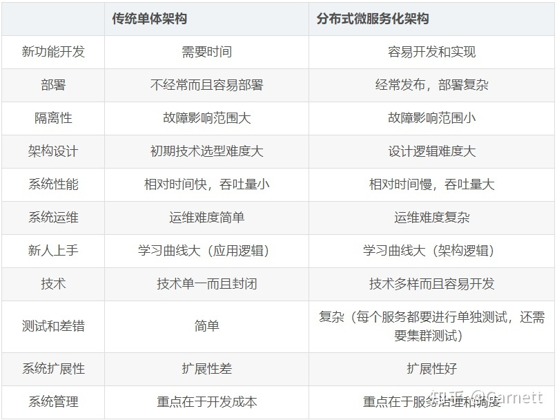
> 图：SOA和微服务 相关截图

SOA，ESB，微服务的区别和关系

1、SOA是一种理念，它的主要特性--面向服务的分布式计算，服务间松散耦合，支持服务的封装，服务注册和自动发现，以服务契约方式定义服务交互方式。但是，SOA并没有定义出具体的实现方式，目前有两套SOA理念的实现方式：中心化和去中心化，这两套架构并没有优劣之分，还是要针对企业的根本诉求。

2、SOA中心化的实现方式就是ESB，ESB的根本诉求是为了解决异构系统之间的连通性，通过协议转换、消息解析、消息路由把服务提供者的数据传送到服务消费者。所以，ESB是中心化的，很重，有一定的逻辑，但它的确可以解决一些公用逻辑的问题。

3、SOA去中心化的实现方式的根本诉求是扩展性，实现方式就是微服务。

## 什么是restful风格
### 名称

Fielding将他对互联网软件的架构原则，定名为REST，即Representational State Transfer的缩写。我对这个词组的翻译是"表现层状态转化"。

如果一个架构符合REST原则，就称它为RESTful架构。

要理解RESTful架构，最好的方法就是去理解Representational State Transfer这个词组到底是什么意思，它的每一个词代表了什么涵义。如果你把这个名称搞懂了，也就不难体会REST是一种什么样的设计。

### 资源（Resources）

REST的名称"表现层状态转化"中，省略了主语。"表现层"其实指的是"资源"（Resources）的"表现层"。

所谓"资源"，就是网络上的一个实体，或者说是网络上的一个具体信息。它可以是一段文本、一张图片、一首歌曲、一种服务，总之就是一个具体的实在。你可以用一个URI（统一资源标识符）指向它，每种资源对应一个特定的URI。要获取这个资源，访问它的URI就可以，因此URI就成了每一个资源的地址或独一无二的识别符。

附：
URI：Uniform Resource Identifier，统一资源标识符
URL：Uniform Resource Location统一资源定位符

所谓"上网"，就是与互联网上一系列的"资源"互动，调用它的URI。

RESTful可以认为是一种建立在HTTP协议之上的设计模式，充分的利用了HTTP协议的特定，使用URL来表示资源，用各个不同的HTTP动词来表示对资源的各种行为。这样做的好处就是资源和操作分离，让资源的管理更加规范。

### 表现层（Representation）

"资源"是一种信息实体，它可以有多种外在表现形式。我们把"资源"具体呈现出来的形式，叫做它的"表现层"（Representation）。

比如，文本可以用txt格式表现，也可以用HTML格式、XML格式、JSON格式表现，甚至可以采用二进制格式；图片可以用JPG格式表现，也可以用PNG格式表现。

URI只代表资源的实体，不代表它的形式。严格地说，有些网址最后的".html"后缀名是不必要的，因为这个后缀名表示格式，属于"表现层"范畴，而URI应该只代表"资源"的位置。它的具体表现形式，应该在HTTP请求的头信息中用Accept和Content-Type字段指定，这两个字段才是对"表现层"的描述。

### 状态转化（State Transfer）

访问一个网站，就代表了客户端和服务器的一个互动过程。在这个过程中，势必涉及到数据和状态的变化。

互联网通信协议HTTP协议，是一个无状态协议。这意味着，所有的状态都保存在服务器端。因此，如果客户端想要操作服务器，必须通过某种手段，让服务器端发生"状态转化"（State Transfer）。而这种转化是建立在表现层之上的，所以就是"表现层状态转化"。

客户端用到的手段，只能是HTTP协议。具体来说，就是HTTP协议里面，四个表示操作方式的动词：GET、POST、PUT、DELETE。它们分别对应四种基本操作：GET用来获取资源，POST用来新建资源（也可以用于更新资源），PUT用来更新资源，DELETE用来删除资源。

### 综述

综合上面的解释，我们总结一下什么是RESTful架构：

　　　　（1）每一个URI代表一种资源；

　　　　（2）客户端和服务器之间，传递这种资源的某种表现层；

　　　　（3）客户端通过四个HTTP动词，对服务器端资源进行操作，实现"表现层状态转化"。

##  面向对象设计原则
SOLID原则是由5个设计原则组成，SOLID对应每个原则英文字母的开头：

单一职责原则（Single Responsiblity Principle）

开闭原则(Open Close Principle)

里式替换原则(Liskov Substitution Principle)

接口隔离原则(Interface Segregation Principle)

依赖反转原则(Dependency Inversion Principle)

单一职责原则的定义是就一个类而言，应该仅有一个引起他变化的原因。也就是说一个类应该只负责一件事情。如果一个类负责了方法M1,方法M2两个不同的事情，当M1方法发生变化的时候，我们需要修改这个类的M1方法，但是这个时候就有可能导致M2方法不能工作。这个不是我们期待的，但是由于这种设计却很有可能发生。所以这个时候，我们需要把M1方法，M2方法单独分离成两个类。让每个类只专心处理自己的方法。

单一职责原则的好处如下：

可以降低类的复杂度，一个类只负责一项职责，这样逻辑也简单很多 提高类的可读性，和系统的维护性，因为不会有其他奇怪的方法来干扰我们理解这个类的含义 当发生变化的时候，能将变化的影响降到最小，因为只会在这个类中做出修改

开闭原则和单一职责原则一样，是非常基础而且一般是常识的原则。开闭原则的定义是软件中的对象(类，模块，函数等)应该对于扩展是开放的，但是对于修改是关闭的。

当需求发生改变的时候，我们需要对代码进行修改，这个时候我们应该尽量去扩展原来的代码，而不是去修改原来的代码，因为这样可能会引起更多的问题。

这个准则和单一职责原则一样，是一个大家都这样去认为但是又没规定具体该如何去做的一种原则。

开闭原则我们可以用一种方式来确保他，我们用抽象去构建框架，用实现扩展细节。这样当发生修改的时候，我们就直接用抽象了派生一个具体类去实现修改。

里氏替换原则是一个非常有用的一个概念。他的定义

如果对每一个类型为T1的对象o1,都有类型为T2的对象o2,使得以T1定义的所有程序P在所有对象o1都替换成o2的时候，程序P的行为都没有发生变化，那么类型T2是类型T1的子类型。

这样说有点复杂，其实有一个简单的定义

所有引用基类的地方必须能够透明地使用其子类的对象。

里氏替换原则通俗的去讲就是：子类可以去扩展父类的功能，但是不能改变父类原有的功能。他包含以下几层意思：

- 子类可以实现父类的抽象方法，但是不能覆盖父类的非抽象方法。

- 子类可以增加自己独有的方法。

- 当子类的方法重载父类的方法时候，方法的形参要比父类的方法的输入参数更加宽松。

- 当子类的方法实现父类的抽象方法时，方法的返回值要比父类更严格。

里氏替换原则之所以这样要求是因为继承有很多缺点，他虽然是复用代码的一种方法，但同时继承在一定程度上违反了封装。父类的属性和方法对子类都是透明的，子类可以随意修改父类的成员。这也导致了，如果需求变更，子类对父类的方法进行一些复写的时候，其他的子类无法正常工作。所以里氏替换法则被提出来。

确保程序遵循里氏替换原则可以要求我们的程序建立抽象，通过抽象去建立规范，然后用实现去扩展细节，这个是不是很耳熟，对，里氏替换原则和开闭原则往往是相互依存的。

依赖倒置原则指的是一种特殊的解耦方式，使得高层次的模块不应该依赖于低层次的模块的实现细节的目的，依赖模块被颠倒了。这也是一个让人难懂的定义，他可以简单来说就是

高层模块不应该依赖底层模块，两者都应该依赖其抽象 抽象不应该依赖细节 细节应该依赖抽象

在Java 中抽象指的是接口或者抽象类，两者皆不能实例化。而细节就是实现类，也就是实现了接口或者继承了抽象类的类。他是可以被实例化的。高层模块指的是调用端，底层模块是具体的实现类。在Java中，依赖倒置原则是指模块间的依赖是通过抽象来发生的，实现类之间不发生直接的依赖关系，其依赖关系是通过接口是来实现的。这就是俗称的面向接口编程。

接口隔离原则的定义是

客户端不应该依赖他不需要的接口

换一种说法就是类间的依赖关系应该建立在最小的接口上。这样说好像更难懂。我们通过一个例子来说明。我们知道在Java中一个具体类实现了一个接口，那必然就要实现接口中的所有方法。如果我们有一个类A和类B通过接口I来依赖，类B是对类A依赖的实现，这个接口I有5个方法。但是类A与类B只通过方法1,2,3依赖，然后类C与类D通过接口I来依赖，类D是对类C依赖的实现但是他们却是通过方法1,4,5依赖。那么是必在实现接口的时候，类B就要有实现他不需要的方法4和方法5 而类D就要实现他不需要的方法2，和方法3。这简直就是一个灾难的设计。

所以我们需要对接口进行拆分，就是把接口分成满足依赖关系的最小接口，类B与类D不需要去实现与他们无关接口方法。比如在这个例子中，我们可以把接口拆成3个，第一个是仅仅由方法1的接口，第二个接口是包含2,3方法的，第三个接口是包含4,5方法的。这样，我们的设计就满足了接口隔离原则。

以上这些设计思想用英文的第一个字母可以组成SOLID ，满足这个5个原则的程序也被称为满足了SOLID准则。

迪米特原则也被称为最小知识原则，他的定义

一个对象应该对其他对象保持最小的了解。

因为类与类之间的关系越密切，耦合度越大，当一个类发生改变时，对另一个类的影响也越大，所以这也是我们提倡的软件编程的总的原则：低耦合，高内聚。迪米特法则还有一个更简单的定义

只与直接的朋友通信。首先来解释一下什么是直接的朋友：每个对象都会与其他对象有耦合关系，只要两个对象之间有耦合关系，我们就说这两个对象之间是朋友关系。耦合的方式很多，依赖、关联、组合、聚合等。其中，我们称出现成员变量、方法参数、方法返回值中的类为直接的朋友，而出现在局部变量中的类则不是直接的朋友。也就是说，陌生的类最好不要作为局部变量的形式出现在类的内部。

这里我们可以用一个现实生活中的例子来讲解一下。比如我们需要一张CD,我们可能去音像店去问老板有没有我们需要的那张CD，老板说现在没有，等有的时候你们来拿就行了。在这里我们不需要关心老板是从哪里，怎么获得的那张CD，我们只和老板（直接朋友）沟通，至于老板从他的朋友那里通过何种条件得到的CD，我们不关心，我们不和老板的朋友（陌生人）进行通信，这个就是迪米特的一个应用。说白了，就是一种中介的方式。我们通过老板这个中介来和真正提供CD的人发生联系。

合成复用原则

定义：优先使用对象组合，而不是通过继承来达到复用的目的。

合成复用原则就是在一个新的对象里通过关联关系（包括组合关系和聚合关系）来使用一些已有的对象，使之成为新对象的一部分，新对象通过委派调用已有对象的方法达到复用功能的目的。简而言之，在复用时要尽量使用组合/聚合关系（关联关系），少用继承。

在面向对象设计中可以通过两种方法在不同的环境中复用已有的设计和实现，即通过组合/聚合关系或通过继承，但首先应该考虑使用组合/聚合，组合/聚合可以使系统更加灵活，降低类与类之间的耦合度，一个类的变化对其他类造成的影响相对较少；其次才考虑继承，在使用继承时需要严格遵循里氏代换原则，有效使用继承会有助于对问题的理解，降低复杂度，而滥用继承反而会增加系统构建和维护的难度以及系统的复杂度，因此需要慎重使用继承复用。

通过继承来进行复用的主要问题在于继承复用会破坏系统的封装性，因为继承会将基类的实现细节暴露给子类，由于基类的某些内部细节对子类来说是可见的，所以这种复用又称“白箱”复用，如果基类发生改变，那么子类的实现也不得不发生改变；从基类继承而来的实现是静态的，不可能在运行时发生改变，没有足够的灵活性；而且继承只能在有限的环境中使用（如类没有声明为不能被继承）。

由于组合/聚合关系可以将已有的对象纳入到新对象中，使之成为新对象的一部分，因此新对象可以调用已有对象的功能，这样做可以使成员对象的内部实现细节对于新对象不可见，所以这种复用又称为“黑箱”复用，相对继承关系而言，其耦合度相对较低，成员对象的变化对新对象的影响不大，可以在新对象中根据实际需要有选择性地调用成员对象的操作；合成复用可以在运行时动态进行，新对象可以动态地引用与成员对象类型相同的其他对象。

一般而言，如果两个类之间是“Has-A”的关系应使用组合/聚合，如果是“Is-A”的关系可以使用继承。“Is-A”是严格的分类学意义上的定义，意思是一个类是另一个类的“一种”；而“Has-A”则不同，它表示某一个角色具有某一项责任。

## 谈谈面向对象和面向过程的区别
面向过程：

优点：性能比面向对象高，因为类调用时需要实例化，开销比较大，比较消耗资源;比如单片机、嵌入式开发、Linux/Unix等一般采用面向过程开发，性能是最重要的因素。

缺点：没有面向对象易维护、易复用、易扩展

面向对象：

优点：易维护、易复用、易扩展，由于面向对象有封装、继承、多态性的特性，可以设计出低耦合的系统，使系统更加灵活、更加易于维护

缺点：性能比面向过程低

面向过程是具体化的，流程化的，解决一个问题，你需要一步一步的分析，一步一步的实现。

面向对象是模型化的，你只需抽象出一个类，这是一个封闭的盒子，在这里你拥有数据也拥有解决问题的方法。需要什么功能直接使用就可以了，不必去一步一步的实现，至于这个功能是如何实现的，管我们什么事？我们会用就可以了。

面向对象的底层其实还是面向过程，把面向过程抽象成类，然后封装，方便我们使用的就是面向对象了。

## 保护用户密码之加密算法
使用彩虹表破解

**1、直接明文保存**，比如用户设置的密码是“123456”，直接将“123456”保存在数据库中，这种是最简单的保存方式，也是最不安全的方式。但实际上不少互联网公司，都可能采取的是这种方式。

**2、使用对称加密算法来保存，比如3DES、AES等算法**，使用这种方式加密是可以通过解密来还原出原始密码的，当然前提条件是需要获取到密钥。不过既然大量的用户信息已经泄露了，密钥很可能也会泄露，当然可以将一般数据和密钥分开存储、分开管理，但要完全保护好密钥也是一件非常复杂的事情，所以这种方式并不是很好的方式。

**3、使用MD5、SHA1等单向HASH算法保护密码**，使用这些算法后，无法通过计算还原出原始密码，而且实现比较简单，因此很多互联网公司都采用这种方式保存用户密码，曾经这种方式也是比较安全的方式，但随着彩虹表技术的兴起，可以建立彩虹表进行查表破解，目前这种方式已经很不安全了

**4、特殊的单向HASH算法**，由于单向HASH算法在保护密码方面不再安全，于是有些公司在单向HASH算法基础上进行了加盐、多次HASH等扩展，这些方式可以在一定程度上增加破解难度，对于加了“固定盐”的HASH算法，需要保护“盐”不能泄露，这就会遇到“保护对称密钥”一样的问题，一旦“盐”泄露，根据“盐”重新建立彩虹表可以进行破解，对于多次HASH，也只是增加了破解的时间，并没有本质上的提升

**5、PBKDF2算法**，该算法原理大致相当于在HASH算法基础上增加随机盐，并进行多次HASH运算，随机盐使得彩虹表的建表难度大幅增加，而多次HASH也使得建表和破解的难度都大幅增加。使用PBKDF2算法时，HASH算法一般选用sha1或者sha256，随机盐的长度一般不能少于8字节，HASH次数至少也要1000次，这样安全性才足够高

**6、bcrypt、scrypt等算法**，这两种算法也可以有效抵御彩虹表，使用这两种算法时也需要指定相应的参数，使破解难度增加

常见加密算法：[https://zhuanlan.zhihu.com/p/264425691](https://zhuanlan.zhihu.com/p/264425691)

## 零拷贝
[https://blog.csdn.net/qq_40337086/article/details/113264601](https://blog.csdn.net/qq_40337086/article/details/113264601)

传统的io流程

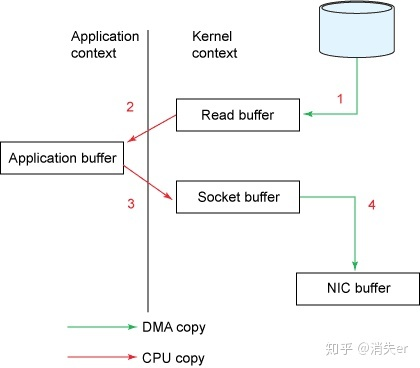
> 图：零拷贝 相关截图

实际IO读写，需要进行IO中断，需要CPU响应中断(带来上下文切换)，尽管后来引入DMA来接管CPU的中断请求，但四次copy是存在“不必要的拷贝”的。

### Memory Mapped Files

简称mmap，简单描述其作用就是：将磁盘文件映射到内存, 用户通过修改内存就能修改磁盘文件。它的工作原理是直接利用操作系统的Page来实现文件到物理内存的直接映射。完成映射之后你对物理内存的操作会被同步到硬盘上（操作系统在适当的时候）。

通过mmap，进程像读写硬盘一样读写内存（当然是虚拟机内存），也不必关心内存的大小有虚拟内存为我们兜底。使用这种方式可以获取很大的I/O提升，省去了用户空间到内核空间复制的开销。

mmap也有一个很明显的缺陷——不可靠，写到mmap中的数据并没有被真正的写到硬盘，操作系统会在程序主动调用flush的时候才把数据真正的写到硬盘。Kafka提供了一个参数——producer.type来控制是不是主动flush；如果Kafka写入到mmap之后就立即flush然后再返回Producer叫同步(sync)；写入mmap之后立即返回Producer不调用flush叫异步(async)。

### sendfile()

- 第一步，通过 DMA 将磁盘上的数据拷贝到内核缓冲区里；

- 第二步，缓冲区描述符和数据长度传到 socket 缓冲区，这样网卡的 SG-DMA 控制器就可以直接将内核缓存中的数据拷贝到网卡的缓冲区里，此过程不需要将数据从操作系统内核缓冲区拷贝到 socket 缓冲区中，这样就减少了一次数据拷贝；作者：小林coding链接：https://juejin.cn/post/6875608045876543502来源：稀土掘金著作权归作者所有。商业转载请联系作者获得授权，非商业转载请注明出处。

## pageCache
**但是，在传输大文件（GB 级别的文件）的时候，PageCache 会不起作用，那就白白浪费 DMA 多做的一次数据拷贝，造成性能的降低，即使使用了 PageCache 的零拷贝也会损失性能**

这是因为如果你有很多 GB 级别文件需要传输，每当用户访问这些大文件的时候，内核就会把它们载入 PageCache 中，于是 PageCache 空间很快被这些大文件占满。

另外，由于文件太大，可能某些部分的文件数据被再次访问的概率比较低，这样就会带来 2 个问题：

- PageCache 由于长时间被大文件占据，其他「热点」的小文件可能就无法充分使用到 PageCache，于是这样磁盘读写的性能就会下降了；

- PageCache 中的大文件数据，由于没有享受到缓存带来的好处，但却耗费 DMA 多拷贝到 PageCache 一次；

所以，针对大文件的传输，不应该使用 PageCache，也就是说不应该使用零拷贝技术，因为可能由于 PageCache 被大文件占据，而导致「热点」小文件无法利用到 PageCache，这样在高并发的环境下，会带来严重的性能问题。

## 分布式链路追踪
随着微服务和云原生开发的兴起，越来越多应用基于分布式进行开发，但是大型应用拆分为微服务后，服务之间的依赖和调用变得越来越复杂，这些服务是不同团队、使用不同语言开发的，部署在不同机器上，他们之间提供的接口可能不同(gRPC、Restful api等)。

为了维护这些服务，软件领域出现了 Observability 思想，在这个思想中，对微服务的维护分为三个部分：

度量(Metrics)：用于监控和报警；

分布式追踪(Tracing)：用于记录系统中所有的跟踪信息；

日志(Logging)：记录每个服务只能中离散的信息；

这三部分并不是独立开来的，例如 Metrics 可以监控 Tracing 、Logging 服务是否正常运行。Tacing 和 Metrics 服务在运行过程中会产生日志

## BASE理论 
### 1. 基本可用
基本可用是指分布式系统在出现不可预知故障的时候，允许损失部分可用性。但是，这绝不等价于系统不可用。

### 什么叫允许损失部分可用性呢？

- 响应时间上的损失

- : 正常情况下，处理用户请求需要 0.5s 返回结果，但是由于系统出现故障，处理用户请求的时间变为 3 s。

- 系统功能上的损失

- ：正常情况下，用户可以使用系统的全部功能，但是由于系统访问量突然剧增，系统的部分非核心功能无法使用。

[](https://javaguide.cn/interview-preparation/interview-experience.html#_2-%E8%BD%AF%E7%8A%B6%E6%80%81)***2. 软状态***

软状态指允许系统中的数据存在中间状态（**CAP 理论中的数据不一致**），并认为该中间状态的存在不会影响系统的整体可用性，即允许系统在不同节点的数据副本之间进行数据同步的过程存在延时。

[](https://javaguide.cn/interview-preparation/interview-experience.html#_3-%E6%9C%80%E7%BB%88%E4%B8%80%E8%87%B4%E6%80%A7)***3. 最终一致性***

最终一致性强调的是系统中所有的数据副本，在经过一段时间的同步后，最终能够达到一个一致的状态。因此，最终一致性的本质是需要系统保证最终数据能够达到一致，而不需要实时保证系统数据的强一致性。

> 分布式一致性的 3 种级别：**强一致性** ：系统写入了什么，读出来的就是什么。**弱一致性** ：不一定可以读取到最新写入的值，也不保证多少时间之后读取到的数据是最新的，只是会尽量保证某个时刻达到数据一致的状态。**最终一致性** ：弱一致性的升级版，系统会保证在一定时间内达到数据一致的状态。**业界比较推崇是最终一致性级别，但是某些对数据一致要求十分严格的场景比如银行转账还是要保证强一致性。**

那实现最终一致性的具体方式是什么呢? [《分布式协议与算法实战》open in new window](http://gk.link/a/10rZM) 中是这样介绍：

> **读时修复** : 在读取数据时，检测数据的不一致，进行修复。比如 Cassandra 的 Read Repair 实现，具体来说，在向 Cassandra 系统查询数据的时候，如果检测到不同节点 的副本数据不一致，系统就自动修复数据。
> **写时修复** : 在写入数据，检测数据的不一致时，进行修复。比如 Cassandra 的 Hinted Handoff 实现。具体来说，Cassandra 集群的节点之间远程写数据的时候，如果写失败 就将数据缓存下来，然后定时重传，修复数据的不一致性。
> **异步修复** : 这个是最常用的方式，通过定时对账检测副本数据的一致性，并修复。

## Event Sourcing事件溯源架构 
### 优点

1. 方便进行溯源与历史重现

1. 这个“溯源”的意思是，我们可以通过对保存的事件的分析，知道现在的系统的状态，是怎么一步一步的变成这样的。这在一个大型的业务复杂的应用系统里尤为有用。如果没有使用Event Sourcing模式，即使我们使用完备的log机制，提供log查询分析，也很难追溯数据的变化过程。

1. 此外，我们还可以根据历史的事件，重新生成所有的业务状态数据。我们甚至可以指定我要生成到具体某一时刻的状态。这就好像我们可以自由的穿梭在我们的系统运行过程当中，查看任何一个时间点的状态。

1. 方便Bug的修复

1. 由于我们可以重现历史，所以当发现一个bug以后，我们可以在修复完以后，直接重新聚合我们的业务数据，修复我们的数据。如果使用传统的设计方法，我们就需要通过SQL或者写一段程序，去手动的修改数据库，以使它达到正常的状态。如果这个bug存在的时间较长，牵扯的数据较多，这将会是一个非常麻烦的事情。

1. 同时，由于我们可以通过事件分析业务的过程，这也经常能帮助我们发现问题。

1. 能提供非常好的性能

1. 在Event Sourcing模式下，事件数据的保存是一个一直新增的写表操作，没有更新。这在很多情况下都能够提供一个非常好的写的性能，让系统的接收事件的吞吐量可以很高。

1. 然后聚合对象根据事件的聚合Id，获取所有相关的事件，“聚合”出对象，调用业务方法。但是它的结果又不需要写数据库，这里面只有一个读操作，其他的操作都是在内存中。

1. 最后，由另一个Event Handler处理这些事件，更新物化视图的表。在更新数据的时候，我们只需要锁记录，所以这个更新的过程也可以很快。

1. 通过这种模式，我们的系统的压力最终基本上都落在数据库上，整个系统里不会有太多锁和等待（只有并发的在同一个聚合对象上处理，才会等待，例如用户同时发了多个请求进行存款取款操作），就可以提供非常好的吞吐量。

1. 方便使用数据分析等系统

1. 这个就很明显了，用了Event Sourcing模式，我们的数据就是事件，我们只需要在现有的事件是加上需要的处理方法，来做数据分析；或者将event直接发送到某个分析系统。我们就不需要为了做数据分析，再在系统里定义各种事件，发送事件等。

### 缺点

1. 开发思维的转变

1. 最大的难点，估计就是对开发人员的思维方式的转变。使用Event Sourcing模式，需要我们从设计角度，使用一定的领域驱动设计的方法，从开发角度，我们又需要使用基于事件的响应式编程思维。对于习惯了传统的面向对象的程序员来说，这都是一个不小的挑战。

1. 没有成熟完善的框架

1. 我们开发Java的应用，现在绝大多数情况下都会使用Spring，也有很大一部分使用Spring MVC（或Spring Boot）。不管怎么样，都是基于Spring这个框架家族进行开发。但是，对于Event Sourcing模式来说，还没有一个大而一统的框架，既能提高很好的Event Sourcing模式的实现，又能被广泛接受，最好还能有一些厂商提高商业服务，保证整个生态的良性发展。

1. 事件的结构的改变

1. 使用Event Sourcing模式，还有一个问题就是事件结构的改变。由于业务的变化，我们设计的事件，在结构上可能有一些改变，可能需要添加一些数据，或者删除一些数据。那么这时候，想要进行方才说的“历史重现”就会有问题。这时我们就需要通过某种方式给他提供兼容。

1. 从领域模型角度设计系统，而不是以数据库表为基础设计

1. 这其实不算是一个缺点，但是由于领域驱动设计并不是广泛使用的软件设计方式，很多开发人员对此不了解，相应的设计和开发方式也不熟悉，所以这也成为使用Event Sourcing模式开发需要解决的问题。

1. 领域驱动设计从业务分析出发，从领域模型设计着手设计一个系统，而在设计一个基于Event Sourcing模式的系统时，我们往往也要用到领域模型设计的一些方法，从领域模型设计开始，设计聚合对象和它的业务（事件），以及处理方法（Event Handler）。通过领域驱动设计，对复杂的应用系统往往能提供更好的设计。但是，这种设计方式又和我们常用的设计方法不一致，有一定的学习和实践成本。

## 什么时候使用Event Sourcing
使用Event Sourcing有它的优点也有缺点，那么什么时候该使用Event Sourcing模式呢？

1. 首先是系统类型，如果你的系统有大量的CRUD，也就是增删改查类型的业务，那么就不适合使用Event Sourcing模式。Event Sourcing模式比较适用于有复杂业务的应用系统。

1. 如果你或你的团队里面有DDD（领域驱动设计）相关的人员，那么你应该优先考虑使用Event Sourcing。

1. 如果对你的系统来说，业务数据产生的过程比结果更重要，或者说更有意义，那就应该使用Event Sourcing。你可以使用Event Sourcing的事件数据来分析数据产生的过程，解决bug，也可以用来分析用户的行为。

1. 如果你需要系统提供业务状态的历史版本，例如一个内容管理系统，如果我想针对内容实现版本管理，版本回退等操作，那就应该使用Event Sourcing。

## 六边形架构
### 分为三层

1、领域层

领域模型包含了所有的应用逻辑与规则。

领域层中不会直接引用技术实现，例如 HTTP 上下文或数据库调用，这样就能够确保在技术方面的改动不会影响到领域层面。

2、端口层

负责接收与用例相关的所有请求，这些请求负责在领域层中协调工作。

端口层在端口内部作为领域层的边界，在端口外部则扮演了外部实体的角色。

3、适配器层

这一层的技术实现负责以某种格式接收输入、及产生输出。

在适配器层不存在领域逻辑，它的唯一职责就是在外部世界与领域层之间进行技术性的转换

### 六边形架构核心思想

关注点分离

1. 重心放在领域业务逻辑上，因为领域的业务逻辑相对更加稳定，体现应用的核心价值，应当优先详尽的设计与测试。

1. 外部的输入驱动逻辑和输出给外部的被驱动逻辑存在可变性、可替换性，同时可以依赖多种不同的具体技术实现，可以在后一个阶段考虑。

1. 实际研发过程中还存在输出的外部系统还没有设计与开发好的情况，此时在节奏上也不匹配，可能只有对方的设计文档，甚至更严重的情况下设计文档都没。

1. 输出的外部系统存在多种不同类型的可能，例如在有些情况下你对接的是 OpenStack，有些情况下对接的是 VMware 。

外部可替换

1. 内部不关心外部如何使用端口，外部使用者是可替换的这个原则一开始设计的时候就需要遵守。

1. 适配器可以分为2类，“驱动者适配器”和“被驱动者适配器”，也可以称为“输入型适配器”和“输出型适配器”。

1. 输出型适配器从表面上看似乎是内部在使用外部，与外部可替换的原则有冲突，这个问题实际上需要通过“依赖倒置”解决。

依赖倒置

1. 六边形架构必须遵循的规则：内部相关的代码不能泄露到外部。

1. 所谓的泄露是指不能出现内部依赖外部的情况，只能外部依赖内部，这样才能保证外部是可以替换的。

1. 对于驱动者适配器就是外部依赖内部的，但是对于被驱动者适配器，实际是内部依赖外部。

1. 该问题需要使用依赖倒置，由驱动者适配器将被驱动者适配器注入到应用内部，这时端口的定义在应用内部，但是实现是由适配器实现。

可测试性

1. 自动化测试的便利性是需要着重优先考虑的。

1. 内六边形中的应用程序应当可以在不依赖外部的情况下自行测试。

## 奥卡姆剃刀原理
若无必要，勿增实体

## 分布式共识算法
https://www.zhihu.com/question/408833363/answer/1357464025

basic paxos

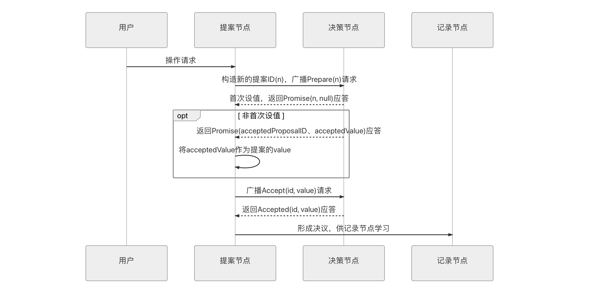
> 图：分布式共识算法 相关截图

multi paxios

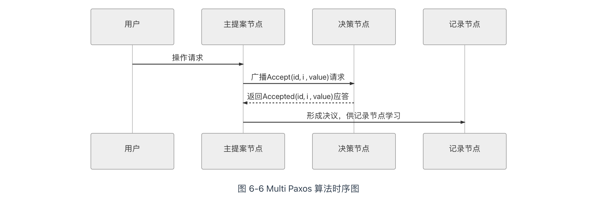
> 图：分布式共识算法 相关截图

## 常见的服务容错方式
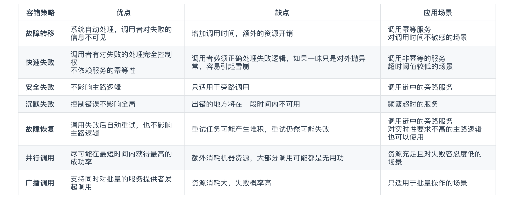
> 图：常见的服务容错方式 相关截图

## 容错设计模式
### 断路器模式

是微服务架构中最基础的容错设计模式，以至于像 Hystrix 这种服务治理工具往往被人们忽略了它的服务隔离、请求合并、请求缓存等其他服务治理职能，直接将它称之为微服务断路器或者熔断器。这个设计模式最早由技术作家 Michael Nygard 在《[Release It!](https://book.douban.com/subject/2065284/)》一书中提出的，后又因 Martin Fowler 的《[Circuit Breaker](https://martinfowler.com/bliki/CircuitBreaker.html)》一文而广为人知。

断路器的基本思路是很简单的，就是通过代理（断路器对象）来一对一地（一个远程服务对应一个断路器对象）接管服务调用者的远程请求。断路器会持续监控并统计服务返回的成功、失败、超时、拒绝等各种结果，当出现故障（失败、超时、拒绝）的次数达到断路器的阈值时，它状态就自动变为“OPEN”，后续此断路器代理的远程访问都将直接返回调用失败，而不会发出真正的远程服务请求。通过断路器对远程服务的熔断，避免因持续的失败或拒绝而消耗资源，因持续的超时而堆积请求，最终的目的就是避免雪崩效应的出现。由此可见，断路器本质是一种快速失败策略的实现方式

从调用序列来看，断路器就是一种有限状态机，断路器模式就是根据自身状态变化自动调整代理请求策略的过程。一般要设置以下三种断路器的状态：

- CLOSED

- ：表示断路器关闭，此时的远程请求会真正发送给服务提供者。断路器刚刚建立时默认处于这种状态，此后将持续监视远程请求的数量和执行结果，决定是否要进入 OPEN 状态。

- OPEN

- ：表示断路器开启，此时不会进行远程请求，直接给服务调用者返回调用失败的信息，以实现快速失败策略。

- HALF OPEN

- ：这是一种中间状态。断路器必须带有自动的故障恢复能力，当进入 OPEN 状态一段时间以后，将“自动”（一般是由下一次请求而不是计时器触发的，所以这里自动带引号）切换到 HALF OPEN 状态。该状态下，会放行一次远程调用，然后根据这次调用的结果成功与否，转换为 CLOSED 或者 OPEN 状态，以实现断路器的弹性恢复。

### 舱壁隔离模式

介绍过服务熔断和服务降级，我们再来看看另一个微服务治理中常听见的概念：服务隔离。舱壁隔离模式是常用的实现服务隔离的设计模式，舱壁这个词是来自造船业的舶来品，它原本的意思是设计舰船时，要在每个区域设计独立的水密舱室，一旦某个舱室进水，也只是影响这个舱室中的货物，而不至于让整艘舰艇沉没。这种思想就很符合容错策略中失败静默策略。

前面断路器中已经多次提到，调用外部服务的故障大致可以分为“失败”（如 400 Bad Request、500 Internal Server Error 等错误）、“拒绝”（如 401 Unauthorized、403 Forbidden 等错误）以及“超时”（如 408 Request Timeout、504 Gateway Timeout 等错误）三大类，其中“超时”引起的故障尤其容易给调用者带来全局性的风险。这是由于目前主流的网络访问大多是基于 TPR 并发模型（Thread per Request）来实现的，只要请求一直不结束（无论是以成功结束还是以失败结束），就要一直占用着某个线程不能释放。而线程是典型的整个系统的全局性资源，尤其是 Java 这类将线程映射为操作系统内核线程来实现的语言环境中，为了不让某一个远程服务的局部失败演变成全局性的影响，就必须设置某种止损方案，这便是服务隔离的意义。

### 重试模式

行文至此，笔者讲解了使用断路器模式实现快速失败策略，使用舱壁隔离模式实现静默失败策略，在断路器中举例的主动对非关键的旁路服务进行降级，亦可算作是对安全失败策略的一种体现。那还剩下故障转移和故障恢复两种策略的实现尚未涉及。接下来，笔者以重试模式来介绍这两种容错策略的主流实现方案。

故障转移和故障恢复策略都需要对服务进行重复调用，差别是这些重复调用有可能是同步的，也可能是后台异步进行；有可能会重复调用同一个服务，也可能会调用到服务的其他副本。无论具体是通过怎样的方式调用、调用的服务实例是否相同，都可以归结为重试设计模式的应用范畴。重试模式适合解决系统中的瞬时故障，简单的说就是有可能自己恢复（Resilient，称为自愈，也叫做回弹性）的临时性失灵，网络抖动、服务的临时过载（典型的如返回了 503 Bad Gateway 错误）这些都属于瞬时故障。重试模式实现并不困难，即使完全不考虑框架的支持，靠程序员自己编写十几行代码也能够完成。在实践中，重试模式面临的风险反而大多来源于太过简单而导致的滥用

## DDD组件图
[https://insights.thoughtworks.cn/c4-model/](https://insights.thoughtworks.cn/c4-model/)

http://learn.lianglianglee.com/文章/领域驱动设计在互联网业务开发中的实践.md

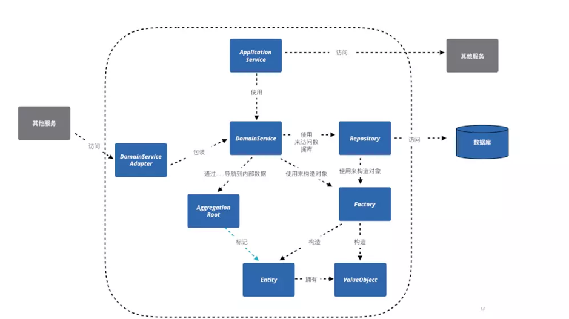
> 图：DDD组件图 相关截图

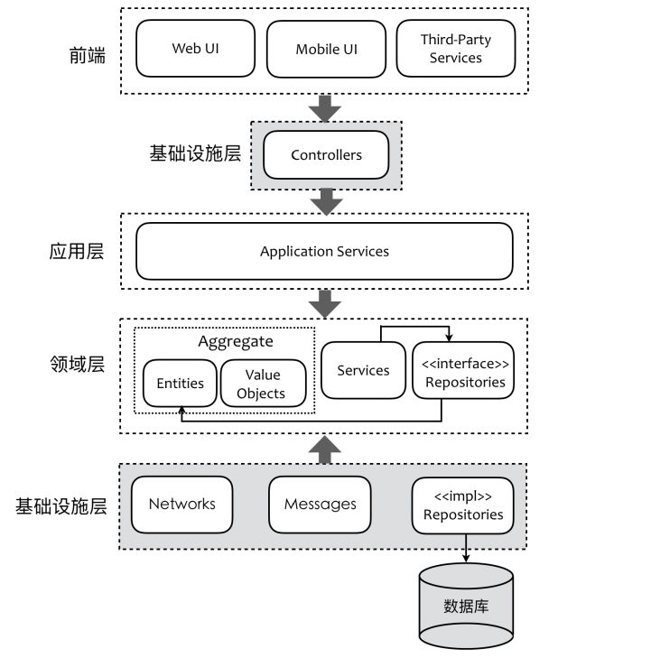
> 图：DDD组件图 相关截图

## 重构之抽象分支与绞杀者模式
### 抽象分支

1. 在需要更改的系统部分上创建抽象。

1. 重构系统的其余部分以使用抽象层。

1. 在新实现中创建新类，并根据需要让抽象层委托给旧类或新类。

1. 删除旧的实现。

1. 冲洗并重复前两个步骤，如果需要，同时运送您的系统。

1. 一旦旧实现被完全替换，您可以根据需要移除抽象层。

### 绞杀者模式

## 一致性模型 
### 严格一致性
严格的一致性类似于不存在复制过程：任何节点的任何写入都可立即用于所有节点的后续读取。它涉及全局时钟的概念，如果任何节点在时刻 T1 处写入新数据 A，则所有节点在 T2 时刻（T2 满足 T2>T1），都应该读到新写入的 A。

不幸的是，这只是理论模型，现实中无法实现。因为各种物理限制使分布式数据不可能一瞬间去同步这种变化。
### 线性一致性
线性一致性是最严格的且可实现的单对象单操作一致性模型。在这种模型下，写入的值在调用和完成之间的某个时间点可以被其他节点读取出来。且所有节点读到数据都是原子的，即不会读到数据转换的过程和中间未完成的状态。

线性一致需要满足的是，新写入的数据一旦被读取出来，那么所有后续的读操作应该能读取到这个数据。也就是说，一旦一个读取操作读到了一个值，那么后续所有读取操作都会读到这个数值或至少是“最近”的一个值。

上面的定义来自早期的论文，我将里面的关键点提炼一下，如下所示。

1. 需要有全局时钟，来实现所谓的“最近”。因为没有全局一致的时间，两个独立进程没有相同的“最近”概念。

1. 任何一次读取都能读到这个“最近”的值。

下面我通过一个例子来说明线性一致性。

现在有三个节点，其中一个共享变量 x 执行写操作，而第三个节点会读取到如下数值。

1. 第一个读操作可以返回 1、2 或空（初始值，两个写操作之前的状态），因为两个写操作仍在进行中；第一次读取可以在两次写入之前，第一次写入与第二次写入之间，以及两次写入之后。

1. 由于第一次写操作已完成，但第二次写操作尚未完成，因此第二次读操作只能返回 1 和 2。

1. 第三次读只能返回 2，因为第二次写是在第一次写之后进行的。

下图正是现象一致性的直观展示。

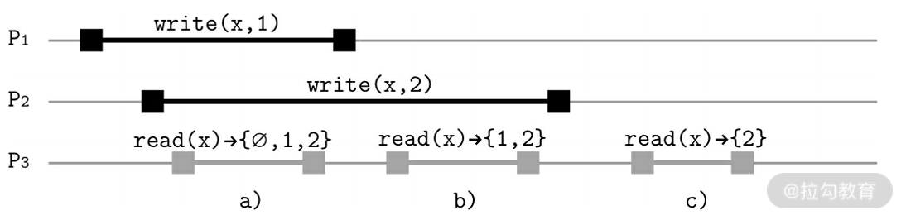
> 图：线性一致性 相关截图

图 3 线性一致性

线性一致性的代价是很高昂的，甚至 CPU 都不会使用线性一致性。有并发编程经验的朋友一定知道 CAS 操作，该操作可以实现操作的线性化，是高性能并发编程的关键，它就是通过编程手段来模拟线性一致。

一个比较常见的误区是，使用一致性算法可以实现线性一致，如 Paxos 和 Raft 等。但实际是不行的，以 Raft 为例，算法只是保证了复制 Log 的线性一致，而没有描述 Log 是如何写入最终的状态机的，这就暗含状态机本身不是线性一致的。

这里推荐你阅读 TiKV 关于线性一致的实现细节，由于线性一致性价比不高，这里就不进行赘述了，我们接下来说说顺序一致性和因果一致性。
### 顺序一致性
由于线性一致的代价高昂，因此人们想到，既然全局时钟导致严格一致性很难实现，那么顺序一致性就是放弃了全局时钟的约束，改为分布式逻辑时钟实现。顺序一致性是指所有的进程以相同的顺序看到所有的修改。读操作未必能及时得到此前其他进程对同一数据的写更新，但是每个进程读到的该数据的不同值的顺序是一致的。

下图展示了 P1、P2 写入两个值后，P3 和 P4 是如何读取的。以真实的时间衡量，1 应该是在 2 之前被写入，但是在顺序一致性下，1 是可以被排在 2 之后的。同时，尽管 P3 已经读取值 1，P4 仍然可以读取 2。但是需要注意的是这两种组合：1->2 和 2 ->1，P3 和 P4 从它们中选择一个，并保持一致。下图正是展示了它们读取顺序的一种可能：2->1。

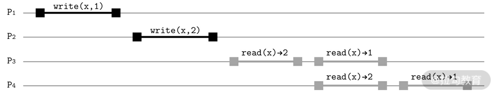
> 图：顺序一致性 相关截图

图 4 顺序一致性

我们使用下图来进一步区分线性一致和顺序一致。

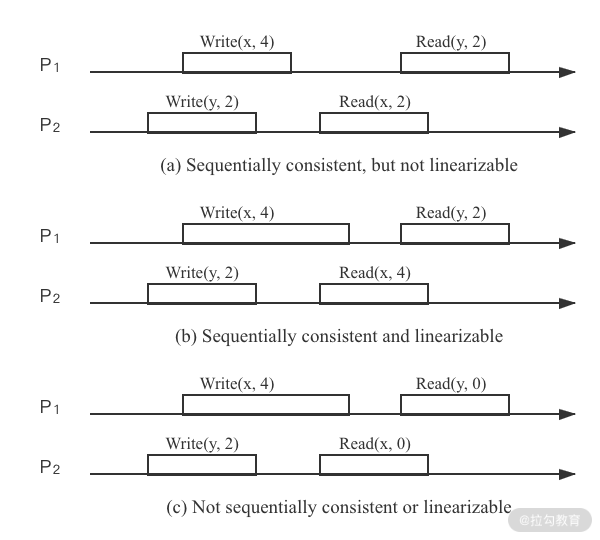
> 图：顺序一致性 相关截图

图 5 区分线性一致和顺序一致

其中，图 a 满足了顺序一致性，但是不满足线性一致性。原因在于，从全局时钟的观点来看，P2 进程对变量 x 的读操作在 P1 进程对变量 x 的写操作之后，然而读出来的却是旧的数据。但是这个图却是满足顺序一致性，因为两个进程 P1 和 P2 的一致性并没有冲突。

图 b 满足线性一致性，因为每个读操作都读到了该变量的最新写的结果，同时两个进程看到的操作顺序与全局时钟的顺序一样。

图 c 不满足顺序一致性，因为从进程 P1 的角度看，它对变量 y 的读操作返回了结果 0。那么就是说，P1 进程的对变量 y 的读操作在 P2 进程对变量 y 的写操作之前，x 变量也如此。因此这个顺序不满足顺序一致性。

在实践中，你就可以使用上文提到的一致性算法来实现顺序一致。这些算法可以保证操作在每个节点都是按照一样的顺序被执行的，所以它们能保证顺序一致。

如 Google Megastore 这类系统都是使用 Paxos 算法实现了顺序一致性。也就是说在 Megastore 内部，如果有一个数据更新，所有节点都会同步更新，且操作在各个节点上执行顺序是一致的。
### 因果一致性
相比于顺序一致性，因果一致性的要求会低一些：它仅要求有因果关系的操作顺序是一致的，没有因果关系的操作顺序是随机的。

因果相关的要求有如下几点。

1. 本地顺序：本进程中，事件执行的顺序即为本地因果顺序。

1. 异地顺序：如果读操作返回的是写操作的值，那么该写操作在顺序上一定在读操作之前。

1. 闭包传递：和时钟向量里面定义的一样，如果 a->b、b->c，那么肯定也有 a->c。

那么，为什么需要因果关系，以及没有因果关系的写法如何传播？下图中，进程 P1 和 P2 进行的写操作没有因果关系，也就是最终一致性。这些操作的结果可能会在不同时间，以乱序方式传播到读取端。进程 P3 在看到 2 之前将看到值 1，而 P4 将先看到 2，然后看到 1。

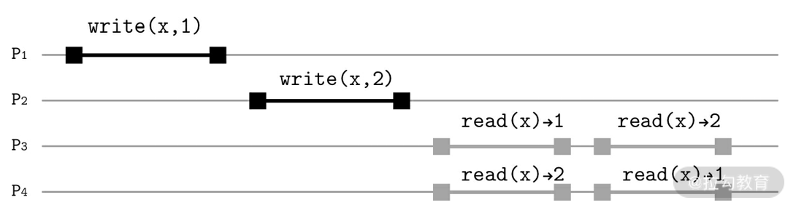
> 图：因果一致性 相关截图

图 6 因果一致性

而下图显示进程 P1 和 P2 进行因果相关的写操作并按其逻辑顺序传播到 P3 和 P4。因果写入除了写入数据外，还需要附加一个逻辑时钟，用这个时钟保证两个写入是有因果关系的。这可以防止我们遇到上面那张图所示的情况。你可以在两个图中比较一下 P3 和 P4 的历史记录。

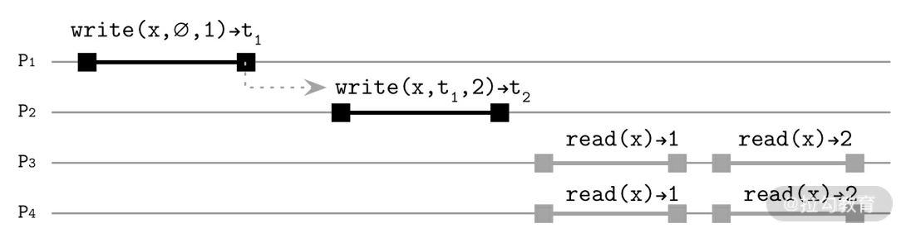
> 图：因果一致性 相关截图

图 7 逻辑时钟

而实现这个逻辑时钟的一种主要方式就是向量时钟。向量时钟算法利用了向量这种数据结构，将全局各个进程的逻辑时间戳广播给所有进程，每个进程发送事件时都会将当前进程已知的所有进程时间写入到一个向量中，而后进行传播。

因果一致性典型案例就是 COPS 系统，它是基于 causal+一致性模型的 KV 数据库。它定义了 dependencies，操作了实现因果一致性。这对业务实现分布式数据因果关系很有帮助。另外在亚马逊 Dynamo 基于向量时钟，也实现了因果一致性

## DRC
Data Replicate Center 数据复制中心，一般用于异地多活多主之间的数据复制

## jemalloc
ptmalloc 是基于 glibc 实现的内存分配器，它是一个标准实现，所以兼容性较好。pt 表示 per thread 的意思。当然 ptmalloc 确实在多线程的性能优化上下了很多功夫。由于过于考虑性能问题，多线程之间内存无法实现共享，只能每个线程都独立使用各自的内存，所以在内存开销上是有很大浪费的。

tcmalloc 出身于 Google，全称是 thread-caching malloc，所以 tcmalloc 最大的特点是带有线程缓存，tcmalloc 非常出名，目前在 Chrome、Safari 等知名产品中都有所应有。tcmalloc 为每个线程分配了一个局部缓存，对于小对象的分配，可以直接由线程局部缓存来完成，对于大对象的分配场景，tcmalloc 尝试采用自旋锁来减少多线程的锁竞争问题。

jemalloc 借鉴了 tcmalloc 优秀的设计思路，所以在架构设计方面两者有很多相似之处，同样都包含 thread cache 的特性。但是 jemalloc 在设计上比 ptmalloc 和 tcmalloc 都要复杂，jemalloc 将内存分配粒度划分为 Small、Large、Huge 三个分类，并记录了很多 meta 数据，所以在空间占用上要略多于 tcmalloc，不过在大内存分配的场景，jemalloc 的内存碎片要少于 tcmalloc。tcmalloc 内部采用红黑树管理内存块和分页，Huge 对象通过红黑树查找索引数据可以控制在指数级时间。

### 介绍下常用的内存分配器算法

**态内存分配**、**伙伴算法**和**Slab 算法**
### 动态内存分配
动态内存分配（Dynamic memory allocation）又称为堆内存分配，后面简称 DMA，操作系统根据程序运行过程中的需求即时分配内存，且分配的内存大小就是程序需求的大小。在大部分场景下，只有在程序运行的时候才知道所需要分配的内存大小，如果提前分配可能会分配的大小无法把控，分配太大会浪费空间，分配太小会无法使用。

DMA 是从一整块内存中按需分配，对于分配出的内存会记录元数据，同时还会使用空闲分区链维护空闲内存，便于在内存分配时查找可用的空闲分区，常用的有三种查找策略：

**第一种是⾸次适应算法（first fit）**，空闲分区链以地址递增的顺序将空闲分区以双向链表的形式连接在一起，从空闲分区链中找到第一个满足分配条件的空闲分区，然后从空闲分区中划分出一块可用内存给请求进程，剩余的空闲分区仍然保留在空闲分区链中。如下图所示，P1 和 P2 的请求可以在内存块 A 中完成分配。该算法每次都从低地址开始查找，造成低地址部分会不断被分配，同时也会产生很多小的空闲分区。

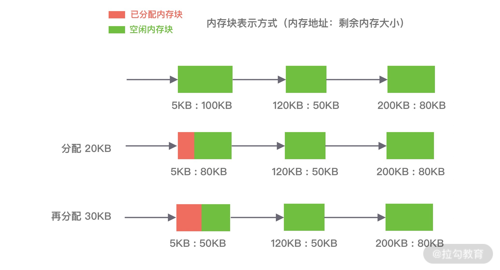
> 图：动态内存分配 相关截图

**第二种是循环首次适应算法（next fit）**，该算法是由首次适应算法的变种，循环首次适应算法不再是每次从链表的开始进行查找，而是从上次找到的空闲分区的下⼀个空闲分区开始查找。如下图所示，P1 请求在内存块 A 完成分配，然后再为 P2 分配内存时，是直接继续向下寻找可用分区，最终在 B 内存块中完成分配。该算法相比⾸次适应算法空闲分区的分布更加均匀，而且查找的效率有所提升，但是正因为如此会造成空闲分区链中大的空闲分区会越来越少。

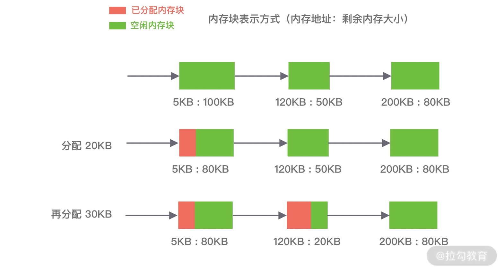
> 图：动态内存分配 相关截图

**第三种是最佳适应算法（best fit）**，空闲分区链以空闲分区大小递增的顺序将空闲分区以双向链表的形式连接在一起，每次从空闲分区链的开头进行查找，这样第一个满足分配条件的空间分区就是最优解。如下图所示，在 A 内存块分配完 P1 请求后，空闲分区链重新按分区大小进行排序，再为 P2 请求查找满足条件的空闲分区。该算法的空间利用率更高，但同样也会留下很多较难利用的小空闲分区，由于每次分配完需要重新排序，所以会有造成性能损耗。

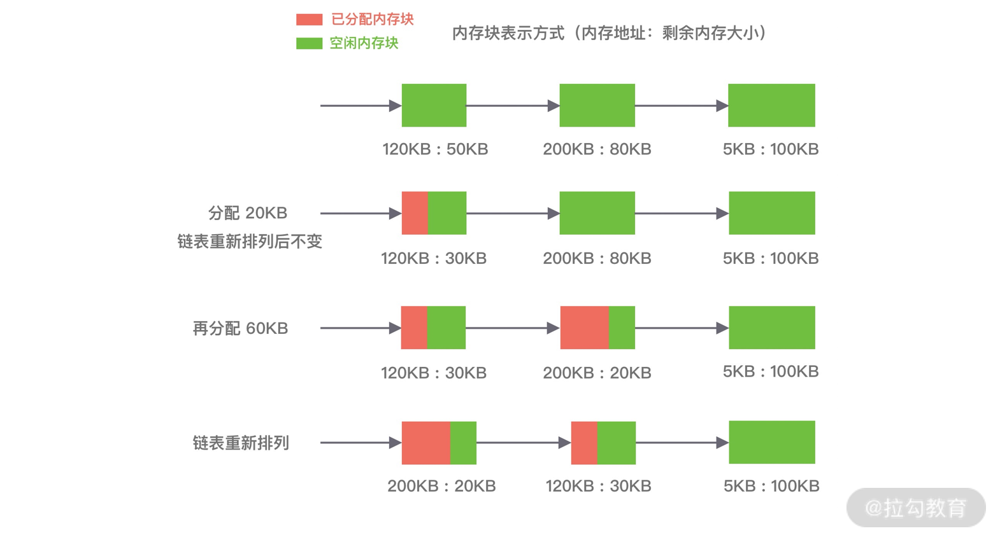
> 图：动态内存分配 相关截图
### 伙伴算法
伙伴算法是一种非常经典的内存分配算法，它采用了分离适配的设计思想，将物理内存按照 2 的次幂进行划分，内存分配时也是按照 2 的次幂大小进行按需分配，例如 4KB、 8KB、16KB 等。假设我们请求分配的内存大小为 10KB，那么会按照 16KB 分配。

伙伴算法相对比较复杂，我们结合下面这张图来讲解它的分配原理。

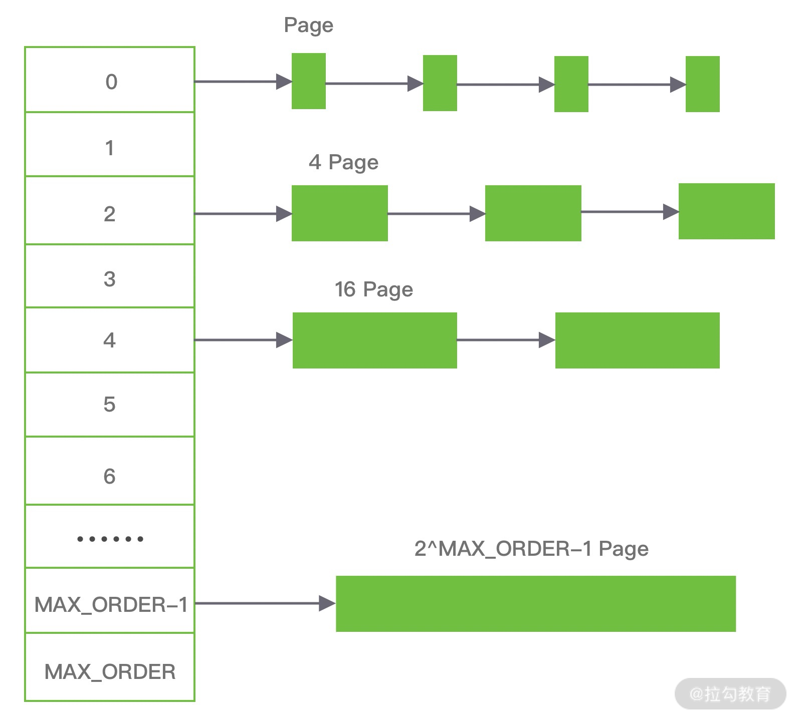
> 图：伙伴算法 相关截图

伙伴算法把内存划分为 11 组不同的 2 次幂大小的内存块集合，每组内存块集合都用双向链表连接。链表中每个节点的内存块大小分别为 1、2、4、8、16、32、64、128、256、512 和 1024 个连续的 Page，例如第一组链表的节点为 2^0 个连续 Page，第二组链表的节点为 2^1 个连续 Page，以此类推。

假设我们需要分配 10K 大小的内存块，看下伙伴算法的具体分配过程：

1. 首先需要找到存储 2^4 连续 Page 所对应的链表，即数组下标为 4；

1. 查找 2^4 链表中是否有空闲的内存块，如果有则分配成功；

1. 如果 2^4 链表不存在空闲的内存块，则继续沿数组向上查找，即定位到数组下标为 5 的链表，链表中每个节点存储 2^5 的连续 Page；

1. 如果 2^5 链表中存在空闲的内存块，则取出该内存块并将它分割为 2 个 2^4 大小的内存块，其中一块分配给进程使用，剩余的一块链接到 2^4 链表中。

以上是伙伴算法的分配过程，那么释放内存时候伙伴算法又会发生什么行为呢？当进程使用完内存归还时，需要检查其伙伴块的内存是否释放，所谓伙伴块是不仅大小相同，而且两个块的地址是连续的，其中低地址的内存块起始地址必须为 2 的整数次幂。如果伙伴块是空闲的，那么就会将两个内存块合并成更大的块，然后重复执行上述伙伴块的检查机制。直至伙伴块是非空闲状态，那么就会将该内存块按照实际大小归还到对应的链表中。频繁的合并会造成 CPU 浪费，所以并不是每次释放都会触发合并操作，当链表中的内存块个数小于某个阈值时，并不会触发合并操作。

由此可见，伙伴算法有效地减少了外部碎片，但是有可能会造成非常严重的内部碎片，最严重的情况会带来 50% 的内存碎片。
### Slab 算法
因为伙伴算法都是以 Page 为最小管理单位，在小内存的分配场景，伙伴算法并不适用，如果每次都分配一个 Page 岂不是非常浪费内存，因此 Slab 算法应运而生了。Slab 算法在伙伴算法的基础上，对小内存的场景专门做了优化，采用了内存池的方案，解决内部碎片问题。

Linux 内核使用的就是 Slab 算法，因为内核需要频繁地分配小内存，所以 Slab 算法提供了一种高速缓存机制，使用缓存存储内核对象，当内核需要分配内存时，基本上可以通过缓存中获取。此外 Slab 算法还可以支持通用对象的初始化操作，避免对象重复初始化的开销。下图是 Slab 算法的结构图，Slab 算法实现起来非常复杂，本文只做一个简单的了解。

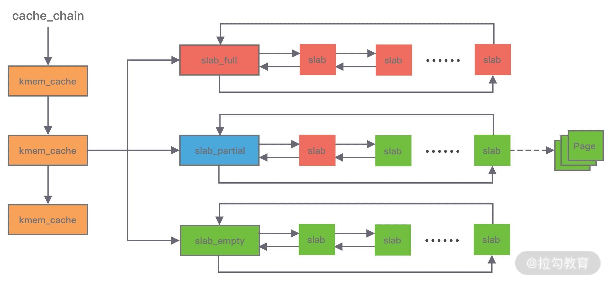
> 图：Slab 算法 相关截图

在 Slab 算法中维护着大小不同的 Slab 集合，在最顶层是 cache_chain，cache_chain 中维护着一组 kmem_cache 引用，kmem_cache 负责管理一块固定大小的对象池。通常会提前分配一块内存，然后将这块内存划分为大小相同的 slot，不会对内存块再进行合并，同时使用位图 bitmap 记录每个 slot 的使用情况。

kmem_cache 中包含三个 Slab 链表：**完全分配使用 slab_full**、**部分分配使用 slab_partial**和**完全空闲 slabs_empty**，这三个链表负责内存的分配和释放。每个链表中维护的 Slab 都是一个或多个连续 Page，每个 Slab 被分配多个对象进行存储。Slab 算法是基于对象进行内存管理的，它把相同类型的对象分为一类。当分配内存时，从 Slab 链表中划分相应的内存单元；当释放内存时，Slab 算法并不会丢弃已经分配的对象，而是将它保存在缓存中，当下次再为对象分配内存时，直接会使用最近释放的内存块。

单个 Slab 可以在不同的链表之间移动，例如当一个 Slab 被分配完，就会从 slab_partial 移动到 slabs_full，当一个 Slab 中有对象被释放后，就会从 slab_full 再次回到 slab_partial，所有对象都被释放完的话，就会从 slab_partial 移动到 slab_empty

## CEP
复杂事件处理(CEP, Complex Event Processing)是一项用于在海量数据流中锁定关联事件并用于模式分析的技术。CEP适合的场景包括实时风险管理、实时交易分析、网络欺诈、网络攻击、市场趋势分析等。

CEP的关键过程包括：

- 格式化：将外部事件转成内部能处理的格式；

- 预处理：将事件依据字段内容进行处理；

- 模式侦测：将数个事件之间关联起来，找出复合事件；

- 事件发派：将复合事件发送到相应的处理模块；

- 报警：对严重的事件进行处置。

### CEP的关键模块

1. EPL解析器：在CEP系统中，描述如何将基础事件合成复合事件的语言，称为EPL（事件处理语言）。EPL需要被解析成CEP引擎能理解的语言。

2.  规则管理：管理EPL。

3. 事件接入：通过SOA、ESB、MOM、读取日志等方式将消息接入。

4. 预处理：将事件依据字段内容进行处理。

5. CEP引擎：找出事件关联。

6. 数据模型：维护内部数据。

7. 事件发派：将已经发现的复合事件发派到负责处理的行动模块中。

8. 行动模块：对复合事件采取行动 。

## 数据最终一致性
通过一些外部手段，将分布式数据库中各个节点的数据达到一致状态。那么反熵的手段包含：前台同步、后台异步与 Gossip 协议
### 前台同步：
前台同步是通过读与写这两个前台操作，同步性地进行数据一致性修复。它们分别称为读修复（Read Repair）和暗示切换（Hinted Handoff）。

读修复

随着熵逐步增加，系统进入越来越混乱的状态。但是如果没有读取操作，这种混乱其实是不会暴露出去的。那么人们就有了一个思路，我们可以在读取操作发生的时候再来修复不一致的数据。

具体操作是，请求由一个总的协调节点来处理，这个协调节点会从一组节点中查询数据，如果这组节点中某些节点有数据缺失，该协调节点就会把缺失的数据发送给这些节点，从而修复这些节点中的数据，达到反熵的目的。

有的同学可能会发现，这个思路与上一讲的可调节一致性有一些关联。因为在可调节一致性下，读取操作为了满足一致性要求，会从多个节点读取数据从而发现最新的数据结果。而读修复会更进一步，在此以后，会将落后节点数据进行同步修复，最后将最新结果发送回客户端

暗示切换：

客户端首先写入协调节点。而后协调节点将数据分发到两个节点中，这个过程与可调节一致性中的写入是类似的。正常情况下，可以保证写入的两个节点数据是一致的。如果其中的一个节点失败了，系统会启动一个新节点来接收失败节点之后的数据，这个结构一般会被实现为一个队列（Queue），即暗示切换队列（HHQ）。

一旦失败的节点恢复了回来，HHQ 会把该节点离线这一个时间段内的数据同步到该节点中，从而修复该节点由于离线而丢失的数据。这就是在写入节点进行反熵的操作。

以上介绍的前台同步操作其实都有一个限制，就是需要假设此种熵增过程发生的概率不高且范围有限。如果熵增大范围产生，那么修复读会造成读取延迟增高，即使使用异步修复也会产生很高的冲突。而暗示切换队列的问题是其容量是有限的，这意味着对于一个长期离线的节点，HHQ 可能无法保存其全部的消息。
### 后台异步
### Merkle 树

### 位图版本向量

这种算法利用了位图这一种对内存非常友好的高密度数据格式，将节点近期的数据同步状态记录下来；而后通过比较各个节点间的位图数据，从而发现差异，修复数据

### Gossip 协议

Gossip协议是一种分布式系统中最常用的通信协议，它通过每个节点向其他节点发送消息来达到状态同步的目的。Gossip协议有利于减少网络流量，并且可以在不依赖中心服务器的情况下实现状态同步。

Gossip协议的工作原理是，每个节点都会定期向其他节点发送消息，这些消息包含节点的本地状态和其他节点的状态，接收到消息的节点会根据本地状态和消息中的状态更新本地状态，从而实现状态同步。

Gossip协议的优点是可以有效减少网络流量，因为每个节点只需要发送和接收少量消息就可以实现状态同步。此外，Gossip协议可以实现无中心服务器的情况下实现状态同步，这对于分布式系统来说是非常有用的。

Gossip协议的缺点是它的实现有一定的复杂性，因为每个节点都需要定期发送消息，并且需要更新本地状态，这需要一定的开发工作。此外，Gossip协议的状态同步可能会出现错误，因为每个节点只能接收到部分消息，而且消息可能会丢失或损坏。

总之，Gossip协议是一种有效的状态同步协议，它可以有效减少网络流量，并且可以在不依赖中心服务器的情况下实现状态同步。但是它的实现也有一定的复杂性，并且可能会出现状态同步错误。

## 微服务架构设计模式

包含了独享数据库、事件驱动、CQRS、Saga、BFF、API 网关、Strangler、断路器、外部化配置、消费端驱动的契约测试

### 1.独享数据库

### 优点

- 数据由服务完全所有。

- 服务的开发团队之间耦合度降低。

### 缺点

- 服务间的数据共享变得更有挑战性。

- 在应用范围的保证 ACID 事务变得困难许多。

- 细心设计如何拆分单体数据库是一项极具挑战的任务。

### 2.事件驱动或Event Sourcing

在微服务架构中，特别使用独享数据库时，微服务之间需要进行数据交换。对于弹性高可伸缩的和可容错的系统，它们应该通过交换事件进行异步通信。在这种情况，您可能希望进行类似更新数据库并发送消息这样的原子操作，如果在大数据量的分布式场景使用关系数据库，您将无法使用两阶段锁协议（2PL），因为它无法伸缩。而 NoSQL 数据库因为大多不支持两阶段锁协议甚至无法实现分布式事务。

在这些场景，可以基于事件的架构使用事件源模式。在传统数据库中，直接存储的是业务实体的当前“状态”，而在事件源中任何“状态”更新事件或其他重要事件都会被存储起来，而不是直接存储实体本身。这意味着业务实体的所有更改将被保存为一系列不可变的事件。因为数据是作为一系列事件存储的，而非直接更新存储，所以各项服务可以通过重放事件存储中的事件来计算出所需的数据状态。

### 优点

为高可伸缩系统提供原子性操作。

自动记录实体变更历史，包括时序回溯功能。

松耦合和事件驱动的微服务。

### 缺点

从事件存储中读取实体成为新的挑战，通常需要额外的数据存储（CQRS 模式）。

系统整体复杂性增加了，通常需要领域驱动设计。

系统需要处理事件重复（幂等）或丢失。

变更事件结构成为新的挑战。

**事件存储**：EventStoreDB， Apache Kafka， Confluent Cloud， AWS Kinesis， Azure Event Hub， GCP Pub/Sub， Azure Cosmos DB， MongoDB， Cassandra. Amazon DynamoDB

**框架**：Lagom， Akka， Spring， akkatecture， Axon，Eventuate

### 3.命令和查询职责分离（CQRS）

它有助于强化单一职责原则和分离关注点，从而实现更简洁的设计。

在其高级形式中，会有不同的数据存储用于读写操作。高级的 CQRS 通常结合事件源模式。根据不同情况，会使用不同类型的写数据存储和读数据存储。写数据存储是“记录的系统”，也就是整个系统的核心源头。

对于读频繁的应用程序或微服务架构，OLTP 数据库（任何提供 ACID 事务保证的关系或非关系数据库）或分布式消息系统都可以被用作写存储。对于写频繁的应用程序（写操作高可伸缩性和大吞吐量），需要使用写可水平伸缩的数据库（如全球托管的公共云数据库）。标准化的数据则保存在写数据存储中。

对搜索（例如 Apache Solr、Elasticsearch）或读操作（KV 数据库、文档数据库）进行优化的非关系数据库常被用作读存储。许多情况会在需要 SQL 查询的地方使用读可伸缩的关系数据库。非标准化和特殊优化过的数据则保存在读存储中。

数据是从写存储异步复制到读存储中的，所以读存储和写存储之间会有延迟，但最终是一致的。

### 优点

在事件驱动的微服务中数据读取速度更快。

数据的高可用性。

读写系统可独立扩展。

### 缺点

读数据存储是弱一致性的（最终一致性）。

整个系统的复杂性增加了，混乱的 CQRS 会显着危害整个项目。

### 可用技术示例

写存储：EventStoreDB， Apache Kafka， Confluent Cloud， AWS Kinesis， Azure Event Hub， GCP Pub/Sub， Azure Cosmos DB， MongoDB， Cassandra. Amazon DynamoDB

读存储：Elastic Search， Solr， Cloud Spanner， Amazon Aurora， Azure Cosmos DB， Neo4j

### 4.saga

如果微服务使用独享数据库，那么通过分布式事务管理一致性是一个巨大的挑战。你无法使用传统的两阶段提交协议，因为它要么不可伸缩（关系数据库），要么不被支持（多数非关系数据库）。

但您还是可以在微服务架构中使用 Saga 模式实现分布式事务。Saga 是 1987 年开发的一种古老模式，是关系数据库中关于大事务的一个替代概念。但这种模式的一种现代变种对分布式事务也非常有效。Saga 模式是一个本地事务序列，其每个事务在一个单独的微服务内更新数据存储并发布一个事件或消息。Saga 中的首个事务是由外部请求（事件或动作）初始化的，一旦本地事务完成（数据已保存在数据存储且消息或事件已发布），那么发布的消息或事件则会触发 Saga 中的下一个本地事务。

如果本地事务失败，Saga 将执行一系列补偿事务来回滚前面本地事务的更改。

Saga 事务协调管理主要有两种形式：

- 事件编排 Choreography：分散协调，每个微服务生产并监听其他微服务的事件或消息然后决定是否执行某个动作。

- 命令编排 Orchestration：集中协调，由一个协调器告诉参与的微服务哪个本地事务需要执行。

### 优点

- 为高可伸缩或松耦合的、事件驱动的微服务架构提供一致性事务。

- 为使用了不支持 2PC 的非关系数据库的微服务架构提供一致性事务。

### 缺点

- 需要处理瞬时故障，并且提供等幂性。

- 难以调试，而且复杂性随着微服务数量增加而增加。

### 4.面向前端的后端 （BFF）

面向前端的后端模式适用于需要为特殊 UI 定制单独后端的场景。它还提供了其他优势，比如作为下游微服务的封装，从而减少 UI 和下游微服务之间的频繁通信。此外，在高安全要求的场景中，BFF 为部署在 DMZ 网络中的下游微服务提供了更高的安全性

### 优点

分离 BFF 之间的关注点，使得我们可以为具体的 UI 优化他们。

提供更高的安全性。

减少 UI 和下游微服务之间频繁的通信。

### 缺点

BFF 之间代码重复。

大量的 BFF 用于其他用户界面（例如，智能电视，Web，移动端，PC 桌面版）。

需要仔细的设计和实现，BFF 不应该包含任何业务逻辑，而应只包含特定客户端逻辑和行为。

### 5.API 网关

在微服务架构中，UI 通常连接多个微服务。如果微服务是细粒度的（FaaS） ，那么客户端可能需要连接非常多的微服务，这将变得繁杂和具有挑战性。此外，这些服务包括它们的 API 还将不断进化。大型企业还希望能有其他横切关注点（SSL 终止、身份验证、授权、节流、日志记录等）。

一个解决这些问题的可行方法是使用 API 网关。API 网关位于客户端 APP 和后端微服务之间充当 facade，它可以是反向代理，将客户端请求路由到适当的后端微服务。它还支持将客户端请求扇出到多个微服务，然后将响应聚合后返回给客户端。它还支持必要的横切关注点。

### 优点

- 在前端和后端服务之间提供松耦合。

- 减少客户端和微服务之间的调用次数。

- 通过 SSL 终端、身份验证和授权实现高安全性。

- 集中管理的横切关注点，例如，日志记录和监视、节流、负载平衡。

### 缺点

- 可能导致微服务架构中的单点故障。

- 额外的网络调用带来的延迟增加。

- 如果不进行扩展，它们很容易成为整个企业应用的瓶颈。

- 额外的维护和开发费用。

### 6.Strangler（就是扼杀者模式）

如果想在运行中的项目中使用微服务架构，我们需要将遗留的或现有的单体应用迁移到微服务。将现有的大型在线单体应用程序迁移到微服务是相当有挑战性的，因为这可能破坏应用程序的可用性。

一个解决方案是使用 Strangler 模式。Strangler 模式意味着通过使用新的微服务逐步替换特定功能，将单体应用程序增量地迁移到微服务架构。此外，新功能只在微服务中添加，而不再添加到遗留的单体应用中。然后配置一个 Facade （API 网关）来路由遗留单体应用和微服务间的请求。当某个功能从单体应用迁移到微服务，Facade 就会拦截客户端请求并路由到新的微服务。一旦迁移了所有的功能，遗留单体应用程序就会被“扼杀（Strangler）”，即退役。

### 优点

- 安全的迁移单体应用程序到微服务。

- 可以并行地迁移已有功能和开发新功能。

- 迁移过程可以更好把控节奏。

### 缺点

- 在现有的单体应用服务和新的微服务之间共享数据存储变得具有挑战性。

- 添加 Facade （API 网关）将增加系统延迟。

- 端到端测试变得困难。

### 7.断路器

在微服务架构中，微服务通过同步调用其他服务来满足业务需求。服务调用会由于瞬时故障（网络连接缓慢、超时或暂时不可用） 导致失败，这种情况重试可以解决问题。然而，如果出现了严重问题（微服务完全失败），那么微服务将长时间不可用，这时重试没有意义且浪费宝贵的资源（线程被阻塞，CPU 周期被浪费）。此外，一个服务的故障还会引发整个应用系统的级联故障。这时快速失败是一种更好的方法。

在这种情况，可以使用断路器模式挽救。一个微服务通过代理请求另一个微服务，其工作原理类似于电气断路器，代理通过统计最近发生的故障数量，并使用它来决定是继续请求还是简单的直接返回异常。

断路器可以有以下三种状态：

- 关闭：断路器将请求路由到微服务，并统计给定时段内的故障数量，如果超过阈值，它就会触发并进入打开状态。

- 打开：来自微服务的请求会快速失败并返回异常。在超时后，断路器进入半开启状态。

- 半开：只有有限数量的微服务请求被允许通过并进行调用。如果这些请求成功，断路器将进入闭合状态。如果任何请求失败，断路器则会进入开启状态。

### 优点

- 提高微服务架构的容错性和弹性。

- 阻止引发其他微服务的级联故障。

### 缺点

- 需要复杂的异常处理

- 日志和监控。

- 应该支持人工复位。

### 8.外部化配置

每个业务应用都有许多用于各种基础设施的配置参数（例如，数据库、网络、连接的服务地址、凭据、证书路径）。此外在企业应用程序通常部署在各种运行环境（Local、 Dev、 Prod）中，实现这些的一个方法是通过内部配置。这是一个致命糟糕实践，它会导致严重的安全风险，因为生产凭证很容易遭到破坏。此外，配置参数的任何更改都需要重新构建应用程序，这在在微服务架构中会更加严峻，因为我们可能拥有数百个服务。

更好的方法是将所有配置外部化，使得构建过程与运行环境分离，生产的配置文件只在运行时或通过环境变量使用，从而最小化了安全风险。

### 优点

- 生产配置不属于代码库，因而最小化了安全漏洞。

- 修改配置参数不需要重新构建应用程序。

### 缺点

- 我们需要选择一个支持外部化配置的框架。

- 何时使用外部化配置

- 任何重要的生产应用程序都必须使用外部化配置。

- 何时不宜使用外部化配置

- 在验证概念的开发中。

### 9.消费端驱动的契约测试

在微服务架构中，通常有许多有不同团队开发的微服务。这些微型服务协同工作来满足业务需求（例如，客户请求），并相互进行同步或异步通信。消费端微服务的集成测试具有挑战性，通常用 TestDouble 以获得更快、更低成本的测试运行。但是 TestDouble 通常并不能代表真正的微服务提供者，而且如果微服务提供者更改了它的 API 或 消息，那么 TestDouble 将无法确认这些。另一种选择是进行端到端测试，尽管它在生产之前是强制性的，但却是脆弱的、缓慢的、昂贵的且不能替代集成测试（Test Pyramid）。

在这方面消费端驱动的契约测试可以帮助我们。在这里，负责消费端微服务的团队针对特定的服务端微服务，编写一套包含了其请求和预期响应（同步）或消息（异步）的测试套件，这些测试套件称为显式的约定。对于微服务服务端，将其消费端所有约定的测试套件都添加到其自动化测试中。当特定服务端微服务的自动化测试执行时，它将一起运行自己的测试和约定的测试并进行验证。通过这种方式，契约测试可以自动的帮助维护微服务通信的完整性。

### 优点

- 如果提供程序意外更改 API 或消息，可以被快速的自动发现。

- 更少意外、更健壮，特别是包含大量微服务的企业应用程序。

- 改善团队自主性。

### 缺点

- 需要额外的工作来开发和集成微服务服务端的契约测试，因为他们可能使用完全不同的测试工具。

- 如果契约测试与真实服务情况不匹配，将可能导致生产故障。

### 何时使用需求驱动的契约测试

在大型企业业务应用程序中，通常由不同的团队开发不同服务。

### 何时不宜使用消费端驱动的契约测试

- 所有微服务由同一团队负责开发的小型简单的应用程序。

- 如果服务端微服务是相对稳定的，并且不处在活跃的开发状态。

## CPU 的分支预测(Branch Prediction)模型

分支预测器是一种数字电路，在分支指令执行前，猜测哪一个分支会被执行，能显著提高pipelines的性能。

条件分支通常有两路后续执行分支，not token时,跳过接下来的JMP指令，继续执行， token时，执行JMP指令，跳转到另一块程序内存去执行。

### 没有分支预测器会怎样？

加入没有分支预测器，处理器会等待分支指令通过了pipeline的执行阶段(execuate stage)才能把下一条指令送入pipeline的fetch stage。

这会造成流水线停顿(stalled)或流水线冒泡(bubbling)或流水线打嗝(hiccup)，即在流水线中生成一个没有实效的气泡

[https://blog.csdn.net/qq_40227064/article/details/124326907](https://blog.csdn.net/qq_40227064/article/details/124326907)

## Pipeline

先简单说明一下CPU的instruction pipeline(指令流水线)，以下简称pipeline。 Pipieline假设程序运行时有一连串指令要被运行，将程序运行划分成几个阶段，按照一定的顺序并行处理之，这样便能够加速指令的通过速度。

绝大多数pipeline都由时钟频率(clock)控制，在数字电路中，clock控制逻辑门电路(logical cicuit)和触发器(trigger), 当受到时钟频率触发时，触发器得到新的数值，并且逻辑门需要一段时间来解析出新的数值，而当受到下一个时钟频率触发时触发器又得到新的数值，以此类推。

而借由逻辑门分散成很多小区块，再让触发器链接这些小区块组，使逻辑门输出正确数值的时间延迟得以减少，这样一来就可以减少指令运行所需要的周期。 这对应Pipeline中的各个stages。

一般的pipeline有四个执行阶段(execuate stage): 读取指令(Fetch) -> 指令解码(Decode) -> 运行指令(Execute) -> 写回运行结果(Write-back).

## 什么时机才把 Cache 中的数据写回到内存

- 写直达（**Write Through**）

保持内存与 Cache 一致性最简单的方式是，把数据同时写入内存和 Cache 中，这种方法称为写直达（Write Through）。

- 写回（**Write Back**）

在写回机制中，当发生写操作时，新的数据仅仅被写入 Cache Block 里，只有当修改过的 Cache Block「被替换」时才需要写到内存中，减少了数据写回内存的频率，这样便可以提高系统的性能。

[https://xiaolincoding.com/os/1_hardware/cpu_mesi.html#](https://xiaolincoding.com/os/1_hardware/cpu_mesi.html#)缓存一致性问题

1. 单库单应用模式：最简单的，可能大家都见过

1. 内容分发模式：目前用的比较多

1. 查询分离模式：对于大并发的查询、业务

1. 微服务模式：适用于复杂的业务模式的拆解

1. 多级缓存模式：可以把缓存玩的很好

1. 分库分表模式：解决单机数据库瓶颈

1. 弹性伸缩模式：解决波峰波谷业务流量不均匀的方法之一

1. 多机房模式：解决高可用、高性能的一种方法

## CPU架构
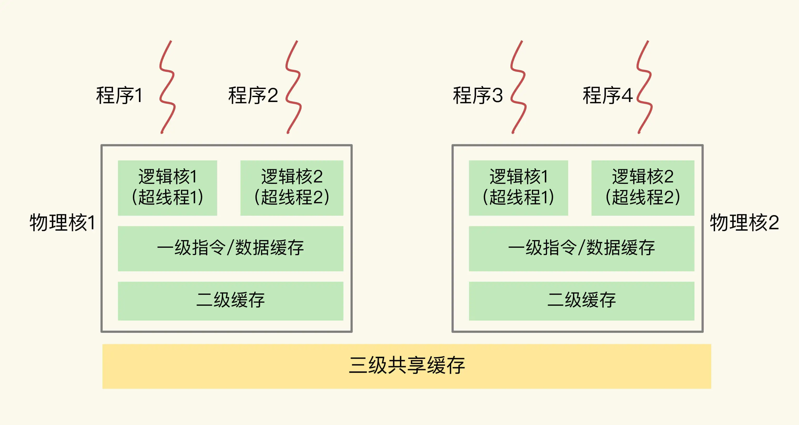
> 图：CPU架构 相关截图

在主流的服务器上，一个 CPU 处理器会有 10 到 20 多个物理核。同时，为了提升服务器的处理能力，服务器上通常还会有多个 CPU 处理器（也称为多 CPU Socket）

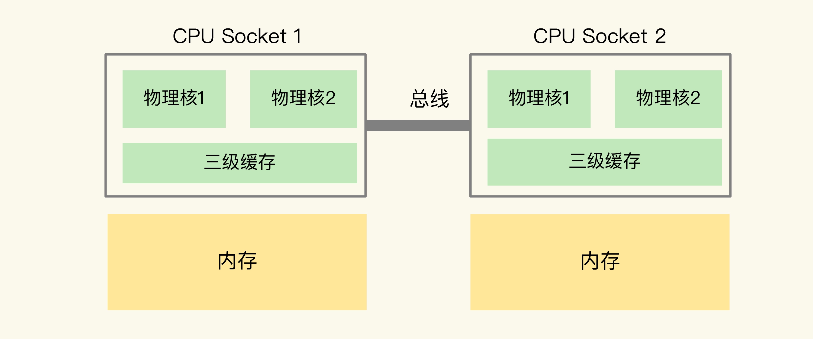
> 图：CPU架构 相关截图

## 列存储的查询优势

1. 列式存储把相同类型的数据归在一起，压缩比可以很高，通常能到10%~25%。数据库的瓶颈通常在IO，很高的压缩比，可以大大减轻数据读取的压力，提高响应速度。

1. 除去字符串类型，其他类型的字段通常是固定长度的，而且在磁盘和内存的字节顺序通常是一致的，可以直接映射，省去了解析的过程。而在行存储中，只要有变长的字段存在，需要逐行逐字段的解析。

1. 列式存储可以向量化的处理一个字段。可以将一个列的一整块连续数据读入CPU cache，效率非常高。而且，可以利用CPU的向量化处理指令并行处理一些常用计算，譬如求和，比较大小等等。而这一切在行存储中都做不到。

1. 因为数据表中的数据类型都是用户定义的，开发数据库的各种算子的时候，通常都是虚拟函数。在行存储中，意味着在每一行evaluate这个算子（譬如加法算子）的时候，我们都需要一个很大的case语句，对不同的数据类型分别处理，效率很低。而在列式存储中，极端情况下，对整个列只要做一次case处理就可以了，效率就会很高。当然近几年，很多数据库引擎都引入了JIT，行存储这方面的劣势在缩小。

## 向量化处理

向量化的执行离不开SIMD，全称single instruction multiple data，对于现代多核CPU，其都有能力用一条指令执行多条数据，我们看下面一个简单的代码：

```text
for (size_t i = 0; i < 100; ++i) 
    c[i] = a[i] + b[i];
```

这个代码会循环100次，将a和b数组对应下标的数字相加如何赋值给c，那么如何加速这样的计算呢，一个朴素的想法就是写出如下的代码：

```text
c[0] = a[0] + b[0]; 
c[1] = a[1] + b[1];
... ... 
```

## SQL优化之火山模型
[https://zhuanlan.zhihu.com/p/219516250](https://zhuanlan.zhihu.com/p/219516250)

火山模型是数据库界已经很成熟的解释计算模型，该计算模型将关系代数中每一种操作抽象为一个 Operator，将整个 SQL 构建成一个 Operator 树，从根节点到叶子结点自上而下地递归调用 next() 函数。

## CAP的补充之PACELC 理论

根据 PACELC 模型的定义，如果有网络分区产生，系统就必须在 A 和 C 之间取得平衡，否则（Else，即 PACELC 中的 E）当系统运行在无网络分区情况下，系统需要在 L（延迟）和 C 之间取得平衡。

## CPU的调度算法

对于一种CPU调度算法的好坏，一般都通过如下两个指标来进行衡量：

- **周转时间**（turnaround time），指从任务到达至任务完成之间的时间

- **响应时间**（response time），指从任务到达至任务首次被调度的时间

FIFO（First In First Out，先进先出）调度算法以原理简单，容易实现著称，它先调度首先到达的任务直至结束，然后再调度下一个任务，以此类推。如果有多个任务同时到达，则随机选一个。

SJF（Shortest Job First，最短任务优先）从相同到达时间的多个任务中选取运行时长最短的一个任务进行调度，接着再调度第二短的任务，以此类推。

STCF：最短时间完成优先

为了解决SJF的任务饿死问题，我们需要打破假设3，也即任务在运行过程中是允许被打断的。如果B和C在到达时就立即被调度，问题就解决了。这属于抢占式调度，原理就是CPU上下文切换一节提到的，在中断定时器到达之后，OS完成任务A和B的上下文切换。

我们在协作式调度的SJF算法的基础上，加上抢占式调度算法，就演变成了STCF算法（Shortest Time-to-Completion First，最短时间完成优先），调度原理是当运行时长较短的任务到达时，中断当前的任务，优先调度运行时长较短的任务。

RR：基于时间片的轮询调度

RR（Round Robin，轮训）算法给每个任务分配一个时间片，当任务的时间片用完之后，调度器会中断当前任务，切换到下一个任务，以此类推。

MLFQ（Multi-Level Feedback Queue，多级反馈队列）调度算法的目标如下：

1. 优化周转时间。

1. 降低交互类任务的响应时间，提升用户体验。

- **规则1**：如果Priority(A) > Priority(B)，则调度A

- **规则2**：如果Priority(A) = Priority(B)，则按照RR算法调度A和B

- **规则3**：当一个新的任务到达时，将它放到最高优先级队列中

- **规则4**：给每个优先级分配一个时间片，当任务用完该优先级的时间片后，优先级降一级

- **规则5**：系统运行S时长之后，将所有任务放到最高优先级队列上（**Priority Boost**）

### CFS：Linux的完全公平调度

本节我们将介绍一个平时打交道最多的调度算法，Linux系统下的CFS（Completely Fair Scheduler，完全公平调度）。与上一节介绍的MLFQ不同，**CFS并非以优化周转时间和响应时间为目标，而是希望将CPU公平地均分给每个任务**。

## CPU的架构

- 对称多处理器结构 SMP

对称多处理器结构是指多个CPU对称平等，共享相同的物理内存/IO等资源，因此SMP结构属于一致存储器访问结构 UMA。

共享模式下所有CPU平等地使用资源，模式简单，在CPU数量不多时效率很不错，但是优点也可能变为拦路虎。

试想一种场景如果在SMP模式下为了提高服务器的处理能力，我们水平扩展了CPU数量，这些CPU通过相同的总线访问内存。

随着CPU数量的增加，相同内存地址访问冲突将明显增加，间接造成了CPU资源浪费，相关实验证明，SMP服务器最好的情况是2-4个CPU

- 非一致存储访问结构 NUMA

NUMA 技术同样有缺陷，由于访问远地内存的延时远远超过本地内存，当 CPU 数量增加时，系统性能无法线性增加，换句话说增加1倍的CPU数量并不能获得1倍的性能提升，因此仍然存在扩展限制区。

- 海量并行处理结构 MPP

MPP是Massive Parallel Processing的缩写，MPP 是另外一种系统扩展的方式，它由多个 SMP 服务器通过一定的节点互联网络进行连接，完成相同的任务，可以看作是SMP的水平扩展。

在MPP结构中多个 SMP 服务器是一种完全无共享Share Nothing)结构，因而扩展能力最好，典型的就是刀片服务器，有的文章说MPP架构很像MapReduce模式，多个SMP服务器节点之间通过互联网络实现，目前并没有统一的数据通信协议，并且这部分交互协议对用户是无感知的。

MPP架构有点像刀片服务器的感觉，每一片都是独立的，片与片直接由特定的协议进行数据交互。

## 数据脱敏

数据脱敏又分为静态数据脱敏（SDM）和 动态数据脱敏（DDM）。

静态数据脱敏（SDM）：适用于将数据抽取出生产环境脱敏后分发至测试、开发、培训、数据分析等场景。

有时我们可能需要将生产环境的数据  copy 到测试、开发库中，以此来排查问题或进行数据分析，但出于安全考虑又不能将敏感数据存储于非生产环境，此时就要把敏感数据从生产环境脱敏完毕之后再在非生产环境使用。

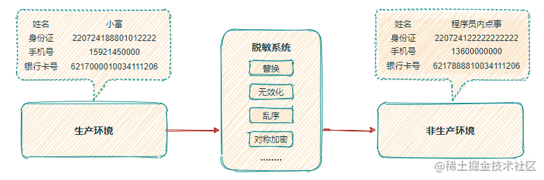
> 图：数据脱敏 相关截图

动态数据脱敏（DDM）：一般用在生产环境，访问敏感数据时实时进行脱敏，因为有时在不同情况下对于同一敏感数据的读取，需要做不同级别的脱敏处理，例如：不同角色、不同权限所执行的脱敏方案会不同。

**注意**：在抹去数据中的敏感内容同时，也需要保持原有的数据特征、业务规则和数据关联性，保证我们在开发、测试以及数据分析类业务不会受到脱敏的影响，使脱敏前后的数据一致性和有效性。**总之一句话：你爱怎么脱就怎么脱，别影响我使用就行**。

## 分布式事务之XA规范
XA 规范主要定义了面向全局的事务管理器 TransactionManager（TM）和面向局部的资源管理器 ResourceManager（RM）之间的接口。

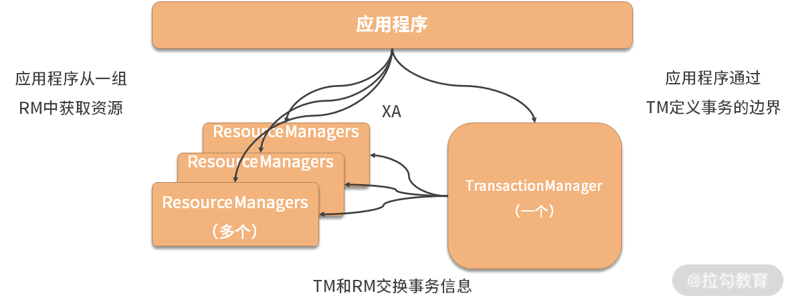
> 图：分布式事务之XA规范 相关截图

## 分布式系统的Quorum 机制

在学习 Paxos 算法之前，我们先来看分布式系统中的 Quorum 选举算法。在各种一致性算法中都可以看到Quorum 机制的身影，主要数学思想来源于抽屉原理，用一句话解释那就是，在 N 个副本中，一次更新成功的如果有 W 个，那么我在读取数据时是要从大于 N－W 个副本中读取，这样就能至少读到一个更新的数据了。 和 Quorum 机制对应的是 WARO，也就是Write All Read one，是一种简单的副本控制协议，当 Client 请求向某副本写数据时（更新数据），只有当所有的副本都更新成功之后，这次写操作才算成功，否则视为失败。 WARO 优先保证读服务，因为所有的副本更新成功，才能视为更新成功，从而保证了

所有的副本一致，这样的话，只需要读任何一个副本上的数据即可。写服务的可用性较低，因为只要有一个副本更新失败，此次写操作就视为失败了。假设有 N 个副本，N－1 个都宕机了，剩下的那个副本仍能提供读服务；但是只要有一个副本宕机了，写服务就不会成功。 WARO 牺牲了更新服务的可用性，最大程度地增强了读服务的可用性，而 Quorum 就是在更新服务和读服务之间进行的一个折衷。

## 稳定性建设的思考

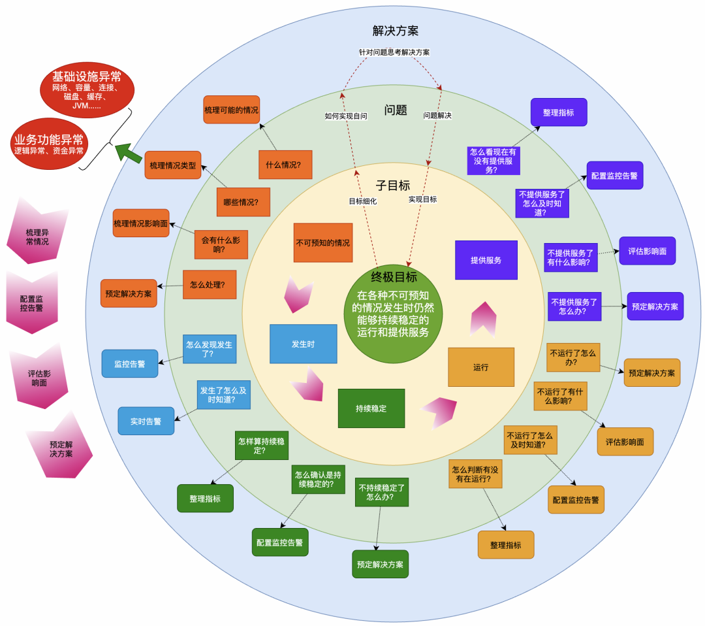
> 图：稳定性建设的思考 相关截图

首先，将目标细分为子目标，可以通过**抽取目标中的关键字定义子目标**。从“在各种不可预知的情况发生时仍然能够持续稳定的运行和提供服务”中可提取出 **不可预知的情况、发生时、持续稳定、运行、提供服务**。这五个关键字就是稳定性保障工作的子目标。

然后，针对每个子目标进行提问，凡是自己有疑问的都罗列出来。包括但不限于对目标的理解类疑问、对目标实现的方法类疑问、对目标实现的标准类疑问。

之后，对自己所有的疑问找出答案或解决方案。就像上学期间导师给出课题，自己去理解去解决的过程。这可能需要查阅资料、现状分析、方案选择、最终决策、实际落地。

如此，所有的子目标都将逐一实现，最终，子目标的实现进而完成终极目标的整体实现。

综上，上图中最外层的淡蓝色圈中的内容就是我们为了实现稳定性保障目标所需要做的工作了。初看起来很多，细看下来隐有规律，再看之下发现本质就是这几点：什么现象？如何发现？什么影响？如何处理？现象、影响、处理方式都与具体异常耦合，发现靠监控告警。

总结起来就是：**梳理异常情况->配置监控告警->评估影响面->预定解决方案**。

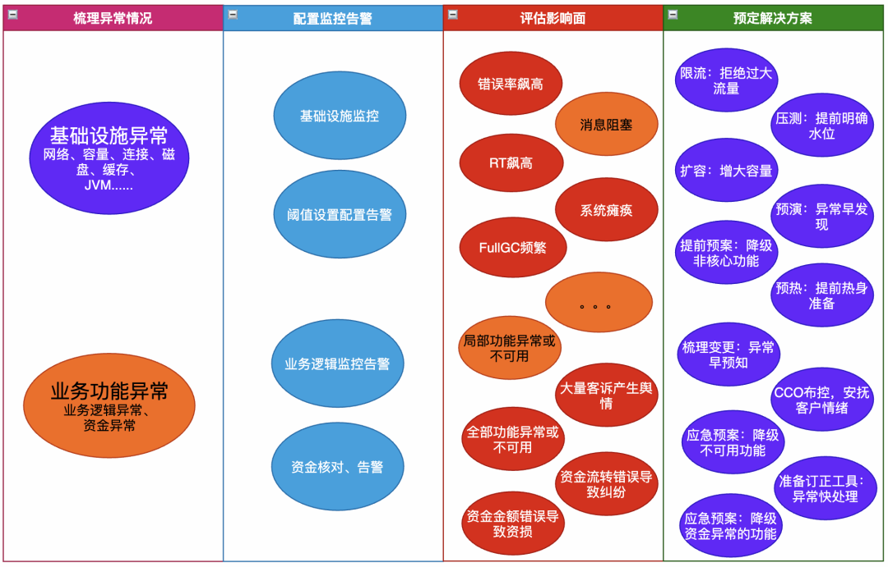
> 图：稳定性建设的思考 相关截图

## HTTPS

[https://mp.weixin.qq.com/s?__biz=MzIyNDU2ODA4OQ==&mid=2247484659&idx=1&sn=dec902f42a5aa61800eef960199caaaa&chksm=e80db285df7a3b939613f05e333cf7435f6e21d54b332619c30d41c3024b8383d85ecb7ec96c&scene=21#wechat_redirect](https://mp.weixin.qq.com/s?__biz=MzIyNDU2ODA4OQ==&mid=2247484659&idx=1&sn=dec902f42a5aa61800eef960199caaaa&chksm=e80db285df7a3b939613f05e333cf7435f6e21d54b332619c30d41c3024b8383d85ecb7ec96c&scene=21#wechat_redirect)

## 入门HDFS

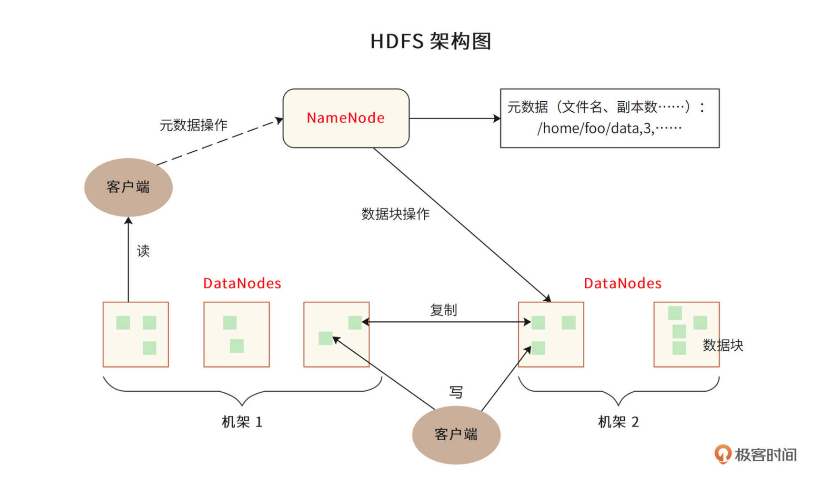
> 图：入门HDFS 相关截图

HDFS的关键组件有两个，一个是NameNode，另一个是DataNode。

NameNode负责整个分布式文件系统的元数据管理，也就是文件路径名、访问权限、数据块ID、存储位置等信息。而DataNode负责文件数据的存储和读写操作，HDFS将文件数据分割成若干数据块（Block），每个DataNode存储一部分数据块，这样文件就分布存储在了整个HDFS服务器集群中。

## 入门HBase

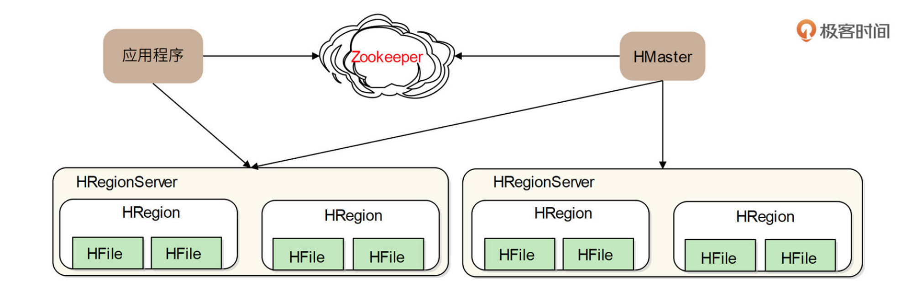
> 图：入门HBase 相关截图

HRegion是HBase中负责数据存储的主要进程，应用程序对数据的读写操作都是通过和HRetion通信完成的。也就是说，应用程序如果想要访问一个数据，必须先找到HRegion，然后将数据读写操作提交给HRegion，而HRegion最终将数据存储到HDFS文件系统中。由于HDFS是分布式、高可用的，所以HBase的数据存储天然是分布式、高可用的。

因此HBase的设计重点就是HRegion的分布式。HRegionServer是物理服务器，这些服务器构成一个分布式集群，每个HRegionServer上可以启动多个HRegion实例。当一个 HRegion中写入的数据太多，达到配置的阈值时，一个HRegion会分裂成两个HRegion，并将HRegion在整个集群中进行迁移，以使HRegionServer的负载均衡，进而实现HRegion的分布式。

应用程序如果想查找数据记录，需要使用数据的key。每个HRegion中存储一段Key值区间[key1, key2)的数据，而所有HRegion的信息，包括存储的Key值区间、所在HRegionServer地址、访问端口号等，都记录在HMaster服务器上。因此，应用程序要先访问HMaster服务器，得到数据key所在的HRegion信息，再访问对应的HRegion获取数据。为了保证HMaster的高可用，HBase会启动多个HMaster，并通过ZooKeeper选举出一个主服务器

## 架构方面的核心优化思路

**通过分布式集群扩展系统的服务器，降低单一服务器的负载压力；通过缓存的方式降低系统的读负载压力；通过消息队列降低系统的写负载压力**

## Schema-on-Write

Schema-on-Write是一种数据处理方法，即当数据最初存储时就定义和执行模式（数据的结构）。在此方法中，数据被验证和转换以符合固定的模式，然后再将其写入数据库。这确保数据遵循预定义的规则和规约，使其更易于维护和分析。

Schema-on-Write通常用于传统的关系型数据库中，其中数据根据预定义的模式进行结构化和组织。这使得基于数据创建查询和报告变得更加容易，因为模式提供了对数据代表的清晰理解。

但是，Schema-on-Write也可以具有局限性，因为它需要很多规划和预先设计，以确保模式足够满足未来的需求。如果稍后需要更改模式，则更改整个数据库可能会耗费大量时间和精力。

## Schema-on-read

Schema-on-read是一种数据处理方法，它将数据以原始、非结构化的格式存储，并仅在需要进行分析或报告时才应用模式或结构。在这种方法中，数据以其原始形式存储，只有在进行查询或分析时才应用模式。这允许更快的数据探索和分析，因为数据不需要在使用之前进行预处理或结构化。

Schema-on-read通常用于大数据分析中，其中数据往往过大且多样化，无法预先结构化。通过以原始形式存储数据，组织可以更轻松地进行新的分析和数据模型实验，而无需重复结构化数据。

但是，需要注意的是，Schema-on-read确实需要仔细地管理元数据，因为随着添加或分析新数据，模式可能需要更新或更改。此外，在缺乏预先结构时，如果未在分析或报告之前正确验证数据，则可能导致数据质量问题。

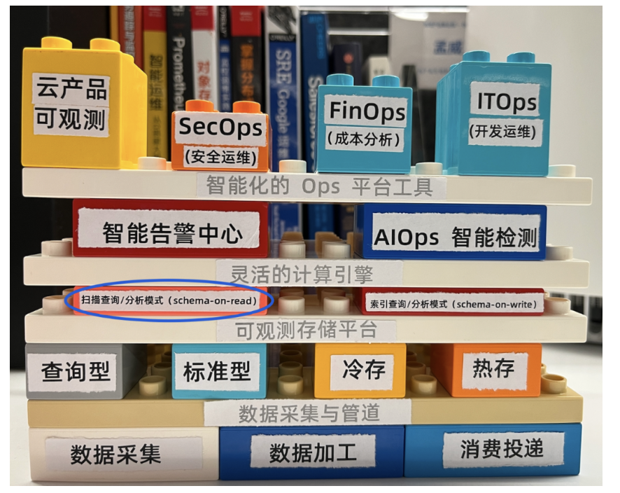
> 图：Schema-on-read 相关截图

## Erasure Code - EC纠删码原理

### 一、什么是Erasure Code

Erasure Code（EC），即纠删码，是一种前向错误纠正技术（Forward Error Correction，FEC，说明见后附录），主要应用在网络传输中避免包的丢失， 存储系统利用它来提高 存储 可靠性。相比多副本复制而言， 纠删码能够以更小的数据冗余度获得更高数据可靠性， 但编码方式较复杂，需要大量计算 。纠删码只能容忍数据丢失，无法容忍数据篡改，纠删码正是得名与此。

EC的定义：Erasure Code是一种编码技术，它可以将n份原始数据，增加m份数据，并能通过n+m份中的任意n份数据，还原为原始数据。即如果有任意小于等于m份的数据失效，仍然能通过剩下的数据还原出来。

目前，纠删码技术在分布式存储 系统中的应用主要有三类，阵列纠删码（Array Code: RAID5、RAID6等）、RS(Reed-Solomon)里德-所罗门类纠删码和LDPC(LowDensity Parity Check Code)低密度奇偶校验纠删码。

RAID是EC的特殊情况。在传统的RAID中，仅支持有限的磁盘失效，RAID5只支持一个盘失效，RAID6支持两个盘失效，而EC支持多个盘失效。

EC主要运用于存储和数字编码领域。例如磁盘阵列存储（RAID 5、RAID 6），云存储（RS）等。

LDPC码也可以提供很好的保障可靠性的冗余机制。与RS编码相比，LDPC编码效率要略低，但编码和解码性能要优于RS码以及其他的纠删码，主要得益于编解码采用的相对较少并且简单的异或操作。LDPC码目前主要用于通信、视频和音频编码等领域。

原文链接：[https://blog.csdn.net/shelldon/article/details/54144730](https://blog.csdn.net/shelldon/article/details/54144730)

## malloc、brk和mmap

malloc、brk和mmap都是在C语言中用于动态分配内存的系统调用函数，其中malloc通常基于brk和mmap来实现。下面是它们之间的关系：

1. brk： 是一个系统调用函数，用于改变进程数据段的大小，可以用于修改进程的堆空间大小。使用brk系统调用函数将进程数据段的“顶部”向上扩展一段内存，其中新空间的大小对应于稍后分配的内存量。

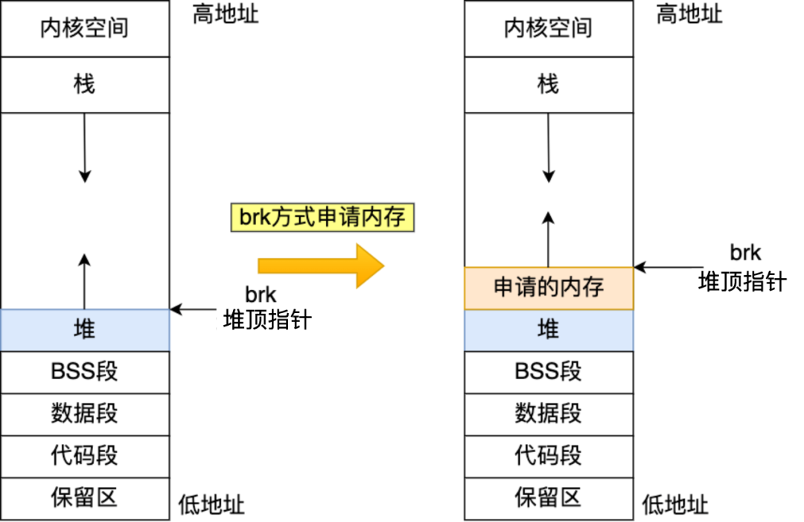
> 图：malloc、brk和mmap 相关截图

1. mmap：是另一个系统调用函数，用于将一个文件映射到进程地址空间中，也可用于分配匿名（无磁盘文件关联）内存，从而用于进程的堆或栈空间。使用mmap系统调用可以从用户虚拟地址空间中获取一段未使用的连续内存。

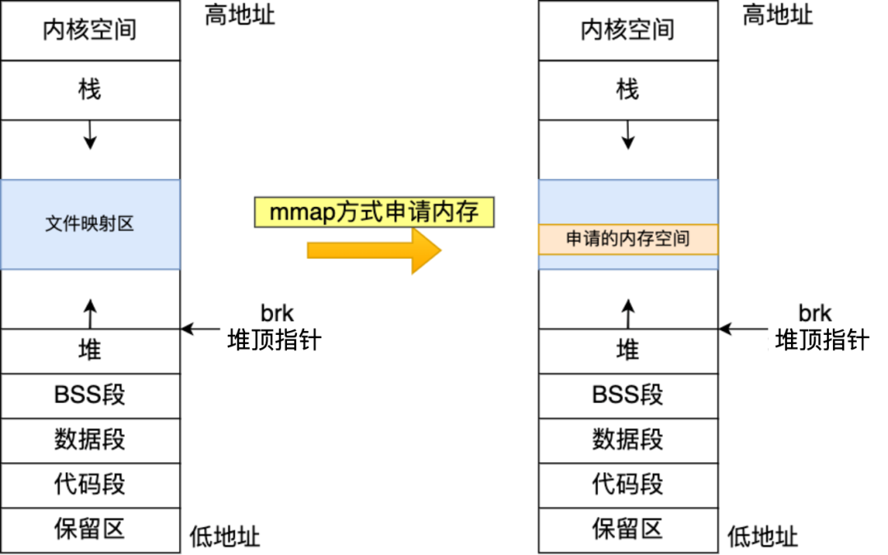
> 图：malloc、brk和mmap 相关截图

1. malloc：是C语言中非常常见的动态内存分配函数，它会将brk和mmap进行组合和管理，以便在需要时向进程请求更多内存，并在不需要使用时释放它。当调用malloc时，它会检查堆列表以查找满足分配请求的块，如果没有，则在堆中请求更多内存。在向操作系统请求更多内存时，可以使用brk或mmap，具体方式取决于所请求的大小。

总之，malloc、brk和mmap都是动态内存分配的方式。brk和mmap是底层系统调用，malloc是对它们的高层次的封装，提供更方便、更高级别的内存分配功能。malloc在实现中通常使用了brk或mmap进行内存分配。

## 用户态切换到内核态的 3 种方式：

1. 系统调用（Trap）

 用户态进程 **主动** 要求切换到内核态的一种方式，主要是为了使用内核态才能做的事情比如读取磁盘资源。系统调用的机制其核心还是使用了操作系统为用户特别开放的一个中断来实现。

用户态的程序发起系统调用，因为系统调用中涉及一些特权指令（只能由操作系统内核态执行的指令），用户态程序权限不足，因此会中断执行，也就是 Trap（Trap 是一种中断）。

发生中断后，当前 CPU 执行的程序会中断，跳转到中断处理程序。内核程序开始执行，也就是开始处理系统调用。

内核处理完成后，主动触发 Trap，这样会再次发生中断，切换回用户态工作。

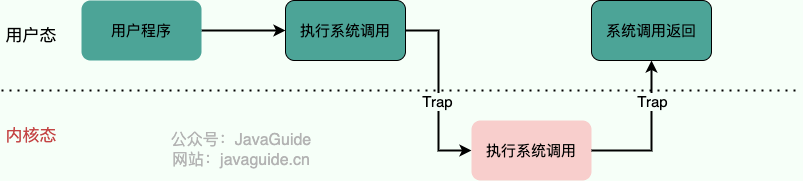
> 图：用户态切换到内核态的 3 种方式： 相关截图

1. 中断（Interrupt）

当外围设备完成用户请求的操作后，会向 CPU 发出相应的中断信号，这时 CPU 会暂停执行下一条即将要执行的指令转而去执行与中断信号对应的处理程序，如果先前执行的指令是用户态下的程序，那么这个转换的过程自然也就发生了由用户态到内核态的切换。比如硬盘读写操作完成，系统会切换到硬盘读写的中断处理程序中执行后续操作等。

1. 异常（Exception）

当 CPU 在执行运行在用户态下的程序时，发生了某些事先不可知的异常，这时会触发由当前运行进程切换到处理此异常的内核相关程序中，也就转到了内核态，比如缺页异常。

在系统的处理上，中断和异常类似，都是通过中断向量表来找到相应的处理程序进行处理。区别在于，中断来自处理器外部，不是由任何一条专门的指令造成，而异常是执行当前指令的结果。

## 内存碎片

内存碎片是由内存的申请和释放产生的，通常分为下面两种：

- 内部内存碎片(Internal Memory Fragmentation，简称为内存碎片)

 已经分配给进程使用但未被使用的内存。导致内部内存碎片的主要原因是，当采用固定比例比如 2 的幂次方进行内存分配时，进程所分配的内存可能会比其实际所需要的大。举个例子，一个进程只需要 65 字节的内存，但为其分配了 128（2^7） 大小的内存，那 63 字节的内存就成为了内部内存碎片。

- 外部内存碎片(External Memory Fragmentation，简称为外部碎片)

由于未分配的连续内存区域太小，以至于不能满足任意进程所需要的内存分配请求，这些小片段且不连续的内存空间被称为外部碎片。也就是说，外部内存碎片指的是那些并为分配给进程但又不能使用的内存。我们后面介绍的分段机制就会导致外部内存碎片。

### 内存管理方式可以简单分为下面两种

连续内存管理 ：为一个用户程序分配一个连续的内存空间，内存利用率一般不高。

块式管理 是早期计算机操作系统的一种连续内存管理方式，存在严重的内存碎片问题。块式管理会将内存分为几个固定大小的块，每个块中只包含一个进程。如果程序运行需要内存的话，操作系统就分配给它一块，如果程序运行只需要很小的空间的话，分配的这块内存很大一部分几乎被浪费了。这些在每个块中未被利用的空间，我们称之为内部内存碎片。除了内部内存碎片之外，由于两个内存块之间可能还会有外部内存碎片，这些不连续的外部内存碎片由于太小了无法再进行分配。

在 Linux 系统中，连续内存管理采用了 伙伴系统（Buddy System）算法 来实现，这是一种经典的连续内存分配算法，可以有效解决外部内存碎片的问题。伙伴系统的主要思想是将内存按 2 的幂次划分（每一块内存大小都是 2 的幂次比如 2^6=64 KB），并将相邻的内存块组合成一对伙伴（注意：必须是相邻的才是伙伴）。

当进行内存分配时，伙伴系统会尝试找到大小最合适的内存块。如果找到的内存块过大，就将其一分为二，分成两个大小相等的伙伴块。如果还是大的话，就继续切分，直到到达合适的大小为止。

假设两块相邻的内存块都被释放，系统会将这两个内存块合并，进而形成一个更大的内存块，以便后续的内存分配。这样就可以减少内存碎片的问题，提高内存利用率。

对于内部内存碎片的问题，Linux 采用 **SLAB** 进行解决。由于这部分内容不是本篇文章的重点，这里就不详细介绍了。

非连续内存管理 ：允许一个程序使用的内存分布在离散或者说不相邻的内存中，相对更加灵活一些。

**段式管理** ：以段(—段连续的物理内存)的形式管理/分配物理内存。应用程序的虚拟地址空间被分为大小不等的段，段是有实际意义的，每个段定义了一组逻辑信息，例如有主程序段 MAIN、子程序段 X、数据段 D 及栈段 S 等。

**页式管理** ：把物理内存分为连续等长的物理页，应用程序的虚拟地址空间划也被分为连续等长的虚拟页，现代操作系统广泛使用的一种内存管理方式。

**段页式管理机制** ：结合了段式管理和页式管理的一种内存管理机制，把物理内存先分成若干段，每个段又继续分成若干大小相等的页。

## 虚拟内存

- 隔离进程：物理内存通过虚拟地址空间访问，虚拟地址空间与进程一一对应。每个进程都认为自己拥有了整个物理内存，进程之间彼此隔离，一个进程中的代码无法更改正在由另一进程或操作系统使用的物理内存。

- 提升物理内存利用率：有了虚拟地址空间后，操作系统只需要将进程当前正在使用的部分数据或指令加载入物理内存。

- 简化内存管理：进程都有一个一致且私有的虚拟地址空间，程序员不用和真正的物理内存打交道，而是借助虚拟地址空间访问物理内存，从而简化了内存管理。

- 多个进程共享物理内存：进程在运行过程中，会加载许多操作系统的动态库。这些库对于每个进程而言都是公用的，它们在内存中实际只会加载一份，这部分称为共享内存。

- 提高内存使用安全性 ：控制进程对物理内存的访问，隔离不同进程的访问权限，提高系统的安全性。

- 提供更大的可使用内存空间： 可以让程序拥有超过系统物理内存大小的可用内存空间。这是因为当物理内存不够用时，可以利用磁盘充当，将物理内存页（通常大小为 4 KB）保存到磁盘文件（会影响读写速度），数据或代码页会根据需要在物理内存与磁盘之间移动

**物理地址（Physical Address）** 是真正的物理内存中地址，更具体点来说是内存地址寄存器中的地址。程序中访问的内存地址不是物理地址，而是 **虚拟地址（Virtual Address）** 。

也就是说，我们编程开发的时候实际就是在和虚拟地址打交道。比如在 C 语言中，指针里面存储的数值就可以理解成为内存里的一个地址，这个地址也就是我们说的虚拟地址。

操作系统一般通过 CPU 芯片中的一个重要组件 **MMU(Memory Management Unit，内存管理单元)** 将虚拟地址转换为物理地址，这个过程被称为 **地址翻译/地址转换（Address Translation）** 。

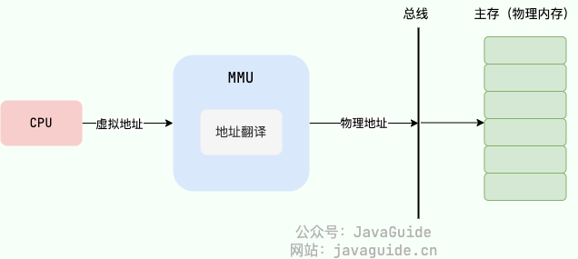
> 图：虚拟内存 相关截图

通过 MMU 将虚拟地址转换为物理地址后，再通过总线传到物理内存设备，进而完成相应的物理内存读写请求。

MMU 将虚拟地址翻译为物理地址的主要机制有两种: **分段机制** 和 **分页机制** 和**段页机制**。

分段机制

**分段机制（Segmentation）** 以段(—段 **连续** 的物理内存)的形式管理/分配物理内存。应用程序的虚拟地址空间被分为大小不等的段，段是有实际意义的，每个段定义了一组逻辑信息，例如有主程序段 MAIN、子程序段 X、数据段 D 及栈段 S 等。

段表有什么用？地址翻译过程是怎样的？

分段管理通过 **段表（Segment Table）** 映射虚拟地址和物理地址。

分段机制下的虚拟地址由两部分组成：

- 段号：标识着该虚拟地址属于整个虚拟地址空间中的哪一个段。

- 段内偏移量 ：相对于该段起始地址的偏移量。

具体的地址翻译过程如下：

1. MMU 首先解析得到虚拟地址中的段号；

1. 通过段号去该应用程序的段表中取出对应的段信息（找到对应的段表项）；

1. 从段信息中取出该段的起始地址（物理地址）加上虚拟地址中的段内偏移量得到最终的物理地址。

分段机制下的地址翻译过程

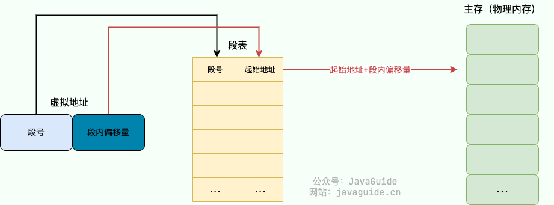
> 图：虚拟内存 相关截图

段表中还存有诸如段长(可用于检查虚拟地址是否超出合法范围)、段类型（该段的类型，例如代码段、数据段等）等信息。

### 通过段号一定要找到对应的段表项吗？得到最终的物理地址后对应的物理内存一定存在吗？

不一定。段表项可能并不存在：

- 段表项被删除：软件错误、软件恶意行为等情况可能会导致段表项被删除。

- 段表项还未创建 ：如果系统内存不足或者无法分配到连续的物理内存块就会导致段表项无法被创建。

分段机制为什么会导致内存外部碎片？

分段机制容易出现外部内存碎片，即在段与段之间留下碎片空间(不足以映射给虚拟地址空间中的段)。从而造成物理内存资源利用率的降低。

举个例子：假设可用物理内存为 5G 的系统使用分段机制分配内存。现在有 4 个进程，每个进程的内存占用情况如下：

- 进程 1：0~1G（第 1 段）

- 进程 2：1~3G（第 2 段）

- 进程 3：3~4.5G（第 3 段）

- 进程 4：4.5~5G（第 4 段）

此时，我们关闭了进程 1 和进程 4，则第 1 段和第 4 段的内存会被释放，空闲物理内存还有 1.5G。由于这 1.5G 物理内存并不是连续的，导致没办法将空闲的物理内存分配给一个需要 1.5G 物理内存的进程。

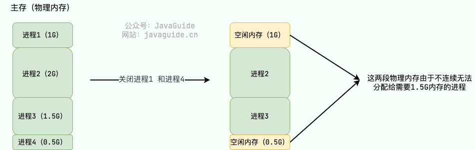
> 图：通过段号一定要找到对应的段表项吗？得到最终的物理地址后对应的物理内存一定存在吗？ 相关截图

## 稠密索引、稀疏索引

数据库中的索引，可以按照数据结构的特征进行分类。其中，根据索引存储方式，可以将索引分为稠密索引（Dense Index）和稀疏索引（Sparse Index）。

1. 稠密索引

稠密索引中，索引项与数据文件中的每一条记录对应，也就是说，索引项与数据文件中记录的1:1匹配。因为每一条记录都对应一个索引项，所以稠密索引也称为聚簇索引。

在稠密索引中，索引文件的大小与数据文件的大小一致，这样的索引方式有助于提高检索速度，但是索引文件的维护需要耗费大量的时间，因此在数据量大的情况下，稠密索引会对磁盘空间和查找性能造成较大影响。

1. 稀疏索引

稀疏索引只为数据文件中的部分记录建立索引项，也就是说，索引项与数据文件中记录的1:n匹配。在稀疏索引中，索引项所占据的空间相对较小，但检索速度较慢。

稀疏索引适用于数据重复度较高的场景，如布尔性数据。在这种场景下，对于一些重复的数据值，只需要创建一条索引项来处理即可。

总的来说，稠密索引适合于只有少量不重复的数据的场景，稀疏索引则适合于大量重复的数据，比如布尔型数据。在实际应用中，根据不同的需求和数据特点灵活使用不同类型的索引，可以提高数据库的检索效率，减少对存储空间的消耗。

## 代码复杂度 防止系统腐化

[https://mp.weixin.qq.com/s/6cgvHiwNwuQYVZyZwePIOQ](https://mp.weixin.qq.com/s/6cgvHiwNwuQYVZyZwePIOQ)

## 知识图谱之本体结构与语义解耦

[https://mp.weixin.qq.com/s/Feb9wdD1VpR_0xw9w01VUw](https://mp.weixin.qq.com/s/Feb9wdD1VpR_0xw9w01VUw)

## 对于 key value结构的存储设计与优化

### 性能优化方面

1、高效的数据结构真的很管用，如果裸写不到那种程度就用现成高效的组件（比如跳跃表、hash表、LSM、B tree）。 2、网络编程方面，其实就是根据业务场景合理的利用epoll，对大众开发者来看就是合理利用这些对epoll的封装库。 3、微批处理思路可以让系统的吞吐量提升一个数量级（比如kafka mirc-batch、tair合并写入）。 4、热点请求与常规请求分别处理，热点请求挂缓存、做水平切分。 5、合理利用存储：内存>磁盘顺序访问>磁盘随机访问，越贵的存储介质越好。 6、合理的并发模型和并发模型能解决更多问题，线程、协程什么的并不是越多。 7、业务量大就做分片（带来的性价比提升比起单机搞到顶要强很多），并且合理的一致性Hash算法能减少分布式环境下请求的80%的问题。 8、数据复制由点及面，带宽会少很多的，尤其是跨城IO。 9、要根据业务场景选择合适的组件及结构，不要啥都跟风一把梭。 10、业务代码很大程度决定了系统的性能高低，数据最小化原则，并不只在合规之类的场景要用，数据存取也是如此。

### 高可用方面

1、先上主从、再上HA，基本就能解决大部分问题了。 2、如果存在数据的强一致性诉求或者系统结构中可能存在脑裂问题，paxos之类的搞起来。 3、完善监控、报警机制，自动化做的再完备也会有意想不到的事情发生，有多人工，就有多智能。 4、系统架构尽可能简单，能够满足实际诉求，做到易扩展就做够了，不要给自己找事儿。 5、高保措施要反复考核，通过演练来做而不是理论支撑，认为可能发生的问题就一定会发生，如果是强依赖诉求，节点容灾、跨城容灾这些有条件就搞起来吧。 6、性能优化层面做好，是最大程度的保证可用性的措施，至少不会自己把系统写挂。 7、高可用要从微观和宏观同时来看，保证每个端到端的可用性处理和降级兜底、保证系统可容灾 一样重要。

### 其他问题

当出现有问题或者诉求解决不了时，就想一想加一层（但是要能cover住加一层所带来的问题） 当出现优化不了的问题时，就看一下其他牛逼的开源组件的实现，思想都是类似的。

## HTTP与RPC总结

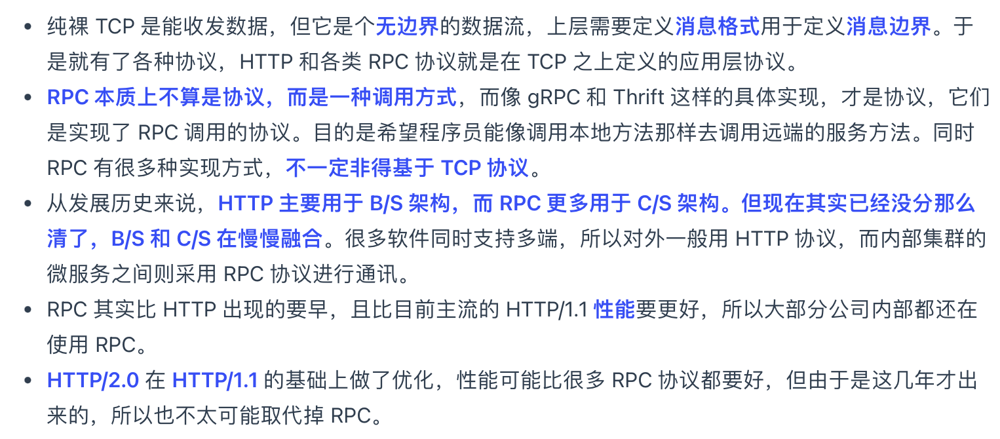
> 图：HTTP与RPC总结 相关截图

##  虚拟内存详述

[https://zhuanlan.zhihu.com/p/666654652](https://zhuanlan.zhihu.com/p/666654652)

## 物理内存详述

[https://zhuanlan.zhihu.com/p/655262271](https://zhuanlan.zhihu.com/p/655262271)

## 物理内存模型划分

平坦内存模型 FLATMEM：FLATMEM（flat memory model）就是把物理内存划分连续的物理页，然后使用一个大的页框数组与之一一映射，数组下标就是 PFN。这里的页框数组就是 mem_map

但是对于物理内存不连续，存在内存空洞的情况，空洞的产生原因有很多种，例如不同类型的内存芯片（如DDR3、DDR4等）可能具有不同的规格和排列方式导致内存空洞，那么平坦内存模型就不适合了。因为mem_map数组中为所有的物理内存都创建一个页框，不管是正常内存，还是大块内存空洞，会导致mem_map数组中大量的页框指向了无意义的物理内存。页框本身是有大小的（40多字节），也是要占用物理内存的，所以空洞就导致了大量浪费物理内存空间。

稀疏内存模型 SPARSEMEM: SPARSEMEM (sparse memory model) 很好的支持了内存空洞以及后面提到的热插拔，细分两个小内存模型

 1. **Node（粗粒度****）: **内核将物理内存划分几个 Node 节点，Node 节点对应的结构体是 [struct pglist_data](https://link.zhihu.com/?target=https%3A//elixir.bootlin.com/linux/v6.0/source/include/linux/mmzone.h%23L905)，每个节点包含一个页框数组，管理「尽量」连续的物理内存，尽量避免为内存空洞分配

页框而浪费内存，说白了每个 Node 节点中还是采用平坦内存模型来管理物理页。 跳过了大的空洞，但是可能还是包含小的

2. **Section（细粒度）： **如果想更小粒度管理连续的物理内存，那就需要划分更多的 Node 节点，因为 Node 节点的 [struct pglist_data](https://link.zhihu.com/?target=https%3A//elixir.bootlin.com/linux/v6.0/source/include/linux/mmzone.h%23L905) 结构体很大，划分越多额外占用的内存就越多，也就是浪费的内存越多，所以另一种稀疏内存模型诞生了。

另一种稀疏内存模型是对更小粒度的连续物理内存块进行管理，每一段物理内存块使用 section 来管理，所用的 [struct mem_section](https://link.zhihu.com/?target=https%3A//elixir.bootlin.com/linux/v6.0/source/include/linux/mmzone.h%23L1424) 结构体体积比较小，仅有 16 或 32 字节（本小节只讨论 64 位系统），避免浪费空间的同时进一步减少为内存空洞分配页框。

## 微服务拆分的原则

1. **AKF 拆分原则**

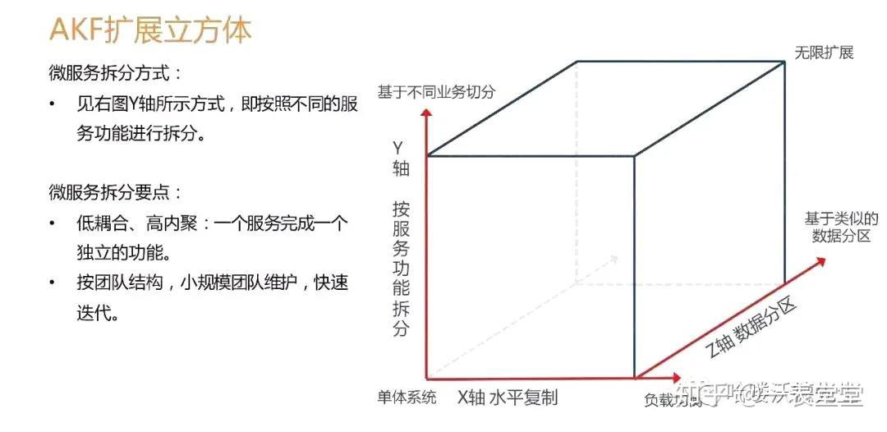
> 图：微服务拆分的原则 相关截图

### 2. 前后端分离原则

从经典的 Servlet + Jsp + JavaBean 的 MVC 时代，到 SSM（Spring + SpringMVC + Mybatis）和 SSH（Spring + Struts2 + Hibernate）的 Java 框架时代，再到前端框架（VueJS、AngularJS、ReactJS）为主的 MVVM 时代，然后是 Nodejs 引领的全栈时代，技术和架构一直都在进步。创新之路不会止步，无论是前后端分离模式还是其他模式，都是为了更方便地解决需求，但它们都只是一个“中转站”。前端项目与后端项目是两个项目，放在两个不同的服务器，需要独立部署，两个不同的工程，两个不同的代码库，不同的开发人员。前端只需要关注页面的样式与动态数据的解析及渲染，而后端专注于具体业务逻辑。

- 前后端技术分离，可以由各自的专家来对各自的领域进行优化，这样前端的用户体验优化效果更好。

- 前后端分离模式下，前后端交互界面更清晰，就剩下了接口模型，后端的接口简洁明了，更容易维护。

- 前端多渠道集成场景更容易实现，后端服务无需变更，采用统一的数据和模型，可以支持多个前端：例如：微信 h5 前端、PC 前端、安卓前端、IOS 前端。

### 3. 无状态服务

### 4. restfull的通信风格

## 进程间的通信
1. 管道(Pipe)：管道是一种半双工的通信方式，数据只能单向流动，而且只能在具有亲缘关系的进程间使用。

2. 命名管道(FIFO)：命名管道也是半双工的通信方式，但它允许无亲缘关系进程间的通信。

3. 消息队列(Message Queue)：消息队列是由消息的链表，存放在内核中并由消息队列标识符标识。消息队列克服了信号传递信息少、管道只能承载无格式字节流以及缓冲区大小受限等缺点。

4. 共享内存(Shared Memory)：共享内存就是映射一段能被其他进程所访问的内存，这段共享内存由一个进程创建，但多个进程都可以访问。

5. 信号(Signal)：信号是一种比较复杂的通信方式，用于通知接收进程某个事件已经发生。

6. 信号量(Semaphore)：信号量是一个计数器，可以用来控制多个进程对共享资源的访问。

## Amdahl定律

Amdahl's Law 指出，系统的整体性能提升受到不可并行化部分的限制。即使并行部分的速度无限增加，系统的最大加速比也受限于不可并行化部分的比例。因此，在设计和优化系统时，不仅要关注可并行化部分的性能，还要尽可能减少不可并行化部分的比例。

## 如何动态处理页面

在动态内容的处理中，**ESI（Edge Side Includes）** 和 **CSI（Client Side Includes）** 是两种常见的解决方案，分别适用于不同的场景。以下是它们的详细对比和适用场景分析：

1. ESI（Edge Side Includes）

原理

ESI 是一种在缓存服务器或代理服务器（如 CDN）上执行的动态内容组合技术。

它通过在 HTML 页面中插入特殊的标记（类似 SSI 的语法），将页面拆分为可缓存和不可缓存的片段。

缓存服务器在将完整页面返回给客户端前，动态组合这些片段（部分从缓存中获取，部分从源服务器实时获取）。

2. CSI（Client Side Includes）

原理

CSI 是通过客户端技术（如 JavaScript、iframe、AJAX）动态加载内容。

页面本身是静态的，动态部分通过客户端代码异步请求并插入到页面中。

## 对象关系阻抗不匹配

关系型数据库的争议点主要集中在和面向对象编程之间的冲突。学术界甚至有个专业名词来形容这种冲突：对象关系阻抗不匹配（Object relational impedance mismatch）。

面向对象编程里的所有对象之间的关系形成了一个图，因此研究方法需要用到数学上的图论。而关系型数据库的模式（schema）是基于关系代数（Relational Algebra），是一系列同构（Homomorphic）的列表组成的集合（Set），因此用到的是数学上的集合论。

其实你将对象存储到关系型数据库的过程，就是一个将图论翻译到集合论的过程。因为这是两个关系不大的数学理论，所以你在翻译的时候会觉得很不自然。因此，这两者**不匹配的原因是图论和集合论的区别。**

## 补充与进阶：分布式与架构高频考点

### 一致性哈希（Consistent Hashing）

传统 `hash % N` 在节点扩缩容时几乎全部 key 需迁移。一致性哈希将节点与 key 都映射到**环形哈希空间**（0~2^32）：
- 节点按 hash 落在环上；key 顺时针找最近节点。
- 新增/下线节点只影响环上相邻区间的 key（约 1/N），其余不变。
- **虚拟节点**：为每个物理节点映射多个虚拟节点，解决数据倾斜，使负载更均衡。

### 限流算法对比

| 算法 | 原理 | 优点 | 缺点 |
| --- | --- | --- | --- |
| 计数器（固定窗口） | 单位时间计数 | 简单 | 临界突变（窗口边界双倍） |
| 滑动窗口 | 细分时间片加权 | 平滑、精度高 | 实现略复杂 |
| 漏桶（Leaky Bucket） | 恒定速率流出 | 平滑限流、整形 | 突发被丢弃 |
| 令牌桶（Token Bucket） | 恒定速率发令牌，桶可积攒 | 允许一定突发 | 需维护令牌 |

Guava `RateLimiter`、Sentinel、Nginx `limit_req` 多基于令牌桶/漏桶。

### 幂等设计

网络重试/消息重投下保证"多次执行 = 一次执行"：
- **去重表**（唯一索引）：业务唯一键插入，冲突即忽略；
- **乐观锁版本号**：`UPDATE ... SET ver=ver+1 WHERE id=? AND ver=?`；
- **状态机**：订单状态流转拒绝逆向/重复；
- **Token 机制**：表单提交前下发一次性 token。

### 分布式锁

- **Redis 实现**：`SET key value NX EX` 原子加锁 + Lua 释放（校验 value 防误删）；需兜底过期防死锁；Redlock 有争议（依赖时钟假设）。
- **ZooKeeper/etcd**：临时顺序节点 + watch，获锁可靠、可重入、会话失效自动释放；性能低于 Redis。
- 选型：**可靠性优先选 ZK/etcd，性能优先选 Redis**，并尽量缩短锁内操作。

### 灰度发布与流量治理

- **蓝绿 / 灰度（金丝雀）**：新版本先放小部分流量，观测指标无误再全量；结合网关/标签路由。
- **熔断/限流/降级/隔离**：Sentinel/Hystrix 四板斧；熔断基于错误率+慢调用，半开探测恢复。
- **热点 key**：本地缓存 + 打散（key 加随机后缀分片）+ 多副本读。

### 可观测性与稳定性

- **三大支柱**：日志（ELK）、指标（Prometheus+Grafana）、链路追踪（SkyWalking/Jaeger，基于 OpenTelemetry）。
- **SLO/SLI/Error Budget**：用错误预算驱动发布节奏；混沌工程（Chaos Mesh）验证韧性。
