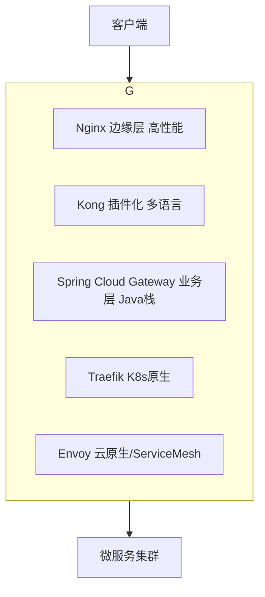

# API 网关

> 微服务几十个，客户端不可能记住每个服务地址。网关就是「统一入口 + 流量治理 + 安全管控」。本文讲清网关做什么、主流方案（Spring Cloud Gateway / Kong / Nginx / Traefik / Envoy）怎么选、生产怎么落地。
> 开源参考：Kong（[Kong/kong](https://github.com/Kong/kong)，基于 Nginx+OpenResty，Lua）、Spring Cloud Gateway（[spring-cloud/spring-cloud-gateway](https://github.com/spring-cloud/spring-cloud-gateway)，Java/WebFlux）、Envoy（[envoyproxy/envoy](https://github.com/envoyproxy/envoy)，C++，Service Mesh 事实标准）。

---


## 〇、本体介绍（它是什么 / 适用场景 / 核心概念）

**它是什么**：API 网关是微服务架构的「统一入口」，位于客户端与后端服务之间，承担路由、鉴权、限流、灰度、日志、协议转换等横切职责，是「南北流量（外部→内部）」的总闸门。

**解决什么痛点**：没有网关时，每个服务都要自己处理认证、限流、跨域、日志，且客户端要记住几十个服务地址。网关把这些通用能力收口，客户端只连一个域名，后端服务可独立演进。

**核心概念**：Route（路由：断言+过滤器）、Predicate（路由匹配条件）、Filter（全局/局部过滤器）、负载均衡、鉴权（JWT/OAuth2）、限流（令牌桶/漏桶）、灰度发布、Spring Cloud Gateway、Kong（插件化）、南北流量 vs 东西流量。

**适用场景**：微服务统一入口、统一鉴权限流、灰度发布、API 聚合。
**不适用**：服务间内部调用（东西流量，应走服务网格如 Istio）。

---

## 一、网关解决什么问题

| 直连微服务的痛点 | 网关的价值 |
|------------------|------------|
| 客户端要记所有服务地址 | 只需网关地址 |
| 每个服务各做一套鉴权 | 统一安全管控（认证 / 限流 / 脱敏） |
| 无统一限流 / 熔断 | 集中流量治理 |
| 服务升级影响所有客户端 | 版本路由、灰度发布对客户端透明 |
| 跨域 / 协议转换分散 | 统一处理 |

**一句话**：网关 = 反向代理 + 路由 + 认证 + 限流 + 熔断 + 灰度 + 可观测，所有流量先把关。

---

## 二、主流方案全景



| 方案 | 语言 | 性能模型 | 特点 | 适用 |
|------|------|----------|------|------|
| **Nginx** | C | 多进程异步，极高 | 反向代理 / 负载均衡 / SSL 卸载强，动态路由弱 | 边缘流量入口、静态资源 |
| **Spring Cloud Gateway** | Java (WebFlux/Netty) | 异步非阻塞 | 深度 Spring 整合、Java 自定义 Filter | Java 技术栈微服务内部网关 |
| **Kong** | Lua (Nginx+OpenResty) | 事件驱动，高 | 插件生态 350+，JWT/OAuth2/ACL，多语言 | 企业级 API 管理、混合栈 |
| **Traefik** | Go | 异步，极高 | K8s CRD 声明式、自动服务发现 | K8s 原生环境 |
| **Envoy** | C++ | 极高 | 动态配置、xDS、Service Mesh 标准 | 云原生基础设施 / Istio 数据面 |

> 性能量级参考（行业公开压测，单节点 QPS）：Nginx 10 万级 > Kong / Envoy 数万级 > Spring Cloud Gateway 数千~万级。Gateway 胜在生态整合而非极限性能。

---

## 三、Spring Cloud Gateway 实战

### 3.1 核心模型：Route / Predicate / Filter

- **Route（路由）**：ID + 目标 URI + 断言 + 过滤器。
- **Predicate（断言）**：匹配条件（Path、Header、Method、时间…）。
- **Filter（过滤器）**：前置 / 后置处理（鉴权、改写、限流、重试）。

```yaml
spring:
  cloud:
    gateway:
      routes:
        - id: order-service
          uri: lb://order-service
          predicates:
            - Path=/api/orders/**
          filters:
            - name: RequestRateLimiter   # 基于 Redis 的限流
              args:
                redis-rate-limiter.replenishRate: 10
                redis-rate-limiter.burstCapacity: 20
            - name: CircuitBreaker       # 熔断降级
              args:
                name: orderFallback
                fallbackUri: forward:/fallback/order
```

### 3.2 灰度发布（按请求头切流）

```java
@Bean
public RouteLocator grayRoutes(RouteLocatorBuilder b) {
    return b.routes()
      .route("order-gray", r -> r.path("/api/orders/**")
          .and().header("X-User-Group", "beta")
          .uri("lb://order-service-gray"))
      .route("order", r -> r.path("/api/orders/**")
          .uri("lb://order-service"))
      .build();
}
```

### 3.3 统一鉴权（JWT 校验全局过滤器）

```java
public class JwtAuthFilter implements GlobalFilter, Ordered {
    public Mono<Void> filter(ServerWebExchange exchange, GatewayFilterChain chain) {
        String token = exchange.getRequest().getHeaders().getFirst("Authorization");
        if (!validate(token)) {
            exchange.getResponse().setStatusCode(HttpStatus.UNAUTHORIZED);
            return exchange.getResponse().setComplete();
        }
        return chain.filter(exchange);
    }
}
```

---

## 四、Kong 实战（插件化）

Kong 用 Admin API / 声明式配置，强调插件：

```bash
# 注册服务
curl -X POST http://localhost:8001/services --data "name=user-service" \
     --data "url=http://user-service:8080"
# 启用 JWT 插件
curl -X POST http://localhost:8001/services/user-service/plugins \
     --data "name=jwt"
# 启用限流
curl -X POST http://localhost:8001/services/user-service/plugins \
     --data "name=rate-limiting" --data "config/second=100"
```

- ✅ 插件生态丰富（认证 / 日志 / 限流 / AI 异常检测）。
- ❌ 需维护 PostgreSQL/Cassandra；Lua 开发门槛；企业版部分功能收费。

---

## 五、生产设计要点

1. **无状态化**：网关不存会话，状态用 JWT / 外部会话存。
2. **分层部署**（大型系统推荐）：`Nginx（边缘，SSL 卸载/全局限流）→ Spring Cloud Gateway（业务层，鉴权/灰度）`。兼顾性能与微服务治理。
3. **动态配置**：路由规则放 Nacos / Config，热更新不重启。
4. **可观测性**：Micrometer 暴露 metrics → Prometheus + Grafana（延迟、错误率、QPS）。
5. **重试只对幂等接口**：查询可重试，下单等写操作禁止重试。
6. **防 DDoS**：Nginx 层 `limit_req` + 网关限流双重防护。
7. **熔断降级**：非核心链路降级，保核心（如下单）。

---

## 六、常见坑

- **网关成单点 / 瓶颈**：多实例 + 前面挂 LB（Nginx / SLB）。
- **鉴权逻辑太重**：网关只做「身份认证 + 粗粒度授权」，细粒度权限放业务服务。
- **限流 key 设计差**：按 IP 限流会被 NAT / 网关后面真实 IP 丢失坑——要用 `X-Forwarded-For` 或 userId。
- **重试放大故障**：写操作重试导致重复下单，务必只对 GET / 幂等接口重试。
- **链路过长超时级联**：网关 → 服务 → 下游，超时设不合理会雪崩；用熔断 + 合理超时。

---

## 七、选型结论

- **Spring Cloud 技术栈**，要快速接鉴权 / 灰度 → **Spring Cloud Gateway**。
- **多语言 / 企业级 API 管理 / 强插件** → **Kong**。
- **K8s 原生、声明式** → **Traefik**。
- **边缘超高并发 / 静态 / SSL** → **Nginx**。
- **Service Mesh / 云原生** → **Envoy**（通常经 Istio）。

---

## 面试高频问题（20+ 条）

1. **网关解决什么问题？** 统一入口：路由、鉴权、限流、灰度、日志、跨域、协议转换，把横切能力从各服务收口，客户端只连一个域名。

2. **网关 vs 服务（南北 vs 东西流量）？** 南北流量（外部客户端→内部服务）走网关；东西流量（服务间内部调用）应走服务网格（Istio/Linkerd），不应全压网关。

3. **与 Nginx 区别？** Nginx 偏反向代理/静态/四七层负载，路由规则静态；API 网关是「七层 + 业务感知」，支持动态路由、鉴权、限流、灰度、插件化（Spring Cloud Gateway/Kong）。

4. **与 Kong 区别？** Kong 基于 Nginx+OpenResty，插件化生态强（限流/鉴权/可观测），适合多语言异构；Spring Cloud Gateway 与 Java/Spring 生态深度集成，开发友好。

5. **灰度发布如何实现？** 按请求头/用户标签/权重把部分流量切到新版本（如 10% 流量到 v2），验证无误再全量；Gateway 用自定义路由断言+过滤器实现。

6. **统一鉴权怎么做？** 全局过滤器校验 JWT/OAuth2 Token，失败直接拦截，下游服务信任网关注入的用户上下文（如 Header），免重复认证。

7. **限流算法？** 计数器、滑动窗口、令牌桶（允许突发）、漏桶（匀速）。网关常用令牌桶/漏桶保护后端，如按 IP/用户维度限流。

8. **高可用怎么保障？** 网关节点多实例 + 负载均衡；自身无状态可水平扩展；下游超时/熔断（集成 Sentinel/Hystrix）；避免网关成为单点。

9. **网关性能瓶颈？** 网关做加解密/鉴权/日志会增加延迟；用异步非阻塞（WebFlux/Netty）提升吞吐；避免重逻辑放网关。

10. **Spring Cloud Gateway 核心模型？** Route（路由=断言+过滤器）、Predicate（匹配条件如 Path/Header/Method）、Filter（全局/局部，改写请求响应）。

11. **限流维度？** 按 IP、用户、API、租户；结合 Redis 做集群级统一计数（如 RequestRateLimiter 网关过滤器）。

12. **熔断降级？** 下游故障时网关快速失败/返回降级响应，防止雪崩；集成 Sentinel/Resilience4j。

13. **协议转换？** 网关可将外部 HTTP 转为内部 gRPC/WebSocket，或聚合多个后端 API 为一个对外接口（API 聚合/BFF）。

14. **跨域（CORS）处理？** 网关统一加 CORS 头（Access-Control-Allow-Origin 等），避免每个服务各自处理。

15. **与注册中心配合？** 网关从 Nacos/Eureka 动态发现服务实例，路由目标无需写死，服务扩缩容自动感知。

16. **请求日志与链路追踪？** 网关生成/透传 TraceId，统一收集访问日志，对接 ELK/SkyWalking 做全链路追踪。

17. **安全防护？** 防 SQL 注入/XSS（入口校验）、WAF、限流防刷、HTTPS 终止、鉴权防越权。

18. **网关选型结论？** Java 技术栈/Spring 生态 → Spring Cloud Gateway；多语言/插件化/高性能 → Kong；简单反向代理 → Nginx。

19. **网关放太多逻辑的危害？** 变成「胖网关」，难维护、性能差、耦合业务；原则：网关只做横切，业务下沉服务。

20. **与 BFF 关系？** BFF（Backend For Frontend）常由网关/聚合层承担，为不同端（Web/App）裁剪聚合 API，减少前端多次请求。

21. **WebSocket/长连接网关？** 需网关支持长连接路由与会话保持；Kong/Spring Cloud Gateway 部分支持，重度长连接考虑专用网关。

22. **网关如何做灰度与全链路压测？** 灰度用路由权重/标签；压测用影子流量（标记请求路由到影子环境），网关识别压测流量不打标真实数据。

---
## 九、与其他板块的关系

- 和「**基础知识/注册中心与配置中心**」：Gateway 从 Nacos / Eureka 做服务发现（`lb://`）。
- 和「**基础知识/认证授权 JWT/OAuth2**」：网关统一 JWT 校验，具体协议见该篇。
- 和「**基础知识/MQ**」：网关可把写请求转 MQ 异步削峰。
- 和「**架构/系统架构**」：网关是「边界层」核心组件，详见系统架构的 API 网关选型。
