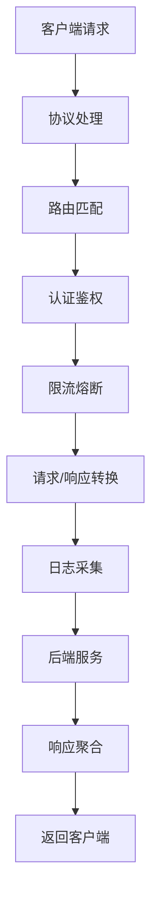
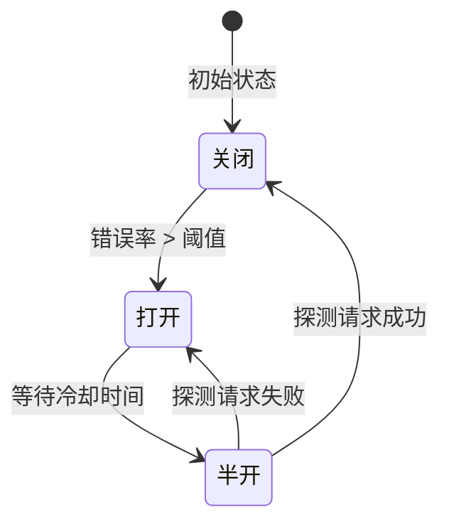
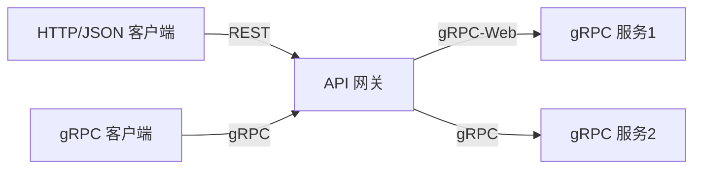
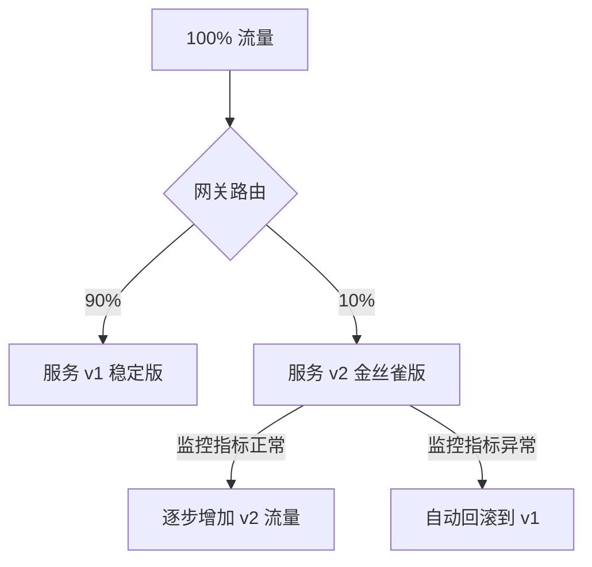
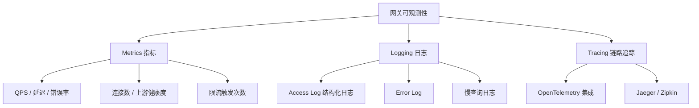
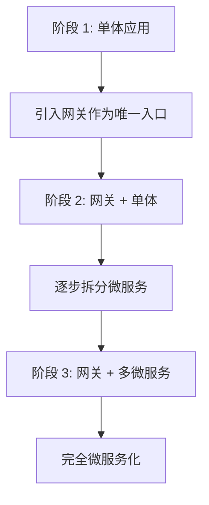

# API 网关

> **核心认知**：API 网关是微服务架构的统一入口，它将路由、认证、限流、熔断、日志等横切关注点从业务服务中抽离出来，形成集中式流量管控层。网关不是简单的反向代理，而是微服务治理的第一道防线。

## 要解决的问题

| 问题 | 没有网关时 | 有网关后 |
|------|-----------|----------|
| 客户端复杂性 | 需要知道每个微服务地址 | 统一网关地址，内部路由透明 |
| 认证授权 | 每个服务各自实现 | 网关统一认证，下游信任网关 |
| 限流熔断 | 每个服务单独配置 | 网关层集中策略 |
| 协议转换 | 客户端需适配多种协议 | 网关统一转换（HTTP/gRPC/WebSocket） |
| 日志审计 | 分散在各服务，难以聚合 | 网关层统一采集请求日志 |
| 灰度发布 | 每个服务实现路由规则 | 网关按规则分流流量 |

## 架构模式

### 网关在架构中的位置

```
                    ┌─────────────┐
                    │   客户端     │
                    └──────┬──────┘
                           │
                    ┌──────▼──────┐
                    │  负载均衡    │
                    └──────┬──────┘
                           │
                    ┌──────▼──────┐
                    │  API 网关    │  ← 统一入口
                    │  (Gateway)  │
                    └──────┬──────┘
                           │
          ┌────────────────┼────────────────┐
          │                │                │
   ┌──────▼──────┐ ┌──────▼──────┐ ┌──────▼──────┐
   │  用户服务    │ │  订单服务    │ │  商品服务    │
   └──────┬──────┘ └──────┬──────┘ └──────┬──────┘
          │                │                │
   ┌──────▼──────┐ ┌──────▼──────┐ ┌──────▼──────┐
   │    MySQL     │ │   MongoDB   │ │    Redis    │
   └─────────────┘ └─────────────┘ └─────────────┘
```

### 网关核心功能模块



## 核心功能详解

### 1. 路由与负载均衡

```yaml
# 路由配置示例
routes:
  - match:
      path: /api/users/**
    route:
      - service: user-service
        weight: 90
      - service: user-service-v2
        weight: 10    # 金丝雀发布

  - match:
      path: /api/orders/**
      headers:
        x-debug: "true"
    route:
      - service: order-service-debug  # 调试流量路由

  - match:
      path: /api/products/**
      method: GET
    route:
      - service: product-service-read  # 读写分离
```

### 2. 认证与授权

```
网关认证流程：
  1. 提取 Authorization Header
  2. 验证 JWT 签名和有效期
  3. 提取 scope / roles / user_id
  4. 检查路由权限（scope 与路由匹配）
  5. 将用户信息注入 Header 传递给下游
  6. 下游服务信任网关传递的身份信息
```

### 3. 限流策略

| 限流维度 | 说明 | 典型配置 |
|----------|------|----------|
| 全局限流 | 整个网关的请求上限 | 10000 QPS |
| 路由限流 | 单个 API 的请求上限 | /api/orders: 1000 QPS |
| 用户限流 | 单个用户的请求上限 | 100 QPS/user |
| IP 限流 | 单个 IP 的请求上限 | 50 QPS/IP |
| 令牌桶 | 允许突发流量 | 100 QPS，桶容量 200 |
| 滑动窗口 | 平滑限流 | 60s 内最多 1000 次 |

### 4. 熔断与降级



### 5. 请求转换

| 转换类型 | 场景 | 示例 |
|----------|------|------|
| Header 添加 | 传递追踪信息 | 添加 X-Request-ID |
| Header 移除 | 安全考虑 | 移除内部认证 Header |
| Body 转换 | 数据格式适配 | XML → JSON |
| 路径重写 | 后端路径不一致 | /api/v1/users → /internal/users |
| 响应聚合 | BFF 模式 | 调用多个服务，聚合结果 |

## 主流 API 网关对比

| 特性 | Kong | APISIX | Spring Cloud Gateway | Envoy |
|------|------|--------|---------------------|-------|
| 语言 | Lua/OpenResty | Lua/OpenResty | Java/Spring | C++ |
| 性能 | 高 | 极高 | 中 | 极高 |
| 扩展性 | 插件机制 | 插件机制 | Filter 链 | WASM/Lua |
| 服务发现 | DNS/Consul | DNS/Consul/Eureka | Eureka/Nacos | xDS |
| 配置管理 | Admin API | etcd | 配置文件 | xDS |
| 学习曲线 | 中 | 中 | 低（Java 生态） | 高 |
| 适用场景 | 通用 | 高性能场景 | Spring 生态 | Service Mesh |

## 网关高可用设计

```
高可用策略：
  ├── 多实例部署：至少 2 个网关节点
  ├── 无状态设计：会话信息外置到 Redis
  ├── 健康检查：主动探测后端服务状态
  ├── 优雅降级：网关故障时直连后端
  ├── 限流保护：防止网关被打垮
  └── 监控告警：网关延迟/错误率/吞吐量
```

### 性能优化

| 优化手段 | 效果 | 实现方式 |
|----------|------|----------|
| 连接池复用 | 减少 TCP 握手开销 | Keep-Alive + 连接池 |
| 响应缓存 | 减少后端调用 | 缓存热点 API 响应 |
| 异步 I/O | 提高并发处理能力 | 非阻塞事件驱动 |
| 协议优化 | 减少传输开销 | HTTP/2、gRPC |
| 本地缓存 | 减少配置查询延迟 | 路由规则本地缓存 |

## 网关选型决策

```
选型路径：
  ├── Java 技术栈？
  │   ├── 是 → Spring Cloud Gateway
  │   └── 否 ↓
  ├── 需要高性能？
  │   ├── 是 → APISIX 或 Envoy
  │   └── 否 ↓
  ├── 需要丰富插件？
  │   ├── 是 → Kong
  │   └── 否 ↓
  └── Service Mesh 场景？
      ├── 是 → Envoy (Istio 数据面)
      └── 否 → 根据团队熟悉度选择
```

## 常见陷阱

| 陷阱 | 后果 | 正确做法 |
|------|------|----------|
| 网关单点 | 故障时全部服务不可用 | 多实例 + 负载均衡 |
| 网关做太多业务逻辑 | 网关膨胀，难以维护 | 仅处理横切关注点 |
| 不限流 | 流量洪峰击垮后端 | 全局+路由+用户级限流 |
| 证书管理混乱 | HTTPS 终止配置出错 | 集中证书管理 |
| 不监控网关 | 故障时无法定位 | 完善的 metrics 和 tracing |

## WebSocket 支持

### 网关 WebSocket 代理

```
WebSocket 连接流程：
  1. 客户端发起 HTTP Upgrade 请求
  2. 网关验证 Token（通常在首次握手时）
  3. 网关与后端建立 WebSocket 连接
  4. 双向消息透传

关键配置：
  upgrade: websocket
  proxy_read_timeout: 3600s    # 长连接超时
  proxy_send_timeout: 3600s
```

### WebSocket vs HTTP 在网关中的差异

| 维度 | HTTP 请求 | WebSocket |
|------|-----------|-----------|
| 连接模型 | 短连接/Keep-Alive | 长连接 |
| 路由匹配 | Path + Method | Path（握手时） |
| 限流方式 | 按请求次数 | 按连接数 + 消息数 |
| 认证时机 | 每次请求 | 握手时一次性认证 |
| 负载均衡 | L7 路由 | L4/L7 连接级路由 |
| 健康检查 | HTTP 探测 | 连接存活检测 |

### APISIX WebSocket 配置示例

```yaml
# routes 配置
routes:
  - uri: /ws/*
    upstream:
      type: roundrobin
      nodes:
        "ws-server-1:8080": 1
        "ws-server-2:8080": 1
    plugins:
      proxy-rewrite:
        regex_uri:
          - "^/ws/(.*)"
          - "/$1"
```

## gRPC 代理

### gRPC 网关代理模式



### gRPC 代理 vs HTTP 代理

| 维度 | HTTP 代理 | gRPC 代理 |
|------|-----------|-----------|
| 协议 | HTTP/1.1, HTTP/2 | HTTP/2（强制） |
| 序列化 | JSON/XML | Protobuf |
| 流式 | 不支持 | 支持（单向/双向） |
| 网关开销 | 序列化/反序列化 | 透传（低开销） |
| 健康检查 | HTTP 端点 | gRPC Health Protocol |

### Envoy gRPC 代理配置

```yaml
# Envoy 配置
static_resources:
  listeners:
    - name: listener_0
      address:
        socket_address:
          address: 0.0.0.0
          port_value: 8443
      filter_chains:
        - filters:
            - name: envoy.filters.network.http_connection_manager
              typed_config:
                route_config:
                  virtual_hosts:
                    - name: backend
                      routes:
                        - match:
                            prefix: "/grpc.service/"
                          route:
                            cluster: grpc_backend
                            timeout: 0s
                            retry_policy:
                              retry_conditions:
                                - 5xx
                              num_retries: 3

  clusters:
    - name: grpc_backend
      type: STRICT_DNS
      lb_policy: ROUND_ROBIN
      typed_extension_protocol_options:
        envoy.extensions.upstreams.http.v3.HttpProtocolOptions:
          "@type": type.googleapis.com/envoy.extensions.upstreams.http.v3.HttpProtocolOptions
          explicit_http_config:
            http2_protocol_options: {}
```

## 金丝雀发布

### 基于网关的流量分割



### 金丝雀发布策略配置

```yaml
# Kong 插件配置
plugins:
  - name: canary
    config:
      services:
        - service: user-service
          routes:
            - route: user-api
              canary:
                upstream: user-service-v2
                weight: 10          # 10% 流量到 v2
                start_time: 2024-01-01T00:00:00Z
                duration: 3600      # 持续 1 小时
                criteria:
                  - header: x-user-type
                    value: "beta"    # Beta 用户走 v2
                  - cookie: feature_flag
                    value: "new_ui"
```

### 金丝雀发布监控指标

| 指标 | 阈值（回滚条件） | 采集方式 |
|------|------------------|----------|
| 错误率 | > 1% | Access Log 统计 |
| P99 延迟 | > 基线 1.5x | Metrics 监控 |
| CPU 使用率 | > 80% | 节点 Exporter |
| 内存使用率 | > 85% | 节点 Exporter |
| 5xx 数量 | > 10/min | Access Log |

## 网关可观测性

### 三大支柱



### Access Log 结构化格式

```json
{
  "timestamp": "2024-01-15T10:30:00.123Z",
  "method": "POST",
  "path": "/api/orders",
  "status": 200,
  "upstream_status": 200,
  "upstream_service": "order-service",
  "upstream_time": 45,
  "gateway_time": 3,
  "bytes_sent": 1234,
  "request_id": "abc-123-def",
  "trace_id": "4bf92f3577b34da6a3ce929d0e0e4736",
  "user_id": "user-001",
  "client_ip": "192.168.1.100",
  "latency": 48
}
```

### Prometheus 指标配置

```yaml
# Envoy Stats 指标
metrics:
  - name: http_requests_total
    type: counter
    labels:
      method: "$method"
      path: "$path"
      status: "$status"
      upstream: "$upstream_cluster"

  - name: http_request_duration_seconds
    type: histogram
    buckets: [0.01, 0.05, 0.1, 0.5, 1, 5]
    labels:
      upstream: "$upstream_cluster"

# Grafana Dashboard 关键 Panel
# 1. 网关 QPS (按路由/状态码)
# 2. 延迟 P50/P95/P99 (按路由)
# 3. 错误率 (按路由/上游服务)
# 4. 上游连接数 / 活跃连接数
# 5. 限流触发次数
```

## 限流算法详解

### 固定窗口（Fixed Window）

```
时间窗口：[10:00:00, 10:00:01] 限流 100 QPS

10:00:00.000 → count=1   ✅
10:00:00.500 → count=50  ✅
10:00:00.999 → count=100 ✅
10:00:01.000 → count=1   ✅  （窗口重置）
...

问题：窗口边界突发——999ms 内 100 请求 + 001ms 内 100 请求 = 200 QPS 突发
```

### 滑动窗口（Sliding Window Log）

```
维护一个时间戳列表，每次请求：
  1. 移除窗口外的时间戳
  2. 检查窗口内时间戳数量
  3. 未超限 → 记录当前时间戳
  4. 超限 → 拒绝

优点：精确限流
缺点：内存开销大（需存储每个请求的时间戳）
实现：Redis ZSET (score=timestamp, member=unique_id)
```

### 令牌桶（Token Bucket）

```
配置：rate=100/s, capacity=200

10:00:00.000 → tokens=200（满桶）
10:00:00.000 → 请求 50 个 → tokens=150  ✅
10:00:00.500 → 桶补充 50 → tokens=200（满桶）
10:00:01.000 → 请求 250 个 → tokens=0（桶空）  ✅ 允许前 200 个
10:00:01.001 → 请求 1 个 → tokens=-1  ❌ 拒绝

特点：允许突发流量（burst），平均速率受 rate 控制
```

### 漏桶（Leaky Bucket）

```
配置：rate=100/s, capacity=200

输入：请求进入队列（桶）
输出：以固定速率（100/s）处理

10:00:00.000 → 队列空
10:00:00.000 → 突发 200 请求 → 队列满（200）
10:00:00.000 → 突发 50 请求 → 队列溢出  ❌ 拒绝 50 个
10:00:01.000 → 队列处理 100 → 剩余 100

特点：流量整形（平滑输出），不允许突发
```

### 算法对比

| 算法 | 精确度 | 突发允许 | 内存开销 | 实现复杂度 | 适用场景 |
|------|--------|----------|----------|------------|----------|
| 固定窗口 | 低 | 不允许 | 低 | 低 | 简单限流 |
| 滑动窗口 | 高 | 不允许 | 高 | 中 | 精确计数 |
| 令牌桶 | 中 | 允许（burst） | 低 | 中 | API 限流（推荐） |
| 漏桶 | 中 | 不允许 | 低 | 中 | 流量整形 |

### Redis 实现令牌桶

```lua
-- Lua 脚本：令牌桶限流
local key = KEYS[1]
local rate = tonumber(ARGV[1])        -- 令牌生成速率（个/秒）
local capacity = tonumber(ARGV[2])     -- 桶容量
local now = tonumber(ARGV[3])          -- 当前时间戳（ms）
local requested = tonumber(ARGV[4])    -- 请求的令牌数

local last_tokens = tonumber(redis.call("GET", key) or capacity)
local last_refreshed = tonumber(redis.call("GET", key .. ":ts") or now)

-- 计算补充的令牌
local delta = math.floor((now - last_refreshed) / 1000) * rate
local tokens = math.min(capacity, last_tokens + delta)

local allowed = 0
if tokens >= requested then
    tokens = tokens - requested
    allowed = 1
end

redis.call("SET", key, tokens)
redis.call("SET", key .. ":ts", now)
redis.call("EXPIRE", key, math.ceil(capacity / rate) * 2)

return { allowed, tokens }
```

## 网关迁移策略

### 从单体到网关 + 微服务



### 迁移步骤

| 阶段 | 操作 | 风险 | 回滚方案 |
|------|------|------|----------|
| 1 | 网关部署，直连单体 | 低 | DNS 切回原地址 |
| 2 | 认证逻辑迁移到网关 | 中 | 网关透传原认证 |
| 3 | 拆分第一个微服务 | 高 | 网关回退到单体 |
| 4 | 逐步迁移其他服务 | 中 | 灰度发布 + 监控 |

### 流量切换策略

```
DNS 切换法：
  1. 网关部署，验证健康
  2. DNS TTL 调低（60s）
  3. 切换 DNS 到网关 IP
  4. 监控 30 分钟
  5. 异常则 DNS 切回

负载均衡切换法：
  1. 网关加入 LB 池，权重设为 0
  2. 逐步增加权重：0 → 10 → 50 → 100
  3. 每步观察 15 分钟
  4. 有问题则降低权重
```

## 网关安全防护

### DDoS 防护

```
多层 DDoS 防护：
  ├── 第 1 层：云厂商 DDoS 防护（如 AWS Shield）
  │   └── 网络层攻击过滤（SYN Flood, UDP Flood）
  ├── 第 2 层：WAF（如 AWS WAF, CloudFlare）
  │   └── 应用层攻击检测（SQL 注入, XSS）
  ├── 第 3 层：网关限流
  │   └── 按 IP/User/App 维度限流
  └── 第 4 层：后端限流 + 熔断
      └── 保护后端服务不被打垮
```

### IP 白名单 / 黑名单

```yaml
# APISIX 配置
plugins:
  - name: ip-restriction
    config:
      whitelist:
        - "10.0.0.0/8"       # 内网
        - "203.0.113.0/24"   # 办公网
      message: "Access denied"
      status_code: 403

  - name: consumer-restriction
    config:
      whitelist:
        - consumer-1          # 允许特定消费者
      rejected_code: 403
```

### Bot 检测

```
Bot 检测策略：
  ├── User-Agent 分析
  │   ├── 空/异常 UA → 拦截
  │   ├── 已知恶意 Bot UA → 拦截
  │   └── 合法 Bot（Googlebot）→ 放行但限流
  ├── 行为分析
  │   ├── 高频相同路径请求 → 限流
  │   ├── 无 JavaScript 执行环境 → 拦截
  │   └── 点击轨迹异常 → 验证码
  ├── JavaScript Challenge
  │   └── 要求客户端执行 JS 获取 token
  └── CAPTCHA 验证
      └── 疑似 Bot 时触发验证码
```

### 安全 Headers 配置

```yaml
# 网关统一注入安全 Headers
plugins:
  - name: response-rewrite
    config:
      headers:
        add:
          - "X-Content-Type-Options: nosniff"
          - "X-Frame-Options: DENY"
          - "X-XSS-Protection: 1; mode=block"
          - "Strict-Transport-Security: max-age=31536000; includeSubDomains"
          - "Content-Security-Policy: default-src 'self'"
          - "Referrer-Policy: strict-origin-when-cross-origin"
          - "Permissions-Policy: camera=(), microphone=(), geolocation=()"
        remove:
          - "Server"
          - "X-Powered-By"
```

## API 网关迁移实战案例

### 单体到微服务的网关迁移

```
案例背景：
  电商系统从单体迁移到微服务
  日均 PV：5000 万，峰值 QPS：8000

迁移路径：
  阶段 1（2 周）：
    ├── 部署 Kong 集群（3 节点）
    ├── 配置路由指向原单体应用
    ├── 验证网关性能和稳定性
    └── DNS 切换到网关（灰度 10% → 50% → 100%）

  阶段 2（4 周）：
    ├── 认证逻辑迁移到网关（JWT 验证）
    ├── 限流策略配置（按用户/接口）
    ├── 日志采集统一到 ELK
    └── 拆分第一个微服务（用户服务）

  阶段 3（持续）：
    ├── 逐步拆分其他服务
    ├── 网关承担路由+认证+限流
    └── 业务服务专注业务逻辑

回滚方案：
  DNS 切回原单体地址（TTL 提前调低到 60s）
  回滚时间：< 5 分钟
```

## 网关限流的 Redis 实现

### 分布式限流方案

```lua
-- Redis Lua 脚本：滑动窗口限流
local key = KEYS[1]                -- 限流 key
local window = tonumber(ARGV[1])   -- 窗口大小（秒）
local limit = tonumber(ARGV[2])    -- 请求数上限
local now = tonumber(ARGV[3])      -- 当前时间戳（毫秒）

-- 移除窗口外的请求
redis.call("ZREMRANGEBYSCORE", key, 0, now - window * 1000)

-- 获取窗口内请求数
local count = redis.call("ZCARD", key)

if count < limit then
    -- 未超限，记录当前请求
    redis.call("ZADD", key, now, now .. math.random())
    redis.call("EXPIRE", key, window)
    return {1, limit - count}  -- allowed, remaining
else
    return {0, 0}  -- rejected, remaining=0
end
```

### 限流配置最佳实践

```yaml
# 网关限流策略配置
rate_limiting:
  global:
    requests_per_second: 10000
    burst_capacity: 20000

  per_route:
    "/api/orders":
      requests_per_second: 1000
      burst_capacity: 2000
    "/api/search":
      requests_per_second: 500
      burst_capacity: 1000

  per_user:
    default:
      requests_per_second: 100
      burst_capacity: 200
    premium:
      requests_per_second: 500
      burst_capacity: 1000

  per_ip:
    requests_per_second: 50
    burst_capacity: 100
    whitelist:
      - "10.0.0.0/8"
```

## API 版本管理策略

### 版本策略对比

| 策略 | 实现方式 | 优点 | 缺点 |
|------|----------|------|------|
| URL 路径 | /api/v1/users | 直观、缓存友好 | URL 膨胀 |
| 请求头 | Accept: application/vnd.api.v1+json | URL 简洁 | 调试不便 |
| 查询参数 | /api/users?version=1 | 简单 | 非 RESTful |
| 内容协商 | Content-Type 版本化 | 符合 HTTP 规范 | 实现复杂 |

### 版本路由配置

```yaml
# Kong 路由配置
routes:
  - name: users-v1
    paths:
      - /api/v1/users
    service: user-service-v1

  - name: users-v2
    paths:
      - /api/v2/users
    service: user-service-v2

plugins:
  - name: request-transformer
    config:
      add:
        headers:
          - "X-API-Version: v2"
```

## 网关缓存模式

### 响应缓存

```
缓存策略：
  ├── 全局缓存：所有 GET 响应默认缓存
  ├── 路由级缓存：特定 API 启用缓存
  ├── Header 控制：Cache-Control / ETag
  └── 缓存失效：版本号 / 时间戳 / 主动失效

缓存键设计：
  method + uri + query_params + accept_header + user_id
  示例：GET:/api/products?category=phone:application/json:user-123

缓存存储：
  本地缓存（性能高，容量小）
  Redis 缓存（容量大，分布式）
  混合缓存（L1 本地 + L2 Redis）
```

### 缓存配置示例

```yaml
# APISIX 缓存插件
plugins:
  - name: proxy-cache
    config:
      cache_strategy: memory
      cache_ttl: 300
      cache_key: "$uri$is_args$args"
      cache_http_status:
        - 200
        - 301
        - 302
      cache_control: true  # 尊重 Cache-Control header
```

## 熔断器模式：Hystrix vs Resilience4j

### 对比

| 维度 | Hystrix | Resilience4j |
|------|---------|--------------|
| 状态 | 已停止维护 | 活跃维护 |
| 语言 | Java | Java/Kotlin |
| 轻量级 | 较重 | 轻量 |
| 函数式 | 不支持 | 支持（函数式编程） |
| 与 Spring | 集成好 | Spring Boot Starter |
| Circuit Breaker | 支持 | 支持（更多策略） |
| Rate Limiter | 不支持 | 支持 |
| Retry | 不支持 | 支持 |
| Bulkhead | 信号量/线程池 | 信号量/线程池 |

### Resilience4j 配置

```yaml
# 配置示例
resilience4j:
  circuitbreaker:
    instances:
      paymentService:
        slidingWindowSize: 100
        failureRateThreshold: 50
        waitDurationInOpenState: 30s
        permittedNumberOfCallsInHalfOpenState: 10
        automaticTransitionFromOpenToHalfOpenEnabled: true

  retry:
    instances:
      paymentService:
        maxAttempts: 3
        waitDuration: 500ms
        enableExponentialBackoff: true

  bulkhead:
    instances:
      paymentService:
        maxConcurrentCalls: 25
        maxWaitDuration: 0
```

## 网关性能基准测试

### 测试方法论

```
测试工具：wrk / hey / k6 / vegeta

测试场景：
  1. 纯代理转发（无插件）
     wrk -t12 -c400 -d30s http://gateway/api/health

  2. 认证 + 限流
     wrk -t12 -c400 -d30s -H "Authorization: Bearer $TOKEN" \
         http://gateway/api/users

  3. 响应缓存
     wrk -t12 -c400 -d30s http://gateway/api/products/123

  4. WebSocket 长连接
     k6 测试 WebSocket 连接数和消息吞吐

关键指标：
  ├── QPS（每秒请求数）
  ├── P50/P95/P99 延迟
  ├── 错误率
  ├── CPU / 内存使用率
  └── 连接数
```

### 性能基准数据参考

| 网关 | 纯代理 QPS | 认证+限流 QPS | 延迟 P99 |
|------|-----------|--------------|----------|
| Kong (OpenResty) | 50,000+ | 30,000+ | < 5ms |
| APISIX (OpenResty) | 60,000+ | 40,000+ | < 3ms |
| Envoy | 40,000+ | 25,000+ | < 5ms |
| Spring Cloud Gateway | 20,000+ | 15,000+ | < 10ms |

## Serverless API 网关

### Kong on Lambda

```
部署方式：
  ├── Kong Gateway → AWS API Gateway → Lambda
  ├── Kong Gateway → Lambda 集成（直接调用）
  └── Kong + Lambda 插件（Kong Enterprise）

配置示例：
  路由规则：
    /api/orders → Lambda: order-handler
    /api/users → Lambda: user-handler

  插件链：
    JWT 验证 → 限流 → Lambda 调用 → 响应转换
```

### APISIX on FaaS

```yaml
# APISIX serverless 函数插件
plugins:
  - name: serverless-pre-function
    phase: access
    config:
      phase: access
      functions:
        - |
          return function(conf, ctx)
            local core = require("apisix.core")
            core.log.info("custom access logic")
          end
```

## API 网关迁移实战案例

### 单体到微服务的网关迁移

```
案例背景：
  电商平台从单体迁移到微服务
  日均 PV：5000 万，峰值 QPS：8000

迁移路径：
  阶段 1：引入网关作为唯一入口
    ├── 部署 Kong 集群（3 节点）
    ├── 配置路由指向原单体应用
    ├── 验证网关性能和稳定性
    └── DNS 切换到网关（灰度 10% → 50% → 100%）

  阶段 2：认证逻辑迁移
    ├── 原单体内认证逻辑抽取到网关
    ├── JWT 验证统一在网关层
    ├── 下游服务信任网关传递的用户信息
    └── 双跑验证：网关 + 单体同时验证 1 周

  阶段 3：拆分微服务
    ├── 第一个拆分：用户服务（低风险）
    ├── 网关路由：/api/users → user-service
    └── 逐步拆分订单、商品、支付服务

  阶段 4：完全微服务化
    ├── 所有路由指向微服务
    ├── 网关承担认证、限流、日志
    └── 原单体应用下线

回滚方案：
  DNS 回切到原单体（TTL 提前调低到 60s）
  网关故障时直连后端（优雅降级）
```

### 流量切换详细步骤

```yaml
# 灰度发布配置（Kong + 插件）
plugins:
  - name: canary
    config:
      services:
        - service: order-service
          canary:
            upstream: order-service-v2
            weight: 5            # 5% 流量到新服务
            start_time: 2024-01-15T10:00:00Z
            duration: 3600       # 持续 1 小时
            criteria:
              header: x-canary
              value: "true"       # 特定 Header 走新服务

# 监控对比
# 1. 对比 v1 vs v2 的错误率
# 2. 对比 P99 延迟
# 3. 对比业务指标（订单成功率）
# 4. 无异常 → 逐步增加 weight: 5 → 20 → 50 → 100
```

## 网关 Rate Limiting 的 Redis 实现

### 滑动窗口 + Redis

```lua
-- Redis Lua 脚本：滑动窗口限流
local key = KEYS[1]
local window = tonumber(ARGV[1])    -- 窗口大小（秒）
local limit = tonumber(ARGV[2])     -- 请求数上限
local now = tonumber(ARGV[3])       -- 当前时间戳（ms）
local window_start = now - window * 1000

-- 移除窗口外的请求
redis.call('ZREMRANGEBYSCORE', key, 0, window_start)

-- 获取窗口内请求数
local count = redis.call('ZCARD', key)

if count < limit then
    -- 未超限，添加当前请求
    redis.call('ZADD', key, now, now .. '-' .. math.random(1000000))
    redis.call('PEXPIRE', key, window * 1000)
    return {1, limit - count - 1}  -- allowed, remaining
else
    return {0, 0}  -- rejected, remaining=0
end
```

### 多维度限流配置

```yaml
# 网关限流策略（APISIX 配置）
plugins:
  - name: limit-count
    config:
      count: 100                    # 100 次
      time_window: 60               # 60 秒
      key_type: var                 # 按变量限流
      key: remote_addr              # 按 IP
      rejected_code: 429
      rejected_msg: "Rate limit exceeded"

  - name: limit-count
    config:
      count: 1000                   # 1000 次
      time_window: 60
      key: http_x_api_key           # 按 API Key
      rejected_code: 429

  - name: limit-count
    config:
      count: 50
      time_window: 1
      key: consumer_name            # 按消费者
      rejected_code: 429
```

## API 版本管理策略

### 版本策略对比

| 策略 | 实现 | 优点 | 缺点 |
|------|------|------|------|
| URL 路径 | /api/v1/users | 直观、缓存友好 | URL 膨胀 |
| 请求头 | X-API-Version: 1 | URL 简洁 | 调试不直观 |
| 查询参数 | ?api-version=1 | 灵活 | 缓存键复杂 |
| 内容协商 | Accept: application/vnd.api.v1+json | 符合 HTTP 规范 | 实现复杂 |

### 版本路由配置

```yaml
# APISIX 多版本路由
routes:
  # v1 路由
  - uri: /api/v1/users
    upstream:
      nodes:
        "user-service-v1:8080": 1
    plugins:
      proxy-rewrite:
        regex_uri:
          - "^/api/v1/(.*)"
          - "/$1"

  # v2 路由
  - uri: /api/v2/users
    upstream:
      nodes:
        "user-service-v2:8080": 1
    plugins:
      proxy-rewrite:
        regex_uri:
          - "^/api/v2/(.*)"
          - "/$1"
```

## 网关缓存模式

### 响应缓存策略

```
缓存层次：
  ├── 网关层缓存（CDN → 网关）
  │   适用于：公开 API、静态资源
  │   实现：Nginx proxy_cache / Kong proxy-cache 插件
  ├── 应用层缓存
  │   适用于：业务逻辑缓存
  │   实现：Redis / 本地缓存
  └── 数据库缓存
      适用于：查询结果缓存
      实现：MySQL Query Cache / Redis

网关缓存配置（Kong）：
  插件：proxy-cache
  config:
    response_code: [200, 301, 302]
    request_method: [GET, HEAD]
    content_type: [application/json]
    cache_ttl: 300          # 5 分钟
    cache_key: "${uri}${args}"
    storage: redis
    redis_host: redis-cluster
```

### 缓存失效策略

```
主动失效：
  ├── 版本号失效：缓存 key 包含版本号
  ├── 时间失效：TTL 自动过期
  ├── 主动清除：业务事件触发缓存清除
  └── 版本化 URL：/api/v1/users → 缓存自动失效

被动失效：
  ├── LRU 淘汰：缓存满时淘汰最久未使用
  ├── TTL 过期：定时清除过期缓存
  └── 主动刷新：请求时发现过期则刷新
```

## 熔断器模式：Hystrix vs Resilience4j

### 对比

| 维度 | Hystrix | Resilience4j |
|------|---------|--------------|
| 维护状态 | 已停止维护 | 活跃维护 |
| 线程模型 | 线程池隔离 | 信号量隔离（默认） |
| 轻量级 | 重（依赖 RxJava） | 轻量（纯 Java） |
| 函数式支持 | 不支持 | 支持（函数式编程） |
| 指标收集 | 内置 Hystrix Dashboard | 集成 Micrometer |
| Spring Cloud | 已弃用 | 推荐替代 Hystrix |

### Resilience4j 网关配置

```java
// Resilience4j Circuit Breaker 配置
CircuitBreakerConfig config = CircuitBreakerConfig.custom()
    .failureRateThreshold(50)           // 失败率阈值 50%
    .waitDurationInOpenState(Duration.ofSeconds(10))  // 等待 10s
    .slidingWindowSize(100)             // 滑动窗口 100 个请求
    .minimumNumberOfCalls(10)           // 至少 10 个请求才计算
    .build();

CircuitBreaker breaker = CircuitBreaker.of("paymentService", config);

// 装饰调用
Supplier<Response> decoratedSupplier = Decorators
    .ofSupplier(() -> callPaymentService(request))
    .withCircuitBreaker(breaker)
    .withRetry(Retry.of("retry", retryConfig))
    .withFallback(CallNotPermittedException.class,
        e -> fallbackResponse())
    .decorate();

Try<Response> result = Try.ofSupplier(decoratedSupplier);
```

## 网关性能基准测试

### 测试方法论

```
测试工具：wrk / hey / k6 / JMeter

测试场景：
  1. 纯代理转发（无插件）
     wrk -t12 -c400 -d30s http://gateway/api/test

  2. 认证 + 限流（JWT 验证 + Rate Limit）
     wrk -t12 -c400 -d30s -H "Authorization: Bearer $TOKEN" \
         http://gateway/api/protected

  3. 响应聚合（BFF 模式）
     wrk -t12 -c200 -d30s http://gateway/api/aggregation

关键指标：
  ├── QPS（吞吐量）
  ├── P50 / P95 / P99 延迟
  ├── 错误率
  ├── CPU / 内存使用率
  └── GC 暂停时间
```

### 性能基准数据参考

| 网关 | 纯代理 QPS | 认证+限流 QPS | P99 延迟 |
|------|-----------|--------------|---------|
| Kong | 30,000+ | 20,000+ | < 5ms |
| APISIX | 40,000+ | 30,000+ | < 3ms |
| Envoy | 50,000+ | 35,000+ | < 2ms |
| Spring Cloud Gateway | 15,000+ | 10,000+ | < 10ms |

## Serverless API 网关

### Kong on Lambda

```
部署架构：
  客户端 → API Gateway (Kong) → Lambda 函数
                ↓
          插件处理（认证、限流、日志）

配置示例：
  路由：
    uri: /api/invoke
    service:
      name: lambda-service
      url: "arn:aws:lambda:region:function-name"

  插件：
    - jwt：验证调用方身份
    - rate-limiting：防止 Lambda 被滥用
    - logging：调用日志写入 CloudWatch
```

### APISIX on FaaS

```yaml
# APISIX + FaaS 插件配置
plugins:
  - name: serverless-pre-function
    phase: access
    config:
      phase: access
      functions:
        - |
          return function(conf, ctx)
            local core = require("apisix.core")
            core.log.info("FaaS pre-processing")
          end

  - name: serverless-post-function
    phase: header_filter
    config:
      phase: header_filter
      functions:
        - |
          return function(conf, ctx)
            ngx.header["X-Processed"] = "true"
          end
```

## 十一、网关限流算法深入对比

### 固定窗口 vs 滑动窗口 vs 令牌桶

```
固定窗口（Fixed Window）：
  时间窗口固定（如1秒）
  问题：窗口边界突发（2秒内可允许2倍流量）
  实现：Redis INCR + EXPIRE

滑动窗口（Sliding Window）：
  窗口随时间滑动
  更精确，但实现复杂
  实现：Redis Sorted Set + 时间戳

令牌桶（Token Bucket）：
  固定速率放入令牌
  允许突发（桶容量）
  最常用（Guava RateLimiter）

漏桶（Leaky Bucket）：
  固定速率流出
  平滑流量，但不允许突发
  适合严格限速场景
```

### 网关限流维度

| 维度 | 限流对象 | 实现方式 | 适用场景 |
|------|----------|----------|----------|
| 用户级 | 每个用户 | Redis + 用户ID | API 配额 |
| 接口级 | 每个API | Redis + 接口路径 | 防刷 |
| 服务级 | 每个服务 | 服务端限流 | 保护后端 |
| 全局级 | 全部请求 | 网关全局 | 过载保护 |

## 十二、网关与 Service Mesh 协同

### 边缘网关 vs Sidecar

```text
边缘网关（Ingress Gateway）：
  职责：南北向流量管理
  功能：认证、限流、路由、SSL终结
  部署：独立 Pod
  代表：Kong、Spring Cloud Gateway

Sidecar Proxy：
  职责：东西向流量管理
  功能：负载均衡、熔断、mTLS、可观测
  部署：Pod 内注入
  代表：Envoy、Istio

协同模式：
  请求 → 边缘网关（认证+限流）
    → Sidecar（负载均衡+熔断）
    → 业务服务
```

### 选型决策

| 场景 | 推荐方案 | 原因 |
|------|----------|------|
| 单体应用 | 边缘网关 | 简单，够用 |
| 微服务少量 | 边缘网关 | 复杂度低 |
| 微服务大量 | Service Mesh | 功能全面 |
| 混合架构 | 边缘网关 + Mesh | 南北 + 东西流量 |

## 十三、网关灰度发布能力

### 灰度路由配置

```yaml
# Spring Cloud Gateway 灰度路由
spring:
  cloud:
    gateway:
      routes:
        - id: user-service-canary
          uri: lb://user-service-canary
          predicates:
            - Header=x-canary, true
            - Path=/api/users/**
        - id: user-service-stable
          uri: lb://user-service-stable
          predicates:
            - Path=/api/users/**
```

### 灰度流量分配

| 策略 | 分配方式 | 配置示例 |
|------|----------|----------|
| 按比例 | 权重分流 | 90% stable + 10% canary |
| 按用户 | 用户ID尾号 | 尾号0-1走canary |
| 按地域 | IP段/地域 | 北京走canary |
| 按设备 | 设备类型 | iOS走canary |

## 网关故障排查

### 常见故障处理

| 故障类型 | 排查步骤 | 解决方案 |
|----------|----------|----------|
| 路由失败 | 检查路由配置 | 修正路由规则 |
| 限流触发 | 检查限流配置 | 调整限流参数 |
| 认证失败 | 检查认证配置 | 修正认证逻辑 |
| 超时 | 检查超时配置 | 调整超时时间 |

### 故障排查命令

```bash
# 检查网关状态
curl -s http://localhost:8080/actuator/health

# 查看路由配置
curl -s http://localhost:8080/actuator/gateway/routes

# 查看限流状态
curl -s http://localhost:8080/actuator/metrics/gateway.requests

# 查看日志
tail -f /var/log/gateway/gateway.log
```

## 网关性能对比

| 维度 | Spring Cloud Gateway | Kong | APISIX |
|------|---------------------|------|--------|
| 语言 | Java | Lua | Lua |
| 性能 | 高 | 极高 | 极高 |
| 插件 | Java | Lua | Lua |
| 适用场景 | Spring 生态 | 通用 | 云原生 |
| 许可证 | Apache 2.0 | Apache 2.0 | Apache 2.0 |

## 网关版本对比

| 版本 | 功能 | 适用场景 | 许可证 |
|------|------|----------|--------|
| Spring Cloud Gateway 4.x | 最新特性 | 新项目 | Apache 2.0 |
| Spring Cloud Gateway 3.x | 稳定 | 生产环境 | Apache 2.0 |
| Spring Cloud Gateway 2.x | 旧版本 | 已有项目 | Apache 2.0 |

### 版本选择建议

```
版本选择：
  新项目 → Spring Cloud Gateway 4.x
  生产环境 → Spring Cloud Gateway 3.x 或 4.x
  已有项目 → Spring Cloud Gateway 3.x
  需要新特性 → Spring Cloud Gateway 4.x
  需要稳定性 → Spring Cloud Gateway 3.x
```

## 与其他板块的关系

| 关联板块 | 关系描述 |
|----------|----------|
| **负载均衡** | 网关通常部署在负载均衡器之后，自身也做后端负载均衡 |
| **微服务架构** | 网关是微服务架构的标配组件 |
| **认证授权** | 网关是 OAuth2/JWT 认证的常见实施点 |
| **Service Mesh** | Envoy 既是 API 网关也是 Mesh 的数据面 |
| **监控体系** | 网关是 Metrics/Logging/Tracing 的关键采集点 |

## 一句话总结

API 网关是微服务的统一入口和流量管控层，将路由、认证、限流、熔断等横切关注点集中管理，是微服务架构中不可或缺的基础设施。

---

## 参考资料

- [Kong 官方文档](https://docs.konghq.com/)
- [Apache APISIX 文档](https://apisix.apache.org/docs/)
- [Spring Cloud Gateway 文档](https://spring.io/projects/spring-cloud-gateway)
- [Envoy 网关文档](https://www.envoyproxy.io/docs/envoy/latest/)
- [Microservices Patterns - API Gateway](https://microservices.io/patterns/apigateway.html)
