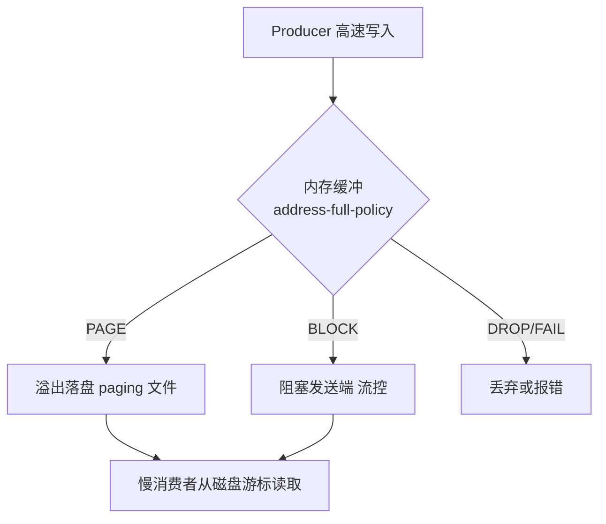
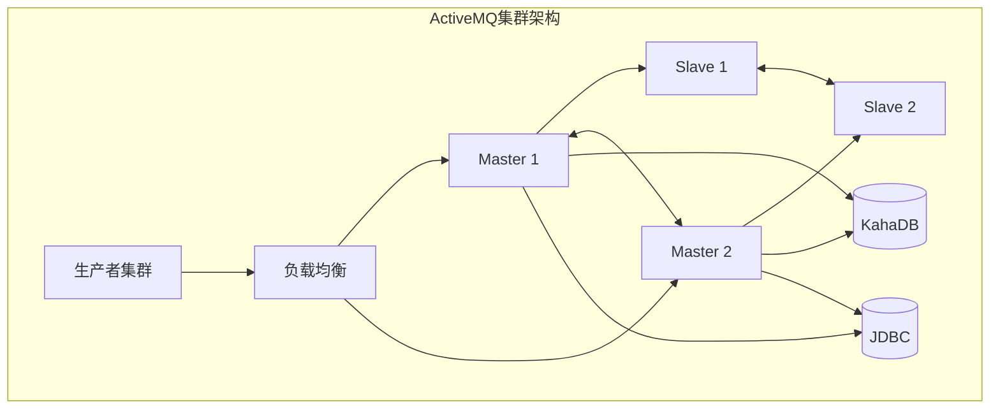
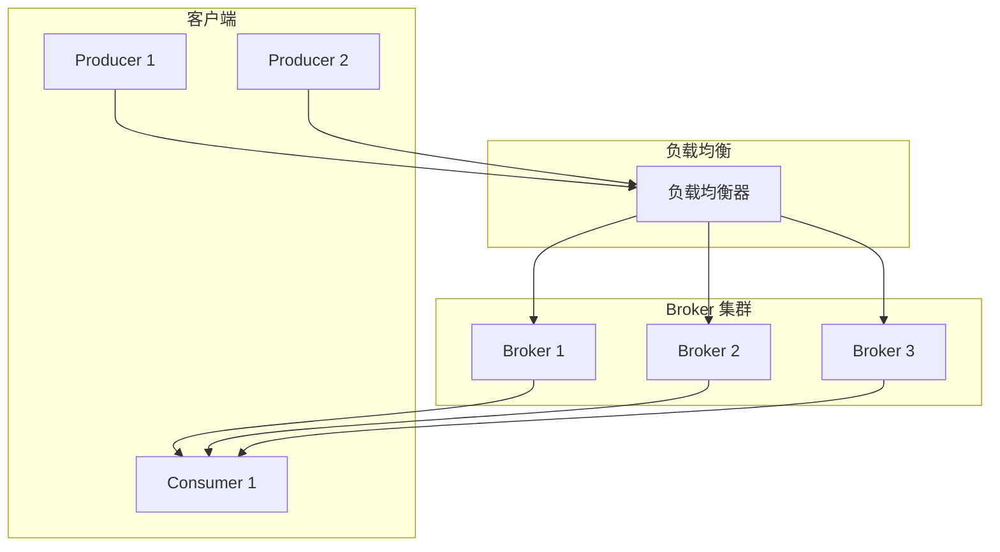
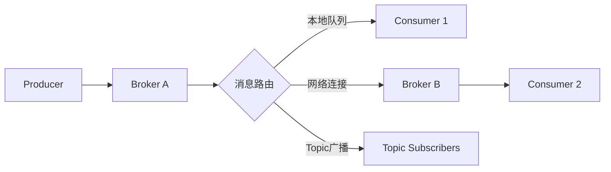

# ActiveMQ 与 JMS 规范（老牌消息中间件）

> ActiveMQ 是 **Apache 老牌 JMS（Java Message Service）消息中间件**，ActiveMQ 5.x 经典、ActiveMQ Artemis（6.x 起为默认，基于 Netty/NIO 重写）现代。JMS 是 Java 官方的消息规范（Point-to-Point 队列 + Pub/Sub 主题），ActiveMQ 是其参考实现。相比 Kafka（流平台）、RocketMQ（阿里系）、RabbitMQ（AMQP），ActiveMQ 以「**JMS 规范兼容 + 老系统存量 + 轻量部署**」在传统 Java 企业系统中仍占一席。本篇按「解决的问题 → 原理 → 特性 → 选型关注点」拆解。

---

## 一、要解决的问题

| 痛点 | 说明 |
|------|------|
| Java 规范统一 | 业务系统要按标准 API（JMS）写消息代码，不绑定厂商 |
| 可靠投递 | 消息不能丢（持久化/确认/重投） |
| 点对点/发布订阅 | 任务队列 + 广播两类场景都要支持 |
| 事务消息 | 消息收发与业务操作同事务 |
| 存量兼容 | 老系统已有 ActiveMQ，需要平滑升级/维护 |

> 核心认知：**JMS = Java 消息编程的「JDBC 式标准」**——定义接口（Connection/Session/Message/Queue/Topic），ActiveMQ 是其中一种实现；而 Artemis 是 ActiveMQ 的下一代内核。

---

## 二、核心原理

### 2.1 JMS 编程模型（规范核心）

```
ConnectionFactory → Connection → Session（事务/确认模式）
  ├── Destination：Queue（点对点）/ Topic（发布订阅）
  ├── MessageProducer / MessageConsumer
  ├── Message（TextMessage/MapMessage/ObjectMessage/BytesMessage...）
  └── MessageListener（异步消费）/ 事务（Session 事务/分布式事务）
```

**两种消费模式**：同步 `receive()`（阻塞拉取）与异步 `setMessageListener`（回调推送）。

### 2.2 消息类型与消息属性

| 消息类型 | 内容 | 适用 |
|----------|------|------|
| TextMessage | 字符串（JSON/XML） | 业务消息（最常用） |
| MapMessage | 键值对集合 | 结构化轻量数据 |
| ObjectMessage | 序列化 Java 对象 | 老系统对象传递（有安全风险） |
| BytesMessage | 二进制流 | 大文件/图片 |
| StreamMessage | 基本类型流 | 日志/指标 |

```
消息属性（Headers + Properties）：
  JMSMessageID / JMSCorrelationID（关联 ID：请求应答匹配）
  JMSDeliveryMode（PERSISTENT/NON_PERSISTENT）
  JMSPriority（0-9 优先级）
  JMSTimestamp / JMSExpiration（TTL）
  JMSReplyTo / JMSRedelivered（重投标记）
 自定义 Properties：按属性筛选消息（消息选择器 selector）
```

### 2.3 ActiveMQ 5.x vs Artemis（6.x 内核）

| 维度 | ActiveMQ 5.x | Artemis（6.x 默认） |
|------|--------------|---------------------|
| IO | BIO（旧） | Netty/NIO（高吞吐） |
| 存储 | KahaDB | 日志（Journal）+ 页缓存 |
| 协议 | OpenWire | OpenWire/AMQP/MQTT/STOMP |
| 性能 | 中 | 高（10 倍+） |
| 高可用 | 主备（共享存储/复制） | 主备 + 多活 |
| 定位 | 存量兼容 | 新项目/升级目标 |

**选型关注点**：新部署直接用 **Artemis**（6.x 默认）；老 5.x 系统升级到 6.x 内核即可获得性能红利。

### 2.4 Artemis 存储架构（Journal）

```
Artemis 存储 = 预写日志（Journal）+ 页缓存（Page Cache）

Journal（类似 LSM/MySQL redo log）：
  append-only 顺序写（NIO 直接 IO）
  后台异步 compaction（合并）
  → 顺序写 + 零拷贝 → 高吞吐持久化

Page Cache（页文件）：
  消息写入先落 page（内存映射）
  超过阈值落盘到 Journal
  消费删除后异步清理

对比 KahaDB（5.x）：B+树结构，随机写多 → 性能差
```

### 2.5 消息可靠性机制

| 机制 | 说明 |
|------|------|
| 持久化消息 | 落盘（Journal），重启不丢 |
| 确认（Ack） | AUTO/CLIENT/DUPS_OK_ACKNOWLEDGE（手动确认） |
| 重投（Redelivery） | 消费失败按策略重投（次数/间隔） |
| 死信队列（DLQ） | 超过重投上限进 DLQ（ActiveMQ.DLQ） |
| 事务 | Session 事务（一批消息原子提交）+ XA 分布式事务 |
| 消息过期（TTL） | 超时消息自动丢弃 |
| 优先级/延迟 | 支持优先级队列与延迟投递（Scheduled Message） |

### 2.6 确认机制深入（防丢消息的关键）

```
JMS 确认模式：
  AUTO_ACKNOWLEDGE：自动确认（receive 返回/onMessage 返回即确认）
    → 消费端处理中崩溃 = 消息已确认但没处理完 = 丢消息
  CLIENT_ACKNOWLEDGE：显式 msg.acknowledge()
    → 处理成功后才确认，崩溃后可重投（推荐）
  DUPS_OK_ACKNOWLEDGE：延迟批量确认（高吞吐，可能重复投递）
    → 消费端必须幂等

生产建议：
  业务处理完成 → 手动确认
  消费端幂等（唯一业务键）→ 容忍重投
```

### 2.7 高可用与集群

- **主备（Master/Slave）**：共享存储（JDBC/文件）或复制模式（Replication）；
- **网络连接器（Network Connectors）**：多 Broker 互通（跨机房/负载分摊）；
- **故障转移 URL**：`failover:(tcp://node1:61616,tcp://node2:61616)`——客户端自动切换。

```
故障转移机制（failover:）：
  客户端连接列表 → 主 Broker 故障 → 自动连备机
  复用旧 Session（消息未确认部分重新投递）
  注意：故障转移窗口内消息可能重复 → 消费幂等

共享存储 vs 复制模式：
  共享存储（Shared Store）：多 Broker 共用同一存储（JDBC/文件系统）
    → 简单，但存储是单点（必须高可用存储）
  复制（Replication）：主 Broker 同步复制到备
    → 无共享存储单点，但网络延迟影响
```

---

## 三、核心特性

| 特性 | 说明 |
|------|------|
| JMS 1.1/2.0 | 标准 API，Java 系统通用 |
| 多协议 | OpenWire/AMQP/MQTT/STOMP（Artemis 全支持） |
| 可靠投递 | 持久化 + 确认 + 重投 + DLQ + 事务 |
| 延迟/优先级消息 | 内置支持 |
| 多语言 | JMS（Java）+ AMQP/MQTT/STOMP 客户端（跨语言） |
| 管理 | Web Console（Hawtio）+ JMX |
| 轻量 | 单进程部署，适合中小系统 |
| 兼容 | Spring JMS / Spring Boot 原生集成 |
| 虚拟主题/队列 | 主题发布 → 每个消费者独立队列（广播+可靠并存） |
| 消息分组 | 同组消息路由到同一消费者（顺序保证） |

### 3.1 虚拟主题（Virtual Topics）深入

```
问题：Topic 广播不支持"消费者掉线补收"（Pub/Sub 特性）
解决：Virtual Topic = 主题 + 每个消费者一个独立持久队列
  生产者发到 virtual topic：consumer.Orders
  消费者 A 订阅 consumer.A.Orders（独立队列，掉线补收）
  消费者 B 订阅 consumer.B.Orders
  → 广播 + 点对点可靠共存

场景：多个微服务都要消费同一订单事件，且各自要可靠
```

### 3.2 消息分组（Message Groups）

```
作用：保证"同一组消息"顺序消费
  消息带 JMXGroupID 属性
  Broker 将同组消息路由到同一消费者（粘性）
  组内有序，组间并行

场景：同一订单的所有操作必须按顺序处理（状态机流转）
```

---

## 四、ActiveMQ vs RabbitMQ vs RocketMQ vs Kafka

| 维度 | ActiveMQ | RabbitMQ | RocketMQ | Kafka |
|------|----------|----------|----------|-------|
| 规范 | JMS（Java 标准） | AMQP | 自研（阿里） | 自研（流） |
| 吞吐 | 中 | 中 | 高 | 最高 |
| 延迟 | 毫秒 | 毫秒 | 毫秒 | 毫秒 |
| 可靠性 | 强（事务/DLQ） | 强 | 强（事务消息） | 中（丢数据风险） |
| 多语言 | 中（协议支持） | 强 | 中 | 强 |
| 运维 | 轻 | 轻 | 中 | 重 |
| 存量生态 | 老 Java 系统 | 通用企业 | 国内业务 | 大数据/流 |
| 活跃度 | 维护期 | 活跃 | 活跃 | 最活跃 |
| 有序性 | 队列内有序 | 队列内有序 | 分区内有序 | 分区内有序 |
| 消息回溯 | 无 | 无 | 有（offset） | 强（重放） |

**选型关注点**：
- 老 Java 系统/必须 JMS → **ActiveMQ**（存量兼容）；
- 通用企业消息 → **RabbitMQ**；
- 国内高可靠业务消息 → **RocketMQ**；
- 日志/流/大数据 → **Kafka**；
- 新项目一般不建议再选 ActiveMQ（除非存量约束）。

---

## 五、生产实践

### 5.1 关键配置

| 配置 | 建议 |
|------|------|
| 持久化 | 关键消息必须 `DeliveryMode.PERSISTENT` |
| 确认 | 业务幂等 + CLIENT_ACK/手动确认（不自动确认防丢） |
| 重投 | 配置最大重投次数 + DLQ 路由 |
| 事务 | 与业务同库操作用 Session 事务；跨资源用 XA |
| 连接池 | 使用连接池（JMS 连接创建昂贵） |
| 监控 | JMX + Hawtio Console + 队列深度告警 |
| 内存 | 配置内存限额（maxMemoryUsage）+ 流控（producerFlowControl） |

### 5.2 内存与流控机制

```
问题：生产快、消费慢 → Broker 内存打爆 → 崩溃

解决：
  producerFlowControl：生产者被阻塞（等待消费者消化）
  maxMemoryUsage：每个队列内存上限
  临时文件溢出：内存不够时消息落临时存储
  → 生产必须监控"生产者阻塞"与队列深度

配置示例（artemis.xml）：
  <address-settings>
    <address-setting match="jms.queue.#">
      <max-size-bytes>104857600</max-size-bytes>
      <page-size-bytes>2097152</page-size-bytes>
      <producer-flow-control>true</producer-flow-control>
    </address-setting>
  </address-settings>
```

### 5.3 常见坑

- **ObjectMessage 安全**：反序列化漏洞历史 → 白名单类/禁用 ObjectMessage；
- **自动确认丢消息**：消费端崩溃 → 用手动确认；
- **DLQ 无人消费**：DLQ 堆积等于消息丢失 → DLQ 告警监控；
- **5.x BIO 性能**：高吞吐场景必须 Artemis（Netty）；
- **消息过大**：超过 10MB 消息慎用（内存/存储压力）；
- **慢消费者拖垮全局**：一个队列积压导致流控阻塞其他队列 → 隔离慢消费者队列。

### 5.4 监控与告警清单

```
队列深度（积压告警：> 阈值持续 X 分钟）
生产者阻塞时间（流控触发）
DLQ 消息数（> 0 告警）
消费速率 vs 生产速率（积压趋势）
Broker 内存/磁盘使用率
重投率（消费失败频繁 = 处理逻辑问题）
```

---

## 六、选型速查

| 需求 | 首选 | 备选 |
|------|------|------|
| 存量 JMS 系统 | ActiveMQ（升级 Artemis） | 过渡期桥接 |
| 通用企业消息 | RabbitMQ | ActiveMQ |
| 国内高可靠业务 | RocketMQ | — |
| 日志/流处理 | Kafka | — |
| 物联网轻量 | MQTT/EMQX | ActiveMQ（MQTT 协议） |
| Java 内嵌消息 | Artemis 嵌入模式 | — |

### 6.1 决策树

```
必须用 JMS 规范？→ 是 → ActiveMQ（Artemis 内核）
已有 ActiveMQ 存量？→ 是 → 升级 Artemis，不换系统
新项目 Java 生态？→ 轻量通用 → RabbitMQ；高可靠事务 → RocketMQ
数据流/日志 → Kafka
IoT → MQTT（EMQX/Mosquitto）
```

---

## 七、JMS 2.0 特性与高级功能

### 7.1 JMS 2.0 新特性

```
JMS 2.0（JSR 343）在 JMS 1.1 基础上增加：

1. 简化 API（JMSContext）：
   JMSContext = Connection + Session（合并）
   一行代码创建上下文：
     JMSContext ctx = connectionFactory.createContext();
     ctx.createProducer().send(queue, "message");

2. 共享订阅（Shared Durable Subscription）：
   多个消费者共享一个持久订阅（负载均衡）
   JMS 1.1 的 Durable Subscription 只能单消费者
   JMS 2.0 允许多消费者共享 → 水平扩展消费能力

3. 异步消费增强：
   CompletionListener（异步发送确认）
   Sestination.createSharedConsumer()

4. 消息延迟（Delivery Delay）：
   producer.setDeliveryDelay(5000);  // 延迟 5 秒投递
   （JMS 1.1 需要 Broker 特定扩展）

5. 消息大小（Body Size）：
   message.getBodyLength()  获取消息体大小
```

### 7.2 消息组（Message Groups）深入

```
消息组 = 同一 GroupID 的消息路由到同一消费者（粘性）

实现机制：
  消息属性 JMSXGroupID = "order_123"
  Broker 按 GroupID 哈希 → 路由到固定消费者
  组内消息保序，组间并行

使用场景：
  1. 订单状态机：同一订单的所有操作必须按顺序
  2. 用户行为：同一用户的事件按时间排序
  3. 流处理：同一 key 的事件需要状态一致

配置（ActiveMQ Artemis）：
  消息属性：
    JMSXGroupID = "order_123"
    JMSXGroupSequence = 1  （可选，组内序号）

注意事项：
  消费者崩溃 → 组内未确认消息重新分配到其他消费者
  消费者重启 → 可能收到之前组的消息（需幂等）
  组大小无限制，但过多组会导致路由开销
```

### 7.3 Browser（浏览器目的地）

```java
// JMS Browser：预览队列消息（不消费）
Browser browser = session.createBrowser(queue);
Enumeration enumeration = browser.getEnumeration();
while (enumeration.hasMoreElements()) {
    Message msg = (Message) enumeration.nextElement();
    // 查看消息属性/内容，不触发消费
    System.out.println(msg.getStringProperty("order_id"));
}
browser.close();

// 适用场景：
//   运维查看队列消息内容
//   调试消息格式
//   不影响消费流程的监控
```

### 7.4 XA 分布式事务

```
JMS XA 事务 = 消息收发与业务操作同事务（ACID）

流程：
  XAConnection → XA Session
  → 分支 1：JMS 消息发送/接收
  → 分支 2：数据库操作（JDBC）
  → XAResource.prepare() → 两阶段提交第一阶段
  → XAResource.commit() → 第二阶段

  保证：消息发送与数据库写入要么同时成功，要么同时回滚

配置（Spring Boot）：
  spring.jms.pub-sub-domain=false
  spring.activemq.pool.enabled=true
  spring.activemq.pool.xa.enabled=true  # XA 连接池

性能影响：
  XA 事务比本地事务慢 3-5 倍（两阶段提交开销）
  生产建议：
    同库操作 → 本地事务（Session 事务）
    跨资源（JMS + DB）→ XA 或消息最终一致性
    极高性能要求 → 避免 XA，用可靠消息最终一致
```

### 7.5 JMS 消息属性详解

```java
// 标准属性（JMS 规范定义）
msg.setJMSCorrelationID("order_123");     // 关联 ID（请求-响应匹配）
msg.setJMSDeliveryMode DeliveryMode.PERSISTENT;  // 持久化
msg.setJMSPriority(4);                    // 优先级（0-9）
msg.setJMSExpiration(System.currentTimeMillis() + 3600000); // TTL 1小时
msg.setJMSReplyTo(replyQueue);            // 回复队列

// 自定义属性（用于消息选择器）
msg.setStringProperty("region", "shanghai");
msg.setIntProperty("priority", 1);
msg.setBooleanProperty("vip", true);

// 消息选择器（消费端过滤）
MessageConsumer consumer = session.createConsumer(
    queue,
    "region = 'shanghai' AND priority > 5"
);
// Broker 根据选择器过滤消息 → 只投递匹配的消息
// 选择器基于 SQL 语法（WHERE 子句）

// 注意：选择器在 Broker 端执行（消息路由时过滤）
//   不是消费端过滤 → 减少网络传输
//   但会增加 Broker CPU 开销
```

---

## 八、ActiveMQ 网络拓扑与高可用

### 8.1 Network of Brokers（网络连接器）

```
Network of Brokers = 多 Broker 互联（跨机房/负载分摊）

拓扑模式：
  1. Network Connector（默认单向）：
     Broker A → Broker B（A 的消息自动路由到 B）

  2. Duplex Connector（双向）：
     Broker A ↔ Broker B（双向路由）

  3. Hub-Spoke（中心辐射）：
     中心 Broker 连接所有边缘 Broker

配置示例（activemq.xml）：
  <networkConnectors>
    <networkConnector
        name="bridge"
        uri="static:(tcp://broker-b:61616)"
        duplex="true"
        decreaseNetworkConsumerPriority="true"
        networkTTL="2"
        dynamicOnly="false">
      <excludedDestinations>
        <queue physicalName="admin.>" />
      </excludedDestinations>
    </networkConnector>
  </networkConnectors>

参数说明：
  networkTTL: 消息在网络中的最大跳数（防环路）
  decreaseNetworkConsumerPriority: 降低远程消费者优先级
  dynamicOnly: 只在有消费者时才路由消息
  excludedDestinations: 排除不需要路由的目的地
```

### 8.2 Master-Slave vs Network

```
高可用方案对比：

Master-Slave（主备）：
  共享存储（Shared Store）：
    多 Broker 共用 JDBC/文件系统
    主 Broker 故障 → 备 Broker 接管存储
    优点：数据零丢失
    缺点：存储是单点（必须高可用存储）

  复制（Replication）：
    主 Broker 异步/同步复制到备
    优点：无共享存储单点
    缺点：同步复制影响性能，异步可能丢数据

Network of Brokers：
  多 Broker 独立存储 + 网络路由
  优点：水平扩展 + 分布式
  缺点：消息路由延迟 + 管理复杂

生产建议：
  中小规模 → Master-Slave（简单可靠）
  大规模/跨机房 → Network of Brokers
  混合方案 → Master-Slave + Network（每组内主备，组间互联）
```

---

## 九、ActiveMQ 在企业集成模式中的应用

### 9.1 经典集成模式

```
1. 消息通道（Message Channel）：
   Queue/Topic = 应用间的解耦通道
   Producer 不知道 Consumer → 独立演进

2. 发布-订阅（Publish-Subscribe）：
   Topic 模式 → 一个消息多个消费者
   适用：事件通知、状态广播

3. 消息路由器（Message Router）：
   消息选择器/Network Connector → 按规则路由到不同目的地

4. 消息转换器（Message Translator）：
   消息格式转换（XML → JSON）
   JMS MessageListener 中做格式转换

5. 消息增强器（Message Enricher）：
   消息中添加额外信息（如用户信息、地区信息）

6. 消息过滤器（Message Filter）：
   JMS 消息选择器 → Broker 端过滤

7. 消息聚合器（Message Aggregator）：
   多个响应聚合为一个（JMSCorrelationID 匹配）

8. 消息分解器（Message Splitter）：
   一个消息拆分为多个（如批量订单拆分单个处理）

9. 请求-回复模式（Request-Reply）：
   JMSReplyTo + JMSCorrelationID → 异步请求-响应

10. 死信队列（Dead Letter Queue）：
    消费失败消息路由到 DLQ → 人工处理/重试
```

### 9.2 ActiveMQ 在 ESB 中的角色

```
企业服务总线（ESB）中 ActiveMQ 的定位：

  应用 A ──┐
  应用 B ──┤── ActiveMQ ── ESB 路由 ── 服务 X
  应用 C ──┘

  作用：
    消息缓冲：削峰填谷
    协议转换：JMS ↔ AMQP/MQTT
    消息路由：按内容/属性路由
    可靠投递：持久化 + 确认 + 重试
    事务保证：XA 分布式事务

  不适用场景：
    高吞吐流处理（用 Kafka）
    实时 RPC（用 gRPC/Dubbo）
    事件溯源（用 Kafka Streams）
```

---

## 十、ActiveMQ vs RabbitMQ vs RocketMQ 详细对比

| 维度 | ActiveMQ | RabbitMQ | RocketMQ |
|------|----------|----------|----------|
| **协议** | JMS/OpenWire/AMQP/MQTT | AMQP/STOMP/MQTT | 自研（Remoting） |
| **语言** | Java | Erlang | Java |
| **存储** | KahaDB/Journal/LevelDB | Mnesia + 索引文件 | CommitLog + ConsumeQueue |
| **吞吐** | 中（万级/秒） | 中（万级/秒） | 高（十万级/秒） |
| **延迟** | 毫秒级 | 微秒级（Erlang） | 毫秒级 |
| **消息模型** | Queue/Topic/Virtual Topic | Exchange + Queue | Queue/Tag/消费组 |
| **事务消息** | JMS XA | 不支持 | **半消息事务（核心特性）** |
| **消息回溯** | 不支持 | 不支持 | 支持（按时间/offset） |
| **顺序消息** | 消息组 | 有限支持 | **队列内严格有序** |
| **延迟消息** | 内置支持 | 插件支持 | **开箱即用** |
| **消息追踪** | JMX/Hawtio | Management UI | **消息轨迹（全链路追踪）** |
| **运维** | 轻量 | 轻量 | 中等 |
| **中文社区** | 弱 | 弱 | 强（阿里开源） |
| **适用** | 老 Java 系统/JMS | 通用企业消息 | **国内高可靠业务消息** |

### 消息模型差异

```
ActiveMQ：
  Queue（点对点）→ 一个消费者消费
  Topic（发布订阅）→ 多个消费者消费（不持久化）
  Virtual Topic → Topic 发布 + 每消费者独立队列（广播 + 可靠）

RabbitMQ：
  Exchange（路由）+ Queue（存储）
  Direct Exchange → 精确路由（routing key）
  Fanout Exchange → 广播（binding key 忽略）
  Topic Exchange → 模式匹配路由
  Headers Exchange → 按消息头路由

RocketMQ：
  Topic + Tag（二级分类）
  Queue（队列内有序）
  ConsumerGroup（消费组，组内负载均衡）
  MessageExt（扩展属性丰富）

选型关注点：
  JMS 规范 → ActiveMQ
  灵活路由 → RabbitMQ（Exchange 机制）
  高可靠 + 事务消息 → RocketMQ
  日志/流处理 → Kafka
```

---

## 十一、Artemis 日志型存储架构 vs Classic KahaDB（存储内核深拆）

### 11.1 两种内核的文件布局

```
KahaDB（Classic 5.x 默认存储）：
  db.data        元数据索引（页式 B-Tree，随机读写）
  db-*.log       消息数据日志（append，但索引维护产生随机 IO）
  db.free/db.redo 空闲页/恢复日志
  问题：消息写入 = append log + 更新 B-Tree 索引
       → 大队列下索引页随机 IO 放大，checkpoint 变慢

Artemis Journal（6.x 默认）：
  *.journal      固定大小数据文件组（默认 10MB × N 个，NIO/AIO 直写）
  *.bindings     绑定/元数据独立 journal
  large-messages 大消息旁路目录
  特点：
    - 纯 append-only 顺序写 + O_DIRECT，绕过 OS 页缓存双写
    - 消息删除只置 tombstone，journal 文件整体变空后整文件回收（无 compaction 停顿）
    - 重启只需校验未完成事务边界 → 秒级恢复
```

### 11.2 关键差异对照

| 维度 | Classic KahaDB | Artemis Journal |
|------|----------------|-----------------|
| 写路径 | append + B-Tree 索引更新（混合随机 IO） | 纯顺序 append |
| 吞吐上限 | 万级 msg/s 封顶 | 十万级 msg/s（AIO + 批量写） |
| 大积压启动 | 分钟级（重放校验索引） | 秒级 |
| 文件回收 | 需 compact 手动触发 | 自动整文件 reclaim |
| 多队列隔离 | 单库争抢 | 可按 address 分 journal 缓冲 |

> 迁移提示：Artemis 提供 `artemis migrate` 与 Journal 导入工具，但**跨内核迁移本质是数据重灌**——按「新集群并行 → 双写/桥接 → 切流」走，不要原地换二进制。

---

## 十二、JMS 2.0 共享订阅矩阵（含共享非持久订阅）

JMS 1.1 的 Topic 持久订阅只允许单消费者，无法水平扩展；JMS 2.0 补齐了 Shared Subscription：

| 订阅形态 | API | 并发消费者 | 掉线补收 | 适用场景 |
|----------|-----|-----------|----------|----------|
| 非持久订阅 | `createConsumer(topic)` | 各自独立收全量 | ❌ 在线才收 | 临时通知、实时行情 |
| 持久订阅 | `createDurableConsumer` | **仅 1 个** | ✅ | 单实例可靠消费 |
| **共享非持久订阅** | `createSharedConsumer(topic, name)` | ✅ 组内负载分担 | ❌ 全员掉线即丢 | 广播事件的并行消费（容忍丢失） |
| 共享持久订阅 | `createSharedDurableConsumer(topic, name)` | ✅ 负载分担 | ✅ 订阅维度补收 | Topic 上做「逻辑队列」，最常用 ⭐ |

```java
// JMS 2.0 共享持久订阅：多实例消费同一订阅名，Broker 内自动负载均衡
JMSContext ctx = cf.createContext("app", "pwd");
ctx.createSharedDurableConsumer(ctx.createTopic("orders.events"), "order-svc-sub")
   .setMessageListener(msg -> handle(msg.getBody(String.class)));
// 注意：同一 name 的所有消费者构成一个"组"，等价于 Kafka 的 consumer group；
// 但非持久共享订阅没有 offset 回溯能力——这是与 Kafka 的本质差距。
```

---

## 十三、消息组顺序消费实战（Message Groups 深入）

```text
语义：携带相同 JMSXGroupID 的消息固定路由到同一消费者，组内严格有序。
分配机制（Artemis）：
  1. Broker 维护 groupid → consumer 的路由表
  2. 新 GroupID 到达 → 按"最少分组数"挑消费者并绑定
  3. 消费者关闭 → 其绑定组自动迁移到剩余消费者（failover 时序内保序）
  4. 消费者处理完当前组的消息才可能接收新组（组间并行、组内串行）

生产三坑：
  ① GroupID 设计要均匀（用 orderId/userId，别用固定值）→ 否则退化成单消费者
  ② 消费端必须单线程处理该组（或按组 hash 到本地内存队列），否则顺序仍被打破
  ③ 重投消息与原消息竞争时，Artemis 用 group-first 优先清空原组再投新组
```

```xml
<!-- Artemis address-setting：开启本地消息组 + 失败迁移 -->
<address-settings>
  <address-setting match="order.queue">
    <group-buckets>16</group-buckets>          <!-- 组桶数，建议=消费者数×2 -->
    <group-rebalance>true</group-rebalance>    <!-- 消费者变化时重新分配组 -->
    <group-rebalance-pause-dispatch>-1</group-rebalance-pause-dispatch>
  </address-setting>
</address-settings>
```

---

## 十四、慢消费者处理策略（游标 / Paging / 限流）



| 参数（artemis.xml address-setting） | 含义 | 生产建议 |
|--------------------------------------|------|----------|
| `max-size-bytes` | 内存驻留上限 | 按堆外内存预算设（如 512MB/queue） |
| `page-size-bytes` | 每个分页文件大小 | 默认 10MB；大消息调大减少文件数 |
| `address-full-policy` | PAGE/BLOCK/DROP/FAIL | 业务队列 PAGE，实时流 BLOCK |
| `max-delivery-attempts` | 重投次数后进 DLQ | 配合 `<expiry-address>` 兜底 |
| `consumer-window-size` | 消费者预取窗口 | 慢消费者调小（如 0=逐条拉），避免消息被一个慢消费者囤积 |

```text
排查慢消费者的三板斧：
  1. artemis queue stat 看 deliveringCount —— 数值大说明消息压在客户端没 ack
  2. 看 paging 状态（PagingStore）—— 进入 paging 说明内存已满在落盘
  3. 抓消费者线程栈/JFR —— 常见根因：下游 RPC 慢、事务过长、单线程瓶颈
```

---

## 十五、Artemis 集群拓扑（master-slave 与 scale-down）

```mermaid
flowchart LR
    subgraph DC-A["机房A live-backup 对"]
        M1[live-1] -.共享存储/复制.- S1[backup-1]
    end
    subgraph DC-B["机房B live-backup 对"]
        M2[live-2] -.复制.- S2[backup-2]
    end
    M1 <-->|cluster-connection 双向桥接| M2
    APP[应用 failover: static:// (live-1,live-2)] --> M1
```

| 拓扑方案 | 原理 | 优点 | 代价 |
|----------|------|------|------|
| 主备共享存储（shared-store） | backup 等 live 的锁（NFS/ SAN） | 数据零丢失 | 存储是单点，需高可用盘 |
| 主备复制（replication） | 同步复制 journal 到 backup | 无共享存储依赖 | 写延迟增加，脑裂需 quorum 仲裁 |
| 集群对称拓扑（cluster-connection） | N 个 live 互联，消息按需负载均衡转发 | 水平扩容+就近消费 | 配置复杂，注意环路 |
| scale-down / scale-up | `scale-down-to` 把备份的消息合并回目标 broker 后自杀 | 收缩集群免手工搬数 | 仅同版本可用，执行期间有延迟抖动 |

```bash
# 触发 scale-down（把本节点队列迁给集群内其他节点）
artemis scale-down --url tcp://target-host:61616
# 主备切换状态检查
artemis check node --url tcp://live:61616 --up
```

---

## 十六、Spring JMS 集成模板代码

```java
@Configuration
@EnableJms
public class ArtemisConfig {

    @Bean
    public JmsListenerContainerFactory<?> queueFactory(ConnectionFactory cf,
                                                       DefaultJmsListenerContainerFactoryConfigurer cfg) {
        DefaultJmsListenerContainerFactory f = new DefaultJmsListenerContainerFactory();
        cfg.configure(f, cf);
        f.setSessionAcknowledgeMode(Session.CLIENT_ACKNOWLEDGE); // 手动确认防丢
        f.setConcurrency("2-8");                                  // 弹性并发
        return f;
    }
}

@Service
public class OrderSender {
    private final JmsTemplate jmsTemplate;
    public void send(OrderEvent evt) {
        jmsTemplate.setDeliveryPersistent(true);
        jmsTemplate.convertAndSend("orders", evt, m -> {
            m.setStringProperty("JMSXGroupID", evt.getOrderId()); // 消息组保序
            return m;
        });
    }
}

@Component
public class OrderListener {
    @JmsListener(destination = "orders", containerFactory = "queueFactory")
    public void onMessage(Message msg, Session session) throws Exception {
        try { /* 幂等业务处理 */ }
        catch (Exception e) { session.recover(); }   // 触发重投，超次进 DLQ
    }
}
```

---

## 十七、企业遗留系统迁移评估清单

| 评估项 | 检查内容 | 风险等级 |
|--------|----------|----------|
| 协议依赖 | 是否只用 OpenWire？有无 STOMP/C++ 客户端硬编码 | 高（决定客户端改造量） |
| JMS 版本 | 1.1 API 还是已用 2.0 Context | 中（影响代码改写面） |
| ObjectMessage | 有多少处 Java 序列化对象传输 | 高（安全+兼容双重雷区） |
| XA 事务 | 是否依赖 JTA/XA 两阶段提交 | 高（Artemis 支持但性能模型不同） |
| Selector 使用 | 深度 selector 过滤的队列清单 | 中（Artemis 行为略有差异） |
| Virtual Topics | 5.x VirtualTopic 命名约定依赖 | 中（Artemis 用 FQQN 替代，需映射） |
| KahaDB 数据量 | 存量积压消息规模 | 决定迁移窗口长度 |
| 监控告警 | JMX 指标采集脚本绑定关系 | 低 |

**迁移路线建议**：评估清单打分 → 搭建 Artemis 并行环境 → Network of Brokers 桥接灰度流量 → 按应用逐个切连接串 → 观察 2 周 → 下线 5.x。全程保留回退开关（客户端 failover URL 同时指向新旧两套）。

---

## 十八、Artemis 日志型存储 vs KahaDB 性能对比

### 18.1 存储架构差异

```
KahaDB（ActiveMQ 5.x 默认）：
  文件布局：
    db.data        元数据索引（B-Tree，随机读写）
    db-*.log       消息数据日志（append + 索引维护）
  
  写入路径：
    消息写入 → append 到 db-*.log
    → 同时更新 db.data 的 B-Tree 索引（随机 IO）
    → checkpoint 定期刷盘
  
  问题：
    B-Tree 索引维护产生随机 IO → 大队列下性能骤降
    checkpoint 期间阻塞写入
    文件碎片化需要手动 compact

Artemis Journal（6.x 默认）：
  文件布局：
    *.journal      固定大小数据文件组（默认 10MB × N）
    *.bindings     绑定/元数据独立 journal
    large-messages 大消息旁路目录
  
  写入路径：
    消息写入 → append 到 journal（纯顺序 IO）
    → O_DIRECT 绕过 OS 页缓存双写
    → 异步 compaction（整文件回收）
  
  优势：
    纯顺序写 + 零拷贝 → 高吞吐持久化
    消息删除只置 tombstone，journal 文件整体变空后整文件回收
    重启只需校验未完成事务边界 → 秒级恢复
```

### 18.2 性能对比

| 维度 | KahaDB | Artemis Journal |
|------|--------|-----------------|
| 写路径 | append + B-Tree 索引更新 | 纯顺序 append |
| 吞吐上限 | 万级 msg/s | 十万级 msg/s |
| 大积压启动 | 分钟级（重放校验索引） | 秒级 |
| 文件回收 | 需 compact 手动触发 | 自动整文件 reclaim |
| 多队列隔离 | 单库争抢 | 可按 address 分 journal |
| IO 模式 | 混合随机 IO | 纯顺序 IO |
| 恢复时间 | 慢（索引重建） | 快（只校验事务边界） |

> 迁移提示：Artemis 提供 `artemis migrate` 工具，但跨内核迁移本质是数据重灌——建议按「新集群并行 → 双写/桥接 → 切流」走。

## 十九、JMS 2.0 共享非持久订阅 API

### 19.1 共享订阅矩阵

| 订阅形态 | API | 并发消费者 | 掉线补收 | 适用场景 |
|----------|-----|-----------|----------|----------|
| 非持久订阅 | `createConsumer(topic)` | 各自独立收全量 | ❌ 在线才收 | 临时通知 |
| 持久订阅 | `createDurableConsumer` | **仅 1 个** | ✅ | 单实例可靠消费 |
| **共享非持久订阅** | `createSharedConsumer(topic, name)` | ✅ 组内负载分担 | ❌ 全员掉线即丢 | 广播事件并行消费 |
| 共享持久订阅 | `createSharedDurableConsumer(topic, name)` | ✅ 负载分担 | ✅ 订阅维度补收 | Topic 上做「逻辑队列」⭐ |

### 19.2 JMS 2.0 共享订阅代码示例

```java
// JMS 2.0 共享持久订阅：多实例消费同一订阅名，Broker 内自动负载均衡
JMSContext ctx = cf.createContext("app", "pwd");
ctx.createSharedDurableConsumer(
    ctx.createTopic("orders.events"), "order-svc-sub")
   .setMessageListener(msg -> handle(msg.getBody(String.class)));

// 注意：同一 name 的所有消费者构成一个"组"
// 等价于 Kafka 的 consumer group
// 但非持久共享订阅没有 offset 回溯能力——这是与 Kafka 的本质差距
```

### 19.3 JMSContext 简化 API

```java
// JMS 2.0 JMSContext = Connection + Session（合并）
JMSContext ctx = connectionFactory.createContext("user", "pwd");

// 一行代码发送
ctx.createProducer().send(queue, "Hello JMS 2.0");

// 一行代码消费
ctx.createConsumer(queue).setMessageListener(msg -> {
    System.out.println(msg.getBody(String.class));
});

// 自动关闭（try-with-resources）
try (JMSContext ctx = cf.createContext()) {
    ctx.createProducer().send(queue, "auto-close");
}
```

## 二十、消息组顺序消费实战

### 20.1 消息组原理

```
消息组 = 同一 GroupID 的消息固定路由到同一消费者（粘性）

分配机制（Artemis）：
  1. Broker 维护 groupid → consumer 的路由表
  2. 新 GroupID 到达 → 按"最少分组数"挑消费者并绑定
  3. 消费者关闭 → 其绑定组自动迁移到其他消费者
  4. 组内消息保序，组间并行

生产三坑：
  ① GroupID 设计要均匀（用 orderId/userId，别用固定值）
     → 否则退化成单消费者
  ② 消费端必须单线程处理该组
     → 否则顺序仍被打破
  ③ 重投消息与原消息竞争时，Artemis 用 group-first 优先清空原组再投新组
```

### 20.2 配置示例

```xml
<!-- Artemis address-setting：开启本地消息组 + 失败迁移 -->
<address-settings>
  <address-setting match="order.queue">
    <group-buckets>16</group-buckets>          <!-- 组桶数，建议=消费者数×2 -->
    <group-rebalance>true</group-rebalance>    <!-- 消费者变化时重新分配组 -->
    <group-rebalance-pause-dispatch>-1</group-rebalance-pause-dispatch>
  </address-setting>
</address-settings>
```

## 二十一、慢消费者处理策略

### 21.1 Cursor Paging 机制

```
慢消费者处理流程：
  Producer 高速写入 → 内存缓冲达到 address-full-policy 阈值
    → BLOCK：阻塞发送端（流控）
    → PAGE：溢出落盘 paging 文件（推荐）
    → DROP/FAIL：丢弃或报错

Paging 文件：
  消息从内存溢出到磁盘 paging 文件
  慢消费者从磁盘游标读取（性能下降但不阻塞其他消费者）
```

### 21.2 关键配置

| 参数 | 含义 | 生产建议 |
|------|------|----------|
| `max-size-bytes` | 内存驻留上限 | 按堆外内存预算设（如 512MB/queue） |
| `page-size-bytes` | 每个分页文件大小 | 默认 10MB；大消息调大 |
| `address-full-policy` | PAGE/BLOCK/DROP/FAIL | 业务队列 PAGE，实时流 BLOCK |
| `max-delivery-attempts` | 重投次数后进 DLQ | 配合 `<expiry-address>` 兜底 |
| `consumer-window-size` | 消费者预取窗口 | 慢消费者调小（如 0=逐条拉） |

### 21.3 排查三板斧

```
1. artemis queue stat 看 deliveringCount
   → 数值大说明消息压在客户端没 ack

2. 看 paging 状态（PagingStore）
   → 进入 paging 说明内存已满在落盘

3. 抓消费者线程栈/JFR
   → 常见根因：下游 RPC 慢、事务过长、单线程瓶颈
```

## 二十二、Artemis Master-Slave 集群配置

### 22.1 拓扑方案对比

| 拓扑方案 | 原理 | 优点 | 代价 |
|----------|------|------|------|
| 共享存储（shared-store） | backup 等 live 的锁（NFS/SAN） | 数据零丢失 | 存储是单点 |
| 复制（replication） | 同步复制 journal 到 backup | 无共享存储依赖 | 写延迟增加 |
| 集群对称拓扑 | N 个 live 互联，消息负载均衡 | 水平扩容 | 配置复杂 |
| scale-down | 把备份消息合并回目标 broker | 收缩集群 | 仅同版本可用 |

### 22.2 集群配置示例

```bash
# 创建主备对
# Live 节点配置（artemis.xml）
<journal-type>ASYNCHRONOUS</journal-type>
<critical-analyzer>true</critical-analyzer>

# Backup 节点配置
<live-connector>
  <connector name="live">tcp://live-host:61616</connector>
</live-connector>

# 触发 scale-down（把本节点队列迁给集群内其他节点）
artemis scale-down --url tcp://target-host:61616

# 主备切换状态检查
artemis check node --url tcp://live:61616 --up
```

## 二十三、Spring JMS @JmsListener 完整示例

```java
@Configuration
@EnableJms
public class ArtemisConfig {

    @Bean
    public DefaultJmsListenerContainerFactory queueFactory(ConnectionFactory cf) {
        DefaultJmsListenerContainerFactory f = new DefaultJmsListenerContainerFactory();
        f.setSessionAcknowledgeMode(Session.CLIENT_ACKNOWLEDGE); // 手动确认防丢
        f.setConcurrency("2-8");  // 弹性并发 2~8
        f.setErrorHandler(t -> log.error("消费异常", t));
        return f;
    }

    @Bean
    public DefaultJmsListenerContainerFactory topicFactory(ConnectionFactory cf) {
        DefaultJmsListenerContainerFactory f = new DefaultJmsListenerContainerFactory();
        f.setPubSubDomain(true);  // Topic 模式
        f.setSubscriptionShared(true);  // JMS 2.0 共享订阅
        f.setSubscriptionDurable(true);
        return f;
    }
}

@Service
public class OrderSender {
    @Autowired private JmsTemplate jmsTemplate;

    public void send(OrderEvent evt) {
        jmsTemplate.setDeliveryPersistent(true);
        jmsTemplate.convertAndSend("orders", evt, m -> {
            m.setStringProperty("JMSXGroupID", evt.getOrderId()); // 消息组保序
            return m;
        });
    }
}

@Component
public class OrderListener {
    @JmsListener(destination = "orders", containerFactory = "queueFactory")
    public void onMessage(Message msg, Session session) throws Exception {
        try {
            // 幂等业务处理
            OrderEvent evt = ((TextMessage) msg).getBody(OrderEvent.class);
            processOrder(evt);
            msg.acknowledge();  // 手动确认
        } catch (Exception e) {
            session.recover();  // 触发重投，超次进 DLQ
        }
    }
}
```

## 二十四、企业遗留 MQ 系统迁移评估清单

| 评估项 | 检查内容 | 风险等级 |
|--------|----------|----------|
| 协议依赖 | 是否只用 OpenWire？有无 STOMP/C++ 客户端硬编码 | 高 |
| JMS 版本 | 1.1 API 还是已用 2.0 Context | 中 |
| ObjectMessage | 有多少处 Java 序列化对象传输 | 高（安全+兼容） |
| XA 事务 | 是否依赖 JTA/XA 两阶段提交 | 高 |
| Selector 使用 | 深度 selector 过滤的队列清单 | 中 |
| Virtual Topics | 5.x VirtualTopic 命名约定依赖 | 中 |
| KahaDB 数据量 | 存量积压消息规模 | 决定迁移窗口 |
| 监控告警 | JMX 指标采集脚本绑定关系 | 低 |

**迁移路线**：评估清单打分 → 搭建 Artemis 并行环境 → Network of Brokers 桥接灰度流量 → 按应用逐个切连接串 → 观察 2 周 → 下线 5.x。全程保留回退开关（客户端 failover URL 同时指向新旧两套）。

## 二十五、ActiveMQ Artemis vs Classic架构差异深度解析

### 25.1 架构差异对比

```text
ActiveMQ Classic（5.x）架构：
  IO模型：BIO（阻塞IO）
  存储：KahaDB（B+Tree索引）
  协议：OpenWire（JMS专用）
  性能：万级msg/s
  高可用：主备（共享存储/复制）
  定位：存量兼容

ActiveMQ Artemis（6.x）架构：
  IO模型：Netty/NIO（非阻塞IO）
  存储：Journal（预写日志）
  协议：OpenWire/AMQP/MQTT/STOMP（多协议）
  性能：十万级msg/s
  高可用：主备+多活
  定位：新项目/升级目标
```

### 25.2 核心组件差异

| 维度 | Classic (5.x) | Artemis (6.x) |
|------|----------------|----------------|
| IO模型 | BIO（阻塞IO） | Netty/NIO（非阻塞IO） |
| 存储引擎 | KahaDB（B+Tree） | Journal（预写日志） |
| 协议支持 | OpenWire（JMS专用） | 多协议（OpenWire/AMQP/MQTT/STOMP） |
| 吞吐上限 | 万级msg/s | 十万级msg/s |
| 高可用 | 主备（共享存储/复制） | 主备+多活 |
| 内存管理 | 堆内内存 | 堆外内存+页缓存 |
| 消息模型 | Queue/Topic/Virtual Topic | Queue/Topic/Address |
| 管理界面 | Hawtio（JMX） | Web Console（内置） |
| 部署模式 | 单实例/主备 | 单实例/主备/集群 |

### 25.3 性能差异分析

```text
性能差异原因：

  IO模型：
    Classic：BIO → 每个连接一个线程 → 高并发时线程切换开销大
    Artemis：Netty/NIO → 少量线程处理大量连接 → 高并发性能好

  存储引擎：
    Classic：KahaDB（B+Tree）→ 随机IO多 → 大队列下性能骤降
    Artemis：Journal（预写日志）→ 顺序IO → 高吞吐持久化

  内存管理：
    Classic：堆内内存 → GC压力大
    Artemis：堆外内存+页缓存 → GC压力小

  协议支持：
    Classic：OpenWire（JMS专用）→ 协议转换开销大
    Artemis：多协议原生支持 → 协议转换开销小

  性能提升：
    写入：10倍+（从万级到十万级）
    读取：5倍+（从万级到十万级）
    恢复：秒级（从分钟级）
```

## 二十六、ActiveMQ网络连接器深度配置

### 26.1 网络连接器类型

```text
Network Connector（网络连接器）：
  作用：多Broker互联（跨机房/负载分摊）
  类型：
    1. Network Connector（单向）：
       Broker A → Broker B（A的消息自动路由到B）
    
    2. Duplex Connector（双向）：
       Broker A ↔ Broker B（双向路由）
    
    3. Hub-Spoke（中心辐射）：
       中心Broker连接所有边缘Broker
    
    4. Fanout（广播）：
       一个Broker的消息广播到多个Broker

配置示例（activemq.xml）：
  <networkConnectors>
    <networkConnector
        name="bridge"
        uri="static:(tcp://broker-b:61616)"
        duplex="true"
        decreaseNetworkConsumerPriority="true"
        networkTTL="2"
        dynamicOnly="false">
      <excludedDestinations>
        <queue physicalName="admin.>" />
      </excludedDestinations>
    </networkConnector>
  </networkConnectors>
```

### 26.2 网络连接器参数详解

| 参数 | 说明 | 建议 |
|------|------|------|
| `networkTTL` | 消息在网络中的最大跳数（防环路） | 2-3（避免消息循环） |
| `decreaseNetworkConsumerPriority` | 降低远程消费者优先级 | true（优先本地消费） |
| `dynamicOnly` | 只在有消费者时才路由消息 | false（默认） |
| `excludedDestinations` | 排除不需要路由的目的地 | 按需配置 |
| `maximumRedirections` | 最大重定向次数 | 5（防止无限循环） |
| `suppressDuplicateQueueSubscriptions` | 抑制重复队列订阅 | true（减少网络开销） |

### 26.3 Fanout与MultiCast配置

```text
Fanout（广播）：
  作用：一个Broker的消息广播到多个Broker
  配置：
    <networkConnectors>
      <networkConnector name="fanout"
          uri="masterslave:(tcp://broker-a:61616,tcp://broker-b:61616)"
          duplex="false"
          decreaseNetworkConsumerPriority="true">
        <excludedDestinations>
          <queue physicalName="admin.>" />
        </excludedDestinations>
      </networkConnector>
    </networkConnectors>

MultiCast（多播）：
  作用：消息多播到多个消费者
  配置：
    <destination>
      <multicast queue="multicast.queue" />
    </destination>

Fanout vs MultiCast：
  Fanout：Broker级别（多Broker互联）
  MultiCast：消费者级别（多消费者消费同一消息）
```

## 二十七、ActiveMQ消息投递确认模式深度解析

### 27.1 确认模式详解

```text
JMS确认模式：

  AUTO_ACKNOWLEDGE（自动确认）：
    流程：receive()返回/onMessage()返回即确认
    优点：简单，无需手动确认
    缺点：消费端崩溃=消息已确认但没处理完=丢消息
    适用：非关键消息，允许丢失

  CLIENT_ACKNOWLEDGE（客户端确认）：
    流程：处理成功后手动msg.acknowledge()
    优点：处理成功才确认，崩溃后可重投
    缺点：需要手动确认，代码复杂
    适用：关键消息，不允许丢失（推荐）

  DUPS_OK_ACKNOWLEDGE（延迟批量确认）：
    流程：延迟批量确认（高吞吐）
    优点：性能好，减少网络开销
    缺点：可能重复投递（需幂等）
    适用：高吞吐场景，消费端幂等

  SESSION_TRANSACTED（事务确认）：
    流程：Session事务提交时确认
    优点：消息收发与业务操作同事务
    缺点：性能差（事务开销）
    适用：消息收发与数据库操作同事务
```

### 27.2 确认模式对比

| 确认模式 | 性能 | 可靠性 | 复杂度 | 适用场景 |
|----------|------|--------|--------|----------|
| AUTO_ACKNOWLEDGE | 高 | 低（可能丢消息） | 低 | 非关键消息 |
| CLIENT_ACKNOWLEDGE | 中 | 高（推荐） | 中 | 关键消息 |
| DUPS_OK_ACKNOWLEDGE | 最高 | 中（可能重复） | 低 | 高吞吐+幂等 |
| SESSION_TRANSACTED | 低 | 最高（事务） | 高 | 消息+DB同事务 |

### 27.3 生产建议

```text
生产环境确认模式选择：

  关键业务消息：
    确认模式：CLIENT_ACKNOWLEDGE
    消费端：手动确认+幂等处理
    重试：配置最大重投次数+DLQ

  高吞吐场景：
    确认模式：DUPS_OK_ACKNOWLEDGE
    消费端：幂等处理（唯一业务键）
    重试：配置最大重投次数+DLQ

  消息+DB同事务：
    确认模式：SESSION_TRANSACTED
    流程：Session事务提交时确认
    注意：性能差，慎用

  非关键消息：
    确认模式：AUTO_ACKNOWLEDGE
    注意：消费端崩溃可能丢消息
```

## 二十八、ActiveMQ监控与告警深度配置

### 28.1 Web Console配置

```text
ActiveMQ Web Console（Hawtio）：
  功能：
    队列/主题监控：深度、消费者数、消息速率
    Broker监控：内存、磁盘、连接数
    消息查看：查看消息内容、属性
    运维操作：暂停/恢复队列、删除消息

  配置：
    访问地址：http://broker-host:8161/admin
    默认用户：admin/admin
    安全配置：修改conf/jetty.xml

  监控指标：
    Queue Depth：队列深度（积压告警）
    Consumer Count：消费者数量
    Enqueue/Dequeue：入队/出队速率
    Memory Usage：内存使用率
    Store Usage：存储使用率
```

### 28.2 关键监控指标

| 指标 | 说明 | 告警阈值 |
|------|------|----------|
| Queue Depth | 队列深度（积压） | > 10000 持续5分钟 |
| Consumer Count | 消费者数量 | = 0（无消费者） |
| Enqueue Rate | 入队速率 | 突增/突降50% |
| Dequeue Rate | 出队速率 | 突增/突降50% |
| Memory Usage | 内存使用率 | > 80% |
| Store Usage | 存储使用率 | > 80% |
| Producer Blocked | 生产者阻塞时间 | > 1秒 |
| DLQ Messages | 死信队列消息数 | > 0 |
| Redelivery Count | 重投次数 | 持续增长 |

### 28.3 告警配置

```text
告警配置示例：

  队列积压告警：
    条件：Queue Depth > 10000 持续5分钟
    动作：发送告警邮件/钉钉/微信
    处理：检查消费端性能/增加消费者

  无消费者告警：
    条件：Consumer Count = 0
    动作：立即告警
    处理：检查消费端是否崩溃

  内存使用率告警：
    条件：Memory Usage > 80%
    动作：发送告警邮件
    处理：检查消息大小/增加内存/优化消费

  DLQ告警：
    条件：DLQ Messages > 0
    动作：发送告警邮件
    处理：检查消费逻辑/人工处理DLQ消息

  生产者阻塞告警：
    条件：Producer Blocked > 1秒
    动作：发送告警邮件
    处理：检查消费端性能/调整流控参数
```

## 二十九、ActiveMQ与Spring JMS集成最佳实践

### 29.1 JmsTemplate最佳实践

```java
// JmsTemplate配置最佳实践
@Configuration
@EnableJms
public class ActiveMQConfig {

    @Bean
    public ActiveMQConnectionFactory connectionFactory() {
        ActiveMQConnectionFactory factory = new ActiveMQConnectionFactory();
        factory.setBrokerURL("tcp://localhost:61616");
        factory.setUser("admin");
        factory.setPassword("admin");
        
        // 连接池配置
        factory.setUseCompression(true);
        factory.setDispatchAsync(true);
        
        // 重连配置
        factory.setReconnectOnException(true);
        factory.setInitialReconnectDelay(1000);
        factory.setReconnectDelay(1000);
        factory.setMaxReconnectAttempts(-1);
        
        return factory;
    }

    @Bean
    public CachingConnectionFactory cachingConnectionFactory() {
        CachingConnectionFactory factory = new CachingConnectionFactory();
        factory.setTargetConnectionFactory(connectionFactory());
        factory.setSessionCacheSize(10);
        factory.setCacheConsumers(true);
        factory.setCacheProducers(true);
        return factory;
    }

    @Bean
    public JmsTemplate jmsTemplate() {
        JmsTemplate template = new JmsTemplate();
        template.setConnectionFactory(cachingConnectionFactory());
        template.setDeliveryPersistent(true);
        template.setSessionTransacted(true);
        template.setPriority(4);
        template.setTimeToLive(3600000); // 1小时
        return template;
    }
}

// 发送消息最佳实践
@Service
public class OrderSender {
    private final JmsTemplate jmsTemplate;
    
    public void send(OrderEvent event) {
        jmsTemplate.convertAndSend("orders", event, message -> {
            // 设置消息属性
            message.setStringProperty("JMSXGroupID", event.getOrderId());
            message.setStringProperty("orderType", event.getType());
            message.setIntProperty("priority", event.getPriority());
            message.setLongProperty("timestamp", System.currentTimeMillis());
            return message;
        });
    }
}
```

### 29.2 MessageListenerContainer最佳实践

```java
// MessageListenerContainer配置最佳实践
@Configuration
@EnableJms
public class ListenerConfig {

    @Bean
    public DefaultJmsListenerContainerFactory queueListenerFactory() {
        DefaultJmsListenerContainerFactory factory = new DefaultJmsListenerContainerFactory();
        factory.setConnectionFactory(cachingConnectionFactory());
        factory.setSessionAcknowledgeMode(Session.CLIENT_ACKNOWLEDGE);
        factory.setSessionTransacted(false);
        factory.setConcurrency("2-8");
        factory.setRecoveryInterval(5000);
        factory.setErrorHandler(new DefaultErrorHandler());
        
        // 消息选择器
        factory.setMessageSelector("orderType = 'normal'");
        
        return factory;
    }

    @Bean
    public DefaultJmsListenerContainerFactory topicListenerFactory() {
        DefaultJmsListenerContainerFactory factory = new DefaultJmsListenerContainerFactory();
        factory.setConnectionFactory(cachingConnectionFactory());
        factory.setPubSubDomain(true);
        factory.setSubscriptionShared(true);
        factory.setSubscriptionDurable(true);
        factory.setConcurrency("1-4");
        return factory;
    }
}

// 消费者最佳实践
@Component
public class OrderListener {
    
    @JmsListener(destination = "orders", containerFactory = "queueListenerFactory")
    public void onMessage(Message message, Session session) throws JMSException {
        try {
            // 1. 消息验证
            if (message == null) {
                return;
            }
            
            // 2. 幂等检查
            String messageId = message.getJMSMessageID();
            if (isDuplicate(messageId)) {
                log.warn("重复消息: {}", messageId);
                message.acknowledge();
                return;
            }
            
            // 3. 业务处理
            OrderEvent event = extractEvent(message);
            processOrder(event);
            
            // 4. 手动确认
            message.acknowledge();
            
        } catch (Exception e) {
            log.error("消费失败", e);
            session.recover(); // 触发重投
        }
    }
    
    private boolean isDuplicate(String messageId) {
        // 实现幂等检查（Redis/数据库唯一键）
        return false;
    }
}
```

### 29.3 性能优化配置

```text
性能优化配置：

  连接池配置：
    sessionCacheSize=10（缓存Session数量）
    cacheConsumers=true（缓存消费者）
    cacheProducers=true（缓存生产者）
    异步发送：setDispatchAsync(true)

  消费者并发：
    concurrency="2-8"（弹性并发）
    minConcurrency=2（最小并发）
    maxConcurrency=8（最大并发）
    receiveTimeout=1000（接收超时）

  消息预取：
    consumerWindowSize=1MB（预取窗口大小）
    prefetchSize=1000（预取消息数量）
    setOptimizeAcknowledge(true)（优化确认）

  序列化优化：
    使用JSON替代Java序列化
    消息压缩：setUseCompression(true)
    批量发送：setDeliveryMode(DeliveryMode.PERSISTENT)

  监控指标：
    消费速率：messages/sec
    处理延迟：ms/message
    积压深度：queue depth
    错误率：failed messages/sec
```

## 三十一、ActiveMQ Artemis vs Classic 对比

### 核心差异

| 维度 | Artemis（新一代） | Classic（传统） |
|------|-------------------|----------------|
| 架构 | Netty + Chronicle Queue | MBean + KahaDB |
| 协议 | AMQP 1.0 / STOMP / OpenWire / MQTT | OpenWire / STOMP / AMQP（需插件） |
| 消息存储 | Chronicle Queue / JDBC | KahaDB / JDBC / LevelDB |
| 性能 | 高（异步 I/O + 零拷贝） | 中 |
| 镜像队列 | 原生支持 | 需插件 |
| WebSocket | 原生支持 | 需插件 |
| AMQP | 原生支持（标准） | 需插件（非标准） |
| 管理界面 | Web Console（Vue.js） | Hawtio / ActiveMQ Web Console |
| 集群 | In-VM / Discovery / Static | 网络连接器（Network Connector） |

### 选型建议

```
新项目选型：
  ├── 需要 AMQP 1.0 标准 → Artemis
  ├── 需要高吞吐 → Artemis（Chronicle Queue）
  ├── 需要简单部署 → Classic（成熟稳定）
  └── 需要 Spring Boot 集成 → Artemis（spring-boot-starter-artemis）

迁移建议：
  Classic → Artemis（ActiveMQ Artemis 提供迁移工具）
  注意协议兼容性（OpenWire → AMQP）
```

## 三十二、ActiveMQ Network Connector 深入

### 网络连接器配置

```xml
<!-- broker-a.xml -->
<networkConnectors>
  <networkConnector
    name="network-to-b"
    uri="static:(tcp://broker-b:61616)"
    duplex="true"
    decreaseNetworkConsumerPriority="true"
    networkTTL="2"
    dynamicOnly="true"
    excludedDestinations=">
    <excludedDestination>
      <queue physicalName="audit.*"/>
    </excludedDestination>
  </networkConnector>
</networkConnectors>
```

### 网络拓扑

| 拓扑 | 配置 | 适用场景 |
|------|------|---------|
| 单向桥 | duplex=false | 生产→消费 |
| 双向桥 | duplex=true | 集群互备 |
| 链式 | A→B→C | 多机房 |
| 环形 | A→B→C→A | 高可用（慎用） |

## 三十三、ActiveMQ 慢消费者处理

### 慢消费者检测与处理

```xml
<!-- broker.xml 慢消费者配置 -->
<destinationPolicy>
  <destination>
    <policy>
      <slowConsumerStrategy>
        <vmCursor strategy="WARNING" cursorTimeout="1000"/>
      </slowConsumerStrategy>
    </policy>
  </destination>
</destinationPolicy>
```

### 处理策略

| 策略 | 说明 | 适用场景 |
|------|------|---------|
| VM Cursor | 内存队列，满则丢弃 | 不可靠场景 |
| Store Cursor | 磁盘持久化 | 可靠场景 |
| 分页 | 将消息分页到磁盘 | 内存不足 |
| 限流 | 降低消费速度 | 保护下游 |
| 断开连接 | 强制断开慢消费者 | 保护队列 |

## 三十四、ActiveMQ 交付确认（Delivery Acknowledgment）

### 确认模式

| 模式 | 说明 | 性能 | 可靠性 |
|------|------|------|--------|
| AUTO_ACKNOWLEDGE | 自动确认 | 高 | 中 |
| CLIENT_ACKNOWLEDGE | 客户端确认 | 中 | 高 |
| DUPS_OK_ACKNOWLEDGE | 可重复确认 | 高 | 中 |
| SESSION_TRANSACTED | 会话事务 | 低 | 最高 |

### 确认最佳实践

```
确认策略选择：
  1. 消息必须处理 → CLIENT_ACKNOWLEDGE + 手动确认
  2. 消息可以重复 → AUTO_ACKNOWLEDGE
  3. 消息重要但不需要事务 → DUPS_OK_ACKNOWLEDGE
  4. 消息和业务原子性 → SESSION_TRANSACTED
```

## 三十五、ActiveMQ 监控指标

### JMX 指标

| 指标 | 说明 | 告警阈值 |
|------|------|----------|
| broker.Broker.TotalMessageCount | 消息总数 | 持续增长 |
| broker.Broker.TotalEnqueueCount | 入队速率 | 异常波动 |
| broker.Broker.TotalDequeueCount | 出队速率 | 异常波动 |
| broker.Broker.TotalConsumerCount | 消费者数 | 骤降 |
| broker.Destination.InFlightCount | 待处理消息数 | > 10000 |
| broker.Destination.QueueSize | 队列大小 | 持续增长 |

### 监控告警配置

```yaml
# Prometheus JMX Exporter
rules:
  - pattern: "activemq<name=(.*), destinationType=Queue, destinationName=(.*)><>([a-zA-Z]+)"
    name: activemq_queue_$3
    labels:
      queue: $2
    help: "ActiveMQ queue metric: $3"
```

## 三十六、Spring JMS 集成

### Spring Boot 集成示例

```java
// 消息生产者
@Service
public class OrderProducer {
    @Autowired
    private JmsTemplate jmsTemplate;

    public void sendOrder(Order order) {
        jmsTemplate.convertAndSend("order-queue", order);
    }
}

// 消息消费者
@Component
public class OrderConsumer {
    @JmsListener(destination = "order-queue")
    public void receiveOrder(Order order) {
        processOrder(order);
    }
}

// 配置
spring:
  activemq:
    broker-url: tcp://localhost:61616
    user: admin
    password: admin
  jms:
    template:
      delivery-mode: PERSISTENT
      time-to-live: 86400000  # 24 小时
      priority: 4
```

## 三十七、ActiveMQ 与 RabbitMQ vs Kafka 对比

| 维度 | ActiveMQ | RabbitMQ | Kafka |
|------|----------|----------|-------|
| 架构 | 传统消息代理 | AMQP 消息代理 | 分布式日志 |
| 协议 | JMS/OpenWire/AMQP | AMQP/STOMP/MQTT | 私有协议 |
| 消息模型 | Queue/Topic | Exchange/Queue | Topic/Partition |
| 消息顺序 | Queue 内有序 | 单队列有序 | Partition 内有序 |
| 持久化 | KahaDB/JDBC | Mnesia/Erlang | 日志文件 |
| 吞吐量 | 万级/秒 | 万级/秒 | 百万级/秒 |
| 延迟 | 毫秒级 | 微秒级 | 毫秒级 |
| 适用场景 | 企业消息 | 微服务消息 | 流处理/日志 |
| 学习曲线 | 中 | 中 | 高 |

### 选型决策树

```
需要流处理/日志 → Kafka
需要复杂路由 → RabbitMQ
需要 JMS 兼容 → ActiveMQ
需要极高吞吐 → Kafka
需要简单消息 → RabbitMQ
企业环境 JMS → ActiveMQ
```

## 三十八、ActiveMQ 消息持久化策略

### 持久化方案对比

| 方案 | 说明 | 性能 | 可靠性 |
|------|------|------|--------|
| KahaDB | 默认文件系统 | 高 | 中 |
| JDBC | 数据库存储 | 中 | 高 |
| LevelDB | KV 存储 | 高 | 中 |
| 文件存储 | 自定义目录 | 中 | 中 |

### KahaDB 配置优化

```xml
<persistenceAdapter>
  <kahaDB
    directory="${activemq.data}/kahadb"
    journalMaxFileLength="32mb"
    enableJournalDiskSyncs="true"
    checksumEnabled="true"
    indexCacheSize="10000"
    cleanupInterval="30000"
    journalMaxFiles="100"
  />
</kahaDB>
```

## 三十九、ActiveMQ 常见问题排查

| 问题 | 原因 | 解决方案 |
|------|------|----------|
| 消息堆积 | 消费者慢/挂了 | 增加消费者/优化处理 |
| 消息丢失 | 未持久化/未确认 | 启用持久化+CLIENT_ACK |
| 内存溢出 | 消息堆积过多 | 配置内存限制+告警 |
| 连接超时 | 网络/负载过高 | 检查网络+调整超时 |
| 重复消费 | ACK 未正确处理 | 幂等处理+事务 |
| 磁盘满 | 持久化消息堆积 | 监控磁盘+清理策略 |

## ActiveMQ 与 Spring Boot 集成最佳实践

### Spring Boot 自动配置

```java
// Spring Boot ActiveMQ 配置
@Configuration
@EnableJms
public class ActiveMQConfig {
    @Bean
    public ActiveMQConnectionFactory activeMQConnectionFactory() {
        ActiveMQConnectionFactory factory = new ActiveMQConnectionFactory();
        factory.setBrokerURL("tcp://localhost:61616");
        factory.setUserName("admin");
        factory.setPassword("admin");
        
        // 连接池配置
        factory.setPrefetchPolicy(new PrefetchPolicy());
        factory.getPrefetchPolicy().setQueuePrefetch(1000);
        factory.getPrefetchPolicy().setTopicPrefetch(1000);
        
        return factory;
    }
    
    @Bean
    public DefaultJmsListenerContainerFactory jmsListenerContainerFactory(
            ConnectionFactory connectionFactory) {
        DefaultJmsListenerContainerFactory factory = new DefaultJmsListenerContainerFactory();
        factory.setConnectionFactory(connectionFactory);
        factory.setConcurrency("5-10");
        factory.setRecoveryInterval(5000L);
        return factory;
    }
}
```

### JMS 监听器配置

```java
@Component
public class OrderMessageListener {
    @JmsListener(destination = "order.queue", containerFactory = "jmsListenerContainerFactory")
    @Transactional
    public void processOrder(Message message, Session session) throws JMSException {
        try {
            TextMessage textMessage = (TextMessage) message;
            String orderJson = textMessage.getText();
            
            // 业务处理
            Order order = objectMapper.readValue(orderJson, Order.class);
            orderService.process(order);
            
            // 确认消息
            message.acknowledge();
        } catch (Exception e) {
            // 重新投递
            throw new JMSException("处理失败: " + e.getMessage());
        }
    }
}
```

### 消息确认模式对比

| 模式 | 确认方式 | 可靠性 | 性能 | 适用场景 |
|------|----------|--------|------|----------|
| AUTO_ACKNOWLEDGE | 自动确认 | 低 | 高 | 非关键消息 |
| CLIENT_ACKNOWLEDGE | 手动确认 | 高 | 中 | 关键业务 |
| DUPS_OK_ACKNOWLEDGE | 延迟确认 | 中 | 高 | 允许重复 |
| SESSION_TRANSACTED | 事务确认 | 最高 | 低 | 金融级场景 |

## ActiveMQ 生产运维最佳实践

### 部署架构选型

| 架构模式 | 适用场景 | 节点数 | 说明 |
|----------|---------|--------|------|
| 单机模式 | 开发测试 | 1 | 所有组件合一 |
| 主从模式 | 中小规模 | 2 | 主写从读 |
| 集群模式 | 生产环境 | 3+ | 高可用 |
| 网络连接器 | 多机房 | 多集群 | 跨机房同步 |



### 资源规划公式

| 资源类型 | 计算公式 | 推荐值 |
|----------|---------|--------|
| Broker CPU | 消息TPS × 0.001 | 4-8核 |
| Broker 内存 | 队列深度 × 消息大小 × 2 | 8-32GB |
| 磁盘IO | 消息TPS × 消息大小 | 500MB/s+ |
| 网络带宽 | 消息TPS × 消息大小 × 副本数 | 1Gbps+ |
| 连接数 | 消费者数 + 生产者数 | 10000+ |

### 监控告警配置

```yaml
# Prometheus 告警规则
groups:
  - name: activemq-alerts
    rules:
      - alert: ActiveMQBrokerDown
        expr: up{job="activemq"} == 0
        for: 1m
        labels:
          severity: critical
        annotations:
          summary: "ActiveMQ Broker 宕机"

      - alert: ActiveMQQueueDepthHigh
        expr: activemq_queue_queue_size > 10000
        for: 5m
        labels:
          severity: warning
        annotations:
          summary: "队列积压超过10000条"

      - alert: ActiveMQMemoryHigh
        expr: activemq_broker_memory_usage > 0.8
        for: 10m
        labels:
          severity: warning
        annotations:
          summary: "内存使用率超过80%"
```

### 性能压测与调优

| 压测场景 | 压测指标 | 目标值 | 调优方向 |
|----------|---------|--------|---------|
| 高并发写入 | 消息TPS | 10000+ | Broker水平扩展 |
| 消费延迟 | 端到端延迟 | <10ms | 消费者并发优化 |
| 消息堆积 | 堆积恢复时间 | <1h | 消费者扩容 |
| 持久化性能 | 写入吞吐 | 50000+ msg/s | KahaDB优化 |

### 容灾备份策略

| 备份内容 | 备份方式 | 频率 | 保留期 |
|----------|---------|------|--------|
| 消息数据 | KahaDB/JDBC | 实时 | 7天 |
| 配置文件 | Git版本控制 | 每次变更 | 永久 |
| 消费进度 | ZooKeeper | 实时 | 永久 |
| 监控数据 | Prometheus | 15天 | 15天 |

### 故障恢复演练

| 演练场景 | 演练步骤 | 预期结果 | RTO |
|----------|---------|----------|-----|
| Broker宕机 | 停止Broker | Slave自动提升 | <30s |
| 网络分区 | 模拟网络隔离 | 消息不丢失 | <1min |
| 磁盘满 | 模拟磁盘满 | 旧消息自动清理 | <5min |
| 消费者崩溃 | 停止消费者 | 消息重投 | <10s |

### 多租户资源隔离

```text
ActiveMQ多租户隔离策略：

  虚拟主机隔离：
    ├── 独立vhost：每个租户独立vhost
    ├── 资源限制：CPU/内存/连接数限制
    └── 权限控制：用户级权限管理

  队列隔离：
    ├── 命名规范：tenant.queue.name
    ├── 资源配额：队列深度/消费者数限制
    └── 优先级：按租户优先级调度

  网络隔离：
    ├── 网络连接器：租户级网络隔离
    ├── 负载均衡：租户级负载均衡
    └── 流量控制：租户级限流
```

### 与Spring生态集成

```java
// Spring Boot ActiveMQ配置
@Configuration
@EnableJms
public class ActiveMQConfig {
    @Bean
    public ActiveMQConnectionFactory connectionFactory() {
        ActiveMQConnectionFactory factory = new ActiveMQConnectionFactory();
        factory.setBrokerURL("tcp://localhost:61616");
        factory.setUserName("admin");
        factory.setPassword("admin");
        
        // 连接池配置
        factory.setUseCompression(true);
        factory.setDispatchAsync(true);
        
        // 重连配置
        factory.setReconnectOnException(true);
        factory.setInitialReconnectDelay(1000);
        factory.setReconnectDelay(1000);
        factory.setMaxReconnectAttempts(-1);
        
        return factory;
    }
    
    @Bean
    public JmsTemplate jmsTemplate() {
        JmsTemplate template = new JmsTemplate();
        template.setConnectionFactory(connectionFactory());
        template.setDeliveryPersistent(true);
        template.setSessionTransacted(true);
        return template;
    }
}
```

## 二十六、ActiveMQ Artemis vs Classic 深度对比

### 26.1 内核架构对比

```
Classic 内核：
  NIO + 传统 IO 模型
  文件存储 + KahaDB
  JMS 1.1 实现
  社区维护模式

Artemis 内核：
  Netty 异步 IO 模型
  高性能 Journal 存储
  JMS 2.0 + AMQP 支持
  Apache 主动开发
```

| 特性 | Classic | Artemis | 选型建议 |
|------|---------|---------|----------|
| JMS 版本 | 1.1 | 2.0 | 新项目用 2.0 |
| 协议支持 | OpenWire/STOMP | AMQP/MQTT/STOMP | 多协议用 Artemis |
| 性能 | 中等 | 高 | 高吞吐用 Artemis |
| 集群 | 网络连接器 | 原生集群 | 大规模用 Artemis |
| 运维 | 简单 | 复杂 | 小规模用 Classic |

### 26.2 网络连接器配置

```xml
<!-- ActiveMQ 网络连接器配置 -->
<networkConnectors>
    <!-- 单向连接 -->
    <networkConnector name="master"
        uri="static:(tcp://master:61616)"
        duplex="false"
        decreaseNetworkConsumerPriority="true"
        networkTTL="2"
        dynamicOnly="true">
        <excludedQueues>
            <queue physicalName=">"/>
        </excludedQueues>
    </networkConnector>

    <!-- 双向连接 -->
    <networkConnector name="bidirectional"
        uri="static:(tcp://broker1:61616,tcp://broker2:61616)"
        duplex="true"
        networkTTL="3"
        dynamicOnly="true">
        <includedDestinations>
            <queue physicalName="orders.>"/>
            <topic physicalName="events.>"/>
        </includedDestinations>
    </networkConnector>
</networkConnectors>
```

### 26.3 Spring JMS 实战

```java
// Spring JMS 发送者
@Component
public class JmsMessageSender {

    @Autowired
    private JmsTemplate jmsTemplate;

    // 同步发送
    public void sendSync(String destination, String message) {
        jmsTemplate.convertAndSend(destination, message);
    }

    // 异步发送
    public void sendAsync(String destination, String message) {
        jmsTemplate.convertAndSend(destination, message, msg -> {
            msg.setStringProperty("messageType", "async");
            msg.setJMSDeliveryMode(JMSDeliveryMode.PERSISTENT);
            return msg;
        });
    }

    // 带回调发送
    public void sendWithCallback(String destination, String message) {
        jmsTemplate.convertAndSend(destination, message, new MessagePostProcessor() {
            @Override
            public Message postProcessMessage(Message msg) throws JMSException {
                msg.setJMSCorrelationID(UUID.randomUUID().toString());
                msg.setJMSReplyTo(new ActiveMQQueue("reply.queue"));
                return msg;
            }
        });
    }
}

// Spring JMS 接收者
@Component
public class JmsMessageReceiver {

    @JmsListener(destination = "order.queue", concurrency = "5-10")
    public void receiveOrder(Message message) throws JMSException {
        String correlationId = message.getJMSCorrelationID();
        String body = ((TextMessage) message).getText();

        try {
            // 处理业务逻辑
            processOrder(body);

            // 发送回复
            if (message.getJMSReplyTo() != null) {
                jmsTemplate.convertAndSend(message.getJMSReplyTo(),
                    "Processed: " + correlationId, msg -> {
                        msg.setJMSCorrelationID(correlationId);
                        return msg;
                    });
            }
        } catch (Exception e) {
            // 处理失败，投递到 DLQ
            throw e;
        }
    }
}
```

### 26.4 集群部署最佳实践



### 26.5 ActiveMQ 监控与告警

| 监控指标 | 告警阈值 | 说明 |
|----------|----------|------|
| Queue 消息数 | > 10000 | 消息堆积 |
| Consumer 数量 | < 1 | 消费者离线 |
| 内存使用率 | > 80% | 内存压力 |
| 磁盘使用率 | > 90% | 磁盘压力 |
| 连接数 | > 1000 | 连接风暴 |
| 网络延迟 | > 100ms | 网络问题 |

### 26.6 常见生产问题排查

```
问题排查流程：
  1. 消息丢失
     → 检查持久化配置
     → 检查确认机制
     → 检查 DLQ

  2. 消息积压
     → 增加消费者数量
     → 优化消费逻辑
     → 调整预取数量

  3. 消息重复
     → 实现幂等消费
     → 使用消息 ID 去重
     → 业务层去重

  4. 性能问题
     → 启用异步发送
     → 调整批量大小
     → 优化网络配置
```

### 26.7 ActiveMQ 最佳实践总结

```
最佳实践清单：
  1. 架构设计
     → 使用主从模式保证高可用
     → 网络连接器实现消息路由
     → 分离生产和消费队列

  2. 消息设计
     → 使用标准消息格式
     → 添加消息属性
     → 设置合理 TTL

  3. 监控运维
     → 监控队列深度
     → 设置 DLQ 告警
     → 定期清理消息

  4. 性能优化
     → 使用批量发送
     → 启用消息压缩
     → 调整预取数量
```

## 补充：Artemis vs Classic 深度对比

### 架构对比

| 维度 | ActiveMQ Classic | ActiveMQ Artemis |
|------|------------------|------------------|
| 内核 | 传统阻塞I/O | Netty 异步I/O |
| 协议 | JMS 1.1 | JMS 2.0 + AMQP |
| 持久化 | KahaDB/A JDBC | Journal/AIO |
| 性能 | 中 | 高（10x提升） |
| 集群 | 网络连接器 | 自动发现 |
| 管理 | Web Console | 内置监控 |
| 扩展 | 有限 | 高扩展性 |

### Artemis 性能优化

```xml
<!-- broker.xml 配置 -->
<configuration xmlns="urn:activemq"
               xmlns:xsi="http://www.w3.org/2001/XMLSchema-instance"
               xsi:schemaLocation="urn:activemq /schema/activemq-core.xsd">
    
    <!-- 持久化配置 -->
    <persistence>
        <aio-properties>
            <property key="journalMaxIO" value="50000"/>
            <property key="checkpointInterval" value="5000"/>
            <property key="compactionThreshold" value="10485760"/>
        </aio-properties>
    </persistence>
    
    <!-- 队列配置 -->
    <addresses>
        <address name="orders">
            <multicast/>
        </address>
        <address name="payments">
            <anycast>
                <queue name="payments-queue"/>
            </anycast>
        </address>
    </addresses>
    
    <!-- 预取配置 -->
    <address-setting match="#">
        <max-size-bytes>104857600</max-size-bytes>
        <max-delivery-attempts>3</max-delivery-attempts>
        <redelivery-delay>1000</redelivery-delay>
        <max-size-messages>1000</max-size-messages>
    </address-setting>
</configuration>
```

## 补充：网络连接器详解

### 网络连接器模式

```xml
<!-- 静态连接 -->
<networkConnectors>
    <networkConnector name="static-network" 
                       uri="static:(tcp://broker1:61616,tcp://broker2:61616)"/>
</networkConnectors>

<!-- 发现连接 -->
<networkConnectors>
    <networkConnector name="discovery-network"
                       uri="discovery:(discovery-group)"/>
</networkConnectors>

<!-- 多跳连接 -->
<networkConnectors>
    <networkConnector name="multi-hop"
                       uri="static:(tcp://broker1:61616)">
        <staticWelcome>
            <property name="otherInfo" value="hop-1"/>
        </staticWelcome>
    </networkConnector>
</networkConnectors>
```

### 消息路由流程



### 网络监控指标

| 指标 | 说明 | 告警阈值 |
|------|------|----------|
| `activemq.network.connector.broker.*.connected` | 连接状态 | < 期望值 |
| `activemq.network.connector.broker.*.producers` | 生产者数量 | > 1000 |
| `activemq.network.connector.broker.*.consumers` | 消费者数量 | > 1000 |
| `activemq.network.connector.broker.*.queueSize` | 队列深度 | > 100000 |

## 补充：消息投递确认机制

### 确认模式对比

| 模式 | 说明 | 性能 | 可靠性 | 适用场景 |
|------|------|------|--------|----------|
| AUTO_ACKNOWLEDGE | 自动确认 | 高 | 低 | 非关键业务 |
| CLIENT_ACKNOWLEDGE | 客户端确认 | 中 | 高 | 关键业务 |
| DUPS_OK_ACKNOWLEDGE | 可重复确认 | 高 | 中 | 允许重复 |
| SESSION_TRANSACTED | 会话事务 | 低 | 极高 | 金融业务 |

### 确认模式实现

```java
// 客户端确认模式
Session session = connection.createSession(false, Session.CLIENT_ACKNOWLEDGE);
Queue queue = session.createQueue("orders");
MessageConsumer consumer = session.createConsumer(queue);

Message message = consumer.receive();
try {
    // 处理消息
    processMessage(message);
    
    // 确认消息
    message.acknowledge();
} catch (Exception e) {
    // 不确认，消息将重新投递
    throw e;
}

// 会话事务模式
Session session = connection.createSession(true, Session.SESSION_TRANSACTED);
MessageConsumer consumer = session.createConsumer(queue);

Message message = consumer.receive();
try {
    processMessage(message);
    session.commit();  // 提交事务
} catch (Exception e) {
    session.rollback();  // 回滚事务
}
```

### 死信队列（DLQ）配置

```xml
<!-- broker.xml 配置 -->
<address-setting match="#">
    <dead-letter-address>
        <address name="DLQ"/>
    </dead-letter-address>
    <max-delivery-attempts>5</max-delivery-attempts>
    <redelivery-delay>5000</redelivery-delay>
    <max-size-messages>1000</max-size-messages>
    <message-counter-history-day-limit>10</message-counter-history-day-limit>
</address-setting>

<!-- DLQ 处理策略 -->
<policy>
    <policy entry="DLQ.">
        <dead-letter>
            <expiry-address>ExpiryQueue</expiry-address>
            <max-re-deliveries>3</max-re-deliveries>
            <redelivery-delay>10000</redelivery-delay>
            <strategy>DELETE</strategy>  <!-- DELETE/PURGE/SEND -->
        </dead-letter>
    </policy>
</policy>
```

## 补充：JMS 2.0 新特性

### 简化 API

```java
// JMS 1.1 方式（传统）
Connection connection = factory.createConnection();
connection.start();
Session session = connection.createSession(false, Session.AUTO_ACKNOWLEDGE);
Queue queue = session.createQueue("orders");
MessageProducer producer = session.createProducer(queue);
TextMessage message = session.createTextMessage("Hello");
producer.send(message);

// JMS 2.0 方式（简化）
JMSContext context = factory.createContext();
Queue queue = context.createProducer().send(context.createQueue("orders"), "Hello");
context.createConsumer(queue).setMessageListener(msg -> {
    TextMessage textMsg = (TextMessage) msg;
    System.out.println(textMsg.getText());
});
```

### 共享订阅

```java
// JMS 1.1 - 独占订阅
Topic topic = session.createTopic("events");
MessageConsumer consumer = session.createDurableConsumer(topic, "subscriber-1");

// JMS 2.0 - 共享订阅
context.createSharedDurableConsumer(topic, "shared-subscriber-1");

// JMS 2.0 - 非持久共享订阅
context.createSharedConsumer(topic, "non-durable-subscriber-1");
```

### 异步发送

```java
// JMS 2.0 异步发送
context.createProducer().send(queue, message, completionListener, asyncCallback);

// 异步回调
CompletionListener completionListener = new CompletionListener() {
    @Override
    public void onCompletion(Message message) {
        System.out.println("消息发送成功");
    }
    
    @Override
    public void onException(Message message, Exception exception) {
        System.out.println("消息发送失败: " + exception.getMessage());
        // 重试或记录
    }
};
```

### 消息延迟和过期

```java
// JMS 2.0 消息属性
context.createProducer()
    .setTimeToLive(3600000)  // 1小时后过期
    .setDeliveryMode(DeliveryMode.PERSISTENT)
    .send(queue, message);

// 设置消息延迟
message.setLongProperty("AMQ_SCHEDULED_DELAY", 5000);  // 延迟5秒
message.setLongProperty("AMQ_SCHEDULED_PERIOD", 1000);  // 每1秒重复
message.setIntegerProperty("AMQ_SCHEDULED_REPEAT", 3);  // 重复3次

// JMS 2.0 方式
context.createProducer()
    .setDeliveryDelay(5000)  // 5秒延迟
    .send(queue, message);
```

## 补充：Spring JMS 集成

### Spring Boot 配置

```yaml
# application.yml
spring:
  activemq:
    broker-url: tcp://localhost:61616
    user: admin
    password: admin
    pool:
      enabled: true
      max-connections: 10
      idle-timeout: 30000
      max-active: 20

  jms:
    pub-sub-domain: false  # false=Queue, true=Topic
    template:
      default-destination: orders
      delivery-mode: persistent
      priority: 4
      time-to-live: 3600000
```

### JmsTemplate 使用

```java
@Service
public class OrderService {
    
    @Autowired
    private JmsTemplate jmsTemplate;
    
    // 发送消息
    public void sendOrder(Order order) {
        jmsTemplate.convertAndSend("orders", order, message -> {
            message.setStringProperty("orderType", order.getType());
            message.setIntProperty("priority", order.getPriority());
            return message;
        });
    }
    
    // 接收消息
    public Order receiveOrder() {
        return (Order) jmsTemplate.receiveAndConvert("orders");
    }
    
    // 带超时接收
    public Order receiveOrderWithTimeout(long timeout) {
        Message message = jmsTemplate.receiveSelected("orders", "orderType = 'VIP'");
        if (message != null) {
            return (Order) jmsTemplate.getMessageConverter().fromMessage(message);
        }
        return null;
    }
}

// 监听器
@Component
public class OrderListener {
    
    @JmsListener(destination = "orders", selector = "orderType = 'VIP'")
    public void handleOrder(Order order) {
        System.out.println("处理VIP订单: " + order.getId());
    }
    
    @JmsListener(destination = "orders", concurrency = "3-10")
    public void handleOrderConcurrent(Order order) {
        // 并发处理
    }
}
```

### 监控配置

```yaml
# Actuator 监控
management:
  endpoints:
    web:
      exposure:
        include: health,info,jms
  endpoint:
    jms:
      enabled: true

# 自定义监控指标
@Component
public class JmsMetrics implements MeterBinder {
    
    @Override
    public void bindTo(MeterRegistry registry) {
        Gauge.builder("jms.queue.messages.sent", this, JmsMetrics::getMessagesSent)
            .description("JMS messages sent")
            .register(registry);
        
        Gauge.builder("jms.queue.messages.received", this, JmsMetrics::getMessagesReceived)
            .description("JMS messages received")
            .register(registry);
    }
}
```

## 补充：消息持久化策略

### 持久化方式对比

| 方式 | 性能 | 可靠性 | 说明 |
|------|------|--------|------|
| KahaDB | 中 | 高 | 默认持久化 |
| JDBC | 低 | 极高 | 数据库存储 |
| Memory | 极高 | 低 | 内存存储 |
| PageStore | 高 | 高 | 分页存储 |

### KahaDB 配置

```xml
<!-- persistence 配置 -->
<persistence>
    <kahaDB directory="${data.dir}/kahadb"
            journalMaxFileLength="32mb"
            syncOnCommit="true"
            enableJournalDiskSyncs="true"
            concurrentStoreAndDispatchQueues="true"
            cleanupInterval="30000"
            checkpointInterval="5000"
            indexCacheSize="10000"
            enableIndexWriteAsync="true"/>
</persistence>
```

### 数据库持久化

```xml
<!-- JDBC 持久化 -->
<persistence>
    <jdbcPersistence datasource="jdbc/Derby"
                     dataDirectory="activemq-data"
                     storeDirectory="activemq-data"
                     lockKeepAlivePeriod="5000"/>
</persistence>

<!-- 数据源配置 -->
<bean id="jdbc/Derby" class="org.apache.commons.dbcp2.BasicDataSource" destroy-method="close">
    <property name="driverClassName" value="org.apache.derby.jdbc.EmbeddedDriver"/>
    <property name="url" value="jdbc:derby:${data.dir}/derbyDB;create=true"/>
</bean>
```

## 补充：慢消费者处理

### 慢消费者检测

```java
// 自定义慢消费者检测
public class SlowConsumerDetector implements MessageListener {
    private final long slowThreshold = 1000; // 1秒
    private final AtomicInteger messageCount = new AtomicInteger(0);
    private final AtomicLong lastCheckTime = new AtomicLong(System.currentTimeMillis());
    
    @Override
    public void onMessage(Message message) {
        long currentTime = System.currentTimeMillis();
        long lastTime = lastCheckTime.get();
        int count = messageCount.incrementAndGet();
        
        if (currentTime - lastTime > 1000) { // 每秒检查一次
            int messagesPerSecond = count;
            messageCount.set(0);
            lastCheckTime.set(currentTime);
            
            if (messagesPerSecond < 10) { // 低于阈值
                log.warn("检测到慢消费者，消息处理速率: {} 条/秒", messagesPerSecond);
                // 触发告警或扩容
            }
        }
        
        // 处理消息
        processMessage(message);
    }
}
```

### 调优参数

| 参数 | 默认值 | 推荐值 | 说明 |
|------|--------|--------|------|
| `prefetchSize` | 1000 | 10-50 | 预取数量 |
| `windowSize` | - | 100 | 滑动窗口 |
| `maximumRedeliveries` | 6 | 3 | 最大重试次数 |
| `redeliveryDelay` | 1000 | 5000 | 重试延迟 |
| `useSlowConsumerStrategy` | false | true | 慢消费者策略 |

### 调优配置

```xml
<!-- 队列配置 -->
<destinationPolicy>
    <policyEntry queue="orders"
                  producerFlowControl="true"
                  memoryLimit="1mb"
                  optimizedDispatch="true"
                  lazyDispatch="true"
                  preferDurableSubscribers="true">
        <deadLetterStrategy>
            <individualDeadLetterStrategy queuePrefix="DLQ."
                                          processNonPersistent="true"
                                          processExpired="true"/>
        </deadLetterStrategy>
        <pendingMessageLimitStrategy>
            <constantPendingMessageLimitStrategy limit="1000"/>
        </pendingMessageLimitStrategy>
    </policyEntry>
</destinationPolicy>
```

## 补充：集群部署方案

### 主从集群

```xml
<!-- 主节点配置 -->
<broker brokerName="master" ...>
    <networkConnectors>
        <networkConnector name="slave" uri="static:(tcp://slave:61616)"/>
    </networkConnectors>
</broker>

<!-- 从节点配置 -->
<broker brokerName="slave" ...>
    <networkConnectors>
        <networkConnector name="master" uri="static:(tcp://master:61616)"/>
    </networkConnectors>
    <persistence>
        <kahaDB directory="${data.dir}/kahadb"
                allowOpenWrite="false"/>
    </persistence>
</broker>
```

### 网络集群

```xml
<!-- 节点1配置 -->
<broker brokerName="node1" ...>
    <networkConnectors>
        <networkConnector name="node1-to-node2" 
                           uri="static:(tcp://node2:61616)"/>
        <networkConnector name="node1-to-node3" 
                           uri="static:(tcp://node3:61616)"/>
    </networkConnectors>
</broker>

<!-- 节点2配置 -->
<broker brokerName="node2" ...>
    <networkConnectors>
        <networkConnector name="node2-to-node1" 
                           uri="static:(tcp://node1:61616)"/>
        <networkConnector name="node2-to-node3" 
                           uri="static:(tcp://node3:61616)"/>
    </networkConnectors>
</broker>

<!-- 节点3配置 -->
<broker brokerName="node3" ...>
    <networkConnectors>
        <networkConnector name="node3-to-node1" 
                           uri="static:(tcp://node1:61616)"/>
        <networkConnector name="node3-to-node2" 
                           uri="static:(tcp://node2:61616)"/>
    </networkConnectors>
</broker>
```

### 集群监控

```bash
# 检查集群状态
curl -s 'http://localhost:8161/api/jolokia/read/org.apache.activemq:type=Broker,brokerName=localhost'

# 检查网络连接器
curl -s 'http://localhost:8161/api/jolokia/read/org.apache.activemq:type=Broker,brokerName=localhost,connector=networkConnectors'

# 检查队列深度
curl -s 'http://localhost:8161/api/jolokia/read/org.apache.activemq:type=Broker,brokerName=localhost,destinationType=Queue,destinationName=orders'

# 监控告警脚本
#!/bin/bash
ALERT_THRESHOLD=1000
QUEUE_DEPTH=$(curl -s 'http://localhost:8161/api/jolokia/read/org.apache.activemq:type=Broker,brokerName=localhost,destinationType=Queue,destinationName=orders' | jq -r '.value.QueueSize')

if [ "$QUEUE_DEPTH" -gt "$ALERT_THRESHOLD" ]; then
    echo "队列深度超过阈值: $QUEUE_DEPTH"
    # 发送告警
fi
```

## 补充：性能基准测试

### 测试场景

| 场景 | 并发数 | 消息大小 | 持久化 | 预期TPS |
|------|--------|----------|--------|---------|
| 简单队列 | 10 | 1KB | 是 | 5000 |
| 复杂消息 | 10 | 10KB | 是 | 2000 |
| Topic广播 | 100 | 1KB | 是 | 10000 |
| 事务消息 | 10 | 1KB | 是 | 1000 |
| 消息压缩 | 10 | 100KB | 是 | 1500 |

### 测试代码

```java
public class PerformanceTest {
    
    @Test
    public void testQueuePerformance() throws Exception {
        ActiveMQConnectionFactory factory = new ActiveMQConnectionFactory("tcp://localhost:61616");
        Connection connection = factory.createConnection();
        connection.start();
        
        Session session = connection.createSession(false, Session.AUTO_ACKNOWLEDGE);
        Queue queue = session.createQueue("test-queue");
        MessageProducer producer = session.createProducer(queue);
        producer.setDeliveryMode(DeliveryMode.PERSISTENT);
        
        // 预热
        for (int i = 0; i < 1000; i++) {
            TextMessage message = session.createTextMessage("warmup-" + i);
            producer.send(message);
        }
        
        // 性能测试
        long startTime = System.currentTimeMillis();
        int messageCount = 10000;
        
        for (int i = 0; i < messageCount; i++) {
            TextMessage message = session.createTextMessage("test-" + i);
            producer.send(message);
        }
        
        long duration = System.currentTimeMillis() - startTime;
        double tps = (double) messageCount / duration * 1000;
        
        System.out.printf("消息数: %d, 耗时: %d ms, TPS: %.2f%n", 
                         messageCount, duration, tps);
        
        connection.close();
    }
}
```

### 性能优化清单

| 优化项 | 说明 | 预期提升 |
|--------|------|----------|
| 启用批量发送 | `producer.setProducerWindowSize(1024*1024)` | 2-3x |
| 使用异步发送 | `producer.setAlwaysSyncSend(false)` | 1.5x |
| 调整预取数量 | `queue.setPrefetchSize(10)` | 1.2x |
| 启用消息压缩 | `connectionFactory.setUseCompression(true)` | 1.3x |
| 优化网络配置 | `tcp://localhost:61616?wireFormat.maxFrameSize=10485760` | 1.1x |

## 与其他板块的关系

- 消息选型总览见「[Kafka](./Kafka.md)」「[RabbitMQ](./RabbitMQ.md)」「[RocketMQ](./RocketMQ.md)」；
- AMQP 协议生态见「[RabbitMQ](./RabbitMQ.md)」；
- 云上消息迁移见「[云上消息与集成生态](./云上消息与集成生态.md)」；
- 事务消息见「[分布式事务 Seata](./分布式事务Seata.md)」。

> 一句话：**ActiveMQ = JMS 规范实现 + 可靠投递（持久化/确认/重投/DLQ/事务）+ Artemis 新内核（Netty+Journal）；选型先看「约束（必须 JMS/存量→ActiveMQ，否则 RabbitMQ/RocketMQ）」，再定「内核（新部署→Artemis）」，最后配「手动确认 + DLQ 监控 + 内存流控」**。