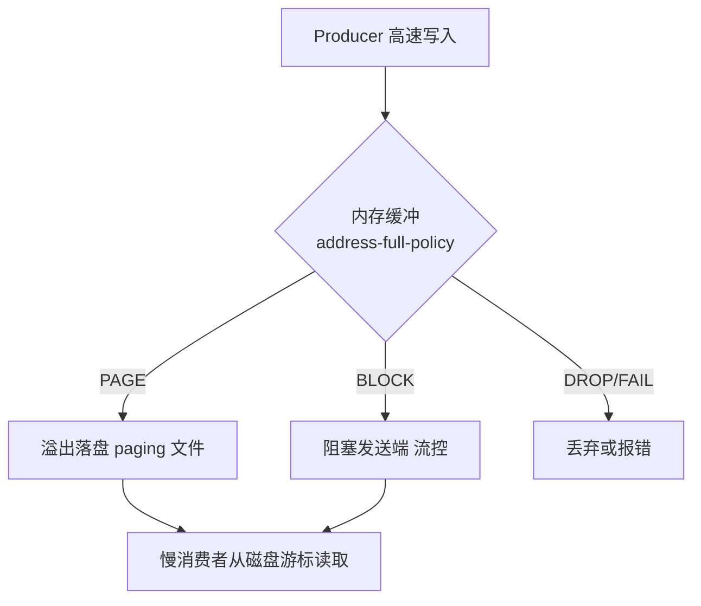

# ActiveMQ 与 JMS 规范（老牌消息中间件）

> ActiveMQ 是 **Apache 老牌 JMS（Java Message Service）消息中间件**，ActiveMQ 5.x 经典、ActiveMQ Artemis（6.x 起为默认，基于 Netty/NIO 重写）现代。JMS 是 Java 官方的消息规范（Point-to-Point 队列 + Pub/Sub 主题），ActiveMQ 是其参考实现。相比 Kafka（流平台）、RocketMQ（阿里系）、RabbitMQ（AMQP），ActiveMQ 以「**JMS 规范兼容 + 老系统存量 + 轻量部署**」在传统 Java 企业系统中仍占一席。本篇按「解决的问题 → 原理 → 特性 → 选型关注点」拆解。

---

## 一、要解决的问题

| 痛点 | 说明 |
|------|------|
| Java 规范统一 | 业务系统要按标准 API（JMS）写消息代码，不绑定厂商 |
| 可靠投递 | 消息不能丢（持久化/确认/重投） |
| 点对点/发布订阅 | 任务队列 + 广播两类场景都要支持 |
| 事务消息 | 消息收发与业务操作同事务 |
| 存量兼容 | 老系统已有 ActiveMQ，需要平滑升级/维护 |

> 核心认知：**JMS = Java 消息编程的「JDBC 式标准」**——定义接口（Connection/Session/Message/Queue/Topic），ActiveMQ 是其中一种实现；而 Artemis 是 ActiveMQ 的下一代内核。

---

## 二、核心原理

### 2.1 JMS 编程模型（规范核心）

```
ConnectionFactory → Connection → Session（事务/确认模式）
  ├── Destination：Queue（点对点）/ Topic（发布订阅）
  ├── MessageProducer / MessageConsumer
  ├── Message（TextMessage/MapMessage/ObjectMessage/BytesMessage...）
  └── MessageListener（异步消费）/ 事务（Session 事务/分布式事务）
```

**两种消费模式**：同步 `receive()`（阻塞拉取）与异步 `setMessageListener`（回调推送）。

### 2.2 消息类型与消息属性

| 消息类型 | 内容 | 适用 |
|----------|------|------|
| TextMessage | 字符串（JSON/XML） | 业务消息（最常用） |
| MapMessage | 键值对集合 | 结构化轻量数据 |
| ObjectMessage | 序列化 Java 对象 | 老系统对象传递（有安全风险） |
| BytesMessage | 二进制流 | 大文件/图片 |
| StreamMessage | 基本类型流 | 日志/指标 |

```
消息属性（Headers + Properties）：
  JMSMessageID / JMSCorrelationID（关联 ID：请求应答匹配）
  JMSDeliveryMode（PERSISTENT/NON_PERSISTENT）
  JMSPriority（0-9 优先级）
  JMSTimestamp / JMSExpiration（TTL）
  JMSReplyTo / JMSRedelivered（重投标记）
 自定义 Properties：按属性筛选消息（消息选择器 selector）
```

### 2.3 ActiveMQ 5.x vs Artemis（6.x 内核）

| 维度 | ActiveMQ 5.x | Artemis（6.x 默认） |
|------|--------------|---------------------|
| IO | BIO（旧） | Netty/NIO（高吞吐） |
| 存储 | KahaDB | 日志（Journal）+ 页缓存 |
| 协议 | OpenWire | OpenWire/AMQP/MQTT/STOMP |
| 性能 | 中 | 高（10 倍+） |
| 高可用 | 主备（共享存储/复制） | 主备 + 多活 |
| 定位 | 存量兼容 | 新项目/升级目标 |

**选型关注点**：新部署直接用 **Artemis**（6.x 默认）；老 5.x 系统升级到 6.x 内核即可获得性能红利。

### 2.4 Artemis 存储架构（Journal）

```
Artemis 存储 = 预写日志（Journal）+ 页缓存（Page Cache）

Journal（类似 LSM/MySQL redo log）：
  append-only 顺序写（NIO 直接 IO）
  后台异步 compaction（合并）
  → 顺序写 + 零拷贝 → 高吞吐持久化

Page Cache（页文件）：
  消息写入先落 page（内存映射）
  超过阈值落盘到 Journal
  消费删除后异步清理

对比 KahaDB（5.x）：B+树结构，随机写多 → 性能差
```

### 2.5 消息可靠性机制

| 机制 | 说明 |
|------|------|
| 持久化消息 | 落盘（Journal），重启不丢 |
| 确认（Ack） | AUTO/CLIENT/DUPS_OK_ACKNOWLEDGE（手动确认） |
| 重投（Redelivery） | 消费失败按策略重投（次数/间隔） |
| 死信队列（DLQ） | 超过重投上限进 DLQ（ActiveMQ.DLQ） |
| 事务 | Session 事务（一批消息原子提交）+ XA 分布式事务 |
| 消息过期（TTL） | 超时消息自动丢弃 |
| 优先级/延迟 | 支持优先级队列与延迟投递（Scheduled Message） |

### 2.6 确认机制深入（防丢消息的关键）

```
JMS 确认模式：
  AUTO_ACKNOWLEDGE：自动确认（receive 返回/onMessage 返回即确认）
    → 消费端处理中崩溃 = 消息已确认但没处理完 = 丢消息
  CLIENT_ACKNOWLEDGE：显式 msg.acknowledge()
    → 处理成功后才确认，崩溃后可重投（推荐）
  DUPS_OK_ACKNOWLEDGE：延迟批量确认（高吞吐，可能重复投递）
    → 消费端必须幂等

生产建议：
  业务处理完成 → 手动确认
  消费端幂等（唯一业务键）→ 容忍重投
```

### 2.7 高可用与集群

- **主备（Master/Slave）**：共享存储（JDBC/文件）或复制模式（Replication）；
- **网络连接器（Network Connectors）**：多 Broker 互通（跨机房/负载分摊）；
- **故障转移 URL**：`failover:(tcp://node1:61616,tcp://node2:61616)`——客户端自动切换。

```
故障转移机制（failover:）：
  客户端连接列表 → 主 Broker 故障 → 自动连备机
  复用旧 Session（消息未确认部分重新投递）
  注意：故障转移窗口内消息可能重复 → 消费幂等

共享存储 vs 复制模式：
  共享存储（Shared Store）：多 Broker 共用同一存储（JDBC/文件系统）
    → 简单，但存储是单点（必须高可用存储）
  复制（Replication）：主 Broker 同步复制到备
    → 无共享存储单点，但网络延迟影响
```

---

## 三、核心特性

| 特性 | 说明 |
|------|------|
| JMS 1.1/2.0 | 标准 API，Java 系统通用 |
| 多协议 | OpenWire/AMQP/MQTT/STOMP（Artemis 全支持） |
| 可靠投递 | 持久化 + 确认 + 重投 + DLQ + 事务 |
| 延迟/优先级消息 | 内置支持 |
| 多语言 | JMS（Java）+ AMQP/MQTT/STOMP 客户端（跨语言） |
| 管理 | Web Console（Hawtio）+ JMX |
| 轻量 | 单进程部署，适合中小系统 |
| 兼容 | Spring JMS / Spring Boot 原生集成 |
| 虚拟主题/队列 | 主题发布 → 每个消费者独立队列（广播+可靠并存） |
| 消息分组 | 同组消息路由到同一消费者（顺序保证） |

### 3.1 虚拟主题（Virtual Topics）深入

```
问题：Topic 广播不支持"消费者掉线补收"（Pub/Sub 特性）
解决：Virtual Topic = 主题 + 每个消费者一个独立持久队列
  生产者发到 virtual topic：consumer.Orders
  消费者 A 订阅 consumer.A.Orders（独立队列，掉线补收）
  消费者 B 订阅 consumer.B.Orders
  → 广播 + 点对点可靠共存

场景：多个微服务都要消费同一订单事件，且各自要可靠
```

### 3.2 消息分组（Message Groups）

```
作用：保证"同一组消息"顺序消费
  消息带 JMXGroupID 属性
  Broker 将同组消息路由到同一消费者（粘性）
  组内有序，组间并行

场景：同一订单的所有操作必须按顺序处理（状态机流转）
```

---

## 四、ActiveMQ vs RabbitMQ vs RocketMQ vs Kafka

| 维度 | ActiveMQ | RabbitMQ | RocketMQ | Kafka |
|------|----------|----------|----------|-------|
| 规范 | JMS（Java 标准） | AMQP | 自研（阿里） | 自研（流） |
| 吞吐 | 中 | 中 | 高 | 最高 |
| 延迟 | 毫秒 | 毫秒 | 毫秒 | 毫秒 |
| 可靠性 | 强（事务/DLQ） | 强 | 强（事务消息） | 中（丢数据风险） |
| 多语言 | 中（协议支持） | 强 | 中 | 强 |
| 运维 | 轻 | 轻 | 中 | 重 |
| 存量生态 | 老 Java 系统 | 通用企业 | 国内业务 | 大数据/流 |
| 活跃度 | 维护期 | 活跃 | 活跃 | 最活跃 |
| 有序性 | 队列内有序 | 队列内有序 | 分区内有序 | 分区内有序 |
| 消息回溯 | 无 | 无 | 有（offset） | 强（重放） |

**选型关注点**：
- 老 Java 系统/必须 JMS → **ActiveMQ**（存量兼容）；
- 通用企业消息 → **RabbitMQ**；
- 国内高可靠业务消息 → **RocketMQ**；
- 日志/流/大数据 → **Kafka**；
- 新项目一般不建议再选 ActiveMQ（除非存量约束）。

---

## 五、生产实践

### 5.1 关键配置

| 配置 | 建议 |
|------|------|
| 持久化 | 关键消息必须 `DeliveryMode.PERSISTENT` |
| 确认 | 业务幂等 + CLIENT_ACK/手动确认（不自动确认防丢） |
| 重投 | 配置最大重投次数 + DLQ 路由 |
| 事务 | 与业务同库操作用 Session 事务；跨资源用 XA |
| 连接池 | 使用连接池（JMS 连接创建昂贵） |
| 监控 | JMX + Hawtio Console + 队列深度告警 |
| 内存 | 配置内存限额（maxMemoryUsage）+ 流控（producerFlowControl） |

### 5.2 内存与流控机制

```
问题：生产快、消费慢 → Broker 内存打爆 → 崩溃

解决：
  producerFlowControl：生产者被阻塞（等待消费者消化）
  maxMemoryUsage：每个队列内存上限
  临时文件溢出：内存不够时消息落临时存储
  → 生产必须监控"生产者阻塞"与队列深度

配置示例（artemis.xml）：
  <address-settings>
    <address-setting match="jms.queue.#">
      <max-size-bytes>104857600</max-size-bytes>
      <page-size-bytes>2097152</page-size-bytes>
      <producer-flow-control>true</producer-flow-control>
    </address-setting>
  </address-settings>
```

### 5.3 常见坑

- **ObjectMessage 安全**：反序列化漏洞历史 → 白名单类/禁用 ObjectMessage；
- **自动确认丢消息**：消费端崩溃 → 用手动确认；
- **DLQ 无人消费**：DLQ 堆积等于消息丢失 → DLQ 告警监控；
- **5.x BIO 性能**：高吞吐场景必须 Artemis（Netty）；
- **消息过大**：超过 10MB 消息慎用（内存/存储压力）；
- **慢消费者拖垮全局**：一个队列积压导致流控阻塞其他队列 → 隔离慢消费者队列。

### 5.4 监控与告警清单

```
队列深度（积压告警：> 阈值持续 X 分钟）
生产者阻塞时间（流控触发）
DLQ 消息数（> 0 告警）
消费速率 vs 生产速率（积压趋势）
Broker 内存/磁盘使用率
重投率（消费失败频繁 = 处理逻辑问题）
```

---

## 六、选型速查

| 需求 | 首选 | 备选 |
|------|------|------|
| 存量 JMS 系统 | ActiveMQ（升级 Artemis） | 过渡期桥接 |
| 通用企业消息 | RabbitMQ | ActiveMQ |
| 国内高可靠业务 | RocketMQ | — |
| 日志/流处理 | Kafka | — |
| 物联网轻量 | MQTT/EMQX | ActiveMQ（MQTT 协议） |
| Java 内嵌消息 | Artemis 嵌入模式 | — |

### 6.1 决策树

```
必须用 JMS 规范？→ 是 → ActiveMQ（Artemis 内核）
已有 ActiveMQ 存量？→ 是 → 升级 Artemis，不换系统
新项目 Java 生态？→ 轻量通用 → RabbitMQ；高可靠事务 → RocketMQ
数据流/日志 → Kafka
IoT → MQTT（EMQX/Mosquitto）
```

---

## 七、JMS 2.0 特性与高级功能

### 7.1 JMS 2.0 新特性

```
JMS 2.0（JSR 343）在 JMS 1.1 基础上增加：

1. 简化 API（JMSContext）：
   JMSContext = Connection + Session（合并）
   一行代码创建上下文：
     JMSContext ctx = connectionFactory.createContext();
     ctx.createProducer().send(queue, "message");

2. 共享订阅（Shared Durable Subscription）：
   多个消费者共享一个持久订阅（负载均衡）
   JMS 1.1 的 Durable Subscription 只能单消费者
   JMS 2.0 允许多消费者共享 → 水平扩展消费能力

3. 异步消费增强：
   CompletionListener（异步发送确认）
   Sestination.createSharedConsumer()

4. 消息延迟（Delivery Delay）：
   producer.setDeliveryDelay(5000);  // 延迟 5 秒投递
   （JMS 1.1 需要 Broker 特定扩展）

5. 消息大小（Body Size）：
   message.getBodyLength()  获取消息体大小
```

### 7.2 消息组（Message Groups）深入

```
消息组 = 同一 GroupID 的消息路由到同一消费者（粘性）

实现机制：
  消息属性 JMSXGroupID = "order_123"
  Broker 按 GroupID 哈希 → 路由到固定消费者
  组内消息保序，组间并行

使用场景：
  1. 订单状态机：同一订单的所有操作必须按顺序
  2. 用户行为：同一用户的事件按时间排序
  3. 流处理：同一 key 的事件需要状态一致

配置（ActiveMQ Artemis）：
  消息属性：
    JMSXGroupID = "order_123"
    JMSXGroupSequence = 1  （可选，组内序号）

注意事项：
  消费者崩溃 → 组内未确认消息重新分配到其他消费者
  消费者重启 → 可能收到之前组的消息（需幂等）
  组大小无限制，但过多组会导致路由开销
```

### 7.3 Browser（浏览器目的地）

```java
// JMS Browser：预览队列消息（不消费）
Browser browser = session.createBrowser(queue);
Enumeration enumeration = browser.getEnumeration();
while (enumeration.hasMoreElements()) {
    Message msg = (Message) enumeration.nextElement();
    // 查看消息属性/内容，不触发消费
    System.out.println(msg.getStringProperty("order_id"));
}
browser.close();

// 适用场景：
//   运维查看队列消息内容
//   调试消息格式
//   不影响消费流程的监控
```

### 7.4 XA 分布式事务

```
JMS XA 事务 = 消息收发与业务操作同事务（ACID）

流程：
  XAConnection → XA Session
  → 分支 1：JMS 消息发送/接收
  → 分支 2：数据库操作（JDBC）
  → XAResource.prepare() → 两阶段提交第一阶段
  → XAResource.commit() → 第二阶段

  保证：消息发送与数据库写入要么同时成功，要么同时回滚

配置（Spring Boot）：
  spring.jms.pub-sub-domain=false
  spring.activemq.pool.enabled=true
  spring.activemq.pool.xa.enabled=true  # XA 连接池

性能影响：
  XA 事务比本地事务慢 3-5 倍（两阶段提交开销）
  生产建议：
    同库操作 → 本地事务（Session 事务）
    跨资源（JMS + DB）→ XA 或消息最终一致性
    极高性能要求 → 避免 XA，用可靠消息最终一致
```

### 7.5 JMS 消息属性详解

```java
// 标准属性（JMS 规范定义）
msg.setJMSCorrelationID("order_123");     // 关联 ID（请求-响应匹配）
msg.setJMSDeliveryMode DeliveryMode.PERSISTENT;  // 持久化
msg.setJMSPriority(4);                    // 优先级（0-9）
msg.setJMSExpiration(System.currentTimeMillis() + 3600000); // TTL 1小时
msg.setJMSReplyTo(replyQueue);            // 回复队列

// 自定义属性（用于消息选择器）
msg.setStringProperty("region", "shanghai");
msg.setIntProperty("priority", 1);
msg.setBooleanProperty("vip", true);

// 消息选择器（消费端过滤）
MessageConsumer consumer = session.createConsumer(
    queue,
    "region = 'shanghai' AND priority > 5"
);
// Broker 根据选择器过滤消息 → 只投递匹配的消息
// 选择器基于 SQL 语法（WHERE 子句）

// 注意：选择器在 Broker 端执行（消息路由时过滤）
//   不是消费端过滤 → 减少网络传输
//   但会增加 Broker CPU 开销
```

---

## 八、ActiveMQ 网络拓扑与高可用

### 8.1 Network of Brokers（网络连接器）

```
Network of Brokers = 多 Broker 互联（跨机房/负载分摊）

拓扑模式：
  1. Network Connector（默认单向）：
     Broker A → Broker B（A 的消息自动路由到 B）

  2. Duplex Connector（双向）：
     Broker A ↔ Broker B（双向路由）

  3. Hub-Spoke（中心辐射）：
     中心 Broker 连接所有边缘 Broker

配置示例（activemq.xml）：
  <networkConnectors>
    <networkConnector
        name="bridge"
        uri="static:(tcp://broker-b:61616)"
        duplex="true"
        decreaseNetworkConsumerPriority="true"
        networkTTL="2"
        dynamicOnly="false">
      <excludedDestinations>
        <queue physicalName="admin.>" />
      </excludedDestinations>
    </networkConnector>
  </networkConnectors>

参数说明：
  networkTTL: 消息在网络中的最大跳数（防环路）
  decreaseNetworkConsumerPriority: 降低远程消费者优先级
  dynamicOnly: 只在有消费者时才路由消息
  excludedDestinations: 排除不需要路由的目的地
```

### 8.2 Master-Slave vs Network

```
高可用方案对比：

Master-Slave（主备）：
  共享存储（Shared Store）：
    多 Broker 共用 JDBC/文件系统
    主 Broker 故障 → 备 Broker 接管存储
    优点：数据零丢失
    缺点：存储是单点（必须高可用存储）

  复制（Replication）：
    主 Broker 异步/同步复制到备
    优点：无共享存储单点
    缺点：同步复制影响性能，异步可能丢数据

Network of Brokers：
  多 Broker 独立存储 + 网络路由
  优点：水平扩展 + 分布式
  缺点：消息路由延迟 + 管理复杂

生产建议：
  中小规模 → Master-Slave（简单可靠）
  大规模/跨机房 → Network of Brokers
  混合方案 → Master-Slave + Network（每组内主备，组间互联）
```

---

## 九、ActiveMQ 在企业集成模式中的应用

### 9.1 经典集成模式

```
1. 消息通道（Message Channel）：
   Queue/Topic = 应用间的解耦通道
   Producer 不知道 Consumer → 独立演进

2. 发布-订阅（Publish-Subscribe）：
   Topic 模式 → 一个消息多个消费者
   适用：事件通知、状态广播

3. 消息路由器（Message Router）：
   消息选择器/Network Connector → 按规则路由到不同目的地

4. 消息转换器（Message Translator）：
   消息格式转换（XML → JSON）
   JMS MessageListener 中做格式转换

5. 消息增强器（Message Enricher）：
   消息中添加额外信息（如用户信息、地区信息）

6. 消息过滤器（Message Filter）：
   JMS 消息选择器 → Broker 端过滤

7. 消息聚合器（Message Aggregator）：
   多个响应聚合为一个（JMSCorrelationID 匹配）

8. 消息分解器（Message Splitter）：
   一个消息拆分为多个（如批量订单拆分单个处理）

9. 请求-回复模式（Request-Reply）：
   JMSReplyTo + JMSCorrelationID → 异步请求-响应

10. 死信队列（Dead Letter Queue）：
    消费失败消息路由到 DLQ → 人工处理/重试
```

### 9.2 ActiveMQ 在 ESB 中的角色

```
企业服务总线（ESB）中 ActiveMQ 的定位：

  应用 A ──┐
  应用 B ──┤── ActiveMQ ── ESB 路由 ── 服务 X
  应用 C ──┘

  作用：
    消息缓冲：削峰填谷
    协议转换：JMS ↔ AMQP/MQTT
    消息路由：按内容/属性路由
    可靠投递：持久化 + 确认 + 重试
    事务保证：XA 分布式事务

  不适用场景：
    高吞吐流处理（用 Kafka）
    实时 RPC（用 gRPC/Dubbo）
    事件溯源（用 Kafka Streams）
```

---

## 十、ActiveMQ vs RabbitMQ vs RocketMQ 详细对比

| 维度 | ActiveMQ | RabbitMQ | RocketMQ |
|------|----------|----------|----------|
| **协议** | JMS/OpenWire/AMQP/MQTT | AMQP/STOMP/MQTT | 自研（Remoting） |
| **语言** | Java | Erlang | Java |
| **存储** | KahaDB/Journal/LevelDB | Mnesia + 索引文件 | CommitLog + ConsumeQueue |
| **吞吐** | 中（万级/秒） | 中（万级/秒） | 高（十万级/秒） |
| **延迟** | 毫秒级 | 微秒级（Erlang） | 毫秒级 |
| **消息模型** | Queue/Topic/Virtual Topic | Exchange + Queue | Queue/Tag/消费组 |
| **事务消息** | JMS XA | 不支持 | **半消息事务（核心特性）** |
| **消息回溯** | 不支持 | 不支持 | 支持（按时间/offset） |
| **顺序消息** | 消息组 | 有限支持 | **队列内严格有序** |
| **延迟消息** | 内置支持 | 插件支持 | **开箱即用** |
| **消息追踪** | JMX/Hawtio | Management UI | **消息轨迹（全链路追踪）** |
| **运维** | 轻量 | 轻量 | 中等 |
| **中文社区** | 弱 | 弱 | 强（阿里开源） |
| **适用** | 老 Java 系统/JMS | 通用企业消息 | **国内高可靠业务消息** |

### 消息模型差异

```
ActiveMQ：
  Queue（点对点）→ 一个消费者消费
  Topic（发布订阅）→ 多个消费者消费（不持久化）
  Virtual Topic → Topic 发布 + 每消费者独立队列（广播 + 可靠）

RabbitMQ：
  Exchange（路由）+ Queue（存储）
  Direct Exchange → 精确路由（routing key）
  Fanout Exchange → 广播（binding key 忽略）
  Topic Exchange → 模式匹配路由
  Headers Exchange → 按消息头路由

RocketMQ：
  Topic + Tag（二级分类）
  Queue（队列内有序）
  ConsumerGroup（消费组，组内负载均衡）
  MessageExt（扩展属性丰富）

选型关注点：
  JMS 规范 → ActiveMQ
  灵活路由 → RabbitMQ（Exchange 机制）
  高可靠 + 事务消息 → RocketMQ
  日志/流处理 → Kafka
```

---

## 十一、Artemis 日志型存储架构 vs Classic KahaDB（存储内核深拆）

### 11.1 两种内核的文件布局

```
KahaDB（Classic 5.x 默认存储）：
  db.data        元数据索引（页式 B-Tree，随机读写）
  db-*.log       消息数据日志（append，但索引维护产生随机 IO）
  db.free/db.redo 空闲页/恢复日志
  问题：消息写入 = append log + 更新 B-Tree 索引
       → 大队列下索引页随机 IO 放大，checkpoint 变慢

Artemis Journal（6.x 默认）：
  *.journal      固定大小数据文件组（默认 10MB × N 个，NIO/AIO 直写）
  *.bindings     绑定/元数据独立 journal
  large-messages 大消息旁路目录
  特点：
    - 纯 append-only 顺序写 + O_DIRECT，绕过 OS 页缓存双写
    - 消息删除只置 tombstone，journal 文件整体变空后整文件回收（无 compaction 停顿）
    - 重启只需校验未完成事务边界 → 秒级恢复
```

### 11.2 关键差异对照

| 维度 | Classic KahaDB | Artemis Journal |
|------|----------------|-----------------|
| 写路径 | append + B-Tree 索引更新（混合随机 IO） | 纯顺序 append |
| 吞吐上限 | 万级 msg/s 封顶 | 十万级 msg/s（AIO + 批量写） |
| 大积压启动 | 分钟级（重放校验索引） | 秒级 |
| 文件回收 | 需 compact 手动触发 | 自动整文件 reclaim |
| 多队列隔离 | 单库争抢 | 可按 address 分 journal 缓冲 |

> 迁移提示：Artemis 提供 `artemis migrate` 与 Journal 导入工具，但**跨内核迁移本质是数据重灌**——按「新集群并行 → 双写/桥接 → 切流」走，不要原地换二进制。

---

## 十二、JMS 2.0 共享订阅矩阵（含共享非持久订阅）

JMS 1.1 的 Topic 持久订阅只允许单消费者，无法水平扩展；JMS 2.0 补齐了 Shared Subscription：

| 订阅形态 | API | 并发消费者 | 掉线补收 | 适用场景 |
|----------|-----|-----------|----------|----------|
| 非持久订阅 | `createConsumer(topic)` | 各自独立收全量 | ❌ 在线才收 | 临时通知、实时行情 |
| 持久订阅 | `createDurableConsumer` | **仅 1 个** | ✅ | 单实例可靠消费 |
| **共享非持久订阅** | `createSharedConsumer(topic, name)` | ✅ 组内负载分担 | ❌ 全员掉线即丢 | 广播事件的并行消费（容忍丢失） |
| 共享持久订阅 | `createSharedDurableConsumer(topic, name)` | ✅ 负载分担 | ✅ 订阅维度补收 | Topic 上做「逻辑队列」，最常用 ⭐ |

```java
// JMS 2.0 共享持久订阅：多实例消费同一订阅名，Broker 内自动负载均衡
JMSContext ctx = cf.createContext("app", "pwd");
ctx.createSharedDurableConsumer(ctx.createTopic("orders.events"), "order-svc-sub")
   .setMessageListener(msg -> handle(msg.getBody(String.class)));
// 注意：同一 name 的所有消费者构成一个"组"，等价于 Kafka 的 consumer group；
// 但非持久共享订阅没有 offset 回溯能力——这是与 Kafka 的本质差距。
```

---

## 十三、消息组顺序消费实战（Message Groups 深入）

```text
语义：携带相同 JMSXGroupID 的消息固定路由到同一消费者，组内严格有序。
分配机制（Artemis）：
  1. Broker 维护 groupid → consumer 的路由表
  2. 新 GroupID 到达 → 按"最少分组数"挑消费者并绑定
  3. 消费者关闭 → 其绑定组自动迁移到剩余消费者（failover 时序内保序）
  4. 消费者处理完当前组的消息才可能接收新组（组间并行、组内串行）

生产三坑：
  ① GroupID 设计要均匀（用 orderId/userId，别用固定值）→ 否则退化成单消费者
  ② 消费端必须单线程处理该组（或按组 hash 到本地内存队列），否则顺序仍被打破
  ③ 重投消息与原消息竞争时，Artemis 用 group-first 优先清空原组再投新组
```

```xml
<!-- Artemis address-setting：开启本地消息组 + 失败迁移 -->
<address-settings>
  <address-setting match="order.queue">
    <group-buckets>16</group-buckets>          <!-- 组桶数，建议=消费者数×2 -->
    <group-rebalance>true</group-rebalance>    <!-- 消费者变化时重新分配组 -->
    <group-rebalance-pause-dispatch>-1</group-rebalance-pause-dispatch>
  </address-setting>
</address-settings>
```

---

## 十四、慢消费者处理策略（游标 / Paging / 限流）



| 参数（artemis.xml address-setting） | 含义 | 生产建议 |
|--------------------------------------|------|----------|
| `max-size-bytes` | 内存驻留上限 | 按堆外内存预算设（如 512MB/queue） |
| `page-size-bytes` | 每个分页文件大小 | 默认 10MB；大消息调大减少文件数 |
| `address-full-policy` | PAGE/BLOCK/DROP/FAIL | 业务队列 PAGE，实时流 BLOCK |
| `max-delivery-attempts` | 重投次数后进 DLQ | 配合 `<expiry-address>` 兜底 |
| `consumer-window-size` | 消费者预取窗口 | 慢消费者调小（如 0=逐条拉），避免消息被一个慢消费者囤积 |

```text
排查慢消费者的三板斧：
  1. artemis queue stat 看 deliveringCount —— 数值大说明消息压在客户端没 ack
  2. 看 paging 状态（PagingStore）—— 进入 paging 说明内存已满在落盘
  3. 抓消费者线程栈/JFR —— 常见根因：下游 RPC 慢、事务过长、单线程瓶颈
```

---

## 十五、Artemis 集群拓扑（master-slave 与 scale-down）

```mermaid
flowchart LR
    subgraph DC-A["机房A live-backup 对"]
        M1[live-1] -.共享存储/复制.- S1[backup-1]
    end
    subgraph DC-B["机房B live-backup 对"]
        M2[live-2] -.复制.- S2[backup-2]
    end
    M1 <-->|cluster-connection 双向桥接| M2
    APP[应用 failover: static:// (live-1,live-2)] --> M1
```

| 拓扑方案 | 原理 | 优点 | 代价 |
|----------|------|------|------|
| 主备共享存储（shared-store） | backup 等 live 的锁（NFS/ SAN） | 数据零丢失 | 存储是单点，需高可用盘 |
| 主备复制（replication） | 同步复制 journal 到 backup | 无共享存储依赖 | 写延迟增加，脑裂需 quorum 仲裁 |
| 集群对称拓扑（cluster-connection） | N 个 live 互联，消息按需负载均衡转发 | 水平扩容+就近消费 | 配置复杂，注意环路 |
| scale-down / scale-up | `scale-down-to` 把备份的消息合并回目标 broker 后自杀 | 收缩集群免手工搬数 | 仅同版本可用，执行期间有延迟抖动 |

```bash
# 触发 scale-down（把本节点队列迁给集群内其他节点）
artemis scale-down --url tcp://target-host:61616
# 主备切换状态检查
artemis check node --url tcp://live:61616 --up
```

---

## 十六、Spring JMS 集成模板代码

```java
@Configuration
@EnableJms
public class ArtemisConfig {

    @Bean
    public JmsListenerContainerFactory<?> queueFactory(ConnectionFactory cf,
                                                       DefaultJmsListenerContainerFactoryConfigurer cfg) {
        DefaultJmsListenerContainerFactory f = new DefaultJmsListenerContainerFactory();
        cfg.configure(f, cf);
        f.setSessionAcknowledgeMode(Session.CLIENT_ACKNOWLEDGE); // 手动确认防丢
        f.setConcurrency("2-8");                                  // 弹性并发
        return f;
    }
}

@Service
public class OrderSender {
    private final JmsTemplate jmsTemplate;
    public void send(OrderEvent evt) {
        jmsTemplate.setDeliveryPersistent(true);
        jmsTemplate.convertAndSend("orders", evt, m -> {
            m.setStringProperty("JMSXGroupID", evt.getOrderId()); // 消息组保序
            return m;
        });
    }
}

@Component
public class OrderListener {
    @JmsListener(destination = "orders", containerFactory = "queueFactory")
    public void onMessage(Message msg, Session session) throws Exception {
        try { /* 幂等业务处理 */ }
        catch (Exception e) { session.recover(); }   // 触发重投，超次进 DLQ
    }
}
```

---

## 十七、企业遗留系统迁移评估清单

| 评估项 | 检查内容 | 风险等级 |
|--------|----------|----------|
| 协议依赖 | 是否只用 OpenWire？有无 STOMP/C++ 客户端硬编码 | 高（决定客户端改造量） |
| JMS 版本 | 1.1 API 还是已用 2.0 Context | 中（影响代码改写面） |
| ObjectMessage | 有多少处 Java 序列化对象传输 | 高（安全+兼容双重雷区） |
| XA 事务 | 是否依赖 JTA/XA 两阶段提交 | 高（Artemis 支持但性能模型不同） |
| Selector 使用 | 深度 selector 过滤的队列清单 | 中（Artemis 行为略有差异） |
| Virtual Topics | 5.x VirtualTopic 命名约定依赖 | 中（Artemis 用 FQQN 替代，需映射） |
| KahaDB 数据量 | 存量积压消息规模 | 决定迁移窗口长度 |
| 监控告警 | JMX 指标采集脚本绑定关系 | 低 |

**迁移路线建议**：评估清单打分 → 搭建 Artemis 并行环境 → Network of Brokers 桥接灰度流量 → 按应用逐个切连接串 → 观察 2 周 → 下线 5.x。全程保留回退开关（客户端 failover URL 同时指向新旧两套）。

---

## 十八、与其他板块的关系

- 消息选型总览见「[Kafka](./Kafka.md)」「[RabbitMQ](./RabbitMQ.md)」「[RocketMQ](./RocketMQ.md)」；
- AMQP 协议生态见「[RabbitMQ](./RabbitMQ.md)」；
- 云上消息迁移见「[云上消息与集成生态](./云上消息与集成生态.md)」；
- 事务消息见「[分布式事务 Seata](./分布式事务Seata.md)」。

> 一句话：**ActiveMQ = JMS 规范实现 + 可靠投递（持久化/确认/重投/DLQ/事务）+ Artemis 新内核（Netty+Journal）；选型先看「约束（必须 JMS/存量→ActiveMQ，否则 RabbitMQ/RocketMQ）」，再定「内核（新部署→Artemis）」，最后配「手动确认 + DLQ 监控 + 内存流控」**。