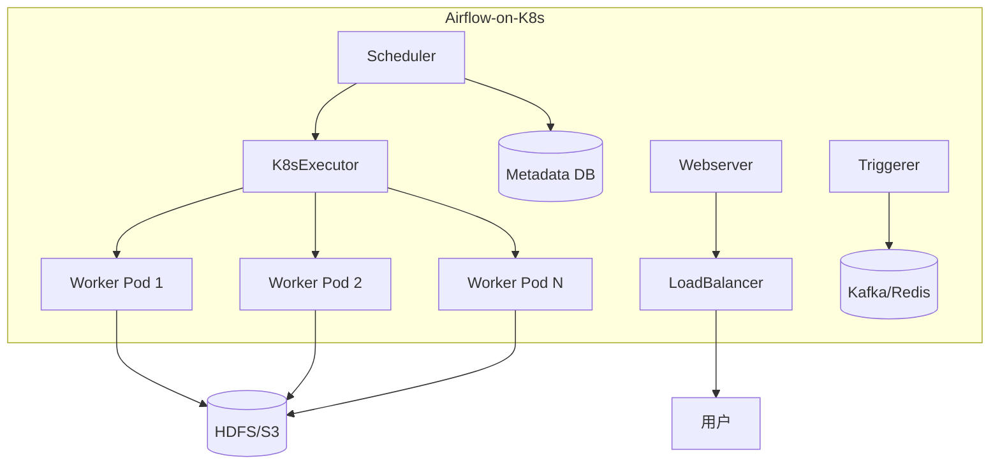

# Apache Airflow（工作流编排 / Python DAG）

> Airflow 是 **Apache 顶级项目、全球最流行的工作流编排平台**（Airbnb 开源），核心思想「**工作流即代码（DAG 用 Python 定义）**」。相比 DolphinScheduler（可视化拖拽）、XXL-JOB（定时任务）、Temporal（微服务编排）、AWS Step Functions（云托管），Airflow 以「**Python 灵活最强 + 生态最广（Operator 无数）+ 调度语义完善（回填/依赖/传感器）**」成为数据工程/MLOps 领域事实标准。本篇按「解决的问题 → 原理 → 特性 → 选型关注点」拆解。

---

## 一、要解决的问题

| 痛点 | 说明 |
|------|------|
| 复杂依赖编排 | 任务间依赖（DAG）无法用 cron 表达 |
| 数据驱动触发 | 等文件/等表/等上游完成后才跑（传感器） |
| 历史回填 | 新任务要补跑历史 N 天数据 |
| 失败重试与告警 | 任务失败自动重试 + 多渠道告警 |
| 可测试可版本化 | 工作流要像代码一样 review/测试/版本管理 |
| 多租户隔离 | 不同团队的任务资源隔离、权限控制 |
| 跨平台集成 | 统一编排 Spark/Flink/dbt/云服务/自定义脚本 |

> 核心认知：**Airflow = 「工作流是 Python 代码（DAG）」**——每个工作流是声明式 Python 文件（DAG），调度器解析执行，天然可测试、可 Git 管理。

---

## 二、核心原理

### 2.1 架构

```
Scheduler（调度器，核心）
  ├── 扫描 DAG 目录（/dags）→ 解析 DAG 定义
  ├── 按调度时间戳生成 DagRun → TaskInstance（任务实例）
  └── 依赖满足（upstream 完成 + 传感器）→ 分发到 Executor

Executor（执行器）
  ├── LocalExecutor（单机多进程）
  ├── CeleryExecutor（分布式 Worker 队列）
  ├── KubernetesExecutor（每任务一个 Pod，动态）
  └── 云端：EKSExecutor / CloudRun 等

Worker（执行任务）→ 任务代码（Python/Bash/SQL/Spark...）
Webserver（UI：DAG 图/日志/触发/回填）
Metadata DB（DAG 运行状态持久化：PostgreSQL/MySQL）
Triggerer（异步触发器，处理 deferrable sensor）
```

### 2.2 DAG 定义（代码即工作流）

```python
from airflow import DAG
from airflow.operators.python import PythonOperator
from airflow.operators.bash import BashOperator
from datetime import datetime, timedelta

with DAG("etl_pipeline", schedule="0 2 * * *",
         start_date=datetime(2024, 1, 1),
         catchup=False,
         tags=["data", "etl"],
         default_args={
             "retries": 3,
             "retry_delay": timedelta(minutes=5),
             "on_failure_callback": alert_on_failure
         }) as dag:

    extract = BashOperator(task_id="extract", bash_command="python extract.py")
    transform = PythonOperator(task_id="transform", python_callable=transform_fn)
    load = BashOperator(task_id="load", bash_command="python load.py")

    extract >> transform >> load    # 依赖链
```

### 2.3 关键概念

| 概念 | 说明 |
|------|------|
| DAG | 工作流（Python 文件定义，一个文件一个 DAG） |
| Task / TaskInstance | 任务/任务实例（每次运行一个实例） |
| Operator | 任务类型（PythonOperator/BashOperator/SparkSubmitOperator...） |
| Sensor | 传感器任务（等外部条件：文件/表/API） |
| XCom | 任务间小数据传递（建议 < 48KB） |
| Pool / Priority | 资源池 + 优先级（并发控制） |
| Triggerer（2.2+） | 异步触发（deferrable operator，省资源） |
| Connection / Hook | 外部系统连接管理（数据库/API/云服务） |
| Variable | 全局变量（配置/密钥），敏感信息用 Secret Backend |
| Dataset（2.4+） | 数据感知调度（上游数据更新触发下游） |
| Listener（2.6+） | 生命周期监听器（自定义回调） |

### 2.4 调度语义（Airflow 的核心价值）

| 语义 | 说明 | 示例 |
|------|------|------|
| 回填（Backfill） | `airflow dags backfill -s 2024-01-01 -e 2024-01-31` 按日期补跑 | 历史数据修复 |
| catchup 追赶 | 启动时间早于 start_date 时自动补跑（默认关） | 新 DAG 上线补历史 |
| 调度时间语义 | `schedule` 表达式（cron/timedelta/自定义 Trigger） | 灵活调度频率 |
| 依赖触发 | `ExternalTaskSensor` 等外部 DAG 完成 | 跨 DAG 编排 |
| Dataset 触发 | 上游数据更新触发下游（2.4+） | 数据驱动编排 |
| Timetable | 自定义调度时间逻辑（如节假日跳过） | 非标准调度需求 |

### 2.5 执行器详解

| 执行器 | 并发模型 | 适用场景 | 资源效率 |
|--------|----------|----------|----------|
| SequentialExecutor | 单进程串行 | 开发测试 | 最低 |
| LocalExecutor | 多进程并发 | 小规模生产 | 中 |
| CeleryExecutor | 分布式 Worker 队列 | 中大规模生产 | 中 |
| KubernetesExecutor | 每任务一个 Pod | 云原生/弹性 | 最高（按需） |
| DaskExecutor | Dask 集群 | 科学计算 | 中 |

### 2.6 Operator 体系（生态核心）

```
BaseOperator
  ├── PythonOperator / PythonSensor / PythonBranchOperator
  ├── BashOperator / BashSensor
  ├── EmailOperator / HttpOperator / SimpleHttpOperator
  ├── 数据库：MySqlOperator / PostgresOperator / OracleOperator
  ├── 大数据：SparkSubmitOperator / HiveOperator / PrestoOperator
  ├── 云：S3ToRedshiftOperator / GCSObjectExistenceSensor
  ├── 消息：SlackWebhookOperator / EmailOperator
  └── 自定义：继承 BaseOperator，实现 execute() 方法
```

---

## 三、核心特性

| 特性 | 说明 |
|------|------|
| 代码即工作流 | Python 定义，可测试/可 review/可 Git 版本化 |
| 生态最广 | 1000+ Operator（云/DB/大数据/ML 全覆盖） |
| 调度语义完善 | 回填/追赶/传感器/Dataset 触发 |
| 分布式 | Celery/K8s 多执行器，弹性扩容 |
| UI | DAG 图/日志/触发/变量管理 |
| 告警 | 邮件/钉钉/Slack/Webhook（失败/重试/超时） |
| 数据血缘 | 内置 Datasets（2.4+ 数据感知调度） |
| MLOps | 原生支持 ML 管道（与 MLflow/Kubeflow 配合） |
| Secrets Backend | 敏感信息存储到 Vault/AWS Secrets Manager |
| Listener | 生命周期监听（自定义回调，2.6+） |
| TaskFlow API | XCom 语法糖（2.2+），函数返回自动推送到 XCom |

---

## 四、Airflow vs DolphinScheduler vs Temporal vs 云托管

| 维度 | Airflow | DolphinScheduler | Temporal | AWS Step Functions |
|------|---------|------------------|----------|--------------------|
| 定义方式 | Python 代码 | 可视化拖拽 | 代码（Go/Java/Python） | 声明式 JSON |
| 生态 | 最强（1000+ Operator） | 大数据任务多 | 微服务编排 | AWS 生态 |
| 调度语义 | 最强（回填/追赶/传感器/Dataset） | 中（补数/日历） | 中（工作流侧重） | 中 |
| 运维 | 重（组件多） | 中（ZK 依赖） | 中 | 零（托管） |
| 适用 | 数据工程/MLOps | 数据平台（中文团队） | 微服务长期运行 | 云上 Serverless |
| 学习成本 | 中（Python） | 低（可视化） | 高 | 低 |
| 容错 | 任务级重试/DAG 级重试 | 任务级重试 | Workflow 级重试 | 自动重试 |

**选型关注点**：
- 数据工程/MLOps/Python 团队 → **Airflow**（生态与灵活性最强）；
- 数据平台可视化编排/中文团队 → **DolphinScheduler**；
- 微服务长期运行/补偿编排 → **Temporal**；
- 云上快速交付 → **Step Functions / Cloud Composer（托管 Airflow）**。

---

## 五、生产实践

### 5.1 关键实践

| 实践 | 说明 |
|------|------|
| 部署 | 生产用 KubernetesExecutor 或 CeleryExecutor（弹性） |
| DB | 独立 PostgreSQL（Metadata DB 是核心依赖） |
| 任务幂等 | 任务必须幂等（重跑安全）——回填/重试的基础 |
| 并发控制 | Pool 按资源组限制（防打爆集群） |
| 变量/连接 | 敏感信息用 Airflow 加密变量 + Secret 后端 |
| 监控 | 调度器心跳 + 任务失败率 + DAG 运行时长告警 |
| 代码管理 | DAG 代码走 Git CI/CD（自动同步 /dags） |
| 日志 | 日志采集到 ELK/Loki（集中排查） |
| 测试 | DAG 文件可 pytest，Task 可单元测试 |
| 资源隔离 | 不同团队用独立 Pool + Vhost |

### 5.2 常见坑

| 问题 | 原因 | 解决方案 |
|------|------|----------|
| 调度器单点 | Scheduler 需要多副本 + 健康监控 | 多 Scheduler + Prometheus 监控心跳 |
| 任务写在 DAG 文件里 | DAG 文件只应定义结构 | 重逻辑放 Operator/代码目录 |
| 依赖不幂等 | 回填/重试产生脏数据 | 所有任务幂等化（INSERT ON DUPLICATE） |
| 时区/日历 | cron 与 start_date/catchup 语义易错 | 先本地测试，用 `execution_date` 而非 `now()` |
| 大 DAG 膨胀 | 几千任务的 DAG 解析慢 | 拆 DAG + 触发式编排（Dataset/ExternalTaskSensor） |
| XCom 溢出 | XCom 存储超过 48KB | 改用外部存储（S3/DB） |
| 序列化问题 | Python 特殊对象无法序列化 | 用 JSON-serializable 的 XCom Backend |

### 5.3 KubernetesExecutor 生产配置

```yaml
# airflow.cfg
[core]
executor = KubernetesExecutor
kubernetes_namespace = airflow

[kubernetes_worker]
resources:
  limits:
    memory: 2Gi
    cpu: "1"
  requests:
    memory: 1Gi
    cpu: "0.5"
image = my-airflow-worker:latest
delete_worker_pods = True
delete_worker_pods_on_failure = True

# Pod 模板（per-task 资源覆盖）
node_selector:
  node-role: data-worker
tolerations:
  - key: "data"
    operator: "Equal"
    value: "true"
    effect: "NoSchedule"
```

---

## 六、选型速查

| 需求 | 首选 | 备选 |
|------|------|------|
| 数据工程管道 | Airflow | DolphinScheduler |
| MLOps 编排 | Airflow + MLflow | Kubeflow |
| 中文团队数据平台 | DolphinScheduler | Airflow |
| 微服务长期运行 | Temporal | Airflow（不推荐） |
| 云上托管 | Cloud Composer | Step Functions |
| 轻量定时任务 | XXL-JOB | — |
| 数据感知调度 | Airflow Dataset | 自定义 |
| 混合语言团队 | Airflow（Python Operator 支持任意语言） | Temporal |

---

## Airflow 2.x Scheduler Internals

### Scheduler 架构深度

```
Airflow 2.x Scheduler 核心组件：
  ├── DagFileProcessorManager
  │   ├── 扫描 DAG 目录（min_file_process_interval 控制）
  │   ├── 多进程解析 DAG 文件（parsing_processes 控制并发）
  │   └── 生成 DAGBag（解析后的 DAG 对象缓存）
  ├── DagRunManager
  │   ├── 按 Timetable 生成 DagRun
  │   ├── 依赖检查（TaskInstance 状态）
  │   └── 触发就绪的 TaskInstance
  ├── TaskInstanceManager
  │   ├── 分配 TaskInstance 到 Executor
  │   ├── 状态管理（queued→running→success/failed）
  │   └── 重试逻辑（retry_delay 控制）
  └── TriggerManager
      ├── 管理 deferrable operator 的触发器
      └── Triggerer 进程处理异步回调
```

```python
# Scheduler 调度循环伪代码
class SchedulerJob:
    def _do_scheduling(self):
        # 1. 扫描 DAG 文件 → 解析
        self.dag_file_processor_manager.start()
        
        # 2. 生成 DagRun（按 Timetable）
        for dag in self.dagbag.dags:
            runs = self.dag_run_manager.create_dag_runs(dag)
        
        # 3. 检查依赖 → 触发 TaskInstance
        for run in active_runs:
            for ti in run.task_instances:
                if ti.are_dependencies_met():
                    self._enqueue_task_instances(ti)
        
        # 4. 分发到 Executor
        executor.queue_task(task_instances)
```

### Scheduler 高可用

```
Airflow 2.x 多 Scheduler：
  - 多个 SchedulerJob 进程共享 Metadata DB
  - 通过数据库锁（SELECT FOR UPDATE）协调
  - 一个 Scheduler 挂了，另一个接管
  - DAG 文件变更自动感知（多节点扫描同一 DAG 目录）

配置：
  [scheduler]
  parsing_processes = 4          # 并行解析进程数
  min_file_process_interval = 30 # 文件扫描间隔
  max_tis_per_query = 512        # 单次查询最大 TaskInstance 数
  scheduler_heartbeat_sec = 5    # 心跳间隔
```

### DAG Serialization 机制

```
DAG 序列化 = 将 Python DAG 对象转为可存储格式，避免 Webserver 重新解析

序列化流程：
  1. Scheduler 解析 DAG 文件 → 生成 DAG 对象
  2. 序列化为 JSON（dags 表 serialized_dag 字段）
  3. Webserver 读取序列化结果（无需重新解析）
  4. DAG 文件变更 → 触发重新序列化

优势：
  Webserver 启动快（无需扫描 DAG 目录）
  多 Scheduler 共享序列化结果
  减少 Webserver 内存占用

配置：
  [core]
  min_serialized_dag_fetch_interval = 10  # 序列化刷新间隔
  max_serialized_dag_size_kb = 2048       # 最大 DAG 序列化大小
```

## XCom Patterns（任务间数据传递）

### XCom 最佳实践

```python
# 1. TaskFlow API 自动推送（推荐）
from airflow.decorators import task

@task
def extract():
    data = load_from_source()
    return data  # 自动推送到 XCom

@task
def transform(data: dict):
    result = process(data)
    return {"key": result}

@task
def load(data: dict):
    save(data)

# 2. 手动推送/拉取
from airflow.models.xcom import BaseXCom

# 推送
ti.xcom_push(key="result", value={"count": 100})
# 拉取
result = ti.xcom_pull(task_ids="extract", key="result")

# 3. 自定义 XCom Backend（大对象存 S3/Redis）
class S3XCom(BaseXCom):
    @staticmethod
    def serialize_value(value):
        # 上传到 S3，返回 S3 key
        s3_key = upload_to_s3(value)
        return s3_key
    
    @staticmethod
    def deserialize_value(result):
        # 从 S3 下载
        return download_from_s3(result)
```

### XCom 限制与替代方案

| 场景 | 方案 | 说明 |
|------|------|------|
| 小数据传递 | XCom | 默认后端，< 48KB |
| 大对象 | 自定义 Backend | S3/GCS/Redis |
| 跨 DAG 传递 | ExternalTaskSensor + XCom | 通过参数传递 |
| 文件传递 | OSS/S3 | XCom 只存引用 |
| 结果缓存 | Variable | 全局配置 |

## TaskFlow API 深入

```python
from airflow.decorators import dag, task
from datetime import datetime

@dag(
    schedule="@daily",
    start_date=datetime(2024, 1, 1),
    catchup=False,
    tags=["etl"],
    default_args={"retries": 2, "retry_delay": timedelta(minutes=5)}
)
def etl_pipeline():
    
    @task
    def extract():
        """提取数据"""
        import pandas as pd
        df = pd.read_sql("SELECT * FROM orders", conn)
        return df.to_dict()
    
    @task(multiple_outputs=True)
    def transform(raw_data: dict):
        """转换数据 - 多输出"""
        df = pd.DataFrame(raw_data)
        return {
            "aggregated": df.groupby("user_id").sum().to_dict(),
            "filtered": df[df["amount"] > 100].to_dict()
        }
    
    @task
    def load(transformed: dict):
        """加载数据"""
        save_to_db(transformed["aggregated"])
    
    @task
    def notify(aggregated: dict):
        """通知"""
        send_email(f"处理 {len(aggregated)} 条记录")
    
    # 依赖自动推断
    raw = extract()
    agg, filtered = transform(raw)
    load(agg)
    notify(agg)

# 调用 DAG 定义
etl_dag = etl_pipeline()
```

## Airflow Providers Ecosystem

```
Airflow Providers 生态（pip install apache-airflow-providers-xxx）：

云平台：
  ├── providers-amazon (S3/Lambda/Redshift/EMR/EKS)
  ├── providers-google (GCS/Dataflow/BigQuery/Vertex AI)
  └── providers-azure (Blob/ADLS/Synapse/Databricks)

数据库：
  ├── providers-mysql / postgresql / oracle / mssql
  ├── providers-snowflake / bigquery / redshift
  └── providers-mongo / elasticsearch

大数据：
  ├── providers-apache-spark (SparkSubmitOperator)
  ├── providers-apache-flink (FlinkOperator)
  ├── providers-apache-hive (HiveOperator)
  └── providers-apache-kafka (KafkaOperator)

消息/通知：
  ├── providers-slack (SlackWebhookOperator)
  ├── providers-microsoft-teams (MsTeamsWebhookOperator)
  └── providers-sendgrid / pagerduty

运维工具：
  ├── providers-cncf-kubernetes (KubernetesPodOperator)
  ├── providers-docker (DockerOperator)
  └── providers-ssh (SSHHook/SSHOperator)
```

## Airflow on Kubernetes（KubernetesPodOperator）

```python
from airflow.providers.cncf.kubernetes.operators.pod import KubernetesPodOperator

# 每个任务一个 Pod（资源隔离）
etl_task = KubernetesPodOperator(
    task_id="etl_job",
    namespace="airflow",
    image="my-etl-image:latest",
    cmds=["python", "etl.py"],
    arguments=["--date", "{{ ds }}"],
    env_vars={
        "DB_HOST": Variable.get("db_host"),
        "DB_PASS": Variable.get("db_pass", deserialize_json=True)
    },
    resources={
        "request_memory": "1Gi",
        "request_cpu": "500m",
        "limit_memory": "4Gi",
        "limit_cpu": "2"
    },
    tolerations=[
        {"key": "data", "operator": "Equal", "value": "true", "effect": "NoSchedule"}
    ],
    node_selector={"node-role": "data-worker"},
    image_pull_policy="IfNotPresent",
    get_logs=True,
    is_delete_operator_pod=True,  # 完成后删除 Pod
    startup_timeout_seconds=600,
    # Pod 模板（复用配置）
    pod_template_file="templates/etl_pod.yaml"
)
```

## Airflow vs Prefect vs Dagster

| 维度 | Airflow | Prefect | Dagster |
|------|---------|---------|---------|
| 定义方式 | Python DAG | Python Flow | Python Asset/Op |
| 调度 | 时间驱动 | 事件驱动 | 资产驱动 |
| 状态管理 | 元数据 DB | Prefect Cloud | Dagit |
| 调试 | 测试环境 | 本地运行 | 实时预览 |
| 生态 | 最强（Operators） | 中 | 中 |
| 学习曲线 | 中 | 低 | 中 |
| 适用场景 | 数据管道编排 | 数据流编排 | 数据资产开发 |

```python
# Prefect 示例
from prefect import flow, task

@task
def extract():
    return load_data()

@flow(name="etl-pipeline")
def etl():
    data = extract()
    transformed = transform(data)
    load(transformed)

# Dagster 示例
from dagster import op, job

@op
def extract_op():
    return load_data()

@job
def etl_job():
    data = extract_op()
    load(transform(transform(data)))
```

## SLA Miss Handling

```
SLA（Service Level Agreement）= 任务期望完成时间

配置：
  SLA missed → 触发回调（邮件/Slack）
  可设置任务级/DAG 级 SLA

PythonOperator(
    task_id="sla_task",
    sla=timedelta(hours=2),  # 2小时内必须完成
    on_sla_miss_callback=sla_miss_handler,
    ...
)

SLA Miss 回调：
  def sla_miss_handler(dag, task_list, blocking_task_list, 
                       slas, blocking_tis):
      # 发送告警
      send_alert(f"SLA missed for {dag.dag_id}")

监控指标：
  sla_misses (Prometheus)
  ti.sla_missed (数据库标记)
```

## Dynamic DAG Generation

```python
# 动态生成 DAG（配置驱动）
import json

with open("dags_config.json") as f:
    configs = json.load(f)

for config in configs:
    dag_id = f"etl_{config['name']}"
    
    with DAG(
        dag_id=dag_id,
        schedule=config["schedule"],
        start_date=datetime(2024, 1, 1),
        catchup=False
    ) as dag:
        
        extract = BashOperator(
            task_id="extract",
            bash_command=f"python extract.py --source {config['source']}"
        )
        
        transform = PythonOperator(
            task_id="transform",
            python_callable=transform_fn,
            op_kwargs={"config": config}
        )
        
        load = BashOperator(
            task_id="load",
            bash_command=f"python load.py --target {config['target']}"
        )
        
        extract >> transform >> load
    
    globals()[dag_id] = dag
```

## Connection Management

```
Connection 管理：
  Airflow UI → Admin → Connections
  或 Variable 存储（Secret Backend）

Hook 封装连接逻辑：
  MySqlHook → 获取 MySQL 连接
  S3Hook → 获取 S3 客户端
  SlackWebhookHook → 获取 Slack 客户端

自定义 Hook：
  class MyServiceHook(BaseHook):
      def __init__(self, conn_id):
          conn = self.get_connection(conn_id)
          self.host = conn.host
          self.port = conn.port
      
      def get_client(self):
          return MyServiceClient(self.host, self.port)
```

## Secrets Backend

```
Airflow Secrets Backend：
  敏感信息存外部系统（Vault/AWS Secrets Manager）

配置：
  [secrets]
  backend = airflow.providers.hashicorp.secrets.vault.VaultBackend
  backend_kwargs = {"connections_path": "airflow/connections",
                    "variables_path": "airflow/variables",
                    "url": "http://vault:8200",
                    "token": "s.xxxx"}

使用：
  conn = BaseHook.get_connection("my_conn")  # 自动从 Vault 读取
  Variable.get("api_key")  # 自动从 Vault 读取

支持后端：
  HashiCorp Vault
  AWS Secrets Manager
  GCP Secret Manager
  Azure Key Vault
```

## Airflow 2.x Sensor vs Deferrable Operator 区别与迁移

| 维度 | Sensor | Deferrable Operator |
|------|--------|-------------------|
| 原理 | 阻塞轮询（sleep 循环） | 异步等待（Triggerer 回调） |
| 资源占用 | 占 Worker slot（一直持有） | 释放 slot（异步等待） |
| 并发能力 | 低（slot 被阻塞） | 高（slot 可释放） |
| 适用场景 | 简单文件/时间等待 | 复杂外部系统等待（K8s Job/HTTP） |
| 推荐度 | 2.x 逐步弃用 | **强烈推荐（2.2+ 默认）** |

```python
# 旧方式：Sensor（阻塞 Worker slot）
from airflow.sensors.http_sensor import HttpSensor

sensor = HttpSensor(
    task_id="wait_for_api",
    http_conn_id="my_api",
    endpoint="/status",
    poke_interval=30,   # 每 30s 轮询一次
    timeout=600,
)

# 新方式：Deferrable Operator（释放 slot，异步等待）
from airflow.providers.http.sensors.http import HttpSensor

sensor = HttpSensor(
    task_id="wait_for_api",
    http_conn_id="my_api",
    endpoint="/status",
    deferrable=True,  # 关键开关：切换为异步模式
)
```

```
迁移要点：
  1. 所有 Sensor 加 deferrable=True 即可迁移
  2. 必须启用 Triggerer 进程（独立部署）
  3. Triggerer 数量 = 并发等待任务数
  4. 资源收益：100 个等待任务从占 100 slot → 占 0 slot
```

## Airflow Variable 加密存储与访问

```
Airflow Variable 存储敏感信息（API Key/密码）的安全实践：

方式一：Fernet 加密（内置）
  配置 fernet_key（airflow.cfg 或环境变量）
  Variable.set("api_key", "secret_value")
  → 存储为加密字符串，读取时自动解密

方式二：Secret Backend（生产推荐）
  敏感信息存外部系统（Vault/AWS Secrets Manager）
  Variable.get("api_key") → 自动从 Vault 拉取

配置方式：
  [secrets]
  backend = airflow.providers.hashicorp.secrets.vault.VaultBackend
  backend_kwargs = {"connections_path": "airflow/connections",
                    "variables_path": "airflow/variables",
                    "url": "http://vault:8200"}
```

| 安全等级 | 存储方式 | 适用 |
|----------|----------|------|
| 低（开发） | 明文 Variable | 开发环境 |
| 中 | Fernet 加密 Variable | 小规模生产 |
| 高 | Secret Backend（Vault） | 企业生产 |
| 最高 | Vault + KMS 密钥轮换 | 合规要求高 |

## Airflow Pool/Slot 资源管理

```
Pool = 并发资源池，控制同时运行的任务数

场景：
  防止 100 个 DAG 同时跑打爆数据库连接
  隔离不同团队的资源（数据团队 pool=10，BI 团队 pool=5）

配置：
  Airflow UI → Admin → Pools
  或 Variable: "pool_name": {"slots": 10}

代码：
  BashOperator(pool="data_team_pool", ...)

  # 动态设置池容量
  from airflow.models import Pool
  pool = Pool(pool="data_team_pool", slots=20)
  session.add(pool)
```

| 资源控制 | 配置 | 作用 |
|----------|------|------|
| Pool | 并发槽位数 | 控制同时运行的任务数 |
| Priority | 权重 | 同 Pool 内任务优先级 |
| max_active_runs_per_dag | DAG 级 | 单 DAG 最大并行运行数 |
| parallelism | 全局级 | 全局最大并行任务数 |

## Airflow DAG 依赖管理（Trigger Rule / depends_on_past）

```python
from airflow.utils.trigger_rule import TriggerRule

with DAG("dependency_demo", ...) as dag:
    task_a = BashOperator(task_id="a", bash_command="echo a")
    task_b = BashOperator(task_id="b", bash_command="echo b")
    task_c = BashOperator(task_id="c", bash_command="echo c")
    task_d = BashOperator(task_id="d", bash_command="echo d",
                          trigger_rule=TriggerRule.NONE_FAILED)
    task_e = BashOperator(task_id="e", bash_command="echo e",
                          depends_on_past=True)  # 依赖上一次运行结果
```

| Trigger Rule | 说明 | 适用场景 |
|-------------|------|----------|
| ALL_SUCCESS | 全部成功（默认） | 常规依赖 |
| ALL_FAILED | 全部失败 | 错误处理分支 |
| ONE_SUCCESS | 至少一个成功 | 并行任务任一完成即可 |
| ONE_FAILED | 至少一个失败 | 错误检测 |
| NONE_FAILED | 无失败（允许部分成功） | 条件分支 |
| NONE_FAILED_MIN_ONE | 至少一个成功且无失败 | 跳过空分区场景 |
| ALL_DONE | 全部完成（成功失败均可） | 清理任务 |

```
depends_on_past=True：
  当前任务依赖上一次运行的结果
  上次成功 → 本次正常执行
  上次失败 → 本次被 skip
  适用：增量 ETL、幂等重跑
```

## Airflow 与 dbt 集成模式

```
dbt（Data Build Tool）= SQL 转换框架
Airflow = 调度编排框架

集成方式：
  方式一：BashOperator 调 dbt CLI
    BashOperator(bash_command="dbt run --models orders")
  
  方式二：dbt-airflow-providers 包
    从 dbt manifest.json 自动生成 Airflow DAG
  
  方式三：dbt Cloud Operator
    调用 dbt Cloud API 触发运行
```

```python
# 方式一：BashOperator 调 dbt
BashOperator(
    task_id="dbt_run",
    bash_command="cd /dbt_project && dbt run --select orders+ --target prod",
    env={"DBT_PROFILES_DIR": "/dbt_project"},
)

# 方式二：自动生成 DAG（从 manifest.json）
from dbt_airflow.operators import DbtRunOperator

with DAG("dbt_pipeline", ...) as dag:
    DbtRunOperator(
        task_id="dbt_run_orders",
        models="orders",
        select="+orders",  # dbt 选择语法
    )
```

## Airflow in K8s（Helm Chart 部署架构）



```
Helm 部署要点：
  helm repo add apache-airflow https://airflow.apache.org/helm
  helm install airflow apache-airflow/airflow -f values.yaml

关键配置：
  executor: KubernetesExecutor
  scheduler.replicas: 2（高可用）
  webserver.replicas: 2（高可用）
  triggerer.replicas: 1（异步触发）
  workers.resources: requests/limits（Pod 资源）
  worker.kubernetes.pod_template_file: 模板文件

Pod 模板（per-task 资源覆盖）：
  nodeSelector: node-role: data-worker
  tolerations: data=true:NoSchedule
  affinity: 反亲和性（Pod 分散到不同节点）
```

| 组件 | 副本数 | 说明 |
|------|--------|------|
| Webserver | 2+ | UI 高可用 |
| Scheduler | 2+ | 调度高可用（数据库锁协调） |
| Triggerer | 1+ | 异步触发（deferrable operator） |
| Worker | 0~N（弹性） | K8sExecutor 按需创建 Pod |
| Metadata DB | 1（RDS） | PostgreSQL 高可用托管 |

## Airflow Sensor vs Deferrable

### 同步阻塞 / 异步等待 / 资源优化

```
Sensor（同步）：
  原理：占用 worker slot，轮询检查条件
  问题：大量 sensor → worker slot 耗尽
  适用：少量 sensor（< 10）

Deferrable Operator（异步）：
  原理：释放 worker slot，等待触发器回调
  优势：不占用 worker slot，可大量并发
  适用：大量 sensor（> 10）

示例对比：
  # Sensor（同步）
  file_sensor = FileSensor(
      task_id='wait_for_file',
      path='/data/input.csv',
      poke_interval=60,
      timeout=600
  )

  # Deferrable（异步）
  file_sensor = FileSensorAsync(
      task_id='wait_for_file',
      path='/data/input.csv',
      poke_interval=60,
      timeout=600
  )
```

| 模式 | Worker Slot | 并发数 | 资源 | 适用 |
|------|-------------|--------|------|------|
| Sensor | 占用 | 低 | 高 | 少量 sensor |
| Deferrable | 释放 | 高 | 低 | 大量 sensor |

## Airflow Variable 加密

### Fernet / 环境变量 / 密钥管理

```python
# Fernet 加密配置
# airflow.cfg
[core]
fernet_key = your-fernet-key

# 创建加密 Variable
from cryptography.fernet import Fernet
key = Fernet.generate_key()
print(key.decode())

# 使用加密 Variable
api_key = Variable.get("api_key", deserialize_json=False)
# → 自动解密

# 环境变量优先级
export AIRFLOW_VAR_API_KEY=xxx
# → 覆盖数据库中的 Variable

# 最佳实践：
# 1. 敏感信息用环境变量
# 2. 非敏感用 Variable（UI 可管理）
# 3. 定期轮换 Fernet Key
```

## Airflow Pool 与 Slot

### 并发控制 / 资源隔离

```
Pool 作用：
  限制同时运行的任务数
  防止资源竞争
  实现资源隔离

配置 Pool：
  # UI 创建 Pool
  Admin → Pools → Create
  Name: db_pool
  Slots: 5  # 最多同时 5 个任务

  # 代码指定 Pool
  task = BashOperator(
      task_id='process',
      bash_command='echo "hello"',
      pool='db_pool',
      pool_slots=1
  )

Slot 算法：
  可用 Slot = Pool Slots - 已占用 Slots
  任务启动条件：可用 Slot ≥ 任务所需 Slots

最佳实践：
  数据库操作 → db_pool（限制并发）
  API 调用 → api_pool（限流）
  默认池 → default_pool（兜底）
```

## Airflow Trigger Rules

### 依赖触发 / 流程控制

```python
# Trigger Rules
from airflow.utils.trigger_rule import TriggerRule

# 默认：所有上游成功才触发
task = BashOperator(
    task_id='task',
    bash_command='echo "hello"',
    trigger_rule=TriggerRule.ALL_SUCCESS
)

# 任意一个成功就触发
task = BashOperator(
    task_id='task',
    bash_command='echo "hello"',
    trigger_rule=TriggerRule.ONE_SUCCESS
)

# 所有完成（不管成功失败）
task = BashOperator(
    task_id='task',
    bash_command='echo "hello"',
    trigger_rule=TriggerRule.ALL_DONE
)

# 上游失败时触发（告警/回滚）
alert_task = BashOperator(
    task_id='alert',
    bash_command='echo "failed"',
    trigger_rule=TriggerRule.ONE_FAILED
)
```

| Trigger Rule | 说明 | 适用 |
|--------------|------|------|
| ALL_SUCCESS | 所有上游成功 | 默认 |
| ALL_FAILED | 所有上游失败 | 回滚/告警 |
| ALL_DONE | 所有完成 | 统计/清理 |
| ONE_SUCCESS | 任意成功 | 竞速/多路径 |
| ONE_FAILED | 任意失败 | 告警/补偿 |

## Airflow dbt 集成

### dbtOperator / 数据质量

```python
# dbt Operator
from airflow.providers.dbt.cloud.operators.dbt import (
    DbtCloudRunJobOperator,
    DbtCloudJobRunStatus
)

# 运行 dbt 任务
run_dbt = DbtCloudRunJobOperator(
    task_id='run_dbt',
    job_id=12345,
    trigger_rule=TriggerRule.ALL_SUCCESS,
    poll_interval=10,
    timeout=3600
)

# 数据质量检查
check_quality = BashOperator(
    task_id='check_quality',
    bash_command='dbt test --select +model_name'
)

# 依赖链
extract >> transform >> run_dbt >> check_quality >> load
```

## Airflow K8s 部署

### Helm / Executor 选型

```
K8s 部署模式：

CeleryExecutor + K8s：
  Workers 部署在 K8s（弹性伸缩）
  Metadata DB 用 RDS
  Broker 用 Redis/RabbitMQ
  适用：中大规模

KubernetesExecutor：
  每个 Task 一个 Pod
  动态创建/销毁
  资源利用率高
  适用：弹性/成本敏感

Helm 部署：
  helm install airflow apache-airflow/airflow \
    --set executor=KubernetesExecutor \
    --set scheduler.replicas=2 \
    --set webserver.replicas=2 \
    --set postgresql.enabled=false \
    --set postgresql.externalHost=rds-host

配置：
  [kubernetes_executor]
  namespace = airflow
  image = apache-airflow:2.8.0
  delete_worker_pods = true
  worker_containers_resources = {"request_memory": "1Gi", "limit_memory": "2Gi"}
```

| Executor | 适用 | 弹性 | 复杂度 |
|----------|------|------|--------|
| SequentialExecutor | 开发测试 | 无 | 低 |
| LocalExecutor | 小规模 | 无 | 低 |
| CeleryExecutor | 中大规模 | 手动 | 中 |
| KubernetesExecutor | 弹性 | 自动 | 高 |

- DolphinScheduler 对比见「[DolphinScheduler](./DolphinScheduler.md)」；
- 任务调度对比见「[分布式任务调度对比](./分布式任务调度对比.md)」；
- XXL-JOB 见「[任务调度 XXL-JOB](./任务调度XXL-JOB.md)」；
- 大数据全链路见「[大数据/README](../大数据/README.md)」；
- Kubernetes 部署见「[Kubernetes 核心](../../云原生/Kubernetes核心.md)」。

## Airflow 2.x 与 1.x 差异

| 特性 | Airflow 1.x | Airflow 2.x |
|------|------------|------------|
| 调度器 | 单调度器（需 HA） | 支持多调度器（自动 HA） |
| Web Server | Flask | Flask + Gunicorn（更稳定） |
| DAG 解析 | 全量解析 | 增量解析（性能提升 10x+） |
| TaskFlow API | ❌ | ✅（@task 装饰器） |
| Connection 编辑 | 仅 UI | CLI + API |
| Smart Sensor | ❌ | ✅（合并传感器） |
| SLA Miss | 基础 | 增强告警 |
| Kubernetes | 需第三方 | 原生支持 |
| DAG Bundle | ❌ | ✅（插件化） |

```python
# Airflow 2.x TaskFlow API 示例
from airflow.decorators import task, dag
from datetime import datetime

@dag(
    schedule_interval="@daily",
    start_date=datetime(2024, 1, 1),
    catchup=False,
    tags=["etl"],
)
def my_dag():
    @task
    def extract():
        return {"data": [1, 2, 3]}

    @task
    def transform(raw):
        return {"data": [x * 2 for x in raw["data"]]}

    @task
    def load(transformed):
        print(f"Loaded: {transformed}")

    raw = extract()
    transformed = transform(raw)
    load(transformed)

my_dag()
```

## Airflow 与 dbt 集成模式

```
Airflow + dbt 集成方式：

  方式 1: BashOperator 调用 dbt
    ├── 简单，但无日志集成
    └── 需安装 dbt

  方式 2: airflow-dbt 插件
    ├── 原生 Airflow 集成
    └── 支持 dbt 核心命令

  方式 3: DbtTaskGroup
    ├── TaskGroup 封装
    └── 可视化 dbt 运行流程

  推荐：
    ├── 小项目 → BashOperator
    ├── 中项目 → DbtTaskGroup
    └── 大项目 → dbt Cloud + Airflow 编排
```

```python
from airflow.providers.dbt.cloud.operators.dbt import DbtCloudRunJobOperator

run_dbt = DbtCloudRunJobOperator(
    task_id="run_dbt_job",
    job_id=12345,
    trigger_rule="all_success",
)

from airflow.operators.bash import BashOperator

run_dbt = BashOperator(
    task_id="run_dbt",
    bash_command="cd /opt/dbt && dbt run --models tag:daily",
)
```

## Airflow in K8s（Helm Chart 部署架构）

```
K8s 部署架构：

  ┌─ Airflow Helm Chart ─────────────────────┐
  │  ┌─ Web Server ─┐  ┌─ Scheduler ──┐      │
  │  │  (1 replica)  │  │ (1 replica)  │      │
  │  └───────────────┘  └──────────────┘      │
  │  ┌─ Workers ────┐  ┌─ Triggerer ──┐      │
  │  │ (auto-scale) │  │ (1 replica)  │      │
  │  └──────────────┘  └──────────────┘      │
  │  ┌─ PostgreSQL ─┐  ┌─ Redis ──────┐      │
  │  │ (StatefulSet) │  │ (StatefulSet)│      │
  │  └───────────────┘  └──────────────┘      │
  └────────────────────────────────────────────┘
         │
  ┌─── Pod 级别 ───┐
  │ K8sExecutor     │  ← 每个 Task 一个 Pod
  │ 无状态 Worker   │
  └─────────────────┘
```

```yaml
workers:
  resources:
    requests:
      cpu: "500m"
      memory: "1Gi"
    limits:
      cpu: "2"
      memory: "4Gi"
  autoscaling:
    enabled: true
    minReplicas: 2
    maxReplicas: 10
    targetCPUUtilization: 70
```

## Airflow 任务重试与幂等设计

```
重试策略：

  重试次数（retries）：
    └── 默认 0，建议 2-3 次

  重试间隔（retry_delay）：
    └── timedelta(minutes=5) 或 exponential

  重试指数退避：
    └── retry_exponential_backoff=True

  幂等设计：
    ├── 使用唯一业务 ID
    ├── Upsert 而非 Insert
    ├── 去重表
    └── 幂等文件操作
```

```python
from airflow.operators.python import PythonOperator
from datetime import timedelta

task = PythonOperator(
    task_id="process_order",
    python_callable=process_order,
    retries=3,
    retry_delay=timedelta(minutes=5),
    retry_exponential_backoff=True,
    max_retry_delay=timedelta(minutes=30),
)
```

## Airflow 连接管理与 Secrets Backend

```
连接存储方式：

  1. Airflow UI（默认）
     └── 存储在 metadata DB（加密）

  2. 环境变量
     └── AIRFLOW_CONN_MY_CONN=...

  3. Secrets Backend
     ├── AWS Secrets Manager
     ├── HashiCorp Vault
     ├── GCP Secrets Manager
     └── Azure Key Vault

  推荐：
    ├── 开发环境 → UI / 环境变量
    ├── 生产环境 → Secrets Backend
    └── 多环境 → Secrets Backend + 前缀隔离
```

```python
from airflow.hooks.base import BaseHook
conn = BaseHook.get_connection("my_conn")  # 自动从 Secrets Backend 获取
```

---

## 八、Airflow 生产配置清单

### 8.1 airflow.cfg 关键配置

```ini
[core]
executor = KubernetesExecutor
parallelism = 32                    # 全局任务并行度
dag_concurrency = 16                # 单 DAG 并行度
max_active_runs_per_dag = 1         # 单 DAG 最大运行数
load_examples = False               # 生产禁用示例 DAG
fernet_key = <加密密钥>              # Variable/Connection 加密

[scheduler]
min_file_process_interval = 30      # DAG 文件扫描间隔
parsing_processes = 4               # 并行解析进程数
child_process_log_directory = /var/log/airflow/scheduler

[webserver]
web_server_port = 8080
rbac = True                         # 开启 RBAC 权限
audit_logging = True                # 操作审计日志

[kubernetes]
namespace = airflow
worker_container_repository = my-registry/airflow-worker
worker_container_tag = latest
delete_worker_pods = True
delete_worker_pods_on_failure = True
```

### 8.2 监控告警配置

```
关键监控指标：
  scheduler_heartbeat                # 调度器心跳（<5s 正常）
  dagbag_import_errors               # DAG 导入错误数
  task_instance_success/failure      # 任务成功/失败数
  task_duration                      # 任务执行时长
  pool_available_slots               # 资源池可用槽位

告警规则（Prometheus）：
  - scheduler_heartbeat > 30s       → 调度器可能挂了
  - dagbag_import_errors > 0        → DAG 文件语法错误
  - task_failure_rate > 0.1         → 任务失败率过高
  - task_duration > 3600s           → 任务执行超时
```

### 8.3 安全最佳实践

| 实践 | 说明 |
|------|------|
| RBAC | 开启 RBAC，按团队分配角色（Admin/Op/User/Viewer） |
| 加密 | Fernet 加密 Variable/Connection |
| Secret Backend | 敏感信息用 Vault/AWS Secrets Manager |
| 网络隔离 | Webserver/Scheduler/Worker 网络隔离 |
| 审计日志 | 开启审计日志，记录所有操作 |
| HTTPS | Webserver 强制 HTTPS |
| 密码策略 | 强密码 + MFA |

---

## 九、Airflow 2.x 与 1.x 差异

| 维度 | Airflow 1.x | Airflow 2.x |
|------|-------------|-------------|
| 调度器 | 单调度器 | 多调度器高可用 |
| 执行器 | 4 种 | 新增 KubernetesExecutor |
| DAG 解析 | 同步 | 异步（性能提升 10 倍+） |
| TaskFlow API | 无 | 有（XCom 语法糖） |
| Dataset | 无 | 2.4+ 数据感知调度 |
| Listener | 无 | 2.6+ 生命周期监听 |
| UI | Flask-Admin | Flask-AppBuilder（RBAC） |
| Python 版本 | 2.7/3.5+ | 3.7+（3.8+ 推荐） |

---

> 一句话：**Airflow = DAG 即代码（Python）+ Scheduler 调度 + Executor 执行（Celery/K8s）+ 回填/传感器/Dataset 触发——数据工程编排事实标准；选型先看「团队（Python/数据工程→Airflow，可视化中文→DS）」，再定「执行器（K8s 动态→KubernetesExecutor）」，最后配「幂等任务 + 调度器高可用 + 监控告警」**。
